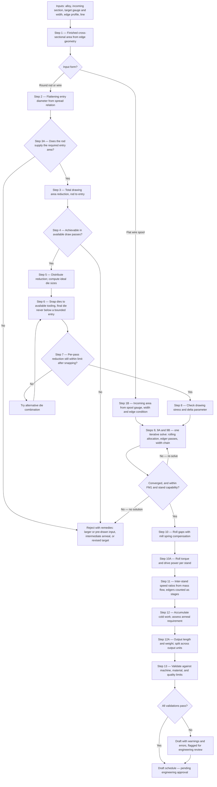
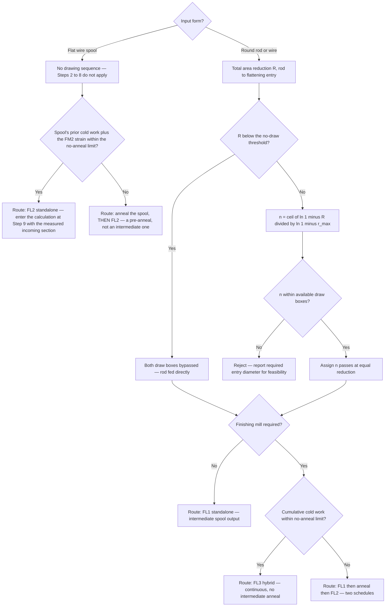

# Flat Wire Processing — Pass Schedule Generation Specification

**Project:** Flat Wire Mill
**Last Updated:** August 6, 2026
**Status:** Draft — Issued for Client Review and Sign-off

---

<!-- TOC -->

---

## Document Change History

| Version | Date | Changed By | Description |
|---|------|----------|-------------|
| 1.0 | Aug 1, 2026 | Analysis Team | Initial specification issued for client review — 13 sections, 23 data items (PSG-D01–D23), 26 open questions (PSG-Q01–Q26), 10 assumptions, 10 risks, 35 validations, 30 engineering rules, two worked examples, and a consolidated sign-off checklist |
| **1.1** | **Aug 4, 2026** | Analysis Team | **FM2 roller-size correction — three stands, `S1` = 8″, `S2` = 6″, `S3` = 6″.** v1.0 described a separate 8″ stand upstream of three 6″ stands; the 8″ roller **is S1** and there is no fourth stand. **Roll radius is a real input to three of this document's formulas, so this changes engineering content, not just labels.** §3.3.2 — the bite limit `Δh ≤ μ²R` is linear in `R`, so **S1 admits ~1.33× the draft** of a 6″ stand and the stands cannot share one radius. §3.3.6 — contact length `L_p = √(R′·Δh)` means **S1 sees ~1.16× the separating force** at equal draft, so `F_max` (**PSG-D10**) is required per stand, not per mill. §3.3.7 — `K` itself is diameter-independent but the gap inherits the force difference through `F/K`, so **PSG-D12** is likewise per stand. **§3.3.5's worked illustration is recomputed at `k` = 3**: for a 0.110″ final gauge the per-stand draft becomes **5.4% / 9.8% / 13.5%** (was 4.1% / 7.5% / 10.4% at `k` = 4) — total FM2 reduction is unchanged, since it depends only on entry and exit gauge. **PSG-Q10** now flags that equal draft loads unequal stands unequally; **PSG-Q11** corrected to *S1 and S2 bypassable, S3 not*; **PSG-Q13**'s regrind question is split **per stand**, since it had assumed every finishing roll was nominally 6.000″. The §7 roll-diameter input row and the available-stands row are corrected. **Worked Examples A and B are unaffected** — both are pure drawing arithmetic and report the roll gap as undetermined pending mill calibration. |
| **1.2** | **Aug 6, 2026** | Analysis Team | **Edging is a forming operation, not a knifing cut — client correction of 6 Aug 2026.** v1.0 and v1.1 described the edger as trimming or knifing and modelled the edge only through §3.3.4's area correction. United Aluminum's edgers are **vertical profiling rollers**: they **displace** width rather than removing it, so **nothing leaves the process and there is no scrap stream at the edger**. New **§3.3.11 — Edging as a Forming Operation** states the mechanism: an edger narrows width and pushes the displaced material into **length and a centre bulge**; the following stand flattens the bulge and the edge widens again; **the first edger also carries the section from round edge to square**; and the last 6″ pass at **S3 is a skim pass — light reduction, no edging** — sized for uniform cross-sectional area edge to edge rather than for gauge. **§3.3.4's area formulas are unchanged and remain correct** — they describe the finished *shape*; the new section describes the *operation that produces it*. **Edger position is stated exactly**: two devices, **between the stands** (S1↔S2 and S2↔S3), with **no edging capability at the mill exit** — the §2.3 route table and §3.3.9 are corrected accordingly, and *"edgers at S2 and S3"* is confirmed as meaning entry-side. §3.3.3's *"trimmed or upset"* wording is corrected: over-width material is **upset**, never trimmed, and the excess reappears downstream as length and thickness the schedule did not allocate. **Three new data items**: **PSG-D24** (maximum width reduction per edger pass), **PSG-D25** (the **partition coefficient** — how displaced width divides between length and bulge; **High**, and added to §12.3 as **critical blocker B5**, since without it the section entering S2 and S3 is unknown), **PSG-D26** (the round → square transition at E1). **Two new questions**: **PSG-Q27** (per-pass width reduction limit, and whether E1 and E2 differ) and **PSG-Q28** (how the S3 skim reduction is sized — the only pass in the schedule sized against a received profile rather than a gauge target). **PSG-Q12** retitled from *blade* to *roller* profiles. **B5 and B4 are one measurement campaign** — both concern how deformation divides between the section's dimensions — and trial production calibrating either should be instrumented for both. **Numbering note:** the new section is **§3.3.11**, at the end of the 3.3 group rather than beside §3.3.4, so that no existing §3.3.5–§3.3.10 cross-reference moves. |
| **1.3** | **Aug 6, 2026** | Analysis Team | **The 6 Aug corrections propagated into the calculation sequence — v1.2 stated the physics, this states its consequences.** Five of the thirteen steps in §6.3 assumed a clean, adjacent `S1 → S2 → S3` chain that the mill does not have. **Step 9 (rolling allocation) is rewritten**: the chain is `S1 → E1 → S2 → E2 → S3`, so it is now solved **backwards from the S3 skim**, subtracting each edger's thickness gain — and the sign matters, because the edger *raises* thickness going forward, so the upstream stand must deliver a *thinner* section than its neighbour receives; getting it backwards sets every FM2 gap too open. **New Step 9A — Edger passes** solves each edger explicitly (width taken against `PSG-D24`, mass balance, the partition into elongation and centre bulge via `PSG-D25`, the round→square check at E1 via `PSG-D26`). **Step 10** now takes `w̄` **post-edger** and `Δh` **including the upstream bulge** — the two errors run in opposite directions but do **not** cancel, since a few percent off width is not the same relative change as the bulge in a thin section. **Step 11** counts the **edgers as speed-changing stages**: they elongate, so `S1 → S2` is two ratios, not one, and the mismatch lands on the dancers that sit in exactly those positions. **Step 12 adds an edger term to `ε_total`** — the omission read **low**, and this check gates the **FL3 hybrid route**, the one route with no intermediate anneal, so the error was in the unsafe direction. **§3.3.5 restructured, and its illustration corrected for the second time.** Equal draft across three stands was the wrong *shape*, not just the wrong number: S3 is a skim pass. Bulk reduction now goes across the **reduction stands (S1, S2)** with S3 reserved, which **concentrates the load into two stands** — at a 0.170″ FM1 exit the bulk draft becomes **18.3%** against the 13.5% the equal-draft table implied, and that is the figure `PSG-D02`/`PSG-D10` must be checked against. The superseded `k` = 3 column is retained struck-through beside it. **A tension omission found while doing this:** §3.3.6's force model `F = w̄ · L_p · Q_p · σ̄_f` has **no tension term**, and `D-28`'s tension mode makes that live — applied tension reduces separating force, so in tension mode `F` is **over-predicted** (runnable schedules rejected) and the gap `S₀ = h_target − F/K` inherits the error and **delivers thin**. Added **`PSG-D27`** (inter-stand tension by mode) and **`PSG-Q29`** (is mode a schedule parameter or a machine setting). **Three new validations** — **V36** (edger width reduction within limit), **V37** (S3 reserved as a skim), **V38** (edger thickness gain carried forward, and flagged rather than silently solved at `Δt = 0`) — plus **V10**, **V20**, **V27** and **V30** amended, and §8.7's blocked-validation table extended. §6.1's flowchart gains the Step 9A node; the M4 and M8 master rows gain the edger and dancer fields. **Worked Examples A and B remain unaffected** — both are FL1 standalone, and **FL1 has no edger**, which Example A now says explicitly at Step 9A. |
| **1.4** | **Aug 6, 2026** | Analysis Team | **Gap audit of the whole document — twelve defects fixed, five of them algorithmic.** **(1) FL2 standalone had no path through the engine.** §2.3 lists FL2's input as a flat spool and §4.3's enum admits `FL2`, but §6.2 began at *"total area reduction, **rod** to flattening entry"* and every branch exited via FL1, FL3 or FL1→anneal→FL2 — while §6.2's own note claimed the tree existed precisely so a standalone FL2 schedule could be produced. The tree now **branches on input form** before anything else; a flat spool skips Steps 2–8 and enters at Step 9. **(2) §4.2 gained the incoming flat-section inputs** — gauge, width, edge condition — and **`Prior cold work` becomes mandatory on a spool input**, because Step 12's anneal gate otherwise starts from zero on material that has already been drawn and flattened, which is the unsafe direction. **(3) `no_draw_threshold` was used in §6.2 and Step 4 but never defined** — no value, no data item, no input row, no rule; it is now **`PSG-D28`**, and the 2% figure in the internal interface contract is explicitly **not adopted** pending engineering review. **(4) Die snapping could violate the bound it snapped from.** §3.3.3 states that `d = √(4·A_final/π)` is a **lower bound** and that using it as the answer produces under-width wire; Step 6 nonetheless snapped to *nearest*, and Worked Example A snapped **down**, 0.2902″ → 0.2900″. The final die now snaps **up** whenever the entry came from the bound — which is the expected state at go-live per `PSG-R01`, not an edge case — and **Example A is recomputed** (DB2 0.2950″, DB1 0.3350″, drafts 20.20% / 22.45%, `ε_drawing` 0.4799 on the snapped sequence). The down-snap passed every reduction check, which is why it needed a rule rather than a warning. **(5) Step 9A's partition function was undefined** — `Δt = φ · f(…)` with `f` unnamed, the only relation in the document without a named basis, so `PSG-D25` asked for a coefficient to a function that had not been stated. It is now written as **volume-constant strain decomposition**, the same structure as §3.3.3's spread model run in reverse, tagged **`[RECOMMENDED DEFAULT]`** — and §12.1's *"all governing formulas are established practice"* is corrected, since that is now true of drawing and rolling but not of edging. Whether the shape is right is **`PSG-Q31`**; the risk that it is not is **`PSG-R12`**. **Two dangling validations closed:** `V33` (take-up capacity) had **no calculation to evaluate** — new **Step 12A** derives output length and weight, and exceeding capacity **splits the order across units rather than failing it**; `V16` (finished temper) had **no method**, making target temper a mandatory input nothing consumed — now **`PSG-D29`**. **Consistency:** §4.3/§4.4 aligned with §5's `M4`/`M8` (they had disagreed since v1.2) and *blade* → *roller*; §6.6 gained six exception rows; §7 gained `R31`–`R36`, amended `R11`/`R15`/`R19`, and **its summary tally was wrong and is recounted** — it claimed 12/14/4 against a table holding 16/13/1, and now reads **18 `[INDUSTRY STANDARD]` / 16 client-input / 2 equipment of 36**; §12.4's *"four items"* corrected to five blockers. **Five new client items** — `PSG-D28`, `PSG-D29`, `PSG-D30`, `PSG-Q30`, `PSG-Q31` — plus `PSG-R11`/`PSG-R12` and validations `V39`/`V40`. Sign-off checklist now **30 data items and 31 questions**. |
| **1.5** | **Aug 6, 2026** | Analysis Team | **Second gap audit — eighteen defects, seven of them algorithmic. The recurring cause: a v1.2–v1.4 change made in one section and never carried into the sections that consume it.** **(1) Width was designed at one point on the line and nowhere else.** Step 2 solved the FM1 entry diameter from target width; Step 9A needed a width at each edger; Step 10 needed a mean width per stand — **and nothing computed the chain between them**. New **§3.3.12** and **Step 9B** do, and they surface a consequence nothing had stated: there is no edger at the mill exit, so **final width leaves S3**, which spreads — **E2 must be set narrow of target by the last stand's spread**, or every FL2 and FL3 coil runs over-width. `PSG-D08` is therefore **not an FL1-only item**; the flat→flat coefficient governs every finished coil. Width tolerance had been a mandatory input that **no calculation consumed** — now `V41`. **(2) Steps 9, 9A and 9B are mutually dependent and were written as three sequential steps.** Each needs an output of another; they are now stated as one **iterative solve** with a convergence tolerance, an iteration cap and the `Δt` = 0 fallback. **(3) Step 9 had no form for the FL2-standalone path v1.4 had just added** — it solved for `h_FM1_exit`, which does not exist on FL2. Split into **Step 9-Rod** (backward) and **Step 9-Spool** (forward from the measured gauge, with a remedy report — the rolling analogue of Worked Example B, which the document lacked); `k_bulk = 0` handled; the spool branch gains its own **pre-anneal** gate, since "intermediate anneal" is meaningless where there is no upstream stage. **(4) An undersize rod passed silently.** A rod smaller than the required entry gives `R < 0`, which satisfies Step 4's no-draw branch — so the engine bypassed both draw boxes and issued a warning-free schedule for a product that cannot be made. New **Step 3A** and `V43`. Not hypothetical: 0.375″ rod against 0.125″ × 0.875″ has **0.98% of area margin** where the flattening pass needs ~11% elongation. **(5) The bite condition was the wrong relation, on the wrong coefficient.** `PSG-D04` requested **one** number for die/wire *and* roll/material contact; the limit is **quadratic in `μ`**, so the 0.03–0.10 range spans ~**11×** in admissible draft — split into `PSG-D04` (drawing) and **`PSG-D31`** (rolling, **High**). And `Δh ≤ μ²R` is derived for a **flat** entry: applied to FM1's round entry it demands `μ ≥ 0.176` and **rejects §6.4's own nominal example**. Excluded, with the real criterion asked as **`PSG-Q32`**. §3.3.5's 18.3% draft is now checked against the limit — it needs `μ ≥ 0.088`, the top of the range, which §3.3.5 had not mentioned while naming only force and power as bounds. **(6) Three quantities were required but not calculable.** **Drive power** — `V21`, `R13` and blocker `B2` all depend on it and §3.3.6 calls it "often binding before force", yet no torque or power relation existed: added, with **Step 10A** and **`PSG-D34`**. **Tension** — `R34` was tagged `[INDUSTRY STANDARD]` with no relation named, so `PSG-D27`'s setpoints fed nothing: `σ̄_f,eff = σ̄_f − (σ_b + σ_f)/2` stated, one substitution moving both force and gap. **`Q_p`** — used in the force model with no relation, no default and **no id**: attributed to Sims/Ekelund and computed, not supplied. **(7) Cold work under-reported, in the direction Step 12 exists to catch.** `ln(A₀/A₁)` equals the **length** strain alone, so on a rolling pass it reports `(1−β)·ε_h` and on an edger pass `(1−φ)·\|ε_w\|` — at `φ` = 0.5 the edger term v1.3 added was understated **twofold**. New **§3.3.13** uses **equivalent strain** for rolling and edging, `ln(A₀/A₁)` unchanged for drawing. `ε_prior` was also **missing from the formula** although §4.2 makes it mandatory on a spool input. **Consistency:** `w_eff(d)` in Step 2 was undefined — the same defect v1.4 fixed for Step 9A's `f(…)` — now `w_eff(d) = d`, a definition folded into the calibration; **Step 1B** added for the incoming area, since *as-rolled* is a mandatory edge condition with no area formula (**`PSG-D33`**); the §6.1/§6.2 **interleave and its circularity** stated (the route gate needs Step 12's output while Step 2 needs the route); Step 12A now splits against the **planned output multiple** (**`PSG-D32`**) rather than the take-up **rating**, which differs by roughly **2×** and reported too few units; §3.3.11's *"S1 — round → flat"* corrected, since S1's entry is always already flat; edger **bypass** rules stated (**`PSG-Q33`**) — bypassing E1 removes the round→square transition, bypassing S2 leaves the edgers adjacent. **§8 gains a third outcome — *not evaluated* —** because a strict two-state rule means no schedule could be approved at go-live; **§8.7 was fifteen rows against forty validations** and is completed, including `V27`, an **Error** blocked on `PSG-D26` and previously unlisted, and `V31`/`V32`, blocked on data no item had requested (**`PSG-D35`**); `V02`–`V04`'s attribution to `PSG-D02` **corrected** — they are drawing checks, and no validation had enforced the rolling draft limits at all (`V44`). **§9 re-ordered**: five Medium items had come to sit above five High ones under a heading claiming priority order. **§7's recount was right but its prose was not** — `R29`/`R33` were called "four of the eighteen" `[INDUSTRY STANDARD]` rules when they are the two **Equipment** rules. `PSG-A01` cited "the alloys in §2", which contains none. `PSG-D12` added to blocker `B2`. **New:** `R37`–`R40`, `V41`–`V45`, `PSG-D31`–`D35`, `PSG-Q32`–`PSG-Q34`, `PSG-R13`/`R14`; `PSG-Q28` extended with the `R08`-vs-skim minimum-draft conflict; `PSG-Q30` re-filed under Production. Sign-off checklist now **35 data items and 34 questions**. **Not in this document, by design:** `FR-381`/`384`/`385`/`386`/`387` contradict this specification's arithmetic on five counts; that is recorded in `../MasterSpecification.md` §10 and `REVIEW.md`, since this document carries no story or requirement IDs. |

---

## Provenance Convention

Every quantitative statement in this document carries one of three tags. Please read them carefully
— they tell you exactly where we are asserting engineering fact and where we are asking you to
supply knowledge that only United Aluminum has.

| Tag | Meaning |
|---|---|
| `[INDUSTRY STANDARD]` | Established published practice or physical law. The governing relation is named at the point of use. |
| `[RECOMMENDED DEFAULT]` | A starting value we propose so development can proceed. Expected to be tuned against trial data. |
| `[CLIENT INPUT REQUIRED]` | We do not know this and will not guess. Shown as a blank awaiting your input. |

The most common pattern in this document is a **standard relation with plant-specific
coefficients** — the equation is `[INDUSTRY STANDARD]`, the numbers that go into it are
`[CLIENT INPUT REQUIRED]`. That combination is normal and appears throughout.

**No value specific to United Aluminum's alloys, mills, tooling, or products is asserted anywhere in
this document as known.**

---

# 1. Introduction

## 1.1 Purpose of This Document

This specification defines the engineering and functional requirements for a **pass schedule
generation engine** for the flat wire mill. It serves two purposes of equal weight:

1. It is the **engineering specification** — the calculations, decision logic, rules, and
   validations the engine must implement.
2. It is the **information request** — a structured checklist and questionnaire identifying every
   piece of process knowledge, engineering data, and business rule that United Aluminum must supply
   or confirm before implementation can begin.

Sections 9 and 10 are designed to be worked through directly by your process engineering and
operations staff, completed, and returned as the basis for sign-off.

## 1.2 What Pass Schedule Generation Is For

Today, a pass schedule is composed manually. An engineer decides which components are active, what
die sizes to fit, what roll gaps to set, and what dimensional targets to hold — drawing on
experience and on precedent from similar products. This works, but it is slow, it is difficult to
audit, it does not scale as the product mix grows, and the reasoning behind a given schedule lives
in the engineer's head rather than in a record.

A generation engine takes the product requirement — alloy, incoming rod size, target dimensions,
edge profile — and produces a **complete draft schedule** with every parameter calculated from
first principles and every constraint checked. The engineer's role shifts from composing the
schedule to **reviewing and approving** it.

## 1.3 Why Pass Schedules Matter

A pass schedule is the single record that determines whether a length of flat wire meets its
specification. It governs:

- **Dimensional accuracy** — whether the delivered gauge and width fall inside the customer's
  tolerance band.
- **Metallurgical condition** — how much cold work is imparted, and therefore the temper,
  formability, and electrical or mechanical properties of the finished product.
- **Process stability** — whether the wire runs without breaks, whether the mill can hold gauge,
  and whether tension between stages stays controlled.
- **Tooling life** — whether dies and rolls are loaded within their design envelope or worn
  prematurely.
- **Traceability** — the configuration in force when a given footage was produced, which is what a
  quality audit or a customer certificate resolves against.

A schedule that is wrong in the wrong way does not produce marginal product. It breaks wire, stalls
the line, or produces material that must be scrapped after the fact.

## 1.4 Objectives of the Generation Engine

| # | Objective |
|---|---|
| O1 | Produce a complete, dimensionally consistent draft schedule from product inputs alone |
| O2 | Apply established drawing and rolling mechanics rather than interpolation from precedent |
| O3 | Detect and clearly report targets that cannot be achieved on the available equipment |
| O4 | Make every calculated value traceable to the formula and the inputs that produced it |
| O5 | Never bypass human approval — the engine drafts, an engineer approves |
| O6 | Accept all plant-specific coefficients as configurable data, tunable without code changes |
| O7 | Improve over time as measured production data accumulates |

## 1.5 Scope

**In scope:** generation of a draft pass schedule covering the wire drawing sequence, the flattening
and finishing rolling sequence, roll gap settings, dimensional targets and tolerances, inter-stand
speed relationships, route selection, and the validation and warning framework around them.

**Not in scope:** order planning and sequencing; machine scheduling and capacity; the operator's
check-in and acknowledgement procedure; machine control and tag transmission; quality data
collection; certification and labelling. The engine produces a schedule record; what consumes it is
outside this document.

**Explicitly not in scope:** automatic activation of a generated schedule. Every generated schedule
is a **draft requiring engineering approval**. No generated output is ever transmitted to machine
control without a human approval step.

## 1.6 Assumptions

Stated fully in Section 11. In summary: that plant-specific coefficients will be supplied or
derived from trial production; that the equipment configuration described in Section 2 is accurate
and stable; and that a process engineer will review every generated schedule before it is used.

## 1.7 Intended Audience

| Audience | What they should read |
|---|---|
| **Process Engineering** | Sections 3, 6, 7 — the engineering basis. Sections 9, 10 — the data and decisions we need from you. |
| **Operations / Production** | Sections 2, 7, 8 — rules and validations. Section 9 — operational decisions. |
| **Quality** | Sections 7, 8 — tolerance and acceptance rules. Section 9 — quality criteria. |
| **Maintenance** | Sections 4, 5 — machine and tooling data. Section 9 — capability limits. |
| **Development team** | All sections; Section 6 is the implementation specification. |
| **Project management** | Sections 12, and the Client Sign-off Checklist. |

---

# 2. Pass Schedule Fundamentals

## 2.1 What a Pass Schedule Is

A **pass schedule** is the complete configuration record for converting a specific incoming material
into a specific finished product on a specific line. It specifies, for every stage of the line:

- whether that stage is **active or bypassed**
- the **tooling** fitted at that stage — die size, roll set, edger profile
- the **setting** applied — die diameter, roll gap
- the **dimensional target** leaving that stage, with its tolerance
- the **speed** or speed relationship at that stage
- the **route** the material takes through the plant

It is simultaneously a setup instruction, an engineering design record, and a traceability
artefact.

## 2.2 Why It Is Required

Metal cannot be taken from rod to finished flat wire in one step. Each reduction is limited by how
much deformation the material can absorb before it fractures, and by how much force the equipment
can apply. The total change must therefore be **divided into a sequence of passes**, each within
limits, arranged so that the sequence as a whole lands on target.

Choosing that division is pass schedule design. Divide too coarsely and the wire breaks or the mill
stalls. Divide too finely and throughput and tooling life suffer. Divide unevenly and dimensional
control degrades in the final pass, which is where it matters most.

## 2.3 The Flat Wire Process

The plant comprises three line configurations.

| | **FL1 (standalone)** | **FL2 (standalone)** | **FL3 (hybrid)** |
|---|---|---|---|
| Input | Rod or round wire at the payoff | Flat wire spool | Rod or round wire at the payoff |
| Sequence | Payoff → DB1 → DB2 → **FM1** → take-up | Payoff → **FM2** (**S1 8″ → S2 6″ → S3 6″**) → take-up | Payoff → DB1 → DB2 → FM1 → **FM2** → take-up, continuous |
| Output | Intermediate spool | Finished coreless coil | Finished coreless coil |
| **Edger** | **None** | Two, **between the stands** — S1↔S2 and S2↔S3. **None at the mill exit** | Two, between the stands, as FL2 |
| Intermediate anneal | Optional, off-line after the spool | Not applicable | **None** — bypassed by definition |

Two facts about this configuration shape the entire engineering discussion that follows:

1. **FL1 has no edger.** The width of flat wire leaving FM1 is not constrained by tooling. It is
   whatever **free lateral spread** produces. Width on FL1 is therefore a *predicted* quantity, not
   a *set* one — which makes the spread model (Section 3.3.3) load-bearing rather than academic.

2. **FL3 has no intermediate anneal, by definition.** Choosing the hybrid route commits the
   material to absorbing the entire cold work of drawing *and* flattening *and* finishing with no
   recovery step. Route selection is therefore a **metallurgical** decision, not only a geometric
   or scheduling one.

The line spans two physically distinct processes:

- **Wire drawing** (DB1, DB2) — the wire is pulled through a converging die. Deformation is
  compressive from the die wall and tensile along the axis. The limit is the **drawing stress**: the
  pulling force needed must remain safely below the strength of the wire that has just been drawn,
  or the wire simply snaps at the die exit.
- **Flat rolling** (FM1, FM2) — the material is compressed between rotating rolls. Deformation is
  compressive, driven by the rolls rather than by tension on the exit. The limits are **roll
  separating force** and **drive power**.

These obey different mechanics and different limits. Every engineering section below treats them
separately.

## 2.4 Manufacturing Objectives

A schedule must satisfy all of the following at once. Optimising any one alone produces a poor
schedule.

| Objective | What it constrains |
|---|---|
| Dimensional accuracy | Final gauge and width within customer tolerance |
| Edge condition | Round or square edge formed correctly and consistently |
| Surface finish | Freedom from die lines, roll marks, pickup, scoring |
| Metallurgical condition | Temper and formability appropriate to the product |
| Process stability | No breaks, no stalls, controlled tension throughout |
| Throughput | Fewest passes consistent with the above |
| Tooling life | Dies and rolls loaded within their design envelope |

## 2.5 Terminology

| Term | Definition |
|---|---|
| **Pass** | One deformation step — one die in drawing, one stand in rolling |
| **Draft** | The absolute thickness removed in a rolling pass, `h₀ − h₁` |
| **Reduction** | The proportional decrease in a dimension or in area, expressed as a fraction or percentage |
| **Area reduction** | `r = (A₀ − A₁) / A₀` — the primary measure in wire drawing |
| **Elongation** | The proportional increase in length, `l₁ / l₀` |
| **Spread** | The increase in width during a rolling pass — material displaced sideways rather than lengthways |
| **Spread coefficient** | The share of thickness strain that goes into width rather than length. Defined in §3.3.3 |
| **Draw ratio** | `A₀ / A₁` for a drawing pass |
| **Roll gap** | The distance between the rolls when unloaded. **Not** the delivered thickness — see mill spring |
| **Mill spring** | The elastic deflection of the mill under rolling load, which makes delivered thickness exceed the set gap |
| **Mill modulus** | The stiffness of the mill stand, relating roll separating force to that deflection |
| **Aspect ratio** | Width divided by thickness of the finished section |
| **Cold work** | Accumulated plastic strain imparted without recrystallisation, which raises strength and lowers ductility |
| **Anneal** | A heat treatment that relieves cold work and restores ductility |
| **Die semi-angle** | Half the included angle of the converging section of a drawing die |
| **Flow stress** | The stress at which the material deforms plastically, which rises as cold work accumulates |
| **Free spread** | Lateral spread that is not constrained by tooling — the condition on FL1 |

---

# 3. Industry Standard Pass Schedule Design

This section states the engineering basis. Section 6 turns it into an algorithm.

## 3.1 Pass Planning Methodology

The general method `[INDUSTRY STANDARD]`:

1. Establish the **finished cross-section** from the product specification, correctly accounting for
   edge geometry.
2. Establish the **incoming cross-section** from the rod specification.
3. Determine the **total deformation** required between them.
4. Determine how that total **divides between drawing and rolling** — the entry condition to the
   first flattening pass.
5. **Distribute** the drawing portion across the available dies, respecting the per-pass limit.
6. **Distribute** the rolling portion across the available stands, respecting force and power limits.
7. **Reserve the final pass** for dimensional control rather than bulk reduction.
8. **Validate** the whole sequence against material, machine, and quality limits.

Step 4 is the step most often skipped, and it is the one that determines whether the finishing mill
has anything to do. It is treated at length in §3.3.5.

## 3.2 Wire Drawing — DB1 and DB2

### 3.2.1 Area Reduction, and Why It Compounds

For a round section, area reduction per pass `[INDUSTRY STANDARD]`:

```
r = (A₀ − A₁) / A₀ = 1 − (d₁ / d₀)²          where A = π d² / 4
```

Reductions across successive passes **compound multiplicatively on the remaining area**. They do not
add. For `n` passes each at reduction `r`:

```
R_total = 1 − (1 − r)ⁿ
```

This is the single most consequential relation in the document, because the intuitive alternative —
that two passes at 25% give 50% — is wrong, and wrong in the unsafe direction.

| Passes | Per-pass limit | Naive sum | **True achievable total** |
|---|---|---|---|
| 2 | 20% | 40% | **36.00%** |
| 2 | 22% | 44% | **39.16%** |
| 2 | 25% | 50% | **43.75%** |
| 2 | 28% | 56% | **48.16%** |
| 3 | 25% | 75% | **57.81%** |

The gap between the naive and true figures is the band in which a schedule looks feasible on paper
and breaks wire in practice.

The governing relations `[INDUSTRY STANDARD]`:

```
Passes required:      n = ⌈ ln(1 − R_total) / ln(1 − r_max) ⌉

Equal distribution:   r_each = 1 − (1 − R_total)^(1/n)

Die diameters:        d_k = d₀ × (d_n / d₀)^(k/n)          for k = 1 … n
```

The die diameter relation is a **geometric progression**, which is precisely what delivers equal area
reduction at every pass. For two passes this reduces to the geometric mean, `d₁ = √(d₀ · d₂)`.

### 3.2.2 Per-Pass Reduction Limits

Typical practice for aluminium drawing is **15–30% area reduction per pass** `[INDUSTRY STANDARD]`,
most commonly 20–25%. The theoretical ceiling for an ideal perfectly-plastic material with no
friction and no redundant work is `1 − 1/e ≈ 63%` `[INDUSTRY STANDARD]`, but this is never
approached in practice.

The practical limit for each alloy is `[CLIENT INPUT REQUIRED]` — see **PSG-D01**. It depends on
purity, alloying, temper, work-hardening behaviour, die geometry, and lubrication, and it is best
established from your own experience and trial data.

> **A note on ordering.** Generally, higher-purity and lower-work-hardening alloys tolerate larger
> per-pass reductions than alloyed, work-hardening grades. We raise this because it is a useful
> cross-check when the limits are set: if the values assigned to the alloys do not follow that
> ordering, it is worth confirming the reason rather than assuming an error. See **PSG-Q02**.

### 3.2.3 Drawing Stress and the Safety Factor

The wire is pulled by tension applied *after* the die. That tension must be sufficient to deform the
material and overcome friction, but must remain **below the yield strength of the wire that has just
been drawn** — otherwise the wire elongates and fails at the die exit rather than deforming inside
it.

Siebel's relation for drawing stress `[INDUSTRY STANDARD]`:

```
σ_d = σ̄_f · [ (1 + μ/tan α) · ln(A₀/A₁) + (2/3) · α ]

  σ̄_f  mean flow stress across the pass          [CLIENT INPUT REQUIRED — PSG-D03]
  μ    coefficient of friction, die/wire          [CLIENT INPUT REQUIRED — PSG-D04]
  α    die semi-angle, radians                    [CLIENT INPUT REQUIRED — PSG-D05]
```

The three bracketed terms are the ideal deformation work, the friction work, and the redundant
(non-uniform) deformation work respectively.

The design criterion `[INDUSTRY STANDARD]`:

```
σ_d / σ_y(exit) ≤ 0.6          typical working limit
```

A value approaching 1.0 means the wire is being pulled at its own breaking strength. Common practice
is to keep a substantial margin `[RECOMMENDED DEFAULT: 0.6]`, with the working value confirmed by
your process engineering — **PSG-D06**.

### 3.2.4 Die Geometry and the Δ Parameter

Die semi-angle interacts with reduction to determine the character of the deformation. The governing
dimensionless group `[INDUSTRY STANDARD]`:

```
Δ ≈ α · (1 + √(1 − r))² / r
```

| Δ range | Consequence |
|---|---|
| Below ~1.5 | Long contact, high friction work, accelerated die wear and heat |
| **~1.5 – 3.0** | **The normal design window** |
| Above ~3.0 | Deformation concentrates at the surface; hydrostatic tension develops on the centreline; risk of **central bursting** (chevron cracking) |

Central bursting is particularly dangerous because it is an **internal** defect. The wire looks
sound, passes visual inspection, and fails later — potentially at the customer.

This check requires die semi-angle and bearing length to be known per die. Whether that data is
recorded for your tooling is **PSG-Q05**. If it is not available, the engine cannot perform this
check, and that limitation must be accepted knowingly.

### 3.2.5 Cold Work Accumulation

True (logarithmic) strain per pass `[INDUSTRY STANDARD]`:

```
ε = ln(A₀ / A₁) = −ln(1 − r)
```

Strain **accumulates additively** across passes, and continues accumulating through the flattening
and finishing stages. Total accumulated strain determines the temper of the finished product and
whether an intermediate anneal is required.

> **`ε = ln(A₀/A₁)` is exact for a drawing pass and only for a drawing pass.** Drawing is
> axisymmetric — the section reduces in both transverse directions together, and the area ratio
> captures the whole deformation. A **rolling** pass with spread and an **edging** pass do not behave
> that way, and using the area ratio on them **under-reports strain**. The correct measure for those
> passes is stated in §3.3.13; the accumulation rule here is unchanged.

The threshold at which an anneal becomes necessary is alloy-specific and product-specific, and is
`[CLIENT INPUT REQUIRED]` — **PSG-D07**. This matters directly for route selection, because the
hybrid route has no intermediate anneal by definition.

## 3.3 Flat Rolling — FM1 and FM2

### 3.3.1 Draft, Reduction, and Mass Flow

```
Draft:        Δh = h₀ − h₁
Reduction:    r = Δh / h₀
Mass flow:    A₀ · v₀ = A₁ · v₁          (constant through the line)
```

Mass flow continuity `[INDUSTRY STANDARD]` is what links the stands together. It is not optional
bookkeeping — if the speed relationship between two stands does not match their area relationship,
the material between them is either being stretched or piling up.

### 3.3.2 Bite Condition

A pass only draws material in if the roll geometry permits `[INDUSTRY STANDARD]`:

```
Δh ≤ μ² · R          where R is roll radius, μ the roll/material friction coefficient
```

A stand whose gap is set **at or above the incoming thickness performs no work at all** — there is
no roll bite, no separating force, and no reduction. This sounds obvious, but it is a common failure
mode in a poorly allocated schedule, and §3.3.5 explains how it arises.

> **`R` is per stand, and FM2's stands do not share a radius.** `S1` carries an **8″** roller
> (`R` = 4″); `S2` and `S3` carry **6″** rollers (`R` = 3″). The limit is linear in `R`.
> **S1 therefore admits about 1.33× the draft** of either 6″ stand at the same friction
> coefficient — a difference no allocation rule should ignore. Anything that
> allocates draft across the stands must read `RollDiameterIn` per stand rather than assume a single
> finishing-mill radius. FM1's roller is 12″ (`R` = 6″), which is why it takes the heaviest draft on
> the line. *(Corrected 4 Aug 2026 — the earlier four-stand model treated the finishing mill as
> uniformly 6″ with a separate 8″ pre-stage.)*

> **The `μ` in this relation is the roll/material coefficient, and it is not the drawing coefficient.**
> The die/wire friction of §3.2.3 and the roll/material friction here act on different contacts under
> different lubrication, and **the limit is quadratic in `μ`** — so a value carried across from
> drawing changes the admissible draft by the square of the error. The two are therefore requested
> separately: drawing friction is **PSG-D04**, rolling friction is **PSG-D31**. Do not populate one
> from the other.

> **This relation does not describe the round → flat pass, and must not be applied to it.**
> `Δh ≤ μ²R` is derived for a section entering with a **flat** top surface, where the contact angle is
> fixed by the roll radius alone. A round wire entering flat rolls presents its own curvature at the
> bite, the initial contact is a line rather than a plane, and the vertical dimension removed —
> `d_entry − h_exit` — is a large fraction of the entry section rather than a small draft. Evaluating
> the flat-entry limit on that pass produces a **false rejection**: at a 0.295″ entry, a 0.110″ exit
> and a 12″ roller it demands `μ ≥ 0.176`, well outside any lubricated value.
>
> This is the same class of caveat as §3.3.3's on spread — the round-to-flat first pass is a special
> case in *both* the width model and the bite model, and for the same reason. **The criterion United
> Aluminum actually uses to judge whether the flattening pass grips is `[CLIENT INPUT REQUIRED]` —
> PSG-Q32.** Until it is supplied, the bite check is reported as *not evaluated* on that pass rather
> than failed.
>
> **Which pass this is, exactly:** the round → flat pass is **FM1**, on FL1 and FL3. Every FM2 stand
> receives an already-flat section — from FM1 on FL3, from the spool on FL2 — so the standard limit
> applies unchanged at S1, S2 and S3.

### 3.3.3 Lateral Spread — Why Width Is Predicted, Not Assumed

When material is compressed in a rolling pass, the displaced volume divides between **elongation**
(length) and **spread** (width). How it divides is not a free choice — it is a property of the
geometry, the material, and the friction conditions.

Using logarithmic strains, volume constancy gives `[INDUSTRY STANDARD]`:

```
ε_h = ε_w + ε_l

  ε_h = ln(h₀ / h₁)      thickness strain
  ε_w = ln(w₁ / w₀)      width strain (spread)
  ε_l = ln(l₁ / l₀)      length strain (elongation)
```

Define the **spread coefficient**:

```
β = ε_w / ε_h            so that  ε_l = (1 − β) · ε_h

  β = 0    plane strain — no spread, all elongation
  β = 1    no elongation — all spread
```

Real flat rolling sits between these, and `β` must be **calibrated from measured production data**.
The classical empirical treatments — Wusatowski, Ekelund, El-Kalay & Sparling, Shinokura & Takai
`[INDUSTRY STANDARD]` — were developed for flat-to-flat rolling of slab and wide strip. They provide
the functional form but their coefficients are not transferable to this application without
calibration.

> **The round-to-flat first pass is a special case.** Classical spread formulas assume a rectangular
> entry section. The first flattening pass at FM1 has a **round** entry, where "entry width" is not
> a well-defined quantity, and the contact geometry differs fundamentally. Published strip-rolling
> spread relations should not be applied to it directly. This pass needs its own empirical relation,
> calibrated from your trial data. This is **PSG-D08** and is among the highest-priority items in
> this document.

**Why this matters most on FL1.** With no edger at FM1, spread is entirely free. The delivered width
is whatever the entry diameter and the reduction produce. To hit a target width, the engine must
solve **backwards** — choosing the entry diameter that will spread to the required width. Without a
calibrated spread relation, that calculation cannot be performed, and width becomes an outcome to be
measured rather than a target to be designed.

On FM2, the edgers constrain width — but they *correct* spread, they do not eliminate the need to
predict it. Material arriving substantially over-width is **upset** at the edger rather than gently
sized, and because the edgers **form rather than cut** (§3.3.11), that excess width is not removed —
it is driven back into the section as extra length and thickness, arriving at the next stand as
material the schedule did not allocate for. Material arriving under-width cannot be widened at all.

**And the final FM2 pass is unedged.** S3 spreads, and there is no edger after it, so the delivered
width of every FL2 and FL3 coil is set by free spread on the last pass exactly as it is on FL1. The
chain that combines stand spread with edger narrowing — and the pre-compensation E2 therefore needs —
is §3.3.12.

**A common simplification, and why it is not safe.** It is tempting to derive the required entry
diameter by equating the round wire's area to the finished flat area:

```
d = √(4 · A_final / π)
```

This assumes the flattening pass produces **no elongation** — that all thickness strain converts to
width. That is the `β = 1` extreme. Since real flattening produces substantial elongation, the true
required entry diameter is **larger** than this expression gives, and the expression should be
treated only as a **lower bound**:

```
d_entry ≥ √(4 · A_final / π)
```

Using it as the answer rather than as a bound produces flat wire that is **under-width**.

### 3.3.4 Edge Geometry and Cross-Sectional Area

The finished cross-section is not a rectangle unless the edge is square `[INDUSTRY STANDARD]`:

| Edge profile | Cross-sectional area |
|---|---|
| **Square edge** | `A = t · w` |
| **Round edge** | `A = t · w − t² · (1 − π/4) = t · w − 0.2146 · t²` |

The round-edge section is a rectangle with semicircular ends. The correction is small in absolute
terms but not negligible: for a 0.110″ × 0.625″ section it is **3.8% of area**, which translates to
roughly 2% on the required entry diameter. That is larger than typical die increments, so it
propagates directly into die selection.

Edge profile is a required input to the area calculation, not merely a tooling setting.

These formulas describe the **finished shape**. The **operation that produces it** — the edgers,
which roll-form rather than cut, and which feed the removed width back into the section — is
§3.3.11, and it must be modelled separately.

### 3.3.5 Pass Allocation Between FM1 and FM2

This is the step that determines whether the finishing mill does useful work.

When a finishing mill follows a flattening mill, the **total rolling reduction must be distributed
across all active stands**. The upstream mill must deliver an **intermediate** gauge; the finishing
stands step it down to final.

The failure mode is straightforward and worth stating plainly. If FM1 is set to deliver the *final*
gauge, then every FM2 stand downstream is presented with material already at target. Any gap set at
or above that thickness achieves no bite (§3.3.2), takes no load, and performs no work. The finishing
mill spins while the material passes through untouched — and final dimensional control, which is
supposed to be the finishing mill's job, is left entirely to FM1.

The classical allocation, for `k` stands at equal draft `[INDUSTRY STANDARD]`:

```
Per-stand draft:        d_stand = 1 − (h_final / h_entry)^(1/k)

Required FM1 exit:      h_entry = h_final / (1 − d_stand)^k
```

**Two features of this mill mean the expression above cannot be applied to it directly**, and both
were established by United Aluminum on 6 Aug 2026:

1. **S3 is a skim pass, not a reduction pass.** It takes a light reduction with no edging, sized to
   deliver uniform cross-sectional area edge to edge after the second edger (§3.3.11). It is a
   **profile-correction** stand, and treating it as one third of the bulk reduction over-loads it and
   defeats its purpose.
2. **The stands are not adjacent.** The real chain is **S1 → E1 → S2 → E2 → S3**, and each edger
   *raises* thickness through the centre bulge (§3.3.11). So S2's entry thickness is **not** S1's
   exit thickness, and the geometric chain `h · (1−d)^k` does not describe the material.

**Corrected structure.** Bulk reduction is distributed across the **reduction stands** — S1 and S2
when both are active — and S3 is reserved:

```
Skim allowance:        h_S3_entry = h_final / (1 − s)          s = skim reduction (PSG-Q28)

Bulk stands:           k_bulk = count of active reduction stands (S1, S2)
Per-stand draft:       d_bulk = the target draft for those stands (PSG-D09)

Required FM1 exit:     h_FM1_exit = solved BACKWARDS from h_S3_entry through
                       the chain S1 → E1 → S2 → E2, subtracting each edger's
                       thickness gain — §6.3 Step 9 states it in full
```

The exit gauge cannot be written as a single closed expression the way `h · (1−d)^k` could, because
the chain is no longer uniform: two stand reductions alternate with two edger *gains*. §6.3 Step 9
walks it stand by stand, which is the only form that keeps the edger terms visible.

**Worked illustration.** For a 0.110″ final gauge, with an *illustrative* 3% skim at S3 — a
placeholder to carry the arithmetic, **not a proposed value** (`PSG-Q28`):

| FM1 exit gauge | Total FM2 reduction | S1 draft | S2 draft | S3 skim | *(superseded: equal `k`=3)* |
|---|---|---|---|---|---|
| 0.130″ | 15.4% | **6.6%** | **6.6%** | *3.0%* | ~~5.4% each~~ |
| 0.150″ | 26.7% | **13.1%** | **13.1%** | *3.0%* | ~~9.8% each~~ |
| 0.170″ | 35.3% | **18.3%** | **18.3%** | *3.0%* | ~~13.5% each~~ |

Carving out the skim **concentrates the bulk reduction into two stands rather than three**, so S1 and
S2 each work materially harder than the equal-draft figures implied — at the heaviest entry gauge,
18.3% against 13.5%. That is the figure `PSG-D02` and `PSG-D10` must be checked against, and it is
where an FM1 exit gauge of 0.170″ is most likely to prove infeasible.

**The bulk figures above are still provisional in one respect:** they ignore the thickness the edgers
add back between stands. Until `PSG-D25` is calibrated, the true entry at S2 is unknown, so the split
between S1 and S2 cannot be closed. The *structure* — bulk across the reduction stands, S3 reserved —
is settled; the *numbers* are not.

What remains true regardless: FM1 delivering 0.110″ leaves every stand with nothing to do.

> **History.** This allocation has been corrected twice. **4 Aug 2026:** recomputed from `k` = 4 to
> `k` = 3 when FM2 turned out to have three stands (the table read 4.1% / 7.5% / 10.4% at `k` = 4,
> then 5.4% / 9.8% / 13.5% at `k` = 3). **6 Aug 2026:** restructured again, because equal draft across
> all three was the wrong *shape* — S3 is a skim pass and the stands are separated by edgers. The
> total-reduction column has never changed, since it depends only on entry and exit gauge.

> **The bulk drafts above are not checked against the bite limit, and that limit may bind first.**
> §3.3.2 gives `Δh ≤ μ²R`. At the heaviest row — 18.3% of 0.170″, so `Δh` = 0.0311″ — S1's 4″ radius
> demands `μ ≥ 0.088`. The friction range this document offers as a starting point for *drawing* is
> 0.03–0.10, and because the limit is **quadratic in `μ`** that range spans about **11× in admissible
> draft**. So across much of it the **bite condition, not force, is the binding constraint** — which is
> why rolling friction is requested separately as **PSG-D31** and why the bound list below names it.
>
> This is stated rather than resolved deliberately: the drafts in the table are illustrative and the
> coefficient that decides whether they are reachable is not yet supplied.

The preferred per-stand draft for your finishing mill is `[CLIENT INPUT REQUIRED]` — **PSG-D09**.
It is bounded above by **the bite limit** (§3.3.2, through `PSG-D31`), by **roll separating force**
and by **drive power**, and below by the need for enough load to hold gauge stably. **Two distribution
questions follow, and they are separate.** First, the three
stands do not share a roll diameter — S1's 8″ roller admits about **1.33×** the draft of a 6″ stand
(§3.3.2) but develops about **1.16×** the force at equal draft (§3.3.6) — so state whether you want
equal draft across S1 and S2 or a split weighted toward S1 (**PSG-Q10**). Second, state the skim
reduction at S3, or the rule for computing it (**PSG-Q28**).

### 3.3.6 Rolling Force and Machine Limits

Roll separating force `[INDUSTRY STANDARD]`:

```
F = w̄ · L_p · Q_p · σ̄_f

  L_p = √(R' · Δh)      projected contact length
  R'                     deformed roll radius (Hitchcock flattening)
  Q_p                    geometry/friction factor — Sims / Ekelund, see below
  σ̄_f                   mean flow stress across the pass
  w̄                     mean width
```

Force and drive power set the real ceiling on draft per stand — well before any material limit is
reached. Both are machine properties and are `[CLIENT INPUT REQUIRED]` — **PSG-D10**, **PSG-D11**.
These normally come from the mill builder's datasheet.

**`Q_p` and `σ̄_f` are computed, not supplied.** Neither is a plant constant, and both were previously
listed in the expression without a stated origin:

- **`Q_p`** follows the standard cold-rolling pressure-multiplier treatments — **Sims**, or **Ekelund**
  where friction dominates `[INDUSTRY STANDARD]`. It is a function of `L_p / h̄` and the rolling
  friction coefficient (**PSG-D31**), not an independent input. The engine evaluates it; no client
  value is required.
- **`σ̄_f`** is the **mean flow stress across the pass**, obtained by integrating the work-hardening
  curve (**PSG-D03**) between the entry and exit strains and dividing by the strain increment
  `[INDUSTRY STANDARD]`. The arithmetic mean of the entry and exit values is an acceptable
  approximation for light passes and understates `σ̄_f` on heavy ones. The same curve supplies
  `σ_y(exit)` for §3.2.3's criterion, evaluated at the accumulated strain leaving the pass.

**Drive power, stated explicitly.** §3.3.6 previously named drive power as a limit and requested its
rating without giving a relation to check it against, which left the power validation with nothing to
evaluate. Roll torque and power follow from the separating force `[INDUSTRY STANDARD]`:

```
Torque per stand:   M = F · a               a = λ · L_p    the lever arm
Power per stand:    P = 2 · M · ω           ω = v / R      roll angular velocity

  λ    lever-arm coefficient, typically 0.4–0.5 for cold rolling
       [RECOMMENDED DEFAULT: 0.45]  —  confirm as PSG-D34
```

The factor of two counts both rolls. `P` is compared against **PSG-D11** per stand, and because it
carries the line speed it can bind at a draft the force check passes — which is why §3.3.6 describes
it as "often binding before force."

> **Contact length carries the roll radius, so force differs by stand.** `L_p = √(R′ · Δh)` means that
> at equal draft, **S1 (8″ roller) sees roughly 1.16× the separating force** of S2 or S3 (6″), since
> √(8/6) ≈ 1.155. The larger roll admits more draft (§3.3.2) but pays for it in force — the two limits
> pull in opposite directions, which is exactly why `F_max` must be supplied **per stand** and not as
> one finishing-mill figure. *(Clarified 4 Aug 2026 with the roller-size correction.)*

> **The expression above has no tension term, and on this mill that is a live omission.** United
> Aluminum confirmed on 6 Aug 2026 that the **two inter-stand dancers can run in tension mode** as
> well as dancer mode. Applied front and back tension **reduces the separating force** — the standard
> result is that tension substitutes for roll pressure in achieving the same draft `[INDUSTRY
> STANDARD]`. Two consequences follow directly:
>
> - **In tension mode, `F` computed here is over-predicted**, so a schedule may be rejected against
>   `F_max` that the mill would in fact run.
> - **The roll gap is wrong in the same direction.** `S₀ = h_target − F/K` (§3.3.7) inherits the
>   force error, so a gap set from an untensioned force estimate delivers thin.
>
> The engine therefore needs to know **which mode each position runs in, and at what setpoint** —
> `[CLIENT INPUT REQUIRED]`, **PSG-D27**, with the schedule-shape question at **PSG-Q29**. Until they
> are supplied, schedules should be generated on the untensioned force model and flagged as such;
> that is the conservative direction for `F_max`, but **not** for gauge.

**The relation, stated.** Naming the effect without naming the relation left `PSG-D27` asking for
setpoints that nothing could consume. Applied tension reduces the roll pressure needed for the same
draft by displacing part of the deformation load into the strip `[INDUSTRY STANDARD]` — the standard
first-order treatment substitutes a tension-corrected mean flow stress into the force expression:

```
σ̄_f,eff = σ̄_f − (σ_b + σ_f) / 2

  σ_b   back tension stress, entry side      = T_b / A_entry
  σ_f   front tension stress, exit side      = T_f / A_exit
  T     applied tension, lbf                 [CLIENT INPUT REQUIRED — PSG-D27]

Then    F = w̄ · L_p · Q_p · σ̄_f,eff        and    S₀ = h_target − F / K
```

`σ̄_f,eff` replaces `σ̄_f` everywhere in §3.3.6 and §3.3.7, so **both** the `F ≤ F_max` check and the
gap follow from one substitution. In **dancer mode** the tension terms are zero and the expressions
reduce to the untensioned form. Where a stand runs at a tension approaching its own flow stress the
first-order form loses accuracy and a Bland–Ford treatment is required; that is outside the operating
range these dancers are expected to work in, and is noted so the limit of the model is on the record.

### 3.3.7 Roll Gap and Mill Spring

**Delivered thickness is not the set roll gap.** Under load, the mill stand deflects elastically,
and the gap opens. The gaugemeter relation `[INDUSTRY STANDARD]`:

```
h₁ = S₀ + F / K

  S₀   unloaded roll gap setting
  F    roll separating force
  K    mill modulus (stand stiffness)      [CLIENT INPUT REQUIRED — PSG-D12]
```

To deliver 0.110″ with a deflection of 0.004″, the gap is set to 0.106″. The compensation is
therefore always **negative** — the set gap is below the target gauge.

The critical property is that **`F/K` is load-dependent**. A wide, heavy-reduction pass deflects the
stand far more than a light, narrow one. A fixed percentage offset per alloy cannot express this: it
will be approximately right at one width and reduction, and progressively wrong away from that
point.

> **`K` is stand stiffness and does not depend on roll diameter — but `F` does.** The set gap at S1
> therefore differs from a 6″ stand's even at identical draft and width, through the force term
> (§3.3.6). Supply `K` per stand as well as `F_max`; the compensation cannot be shared across the
> three stands.

> **Terminology.** This effect is *mill spring*, sometimes *mill stretch* or *roll-force
> compensation*. It is a property of the **machine**, not the material. It should not be conflated
> with *springback*, which is elastic recovery in bending and is a material property. They are
> different phenomena with different causes, and treating a machine stiffness as an alloy constant
> obscures the fact that it must be measured by mill calibration under load.

Mill modulus is determined by loading the mill against itself and measuring deflection against force.
Whether this calibration exists for your stands is **PSG-Q08**.

### 3.3.8 Speed and Speed Ratios

A distinction that materially reduces what must be supplied:

- **Absolute line speed** depends on machine capability, product, surface finish requirement, and
  operator judgement. It is `[CLIENT INPUT REQUIRED]` and we understand it is to be established from
  trial production and held as configuration.

- **Inter-stand speed ratios are not a matter of judgement.** They follow directly from mass flow
  continuity `[INDUSTRY STANDARD]`:

```
v₁ / v₀ = A₀ / A₁
```

Since the engine computes every intermediate area, it can and should compute every speed ratio. Only
the absolute datum needs to be supplied. Getting these ratios wrong is what produces broken wire
between stands, or loops of accumulating material.

### 3.3.9 Surface Finish and Edge Profile

Surface finish is governed by roll and die surface condition, lubrication, reduction per pass, and
speed. Heavy reductions in a finishing pass degrade finish; light finishing passes improve it. This
is a further reason to reserve the last pass for dimensional control rather than bulk reduction
`[INDUSTRY STANDARD]`.

Edge profile is formed by the two edgers, which sit **between the stands** — S1↔S2 and S2↔S3 — and
which **roll-form rather than cut** (§3.3.11). Whether roller profiles are standard across products
or vary by edge type or alloy determines whether the schedule must specify a profile. This is already
registered as an open engineering item with your maintenance group; the pass schedule implication is
noted here as **PSG-Q12**.

The reservation of the last pass for finish has a second, independent reason on this line: **S3 is a
skim pass with no edging**, sized to deliver uniform cross-sectional area edge to edge after the
second edger (§3.3.11). Finish and profile correction are the same pass.

### 3.3.10 Tolerance and Process Capability

Tolerance bands must be **achievable**, not merely specified. A band tighter than the process's
natural variation guarantees rejections regardless of schedule quality. Where a customer tolerance is
tighter than demonstrated capability, the schedule should compensate — additional light finishing
passes, reduced speed — or the target should be challenged.

Tolerance defaults per alloy and the process capability data to check them against are
`[CLIENT INPUT REQUIRED]` — **PSG-D13**.

### 3.3.11 Edging as a Forming Operation

**The edgers do not cut. They form.** United Aluminum's edging devices are **vertical profiling
rollers**, and the distinction is not terminological — it changes the mass balance the whole schedule
is built on `[CLIENT CONFIRMED — August 6, 2026]`.

A knifing or slitting edger *removes* material: width leaves the section and leaves the process, as
scrap. A profiling edger *displaces* it: the width is pushed back into the body of the section, and
**nothing leaves**. There is no scrap stream at the edger, and any calculation that treats edging as
a trim will under-predict both length and thickness downstream of it.

**Where the edgers sit.** Two devices, both **between stands** — one between **S1 and S2**, one
between **S2 and S3**. **There is no edging capability on the exit side of the mill.** The finishing
sequence is therefore:

```
S1 (8″)  →  E1  →  S2 (6″)  →  E2  →  S3 (6″)
```

**What each element does to the section:**

| Element | Effect |
|---|---|
| **S1** | The first FM2 draft. Its entry is **already flat** — from FM1 on FL3, from the spool on FL2 — and its spread is **free**, because nothing constrains width until E1 (§3.3.3). *(The round → flat conversion is FM1's, not S1's; the "round" in E1's row below is the **edge** shape, not the section.)* |
| **E1** | Narrows width. The displaced material expands **laterally and longitudinally** — length increases and the section **bulges at mid-width**, so thickness rises slightly. **E1 also carries the section from round edge to square edge** |
| **S2** | Flattens the bulge out. **The edge widens again**, because the material the edger pushed inward is now pushed back outward |
| **E2** | Narrows the width back out, at the tighter tolerance the near-final section allows |
| **S3** | The last draft, then a **skim pass** — **light reduction, no edging**. Its purpose is a **uniform cross-sectional area from edge to edge**, not gauge |

Three consequences for the engine, each of which the current model gets wrong if edging is treated
as a trim:

1. **The edger is its own operation, with its own formulas.** It is neither a drawing pass (§3.2)
   nor a rolling pass (§3.3.1) — the deformation is transverse, the tooling is a profile roller, and
   the limits are its own. It belongs in the calculation sequence (§6.3) as a distinct step between
   stands, not as an attribute of the stand that follows it.

2. **Mass is conserved, so width reduction reappears.** For an edger pass, with `w`, `t` and `L` the
   width, thickness and length:

   ```
   Mass balance:      w_in · t_in · L_in  =  w_out · t_out · L_out
   Partition:         the width removed (w_in − w_out) divides between
                      length increase and thickness increase
   ```

   The **partition coefficient** — how much goes to length and how much to the centre bulge — is the
   one quantity that cannot be derived from geometry alone. It depends on alloy, on the roller
   profile, and on how much width is taken in the pass. It is **`PSG-D25`**, and it is on the same
   footing as the free-spread relation `PSG-D08`: without it, the section entering S2 and S3 is
   unknown, and the finishing drafts are being allocated against a guessed entry thickness.

3. **The bulge is not uniform across the width, and the skim pass is what removes it.** After an
   edger the section is thicker at mid-width than at the edges. S2 flattens the first bulge; the
   **S3 skim pass** exists to take out the second and deliver constant area edge to edge. Its
   reduction is therefore set by the **profile it receives**, not by a gauge target — which is a
   different sizing rule from every other pass in the schedule (**PSG-Q28**).

**What the edger cannot do.** It **narrows**; it never widens. Material arriving under-width cannot
be recovered at the edger, exactly as §3.3.3 states. Material arriving substantially over-width is
**upset** — driven back into the section — which raises thickness and length beyond what the schedule
allocated, so gross over-width is a schedule defect, not something the edger absorbs quietly.

> **Why this section exists.** Earlier issues of this document described the edger as trimming or
> knifing, and modelled the edge only through the area correction in §3.3.4. That correction remains
> correct — a round-edged section is still `A = t · w − 0.2146 · t²` — but it describes the
> **finished shape**, not the **operation that produces it**. Both are needed.

**Bypassing an edger.** A pass schedule states active or bypassed for every stage (§2.1), and Step 9A
solves only the **active** edgers — so the bypass case must be stated rather than left to the
implementer. Two consequences are not obvious:

- **Bypassing E1 removes the round → square edge transition**, which is E1's and only E1's
  (**PSG-D26**). A square-edge product therefore cannot be produced with E1 bypassed, whatever E2
  does — E2 sizes width on a section whose edge shape is already set.
- **Bypassing S2 leaves E1 and E2 adjacent**, so the centre bulge E1 raises is never flattened before
  E2 takes its own width reduction. Two consecutive edging passes with no intervening flattening is
  outside the sequence §3.3.11 describes, and the partition model (`PSG-D25`) is calibrated on a
  bulge-then-flatten cycle rather than a bulge-on-bulge one.

The rules governing which bypass combinations are permitted are `[CLIENT INPUT REQUIRED]` —
**PSG-Q33**.

The three data items this section requires — **`PSG-D24`** (width reduction limit per edger pass),
**`PSG-D25`** (the partition coefficient), **`PSG-D26`** (the round → square transition at E1) — are
in §10.3, and the two open questions are **`PSG-Q27`** and **`PSG-Q28`** in §10.

### 3.3.12 Width Through the Finishing Chain

§3.3.3 establishes that width must be **predicted**. §3.3.11 establishes that the edgers **narrow**
it. What neither states is how the two combine across the chain — and without that, width is designed
at exactly one point on the line and nowhere else.

**Every stand widens; every edger narrows.** Applying §3.3.3's spread coefficient at each stand and
§3.3.11's partition at each edger gives the chain `[INDUSTRY STANDARD]`:

```
At a stand:   w_out = w_in · exp(β · ε_h)          ε_h = ln(h_in / h_out)      widens
At an edger:  w_out = w_in − Δw                                                narrows
```

**The consequence that changes the design direction: the last pass is a stand, not an edger.** There
is no edging capability at the mill exit (§3.3.11), so **final width leaves S3** — and S3, being a
rolling pass, spreads. The width the customer receives is therefore *not* the width E2 sets. E2 must
be set **narrow of target** by exactly the spread S3 will add:

```
w_E2_out = w_target / exp(β_S3 · ε_h,S3)
```

This is the same problem §3.3.3 calls "load-bearing rather than academic" on FL1 — a delivered width
set by free spread on an unedged pass — and it applies to **every** FL2 and FL3 schedule, on the one
pass where the tolerance is tightest. It is worth stating plainly: **`PSG-D08` is not only an FL1
item.** The flat→flat spread coefficient governs the final width of every finished coil.

**Two failure modes this closes.** Setting E2 *at* target width delivers **over-width** product, by
S3's spread. Ignoring the chain altogether leaves the width tolerance in §4.1 as a **mandatory input
that no calculation consumes** — the engine would accept a tolerance band, never compare anything to
it, and report no width finding either way.

### 3.3.13 Accumulated Strain in Passes That Are Not Axisymmetric

§3.2.5 gives `ε = ln(A₀/A₁)` for a drawing pass. That is correct there and **wrong when carried
forward** to rolling and edging, for a reason worth showing rather than asserting.

For any volume-constant pass, `ln(A₀/A₁) = ε_h − ε_w = ε_l`. So on a **rolling** pass with spread the
area ratio equals `(1 − β)·ε_h` — the **length** component alone — and on an **edging** pass it equals
`(1 − φ)·|ε_w|`. In both cases the width and thickness components of the deformation are discarded, and
the strain reported is **lower than the strain imparted**. At `φ` = 0.5 the edger term is understated by
about a factor of two.

The measure that does not discard them is the **equivalent (von Mises) strain** `[INDUSTRY STANDARD]`:

```
ε_eq = √( (2/3) · (ε_w² + ε_t² + ε_l²) )          with  ε_w + ε_t + ε_l = 0
```

For a drawing pass this reduces to `ln(A₀/A₁)`, so §3.2.5 is unchanged. For rolling and edging it does
not, and the difference is in the unsafe direction: **Step 12's cumulative strain gates the FL3 hybrid
route**, the one route with no intermediate anneal. Under-reporting strain errs toward selecting hybrid
for material that cannot absorb the cold work — the exact failure the check exists to prevent.

> **This is the same argument v1.3 used to add the edger term at all**, applied one level deeper. Adding
> a term computed the wrong way recovers only part of what was missing.

## 3.4 Optimisation Strategy

With constraints satisfied, a residual choice remains. The recommended objective, in priority order
`[RECOMMENDED DEFAULT]`:

1. **Feasibility** — satisfy every hard constraint. Non-negotiable.
2. **Dimensional control** — reserve the final pass for accuracy, keeping its reduction light.
3. **Fewest passes** — subject to 1 and 2.
4. **Balanced loading** — distribute remaining reduction evenly, avoiding one heavily loaded pass.
5. **Tooling life** — prefer die and roll sizes already in service where the difference is marginal.

Confirmation of this priority order is **PSG-Q15**.

---

# 4. Required Inputs

Inputs grouped by origin. "Client must supply" indicates whether the value must come from United
Aluminum rather than being derived by the engine or read from the order.

## 4.1 Product and Order Inputs

| Input | Description | Unit | Type | M/O | Example | Source | Client supplies |
|---|---|---|---|---|---|---|---|
| Alloy | Alloy designation | — | Text | **M** | 1100 | Order | No |
| Temper (target) | Required finished temper | — | Text | **M** | H14 | Order / customer spec | No |
| Target thickness | Finished gauge | in | Decimal (4 dp) | **M** | 0.1100 | Order | No |
| Target width | Finished width | in | Decimal (4 dp) | **M** | 0.6250 | Order | No |
| Edge profile | Round or square | — | Enum | **M** | Round | Order | No |
| Gauge tolerance | Permitted deviation, − / + | in | Decimal (4 dp) | **M** | −0.0020 / +0.0020 | Customer spec | **Yes** — defaults |
| Width tolerance | Permitted deviation, − / + | in | Decimal (4 dp) | **M** | −0.0050 / +0.0050 | Customer spec | **Yes** — defaults |
| Surface finish requirement | Finish class or specification | — | Text | O | — | Customer spec | **Yes** |
| Precision / certification flag | Requires enhanced traceability or tighter control | — | Boolean | O | true | Customer spec | **Yes** |
| Order quantity | Total footage or weight required | ft / lb | Decimal | O | 12,000 | Order | No |
| Order quantity unit | **Which of the two the quantity is.** Step 12A converts one to the other and cannot infer which was given | — | Enum | O³ | lb | Order | No |

> ³ Mandatory whenever order quantity is supplied.

## 4.2 Incoming Material Inputs

| Input | Description | Unit | Type | M/O | Example | Source | Client supplies |
|---|---|---|---|---|---|---|---|
| **Input form** | **Round rod / wire, or an already-flattened spool.** Selects whether the drawing sequence applies at all (§6.2) | — | Enum | **M** | Rod | Material record | No |
| Rod diameter (nominal) | Incoming rod size — **rod input only** | in | Decimal (4 dp) | **M**¹ | 0.3750 | Material record | No |
| Rod diameter tolerance | Acceptance band | in | Decimal (4 dp) | **M**¹ | ±____ | Material spec | **Yes** |
| Rod ovality limit | Max out-of-round | in | Decimal (4 dp) | O | ____ | Material spec | **Yes** |
| **Incoming gauge** | Thickness of the incoming flat section — **spool input only** | in | Decimal (4 dp) | **M**² | 0.1500 | Spool record | No |
| **Incoming width** | Width of the incoming flat section — **spool input only** | in | Decimal (4 dp) | **M**² | 0.6100 | Spool record | No |
| **Incoming edge condition** | Edge already formed on the spool — as-rolled, round, square. **Selects the incoming area formula** (§6.3 Step 1B); the as-rolled geometry is **PSG-D33** | — | Enum | **M**² | As-rolled | Spool record | No |
| Incoming temper / condition | As-cast, as-drawn, annealed | — | Text | **M** | O | Material record | No |
| Prior cold work | Strain already imparted upstream | — | Decimal | O¹ / **M**² | 0.00 | Material record | **Yes** — availability |
| Yield strength | At incoming condition | psi | Decimal | **M** | ____ | Material property data | **Yes** |
| Tensile strength | At incoming condition | psi | Decimal | **M** | ____ | Material property data | **Yes** |
| Elongation | At incoming condition | % | Decimal | O | ____ | Material property data | **Yes** |
| Work-hardening behaviour | Strength rise with strain | — | Curve or coefficients | **M** | ____ | Material property data | **Yes** |
| Bundle weight | Incoming rod bundle mass | lb | Decimal | O | 9,000 | Material record | No |

> ¹ **Rod input only.** ² **Spool input only.**
>
> **Prior cold work changes from optional to mandatory on a spool input.** On a rod input it is
> usually zero and a missing value is harmless. On a spool the material has **already been drawn and
> flattened**, so Step 12's cumulative-strain check — the one that decides whether an anneal is
> required — starts from a number the engine cannot derive from anything in front of it. Without it
> the check reports a strain far below the truth, which is the unsafe direction. Where the spool was
> produced on FL1 under a generated schedule, the value should be carried from that schedule's
> `ε_total` rather than re-entered.

## 4.3 Machine and Tooling Inputs

| Input | Description | Unit | Type | M/O | Example | Source | Client supplies |
|---|---|---|---|---|---|---|---|
| Line selection | FL1, FL2, or FL3 | — | Enum | **M** | FL1 | Order / planning | No |
| Available draw boxes | Count and identity | — | Integer | **M** | 2 | Machine master | **Yes** |
| Available stands | Count, identity, sequence | — | List | **M** | FM1; FM2 S1, S2, S3 | Machine master | **Yes** |
| Stand gauge range | Min / max input gauge per stand | in | Decimal (4 dp) | **M** | ____ | Machine master | **Yes** |
| Stand width range | Min / max width per stand | in | Decimal (4 dp) | **M** | ____ | Machine master | **Yes** |
| Roll diameter | Working roll diameter **per stand** | in | Decimal | **M** | FM1 12.0 · **FM2 S1 8.0, S2 6.0, S3 6.0** | Machine master | **Yes** |
| Max roll separating force | Per stand | lbf | Decimal | **M** | ____ | Machine master | **Yes** |
| Max drive power | Per stand | hp | Decimal | **M** | ____ | Machine master | **Yes** |
| Mill modulus | Stand stiffness per stand | lbf/in | Decimal | **M** | ____ | Mill calibration | **Yes** |
| Available die sizes | Current tooling inventory | in | List | **M** | ____ | Tooling master | **Yes** |
| Die semi-angle | Per die or die type | deg | Decimal | O | ____ | Tooling master | **Yes** |
| Die bearing length | Per die or die type | in | Decimal | O | ____ | Tooling master | **Yes** |
| Edger availability and position | Which positions carry an edger. **Two, between the stands** — S1↔S2 and S2↔S3; **none at the mill exit** | — | List | **M** | E1, E2 | Machine master | No |
| Edger roller profiles | Available profiles. **Roll-forming rollers, not blades** (§3.3.11) | — | List | O | ____ | Tooling master | **Yes** |
| Max width reduction per edger pass | Largest width correction one edger can take without upsetting the section | in or % | Decimal | **M** | ____ | Machine master | **Yes** — **PSG-D24** |
| Dancer modes and tension range | Per dancer (two, co-located with the edgers): available modes, and the tension range in tension mode | lbf | Range | **M** | ____ | Machine master | **Yes** — **PSG-D27** |
| Edger bypass rules | Which bypass combinations are permitted, and the square-edge consequence of bypassing E1 (§3.3.11) | — | Rule | **M** | ____ | Process Engineering | **Yes** — **PSG-Q33** |
| Min / max line speed | Speed envelope | FPM | Integer | **M** | ____ | Machine master | **Yes** |
| Take-up capacity | **Equipment maximum** output weight, per line — the hard ceiling | lb | Decimal | **M** | FL1 3,500 · FL2/FL3 1,100 | Machine master | No |
| **Planned output multiple** | The weight an output unit is **actually produced at**, which is below the equipment maximum. **This, not the rating, is what an order splits against** (§6.3 Step 12A) | lb | Decimal | **M** | ____ | Planning / Operations | **Yes** — **PSG-D32** |

> **Take-up capacity is per line, and the mapping matters.** FL1 winds an intermediate spool on the
> first take-up (3,500 lb equipment maximum); FL2 and FL3 wind the finished coreless coil on the second
> (1,100 lb). On **FL3 the first take-up is bypassed** — the material runs continuously — so the hybrid
> route is bounded by the finished-coil take-up alone.
>
> **The rating is not the split quantity.** United Aluminum's stated *planned* output is materially
> below both ratings, so an order split computed against the rating reports too few units. See
> **PSG-D32** and §6.3 Step 12A.

## 4.4 Process Engineering Inputs

| Input | Description | Unit | Type | M/O | Example | Source | Client supplies |
|---|---|---|---|---|---|---|---|
| Max reduction per pass (drawing) | Per alloy | % | Decimal | **M** | ____ | Process Engineering | **Yes** |
| Min reduction per pass (drawing) | Per alloy | % | Decimal | O | ____ | Process Engineering | **Yes** |
| Max draft per stand (rolling) | Per stand, per alloy | % | Decimal | **M** | ____ | Process Engineering | **Yes** |
| Min draft per stand (rolling) | Per stand | % | Decimal | O | ____ | Process Engineering | **Yes** |
| Spread coefficient | Round→flat and flat→flat, per alloy | — | Decimal | **M** | ____ | Trial data | **Yes** |
| **Edger partition coefficient** | How width displaced at an edger divides between length and centre bulge, per alloy and roller profile (§3.3.11) | — | Decimal | **M** | ____ | Trial data | **Yes** — **PSG-D25** |
| **Skim reduction at S3** | The light final reduction, or the rule for computing it from the received profile | % | Decimal | **M** | ____ | Process Engineering | **Yes** — **PSG-Q28** |
| **No-draw threshold** | Total area reduction below which both draw boxes are bypassed and rod is fed directly to FM1 | % | Decimal | **M** | ____ | Process Engineering | **Yes** — **PSG-D28** |
| Friction coefficient — **drawing** | Die/wire contact. Used by drawing stress and the Δ check | — | Decimal | **M** | ____ | Process Engineering | **Yes** — **PSG-D04** |
| **Friction coefficient — rolling** | Roll/material contact. Used by the **bite condition** and by `Q_p` in the force model. **Not the drawing value** — the bite limit is quadratic in `μ` (§3.3.2) | — | Decimal | **M** | ____ | Process Engineering | **Yes** — **PSG-D31** |
| **Grip criterion, round → flat pass** | How the plant judges whether the flattening pass bites on a round entry, where `Δh ≤ μ²R` does not apply (§3.3.2) | — | Rule | **M** | ____ | Process Engineering | **Yes** — **PSG-Q32** |
| **Lever-arm coefficient** | `λ` in `M = F · λ · L_p`, for roll torque and drive power (§3.3.6) | — | Decimal | O | 0.45 | Process Engineering | **Yes** — **PSG-D34** |
| Drawing stress safety factor | Max σ_d / σ_y | — | Decimal | **M** | 0.6 | Process Engineering | **Yes** — confirm |
| Δ parameter working range | Acceptable range | — | Range | O | 1.5 – 3.0 | Process Engineering | **Yes** — confirm |
| Cold work anneal threshold | Strain at which anneal required, per alloy | — | Decimal | **M** | ____ | Process Engineering | **Yes** |
| Aspect ratio threshold | Ratio requiring finishing mill | — | Decimal | **M** | ____ | Process Engineering | **Yes** |
| Die snapping tolerance | Max acceptable deviation from calculated size | in | Decimal (4 dp) | **M** | ____ | Process Engineering | **Yes** |
| **Coefficient sanity bounds and revalidation interval** | The plausible range for each empirical coefficient, and how long a calibration stays current | — | Range / period | O | ____ | Process Engineering | **Yes** — **PSG-D35** |

## 4.5 Production Constraint Inputs

| Input | Description | Unit | Type | M/O | Source | Client supplies |
|---|---|---|---|---|---|---|
| Route preference | Hybrid vs two-stage, where both are feasible | — | Enum | O | Planning | **Yes** — rule |
| Anneal furnace availability | Whether intermediate anneal is practical | — | Boolean | O | Operations | **Yes** |
| Tooling change constraints | Acceptable frequency of die/roll change | — | Rule | O | Operations | **Yes** |
| Campaign / batching rules | Grouping of similar schedules | — | Rule | O | Planning | **Yes** |

---

# 5. Required Master Data

For each master: its purpose, the fields it must carry, its owner, and its availability today.
**Availability** is assessed as *Available* (exists and is populated), *Partial* (exists but
incomplete), or *Not established* (must be created).

| # | Master | Purpose | Key fields required | Owner | Availability | Item |
|---|---|---|---|---|---|---|
| M1 | **Material master** | Identify each alloy the engine can process | Alloy designation, description, active flag | Process Engineering | Available | — |
| M2 | **Material property master** | Supply mechanical behaviour to the stress and force calculations | Yield, tensile, elongation, work-hardening coefficients, density — per alloy **and per temper** — plus the **accumulated-strain band per temper designation** | Process Engineering | **Partial** | **PSG-D03**, **PSG-D29**, **PSG-D30** |
| M3 | **Reduction rule master** | Per-pass limits for drawing and rolling | Max/min reduction per pass per alloy (drawing); max/min draft per stand per alloy (rolling); the **no-draw threshold** governing the whole drawing sequence | Process Engineering | **Not established** | **PSG-D01**, **PSG-D02**, **PSG-D28** |
| M4 | **Machine master** | Machine capability envelope | Per stand: **roll diameter (FM1 12″; FM2 S1 8″, S2 6″, S3 6″)**, gauge range, width range, max separating force, max drive power, mill modulus. Per **edger** (two, between S1/S2 and S2/S3): roller profile, max width reduction per pass, permitted bypass combinations. Per **dancer** (two, co-located with the edgers): available modes and tension range. Per **line**: take-up equipment maximum **and planned output multiple** | Maintenance / Engineering | **Partial** | **PSG-D10–D12**, **PSG-D24**, **PSG-D27**, **PSG-D32** |
| M5 | **Roll master** | Roll identity and condition | Roll ID, diameter, surface condition, footage run, location, regrind history | Maintenance | **Partial** | **PSG-Q13** |
| M6 | **Die / tooling master** | Available drawing tooling | Die ID, hole diameter, **semi-angle**, **bearing length**, condition, footage run | Maintenance | **Partial** | **PSG-D05**, **PSG-Q05** |
| M7 | **Product master** | Finished product definitions | Alloy, gauge, width, edge profile, tolerances, surface finish class, certification requirement | Sales / Process Engineering | **Partial** | **PSG-D13** |
| M8 | **Process parameter master** | Empirical coefficients | Spread coefficients (round→flat **and flat→flat**), **edger partition coefficient**, friction coefficients **separately for drawing and rolling**, the round→flat grip criterion, mill spring characteristics, **inter-stand tension setpoints by mode**, the lever-arm coefficient, safety factors | Process Engineering | **Not established** | **PSG-D04**, **PSG-D08**, **PSG-D12**, **PSG-D25**, **PSG-D27**, **PSG-D31**, **PSG-D34** |
| M9 | **Speed rule master** | Speed envelope and constraints | Min/max speed per alloy and gauge; speed constraints by finish requirement | Process Engineering | **Not established** — to be derived from trial | **PSG-D14** |
| M10 | **Quality rule master** | Acceptance criteria | Acceptance limits per product class, inspection points, disposition rules | Quality | **Partial** | **PSG-D15** |
| M11 | **Tolerance rule master** | Default and customer-specific tolerances | Default gauge/width bands per alloy; customer overrides; process capability data | Quality / Sales | **Partial** | **PSG-D13** |

> **The critical observation.** Three of the eleven masters — M3, M8, M9 — are
> **not established today**, and they are precisely the masters that carry the engineering
> coefficients. M8 in
> particular cannot be fully populated from existing knowledge; it requires measured production data.
> Section 12 addresses how development proceeds in the meantime.

---

# 6. Pass Schedule Generation Logic

## 6.1 Overall Flow



> **Steps 9, 9A and 9B are one solve, not three in sequence.** Step 9 needs each edger's thickness gain;
> Step 9A computes that gain from the thickness and width at the edger; Step 9B computes the width chain
> from the stand reductions Step 9 allocates. Each needs an output of another, so they are solved
> **iteratively to convergence** — stated in full at Step 9. They are drawn as one node for that reason.
>
> **How this flow interleaves with §6.2's route tree.** The two are not sequential: §6.2's first test
> needs `R` from Step 3, its finishing-mill test needs the aspect ratio from Step 1, and its **cold-work
> gate needs `ε_total` from Step 12**. The engine therefore runs as **two passes** — it selects a
> *candidate* route, computes the schedule through Step 12, and then applies the cold-work gate. If the
> gate rejects the candidate, the route changes and the affected steps are recomputed, because a
> different route changes what FM1 must deliver (§3.3.5) and therefore the entry diameter Step 2 solves
> for. Producing a schedule and *then* discovering the route was wrong is the reason this is stated
> rather than left implicit.

## 6.2 Pass Count and Route Decision



> **The first test is the input form, and it is not the same question as the route.** FL2's input is
> an **already-flattened spool**, not rod (§2.3). A schedule for it has **no drawing sequence at
> all** — there is no rod diameter to reduce, no die to select, and no drawing stress to check — so
> Steps 2 through 8 are skipped entirely and the calculation begins at Step 9 with the incoming
> gauge and width taken from the spool record (§4.2).
>
> This branch exists because the rest of the tree begins at *"total area reduction, **rod** to
> flattening entry"*, which a flat spool does not have. Without it, a standalone FL2 schedule can
> only be reached as the second half of an FL1 → anneal → FL2 pair, and a spool arriving from stock
> or from a prior campaign has no route through the engine.
>
> **The spool branch has its own anneal decision, and it is not the "intermediate" one.** A spool
> arriving from stock or a prior campaign carries cold work already (§4.2), and the finishing passes add
> more. If the total exceeds the alloy's threshold the material must be annealed **before** FL2 — a
> **pre-anneal**, distinct in both timing and vocabulary from the *intermediate* anneal that sits between
> FL1 and FL2 on the rod path. Without this branch the spool path would reach Step 12, fail the
> cumulative-strain check, and be offered a remedy — "require intermediate anneal in the route" — that
> has no meaning when there is no upstream stage to be intermediate to.
>
> **Whether FL2 is in fact ever scheduled independently is a client question**, not an assumption we
> should make either way — **PSG-Q30**.

> **Note on the finishing-mill test.** Whether a product requires the finishing mill is a
> **geometric and quality** question — driven by aspect ratio, tolerance, and finish. Which
> **route** then delivers it is a separate question, driven by metallurgy and capacity. Conflating
> the two means the engine can only ever produce hybrid or FL1-standalone schedules. The decision
> tree above keeps them separate. Confirmation of the route preference rule is **PSG-Q16**.

## 6.3 Calculation Sequence

> **Steps 2–8 apply to a round-rod input only.** Where the input is an **already-flattened spool**
> (FL2 standalone, §6.2), there is no drawing sequence: the engine takes the incoming gauge, width
> and edge condition from the spool record (§4.2), carries the spool's **prior cold work** into
> Step 12 as the starting value of `ε_total`, and enters the sequence at **Step 9**. Step 1 still
> runs — the finished area is required either way.

### Step 1 — Finished cross-sectional area

```
IF edge_profile = Square:  A_final = t · w
IF edge_profile = Round:   A_final = t · w − 0.2146 · t²
```

### Step 1B — Incoming cross-sectional area

**Spool input only.** Every step downstream that reconciles mass — total reduction, the rolling
allocation, the speed chain, the strain accumulation — needs the area the material **starts** from. On a
rod input it is `π·d²/4`. On a spool input it must be derived from the incoming gauge, width and **edge
condition** (§4.2), and §4.2 admits an edge condition Step 1's two branches do not cover:

```
IF incoming_edge = Square:     A_in = t_in · w_in
IF incoming_edge = Round:      A_in = t_in · w_in − 0.2146 · t_in²
IF incoming_edge = As-rolled:  A_in = t_in · w_in − c_asrolled · t_in²      c is PSG-D33

IF incoming_edge = As-rolled AND PSG-D33 unavailable:
    bound the area between the square and round cases, carry the SQUARE value,
    and FLAG "incoming area bounded — as-rolled edge geometry not supplied"
```

> **An as-rolled edge is neither of the other two.** It is the edge the previous pass happened to leave
> — partially radiused, and not to a defined profile — so it sits **between** the square and round
> cases, which bound it to within 0.2146·`t²`. On a 0.150″ spool that is about 0.0048 in², roughly 3% of
> a 0.6″-wide section: the same order as the round-edge correction §3.3.4 shows propagating into die
> selection, so it is not negligible. Carrying the square value is the **larger** area, which reports
> more material present than there may be — the conservative direction for reduction, and the reason it
> is flagged rather than silently adopted. The coefficient is **PSG-D33**.

### Step 2 — Flattening entry diameter

**Rod input only.**

```
Lower bound (zero elongation):    d_min = √(4 · A_final / π)

With calibrated spread coefficient β for the round→flat pass:
    solve  ln(w_target / w_eff(d)) = β · ln(d / t_exit)   for d

    w_eff(d) = d        the round section's effective entry width — see below
    t_exit              the gauge FM1 delivers, WHICH DEPENDS ON THE ROUTE — see below

Where β is unavailable, use d_min and flag the schedule as
"width not designed — spread model uncalibrated".
```

> **`w_eff` is defined here because §3.3.3 says it cannot be assumed.** A round entry has no width in
> the sense a rectangular entry does; the classical relations need *some* transverse datum, and the
> defensible choice is the **entry diameter itself** — the maximum transverse extent of the section,
> and the quantity a width gauge would read on the incoming wire. `w_eff(d) = d` is therefore adopted
> `[RECOMMENDED DEFAULT]`, and it is a *definition* folded into the calibration rather than an
> independent assumption: whatever systematic error it carries is absorbed into `β` when `PSG-D08` is
> fitted from measured round-entry / measured-exit-width pairs. What matters is that the **same**
> definition is used to fit `β` and to apply it. Stating it prevents the two from diverging.
>
> **`t_exit` is not always the final gauge.** On **FL1** FM1 delivers final gauge, so `t_exit = t_target`.
> On **FL3** FM1 delivers an *intermediate* gauge (§3.3.5) that Step 9 computes — so Step 2 consumes an
> output of a later step. This is the interleave §6.1 describes: on the hybrid route Step 2 runs first
> against `t_target` as a starting estimate, and is **recomputed** once Step 9 has established FM1's
> intermediate exit. Using the final gauge on a hybrid schedule under-states the entry diameter, because
> a smaller thickness strain at FM1 produces less spread.

### Step 3 — Total drawing area reduction

```
A_rod = π · d_rod² / 4
R     = 1 − A_entry / A_rod
```

### Step 3A — Rod adequacy

```
IF A_rod < A_entry:   REJECT
                      report the minimum rod diameter: d_rod_min = √(4 · A_entry / π)
```

> **Drawing can only remove area. Nothing downstream can add it back.** If the rod is already smaller
> than the flattening entry the target needs, no die sequence, no allocation and no route recovers it —
> the wire is short of material for the finished section, and it will run under-width, under-gauge, or
> both.
>
> **Why this needs its own step rather than falling out of the arithmetic.** Where the rod is too small,
> `R` computed at Step 3 is **negative**, and a negative `R` satisfies Step 4's first branch
> (`R ≤ no_draw_threshold`) exactly as a near-net rod does. The engine would set `n` = 0, bypass both
> draw boxes, feed the rod straight to FM1 and issue a complete, warning-free schedule for a product
> that cannot be made. The check is cheap and the failure it prevents is silent — which is the worst
> combination to leave to chance.
>
> **This is a live case, not a hypothetical one.** A 0.375″ rod against a 0.125″ × 0.875″ square-edge
> target gives `A_rod` = 0.110447 in² against `A_final` = 0.109375 in² — **0.98% of margin**, where the
> flattening pass needs roughly 11% elongation at any plausible spread coefficient. Reaching 0.875″ wide
> from 0.375″ rod at that gauge would require `β ≈ 0.77`, far outside real flat rolling. The target needs
> a **larger** rod, and the remedy the engine reports is the minimum diameter, not a die change.

### Step 4 — Pass count

```
IF 0 ≤ R ≤ no_draw_threshold:  n = 0        threshold is PSG-D28
ELSE:                          n = ⌈ ln(1 − R) / ln(1 − r_max) ⌉

IF n > available_draw_boxes:   REJECT
```

> **The lower bound on the no-draw branch is not cosmetic.** `R < 0` means the rod is undersize, which
> Step 3A has already rejected; requiring `0 ≤ R` keeps the branch correct even if the steps are ever
> reordered or the adequacy check is skipped for a pre-measured input.

> **The no-draw threshold is a distinct quantity from the minimum per-pass reduction (`R03`).** `R03`
> asks *"is this pass worth making?"* of one die; the threshold asks *"is any drawing worth doing?"*
> of the whole sequence. A rod already close to the required flattening entry diameter should be fed
> straight to FM1 rather than pulled through a die that removes almost nothing — which wastes a die
> pass, adds cold work for no dimensional benefit, and risks a pass below the bite or grip limit.
> The value is `[CLIENT INPUT REQUIRED]` — **PSG-D28**.

### Step 5 — Reduction distribution and ideal die sizes

```
r_each = 1 − (1 − R)^(1/n)
d_k    = d_rod · (d_entry / d_rod)^(k/n)        for k = 1 … n
```

### Step 6 — Die snapping

```
FOR each calculated d_k:
    IF k = n AND d_entry came from the ZERO-ELONGATION BOUND (Step 2):
        d_k_actual = nearest available die AT OR ABOVE d_k        snap UP
    ELSE:
        d_k_actual = nearest available die to d_k                 snap to nearest

    IF |d_k_actual − d_k| > snap_tolerance:  WARN
```

> **The final die may not be snapped down when the entry diameter is a bound.** Step 2 returns
> `d = √(4·A_final/π)` when the spread coefficient is uncalibrated, and §3.3.3 states plainly that
> this is a **lower bound** — using it as the answer "produces flat wire that is under-width."
> Snapping the last die **below** that bound makes the entry smaller still, so it compounds the
> error rather than absorbing it, and it does so silently: every per-pass reduction check still
> passes, because they test reduction, not width.
>
> Two points make this worth the special case. It applies to the **last** die only — that is the one
> that sets the flattening entry; the intermediate dies are waypoints and snap to nearest as usual.
> And **the uncalibrated state is the expected state at go-live** (`PSG-R01`), not an edge case, so
> the bound path is the one that will actually run first.
>
> Where the entry diameter came from a **calibrated** spread solve it is an estimate rather than a
> bound, and nearest-snapping is correct — an estimate is as likely to be high as low.

### Step 7 — Re-validate after snapping

```
FOR each pass k:
    r_k_actual = 1 − (d_k_actual / d_(k−1)_actual)²
    IF r_k_actual > r_max:   try alternative die combination; else REJECT
```

> **Why this step is mandatory.** Snapping each die independently to the nearest available size
> **redistributes** reduction between passes. Snapping one die up and the next down concentrates
> reduction into the later pass. A sequence designed at 22% per pass can emerge from snapping with
> one pass at 26%. The design is validated before snapping; the *actual* sequence is what runs.

### Step 8 — Drawing stress and Δ check

```
FOR each pass:
    σ_d = σ̄_f · [ (1 + μ/tan α) · ln(A₀/A₁) + (2/3) · α ]
    IF σ_d / σ_y_exit > safety_factor:   REJECT

    Δ = α · (1 + √(1 − r))² / r
    IF Δ outside working range:   WARN
```

### Step 9 — Rolling allocation

The finishing chain is **S1 → E1 → S2 → E2 → S3**, S3 is a **skim pass**, and the edgers **add
thickness** between stands (§3.3.5, §3.3.11).

**The allocation is solved in one of two directions, and which one depends on the input form.** Where
the rod path derives the gauge FM1 must deliver, the spool path has that gauge given and must derive the
draft instead. Writing only the first form left the FL2-standalone path solving for a quantity that does
not exist on it.

#### Step 9-Rod — rod input, FL1 or FL3

`d_bulk` is given (**PSG-D09**); the FM1 exit gauge is the unknown. Solved **backwards** from the skim,
across the reduction stands only:

```
s          = skim reduction at S3                      (PSG-Q28)
k_bulk     = count of active reduction stands (S1, S2)

h_S3_entry = t_final / (1 − s)

Working backwards through the chain, each edger CONTRIBUTES thickness,
so the stand upstream of it must deliver LESS than its exit:

    h_S2_exit  = h_S3_entry − Δt_E2                    Δt from PSG-D25, via Step 9A
    h_S2_entry = h_S2_exit / (1 − d_bulk)
    h_S1_exit  = h_S2_entry − Δt_E1
    h_S1_entry = h_S1_exit / (1 − d_bulk)

h_FM1_exit = h_S1_entry

IF h_FM1_exit outside FM1 capability:  reduce d_bulk; re-solve
IF no d_bulk within limits yields a feasible h_FM1_exit:  REJECT
                                       report the FM1 exit range required
```

> **Δt is subtracted, not added, when working backwards.** The edger raises thickness on the way
> *forward*, so solving *backwards* the upstream stand must deliver a thinner section than its
> downstream neighbour receives. Getting this sign wrong sets every FM2 gap too open and delivers
> thick.

> **On FL1 this step is trivial and the chain does not apply.** FM1 is the only rolling stand, there is
> no FM2 and no edger, so FM1 delivers final gauge directly.

#### Step 9-Spool — spool input, FL2 standalone

The incoming gauge is **measured, not chosen** (§4.2), so the total FM2 reduction is fully determined
and `d_bulk` becomes a **derived quantity to be checked**, not an input:

```
h_S1_entry = incoming gauge from the spool record
h_S3_entry = t_final / (1 − s)

Total bulk reduction required across the active reduction stands:
    the chain h_S1_entry → S1 → E1 → S2 → E2 → h_S3_entry is solved FORWARDS
    for the d_bulk that lands on h_S3_entry, with each edger's Δt added

IF the derived d_bulk exceeds the per-stand draft limit (PSG-D02) at any stand:
    REJECT — report the required draft, the limit, and the maximum
    incoming gauge that WOULD be achievable in the active stands
IF the derived d_bulk falls below the minimum draft (R08):
    WARN — gauge control may be unstable; the spool is close to target already
```

> **This is the rolling analogue of Worked Example B**, and it needs the same treatment: a rejection that
> names the constraint, quantifies the shortfall and reports what incoming section *would* work. A spool
> too thick for the finishing mill to bring to target is exactly as infeasible as a rod needing three draw
> passes, and previously nothing in the document said so — the drawing side had `V01` and a remedy report,
> the rolling side had neither.

#### Both forms — the degenerate configuration

```
IF k_bulk = 0 (S1 and S2 both bypassed):
    S3 is the only active stand, and S3 is a SKIM stand (R33)
    IF required reduction ≤ the skim allowance s:  proceed — S3 alone is sufficient
    ELSE:                                          REJECT
        "the only active stand is the skim stand; activate S1 or S2"
```

> **`k_bulk` = 0 is a real configuration, not a guard against a coding error.** A near-net spool may need
> only a skim, and an FM2 configuration with both reduction stands bypassed is a legitimate standalone
> setup. But `k_bulk` = 0 is also a **division by zero** in the backward solve and an empty distribution
> in the forward one, and it puts the whole reduction on the one stand whose purpose is *not* bulk
> reduction. Both outcomes have to be named.

#### Steps 9, 9A and 9B converge together

```
REPEAT:
    Step 9   allocate stand reductions          needs Δt from 9A
    Step 9A  solve each edger pass              needs t_in from 9, w_in from 9B
    Step 9B  propagate the width chain          needs stand reductions from 9
UNTIL  max change in any gauge or width < convergence tolerance
       OR iteration cap reached

IF the cap is reached without convergence:
    fall back to Δt = 0, solve as an adjacent chain, and FLAG
    "inter-stand solve did not converge — gauges and widths provisional"
IF Δt unavailable (PSG-D25 uncalibrated):
    set Δt = 0, solve as an adjacent chain, and FLAG
    "edger thickness gain not modelled — inter-stand gauges provisional"
```

> **These three steps are mutually dependent, and presenting them in sequence hides it.** Step 9 needs
> each edger's thickness gain; Step 9A computes that gain from the thickness *and the width* at the edger;
> Step 9B derives the widths from the reductions Step 9 allocates. There is no ordering that makes them
> one-directional, so they are a **fixed-point solve**. The good news is that it converges quickly — the
> edger's thickness contribution is a small correction to a gauge, so successive substitution starting
> from `Δt` = 0 typically settles within a few passes. Naming it matters because an implementer reading
> three consecutive steps would code three consecutive steps, and the result would be a schedule in which
> every FM2 gauge was computed from a section one iteration stale.

### Step 9A — Edger passes

**New step (6 Aug 2026).** Each edger is a forming operation in its own right and must be solved
between the stands it sits between, not folded into either (§3.3.11):

```
FOR each active edger E in (E1 between S1/S2, E2 between S2/S3):

    Δw = w_in − w_out                                  width taken at this edger
    IF Δw > max_width_reduction_per_pass:  REJECT      (PSG-D24)

    Mass balance:   w_in · t_in · L_in = w_out · t_out · L_out

    In logarithmic strain, with volume constant:
        ε_w = ln(w_out / w_in)                         NEGATIVE — width is reduced
        −ε_w = ε_t + ε_l                               the displaced strain divides two ways

    Partition by coefficient φ:                        (PSG-D25)
        ε_t = φ · (−ε_w)                               centre bulge → thickness
        ε_l = (1 − φ) · (−ε_w)                         elongation   → length

        t_out = t_in · exp(ε_t)
        L_out = L_in · exp(ε_l)

    IF E is E1 AND edge_profile = Square:
        verify round→square transition achievable      (PSG-D26)

    Carry t_out and L_out into the next stand
```

> **The partition relation is stated by analogy, and the analogy is the part to check.** The form
> above is the **same volume-constancy decomposition as §3.3.3's spread model**, run in reverse:
> there, thickness strain divides between width and length by `β`; here, width strain divides
> between thickness and length by `φ`. Volume constancy itself is `[INDUSTRY STANDARD]`; the
> **decomposition applied to an edging pass is `[RECOMMENDED DEFAULT]`** — a defensible starting
> structure, not an established published relation for this operation.
>
> **It is stated so that `PSG-D25` asks for a coefficient to a defined function**, which it did not
> before. If your process engineering judges that edging does not partition this way — for instance
> if the bulge is strongly local to mid-width rather than distributed, so a single through-thickness
> strain misrepresents it — then the **relation** needs replacing, not just the coefficient, and that
> is worth saying at review rather than after calibration. See **PSG-Q31**.
>
> `φ = 0` is pure elongation with no bulge; `φ = 1` is pure thickening with no elongation. Neither
> extreme is expected.

The edger **narrows only**. Material arriving under-width cannot be recovered here; material
arriving substantially over-width is **upset**, and the excess reappears as `Δt` and `ΔL` the
schedule did not allocate (§3.3.3).

### Step 9B — Width chain

**New step.** Step 9A needs `w_in` and `w_out` at each edger; Step 10 needs the mean width at each
stand. Neither was computed anywhere. This step produces both, and it also determines the **delivered
width** — which on FL2 and FL3 leaves an *unedged* pass (§3.3.12):

```
Forward through the chain, from the entry width:

    at a STAND:   w_out = w_in · exp(β · ln(h_in / h_out))       spread — widens   (PSG-D08)
    at an EDGER:  w_out = w_in − Δw                              narrowing        (Step 9A)

The entry width is  d_entry  on FL3 (round section, §6.3 Step 2)
                    the spool width on FL2

BACK-SOLVE the edger targets so the chain lands on the customer's width.
Because S3 spreads and NOTHING follows it:

    w_E2_out = w_target / exp(β_S3 · ln(h_S3_entry / t_final))

    Δw_E2    = w_E2_in − w_E2_out                                → Step 9A, checked against PSG-D24
    Δw_E1    = whatever share of the total correction E1 must take (PSG-Q27)

Report the PREDICTED delivered width, and compare it to the tolerance band:

    IF |w_predicted − w_target| > width_tolerance:  ERROR — V41
    IF β uncalibrated:  report width as NOT DESIGNED; V41 not evaluated
```

> **E2 is set narrow of target, deliberately.** It is the last device that can *set* width, but it is not
> the last thing that *changes* width — S3 follows it and spreads. Setting E2 at the target delivers
> over-width product by exactly S3's spread. This is the single most easily missed consequence of "no
> edging capability at the mill exit" (§3.3.11).
>
> **Splitting the total width correction between E1 and E2 is `PSG-Q27`.** Each edger has a per-pass
> limit (**PSG-D24**), so where the total correction exceeds one edger's limit it must be divided — and
> the division is not free, because E1 also performs the round → square edge transition (**PSG-D26**) and
> E2 works at the tighter tolerance a near-final section allows.
>
> **This step is what makes the width tolerance a consumed input.** Before it, §4.1's mandatory width
> tolerance was accepted by the engine and compared to nothing — the same defect the target temper had
> until `PSG-D29`.

### Step 10 — Roll gaps

```
FOR each active stand:
    w̄  = mean width AT THAT STAND — from the width chain (Step 9B),
         post-edger downstream of E1 and E2, not the FM1 spread width
    Δh = h_entry − h_target, where h_entry INCLUDES the upstream Δt (Step 9A)

    σ̄_f,eff = σ̄_f − (σ_b + σ_f) / 2         tension terms zero in dancer mode  (PSG-D27)

    F  = w̄ · √(R' · Δh) · Q_p · σ̄_f,eff
    S₀ = h_target − F / K
    IF F > F_max for that stand:  REJECT
    IF the draft exceeds the per-stand limit:  REJECT                          (PSG-D02, V44)
    IF the bite condition is violated:  REJECT                                 (PSG-D31, V07)
```

> **`w̄` comes from Step 9B and `Δh` from Step 9A.** Taking `w̄` before edging over-predicts force; taking
> `Δh` without the edger's thickness gain under-predicts it. They do not cancel — width is reduced by a
> few percent while the bulge can be a larger relative change in a thin section — so the two errors
> must be removed separately, not assumed to offset.

> **The tension substitution is a single term, and it moves both results.** `σ̄_f,eff` (§3.3.6) replaces
> `σ̄_f` in the force, and the gap inherits it through `F/K`. In dancer mode the tension stresses are zero
> and this reduces to the untensioned expression. Where `PSG-D27` is unsupplied the untensioned form is
> used and flagged — conservative for `F_max`, **not** for gauge.

### Step 10A — Roll torque and drive power

**New step.** `V21` checks drive power against `PSG-D11`, and §3.3.6 warns that power often binds before
force — but no step computed it, so the check had nothing to evaluate and a High-priority data item fed
no calculation:

```
FOR each active stand:
    L_p = √(R' · Δh)                        projected contact length, from Step 10
    M   = F · λ · L_p                       roll torque             λ = PSG-D34
    ω   = v_stand / R                       from the speed chain (Step 11)
    P   = 2 · M · ω                         both rolls

    IF P > P_max for that stand:  REJECT                                       (PSG-D11)
```

> **Power carries the line speed, which force does not.** A draft that clears `F_max` at one speed can
> exceed `P_max` at another, so this check is not implied by Step 10 and cannot be folded into it. It also
> means Step 10A and Step 11 are coupled — `ω` comes from the speed chain — and where the absolute speed
> datum is unsupplied (`PSG-D14`) the power check is reported as *not evaluated* rather than passed.

### Step 11 — Speed ratios

```
FOR each consecutive pair of stages — INCLUDING the edgers as stages:
    v_ratio = A_upstream / A_downstream

Absolute speeds = v_ratio chain × line speed datum
IF any stage speed outside its envelope:  WARN
```

> **The edgers are speed-changing stages.** They increase length (Step 9A), so the speed step across
> `S1 → S2` is not one ratio but two — `S1 → E1` and `E1 → S2`. Omitting them mis-sets the inter-stand
> speed chain, and the mismatch lands on the **dancers**, which sit in exactly those two positions and
> exist to absorb it. A schedule that ignores the edger elongation will run with the dancers riding at
> the ends of their travel rather than mid-range.

### Step 12 — Cold work

```
ε_total = ε_prior                                    ← the incoming material's own cold work
        + Σ ln(A₀/A₁)  over all DRAWING passes       axisymmetric — area ratio is exact
        + Σ ε_eq       over all ROLLING passes       equivalent strain (§3.3.13)
        + Σ ε_eq       over all EDGER passes         equivalent strain (§3.3.13)

  where  ε_eq = √( (2/3) · (ε_w² + ε_t² + ε_l²) )    per pass, from that pass's own strains

IF ε_total > anneal_threshold(alloy):
    IF route = hybrid:       REJECT — hybrid has no intermediate anneal
    ELSE IF input = spool:   require a PRE-anneal before FL2       (§6.2)
    ELSE:                    require an intermediate anneal in the route
```

> **Why the edger term matters more than its size suggests.** Edging is real deformation and it
> accumulates strain. Omitting it makes `ε_total` read **low**, and this check is what gates the
> **FL3 hybrid route** — the one route with **no intermediate anneal** (§6.2). Erring low therefore
> errs toward selecting hybrid for material that cannot absorb the cold work, which is the failure
> this check exists to prevent. The error is in the unsafe direction.

> **And the same argument applies to how each term is computed.** `ln(A₀/A₁)` equals the **length**
> strain alone, so on a rolling pass it reports `(1 − β)·ε_h` and on an edger pass `(1 − φ)·|ε_w|` —
> discarding the width and thickness components in both. At `φ` = 0.5 the edger term computed that way is
> understated about **twofold**. Equivalent strain (§3.3.13) does not discard them, and it reduces to the
> area ratio for drawing, so §3.2.5 stands unchanged. Adding a term and computing it the wrong way
> recovers only part of what was missing.

> **`ε_prior` is a term, not a footnote.** §4.2 makes prior cold work **mandatory on a spool input**
> precisely so this check starts from the truth, but the sum above previously began at zero — so material
> that had already been drawn and flattened was assessed as though it were annealed stock. Where the spool
> came off FL1 under a generated schedule, carry that schedule's `ε_total` rather than re-entering it.

### Step 12A — Output length and weight

**Added to give `V33` something to evaluate.** The take-up capacity check cannot run without it:

```
IF order quantity is supplied:
    weight_per_foot = A_final · ρ(alloy) · 12                    ρ = density, in lb/in³
    L_out    = order footage, or (order weight / weight_per_foot)   per the quantity unit (§4.1)
    W_total  = weight_per_foot · L_out

    Split against the PLANNED OUTPUT MULTIPLE, not the equipment rating:

    units    = ⌈ W_total / planned_output_multiple(line) ⌉        multiple is PSG-D32
    report   the unit count and the weight of each                WARNING, not an error

    IF planned_output_multiple(line) > take_up_capacity(line):    ← sanity check
        ERROR — the planned multiple exceeds what the take-up can hold
```

> **This is a split calculation, not a rejection.** Exceeding one output unit's weight does not make a
> schedule infeasible — it means the order runs as more than one spool or coil, each with its own alpha.
> The check exists so the engineer sees the split at design time rather than the operator discovering it
> at the take-up.
>
> **It must split against the weight units are actually produced at, not the equipment rating.** The two
> are different quantities and they differ by roughly a factor of two: the take-up **maxima** are 3,500 lb
> on FL1 and 1,100 lb on FL2/FL3, but United Aluminum's **planned** output is materially below both — the
> FL1 spool is sized so that finished coils can be cut from it in whole numbers. Splitting against the
> rating therefore reports **too few units**, and reports them too heavy, which is precisely the surprise
> the step exists to prevent. The rating remains as the hard ceiling; the multiple is what divides the
> order. Registered as **PSG-D32**, and it must agree with the figure planning already uses.
>
> **Density and the footage-to-weight basis are `[CLIENT INPUT REQUIRED]`.** This is the same
> quantity the wider project tracks as an open item — the conversion is used by spool completion and
> by the coil label as well as here, and it must resolve to **one** factor across all three, not
> three independent ones. Registered here as **PSG-D30**; where it is already answered for the
> project, take the answer rather than re-deriving it.
>
> Where order quantity is not supplied the step does not run and `V33` reports **not evaluated**.

### Step 13 — Final validation

Per Section 8.

## 6.4 Worked Example A — Nominal Case

**Input:** Alloy 1100 · rod 0.3750″ · target 0.1100″ × 0.6250″ · **round edge** · FL1

Coefficients marked `[CLIENT INPUT REQUIRED]` are shown with an illustrative placeholder in
*italics* purely to carry the arithmetic. **These are not proposed values.**

**Step 1 — Finished area**
```
A_final = 0.1100 × 0.6250 − 0.2146 × 0.1100²
        = 0.068750 − 0.002597
        = 0.066153 in²
```
*(Square edge would give 0.068750 in² — 3.8% higher. The edge correction is not negligible.)*

**Step 2 — Entry diameter (lower bound)**
```
d_min = √(4 × 0.066153 / π) = √0.084229 = 0.2902 in
```
With no calibrated spread coefficient the engine cannot compute the true entry diameter. It proceeds
on the bound and flags the schedule accordingly. *(For contrast: the rectangular-area
approximation gives 0.2959″ — a 0.0057″ difference, larger than a typical die increment.)*

**Step 3 — Total drawing reduction**
```
A_rod = π × 0.3750² / 4 = 0.110447 in²
R     = 1 − 0.066153 / 0.110447 = 1 − 0.598962 = 0.4010  →  40.10%
```

**Step 4 — Pass count** *(r_max placeholder = 25%)*
```
n = ⌈ ln(0.598962) / ln(0.75) ⌉ = ⌈ (−0.512544) / (−0.287682) ⌉ = ⌈ 1.7817 ⌉ = 2 passes
```
Two draw boxes available → feasible. *(The two-pass ceiling at 25% is **43.75%**, not 50%. Our
40.10% clears it with margin.)*

**Step 5 — Distribution and die sizes**
```
r_each = 1 − (0.598962)^(1/2) = 1 − 0.773926 = 0.2261  →  22.61% per pass

DB1 die = 0.3750 × (0.2902/0.3750)^(1/2) = √(0.3750 × 0.2902) = 0.3299 in
DB2 die = 0.2902 in
```

**Steps 6–7 — Snap and re-validate** *(against an assumed tooling set at 0.005″ increments)*

`d_entry` here came from the **zero-elongation bound**, so the final die snaps **up** (Step 6):

```
DB2: 0.2902 → 0.2950   snapped UP, deviation +0.0048 in
DB1: recomputed as √(0.3750 × 0.2950) = 0.3326 → 0.3350   nearest, deviation +0.0024 in

Actual r₁ = 1 − (0.3350/0.3750)² = 1 − 0.798044 = 20.20%   ✓ within 25%
Actual r₂ = 1 − (0.2950/0.3350)² = 1 − 0.775451 = 22.45%   ✓ within 25%
```

Both passes remain inside the limit after snapping. Schedule proceeds.

> **Note what the up-snap did, and why it is the safe direction.** The delivered entry is **0.2950″
> against a bound of 0.2902″** — total drawing reduction 38.13% rather than 40.10% — so the section
> entering FM1 carries about **3.3% more area** than the bound. That surplus goes into elongation and
> width at the flattening pass, which is exactly the margin the bound exists to preserve.
>
> Snapping **down** to 0.2900″ would also have passed both reduction checks — 22.56% and 22.77%,
> comfortably inside 25% — because those checks test *reduction*, not *width*. It would have entered
> FM1 below the minimum area needed to reach 0.6250″ wide, and the schedule would have looked
> entirely healthy right up to the point where the wire measured under-width on the floor.
>
> **`DB1` is recomputed rather than kept.** Once the last die moves, the geometric progression that
> equalises reduction moves with it; leaving `DB1` at its original 0.3300″ would put 22.56% on the
> first pass and only 20.09% on the second, unbalancing a sequence that was designed to be even.

**Step 3A — Rod adequacy.** `A_rod` = 0.110447 in² against a required entry area of 0.066153 in² —
ample. Passes with 67% surplus, which is what a 40% drawing reduction means. *(Contrast the case in
Step 3A's note, where the same 0.375″ rod against a 0.125″ × 0.875″ target has under 1% of margin and is
correctly rejected.)*

**Step 9 — Rolling allocation.** FL1 standalone: FM1 is the only rolling stand, so it delivers
final gauge directly. *(Had this been routed through the finishing mill, FM1 would deliver an
intermediate gauge per §3.3.5 — not 0.1100″ — and it would be solved backwards from the S3 skim
through both edgers.)*

**Step 9A — Edger passes.** Does not apply. **FL1 has no edger**, which is also why width on this
route is a predicted quantity rather than a set one (§3.3.3).

**Step 9B — Width chain.** One stage, and it is unedged: whatever FM1's spread produces is the delivered
width. With `β` uncalibrated the engine reports width as **not designed** and `V41` as *not evaluated* —
it cannot compare a prediction it did not make to the ±0.0050″ band. *(On FL2 or FL3 this step would
back-solve E2 narrow of target to allow for S3's spread, per §3.3.12.)*

**Bite condition.** FM1 takes a **round** entry, so §3.3.2's flat-entry limit `Δh ≤ μ²R` does not apply
and is not evaluated here. Taken literally it would demand `μ ≥ 0.176` on this pass — outside any
lubricated value — and reject a schedule the mill runs. The criterion that does apply is **PSG-Q32**.

**Step 10 — Roll gap**
```
S₀ = 0.1100 − F/K
```
Cannot be evaluated: roll separating force requires flow-stress data (**PSG-D03**) and the gap
requires mill modulus (**PSG-D12**). The engine reports the gap as **undetermined pending mill
calibration** rather than substituting a guess.

**Step 12 — Cold work**
```
A_entry   = π × 0.2950² / 4 = 0.068349 in²        the SNAPPED entry, not the ideal
ε_drawing = ln(0.110447/0.068349) = 0.4799
ε_rolling = (FM1 contribution — requires the spread model to resolve)
```
*(Strain is accumulated on the **snapped** sequence, which is what runs. Against the ideal entry of
0.2902″ it would read 0.5125 — the difference is small here but it is in the direction of
under-reporting, and Step 12 gates the anneal decision.)*

**Result:** a draft schedule with the drawing sequence fully determined, and the rolling parameters
explicitly marked as pending two coefficient sets. **This is the correct behaviour** — a partial
schedule with honest gaps is far more useful than a complete one built on invented constants.

## 6.5 Worked Example B — Stress Case, Correctly Rejected

**Input:** Alloy 1100 · rod 0.3750″ · target **0.0800″ × 0.7500″** · round edge · **FL1 requested**

**Steps 1–3**
```
A_final = 0.0800 × 0.7500 − 0.2146 × 0.0800² = 0.060000 − 0.001373 = 0.058627 in²
d_min   = √(4 × 0.058627 / π) = 0.2732 in
R       = 1 − 0.058627 / 0.110447 = 1 − 0.530819 = 0.4692  →  46.92%
```

**Step 4 — Pass count** *(r_max placeholder = 25%)*
```
n = ⌈ ln(0.530819) / ln(0.75) ⌉ = ⌈ (−0.633345) / (−0.287682) ⌉ = ⌈ 2.2016 ⌉ = 3 passes
```

**Only two draw boxes exist. The engine rejects the schedule.**

> **This is the case that matters.** Under a naive additive rule — "two passes at 25% gives 50%,
> and 46.92% is under 50%" — this schedule would be **accepted** and issued. It would then be
> acknowledged by an operator, pushed to the machine, and would break wire at the second die,
> because two passes at 46.92% total require **27.1%** each — `1 − √0.530819` — against a 25%
> limit. The compounding relation is what catches it.

**What the engineer is told:**

```
ERROR — Target not achievable in the available draw passes.

  Required area reduction     46.92 %
  Maximum for 2 passes        43.75 %   (at 25.0 % per pass)
  Passes required             3

REMEDIES
  1. Feed pre-drawn round wire at 0.3643 in or smaller, in place of 0.3750 in rod.
     This brings the required reduction to 43.75 % — achievable in 2 passes.
  2. Introduce an intermediate anneal and run as two separate schedules.
  3. Revise the target dimensions.

WARNING — Aspect ratio 9.4 exceeds the finishing-mill threshold.
          Verify finishing capability before approving.
```

*Derivation of remedy 1:* for two passes, `A_entry ≤ A_final / (1 − 0.4375) = 0.104225 in²`, giving
`d ≤ √(4 × 0.104225 / π) = 0.3643 in`.

A rejection that names the constraint, quantifies the shortfall, and offers costed remedies is far
more useful to a process engineer than a bare failure.

> **Note the second finding, and what it says about the requested line.** The aspect ratio of 9.4 means
> this product needs the finishing mill, and **FL1 has no finishing mill** — so the line the order asked
> for cannot make it even if the drawing sequence were fixed. The engine reports both findings rather
> than stopping at the first, and it does **not** silently re-route: whether a requested line is a
> constraint the engine must honour or a default it may override is **PSG-Q34**.

## 6.6 Exception Handling and Recovery

| Condition | Response | Severity |
|---|---|---|
| **Incoming section smaller than the required flattening entry** | Reject; report the minimum rod diameter. Drawing cannot add area (Step 3A) | **Error** |
| Reduction exceeds available passes | Reject; report required entry diameter | **Error** |
| Post-snap reduction exceeds limit | Retry alternative die combination; reject if none | **Error** |
| No die within snap tolerance | Report nearest available and the deviation | **Warning** |
| Drawing stress above safety factor | Reject; recommend more passes or lighter reduction | **Error** |
| Δ outside working range | Warn; recommend alternative die geometry | **Warning** |
| Target gauge outside machine range | Reject; name the limiting stand | **Error** |
| Target width outside machine range | Reject; name the limiting stand | **Error** |
| Roll force above stand capacity | Reject; recommend redistributed allocation | **Error** |
| Cumulative cold work above threshold | Reject hybrid route; recommend anneal | **Error** |
| Alloy not configured | Reject | **Error** |
| Spread coefficient uncalibrated | Proceed on bound; flag width as not designed; **snap the final die up, never down** (Step 6) | **Warning** |
| Edger width reduction above the per-pass limit | Reject; recommend splitting the correction across E1 and E2 | **Error** |
| Edger partition coefficient uncalibrated | Solve as an adjacent chain at `Δt = 0`; flag inter-stand gauges as provisional | **Warning** |
| Dancer mode or tension setpoint unknown | Compute force untensioned; flag the gap as conservative for force and **not** for gauge | **Warning** |
| Incoming section incomplete for the selected input form | Reject; name the missing field | **Error** |
| **Spool too thick for the active stands to bring to target** | Reject; report the required draft, the limit, and the maximum workable incoming gauge (Step 9-Spool) | **Error** |
| **S3 the only active stand, required reduction above the skim allowance** | Reject; recommend activating S1 or S2 (Step 9, `k_bulk` = 0) | **Error** |
| **Predicted delivered width outside the tolerance band** | Reject; report the predicted width and the miss (Step 9B) | **Error** |
| **Spread coefficient uncalibrated on FL2 or FL3** | Width not designed on the final unedged pass; `V41` not evaluated (§3.3.12) | **Warning** |
| **Inter-stand solve does not converge within the iteration cap** | Fall back to the adjacent chain at `Δt` = 0; flag gauges and widths as provisional | **Warning** |
| **Round → flat grip criterion unsupplied** | Bite check reported *not evaluated* on the flattening pass; **never failed against the flat-entry limit** (`PSG-Q32`) | **Warning** |
| **As-rolled incoming edge geometry unsupplied** | Bound the incoming area, carry the square-edge value, and flag it (Step 1B, `PSG-D33`) | **Warning** |
| **Requested line cannot produce the target** | Report the conflict; do **not** silently re-route (`PSG-Q34`) | **Error** |
| **Edger bypass combination not permitted** | Reject; for a square edge with E1 bypassed, name the round → square transition as the reason (§3.3.11) | **Error** |
| **Planned output multiple above the take-up rating** | Reject the multiple, not the schedule; the two data items disagree (Step 12A) | **Error** |
| Order quantity absent | Skip Step 12A; report `V33` as not evaluated | **Warning** |
| Order quantity supplied without its unit | Reject; footage and weight are not interchangeable (§4.1) | **Error** |
| Mill modulus unavailable | Report gap as undetermined | **Warning** |
| **Drive power unevaluable — speed datum absent** | Report `V21` as not evaluated; never as passed (`PSG-D14`) | **Warning** |
| Aspect ratio above threshold | Warn; require capability verification | **Warning** |

**Principle:** a rejected result is still **returned and displayed** with all partial calculations
intact. The engineer must be able to see how far the calculation got and adjust from there. Rejection
prevents *approval*, not *inspection*.

---

# 7. Engineering & Manufacturing Rules

| # | Rule | Applies to | Basis | Value |
|---|---|---|---|---|
| R01 | Area reductions compound; they do not sum | Drawing | `[INDUSTRY STANDARD]` | `R = 1 − (1−r)ⁿ` |
| R02 | Maximum area reduction per drawing pass | Drawing | `[CLIENT INPUT REQUIRED]` | ____ per alloy |
| R03 | Minimum reduction per drawing pass — below which the pass is not worth making | Drawing | `[CLIENT INPUT REQUIRED]` | ____ |
| R04 | Drawing stress must remain below exit yield strength | Drawing | `[INDUSTRY STANDARD]` | Ratio ≤ `[RECOMMENDED DEFAULT: 0.6]` |
| R05 | Δ parameter working range | Drawing | `[INDUSTRY STANDARD]` | `[RECOMMENDED DEFAULT: 1.5–3.0]` |
| R06 | Equal reduction per pass as the default distribution | Drawing | `[INDUSTRY STANDARD]` | Confirm — **PSG-Q03** |
| R07 | Maximum draft per rolling stand | Rolling | `[CLIENT INPUT REQUIRED]` | ____ per stand |
| R08 | Minimum draft per rolling stand — below which gauge control is unstable | Rolling | `[CLIENT INPUT REQUIRED]` | ____ |
| R09 | Bite condition must be satisfied — **flat-entry passes only**, on the **rolling** friction coefficient | Rolling | `[INDUSTRY STANDARD]` | `Δh ≤ μ²R`, `μ` = **PSG-D31** |
| R10 | A stand set at or above incoming thickness performs no work | Rolling | `[INDUSTRY STANDARD]` | Structural |
| R11 | Total rolling reduction must be distributed across the active **reduction** stands, with the final stand reserved | Rolling | `[INDUSTRY STANDARD]` | §3.3.5 |
| R12 | Roll separating force must not exceed stand capacity | Rolling | `[CLIENT INPUT REQUIRED]` | ____ per stand |
| R13 | Drive power must not exceed stand rating | Rolling | `[CLIENT INPUT REQUIRED]` | ____ per stand |
| R14 | Roll gap set below target gauge by the mill spring allowance | Rolling | `[INDUSTRY STANDARD]` | `h = S₀ + F/K` |
| R15 | Inter-stand speed ratios follow mass flow, **counting the edgers as stages** | Both | `[INDUSTRY STANDARD]` | `v₁/v₀ = A₀/A₁` |
| R16 | Absolute line speed envelope | Both | `[CLIENT INPUT REQUIRED]` | ____ — trial-derived |
| R17 | Width-to-thickness ratio above which the finishing mill is required | Product | `[CLIENT INPUT REQUIRED]` | ____ |
| R18 | Width-to-thickness ratio above which capability must be verified | Product | `[CLIENT INPUT REQUIRED]` | ____ |
| R19 | Final pass reserved for dimensional control, not bulk reduction | Both | `[INDUSTRY STANDARD]` | **Confirmed for FM2** — S3 is a skim pass (client, 6 Aug 2026). Priority order still **PSG-Q15** |
| R20 | Cumulative cold work threshold requiring anneal | Material | `[CLIENT INPUT REQUIRED]` | ____ per alloy |
| R21 | Hybrid route unavailable where an intermediate anneal is required | Route | `[INDUSTRY STANDARD]` | Structural |
| R22 | Edge profile determines the area formula | Product | `[INDUSTRY STANDARD]` | §3.3.4 |
| R23 | Spread must be predicted, not assumed | Rolling | `[INDUSTRY STANDARD]` | §3.3.3 |
| R24 | Per-pass reduction re-validated after die snapping | Drawing | `[INDUSTRY STANDARD]` | §6.3 Step 7 |
| R25 | Maximum acceptable die snap deviation | Drawing | `[CLIENT INPUT REQUIRED]` | ____ |
| R26 | Gauge and width tolerance bands | Quality | `[CLIENT INPUT REQUIRED]` | ____ per alloy/product |
| R27 | Tolerance must be within demonstrated process capability | Quality | `[INDUSTRY STANDARD]` | §3.3.10 |
| R28 | Surface finish constraints on speed and reduction | Quality | `[CLIENT INPUT REQUIRED]` | ____ |
| R29 | The final finishing stand is not bypassable | Machine | Equipment | Structural |
| R30 | Generated schedules are drafts requiring approval | Governance | `[INDUSTRY STANDARD]` | Non-negotiable |
| R31 | The edger forms rather than cuts — width removed returns to the section as length and thickness | Rolling | `[RECOMMENDED DEFAULT]` | §3.3.11, coefficient **PSG-D25** |
| R32 | Maximum width reduction per edger pass | Rolling | `[CLIENT INPUT REQUIRED]` | ____ — **PSG-D24** |
| R33 | The final finishing stand takes a skim reduction sized by the received profile, not by a gauge target | Rolling | Equipment | Structural — S3, confirmed 6 Aug 2026 |
| R34 | Applied inter-stand tension reduces roll separating force and must be carried into the gap calculation | Rolling | `[INDUSTRY STANDARD]` | Setpoints **PSG-D27** |
| R35 | Below the no-draw threshold both draw boxes are bypassed and rod is fed directly | Drawing | `[CLIENT INPUT REQUIRED]` | ____ — **PSG-D28** |
| R36 | A die may not be snapped below an entry diameter that came from the zero-elongation bound | Drawing | `[INDUSTRY STANDARD]` | §6.3 Step 6 |
| R37 | Delivered width is set by the **last** pass, which is a stand and not an edger — so the final edger is set narrow of target by the last stand's spread | Rolling | `[INDUSTRY STANDARD]` | §3.3.12 |
| R38 | The incoming section must supply at least the required flattening entry area; drawing removes area and cannot add it | Both | `[INDUSTRY STANDARD]` | §6.3 Step 3A |
| R39 | Bite on a **round → flat** pass is not governed by the flat-entry limit and must not be judged by it | Rolling | `[CLIENT INPUT REQUIRED]` | ____ — **PSG-Q32** |
| R40 | Accumulated strain in a pass with spread, or in an edging pass, is the **equivalent** strain — not the area ratio | Material | `[INDUSTRY STANDARD]` | §3.3.13 |

**Summary:** of **40** rules, **21 are `[INDUSTRY STANDARD]`** and can be implemented immediately;
**17 require client input or trial calibration**; **2 are equipment properties**.

Two of the twenty-one — `R10` and `R21` — are structural in their *effect*: they follow from the
equipment rather than from a tunable value. The **two equipment rules** (`R29`, `R33`) are structural for
the same reason. Together those four are the rules that cannot be changed by supplying a number.

> **Counted from the Basis column, twice.** The 4 Aug summary read *"of 30 rules, 12 industry standard,
> 14 client input, 4 structural"*, which matched the table under no reading of it. The 6 Aug recount fixed
> the arithmetic but then described `R29` and `R33` as *"four of the eighteen"* `[INDUSTRY STANDARD]` rules
> — they are the two **Equipment** rules and were never among the eighteen. Both errors came from
> describing the tally in prose instead of reading it off the column, which is why the wording above
> separates the two groups rather than merging them into one figure. `[RECOMMENDED DEFAULT]` is grouped
> under client input, since it is a placeholder awaiting confirmation.

---

# 8. Validation Framework

Every validation below runs before a schedule may be approved. There are **three** outcomes, not two:

| Outcome | Effect on approval |
|---|---|
| **Error** | Blocks approval |
| **Warning** | Permits approval with acknowledgement |
| **Not evaluated** | The check's input data has not been supplied. **Never presented as passed** |

> **The third state is not a formality, and it decides whether the engine is usable at go-live.** Most
> Error-severity checks in this section are blocked on data United Aluminum has not yet supplied (§8.7) —
> so read as a strict two-state rule, *no schedule could ever be approved* until every coefficient
> arrives. Whether a schedule carrying unevaluated Errors may be approved for **trial** use, and by whom,
> is **PSG-Q23**. It is a governance decision rather than an engineering one, and the engine's job is to
> make the distinction visible: an unevaluated check must look different from a clear one on screen and in
> the record.

## 8.1 Engineering Validations

| ID | Check | Criterion | Severity |
|---|---|---|---|
| V01 | Pass count within available passes | `n ≤ available draw boxes` | Error |
| V02 | Per-pass reduction within limit (as designed) | `r_each ≤ r_max` | Error |
| V03 | Per-pass reduction within limit (**after snapping**) | `r_k_actual ≤ r_max` | Error |
| V04 | Per-pass reduction above minimum | `r_each ≥ r_min` | Warning |
| V05 | Drawing stress safety factor | `σ_d / σ_y ≤ limit` | Error |
| V06 | Δ parameter in range | `1.5 ≤ Δ ≤ 3.0` | Warning |
| V07 | Bite condition satisfied | `Δh ≤ μ²R` on the **rolling** coefficient (`PSG-D31`). **Flat-entry passes only** — the round → flat pass is judged by `PSG-Q32`'s criterion, or reported *not evaluated* | Error |
| V08 | Every active stand performs work | `gap < incoming thickness` | Error |
| V09 | Rolling reduction distributed, not concentrated | Per §3.3.5 | Warning |
| V10 | Mass flow consistent end to end | Areas and speeds reconcile — **including the edgers as stages** (§6.3 Step 9A) | Error |
| **V36** | **Edger width reduction within per-pass limit** | `Δw ≤ max_width_reduction_per_pass` at each active edger (`PSG-D24`) | Error |
| **V37** | **S3 reserved as a skim pass** | S3 draft ≤ the skim allowance; bulk reduction carried by S1 and S2 (§3.3.5) | Warning |
| **V38** | **Edger thickness gain carried into the next stand** | Each stand's entry thickness includes the upstream `Δt`; where `PSG-D25` is uncalibrated the schedule is flagged, not silently solved at `Δt = 0` | Warning |
| **V39** | **Final die not snapped below a bounded entry diameter** | Where `d_entry` came from the zero-elongation bound, `d_n_actual ≥ d_entry` (§6.3 Step 6) | **Error** |
| **V40** | **Incoming section present for the selected input form** | Rod input: diameter. Spool input: gauge, width, edge condition **and prior cold work** (§4.2) | **Error** |
| **V41** | **Predicted delivered width within the width tolerance band** | `\|w_predicted − w_target\| ≤ width_tolerance`, taken from the width chain and its final unedged pass (§3.3.12, §6.3 Step 9B). *Not evaluated* where the spread coefficient is uncalibrated | **Error** |
| **V42** | **Required rolling reduction achievable across the active stands** | Total reduction from the incoming to the finished gauge fits within the per-stand draft limits of the active reduction stands, with the S3 skim reserved (§6.3 Step 9) | **Error** |
| **V43** | **Incoming section supplies the required flattening entry area** | `A_rod ≥ A_entry` on a rod input; `A_in ≥ A_final` on a spool input (§6.3 Step 3A) | **Error** |
| **V44** | **Per-stand draft within its limits** | `draft ≤ max` per stand per alloy (`PSG-D02`) — **Error**. `draft ≥ min` (`R08`) — **Warning**, since a light pass is a stability concern rather than an impossibility | **Error** / Warning |
| **V45** | **Edger roller profile available for the required edge** | A profile exists in inventory for the requested edge type and section, and the bypass combination is permitted (`PSG-Q12`, `PSG-Q33`) | Warning |

## 8.2 Material Validations

| ID | Check | Criterion | Severity |
|---|---|---|---|
| V11 | Alloy configured | Present in material property master | Error |
| V12 | Rod diameter within acceptance band | Within tolerance | Error |
| V13 | Cumulative cold work within threshold | `ε_total ≤ threshold` | Error |
| V14 | Anneal requirement compatible with route | Hybrid excludes anneal | Error |
| V15 | Incoming temper suitable | Matches expected condition | Warning |
| V16 | Finished temper achievable | Accumulated `ε_total` falls in the strain band for the target temper (**PSG-D29**) | Warning |

## 8.3 Machine Capability Validations

| ID | Check | Criterion | Severity |
|---|---|---|---|
| V17 | Target gauge within every active stand's range | Min ≤ gauge ≤ max, per stand | Error |
| V18 | Target width within every active stand's range | Min ≤ width ≤ max, per stand | Error |
| V19 | Intermediate gauges within stand ranges | Checked at every stage, not only the final | Error |
| V20 | Roll separating force within capacity | `F ≤ F_max` per stand | Error |
| V21 | Drive power within rating | `P ≤ P_max` per stand | Error |
| V22 | Required dies available | Within snap tolerance | Warning |
| V23 | Speed within envelope at every stage | Per stage, not only line datum | Warning |
| V24 | Route physically available | Stands and edgers present on the selected line | Error |

> **V17–V19 together.** Checking only the *final* gauge against the *machine* is insufficient. Each
> stand has its own range, and the **intermediate** gauges must clear the stands they pass through.
> A target that is within FM1's range but outside the finishing stands' range is feasible on FL1 and
> infeasible on the hybrid route — and only a per-stand, per-stage check finds that.

## 8.4 Quality Validations

| ID | Check | Criterion | Severity |
|---|---|---|---|
| V25 | Tolerance band within process capability | Band ≥ demonstrated capability | Warning |
| V26 | Aspect ratio within normal range | Below verification threshold | Warning |
| V27 | Edge profile achievable on the selected route | Edger present where required; for a square edge, the round→square transition achievable at E1 (`PSG-D26`) | Error |
| V28 | Surface finish constraints satisfied | Speed and reduction within limits | Warning |
| V29 | Certification requirements met | Enhanced traceability where flagged | Warning |

## 8.5 Process Parameter Validations

| ID | Check | Criterion | Severity |
|---|---|---|---|
| V30 | All required coefficients present | Spread, **edger partition**, friction, mill modulus, flow stress | Warning |
| V31 | Coefficients within plausible bounds | Sanity range per parameter | Warning |
| V32 | Coefficient calibration current | Within revalidation interval | Warning |

## 8.6 Production Feasibility Validations

| ID | Check | Criterion | Severity |
|---|---|---|---|
| V33 | Output weight within take-up capacity | Per §6.3 Step 12A; exceeding it splits the order across units rather than failing it. **Not evaluated** where order quantity is absent | Warning |
| V34 | Anneal capacity available where required | Furnace accessible | Warning |
| V35 | Tooling change implied is acceptable | Within operational rules | Warning |

## 8.7 Validations Pending Client Data

The following **cannot run** until the corresponding data is supplied. Until then the engine reports
them as *not evaluated* rather than as passed — an unevaluated check must never be presented as a
clear one.

| Validation | Blocked by |
|---|---|
| V02, V03, V04 | **PSG-D01** — the **drawing** per-pass reduction limits. *(Corrected: these three are drawing checks — `r_each`, and re-validation after die snapping — and were previously attributed to `PSG-D02` as well, which is the rolling limit. `PSG-D02` blocks `V44`.)* |
| V05 | **PSG-D03**, **PSG-D04**, **PSG-D05**, **PSG-D06** — flow stress, drawing friction, die geometry, safety factor |
| V06 | **PSG-D05** — die semi-angle |
| V07 | **PSG-D31** — the **rolling** friction coefficient. On the round → flat pass, **PSG-Q32** — the grip criterion |
| V09 | **PSG-D09** — per-stand draft |
| V13, V14 | **PSG-D07** — anneal threshold |
| V17–V19 | **PSG-D10**, **PSG-D11** — machine capability envelope |
| V20 | **PSG-D03** — flow stress. **PSG-D10** — force capacity. **PSG-D27** — tension, in tension mode |
| **V21** | **PSG-D11** — power rating. **PSG-D34** — lever arm. **PSG-D14** — the speed datum, since power carries speed (§6.3 Step 10A) |
| V23 | **PSG-D14** — speed envelope |
| V25 | **PSG-D13** — tolerance and capability data |
| **V16** | **PSG-D29** — strain bands per temper. Until it is supplied, the target temper is an input **nothing consumes**, and `V16` reports *not evaluated* rather than passing |
| **V26** | **PSG-D17** — the aspect ratio thresholds it compares against |
| **V27** | **PSG-D26** — the round → square transition at E1. **An Error-severity check with no data behind it**, and previously absent from this table |
| **V28** | **PSG-D20** — surface finish classes and their speed and reduction constraints |
| **V29** | **PSG-D15** — the certification and traceability criteria |
| **V31**, **V32** | **No data item existed.** The plausible-bound ranges and the coefficient revalidation interval are now **PSG-D35** |
| **V33** | **PSG-D30** — density / footage-to-weight basis, **PSG-D32** — the planned output multiple, and an order quantity to apply them to |
| **V34** | **PSG-Q21** — anneal furnace availability. It has no data item because it is an operational answer rather than a coefficient |
| **V35** | **PSG-D19** — the roll and die change criteria |
| **V36** | **PSG-D24** — edger width reduction limit |
| **V37** | **PSG-Q28** — the skim allowance at S3 |
| **V38**, and **V10**/**V20** on FM2 | **PSG-D25** — edger partition coefficient. Until it is calibrated the inter-stand gauges are provisional, which propagates into mass flow (V10) and separating force (V20) on the finishing stands |
| **V41** | **PSG-D08** — the spread coefficients, **flat→flat** as well as round→flat. Without them there is no predicted width to compare to the band |
| **V42** | **PSG-D02** — the per-stand draft limits the total is tested against |
| **V44** | **PSG-D02** — max and min draft per rolling stand, per alloy |
| **V45** | **PSG-Q12** — whether roller profiles vary by product. **PSG-Q33** — the permitted bypass combinations |

> **Completed 6 Aug 2026.** This table previously listed fifteen entries against a framework of forty
> validations, and the omissions were not the harmless ones: `V27` is **Error** severity and blocked on
> `PSG-D26`, and `V31`/`V32` were blocked on data no item had ever requested. Against this document's own
> rule — *"an unevaluated check must never be presented as a clear one"* — a check missing from this table
> is a check the engine has no instruction to mark, so it would report as passed.

**Only three validations depend on no client coefficient at all**, and are therefore fully live from the
first build: **`V40`** (required inputs present for the input form), **`V43`** (the incoming section
supplies the required entry area) and **`V24`** (the stands and edgers the route needs exist on the
selected line — structural, from §2.3). Everything else waits on Section 9 in whole or in part. That is
worth stating plainly: it is the honest measure of how much of this framework is inert until the data
arrives, and it is the reason §12.4 draws the line at *production use* rather than at development.

---

# 9. Client Review & Information Required

**This section is the checklist.** Each row is a discrete item we need from United Aluminum. Please
complete the *Client Comments* and *Approval Status* columns and return.

Ordered by priority — **High, then Medium, then Low**, matching Part A of the sign-off checklist.
High-priority items block correct generation.

> **Re-ordered 6 Aug 2026.** Items added between 1 and 6 Aug were appended after the first six rows rather
> than placed by priority, so five **Medium** items had come to sit above five **High** ones under a heading
> that claimed priority order — and the sequence no longer matched Part A, which is the list the client
> works from. No item was renumbered; only the row order changed.

| ID | Requirement | Description | Why required | Impact if unavailable | Priority | Recommended value / best practice | Decision required | Client comments | Approval status |
|---|---|---|---|---|---|---|---|---|---|
| **PSG-D01** | Max area reduction per drawing pass, per alloy | The largest single-pass area reduction each alloy tolerates without breakage or excessive work hardening | Determines pass count and die sizing — the foundation of the drawing sequence | Cannot determine pass count; schedules may specify unachievable reductions | **High** | Aluminium typically 15–30%, commonly 20–25% | Yes | | |
| **PSG-D02** | Max and min draft per rolling stand, per alloy | Thickness reduction limits at FM1 and each finishing stand | Determines allocation across stands and whether each stand does useful work | Cannot allocate reduction; finishing stands may be configured to do nothing | **High** | From mill builder datasheet | Yes | | |
| **PSG-D03** | Mechanical property data per alloy and temper | Yield, tensile, elongation, and work-hardening behaviour | Required by both drawing stress and roll force calculations | Neither stress nor force can be computed; core safety checks disabled | **High** | Published alloy data as a starting point, confirmed against your material | Yes | | |
| **PSG-D08** | Spread behaviour, round→flat and flat→flat | How thickness reduction divides between width and length, per alloy and stand | Width on FL1 is set entirely by free spread — without this, width cannot be designed | Width becomes an outcome to be measured, not a target to be hit | **High** | Requires trial data; no published value transfers | Yes | | |
| **PSG-D25** | **Edger partition coefficient** | When an edger narrows the width, how the displaced material divides between **length increase** and **centre bulge** (thickness increase) — per alloy, roller profile and width reduction (§3.3.11) | The edger forms rather than cuts, so the width it removes reappears in the section. Without this, the thickness and length entering S2 and S3 are unknown and the finishing drafts are allocated against a guessed entry | The finishing allocation is computed from a section that does not exist; gauge control at S3 becomes trial and error | **High** | Requires trial data — the same standing as `PSG-D08`; no published value transfers | Yes | | |
| **PSG-D24** | **Maximum width reduction per edger pass** | The largest width correction one edger can take without upsetting the section — as a percentage or an absolute figure, and whether E1 and E2 differ | Determines whether the total width correction must be split across E1 and E2, and how (`PSG-Q27`) | Schedules specify a single-pass correction the edger cannot take; excess width is upset into length and thickness the schedule did not plan for | **High** | Mill builder datasheet, confirmed against practice | Yes | | |
| **PSG-D31** | **Rolling friction coefficient** | The roll/material coefficient, **stated separately from the die/wire coefficient in `PSG-D04`** | The **bite condition** `Δh ≤ μ²R` (§3.3.2) and the pressure factor `Q_p` in the force model (§3.3.6). The bite limit is **quadratic in `μ`**, so the two contacts cannot share one value | The bite check runs on the wrong coefficient. Across the drawing range 0.03–0.10 the admissible draft varies about **11×**, so the constraint is either the binding one or invisible, with no way to tell which | **High** | Cold rolling of aluminium with good lubrication is typically quoted in the same order as drawing, but confirm it independently — **do not populate this from `PSG-D04`** | Yes | | |
| **PSG-D10** | Roll separating force capacity per stand | Maximum force each stand can apply. **Per stand, not per mill** — S1's 8″ roller develops ~1.16× the force of a 6″ stand at equal draft (§3.3.6) | The real limit on draft per pass | Schedules may exceed machine capability | **High** | Mill builder datasheet | Yes | | |
| **PSG-D11** | Drive power rating per stand | Maximum power available at each stand | Second limit on draft, often binding before force | Schedules may stall the mill | **High** | Mill builder datasheet | Yes | | |
| **PSG-D12** | Mill modulus per stand | Stand stiffness relating roll force to deflection. **Per stand** — stiffness itself does not depend on roll diameter, but the gap compensation `F/K` inherits S1's higher force (§3.3.7) | Roll gap cannot be set without it — gap is not gauge | Gap settings cannot be calculated; first-off setup becomes trial and error | **High** | From mill calibration under load | Yes | | |
| **PSG-D07** | Cold work threshold requiring anneal, per alloy | Accumulated strain above which an anneal is needed | Governs route selection — the hybrid route has no intermediate anneal | Hybrid route may be selected for material that cannot tolerate it | **High** | Alloy-specific; from your metallurgical practice | Yes | | |
| **PSG-D13** | Tolerance defaults and process capability | Default gauge/width bands per alloy, and demonstrated capability | Determines whether a requested tolerance is achievable | Unachievable tolerances accepted, producing guaranteed rejections | **High** | Customer specification with alloy defaults | Yes | | |
| **PSG-D04** | Friction coefficients | Die/wire and roll/material friction | Required by drawing stress, bite condition, and roll force | Three validations disabled | **Medium** | Typical lubricated aluminium 0.03–0.10 | Yes | | |
| **PSG-D05** | Die geometry data | Semi-angle and bearing length per die or die type | Required for drawing stress and the Δ (central bursting) check | Central bursting risk cannot be assessed — an internal defect that passes inspection | **Medium** | Typically recorded on die specification | Yes | | |
| **PSG-D06** | Drawing stress safety factor | Maximum acceptable ratio of drawing stress to exit yield | Sets the margin against wire breakage | Either over-conservative or unsafe schedules | **Medium** | `[RECOMMENDED DEFAULT: 0.6]` | Yes | | |
| **PSG-D09** | Preferred draft per finishing stand | Target reduction at each finishing stand | Determines the intermediate gauge FM1 must deliver | Allocation cannot be computed; finishing mill under-used | **Medium** | Derived from D02 and D10/D11 | Yes | | |
| **PSG-D14** | Line speed envelope | Min and max speed per alloy and gauge | Absolute speed datum; ratios are calculated | Speed cannot be proposed, only ratios | **Medium** | We understand this is to be trial-derived | Yes | | |
| **PSG-D15** | Quality acceptance criteria | Acceptance limits, inspection points, disposition rules | Aligns generation with acceptance | Schedules may target dimensions that would not be accepted | **Medium** | Existing quality practice | Yes | | |
| **PSG-D16** | Die snap tolerance | Max acceptable deviation between calculated and fitted die | Governs when a substitution is acceptable | Substitutions accepted silently or rejected over-strictly | **Medium** | `[RECOMMENDED DEFAULT: 0.005″]` — confirm against die increments | Yes | | |
| **PSG-D17** | Aspect ratio thresholds | Ratios triggering finishing mill and capability verification | Determines the finishing-mill decision | Finishing mill selected on judgement rather than rule | **Medium** | Requires your product experience | Yes | | |
| **PSG-D18** | Product dimensional envelope | Min/max gauge and width the plant will offer | Bounds input validation | Inputs accepted that no stand can process | **Medium** | From machine ranges and commercial policy | Yes | | |
| **PSG-D26** | **Round → square transition at E1** | The condition under which the first edger carries the section from a round edge to a square one — entry geometry, width reduction required, roller profile | E1 performs the edge-shape change, not just a width correction (§3.3.11). Square-edge product depends on it and the area formula in §3.3.4 switches on it | The engine cannot tell whether a requested square edge is achievable on the selected route; `V27` — an **Error** — cannot be evaluated | **Medium** | From tooling practice | Yes | | |
| **PSG-D27** | **Inter-stand tension by dancer mode** | The two dancers between S1/S2 and S2/S3 run in **dancer mode** (compensating speed control) or **tension mode**. Required: which mode each position runs in for a given product, and the tension setpoint or range when in tension mode | Applied tension **reduces roll separating force** (§3.3.6), so both the `F > F_max` check and the roll gap `S₀ = h_target − F/K` depend on it. The substitution is `σ̄_f,eff = σ̄_f − (σ_b + σ_f)/2` | Force is over-predicted in tension mode — runnable schedules rejected — and the gap is set from the wrong force, delivering thin | **Medium** | Mill builder datasheet plus operating practice from the current mills | Yes | | |
| **PSG-D28** | **No-draw threshold** | Total area reduction below which **no drawing is done at all** and rod is fed straight to FM1, both draw boxes bypassed. Distinct from `PSG-D01`'s per-pass maximum and from `R03`'s per-pass minimum — this one governs the whole sequence | The first decision in the route tree (§6.2) and the first line of Step 4. Without it the engine cannot tell a near-net rod from one needing a draw pass | Either a pointless die pass that adds cold work for no dimensional gain, or no bypass path at all | **Medium** | A figure of **2%** appears in United Aluminum's internal interface contract; we have **not** adopted it here, because it has not been through engineering review. Confirm or replace | Yes | | |
| **PSG-D29** | **Strain bands per finished temper** | The accumulated true strain `ε_total` corresponding to each temper designation, per alloy — the mapping from cold work to `H12`, `H14`, `H16` and so on | Target temper is a **mandatory** order input and §3.2.5 states that accumulated strain determines it, but nothing maps one to the other. `V16` cannot run without it | A mandatory input that **no calculation consumes**: the engine accepts a temper it cannot verify, and reports a check it never performed | **Medium** | Standard temper designations imply strain ranges; the plant's own correlation is what matters | Yes | | |
| **PSG-D30** | **Density and the footage-to-weight basis** | Density per alloy, and the agreed conversion from finished section and length to weight | Step 12A's output-weight calculation and the `V33` take-up check | The take-up capacity check cannot run, and the engineer does not see at design time that an order splits across multiple spools | **Medium** | Published density per alloy is a starting point. **This conversion is used by spool completion and the coil label as well** — it must resolve to **one** factor across all three, not three independent ones | Yes | | |
| **PSG-D32** | **Planned output multiple per line** | The weight an output unit is **actually produced at** on each line — as distinct from what the take-up is *rated* to hold | Step 12A splits an order across output units. **The split is against the planned multiple, not the rating**, and the two differ by roughly a factor of two | The unit count is reported too low and each unit too heavy — the exact surprise the step exists to prevent, discovered at the take-up instead of at design time | **Medium** | This figure already exists in planning: the FL1 spool is sized so whole finished coils can be cut from it. **Take the number planning uses** — it must not resolve to two values | Yes | | |
| **PSG-D33** | **As-rolled incoming edge geometry** | The area correction for an as-rolled edge — the edge left by the previous pass, neither square nor formed round | §4.2 admits *as-rolled* as a **mandatory** incoming edge condition on a spool input, but §3.3.4 gives formulas only for square and round, so Step 1B cannot compute the section the FL2 path starts from | The incoming area is bounded rather than known — about 3% on a typical section, the same order as the round-edge correction that §3.3.4 shows propagating into die selection | **Medium** | The as-rolled edge lies **between** the square and round cases, so it is bounded to within `0.2146 · t²`. A single coefficient in that range is sufficient | Yes | | |
| **PSG-D34** | **Lever-arm coefficient** | `λ` in `M = F · λ · L_p`, relating separating force to roll torque (§3.3.6) | Drive power is a stated limit (`PSG-D11`, `R13`, `V21`) and §3.3.6 warns it "often binds before force" — but nothing computed it. Step 10A now does, and needs `λ` | The power check cannot run, so the second of the two real ceilings on draft per pass is invisible | **Medium** | `[RECOMMENDED DEFAULT: 0.45]` — 0.4–0.5 is the usual cold-rolling range. Confirm rather than measure | Yes | | |
| **PSG-D19** | Roll and die change criteria | When tooling is changed — footage, condition, or product change | Affects whether a schedule implies a tooling change | Tooling changes not anticipated in scheduling | **Low** | Existing maintenance practice | Yes | | |
| **PSG-D20** | Surface finish requirements | Finish classes and their process constraints | Constrains speed and reduction | Finish requirements not reflected in schedules | **Low** | Customer specification | Yes | | |
| **PSG-D21** | Scrap and rework handling | Disposition when a schedule produces out-of-spec material | Closes the loop from quality back to schedule | No feedback path from failures to schedule review | **Low** | Existing quality practice | Yes | | |
| **PSG-D22** | Operator override permissions | Whether floor staff may deviate from an approved schedule, and within what bounds | Defines the authority model | Override behaviour undefined | **Low** | Recommend read-only at the floor, with approved exceptions | Yes | | |
| **PSG-D23** | Approval workflow | Who approves a generated schedule, and whether a second approval is needed | Defines the governance gate | Approval authority ambiguous | **Low** | Recommend process engineering approval, with a second for new products | Yes | | |
| **PSG-D35** | **Coefficient sanity bounds and revalidation interval** | The plausible range for each empirical coefficient, and how long a calibration remains current | `V31` checks coefficients against "a sanity range per parameter" and `V32` against "a revalidation interval". **Neither range nor interval had ever been requested**, so both checks were unrunnable and unlisted | Two warnings that never fire: an implausible coefficient is accepted silently, and a stale calibration is never flagged | **Low** | Set the bounds once the first calibration exists; a 12-month revalidation interval is a reasonable starting point | Yes | | |

---

# 10. Open Questions for Client

Each question is scoped so it can be answered directly. Please write your response in the space
provided.

## 10.1 Material

**PSG-Q01 — Per-alloy reduction limits**
*Background:* Aluminium drawing typically runs 15–30% area reduction per pass, most commonly 20–25%.
*Why needed:* This value drives pass count for every schedule.
*Example values:* 1100 ____% · 1350 ____% · 3003 ____% · 5052 ____% · 6061 ____%
*Response:* ______________________________________________

**PSG-Q02 — Ordering of reduction limits across alloys**
*Background:* Higher-purity, lower-work-hardening alloys generally tolerate larger per-pass
reductions than alloyed, work-hardening grades.
*Why needed:* A useful cross-check when the limits in PSG-Q01 are set. If your values do not follow
that ordering we would like to understand the reason rather than assume an error.
*Response:* ______________________________________________

**PSG-Q03 — Equal versus tapered reduction**
*Background:* Equal reduction per pass is a common default. Many operations prefer heavier early
passes and lighter finishing passes, for dimensional control and surface finish.
*Why needed:* Determines how the engine distributes reduction across dies.
*Example:* equal · or 25% / 20% tapered
*Response:* ______________________________________________

**PSG-Q04 — Cold work and anneal threshold**
*Background:* Accumulated strain determines finished temper and whether an anneal is required.
*Why needed:* Governs route selection, since the hybrid route has no intermediate anneal.
*Example:* anneal required above ____ true strain, per alloy
*Response:* ______________________________________________

## 10.2 Machine and Tooling

**PSG-Q05 — Die geometry records**
*Background:* Drawing stress and the central-bursting check both require die semi-angle; bearing
length refines the stress calculation.
*Why needed:* Without semi-angle neither check can run. Central bursting is an internal defect that
passes visual inspection and can fail at the customer.
*Example:* semi-angle 6–8° typical for aluminium
*Response:* ______________________________________________

**PSG-Q06 — Mill builder capability data**
*Background:* Roll separating force capacity, drive power, and mill modulus per stand are normally
on the mill builder's datasheet.
*Why needed:* These set the real limit on draft per pass and make roll gap calculable.
*Example:* per stand — max force ____ lbf, drive ____ hp, modulus ____ lbf/in
*Response:* ______________________________________________

**PSG-Q07 — Die inventory and increments**
*Background:* Calculated die sizes must be snapped to tooling actually on hand.
*Why needed:* Determines the snap tolerance and whether coverage has gaps that force large
deviations.
*Example:* sizes held, and the standard increment between them
*Response:* ______________________________________________

**PSG-Q08 — Mill calibration**
*Background:* Mill modulus is measured by loading the mill against itself and recording deflection
against force.
*Why needed:* Roll gap cannot be calculated without it — delivered gauge is not the set gap.
*Example:* has this calibration been performed, and when?
*Response:* ______________________________________________

## 10.3 Rolling Process

**PSG-Q09 — Spread measurement on trial**
*Background:* Width leaving FM1 is set entirely by free spread, since FL1 has no edger.
*Why needed:* Calibrating the spread relation needs matched sets of entry diameter, exit thickness,
and measured exit width, across alloys.
*Example:* can width be measured and logged at FM1 exit during trial production?
*Response:* ______________________________________________

**PSG-Q10 — Finishing stand draft distribution**
*Background:* Total reduction must be distributed across active finishing stands; FM1 must deliver
an intermediate gauge rather than the final gauge.
*Why needed:* Sets the intermediate target FM1 works to.
*Example:* equal draft across active stands, or progressively lighter toward S3?
*Note:* the three stands **do not share a roll diameter** — S1 is 8″, S2 and S3 are 6″ — so equal
draft loads them unequally against their bite limits (§3.3.2) and their force limits (§3.3.6).
*Response:* ______________________________________________

**PSG-Q11 — Which stands are normally active**
*Background:* **S1 (8″) and S2 (6″) are bypassable; S3 (6″) is not** — it is the final gauge-control
stand.
*Why needed:* The typical active set determines the default allocation.
*Example:* are all three typically active, or is a subset more common?
*Response:* ______________________________________________

**PSG-Q12 — Edger roller profiles and the schedule**
*Background:* Two edgers, **between the stands** — S1↔S2 and S2↔S3 — **roll-forming, not cutting**
(§3.3.11).
*Why needed:* If roller profiles vary by product or alloy, the schedule must specify which profile,
and the engine must validate availability.
*Example:* one standard profile per edge type, or profiles varying by alloy or width?
*Response:* ______________________________________________

**PSG-Q31 — Is the edger partition relation the right shape?**
*Background:* §3.3.11 and §6.3 Step 9A model the edger by **volume-constant strain decomposition** —
the same structure as the spread model in §3.3.3, run in reverse, with width strain dividing between
thickness and length by a coefficient `φ`. It is tagged `[RECOMMENDED DEFAULT]`, **not**
`[INDUSTRY STANDARD]`: it is a defensible structure, but it is not a published relation for edging.
*Why needed:* `PSG-D25` asks you for `φ`. If the relation is the wrong shape, no value of `φ` fits,
and calibration produces a number that matches the trial points and generalises to nothing.
*Example:* is the bulge reasonably **distributed across the width** — in which case a single
through-thickness strain represents it — or is it **local to mid-width**, so that mean thickness and
edge thickness diverge? The second case needs a profile model, not a coefficient.
*Response:* ______________________________________________

**PSG-Q32 — How does the plant judge bite on the round → flat pass?**
*Background:* The standard bite condition `Δh ≤ μ²R` (§3.3.2) is derived for a section entering with a
flat top surface. A round wire entering flat rolls presents its own curvature at the bite, and the
vertical dimension removed is a large fraction of the section rather than a small draft.
*Why needed:* Applied literally to the flattening pass, the flat-entry limit rejects schedules the mill
demonstrably runs — a 0.295″ entry to a 0.110″ exit on a 12″ roller would need `μ ≥ 0.176`, outside any
lubricated value. The engine needs the criterion you actually use, or it must skip the check on that pass.
*Example:* a maximum ratio of exit gauge to entry diameter, a maximum draft as a fraction of the roll
radius, or simply the range of entry diameters that are known to flatten cleanly on FM1?
*Response:* ______________________________________________

**PSG-Q33 — Which edger bypass combinations are permitted?**
*Background:* A pass schedule marks every stage active or bypassed (§2.1), and the engine solves only the
active edgers. Two combinations have consequences that are not obvious: **bypassing E1 removes the round →
square edge transition**, which is E1's alone (`PSG-D26`), so a square-edge product cannot be produced
without it; and **bypassing S2 leaves E1 and E2 adjacent**, so the centre bulge from E1 is never flattened
before E2 takes its own reduction.
*Why needed:* Determines which configurations the engine may generate and which it must refuse.
*Example:* are the edgers bypassable at all in practice, or are they always in the pass line?
*Response:* ______________________________________________

**PSG-Q27 — Maximum width reduction per edger pass**
*Background:* The edger displaces width rather than removing it (§3.3.11), so an over-ambitious pass
does not simply fail — it pushes the excess into length and thickness and hands the next stand
material the schedule did not plan for.
*Why needed:* Sets whether the total width correction must be split across E1 and E2, and how.
*Example:* a maximum width reduction per pass, as a percentage or an absolute figure; and does it
differ between E1 (working on a section just off round) and E2 (working on a near-final section)?
*Response:* ______________________________________________

**PSG-Q29 — Dancer mode and tension in the schedule**
*Background:* The two dancers between S1/S2 and S2/S3 have **two modes** — compensating speed control
and tension. Tension changes the roll force and therefore the roll gap (§3.3.6).
*Why needed:* Determines whether mode and setpoint are **schedule parameters** the engine calculates
and the operator acknowledges, or **machine settings** the engine only needs to know about.
*Example:* is the mode chosen per product and recorded on the pass schedule, or set once at the mill
and left? If per product, what selects it — alloy, gauge, aspect ratio?
*Response:* ______________________________________________

**PSG-Q28 — How the S3 skim pass is sized**
*Background:* S3 takes a **light reduction with no edging**, to deliver uniform cross-sectional area
edge to edge after E2. Every other pass in the schedule is sized against a gauge target; this one is
sized against the **profile it receives**.
*Why needed:* Determines whether the engine can compute the skim reduction or must be given it.
*Example:* a fixed reduction (e.g. 2–3%), a fixed absolute draft, or computed from the predicted
centre bulge leaving E2?
*And one conflict to resolve with it:* `R08` sets a **minimum** draft per stand, below which gauge control
becomes unstable. A 2–3% skim may fall below it — in which case the two rules disagree about the same pass.
Please state the minimum draft for S3 alongside the skim, or confirm that the skim is exempt because it is a
profile-correction pass rather than a gauge-control one.
*Response:* ______________________________________________

**PSG-Q13 — Roll condition and its effect on setup**
*Background:* Roll diameter changes with regrinding, which changes contact length and roll force.
*Why needed:* If the change through a regrind cycle is significant, the engine should use actual rather than nominal diameter.
*Example, per stand — the three FM2 stands do not share a nominal:*
- FM2 **S1** — nominal 8.000″, minimum after regrind ____″
- FM2 **S2** — nominal 6.000″, minimum after regrind ____″
- FM2 **S3** — nominal 6.000″, minimum after regrind ____″
- FM1 — nominal 12.000″, minimum after regrind ____″

*Response:* ______________________________________________

## 10.4 Product

**PSG-Q14 — Dimensional envelope**
*Background:* The engine should reject targets outside what the plant can produce, before any
calculation runs.
*Why needed:* Prevents effort on impossible requests and gives a clear early message.
*Example:* gauge ____″ to ____″; width ____″ to ____″
*Response:* ______________________________________________

**PSG-Q15 — Optimisation priority**
*Background:* We propose: feasibility, then dimensional control, then fewest passes, then balanced
loading, then tooling life.
*Why needed:* Where several schedules are feasible, this decides which is generated.
*Response:* ______________________________________________

**PSG-Q16 — Route preference where both are feasible**
*Background:* A product needing the finishing mill can be made continuously on the hybrid route, or
as two separate runs with an intermediate spool — and optionally an anneal between them.
*Why needed:* Determines the default route when both are metallurgically acceptable.
*Example:* prefer hybrid for throughput, or two-stage for control?
*Response:* ______________________________________________

## 10.5 Quality

**PSG-Q17 — Tolerance defaults**
*Background:* Where a customer specifies no tolerance, a default applies.
*Why needed:* Sets the target band for the finishing passes.
*Example:* gauge ±____″, width ±____″, per alloy
*Response:* ______________________________________________

**PSG-Q18 — Demonstrated process capability**
*Background:* A tolerance tighter than natural process variation guarantees rejections.
*Why needed:* Lets the engine warn when a requested tolerance is not achievable.
*Example:* is capability data available from comparable products?
*Response:* ______________________________________________

**PSG-Q19 — Precision and certification products**
*Background:* Some products require enhanced traceability and tighter control.
*Why needed:* We would prefer to drive this from a **product or customer attribute** rather than by
naming particular alloys in the logic, so that the rule stays correct as the product mix changes.
*Example:* which products or customers carry this requirement, and what changes in the schedule?
*Response:* ______________________________________________

## 10.6 Production

**PSG-Q20 — Speed ratios versus absolute speed**
*Background:* We understand absolute line speeds are to be established from trial production. The
**ratios** between stages, however, follow directly from mass flow and can be calculated.
*Why needed:* Confirms the engine should propose ratios while leaving the absolute datum to
operations.
*Response:* ______________________________________________

**PSG-Q21 — Anneal furnace availability**
*Background:* An intermediate anneal is possible off-line between the two stages. §6.2 now also admits a
**pre-anneal** of an incoming spool, where its accumulated cold work plus the finishing strain exceeds the
threshold.
*Why needed:* If capacity is constrained, the engine should avoid routes requiring it where an
alternative exists.
*Response:* ______________________________________________

**PSG-Q30 — Is FL2 ever scheduled independently?**
*Background:* FL2's input is an already-flattened spool, so a schedule for it has **no drawing
sequence** — §6.2 branches on input form and enters the calculation at Step 9.
*Why needed:* Determines whether the flat-entry path is a first-release requirement or a later one,
and whether the incoming spool's gauge, width, **edge condition** and **prior cold work** must be captured
as data the engine can read (§4.2).
*Example:* does a spool from stock or from a prior campaign get its own FL2 schedule, or is FL2
always run as the back half of an FL1 → anneal → FL2 pair planned as one job?
*Response:* ______________________________________________
*(Filed here rather than under Rolling Process: it is a question about how work is planned, not about mill
mechanics.)*

**PSG-Q34 — Is the requested line a constraint, or a default the engine may override?**
*Background:* Line selection arrives as a **mandatory** input from the order (§4.3), but §6.2 also
**derives** a route — FL1 standalone, FL3 hybrid, or FL1 → anneal → FL2 — from geometry and metallurgy. The
two can disagree: a product whose aspect ratio requires the finishing mill cannot be made on FL1, and a
requested FL3 must be refused where cumulative cold work demands an anneal.
*Why needed:* Determines whether the engine **rejects** a schedule whose requested line cannot deliver the
target, or **re-routes** it and reports the change. Both are defensible; they lead to different behaviour on
the floor, and `PSG-Q16` asks for a route *preference* rule, which reads as though the route is derived.
*Example:* if planning asks for FL1 and the target needs FM2, should the engine return an error naming the
conflict, or return an FL3 schedule with a warning that the line was changed?
*Response:* ______________________________________________

## 10.7 Exceptions

**PSG-Q22 — Handling an infeasible target**
*Background:* Some targets cannot be reached in the available passes.
*Why needed:* Determines whether the engine offers pre-drawn input, an anneal, or revised targets —
and in what order of preference.
*Response:* ______________________________________________

**PSG-Q23 — Proceeding on an incomplete schedule**
*Background:* Where a coefficient is missing, the engine can produce a partial schedule with the
gaps marked.
*Why needed:* Determines whether a partial schedule may be approved for trial, or must be blocked.
*Response:* ______________________________________________

## 10.8 Optimisation

**PSG-Q24 — Learning from production results**
*Background:* Measured gauge, width, and quality outcomes can refine the coefficients over time.
*Why needed:* Determines whether to build the data capture path now, even if refinement comes later.
*Response:* ______________________________________________

## 10.9 Approval

**PSG-Q25 — Approval authority**
*Background:* Every generated schedule is a draft requiring approval.
*Why needed:* Defines who approves, and whether new products need additional sign-off.
*Response:* ______________________________________________

**PSG-Q26 — Re-approval after edit**
*Background:* An engineer may adjust a generated draft before approving it.
*Why needed:* Determines whether edited values are re-validated, and whether an edit resets approval.
*Response:* ______________________________________________

---

# 11. Assumptions & Risks

## 11.1 Assumptions

| ID | Assumption | Basis |
|---|---|---|
| **PSG-A01** | The equipment configuration in §2.3 is accurate and stable | Current equipment documentation |
| **PSG-A02** | Trial production will occur, and will be instrumented well enough to calibrate empirical coefficients | Project plan |
| **PSG-A03** | Every generated schedule is reviewed by a qualified engineer before use | Stated governance requirement |
| **PSG-A04** | The five alloys named as examples in **PSG-Q01** — 1100, 1350, 3003, 5052, 6061 — represent the near-term product range. **This document fixes no alloy list**; those are the grades we have written the questionnaire against | Current scope — confirm with **PSG-Q01** |
| **PSG-A05** | Incoming rod is supplied in a consistent condition with known properties | Standard supply practice |
| **PSG-A06** | Die and roll inventories are known and maintained as reference data | Standard practice |
| **PSG-A07** | Coefficients can be changed as configuration, without code changes | Design intent |
| **PSG-A08** | Equal reduction per pass is acceptable as the default distribution | Common practice — confirm PSG-Q03 |
| **PSG-A09** | US customary units throughout | Existing plant practice |
| **PSG-A10** | Intermediate anneal is available where a route requires it | Equipment documentation |

## 11.2 Risks

| ID | Risk | Consequence | Likelihood | Impact | Mitigation |
|---|---|---|---|---|---|
| **PSG-R01** | Spread coefficients unavailable at go-live | Width cannot be designed **on any line**. On FL1 the FM1 exit is unedged; on FL2 and FL3 the **final S3 pass is also unedged** (§3.3.12), so the delivered width of every finished coil is undesigned, not just the intermediate spool's. First-off setup becomes trial and error throughout | **High** | **High** | Ship with the calculation structured and the coefficient defaulted to the zero-elongation bound; flag width as not designed and report `V41` as not evaluated; calibrate **both** the round→flat and flat→flat coefficients from first trials. Behaviour is explicit rather than silently wrong |
| **PSG-R02** | Reduction limits set from assumption rather than experience | Wire breakage, or over-conservative schedules with unnecessary passes | **Medium** | **High** | Treat as blocking for production use; permit development against clearly-marked placeholders |
| **PSG-R03** | Mill capability data not obtainable from the builder | Force and power validations cannot run | **Medium** | **High** | Request early; derive conservative estimates from motor ratings and stand geometry as an interim, clearly marked |
| **PSG-R04** | Mill modulus never measured | Roll gaps cannot be calculated; setup remains manual | **Medium** | **Medium** | Schedule calibration during commissioning; interim, report gap as undetermined |
| **PSG-R05** | Die geometry not recorded | Central bursting check cannot run — an internal defect that passes inspection | **Medium** | **Medium** | Capture semi-angle at die registration going forward; document the limitation explicitly |
| **PSG-R06** | Coefficients tuned to early trials do not generalise | Schedules accurate for trial products, drifting for others | **Medium** | **Medium** | Record coefficient provenance and validity range; revalidate as the product mix widens |
| **PSG-R07** | Engine output over-trusted | Approval becomes a formality; an error reaches the floor | **Medium** | **High** | Show every calculation and its inputs; mark uncalibrated values prominently; never present an unevaluated check as passed |
| **PSG-R08** | Requested tolerances exceed process capability | Guaranteed rejections regardless of schedule quality | **Medium** | **Medium** | Capability check at generation; warn at quotation rather than at production |
| **PSG-R09** | Route selected on geometry alone, ignoring metallurgy | Hybrid route chosen for material needing an anneal | **Medium** | **High** | Separate the finishing-mill decision from the route decision; gate route on cumulative cold work |
| **PSG-R10** | Client data arrives late | Development proceeds on placeholders that are never replaced | **Medium** | **High** | Track every item to sign-off; block production release, not development, on outstanding items |
| **PSG-R11** | Edger partition coefficient unavailable at go-live | The thickness entering S2 and S3 is unknown, so the finishing drafts are allocated against a guessed section and gauge control at S3 becomes trial and error | **High** | **High** | Same treatment as `PSG-R01`: solve the chain as though adjacent (`Δt` = 0), flag the inter-stand gauges as provisional, and calibrate from the first FM2 trials. **Instrument for it in the same campaign as the spread coefficient** — both measure how deformation divides between the section's dimensions |
| **PSG-R12** | The edger partition **relation** is wrong, not merely its coefficient | Calibration produces a coefficient that fits the trial points but does not generalise, because the underlying decomposition misrepresents a bulge that is local rather than distributed | **Medium** | **High** | The relation is tagged `[RECOMMENDED DEFAULT]` and raised for confirmation at review (**PSG-Q31**) rather than presented as established. Measure the **profile across the width**, not just mean thickness, in the first trials — a single mean cannot distinguish the two cases |
| **PSG-R13** | One friction coefficient used for both drawing and rolling | The bite condition is **quadratic in `μ`**, so a drawing value carried into rolling changes the admissible draft by the square of the error. Across the 0.03–0.10 range that is about **11×** — wide enough that the bite limit is either the binding constraint on every FM2 pass or invisible on all of them, with nothing in the output to say which | **Medium** | **High** | Requested as two separate items, `PSG-D04` and `PSG-D31`, with an explicit instruction not to populate one from the other. Where only one is supplied the bite check reports *not evaluated* rather than adopting the drawing value |
| **PSG-R14** | The flat-entry bite relation applied to the round → flat pass | Every FL1 and FL3 schedule is **rejected against a limit that does not describe the pass** — the nominal case in §6.4 would need `μ ≥ 0.176` to clear it. The engine would appear to be working and refuse everything | **Medium** | **Medium** | §3.3.2 states the exclusion explicitly and `PSG-Q32` asks for the criterion the plant actually uses. Until it arrives the check is skipped on that pass only, and reported as *not evaluated* |

---

# 12. Implementation Readiness Assessment

## 12.1 What Is Available

| Area | Status |
|---|---|
| Equipment configuration and line topology | **Complete** |
| Alloy list and product family | **Assumed, not established** — the five grades in `PSG-Q01` are what this document is written against (`PSG-A04`). No alloy list is fixed here |
| Process flow and material routing | **Complete** |
| Standard engineering relations | **Complete for drawing and rolling** — every governing formula is established practice, each named at the point of use, including the drive-power and tension relations added 6 Aug. **Three exceptions**, each tagged rather than asserted: the **edger partition** (§3.3.11, §6.3 Step 9A) is stated by analogy with the spread decomposition — the relation needs confirming, not only its coefficient (**PSG-Q31**); the **round-entry effective width** `w_eff(d) = d` (§6.3 Step 2) is a definition folded into the spread calibration; and the **round → flat grip criterion** (§3.3.2) has no published form for this geometry and is asked as **PSG-Q32** |
| Product dimensional targets | **Available** per order |
| Structural rules (bypassable stands, edger positions, route definitions) | **Complete** |

## 12.2 What Is Missing

| Area | Status | Blocking item |
|---|---|---|
| Per-alloy reduction limits | **Missing** | PSG-D01 |
| Per-stand draft limits | **Missing** | PSG-D02 |
| Mechanical property data | **Partial** | PSG-D03 |
| Spread coefficients — **round→flat and flat→flat** | **Missing — requires trial data** | PSG-D08 |
| Edger behaviour — partition and per-pass limit | **Missing — requires trial data** | PSG-D25, PSG-D24 |
| Round → square transition at E1 | **Missing** | PSG-D26 |
| Edger bypass rules | **Missing** | PSG-Q33 |
| Inter-stand tension by dancer mode | **Missing** | PSG-D27 |
| No-draw threshold | **Missing** | PSG-D28 |
| Strain → temper mapping | **Missing** | PSG-D29 |
| Density / footage-to-weight basis | **Missing** | PSG-D30 |
| Planned output multiple per line | **Missing — exists in planning, not here** | PSG-D32 |
| Machine force and power capability | **Missing** | PSG-D10, PSG-D11 |
| Mill modulus | **Missing** | PSG-D12 |
| Lever arm for roll torque | **Defaulted** | PSG-D34 |
| Cold work / anneal thresholds | **Missing** | PSG-D07 |
| Die geometry | **Missing** | PSG-D05 |
| Friction — **drawing** | **Missing** | PSG-D04 |
| Friction — **rolling**, and the round-entry grip criterion | **Missing** | PSG-D31, PSG-Q32 |
| As-rolled incoming edge geometry | **Missing** | PSG-D33 |
| Line speed envelope | **Missing — to be derived from trial** | PSG-D14 |
| Tolerance defaults and capability | **Partial** | PSG-D13 |
| Coefficient sanity bounds and revalidation interval | **Missing** | PSG-D35 |

## 12.3 Critical Blockers

Only these prevent **correct production use**. Everything else can be defaulted and refined.

| # | Blocker | Why it is critical |
|---|---|---|
| B1 | **Per-alloy reduction limits** (PSG-D01) | Without them the engine cannot determine pass count. Every drawing schedule depends on this single number. |
| B2 | **Machine capability** (PSG-D10, D11, **D12**) | Without force and power limits, no schedule can be confirmed as runnable on the equipment. **Mill modulus belongs here too:** without it the engine cannot emit a roll gap at all (§3.3.7) — it reports the gap as undetermined — so a generated schedule cannot set the mill, which is the difference between a design record and a usable one. |
| B3 | **Mechanical property data** (PSG-D03) | Both drawing stress and roll force need flow stress. Without it the principal safety checks cannot run. |
| B4 | **Spread coefficients** (PSG-D08) | Width on FL1 is set by free spread. Without calibration, width is not designed — only measured after the fact. |
| B5 | **Edger partition coefficient** (PSG-D25) | The edger forms rather than cuts, so the width it removes returns to the section as length and centre bulge (§3.3.11). Without it, the thickness entering S2 and S3 is unknown and the finishing drafts are allocated against a guessed entry section. |

B1, B2, and B3 are **data requests** — they exist somewhere, in your engineers' experience or the
mill builder's documentation. **B4 and B5 are different in kind: they require measurement**, and
cannot be resolved by asking harder. They are also the same measurement campaign — both are about
how deformation divides between the section's dimensions on your material, and trial production that
calibrates one should be instrumented to calibrate the other.

## 12.4 What Can Proceed Now

This is deliberately a longer list than the blockers, and it matters:

- The complete calculation framework — every formula in Section 6, including the edger step, whose
  *structure* is settled even though its coefficient is not.
- Pass count and reduction distribution logic.
- **Rod and incoming-section adequacy checking**, which needs no coefficient at all.
- Die selection, snapping (including the bounded-entry up-snap), and post-snap re-validation.
- Pass allocation across stands, with the final stand reserved as a skim — in **both** directions,
  deriving the FM1 exit on a rod input and the required draft on a spool input.
- **The iterative allocation / edger / width solve**, including its convergence handling and its
  `Δt` = 0 fallback.
- **The width chain**, including the pre-compensation of the last edger for the final stand's spread.
- Both input forms — rod and flat spool — and the route decision between them, including the pre-anneal.
- Speed ratio calculation from mass flow, and roll torque and power from force.
- Edge geometry handling.
- Cold work accumulation, on the correct strain measure.
- Output length, weight and the split across output units.
- The entire validation framework, structured so each check activates when its data arrives.
- Warning and error reporting, including the "not evaluated" state.
- Draft, review, and approval workflow.

**Development is not blocked.** The engine can be built with every coefficient as configuration and
sensible placeholders in place, so that supplying data later is a **data change, not a code change**.
What is blocked is *production use* of generated schedules, which requires the **five** blockers
above.

## 12.5 Development Prerequisites

| # | Prerequisite | Needed by |
|---|---|---|
| P1 | Reduction limits confirmed, even provisionally | Start of engine development |
| P2 | Machine capability datasheet requested from the mill builder | Start of validation development |
| P3 | Mechanical property data assembled | Force and stress calculation |
| P4 | Coefficient tables agreed in structure, even if unpopulated | Data model design |
| P5 | Trial instrumentation agreed — width measurement at **FM1 exit and at S3 exit**, and **profile across the width** after each edger | Before trial production |
| P6 | Approval workflow and authority confirmed | Before user acceptance |
| P7 | **Rolling friction confirmed separately from drawing friction** (`PSG-D31`) and the round-entry grip criterion supplied (`PSG-Q32`) | Before the bite check can run at all |

> **P5 widened 6 Aug 2026.** Measuring width at the FM1 exit calibrates the round→flat spread coefficient
> only. The **flat→flat** coefficient governs the final width of every FL2 and FL3 coil (§3.3.12), so S3's
> exit must be measured too — and `PSG-R12` requires the **profile** across the width rather than a mean, to
> distinguish a distributed bulge from a local one. All three measurements belong to the same campaign.

## 12.6 Recommended Next Steps

| # | Step | Owner | Sequence |
|---|---|---|---|
| 1 | Review Sections 9 and 10; complete the response columns | Process Engineering | **Immediate** |
| 2 | Request the capability datasheet from the mill builder | Maintenance / Engineering | **Immediate** — likely the longest lead time |
| 3 | Assemble mechanical property data per alloy and temper | Process Engineering | Week 1–2 |
| 4 | Confirm reduction limits, provisionally if necessary | Process Engineering | Week 1–2 |
| 5 | Agree trial instrumentation for spread calibration | Process Engineering / Operations | Before trial production |
| 6 | Begin engine development against the agreed structure | Development | Parallel with 2–4 |
| 7 | Calibrate coefficients from first trial results | Process Engineering | Post-trial |
| 8 | Validate generated schedules against known-good manual schedules | Process Engineering | Pre-release |

> **Step 8 is the strongest available validation.** Running the engine against products you have
> already made successfully, and comparing its output to the schedules your engineers wrote by hand,
> tests the whole calculation chain against known-good answers. Where they agree, confidence is
> earned. Where they differ, either the engine or an assumption is wrong — and either way something
> valuable is learned. We recommend assembling a set of historical schedules for this purpose.

---

# 13. Future Enhancements

Post-go-live capabilities, listed for direction only. None is proposed for the initial release.

**Automatic optimisation.** With coefficients calibrated, the engine could search feasible schedules
against an objective — minimum passes, minimum energy, maximum tooling life — rather than applying a
fixed distribution rule.

**SPC feedback integration.** Measured gauge and width from production, fed back automatically, would
refine spread coefficients and mill spring characteristics continuously rather than at discrete
calibration events.

**Historical schedule learning.** Analysing which schedules produced good material and which produced
rejections would surface patterns that no formula captures — particular alloy and dimension
combinations that consistently run better under a specific configuration.

**Predictive quality analysis.** With sufficient history, the engine could estimate the probability
that a proposed schedule delivers within tolerance, letting engineering see risk before committing
material.

**AI-assisted generation.** Models trained on the plant's own production history could propose
starting points for novel products, always subject to the same engineering validation and approval
gate. This complements the physics-based engine; it does not replace it.

**Digital twin simulation.** A process model could simulate a schedule before running it, predicting
force, power, temperature, and dimensional outcome — valuable for new products where trial material
is expensive.

**MES / ERP integration.** Schedule generation triggered directly from order entry, with feasibility
and capability confirmed at quotation rather than discovered at production.

---

# Client Sign-off Checklist

Consolidated list of every decision and data item required to proceed. Please complete and return.

## Part A — Data Items (Section 9)

| ID | Item | Priority | Owner | Due | Response received | Approved |
|---|---|---|---|---|---|---|
| PSG-D01 | Max area reduction per drawing pass, per alloy | **High** | | | ☐ | ☐ |
| PSG-D02 | Max/min draft per rolling stand | **High** | | | ☐ | ☐ |
| PSG-D03 | Mechanical property data per alloy and temper | **High** | | | ☐ | ☐ |
| PSG-D07 | Cold work threshold requiring anneal | **High** | | | ☐ | ☐ |
| PSG-D08 | Spread behaviour, round→flat and flat→flat | **High** | | | ☐ | ☐ |
| PSG-D24 | Maximum width reduction per edger pass | **High** | | | ☐ | ☐ |
| PSG-D25 | Edger partition coefficient (length vs centre bulge) | **High** | | | ☐ | ☐ |
| **PSG-D31** | **Rolling friction coefficient — separate from drawing** | **High** | | | ☐ | ☐ |
| PSG-D10 | Roll separating force capacity per stand | **High** | | | ☐ | ☐ |
| PSG-D11 | Drive power rating per stand | **High** | | | ☐ | ☐ |
| PSG-D12 | Mill modulus per stand | **High** | | | ☐ | ☐ |
| PSG-D13 | Tolerance defaults and process capability | **High** | | | ☐ | ☐ |
| PSG-D04 | Friction coefficient — drawing | Medium | | | ☐ | ☐ |
| PSG-D05 | Die geometry — semi-angle and bearing length | Medium | | | ☐ | ☐ |
| PSG-D06 | Drawing stress safety factor | Medium | | | ☐ | ☐ |
| PSG-D09 | Preferred draft per finishing stand | Medium | | | ☐ | ☐ |
| PSG-D14 | Line speed envelope | Medium | | | ☐ | ☐ |
| PSG-D15 | Quality acceptance criteria | Medium | | | ☐ | ☐ |
| PSG-D16 | Die snap tolerance | Medium | | | ☐ | ☐ |
| PSG-D17 | Aspect ratio thresholds | Medium | | | ☐ | ☐ |
| PSG-D18 | Product dimensional envelope | Medium | | | ☐ | ☐ |
| PSG-D26 | Round → square transition at E1 | Medium | | | ☐ | ☐ |
| PSG-D27 | Inter-stand tension by dancer mode | Medium | | | ☐ | ☐ |
| PSG-D28 | No-draw threshold | Medium | | | ☐ | ☐ |
| PSG-D29 | Strain bands per finished temper | Medium | | | ☐ | ☐ |
| PSG-D30 | Density and the footage-to-weight basis | Medium | | | ☐ | ☐ |
| **PSG-D32** | **Planned output multiple per line** | Medium | | | ☐ | ☐ |
| **PSG-D33** | **As-rolled incoming edge geometry** | Medium | | | ☐ | ☐ |
| **PSG-D34** | **Lever-arm coefficient for roll torque** | Medium | | | ☐ | ☐ |
| PSG-D19 | Roll and die change criteria | Low | | | ☐ | ☐ |
| PSG-D20 | Surface finish requirements | Low | | | ☐ | ☐ |
| PSG-D21 | Scrap and rework handling | Low | | | ☐ | ☐ |
| PSG-D22 | Operator override permissions | Low | | | ☐ | ☐ |
| PSG-D23 | Approval workflow | Low | | | ☐ | ☐ |
| **PSG-D35** | **Coefficient sanity bounds and revalidation interval** | Low | | | ☐ | ☐ |

## Part B — Questions (Section 10)

| ID | Question | Category | Answered | Approved |
|---|---|---|---|---|
| PSG-Q01 | Per-alloy reduction limits | Material | ☐ | ☐ |
| PSG-Q02 | Ordering of reduction limits across alloys | Material | ☐ | ☐ |
| PSG-Q03 | Equal versus tapered reduction | Material | ☐ | ☐ |
| PSG-Q04 | Cold work and anneal threshold | Material | ☐ | ☐ |
| PSG-Q05 | Die geometry records | Machine | ☐ | ☐ |
| PSG-Q06 | Mill builder capability data | Machine | ☐ | ☐ |
| PSG-Q07 | Die inventory and increments | Machine | ☐ | ☐ |
| PSG-Q08 | Mill calibration | Machine | ☐ | ☐ |
| PSG-Q09 | Spread measurement on trial | Rolling | ☐ | ☐ |
| PSG-Q10 | Finishing stand draft distribution | Rolling | ☐ | ☐ |
| PSG-Q11 | Which stands are normally active | Rolling | ☐ | ☐ |
| PSG-Q12 | Edger roller profiles and the schedule | Rolling | ☐ | ☐ |
| **PSG-Q32** | **Judging bite on the round → flat pass** | Rolling | ☐ | ☐ |
| **PSG-Q33** | **Permitted edger bypass combinations** | Rolling | ☐ | ☐ |
| PSG-Q27 | Maximum width reduction per edger pass | Rolling | ☐ | ☐ |
| PSG-Q28 | How the S3 skim pass is sized, and its minimum draft | Rolling | ☐ | ☐ |
| PSG-Q29 | Dancer mode and tension in the schedule | Rolling | ☐ | ☐ |
| PSG-Q31 | Is the edger partition relation the right shape? | Rolling | ☐ | ☐ |
| PSG-Q13 | Roll condition and its effect on setup | Rolling | ☐ | ☐ |
| PSG-Q14 | Dimensional envelope | Product | ☐ | ☐ |
| PSG-Q15 | Optimisation priority | Product | ☐ | ☐ |
| PSG-Q16 | Route preference where both are feasible | Product | ☐ | ☐ |
| PSG-Q17 | Tolerance defaults | Quality | ☐ | ☐ |
| PSG-Q18 | Demonstrated process capability | Quality | ☐ | ☐ |
| PSG-Q19 | Precision and certification products | Quality | ☐ | ☐ |
| PSG-Q20 | Speed ratios versus absolute speed | Production | ☐ | ☐ |
| PSG-Q21 | Anneal furnace availability | Production | ☐ | ☐ |
| PSG-Q30 | Is FL2 ever scheduled independently? | Production | ☐ | ☐ |
| **PSG-Q34** | **Is the requested line a constraint or a default?** | Production | ☐ | ☐ |
| PSG-Q22 | Handling an infeasible target | Exceptions | ☐ | ☐ |
| PSG-Q23 | Proceeding on an incomplete schedule | Exceptions | ☐ | ☐ |
| PSG-Q24 | Learning from production results | Optimisation | ☐ | ☐ |
| PSG-Q25 | Approval authority | Approval | ☐ | ☐ |
| PSG-Q26 | Re-approval after edit | Approval | ☐ | ☐ |

## Part C — Approval

| Role | Name | Signature | Date |
|---|---|---|---|
| Process Engineering | | | |
| Operations | | | |
| Quality | | | |
| Maintenance | | | |
| Project Sponsor | | | |

**By signing, the above confirm that the engineering basis in Sections 3, 6, 7 and 8 is accepted,
that the data items in Part A will be supplied by the dates shown, and that development may proceed
against the structure defined in this document.**

