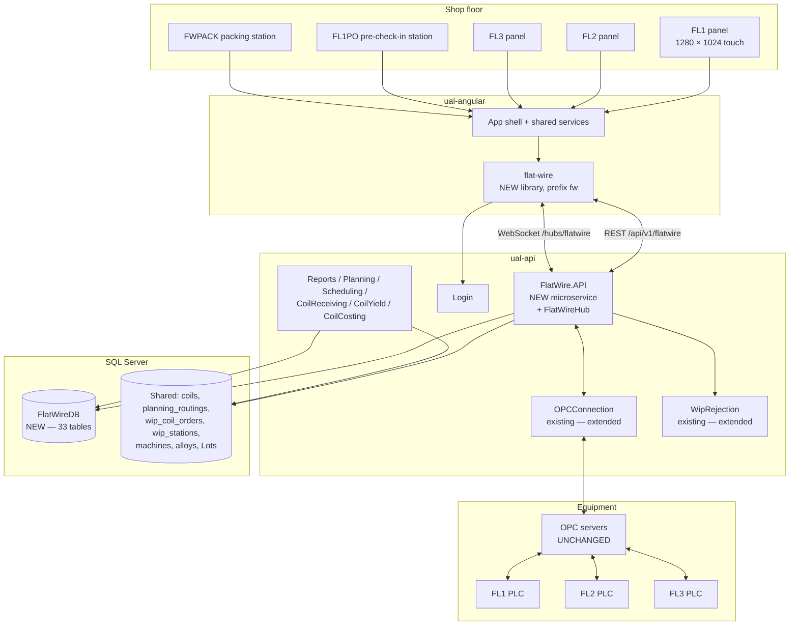

# Flat Wire Mill — Architecture

**Project:** United Aluminum (UAL) — Flat Wire Mill Module
**Last Updated:** September 5, 2026 (`D-50`) — ⭐ **`D-50` added: the 15 Aug 2026 withdrawal of automated backend tests is REVERSED, for the UNIT level only.** `FlatWire` gets a committed `FlatWire.UnitTests` project across four layers; ⛔ the seeded-`FlatWireDB` integration suite and the stub/contract suite **stay withdrawn**, and **no numeric .NET coverage bar** is set. Minted as `G101`, carded as `FW-263`–`FW-267` (98 h, additive). ⚠ `[TS §1.2]` is amended **additively** — 86 files cite it. *(previously September 5, 2026 — **`D-49` added and `G97` CLOSED: the flat wire lines use the OPC UA endpoint pair at `OPCServersIdx` 1 and 2, both lines onto both, addressed by id.** ⚠ **Two traps in that answer, both measured:** the ids do **not** match the names — 1 and 2 are `UAOPC3`/`UAOPC4`, not `UAOPC1`/`UAOPC2` — and it is a **primary/failover pair**, not a split, so `11_` writes **four** mapping rows. All 37 existing `(module, machine)` pairs carry exactly two endpoints and `GetOPCServerAndTagDetails` orders by `ConnectionSequence`; a one-row mapping would have looked healthy until the primary dropped. *(previously September 5, 2026 — **`D-48` added: `CommonDB.dbo.OPCServers` is a LOOKUP table and flat wire neither inserts nor updates a row in it.** The endpoint is **selected** from the four that already exist and joined through `OPCServerApplicationMapping`, so `11_` writes four shared tables rather than five, `@OPCServerClass` is gone, and `16_` reverses nothing there. ✅ **`G97` shrinks to *which of the four* and leaves the shared-schema axis entirely** — the `varchar(56)` sub-risk is withdrawn with the insert that created it. *(previously September 5, 2026 — **Three new decisions, `D-45` to `D-47`, all from planning `FW-238`.** **`D-45`** drops `D-44`'s `TagKey` column and the resolver swap: flat wire registers in `OPCTags` as `TagName` only, `appsettings` stays the resolution map, and **`G93` is withdrawn** — no shared `ALTER`, no other team, off the Phase-14 critical path. **`D-46`** adds a `PLC` element to every tag path (`FL1.PLC.AGC.Gauge`), forced by the first two paths ever read off a controller and costing only a values edit; `[PLC]` → v1.3. **`D-47`** answers `PLC-Q08`: FL3 has no controller of its own, so it is not registered at all and **new `G99`** owns the two-controller push that follows. ⚠ **`D-44` is partly superseded**, not replaced — its registration stands. ⛔ **`G60` gains `G94` as a prerequisite**: `ConnectionType = 21317` makes flat wire the first module to select `ual-api`'s `OPCUAManager`, which has never run in production. *(previously September 4, 2026 — **New decision `D-44`: OPC tag paths live in the `CommonDB` `OPCTags` registration, not in `appsettings`, and `OPCTags` gains a `TagKey` column for the logical name.** This closes **`OI-A`**, open since 27 Aug 2026, and unblocks **`FW-238`**. §11's configuration sentence is corrected — `appsettings` keeps `SimulatePLCTagPush`, `PublishIntervalMs`, `LineStateMap` and the SignalR block, and **no tag path**. ⚠ New **`G93`**: the shared-table alteration and the `GetOPCServerAndTagDetails` change are the shared-schema team's, not ours. ⚠ **`D-32` is not reopened** — it binds the `united_db` `coils` / scheduling schema, and `CommonDB` registration writes were always in scope *(previously August 29, 2026 — **New decision `D-33`: the simulator console `DB-S1` is a standalone WinForms desktop tool, not an Angular screen.** §13.1 gains the row and its preamble moves to `D-29`–`D-33`; §11's deploy path gains the EXE. ⚠ **§14.2's *new frameworks rejected* row gains a note** — `D-33` is not an exception to it: WinForms is not new to UAL (~104 shop-floor apps in `ual-dot-net`, and `Tools/ConfigureAPI` is already a WinExe), so there is no ramp-up to fund *(previously August 18, 2026 — **`D-32`: there is no shared-schema migration**; `FW-001`/`FW-002` cancelled, §10's boundary and §13.2's recovery risk narrowed *(earlier: **`OI-37` struck from §13's open-item list** — the six roles are confirmed as JWT claims on `ClaimTypes.Role`; split out of `03-HLD-and-ERDiagram.md` in the ProjectPlan restructure. **Section numbers are unchanged**, so every `§n` citation still resolves; numbering inside this file is deliberately non-contiguous)*)*)*)*)*)*)*
**Document Type:** High-level design, code locations, cross-cutting concerns, the stack ADR
**Status:** Baselined for build — design risks in §13.2, unresolved items in §13.3
**Owner:** Architecture stream
**Audience:** Architects, Angular / .NET developers, DBA
**Shortcode:** `[ARC]`
**Part of:** `ProjectPlan/Architecture/` — index: [README.md](../DOCUMENTS.md)

---

## 1. Architecture overview

### 1.1 Context



Three facts this diagram encodes that are easy to get wrong:

1. **`FlatWireHub` lives inside `FlatWire.API`.** The shared `Notification` service is not extended, and no existing hub is a template.
2. **OPC servers are unchanged.** Only the PLCs are new hardware. The integration point is the existing `OPCConnection` service, extended to subscribe to FL1/FL2/FL3 tags.
3. **`FlatWireDB` is a new standalone database.** It is not an extension of `united_db`. The cross-database writes to the shared schema are real and are the reason §10 exists.

### 1.2 Component view

| Component | Repository | Responsibility |
|---|---|---|
| `flat-wire` | `c:\UAL\ual-angular` | All 22 screens, all `fw`-prefixed controls, the SignalR client, line/run state |
| `FlatWire.API` | `c:\UAL\ual-api` | Thin controllers over MediatR; `FlatWireHub`; OPC ingest hosted service; `PLCTagService` |
| `FlatWire.Application` | `c:\UAL\ual-api` | Commands, queries, validators, pipeline behaviours |
| `FlatWire.Domain` | `c:\UAL\ual-api` | **Seven aggregate roots** (`D-29`), value objects, invariant rules, domain events, repository **interfaces**, enums, param models, `IFlatWireClient`. Bases inherited from `UA.Framework.Domain` — **do not write new ones** |
| `FlatWire.Infrastructure` | `c:\UAL\ual-api` | `FlatWireDbContext` (EF Core), Dapper readers, repositories, `PLCTagService` |
| `FlatWireDB` | `ual-database` | **MVP-1 build: 33 tables · 55 FKs · 69 index statements · 1 procedure · 1 trigger** — verified on a live deploy 15 Aug 2026 (`D-31`). *Previously 25 / 33 / 41, counted from the scripts on 13 Aug 2026.* **MVP-1 and the full design are now the same set** — `D-31` moved the three `PassSchedule*` tables, their 10 FKs and their 6 indexes into MVP-1. Only `sp_ShiftSummary` is MVP-2. *(The "64 non-clustered indexes" previously quoted here was a `sys.indexes` count from a deployed database, which includes constraint-backed indexes script 07 does not create — see §6.8.)* |

---

---

## 2. Where the code lands — and the binding reference rules

### 2.1 Locations

| Layer | Repository | Location | Status |
|---|---|---|---|
| Frontend | `c:\UAL\ual-angular` | **New library `flat-wire`**, prefix `fw`, at `projects/flat-wire/` | Not started |
| Backend | `c:\UAL\ual-api` | **New domain `API/Domain/FlatWire/`**, 4 projects + `FlatWire.sln` | Not started |
| Database | `ual-database` | **New `FlatWireDB`** — and **nothing else**. `D-32` (18 Aug 2026) cancels the FW-001/FW-002 shared-schema migration, so the existing scheduling schema is **read and written as it stands, never altered** | DDL written and validated; **not deployed** |
| Planning artifacts | `c:\UAL\Flatwire-planning` | This repository | Complete |

`MVP-1/ProjectPlan/Flat Wire.code-workspace` opens this folder alongside both code repositories.

### 2.2 Reference-code rules — binding, and non-obvious

These are the rules most likely to be broken by a developer working from habit or from the two stale implementation documents in this repository. They are **decisions**, not preferences.

**Backend — what to copy:**

| Existing domain | Role for Flat Wire |
|---|---|
| **`API/Domain/CoilCheckin`** | **The primary template.** Copy the controller shape, the MediatR command pattern, `Program.cs`, the four `.csproj` files and the NuGet set |
| `API/Domain/OPCConnection` | The OPC/PLC tag read/write layer to integrate with. **`OPCManagerHub.cs` is *not* a template** — the real-time layer is purpose-built (§4) |
| `API/Domain/WipRejection` | Existing service to **extend** for flat-wire outlets |
| `API/Framework/UA.Framework.API/UAController.cs` | The base controller every new controller extends; the standard `Data` / `Success` / `Errors` envelope |
| `Notification`, `Login`, `Common`, `Shared`, `Reports`, `Planning`, `Scheduling`, `CoilReceiving`, `CoilYield`, `CoilCosting` | Cross-cutting and upstream services touched by later phases |

> **`API/Domain/SlitterInterface` is explicitly NOT a reference** — neither for UI/structure nor for the real-time / `CoilDataHub` pattern.

**Frontend — what NOT to copy.** There is **no Angular structural, UI or CSS template.** `flat-wire` is all-new screens and controls built from `MVP-1/ProjectPlan/Frontend/Mockups/`. The following are **not** references: `checkin-precheckin`, `shop-floor` / `shop-floor-common`, `statistical-process-control`, `wip-rejection`, `slitter-*`, `coil-receiving`, `common-grid` / `multi-grid-layout`, `opc`, `label-printing`, `print-traveler`.

**The only frontend reuse** is the foundational, app-wide `shared` services, consumed so the library plugs into the existing app shell rather than re-inventing plumbing:

`api-gateway.service` · `app-config.service` · `login.service` + `login-api.service` · `token-interceptor.service` · `correlation-id-interceptor.service` + `correlation-id.service` · `error-handler.service` + `global-error-handler-api.service` · `ui-log.service` · `notification.service` · `subscription.service` · `print-export.service` · `util.service`

**Do not rebuild these, and do not add new interceptors.** The Flat Wire real-time client is purpose-built; existing SignalR hub clients such as `supervisor-monitor-hub.service.ts` are **not** copied.

> **`flat-wire` joins the `build:shop-floor` npm chain for build ordering only.** That is a build-sequencing concern and implies **no** UI or code reuse from the other libraries in the chain.

> **The two documents that contradicted these rules were deleted on 13 Aug 2026** (recoverable at `1964086`) — recorded because the instructions survive in git history. `CheckinImplementationPlan.md` and `CheckinImplementationPrompt.md` told developers to "copy patterns from `checkin-precheckin`", to port the **retired** interim DB2 layout (which held the `dashboard_2_rod_checkin.html` filename until 11 Aug 2026, when the approved wizard took it), and to build a `--fw-*` token system. **All three instructions are wrong**, and they cited story IDs (`FW-S3-009`, `FW-S1-001`) that do not exist — the real ones are FW-061 and FW-082. What was worth keeping was rehomed: the stub-first delivery contract is `./Architecture.md` §2.2 §0.5, and the canonical fixture set is the DB seed.

---

---

## 10. The transactional boundary — read this before writing check-in

Check-in spans **three systems**: `FlatWireDB` (run, check-in, SPC, staging), the shared `coils` / `wip_coil_orders` / `planning_routings` schema, and the PLC via OPC.

**Check-in as a whole is not one ACID transaction. But the part that cannot be atomic is only the OPC write** — and that is a narrower statement than this section made until 19 Aug 2026.

> ⚠ **Corrected 19 Aug 2026 (`FW-220`).** The clause *"and the two databases are separate"* was the load-bearing half of the old claim, and it is **wrong in the deployed topology**. `FlatWireDB` is co-located with `united_db` / `proddb` / `SlitterDB` / `CommonDB` / `wiplogdb` on **one SQL Server instance**, so a single `SqlConnection` with a single `SqlTransaction` spans both halves under the **local** transaction manager — no MSDTC, no linked server, no distributed transaction. **The database half of check-in is therefore one ACID transaction and may be described as one.** The PLC half is still compensation and must still never be called a rollback (`G16`).
>
> This removes two of the three failure windows in the diagram below and one of its two compensation paths. `[INT §8.0]` is the specification of record for the write set; `FlatWireDB.dbo.FlatWire_CheckInRod` implements it, inside the caller's transaction. ⚠ **`[H]` (26 Aug 2026) moved that procedure from `united_db` into `FlatWireDB` and changed NOTHING here** — one connection, one local transaction, no MSDTC, and the same shared tables. A reader seeing the procedure move will assume otherwise.
>
> ⚠ **It depends entirely on co-location.** As of 19 Aug 2026 `FlatWireDB` is on `(localdb)\MSSQLLocalDB` while the shared five are on `DEVUAL-UADEV001\TEST1` — in that split topology nothing errors, the design just silently stops being atomic. Prove it with the query in `20_FlatWire_Grants.sql` before relying on this.

**The original claim, retained because the reasoning still applies to the PLC:** OPC writes are not transactional at all.

The design rules are therefore:

1. **Records first, PLC second.** Write every audit record before pushing tags, so a failed push leaves an incomplete-push marker to recover from.
2. **Compensating writes, not rollback.** On failure, issue compensating operations — re-clear the tags, revert the shared status, reverse the `wip_coil_orders` insert. **Never describe this as an "atomic rollback".**
3. **Define the recovery path explicitly.** What happens when the `FlatWireDB` write succeeds and the legacy write fails, and vice versa, is **not specified anywhere** and must be before Phase 4.

```mermaid
sequenceDiagram
    participant SVC as CheckInService
    participant FWDB as FlatWireDB
    participant LEG as Shared schema
    participant PLC as PLCTagService

    SVC->>FWDB: 1. Run + checkin + SPC + inspection (local transaction)
    FWDB-->>SVC: committed
    SVC->>LEG: 2. reqsum + wip_coil_orders + actual_start_date
    alt legacy write fails
        SVC->>FWDB: COMPENSATE — mark run aborted, flag for recovery
        SVC-->>SVC: 500, check-in aborted
    end
    LEG-->>SVC: committed
    SVC->>PLC: 3. PushPassSchedule (batch)
    alt any tag write fails
        SVC->>PLC: COMPENSATE — ClearPayoffTags
        SVC->>LEG: COMPENSATE — reverse wip_coil_orders, revert actual_start_date
        SVC->>FWDB: COMPENSATE — mark run aborted, PlcTagsPushed = 0
        SVC-->>SVC: 500, check-in aborted
    end
    PLC-->>SVC: all tags OK
    SVC->>FWDB: 4. RodStaging → CheckedIn; broadcast
```

**This is gap G2 (Critical) and gap G16.** The candidates on the table are a **saga/outbox pattern with compensating PLC clears**, or **mirroring an `INFLAT` marker into `FlatWireDB`** so local state is self-consistent. **Neither has been chosen — OI-39**, and it blocks Phase 4. Phase 4's estimate carries a **24–64 h reserve** against this decision.

> ⚠ **`OI-39` narrows again, 19 Aug 2026 (`FW-220`).** The **cross-database half of the recovery question is answered**: there is nothing to compensate between the two databases, because they commit together — `FlatWireDB` is co-located with the shared schema on one instance, so one `SqlConnection` and one `SqlTransaction` cover both halves under the local transaction manager. What remains is the PLC clears plus one local status update: `ClearPayoffTags`, then a second small transaction marking the run `Aborted`, `PlcTagsPushed = 0` and the staged row back to `Staged`. **`G2` narrows with it and still does not close.**
>
> The **24–64 h reserve should be re-derived before S2 planning** rather than after: its cross-database portion is spent, its PLC portion stands. Phase 4 is the only phase already flagged provisional, so getting this netting wrong in either direction distorts it. See [`FW-220`](../40-backend/tasks/FW-220.md) and `[INT §8.0]`.

> ⚠ **`D-32` (18 Aug 2026) has already settled half of this.** With the shared-schema migration cancelled there is **no `INFLAT` value in the shared `coils` status vocabulary**, so the local mirror is not one candidate among two — it is the only place in-process state can live, and `Rod.Status` / `SpoolProcessing.Status` already carry `INFLAT` as a **`FlatWireDB`-local** value. **`OI-39` narrows to the recovery pattern for the writes that remain** — the reqsum / `wip_coil_orders` insert, `actual_start_date` on `planning_routings` / `routings`, and `wip_stations.coilno` — all of which land in **existing columns**. **`G2` narrows with it and does not close:** check-in still spans two databases plus the PLC push, so it is still not one ACID transaction.

The same reasoning applies to **pre-check-in** (writes `RodStaging` + `coils` + `wip_coil_orders`) and to **pre-check-out** (must **reverse** the `wip_coil_orders` insert).

---

---

## 11. Environments and topology

| Environment | Host | Use |
|---|---|---|
| test1 / test2 | `devual-uadev001` / `002` | Developer testing |
| dev1 / dev2 | — | Integration testing |
| staging | `uanet-staging` (UAT on `devual-uadev001` or equivalent) | Pre-production, UAT |
| production | `uanet05` | Live |

**Deploy path:** Angular `ng build` → static files to IIS · `dotnet publish FlatWire.API` → IIS application pool **with the WebSockets feature enabled** · DDL via the ordered migration scripts · **`dotnet publish FlatWireSimConsole` → a WinForms EXE copied to engineering workstations only** (`D-33`; **never to a commissioned line** — `[SIM §9.4]`, `G66`). Full runbook in `[DEP]`.

**Configuration** lives in `appsettings.{Environment}.json`: the `FlatWireDB` connection string, JWT settings, the non-path OPC settings (`SimulatePLCTagPush`, `PublishIntervalMs`, per-line `LineStateMap`) and the SignalR settings (MessagePack, keep-alive/timeout, cadence). ⚠ **The OPC tag-path map is NOT among them — `D-44`, 4 Sep 2026.** The 72 paths live in the `CommonDB` `OPCTags` registration and are resolved through `OPCConnection`'s `GetOPCInfo`; they are still config-driven and never hardcoded, but the configuration is a table. A `/health` endpoint reports DB and OPC reachability.

**To run the full stack locally:** SQL Server with `FlatWireDB` deployed → `Shared.API`, `Login.API`, `OPCConnection` and `FlatWire.API` running → `npm run serve:shop-floor` (or the equivalent chain entry) in `ual-angular`. Until PLC commissioning completes, every line runs `SimulatePLCTagPush` plus a mock SignalR stream, so the UI stays fully testable and **development is not blocked on commissioning**.

---

---

## 12. Cross-cutting concerns

| Concern | Design | Satisfies |
|---|---|---|
| **Authentication** | JWT inherited from `Login`; hub auth via `?access_token=`; **every** controller and endpoint `[Authorize]` | `[SEC §8]` |
| **Authorization** | API role policies matching the endpoint matrix; Angular `FlatWireAuthGuard` + `FlatWireRoleGuard` | `[SEC §8]` |
| **Correlation** | The shared `correlation-id-interceptor` sets the header; Serilog enriches every log line with it | Traceable failures across UI → API → DB |
| **Logging** | Serilog, structured, daily rolling files per the UAL convention | `NFR010`, `NFR011` |
| **Audit** | Domain-level: `PassScheduleChangeLog`, the override columns on `RodStaging`, `PlcTagsPushed`/`PlcTagsCleared`/`PlcTagWritten`, and an audit log line per tag write with path, value, operator, timestamp and result | `NFR010`, `NFR011` |
| **Caching** | PWA service worker caches the pass schedule and active-run snapshot; short-lived memory cache for lookup tables | `NFR006` |
| **Resilience** | SignalR automatic reconnect with exponential backoff + group re-join; Polly on outbound OPC calls; compensating writes on the cross-system boundary | `NFR006`, §10 |
| **Concurrency** | `ROWVERSION` optimistic tokens; filtered unique indexes carry the invariants that a read-then-write check would race on | §6.7 |
| **Performance** | Bounded-channel ingest + batching + decimation; Dapper for high-volume reads; `sp_GetGaugeTrace` decimates server-side; OnPush + rAF + fixed trace window client-side | `NFR005`, `NFR007` |
| **Time** | **Every event timestamp is server-side at API receipt**, never the client clock. `DATETIMEOFFSET` throughout | `FR-174` |

**How each NFR is architecturally satisfied:**

| NFR | Architectural mechanism |
|---|---|
| `NFR003` / `NFR004` | Recording cadence is a configuration value read by the OPC ingest service, not a constant |
| `NFR005` | Push-only via `FlatWireHub`; the client has **no polling path** — the mock service is the only source of non-push data, and only in development |
| `NFR006` | PWA cache + automatic reconnect + group re-join + the "Reconnecting…" banner over cached state |
| `NFR007` | Per-line groups mean two dashboards on two lines never share a fan-out path |
| `NFR009` | Modal implementation forbids backdrop-close and Escape-close on override dialogs; the PLC keeps the **previous** values until acknowledgement |
| `NFR010` / `NFR011` | The audit surfaces listed above, plus Serilog with correlation |
| `NFR012` | `CoilTraceability` with a non-overlap trigger and enforced FKs to `Rod.Alpha`, which is what decision **D-04** bought |
| `NFR013` | `CoilOutput.PassScheduleSnapshot` JSON + permanent retention of the R-series in `coils` |
| **Undefined** (AGC rate, client count, latency, retention) | **No mechanism can be designed against an undefined target.** G9 / OI-34 |

---

---

## 13. Architecture decisions and risks

### 13.1 Decision record

> ⚠ **`D-01`–`D-17` here are a RESTATEMENT of the master specification §10.1, not a separate series** — same decisions, different columns: that table carries **Date** and **Supersedes**, this one carries **Rationale**. **The master spec wins on the decision, its date and its supersession chain; this table wins on rationale.** Two copies can drift, so change both or neither — the failure class that produced six conflicting PLC tag maps.
>
> **`D-18`–`D-28` are NOT here** — they exist only in master spec §10.1. **`D-29`–`D-33` and `D-44` are here and nowhere else.** So neither table is complete on its own.

| ID | Decision | Rationale | Consequence |
|---|---|---|---|
| **D-01** | The UI is a brand-new standalone Angular library `flat-wire` | The screen set has no analogue in the existing libraries; folding it in would couple it to a release train it does not share | New scaffold; joins `build:shop-floor` for ordering only |
| **D-02** | Tables live in a **new `FlatWireDB`**, not `united_db` | Isolates a new domain from the shared schema's release risk; traceability joins stay in-engine | Cross-DB reads for planning/scheduling data; §10 exists because of this |
| **D-03** | The schema is **33 tables** — 34 until the 23 Aug 2026 `SpoolConfiguration` merge (`Q60`) | The as-built count | See §6.2 for the full supersession history |
| **D-04** | **`Rod` is retained** as a local master with enforced rod-alpha FKs | Referential integrity for the genealogy chain that `NFR012` makes contractual | **Reverses** `./Architecture.md` §13.1 `D-04` / `phase-01c`. Leaves **OI-42** (sync with `coils`) open |
| **D-05** | The real-time layer is **purpose-built**, self-contained in `FlatWire.API` | AGC telemetry is a different workload from the event notifications the existing hubs carry | `CoilDataHub` / `OPCManagerHub` / `supervisor-monitor-hub` are **not** templates |
| **D-06** | **`SlitterInterface` is not a reference**; backend template is `CoilCheckin`; **there is no frontend template at all** | The mockups are the design; copying an existing library would import decisions the mockups reversed | Every control built fresh; only foundational `shared` services consumed |
| **D-07** | The UI consumes the existing `--color-*` semantic token system as-is | The mockups already share one system | **No token migration.** The `--fw-*` prefix in older docs is stale (G18) |
| **D-08** | **Dashboard 2 is the 6-step tab wizard, `dashboard_2_rod_checkin.html`** (`- New.html` until 11 Aug 2026) | Progressive unlock and tolerance-viz replaced the retired progress ring | Both earlier DB2 layouts retired |
| **D-09** | Stay entirely within the UAL stack — **no new frameworks** | The window does not permit ramp-up | Angular/.NET/SQL Server/SignalR/Chart.js only |
| **D-10** | Pre-check-in state lives in **`RodStaging`**, not columns on `Rod` | Two filtered unique indexes make one-rod-per-bay unviolatable under concurrency | The provisional `Rod.StagedPayoffPosition`/`IsWelded` columns retired |
| **D-11** | **`PayoffPosition`** is a real lookup with three **pinned** Ids | Replaces three incompatible representations | Rod-fed tables keep `CHECK (1,2)` as a documented narrowing |
| **D-12** | A **`RunReading`** time-series table persists the sampled profile | FL2's historical profile and three reports had **no data source at all** (G3) | Not a per-tick historian; retention undefined (**OI-17**) |
| **D-13** | `FlatWireRun` (header) / `FlatWireRunDetail` (detail) **split** | Run-level fields belong on the header, never on stop rows | `FlatLineProcessing` → `FlatWireRunDetail`, `FlatLineSetup` → `PassScheduleComponent` |
| **D-14** | Component state is a **three-value enum** | A boolean cannot express Bypass versus Skip | Mirrored in C#, TypeScript and the DB CHECK |
| **D-15** | Edge type has **one domain value set** `Round`/`Square` with a display pipe | Three vocabularies were circulating | One enum, one CHECK, one pipe |
| **D-16** | `CheckpointType` has **five** values including `RollAdjustTrigger` | `/rolloverride` writes a checkpoint of that type | The four-value API enum is corrected |
| **D-17** | The **traveler is fully digital**; labels still print | Business decision, 28 Apr 2026 | No print action on the run monitor either |
| **D-29** | **`FlatWire` is built to tactical DDD** — aggregates carrying behaviour, value objects, domain events, and invariants enforced in the domain rather than in validators. Seven aggregate roots; full boundary table in `[SVC §3.2a]` | **The platform already ships the toolkit and nothing uses it.** `UA.Framework.Domain/EntityModels/` has **`Entity`** (domain events, identity equality) and **`ValueObject`** (`GetAtomicValues`, structural equality); `CoilCheckin` has **`IBusinessRule`**/**`CheckRule`** → `BusinessRuleValidationException` and **`MediatorExtension.DispatchDomainEventsAsync`**. `CoilCheckin` kept every piece and modelled `DBModels/` as anemic `{ get; set; }` bags. Adopting DDD here is a **first use of the framework as designed**, not a bespoke pattern | ⚠ **Overrides ONLY the Domain-layer half of §2.2.** `CoilCheckin` stays binding for controllers, `Program.cs`, `.csproj`/NuGet, DI, MediatR and pipeline behaviours — this is **not** "CoilCheckin is no longer the template". **`G21` closes** (bay uniqueness is an aggregate invariant a filtered index cannot express); **`G14`'s format half closes by construction** (validating alpha constructors); **`G2` gains a boundary** — one aggregate, one transaction, everything outside it a process manager with compensating actions — but **stays open pending `G30`**. **+72 h on Phase 1B (469 → 541 h).** `FlatWire` becomes the first UAL service on this pattern |
| **D-30** *(open)* | **Where the `ROWVERSION` concurrency token belongs under DDD.** The DDL puts one on `Rod`, `FlatWireRun`, `SpoolProcessing`, `RodStaging` and `CoilOutput`. Under `D-29` the token belongs on the **aggregate root** — and three roots have none: **`WeldEvent`, `RodCheckout`, `WipRejection`** | All three are **mutated after insert** — a weld's `Pass`/`Fail`, a checkout's approval stamp, a rejection's disposition — so each can be lost-updated by a concurrent editor with nothing to detect it | **Open — decide before the Phase-4 schema freeze.** ⚠ **Re-numbered 15 Aug 2026 from the bare `D1`** raised in `[SVC §3.4]`, which collided with `[PLC]`'s retired `D1`–`D17` decision log and did not match this register's `D-##` format. Cited from `phase-01b`'s blockers |
| **D-31** | **The three `PassSchedule*` tables, their seed, their 10 foreign keys and their 6 indexes move into MVP-1** — `02_Schedule`, `FlatWire_SampleData_Schedule.sql` and the files then called `06b` and `07b` join the MVP-1 runner in contiguous numeric order — the latter two were folded into `06` and `07` on 23 Aug 2026. **`09_Programmability_MVP2` (`sp_ShiftSummary`) stays MVP-2**, because it backs Dashboard 10, a deferred screen | **`[API §4.2]` carried an open assumption with exactly two options**: MVP-1 calls the owning track's API and snapshots locally, *or* **the owning track writes into `FlatWireDB` and the read is a local query**. This is the second — **arbitration between two published options, not new scope.** It closes `[TRP §6]` blocker #1, which blocked **both** check-in screens and therefore the whole six-screen trial | ⚠ **Reverses the 11 Aug 2026 scope split and four documented positions, all deliberately.** **(1)** `PassScheduleId` stops being *"a documented external reference, the same class as `PlanId` and `SkidId`"* and becomes a **real enforced FK** on `FlatWireRun`, `RodCheckin`, `SpoolCheckin`, `CoilOutput` — `PlanId`, `CoilOrderPlanId` and `SkidId` are **unaffected**. **(2)** `PassSchedule` returns to the `ROWVERSION` list, making it **six**. **(3)** The 1C enum mirror now exists for `CK_PSC_*`, so `TC-020` runs against one database. **(4)** `phase-01c`'s *"deliberate numbering gap"* closes. **Verified on a live deploy (22 Aug 2026): 34 tables · 57 FKs · 69 index statements · 1 procedure · 1 trigger**, idempotent on re-run — **the 23 Aug `Q60` merge then took the baseline to 33 · 55 · 69 · 1 · 1 (`[DBD §6.2]`)**. ⚠ **Owning the table is not owning the data** — MVP-1 still has **no authoring surface** (DB9/DB9A stay MVP-2, no write endpoint), so **nothing in MVP-1 populates these tables in production**: `OI-110`, the residual risk this decision moves rather than removes |
| **D-32** *(18 Aug 2026)* | **There is no shared-schema migration. `FW-001` and `FW-002` are cancelled.** The existing `coils` / scheduling schema is **read and written as it stands and is never altered** — no column renames, no new columns, no new status value | Client direction. The eight slash-dual renames (`CoilNo`→`Coil/BundleNo` and the rest), the two new columns (`OutgoingCoil/BundleWidth`, `IncomingWireDia`) and the new shared coil status **`INFLAT`** were the highest-blast-radius change in the plan — read by upstream receiving, planning, scheduling, reporting, yield and cost, and priced with a discrete **40 h impact audit** across `united_db` and the legacy `ual-dot-net` tier. Removing the change removes the audit, the regression exposure and the migration script that was never written (`[GAP]` A1) | **−60 h base** (`FW-001` 56 + `FW-002` 4), and **−16 h more** from `FW-176`’s shared-`coils` column line — the plan’s second shared-schema change. With QA and contingency re-derived from the reduced bases: **Phase 1C 221 → 138 h**, **Phase 7 205 → 182 h**, **−106 h all-in**; MVP-1 backlog **3,292 → 3,186 h**. Derivation in `[CE §3c]`. ⚠ **Draw the boundary correctly — three things are cancelled and everything else stands.** **(a) Still written, in existing columns:** the reqsum / `wip_coil_orders` insert, `actual_start_date` on `planning_routings` / `routings`, `wip_stations.coilno`, the `FW-003` `machines` rows (125/126/127) and the `CommonDB` WIP-station registration. **(b) Still read:** the `coils` R-series row, `alloys.alloy_density`, `alloys.Draw_max_reduction`. **(c) `INFLAT` survives as a `FlatWireDB`-local value** on `Rod.Status`, `SpoolProcessing.Status` and `RodCheckout.NewRodStatus` — those CHECK constraints are untouched. **What goes with it:** `FR-077`'s `coils.coil_status = INFLAT` write, the `INFLAT` term in `FR-044` / `ROD_UNAVAILABLE` shared-side eligibility, and the QA4 rename regression pass in `FW-201`. **`OI-39` and `G2` narrow** (§10). **New: `OI-111`** — with no shared marker, upstream can no longer see that a rod is on a flattening line, and who needs that visibility is unanswered. The operation letter **`F`** is data in existing columns and is **not** cancelled, so **`OI-27` stands** |
| **D-33** *(29 Aug 2026)* | **The simulator control console `DB-S1` is a standalone WinForms desktop tool, not an Angular screen.** It moves to `ual-api/Tools/FlatWireSimConsole/` (`net8.0-windows`, its own `.sln`) and is built, deployed and released independently of `ual-angular`. **`FW-214` is repointed in place, not retired** — same id, same `FE` stream, same `50-frontend/tasks/` home | `flat-wire` is an Angular *library*, not a build target: it ships **inside the shop-floor bundle** (`[DEP §1.1]` artifact 5), and every environment build wipes `dist/` and rebuilds all seventeen libraries plus the application. So a tool `[SIM §9.1]` spends four rules insisting **is not a dashboard** rode the operator app’s release train and shipped to operator machines whether or not its route resolved. Three feared costs do not materialise: the hub registers `AddJsonProtocol` unconditionally beside the MessagePack switch, so **no MessagePack package is needed**; `HubContracts.cs` depends only on `CanonicalEnums.cs`, so the typed contract is **linked, not re-declared**; and `flat-wire`’s routing module never carried a `DB-S1` route, so **there is no Angular code to unwind** | **+28 h base / +21 h AI-assisted** — `FW-214` moves **24 h → 52 h** base, **15 h → 36 h** AI-assisted at `[DE §1]`’s new **0.70 desktop-client** factor; the 0.62 frontend factor is withdrawn for this story because its basis is that mockup→Angular conversion *“is largely mechanical”*. ⚠ **The delta is smaller in calendar than in hours**: it leaves **FE, which `[TRP §2.1]` calls the binding constraint**, for a T2 block carrying **RT 0**. ⚠ **`FW-130`/`FW-135` stop being dependencies but their 40 h is NOT saved** — both serve the six operator screens. **New `G66`** (installation policy is procedural, not enforced); `[SEC §8.8b]`’s 404 is **unchanged**, being server-side. **`[DEP]` gains a sixth artifact type**, which it had no row for |
| **D-44** *(4 Sep 2026)* — ⚠ **PARTLY SUPERSEDED by `D-45` (5 Sep 2026)**: the registration stands, the `TagKey` column and the resolver swap do not. Read `D-45` first; the text here is kept because it is the reasoning that found the registration in the first place | **OPC tag paths live in the `CommonDB` registration, not in `appsettings` — and `CommonDB.OPCTags` gains a `TagKey` column to carry the logical name.** This **closes `OI-A`**, raised 27 Aug 2026 by [`FW-144`](../40-backend/tasks/FW-144.md) and deferred since. `FlatWire` resolves a path the way every other OPC consumer does — through `OPCConnection`'s `GetOPCInfo` — and `ConfigurationTagPathResolver` is replaced by a `CommonDbTagPathResolver` behind the **unchanged** `ITagPathResolver` seam. ⚠ **`appsettings` keeps the non-path OPC settings** — `SimulatePLCTagPush`, `PublishIntervalMs`, per-line `LineStateMap` and the whole `FlatWireSignalR` block. None of those is a tag path, and `LineStateMap` has no table anywhere in the ecosystem | **The ecosystem's mechanism is a database table, and the plan's premise was never checked against `ual-api`.** `OPCConnection` answers `GetOPCInfo` from `CommonDB` via `GetOPCServerAndTagDetails`, off `OPCTags` / `OPCModules` / `OPCServers` / `OPCTagApplicationMapping` joined to `machines` — **no UAL service keeps OPC tag paths in `appsettings` at all.** Both candidate answers `OI-A` offered were therefore wrong: `[PLCC §2]` said `OPCConnection`'s `appsettings`, `[DEP §2.1]` said `FlatWire`'s. Keeping either as a *second* home would have made the path string the **seventh copy in two app pools** — the risk `OI-A` was raised to prevent, and the one `G60` names as *"the tag rows get written twice"*. It is the same class of finding as `FW-140`'s *"no domain in `ual-api` has the `CoilCheckin` pattern §2.2 said to copy"* | ⚠ **It needs a column on a SHARED `CommonDB` table, and that is the cost.** `OPCTags` is `OPCTagsIdx · TagName · RequestedUpdateRate · IsSystemErrorTag · IsActive` — **no logical-name column** — and `GetOPCServerAndTagDetails` returns a flat `(MachineId, TagName, RequestedUpdateRate)` list keyed only by machine and module. `CoolingChamber` addresses its one tag **positionally** (`opcInfo.Tags[0]`) and builds the path from string constants when the list comes back empty; that does not scale to **72 paths on three lines** with ~24 logical names each, and deriving the key *from* the path is forbidden by `[PLCC §2]`'s first binding rule — the keys are decoupled precisely so a `PLC-Q05` measure rename stays a values-only edit. So a nullable **`TagKey varchar(64)`** is added to `OPCTags` and surfaced on the read path. **New `G93`**: the alteration and the proc change belong to the shared-schema team, not this one. ⚠ **This does NOT reopen `D-32`**, which binds the `coils` / scheduling schema in `united_db`; `CommonDB` registration writes were explicitly still in scope there (`D-32` (a)). ✅ **`FW-238` is unblocked** and now owns the `OPCTags` rows as well as the module and server registration. **`FW-144` stays BUILT** — replacing its resolver is one class and one DI line with no caller changes, which is what the seam was built for — and **`P-74`'s `Confirmed` list becomes a column question**, not a config one |
| **D-45** *(5 Sep 2026)* | **`OPCTags` gains NO `TagKey` column and no confirmation column, and `CommonDbTagPathResolver` is not built.** Flat wire registers in `OPCTags` in the same shape as every other module — `TagName` only. `D-44`'s *registration* stands and `FW-238` delivers it; `D-44`'s *column* does not. `ConfigurationTagPathResolver` stays exactly as it is, so the `appsettings` map remains the resolution map and `FW-144`'s `ITagPathResolver` seam is untouched. **`OI-A` is re-answered**: the paths live in BOTH places by decision — `appsettings` resolves them, `OPCTags` registers them | **The ecosystem already does this at ten times our scale, without the column.** `UnifiedSlitterService` addresses **313 tags across six slitters** off this exact schema: `TagName` is the identity everywhere — DB row, OPC-UA `StartNodeId`, `MonitoredItem.DisplayName`, cache key, event-correlation key — and the logical layer lives in code, in a 620-constant class. FlatWire's split is the same one done better, because `TagNames.cs` plus config keeps the paths out of C# as `FR-022` requires. Against that, `G93`'s column cost an `ALTER` on a shared `CommonDB` table, a change to a procedure, a `UA.APIDTO` property, two NuGet version bumps and another team's schedule — to buy a property the ecosystem has never needed | ✅ **`G93` is WITHDRAWN** and the shared-schema conversation is off the Phase-14 critical path entirely. ✅ **`FW-238` loses two acceptance criteria** (ship-the-column-first, and the resolver swap) and needs no other team. ⚠ **The path strings now live in two places with nothing keying them together** — accepted deliberately; `[DEP §5]` gains a config-vs-rows diff, and `11_`'s verification block prints every registered path, so the drift is checked rather than assumed. ⚠ **If a logical key in the database is ever wanted, `OpcSubModuleTags` is the precedent** — a side table, not an `ALTER` |
| **D-46** *(5 Sep 2026)* | **Every flat wire tag path gains a `PLC` element after the line.** `FL1.AGC.Gauge` becomes `FL1.PLC.AGC.Gauge`; `FL2.FM2.S1.RollGap` becomes `FL2.PLC.FM2.S1.RollGap`. `[PLC §4.1]`'s grammar gains a `<controller> ::= "PLC"` production, R2 and R3 are restated, and every path in `§5.2` is rewritten. `[PLC]` goes to **v1.3** | **The first two flat wire paths ever read off a controller disagree with the derivation.** `FL1.PLC._System._Error` and `FL2.PLC._System._Error`, supplied by the client 5 Sep 2026, both carry the element. So does the whole ecosystem: all 313 `UnifiedSlitterService` paths are `{Machine}.PLC.{…}`, and `CoolingChamber` uses `Cooling.PLC.CR.C{n}.NumberOfLoadsPresent`. `[PLC §4]` was written convention-first precisely so that confirming a convention would convert the whole table at once — this is that mechanism working | ✅ **It cost a values edit and nothing else.** No logical name in `TagNames.cs` moved and no code changed, which is exactly what `[PLCC §2]`'s key/value decoupling was built to buy. Three sites: the 39 FL1/FL2 values in `appsettings.json`, `[PLC §4.1]`/`§4.2`/`§5.2`, and `11_`'s seed rows. ⚠ **FL3's 33 config values were deliberately NOT rewritten** — `FL3.PLC.*` would encode a namespace `D-47` says does not exist. ⚠ **`G33` and `PLC-Q02` are untouched**: the rest of `[PLC §5.2]` is still derivation, and this is the first evidence that derivation can be wrong |
| **D-47** *(5 Sep 2026)* | **FL3 has no controller of its own — `PLC-Q08` is answered in favour of option 1.** FM1 and the die blocks belong to the FL1 controller, FM2 to the FL2 controller, and there is no `FL3.PLC.*` namespace on any machine. FL3 is therefore **not registered with `OPCConnection`**: machine 127 gets no rows, and `GetOPCInfo` answering an empty list for FL3 is correct behaviour rather than a defect | The question could not stay open once a registration had to be written — a seed script either registers 127 or it does not, and `[PLC §5.2.3]` is explicit that this *"is not a naming preference"*. FL3's tags **are** FL1's and FL2's tags, so registering 127 separately would have created a second address for the same physical stand | ⛔ **A single FL3 acknowledgement now writes to TWO controllers, and nothing is built for it — new `G99`.** `PLCTagService.ResolveOpcInfoAsync` resolves one `OPCInfo` per line, so FL3 needs two resolutions and two `WriteTag` batches; `[PLC §7.1]`'s *"single batch"* is superseded for FL3; `[PLC §7.5]`'s compensating re-clear now spans **two failure domains** and the FL1-commits/FL2-fails case is unspecified; and `ITInhibit` must be set on **both** lines or blocking FL3 blocks nothing. ✅ **FL1 and FL2 are unaffected** and their registration proceeds. ⚠ Until `G99` lands, `Lines:FL3:MachineId` stays `0` so every FL3 push fails **by name**. ⚠ **The commissioning test is blind to this** — *"one acknowledgement configures FM1 and FM2"* passes under either topology and must be rewritten |
| **D-48** *(5 Sep 2026)* | **`CommonDB.dbo.OPCServers` is a LOOKUP table: flat wire performs no `INSERT` and no `UPDATE` against it.** The endpoint the flat wire lines connect through is **selected** from the rows that already exist — `UAOPC1`–`UAOPC4` on `DEV00164-001`, all of class `SWToolbox.TOPServer.V6` — and joined through `OPCServerApplicationMapping`. So [`11_`](../30-database/scripts/11_CommonDB_Insert_OPCRegistration_FlatWire.sql) writes **four** shared tables rather than five, `@OPCServerClass` is deleted from it outright, and [`16_`](../30-database/scripts/16_CommonDB_Delete_OPCRegistration_FlatWire.sql) reverses **nothing** in `OPCServers` | **Client direction, 5 Sep 2026.** The endpoints are site infrastructure shared by every module that connects, not per-module data — which is what `G97`'s measurement had already shown without drawing the conclusion: four endpoints existed, they served the other modules, and flat wire is a fifth consumer of them rather than the author of a fifth row. ⚠ It is the same shape of call as `D-32`: **a shared object is read as it stands and never altered** | ✅ **`G97` gets materially smaller and leaves the shared-schema axis.** The question stops being *"what is the `opc.tcp://` endpoint and its security class"* — which nobody in this repository could answer — and becomes *"which of these four"*, answerable from a printed list. ✅ **The `varchar(56)` sub-risk is withdrawn**: it existed only because a URL was going to be written into that column, and now nothing is. No widening, no other team, no return to the critical path. ⚠ **`11_` gains two guards and loses one variable** — it aborts if `@OPCServerName` is not already a row (printing the endpoints that are), and aborts if the name is ambiguous; `D9`'s *"FL1 and FL2 behind different endpoints"* case now needs a second **lookup**, never a second row. ⛔ **`16_`'s old *"delete the endpoint if no module still maps it"* step was not merely unnecessary, it was wrong** — an unmapped endpoint is still infrastructure, and our rollback would have removed somebody else's lookup row |
| **D-49** *(5 Sep 2026)* | **The flat wire lines connect through the OPC UA endpoint PAIR at `OPCServersIdx` 1 and 2, addressed BY ID, and BOTH lines map to BOTH — four `OPCServerApplicationMapping` rows, `ConnectionSequence` 1 and 2.** This **answers `G97`**, which closes. ⚠ Two traps the answer walked past, both measured on `DEV00164-001` the same day. **(a) The ids do not match the names**: `OPCServersIdx` 1 and 2 are **`UAOPC3` and `UAOPC4`**, while `UAOPC1`/`UAOPC2` are ids 3 and 4 — a different pair, serving three other modules. **(b) It is a pair, not a split**: the question `11_` `D9` had been asking — *does FL1 sit behind one endpoint and FL2 behind another* — was the wrong shape | **The ecosystem is unanimous and the procedure consumes the order.** All **37** `(module, machine)` pairs in `CommonDB.dbo.OPCServerApplicationMapping` carry **exactly two** endpoint rows, sequences 1 and 2 — there is no single-endpoint machine anywhere in the table — and `GetOPCServerAndTagDetails`' second result set is `ORDER BY MachineId, ConnectionSequence`, so it hands the client an **ordered** server list per machine: primary first, failover second. ⚠ A one-row mapping would have made flat wire the only machine in `CommonDB` with no failover, and **would have looked like a working registration right up until the primary dropped** | ⚠ **`11_` §4c writes four rows, not two**, via a `CROSS JOIN` of the two lines with the two endpoints; §4b prints the endpoint **names** so a reader can see which rows 1 and 2 are on that instance; two guards replace the three name-based ones (both ids must exist; they must differ); and two fault queries are added — a line without a full pair, and a duplicated `ConnectionSequence`. ⛔ **`OPCServersIdx` is re-checked per environment, exactly as the module id is (`G96`)** — the numbering is an artefact of insertion order, not a convention, so the right numbers on another instance could be the wrong pair. ⚠ **One assumption remains and measurement cannot settle it**: `11_` makes id **1** the primary, taking *"1 and 2"* in the order given — but **Hole Detection, the only other module on this same pair, uses id 2 as its primary** on all three of its machines. Flipping two `DECLARE`s is the whole change. ✅ **`D8`'s namespace-index question is untouched and still open** — it travelled with `G97` but was never part of it |
| **D-50** *(5 Sep 2026)* | **The 15 August 2026 withdrawal of automated backend tests is REVERSED — for the UNIT level only.** `FlatWire` gets a committed `FlatWire.UnitTests` project in `FlatWire.sln`, covering four layers: the FluentValidation validators, the 20 concrete domain rules and the 15 value objects; `PLCTagService`'s simulate branch; the line models and the two simulators; and the reachable parts of the DbContext-backed services. ⛔ **The other two withdrawn levels STAY withdrawn** — there is no integration suite against a seeded `FlatWireDB` and no stub/contract suite, so `[TS §1.2]`'s `Integration — API` row stays struck and the `Contract` row stays manual inspection. ⛔ **No numeric .NET coverage bar is set**, and that is deliberate rather than an omission: Angular's 95 % Jest bar does not transfer to a solution containing `Program.cs`, the EF entity configurations and controller plumbing, and a bar nobody can meet is suspended rather than met | **The withdrawal's own stated costs came due, and one of them said so in its own register row.** `[GAP]` `G21`'s domain half has read *"closed by design, unverified … Do not cite this row as proof of defence-in-depth until the domain rule is exercised"* since 15 Aug — a domain test of `BayAlreadyOccupiedRule` with no database present **is** that missing evidence. ⚠ **Every verification the backend has on record is a scratchpad harness that was deliberately never committed** — `FW-151`'s 53 assertions, `FW-150`'s 15, `FW-208`'s 54, `FW-215`'s 71 — so each is a claim about a build rather than a property of the repository, and none of them would catch a regression today. ⛔ **`FW-236` made the cost concrete**: it added an `FR-074` branch to `PLCTagService` that is **compiled but untested**, and its handoff named *"A FlatWire test project"* as the gap that would catch a regression there without allocating a `G##`. ✅ **The precedent is inside the same solution family** — `OPCConnection.UnitTests` was created by `FW-236` the same day and runs 23/23 | **Minted as `G101` and carded as `FW-263`–`FW-267`** in `[TB §7.2]`'s additive block of 5 Sep 2026 — 98 h dev (BE 62 · RT 36), additive to `[CE §3b]` and **in no phase reconciliation and no roll-up**. ⛔ **`[SP §9.2]`'s Definition of Done is amended in the same pass**, because it explicitly forbade reinstating an xUnit requirement *"without reversing that decision in `[TS]`"* — this is that reversal, taken in the strategy rather than inside a leaf story, which is what `FW-N05` declined to do. ⚠ **`[TS §1.2]` is amended ADDITIVELY and the original callout is kept**: **86** non-archive files cite that section, most of them asserting *"No automated tests"* as a statement of fact about a delivered build, and every one was true when written. ⚠ **Stories already `done` under the 15 Aug DoD are NOT reopened.** ⚠ **The August saving is NOT added back in place** — it was *"−26 on tests, +4 for `SpoolController`"*, so the reversible amount is `+23 h` dev and reversing *"the −22"* would silently delete a controller; 1B stays at 519 h and the baseline at 114 stories / 3,186 h |

### 13.2 Design risks

| Risk | Impact | Mitigation |
|---|---|---|
| **The cross-system boundary has no chosen recovery pattern** | Partial failure leaves inconsistent state across three systems | Choose the saga/outbox shape **before Phase 4**; 24–64 h reserved. ⚠ **Narrowed by `D-32`** — the local `INFLAT` mirror is no longer an alternative to be chosen, it is the only option left, and the boundary now carries three shared writes rather than four |
| **Real-time NFRs are undefined, so the QA2 load test cannot fail** | If it does fail, the rework is not in the effort model | Set AGC rate, client count and latency budget before QA2 |
| **`Rod` ↔ `coils` synchronisation is unspecified** | Two sources of truth for rod material | Specify the sync direction and master-per-column before Phase 1C completes |
| **`AlloyProperty` shadows `united_db..alloys`**, and FW-054 is concurrently pushing *more* alloy data upstream | The generator runs off a provisional seed while the maintained value sits upstream | Build the `FlatWireDB..Alloys` view (§6.6) and read `Draw_max_reduction` across |
| **MessagePack is a new client dependency** the repository does not otherwise use | Build and support surface for a marginal gain | Treat as **measure-first**; batching and decimation are the real win (G10) |
| **`RunReading` has no retention policy** | Unbounded growth; silent query degradation | Set retention and a rollup before Phase 3 |
| **Six specified behaviours have no endpoint** | Alloy CRUD, override revert, Mode B disposition, die CRUD, spool-completion, SPC-HOLD release | Add them to the contract — `[API §10]` |
| **No die master table exists** | Die Change cannot validate a scan | Pull a minimal die reference into Phase 6 or resequence (**OI-41**) |

### 13.3 Open design items carried

**OI-17** (`RunReading` retention) · **OI-18** (SPC cannot join its trigger) · **OI-20** (polymorphic refs without integrity) · **OI-22** (`Rework` unpersistable) · **OI-23** (SPC-HOLD has no column) · **OI-24** (lot number) · **OI-25** (two footage coordinate systems) · **OI-26** (FL3 pre-check-in station) · **OI-27** (no `F` case in the op-letter map) · **OI-28** (alert lifecycle unbacked) · **OI-29** (no bundle header) · **OI-30** (no gap-free sequence) · **OI-31** (no legacy migration deliverable) · **OI-32** (six missing endpoint groups) · **OI-34** (NFRs absent) · **OI-35** (`LineState` vocabulary) · **OI-36** (FM2 S3 tag path) · ~~**OI-37** (roles unconfirmed)~~ ✅ *closed 15 Aug — residual is the coded claim values* · **OI-38** (PIN validation source) · **OI-39** (cross-DB recovery) · **OI-41** (Phase 6 ↔ 13) · **OI-42** (`Rod` ↔ `coils` sync) · **OI-43** (unplanned component bypass has no home) · **OI-45** (weight basis) · **OI-80** (`TraversingTakeup` has no UI) · **OI-93** (`AlloyProperty` shadows `alloys`).

New here: **PP-01** — why a deployed database reports more indexes than the scripts create. The count itself is `[DBD §6.2]`; see `[DBD §6.8]`.

---

---

## 14. Architecture Decision Record — the stack

> **Absorbed from `03-HLD-and-ERDiagram.md` §14 on 13 Aug 2026**, which was deleted in the same pass. The ADR sat at *"Recommendation — Pending Review"* for fifteen weeks while the whole build proceeded on its decisions; it was marked **Accepted** on 13 Aug and is recorded here because §13.1 is where this repository keeps decisions.
>
> **Only what §1–§13 did not already carry was brought across.** The suggested microservice structure (§3.1 is more detailed), the SignalR design (§4), environments (§11), the PWA service worker (§5), Chart.js and the `isLive` flag (§5.5), and the `SlitterInterface`-is-not-a-reference correction (§2.2) were all **dropped as duplicates**, not summarised.

**Status: Accepted.** These decisions are built against, not proposed. The original framing referenced a **July 1 trial**, superseded on 26 Jul 2026 by the **17 Aug – 30 Sep 2026** window with production in **Q4 2026**.

### 14.1 Core stack, layer by layer

The summary judgement: **stay entirely within the existing UAL stack.** The Flat Wire Mill module is an extension of the existing manufacturing execution system, not a greenfield application. The compressed window leaves no room for new-technology ramp-up, and every requirement maps to a pattern already running in the furnace or slitter modules.

| Layer | Technology | Rationale |
|---|---|---|
| **Frontend** | Angular 18.2+ (existing `ual-angular`) | Mockups are already HTML; the shopfloor *platform* pattern exists in the slitter/furnace modules — **but see §2.2: that is not permission to copy them** |
| **API** | .NET 8.0 — new `FlatWire` microservice in `ual-api` | Clean Architecture already established; MediatR CQRS fits command-heavy shopfloor operations (check-in, weld event, die change) |
| **Database** | SQL Server — **a new standalone `FlatWireDB`** *(decided; the "or schema extension" alternative is closed)* | Consistent with every other UAL database; traceability joins across R-series, coil and order tables stay in-engine. Cross-database references (`PlanId`, `SkidId`, `PassScheduleId`, rod alphas into `coils`) are **documented logical FKs, unenforced by design** — the cost of the standalone choice, tracked as **`G17`** |
| **Real-time / PLC data** | SignalR (existing pattern) | Gauge trace is live streaming — AGC data needs push, not polling; already wired in the `OPCConnection` service. Design in §4 |
| **OPC / PLC tags** | Existing `OPCConnection` service, extended for FL1/FL2/FL3 | The PLCs are new hardware but the OPC servers are unchanged — no new integration layer needed |
| **Auth / Logging** | JWT + Serilog (inherited from UAL) | Zero additional work |

### 14.2 What was rejected, and why

| Rejected | Reason |
|---|---|
| **New frameworks** (React, Blazor, …) | The window does not allow ramp-up; the team is already Angular/.NET. *(Written against the April 10-week estimate; the argument is **stronger** now — the window is ~6.5 weeks and already needs 9.4 FTE sustained.)* ⚠ **`D-33` is not an exception to this row, and reads like one.** WinForms is **not new to UAL** — `ual-dot-net/2.0/UAL.Windows/` holds ~104 WinForms shop-floor applications, and `ual-api/Tools/ConfigureAPI` is already a WinExe in the modern repository. There is no ramp-up to fund. The row still stands for **operator-facing** work, which is all of MVP-1 except `DB-S1`: this is a single engineering tool off the operator critical path |
| **A separate mobile app** | The Angular PWA covers the touchscreen case without a second codebase |
| **A message broker** (Kafka/RabbitMQ) in Phase 1 | SignalR is sufficient for AGC gauge-trace volume; revisit post-go-live if throughput becomes an issue |

### 14.3 Approach by feature area

| Feature | Approach |
|---|---|
| Rod receiving (R-series alpha) | New `RodReceiving` controller in `FlatWire.API`; sequence managed in SQL with a no-gap guarantee |
| ~~Pass schedule management~~ **(MVP-2)** | Dedicated module with versioned records. **The PLC tag push on operator acknowledgement is MVP-1** — it happens at rod check-in, reading a schedule the other track published |
| Rod check-in / FL1 and FL2 | Shared Angular UI component; route mode (FL1/FL2/FL3) drives which fields and steps are shown |
| Weld join traceability | `WeldJoinEvent` domain entity linking Rod 1 alpha → Rod 2 alpha → output coil alpha; required for certificate generation |
| Gauge trace (live) | SignalR hub streaming AGC data → Chart.js component; FL1 and FL3 hybrid mode |
| Gauge trace (historical) | Query-based profile view for FL2 standalone mode |
| SPC checkpoints | **Five physical measurement points** — incoming rod, post-die, FM1 output, **FM2 final-stand (S3) output**, final coil; stored per run, surfaced in reports. **These are not the `CheckpointType` enum** — see §14.4 |
| WIP rejection | The existing WIP rejection module, extended with flat-wire outlet options and observation codes |
| Certificate of Conformance | The existing Certs module; the traceability chain must include every weld join event for welding-wire customers |
| Scrap disposition | The Scrap module, extended with a new outlet: `Scrap Box` vs `Scrap Skid` |

### 14.4 The "five SPC checkpoints" and the `CheckpointType` enum are different axes

**Closed 13 Aug 2026** (`REVIEW.md` Tier 1 #7, which read the two lists as a contradiction).

- **The five above are physical measurement points** — *where on the line* a checkpoint is taken.
- **`CheckpointType`** — `{PreRun, PostDieChange, ManualSpotCheck, PostRun, RollAdjustTrigger}` — is *why the checkpoint fired*. It is an event cause, not a location.

They do not map one-to-one and were never meant to: an incoming-rod measurement is a `PreRun`; an FM1-output measurement could be a `PostDieChange`, a `ManualSpotCheck` or a `RollAdjustTrigger` depending on what prompted it. **Neither list is wrong and neither needs reconciling to the other** — the measurement *name* is what distinguishes them within a checkpoint, which is why `SpcMeasurement` is a child of `SpcCheckpoint`. `RollAdjustTrigger` was missing from the enum until 13 Aug 2026 even though `POST /rolloverride` already wrote it.

### 14.5 Phase 1 constraints (April 16 meeting)

- No Angular/frontend receiving-screen changes in Phase 1 — rod receiving is backend only.
- No EDI — manual rod receiving only.
- One shared UI for FL1 and FL2 check-in and transactions.
- The PLCs are new hardware; the OPC servers remain unchanged.
