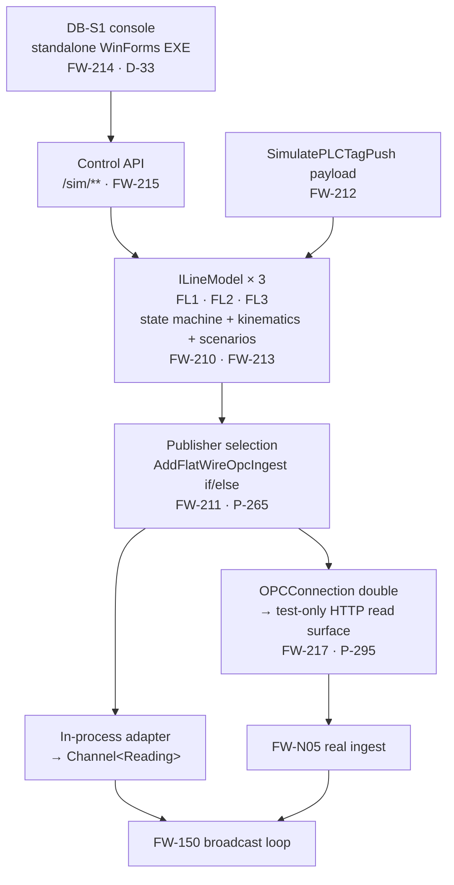

# Flat Wire Mill — Machine Simulator and its Control Console

**Project:** United Aluminum (UAL) — Flat Wire Mill Module
**Last Updated:** September 1, 2026 — change history is in [`CHANGELOG.md`](../CHANGELOG.md)
**Document Type:** Design specification — the simulation subsystem
**Status:** Baselined for build — the story set `FW-210`–`FW-215`, `FW-217`, `FW-218` is **BUILT** (29 Aug → 1 Sep 2026); still unscheduled and additive to `[CE §3b]`. Open items in §11
**Owner:** Architecture / Real-time stream
**Audience:** .NET and Angular developers, integration testers, the commissioning team
**Shortcode:** `[SIM]`
**Part of:** `ProjectPlan/Architecture/` — index: [README.md](../DOCUMENTS.md)

> **This document contains no PLC tag path strings and must never contain one.** `[PLC]` is the only tag map
> in the repository; `[PLCC]` carries none by rule, and so does this. Writing a path here creates the seventh
> copy the rule exists to prevent.

---

## 1. Purpose and boundary

### 1.1 What this is

A **machine simulator**: a model of FL1, FL2 and FL3 that runs a production run end to end and **responds to
what the application does to it**. Configure a line at check-in and the simulator's numbers change. Apply a
roll adjust and the trace moves. Pause and the speed goes to idle.

### 1.2 Why it is not `FW-203`

`FW-203` is a **feed generator** — it publishes plausible values into the bounded channel so the six trial
screens have something to render. That is the correct scope for the 30 Sep trial and it is **not being
changed**: its 8 h base / 6 h AI-assisted figure and its place in `[TRP §4]`'s T2 tail stand exactly as
published.

The difference is a closed loop. A feed generator emits; a machine model *reacts*.

| | `FW-203` | This document |
|---|---|---|
| Drives the twelve `[SIG §5.2]` events | ✅ | ✅ |
| Steerable in-spec / drifting / out-of-spec | ✅ | ✅ |
| `RUNNING → STOPPED` edge on demand | ✅ | ✅ |
| Reads the pass-schedule push and converges on its targets | ❌ | ✅ `FW-212` |
| A run lifecycle rather than free-running output | ❌ | ✅ `FW-210` |
| Footage/weight coupled to speed | ❌ | ✅ `FW-210` |
| Fault catalogue | partial | ✅ `FW-213` |
| An operator-drivable control surface | ❌ | ✅ `FW-214` / `FW-215` |
| Exercises the real ingest path | ❌ | ✅ `FW-217` only |

### 1.3 What it is explicitly not

- **Not a metallurgical model.** §5.6 lists every simplification against
  [`PassScheduleGenerationSpec.md`](../10-requirements/screens/PassScheduleGenerationSpec.md).
- **Not a verification of the interface.** §10. This is the whole of `G39`.
- **Not an operator screen.** §9.1.
- **Not a replacement for `FW-N05`.** Real OPC ingest is production work and is not offset by anything here.

### 1.4 No prior art — do not go looking

`ual-angular`'s **`slitter-setup-simulator` is not a machine simulator** — it is a slitting-pattern optimizer
(`fanout`, `generate-new-setup`, `new-setup-detail`), a business calculation over setups. `OPCConnection`
carries `OPCDA`, `OPCUA` and `OPCDataAccess` projects and **no simulation support of any kind**. There is
nothing in the UAL ecosystem to copy. This paragraph exists so the search is not repeated.

---

## 2. The four rules

Three are inherited from `FW-203` and are load-bearing. The fourth is new and is the most important thing in
this document.

### 2.1 The simulator adds no interface of its own

If the simulator needs a change to `IFlatWireClient`, to the `[SIG §5.2]` event set, or to the shape of a
`Reading`, **the contract is wrong and the contract gets fixed** — the simulator does not get an exemption.
This is exactly why `FW-150` (broadcast loop) and `FW-151` (`PLCTagService`) are **not** reduced for the
trial: the contract must be real on both sides so the real ingest drops in behind it unchanged.

The control surface in §8 is not an exception. It is a **side channel** — a separate route prefix, consumed
by nothing in the operator application.

### 2.2 Selected by configuration, not by call site

One flag pair puts the whole system in simulation. No `if (simulating)` at any call site; the seam is DI
(§3.2). This mirrors `SimulatePLCTagPush`, which `[PLC §10.2]` and `[PLCC §1.7]` both state is **`true` in
every environment until commissioning** and is **not** a dev-only mode.

### 2.3 The console is an engineering tool, not a dashboard

`DB-S1` must never enter the fifteen-dashboard inventory, the operator navigation map, or the topbar's *More
Options* tiles. §9.1.

### 2.4 ⚠ When simulation is off, the control surface does not exist

> **When no line model is hosted, the simulator routes are not registered at all.** The control endpoints
> return **`404`, not `403`**, and the console shows a lock-out panel (§9.4) rather than a live-looking surface.

⚠ **The flag is `FlatWireOpc:SimulateOpcFeed`, not `SimulatePLCTagPush`** *(corrected 1 Sep 2026 against the
built surface)*. Those are the **read and write halves of one flag pair**: `SimulateOpcFeed` decides where
readings come from, `SimulatePLCTagPush` decides whether tag writes reach a controller, and the write half is
**`true` in every environment until PLC commissioning**. Gating registration on it would map the control plane
against a **real** feed — the precise outcome this rule exists to prevent. `MapFlatWireSimControlSurface`
reads the same key that decides which publisher is registered, so the control plane and the thing it controls
can never disagree.

✅ **And the condition IS *"the readings come from a line model"* since 1 Sep 2026 — `G70` closed by `FW-215` (`P-309`).**
With `FW-217`'s `OPCConnection` double mapped, `SimulateOpcFeed` is **false** and the feed is still synthetic,
so the narrower test locks the control surface away from the one fixture that most needs it. The gate now reads `SimulateOpcFeed` **or**
`UseOpcConnectionDouble`, and the `404` was re-measured in a fresh process with neither set. The rule itself is unchanged.

This is a safety rule, not a security preference. The control API drives a subsystem that, with simulation
off, writes to a real mill. A control plane that is present-but-forbidden is one misconfigured role away from
driving a live line; a control plane that was never registered is not. Role policy (§8.4) sits **on top of**
this, not instead of it.

The same reasoning appears in `[PLC §7.3]`'s standing prohibition — **never send a stop command** — and this
rule is its analogue for the simulation surface.

---

## 3. Architecture

### 3.1 One core, two adapters, one control surface



**The physics is written once.** Both adapters host the same three `ILineModel` instances; they differ only
in where the readings are delivered.

> ⚠ **Two boxes above were amended on 31 Aug 2026, after both were built.** The diagram as first drawn
> named types that do not exist, and a reader arriving cold believed them.
>
> **`IReadingSource` was never minted** — `P-265`. The swap point is `AddFlatWireOpcIngest`'s
> `if`/`else` over two `IHostedService` implementations, and declaring the sketched interface would
> re-declare `IHostedService.StartAsync`.
>
> ⛔ **The sidecar is not an OPC server, and could not usefully be one** — `P-295`. **`FW-N05` does not
> subscribe to OPC**: its only transport is HTTP to the `OPCConnection` microservice, over
> `GetOPCInfo` and `ReadTag`, with no OPC namespace anywhere in the file — the OPC UA and DA stacks
> live inside `OPCConnection`, which `[ARC §2.2]` names as the layer to *integrate with*. An OPC UA
> server standing in front of FlatWire would be **connected to nothing**. There is also no
> `Opc.Ua.Server` package in `ual-api` at all; the four OPC Foundation packages present are
> client-side and belong to `OPCConnection`. So `FW-217` doubles **`OPCConnection`'s two read routes**,
> which is the seam the real ingest actually reads, and that is what makes *"the real ingest is
> unmodified"* satisfiable rather than decorative.
>
> **The sentence above still holds, and it is the part of the original design that survived intact:**
> both adapters host the same three `ILineModel` instances and differ only in where the readings are
> delivered. `P-297`.

### 3.2 The seam

```csharp
// FlatWire.Domain — no infrastructure dependency
public interface ILineModel
{
    string LineId { get; }                       // FL1 | FL2 | FL3
    LineModelSnapshot Tick(TimeSpan elapsed);    // advance and emit
    void ApplyConfiguration(PassSchedulePush push);
    void ApplyScenario(ScenarioId scenario);
    void InjectFault(FaultId fault);
    void SetRunState(SimRunState state);         // Idle|Running|Paused|Stopped
}

// FlatWire.Infrastructure — the swap point
public interface IReadingSource            // implemented by FW-N05 and by FW-211
{
    ValueTask StartAsync(CancellationToken ct);
}
```

> ⛔ **The sketch above is the ORIGINAL DESIGN and is stale in four ways. It is kept as the record of
> the design; read `ILineModel.cs` in `ual-api` for what was built.** ⚠ `IReadingSource` was never
> minted (`P-265`, and see §3.1). ⚠ `Tick` returns **`Reading`** and **no `LineModelSnapshot` exists** —
> `Reading` already *is* the per-line-per-tick snapshot, so a second type would be a second contract for
> one fact plus a mapping layer at the cadence (`P-268`). ⚠ `Line` is the **`LineId` enum**, not a
> string, because every other member of the real-time spine is keyed that way (`P-268`). ⚠ There are
> **six mutators, not five**: `InjectFault` takes a duration in ticks, `ApplyComponent` merges one
> component's pushed set-points (`P-280`), and **`Steer`** exists because the five sketched mutators
> cannot express `[SIM §8.1]`'s `POST /sim/{lineId}/steer` — a hole in the contract rather than a
> preference (`P-269`). ⚠ `ApplyConfiguration` takes `PassScheduleSnapshot`, a Domain value object,
> rather than the sketched `PassSchedulePush`. **The amendment of this sketch is owed to `FW-210` /
> `FW-211`; this note is not it.**

`FW-N05`'s real hosted service and `FW-211`'s simulation host are **selected by configuration in
`Program.cs`** — `AddFlatWireOpcIngest`'s `if`/`else`, and by `P-296` the `OPCConnection` double is
selected the same way, in the same place. Neither publisher knows the other exists, and **exactly one of
them may write to the bounded channel**: registering both would double-write every tick (`P-134`).

### 3.3 Why both adapters, and in this order

| | In-process (`FW-211`) | Double (`FW-217`) |
|---|---|---|
| Injects at | `Channel<Reading>` | ~~a real OPC UA endpoint~~ **`OPCConnection`'s two HTTP read routes** — `GetOPCInfo` and `ReadTag`, the seam `FW-N05` actually reads (`P-295`) |
| Exercises `FW-N05` | **No** — bypasses it | **Yes** — and the ingest is byte-identical while it does (`P-37`, measured 31 Aug 2026) |
| Infrastructure | none | ~~a server process~~ **none.** Mapped inside `FlatWire.API` at `api/v1/OPCConnection`, so one configuration source serves both sides of the tag map (`P-302`) |
| New packages | none | **none.** `UA.APIDTO` is already referenced; there is no `Opc.Ua.Server` package in `ual-api` to add |
| Steerable | **Yes** — `/sim/**` (`FW-218`) | ~~**No — `G70`**, `/sim` being mapped only when the feed is simulated~~ **Yes, since 1 Sep 2026 — `G70` closed by `FW-215`.** The gate became *"a line model is hosted"* and both hosts satisfy `ISimLineHost` (`P-309`, `P-307`), so steer, drop, scenario, fault, all four run states and a model replacement all drive the double. `P-304`'s 503-on-a-silent-tick branch is reachable at last |
| Serves | the trial, dev, component tests | E2E, UAT rehearsal, commissioning rehearsal |
| Cost | 12 h | 24 h — ⚠ priced with *"plus the server host"*, which is not what was built |

In-process first because it is what unblocks screens with no infrastructure. The double second because
`[TS §3.1]` **already assumes a fixture exists** for staging E2E, and `FW-217` gives that row an owner
rather than inventing a second one.

⚠ **`[PLC §5.3]` A5 — never the production OPC servers — is honoured STRUCTURALLY rather than by policy**,
and the amended shape is what makes that true: the double holds no OPC client, no server address and no
connection of any kind, so a production OPC server cannot be reached through it even by
misconfiguration. Its two routes are also **not mapped at all** unless the feed is real *and* the double
is asked for — 404 and not 403, the same posture §2.4 takes with `/sim`.

---

## 4. The three line models

Each is a distinct state machine, not three instances of one. Component vocabulary is the schema's:
`DB1` · `DB2` · `FM1` · `EdgeSet` · `FM2_S1` · `FM2_S2` · `FM2_S3` (`CK_PSC_ComponentName`).

### 4.1 FL1 — standalone, real-time

Rod → wire drawing (`DB1`, `DB2`) → 12″ mill `FM1` → intermediate spool. **No edger.** Gauge trace is
real-time, so `GaugeReading` and `WidthReading` both flow batched.

Terminal condition: the spool reaches its target weight, the line stops, and the model raises the
`RUNNING → STOPPED` edge that arms `FW-202`'s stop-confirmation state machine.

### 4.2 FL2 — standalone, historical profile

Pre-flattened spool → `FM2_S1` (8″) → `FM2_S2` (6″) → `FM2_S3` (6″, final, **non-bypassable**) → coreless
coil. Edgers at `S2` and `S3` only, **inter-stand** (`D-27`).

> ⚠ **FL2 ticks. Only two channels are suppressed.** `[SIG §5.3]` suppresses **only** the batched
> `GaugeReading` and `WidthReading`; `SpeedFPM`, `PayoffWeight`, `FootageCounter`, `ComponentStatus` and
> `LineStatus` **still flow**, and `FR-120` makes live gauge/width **`null`**. A simulator that treats FL2 as
> silent leaves both FL2 trial screens dead — `FW-203`'s acceptance criteria already say so, and this model
> inherits the rule.

The model still computes gauge and width internally — it needs them for the `RunReading` profile the Live
view's *Profile* tab reads back over REST — it simply does not broadcast them live.

### 4.3 FL3 — hybrid, and genuinely a different model

FL1 feeding FL2 continuously with **no intermediate anneal**. Not two models chained: **one run**, one
`FlatWireRun` row with `RouteMode='Hybrid'`, coupled speeds through the whole chain, and a **single batched
PLC push** on one acknowledgement.

Two things the model must not guess:

- **Mass flow couples the speeds.** `FM1` exit speed sets `FM2_S1` entry speed; the model derives the rest
  from the reduction chain rather than driving each stand independently.
- **The controller topology is unresolved** — `PLC-Q08` / `G30`. Whether the push reaches one controller or
  two is a **configuration** value in the model, never a special case in code. `[PLCC §1.6]` gives the same
  instruction for `ITInhibit` and the reasoning transfers exactly.

### 4.4 Run state versus line state — two vocabularies, do not conflate

| | Source | Values | Who owns it |
|---|---|---|---|
| **Run status** | `CK_FlatWireRun_Status` | `Running` · `Paused` · `Complete` · `Aborted` | Ours. Settled |
| **Line state** | the PLC line-state tag | **undocumented** | The controller. `OI-35`, confirmed at `C2` |

The `RUNNING → STOPPED` edge in `FR-141` is the **line state**, not the run status — a mill can stop with the
run still `Running`. The model drives both and keeps them separate. **The line-state vocabulary the simulator
uses is our invention** and is the first row of `G39`'s assumption table.

---

## 5. The kinematic model

Responsive, not metallurgical: enough that a run behaves believably and reacts correctly, without claiming to
predict what the mill produces.

### 5.1 The tick

One tick at the configured cadence. Everything below advances by `Δt`.

### 5.2 Footage and speed

```
speed(t)     = setpoint × rampFactor(t) + noise           // ramps, does not step
footage(t)   = footage(t-1) + speed(t) × Δt / 60          // ft, from FPM
```

`FootageCounter` is monotonic within a run and never decreases — die life reads it (`[PLC §9]` moment 9), so
a decrement would corrupt a maintenance figure.

### 5.3 Weight depletion

```
payoffWeight(t) = startWeight − footage(t) × lbPerFt
percentRemaining = payoffWeight(t) / startWeight
```

> ⚠ **`lbPerFt` is the single most load-bearing unverified number in this model.** `Q10` (footage→weight)
> deliberately carries **no recommendation** — the dimensional basis is a measurement question UA must answer
> from its own practice, and `OI-45` tracks it with a 16–32 h reserve on Phase 9. The simulator must read
> `lbPerFt` from configuration, **surface it on the console** (§9.2), and never bury it as a constant.

### 5.4 Gauge and width — the closed loop

The model holds a **target** per channel, taken from the pass-schedule push (§6), and converges on it:

```
gauge(t) = gauge(t-1) + (target − gauge(t-1)) × k·Δt      // first-order approach
         + drift(t)                                       // scenario-driven
         + noise                                          // bounded, seeded
```

Three consequences that make it feel like a machine:

- **A check-in acknowledgement changes the numbers.** Push a schedule with a different gauge target and the
  trace walks to it.
- **A roll adjust moves the trace within one cadence.** `FW-070`'s *Apply* writes one component's roll gap;
  the model shifts that stand's target accordingly. Without this the roll-adjust dialog is untestable.
- **A bypassed component contributes nothing.** `State` is `Active` · `Bypass` · `Skip` (`CK_PSC_State`).

### 5.5 Mill spring — modelled in the correct direction

The roll gap sits **below** the finished gauge by a load-dependent mill-spring term. `PassScheduleGenerationSpec.md`
§3.3.7 is the basis, and master spec §10.5 arbitrates it against `FR-386`.

**Get the sign right.** Springback-as-an-alloy-multiplier placing the gap *above* gauge is the error §10.5
exists to correct — a machine stiffness misfiled as a material property. The simulator uses a simple
load-proportional term; it does not compute rolling force.

### 5.6 The assumption table — `G39`'s instrument

Each row is independently confirmable at `C13`. **This table is the point of `G39`**; keep it maintained.

| # | Assumption | Basis | How it is confirmed |
|---|---|---|---|
| A1 | The line-state vocabulary | **Ours** | `C2` |
| A2 | `lbPerFt` and its dimensional basis | Configuration; undecided | `Q10` / `OI-45` |
| A3 | Cadence and AGC sample rate | **Picked, not derived** | `G9` / `OI-34`, `PLC-Q11` |
| A4 | Gauge converges first-order with constant `k` | Modelling choice | `C8` observation |
| A5 | Mill spring is load-proportional, gap below gauge | `PSG` §3.3.7, master spec §10.5 | `C1`–`C11` observation |
| A6 | Noise is bounded and Gaussian | Modelling choice | `C8` observation |
| A7 | Speed ramps rather than steps | Modelling choice | `C8` observation |
| A8 | Lateral spread is ignored; width is targeted directly | **Simplification** vs `PSG` §3.3.3 | Accepted, not confirmable |
| A9 | Rolling force and drive power are not computed | **Simplification** vs `PSG` §3.3.6 | Accepted, not confirmable |
| A10 | FL3 stand speeds derive from the reduction chain | `PSG` §3.3.8 | `C5` + the `G30` topology answer |

A8 and A9 are deliberate and permanent. A1–A7 are provisional and must be reconciled.

### 5.7 Determinism

**The noise generator is seeded and the seed is a control-API parameter.** A test that cannot reproduce its
input is not a test, and `TC-620`–`TC-623` are already untestable for want of targets (`G9`); an
irreproducible simulator would make that worse rather than better.

---

## 6. The closed loop with `SimulatePLCTagPush`

Today a simulated push logs the write it would have made and discards it. `FW-212` feeds it back.

| Payload item (`[PLC §7.2]`) | What the model does with it |
|---|---|
| Component active / bypass state | Sets which components contribute; a bypassed stand is inert |
| DB1 / DB2 die sizes | Sets the drawing reduction chain (FL1/FL3) |
| FM1 and FM2 roll gaps | Sets each stand's gauge target via §5.5 |
| Edge type (`Round`/`Square`) | Recorded; affects the width target only (FL2/FL3) |
| Speed | The speed setpoint the ramp approaches |
| Gauge and width targets | The convergence targets of §5.4 |

**Ordering is inherited, not reinvented.** `[PLCC §1.2]` requires records to be written **before** tags are
pushed; the model observes the push and therefore sees it after the record exists. A simulator that reacted
first would invert an ordering the real system guarantees.

**Failure injection respects the compensating-write model.** `[PLCC §1]` and `G16` are explicit that OPC
writes are not transactional and recovery is a **compensating re-clear**. When §7 injects a push failure the
model must leave the line on its *previous* configuration — the exact silent failure `G32`/`G33` warn about,
which is what makes it worth simulating. **The word "rollback" must not appear** in this subsystem.

---

## 7. Scenario and fault catalogue

`FW-213`. ✅ **Every entry is reachable from the control API** since `FW-215` (1 Sep 2026) — all five scenarios
and all seven faults, on both hosts.

⚠ **Two qualifications, and both matter to whoever writes a test against this catalogue.**

⛔ **`ToTarget` and `WeightVariance` are built INERT and DECLINE BY NAME** while
`FlatWireOpc:Simulation:LbPerFt` is unset. Both are weight-driven, that value is deliberately null with no C#
default (`P-271`) because `Q10` / `OI-45` leave the footage-to-weight basis undecided, and so they have nothing
to run against. The control API answers **`422` carrying the model's own explanation** — never a `500`, and
never a silent no-op (`P-311`). ⚠ **Setting `LbPerFt` to enable them is a LABELLED ASSUMPTION** — §5.6 row
`A2` — **not a fix.**

⚠ **Not every entry is reachable from the CONSOLE.** `DB-S1` is built and still greys **six of the seven fault
buttons**, the scenario picker and the seed, and has no `Pause` control at all; those controls were greyed when
the endpoints did not exist, and lighting them up is `FW-214`'s work rather than this document's (see §11).

### 7.1 Scenarios — the shape of a whole run

| Id | Behaviour | Exercises |
|---|---|---|
| `InSpec` | Converges and holds inside tolerance | The happy path |
| `Drifting` | Slow monotonic walk toward a tolerance band | Die-wear prompts, the die-change chain |
| `OutOfSpec` | Crosses the band and stays out | DB3's N-consecutive auto-prompt; the SPC → WIP-rejection chain |
| `Erratic` | High-variance, in-band on average | Chart rendering and the ring buffer under load |
| `ToTarget` | Runs to the spool target weight and stops. ⛔ **Inert — declines by name while `LbPerFt` is unset** | `FW-202`, the whole spool-completion path |

### 7.2 Faults — injected at a moment

| Id | Behaviour | Exercises |
|---|---|---|
| `LineStop` | `RUNNING → STOPPED` edge, weight latched at the stop timestamp | `FR-141`–`FR-143`; `SpoolCompletionPromptDue` **once per stop** |
| `CommsDrop` | Readings cease; the hub connection is not closed | `FR-119` — cached state behind *"Reconnecting…"*, **never a blank screen** |
| `Stall` | Speed → 0, run still `Running` | The run/line-state distinction of §4.4 |
| `WireBreak` | Stop + a break marker | `G34`'s decided-but-unpersisted flow |
| `DieWear` | Accelerated footage against `Drawer.LastGrindingFeet` | Die-life bands (60 / 85 %) |
| `PushFailure` | The push is refused; the line keeps its previous configuration | §6's compensating re-clear; the silent failure of `G32`/`G33` |
| `WeightVariance` | Actual diverges from calculated beyond ±2 %. ⛔ **Inert — declines by name while `LbPerFt` is unset** | `FW-202`'s scale-vs-calculated override |

### 7.3 What must stay reproducible

`LineStop` must be **edge-triggered exactly once per stop** (`FR-141`). A simulator that raises it repeatedly
would mask a client that is not idempotent — and idempotency on re-delivery is specified behaviour, not a
fault (`[SIG §5.2]`).

---

## 8. The control surface

`FW-215`. Base **`/sim`**, a **minimal-API route group**, the standard `{data,success,errors}` envelope.

⚠ **Two corrections, made 1 Sep 2026 against the built surface — this paragraph read *"Base
`/api/v1/flatwire/sim`, thin controllers over MediatR … from `UAController`"*, and both halves were wrong.**
The prefix is **`/sim`**, which is what §8.2 has always said, what `FW-218` shipped and what `FW-214`'s
delivered console calls. And the group is deliberately **not** attribute-routed controllers (`P-38`): a
controller is discovered by the MVC application model and would have to be *un-mapped* by a convention, so the
route would exist and then be removed — a weaker claim than never mapping it, and §2.4's rule is an absolute.
**The envelope's wire shape is unchanged**, which is all a client depends on.

### 8.1 Endpoints

| Method | Route | Purpose |
|---|---|---|
| `POST` | `/sim/{lineId}/run` | Start a run — scenario, seed, start weight, target, **target run state** |
| `DELETE` | `/sim/{lineId}/run` | Stop; optionally as a `LineStop` edge |
| `POST` | `/sim/{lineId}/steer` | Change speed setpoint, targets or drift mid-run |
| `POST` | `/sim/{lineId}/fault` | Inject one fault from §7.2 |
| `GET` | `/sim/state` | One snapshot **per hosted line, at most two** — the console's poll-free read on load |
| `GET` | `/sim/config` | The active `lbPerFt`, the noise **seed** and the simulation flag — §9.2's two required readouts (`G68`) |

**Six endpoints, and all six are BUILT.** `FW-218` shipped `steer`, `stop`, `fault` and `state` over the feed
generator (29 Aug 2026), and `FW-215` **re-pointed them at the line model and added `POST /run` and
`GET /config`** (1 Sep 2026) — paths, shapes and semantics unchanged, because `P-39` makes that earlier surface
a *subset* of this one and never a variant.

⚠ **The price is still `[CE §2]`'s 23 h, and this section does not re-derive it.** That figure bought **five**
endpoints — four commands @ 5 h + one query @ 3 h, at the **restated 15 Aug 2026** rates — and `FW-215` spent
it on `POST /run`, `GET /config`, the `G70` seam and re-pointing the four, because four of the five it priced
were already built under `FW-218`'s own 18 h. **Re-aimed, not re-priced.** ⛔ **A six-endpoint re-price is
`[CE]`'s to make, not this document's** — see the card in `[TB §7]`.

⛔ **`POST /run` REPLACES the line's model rather than mutating one — `P-306`, and it is the one route of the
five that does.** Two of its parameters have **no lever** on `ILineModel`: the noise seed is applied in
`LineModelBase`'s **constructor** and the start weight is constructor-only too. ⚠ **That is the correct
semantics rather than a workaround** — §5.7's *"the same seed reproduces the same trace, tick for tick"* is a
property of a model **seeded at construction**, so a mid-run reseed would restart the noise against
already-advanced footage and reproduce nothing. The **target run state** in the row above is what makes §9.2's
`Pause` reachable (`G73`); `DELETE /run` keeps the `Stopped` edge.

✅ **`GET /sim/config` is the sixth row above as of 1 Sep 2026, which closes `G68`'s specification half.**
That gap was raised because §9.2 requires `DB-S1` to display the active `lbPerFt` and the noise seed, §5.3
insists `lbPerFt` *"must not be buried as a constant"* — *"the single most load-bearing unverified number in
this model"* — and **nothing on any wire carried either**: the original five routes had no configuration read
and §9.2 forbids widening `SimLineState`. It is now built **and** specified.

⚠ **A read was sufficient, and the gap had been read as asking for more.** §9.2's *"settable"* attaches to the
**seed alone**, and the seed is already `POST /run`'s parameter — so ⛔ **no configuration write exists and none
is owed.** A runtime `lbPerFt` setter would answer `Q10` / `OI-45` by the back door, against `P-271`'s standing
rule that the value gets no default of any kind. ⚠ **`lbPerFt` is nullable and answers null while unset**, so
the console renders an explicit *unset* rather than a `0` that would read as measured (`FW-214`'s `P-290`).

⚠ **`G68`'s remaining residual is the CONSOLE's, not this document's** — `FW-214` is built and binds nothing
to this endpoint. See §11.

⛔ **`/sim/state` carries AT MOST TWO lines and never three — and that is by design, not pending a gap**
*(corrected 1 Sep 2026)*. `FlatWireOpc:IngestLines` decides what is hosted, an empty list is refused at
startup, and the standing rule is **`{FL1,FL2}` or `{FL3}`**: under one answer to `PLC-Q08` the FL3 finishing
stands are addressed `FL2.FM2.*`, so polling FL2 and FL3 together would read **the same load cell and the same
three stands twice a second**. **The row above said *"All three models' snapshots"*, and no configuration can
produce that.** Write no console and no test that expects three.

⚠ **An unhosted line is OMITTED from the answer and the status is still `200`** — a short list. The `400`
belongs to the **per-line** routes, which name the reason rather than reporting a bad request value. `FW-214`
greys its FL3 controls for the same reason.

✅ **§9.2's `Pause` control is commandable since 1 Sep 2026 — `G73` closed by `FW-215`.** The surface's only
run lever had been a boolean mapping to `Running` / `Stopped`, so **`SimRunState.Paused` and `Idle` could not
be commanded from outside the process at all** and §4.4's distinction — a line paused while the run is still
`Running` — had never been demonstrable. `POST /run` now carries a **target run state**, measured on both
hosts, and **no seventh route was added**: `DELETE /run` still carries the `Stopped` edge `FW-202` is armed by.
⚠ **This ARMS `G69` rather than resolving it** — a chip fed from `SimLineState.Running` can now be caught
showing `Paused` as stopped, which it could not be before.

### 8.2 These are not in any endpoint count

`[API]` publishes the operator application's REST surface, and its total is asserted in **`[API §3.2]`** and
nowhere else. These endpoints are **not** among them and must not be added to that count — they are an
engineering surface on a separate prefix. `[API §9.2]`'s missing-endpoint list is unaffected.

⚠ **This section used to type *"30 REST endpoints"*.** `[API §3.2]` has published a different figure since
15 Aug 2026 and calls the old one *"wrong in both halves"*, so the number is now cited rather than repeated.
**The rule never depended on it.**

### 8.3 Registration is conditional

Per §2.4 the whole route group is registered **only** when a line model is hosted. Absent, not forbidden.
✅ **The test reads `FlatWireOpc:SimulateOpcFeed` OR `FlatWireOpc:UseOpcConnectionDouble` since 1 Sep 2026**,
which is `G70` closed — it had been the read flag alone, locking the control surface away from `FW-217`'s
double. See §2.4.

### 8.4 Authorisation

**`Engineering/Maintenance`** or `Admin` only, on top of **§2.4 / §8.3's** conditional registration *(this read
"§2.3's", corrected 1 Sep 2026 — §2.3 is the not-a-dashboard rule)*. Never `Operator` — an operator has no
reason to steer the machine model, and on a shopfloor panel the console must not be reachable at all.

⚠ **The role name is the matrix's, not this document's shorthand.** `[SEC §8]`'s six roles include
**`Engineering/Maintenance`**; there is no `Engineer` column, and the constants class the guards bind to uses
the matrix's spelling. `FW-145` registers the policy — **`SimulatorControl` = `RequireRole(EngineeringMaintenance,
Admin)`** — and this surface **will bind that policy** rather than restate role strings.

✅ **As built (1 Sep 2026, `P-310`) the surface binds the CONSTANTS, not yet the policy** — so the literal
`"Engineer,Admin"` is gone and the spelling lives in `FlatWireRoles` alone, which is that file's own rule:
*"policies and group joins bind to the constants, never to literals."* ⛔ **The POLICY remains `FW-145`'s to
register** — `FlatWireRoles` forbids building it here (`P-75`) — **and the six constants are still `TBD`, so
this surface denies every caller today** and says so at start-up rather than looking guarded. That is `G72`,
**narrowed and reassigned to `FW-145`**, not closed.

⛔ **The role policy is the backstop, never the control.** `[SEC §8.8b]` is explicit, and `G66` records why:
do not "fix" a reachability concern by adding a role check in place of the `404`.

---

## 9. The console — `DB-S1`

`FW-214`. Layout reference: `../50-frontend/mockups/simulator_console.html`.

> ⚠ **`DB-S1` is a standalone WinForms desktop tool, not an Angular screen — `D-33`, 29 Aug 2026.**
> It lives in `ual-api/Tools/FlatWireSimConsole/` (`net8.0-windows`, its own `.sln`, beside the existing
> `Tools/ConfigureAPI` WinExe) and builds and releases **independently of `ual-angular`**. It remains a **thin
> client**: the `ILineModel` instances of §4 stay in `FlatWire.API`, and the console drives them over §8's
> `/sim` endpoints and consumes the `[SIG §5.2]` hub. **§2.1 is unchanged and still binds — the console adds
> no interface of its own.**
>
> **Why the move.** `flat-wire` is an Angular *library*, not a build target: it ships **inside the shop-floor
> bundle** (`[DEP §1.1]`), and every environment build rebuilds all seventeen libraries plus the application.
> §9.1 spends four rules insisting this is not part of the operator suite, and then it shipped in the operator
> suite's bundle. A separate executable makes §9.1 structural rather than declarative.
>
> **Anything describing `DB-S1` as an Angular route, a `flat-wire` screen, or a consumer of
> `flat-wire-topbar.js` / `flat-wire-fit.js` / `fw-modal.js` / the `--color-*` tokens is stale.**

### 9.1 ⚠ It is not a dashboard

| Rule | Why |
|---|---|
| **Not** in the fifteen-dashboard inventory | It is not an operator screen and has no `FR-###` behind it |
| **Not** in the navigation map | `[SCR]` registers it explicitly as non-operator |
| **Not** in the topbar *More Options* tiles | Those are operator actions |
| **No** `DB##` number | `DB-S1` — deliberately outside the numbering so no reader mistakes it for one of the fifteen |
| **Not in the operator application at all** | `D-33` — it is a separate executable, installed only where it is needed |

**Every one of those rules is stronger since `D-33`, not weaker.** The console used to satisfy the first four
by convention while shipping in the same bundle as the fifteen; it now satisfies them by construction. The
cost is that *"consistency is free"* no longer applies — the shared chrome is gone, and §9.3 replaces it.

### 9.2 Layout

Three line panels — FL1, FL2, FL3 — each carrying:

- state badge (run status **and** line state, per §4.4 — two separate chips)
- **Start** / **Stop** / **Pause**, and the scenario picker of §7.1 — ✅ **`G73` closed server-side 1 Sep 2026.**
  `POST /run` now carries a **target run state**, so `SimRunState.Paused` and `Idle` are commandable and
  §4.4's distinction is demonstrable for the first time — measured on both hosts. ⚠ **The console is
  still two buttons**: `FW-214` is built and has no Pause control at all, so the residual is on it
- live readouts: speed, footage, payoff weight, percent remaining
- target-vs-actual strip for gauge and width — **FL2 renders these as *No live gauge · see Profile***, never
  a flat line at target
- a speed slider and gauge/width target nudges (`/sim/{lineId}/steer`)
- the seven fault buttons of §7.2

Plus, global:

- a **simulation on/off** indicator that reads the **configuration**, not the UI state
- the active **`lbPerFt`** value, displayed, because §5.3 says it must not be buried
- the noise **seed**, displayed and settable

> ⚠ **"Settable" attaches to the seed only, and `G68` had been reading it as both** *(clarified 1 Sep 2026)*.
> `lbPerFt` is **displayed**; making it settable at runtime would decide `Q10` / `OI-45` by the back door,
> against `P-271`. So the configuration read `G68` asks of `FW-215` is a **read**, and the seed's settable half
> is already `POST /sim/{lineId}/run`'s seed parameter (§5.7). **No configuration write is owed.**

> ⚠ **The three panels seed from `GET /sim/state` and then live on the hub.** As built, `SimLineState` carries
> **six fields** — line, running, footage, gauge offset, drift per tick, dropped-tick countdown. **Speed,
> payoff weight, percent remaining, gauge and width actuals, line state and run status are not in it** and
> come from `[SIG §5.2]` events 1–7. **Do not widen `SimLineState` to fill the panels**: §2.1 forbids the
> simulator adding an interface of its own, and the control surface's own note warns that a console polling
> that endpoint would be *a second telemetry path competing with the hub*.

> ⚠ **The console does not open when simulation is off.** It probes `GET /sim/state` at startup and, on
> **404**, shows a lock-out panel and nothing else. See §9.4 — this is the client half of `[SEC §8.8b]`, and
> the server-side 404 remains the actual control.

### 9.3 Build rules

⚠ **These replaced the Angular chrome rules on 29 Aug 2026 (`D-33`).** The previous list — `--color-*` tokens,
`flat-wire-topbar.js` then `flat-wire-fit.js`, `fw-modal.js`, the 14 px minimum, the footer-icon rule and
`data-testid` — applied to an Angular screen and **no longer applies to anything**. It is preserved in
[`CHANGELOG.md`](../CHANGELOG.md), not here.

**Project**

- `ual-api/Tools/FlatWireSimConsole/`, `net8.0-windows`, `<OutputType>WinExe`, **its own `.sln`**. The
  precedent is `Tools/ConfigureAPI`, already a WinExe in that repository.
- `Tools/` sits **outside `API/Directory.Packages.props`**, so this project pins its own package versions
  inline, as `ConfigureAPI` does. Target `net8.0-windows` to match `FlatWire.API`'s `net8.0` — do **not** copy
  `ConfigureAPI`'s older `net6.0-windows`.

**The contract is referenced, never re-declared**

- Link `FlatWire.Domain/Models/RealTime/HubContracts.cs` and `FlatWire.Domain/Enums/CanonicalEnums.cs` as
  `<Compile Include …>` items. `HubContracts.cs` depends on nothing but those enums, so this costs **no
  package graph** and no EF Core dependency.
- ⚠ **Do not hand-write DTOs.** `HubContracts.cs` states *"names are the contract on both ends … a rename here
  is a breaking change."* A .NET client compiles against the real types; `[SIG §5.6]`'s Angular mirror is a
  hand-copy and `FW-135` maintains it. This is the one place the desktop client is strictly safer.

**Transport**

- `Microsoft.AspNetCore.SignalR.Client`, **on the JSON protocol**. ⚠ **Do not add the MessagePack protocol
  package.** `FlatWire.API` registers `AddJsonProtocol` unconditionally beside the `EnableMessagePack` switch
  and aligns both on **string enums** — a client built against MessagePack breaks the moment that switch is
  turned off to measure, which `[SIG §4.1]` and `G10` say is expected to happen.
- WebSockets + `SkipNegotiation`; JWT through `AccessTokenProvider`; `WithAutomaticReconnect()`;
  `JoinLineGroup` / `LeaveLineGroup` with **re-join on reconnect**; hub callbacks marshalled to the UI thread.
- Cached last-known state behind *"Reconnecting…"* — **never a blank screen** (`FR-119`).

**Structure and identification**

- **One `LinePanel` `UserControl`, instantiated three times.** The three lines differ by configuration, not by
  three hand-built panels — the same rule §4 applies to the models.
- Consistent `Control.Name` / `AccessibleName` on every control. ⚠ **`data-testid` is withdrawn**: it exists
  for the Playwright suite (`[SP §9.2]`), which cannot drive WinForms, and `DB-S1` was never in an E2E
  journey. **There is no UI-automation consumer today** — record that rather than inventing one.
### 9.4 What "does not exist when simulation is off" means for an executable

§2.4 and `[SEC §8.8b]` require the control surface to be **absent, not forbidden**. An Angular route honoured
that by not resolving; an EXE cannot be unregistered. The guarantee splits into three parts, and only the
first is enforced:

| Layer | Strength |
|---|---|
| **The server refuses.** With `SimulateOpcFeed` false, `MapFlatWireSimControlSurface` returns before mapping anything, so every `/sim` route is **404**. **This is unchanged by `D-33` and is the real control** | **Enforced** |
| **The console refuses to open.** It probes `GET /sim/state` at startup and shows a lock-out panel on 404, so it cannot present a live-looking surface against a commissioned line | **Enforced, client-side** |
| **It is not installed on a commissioned line.** An EXE can simply be absent from the machine, where the `flat-wire` bundle shipped to every operator regardless | **Procedural — see `G66`** |

**The net position is stronger, not weaker.** `[SEC §8.8b]` already says *"the 404 is the control; the role
policy is the backstop, not the reverse"* — and the 404 is server-side. What `D-33` adds is that the tool is
no longer distributed to machines that must never run it. What it gives up is that installation policy is a
procedure rather than a build-time fact, which is **`G66`**.


---

## 10. What the simulator cannot prove

A simulator built from our assumptions can only confirm our assumptions. Four things stay open no matter how
good it gets, and **`G39`** exists because building a convincing one makes this easier to forget:

| Unprovable | Why | Closed by |
|---|---|---|
| Tag paths | All 41 are `[PROPOSED]`; the whole map is unconfirmed | `C1` / `C11` — `G32`, `G33` |
| Line-state vocabulary | Undocumented; the simulator uses ours | `C2` — `OI-35` |
| Footage → weight | Dimensional basis undecided, no recommendation offered | `Q10` / `OI-45` |
| Cadence and latency | No AGC sample rate, no latency budget | `C8` — `G9` / `OI-34` |

`[TRP §9]` states the position and it is not improved by anything here: **"the trial proves the screens, not
the machine."** A richer simulator raises the ceiling on what the screens can be shown doing. It does not
move that line.

---

## 11. Open items

| Ref | Item |
|---|---|
| **`G39`** | The simulator's assumptions are unreconciled against the real line. §5.6 is the instrument; `C13` is the proposed act |
| `G9` / `OI-34` | No target cadence — `FW-203`'s own listed blocker. **Pick one and record it** |
| `Q10` / `OI-45` | `lbPerFt` dimensional basis |
| `OI-35` | Line-state vocabulary |
| `G30` / `PLC-Q08` | FL3 controller topology — configuration, never a code branch (§4.3) |
| `G34` | Wire break has a decided flow and no persistence target; the `WireBreak` fault can be simulated before it can be stored |
| `G66` | `DB-S1` is unreachable-by-**procedure** rather than by construction — an EXE cannot be unregistered (§9.4). The server-side `404` is unaffected and remains the actual control |
| `G69` | Two state chips, one wire vocabulary (§9.2, §4.4). ⚠ **Armed since 1 Sep 2026** — `Paused` is now commandable, so a chip fed from `SimLineState.Running` can be caught showing it as stopped |
| `G71` | FL2's only load cell has **no tag key** — §4.2's model reports an instrument the tag surface cannot carry, so it crosses the in-process feed and not the real path |
| `G72` | The simulator guard's role name and policy (§8.4). **Narrowed and reassigned to `FW-145`** — listed here as an index entry, not as work this document owes |

> ⚠ **Residuals on gaps already RESOLVED, recorded here because each still owes something — and both are
> now the CONSOLE's, not this document's.** **`G68`** — `GET /sim/config` is built **and** specified (§8.1,
> 1 Sep 2026), so nothing is owed here; `FW-214` binds nothing to it and still renders *unset*.
> **`G73`** — `Paused` and `Idle` are commandable, and `DB-S1` has **no Pause control at all**, not even a
> greyed one. Both changes are `FW-214`'s.
>
> ⚠ **Two open gaps are deliberately absent.** **`G59`** (a background OPC call has no service identity, so
> the double's end-to-end leg cannot run) is `FW-237`'s and concerns the ingest's authentication rather than
> this design — it sits in `FW-217`'s `blocked_by`. **`G32`/`G33`** are already carried by §10's *Tag paths*
> row, and repeating them here would assert one fact twice.
