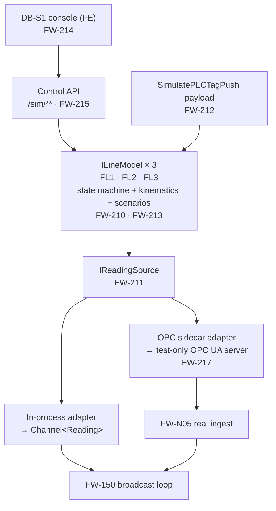

# Flat Wire Mill — Machine Simulator and its Control Console

**Project:** United Aluminum (UAL) — Flat Wire Mill Module
**Last Updated:** August 15, 2026 — first issue. Specifies the FL1/FL2/FL3 machine simulator (`FW-210`–`FW-215`, `FW-217`) and its engineering control console `DB-S1`. Supersedes nothing; **extends** `FW-203`, whose 8 h / 6 h figures and `[TRP §4]` schedule are unchanged
**Document Type:** Design specification — the simulation subsystem
**Status:** Proposed — no story scheduled beyond `FW-203`
**Owner:** Architecture / Real-time stream
**Audience:** .NET and Angular developers, integration testers, the commissioning team
**Shortcode:** `[SIM]`
**Part of:** `ProjectPlan/Architecture/` — index: [README.md](../DOCUMENTS.md)

> **This document contains no PLC tag path strings and must never contain one.** `[PLC]` is the only tag map
> in the repository; `[PLCC]` carries none by rule, and so does this. Writing a path here creates the seventh
> copy the rule exists to prevent.

---

## 1. Purpose and boundary

### 1.1 What this is

A **machine simulator**: a model of FL1, FL2 and FL3 that runs a production run end to end and **responds to
what the application does to it**. Configure a line at check-in and the simulator's numbers change. Apply a
roll adjust and the trace moves. Pause and the speed goes to idle.

### 1.2 Why it is not `FW-203`

`FW-203` is a **feed generator** — it publishes plausible values into the bounded channel so the six trial
screens have something to render. That is the correct scope for the 30 Sep trial and it is **not being
changed**: its 8 h base / 6 h AI-assisted figure and its place in `[TRP §4]`'s T2 tail stand exactly as
published.

The difference is a closed loop. A feed generator emits; a machine model *reacts*.

| | `FW-203` | This document |
|---|---|---|
| Drives the twelve `[SIG §5.2]` events | ✅ | ✅ |
| Steerable in-spec / drifting / out-of-spec | ✅ | ✅ |
| `RUNNING → STOPPED` edge on demand | ✅ | ✅ |
| Reads the pass-schedule push and converges on its targets | ❌ | ✅ `FW-212` |
| A run lifecycle rather than free-running output | ❌ | ✅ `FW-210` |
| Footage/weight coupled to speed | ❌ | ✅ `FW-210` |
| Fault catalogue | partial | ✅ `FW-213` |
| An operator-drivable control surface | ❌ | ✅ `FW-214` / `FW-215` |
| Exercises the real ingest path | ❌ | ✅ `FW-217` only |

### 1.3 What it is explicitly not

- **Not a metallurgical model.** §5.6 lists every simplification against
  [`PassScheduleGenerationSpec.md`](../10-requirements/screens/PassScheduleGenerationSpec.md).
- **Not a verification of the interface.** §10. This is the whole of `G39`.
- **Not an operator screen.** §9.1.
- **Not a replacement for `FW-N05`.** Real OPC ingest is production work and is not offset by anything here.

### 1.4 No prior art — do not go looking

`ual-angular`'s **`slitter-setup-simulator` is not a machine simulator** — it is a slitting-pattern optimizer
(`fanout`, `generate-new-setup`, `new-setup-detail`), a business calculation over setups. `OPCConnection`
carries `OPCDA`, `OPCUA` and `OPCDataAccess` projects and **no simulation support of any kind**. There is
nothing in the UAL ecosystem to copy. This paragraph exists so the search is not repeated.

---

## 2. The four rules

Three are inherited from `FW-203` and are load-bearing. The fourth is new and is the most important thing in
this document.

### 2.1 The simulator adds no interface of its own

If the simulator needs a change to `IFlatWireClient`, to the `[SIG §5.2]` event set, or to the shape of a
`Reading`, **the contract is wrong and the contract gets fixed** — the simulator does not get an exemption.
This is exactly why `FW-150` (broadcast loop) and `FW-151` (`PLCTagService`) are **not** reduced for the
trial: the contract must be real on both sides so the real ingest drops in behind it unchanged.

The control surface in §8 is not an exception. It is a **side channel** — a separate route prefix, consumed
by nothing in the operator application.

### 2.2 Selected by configuration, not by call site

One flag pair puts the whole system in simulation. No `if (simulating)` at any call site; the seam is DI
(§3.2). This mirrors `SimulatePLCTagPush`, which `[PLC §10.2]` and `[PLCC §1.7]` both state is **`true` in
every environment until commissioning** and is **not** a dev-only mode.

### 2.3 The console is an engineering tool, not a dashboard

`DB-S1` must never enter the fifteen-dashboard inventory, the operator navigation map, or the topbar's *More
Options* tiles. §9.1.

### 2.4 ⚠ When simulation is off, the control surface does not exist

> **With `SimulatePLCTagPush` false, the simulator routes are not registered at all.** The control endpoints
> return **`404`, not `403`**, and the console route does not resolve.

This is a safety rule, not a security preference. The control API drives a subsystem that, with simulation
off, writes to a real mill. A control plane that is present-but-forbidden is one misconfigured role away from
driving a live line; a control plane that was never registered is not. Role policy (§8.4) sits **on top of**
this, not instead of it.

The same reasoning appears in `[PLC §7.3]`'s standing prohibition — **never send a stop command** — and this
rule is its analogue for the simulation surface.

---

## 3. Architecture

### 3.1 One core, two adapters, one control surface



**The physics is written once.** Both adapters host the same three `ILineModel` instances; they differ only
in where the readings are delivered.

### 3.2 The seam

```csharp
// FlatWire.Domain — no infrastructure dependency
public interface ILineModel
{
    string LineId { get; }                       // FL1 | FL2 | FL3
    LineModelSnapshot Tick(TimeSpan elapsed);    // advance and emit
    void ApplyConfiguration(PassSchedulePush push);
    void ApplyScenario(ScenarioId scenario);
    void InjectFault(FaultId fault);
    void SetRunState(SimRunState state);         // Idle|Running|Paused|Stopped
}

// FlatWire.Infrastructure — the swap point
public interface IReadingSource            // implemented by FW-N05 and by FW-211
{
    ValueTask StartAsync(CancellationToken ct);
}
```

`FW-N05`'s real hosted service and `FW-211`'s simulation host are **two implementations of one interface**,
registered by configuration in `Program.cs`. Neither knows the other exists.

### 3.3 Why both adapters, and in this order

| | In-process (`FW-211`) | Sidecar (`FW-217`) |
|---|---|---|
| Injects at | `Channel<Reading>` | a real OPC UA endpoint |
| Exercises `FW-N05` | **No** — bypasses it | **Yes** |
| Infrastructure | none | a server process |
| Serves | the trial, dev, component tests | E2E, UAT rehearsal, commissioning rehearsal |
| Cost | 12 h | 24 h |

In-process first because it is what unblocks screens with no infrastructure. The sidecar second because
`[TS §3.1]` **already assumes one exists** for staging E2E — *"a test-only OPC server sidecar the suite
writes tags into"* — and `FW-217` gives that row an owner rather than inventing a second sidecar. The
standing constraint from `[PLC §5.3]` A5 applies: **never the production OPC servers.**

---

## 4. The three line models

Each is a distinct state machine, not three instances of one. Component vocabulary is the schema's:
`DB1` · `DB2` · `FM1` · `EdgeSet` · `FM2_S1` · `FM2_S2` · `FM2_S3` (`CK_PSC_ComponentName`).

### 4.1 FL1 — standalone, real-time

Rod → wire drawing (`DB1`, `DB2`) → 12″ mill `FM1` → intermediate spool. **No edger.** Gauge trace is
real-time, so `GaugeReading` and `WidthReading` both flow batched.

Terminal condition: the spool reaches its target weight, the line stops, and the model raises the
`RUNNING → STOPPED` edge that arms `FW-202`'s stop-confirmation state machine.

### 4.2 FL2 — standalone, historical profile

Pre-flattened spool → `FM2_S1` (8″) → `FM2_S2` (6″) → `FM2_S3` (6″, final, **non-bypassable**) → coreless
coil. Edgers at `S2` and `S3` only, **inter-stand** (`D-27`).

> ⚠ **FL2 ticks. Only two channels are suppressed.** `[SIG §5.3]` suppresses **only** the batched
> `GaugeReading` and `WidthReading`; `SpeedFPM`, `PayoffWeight`, `FootageCounter`, `ComponentStatus` and
> `LineStatus` **still flow**, and `FR-120` makes live gauge/width **`null`**. A simulator that treats FL2 as
> silent leaves both FL2 trial screens dead — `FW-203`'s acceptance criteria already say so, and this model
> inherits the rule.

The model still computes gauge and width internally — it needs them for the `RunReading` profile the Live
view's *Profile* tab reads back over REST — it simply does not broadcast them live.

### 4.3 FL3 — hybrid, and genuinely a different model

FL1 feeding FL2 continuously with **no intermediate anneal**. Not two models chained: **one run**, one
`FlatWireRun` row with `RouteMode='Hybrid'`, coupled speeds through the whole chain, and a **single batched
PLC push** on one acknowledgement.

Two things the model must not guess:

- **Mass flow couples the speeds.** `FM1` exit speed sets `FM2_S1` entry speed; the model derives the rest
  from the reduction chain rather than driving each stand independently.
- **The controller topology is unresolved** — `PLC-Q08` / `G30`. Whether the push reaches one controller or
  two is a **configuration** value in the model, never a special case in code. `[PLCC §1.6]` gives the same
  instruction for `ITInhibit` and the reasoning transfers exactly.

### 4.4 Run state versus line state — two vocabularies, do not conflate

| | Source | Values | Who owns it |
|---|---|---|---|
| **Run status** | `CK_FlatWireRun_Status` | `Running` · `Paused` · `Complete` · `Aborted` | Ours. Settled |
| **Line state** | the PLC line-state tag | **undocumented** | The controller. `OI-35`, confirmed at `C2` |

The `RUNNING → STOPPED` edge in `FR-141` is the **line state**, not the run status — a mill can stop with the
run still `Running`. The model drives both and keeps them separate. **The line-state vocabulary the simulator
uses is our invention** and is the first row of `G39`'s assumption table.

---

## 5. The kinematic model

Responsive, not metallurgical: enough that a run behaves believably and reacts correctly, without claiming to
predict what the mill produces.

### 5.1 The tick

One tick at the configured cadence. Everything below advances by `Δt`.

### 5.2 Footage and speed

```
speed(t)     = setpoint × rampFactor(t) + noise           // ramps, does not step
footage(t)   = footage(t-1) + speed(t) × Δt / 60          // ft, from FPM
```

`FootageCounter` is monotonic within a run and never decreases — die life reads it (`[PLC §9]` moment 9), so
a decrement would corrupt a maintenance figure.

### 5.3 Weight depletion

```
payoffWeight(t) = startWeight − footage(t) × lbPerFt
percentRemaining = payoffWeight(t) / startWeight
```

> ⚠ **`lbPerFt` is the single most load-bearing unverified number in this model.** `Q10` (footage→weight)
> deliberately carries **no recommendation** — the dimensional basis is a measurement question UA must answer
> from its own practice, and `OI-45` tracks it with a 16–32 h reserve on Phase 9. The simulator must read
> `lbPerFt` from configuration, **surface it on the console** (§9.2), and never bury it as a constant.

### 5.4 Gauge and width — the closed loop

The model holds a **target** per channel, taken from the pass-schedule push (§6), and converges on it:

```
gauge(t) = gauge(t-1) + (target − gauge(t-1)) × k·Δt      // first-order approach
         + drift(t)                                       // scenario-driven
         + noise                                          // bounded, seeded
```

Three consequences that make it feel like a machine:

- **A check-in acknowledgement changes the numbers.** Push a schedule with a different gauge target and the
  trace walks to it.
- **A roll adjust moves the trace within one cadence.** `FW-070`'s *Apply* writes one component's roll gap;
  the model shifts that stand's target accordingly. Without this the roll-adjust dialog is untestable.
- **A bypassed component contributes nothing.** `State` is `Active` · `Bypass` · `Skip` (`CK_PSC_State`).

### 5.5 Mill spring — modelled in the correct direction

The roll gap sits **below** the finished gauge by a load-dependent mill-spring term. `PassScheduleGenerationSpec.md`
§3.3.7 is the basis, and master spec §10.5 arbitrates it against `FR-386`.

**Get the sign right.** Springback-as-an-alloy-multiplier placing the gap *above* gauge is the error §10.5
exists to correct — a machine stiffness misfiled as a material property. The simulator uses a simple
load-proportional term; it does not compute rolling force.

### 5.6 The assumption table — `G39`'s instrument

Each row is independently confirmable at `C13`. **This table is the point of `G39`**; keep it maintained.

| # | Assumption | Basis | How it is confirmed |
|---|---|---|---|
| A1 | The line-state vocabulary | **Ours** | `C2` |
| A2 | `lbPerFt` and its dimensional basis | Configuration; undecided | `Q10` / `OI-45` |
| A3 | Cadence and AGC sample rate | **Picked, not derived** | `G9` / `OI-34`, `PLC-Q11` |
| A4 | Gauge converges first-order with constant `k` | Modelling choice | `C8` observation |
| A5 | Mill spring is load-proportional, gap below gauge | `PSG` §3.3.7, master spec §10.5 | `C1`–`C11` observation |
| A6 | Noise is bounded and Gaussian | Modelling choice | `C8` observation |
| A7 | Speed ramps rather than steps | Modelling choice | `C8` observation |
| A8 | Lateral spread is ignored; width is targeted directly | **Simplification** vs `PSG` §3.3.3 | Accepted, not confirmable |
| A9 | Rolling force and drive power are not computed | **Simplification** vs `PSG` §3.3.6 | Accepted, not confirmable |
| A10 | FL3 stand speeds derive from the reduction chain | `PSG` §3.3.8 | `C5` + the `G30` topology answer |

A8 and A9 are deliberate and permanent. A1–A7 are provisional and must be reconciled.

### 5.7 Determinism

**The noise generator is seeded and the seed is a control-API parameter.** A test that cannot reproduce its
input is not a test, and `TC-620`–`TC-623` are already untestable for want of targets (`G9`); an
irreproducible simulator would make that worse rather than better.

---

## 6. The closed loop with `SimulatePLCTagPush`

Today a simulated push logs the write it would have made and discards it. `FW-212` feeds it back.

| Payload item (`[PLC §7.2]`) | What the model does with it |
|---|---|
| Component active / bypass state | Sets which components contribute; a bypassed stand is inert |
| DB1 / DB2 die sizes | Sets the drawing reduction chain (FL1/FL3) |
| FM1 and FM2 roll gaps | Sets each stand's gauge target via §5.5 |
| Edge type (`Round`/`Square`) | Recorded; affects the width target only (FL2/FL3) |
| Speed | The speed setpoint the ramp approaches |
| Gauge and width targets | The convergence targets of §5.4 |

**Ordering is inherited, not reinvented.** `[PLCC §1.2]` requires records to be written **before** tags are
pushed; the model observes the push and therefore sees it after the record exists. A simulator that reacted
first would invert an ordering the real system guarantees.

**Failure injection respects the compensating-write model.** `[PLCC §1]` and `G16` are explicit that OPC
writes are not transactional and recovery is a **compensating re-clear**. When §7 injects a push failure the
model must leave the line on its *previous* configuration — the exact silent failure `G32`/`G33` warn about,
which is what makes it worth simulating. **The word "rollback" must not appear** in this subsystem.

---

## 7. Scenario and fault catalogue

`FW-213`. Every entry is reachable from the console and from the control API.

### 7.1 Scenarios — the shape of a whole run

| Id | Behaviour | Exercises |
|---|---|---|
| `InSpec` | Converges and holds inside tolerance | The happy path |
| `Drifting` | Slow monotonic walk toward a tolerance band | Die-wear prompts, the die-change chain |
| `OutOfSpec` | Crosses the band and stays out | DB3's N-consecutive auto-prompt; the SPC → WIP-rejection chain |
| `Erratic` | High-variance, in-band on average | Chart rendering and the ring buffer under load |
| `ToTarget` | Runs to the spool target weight and stops | `FW-202`, the whole spool-completion path |

### 7.2 Faults — injected at a moment

| Id | Behaviour | Exercises |
|---|---|---|
| `LineStop` | `RUNNING → STOPPED` edge, weight latched at the stop timestamp | `FR-141`–`FR-143`; `SpoolCompletionPromptDue` **once per stop** |
| `CommsDrop` | Readings cease; the hub connection is not closed | `FR-119` — cached state behind *"Reconnecting…"*, **never a blank screen** |
| `Stall` | Speed → 0, run still `Running` | The run/line-state distinction of §4.4 |
| `WireBreak` | Stop + a break marker | `G34`'s decided-but-unpersisted flow |
| `DieWear` | Accelerated footage against `Drawer.LastGrindingFeet` | Die-life bands (60 / 85 %) |
| `PushFailure` | The push is refused; the line keeps its previous configuration | §6's compensating re-clear; the silent failure of `G32`/`G33` |
| `WeightVariance` | Actual diverges from calculated beyond ±2 % | `FW-202`'s scale-vs-calculated override |

### 7.3 What must stay reproducible

`LineStop` must be **edge-triggered exactly once per stop** (`FR-141`). A simulator that raises it repeatedly
would mask a client that is not idempotent — and idempotency on re-delivery is specified behaviour, not a
fault (`[SIG §5.2]`).

---

## 8. The control surface

`FW-215`. Base `/api/v1/flatwire/sim`, thin controllers over MediatR, the standard `{data,success,errors}`
envelope from `UAController`.

### 8.1 Endpoints

| Method | Route | Purpose |
|---|---|---|
| `POST` | `/sim/{lineId}/run` | Start a run — scenario, seed, start weight, target |
| `DELETE` | `/sim/{lineId}/run` | Stop; optionally as a `LineStop` edge |
| `POST` | `/sim/{lineId}/steer` | Change speed setpoint, targets or drift mid-run |
| `POST` | `/sim/{lineId}/fault` | Inject one fault from §7.2 |
| `GET` | `/sim/state` | All three models' snapshots — the console's poll-free read on load |

Five endpoints: four commands @ 5 h + one query @ 3 h = **23 h** on `[CE §2]`'s **restated 15 Aug 2026**
rates.

### 8.2 These are not in the thirty

`[API]` publishes **30 REST endpoints** for the operator application. These five are **not** among them and
must not be added to that count — they are an engineering surface on a separate prefix. `[API §9.2]`'s
missing-endpoint list is unaffected.

### 8.3 Registration is conditional

Per §2.4 the whole route group is registered **only** when simulation is on. Absent, not forbidden.

### 8.4 Authorisation

`Engineer` or `Admin` only, on top of §2.3's conditional registration. Never `Operator` — an operator has no
reason to steer the machine model, and on a shopfloor panel the console must not be reachable at all.

---

## 9. The console — `DB-S1`

`FW-214`. Mockup: `../50-frontend/mockups/simulator_console.html`.

### 9.1 ⚠ It is not a dashboard

| Rule | Why |
|---|---|
| **Not** in the fifteen-dashboard inventory | It is not an operator screen and has no `FR-###` behind it |
| **Not** in the navigation map | `[SCR]` registers it explicitly as non-operator |
| **Not** in the topbar *More Options* tiles | Those are operator actions |
| **No** `DB##` number | `DB-S1` — deliberately outside the numbering so no reader mistakes it for one of the fifteen |

It uses the shared chrome (topbar, fit, tokens, modal runtime) because consistency is free and divergence
costs; that is not the same as being part of the suite.

### 9.2 Layout

Three line panels — FL1, FL2, FL3 — each carrying:

- state badge (run status **and** line state, per §4.4 — two separate chips)
- **Start** / **Stop** / **Pause**, and the scenario picker of §7.1
- live readouts: speed, footage, payoff weight, percent remaining
- target-vs-actual strip for gauge and width — **FL2 renders these as *No live gauge · see Profile***, never
  a flat line at target
- a speed slider and gauge/width target nudges (`/sim/{lineId}/steer`)
- the seven fault buttons of §7.2

Plus, global:

- a **simulation on/off** indicator that reads the **configuration**, not the UI state
- the active **`lbPerFt`** value, displayed, because §5.3 says it must not be buried
- the noise **seed**, displayed and settable

### 9.3 Build rules it inherits

- `--color-*` semantic tokens from `flat-wire-shopfloor.styles.scss`. **Never `--fw-*`** — stale, `G18`
- `flat-wire-topbar.js` once before `</body>`; `flat-wire-fit.js` **after** it; `data-fit="fill"`
- `fw-modal.js` before any script that opens a dialog; **never stack dialogs**
- **14 px minimum text**, form controls included
- Footer buttons: the action carries an icon, the dismiss does not
- `data-testid` on every control — `[SP §9.2]`'s DoD requires them and retrofitting costs ~16 h

---

## 10. What the simulator cannot prove

A simulator built from our assumptions can only confirm our assumptions. Four things stay open no matter how
good it gets, and **`G39`** exists because building a convincing one makes this easier to forget:

| Unprovable | Why | Closed by |
|---|---|---|
| Tag paths | All 41 are `[PROPOSED]`; the whole map is unconfirmed | `C1` / `C11` — `G32`, `G33` |
| Line-state vocabulary | Undocumented; the simulator uses ours | `C2` — `OI-35` |
| Footage → weight | Dimensional basis undecided, no recommendation offered | `Q10` / `OI-45` |
| Cadence and latency | No AGC sample rate, no latency budget | `C8` — `G9` / `OI-34` |

`[TRP §9]` states the position and it is not improved by anything here: **"the trial proves the screens, not
the machine."** A richer simulator raises the ceiling on what the screens can be shown doing. It does not
move that line.

---

## 11. Open items

| Ref | Item |
|---|---|
| **`G39`** | The simulator's assumptions are unreconciled against the real line. §5.6 is the instrument; `C13` is the proposed act |
| `G9` / `OI-34` | No target cadence — `FW-203`'s own listed blocker. **Pick one and record it** |
| `Q10` / `OI-45` | `lbPerFt` dimensional basis |
| `OI-35` | Line-state vocabulary |
| `G30` / `PLC-Q08` | FL3 controller topology — configuration, never a code branch (§4.3) |
| `G34` | Wire break has a decided flow and no persistence target; the `WireBreak` fault can be simulated before it can be stored |
