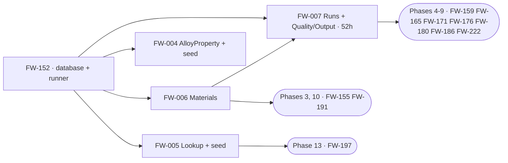

# Phase 1C — Execution Orchestration (Database)

**Project:** United Aluminum (UAL) — Flat Wire Mill Module
**Last Updated:** August 29, 2026 — ➕ **PLAN AUTHORING COMPLETE — 16 files: 7 build plans and 9 build-state records.** §1.2a now carries all nine records (`FW-155`, `FW-159`, `FW-165`, `FW-171`, `FW-176`, `FW-180`, `FW-186`, `FW-221`, `FW-222`), each naming what is built, what is owed, and **what its `[TB §7]` card gets wrong**. ⛔ **The recurring finding: a table without its writer is a guard nobody tests.** `FW-186`’s AC 3 is **still unmet for the reason it was written** — the non-overlap trigger has never fired, because `FW-185` is unbuilt; `FW-171`’s five write paths are five Backend stories; `FW-159`’s residual hours are Backend’s. ⛔ **`G34` is worse than "not implemented yet"** — a decided flow with no persistence target that **breaks `FW-202`’s `TC-174` suppression**. ⛔ **`FW-176` loses 16 h to `D-32`’s SECOND shared-schema cancellation**, and `P-239` refuses to reassign them silently. **`P-191`–`P-253` minted here and in the paired Backend plans; pointer `P-254`+.** ⚠ **Still states no object count and derives no total** (§9). *(previously: ➕ **BATCH 2: §1.2a BUILD-STATE RECORDS — a new document kind, and four of them.** [`FW-155`](FW-155.md), [`FW-159`](FW-159.md), [`FW-221`](FW-221.md) and [`FW-222`](FW-222.md) have **deployed objects**, so a build plan would describe a thing that exists; each record says what is built, what is owed, and **what the card gets wrong — which in three of the four is something**. ⛔ **`FW-159`’s card still names `G21` as blocking the Phase-4 schema freeze; `G21` was fixed 15 Aug 2026 and the fix IS the absent `FL3PO`** (`P-194`). ⛔ **`FW-222`’s AC 4 counts are stale** (49→50 indexes, 28 tables) and are left as audit trail (`P-193`). ⛔ **`FW-221`’s `70_` is safe to create and unsafe to call** (`Q40`, `P-196`). ⚠ **`FW-159`’s residual hours are Backend’s** — a DB developer assigned it finds nothing to build (`P-195`). **The folder holds 11 files. `P-191`–`P-197` minted; pointer `P-198`+.** *(previously: ➕ **THIS FOLDER NOW HOLDS SEVEN PER-STORY PLANS, and §1.2 gains the Status column whose absence hid the built state.** The *"holds no per-story plans"* banner is **retired** (§0): [`FW-241`](FW-241.md), [`FW-244`](FW-244.md), [`FW-245`](FW-245.md), [`FW-246`](FW-246.md), [`FW-248`](FW-248.md), [`FW-249`](FW-249.md) and [`FW-250`](FW-250.md) are written. **§1.1 and §1.2 keep the owning-artifact convention on purpose — that work is BUILT**, and a build plan would describe a thing that exists. ⛔ **`G63` RAISED: `verify_schema_counts.py` FAILS TODAY on `C2`** — `FlatWire_DDL_02_Schedule.sql`'s 27 Aug client-review reissue renamed its header key `Tables :` → `Creates :`, and **this header's own claim that all six checks pass has been stale since that day**. ⛔ **`C6`'s blind spot is confirmed by running it** — `0` disagreeing, `0` advisory, against `[DBD §6.2]` saying **69** in one paragraph and **70** in two others. ⛔ **`G49`'s nine rows are in no register** — recoverable only at commit `ebd0834`, so `FW-244` §2.1 now carries them, and **B7 turned out to be largely built already** by `G38`. ⚠ **`FW-243` is planned from the Backend folder**, not here — `D-30` is a domain decision with a DB tail. ➕ **`P-148`–`P-168` were minted by these plans** (§4): this *file* still mints none, but the *plans* in it do. *(previously: ➕ **NEW §1.3 PENDING REGISTER, and nine ids minted `FW-241`–`FW-249`.** §1.1 and §1.2 indexed DB work that already had an id; §3's deploy chain and §8.1's six findings between them named **real deliverables no story owned** — step 2's missing **reverse script**, the absent `FlatWireDB` folder in `ual-database`, `D-30`, `G49`, `G51`, the `G50`/`G52`/`G41`/`G55` repairs, `G8`'s migration, the count guard's blind spot and the un-re-derived DB total. Cards are in `[TB §7]`; hours are **quoted, not restated**, and are **additive to `[CE §3b]`**. ✅ **Four of §8.1's six findings now have an owner** (2 and 3 → `FW-248`, 5 → `FW-242`, 6 → `FW-249`); **1 and 4 deliberately do not** — they are document corrections, not deliverables. ✅ **`G42`'s non-overlap invariant is BUILT** — checked against the code, not the plans: `SpoolSegmentsMustNotOverlapRule` is invoked at `SpoolProcessing.cs:188`, so §5's row is corrected and **no story was minted**. ⚠ **`G35` gets no id** — it is blocked on `Q32`, whose answer decides between a table-plus-column and a read subscription, so any figure would be invented. ⚠ **This file still states no object count and derives no total** (§9). *(previously August 27, 2026 — **first issue.** The DB stream had a layer spec, six schema documents, a runnable DDL chain, two folder manifests and 30 backlog rows, and **nothing that said what can start, in what order, and what is stopping it**. This is the DB counterpart to [`Backend/tasks/Orchestration.md`](../../40-backend/tasks/Orchestration.md), on the same axis — dependency wave, not sprint. ✅ **Its headline is the opposite of the FE stream's: Phase 1C is BUILT.** [`verify_schema_counts.py`](../../tools/deliverables/verify_schema_counts.py) run today passes **all six checks** at `[DBD §6.2]`'s baseline, and `phase-01c` records a live deploy on **`DEV00164-001`, 26 Aug 2026** with `[DEP §4.2]`'s `V1`–`V6` gate green and `V4` at **7/7**. ⚠ **Two things are not done and both are easy to read as done.** ⛔ **Deploy step 2 has never been run** — `10_CommonDB_Insert_WIPStations_FlatWire.sql` is Draft, has **no reverse script**, and the `Scripts/` runner deliberately skips it, so FL1/FL2/FL3 exist in neither `united_db..machines` nor `CommonDB..WIPStations`, and `FW-220` names that script as a dependency (§5). ⚠ **`DEVUAL-UADEV001\TEST1` is behind** — the 26 Aug build was on a new instance and did not update it. ⛔ **`G21` was fixed on 15 Aug 2026 and four backlog cards plus `CLAUDE.md` still carry it as blocking the Phase-4 schema freeze** (§8.1 finding 1). ⚠ **Two live count contradictions the schema guard does not catch** (§8.1 findings 2–3), and **`FlatWireDB` has no folder in the `ual-database` repository at all** (finding 5).)*)*)*)* Change history is in [`CHANGELOG.md`](../../CHANGELOG.md)
**Document Type:** Execution index and dependency graph for the Phase-1C implementation and the DB stream downstream of it
**Status:** Active — **the entry point for this folder**
**Owner:** Database (SQL Server)
**Audience:** The delivery lead sequencing the DB stream, the deployer, and any developer picking up a schema story
**Shortcode:** — *(orchestration, derived from the DDL, the manifests and the specifications; **not citable as a requirement**)*
**Part of:** `ProjectPlan/Database/tasks/` — folder index: this file

---

> ### ⚠ This folder now holds seven per-story plans. Read this before looking for one.
>
> **Reversed 29 Aug 2026.** This banner used to read *"This folder holds no per-story plans"*,
> and every row below named its owning artifact instead. **Seven plans now exist** —
> [`FW-241`](FW-241.md) ·
> [`FW-244`](FW-244.md) ·
> [`FW-245`](FW-245.md) ·
> [`FW-246`](FW-246.md) ·
> [`FW-248`](FW-248.md) ·
> [`FW-249`](FW-249.md) ·
> [`FW-250`](FW-250.md) — all of §1.3's pending register bar
> `FW-242`, `FW-243` and `FW-247`.
>
> ⚠ **The old convention still holds for §1.1 and §1.2**, and for a good reason rather than
> inertia: **that work is BUILT**, so a build plan would describe a thing that already exists.
> Those rows name their owning artifact, and §1.2 now carries the **Status column it lacked** —
> whose absence is exactly why the built state was invisible.
>
> ⚠ **For this stream the owning artifact is usually executable.** Where a `.sql` file and a
> markdown document disagree, **the DDL wins** — *"Authoritative for types, nullability and
> constraints. Never regenerate it from the markdown"* (`[README]`, `Schema/SQL/`). **A plan in
> this folder loses to the DDL too.**
>
> ⚠ **This file still mints no `P-##`** — but **the plans in it do**, and the series is
> continuous across the repository, not across the Backend folder alone. `P-148`–`P-168` are
> theirs; see §4.

---

> **What this file is.** It says **what can start, in what order, and what is stopping it.**
> It holds **no build detail and no object counts** — every statement here resolves to an
> artifact, and this file loses to all of them. ⚠ **`[DBD §6.2]` is the only site that defines
> the counted baseline**, and only three others may restate it (`[DEP §4.2]`'s gate,
> `phase-01c`'s *Testing* and *Acceptance criteria*, and `FlatWire_DDL_RunAll.sql`'s banner).
> **This file is not one of them and states no count.**
>
> **The one thing to read first:** **the layer is built, so the live constraint is not
> construction — it is the deploy sequence.** `[DEP §4.2]` is a **ten-step chain with a
> sign-off gate at step 2**, and that gate has never been passed. Everything downstream of it —
> `FW-220`, `FW-221`, `FW-223`, the whole check-in write-back — is waiting on an approval, not
> on code. See §3.

---

## 1. Status board

**30 stories carry DB hours** — Phase 1C's five live ones and two cancelled (§1.1), and
**23 downstream across Phases 3–14** (§1.2). Hours are `[TB §7]`'s, **quoted not restated**.
⚠ **Do not total them from this page** — §8.1 finding 6 explains why no current DB-stream total
exists.

### 1.1 Phase 1C — DB 100 h

| Story | Subject | h | Wave | Owning artifact | Status |
|---|---|---|---|---|---|
| `FW-152` | `FlatWireDB` creation, ordered DDL runner, indexes, grants | 12 | **0** | [`FlatWire_DDL_00_Database.sql`](../sql/FlatWire_DDL_00_Database.sql) · [`FlatWire_DDL_RunAll.sql`](../sql/FlatWire_DDL_RunAll.sql) | ✅ **Built** — contiguous `00`–`08` chain, idempotent, verified on a live teardown-and-deploy |
| `FW-005` | Lookup group tables and seed | 16 | 1 | [`FlatWire_DDL_01_Lookup.sql`](../sql/FlatWire_DDL_01_Lookup.sql) · [`FlatWireSchema_Lookup.md`](../schema/FlatWireSchema_Lookup.md) | ✅ **Built and seeded** — the seed is the first `:r`, ahead of the schedule seed that depends on its IDENTITY values · ⚠ **`G32`/`PLC-Q04`** — the FM2 station names are ours, not the controller's |
| `FW-004` | `AlloyProperty` lookup and seed | 8 | 1 | [`FlatWireSchema_Lookup.md`](../schema/FlatWireSchema_Lookup.md) *"`AlloyProperty`"* | ✅ Built · ⛔ **`Q22`** — the four min/max tolerance pairs are **owed by e-mail and deliberately unseeded**; diameter and ovality are `NULL` by design · ⛔ **`LbPerFtFactor` is seeded `NULL`, marked "OQ-10 PENDING"** (§5) |
| `FW-006` | Materials group tables | 12 | 1 | [`FlatWire_DDL_03_Materials.sql`](../sql/FlatWire_DDL_03_Materials.sql) · [`FlatWireSchema_Materials.md`](../schema/FlatWireSchema_Materials.md) | ✅ Built · ⚠ **`G17`** — every `Rod.Alpha` reference is a cross-DB logical FK · ✅ the `PassScheduleId` nullability question is **closed by `D-31`**: the FK verifies it, so **do not `NULL` it** |
| `FW-007` | Runs and Quality/Output group tables | 52 | 2 | [`FlatWire_DDL_04_Runs.sql`](../sql/FlatWire_DDL_04_Runs.sql) · [`FlatWire_DDL_05_QualityOutput.sql`](../sql/FlatWire_DDL_05_QualityOutput.sql) | ✅ Built — **the largest story in the layer**, and the parent of eight downstream DB stories · ⛔ **its card still names `G21` as blocking the Phase-4 schema freeze; `G21` was fixed 15 Aug 2026** (§8.1) · ⚠ `G14` footage type · `G34` |
| ~~`FW-001`~~ | ~~Shared-schema column renames and new columns~~ | ~~56~~ **0** | — | — | ⛔ **CANCELLED — `D-32`, 18 Aug 2026.** There is no shared-schema migration and no 40 h impact audit. Retained as the record of what was cancelled |
| ~~`FW-002`~~ | ~~`INFLAT` coil status~~ | ~~4~~ **0** | — | — | ⛔ **CANCELLED — `D-32`.** ⚠ **`INFLAT` is still required, locally** — `Rod.Status`, `SpoolProcessing.Status` and `RodCheckout.NewRodStatus` carry it in their `CHECK` constraints, and after `D-32` those are the **only** places it exists |

> ⚠ **`D-32` re-derived this layer 221 h → 138 h** (DB 100 · QA 20 · cont. 18). **`[CE]`
> publishes three different 1C figures and none of them is re-derived** — `[CE §3]`'s 215 h is
> the base of record, `[CE §8]` records 221 h without carrying it into §3, `[CE §3c]` publishes
> the post-`D-32` 138 h additively, and **`[CE §3b]` has no Phase 1C row at all.** Cite the
> right section. `[CE §8]` also records that **1C was costed against 22 tables and the build is
> larger**; the understatement is real, `[CE]` owns it, and **it is not re-priced here.**

### 1.2 Downstream — 23 DB stories, Phases 3–14

> ➕ **The Status column is new, 29 Aug 2026, and its absence was a real defect.** §1.1 marked
> Phase 1C ✅ **Built** while this table carried no status at all, so **the built state of
> twenty-three stories was invisible** — a reader comparing the two sections would reasonably
> conclude the downstream work was outstanding. **It is largely not.**
>
> ⚠ **Verified against the DDL on 29 Aug 2026, not read off a document.** `RodStaging`,
> `SpoolCheckin`, `WipRejection`, `RodCheckout`, `CoilOutput`, `CoilTraceability` + its
> non-overlap trigger, all five in-run event tables, `sp_GetGaugeTrace`,
> `IX_FlatWireRun_LineId` **keyed `(LineId, Status)`** and `UX_FlatWireRun_ActiveLine` are all
> **present and deployed**. §3 already said it — *"Construction is done"* — and this table now
> agrees with it.
>
> ⛔ **"Schema built" is not "story done."** Several rows still owe a **write path**, and every
> one of those is a **Draft procedure behind an approval or an open question**, not unwritten
> code. That distinction is the column's whole purpose.

| Phase | Stories (DB h) | Owning artifact | Status |
|---|---|---|---|
| **3** | `FW-155` 4 | `IX_FlatWireRun_LineId`, keyed **`(LineId, Status)`** — not `LineId` alone | ✅ **Built** — `IX_FlatWireRun_LineId` deployed, keyed `(LineId, Status)` as specified |
| **4** | `FW-159` 28 · `FW-220` DB 24 · `FW-221` 9 · `FW-222` 2 · `FW-223` DB 10 · `FW-225` DB 12 | [`40_…CheckInRod.sql`](../scripts/40_FlatWireDB_Proc_FlatWire_CheckInRod.sql) · [`60_…ReleaseStation.sql`](../scripts/60_FlatWireDB_Proc_FlatWire_ReleaseStation.sql) · [`70_…ReverseReqsum.sql`](../scripts/70_FlatWireDB_Proc_FlatWire_ReverseReqsum.sql) · [`30_…sp_IngestRodFromCoils.sql`](../scripts/30_FlatWireDB_Proc_sp_IngestRodFromCoils.sql) · `RodOrderAllocation` in `03_Materials` | ⚠ **Schema built; write paths are Draft.** `RodStaging` deployed. ⛔ `40_` blocked by `Q37`–`Q39`, `70_` by `Q40`, and **all of it sits behind deploy step 2's sign-off** (`FW-241`). `FW-222`'s `UX_FlatWireRun_ActiveLine` ✅ built |
| **5** | `FW-165` 8 | `sp_GetGaugeTrace`, in [`FlatWire_DDL_08_Programmability.sql`](../sql/FlatWire_DDL_08_Programmability.sql) | ✅ **Built** — `sp_GetGaugeTrace` is the chain's one procedure; `FW-141`'s `ContextRepository` already calls it |
| **6** | `FW-171` 20 | the five in-run event tables in [`FlatWire_DDL_04_Runs.sql`](../sql/FlatWire_DDL_04_Runs.sql) | ✅ **Tables built.** ⚠ `G34` (wire break has no persistence target, `FW-N08`, uncosted) and `G35` (FM2's dancers, blocked on `Q32`) are still open against them |
| **7** | `FW-176` 28 | `WipRejection` / `RodCheckout` — ⚠ **its `coils` carry-forward columns are cancelled with `D-32`**; the delivered design was already local | ✅ **Tables built.** ⛔ Its `coils` carry-forward columns are **cancelled** (`D-32`) — the delivered design was already local, so the story is smaller than its 28 h card |
| **8** | `FW-180` 12 · `FW-230` DB 4 · `FW-231` DB 12 | `SpoolCheckin` · the FL1 segment-alpha namespace · shared coil-master registration | ✅ **`SpoolCheckin` built.** ⚠ `FW-230`/`FW-231` carry **`G54`, which gates the whole alpha scheme** (`OI-138`) |
| **5/8 boundary** | `FW-202` DB 8 | ⚠ **already allocated** — `FW-202`'s AC *"server-owned state, persisted against the run"* **is** `G38`'s five `FlatWireRun` prompt columns. **Do not add a second DB allocation** | ✅ **Built — and do NOT allocate twice.** `FW-202`'s DB 8 h **is** `G38`'s five `FlatWireRun` prompt columns, deployed 15 Aug 2026 |
| **9** | `FW-186` 16 · `FW-219` DB 26 · `FW-229` DB 6 | `CoilOutput` · `CoilTraceability` · `trg_CoilTraceability_NoOverlap` · [`50_…CompleteCoilOnSkid.sql`](../scripts/50_FlatWireDB_Proc_FlatWire_CompleteCoilOnSkid.sql) | ✅ **Tables and trigger built.** ⚠ `50_` is Draft behind `Q34`–`Q36`; `OI-114`'s sentinels are **parameterised**, so a wrong answer is a one-line change |
| **10** | `FW-191` 4 | `RouteMode` and the no-intermediate-spool rule | ✅ **Built** — `RouteMode` present in `02_Schedule` and `03_Materials` |
| **11** | `FW-090` DB 20 | reporting views · ⚠ **`OI-101`** — shift boundaries are undefined, which blocks every shift-scoped figure | ⛔ **Not built** — reporting views. ⚠ **`OI-101`: shift boundaries are undefined**, which blocks every shift-scoped figure. **Phase 11 is outside this planning pass** |
| **12** | `FW-102` DB 4 · `FW-110` DB 8 | ⚠ `FW-110` is **descope-ladder rung 1 — the first thing off the plan** | ⛔ **Not built.** ⚠ `FW-110` is **descope-ladder rung 1 — the first thing off the plan**. **Outside this planning pass** |
| **13** | `FW-197` 8 | reference-data admin wiring · ⚠ `OI-77` / `OI-43` | ⛔ **Not built** — reference-data admin wiring. ⚠ `OI-77` / `OI-43`. **Outside this planning pass** |
| **14** | `FW-201` DB 8 | ⚠ its *"renamed-column regression"* half is **cancelled with `D-32`**; the defect-allowance half stands | ⛔ **Not built.** ⚠ Its *"renamed-column regression"* half is **cancelled** (`D-32`); the defect-allowance half stands. **Outside this planning pass** |

> ✅ **`G38`'s schema delta landed 15 Aug 2026** — five columns on `FlatWireRun`
> (`PromptDueAt`, `PromptPlcStopTs`, `PromptLatchedWeightLb`, `PromptResolvedAt`,
> `PromptAnswer` + its `CHECK`). **Columns, not a table** — *"persisted against the run"* is
> literal, and the object count is unaffected.

### 1.2a Build-state records — four written 29 Aug 2026

> ➕ **A new document kind, and the reason it exists is §1.2's own defect.** These four stories'
> objects are **deployed**, so a build plan would describe a thing that exists. Each record says
> **what is built, what is still owed, and what the card gets wrong** — because in three of the
> four the card is now misleading.
>
> ⚠ **They are not build plans and must not be read as scope.** The hours stay `[TB §7]`'s.

| Record | Story | h | Built | Still owed |
|---|---|---|---|---|
| [FW-155](FW-155.md) | `FlatWireRun(LineId, Status)` index | 4 | ✅ `IX_FlatWireRun_LineId`, keyed **`(LineId, Status)`** — `07_Indexes.sql:40` | ⛔ **AC 2** — the execution plan, unverifiable until `FW-154`'s service body lands. ⚠ **The name understates the key; do not rename it** |
| [FW-159](FW-159.md) | `RodStaging` + check-in write path + `INFLAT` | 28 | ✅ Table `04_Runs.sql:74`, **both filtered unique indexes**, all five listed indexes, the `PayoffPosition` lookup | ⛔ **The card's blocker is STALE** — it says `G21` blocks the Phase-4 schema freeze; **`G21` was fixed 15 Aug 2026** and the fix **is** the absent `FL3PO` (`P-194`). ⚠ **The residual hours are Backend's**, not this stream's (`P-195`) — a DB developer assigned this finds nothing to build |
| [FW-221](FW-221.md) | Station release + reqsum reversal | 9 | ✅ Both procedures written — `60_` **no open items**, `70_` Draft | ⛔ **`Q40`** — `70_` is **safe to create and unsafe to call** (`P-196`). ⚠ Its stations do not exist until deploy step 2, and **all four callers are unbuilt**. `P-197`: the **two reversal guards are independent and both stay** |
| [FW-222](FW-222.md) | Single-active-run index + reversal flag | 2 | ✅ `UX_FlatWireRun_ActiveLine` `07_Indexes.sql:55`, `RodCheckin.WipCoilOrdersWritten` `04_Runs.sql:277` defaulting **safe** | ⛔ **AC 2 never run** — and it must **defeat the aggregate check**, or it proves the code path and not the index (`P-192`). ⛔ **AC 4's counts are stale** (49→50 indexes, 28 tables) and are **left as audit trail** (`P-193`) |

| [FW-165](FW-165.md) | `sp_GetGaugeTrace` | 8 | ✅ The chain's **one procedure**, and `FW-141`'s `ContextRepository` **already calls it** | ⛔ **`G9` makes the performance claim unverifiable** — `RunReading` has no retention policy, so the load test cannot fail (`P-225`). ⚠ The grant is **deploy step 3**, still Draft. ⚠ The series is **already decimated at 4 ft** by the writer, so a finer resolution thins nothing |
| [FW-171](FW-171.md) | The five in-run event tables | 20 | ✅ All five deployed, `(RunId)` indexed, constraints live | ⛔ **`G34`: wire break has a DECIDED FLOW and no persistence target** — and it **breaks `FW-202`'s `TC-174` suppression**, which keys on a `RunPauseEvent` reason that cannot be written (`P-226`). ⛔ **`G35`/`Q32`: FM2's dancers unmodelled, no hours derivable.** ⚠ **AC 1's write paths are five BACKEND stories** — a DB developer assigned this finds nothing to build (`P-227`) |

| [FW-176](FW-176.md) | `WipRejection` / `RodCheckout` tables | 28 → **12** | ✅ Both tables, both mode `CHECK`s and both indexes deployed; the three local carry-forward columns landed **26 Jul 2026** | ⛔ **16 h CANCELLED by `D-32` — this was the plan's SECOND shared-schema change** and is easy to miss when reading `D-32` as being only about `FW-001`. `P-239`: the cancelled hours **fall to zero and are not reassigned** — if `FW-174`'s wiring needs time it is a **new line**. ⚠ **`G24` disagrees with `FW-174`** about whether the approval columns exist; the DDL decides. ⛔ `G21` is **stale on this card** |
| [FW-180](FW-180.md) | `SpoolCheckin` table + `SpoolProcessing.OrderNo` index | 12 | ✅ Table and index deployed | ⛔ **`G55`: `CK_SpoolCheckin_PayoffPos` says `1` while the seed and `CanonicalEnums.cs` say `3`** — **silently wrong**, because the column has no FK so `TC-020`'s membership diff passes. `FW-246`'s `P-163` recommends `3`. ⛔ **`OI-25` is an AC 4 blocker here, not a downstream one** (`P-241`) — a weld marker projected across two footage systems lands wrong **and looks right** |

| [FW-186](FW-186.md) | `CoilOutput`, `CoilTraceability`, non-overlap trigger | 16 | ✅ Both tables, the chain's **one trigger**, both indexes and `Q89`'s `UX_CoilTraceability_ChildAlpha` deployed | ⛔ **AC 3 is STILL unmet, for the reason it was written** — *"guarding rows nothing inserted"*; the writer returned to MVP-1 on 11 Aug but `FW-185` is unbuilt, so **the trigger has never fired** (`P-252`). ⛔ **`OI-104`: `SkidId` has no parent** — AC 6 asks only that it be documented. `P-253`: the coil-level trigger **does not generalise to spool level**, where nullable bounds make it pass silently (`G42`) |

> ⚠ **The `IN` filter on `UX_FlatWireRun_ActiveLine` must never be rewritten as `OR`** —
> `07_Indexes.sql:53` warns of it, filtered indexes reject it, and the guard is a comment.

### 1.3 Pending register — ten ids minted 29 Aug 2026

> **New 29 Aug 2026.** §1.1 and §1.2 index DB work that **has** an id. This indexes what did not.
> Every row below comes from a finding this file or its Backend sibling already **recorded and
> deliberately did not fix** (§3's deploy chain, §8.1's six findings) or from `[GAP]` — and each was
> a **real deliverable with no story, no owner and no hours line**.
>
> ⚠ **Cards are in `[TB §7]`** under *Additive — pending-work stories*; hours here are **quoted, not
> restated**, and are **additive to `[CE §3b]`** exactly as `FW-219`'s are. **They offset nothing.**
> ⚠ **This file still states no object count and derives no total** (§9) — `FW-249` is the story
> that decides where a combined DB figure is published, and `[CE]` owns it.
>
> ➕ **Seven of these ten now have a plan file, written 29 Aug 2026** — the linked ids below.
> **`FW-242`, `FW-243` and `FW-247` do not**: `FW-242` and `FW-247` are Phase 13/14 and outside
> the current planning pass, and **`FW-243` is planned from the Backend folder** because `D-30`
> is a domain-model decision with a DB tail (`[SVC §3.4]`'s call, before the Phase-4 freeze).
>
> ⛔ **Three things the planning pass found by running the tools rather than reading them:**
> **`G63`** — `verify_schema_counts.py` **FAILS today** on `C2`, because
> `FlatWire_DDL_02_Schedule.sql`'s 27 Aug client-review reissue renamed its header key
> `Tables :` → `Creates :`. ⚠ **This file's header still claims all six checks pass**, and that
> has been stale since 27 Aug. **`C6` confirmed its own blind spot** — `0` disagreeing, `0`
> advisory, while `[DBD §6.2]`'s file says **69** in one paragraph and **70** in two others and
> `ProjectPlan/README.md` restates the baseline from a non-permitted site. And **`G49`'s nine
> rows are not in `[GAP]` at all** — they survive only at commit `ebd0834`, so
> [`FW-244`](FW-244.md) §2.1 now carries them, and **one of the
> nine (B7) turned out to be largely built already** by `G38`.

| Story | Subject | Wave · Phase | h | Owning artifact | Closes |
|---|---|---|---|---|---|
| **[`FW-241`](FW-241.md)** | Deploy step 2 — finalise, author the **reverse script**, run under sign-off | 1C | DB 8 | [`10_CommonDB_Insert_WIPStations_FlatWire.sql`](../scripts/10_CommonDB_Insert_WIPStations_FlatWire.sql) · `[DEP §4.2]` step 2 | ⛔ **The chain's only irreversible step, and the one that has never run.** The code half is the reverse script that **does not exist**; the rest is an approval |
| `FW-242` | Move `FlatWireDB` into the `ual-database` repository | 14 | DB 16 | `ual-database/Databases/` | §8.1 finding 5 — **no `FlatWireDB` folder and no `*flatwire*` file anywhere** in the twenty-database repo |
| `FW-243` | `D-30` — `ROWVERSION` on `WeldEvent`, `RodCheckout`, `WipRejection` | 4 | DB 4 · BE 2 | [`FlatWire_DDL_04_Runs.sql`](../sql/FlatWire_DDL_04_Runs.sql) · [`05_QualityOutput`](../sql/FlatWire_DDL_05_QualityOutput.sql) | `D-30` — 3 of the 7 roots, all mutated after insert. ⚠ **The decision is the gate, not the DDL** |
| **[`FW-244`](FW-244.md)** | `G49` — nine decided requirements with no column | 1C | DB 8 | [`[GAP]`](../../Development/GapsRegister.md) `G49` · the four owning screen specs | ⚠ **One gap on purpose, one delta on purpose** |
| **[`FW-245`](FW-245.md)** | `G51` — `SpcMeasurement.InSpec` on an asymmetric band | 1C | DB 6 | [`FlatWire_DDL_05_QualityOutput.sql`](../sql/FlatWire_DDL_05_QualityOutput.sql) | ⛔ A **`PERSISTED`** symmetric verdict against `AlloyProperty`'s min/max pairs — **the wrong answer is on disk** |
| **[`FW-246`](FW-246.md)** | `G50`/`G52`/`G41`/`G55` — constraint and RI repairs | 1C/4 | DB 12 | [`03_Materials`](../sql/FlatWire_DDL_03_Materials.sql) · [`04_Runs`](../sql/FlatWire_DDL_04_Runs.sql) · [`06_ForeignKeys`](../sql/FlatWire_DDL_06_ForeignKeys.sql) | ⛔ `G41` means **a correct FL2 pass schedule cannot be authored**; `G55` is a disagreement about *meaning* on a column with no FK, so the membership diff passes |
| `FW-247` | `G8` — legacy `FlatLineSetup`/`FlatLineProcessing` migration | 13/14 | DB 24 · BA 8 | [`Scripts/`](../Scripts/) · `[GAP] G8` | ⚠ **The destination stopped being the blocker** at `D-31`; the missing migration is |
| **[`FW-248`](FW-248.md)** | Harden `verify_schema_counts.py`'s `C6`, repair the two count sites | 1C | DB 8 | [`verify_schema_counts.py`](../../tools/deliverables/verify_schema_counts.py) · `[DBD §6.2]` · `ProjectPlan/README.md` | §8.1 findings 2–3 — **both sit in the guard's blind spot**, and the gate has rejected a correct deployment **five times** on this class of drift |
| **[`FW-249`](FW-249.md)** | Re-derive the DB-stream total on the current basis | — | BA 8 | `[CE]` | §8.1 finding 6 — ⛔ **additively, never by substitution** |
| **[`FW-250`](FW-250.md)** | `build_development_plan_xlsx.py` drops every multi-stream story | — | DB 6 | [`build_development_plan_xlsx.py`](../../tools/deliverables/build_development_plan_xlsx.py) | ⛔ **Found 29 Aug 2026 by RUNNING this register's own verification step.** The stream regex reads `N h XX` and cannot read `N h (XX a · YY b)`, and the miss is a silent `continue` — so **eleven stories are absent from the client-facing `FlatWire_DevelopmentPlan.xlsx`**, `FW-219`, `FW-220`, `FW-223`, `FW-202` and all of `FW-225`–`FW-231`, and absent from its *“excluded from plan”* line as well |

**Minted 2 Sep 2026 — the 1–2 September scope, `[TB §7]` Appendix `B.7`:**

| Story | Subject | Wave · Phase | h | Owning artifact | Closes |
|---|---|---|---|---|---|
| **[`FW-251`](FW-251.md)** | Restate the baseline to `[DBD §6.2]`'s current tuple and repair the cards the die split and the reason codes left stale | 1C | DB 8 | [`01_Lookup`](../sql/FlatWire_DDL_01_Lookup.sql) · [`04_Runs`](../sql/FlatWire_DDL_04_Runs.sql) · [`FW-005`](FW-005.md) · [`FW-007`](FW-007.md) · [`FW-171`](FW-171.md) · [`FW-176`](FW-176.md) | ⛔ **Six tables landed on 2 Sep 2026 and NOT ONE task card was updated.** ⚠ **`FW-005` still seeds `Drawer` with the 13 die-size rows the split took apart**, and still pins `Drawer.Id 1–13`. `C6` reports **24 advisory count claims** across ten files. ⚠ **This story states no count** — `[DBD §6.2]` is already correct and the guard passes |

⚠ **`FW-251` is the DB half of a set of eight** — [`FW-252`](../../40-backend/tasks/FW-252.md),
[`FW-254`](../../40-backend/tasks/FW-254.md), [`FW-255`](../../40-backend/tasks/FW-255.md) and
[`FW-257`](../../40-backend/tasks/FW-257.md) are Backend's,
[`FW-253`](../../50-frontend/tasks/FW-253.md) and
[`FW-256`](../../50-frontend/tasks/FW-256.md) Frontend's, and
[`FW-258`](../../60-delivery/tasks/FW-258.md) is the re-cost. ⛔ **Every DDL, schema-document,
`[DEP §4.2]`-gate and register layer absorbed both scope events; the backlog was the only one that
did not**, and `FW-003` was the single card touched.

⚠ **The DB stream has nothing left to build for either event.** All six tables, their 62 FKs, 82
indexes and **156 rows of inline production reference data** are in the DDL and pass
`verify_schema_counts.py` today. `FW-251` is a **card and count-site repair**, and — as with
[`FW-171`](FW-171.md) and [`FW-159`](FW-159.md) — **a DB developer assigned the downstream work
finds the schema already done** (`P-195`).

**Registered, and deliberately given no id:**

| Item | Why no story |
|---|---|
| ⛔ **`G35`** — FM2's two dancers are unmodelled everywhere | **Blocked on `Q32`**, and the answer changes the deliverable outright: **scheduled** ⇒ a `PassScheduleComponent` row, a DDL column and a slot in the acknowledgement push (**one table added to the baseline**); **machine-side** ⇒ a read subscription and nothing in the schema moves. ⚠ **No hours are derivable until it is answered**, so a card would invent a figure. `P-122` already excludes the ten dancer elements from `FW-N05`'s read list for the same reason |
| ⚠ **`G34`** — wire break has a decided flow and no persistence target | Already owned by **`FW-N08`**, which is **uncosted and blocked** (`[TB §7]` B.4). An id exists; hours do not |
| ⚠ **`G42`**'s non-overlap invariant | ✅ **Built and invoked** — `SpoolSegmentsMustNotOverlapRule` in `FlatWire.Domain/Rules/TraceabilityRules.cs`, called from `SpoolProcessing.cs:188`. Verified against the code 29 Aug 2026. `P-91`'s *"the aggregate is the ONLY defence"* is satisfied; **the gap row was what needed updating**, not the build |
| ⛔ **§8.1 findings 1 and 4** — `G21` stale in five places, `Scripts/README.md` contradicting its own runner | Document corrections, not deliverables. ⚠ **`G21` was fixed 15 Aug 2026** and four `[TB §7]` cards plus `CLAUDE.md` still call it blocking the Phase-4 schema freeze; the `[TB §7.4]` §6.1 row now carries the correction note. **Do not cite `G21` as proof of defence-in-depth** — the domain rule's half is still undemonstrated |

⚠ **`FW-250` is the one row here that was not planned** — it was minted mid-execution, when the
verification step for `FW-241`–`FW-249` ran the three generators that parse `[TB §7]` and one of them
reported a story count that could not be right. **The `.xlsx` deliverables were regenerated during
that check and then RESTORED to their committed state**, because publishing a corrected workbook is a
separate decision with a reviewer attached (`FW-250` AC 5).

**The Backend stream's nine are `FW-232`–`FW-240`** — hosts for `/order/**` and `/rod/**`, the audit
log's persistence target, `CoilCompleted`'s missing hub member, the two `OPCConnection` defects,
the service identity for unattended writes, `FW-150`'s unwired cache invalidation and `P-91`'s rod
order entities. Their register is
[`Backend/tasks/Orchestration.md`](../../40-backend/tasks/Orchestration.md)
§1.5. ⚠ **`FW-234` and `FW-238` each carry a DB half** (4 h and 8 h) and are costed there, not here,
so **do not add them to this table** — one story, one home.

---

## 2. Dependency graph

> **This graph is Phase-1C-scoped by design.** It shows §1.1's five live stories and the two
> edges that leave the layer. **§1.2's are deliberately absent** — merging a wave axis and a
> sprint axis into one diagram is how a map stops being readable.



**Waves** — level = 1 + the deepest dependency:

| Wave | Stories | Note |
|---|---|---|
| **0** | `FW-152` | The single root. **Nothing else starts.** |
| **1** | `FW-005` `FW-004` `FW-006` | Three unlock at once |
| **2** | `FW-007` | ⚠ **52 h in one story, and eight downstream stories hang off it** |

> **Two edges leave the layer, and neither is a build dependency.** 1B's `FlatWireDbContext`
> (`FW-142`) and repositories (`FW-141`) bind to this schema, and 1A's mock fixtures mirror its
> seed. Both are **consumers**, so 1C was never blocked by them — but see §6 criterion 5, which
> **is** a 1B dependency and is now **partly** met: `FW-142` mapped the seven roots and
> `FW-207` took the model to **20 entity types**, validated against live `FlatWireDB`.

---

## 3. The critical path — spent. The live constraint is the deploy chain.

**Construction is done.** The build path was:

```
FW-152 (12) → FW-006 (12) → FW-007 (52)          = 76 h, complete
```

⚠ **What gates this stream now is `[DEP §4.2]`, a ten-step cross-folder chain**, and it is
**not** the `RunAll` script. `RunAll` is *"one step of ten"*. The sequence and its sign-off
state:

| Step | What | State |
|---|---|---|
| **0** | Pre-flight — **prove co-location.** `FlatWireDB` must sit on the same instance as `united_db` / `proddb` / `SlitterDB` / `CommonDB` / `wiplogdb`, because check-in spans them in **one** `SqlTransaction` under the **local** transaction manager, no MSDTC | ✅ Query in `20_FlatWire_Grants.sql` |
| **1** | The schema — `../sql/FlatWire_DDL_RunAll.sql`, idempotent | ✅ **Deployed and verified 26 Aug 2026** |
| **2** | ⛔ **SIGN-OFF GATE — shared-schema rows.** `10_CommonDB_Insert_WIPStations_FlatWire.sql` writes `united_db..machines` and `CommonDB..WIPStations` / `MachineStationsConfiguration` | ⛔ **NEVER RUN.** Draft; `machine_type`, the station set and `StationType` pending. **No reverse script exists.** Run by hand, after approval — the `Scripts/` runner **deliberately skips it** |
| **3** | Grants — `20_FlatWire_Grants.sql`, `ua_user` in six databases, once per environment | Draft |
| **4** | Inbound procedure — `30_…sp_IngestRodFromCoils` | **Ready — no open items** |
| **5–8** | The four outbound procedures — **any order among themselves** (`CREATE PROCEDURE` uses deferred name resolution) | ⚠ Draft: `Q37`–`Q39` on `40_`, `Q34`–`Q36` on `50_`, **none** on `60_`, ⛔ **`Q40` on `70_`** |
| **9** | The verification gate — `V1`–`V6`, then `V10`–`V12` | ✅ **`V1`–`V6` pass, `V4` at 7/7** |
| **10** | DEV / TRIAL ONLY — `FlatWire_SampleData_RunAll.sql`. **Never against production** | ✅ Five seeds, order strict |

Three consequences:

1. **Step 2 is the only irreversible step in the chain, and it is the one that has not run.**
   Everything else can be torn down: `99_FlatWireDB_Proc_FlatWire_Teardown.sql` drops the four
   procedures (**code, not data**) and `FlatWire_DDL_99_Teardown.sql` drops the database.
   ⚠ **Neither undoes step 2's shared rows. Nothing does.** That is why it is a gate and not a
   step.
2. **`FW-220` names step 2 as a dependency**, so the FL1/FL3 check-in write-back — and with it
   `FW-221`, `FW-223` and the Phase-4 shared-schema story — is waiting on **an approval, not on
   code**.
3. **`70_ReverseReqsum` is safe to create and unsafe to call.** Its `proddb..wip_coil_orders`
   **DELETE** is not signed off for a shared environment (`Q40`); `@deleteOrphan = 0` makes it a
   no-op if the answer turns out to be *"leave the orphan"*.

> *Nothing in this section is a published total. The 76 h is quoted from `[TB §7]` per story and
> summed for sequencing only.*

---

## 4. Decision gates — and where each decision actually lives

⚠ **This file mints no decision ids, deliberately.** The `P-##` series belongs to
[`Backend/tasks/`](../../Backend/tasks/) and is continuous across that
folder; a second series here would collide in citation. **DB decisions resolve in the registers
that own them**, and this table is the index.

> ➕ **Amended 29 Aug 2026 — the rule is narrower than it read.** **This *file* mints none; the
> *plans* in this folder do**, and the `P-##` series is continuous **across the repository**, not
> across the Backend folder alone. **`P-148`–`P-168` were minted here**, each defined once in the
> plan named:
>
> | Range | Plan | Subject |
> |---|---|---|
> | `P-148`–`P-150` | [FW-245](FW-245.md) | The band is carried on the measurement row **as a pair** (a computed column cannot join) · `InSpec` becomes **nullable**, and `NULL` means unevaluated · it ships **correct and unexercised** while `Q22` is open |
> | `P-151`–`P-153` | [FW-241](FW-241.md) | The reverse script is **`15_` and stays out of the runner** · build it **before** the approval, not after · `[DEP §4.2]` step 2 is the **single record** of the three decided values |
> | `P-154`–`P-156` | [FW-248](FW-248.md) | The defining file gets a **fatal self-consistency rule** · **`G63` is fixed in the DDL, not the parser** · the regression fixture is **temporary and its numbers impossible** |
> | `P-157`–`P-159` | [FW-250](FW-250.md) | **Parts must sum to the total**, and a mismatch fails the build · the regenerated `.xlsx` publishes under a **named reviewer** · `BA`/`QA` exclusion is a **branch, never a `DISCIPLINE` entry** |
> | `P-160`–`P-162` | [FW-244](FW-244.md) | **B7 is reduced to two columns** and `G38`'s five are not re-added · the `RollOverride` ↔ checkpoint link is **one-directional** · the nine are **re-verified against today's schema** before any DDL |
> | `P-163`–`P-165` | [FW-246](FW-246.md) | **FL2's payoff is `3 · TraversingTakeup`**, recorded as an internal decision · `G41` is fixed **narrowly, by line**, and the forbidden generalisation is not written · **`G52`'s likely deliverable is a decision, not DDL** |
> | `P-166`–`P-168` | [FW-249](FW-249.md) | **`FW-250` is a hard predecessor** and the total is not hand-summed · the **citation map is a deliverable** · the new section derives its own chain and **touches no existing cell** |
>
> ⚠ **`P-163` is the one to read before touching `SpoolCheckin`** — it settles a **two-against-one**
> disagreement where the outlier carries a comment recording that it was *"copied from
> `RodCheckin`"*, which is the whole explanation for the defect.
>
> ➕ **`P-191`–`P-197` were minted by §1.2a's build-state records, 29 Aug 2026:**
>
> | Range | Record | Subject |
> |---|---|---|
> | `P-191` | [FW-155](FW-155.md) | **An index story closes on a captured plan, never on the `CREATE` statement** — applies equally to `FW-222` and `FW-180` |
> | `P-192`–`P-193` | [FW-222](FW-222.md) | The concurrency test **must defeat the aggregate check** or it proves nothing · the card's **stale counts stay stale** — `[TB §7]` is not a permitted site |
> | `P-194`–`P-195` | [FW-159](FW-159.md) | The card's **`G21` blocker is struck** and `FL3PO` stays absent · this story's **residual hours are Backend's**, and the card should say so |
> | `P-196`–`P-197` | [FW-221](FW-221.md) | Creating `70_` in the runner is correct; **calling it needs a second gate** · the **two reversal guards are independent and both stay** |
>
> ⚠ **`P-194` is the one that changes a schedule**: `FW-159`'s card still names `G21` as blocking
> the Phase-4 schema freeze, and it is **one of the four `[TB §7]` cards** §8.1 finding 1 already
> counts. **New decisions are minted at `P-198`+.**

| Decision | Blocks | Where it is decided |
|---|---|---|
| **`D-31`** | `FW-006`, `FW-007`, `FW-152` | ✅ **The three `PassSchedule*` tables, their seed and their constraints are MVP-1** (15 Aug 2026), so `PassScheduleId` is a **real, enforced FK** on four tables, not an external reference. ⚠ **Owning the table is not owning the data** — MVP-1 **reads** schedules and never authors them; **nothing in MVP-1 populates them in production** (`OI-110`). `[MVP2-SCOPE.md]` |
| **`D-32`** 🔴 | `FW-001`, `FW-002`, `FW-176`, `FW-201`, `FW-100` | ✅ **There is no shared-schema migration** (18 Aug 2026). The existing `coils` / scheduling schema is **read and written as it stands and never altered**. ⚠ **Two cancellations are easy to miss** — `FW-176`'s `coils` carry-forward columns and `FW-201`'s rename regression. ⚠ **New open item `OI-111`**: nothing now marks a rod as being on a flattening line in the shared schema, and the audit that would have found which reports care is cancelled too |
| **`D-30`** 🔴 | `FW-007` → the **Phase-4 schema freeze** | ⚠ **Open.** `ROWVERSION` is absent on `WeldEvent`, `RodCheckout` and `WipRejection` — **3 of the 7 aggregate roots, all mutated after insert.** `P-69` maps all eight tokens that do exist; it explicitly does **not** decide whether these three should. `[SVC §3.4]`'s call, before the freeze |
| **`Q60`** | every document naming a spool | ✅ **`Spool` and `SpoolCarrier` were SWAPPED** (23 Aug 2026) and `SpoolConfiguration` merged away. ⚠ **This is the one rename where a stale reference is *silently wrong* rather than obviously stale** — a pre-23-Aug `Spool.Alpha` means what is now `SpoolProcessing.Alpha`, and the table now called `Spool` has no `Alpha` at all. `[DBD §6.2a]` is the naming convention that settles which is which |
| **`D-04`** | `FW-006` | ✅ **`Rod` is RETAINED** — a `FlatWireDB`-local master mirroring `coils`, with **enforced** rod-alpha FKs; `coils` stays the source of truth for the rod *lifecycle*. Supersedes the dissolved foundations doc's *"drop `Rod`"*. Closes `G12` and `G5`. `[ARC §13.1]` |
| **`P-13`** | `FW-006`, and 1B's `FlatWireDbContext` | **`PassSchedule*` is mapped read-only — no write path** (`[SVC §3.2a]`). This is the schema-side face of `D-31`: the tables are built here and there is no endpoint, command or repository that writes them. ⚠ **`P-13` is still an unratified gate** in the Backend register |
| **`Q40`** 🔴 | `FW-221`, deploy step 8 | **Delete the reqsum row, or leave an orphan?** Must close before `70_ReverseReqsum` runs outside DEV. `../../90-registers/Questions.md` |
| **Step 2 sign-off** 🔴 | `FW-003`, `FW-220`, `FW-221`, `FW-223` | **`machine_type`, the station set and `StationType`.** Not a register id and not a gap — an **approval**, owned by whoever signs off shared reference data, with `[DEP §4.2]` step 2 as the record. ⚠ **`G21`'s absent `FL3PO` station is deliberate, not an omission**: FL1 and FL3 share one physical payoff, `STATION_BY_LINE = {FL1:"FL1PO", FL3:"FL1PO"}`, client-confirmed (`Q71`) |

---

## 5. Blocker calendar

| By | Blocker | Stops | Owning document |
|---|---|---|---|
| **Before any shared environment** *(owner: **`FW-241`**)* | ⛔ **Deploy step 2 sign-off** — `machine_type`, the station set, `StationType`; **no reverse script** | `FW-220`, `FW-221`, `FW-223`, `FW-003`. **An approval, not code.** The `Scripts/` runner skips it by design | [`Scripts/README.md`](../scripts/README.md) · `[DEP §4.2]` step 2 |
| **Before `FW-220` runs outside DEV** | **`Q37`** transaction token · **`Q38`** WIP-log status · **`Q39`** stamping the rod's `coils` row | The FL1/FL3 check-in write-back. **`OI-115`** blocks the FL2 half; `OI-116` is not a hard blocker | [`40_…CheckInRod.sql`](../scripts/40_FlatWireDB_Proc_FlatWire_CheckInRod.sql) · `G45` |
| **Before `FW-219` runs outside DEV** | **`Q34`** transaction token · **`Q35`** `coil_status = 'ONSKID'` · **`Q36`** sample number / planned operations | The FL2/FL3 run-end write-back. `OI-114`'s cut-record sentinels are **parameterised**, so a wrong answer is a one-line change | [`50_…CompleteCoilOnSkid.sql`](../scripts/50_FlatWireDB_Proc_FlatWire_CompleteCoilOnSkid.sql) · `G44` |
| **Before `70_` runs outside DEV** | 🔴 **`Q40`** — delete the `proddb..wip_coil_orders` row versus leave an orphan | `FW-221`. ⚠ **Creating the procedure is safe; calling it is not** | [`70_…ReverseReqsum.sql`](../scripts/70_FlatWireDB_Proc_FlatWire_ReverseReqsum.sql) |
| **Before the Phase-4 schema freeze** *(owner: **`FW-243`**)* | 🔴 **`D-30`** — `ROWVERSION` absent on `WeldEvent`, `RodCheckout`, `WipRejection` | 3 of the 7 aggregate roots, all mutated after insert | [`FW-207`](../../40-backend/tasks/FW-207.md) · [`FW-142`](../../40-backend/tasks/FW-142.md) |
| **Before T2** | **`G2` / `OI-39`** — cross-DB check-in recovery | Compensation design; carries the **24–64 h** reserve. **Phase 4 is provisional until it closes.** ⚠ `D-32` **narrowed** it — `INFLAT` left the cross-boundary set, taking it from four shared writes to three — but did not close it | [`FW-157`](../../40-backend/tasks/FW-157.md) · `[INT §8.0]` |
| **Before T2** | ⛔ **`Q22`** — the four min/max tolerance pairs are **owed by e-mail** and `AlloyProperty` is **deliberately unseeded** | `CHK007` is a band check at **both** stations and cannot be exercised. Diameter and ovality are `NULL` by design — **do not seed them** | [`FlatWireSchema_Lookup.md`](../schema/FlatWireSchema_Lookup.md) · [`FW-168`](../../40-backend/tasks/FW-168.md) |
| **Before Phase 9** | ⛔ **`Q10` / `OI-45`** — `AlloyProperty.LbPerFtFactor` is seeded **`NULL`, marked "OQ-10 PENDING"** | The calculated net weight is `NULL`, so **the ±2 % scale-vs-calculated variance cannot execute**. ⚠ **The one open question deliberately carrying no recommendation.** Seed a clearly-marked provisional factor or accept it as untestable | `../../90-registers/Questions.md` `Q10` |
| **Before Phase 6** *(`G34` → **`FW-N08`**, uncosted and blocked; `G35` → **unowned, blocked on `Q32`** — §1.3)* | **`G34`** — wire break has a **decided flow and no persistence target** · **`G35`** — FM2's two dancers are unmodelled everywhere | `FW-171`, the five in-run event tables. The flow is specified; nothing holds it | [`[GAP]`](../../Development/GapsRegister.md) |
| **Before `S1` closed** *(window shut)* | **`G42`** — `SpoolProcessing` multi-rod genealogy | ⚠ **Client-confirmed 20 Aug 2026** and its *"raise it while it is free"* window **closed at `S1`, 24 Aug 2026** (`OI-122`). The `SpoolTraceability` child is built, and ✅ **so is the invariant, as of the 29 Aug 2026 code check** — `SpoolSegmentsMustNotOverlapRule` in `FlatWire.Domain/Rules/TraceabilityRules.cs`, **invoked** at `SpoolProcessing.cs:188`. It remains the aggregate's **ONLY** defence — footage is nullable, so a trigger joining on `NULL` passes silently, which is why 22 Aug added none, and **the welding-wire certificates rest on it** (`NFR012`). ⚠ **No story was minted for it**; `[GAP] G42` is what needed updating | `G42` · [`FW-207`](../../40-backend/tasks/FW-207.md) `P-91` |
| No date *(owner: **`FW-247`**)* | **`G8`** — no data-migration deliverable for legacy `FlatLineSetup` / `FlatLineProcessing` | ⚠ **The destination is no longer the blocker** — `D-31` made `PassScheduleComponent` an MVP-1 target. **The missing migration is** | [`[GAP]` `G8`](../../Development/GapsRegister.md) |
| No date *(owner: **`FW-246`**)* | **`G55`** — `CK_SpoolCheckin_PayoffPos` pins FL2's spool to payoff `1` while the canonical enum and the pinned lookup both make it `3` | ⚠ **On a column with no FK, so the membership diff passes** — the disagreement is about **meaning**, which is why `TC-020` could not see it | `G55` · [`FW-147 §6.1`](../../40-backend/tasks/FW-147.md) |
| No date *(owners: **`FW-246`** `G41`/`G50`/`G52`, **`FW-244`** `G49`, **`FW-245`** `G51`; `G54` stays `FW-230`/`FW-231`'s)* | **`G41`** — `CK_PSC_FM1NotBypassable` is **line-blind**, so a correct FL2 pass schedule cannot be authored · **`G49`**–**`G52`**, **`G54`** | Nine decided requirements with no column, three referential-integrity holes, `SpcMeasurement.InSpec` storing a wrong answer for an asymmetric tolerance, and ⛔ **`G54`, which gates the whole alpha scheme** (`OI-138`) | [`[GAP]`](../../Development/GapsRegister.md) |

---

## 6. Exit criteria → owning artifacts

`phase-01c`'s five.

| # | Criterion | State |
|---|---|---|
| 1 | `FlatWireDB` created; the whole `00`–`08` chain **plus all five seeds** execute clean, in numeric order, idempotently | ✅ **Met** — live teardown-and-deploy, idempotent re-run |
| 2 | **The full table set of `[DBD §6.2]` exists** — including `RunReading`, `Rod` and the three `PassSchedule*` tables; all FKs and all indexes present | ✅ **Met** — verified by `[DEP §4.2]`, not by a count maintained here |
| 3 | `RodCheckout.NewRodStatus` and every status column carry an enumerating `CHECK`; the documented business constraints are enforced | ✅ **Met** — 15 constraint tests pass on SQL Server 2019 |
| 4 | ~~`FW-001` renames + `FW-002` `INFLAT` on the existing schema~~ | ⛔ **STRUCK 18 Aug 2026, `D-32`.** The existing schema is left exactly as it is. ⚠ **`INFLAT` is still required locally** — criterion 3's `CHECK` constraints are now the only places it exists |
| 5 | `FlatWireDbContext` binds all tables; seed rows back the 1A/1B fixture alphas | ⚠ **Partly met, and this is a 1B dependency, not a 1C one.** `FW-142` mapped the seven roots and `FW-207` took the model to **20 entity types** — **352 mapped columns checked against live `FlatWireDB`** — so the remainder is unmapped, not unbuilt. ⚠ **`P-91`'s two rod-order entities are deliberately not built**, pending `[SVC §3.2a]`'s signature |

> ⚠ **Criterion 5 was recorded unmet *"because 1B does not exist yet"*.** That is no longer the
> reason: 1B exists, the context is built, and the gap is the thirteen table types no aggregate
> map has claimed yet.

---

## 7. Two tracks — know which you are building

| | **MVP-1** | **Trial (30 Sep)** |
|---|---|---|
| Schema | The whole `00`–`08` chain | **Same** — `[TRP]` requires 1C to finish inside T1; **it gates every write** |
| `FW-001` renames | ⛔ **Cancelled, `D-32`** | ⛔ Cancelled — was a 36 h trial deferral, now not a debt at all |
| Seeds | DEV / TRIAL only — **never production** | Same five, order strict |
| `sp_ShiftSummary` | **MVP-2.** ⚠ **It must be ABSENT** — *requiring* it is what failed a correct deployment before | Absent |
| Hours basis | `[TB §7]` hand-coded | `[TRP §1.4]`: *"Treat 1C as 65 h + ~21 h of known understatement"* — ⚠ **itself derived from a 28-table build, three baselines behind**, so both numbers understate again |

---

## 8. What this file does not cover

> **The scope, stated once.** This file sequences **Phase 1C** and maps **the DB stream
> downstream of it**. It plans no backend or frontend work — those are
> [`Backend/tasks/Orchestration.md`](../../40-backend/tasks/Orchestration.md)
> and [`Frontend/tasks/Orchestration.md`](../../50-frontend/tasks/Orchestration.md)
> — and it contains **no DDL, no column definitions and no object counts**.
>
> ⚠ **Silence is not coverage.** The exclusions are named, because a boundary that is only
> implied gets read as completeness.

| Item | Why |
|---|---|
| `sp_ShiftSummary` / `09_Programmability_MVP2` | **MVP-2** — it backs DB10, a deferred screen. `FlatWire_DDL_RunAll_MVP2.sql` is that one object and nothing else, and it is an **increment, not a standalone** |
| Column design, types, nullability, constraints | [`../Schema/`](../Schema/)'s six documents and the DDL. **The DDL wins** |
| The counted baseline | **`[DBD §6.2]` and only three restating sites.** This file is not one of them |
| The deploy sequence's detail | **`[DEP §4.2]` is its only home.** §3 above indexes the ten steps and their sign-off state; it does not restate the commands |
| Query patterns, ER diagrams, build order | `[DBD §6.6]`–`§6.11` and `[DBD §7]` |

### 8.1 Six findings raised and deliberately not fixed

All six are other documents' or another repository's to correct, so they are recorded here
rather than edited. ✅ **Four now have an owning story** — findings 2 and 3 are **`FW-248`**,
finding 5 is **`FW-242`** and finding 6 is **`FW-249`** (§1.3). **Findings 1 and 4 remain document
corrections with no id**, deliberately: neither is a deliverable:

1. ⛔ **`G21` was fixed on 15 Aug 2026 and five places still carry it as an open blocker.**
   The register records it **RESOLVED and fixed in three layers**, with the re-keyed index
   `UX_RodStaging_Bay ([Station],[PayoffPosition]) WHERE [Status]='Staged'` **verified on a live
   deploy** — an FL3 rod at `FL1PO` position 1 is rejected. Still saying otherwise:
   **`FW-007`**, **`FW-159`**, **`FW-176`** and **`FW-N01`**'s Blockers lines in `[TB §7]`
   (three of them saying it *"blocks the Phase-4 schema freeze"*), and **`CLAUDE.md`**
   (*"the `(LineId, PayoffPosition)` uniqueness scope is unresolved across FL1/FL3"*). ⚠ **One
   residual is genuine and must not be lost in the correction:** the *domain* rule must reject a
   second rod **with the DB index absent**, which no deployed environment can show — so the
   index is the demonstrated defence and the aggregate rule the designed one. **Do not cite
   `G21` as proof of defence-in-depth.**
2. **`[DBD]` contradicts itself on the index count, in the document that defines it.**
   `[DBD §6.2]` states **70 index statements** (58 `CREATE NONCLUSTERED` + 12
   `CREATE UNIQUE NONCLUSTERED`) after `Q89` added `UX_CoilTraceability_ChildAlpha` on
   26 Aug 2026. An earlier paragraph in the same file still reads *"the current scripts measure
   33 tables · 55 FKs · **69** index statements … counted statically by
   `verify_schema_counts.py`"* — and the tool, run today, reports **70**.
3. **`ProjectPlan/README.md` restates the counts at all, and restates them stale.** It asserts
   *"33 tables · 55 FKs · **69** index statements · 1 procedure · 1 trigger"*. Two problems:
   the index figure is one behind `[DBD §6.2]`, and **`README.md` is not among the three sites
   permitted to restate the baseline**. ⚠ **`verify_schema_counts.py`'s `C6` reported zero
   disagreeing claims** in permitted sites and **zero advisory elsewhere** on the same run, so
   findings 2 and 3 both sit in the guard's blind spot — which matters because `C6` exists
   precisely so *"the number in the document cannot drift away from the scripts again"*, and
   `[DEP §4.2]`'s gate has already rejected a correct deployment **five times** on exactly this.
4. **`Scripts/README.md` contradicts itself about its own runner.** Its banner reads
   *"⚠ **No file here is in any `:r` chain, and that is deliberate**"*, while its *Running them*
   section reads *"There is a runner, `FlatWire_Scripts_RunAll.sql`, and **it deliberately skips
   `10`**"*. Seven of the eight scripts **are** chained. `CLAUDE.md` recorded the correction on
   25 Aug 2026; **the file still carries both sentences**, and the banner is the one a reader
   meets first.
5. **`FlatWireDB` has no folder in the `ual-database` repository.** Checked 27 Aug 2026:
   `Second-Branch/ual-database/Databases/` holds twenty databases — `CommonDB`, `PlanningDB`,
   `SchedulingDB`, `SlitterDB`, `proddb` and the rest — and **no `FlatWireDB`, and no file
   matching `*flatwire*` anywhere in the repository.** The deployable source of truth for a
   production database therefore lives only in this **planning** repo, which is why
   `[DEP §4.2]`'s command has to `cd` into `Flatwire-planning`. Not a defect in anything here;
   it is a fact about where this schema will have to move before go-live, and no document owns
   that move.
6. **No current DB-stream total is published anywhere, and this file does not derive one.**
   `[TB §7.3]`'s DB column is on the **pre-`D-32`** 1C basis (160 h, not 138) and its 119-story
   scope **excludes `FW-219`–`FW-231` entirely** — its Phase-4 DB cell is **28 h, which is
   `FW-159` alone**, so `FW-220` (DB 24), `FW-221` (9), `FW-222` (2), `FW-223` (DB 10) and
   `FW-225` (DB 12) are in none of it. Deliberately **not** re-derived here: the effort figures
   propagate to roughly twenty files, and `[CE §8]` is explicit that substituting a number into
   a derivation without re-deriving *"makes the arithmetic lie"*. **`[CE]` owns the figure.**

---

## 9. Keeping this file true

- **An owning artifact changes → check §1's status and §5's calendar.** Nothing else here
  restates owned content, so nothing else drifts.
- **A blocker closes → strike it from §5** and update the owning document's open-items table.
- **A deploy step is signed off → update §3's table** and `[DEP §4.2]`, which is the record.
- **Never state an object count here.** `[DBD §6.2]` defines it and three sites may restate it;
  **this is not one of them** — findings 2 and 3 above are what happens when that rule slips.
- **Never add DDL or column detail here.** It belongs in `Schema/` and the `.sql` files —
  **two homes is how the six PLC tag copies happened.**
- **Never restate an hour figure.** §1 quotes `[TB §7]`; §3's 76 h is derived for sequencing and
  is not a published total.
- **Never mint a `P-##` here.** That series is the Backend folder's and is continuous across it
  (§4).
- **A per-story DB plan gets written → its §1 row names the plan instead of the owning
  artifact**, and the plan then wins over this file exactly as the Backend plans do.
- Per repository convention, changes go in [`CHANGELOG.md`](../../CHANGELOG.md) — **do
  not add a change log to this file.**
