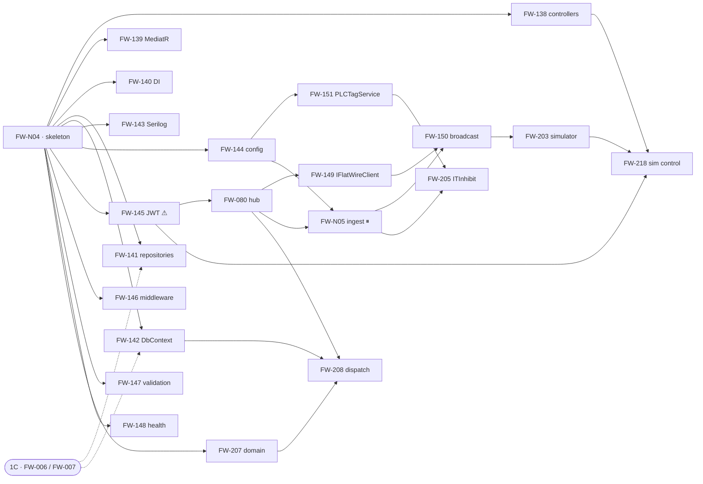

# Phase 1B — Execution Orchestration

**Project:** United Aluminum (UAL) — Flat Wire Mill Module
**Last Updated:** August 31, 2026
**Document Type:** Execution index and dependency graph for the Phase-1B implementation plans
**Status:** Active — **the entry point for this folder**
**Owner:** Backend (.NET) + Real-time streams
**Audience:** The delivery lead sequencing Phase 1B, and any developer picking up a story
**Shortcode:** — *(orchestration, derived from the plans and the specifications; **not citable as a requirement**)*
**Part of:** `40-backend/tasks/` — folder index: this file

---

> **What this file is.** The **32 plans** each say *how* to build one story. This says **what
> can start, in what order, and what is stopping it.** It holds no build detail — every
> statement here resolves to a plan, and where this file and a plan disagree, **the plan
> wins**; where a plan and a specification disagree, the specification wins.
>
> **The one thing to read first:** the critical path is **134 h**, and as of **15 Aug 2026
> nothing on it is blocked** — `G6`/`OI-37` was answered and node 2 (`FW-145`) is buildable.
> See §3. What remains is a **verification** dependency, not a build one: the six role claim
> *values* are still unmapped (§5).
>
> **Building the trial rather than the phase?** Its companion is
> **[TrialOrchestration.md](TrialOrchestration.md)** — the same stories on a different axis:
> 66 across four streams, sequenced by **sprint** (T1/T2/T3) rather than by dependency wave,
> with the trial's own blockers and its 330 h of deferrals. This file answers *what can
> start*; that one answers *what ships on 30 Sep*.

---

## 1. Status board

**42 plans**, and §1.5's **pending register** for everything that still has none. `phase-01b`'s twenty
stories (§1.1–§1.2) · two trial-scope (§1.3) · **ten
trial-path stories from Phases 4–8 (§1.4)** · **three shared-schema plans that this file had never
indexed (§1.4a)** · **two additive Phase-1B plans (§1.6)** · **five simulator plans (§1.12)**. Hours
are `[TB §7]`'s, quoted not restated.


> [`FW-219`](FW-219.md), [`FW-220`](FW-220.md) and
> [`FW-223`](FW-223.md) existed as plans and appeared in **no section of this file** —
> a one-way index failure, and the reason §9's *"a plan file and its index row land in the same
> pass"* rule is now stated. They are §1.4a.
>
> ➕ **The DB stream now has per-story plans too — seven, as of 29 Aug 2026.** That folder's
> *"holds no per-story plans"* banner is retired. They are **not** tabled here (§8 still applies);
> their register is
> [`Database/tasks/Orchestration.md`](../../30-database/tasks/Orchestration.md) §1.3.

> **§1.1–§1.3 are Phase 1B and are what §2–§6 sequence.** §1.4's ten sit **downstream of the
> phase** and are sequenced by sprint in
> [TrialOrchestration.md](TrialOrchestration.md), not by wave here.

### 1.1 Backend stream — 249 h

| Plan | Story | h | Wave | Status |
|---|---|---|---|---|
| [FW-N04](FW-N04.md) | Solution + 4-project skeleton | 16 | **0** | ✅ **Built** — wave 1 is unblocked · `P-01`, `P-02`, `P-50`, `P-51` |
| [FW-138](FW-138.md) | Fourteen thin controllers, 22 endpoints | 45 *(42 owed)* | 1 | ✅ **Built** — 61/61 cases, 22/22 `401` · `P-06` ratified in the build · `P-55` minted |
| [FW-139](FW-139.md) | MediatR + behaviours | 16 | 1 | ✅ **Built** — pipeline order read off the log · `P-59` bridge proven behaviourally · `P-61` applied · `P-10` still waits on `FW-142` |
| [FW-140](FW-140.md) | DI + `useMockData` swap | 12 *(understated)* | 1 | ✅ **Built** — 12 interfaces / 12 stubs / 12 shells · 61/61 and **65/65 bodies byte-identical** · `P-02` re-verified · ⚠ **`P-65` still needs ratification** |
| [FW-141](FW-141.md) | Seven repositories | 28 *(gained `FW-207` scope)* | 1 | ✅ **BUILT** — 6 alphas · 7 structural roots · 7 interfaces · **7 `sealed` repositories, all registered** · `ContextRepository` with `sp_GetGaugeTrace` · `G14` **verified at startup** · **13/13 accessors verified on the live DB** · `P-71` minted. ⚠ **Step 6 still waits on `OI-33`** |
| [FW-142](FW-142.md) | `FlatWireDbContext` + Dapper | 24 | 1 | ✅ **Built** — 7 roots mapped, model validated, insert→select→rollback proven on the live DB · `P-13` holds (**no `DbSet<PassSchedule>`**) · `P-69`, **`P-70`** minted · **unblocks `FW-141` steps 2–3 and `FW-139`'s `P-10`**. ⛔ `SpoolProcessing` untestable — **deployed DB predates `Q60`**; teardown owed |
| [FW-143](FW-143.md) | Serilog + audit log | 12 | 1 | ✅ **Built** — Serilog + Console sink, correlation verified end to end, `UseSerilogRequestLogging` (`P-73`) closes *"controllers log nothing"*, `IAuditLog` + `SerilogAuditLog`. ⚠ **`P-15` still open** — AC 3 met structurally, not materially |
| [FW-144](FW-144.md) | Configuration binding | 12 | 1 | ✅ **Built** — bound map measures **72 paths** (FL1 17 · FL2 22 · FL3 33), settling the stale-`41` figure as a runtime fact; four boot assertions close §5's verification gap; `ITagPathResolver` seam built so an `OI-A` move is one class. `P-74` minted. ⚠ **Map *contents* still blocked on `PLC-Q05`/`G33`, shape is not.** ⚠ `OI-A` was answered by contradicting **both** candidates — no UAL service keeps tag paths in `appsettings`; `OPCConnection` answers from `CommonDB` *(this row read "Ready" until 29 Aug 2026)* |
| [FW-145](FW-145.md) | JWT + role policies | 16 | 1 | ⚠ **Unblocked 15 Aug** — `G6` answered; six claim *values* still unmapped. **Reviewed 27 Aug** — `P-75`/`P-77` minted, `P-76` open; `AC 4` is **not executable** on the MVP-1 surface (§6.1) |
| [FW-146](FW-146.md) | Exception middleware | 8 | 1 | ✅ **BUILT** — `ExceptionHandlingMiddleware` live, filter removed and the removal **asserted at boot**; stack-on-the-wire 2,972 B → 173 B; 22/22 `401` intact; both inspection rows hold at once. `P-78`–`P-82` minted. ⚠ **`P-78`: §4's `RemoveType` sketch does not compile.** Two rows handed forward (§6) |
| [FW-147](FW-147.md) | Validation + 14 enums | 12 | 1 | ✅ **EXECUTED 27 Aug** — built 25 Aug with `FW-138` (14 enums + **14** validators, not 13); **`TC-020` run**: 12/14 pass C# ↔ DDL, zero mismatches (§6.1). ⚠ **Two-way only — no TS leg** (`FW-132` unbuilt) and `LineState`/`AlertSeverity` have no DB leg: **`G56`**, signed off per leg (`P-84`). Defect found: **`G55`**. `P-19` handoff already in `FW-207` |
| [FW-148](FW-148.md) | Health checks | 8 | 1 | ✅ **BUILT** — live at `/api/v1/flatwire/health`, all three ACs measured (§5.1), `0` errors and no new analyzer warning. Option A built, so **no package added**; `version` cut to `"1.0.0"`. **`P-88`** minted; ⛔ **`G57`** raised **and fixed** — the committed `SqlSetting:DSN` was a server name and could not resolve **while the service booted anyway**; now `"UA_Connection_String_dev00164001"`, verified. Residual with `FW-144`. ⚠ `P-85`/`P-87` implemented, **still unratified**. Same day, earlier: **`P-20` restated, `P-85`–`P-87` minted.** ⚠ **The route disagreement does not exist**: `[API §3.2]` is written base-relative to `[API §1]`'s `/api/v1/flatwire`, so row 30 and `[DEP]` are one string in two notations. Also: the hub metrics are **not** this story's (`P-86`), and `OPCConnection` has no anonymous API endpoint to probe. ⚠ `P-85` and `P-87` ratify |
| [FW-207](FW-207.md) | Domain model (`D-29`) | 32 | 1 | ✅ **BUILT** — 15 new files, 17 amended, **0 errors, no new warning**. 7 quantities + `PassScheduleSnapshot` · **13 entity types** + 13 EF configurations · **20 invariants** · 6 domain events · `IAggregateRoot` on all seven roots · **`FW-146`'s owed fifth arm** (`P-89`). **Verified by harness, not walkthrough** (§6.1): model validates at 20 types, **352 columns** checked on live `FlatWireDB`, every invariant demonstrated at the right `409`/`422`, live round-trip rolled back, API still boots (`/health` 200, `/lines/status` 401). ⛔ **Defect found and fixed: EF was mapping the new derived properties as columns and `RodAlpha` as an entity type** — green build, broken model; 15 `Ignore` calls. ⚠ **`P-91`'s two rod-order entities NOT built** — need `[SVC §3.2a]`'s signature. Same day, earlier: ⚠ **reviewed; `P-89`–`P-93` minted.** ⛔ **The blanket `422` is withdrawn** (`P-90`): bay occupancy is **`409`** per `[API §1.3]`/`§1.8` and the built code, and its *"breakable by state"* justification argued for the opposite code. ⛔ **The `422` path has no arm** — an aggregate throw returns `500` until `FW-146` adds the fifth (`P-89`). **Five 22-Aug tables placed** (`P-91`, `[SVC]` corrected at source; two await its signature). `G14`'s format half now **verified**, `OI-42` struck, `G42` rewritten. Structural half already built by `FW-141` (`P-66`); `D-30` still open on 3 of 7 roots |
| [FW-208](FW-208.md) | Domain-event dispatch | 8 | 3 | ⚠ **`P-35`'s stated injection needs a one-line correction — see `P-101`** (28 Aug 2026): a handler in `FlatWire.Infrastructure` can name neither `FlatWireHub` nor `IHubContext<>`; it injects `IFlatWireBroadcaster`. ✅ **BUILT (steps 1-7, 9, 10)** - 3 new files, 8 amended, **0 errors, no new warning**. Two lane wrappers, capture-then-replay hooked into `CommitTransactionAsync`, `SaveEntitiesAsync` routed through it, and the two in-transaction handlers. **Verified by harness on live `FlatWireDB`**: lane routing (raw event reaches neither lane), both lanes dispatching in-transaction-then-broadcast, the bay actually released inside the rejection's transaction, a rollback broadcasting nothing, `WLD010`. `FW-207` still 137/137; API boots. ✅ **STEP 8 BUILT 29 Aug 2026** - five broadcast handlers in `FlatWire.Infrastructure/EventHandlers/`, injecting **`IFlatWireBroadcaster`** (`P-101`), **5 new files, 5 amended, 0 errors, 13 warnings = the pre-existing baseline**, **harness 54/54** including live-`FlatWireDB` commit-boundary runs (order, rollback-broadcasts-nothing, and a throwing broadcast NOT failing the committed command). ⛔ **`CoilCompleted` is unbroadcastable** - `[SIG §5.2]` has no coil-completion member and adding one is breaking under `[API §8]`: **`P-137`**, new **`OI-140`**. ⚠ **The *“eight broadcast handlers”* figure in this row's neighbours is a miscount of eight *handlers*** - six post-commit plus two in-transaction, with the two both-lane events counted once each. **Seven exist; five broadcast.** ⚠ Two more defects step 8 found: the post-commit replay was **unguarded**, so the first throwing broadcast would have turned a committed command into a `500` (**`P-138`**), and three events could not fill their own payloads (**`P-139`** - `WeldRecorded` had no `LineId`, so it was unbroadcastable). ⛔ **Three defects found on the 27 Aug execution**: `INotificationHandler<>` was never registered (a third silent no-op), the in-transaction lane could not see a sibling aggregate's identity so **`P-94`'s order is revised to save-drain-save-commit**, and `BayStateChanged` had to be split (**`P-98`**) |

### 1.2 Real-time stream — 124 h

| Plan | Story | h | Wave | Status |
|---|---|---|---|---|
| [FW-080](FW-080.md) | `FlatWireHub` | 28 | 2 | ✅ **BUILT** - `/hubs/flat-wire` live: `Hub<IFlatWireClient>` (20 members), `[Authorize]` + `?access_token=` (built here as `FW-145` §3.5's prerequisite), MessagePack `8.0.30` behind `EnableMessagePack`, groups, and `P-100`'s replay on join. **0 errors, no new analyzer warning; 14/14 acceptance checks pass on a live client.** **`FW-208` unblocked** via `P-101`. `P-102` minted: the JSON protocol is aligned on string enums, without which the two protocols disagreed about `LineId` and `P-21`'s switch was not transparent. ⚠ `G10` provisioning and `G9` pass criteria are still open |
| [FW-151](FW-151.md) | `PLCTagService` + simulate | 16 *(understated — ~20–24 h)* | 2 | ✅ **BUILT — verified by harness, 53/53, 0 errors, no new analyzer warning.** Five operations live: resolve-all → audit `Attempted` → simulate returns → resolve `OPCInfo` (cached) → refuse read-only → **one** `WriteTag` POST → `Value = null` confirm read → three-step compensation. **`P-109`–`P-112`** minted; **`G59` mechanism confirmed** (fails at `GetOPCInfo` with a bare `"Object reference not set"`, not a `401`). ⛔ **Two defects only execution could find:** `RestClient` reports transport faults **in-band**, so the exception-based Polly precedent would never have fired (`P-109`); and the service **audited an unverified value as verified** until the harness caught it (`P-112`). ⚠ Step 0 was **three** package references, not two — `Polly` is absent from Infrastructure too. ⚠ **`G60` leaves the real resolve path unexercised against `OPCConnection`**, and `G33` is untouched. Earlier: ⚠ **Reviewed 28 Aug 2026 — `P-27` restated, `P-103`–`P-107` minted, `G58`/`G59` raised.** ⛔ **The compensation shape is NOT blocked** — `[ARC §10]`/`FR-526` (19 Aug) make the two database halves one transaction, so what remains is three steps this service owns and **AC 4 is satisfiable today**; only `G30` still bears on it. ⛔ **A `200` from `WriteTag` is not evidence of a write** (`G58`) — both managers swallow every failure, `IsGood` is never set, and `OPCUAManager.cs:362` verifies by reference equality; confirm with one batched `ReadTag` (`P-105`). **`WriteTag` is already batch** (`P-103`), `GetOPCInfo` must run first and be cached (`P-104`), `IsReadonly=true` is a **silent no-op at `200`**, and a watchdog write has **no bearer token** (`G59`). Stale: the **`41`** paths, `TC-601`–`TC-613` (it is `TC-613` + `TC-085`). ⚠ **RE-REVIEWED before execution — `P-108` minted, `G60` raised, and two corrections would have stopped the build:** `FlatWire.Infrastructure` references **neither `UA.Framework.RestClient` nor `UA.APIDTO`** and **nothing registers `RestClient`** (`FW-140 §2.1` describes `CoilCheckin`'s copy), and the confirm read **without a `Value = null` sentinel would have reported success unconditionally** — `ReadTag` swallows exactly like the write and returns the tag unchanged. Also: `ITInhibit` is **write-only** so `SetITInhibit` is excluded from the confirm read; the simulate branch moves **before the resolve**; and **`G60`** — no `OPCModules` member and no `CommonDB` OPC registration for flat wire, so the resolve path is **dead code until the Phase-14 window** |
| [FW-149](FW-149.md) | `IFlatWireClient` | 16 *(overstated)* | 3 | ✅ **EXECUTED 28 Aug 2026 — the server leg of the contract diff is COMPLETE at 20 of 20.** ⛔ **`P-117` discharged, not just raised: `[SIG §5.4]` now publishes all six marker payloads `[PROPOSED]`** — a shared `lineId · runId · footagePosition · timestamp` base plus one to three fields each — **verified against the built code on publication, all six agree**, plus the cadence and not-durable rules that section had never stated. ⛔ **Step 3 found the thing it exists to find:** `OrderAllocationReached` is **9/9 from one `RodOrderConsumption` row**, but `SpoolCompletionPromptDue` is **4 of 6** — `spoolAlpha` is one join off `SpoolCheckin`, and **`targetLb` has no persisted source anywhere in the schema** (its notion belongs to `[SIG §5.5]`'s unpublished, advisory Part A). The build's nullability already carries that; both wrong "fixes" are now named on the member. ✅ `P-115` recorded on the `PayoffPosition` enum, where `FW-132` reads. ✅ 20 members / 21 types, nothing added. **0 errors, no new analyzer warning; no payload field changed — the edits are documentation.** ⛔ **AC 3 still cannot close** — `P-116`'s client leg is owed to `FW-136`, which does not exist |
| [FW-N05](FW-N05.md) | OPC ingest + channel | 32 | 3 | ✅ **CONTRACT BUILT AND VERIFIED 28 Aug 2026 — service built, registered OFF, blocked at step 0.** `Reading` + `IReadingChannel`/`ReadingChannel` (bounded, `DropOldest`) are live and **9/9 harness assertions pass**: a 1,524-snapshot burst stayed bounded at 1,024, oldest dropped, freshest survived, 349.7 KB. `OpcIngestService` is built and registers only when `SimulateOpcFeed=false`, which **cannot usefully be set until `G59`/`G60`** — boot reproduces both by name, once per line, and the host stays up. `P-121`–`P-123` minted on execution; `P-123` is a **measured** defect (the config binder appends to a defaulted collection → four poll loops). **`FW-203` and `FW-150` can now build against a real contract** (`P-29`) |
| [FW-150](FW-150.md) | Broadcast loop | 16 | 4 | ✅ **BUILT AND VERIFIED 29 Aug 2026 — 15/15 harness assertions, 0 errors, no new analyzer warning.** `BroadcastLoopService` + `FlatWireRecordingOptions` are live: arrays for gauge/width, newest-wins for the three scalars, on-change for the two status channels, **nothing on an empty tick** (~90 real ticks in 9 s, zero work), no FL2 branch, `LineStatus` silent pre-`C2`, and **`RunReading` written by raw SQL and absent from the EF model** (`P-12`). ⛔ **The harness caught what three review passes missed** — a derived-value lookup failure was blocking `ComponentStatus`/`LineStatus`; `P-126` contains it. ⚠ `DBQueryHelper` is stored-procedure-only, so the insert runs Dapper on the context's connection; `RodStaging` is FL1/FL3 only so FL2 sends no `PayoffWeight`; `TC-601`–`TC-603` need a publisher and stay a QA0 item; and **`FW-208`'s run-lifecycle invalidation is not wired** — the one loose end. *(previously: REVIEWED against the built contract 28 Aug 2026 — ready, unreduced for the trial, and two findings would have failed at compile time.** Only **gauge and width take arrays**; speed, payoff weight and footage take a single payload. Every field on `FW-N05`'s `Reading` is nullable and most payload fields are not, so **null means no sample — skip the channel, never send `0`**. **FL2 needs no branch at all** (`[SIG §5.3]` *"entirely"* + no `AGC` path = nothing to suppress). **`RunId`, `InSpec`'s band and `PercentRemaining`'s denominator are cached per run/rod, never per tick**, and `InSpec`'s `DEFAULT (1)` means an omitted value claims in-spec. `P-124`, `P-125` minted. ⛔ **RE-REVIEWED before execution — six more corrections, one to `P-125` itself:** invalidation moved off `LineStatus` (dark until `C2`, so it would never fire); **`RunReading` has no aggregate repository by design (`P-12`) and must never become a navigation collection**; its entity, configuration and write path **do not exist yet**; `ComponentStatusEvent.IsActive` is non-nullable so a null is not a change to `false`; the fault bit has **no channel here** (it is `AlertRaised`, `FW-177`'s, and unwired); and `ITInhibitService` does not exist yet, so the gate defaults to *not inhibited*. ⛔ **RE-REVIEWED AGAIN 29 Aug 2026 and this pass found a `Must` the card contradicted: there is a THIRD cadence, measured in FEET.** `FR-018` sets the **data-recording frequency** at **4 ft per data point** (20 ft intermediate), configurable without a code change, verified by `TC-601`–`TC-603` *counting `RunReading` rows against footage* — and this loop is `RunReading`'s only writer, so **the write is gated on footage, not on the tick** (§2.6). The previous pass had said the loop *"does not thin the series"*. Row rate is therefore **speed-dependent** — `(FPM÷60)÷spacing_ft` — not the ~2/s it claimed; **the config key does not exist**; and `[TB §11]` bulk-maps `FR-018` to **uncosted `FW-N11` ("Operator session")**, so **this loop owns the gate and `FW-N11` the number and route rule**. ⛔ **The `TC-601`–`TC-613` citation was wrong** — those are the footage cases (this loop's only ones), `FW-N05`'s, `FW-080`'s and `FW-151`'s respectively; `P-30`'s clause citing them is struck. ⚠ **No test case exists for the 100 ms cadence, decimation or the on-change channels** (`G9`). ⚠ Lifetimes: the broadcaster is **singleton** so sending needs no scope; the scoped `DbContext` means **one scope per tick only when persisting** |
| [FW-205](FW-205.md) | `ITInhibitService` | 16 | 4 | ✅ **BUILT — 0 errors, no new analyzer warning, host boots under Development scope validation.** `ITInhibitService` (singleton + `IITInhibitService` + hosted service, one instance), `AlertTypes.DataRecording`, two `FlatWireOpc` keys, and `FW-150`'s gate swapped — `IsRunBlocked` is now an instance method and the drain stamps the watchdog. `P-132` minted. ⚠ **Two things the green build does not mean:** `G59`'s **token** half is untouched, so no tag reaches a controller once simulate goes false; and **no condition has been observed firing** — nothing publishes to the channel until `FW-203` lands, so the interlock is correctly wired and correctly inert. ⛔ **`G59`'s audit half was CARRIED, not closed** — a named sentinel (`SystemOperatorId`), documented as one |

### 1.3 Trial scope — additive to `[CE §3b]`, offsets nothing

| Plan | Story | h | Wave | Status |
|---|---|---|---|---|
| [FW-203](FW-203.md) | OPC feed simulator | 8 | 5 | ✅ **BUILT — the RT spine now runs END TO END: simulator → channel → `FW-150` drain → broadcast + `RunReading` → `FW-205`'s watchdog.** 0 errors, no new analyzer warning. FL1 and FL2 both driven, FL2's gauge/width **null** and never zero. `P-133`–`P-135` minted. ⛔ **Running it found two defects review did not**: the simulator's nominal was out of the trial fixtures' band, so every FL1 reading would have been out of spec from tick one; and `FW-205`'s condition 5 was **off by one** — 2x the interval is ONE missing reading, and it blocked a healthy line four seconds after boot. ⚠ Steering, the stop edge and the fault are built but **not exercisable until `FW-218`** (`G43`, `P-36`) |
| [FW-218](FW-218.md) | Sim control surface | 18 | 6 | ✅ **BUILT — `G43` resolved, and `P-38` VERIFIED BOTH WAYS.** Four endpoints at `/sim` as a minimal-API group. **Measured: simulation OFF → all routes 404** and the real ingest registers instead (failing loudly by name on `G60`, as designed); **simulation ON → `/sim/state` 401, `GET` on the steer route 405**, so the routes exist and are auth-gated. `P-136` minted. ⛔ **`FW-145` is unbuilt, so no role claim is issued and these DENY today** — fail-closed, deliberately, and it is now a **hard dependency for the acceptance run** rather than a discovery on the day |

### 1.4 Trial-path plans — Phases 4–8, downstream of this phase

Server-side stories on the 30 Sep trial's path. **Not part of Phase 1B**, so they do not
appear in §2's graph, §3's critical path or §6's exit criteria — they are sequenced by sprint
in [TrialOrchestration.md](TrialOrchestration.md).

| Plan | Story | h | Stream | Phase | Status |
|---|---|---|---|---|---|
| [FW-157](FW-157.md) | `POST /checkin/rod` + `CheckInService` | 36 | BE | 4 | ✅ **DE-STUBBED 29 Aug — staged, not committed** (38 L / 2 throws → 1165 L / 0). `RunStarted` is raised by `FlatWireRun.Start` (`P-141` closed) and the spool mis-attribution is corrected. ⛔ **AC 7's `Operator+` policy is NOT met** — bare `[Authorize]`, `FlatWireRoles` all `"TBD"`. ⛔ **There is no MediatR command and that is deliberate** (`P-258`). ⚠ `G2` narrowed by `FR-526` — the DB half is one transaction; trial runs it **without `RodStaging`** |
| [FW-082](FW-082.md) | PLC tag group push on acknowledgement | 16 | RT | 4 | ⚠ **Five blockers** · `G29` leaves a payload value with nowhere to write · ⛔ **`G58`: the transport reports no write failure**, so AC 4's failure path has no trigger. ✅ `P-41` is **implemented by `P-111`**; the re-clear is `P-110`'s flags-only shape |
| [FW-164](FW-164.md) | `GET /run/active` + `gaugetrace` | 12 | BE | 5 | ⚠ **The trial's landing route** since DB1 left scope. ⛔ **The Order block is in neither `[API §4.7a]` nor the built DTO** — `P-254` makes it a contract addition. ✅ `routeMode` and the `204` are already contracted |
| [FW-168](FW-168.md) | `POST /spc` + `SpcService` | 12 | BE | 6 | ⛔ **Blocking: `Deviation`/`InSpec` are mapped writable against `PERSISTED` computed columns — the first real insert fails.** The request also carries the **tolerance**, so the verdict is client-driven until `P-255`. ✅ Five checkpoint types in both built layers; TS not authored |
| [FW-170](FW-170.md) | pause / resume + `RunControlService` | 8 | BE | 6 | ✅ **Further along than the card says** — the aggregate raises `RunPaused`/`RunResumed`, both handlers are built, and `CK_RunPauseEvent_Outcome` **carries four**. ⚠ `Outcome` is a **string**, and `[API §4.8]` still lists a `RodCheckout` pause category |
| [FW-172](FW-172.md) | Run-event markers + `LineStatus` | 20 | RT | 6 | Four of six markers (`P-45`) — ✅ two already have handlers. ⛔ **`SpcCheckpointRecorded` and `DieChangeRecorded` do not exist**; ⛔ **`LineStatus` is dark until `C2`**, so `P-256` moves AC 2 onto the pause/resume events |
| [FW-174](FW-174.md) | `POST /wipreject` + `POST /checkout` | 24 | BE | 7 | ✅ **`G24` is answered in the DDL** — approval columns and three constraints exist; the register row is stale. ⛔ **The release event is `BayReleaseRequested`, not `BayStateChanged`**, and both handlers are already built |
| [FW-177](FW-177.md) | Exception broadcasts + supervisor notify | 16 | RT | 7 | ⚠ `FW-175` deferred — notification is transient. ⛔ **No `Supervisors` group and no way to address one** (`P-257`, unpriced); ⛔ neither `AlertRaised` nor a checkout event exists as a domain event |
| [FW-179](FW-179.md) | `POST /checkin/spool` + `GET /spools` | 18 | BE | 8 | ⚠ **`[API §4.6a]`'s worked example is stale**. ✅ `G41` is **mitigated in the domain** by `Fm1ScopedToRodFedLinesRule`. ✅ **Both mis-attributed shells are corrected** in the 29 Aug de-stub — `CheckInSpoolAsync` no longer says `FW-157`, and `CompleteSpoolAsync` names `FW-202` |
| [FW-181](FW-181.md) | FL2 null-gauge contract | 4 | RT | 8 | ⚠ *"the single most likely thing to ship wrong"* — ⛔ **and the plan itself had it wrong**: the wire carries **nothing**, not a null, and **no FL2 branch may exist**. ✅ `P-49` is built on the DTO. ⛔ AC 1's FL2 `PayoffWeight` has **no denominator and no owner** |

### 1.4a Shared-schema write-back plans — indexed here for the first time

> ⚠ **New section 29 Aug 2026, and it adds no plan file.** These three plans have existed on
> disk and appeared in **no section of this file**, which is why §1 read *"32 plans"* against 35.
> A plan nothing indexes is a plan nobody finds — §9's rule now says so explicitly.
>
> They are **DB + BE** stories whose DB half is `[DEP §4.2]`'s deploy chain, so they sit across
> the boundary §8 draws. They are indexed here because **the plan file lives here**.

| Plan | Story | h | Stream | Phase | Status |
|---|---|---|---|---|---|
| [FW-220](FW-220.md) | FL1/FL3 check-in write-back into the shared schema | 32 *(DB 24 · BE 8)* | DB+BE | 4 | ⛔ **Blocked on an approval, not on code** — names `10_CommonDB_Insert_WIPStations_FlatWire.sql`, whose sign-off gate has never been passed (`FW-241`). ⚠ `Q37`–`Q39` before it runs outside DEV |
| [FW-221 *(no plan)*](Orchestration.md) | Station release and reqsum reversal | 9 | DB | 4 | ⚠ **DB-stream story, no plan file** — `60_` has no open items; ⛔ `70_ReverseReqsum` is **safe to create and unsafe to call** (`Q40`) |
| [FW-223](FW-223.md) | Rod ingestion — populating the FlatWire tables | 14 *(DB 10 · BE 4)* | DB+BE | 4 | **`30_…sp_IngestRodFromCoils` is Ready — no open items.** Downstream of step 2 |
| [FW-219](FW-219.md) | FL2/FL3 run-end write-back into the shared schema | 40 *(DB 26 · BE 14)* | DB+BE | 9 | ⚠ `Q34`–`Q36` before it runs outside DEV. `OI-114`'s cut-record sentinels are **parameterised**, so a wrong answer is a one-line change |

### 1.5 Pending register — work with no plan, and nine newly minted ids

> **New 29 Aug 2026.** §1.1–§1.4 index work that **has** an id. This indexes what did not — and
> **silence is not coverage** is the same rule §8 already applies to scope. Three of the four
> tables below existed only as prose scattered across §8.1–§8.3; the fourth is new work.

**Table A — a plan exists, the build does not.**

| Story | h | What is stopping it |
|---|---|---|
| [FW-145](FW-145.md) | 16 | ⚠ **The only unbuilt Phase-1B story.** Plan is *Buildable — one fact outstanding*; the six role claim **values** gate verification, not construction (§5). ⛔ **`P-136` makes it a hard dependency for the trial acceptance run** — `FW-218`'s `/sim` routes issue no role claim and therefore **deny everyone today** |
| [FW-157](FW-157.md) | 36 | `G2` — provisional; the trial runs it without `RodStaging` |
| [FW-082](FW-082.md) | 16 | Four blockers; `G29` leaves a payload value with nowhere to write |
| [FW-164](FW-164.md) | 12 | The trial's landing route since DB1 left scope |
| [FW-168](FW-168.md) | 12 | `Q22` — the tolerance band is unseeded |
| [FW-170](FW-170.md) | 8 | Ready |
| [FW-172](FW-172.md) | 20 | Ready — four of six markers (`P-45`) |
| [FW-174](FW-174.md) | 24 | `G24` — Mode B's constraint has no columns |
| [FW-177](FW-177.md) | 16 | `FW-175` deferred — notification is transient |
| [FW-179](FW-179.md) | 18 | `[API §4.6a]`'s worked example is stale (§8.2) |
| [FW-181](FW-181.md) | 4 | *"the single most likely thing to ship wrong"* |

> The ten below `FW-145` are §1.4's, sequenced by sprint in
> [TrialOrchestration.md](TrialOrchestration.md), not by wave here. They are repeated in this one
> table so *"what is unbuilt"* has a single answer.

**Table B — an id exists, a plan does not.** The work owed is **a plan file**, not a new id.

| Story | Phase | Subject | |
|---|---|---|---|
| `FW-185` | 9 | `POST /coil/complete`, `GET /coil/{alpha}/label` | ⚠ **Phase 9 is *wholly MVP-1*** |
| `FW-187` | 9 | Completion broadcasts | ⚠ **in scope, unplanned** |
| `FW-190` | 10 | Hybrid single-batch PLC push and `RouteMode` | overlaps [`FW-181`](FW-181.md) `P-49` |
| `FW-192` | 10 | Continuous end-to-end trace on FL3 | |
| `FW-090` | 11 | Flattening Lines report tab and reporting | ⚠ `OI-101` — shift boundaries undefined |
| `FW-101` | 12 | Weld traceability attribution in yield | |
| `FW-196` | 13 | Alloy CRUD, machine config, role config | |
| `FW-198` | 13 | Reference-data change broadcast | |
| `FW-200` | 14 | PLC commissioning support | ⚠ already cited by [`FW-082`](FW-082.md) |
| **[`FW-206`](FW-206.md)** | 4 | `ITInhibit` conditions 1–2 | ⚠ **`P-132`: `FW-206` must not re-derive `FW-205`'s arming rule** or the two double-block the same tag |
| ~~`FW-215`~~ | ✅ **BUILT 1 Sep 2026** | — | ✅ **LEAVES THIS REGISTER — the simulator set is complete.** Planned and built the same day; `P-306`–`P-314` minted, 71/71 harness checks, and the `404`/`401` gate measured in all three configurations. `G70` and (server-side) `G68` and `G73` closed; `G72` narrowed to `FW-145`; `G69` armed and still open. *(Row kept for the audit trail — previously: unscheduled, additive, card RECONCILED 1 Sep 2026* — still no plan, but no longer stale: `depends_on` now [`FW-218`](FW-218.md), [`FW-210`](FW-210.md), [`FW-211`](FW-211.md), [`FW-213`](FW-213.md), [`FW-217`](FW-217.md) *(all built)*, `FW-138`, `FW-145`, and `blocked_by` **`G69`**. ✅ **The owed endpoint is now ON the card** — `GET /sim/config`, `G68` — with `G70`’s widened gate and shared seam. ⛔ **And `G72` was raised doing it**: the built guard’s `Roles = "Engineer,Admin"` names a role `[SEC §8]` does not have |
| `FW-N08` `FW-N10` `FW-N11` `FW-N12` | — | Wire break · stop popup · operator session · de-stub | **Uncosted** (`[TB §7]` B.4). `FW-N08` is blocked on `G34`; `FW-N11` owns `FR-018`'s number and route rule, `FW-150` owning only the gate |

> ⚠ **`FW-185` and `FW-187` are the ones to watch** — Phase 9 is **wholly MVP-1** (`CoilOutput` and
> `CoilTraceability` returned on 11 Aug 2026 because the coil genealogy behind the **welding-wire
> customer certificates** is an MVP-1 obligation), so they are not deferred, only unplanned. They
> sit outside the trial, which is why they have not been reached.

**Table C — nine ids minted 29 Aug 2026.** Cards, hours bases and acceptance criteria are in
`[TB §7]` under *Additive — pending-work stories*; hours here are **quoted, not restated**.

| Story | Subject | Stream · Phase | h | Closes |
|---|---|---|---|---|
| **[`FW-232`](FW-232.md)** | `OrderController` — a host for `POST /order/{orderNo}/complete` | BE · 4 | 3 | §8.1 finding 5, `P-50` |
| **[`FW-233`](FW-233.md)** | A host for the `/rod/**` surface | BE · 4 | 6 | §8.1 finding 4, `P-53`/`P-54` |
| **[`FW-234`](FW-234.md)** | Audit-log persistence target | BE + DB · 1B/1C | 12 | **`P-15`** — the register's first `open` row · ✅ **PLANNED 29 Aug 2026** (§1.6) |
| `FW-235` | `CoilCompleted` broadcast member | RT + FE · 9 | 12 | `OI-140`, `P-137` |
| `FW-236` | Per-tag write status from `OPCConnection` | BE · 14 | 16 | `G58`, `FR-074` |
| **[`FW-237`](FW-237.md)** | Service identity for unattended PLC writes | BE · 4 | 12 | `G59` **identity half**, `P-127` |
| `FW-238` | Register flat wire with `OPCConnection` | BE + DB · 14 | 12 | `G60`, `P-120` |
| **[`FW-239`](FW-239.md)** | Run-lifecycle invalidation into `FW-150`'s cache | RT · 1B | 4 | `P-125` — `FW-150`'s one loose end · ✅ **PLANNED 29 Aug 2026** (§1.6) |
| **[`FW-240`](FW-240.md)** | `RodOrderAllocation` / `RodOrderConsumption` entities | BE · 4 | 8 | `P-91` second half |

> ⚠ **Two of these price a shell and not an endpoint, deliberately.** `FW-232`'s handler is
> **`FW-227`** and `FW-233`'s order set is **`FW-226`'s** — both already costed in the baseline.
> Re-costing the bodies here would double-count two stories. *(The first draft of this register did
> exactly that, at 8 h and 16 h; corrected before it shipped.)*
>
> ⚠ **All nine are additive to `[CE §3b]`** — the treatment `FW-202`/`203`/`204`/`218`/`219`
> already have. **They offset nothing and are in no published total.**

**Table C2 — minted 2 Sep 2026, the 1–2 September scope** (`[TB §7]` Appendix `B.7`).

| Story | Subject | Stream · Phase | h | Closes |
|---|---|---|---|---|
| **[`FW-252`](FW-252.md)** | Die lifecycle service — per-tool die life, `DieHistory` writes, per-tool `POST /diechange` validation | BE · 6 | 16 | ⭐ **The die split (`Q91`).** `OI-41` closed after five months; `FR-233`/`D4` revert to per-tool, and **`TC-274` is executable for the first time**. ⛔ Blocked on `OI-12` |
| **[`FW-254`](FW-254.md)** | Reason-code query endpoints — the three seeded vocabularies | BE · 1C | 9 | ⭐ **`A4`/`A5`/`A6` closed after 41 days**; wave `W3` unblocked. ⚠ **`[API]` declares none of the three routes** — this story amends the spec as well as building it, and four cards read it |
| **[`FW-255`](FW-255.md)** | `LineDowntimeEvent` write path — `LineDowntimeService` and the two endpoints | BE · 6 | 22 | ⛔ **44 client downtime codes had nowhere to be recorded.** `RunPauseEvent.RunId` is `NOT NULL` and *Power Outage* happens when no run is open (`D-35`) |
| **[`FW-257`](FW-257.md)** | Re-point the built `ITInhibitService` at `ItInhibitReason` | BE · 4 | 8 | ⛔ **`FW-205` is `done` against a vocabulary that changed.** The client's eight reasons share **exactly one** of `[PLC §8.2]`'s five (`G80`), and one of the eight is not implementable at all (`G81`) |

> ⛔ **`FW-257` is the row worth reading twice: it amends a story marked `done`.** Nothing in the
> board flags a completed card whose specification moved underneath it, which is how a service
> built to five hard-coded conditions keeps looking finished beside a 12-row lookup.
>
> ⛔ **`FW-170`'s and `FW-167`'s plans were both wrong on 2 Sep 2026 and are now corrected in
> place** — `FW-170`'s header asserted `CK_RunPauseEvent_NotesOther` keys on `ReasonCategory`
> (it keys on **`ReasonCode`**, and `Other` is a code per bucket), and `FW-167`'s callout told the
> reader to validate against `Drawer`'s 13-row size catalogue, **which no longer exists**.
> `FW-174` gained the 72-reason vocabulary and `G79`/`G82`.

**Table C3 — minted 3 Sep 2026, the fourth Tooling Inventory tool type** (`[TB §7]` Appendix `B.8`).

| Story | Subject | Stream · Phase | h | Closes |
|---|---|---|---|---|
| **[`FW-260`](FW-260.md)** | Roll-set register service — `ToolingInventoryRollSet` CRUD and the mount invariant | BE · 6 | 10 | `D-42` — the client's fourth tool type. Paired with [`FW-259`](../../30-database/tasks/FW-259.md) (DB) and [`FW-261`](../../50-frontend/tasks/FW-261.md) (FE) |

> ⚠ **Deliberately thinner than `FW-252`, and the reason is the life model.** A die accumulates
> footage every run, so `FW-252` carries a *lifecycle* service, a `DieHistory` write path and a
> denormalised total to keep honest. **A roll set has no footage counter** — it is reground to a
> minimum OD — so there is no per-run write path and no history log. What is left is a register
> with one non-trivial invariant: **`CK_TIRS_Mount`**, enforced in the aggregate as well as the
> database, answering **422** rather than 500.
>
> ⚠ **`NominalDiameterIn` is not derived from, validated against or reconciled with
> `Stand.RollDiameterIn`.** Separate values, separate owners — the machine's roll diameter is
> `D-26` and `[PLC §5.4]` data; this is the physical tool's own size. A developer who "fixes" the
> apparent duplication breaks both.
>
> ⚠ **Additive to `[CE §3b]` like Table C — ⛔ but part of this set is scope RETURNING to MVP-1**,
> so unlike Table C a published total genuinely moves. [`FW-258`](../../60-delivery/tasks/FW-258.md)
> owns that, and the FE half is [`FW-253`](../../50-frontend/tasks/FW-253.md) and
> [`FW-256`](../../50-frontend/tasks/FW-256.md), the DB half
> [`FW-251`](../../30-database/tasks/FW-251.md).

**Table D — registered, and deliberately given no id.**

| Item | Why no story |
|---|---|
| ⛔ **Exit criterion 6 has no named reviewer** | QA hours are **phase-level, never per story** (`[TB §7.1]`), so the walkthrough's effort is already inside Phase 1B's +20% uplift. What is missing is **a name and a slot**, not effort — and the only 0 h cards in `[TB §7]` are the *cancelled* `FW-001`/`FW-002`. Tracked in §5 and §6 |
| ⚠ **`G42`'s non-overlap invariant** | ✅ **Already built** — `SpoolSegmentsMustNotOverlapRule` in `FlatWire.Domain/Rules/TraceabilityRules.cs`, **invoked** at `SpoolProcessing.cs:188`. Verified 29 Aug 2026. `P-91`'s *"the aggregate is the ONLY defence"* is satisfied; the gap row is what needed updating |
| ⚠ **`FW-144`'s status** | ✅ **Built** — §1.1's row said *"Ready"* until this pass. Corrected there |

### 1.6 Additive Phase-1B plans — written 29 Aug 2026

> Both are `[TB §7]`'s *Additive — pending-work stories* set, so they are **additive to
> `[CE §3b]` and in no published total**. They are Phase 1B, which is why they are here and not
> in §1.4.

| Plan | Story | h | Wave | Status |
|---|---|---|---|---|
| [FW-234](FW-234.md) | Audit-log persistence target | 12 *(BE 8 · DB 4)* | 5 | **Ready to build** — `SerilogAuditLog`'s own class comment specifies the swap, so the BE half is one class and one registration. ⛔ **The `IAuditLog` signatures must not change** — `P-144` keeps the correlation id off `AuditEntry` for that reason. `P-146`: the audit table takes **no FK to the run**, the only place that exception is right. `P-147` guards the write so a failing audit never fails a command. ✅ **Closes `P-15`** |
| [FW-239](FW-239.md) | Run-lifecycle invalidation into `FW-150`'s cache | 4 | 5 | ⚠ **The card names two things that do not exist.** ⛔ **There is no run-lifecycle domain event** — `RunEvents.cs` holds seven records and no run start or end, so `P-141` mints `RunStarted`/`RunEnded` here and leaves the *raising* to `FW-157`/`FW-219`; the handler ships **correctly wired and correctly inert**. ⚠ AC 2's `PayoffStateChanged` is a **hub member**, not an event — subscribe to `BayStateChanged` (`P-142`). ⛔ **`G67` raised (as `G62`, renumbered 31 Aug): `stagedWeights` has never had an eviction path**, so `PercentRemaining` is computed against the previous rod after any restage — AC 2 is a **bug fix**, not a wiring job |

### 1.12 Simulator plans — written 31 Aug 2026

> ⚠ **Still unscheduled, and no longer unplanned.** All five are **additive to `[CE §3b]`** and in
> no published total, and each left §1.5's Table B and §8's exclusion list on 31 Aug 2026 —
> *"a plan file and its index row land in the same pass"* (§9). ⚠ **`FW-212` is Phase 4, not 1B**, and
> it left §1.5's Table A on 31 Aug 2026 when it was built; **`FW-213` is Phase 5 and `FW-217` is
> Phase 14**, which §8 excludes — they sit here because they are *unscheduled and additive*, **not**
> because of their phase. ✅ **`FW-215` has LEFT Table B — built 1 Sep 2026, so no simulator id remains in it.**
>
> ✅ **Four of the five are now built — read the Status column, not the section heading.** `FW-213` and
> `FW-217` were planned AND built on 31 Aug 2026, and each carried a blocker its card never named:
> `FW-213` has **two of twelve behaviours with no signal at all** (`Q10`/`OI-45`), and `FW-217` was
> **aimed at a seam that does not exist** — `P-295`, which the build confirmed and the three affected
> specifications have now been amended for. ⛔ **`FW-217` is built and its end-to-end leg does not run**:
> `G59` stops `FW-N05` completing one read, and **`G70`** — raised by that build — leaves the fixture
> unsteerable. ✅ **[`FW-215`](FW-215.md) is now PLANNED AND BUILT (1 Sep 2026) and `G70` is CLOSED** — the fixture is steerable, measured with the double mapped.
>
> ✅ **The first three are built — 31 Aug 2026.** `FW-210` and `FW-211` landed in one pass; They were planned early **because the code
> had moved under both cards**: the 29 Aug RT-spine build satisfied part of each and contradicted
> part of each. That reconciliation is what made the transplant safe, and it is precisely what
> §8.3's *"read a plan's What already exists table before its build order"* exists for.
>
> ⚠ **The blockers did not close and they did not need to.** All five of `FW-210`'s remain open;
> what they gated was **verification**, not construction — the same shape as `FW-145`'s *"the six
> role claim values gate verification, not construction"* in §1.5's Table A. `G39` is the one that
> matters now, and only `C13` in the October window closes it.

| Plan | Story | h | Wave | Status |
|---|---|---|---|---|
| [FW-210](FW-210.md) | Line model core — the kinematic state machine for FL1/FL2/FL3 | 24 | — | ✅ **BUILT AND HARNESS-VERIFIED 31 Aug 2026** — 65/65 checks, 0 errors, **no new analyzer warning** (baseline measured both ways), host boots with the spine live and `/sim` unchanged from `FW-218`'s measurement. ⚠ **None of the five blockers gated construction**: `G9`/`OI-34` is a missing NFR *target* against an already-picked cadence; `OI-35` and `Q10`/`OI-45` are answered by **declining to compile a guess** — a two-state raw vocabulary and a **null** payoff weight. ⛔ **Three defects in `FW-203`'s code were fixed, and none was on the card**: gauge published as **roll gap**, `lbPerFt` as the literal `0.0075m`, and **FL3 publishing no FM2 stand at all**. ⛔ **`P-275` reverses the intuitive formula**: FL3 couples on the **gauge ratio**, not gauge × width, because A8 ignores lateral spread — the cross-section form inverted the answer. `P-276` `P-277` are two more that only running it found. ⚠ **`G39` is unchanged and this makes it worse before better** |
| [FW-211](FW-211.md) | The simulation seam — `IReadingSource` and the in-process adapter | 12 | — | ✅ **Closed 31 Aug 2026 — nothing left to build.** `P-265` had struck AC 1 and found AC 2–5 already satisfied; the residual **steps 2 through 6** were **absorbed by `FW-210`'s build**, because a state machine and its host cannot be transplanted separately without leaving the build broken in between. ⚠ **Every decision it made held**: `P-266` (type name and both registrations), `P-267` (steer fields stayed command echo, record unwidened at six fields), `P-265` (no interface minted). ⛔ **The 12 h is not restated — whether it is struck, folded or kept as history is the re-baseline's call**, since `[CE §3b]` is quoted in ~20 files and `[TB §7]`'s rows feed three `.xlsx` generators. ⚠ **Reviewed against the built code the same day and corrected in six places, no decision withdrawn.** ⛔ The substantive one is `P-267`'s **mechanism**: an echo is not a frozen value — `GaugeOffsetIn` is the *running* commanded bias, advanced by the commanded drift each tick, so `/sim/state` is **not** idempotent on a steered line. Still command echo, never measurement. ⚠ And one **wording** reversal is now recorded: step 4's *“no new options class”* against the built `FlatWireSimulationOptions` — a nested object on the already-bound root, so the rule held and only the wording was wrong ✅ **Executed 31 Aug 2026 — nothing to build, which is the finding**, and verified on disk: models present, `LineSim` gone, both registrations intact, build **0 errors**. What execution closed is §5's three unmeasured rows (**§5.2**): the `P-37` file-level diff taken, and **10/10** harness checks including a steer forcing **20 consecutive** out-of-spec readings and `CommsDrop` bracketing condition 5 from both sides. ⛔ The commanded bias walked **5× the drift to the digit** — `P-267` as evidence, not argument. ✅ The `IReadingChannel.cs:29` comment is corrected in `ual-api` |
| [FW-212](FW-212.md) | Closed loop — the model consumes the `SimulatePLCTagPush` payload | 12 | — | ⛔ **PLANNED, NOT BUILT — and not startable, for a reason the card does not carry.** Push **group 6** (`GaugeTarget`/`WidthTarget`) has **no tag path on any line**, paths resolve **before** the simulate branch returns, and `P-41`/`P-111` fail the push with zero tags written — so **every rod and spool check-in fails today**, as the built `TagNames.cs:81`–`:86` already states. AC 1 end-to-end is the one verification row that cannot pass. ⛔ **`P-278`: the loop reads the PAYLOAD, and `ILineModel.cs:56`'s layering objection to that is wrong** — `PlcTagValue` is a **Domain** type, and the payload is the only seam carrying **speed** (`P-261` passes it beside the snapshot) and **one component's gap**, which is AC 2. ⚠ **Half the story is already built and unreachable**: `ApplyConfiguration` is implemented at `LineModelBase.cs:307` and **called from nowhere**. ⛔ **`P-279` decorates `IPLCTagService` rather than editing it** — `PLCTagService` and `CheckInService` stay untouched, so `P-37` and `FW-211 §5.2`'s file-level measurement survive; gated on `Success && Simulated`, **AC 5 becomes structural** and AC 4 is inherited from the built commit-then-push order. ⚠ **`P-283`: edge TYPE is not on the wire at all** — engagement only, and no geometry tag may be invented (`G29`, `G33`). **Three spec amendments owed and this plan makes none.** ⚠ `G39` unchanged, and a line that reconfigures itself makes it worse before better ⚠ **RE-REVIEWED against the built code the same day — TEN CORRECTIONS, no decision withdrawn.** ⛔ The substantive one: `[PLC §7.2]` pushes an **`FM1` gap on FL3** and the plan would have **stored it and consumed it nowhere** — `Fl3LineModel.cs:61` makes the intermediate gauge a `const` and `FW-210`'s own comment had already settled why, so it is now **accepted, logged by name and not applied**; pinning it would also have moved FL3's published speed through `P-275`'s coupling. ⛔ Second: `P-281`'s inverse was written **without the forward term's no-load branch** — `P-272`'s sign error re-entering from the inverse side. ✅ Two corrections made the plan **smaller** (the observer reads `PlcWriteResult.Tags`, so it never learns which method it wrapped; the pin store takes no default). ⚠ `P-280` and `P-283` came out **stronger** — the models seed a complete default configuration, and a pushed edger disengagement **moves the published `EdgeSet` row**. **Blocker, owed amendments and `G39` unchanged** ✅ **BUILT AND HARNESS-VERIFIED 31 Aug 2026 — 42/42 checks, 0 errors, 14 warnings byte-identical to the baseline, host boots with the spine live.** ⛔ **`P-284` is a defect in the plan's own step 3**: a pinned final stand cannot *set* the target at write time — the inverse needs that stand's ENTRY gauge (`FM2_S2`'s exit on FL2/FL3, not the mill entry) and the answer would depend on the ORDER the gaps arrive in; the target is **derived on read** instead, and a steered target now clears the pin. ✅ `P-281`'s carve-out measured: FL3's FM1 gap and speed unchanged **to the digit**. ✅ AC 2 moves in **one tick**; AC 5 measured on all three arms through the real decorator. ⛔ **AC 1 end-to-end still cannot pass** — group 6's two paths re-measured at **zero hits**. `PLCTagService` and `CheckInService` **untouched** (`P-37` measured as a file diff) |
| [FW-213](FW-213.md) | Scenario and fault injection | 16 | — | ✅ **BUILT AND HARNESS-VERIFIED 31 Aug 2026 — 58/58 checks, 0 errors, 14 warnings byte-identical to the baseline.** `P-299` and `P-300` minted, both out of running it. ⛔ **`P-299`: the plan named a tolerance band that does not exist** - neither `SimLineNominals` nor `PassScheduleSnapshot` carries one, so it is now DATA and every excursion is sized in BANDS rather than inches. ⛔ **`P-300`: an unobservable marker is not a marker** - `ILineModel` gains `WireBroken`, on the model and never on `SimLineState`. ⚠ **Two analyzer warnings were findings**: the unread `scenario` field was `ToTarget` never stopping the line. ✅ Determinism measured on all four live scenarios, 100 readings tick for tick; `grep "new Random"` returns **one** hit. ✅ **Three files edited**; `CheckInService`, `PLCTagService` and `SimControlSurface` untouched. `P-285`–`P-289`. ⛔ **The card's arithmetic is wrong twice.** It is **six faults, not seven** — `CommsDrop` is built, is `FW-218`'s `DroppedReadings`, and `FW-211 §5.2` verified it both ways; `[TB §7]`'s own `FW-214` card already says *"six of the seven"*, so the two cards contradict each other. And **two of the twelve behaviours cannot run at all**: `ToTarget` needs a *weight* target and `WeightVariance` a *calculated* weight, while `RemainingWeightLb` returns **null** whenever `LbPerFt` is unset — deliberate, `P-271`. ⚠ **`P-289` builds both to the null and declines by name, and forbids substituting footage for weight** — that would derive a stopping point from the very basis nobody has agreed, which is `G39` in miniature. ✅ **The story is smaller than the card implies**: `ApplyScenario` and `InjectFault` are already declared and throwing by name, and **four of the five scenarios are presets over fields that already exist** (`P-285`). ⚠ `OI-45` and `Q10` added to `blocked_by`, on `FW-210`'s precedent — they gate **verification, not construction** |
| [FW-217](FW-217.md) | OPC sidecar adapter — the models behind a test-only OPC UA server | 24 | — | ✅ **BUILT AND VERIFIED 31 Aug 2026 — 46/46 harness checks over the two live routes plus three fresh-process runs, 0 errors, 14 warnings byte-identical to the baseline.** `P-302`–`P-305` minted, all four out of running it. ⛔ **`P-295` held, and the card's premise is corrected rather than met: the sidecar was aimed at a seam that does not exist.** `FW-N05` does not subscribe to OPC — `OpcIngestService.cs` is 1030 implemented lines whose only transport is **HTTP to `OPCConnection`** (`GetOPCInfo`, `ReadTag`, via `RestClient`/Polly/`UA.APIDTO`), with no OPC using-directive, and there is **no `Opc.Ua.Server` package in `ual-api`** at all. So the double answers `api/v1/OPCConnection`'s two read routes: **no package entered the graph, no `.csproj` changed, and `API/Domain/OPCConnection/` has zero modified files.** ✅ **AC 2 is a MEASUREMENT and it passes** — `git diff` on `OpcIngestService.cs` is empty; `OpcFeedSimulator`, `SimControlSurface` and `PLCTagService` untouched. ⛔ **AC 2's end-to-end half is BLOCKED and was measured, not predicted**: `NullReferenceException at GetTokenAsync ← RestClient.SetHeadersAsync` on the **client** side, before any request is sent, so the double never saw one — `G59` verbatim, [`FW-237`](FW-237.md)'s, and unmaskable by a fixture. ⛔ **`P-302`: mapped inside `FlatWire.API`**, because `P-298`'s one-edit rule needs one configuration source. ⛔ **`P-303`: one read = one tick of the configured interval** — deterministic, two fresh processes identical over 10 ticks × 7 tags. ⛔ **`P-304`: a silent tick answers 503, never a 200 of nulls** — and it is **unexecuted**. ⚠ **Two new gaps: `G70`** (the fixture cannot be steered — `/sim` is gated on the flag the double needs OFF; owner [`FW-215`](FW-215.md)) and **`G71`** (FL2's only load cell has no tag key). ✅ **`[SIM §3.1]`, `[SIM §3.3]` and `[TS §3.1]` AMENDED**, not deferred again. ⚠ **The 24 h prices a server host that was not built** — flagged for the re-baseline, and `G70`'s fix is not in it |

### 1.7 Phase 3–4 plans — written 29 Aug 2026 (batch 2)

> Downstream of Phase 1B, so they are **not** in §2's graph, §3's critical path or §6's exit
> criteria. ⚠ **Most are de-stubs, not builds** — `FW-138` shipped 14 controllers and `FW-140`
> twelve service interfaces with named-throw shells (`P-64`), so the plumbing exists and the
> method bodies do not.

| Plan | Story | h | Phase | Status |
|---|---|---|---|---|
| [FW-154](FW-154.md) | `GET /lines/status` + `LineStatusService` | 16 | 3 | ⚠ **Further along than the card says — a de-stub.** `GetLinesStatusQuery` and its handler are built (`P-61`) and **already replaced `LinesFixtures.Status()`**; one method body remains. ⛔ **The built code contradicts itself about the owner** — `LineStatusService.cs:13` says *"Owned by FW-164"*, the throw at `:30` says `FW-154`; **`FW-154` is right**. `P-181`: the snapshot must agree with the stream **including about ignorance** (`LineStatus` is dark until `C2`). `P-182`: **FL2 has no bays — not applicable ≠ unoccupied** |
| [FW-N06](FW-N06.md) | Alert rules engine + `AlertRaised`/`AlertCleared` | 40 | 3 | ⚠ **Phase 4 back-feeds Phase 3** — rule 5 reads `RodStaging`, so the phase's largest story cannot finish inside it; `P-188` ships **four of five**. ⛔ **`P-189`: zero pounds is not an empty bay** — `PayoffWeight` cannot distinguish an unloaded payoff from a sensor reading zero, and a "staged" predicate that omits **welded and blocked** rows fires on a loaded bay. `P-190`: this engine **never writes a PLC tag** — it is not the interlock. ⚠ AC 5 asks for unit tests against `[TS §1.2]`'s *no automated backend tests* |
| [FW-158](FW-158.md) | `PayoffStagingController` staging commands + queries | 26 | 4 | ⚠ **A de-stub — all four routes are built.** ⛔ **Two acceptance criteria are stale on the card**: the FL2 `422` is **withdrawn** (`FR-533`, and ledger wave **W5 is unapplied**), and `POST /staging/rod/mark-welded` **is not built** — yet AC 2 still requires `MarkStagedRodWeldedCommand` (`P-185`). `P-183`: **the bay conflict is never scoped by line** — FL1/FL3 share `FL1PO`. `P-184`: **`Blocked` is derived and `IsWelded` is a flag**, so every "staged" predicate must state its intent |
| [FW-160](FW-160.md) | `PayoffStateChanged` + check-in broadcasts | 12 | 4 | ⛔ **Read `BayStateChangedBroadcastHandler` before building — `FW-208` step 8 already delivered it**, translation rules and all (`P-139`). `P-187`: **extend, never replace** — a second handler broadcasts twice, invisibly. `P-186`: the broadcast is raised **after the PLC push**, not on the aggregate's commit, or AC 5 is unsatisfiable because the post-commit lane has already fired |
| [FW-206](FW-206.md) | `ITInhibit` conditions 1–2 | 8 | 4 | ⛔ **Blocked on `PLC-Q12`** — and the load-bearing half is *"is the material-tracking identifier the run?"*, not its format. ⛔ **`P-132`: must not re-derive `FW-205`'s arming rule** — two evaluations **double-block the same tag** and the second block is invisible. `P-179`: condition 1 ships without condition 2. `P-180`: **condition 1's source is per line** — FL2 checks in a spool, not a rod |
| [FW-232](FW-232.md) | `OrderController` shell | 3 | 4 | ⚠ **Blocked on `[API §3.1]` minting the controller, not on code.** ⛔ **Must not price the endpoint body** — the handler is `FW-227`, already costed. `P-169`: the action ships **throwing, named for `FW-227`**, so a shell cannot be mistaken for a working endpoint. Deadline is **1A's base-URL freeze** |
| [FW-233](FW-233.md) | A host for the `/rod/**` surface | 6 | 4 | ⛔ **Blocked on `P-54`, which is `open` — and the story may close with NO BUILD** (AC 5). `P-170`: if it folds, it folds into **`PayoffStaging`, not `CheckIn`** — these are pre-check-in reads. `P-171`: whatever serves `Q24` **must not imply a third payoff bay** (`G21`). ⚠ `CoilCheckin` is not the fallback it looks like, and `OI-111` made it answer **less** |
| [FW-237](FW-237.md) | Service identity for unattended PLC writes | 12 | 4 | ⚠ **`G59`'s identity half only** (`P-127`) — the token half stays with commissioning. The sentinel `SystemOperatorId = "SYSTEM.ITINHIBIT"` is live at `FlatWireOpcOptions.cs:112`. `P-176`: **a reserved non-person, never a badge** — `CoolingChamber`'s route is a precedent for *how*, not for *whose name*. `P-178`: **`FW-234` sequences first**, or AC 3 is a grep against a log file |
| [FW-240](FW-240.md) | `RodOrderAllocation` / `RodOrderConsumption` entities | 8 | 4 | ⛔ **Blocked on `[SVC §3.2a]`'s signature** — `P-91`'s second half. ⚠ **The names appear in `HubContracts.cs` and `RunService.cs`, which makes a grep look like the entities exist** — they are payload shapes. `P-173`: build from the **live column list**, never `CREATE TABLE` (`P-70`'s nine `ALTER`-added columns). `P-172`: **map the `ROWVERSION` in the same commit** — an unmapped token guards nothing, silently |
| [FW-243](FW-243.md) | `D-30` — `ROWVERSION` on three roots | 6 *(DB 4 · BE 2)* | 4 | 🔴 **Blocked on `D-30`, and it may close at 0 h.** Planned here rather than in the DB folder because **`D-30` is a domain decision with a DB tail**. `P-174`: the decision turns on **concurrent** mutability, not mutability — the card's framing invites a yes on the weaker argument. `P-175`: **AC 4 is the acceptance, not AC 3** — a green mapping proves nothing about a column that may not exist |

### 1.9 Phases 5–6 — written 29 Aug 2026 (batch 4)

> ⚠ **Three of the five are de-stubs** — `WeldEventController`, `DieChangeController` and
> `RollAdjustController` are built, with `FW-140`'s named-throw shells behind them.
> ⛔ **`FW-202` is the largest story in this pass at 98 h, and its DB 8 h is ALREADY SPENT** —
> `G38`'s five `FlatWireRun` prompt columns landed 15 Aug 2026 and **are** its *"server-owned
> state, persisted against the run"*.

| Plan | Story | h | Phase | Status |
|---|---|---|---|---|
| [FW-081](FW-081.md) | `gauge-trace-chart` live streaming + runtime source toggle | 28 *(RT 24 · FE 4)* | 5 | ⛔ **`isLive` must switch AFTER MOUNT** — Phase 8's FL2 Live/Profile control needs it and **a hybrid FL3 run shows both at once**; a mount-time flag loses the ring buffer and re-triggers replay-on-join. `P-218`: Live-versus-Profile is decided by **route mode, never by data arriving**. `P-219`: the ~500-point window is a **distance** (2,000 ft at 4 ft spacing), not a duration. `P-220`: **two of the six marker streams have no producer** — recorded, not stubbed |
| [FW-202](FW-202.md) | FL1 spool completion — stop confirmation, weight basis, `SpoolProcessing` write | 98 *(FE 32 · BE 42 · RT 16 · DB 8)* | 5/8 | ⛔ **Blocked on `Q10`** — `FR-137` unimplementable, and `[CE §2]`'s **16–32 h reserve** applies. ⛔ **Nothing else in the plan creates the `SpoolProcessing` row** (`G37`). ⛔ **The DB 8 h is `G38`'s columns — do not allocate twice.** `P-221`: the prompt ladder's state lives on those columns, **never in memory** — the prompt is durable, so a spurious one is replayed on join. `P-222`: **`OI-25`'s two footage coordinate systems** make the footage subtraction unsafe. `P-223`: the `RUNNING→STOPPED` edge is **dark until `C2`**; speed ≈ 0 is corroboration and **must not be promoted**. `P-224`: ⛔ **variance beyond ±2 % NEVER disables commit** |
| [FW-166](FW-166.md) | `POST /weldevent` + `WeldService` | 12 | 6 | ⛔ **The Fail path is the story**: a Pass sets `IsWelded` in the same transaction, a **Fail writes the row and leaves the rod staged and un-welded**. `P-211`: ⛔ **no uniqueness on the rod pair, and none should exist** — fail-then-remake is the expected case, and Phase 4/6 has otherwise trained you to add one. `P-209`: quality never leaves `WeldEvent`. `P-210`: raise on **Pass only**. ⚠ **Resolve `P-185`** — `FW-158`'s card still wants `MarkStagedRodWeldedCommand` |
| [FW-167](FW-167.md) | `POST /diechange` + `DieChangeService` | 12 | 6 | `P-215`: **the SPC gate is an aggregate state rule** — the story's own justification is that the endpoint must not be bypassable, so the dialog chain is a convenience, not the gate. ⛔ **`D4` is size-level**: the die master table is MVP-2 for good, so **two dies of one diameter share a counter**. `P-216`: it auto-creates an override, so **`OI-103`'s unbounded write reaches it with no human between the die size and the gap** |
| [FW-169](FW-169.md) | `POST /rolloverride` + `RollOverrideService` | 12 | 6 | ⛔ **`OI-103`: no bound on a roll-gap change, written straight to the machine.** ⛔ **`FR-212`'s revert is specified, role-gated and UNRECORDABLE** — `G49` B4 leaves no revert columns, so a reverted override reads as still in force; `P-213` ships the forward path and records the gap. `P-212`: **`plcTagWritten` must mean written *and confirmed by read-back*** (`G58`). ⚠ The schedule-level log is correctly absent — MVP-1 never authors a schedule |

### 1.10 Phases 7–8 — written 29 Aug 2026 (batch 5)

> ⛔ **`FW-230` and `FW-231` ship TOGETHER or neither.** `FW-230` built alone **reissues
> `R00001A` on every spool** — the 26 Aug scheme passes a blank ignore list and relies on
> `GenerateCoilAlpha`'s own sweep, which only sees alphas that reach the shared schema.

| Plan | Story | h | Phase | Status |
|---|---|---|---|---|
| [FW-175](FW-175.md) | Durable supervisor pending-approval queue | 16 | 7 | ⚠ **This story IS `G7`'s fix** — and it is **deferred from the trial**, so the trial demonstrates the failure mode it removes; `§2.1` says record that as a known limitation. `P-233`: durability is **persistence + `FW-080`'s replay-on-join**, following `G38` — ⛔ **no broker, no outbox, no poller**. `P-234`: the queue row carries **its own token** regardless of `D-30` — and this story is the **strongest evidence** `WipRejection` is concurrently mutable (`P-174`). `P-235`: the queue **points at** the disposition, never replaces it |
| [FW-231](FW-231.md) | Register every flat wire alpha in the shared coil master | 18 *(DB 12 · BE 6)* | 8 | ⛔ **`OI-138` / `G54` — it gates the whole 26 Aug alpha scheme.** `P-228`: **the tonnage audit is a PRECONDITION** — rod, segments and coils group flat under the six-character root, so a report summing children **triple-counts one rod's weight**, silently; and ⛔ **`D-32` cancelled the audit that would have found which reports care.** `P-230`: `coil_status` comes from the **existing** vocabulary. ⚠ **Cannot be tested on LocalDB** |
| [FW-230](FW-230.md) | FL1 segment alpha — one namespace | 14 *(DB 4 · BE 10)* | 8 | ⛔ **Its first acceptance criterion is WITHDRAWN, and the struck text is still on the card** — `P-231`: building the ignore list reintroduces `F10`/`F11`'s caps that change `[N]` retired. ⛔ **Alone it is a silent duplicate-name generator** (`P-229`). `P-232`: `ChildAlpha` is **opaque** — never parsed, no stored letter index. ⛔ **Cite `PlanningDB.dbo.GetCoilAlpha`, do not call it** — a divergent copy |
| [FW-N02](FW-N02.md) | Spool completion weight milestones | 4 | 8 | ⛔ **Part A only — and FOUR of the card's five ACs are `FW-202`'s Part B.** `P-236`: **the dated banner wins over the AC list**, or 98 h is built twice. `P-237`: model it on **`FW-N06`**, not on `FW-202`'s prompt — that one is blocking, edge-triggered, dwelled and suppressible, all wrong for an advisory ladder. `P-238`: **`targetLb` has no persisted source**, and `FW-149` already recorded that the notion belongs to **this** story |

### 1.11 Phase 9 — wholly MVP-1 — written 29 Aug 2026 (batch 6)

> ⛔ **Phase 9 is MVP-1 because of the welding-wire customer certificates** (`NFR012`).
> `CoilOutput` and `CoilTraceability` returned on 11 Aug 2026, and the phase came back **whole**
> — tables **and** their writer — because returning the tables alone had left the DM010
> non-overlap trigger guarding rows nothing inserted.
>
> ⛔ **Three broadcasts fire on one completion** — `LineStatus`, the packing update and
> `CoilCompleted` — and **no single story sees that**. `P-246` makes the moment a joint design
> across `FW-187` and `FW-235`.

| Plan | Story | h | Phase | Status |
|---|---|---|---|---|
| [FW-185](FW-185.md) | `POST /coil/complete`, `GET /coil/{alpha}/label` | 26 | 9 | ⛔ **Blocked on `Q10` (Critical) and `OI-104`** — the weight is unknown and **`SkidId` has no target table**, so `P-242`'s 2-per-skid rule is a **derived count**, not a constraint. `P-243`: build the **pass-schedule snapshot** even though MVP-1 cannot invalidate the reference — the certificate outlives MVP-1. `P-244`: an unresolvable weight is **never written or printed as `0`**. ⚠ **Sequence `FW-245` first**, or `finalSpc` inherits `G51`'s wrong verdict |
| [FW-187](FW-187.md) | Completion broadcasts | 8 | 9 | ⚠ **The card lists no blockers and BOTH acceptance criteria have one.** ⛔ AC 1's `LineStatus` → IDLE is dark until **`C2`** — though `P-247` finds this story *can* assert it, because completion is a fact the service knows rather than a machine word it reads; that makes **three** `LineStatus` sources to reconcile, where `P-181` had two. ⛔ AC 2's *"skid closed"* is a **derived count, not a state** (`P-248`) |
| [FW-229](FW-229.md) | Fulfilment rollup and order status | 16 *(DB 6 · BE 10)* | 9 | ⛔ **Blocked on `Q53`, which decides what the CERTIFICATE states.** ⛔ **Published as VIEWS, not service methods** — one number for the API, the reports and the certificate. `P-250`: **apportion by footage share, never by parent count** — *"a two-parent coil is rarely 50/50"*, and the equal-split fallback is exactly what the criterion forbids. `P-249`: ⛔ **no `ISNULL(weight, 0)`** — on a customer document, *"produced nothing"* and *"cannot yet compute"* are different statements |
| [FW-235](FW-235.md) | `CoilCompleted` broadcast member | 12 *(RT 8 · FE 4)* | 9 | ⛔ **Blocked on `OI-140`, and it may correctly close at 0 h** — **the screens do not go dark today**; DB7 completes through request/response, so what is missing is the broadcast to *other* clients, and that is a workflow question. ⛔ **Breaking under `[API §8]`, so ONE pass** across five artifacts (`P-22`). `P-245`: ⛔ **two of the five named payload fields have no source** — weight (`Q10`) and skid position (`G49` B1) |

### 1.8 The Phase-4 rod ↔ order quintet — written 29 Aug 2026 (batch 3)

> ⚠ **These four use the compact `FW-225`–`FW-231` card variant** — no `As a / I want / So
> that`, no `Acceptance Criteria:` header, and **no `Rate-card basis:` or `Dependencies:` line**.
> `FW-228` has **no `Blockers:` line either**, which its plan argues is itself a defect.
> ⚠ **Their hours use the parenthesised multi-stream form**, which is exactly what
> [`FW-250`](../../30-database/tasks/FW-250.md)
> found the `.xlsx` generator silently dropping.
>
> ⛔ **`Q48` gates three of the four.** It asks whether two orders on one rod can have different
> pass schedules, and the *yes* answer makes the mounted handoff **conditional** — a second path
> reaching `FW-082`'s tag push and `[PLC]`'s acknowledgement contract, not a branch.

| Plan | Story | h | Phase | Status |
|---|---|---|---|---|
| [FW-225](FW-225.md) | Rod ↔ order allocation — schema and domain model | 28 *(DB 12 · BE 16)* | 4 | ⛔ **Blocked on `Q48`.** ✅ **The DB half is BUILT** — `RodOrderAllocation` `03_Materials.sql:412`, `RodOrderConsumption` `04_Runs.sql:733`, so the 12 DB hours are the **mapping**. The story's real content is **three invariants SQL cannot express** (`P-198`): a rod's ranges **tile** it, a `PinnedBoth` row is its order's only row, an order has ≥ 1 rod. ⚠ **Check the footage bounds' nullability first** — `G42`'s lesson is that a trigger joining on `NULL` passes silently. ⛔ **`UX_RodOrderConsumption_Station` is keyed on `Station`, not `LineId`** — `G21` on a third table |
| [FW-226](FW-226.md) | Sequence validation — the four-tier partition | 20 *(BE 14 · FE 6)* | 4 | ⛔ **Blocked on `Q49` and `G52`.** **`G52` is the sharp one: `PinRole='Sole'` passes the `CHECK` and matches NO tier**, so `minTier` is undefined and **both plausible defaults are wrong** — legal everywhere, or refused everywhere, neither announcing itself. `P-200`: the tier function must be **total and fail loudly**. `P-201`: **one shared rule at both entry points** (`Q73` item 7). `P-202`: enumeration is **unreachable from a request path** — `\|freeFull\|! × \|freePartial\|!` |
| [FW-227](FW-227.md) | The order-boundary handoff and its notification | 26 *(BE 16 · FE 10)* | 4 | ⛔ **Blocked on `Q48`, `Q50`, `Q51`.** `P-203`: **the close-and-open is ONE transaction** — `UX_RodOrderConsumption_Station` covers both states, so the two-step orderings either get rejected or **open a window in which footage belongs to nothing**, and the second one succeeds. `P-204`: *"once per pairing"* is **persisted state**, not an in-memory flag — the events are durable, so a spurious one outlives the mistake. `P-205`: **no field ships without a persisted source** — event 11's `targetLb` is the counter-example |
| [FW-228](FW-228.md) | Footage-to-weight converter | 12 | 4 | ⚠ **Buildable, and it CANNOT produce a number today** — `Q10` is unanswered and `LbPerFtFactor` is seeded `NULL`, marked *"OQ-10 PENDING"*. `P-206`: an unresolvable factor returns **unknown, never a default** — the same rule as `P-125`/`P-149` on two other columns. `P-207`: **verify the formula without seeding a factor**. `P-208`: the **version** is what stops a later `Q10` answer silently rewriting history. ⛔ **`FR-332a`: the mockup's `0.069 lb/ft` is wrong and already on screen** |
| ⛔ **`FW-232`–`FW-250` are invisible to a client deliverable** | Five of the nine above (`FW-234`, `FW-235`, `FW-238`, `FW-243`, `FW-247`) use the repository's **parenthesised multi-stream hours form**, which `build_development_plan_xlsx.py` **cannot parse and silently skips**. ⚠ **Not a defect in these cards** — eleven pre-existing stories including `FW-219` and all of `FW-225`–`FW-231` are dropped the same way. Owned by **`FW-250`** |

**The DB stream's ten are `FW-241`–`FW-250`** — deploy step 2's reverse script and sign-off, the
`ual-database` move, `D-30`, `G49`, `G51`, the `G50`/`G52`/`G41`/`G55` repairs, `G8`'s migration,
the count-guard blind spot, the DB-stream re-derivation, and ⛔ **`FW-250`, minted when this
register's own verification run found that `build_development_plan_xlsx.py` silently drops every
multi-stream story — eleven of them are missing from a client deliverable today**. ⚠ **They are not tabled here** — §8
says this folder does not cover the DB stream, and a pointer keeps that true. Their register is
[`Database/tasks/Orchestration.md`](../../30-database/tasks/Orchestration.md)
§1.3.

---

## 2. Dependency graph

> **This graph is Phase-1B-scoped by design.** It shows §1.1–§1.3's twenty-two stories and
> the two 1C edges that enter them. **§1.4's ten are deliberately absent** — they sit in
> Phases 4–8, their ordering is by sprint rather than by wave, and merging two axes into one
> diagram is how a map stops being readable. Their sequencing is
> [TrialOrchestration.md](TrialOrchestration.md).



**Waves** — level = 1 + the deepest dependency:

| Wave | Stories | Note |
|---|---|---|
| **0** | `FW-N04` | The single root. **Nothing else starts.** |
| **1** | `FW-138` `FW-139` `FW-140` `FW-141` `FW-142` `FW-143` `FW-144` `FW-145` `FW-146` `FW-147` `FW-148` `FW-207` | **Twelve unlock at once** — the parallelism opportunity |
| **2** | `FW-080` `FW-151` | |
| **3** | `FW-149` `FW-N05` `FW-208` | |
| **4** | `FW-150` `FW-205` | |
| **5** | `FW-203` | trial |
| **6** | `FW-218` | trial |

> **Two dashed edges leave the phase.** `FW-141` and `FW-142` need **1C**'s `FW-006`/`FW-007`.
> `phase-01b` L27: *"1B ships **stub** endpoints returning schema-valid fixtures first so 1A
> can build against the real service early, and wires the real repositories to 1C's
> `FlatWireDB` as the schema lands."* **The stub path is unblocked immediately** — only the
> real repository wiring waits.

---

## 3. The critical path — clear as of 15 Aug 2026

```
FW-N04 (16) → FW-145 (16) → FW-080 (28) → FW-N05 (32) → FW-150 (16) → FW-203 (8) → FW-218 (18)
                  ✅ unblocked 15 Aug
```

**134 h**, and it runs almost entirely through the **RT stream**, not the 249 h of backend
bulk. Three consequences:

1. **No plan is marked `Blocked` any more.** `G6`/`OI-37` — whether the six roles exist as
   JWT claims — **was answered on 15 Aug 2026: they do, on the standard `ClaimTypes.Role`.**
   `phase-01b` L91's *"can block the build outright"* and `[TRP §6]`'s 28 Aug date are both
   **spent**, and node 2 is buildable today. ⚠ **One residual, and it moved rather than
   closed:** the six claim *values* are abbreviated or coded rather than `[SEC §8]`'s labels,
   and the mapping has not been supplied. It gates **verification, not construction** —
   `FW-145` §5 absorbs it into a six-constant class — so it is now a QA0 dependency rather
   than a critical-path one. See §5.
2. **Staffing the backend stream harder does not shorten the phase.** BE 249 h is wide and
   shallow — twelve stories unlock together at wave 1; RT 124 h is narrow and deep.
   `[TRP §1.4]`: RT *"none of it compresses well — 0.75–0.90 against FE's 0.62."*
3. **`FW-N05` sits mid-path and is deferred.** `FW-203` stands in for the trial, but
   **`FW-N05`'s contract is still due now** (`P-29`) — a deferred story whose contract is
   also deferred cannot be stood in for.

> *The 134 h is derived here for sequencing only. It re-states no published total and
> changes no figure in `[CE]`, `[DE]`, `[SSP]`, `[TRP]` or `[TB §7]`.*

---

## 4. Ratification gates — the decisions to clear

Each **blocks the named story** until settled. All are in the plans' §5 with rationale and a
fallback.

| Decision | Blocks | The question |
|---|---|---|
| **`P-01`** | [FW-N04](FW-N04.md) | Scaffold from `UATemplate` where the card says *"copied from `CoilCheckin`"* |
| **`P-02`** | [FW-N04](FW-N04.md) → `FW-139`, `FW-140` | `Infrastructure → Domain` per `[SVC §3.1]`, against `CoilCheckin`'s `Infrastructure → Application` |
| **`P-06`** 🔴 | [FW-138](FW-138.md) **step 3** → `FW-146` | **No framework type produces `[API §1.2]`'s envelope.** The widest-reaching of the five ✅ **SUPERSEDED by `P-56`, 25 Aug 2026** — the envelope now *derives* from `ActionResultBase<T>` to satisfy the repository C# standard, keeping `errors[]` and the string code. Originally resolved in the build: `FlatWireResult<T>` is delivered in `FlatWire.Domain/Models/` and verified on the wire — `data` · `success` · `errors` · `errorCode`, camelCase, real status codes. `FW-146` inherits it and must not define a second envelope |
| **`P-53`** 🔴 | [FW-138](FW-138.md) → `FW-140`, `FW-223`, `[TRP]` | **The service hosts no `/rod/**` surface** — rod receiving is not shopfloor (25 Aug 2026). Second only to `P-06` in reach: it contradicts `[API §3.1]`, `[API §3.2]`, `[TB §7]`'s AC 1, `phase-01b` L82 and `FW-N04` step 8, and leaves `FR-042`/`FR-064` with no endpoint |
| **`P-13`** | [FW-142](FW-142.md) | `PassSchedule*` mapped read-only — `D-31` owns the tables, `[SVC §3.2a]` forbids the write path |
| **`P-85`** | [FW-148](FW-148.md) | ✅ **BUILT — still wants a signature.** **`MapHealthChecks` with an explicit `.AllowAnonymous()`**, between `UseRouting()` and `MapControllers()` — the mechanism question the withdrawn `P-20` never reached. `[TRP §1.4]` already says `MapHealthChecks`; the explicit call states the service's **one** anonymity exception at the line that creates it rather than by pipeline position, which is `P-55`'s lesson |
| **`P-87`** 🔴 | [FW-148](FW-148.md) | ✅ **BUILT as "yes", measured in both flag states — still wants a signature, because Operations may read AC 2 the other way.** **Does `opc.reachable` tell the truth while `SimulatePLCTagPush = true`?** The flag is `true` in **every** environment until commissioning (`[DEP §4.4]`), so keying the field off it makes `[DEP §5]` S1's OPC half and `[MON §7.1]`'s 2-minute alert **both inert**. Either probe for real and let the flag set only severity, or strike those two consumers until commissioning — do not leave it undecided and build the first branch by default |
| **`P-76`** 🔴 | [FW-145](FW-145.md) | **Does a `ProductionTransaction` policy go on the ten write endpoints that `[SEC §8]` gives no row?** Without it *"Admin owns no production transaction"* is stated and unenforced — an Admin token checks a rod in. It denies on an **absence** in the matrix rather than a `✗`, which is why it is `[SEC]`'s call and not a plan's |

> **`P-06` first.** It blocks `FW-138`'s 45 h and `FW-146`'s 8 h, and if ratification prefers
> `ActionResultBase<T>` then `[API §1.2]` changes instead — **a contract change across every
> 1A screen**, not a backend detail. Escalate rather than absorb.

### 4a. Decision register — `P-01` to `P-314`

Every decision the plans make. **§4 above is this table filtered to `⚠ ratify`.** Each `P-##`
is defined once, in the plan named here, with its rationale and fallback.

| id | Plan | Subject | |
|---|---|---|---|
| `P-01` | [FW-N04](FW-N04.md) | Scaffold from `UATemplate`; `CoilCheckin` stays the reference | ⚠ ratify |
| `P-02` | [FW-N04](FW-N04.md) | MediatR bootstrap in `FlatWire.API`, keeping `Infrastructure → Domain` | ⚠ ratify |
| `P-03` | [FW-N04](FW-N04.md) | `FlatWire.*` namespaces and assembly names | settled |
| `P-04` | [FW-N04](FW-N04.md) | Controller routing — class-level base, explicit per-action routes | settled |
| `P-05` | [FW-N04](FW-N04.md) | A fresh `launchSettings.json` port set | settled |
| `P-06` | [FW-138](FW-138.md) | **Build the response envelope; the framework does not supply it** | ⚠ ratify |
| `P-07` | [FW-138](FW-138.md) | The seven deferred endpoints are absent, not stubbed | settled |
| `P-08` | [FW-138](FW-138.md) | Fixtures live per controller, not in one shared class | settled |
| `P-09` | [FW-139](FW-139.md) | Scrutor scan, not `AddMediatR` | settled |
| `P-10` | [FW-139](FW-139.md) | `TransactionBehaviour` lands with `FW-142` | settled |
| `P-11` | [FW-140](FW-140.md) | Swap resolved at startup; the flag is `useMockData` | settled |
| `P-12` | [FW-141](FW-141.md) | Build the seven; **no `PassScheduleRepository` or `RodRepository`** | settled |
| `P-13` | [FW-142](FW-142.md) | Map 33 tables (`[DBD §6.2]`) for reading; `PassSchedule*` gets **no write path** | ⚠ ratify |
| `P-14` | [FW-142](FW-142.md) | Interim stance on `D-30` | settled |
| `P-15` | [FW-143](FW-143.md) | **The audit log has no persistence target** — open finding | ⚠ open |
| `P-16` | [FW-144](FW-144.md) | Fail fast at boot; warn **once**, with a count | settled |
| `P-17` | [FW-145](FW-145.md) | **Six role constants, not one claim-type constant** — restated 15 Aug when `G6`'s answer retired the original hedge. ⚠ Its *"six policies, one per role"* half is **superseded by `P-75`** (27 Aug); the constants stand | settled |
| `P-18` | [FW-146](FW-146.md) | Remove `HttpGlobalExceptionFilter` — **forced, not chosen** | **settled 15 Aug** |
| `P-19` | [FW-147](FW-147.md) | `FM2_S3`-Active and FL3⇒Hybrid go in the aggregate | settled |
| `P-20` | [FW-148](FW-148.md) | **There is one route and the two documents do not disagree.** `[API §1]` declares the base URL `/api/v1/flatwire` and **every `[API §3.2]` row is written base-relative to it** (row 1 ships as `Routes.Base + "lines/status"`), so row 30's `/health` and `[DEP]`'s `/api/v1/flatwire/health` are **one string in two notations** — prose uses the index shorthand, runnable commands write it out. ~~Serve `/health` at both paths~~ is **withdrawn**: its justification was that both literals stay true, and on IIS this service is an application at `/API.FlatWire`, so **neither** resolves | settled |
| `P-21` | [FW-080](FW-080.md) | Add the MessagePack package; **measure before committing** | settled |
| `P-22` | [FW-080](FW-080.md) | `IFlatWireClient` lands here though it is `FW-149`'s | settled |
| `P-23` | [FW-207](FW-207.md) | Build the two unverifiable criteria anyway | settled |
| `P-24` | [FW-207](FW-207.md) | Interim stance on `D-30` | settled |
| `P-25` | [FW-205](FW-205.md) | **The absent clear path is a deliverable, and needs a guard** | settled |
| `P-26` | [FW-205](FW-205.md) | Surface for three lines, behaviour for two | settled |
| `P-27` | [FW-151](FW-151.md) | ✅ **The write surface is built and the compensation shape is not blocked.** ~~waits on `G2`~~: `D-32` removed the `INFLAT`-mirror *option* by removing the shared status it was an option about, and **`[ARC §10]`/`FR-526` (19 Aug 2026, `FW-220`) removed the cross-database half** — `FlatWireDB` is co-located, so one `SqlConnection`/`SqlTransaction` spans both database halves and **there is nothing to compensate between them**. What remains is three steps this service owns: `ClearPayoffTags` → one small local transaction (run `Aborted`, `PlcTagsPushed = 0`, staged row back to `Staged`) → `500 PLC_PUSH_FAILED`. **So AC 4 is satisfiable today.** ⚠ Do **not** build a cross-database saga; the **24–64 h reserve** stands until `OI-39` closes formally but `[ARC §10]` asks for it to be **re-derived before S2**. `G30` is now the only open input — it changes how many controllers a clear must reach, not what the clear does | settled |
| `P-28` | [FW-N05](FW-N05.md) | Size the channel by configuration; record it as provisional | settled |
| `P-29` | [FW-N05](FW-N05.md) | The contract is frozen before the simulator uses it | settled |
| `P-30` | [FW-150](FW-150.md) | Fixed cadence, not adaptive; the ratio is provisional | settled |
| `P-31` | [FW-150](FW-150.md) | The loop is unreduced for the trial | settled |
| `P-32` | [FW-149](FW-149.md) | The `FW-136` match is a manual diff with a named owner. ⚠ **Its SCHEDULING is superseded by `P-116`** (28 Aug 2026) — the counterparty does not exist, so it cannot be a single QA0 verdict; the reasoning (a mismatch compiles on both sides and nothing fails) stands | settled |
| `P-33` | [FW-149](FW-149.md) | The interface is a published contract from `FW-080`'s first commit | settled |
| `P-34` | [FW-208](FW-208.md) | Prove the SignalR-free Application layer by project reference | settled |
| `P-35` | [FW-208](FW-208.md) | Translation handlers live in Infrastructure | settled |
| `P-36` | [FW-203](FW-203.md) | Build the levers here, expose them in `FW-218` | settled |
| `P-37` | [FW-203](FW-203.md) | No new interface, and no simulator-aware branch downstream | settled |
| `P-38` | [FW-218](FW-218.md) | Conditional route registration, not a policy guard | settled |
| `P-39` | [FW-218](FW-218.md) | An increment of `FW-215` — a subset, not a variant | settled |
| `P-40` | [FW-157](FW-157.md) | Ordered path now; recovery **strategy** behind `G2` | settled — re-confirmed 31 Aug against the de-stub |
| `P-41` | [FW-082](FW-082.md) | Push edge type with its path unresolved, and **fail loudly** | settled — ✅ **implemented by `P-111`**, which fails the push with zero tags written |
| `P-42` | [FW-164](FW-164.md) | Read the order block through a view; the DTO carries nulls | settled — ⚠ **extended by `P-254`**: the fields it makes nullable do not exist yet |
| `P-43` | [FW-168](FW-168.md) | The tolerance band is data, and it is **unseeded** | settled — ⚠ **extended by `P-255`**: the request carries a tolerance the service must discard |
| `P-44` | [FW-170](FW-170.md) | Four resume outcomes; the greyed one still exists | settled — ✅ **the `CHECK` carries four**; ⚠ there is **no enum**, so membership is FluentValidation's |
| `P-45` | [FW-172](FW-172.md) | This story owns four markers; the other two are `FW-177`'s | settled |
| `P-46` | [FW-174](FW-174.md) | Persist PENDING DISPOSITION here; the queue is `FW-175`'s | settled |
| `P-47` | [FW-177](FW-177.md) | Broadcast to a group, not to a connection | settled — ⛔ **the group does not exist**; `P-257` is what it costs |
| `P-48` | [FW-179](FW-179.md) | `404` means the alpha does not exist, and nothing else | settled |
| `P-49` | [FW-181](FW-181.md) | The client binds to **route mode**; the server must publish it | settled — ✅ **built**: `ActiveRunResponse.RouteMode`, pending population and the TS mirror |
| `P-50` | [FW-N04](FW-N04.md) | Fifteen controller shells, not sixteen — `/order/**` is raised, not invented | settled |
| `P-51` | [FW-N04](FW-N04.md) | Register `IMediator` in `Program.cs`; handlers stay with `FW-139` | settled |
| `P-52` | [FW-138](FW-138.md) | Request/response types live in `FlatWire.Domain/Models/{Area}/`, authored by `FW-138` and **inherited** by the handler stories | settled |
| `P-53` | [FW-138](FW-138.md) | **The service hosts no `/rod/**` surface** — `RodReceivingController` and its three endpoints withdrawn; 24 → **22** endpoints, 13 → **12** controllers | ⚠ ratify |
| `P-54` | [FW-138](FW-138.md) | `[API §4.3]` and `§4.20` are re-homed or re-specified by `[API]`, not by a plan | ⚠ open |
| `P-55` | [FW-138](FW-138.md) | **`app.UseAuthorization()` between `UseRouting()` and `MapControllers()`** — corrects `FW-N04` step 6 rule 2, which holds for `UseMvc` and not for endpoint routing | settled |
| `P-56` | [FW-138](FW-138.md) | **The envelope DERIVES from `ActionResultBase<T>`** — supersedes `P-06`; real status codes kept | settled |
| `P-57` | [FW-138](FW-138.md) | Shape validation is FluentValidation's (`400`); `[API §4]`'s named statuses stay in the action | settled |
| `P-58` | [FW-138](FW-138.md) | Fourteen canonical enums; endpoint vocabularies stay string constants | settled |
| `P-59` | [FW-139](FW-139.md) | **The command wraps the request DTO; its validator delegates via `SetValidator`** - without it `ValidatorBehavior` resolves nothing and every command passes silently | settled |
| `P-60` | [FW-139](FW-139.md) | Both validation gates coexist until the de-stub completes; the model-binding gate is retired by `FW-N12` | settled |
| `P-61` | [FW-139](FW-139.md) | The sample command is the first real de-stub - `GetLinesStatusQuery` replaces `LinesFixtures` | settled |
| `P-62` | [FW-140](FW-140.md) | **The swap is service-level - one `I{Area}Service` per controller-with-actions (twelve)**; interfaces in `FlatWire.Domain/Services/`, both implementations in `FlatWire.Infrastructure/Services/`. Refines `P-08`, does not reverse it | settled |
| `P-63` | [FW-140](FW-140.md) | The stub is the **single** home of fixture data - each `{Area}Fixtures` is deleted as its data moves, never left beside its stub | settled |
| `P-64` | [FW-140](FW-140.md) | The real implementations ship as shells throwing `NotImplementedException` named for their owning story, so a mis-set flag fails loudly instead of serving fixtures in production | settled |
| `P-65` 🔴 | [FW-140](FW-140.md) | **Until an endpoint has a handler its controller injects the interface directly**; the dependency moves to the handler later and the interface does not change. ⚠ **Needs ratification** - `[SVC §3.2]` reads absolutely | **open** |
| `P-66` | [FW-141](FW-141.md) | **Folds the structural Domain minimum forward from `FW-207`** - the seven roots as `Entity` and the six alphas - because the repository signatures name them. Behaviour, quantities and events stay `FW-207`'s | settled |
| `P-67` | [FW-141](FW-141.md) | The seven interfaces derive from `IRepository<T>`, **not** `IGenericRepository<T, TContext>`, whose `where TContext : DbContext` constraint would put **EF in the Domain layer** against `[SVC §3.2]` | settled |
| `P-68` | [FW-141](FW-141.md) | The inherited `Get(int)`/`GetAsync(int)` cannot be removed, so it is forbidden **by use**: no added accessor takes an `int` and no handler calls the inherited one | settled |
| `P-69` | [FW-142](FW-142.md) | **Map all eight `ROWVERSION` tokens, not the six `[SVC §3.4]` lists** — the two unnamed are `SpoolStaging` and `RodOrderConsumption`. An unmapped token still populates and still reads back; it simply stops guarding anything. Four are mapped today; the other four have no entity yet and bind `FW-207`. Does **not** decide whether either column should exist — that stays `[SVC §3.4]`'s, with `D-30`, before the Phase-4 schema freeze | settled |
| `P-70` | [FW-142](FW-142.md) | **Read the schema from `CREATE TABLE` AND `ALTER TABLE`, never `CREATE TABLE` alone** — 16 columns across 6 tables are added by `ALTER` because the table guard is `IF NOT EXISTS(...CREATE TABLE...)`. `FW-141` generated the roots from bodies alone and lost **7 properties on 2 roots**, including `SpoolProcessing.SpoolId` (the `Q60` article FK) and `CoilOutput.AnchorBasis`. Recovered and mapped; binds `FW-207` for the other nine | settled |
| `P-71` | [FW-141](FW-141.md) | **Build no `IGenericRepository<T, TContext>` and register no open generic** — the sibling copies declare it in DOMAIN constrained `where TContext : DbContext`, putting EF in Domain against `[SVC §3.2]`, which is exactly what `P-67` refused. `GenericRepository<T, TContext>` lives in Infrastructure and implements `IRepository<T>`. Nothing is lost: in `CoilCheckin` the open generic is registered and **never consumed** | settled |
| `P-72` | [FW-142](FW-142.md) | **`TransactionBehaviour` resolves the context LAZILY, not by injection** — MediatR constructs every behaviour before any runs, so injecting it built a context (and resolved a connection string) on **every dispatch**, breaking `useMockData=true`'s *"no database is required"* contract at boot. Resolved after the `Query` skip, where a database is genuinely needed | settled |
| `P-73` | [FW-143](FW-143.md) | **Close *"the controllers log nothing"* with ONE `UseSerilogRequestLogging` registration, not per-action logging in fourteen controllers** - it covers all 22 endpoints and every future one, and is the only way the `401`s are observable at all since those never reach a controller. Registers AFTER the correlation middleware; 4xx at `Warning`, 5xx at `Error`. ⚠ No sibling uses it | settled |
| `P-74` | [FW-144](FW-144.md) | **The unconfirmed-tag-path count needs somewhere to read confirmation from** — an optional per-line `Confirmed` list, absent ⇒ empty, so the count degrades rather than fails. Without it `P-16`/`[PLCC §2]`'s *"let the count fall as `C1` and `C11` confirm them"* is not implementable | settled |
| `P-75` | [FW-145](FW-145.md) | **Policies are capability-scoped, not role-scoped** — multiple `[Authorize]` attributes **AND**-combine and every contested `[SEC §8]` cell admits two or more roles, so one policy per role can express none of them and fails closed for everyone. Corrects `P-17`'s shape; its six role constants stand. **Four policies bind on the hosted 22** | settled |
| `P-76` 🔴 | [FW-145](FW-145.md) | **A `ProductionTransaction` policy (the five non-Admin roles) on the ten write endpoints that have no matrix row**, so `[SEC §8]`'s *"Admin owns no production transaction"* is enforced rather than described. ⚠ **Needs ratification** — it denies on an *absence* in the matrix, not a `✗`. `[SEC]`'s call | **open** |
| `P-77` | [FW-145](FW-145.md) | **`PostConfigure<JwtBearerOptions>(JwtBearerDefaults.AuthenticationScheme, …)` is the only hook into the inherited bearer setup** — a second `AddJwtBearer` on that scheme throws *"Scheme already exists"* at the first request, and an unnamed `Configure<JwtBearerOptions>` binds the default name and silently never runs. Carries the hub's `?access_token=` handler and any `RoleClaimType` change | settled |
| **`P-78`** | [FW-146](FW-146.md) | ⚠ **There is no `Filters.RemoveType<T>()`** — that extension takes `IList<IApplicationModelConvention>`, not a `FilterCollection`, so `FW-146` §4's sketch **does not compile**. `AddCustomMvc` adds the filter as `Filters.Add(typeof(…))`, which the framework wraps in a `TypeFilterAttribute`, so the match is on `ImplementationType`. **And removing nothing must be fatal**: a loop that matches zero rows boots cleanly and leaves the middleware dead for all 22 endpoints, so the registration throws at boot | settled |
| **`P-79`** | [FW-146](FW-146.md) | **A generic `500` carries `INTERNAL_ERROR`** — `[API §1.8]`'s only `500` is `PLC_PUSH_FAILED`, whose client action is *"show the abort, offer retry"* and is wrong for an unrelated fault. ⚠ **A third catalogue gap of the `VALIDATION_FAILED` kind**; `§1.8` now owes three entries, not two | settled — `[API]` owes the entry |
| **`P-80`** | [FW-146](FW-146.md) | **`Response.Clear()` drops `X-Correlation-Id`, so it is captured and re-applied.** `CorrelationIdMiddleware` appends before calling `next`, which makes the header safe against the *exception* but not against the *handler*. ⚠ **Found by measurement, not review** — the first build returned every mapped failure with no correlation header while every success carried one, violating `[API §1.4]` exactly where tracing matters | settled |
| **`P-81`** | [FW-146](FW-146.md) | **Both `P-60` validation gates build their body through one `Envelope.Body(...)` factory**, so they agree **by construction**. Comparing two responses passes on the day it is run; two hand-built initialisers in two files drift the first time either is edited and nothing fails when they do. Adds no writer — removes one | settled |
| **`P-82`** | [FW-146](FW-146.md) | **A fourth uniqueness row: `UX_FlatWireRun_ActiveLine` → `RUN_ALREADY_ACTIVE`**, beyond `FW-146` §3 step 6's three. `[API §1.8]` gives it *"Refuse"*, not *"re-read and retry"* — the default would tell an operator to retry what cannot succeed while that run is open. **The rule is not "map every index" but "map every index `[API §1.8]` gives a distinct client action"** | settled |
| **`P-83`** | [FW-147](FW-147.md) | **Line eligibility is a per-endpoint *shape* rule and `LineId` is never narrowed.** The canonical enum carries all three lines in all three layers, so no endpoint gets an FL2 refusal free from enum membership — **five explicit predicates** were built (`/staging/rod` and `/checkin/rod` FL1∣FL3, `/checkin/spool` FL2, `/rolloverride` FL2∣FL3, `/diechange` not-FL2), each guarded on `HasValue`. A narrower per-endpoint enum would have no TypeScript union and no DB `CHECK` to mirror — `P-58`’s own ground — and `FR-533`’s W5 widens a predicate (non-breaking) rather than an enum the `CHECK` mirrors. ⚠ Corrects this plan’s earlier *“an FL2 value fails enum membership”* reading | settled |
| **`P-84`** | [FW-147](FW-147.md) | **`TC-020` is run and signed off PER LEG, not as one verdict.** The test is written as a single three-way pass/fail and **one leg does not exist** — `FW-132` has built no TypeScript unions (`G56`), so as one verdict it stays unrunnable indefinitely and a real C# ↔ DDL agreement across **twelve** enums goes unrecorded. The **C# ↔ DDL leg passed 27 Aug 2026** (12/14, zero mismatches, constraint names in `FW-147` §6.1); the **TS leg is owed to `FW-132`**. ⚠ `LineState` and `AlertSeverity` have **no DB leg at all**, so for those two the TS leg is the only opinion there will ever be. **Do not tick `TC-020` in `[TCS]` until it lands** | settled |
| **`P-85`** | [FW-148](FW-148.md) | **Map the health endpoint with `MapHealthChecks`, between `UseRouting()` and `MapControllers()`, and call `.AllowAnonymous()` on it.** This service's routing model is endpoint routing and `[TRP §1.4]` already commits to `MapHealthChecks` in writing; the position keeps the probe **inside** `CorrelationIdMiddleware`, `UseSerilogRequestLogging` (`FW-143`) and `ExceptionHandlingMiddleware` (`FW-146`), where `CoilCheckin`'s terminal-middleware position would sit outside the last two. ⚠ One consequence to hand to `FW-143`: every `[MON]` poll now emits a request-completed event, so `LevelFor` wants a `Verbose` branch for the health path | ⚠ ratify |
| **`P-86`** | [FW-148](FW-148.md) → `FW-080`, `FW-150` | **Hub connection count and broadcast-cadence deviation are NOT the health surface's.** `[MON §7.1]` is one row per instrument and sources those two from **`FlatWireHub`** and *"Hub instrumentation"*, separate from the `/health` row; `[API §4.19]`'s body has **five members and no hub member**, so `FW-148` simultaneously required *"exactly five members"* and *"expose the hub metrics here"*. They belong to `FW-080` (count) and `FW-150` (cadence), **both corrected at source 27 Aug 2026** — each had taken the claim from `FW-148`. The misreading came from `phase-01b` L95, whose *"hub code **this layer** writes"* means Phase 1B, not the health endpoint | settled |
| **`P-87`** | [FW-148](FW-148.md) | **`opc.reachable` must not be keyed off `SimulatePLCTagPush`.** The flag ships `true` and `[DEP §4.4]` requires it `true` on **every** environment until commissioning, so a field that simply returns `true` whenever it is set makes `[DEP §5]` S1's OPC half pass unconditionally and `[MON §7.1]`'s 2-minute alert unable to fire. **Recommendation: always probe `API.OPCConnection`'s anonymous `/liveness` and report the real result; let the flag set only the severity** — `Degraded` (200, so AC 2's *"green in Development"* still holds) rather than `Unhealthy` (503). If Operations reads AC 2's *"simulated-healthy"* the other way, strike the two consumers instead | ⚠ ratify |
| **`P-88`** | [FW-148](FW-148.md) | **The health check's connection string is resolved PER PROBE, not at registration.** `FW-148` §3 step 2 left this open and noted an eager resolve would move a missing-key failure from first query to boot, `FW-144` `P-16`'s direction. The argument that decides it is specific to this endpoint: **eager resolution lets a bad `SqlSetting:DSN` stop the service booting, and then the one endpoint whose purpose is to make a failing dependency visible cannot run to report it.** Per probe, the same condition is `database.reachable: false` with the key named — what `[DEP §5]` S1 and `[MON §7.1]` actually read. **`G57` is that case and was found this way.** Not an argument against boot-time validation of the connection string — `G57` recommends it — only against a *health check* being what performs it | settled |
| **`P-89`** | [FW-207](FW-207.md) → `FW-146` | **Invariant failures THROW, and `FW-146` owes the fifth arm.** ⛔ The built `ExceptionHandlingMiddleware` has **four arms** — `CustomException`+inner `ValidationException` → `400`, bare `CustomException` → `400`, `DbUpdateConcurrencyException` → `409`, unique-index `SqlException` → `MapUniquenessViolation`, **`default` → `500`** — and **none for `BusinessRuleValidationException`**, so an aggregate throw is indistinguishable from a null-reference bug. The throw survives `P-57` for three reasons: it is the story's whole *"So that"* clause (a rule that *returns* is a rule the caller must remember to consult); `P-57`'s `INSPECTION_FAILED` proof is a **service** choosing between two outcomes, not an aggregate defending itself, so both mechanisms coexist; and `FW-146` already wrote *"if `FW-207`'s aggregate later throws, the arm is added then"*. ⚠ **`FW-146` corrected at source** — it said the type *"does not exist in the solution"*; it exists at `UA.Framework.Domain/Exceptions/BusinessRuleValidationException.cs`. **Do not sign `FW-207` off on an unmapped throw** | settled |
| **`P-90`** | [FW-207](FW-207.md) | ⛔ **The blanket *"invariants → `422`"* is WITHDRAWN; status is per rule, carried as data.** `[API §1.3]` makes `409` *"conflict with current state — **bay already occupied**, rod already staged"* and `422` *"will never succeed as submitted"*, and calls the split load-bearing; `[API §1.8]` prices `BAY_OCCUPIED` at **409**; the built `StubPayoffStagingService` and `MapUniquenessViolation` both answer `409`. **So AC 6's own example was the wrong code**, and the §2 callout justified `422` by *"breakable by state"* — `[API §1.3]`'s definition of `409`. The two `P-19` rules stay `422`, for the right reason. Mechanism: a local `FlatWireBusinessRule : IBusinessRule` adding `StatusCode` + `ErrorCode`, because the framework interface carries only `IsBroken()`/`Message` and the exception is `sealed`. ⚠ **The middleware must not sniff `Message`** — `MapUniquenessViolation` already has to match index names in a `SqlException` and `FW-146` flags that as a rename hazard | settled |
| **`P-91`** | [FW-207](FW-207.md) → `[SVC §3.2a]` | **Places the five tables deployed 22 Aug 2026, which no aggregate map had claimed** — leaving `FW-207` modelling a 28-table schema against a 33-table database. **`SpoolTraceability`, `SpoolOrder` and `SpoolStaging` are children of `SpoolProcessing`** (one FK each); `SpoolStaging` is **not** a second `RodStaging`, which is a root only for want of a parent (`Rod` is a read model). ⛔ **`SpoolTraceability`'s non-overlap invariant is the aggregate's ONLY defence** — footage is nullable because the genealogy is weight-primary, so a trigger joining on `NULL` passes silently, which is why 22 Aug added none. That is `G42`'s answer and the welding-wire certificates rest on it (`NFR012`). ⚠ **`RodOrderAllocation`/`RodOrderConsumption` are recommended OUTSIDE the seven and need `[SVC §3.2a]`'s signature** — the latter has five parents spanning three aggregates | ⚠ ratify |
| **`P-92`** | [FW-207](FW-207.md) | **The three business keys stay plain strings** — `WeldEvent.WeldEventId` `WLD-###`, `RodCheckout.CheckoutId` `CO-####`, `WipRejection.RejectionId` `REJ-####` are the identities of three of the seven roots and are in neither the six alphas nor `[BR §3]`'s format list. `FW-141` asked for a decision before its step 3 and **step 3 shipped with strings**; this records that as deliberate. **Why not value objects:** the case for an alpha type is that a malformed value becomes unrepresentable, and here the format is **not known** — `OI-21` is open between `REJ-0041` and `REJ-2026-0418`, so a validating constructor would bake in a guess; `OI-20` separately leaves `WipRejection.MaterialAlpha` untypeable (rod *or* spool, no discriminator). **Revisit when `OI-21` closes**; a `string` narrowed later is the cheap direction. ⚠ **`[BR §3]` should carry the three formats regardless** | settled |
| **`P-93`** | [FW-207](FW-207.md) | **Implement `IBusinessRule` directly; do NOT inherit the framework's `BusinessRule` base.** Its only contribution is `IsBroken() => IsBrokenAsync().GetAwaiter().GetResult()` — **sync-over-async in a request path**, thread-pool starvation under load, buying an async hook and consuming it by blocking. The interface is two members. ⚠ **One named exception to §4 step 1's *"inherit, do not write"*, not a licence** — `Entity`, `ValueObject`, `IAggregateRoot`, `ICheckRule`/`CheckRule` and `BusinessRuleValidationException` are all still taken from `UA.Framework.Domain` (the `CoilCheckin` copies are byte-identical bar the namespace, verified 27 Aug 2026). An invariant that genuinely needs I/O belongs in the handler, before the aggregate method | settled |
| **`P-94`** | [FW-208](FW-208.md) | **Two dispatch lanes, and the post-commit lane is CAPTURE-THEN-REPLAY, not a second scan.** The card asked for one post-commit dispatch; that cannot serve both kinds of handler, and `FW-142` had already chosen the other half deliberately - `SaveEntitiesAsync` drains BEFORE the save so handlers enlist in the same transaction, with remarks saying `FW-208` *"adds a second, post-commit path"* rather than reordering it. **Database-writing handlers run in-transaction** (post-commit, a crash between commit and handler leaves a bay blocked forever with no compensating action); **broadcasting handlers run after `CommitAsync()`** (in-transaction, a rollback has already told nine operators a lie). ⛔ **And the post-commit lane must capture, because `DispatchDomainEventsAsync` calls `ClearDomainEvents()` BEFORE its publish loop** - a re-scan finds an empty change tracker and publishes nothing, silently. Three required properties: a rollback publishes nothing; the buffer clears before an execution-strategy retry (or it double-broadcasts); a post-commit handler touches no tracked entity. ⚠ **Not an outbox** - that answers guaranteed delivery across a process crash, which is not MVP-1's scope; the STATE lane is what must not be lost and it is transactional | settled |
| **`P-95`** | [FW-208](FW-208.md) | ⛔ **Hook `CommitTransactionAsync` - the path a command actually takes. This is a live defect, not a design preference.** As built: `SaveEntitiesAsync` is the only method that dispatches and **nothing anywhere calls it**; `SaveChangesAsync` is **not overridden** (it is EF's own); and `TransactionBehaviour` wraps every command and commits through `CommitTransactionAsync`, which calls that plain `SaveChangesAsync`. **So every domain event `FW-207` raises is collected on the entity and thrown away.** The pre-commit lane is not mis-ordered - it never runs. The hook goes in `CommitTransactionAsync`, where the commit boundary is: drain to the buffer, save, commit, replay the broadcast lane. ⚠ Two tempting alternatives are wrong - making `TransactionBehaviour` call `SaveEntitiesAsync` abandons the transaction it opened, and overriding `SaveChangesAsync` puts side effects on a method `CommitTransactionAsync` calls mid-commit. ⚠ `FW-208`'s original build step 1 said to confirm `SaveEntitiesAsync` dispatches *after* `SaveChangesAsync` - **an instruction to reorder a method whose own remarks forbid it**, which would have moved the in-transaction handlers out of the transaction | settled |
| **`P-96`** | [FW-208](FW-208.md) | **Every event is assigned a lane in writing, and two events get BOTH.** An event with no lane either broadcasts a lie or never lands. `RunPaused`, `RunResumed`, `CoilCompleted` and `SpoolCompletionPromptRaised` are post-commit only. **`BayStateChanged` and `WeldRecorded` need a handler on each lane** - the first releases the bay via `RodStaging.Unstage(...)` in-transaction and broadcasts `PayoffStateChanged` after, the second marks the incoming rod welded in-transaction (⚠ only when `QualityPassed` - `WLD010`) and broadcasts after. **Two handler CLASSES, not one handler doing two things**: MediatR publishes to every registered handler, and the lane is decided by which dispatcher publishes it. Key the buffer off a marker interface rather than a `switch` on event type, so a seventh event cannot be added without choosing a lane. ⚠ Corrects this plan's own §2.2, which had one handler doing both | settled |
| **`P-97`** | [FW-208](FW-208.md) | **The dispatch lane is a notification TYPE - `InTransaction<TEvent>` / `PostCommit<TEvent>` - not a property of the handler.** ⛔ Forced by MediatR 12.4.1, not chosen: `Publish` invokes **every** registered handler for a notification type and offers no per-call selection, so two handlers on one raw event cannot be separated at publish time - the broadcast would fire **pre-commit**, which is the exact failure `P-94`'s two lanes exist to prevent. `P-96` originally said to *"key it off the handler's marker interface"*; that is **not implementable** and is corrected. With wrappers, routing is the compiler's job and a handler cannot land on the wrong lane - the same reasoning as `P-34` proving the SignalR-free layer by project reference. ⚠ The dispatcher closes the generic at run time (`MakeGenericType` + `Publish(object)`) and should cache the closed types. **Two alternatives rejected with reasons:** resolving and filtering handlers manually reimplements the part of MediatR that pipeline behaviours hook into, so `LoggingBehavior` would stop seeing domain-event handlers; letting broadcast handlers self-defer into a flush queue is a **discipline rather than a guarantee** - a handler that sends directly gets a pre-commit broadcast and no compile error | settled |
| **`P-98`** | [FW-208](FW-208.md) | ⛔ **Split the release REQUEST from the state NOTIFICATION - `BayReleaseRequested` vs `BayStateChanged`. Forced by a CHECK constraint, found on execution.** `CK_RodStaging_RejectLink` demands `WipRejectionId` whenever `UnstageKind = 'WipRejection'`, so a bay release must record which rejection caused it - and `BayStateChanged` is raised by **four other call sites in `RodStaging`**, none of which has a rejection. A notification shared by five origins cannot carry a field meaningful to one, which made the release **unwritable**. The earlier review had raised the overload as an open item saying a distinct event *"would remove the guards"*; execution proved it is required rather than tidier. The new event carries the rejection's **business** key, not the surrogate - at raise time the rejection is `Added` with `Id = 0` - and the handler resolves the surrogate, which works **only** because `P-94`'s revised order assigns identities before the lane runs. ⚠ The handler throws a named exception rather than unstaging without the link, so reverting that order fails loudly instead of silently dropping releases | settled |
| **`P-99`** | [FW-080](FW-080.md) | **Map the hub AFTER `app.UseAuthorization()`, and do not rely on the MVC filter.** `AddCustomMvc`'s global `AuthorizeFilter` is an MVC filter and binds MVC actions only — it does not touch a hub. Under endpoint routing ASP.NET Core requires the authorization **middleware** between `UseRouting()` and the endpoint, or an `[Authorize]` hub returns **`500` "contains authorization metadata, but a middleware was not found"** rather than the contracted `401`. That middleware is already present — `P-55` added it after measuring 22 of 22 endpoints `500`ing without it — so `MapHub` sits beside `MapControllers()` below it. ⚠ The corollary is the trap: an `[Authorize]`-less hub inherits nothing, is **anonymous**, and looks entirely healthy in Development | settled |
| **`P-100`** | [FW-080](FW-080.md) | **Re-deliver the two durable prompts by QUERY ON JOIN, to the caller only — never from a per-connection cache.** `[SIG §5.2]` requires an outstanding prompt to reach a client on group re-join and `[SIG §4.3]` requires the hub to stay stateless; both hold only if the re-delivery reads the database. On `JoinLineGroup` query `FlatWireRun` for `PromptDueAt IS NOT NULL AND PromptResolvedAt IS NULL` and `RodOrderConsumption` for `State = 'ThresholdReached' AND AcknowledgedAt IS NULL`, and send the **latched** weights from the row. ⚠ **To the caller, not the group** — a re-join must not re-prompt the screens that never disconnected. An in-memory dictionary passes the reconnect test and fails an app-pool recycle, a second instance and the browser refresh `FR-144` names explicitly. ⚠ **Restated 28 Aug 2026: the read goes through `IMediator`, not a repository or `FlatWireDbContext`** — `[SVC §3.2]` puts `Hubs/FlatWireHub.cs` on the *"controllers (thin)"* line and says all logic routes through MediatR, and a query handler is not an endpoint, so `OI-32`'s *"nothing for a client to poll"* stands | settled |
| **`P-101`** | [FW-080](FW-080.md) → `FW-208` | ⛔ **Mint `IFlatWireBroadcaster` in `FlatWire.Domain/Services/`, or `FW-208`'s eight broadcast handlers cannot be written. Forced by the project graph.** `P-35` puts those handlers in `FlatWire.Infrastructure` and says DI supplies *"the API-side `IHubContext<FlatWireHub, IFlatWireClient>`"* — but that project can name **neither** type: `FlatWireHub` is `FlatWire.API`'s and the reference runs API → Infrastructure, while `IHubContext<>` is in the ASP.NET Core shared framework, which a `Microsoft.NET.Sdk` class library does not carry. `P-35`'s existing warning — *"check where `FW-080` lands the interface"* — is **necessary and not sufficient**. The abstraction is implemented in `FlatWire.API` over the real `IHubContext`, in the shape `IAuditLog` and `ITagPathResolver` already use, and it turns `[SVC §3.2c]`'s *"SignalR stays out of Application"* into a project-reference impossibility rather than a convention. ~~Two members, because `P-100`'s caller-only re-delivery needs `Connection(connectionId)` as well as `Line(lineId)`.~~ ⛔ **ONE member — corrected at source 28 Aug 2026 from the `FW-149` re-review, and the build is right.** Inside a `Hub<IFlatWireClient>`, **`Clients.Caller` is already typed as `IFlatWireClient`**, so the hub answers its own caller with no broadcaster at all; only the group send needs the abstraction. The built `IFlatWireBroadcaster` carries `IFlatWireClient Line(LineId)` and says so. ⚠ Left as written, `FW-208`'s developer hunts for a `Connection(connectionId)` member that does not exist. ⚠ **`FW-208`'s own `P-35` text still needs the one-line correction; that is `FW-208`'s to make** | settled |
| **`P-102`** | [FW-080](FW-080.md) | ⛔ **Align the SignalR JSON protocol on STRING enums, or `P-21`'s measure-first switch is a trap. Found by running the hub.** `JoinLineGroup(LineId)` accepted a different argument type per protocol: MessagePack took `"FL1"` and rejected `0`; JSON took `0` and rejected `"FL1"`. SignalR's MessagePack resolver chain leads with `DynamicEnumAsStringResolver`, while its JSON protocol has its OWN `PayloadSerializerOptions` that the `JsonStringEnumConverter` on `Mvc.JsonOptions` never reaches. So turning MessagePack off to measure - exactly what `P-21` promises is safe - would have changed the client's argument type and broken every caller. Resolved with `AddJsonProtocol` + `JsonStringEnumConverter`; aligning JSON on strings rather than MessagePack on ints is what `P-58` already decided for REST. Re-measured: `"FL1"` accepted on both. ⚠ Payload enums ride on this too, and `PayoffPosition` vs `[API §4.5]`'s int is left open for `FW-149` | settled |
| **`P-103`** | [FW-151](FW-151.md) | **Five real operations, one transport, one mode.** `phase-01b` L108 counts six, `[PLC §7.1]` and `[PLCC §1]` count five, **and the two fives are not the same five** — the phase file's sixth is *"batch write"*, the specifications' fifth is *"simulated push"*, and **both tables omit `SetITInhibit`**, which `[PLC §8]`/`[PLCC §1.6]` require. So: `PushPassSchedule` · `ClearPayoffTags` · per-component write · hold/idle-and-restore · `SetITInhibit`. **Batch is the TRANSPORT** — `OPCConnection`'s `WriteTag` already takes `OPCInfo.Tags`, a list, so one POST writes N tags and all five operations share it — and **simulate is a MODE**, one branch inside that transport (which is what makes it unselectable by call site). ⚠ Building either as its own method creates a second write path, and the second path is where the audit, the token, the `IsReadonly` check and the confirm read get forgotten | settled |
| **`P-104`** | [FW-151](FW-151.md) | **Resolve `OPCInfo` first, cache it per line, and treat `IsReadonly` as a failure.** An `OPCInfo` cannot be hand-built: `MachineId`, `OPCServers`, `ConnectionType` (which selects the DA or UA manager) and `IsReadonly` are `CommonDB` state `GetOPCInfo` returns, and `WriteTagCommandValidator` rejects `MachineId <= 0`. **Cache it** — it is effectively static, `phase-01b` L97 licenses a short-lived lookup cache, and uncached every operator action costs an extra HTTP hop **plus** a stored-procedure round trip on the shared instance; `GetConfigurationsQuery.MachineIds` is a list, so **one call warms all three lines**. ⛔ **And `IsReadonly = true` makes the controller echo the tags and write nothing at `200`** — a configuration-controlled silent no-op indistinguishable from success. Check it, audit `Failed`, raise `PLC_PUSH_FAILED` | settled |
| **`P-105`** 🔴 | [FW-151](FW-151.md) → `OPCConnection` | ⛔ **A `200` from `WriteTag` is not evidence of a write. Confirm with one batched `ReadTag` and audit the read-back value. Forced by the code, not chosen.** `FR-074` requires an exception when *any individual tag write fails* and **the response cannot support it**: the controller returns `200` with the tag list whatever happened; `OPCUAManager.WriteTag` catches **every** exception — including its own *"Cannot write to tag"* — at **`LogInformation`**, and its verification at `OPCUAManager.cs:362` compares two freshly-boxed `object`s with `==`, i.e. **reference equality, false for every numeric tag**, so the check always fails and is always swallowed; `OPCDAManager` verifies correctly with `.Equals` but only logs a `Warning` and returns the read-back tag rather than a status, so **the two managers disagree about what the response means** and `ConnectionType` decides which you get; and `OPCTag.IsGood` is set by neither. One extra round trip per **operator action** — check-in, roll adjust, checkout, pause — all human-paced; ⚠ **never on the 10 Hz path** (that is `FW-N05`'s subscription), and skipped entirely in simulate mode. ⚠ **This does not close `G33`** (a wrong path can read back consistently wrong; `[PLC §10.3]`) — it closes the narrower, commoner case of a write the controller refused. **The better fix is per-tag status from `OPCConnection`: raised as `G58`, and not this story's to edit** — that service is on four other consumers' paths | settled — `G58` owed by `OPCConnection` |
| **`P-106`** | [FW-151](FW-151.md) | **The operations carry operator and run context.** `[PLCC §1]`'s signatures are `PushPassSchedule(scheduleId, lineId, payoffPosition)` and `ClearPayoffTags(lineId, payoffPosition)`, and the built **`AuditEntry` requires `OperatorId` and queries on `RunAlpha`** — `FW-143` AC 3's two keys — while `FR-075` requires the operator on every write. **So as written the signatures cannot produce a compliant audit record**, and an unattributable audit trail has no compliance value. ⚠ Not via a static or an `IHttpContextAccessor` reach-around: operations 4 and 5 are raised from a hosted service with no HTTP context (`G59`). **Keep `scheduleId`/`lineId`/`payoffPosition` exactly as `[PLCC §1]` names them** — `phase-04`, `FW-082` and `FW-157` cite them | settled |
| **`P-107`** | [FW-151](FW-151.md) | **The `rollback` check is scoped to this service's PLC path, not the solution.** AC 3's *"the word rollback does not appear"* is a design rule about **machine** writes, and a solution-wide grep refutes it for the wrong reasons: `FlatWireDbContext.RollbackTransaction()` is a **correct** rollback on a genuinely transactional resource, `IAuditLog`'s own remarks use the word in order to forbid it, and `[PLC §10.4]` uses it for **configuration** rollback. Scope it to `PLCTagService.cs`, its interface and the strings it logs or audits. ⚠ An unscoped grep is dismissed as noise the first time it runs — or gets someone to rename a correct EF Core API | settled |
| **`P-108`** | [FW-151](FW-151.md) | ⛔ **Add `UA.Framework.RestClient` and `UA.APIDTO` to `Infrastructure.csproj` and register `RestClient`; do NOT reach for `P-101`'s indirection. Found by re-reading the project graph before execution, and it stops the build on day one.** `FlatWire.Infrastructure` — where `FW-151` AC 1 puts `PLCTagService.cs` — references only `Microsoft.EntityFrameworkCore`, `Microsoft.Extensions.Configuration.Json`, `UA.Framework.Infrastructure`, `UAL.Constants` and `FlatWire.Domain`, so the class can name **neither `RestClient` nor `OPCInfo`/`OPCTag`**. And **nothing in FlatWire registers `RestClient`**: `FW-140 §2.1`'s *"`AddPersistence` … registers `RestClient` — the hook FlatWire uses to reach `API.OPCConnection`"* is true of **`CoilCheckin`'s** copy (`AddScoped<RestClient, RestClient>()`), while the built FlatWire `AddPersistence` registers `IContextRepository`, `IAuditLog`, seven repositories and twelve service pairs and no HTTP client at all — `FW-148` never tripped over it because `OpcHealthCheck` deliberately used a named `IHttpClientFactory` client instead. **Three lines:** both `<PackageReference>`s **without a `Version` attribute** (each is `PackageVersion`-pinned at 1.0.0 in `API/Directory.Packages.props`) and `services.AddScoped<RestClient>();`; **no `AddHttpClient` prerequisite** — `CoolingChamber` and `CoilCheckin` both register the bare type. ⚠ **Why this is not `P-101`, since the two cases look identical:** `P-101` had to mint a Domain-side abstraction because `IHubContext<>` lives in the **ASP.NET Core shared framework**, which a `Microsoft.NET.Sdk` class library cannot reference at all and no `PackageReference` fixes; these are ordinary NuGet packages and `[SVC §3.2]` puts outbound integrations in Infrastructure, so an extra interface would be indirection bought for nothing. ⚠ **`P-02` is not weakened** — packages, not a project reference | settled |
| **`P-109`** | [FW-151](FW-151.md) | ⛔ **The Polly retry is on the RESULT, not on an exception. Forced by `RestClient`, found on execution.** Its `SendAsync` catches **every** exception and returns `Result.Fail`, so `OpcHealthCheck`'s `Policy.Handle<HttpRequestException>().Or<TaskCanceledException>()` — the precedent `FW-151` §2.4 told the developer to match — **would never have fired through `RestClient`**: every retry would have been silently dead while the code looked correct. `Policy.HandleResult<Result<HttpResponseMessage>>(r => r.IsFailure)` instead, and the split falls out exactly as `phase-01b` L97 wants — **`IsFailure` means the call never completed** (retry once), while **a non-2xx arrives as `IsSuccess` with a status code** (a rejected write, never retried, or it is the same write twice). ⚠ Any future outbound call from this service inherits the trap; the exception-based shape belongs to raw `HttpClient` only | settled |
| **`P-110`** | [FW-151](FW-151.md) | ⛔ **The compensating re-clear writes FLAGS `false`, leaves analogue setpoints alone, and labels itself a compensation.** `[PLC §7.1]` says a clear "resets to idle and bypass defaults" and **`[PLC]` publishes no default table**, so guessing is not neutral: **writing `0` to a roll gap is a physical command to close the rolls** on a mill that may still be threaded. A bypassed stand's gap is irrelevant, so the safe half is done and the analogue half is raised rather than invented. **It re-clears everything that was SENT, not "what landed"** — `G58` means `OPCConnection` does not say which landed, and re-clearing a tag that never took the value is harmless where leaving one set is a half-configured mill. **And it carries its own audit label** (`Compensate:{group}` on `PlcTagsCleared`), because `[PLC §11.3]` expects a reviewer to tell a compensation from an operator's checkout clear | settled — the analogue defaults are owed by `[PLC]` |
| **`P-111`** | [FW-151](FW-151.md) | **Resolve every path BEFORE writing anything, and convert the resolver's throw into a named failure.** Resolve-all-first means an unconfigured path fails the push with **zero tags written**, so there is no partial push and nothing to compensate — and `G29`'s case is reachable today, since no line has a gauge-target, width-target or drive-enable key. The `KeyNotFoundException` is **converted, not propagated**: propagating reaches `FW-146`'s `default` arm as `500 INTERNAL_ERROR`, **indistinguishable from a null-reference bug**, which is the `P-89` problem exactly. The caller gets a reason naming the logical name and the config location and raises `PLC_PUSH_FAILED` itself. ⚠ **Not `TryResolve`-and-skip** — nothing is dropped and no push proceeds partly configured | settled |
| **`P-112`** | [FW-151](FW-151.md) | **The push payload is the CALLER's, and an unverified value says so in the trail.** `PushPassSchedule` **cannot read a schedule**: MVP-1 never authors one and has no `PassScheduleRepository` (`P-12`, `P-13`), so `[PLCC §1]`'s `scheduleId` can only be audit identity and `FW-082` resolves `[PLC §7.2]`'s six groups and passes them in. The three cited parameter names are kept and a `Values` list added beside them. **Second half, caught by the harness:** the first build audited an `Unconfirmed` tag as `Succeeded value=0.0325` — the *"a green trail is not proof"* problem written into the trail itself. Now `0.0325 (unconfirmed)`; the marker rides on the value **string** because `AuditEntry` is `FW-143`'s type and has no confirmation field, and the trail's query keys are `RunAlpha` and `OperatorId` | settled |

| **`P-113`** | [FW-149](FW-149.md) | ⛔ **The count is FOURTEEN events + six markers = twenty, `[SIG §5.2]` is the authority, and any document that ENUMERATES the events is a `PP-04` site — including a task plan.** `FW-149` said twelve and six in five places and cited **`phase-01b` exit criterion 4** as its authority; that line read *"all twelve events and six markers"* until this pass, while `Orchestration.md`'s mirror of the same criterion had already been corrected. Events 13/14 (`OrderAllocationReached`/`OrderAllocationResolved`) entered `[SIG §5.2]` on **22 Aug 2026**. **Never take the count from an exit criterion** — events are added to `[SIG §5.2]`. ⚠ **Two `phase-01b` sites were stale, not one**: exit criterion 4 **and L104's *"full published set — twelve events"*, which is the line `FW-149` and `FW-080` cite for the interface's LOCATION**. Both corrected **without changing the line count**, so every `phase-01b` L-number citation still resolves. `PP-04` names four sites and there is now a fifth class; the register entry is `[SIG]`'s to widen | settled |
| **`P-114`** | [FW-149](FW-149.md) | **`FW-149` is the review and the freeze, not the construction — `FW-080` delivered BOTH halves of the old split.** Its 28 Aug build shipped `IFlatWireClient` with **20 members** *and* all **20 payload types** in `Models/RealTime/HubContracts.cs`, so AC 1 and AC 2 are already satisfied (at twenty, against the card's fifteen) and build steps 1–4 are done. What remains is the **payload shape review**, the **`P-33` freeze**, `P-115`'s answer and `P-116`'s owed diff. ⚠ **Saying so is the point**: a developer finding the work done either re-declares the payloads beside the hub (which `[SVC §3.2]` forbids) or ticks the story without the review, after which `P-33` freezes shapes nobody checked. ⚠ **16 h is overstated for what remains** — flagged, not restated; `[CE]`/`[TB]` own the figure | settled |
| **`P-115`** | [FW-149](FW-149.md) | **`PayoffPosition` stays a STRING on the hub and an INT on REST. Neither surface changes.** This answers the question `P-102` handed forward: the hub sends `"Payoff2"` (both protocols, after `P-102`) where `[API §4.5]` contracts `"payoffPosition": 2`. **Three reasons to change nothing.** `P-58` already set the direction — *"the fourteen canonical enums go onto the wire as STRINGS"* — so C#, the TypeScript union and the DB `CHECK` read alike. Unifying REST would be a **breaking change to a published contract** (`[API §8]`) across 32 endpoints, and the hub is not the surface to reform them from. And a conversion layer buys nothing: the TS union is identical either way and the enum's numeric values already *are* the REST values. ⚠ **The one real hazard is a client comparing `"Payoff2"` with `2` raw** — one line in `FW-132`, where the client model already normalises. ⚠ **`G55` is adjacent and not this**: that is FL2's spool check-in pinned to payoff `1` against an enum and lookup that both say `3`, a disagreement about *meaning* no representation fixes | settled |
| **`P-116`** | [FW-149](FW-149.md) → `FW-136`, `[TB]` | ⛔ **The `FW-136` diff is signed off PER LEG, and its counterparty does not exist. Supersedes `P-32`'s scheduling; its reasoning stands.** **`[TB §7]`'s `FW-136` card enumerates nine events and no markers**, which `[SIG]` recorded as stale on 27 Aug and explicitly not its file's to fix — **a diff against it reports eleven mismatches, and the dangerous resolution is to trim the server**. And nothing in `ual-angular` defines the set: the `flat-wire` library **does** exist in `Second-Branch/ual-angular` (a four-export scaffold — placeholder component, module, routing module, guard) but **no `.ts` there names a single event or marker**, and there is no `MockSignalRService`. So the **server leg** (twenty members against `[SIG §5.2]`/`§5.4`) is runnable now and the **client leg is owed to `FW-136`** — the same shape as `P-84`. ⚠ **Do not book it on `FW-138`'s QA0 checklist as one verdict**, which is what `P-32` said: as one verdict it stays unrunnable indefinitely and a real twenty-member server-side agreement goes unrecorded. ⚠ **`FW-136`'s card must be corrected before its developer builds to nine** — `[TB]`'s | settled — `[TB]` owes the card fix |
| **`P-117`** | [FW-149](FW-149.md) → `[SIG]` | ⛔ **`[SIG §5.4]` publishes NO payload fields for the six run-event markers, so six of twenty payloads are about to be frozen on a plan's authority rather than a specification's.** §5.4 is one sentence: it names them and says they are *"consumed by DB3 traces"*. The shapes are `FW-080`'s build-time invention, and **the built shapes are offered as the proposal — ratify, do not redesign**: all six share `LineId · RunId · FootagePosition · Timestamp` (DB3 overlays markers on a **footage-indexed** trace, so a marker without `FootagePosition` cannot be drawn) plus one to three specific fields — `WeldEventId`/`QualityPassed`, `NewDieSizeIn`, `ReasonCode`/`ReasonCategory`/`IsResume`, `CheckpointType`/`InSpec`, `AlertType`/`Severity`, `CheckoutId`/`Mode`. ⚠ `PauseMarker` carrying **code + category rather than a label** matches `pause_run.js`'s payload rule exactly. ⚠ **This is what bounds `P-116`'s server leg to 14 of 20** — the fourteen events have a field list and passed against it; the markers have none to pass against | ✅ **discharged 28 Aug 2026** — `[SIG §5.4]` publishes all six, verified against the build on publication; **ratification, not supply, is what remains** |
| **`P-118`** | [FW-N05](FW-N05.md) | **One batched `ReadTag` POST per line per interval — no per-tag call, and NOT `OPCConnection`'s subscription path.** `ReadTag` takes an `OPCInfo` whose `Tags` is a list and loops it server-side, so the batch is free and already built: **2 POSTs a second reading 25 tags**, against ~25 requests a second per-path. The subscription (`SubscribeAll` over `OPCManagerHub`) is declined because the cadence would be another service's, it adds a second SignalR *client*, and every existing consumer polls. ⚠ The win is **HTTP round trips, not OPC operations** — the handler still reads tag by tag. Revisit only if `G9` names an AGC rate a 1 s poll cannot serve, and revisit it behind `FW-211` |
| **`P-119`** | [FW-N05](FW-N05.md) | ✅ **`Reading` is a per-line SNAPSHOT, which is what makes "coalesce" free — and it is now built and verified.** A newer snapshot supersedes an older one field for field, so `BoundedChannelFullMode.DropOldest` IS the coalesce: one allocation and one `TryWrite` per line per tick, **no keyed dictionary and no lock on the hot path**. The unit is a line because the whole RT spine already is — `IFlatWireBroadcaster.Line(LineId)`, `ITagPathResolver(LineId)`, one `MachineId` per `OPCInfo`. **Discharges `P-29` after 13 days.** ⚠ Primitives, not the seven quantity value objects: `Gauge`/`Width` are `RequirePositive`, so `new Gauge(0)` throws and 0 is what an idle tag returns. Harness: 1,524 writes → bounded at 1,024, oldest 500 dropped, freshest survived |
| **`P-120`** 🔴 | [FW-N05](FW-N05.md) → `G59`, `G60` | ⛔ **Identity and registration are build-order STEP 0, not commissioning detail — and executing the story proved it.** `RestClient` takes its bearer token from `HttpContext`; a hosted service has none, so `GetOPCInfo` fails **before the network**. `G59` names `SetITInhibit` and hold/restore, once per event; **this service is the same shape running once a second forever**, and the register does not say so. `G60` sits behind it: no flat wire `OPCModules` member, no `CommonDB` registration, so `GetOPCInfo` answers empty even with a token. **Measured on boot: both lines log `G60` by name, once per line, and the host stays up.** Neither is settled by trying again |
| **`P-121`** | [FW-N05](FW-N05.md) → `Directory.Packages.props` | **`Microsoft.Extensions.Hosting.Abstractions` is pinned centrally at 8.0.1 and referenced by `Infrastructure`; AC 1's placement stands.** Unlike `FW-151`'s three packages this one was **not** already pinned, so a new `PackageVersion` was added — safe because a pin applies only to projects that reference it, where **changing** one would not be. ⚠ **`P-108`'s case, not `P-101`'s**: an ordinary NuGet package, so a Domain-side abstraction would be indirection bought for nothing. Pinned at 8.0.x to match the net8.0 shared framework rather than pulling a 9.x/10.x assembly behind it |
| **`P-122`** | [FW-N05](FW-N05.md) → `G31` | **The read list is the snapshot's fields — a read needs somewhere to land — and the excluded names are LOGGED.** Measured at boot: **14 of FL1's 17 paths, 11 of FL2's 22.** Excluded, each with a reason: `ITInhibit` (written, never read); the two FM2 **edger** keys (`ComponentName` carries one `EdgeSet` member for two edgers, and `G29` says no edger path exists on any line); and the ten **dancer** elements (no `ComponentName` member, no field in any published payload — `G35`, `PLC-Q18`). **This is a partial answer to `G31`, not a closure** — when a payload carries dancers, the list and `Reading` grow together |
| **`P-123`** | [FW-N05](FW-N05.md) → `FW-144` | ⛔ **A configuration-bound COLLECTION gets no C# default. Measured, not theorised.** `IngestLines = ["FL1","FL2"]` in code plus the same two in `appsettings` bound to **`FL1, FL2, FL1, FL2`** — the binder **appends** — giving four poll loops reading every tag twice a second. **The worse half:** a deployer setting `["FL3"]` would get `FL1, FL2, FL3` and could not remove the first two, making `{FL1,FL2}`-or-`{FL3}` unhonourable from configuration. Fixed by starting empty, defaulting in `appsettings.json`, and deduping in the service. ⚠ **Lists only** — `Tags`/`LineStateMap` are dictionaries (bound by key) and `Confirmed` is a set, so `FW-144`'s options are unaffected |
| **`P-124`** | [FW-150](FW-150.md) | ⛔ **The drain IS the batching and the decimation — build neither separately, and check the payload shape before writing a line of it.** The built `IFlatWireClient` takes **arrays for gauge and width only**; `SpeedFPM`, `PayoffWeight` and `FootageCounter` take a **single** payload, so *"arrays per line group"* for all five would not compile. Batching = the tick's samples in one array; decimation = the **last** drained snapshot for the three scalars; coalescing already happened upstream in the channel (`P-119`). **No decimator class, no accumulator, no lock** — and **nothing sent on an empty tick**, which at a 1 s publish against a 100 ms cadence is most of them. ⚠ Null means NO SAMPLE: never substitute `0`, which asserts a stopped line or an empty bay |
| **`P-125`** | [FW-150](FW-150.md) → `RunReading` | ⛔ **`RunId`, the gauge band behind `InSpec`, the rod weight behind `PercentRemaining` and — added 29 Aug 2026 — the `FR-018` recording spacing are resolved ONCE and cached, never per tick.** ⛔ **CORRECTED on the pre-execution re-review, same day: invalidate on the run's LIFECYCLE DOMAIN EVENTS, not on `LineStatus`.** `TryMapLineState` returns `false` until commissioning test `C2`, so `LineStatus` may never fire and a cache invalidated by it would **never invalidate** — readings would keep being attributed to a finished run. ⛔ **And `RunReading` has NO aggregate repository by design (`P-12`)**: the loop inserts directly and **must never make it an EF navigation collection on `FlatWireRun`**, or every command loads the series. ⚠ No entity, configuration or write path exists yet — this story builds them. None is on the snapshot, all three are per-run or per-rod constants, and built naively each is a database read inside a 10 Hz loop (~90 queries a second across two lines for values that change when a run starts or a bay changes hands). Invalidate on `LineStatus` and `PayoffStateChanged`, both already in the immediate class. ⛔ **And `InSpec` must actually be computed: `BIT NOT NULL DEFAULT (1)` means an omitted value CLAIMS in-spec**, in the table the gauge-trace report and DB3's out-of-spec prompt are built on, and this loop is `RunReading`'s only writer. If the band cannot be resolved, **skip the row rather than write a `1`** |
| **`P-126`** | [FW-150](FW-150.md) | ⛔ **A derived-value lookup may never block a send — found by EXECUTING it, not by reading it.** `SendPayoffsAsync` resolves `PercentRemaining`'s denominator from the database; its exception escaped through `SendLineAsync` and took the whole tick, so **`ComponentStatus` and `LineStatus` were never sent** — in production, a stale component panel and line badge because a *weight percentage* could not be looked up. Every resolution now catches, logs **once per line** and returns null; each caller skips only its own payload (`LineStatus` still sends with a null `OrderId` — status is the half DB1's badge cannot do without). ⛔ **The failure is NOT cached**, or one blip becomes permanent. ⚠ Persistence failures are throttled — first `Error`, then silent, then a recovery line: at 10 Hz an unthrottled outage is ~864,000 log lines a day |
| **`P-127`** 🔴 | [FW-205](FW-205.md) → `G59`, `G60` | ⛔ **`G59` SPLITS IN TWO and only one half waits for commissioning — read as one item, the near half gets missed.** The **bearer token** is unreachable while `SimulatePLCTagPush` is `true`, because `PLCTagService`'s simulate branch returns **before `GetOPCInfo`** — no HTTP call, so no `HttpContext` to lack, and `G60` sits behind the same door. The **audit `OperatorId`** bites **on the first set, in every environment**: the `Attempted` record is written *before* that branch (`[PLC §11.1]` audits simulated writes) and `AuditEntry.OperatorId` is required. **So the identity must be answered before a line of `FW-205` is written, but only its cheaper half** — a service badge via `Login` answers both, a sentinel answers the near one. ⚠ **And the write is EDGE-triggered**: one simulated set emits four audit records, so re-asserting per watchdog tick puts them on the 10 Hz path, on the one operation whose trail is the evidence it engaged | **blocked — `G59`'s identity is owed** |
| **`P-128`** 🔴 | [FW-205](FW-205.md) → `[PLC §8.2]` | ⛔ **CORRECTED on the pre-execution re-review, same day — as first written it would have set `ITInhibit` on EVERY NEW RUN.** It called a footage **decrease** invalid; the built loop reads the identical input the opposite way and says so — *"a footage counter that went BACKWARDS is a new run or a counter reset"* — recording the row and dropping the cached run. **A counter reset at check-in is the normal course of a shift.** ✅ **Condition 4 is a NEGATIVE footage and nothing else**, which `RunReading.FootageFt`'s `CHECK >= 0` independently backs; `null` and silence are condition 3, and a decrease already has a documented meaning. ⚠ What `C7` should confirm is the opposite of the original assumption — **whether the counter can go negative at all**; if it cannot, condition 4 is unreachable in practice, which is a finding rather than a defect | settled — **corrected** |
| **`P-129`** 🔴 | [FW-205](FW-205.md) → `FW-150` | ⛔ **CORRECTED on the pre-execution re-review, same day — as first written, conditions 3 and 5 could NEVER FIRE.** The half that holds: `ReadingChannel` is `SingleReader = true` with one drain, so a watchdog taking its own reader **splits the stream** — thin DB3 traces, missing `RunReading` rows, nothing thrown. The half that did not: *"one call per drained snapshot"*. **A presence callback cannot detect an absence**, and conditions 3 and 5 are absence conditions; worse, `TickAsync` **returns early on an empty tick** — nine ticks in ten at a 1 s publish — so there is no call to hang the evaluation on. ✅ **Split: the loop STAMPS last-seen `(ReadAt, FootageFt)` per line after the empty-tick return (≤3 dictionary writes a tick, hot-path contract untouched); the watchdog EVALUATES on its own `PeriodicTimer`.** ⚠ Also: the flag is **written on the watchdog's thread and read on the loop's**, so it must be a `ConcurrentDictionary`, not a plain one — *line-scoped* and *thread-safe* are two requirements. ⚠ And **FL2 keys on footage and is not blocked by its own contract** — `[SIG §5.3]` nulls FL2's gauge and width but not `FL2.TKUP2.Footage` | settled — **corrected** |
| **`P-130`** | [FW-205](FW-205.md) → `FR-018` | ⛔ **Condition 5's *"two or more consecutive data recordings missing"* CANNOT count `RunReading` rows, and reading it that way blocks a paused line.** `FR-018` gates the write on **footage**, so rows arrive at `(FPM ÷ 60) ÷ spacing` — ~1.25 a second at 300 FPM and 4 ft, fewer as the line slows, and **none at all on a paused or stopped line, correctly**. Two consequences, the first disqualifying: **a legitimate `FW-170` pause would set the interlock and raise a `Critical` alert**, and there is **no fixed period** to measure "missing" against when the expected interval is a function of speed. ✅ **All three conditions watch the FEED: condition 5 is ≥ 2 × `PublishIntervalMs` of silence, condition 3 is sustained silence** — the same measurement at two thresholds, which is why the card calls them *one shared watchdog*. It also means the watchdog needs **no run state**, so it does not depend on `FW-150`'s `RunContext` cache and its unwired lifecycle invalidation. ⚠ **`[PLC §8.2]`'s wording genuinely admits both readings** — this one goes on the `C7` sheet | settled — **client confirmation sought at `C7`** |
| **`P-131`** 🔴 | [FW-205](FW-205.md) → `FW-150`, DI | ⛔ **`IPLCTagService` is `AddScoped` and a watchdog is an `IHostedService` — injecting it directly is a captive dependency that THROWS in Development and CAPTURES SILENTLY in Production.** Scope validation is on by default in Development only, so the environment nobody watches is the one where it appears to work, holding a scoped `PLCTagService`, `IAuditLog` and `DbContext` for the process lifetime. ✅ **`OpcIngestService` is the precedent, in this folder's own scope**: `IServiceScopeFactory`, `CreateScope()` per operation — and `P-127` already made the writes edge-only, so the cost is nil. The scope must wrap the whole `SetITInhibitAsync` call, `IAuditLog` being scoped too. ✅ **`ITInhibitService` itself is a SINGLETON**, because the singleton `BroadcastLoopService` injects it to read the gate on the 10 Hz path — **never open a scope to answer `IsRunBlocked`**. ⚠ `IsRunBlocked` is `private static` today, so this story makes it an instance method and adds an **eighth constructor parameter** — which is the exact line the host fails on if the registration is wrong | settled |
| **`P-132`** | [FW-205](FW-205.md) → `FW-206` | ⛔ **A line is UNARMED until its first reading — found by EXECUTING it.** With no publisher on the channel (`FW-N05` deferred, `FW-203` unbuilt), a watchdog treating *"never seen a reading"* as *"stopped seeing readings"* blocks **both lines within two seconds of boot, in every environment** — a `Critical` alert on every developer's machine and `FW-150`'s `RunReading` persistence gated shut, which is the trial's own demonstration. ✅ **Each line arms on its first sighting**; until then `Assess` returns `None`. A line that has delivered nothing has not *stopped* delivering. ⚠ **Not a hole in the interlock:** conditions **1 and 2** — no rod checked in, no material-tracking identifier — are what guard an idle line, and they are `FW-206`'s; this watchdog guards a feed that FAILED, which needs a baseline to fail from. ⚠ **`FW-206` must not re-derive this** or the two will double-block the same tag. Measured: a ~55 s idle boot writes no tag and raises no alert | settled |
| **`P-133`** 🔴 | [FW-203](FW-203.md) → `PLC-Q01` | ⛔ **`LineStateMap` is `{}` on all three lines, so `TryMapLineState` returns FALSE for every value and `FW-150` broadcasts NO `LineStatus` at all.** Three of `FW-203`'s acceptance criteria depend on it, including the `RUNNING → STOPPED` edge that arms `FW-202`'s stop-confirmation prompt — a trial screen. ✅ **Fixed in the slot built for it: a values-only `LineStateMap` edit** giving the simulated environment a vocabulary (`RUN`→`Running`, `STOP`→`Idle`). **This is `P-37` working, not an exception to it** — `FW-150` still cannot tell a simulated feed from a real one, because the whole difference is configuration, and at `C2` the controller's real vocabulary replaces these entries in the same slot with no code moving. ⛔ **The tempting wrong fix is already forbidden by the resolver's own comment**: *“callers render unknown, and never resolve the RUNNING to STOPPED edge by adding an enum member”* | settled |
| **`P-134`** | [FW-203](FW-203.md) | **The simulator is the existing flag's `else`, not a second flag.** `AddFlatWireOpcIngest` already branches on `SimulateOpcFeed`, so AC 6's *“one flag pair”* needs no new key. ⚠ **The if/else is doing more than tidiness:** `FlatWireOpcOptions` states in prose that *“exactly one publisher may write to the bounded channel … registering both would double-write every tick, two snapshots per line from alternating sources, and a gauge trace that looks like noise”* — a branch makes that **unrepresentable**, where two independent flags would leave it as a deployment mistake nobody would diagnose from the symptom | settled |
| **`P-135`** 🔴 | [FW-203](FW-203.md) → `G39` | ⛔ **The nominal trace must centre on the TRIAL FIXTURES — found by running it.** The first build centred FL1 on **0.0325 in**, a plausible number nowhere near the seeded schedules: `PS-1100-FL1-001` is **0.1100 ± 0.0020** and `PS-1100-FL2-002` is **0.1000 ± 0.0020**. `FW-150` computes `InSpec` against the active RUN's band, so **every FL1 reading would have recorded out of spec from the first tick** and DB3's N-consecutive auto-prompt would fire before anyone touched a control — leaving the criterion *“steered to produce in-spec, drifting and out-of-spec”* with **no in-spec baseline to steer away from**. Now per line, from §3.1's fixtures; a run with a different band is **steered, not rebuilt**. ⚠ **`G39` in miniature**: the number was invented, looked reasonable, and was wrong by a factor of three | settled |
| **`P-137`** 🔴 | [FW-208](FW-208.md) → `[SIG §5.2]`, `OI-140` | ⛔ **`CoilCompleted` gets NO broadcast handler, because `IFlatWireClient` has no member to send it on — found by writing the handlers.** `P-96` assigned the event a lane and a handler description; the lane table was written against the **events** and never checked against the **interface**. `[SIG §5.2]`'s fourteen events and `[SIG §5.4]`'s six markers were counted member by member and nothing carries a completed output coil. **All three alternatives lose:** adding a member is a BREAKING change (`[API §8]`) that would have to move `[SIG]`, `IFlatWireClient`, the Angular mirror `[SIG §5.6]` and the not-yet-existing `FW-136` in one pass, and `P-22` mints the interface **whole** precisely so it is not widened later; sending it on a neighbouring member would deliver a coil completion to a `RodCheckoutEvent` subscriber; deleting the event hides the gap. **So the event is raised, dispatched, and deliberately reaches no handler** — recorded as **`OI-140`**. ⚠ The screens do not go dark: DB7 completes the coil through its own request/response, so the operator who did it sees the result; what is missing is the broadcast to the **other** clients on the line, and whether that is wanted is the client's call. ⚠ **This is also the source of the *"eight broadcast handlers"* figure** carried by `FW-080`, `FW-149` and this file: `P-96`'s six events with two on both lanes make eight **handlers** — six post-commit, two in-transaction — not eight broadcasts. **Seven exist; the eighth is this one** | settled — **`OI-140` open with the client** |
| **`P-138`** 🔴 | [FW-208](FW-208.md) → `FW-142` | ⛔ **The post-commit replay was UNGUARDED, and the rule saying it must not be was written down pointing at an enforcement that did not exist.** `DispatchLanes.cs` says *"A failure here must not fail the request … See the exception handling in `FlatWireDbContext.CommitTransactionAsync`"* — and `CommitTransactionAsync` ended with a bare `await this.mediator.PublishDeferredAsync(deferred)` outside the `try`. The placement is **right** about `P-94` property (4) (a throw must not reach a `catch` that rolls back an already-committed transaction) and leaves the throw propagating to the caller. **The consequence is the worst pairing available: the transaction has committed, the material is on the floor, the rows are written — and the request returns `500`**, so a retry re-runs a command whose effect already happened. Invisible until now because **with no broadcast handler written, nothing could throw**. The guard is `PublishDeferredSafelyAsync`, and **both** entry points route through it. ⚠ **Caught at the context, not in each handler** — the same reasoning as `P-34`: a rule at the one shared choke point holds for handlers nobody has written yet. ⚠ It required `ILogger<FlatWireDbContext>` on the constructor, with `NullLogger` at design time. ⚠ One event's failure abandons the rest of that commit's batch, accepted because every broadcast in one commit addresses one line | settled |
| **`P-139`** | [FW-208](FW-208.md) → `FW-207` | **An event carries the facts ITS payload needs, and the handler translates the vocabulary.** Three of the five broadcast handlers could not fill their payload from the event they were given, and a post-commit handler must not touch a tracked entity (`P-94` property 3) — so the aggregate carries the value. **`WeldRecorded` gained `LineId`**, and that one was a hard blocker rather than a thinness: `IFlatWireBroadcaster.Line(LineId)` is the only way to address a group, so the weld was **unbroadcastable** (`WeldEvent` had carried `LineId` since `FW-207`; only the event was missing it). **`RunResumed` gained `FootageAtResume`** because `PauseMarker.FootagePosition` is non-nullable — sourced from the open `RunPauseEvent.FootageAtPause`, since the line stood still. **`BayStateChanged` gained `RodSeqno`, `IsWelded` and `IsBlocked`**, the last because `Blocked` is DERIVED (`G21`) and cannot be recovered from the other values. ⚠ **The bay-state vocabulary is translated in the HANDLER**: the domain says `Staged`/`Welded`/`CheckedIn`/`Unstaged` and `[SIG §5.2]` publishes `NotStaged`/`Staged`/`Active`/`Blocked` — different lists. `Blocked` is tested first (it is layered on `Staged` and must win), `Welded` maps to `Staged` with the flag carried separately, and **a word outside the four broadcasts nothing and logs at error level** rather than being passed to a client that has no rendering for it. ⚠ `RodSeqno` 0 publishes as `null` — `Stage` assigns no seqno. ⚠ A null `LatchedWeightLb` is sent as `0` with a warning, because the published payload is non-nullable and the prompt is the operator's only cue that the line stopped | settled |
| **`P-136`** 🔴 | [FW-218](FW-218.md) → `FW-145` | **Two choices `P-38` implies but does not state.** **(1) A minimal-API GROUP, not a controller**, so *“not registered at all”* is literal: an attribute-routed controller is discovered by the MVC application model and would have to be REMOVED by a convention — the route exists and is then un-mapped, which is the weaker claim `P-38` exists to reject. Mapped inside the same `if` that chooses the publisher, so **the control plane and the thing it controls can never disagree about whether the feed is synthetic**. **(2) The role layer FAILS CLOSED.** `[SIM §8.4]` says Engineer or Admin, never Operator — but **`FW-145` is unbuilt and issues no role claim, so these routes deny everyone today**. The alternative, a bare `[Authorize]`, would have let the trial run now and shipped *“any authenticated operator may drive the control plane”*. ⚠ **A control surface that is too permissive is invisible; one that is too strict announces itself on the first call** — so `FW-145` is a hard dependency for the acceptance run, recorded rather than discovered on the day. `P-38`'s absolute is unaffected: the 404 is what matters and it is verified | settled — **`FW-145` owed before the acceptance run** |
| **`P-141`** | [FW-239](FW-239.md) → `FW-157`, `FW-219` | **The two run-lifecycle events are minted by their CONSUMER and raised elsewhere.** `RunEvents.cs` holds seven records and **none marks a run starting or ending**, so AC 1's *"the run's lifecycle domain events"* has nothing to bind to. `FW-239` declares `RunStarted`/`RunEnded`; `FW-157` and `FW-219` raise them. The precedent is `P-22` — `IFlatWireClient` landed with `FW-080` though it was `FW-149`'s. ⚠ **The handler is inert until they do**, and the build record must say so, as `FW-205`'s did. ⛔ **Do not substitute `CoilCompleted`** — a run produces several coils, so it would drop the cache mid-run | settled — ✅ **closed 29 Aug**: `FlatWireRun.Start` raises `RunStarted`, so the handler is live |
| **`P-142`** | [FW-239](FW-239.md) | **AC 2's `PayoffStateChanged` names the moment, not the type.** It is a member of `IFlatWireClient` — an outbound broadcast — and a MediatR handler cannot subscribe to one. The domain event is **`BayStateChanged`**, which `FW-208` already dispatches. A reading of the card, so no requirement moves | settled |
| **`P-143`** | [FW-239](FW-239.md) | **`IRunCacheInvalidator` on the singleton, not the hosted service injected.** ⚠ **`AddHostedService<T>` plus `AddSingleton<T>` yields TWO instances**, and the handler would evict from a cache the loop never reads. Register the concrete type once and resolve it for both roles | settled |
| **`P-144`** | [FW-234](FW-234.md) | **The correlation id is resolved inside the implementation and never added to `AuditEntry`.** AC 1 requires the column; adding the field would change the record type and reach all four call sites — breaking the one promise `SerilogAuditLog`'s class comment makes about this story (*"No call site changes"*) | settled |
| **`P-145`** | [FW-234](FW-234.md) | **Both legs, not a swap** — a composite fanning out to Serilog **and** the table. A trail that leaves the log loses the ability to read an audit record beside the request that produced it, which is how `FW-151`'s harness found `P-112` | settled |
| **`P-146`** | [FW-234](FW-234.md) | **The audit table takes NO FK to the run** — indexed on `RunAlpha`, not constrained. An audit row must outlive its subject, and `G17` already makes run alphas logical references. ⚠ **A deliberate exception to the enforced-FK stance** (`D-04`, `D-31`) and the only table where it is correct | settled |
| **`P-147`** | [FW-234](FW-234.md) | **The persistence leg is guarded; a failing audit write never fails a command.** `P-138`'s rule. `FR-072` writes the record **before** the push precisely so a failed push leaves evidence — an audit path that can propagate an exception is **less** reliable than the Serilog version it replaces | settled |

> ⚠ **`P-148`–`P-168` are minted by the DB stream's plans** and are listed in
> [`Database/tasks/Orchestration.md`](../../30-database/tasks/Orchestration.md) §4.
> The series is **continuous across the repository**, not across this folder alone — that file
> mints no `P-##` itself, but the **plans in it do**.

**`P-169`–`P-197` — minted by batch 2, 29 Aug 2026.** Grouped by plan; each is defined once, there.

| Range | Plan | Subject |
|---|---|---|
| `P-169` | [FW-232](FW-232.md) | The action ships **throwing, named for `FW-227`** — an empty success would let 1A build against a lie |
| `P-170`–`P-171` | [FW-233](FW-233.md) | If it folds, it folds into **`PayoffStaging`, not `CheckIn`** · whatever serves `Q24` **must not imply a third payoff bay** |
| `P-172`–`P-173` | [FW-240](FW-240.md) | The `ROWVERSION` is mapped **in the same commit as the entity** · the entity is built from the **live column list**, never the DDL file |
| `P-174`–`P-175` | [FW-243](FW-243.md) | `D-30` turns on **concurrent** mutability, not mutability · **AC 4 is the acceptance, AC 3 is not** |
| `P-176`–`P-178` | [FW-237](FW-237.md) | A **reserved non-person**, not a badge · **one source**, never a constant per call site · **`FW-234` sequences first** |
| `P-179`–`P-180` | [FW-206](FW-206.md) | Condition 1 ships without condition 2 · condition 1's source is **per line** — FL2 checks in a spool |
| `P-181`–`P-182` | [FW-154](FW-154.md) | The snapshot and the stream must agree **including about ignorance** · **FL2 has no bays**, which is not the same as empty bays |
| `P-183`–`P-185` | [FW-158](FW-158.md) | The bay conflict is **never line-scoped** · no branch says "staged" without saying what it means about **welded and blocked** · `MarkStagedRodWeldedCommand`'s fate is decided **before** the story starts |
| `P-186`–`P-187` | [FW-160](FW-160.md) | The broadcast is raised **after the PLC push**, not on the aggregate's commit · the existing handler is **extended, never replaced** |
| `P-188`–`P-190` | [FW-N06](FW-N06.md) | **Four rules ship in Phase 3**, rule 5 with its producer · occupancy is read from `RodStaging` and the predicate **names welded and blocked** · the alert engine **never writes a PLC tag** |
| `P-191`–`P-197` | DB records | Index/procedure stories close on a **captured plan or a concurrency demonstration**, never the DDL alone (`P-191`) · see the DB index §4 |

> ⚠ **`P-183`, `P-184` and `P-189` are the three to read before any bay or staging code.** They
> are the same defect class seen from three angles: **`Blocked` is derived, `IsWelded` is a flag,
> and FL1/FL3 share one physical bay** — so a predicate that looks obviously correct is wrong in
> a way no compiler and no membership diff can see.

**`P-254`–`P-257` — minted by the 29 Aug 2026 re-review of the ten Phase-4–8 plans against the
built code.** Each is defined once, in its own plan.

| Id | Plan | Subject |
|---|---|---|
| `P-254` | [FW-164](FW-164.md) | The Order block is a **contract addition**, made once and all-nullable — `[API §4.7a]` never specified it, and neither does the built DTO |
| `P-255` | [FW-168](FW-168.md) | **The band is server-supplied and the verdict has one site** — the request's tolerance is display, not input, and EF must stop writing the computed columns |
| `P-256` | [FW-172](FW-172.md) | **`LineStatus` RUNNING ↔ PAUSED rides the pause/resume domain events**, not the telemetry loop, whose channel is dark until `C2`. `FW-177`'s `→ IDLE` inherits it |
| `P-257` | [FW-177](FW-177.md) | The **`Supervisors` group is this story's to build** — hub join on connect plus one broadcaster member, name built server-side. **Unpriced in its 16 h** |

> ⚠ **The re-review's structural finding: five of the ten plans described work that is already
> built, and three contained a statement that was wrong against the code.** `FW-174`'s missing
> `G24` columns exist; `FW-181`'s *"`null`, not omission"* would have shipped null-valued events
> the loop forbids; `FW-164`'s *"`[API §4.7a]` specifies the combined shape"* described a shape
> that was never written. **Read a plan's *What already exists* table before its build order.**

**New decisions are minted at `P-306`+.**

**`P-258`–`P-261` — minted by the 29 Aug 2026 de-stub of `CheckInService`.** Defined in
[`FW-157 §5`](FW-157.md).

| Id | Plan | Subject |
|---|---|---|
| `P-258` | [FW-157](FW-157.md) | **No MediatR command; the service owns its unit of work** — `TransactionBehaviour` would put the PLC push inside the record transaction and roll back the evidence `FR-072` exists to create. `RunService` follows it |
| `P-259` | [FW-157](FW-157.md) | **The acknowledgement audit entry and the MVP-1 snapshot are ONE artifact** — `PassScheduleChangeLog`, one header row plus one row per effective parameter |
| `P-260` | [FW-157](FW-157.md) | **The push carries only components the line can address** — FL2 has no `Db1Active`/`Db2Active`/`Fm1Active` in its tag map, so they are omitted by name. `CheckOutService` follows it |
| `P-261` | [FW-157](FW-157.md) | **The schedule states a speed WINDOW; the push writes the bottom of it.** ⚠ A start speed is a physical command — raised for the controls engineer |

> ⚠ **`P-258`–`P-260` collided with [`FW-152`](../../30-database/tasks/FW-152.md)'s mints for one day.**
> Both were taken on 29 Aug 2026. These ids are cited from four `ual-api` source files and FW-152's were
> cited nowhere, so **FW-152 moved to `P-262`–`P-264`** on 31 Aug 2026 and these stand.

**`P-265`–`P-267` — minted by the 31 Aug 2026 first plan for `FW-211`, written against the built
`ual-api`.** Defined in [`FW-211 §4`](FW-211.md).

| Id | Plan | Subject |
|---|---|---|
| `P-265` | [FW-211](FW-211.md) | **The seam is already built and `IReadingSource` is not minted** — `AddFlatWireOpcIngest`'s `if`/`else` over two `IHostedService` implementations satisfies AC 2–5 as written, and a new interface would re-declare `IHostedService.StartAsync`. **AC 1 struck**; `[TB §7]` and `[SIM §3.2]` amendments **owed, not made** |
| `P-266` | [FW-211](FW-211.md) | **`OpcFeedSimulator` is extended in place and keeps its type name** — `FW-218`'s four handlers take it concretely and that story is built and verified. ⚠ Its **two registrations** (concrete singleton + hosted service on the same instance) are deliberate |
| `P-267` | [FW-211](FW-211.md) | **`SimLineState`'s steer fields stay COMMAND ECHO, not recomputed state** — they report what was asked for, not what is observed. Mapping `GaugeOffsetIn` to actual-minus-target would silently change `/sim/state`'s meaning under a console already built against it |

> ⚠ **`P-265` is the one to read before any simulator work.** It records that the interface
> `[SIM §3.2]` sketches will not be built — and until that section is amended, a reader arriving
> at it cold will believe the seam is owed.

**`P-268`–`P-274` — minted by the 31 Aug 2026 first plan for `FW-210`, written against the built
`ual-api`.** Defined in [`FW-210 §4`](FW-210.md).

| Id | Plan | Subject |
|---|---|---|
| `P-268` | [FW-210](FW-210.md) | **`Tick` returns `Reading`; `LineModelSnapshot` is not minted, and `Line` is the enum** — `Reading` already *is* the per-line-per-tick snapshot and already sits in `FlatWire.Domain`, so the sketch is met by **deleting** a mapping layer rather than adding one. `P-265`'s reasoning, one interface over |
| `P-269` | [FW-210](FW-210.md) | **`ILineModel` gains one steer member** — none of `[SIM §3.2]`'s five mutators can express `[SIM §8.1]`'s `/steer` or the `Steer` `FW-218` already shipped. A hole in the contract, not a preference |
| `P-270` | [FW-210](FW-210.md) | **FL2's gauge absence is structural in the FL2 model, so the FL2 branch is DELETED** — `SuppressesGaugeAndWidth` is the last `if (line == FL2)` in a producer, which `Reading.cs`, `FW-N05` and `FW-181` each call a defect. ⛔ And the internal gauge **does not reach `RunReading`**: `FW-181`/`FW-164` own FL2's Profile, and filling it would put data on the wire the real feed cannot produce |
| `P-271` | [FW-210](FW-210.md) | **`lbPerFt` is configuration with no code default; absent means a NULL weight, never a compiled figure.** ⚠ The card names the wrong home — a scalar lb/ft is *"the wrong shape"*, and `FR-332`/`OI-45` have since settled the formula and the density source. **Never the basis of a persisted completion weight** ([`FW-202`](FW-202.md)) |
| `P-272` | [FW-210](FW-210.md) | **The roll gap is published BELOW gauge and `CurrentValue` stops carrying gauge** — the built code ships the sign error `[SIM §5.5]` exists to prevent. ⚠ §10.5 arbitrates against **`FR-385`/`FR-387`**, not `FR-386` |
| `P-273` | [FW-210](FW-210.md) | **FL3 is a third model with the full chain and coupled speeds** — a defect fix, not a feature: it currently falls through to FL1's branch and publishes **no FM2 stand at all** |
| `P-274` | [FW-210](FW-210.md) | **`SetRunState`'s four states project onto `SimLineState.Running` as `state == Running`** — lossy on purpose, because the record is a command echo and `[SIM §9.2]` forbids widening it |

> ⚠ **`P-268` and `P-270` are the two to read before writing any of it.** The first declines a type
> the specification sketches; the second deletes a branch the built code has. Both look like
> omissions in review and are the substance of the story.

**`P-275`–`P-277` — minted by `FW-210`'s 31 Aug 2026 BUILD, and all three came out of running it.**
Defined in [`FW-210 §4`](FW-210.md).

| Id | Plan | Subject |
|---|---|---|
| `P-275` | [FW-210](FW-210.md) | **FL3's speeds couple on the GAUGE ratio only, never on gauge × width** — `[SIM §5.6]` **A8 ignores lateral spread**, so width is a setpoint and has no place in a conservation term. ⛔ The first implementation used cross-sections and **inverted the answer**: the trial fixtures give 0.05500 in² against 0.05600 in², so the take-up came out *slower* than its entry |
| `P-276` | [FW-210](FW-210.md) | **`IsFaulted` is `false` on `FM1` alone and `null` everywhere else** — a fault bit is on record for FM1 only (`PLC-Q02`), and `false` elsewhere **asserts a healthy read from an instrument that does not exist**. Corrects built behaviour |
| `P-277` | [FW-210](FW-210.md) | **The speed setpoint is 1200 FPM; the built 300 contradicted its own comment** — which claimed the seeded 800–1600 band. Judged nowhere, so it failed nothing; it made every trial DURATION about four times too long. Same family as `P-135` |

> ⚠ **`P-275` is the one worth reading even outside the simulator.** It is the clearest case in the
> folder of `[SIM §5.6]`'s assumption table doing the job it exists for: a plausible formula, written
> from physics rather than from the spec, produced a backwards answer, and **A8 is what caught it**.

**`P-278`–`P-284` — minted by [`FW-212`](FW-212.md)'s 31 Aug 2026 plan, re-review and BUILD.** Defined
in [`FW-212 §4`](FW-212.md). ⚠ **These were defined on 31 Aug and indexed here on the same day's
second pass** — the row was owed from the moment the plan landed (§9).

| Id | Plan | Subject |
|---|---|---|
| `P-278` | [FW-212](FW-212.md) | **The loop reads the PAYLOAD, and `ILineModel.cs:56`'s layering objection to that is wrong** — `PlcTagValue` is a **Domain** type, and the payload is the only seam carrying **speed** and **one component's gap** |
| `P-279` | [FW-212](FW-212.md) | **The observation DECORATES `IPLCTagService` rather than editing it**, gated on `Success && Simulated` — so `PLCTagService` and `CheckInService` stay untouched and `P-37`'s file-level measurement survives |
| `P-280` | [FW-212](FW-212.md) | **MERGE semantics, one member** — AC 1 and AC 2 become one code path, and the models seed a complete default configuration |
| `P-281` | [FW-212](FW-212.md) | **A pushed gap sets that stand's exit target through the mill-spring INVERSE.** ⛔ Carve-out: FL3 **accepts, logs and does not apply** a pushed `FM1` gap — `Fl3LineModel.cs:61` makes the intermediate gauge a `const` |
| `P-282` | [FW-212](FW-212.md) | **Speed and both targets reach the model through the EXISTING `Steer`**, and the push never touches bias or drift |
| `P-283` | [FW-212](FW-212.md) | **Edge TYPE is not on the wire at all** — engagement only, and **no geometry tag may be invented** (`G29`, `G33`) |
| `P-284` | [FW-212](FW-212.md) | **The finished-gauge target is DERIVED on read, not written on push** *(minted by the build)* — a pinned final stand cannot set the target at write time, and the answer would otherwise depend on the ORDER the gaps arrive in |

**`P-285`–`P-289` — minted by the 31 Aug 2026 first plan for [`FW-213`](FW-213.md), written against
the built `ual-api`.** Defined in [`FW-213 §4`](FW-213.md).

| Id | Plan | Subject |
|---|---|---|
| `P-285` | [FW-213](FW-213.md) | **The vocabulary is already minted, so this story fills bodies and adds no types** — `ApplyScenario`/`InjectFault`, `ScenarioId`/`FaultId` are all declared by `FW-210` and throw by name. **`P-265`'s and `P-268`'s reasoning a third time** |
| `P-286` | [FW-213](FW-213.md) | **Six faults, not seven — `CommsDrop` is built and stays built.** It is `FW-205`'s only route to conditions **5 and 3**. ⛔ `[TB §7]`'s `FW-213` card and its own `FW-214` card **contradict each other**; the amendment is owed |
| `P-287` | [FW-213](FW-213.md) | **`FaultId`'s member names are the wire vocabulary, and `"DroppedReadings"` stays an accepted alias** — `P-39`'s *"a superset, not a replacement"* applied to a value. ⚠ **Binds [`FW-215`](FW-215.md)** |
| `P-288` | [FW-213](FW-213.md) | **One seeded generator; a second `Random` is forbidden.** `Erratic` scales `sim.GaugeNoiseIn`. A private generator breaks `[SIM §5.7]` **while still producing a plausible trace** |
| `P-289` | [FW-213](FW-213.md) | **`ToTarget` and `WeightVariance` build to the null and decline by name.** ⛔ **Do not substitute footage for weight** — it would derive a stopping point from the very basis nobody has agreed. `G39` in miniature |

**`P-290`–`P-294` — minted by the 31 Aug 2026 first plan for [`FW-214`](../../50-frontend/tasks/FW-214.md).**
Defined in [`FW-214 §4`](../../50-frontend/tasks/FW-214.md). ⚠ **FE stream** — indexed here because the
`P-##` series is continuous across both folders, not because this file owns the story (§8).

| Id | Plan | Subject |
|---|---|---|
| `P-290` | [FW-214](../../50-frontend/tasks/FW-214.md) | **`lbPerFt` and the seed render as an explicit *unset*, never blank and never zero** — **`G68`**. A `0` reads as a measured factor where `Reading` already uses null to mean *not read* |
| `P-291` | [FW-214](../../50-frontend/tasks/FW-214.md) | **The startup probe has THREE outcomes, and only 404 locks out.** ⛔ The service answers **401** today, so a binary probe shows the lock-out panel through the whole acceptance run |
| `P-292` | [FW-214](../../50-frontend/tasks/FW-214.md) | **The server base URL is one configured value and every path composes from it** — `UsePathBase` means the deployed surface is `/API.FlatWire/**`, which the built code calls *"the mistake that works on localhost and fails on the panel"* |
| `P-293` | [FW-214](../../50-frontend/tasks/FW-214.md) | **Steer fields are labelled *commanded* and never plotted as actuals** (`P-267`). ⛔ **Half CORRECTED by the build**: it also said *"both state chips come from the hub"*, and **no hub payload carries a run status at all** - `[SIG §5.2]` event 7 is `LineState` only. That is **`G69`**; `P-301` supersedes that half |
| `P-294` | [FW-214](../../50-frontend/tasks/FW-214.md) | **Greying is one capability map read at startup**, not `Enabled = false` scattered through the panel — what makes *"each returns as configuration"* true rather than aspirational |

**`P-295`–`P-298` — minted by the 31 Aug 2026 first plan for [`FW-217`](FW-217.md), written against
the built `ual-api`.** Defined in [`FW-217 §4`](FW-217.md).

| Id | Plan | Subject |
|---|---|---|
| `P-295` | [FW-217](FW-217.md) | ⛔ **The double sits at the HTTP seam `FW-N05` ACTUALLY uses, not at an OPC UA endpoint** — `OpcIngestService` speaks HTTP to `OPCConnection` over two routes and has **no OPC namespace**, so an OPC UA server would be connected to nothing. **No `Opc.Ua.Server` package exists in `ual-api`.** Three spec amendments owed |
| `P-296` | [FW-217](FW-217.md) | **Selected by configuration alongside `AddFlatWireOpcIngest`'s existing branches; `IReadingSource` stays unminted** (`P-265`) — the second story to depend on that amendment |
| `P-297` | [FW-217](FW-217.md) | **The double re-hosts the same `ILineModel` instances and mints no snapshot type** (`P-268`) — *"the physics is written once"* is satisfied by hosting, not by porting |
| `P-298` | [FW-217](FW-217.md) | **No tag path string is written in the double; it answers from the bound path map.** So it proves the **pipeline**, never the **map** — `C1`/`C11` remain the only things that close `G32`/`G33` |

> ⚠ **`P-295` is the one to read before any simulator work outside `FlatWire`.** It is the folder's
> clearest case of a card naming the wrong seam: `[SIM §3.1]`'s diagram, `[SIM §3.3]` and `[TS §3.1]`
> all described an **OPC server sidecar**, and the ingest it is meant to exercise does not speak OPC.
> ✅ **All three were amended on 31 Aug 2026 by the build** — the diagram box, `[SIM §3.3]`'s two rows
> and `[TS §3.1]`'s E2E row now describe the HTTP double. **`FW-217 §1.2` is still the place the
> evidence is set out**, and `[TB §7]`'s `FW-217` and `FW-120` cards are **not** amended, because those
> rows feed three `.xlsx` generators.

**`P-299`–`P-300` — minted by [`FW-213`](FW-213.md)'s 31 Aug 2026 BUILD, and both came out of running it.**
Defined in [`FW-213 §4`](FW-213.md).

| Id | Plan | Subject |
|---|---|---|
| `P-299` | [FW-213](FW-213.md) | ⛔ **The gauge tolerance band becomes DATA, and excursions are sized in BANDS.** The plan's own step 1 named *"the active tolerance band … `PassSchedule` data"* and **neither `SimLineNominals` nor `PassScheduleSnapshot` carries one** - the band existed only as prose in `GaugeNoiseIn`'s remark. Now `GaugeToleranceIn` (0.0020, a FIXTURE so it takes a default, unlike `LbPerFt`). ⚠ **The model judges nothing against it** - `SpcMeasurement.InSpec` is a PERSISTED computed column and a second opinion is two answers to one question |
| `P-300` | [FW-213](FW-213.md) | **The wire-break marker is observable on the MODEL, never on the wire** - `ILineModel.WireBroken`. `[SIM 7.2]` specifies *"stop + a break marker"* and `G34` gives it no persistence target, so **an unobservable marker is not a marker**. ⛔ Deliberately **not** on `SimLineState`, which `[SIM 9.2]` forbids widening; when `G34` settles a target this FEEDS the real home rather than replacing it |

> ⚠ **Both were found by analyzer warnings, and neither was lint.** The unread `scenario` field was **`ToTarget` never stopping the line**; the unread `wireBroken` field was `P-300` asking to exist. It is the clearest case in the folder for why *"no new analyzer warning"* is worth holding as a bar.

**`P-301` — minted by [`FW-214`](../../50-frontend/tasks/FW-214.md)'s 31 Aug 2026 BUILD.** Defined in [`FW-214 §4`](../../50-frontend/tasks/FW-214.md).

| Id | Plan | Subject |
|---|---|---|
| `P-301` | [FW-214](../../50-frontend/tasks/FW-214.md) | **The run chip is labelled at the precision the wire actually carries.** `[SIM §9.2]` requires two chips and the wire carries one vocabulary, so the run chip renders **running / not running** from `/sim/state`, and `Run: unknown` before any read. ⛔ **The alternative was a four-state chip fed from a bool**, which `P-274` warns would show `Paused` as **stopped** - the exact `[SIM §4.4]` confusion two chips exist to prevent. `G69` |

> ⚠ **`P-301` is `P-290`'s posture applied to a CHIP rather than a value.** Where the wire carries less than the specification asks for, show what is knowable at the precision it is knowable and record the gap - rather than inventing the rest.

**`P-302`–`P-305` — minted by [`FW-217`](FW-217.md)'s 31 Aug 2026 BUILD, and all four came out of running it.**
Defined in [`FW-217 §4`](FW-217.md).

| Id | Plan | Subject |
|---|---|---|
| `P-302` | [FW-217](FW-217.md) | ⛔ **The double is mapped INSIDE `FlatWire.API` at `api/v1/OPCConnection`, not built as a separate host.** `P-298` requires that a `G32`/`G33` correction be ONE edit moving both sides together, and a separate process carries **its own copy of the 72-path map**. So the fixture is a *configuration state* of the service under test, which is what makes the plan's *"only its `OPCConnection` base address differs"* literally true. ⚠ Consequence accepted: the ingest's HTTP hop is a loopback |
| `P-303` | [FW-217](FW-217.md) | **One read advances one line by one tick of the CONFIGURED interval — the reader is the clock.** `OpcFeedSimulator` passes the fixed interval to `Tick`, so passing the same thing is what makes the trace identical to the in-process adapter's for the same seed; measured elapsed would put clock jitter into a fixture whose value is reproducibility. ✅ **Measured: two fresh processes identical over 10 ticks × 7 tags.** ⚠ A reader that stops reading therefore FREEZES the line, which is what is wanted of a fixture |
| `P-304` | [FW-217](FW-217.md) | ⛔ **A silent tick answers 503; never a 200 carrying nulls.** `Tick` returning null is a comms drop, and on an HTTP transport silence is *a read that did not complete* — so the ingest writes nothing and `FW-205`'s watchdog sees the gap it measures. A 200 with every value null would publish *a live feed reporting nothing*, **a different fault entirely**. ⚠ **UNEXECUTED — `G70`**: nothing can arm the drop |
| `P-305` | [FW-217](FW-217.md) | **The double answers null where a line's model has no instrument, and invents no fallback.** Found by building the projection: `Fl2LineModel` reports its one load cell at `TraversingTakeup` and the tag surface carries only `Payoff1Weight`/`Payoff2Weight`, so `FL2.Payoff1.Weight` answers **null** — raised as **`G71`**. A *"the line's only load cell"* fallback was rejected: it invents a mapping the tag surface does not have, which is how a fixture comes to prove what the real path cannot do |

> ⚠ **`P-303` and `P-305` are the two to carry into `FW-215`.** The first is why the double needs no
> loop of its own; the second is the rule that keeps a fixture honest — **where the real path cannot
> carry a value, the fixture must not carry it either.** ⛔ And `P-304` is the one that is written and
> **not yet exercised**: `G70` leaves the drop unreachable, so the 503 branch is reviewed, not run.

> ✅ **Both were carried, and `P-304` is now REACHABLE** — `FW-215` closed `G70`, so the drop can be
> armed on the double and the 503 branch can be run. `P-305`'s rule held: `GET /sim/config` answers
> **null** for `lbPerFt` rather than inventing a figure.

**`P-306`–`P-314` — minted by [`FW-215`](FW-215.md)'s 1 Sep 2026 BUILD**, which completes the simulator
story set. Defined in [`FW-215 §6.1`](FW-215.md).

| Id | Plan | Subject |
|---|---|---|
| `P-306` | [FW-215](FW-215.md) | ⛔ **`POST /sim/{lineId}/run` REPLACES the line's model rather than mutating one.** Of `[SIM §8.1]`'s *"scenario, seed, start weight, target"*, **two have no lever on `ILineModel`**: the seed is `new Random(sim.Seed + (int)line)` in `LineModelBase`'s constructor and `StartWeightLb` is `private set`. ⚠ **Adding `Reseed`/`SetStartWeight` was REJECTED** — replacing is the correct semantics, not the workaround: `[SIM §5.7]`'s tick-for-tick reproducibility is a property of construction, and a mid-run reseed restarts the noise against advanced footage, reproducing nothing |
| `P-307` | [FW-215](FW-215.md) | **The seam is `ISimLineHost`, in `FlatWire.Infrastructure`.** `SimLineState` is declared there and both hosts live there; minting it in Domain would drag that record across a boundary or add a mapping layer — **`P-265`'s mistake one interface over**. ⚠ `[SIM §2.1]` is untouched: no interface is added to the CONTRACTS |
| `P-308` | [FW-215](FW-215.md) | **`LineModelFactory` extracted, on this codebase's own trigger.** `OpcConnectionDouble` carried the rule in terms — *"if a third consumer appears, extract then"* — and `StartRun` is the third. Both byte-identical private copies deleted. ⚠ **`Project`/`Apply` deliberately NOT extracted**: still two consumers |
| `P-309` | [FW-215](FW-215.md) | ⛔ **The registration gate is *"a line model is hosted"***, not *"`SimulateOpcFeed` is true"* — `G70`. With the double mapped the feed **is** synthetic, so `[SIM §2.4]`'s condition was not violated but **out of date**. The `404` is unchanged where it matters and was re-measured in a fresh process |
| `P-310` | [FW-215](FW-215.md) | **The role strings bind to `FlatWireRoles`; the POLICY is not built here.** `G72`'s literal `"Engineer,Admin"` is gone. ⛔ **`FlatWireRoles` forbids building the policy here** — *"`FW-145` owns the POLICIES and this story does not build them"* (`P-75`) — so this is a constants change and nothing more. ⚠ The constants are still `"TBD"`, so the surface denies everyone, and it **logs that state at start-up** on `FlatWireHub.OnConnectedAsync`'s precedent rather than looking guarded |
| `P-311` | [FW-215](FW-215.md) | ⛔ **A behaviour the model declines by name answers `422`, never `500`.** `ScenarioId.ToTarget` and `FaultId.WeightVariance` are built inert while `LbPerFt` is unset (`P-271`, `Q10`/`OI-45`) and throw `NotImplementedException`. **The harness caught this as a 500 on the first run.** The model's message is returned verbatim — it names the open question. ⚠ **A declined run start leaves the LIVE model untouched**, because the scenario is applied to the replacement before the swap — measured |
| `P-312` | [FW-215](FW-215.md) | **`/sim/state` iterates the host's own hosted set and OMITS what is not hosted, answering `200`.** ⛔ **At most two lines, never three**: `{FL1,FL2}` or `{FL3}`, since polling FL2 and FL3 together would read one load cell and three stands twice a second. `[SIM §8.1]`'s *"all three"* is unreachable **by design**. The `400` stays on the per-line routes, which can name the reason |
| `P-313` | [FW-215](FW-215.md) | ⛔ **The per-run seed / start-weight override is a COPY.** The options arrive as the bound `IOptionsMonitor` instance, so mutating it would **leak to every line and outlive the request**, making `[SIM §5.7]`'s claim untrue invisibly. `WithRunOverrides` copies **every** field, because the model reads six more on the tick path and a partial copy leaves a replaced line on C# defaults |
| `P-314` | [FW-215](FW-215.md) | **`DroppedReadings` kept as an alias for `FaultId.CommsDrop`** — `P-287`'s *"a superset, not a replacement"* applied to a value. `FW-214`'s console is BUILT and sends that string, as does the acceptance-run collection; neither is deprecated out from under a delivered client |

> ⚠ **`P-306` and `P-313` are the pair to read together.** The first says a run start must build a new
> model; the second says the values it is built from must be a **copy**. Taken apart, either one alone
> produces a surface that looks right and is not: a mutation-based start cannot honour the seed at all,
> and a replacement built from the shared options instance honours it once and then poisons every line
> after it.
>
> ⛔ **`P-311` is the one a reviewer should look for in any future fixture route.** Two of `FW-213`'s
> twelve behaviours are built **inert and decline by name**, which is correct and deliberate — and any
> handler that reaches them without catching that turns a designed answer into a `500`. It was found by
> running the harness, not by reading the code.


> **`settled` means decided and recorded, not ratified by a third party** — it means the plan
> made the call, gave its reasoning, and nothing blocks building to it. **New decisions are
> minted at `P-306`+**, and the series stays continuous across the folder. *(`P-99`–`P-102`
> were taken by `FW-080`'s 28 Aug refresh, re-reviews and build; `P-103`–`P-107` by `FW-151`'s
> 28 Aug review against the built `ual-api`, **`P-108`** by its pre-execution re-review, and
> **`P-109`–`P-112`** by its build, and **`P-113`–`P-117`** by `FW-149`'s 28 Aug review and its pre-execution re-review;
> **`P-118`–`P-123`** by `FW-N05`, **`P-124`–`P-126`** by `FW-150`, and **`P-127`–`P-132`** by `FW-205`'s
> 29 Aug review, its pre-execution re-review — which **corrected `P-128` and `P-129`**, both of
> which would have shipped a defect — and its build, which minted **`P-132`**; **`P-133`–`P-135`** by
> `FW-203`'s pre-execution re-review and build, **`P-136`** by `FW-218`'s, and
> **`P-137`–`P-139`** by `FW-208`'s step-8 build on 29 Aug 2026.)*
>
> ⚠ **`P-105` is the one to read before any PLC write is coded**, and it is the only row in this
> register whose evidence is a defect in **another service**: `OPCConnection` reports no write
> failure to its caller at all, so a green audit line is not evidence the tag took the value
> (`G58`, distinct from `G33`'s wrong-path case).
>
> ⚠ **`P-65` is the first `open` entry in this register.** Every other row is `settled`; that one
> needs a signature against `[SVC §3.2]` before `FW-140` wires twenty-one controllers to it.
>
> ⚠ **`P-89` and `P-90` are the two to read before any invariant is written** (27 Aug 2026,
> `FW-207`). `P-90` withdraws a blanket `422` that contradicted `[API §1.3]`'s load-bearing
> 409/422 split, and `P-89` records that the `422` path has **no arm in the built middleware**, so
> an aggregate throw returns `500` until `FW-146` adds the fifth. **`P-91`'s second half needs a
> signature from `[SVC §3.2a]`**, which is the boundary table of record.

---

## 5. Blocker calendar

| By | Blocker | Stops | Plan |
|---|---|---|---|
| ~~28 Aug~~ ✅ **Closed 15 Aug** | ~~**`G6` / `OI-37`** — roles as JWT claims~~ | ~~🔴 The critical path~~ — **answered: the six roles exist on `ClaimTypes.Role`** | [FW-145](FW-145.md) |
| **Before QA0** *(not before the build)* | **`G6` residual** — the six role claim **values**, which are coded rather than `[SEC §8]`'s labels | ⚠ **Verification, not construction.** The build proceeds against `FlatWireRoles`' six constants; §6's matrix walk cannot pass until the mapping lands. **Fails closed in `FW-145` and *silent* in `FW-177`** | [FW-145 §5](FW-145.md) · [FW-177 §3.1](FW-177.md) |
| **Before T2** | **`G10`** — IIS WebSockets on the target | Transport **silently** falls back to long-poll; cadence assertions change character. **A provisioning task, not a build one** | [FW-080](FW-080.md) |
| **Before T2** | **`G2` / `OI-39`** — cross-DB check-in recovery | ⚠ **Narrowed twice and no longer blocks a build** (28 Aug review, `P-27`): `D-32` removed the mirror option, `[ARC §10]`/`FR-526` removed the cross-database half, and the compensation this service owns is **three specified steps**. Carries the **24–64 h** reserve, which `[ARC §10]` asks to be **re-derived before S2** — its cross-database portion is spent. Phase 4 stays provisional until it closes formally. ⚠ **`G30` is now the only open input** | [FW-151](FW-151.md) · [FW-146](FW-146.md) · [FW-143](FW-143.md) |
| **Before the Phase-4 push is built** *(owner: **`FW-236`**)* | ⛔ **`G58`** — `OPCConnection` reports no write failure | **`FR-074` is unimplementable from the response.** `200` regardless of outcome, `IsGood` never set, `OPCUAManager.cs:362` verifies by reference equality and swallows the result. `P-105`'s confirm read is the workaround; per-tag status is the fix and belongs to that service | [FW-151](FW-151.md) · [FW-082](FW-082.md) |
| **Before Phase 14 opens** *(owner: **`FW-238`**)* | ⛔ **`G60`** — nothing registers flat wire with `OPCConnection` | **No `OPCModules` member and no `CommonDB` OPC registration** (`OPCModules`/`OPCServers`/`OPCTags`/`OPCTagApplicationMapping`), so `GetOPCInfo` cannot succeed and `WriteTag` cannot be called. **Not a build blocker** — simulate short-circuits before the resolve — but the resolve-and-write path is then **dead code until the 40 h commissioning window**, where `G33` and `G32` also have to be settled. ⚠ Decide `OI-A` first or the tag rows get written twice | [FW-151](FW-151.md) · `FW-003` *(the `machines` rows it would key on)* |
| **Before `FW-205` is built** *(the audit half — see `P-127`; owner: **`FW-237`**)* | ⛔ **`G59`** — no service identity for a background PLC write | ⛔ **It is TWO gates, not one (`P-127`).** The **`OperatorId`** half is due now: the `Attempted` audit record is written **before** the simulate branch and `AuditEntry.OperatorId` is required, so the first set cannot be written without an answer. The **token** half is due at commissioning: simulate returns before `GetOPCInfo`, so nothing reaches the network today. ⚠ **And the failure is not `400`/`401`** — `RestClient` dereferences the null `HttpContext` and returns `"Object reference not set to an instance of an object."` **in-band, before the network** (confirmed by `FW-151`'s harness, scenario 9). `CoolingChamber` logs in by badge number; **nothing owns that decision for FlatWire** | [FW-151](FW-151.md) · [FW-205](FW-205.md) · [FW-N05](FW-N05.md) |
| **Before the Phase-4 schema freeze** *(owner: **`FW-243`**)* | **`D-30`** — `ROWVERSION` absent on `WeldEvent`, `RodCheckout`, `WipRejection` | 3 of the 7 aggregate roots, all mutated after insert | [FW-207](FW-207.md) · [FW-142](FW-142.md) · [FW-141](FW-141.md) |
| **Before Phase 8 ships** | **`OI-47`** — hybrid-origin guard is *undefined*, not merely open | `TC-118` is P1 and reads *"gate fails until specified"* | [FW-138](FW-138.md) *(de-stub)* |
| No date | **`G9` / `OI-34`** — real-time NFRs undefined | **Blocks validation, not build** — the channel cannot be sized and the load test cannot fail | [FW-N05](FW-N05.md) · [FW-150](FW-150.md) · [FW-080](FW-080.md) *(`FW-148` removed 27 Aug 2026 — cadence deviation is `FW-150`'s instrument, not the health surface's; `P-86`)* |
| No date | **`G33` / `PLC-Q05`** — **every** measure segment is ours | ⚠ **A wrong path fails silently** — the write reports success while the line keeps its previous settings. *(The **`41`** figure is stale — it was FL1 15 · FL2 14 · FL3 23 on 4 Aug 2026, before `[PLC]` v1.1's dancer rows; `FW-144` measured **72** bound paths. Re-baselining is `[GAP]`'s, not a leaf plan's — 28 Aug review.)* ⚠ `P-105`'s confirm read narrows this and does not close it | [FW-151](FW-151.md) · [FW-144](FW-144.md) · [FW-143](FW-143.md) |
| No date | **`P-15`** — the audit log has no persistence target | AC 3 of `FW-143` cannot be met. ✅ **Owned by `FW-234`, and now PLANNED** (§1.6, 29 Aug 2026) — the BE half is one class and one registration, because `SerilogAuditLog`'s class comment specifies the swap. ⚠ **"a 29th table" is stale** — the build is at `[DBD §6.2]`'s baseline and this would be one more; **that file states the count, not this one** | [FW-143](FW-143.md) · [FW-234](FW-234.md) |
| **Before the Phase-1 gate** | ⛔ **Exit criterion 6 has no named reviewer** | With **no automated backend tests** (`[TS §1.2]`) the QA0 walkthrough is the **entire** verification of this layer, and `phase-01b` L124 says without a reviewer and a slot *"the Phase-1 gate has no 1B criterion at all"*. ⚠ **Deliberately not a story** — QA is phase-level (`[TB §7.1]`), so what is missing is a name and a slot, not effort (§1.5 Table D) | [FW-138 §6.1](FW-138.md) · §6 |

✅ **`G38` closed 15 Aug 2026** — `FlatWireRun`'s five prompt columns landed, so exit
criterion 4's durability half is buildable. ⚠ **It carries 0 h anywhere** — see §8.

---

## 6. Exit criteria → owning plans

`phase-01b`'s six. **The phase is not done until each maps to a signed-off plan.**

| # | Criterion | Owning plan(s) |
|---|---|---|
| 1 | `FlatWire.sln` builds; API boots with `useMockData` on | [FW-N04](FW-N04.md) · [FW-140](FW-140.md) |
| 2 | **Fourteen** controllers (`P-53` withdrew `RodReceiving`), `UAController`, `[Authorize]`, envelope | [FW-138](FW-138.md) · [FW-145](FW-145.md) |
| 3 | Stubs + five `[API §7.2]` obligations · middleware · **`201`/`Blocked`** · error codes | [FW-138](FW-138.md) · [FW-146](FW-146.md) |
| 4 | Hub streams batched telemetry · **fourteen events + six markers** (`[SIG §5.2]`) · **two** durable prompts survive reconnect · simulate logs an audit entry | [FW-080](FW-080.md) · [FW-149](FW-149.md) · [FW-150](FW-150.md) · [FW-151](FW-151.md) · [FW-143](FW-143.md) |
| 5 | **`ITInhibitService`** — conditions 3–5, line-scoped, **no operator clear path** | [FW-205](FW-205.md) |
| 6 | `/health` green + **QA0 walkthrough signed off by a named reviewer** | [FW-148](FW-148.md) · [FW-138 §6.1](FW-138.md) |

> 🔴 **Criterion 6 has no reviewer** — now carried in §5's calendar with a date, and in §1.5
> Table D with the reason it is not a story. `phase-01b` L124: *"needs a named reviewer and a slot in
> the 12-day window **or the Phase-1 gate has no 1B criterion at all**."* With **no automated
> backend tests** (`[TS §1.2]`), the walkthrough is the entire verification of this layer.
> The checklist is [FW-138 §6.1](FW-138.md); **`reviewer: TBD`.**

---

## 7. Two tracks — know which you are building

| | **MVP-1** | **Trial (30 Sep)** |
|---|---|---|
| `FW-138` | **14** controllers *(`P-53`)* | **7** — and only **5** serve a screen ([§3.0a](FW-138.md)) |
| OPC ingest | `FW-N05`, real | `FW-203` simulator |
| Control surface | — | `FW-218` |
| Hours basis | `[TB §7]` hand-coded | `[TRP §1.4]` AI-assisted |

**The trial has its own orchestration** — [TrialOrchestration.md](TrialOrchestration.md) —
covering all **66** trial stories across four streams by sprint, with **ten further
server-side plans** beyond this phase's 22: [FW-157](FW-157.md)
· [FW-082](FW-082.md)
· [FW-164](FW-164.md) · [FW-168](FW-168.md)
· [FW-170](FW-170.md) · [FW-172](FW-172.md)
· [FW-174](FW-174.md) · [FW-177](FW-177.md)
· [FW-179](FW-179.md) · [FW-181](FW-181.md).

⚠ **`[TRP]`: *"never mix a `[DE §2]` stream cell with a `[SSP §5]` one."*** The two models
re-derive on their own retention factors and **disagree on Phase-1B RT by up to 19 h.**

---

## 8. What this folder does not cover

> **The scope, stated once.** This folder plans **Phase 1B** and **the trial's server-side
> path** (Phases 4–8). **MVP-1 Phases 9–14 are not planned here**, and neither are the FE and
> DB streams — those live in `ual-angular` and `Database/Schema/SQL/`, with their rules in
> `Business/Screens/` and the DDL.
>
> ⚠ **Silence is not coverage.** §8.3 names every backend story the folder leaves out, because
> a boundary that is only implied gets read as completeness.

| Item | Why |
|---|---|
| `FW-206` — `ITInhibit` conditions 1–2 | **Phase 4**, not 1B. ⚠ `TC-011`/`TC-012` are **not** QA0's — running them fails against code never in scope here |
| `FW-N11` — operator session | Uncosted; `FW-205` took the `ITInhibit` half |
| `FW-215` | Simulator set — unscheduled, additive, and **the last simulator id left here**. ⚠ **`FW-210`, `FW-211`, `FW-212`, `FW-213` and `FW-217` have all left this row** on 31 Aug 2026 — each is planned, built and indexed at §1.12; `FW-217` sat here for being *unscheduled and additive*, **not** for being Phase 14, which §8 above excludes. ⛔ **It now carries `G70`, and that is a reason to schedule it rather than a note about it.** `FW-217`'s build delivered an E2E fixture that **cannot be steered**: `/sim/**` is mapped only when `FlatWireOpc:SimulateOpcFeed` is *true* and its handlers take `OpcFeedSimulator` concretely, while the `OPCConnection` double needs that flag *false*. So `FW-213`'s twelve behaviours are built and unreachable from outside the process, and `[TS §3.1]`'s E2E level can drive only each line's default in-spec run. `G68` and `G69` are already owned here too. ✅ **The card itself was reconciled on 1 Sep 2026** — four of its five endpoints turned out to be BUILT (`FW-218`), its prefix, its controller style and its gate flag were all wrong against the code, and **`G72`** came out of the check; it is still `has_plan: false`, so this row stands |
| `FW-214` — console `DB-S1` | FE stream; **standalone WinForms EXE since `D-33`**, not an Angular screen; ships with controls **greyed** |

### 8.1 Five findings raised and deliberately not fixed

The first three are hours-bearing and the last two are `[API]`'s, so all five are recorded
rather than edited:

1. **`FW-218` appears nowhere in `phase-01b`** — zero occurrences, though it has a full card
   in `[TB §7]` and a row in `[TRP §1.4]`.
2. **`[TRP §1.4]`'s 1B Full column sums to 260 against a stated 268** — 8 h unaccounted, not
   fixable without knowing the intended row. *(The Trial column reconciles exactly to 231.)*
3. **`G38`'s durability carries 0 h anywhere**, while exit criterion 4 requires it.
4. ✅ **Now owned by `FW-233`** (BE 6 h — shell and route wiring; `[API §4.20]`'s order set stays
   `FW-226`'s). The finding stands and the decision is still `[API]`'s.
   **`/rod/**` has no host** — `P-53` withdrew `RodReceivingController`, but `[API §4.3]` and
   `§4.20` remain specified. `FR-042`, `FR-064`, `FR-043`'s carry-forward gate and `Q24`'s
   station switching now have **no endpoint**, and `CoilCheckin`'s `getCheckinCoilInfo` covers
   only the shared-schema half. Three options in `P-54`; **`[API]`'s call, and it also reaches
   `[TRP]`**, whose DB2 is a trial screen that scans a rod.
5. ✅ **Now owned by `FW-232`** (BE 3 h — the shell only; the handler is **`FW-227`** and is already
   costed, so this story must not price the endpoint body).
   **`/order/**` has no controller** — `[API §4.21]` specifies `POST /order/{orderNo}/complete`
   and `[API §3.1]` has no owner. `P-50` builds the fifteen and stops; the recommendation is an
   `OrderController` sixteenth at **+3 h**, and it hardens now that there is no rod controller
   to fold it into.

### 8.2 Three stale sites outside this folder, still uncorrected

`G40` demoted `PS-1100-FL2-001` to **`Hybrid`/`Inactive`**; **`PS-1100-FL2-002`** is the FL2
happy path. Still stale:

- `[API §7.2]`'s fixture callout
- **`[API §4.6a]`'s `POST /checkin/spool` worked example** — shows a check-in the contract
  must refuse **twice**, by `SCHEDULE_NOT_ACTIVE`/`422` and by `FR-091`
- the seed file's §8 banner comment, reading *"Hybrid · Active"* above an `Inactive` row

**The plans are correct** ([FW-138 §4](FW-138.md),
[FW-203 §3.1](FW-203.md)); the contract a developer copies from is not.

### 8.3 The nine backend stories with no plan and no other home

⚠ **This section's claim that *"every other BE/RT story is either planned here or named above"*
was NOT true, and the plan-authoring pass of 29 Aug 2026 is what established it.** Reconciling
`[TB §7]`'s 163 story cards against the plan files gave **72 unbuilt BE/DB/RT stories with no
plan file** — the nine below plus roughly sixty this section never named. **Phases 1B → 9 are
now being planned in six batches** (Batch 1 delivered `FW-234`, `FW-239` and the DB stream's
seven); **Phases 10–14 and the unscheduled simulator set remain deliberately unplanned.**

Every other BE/RT story in `[TB §7]` is either planned here or named above. **These nine are
not**, and two of them are in-scope MVP-1 work rather than deferred scope. ⚠ **The work owed on
each is a PLAN FILE, not a new id** — they are re-tabled with the rest of the unplanned set in
§1.5 Table B:

| Story | Phase | Subject | |
|---|---|---|---|
| `FW-185` | 9 | `POST /coil/complete`, `GET /coil/{alpha}/label` | ⚠ **Phase 9 is *wholly MVP-1*** |
| `FW-187` | 9 | Completion broadcasts | ⚠ **in scope, unplanned** |
| `FW-190` | 10 | Hybrid single-batch PLC push and `RouteMode` | ⚠ overlaps [`FW-181`](FW-181.md) `P-49` |
| `FW-192` | 10 | Continuous end-to-end trace on FL3 | |
| `FW-090` | 11 | Flattening Lines report tab and reporting | |
| `FW-101` | 12 | Weld traceability attribution in yield | |
| `FW-196` | 13 | Alloy CRUD, machine config, role config | |
| `FW-198` | 13 | Reference-data change broadcast | |
| `FW-200` | 14 | PLC commissioning support | ⚠ **already cited by [`FW-082`](FW-082.md)** |

**`FW-185` and `FW-187` are the ones to watch.** Phase 9 is **wholly MVP-1** — `CoilOutput`
and `CoilTraceability` returned to MVP-1 on 11 Aug 2026 because the coil genealogy behind the
**welding-wire customer certificates** is an MVP-1 obligation — so these are not deferred,
only unplanned. They sit outside the trial, which is why they have not been reached.

---

## 9. Keeping this file true

- **A plan changes → check §1's status and §4's gate.** Nothing else here restates plan
  content, so nothing else drifts.
- **A decision is ratified → strike it from §4** and note the outcome in the owning plan's §5.
- **A blocker closes → strike it from §5** and update the owning plan's open-items table.
- **A pending item gains an id → add it to §1.5 and give it a `[TB §7]` card in the same pass.**
  A row here with no card has no hours to quote, and §1.5 quotes rather than states them.
- **Never add build detail here.** It belongs in the plan; two homes is how the six PLC tag
  copies happened.
- **Never restate an hour figure.** §1 quotes `[TB §7]`; §3's 134 h is derived for sequencing
  and is not a published total.
- Per repository convention, changes go in [`CHANGELOG.md`](../../CHANGELOG.md) — **do
  not add a change log to this file.**
