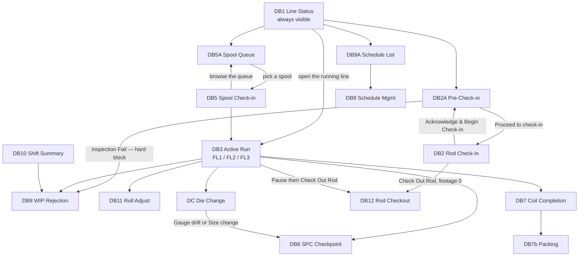

# Flat Wire Mill — Screen Plan

**Project:** United Aluminum (UAL) — Flat Wire Mill Module
**Last Updated:** August 28, 2026 — ⚠ **The Mockups folder is 38 files / 19 HTML** — `dashboard_3_active_run_ual.html`, a **styling comparison build** (DB3 in the host app’s CSS at 1920×1080) plus five generated assets. The folder is still **flat**. Counts and the "composed for 5:4" statements updated — **18 of 19**, not all 19. Earlier: August 27, 2026 — **four corrections and three additions, from a review against the mockups folder and the requirement register.** ⚠ **§7.1 listed DB11 Roll Adjust as a screen; it is a dialog** (`roll_adjust.js`), which makes **five** run-event dialogs, not four. ⚠ **Appendix B said Roll Adjust is on FL1 — `FR-107` says it is not**, and `OI-11` is still carried as open although `FR-107`–`FR-109` answer it. ⚠ **The "27 HTML files" figure is 18**, and both denominators derived from it in §7.3 (*"25 of 27"*, *"26 of 27"*) are restated — **the named exceptions were always right**. ⚠ **§7.3 omitted `fw-modal.js` and four of the five dialog scripts.** Added: an MVP scope legend on the navigation map, a note that the mockups are the authority on content rather than on composition at the new **1920 × 1080** canvas, and a warning that `flat-wire-fit.js`'s hard-coded 1280 × 1024 design box is the mockup canvas and not the build target. *(previously August 25, 2026 — the dangling §9.4 pointer replaced by naming the two documents it meant *(previously August 13, 2026 — split out of `02-SRS.md`, `03-HLD-and-ERDiagram.md` in the ProjectPlan restructure. **Section numbers are unchanged**, so every `§n` citation still resolves; numbering inside this file is deliberately non-contiguous)*)*
**Document Type:** Screen inventory, navigation map, shared chrome, mockup mapping
**Status:** Baselined for build
**Owner:** Frontend (Angular) stream
**Audience:** Angular developers, QA, BA
**Shortcode:** `[SCR]`
**Part of:** `ProjectPlan/Frontend/` — index: [README.md](../DOCUMENTS.md)

---

## 7. User interface requirements

The **18** HTML files in [`Mockups/`](Mockups/) are the **approved visual baseline and the pixel authority**. They open directly in a browser with no build step. This section states what a developer cannot infer from §5.

> ⚠ **This read "27 HTML files" until 27 Aug 2026, and two derived figures in §7.3 rested on it.** Measured: **19** here, **24** across both scopes (19 + 5 in [`MVP-2/Mockups/`](../../../MVP-2/Mockups/)). ⚠ **The 19th is `dashboard_3_active_run_ual.html`, a styling comparison build rather than a screen** — DB3 in the host application’s CSS at **1920×1080**, so it is the one file here **not** composed for 5:4, and it is not part of the screen inventory below. The link label was also a stale absolute path left by the 13 Aug restructure; from this folder the mockups are simply `Mockups/`.
>
> ⚠ **The mockups are the pixel authority for *content*, not for *composition at the current canvas*.** All 18 are composed for **1280 × 1024**, and `[VAL §7.5]`'s canvas is **1920 × 1080** as of 27 Aug 2026 — a 5:4 → 16:9 change. Controls, states, colour semantics, wording and interaction remain theirs; **layout at the new canvas is design work no mockup covers.**

---

### 7.1 Screen inventory — approved variants

| ID | Screen | File | Primary user | Trigger |
|---|---|---|---|---|
| **DB1** | Line Status Overview | `dashboard_1_line_status.html` | Supervisor / Foreman | Always visible — the floor master board |
| **DB2A** | Rod Pre-Check-in Station (FL1/FL3) | `dashboard_2a_rod_precheckin.html` | FL1 operator | Staging the next rod while the current coil runs |
| **DB2** | Rod Check-in & Pre-Run Setup | **`dashboard_2_rod_checkin.html`** | FL1 operator | Start of each rod |
| **DB2-FL3** | Rod Check-in — FL3 hybrid variant | `dashboard_2_rod_checkin_fl3.html` | FL3 operator | Start of each hybrid rod *(older layout — OI-16)* |
| **DB3** | Active Run Monitor (FL1) | `dashboard_3_active_run.html` *(the earlier left-rail layout that held this filename was withdrawn 1 Aug 2026, git history at `2a0426b`; this file was named `dashboard_3_active_run_v2.html` until 11 Aug 2026)* | FL1 operator | During every run |
| **DB3-FL2** | Active Run Monitor (FL2) | `dashboard_3_active_run_fl2.html` | FL2 operator | During every FL2 run |
| **DB3-FL3** | Active Run Monitor (FL3) | `dashboard_3_active_run_fl3.html` | FL3 operator | During every hybrid run |
| ~~**DB4**~~ | ~~Weld Event Logger~~ — **RETIRED 1 Aug 2026**, folded into DB2A's *Mark as welded* dialog | ~~`dashboard_4_weld_event.html`~~ *(deleted; git history at `2a0426b`)* | — | — |
| **DB5A** | FL2 Spool Queue | `dashboard_5a_spool_queue.html` | FL2 operator | Choosing which spool to run next *(added 2 Aug 2026)* |
| **DB5** | FL2 Spool Check-in | `dashboard_5_spool_checkin.html` | FL2 operator | Loading each spool onto the TPO |
| **DB6** | SPC Checkpoint Entry — **dialog** | `spc_checkpoint.js` *(launcher: `dashboard_6_spc_checkpoint.html`)* | Any operator | Pre-run, post-die-change, spot check |
| **DB7** | Output Coil Completion & Label | `dashboard_7_coil_completion.html` | FL2/FL3 operator | Coil complete at TKUP-2 |
| **DB7b** | Packing Station | `dashboard_7b_packing_station.html` | Packing operator | Coil arrives from a line |
| **DB8** | WIP Rejection — **dialog** | `wip_rejection.js` *(launcher: `dashboard_8_wip_rejection.html`)* | Any operator | Material fails at any stage |
| **DB9** | Pass Schedule Management | `dashboard_9_pass_schedule.html` | Ops Manager / Maintenance | Before a new product campaign |
| **DB9A** | Pass Schedule List | `dashboard_9a_schedule_list.html` | Ops Manager / Maintenance | Browsing the schedule library |
| **DB10** | Supervisor Shift Summary | `dashboard_10_shift_summary.html` | Supervisor / Shift Manager | End of shift or on demand |
| **DB11** | Roll Adjust — **dialog** | `roll_adjust.js` *(launcher: `dashboard_11_roll_adjust.html`)* | **FL2 / FL3** operator | FM2 roll-gap drift during a run |
| **DB12** | Rod Checkout (Mode A / Mode B) — **dialog** | `rod_checkout.js` *(launcher: `dashboard_12_rod_checkout.html`)* | FL1/FL3 operator | Rod removed before natural completion |
| **DC** | Die Change — **dialog** | `die_change.js` *(launcher: `dashboard_die_change.html`)* | FL1/FL3 operator | Drawing die replaced mid-run |
| **DM** | Die Management | `dashboard_die_management.html` | Maintenance | Machines App → Tooling Inventory |
| **OEE** | OEE Dashboard | `dashboard_oee.html` | Supervisor / CI engineer | On demand |
| — | Coil Spinner | `coil-spinner.html` | — | A component demo, not a screen |
| **DB-S1** | Simulator Control Console — ⚠ **not an operator screen** | `simulator_console.html` | Engineer / Admin | Driving the machine model. **See the note below before treating this as one of the fifteen** |

> ### ⚠ `DB-S1` is registered here so it is not lost, not because it is part of the suite
>
> The simulator control console ([`MachineSimulator.md`](../20-architecture/MachineSimulator.md) `[SIM §9]`,
> story `FW-214`) is an **engineering tool**. Four exclusions, all deliberate:
>
> - **Not in the dashboard inventory count.** The suite is fifteen dashboards; this is not one of them and
>   has no `FR-###` behind it.
> - **Not in the navigation map** (§7.2) and **not in the topbar *More Options* tiles** — those are operator
>   actions.
> - **No `DB##` number.** `DB-S1` sits deliberately outside the numbering so no reader mistakes it for one
>   of the fifteen. Do not "tidy" it into the sequence.
> - **Its route resolves only while simulation is on.** With `SimulatePLCTagPush` false the control endpoints
>   return **404, not 403** (`[SEC §8.8b]`).
>
> It uses the shared chrome — topbar, fit script, `--color-*` tokens, `fw-modal.js` — because consistency is
> free and divergence costs. That is not the same as being part of the suite.

> ⚠ **DB11 became a dialog and this table said otherwise until 27 Aug 2026.** Its launcher states it plainly — *"The screen this file used to hold now lives in `roll_adjust.js`"* — and the script exposes `window.openRollAdjust(ctx)`. **So there are five run-event dialogs, not four:** `spc_checkpoint.js` · `wip_rejection.js` · `roll_adjust.js` · `die_change.js` · `rod_checkout.js`. The parent `CLAUDE.md` still lists four and omits `roll_adjust.js`.
>
> ⚠ **DB11 is FL2 and FL3 only.** `FR-107` gives the FL1 action bar six buttons *"with **no Roll Adjust** and no edger controls"*; `FR-108` adds it for FL3 and `FR-109` for FL2, and the dialog's own title reads *"Roll adjust · FL2 / FL3"*. Settled 2 Aug 2026 — but **`OI-11` (Roll Adjust line applicability) is still carried as open** in `[REQ]`'s open-items line, and Appendix B named FL1 until today.

**Retired / superseded — do not re-adopt:** `dashboard_2_rod_checkin - Old.html` (grid + inline-SVG progress ring, 9-step footer counter) and the interim single-page rod-scan-row layout, 8-step counter, which held the `dashboard_2_rod_checkin.html` filename until 11 Aug 2026. Both are **retired** and both were **deleted from the repository 11 Aug 2026** (recoverable at `d79ce78`); the approved wizard took the plain filename the same day, so **that name no longer refers to a retired screen**; the only documents that still name them are this file and the master specification's mockup inventory — **in both cases as retired/deleted records, which is correct**. *(This read "two implementation documents in this repository still point at them (see §9.4)" until 25 Aug 2026. **There is no §9.4 in this file** — its sections are §7, §7.1–§7.3 and Appendix B — so the two documents were never identified. They are named here instead of behind a pointer.)*

---

### 7.2 Navigation map

The shared topbar's **More Options** tile popup reaches Pass Schedule, WIP Rejection, Rod Pre-Check-in, Rod Checkout and Shift Summary from **any** screen.

> **Scope legend — the map spans both scopes deliberately** *(added 27 Aug 2026; Appendix B marked scope, this map did not)*. **MVP-2, not built in MVP-1:** `DB9` · `DB9A` · `DB10`. Everything else on the map is MVP-1. The map is kept whole rather than halved for the same reason `../95-archive/design-notes/FlatWireShopfloorDashboards.md`'s is — the navigation itself crosses the boundary.
>
> ⚠ **DB6, DB8, DB11, DB12 and DC are dialogs**, so their edges are *"opens over"*, not *"navigates to"*.

---

### 7.3 Shared chrome

| Asset | Role | Constraint |
|---|---|---|
| `flat-wire-topbar.js` | Injects the application bar (logo, environment/greeting strip, multi-operator chips with switch-operator dialog, Help · Refresh · Login · Switch · Logout) and the More Options tile popup | Include once before `</body>`; needs the shared stylesheet and `mainlogo.gif` in the same folder. **17 of 19 screens include it** *(corrected 27 Aug 2026 from "25 of 27")*. The two that do not are `coil-spinner.html` and **`dashboard_2_rod_checkin.html`, which inlines its own app bar** — so **clone Dashboard 12's skeleton, not Dashboard 2's**, when starting a new screen. ✅ **The named exceptions were always right; only the denominator was wrong**, and DB12's launcher does include the topbar, so it remains the correct skeleton |
| `pause_run.js` | The shared Pause/Resume dialogs for the FL1/FL2/FL3 active-run screens | Expects element IDs `pause-btn`, `pause-timer-badge`, `pause-elapsed` and `.line-badge`; takes its run from a context object, falling back to the host's `fwRunCtx()`. Redesigned 1 Aug 2026 — reason cards in category columns, reason **codes** not labels, four resume outcomes, and every hand-off a dialog |
| `rod_checkout.js` | The Rod Checkout dialog (DB12, Modes A and B) | The caller states the mode; Mode B is opened by the pause dialog's `CheckOutRod` outcome with the frozen footage carried over |
| `fw-modal.js` | **The shared dialog runtime — load it before any script that opens a popup.** `FwModal.open/close/closeAll/register/fit`. Owns open/close, focus restore, backdrop dismissal, ESC and the focus trap | ⚠ **Omitted from this table until 27 Aug 2026** although the `DB-S1` note above already named it as shared chrome. It also owns the rule that **no dialog scrolls** — oversized dialogs are scaled to fit via `--fw-modal-fit`, so `.gb-modal` carries no `max-height` and its body is `overflow: visible`. **In Angular these duties are `NgbModal`'s**, wrapped by `shared`'s `CommonPopupService`, so the script is **not a porting target** — but nothing yet owns the scale-to-fit half |
| `spc_checkpoint.js` · `wip_rejection.js` · `roll_adjust.js` · `die_change.js` | The four remaining run-event dialogs — `openSpcCheckpoint(ctx)` / `openWipRejection(ctx)` / `openRollAdjust(ctx)` / `openDieChange(ctx)` | ⚠ **Also omitted until 27 Aug 2026**, while `rod_checkout.js` was listed — one of five. Each takes a context object from its caller; CSS is scoped under `.fwspc` / `.fwwip` / `.fwdc` and all ids are prefixed. **Never stack dialogs** — close the current one, then open the next |
| `spool_notification.js` | The shared spool-progress component — Part A milestone card + docked pill, Part B PLC-stop modal | Keeps the host screen's `#fw-spool-lb` / `#fw-spool-target` readout in step so screen and notification never disagree |
| `flat-wire-fit.js` | Scales a screen to the browser window so all of it is visible without fullscreen and without a scrollbar | Include **after** `flat-wire-topbar.js` (the topbar injects on `DOMContentLoaded` and changes content height). Transforms `<body>`, not `.dashboard`, so body-level overlays scale too. **Never scales above 1:1.** **17 of 19 files use `data-fit="fill"`** — ⚠ **the two figures no longer move together**, because `dashboard_3_active_run_ual.html` loads the topbar but **deliberately omits `flat-wire-fit.js`**, whose hard-coded `DESIGN_W = 1280` would letterbox its 1920×1080 canvas *(corrected 27 Aug 2026 from "26 of 27"; the exception, `coil-spinner.html`, was always right)*. Design height is **measured, not assumed**. ⚠ **The script's design box is the *mockup* canvas** — it hard-codes `DESIGN_W = 1280` and `MIN_H = 1024` — **not the build target**, which is `[VAL §7.5]`'s **1920 × 1080**. At that size almost no developer machine renders 1:1, so the Angular equivalent of this script is a prerequisite for reviewing a layout, and **nothing owns it yet** |

---

### 5.6 Mockup → component mapping

The mockups are the pixel authority. Two mechanical rules carry over from them into the Angular build:

1. **Clone Dashboard 12's skeleton, not Dashboard 2's**, when starting a new screen — DB2's `dashboard_2_rod_checkin.html` inlines its own app bar and omits `flat-wire-topbar.js`.
2. **Consume `flat-wire-shopfloor.styles.scss` as-is.** There is no token migration; the `--fw-*` prefix in older documents is stale (gap **G18**). Angular components need `ViewEncapsulation.None` or `:host` scoping so the tokens resolve.

---

---

## Appendix B — Dashboard → phase map

| Dashboard | Phase | Scope |
|---|---|---|
| 1 Line Status Overview | 3 | MVP-1 |
| 2 Rod Check-in (FL1/FL3) | 4 | MVP-1 |
| 2A Rod Pre-Check-in | 4 | MVP-1 |
| 3 Active Run Monitor (FL1/FL3) | 5 | MVP-1 |
| 3 (FL2 variant) | 8 | MVP-1 |
| ~~4 Weld Event~~ | ~~6~~ | **RETIRED 1 Aug 2026** — the mockup was deleted (git history at `2a0426b`) and weld capture moved to Dashboard 2A's dialog. `FW-063` still delivers the weld event; it has no screen of its own. Two things did not move — see **G27** |
| 5A FL2 Spool Queue | 8 | MVP-1 |
| 5 FL2 Spool Check-in | 8 | MVP-1 |
| 6 SPC Checkpoint | 4 (pre-run), 6 | MVP-1 |
| 7 Output Coil Completion / 7b Packing | 9 | MVP-1 — **returned 11 Aug 2026**; Phase 9 is wholly MVP-1 |
| 8 WIP Rejection | 7 | MVP-1 |
| ~~9 / 9A Pass Schedule Mgmt / List~~ | 2 | **MVP-2** |
| ~~10 Shift Summary~~ | 11 | **MVP-2** |
| 11 Roll Adjust | 6 (**FL2**), 10 (FL3) | MVP-1 — ⚠ **corrected 27 Aug 2026: this row said "FL1/FL2".** `FR-107` gives FL1 **no Roll Adjust**; `FR-108` (FL3) and `FR-109` (FL2) carry it |
| 12 Rod Checkout (A/B) | 7 | MVP-1 |
| DC Die Change | 6 | MVP-1 |
| ~~Die Management~~ | ~~13~~ | **MVP-2** — split from `DieChangeAndManagement.md` §4 on 11 Aug 2026. **Phase 13 is not cut**; it keeps its other reference-data work |

> **DB13 (HMI Line Schematic) and DB14 (SCADA Multi-Trend), 5 units each, were removed from this table on Aug 4 2026** — descoped at client request along with the Machine View tab. They were **descope-ladder rung 7** (67 h joint); the rung is gone, not merely un-recovered, so Phase 5 drops from 221 h to ~154 h and the ladder's cumulative-recovery column is re-derived in [`CapacityAndEffortModel.md`](../60-delivery/CapacityAndEffortModel.md).
