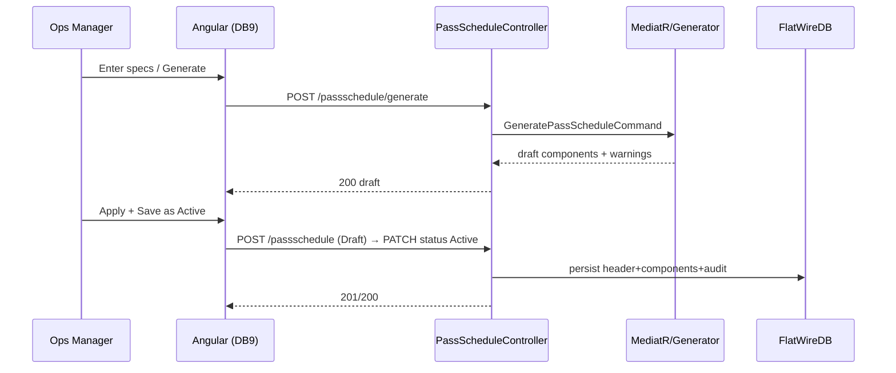

# PHASE 2 — Pass Schedule Management (Operations Manager)

> **Part of the [Flat Wire Mill — Master Implementation Roadmap](../ShopfloorAndRealTimePlan.md).** See [Foundations](./00-foundations.md) for §0.2–0.4 shared context.
> **Prev:** [Phase 1 — Core Platform Setup](./phase-01-core-platform-setup.md) · **Next:** [Phase 3 — Line Status Board & Real-Time Backbone](./phase-03-line-status-board-realtime-backbone.md)
>
> *Rod receiving and order planning/line scheduling (originally planned as separate phases) are handled upstream by the existing CoilReceiving / Planning / Scheduling systems and are out of shopfloor scope — see the [master index](../ShopfloorAndRealTimePlan.md).*
>
> *Workflow phases (2–14) each follow the fixed template: **Business Overview · User Journey · UI (Angular) · Backend (.NET) · Database · Real-Time · Integration Flow · Testing · Deliverables**, and close with **OQ blockers** and **backlog stories**.*

---

**Project:** Flat Wire Mill Implementation
**Last Updated:** 2026-07-30
**Status:** Ready to build
**Layer:** Full-stack vertical slice
**Owner:** **FE + BE** (stream) — *named owner TBD, see [Capacity & Effort Model](../CapacityAndEffortModel.md#1-delivery-streams-and-roster) §1*
**Effort:** **231 h** (28.9 d) — FE 80 · BE 62 · DB 12 · QA 31 · BA 16 · cont. 30 · **Window:** W2–W3 (Aug 24–Sep 4, 10 working days)
**Scope call:** **Not deferrable** — the highest-priority dependency in the plan; gates every check-in phase. The 2.0 BA-days are the pass-schedule content liaison, which is the project's top-ranked risk.

*The machine "recipe" library. Highest dependency in the whole project — no check-in, PLC push, or run can occur without an Active pass schedule.*

## Business Overview
- **Objective:** let Operations Manager/Maintenance create, edit, list, and generate pass schedules that define which components are active/bypassed, die sizes, roll gaps, edge type, gauge/width targets, speed range, and route mode.
- **Business purpose:** the pass schedule is the single configuration record pushed to the PLC at check-in; it governs quality and traceability.
- **User roles:** Operations Manager (full), Maintenance (create/edit/generate), Operators (read-only), Process Engineering/Admin (alloy lookup table).
- **Entry conditions:** Phase 1 complete; alloy lookup seeded.
- **Exit conditions:** an Active schedule exists per line/alloy/product, discoverable at check-in.

## User Journey
1. Ops Manager opens **Dashboard 9A — Pass Schedule List**; searches/filters by ID/description/alloy/line/status; stats strip updates live.
2. Chooses **+ New Schedule → Enter manually** or **⚡ Generate from Specs**, or opens an existing row (↗) → **Dashboard 9**.
3. **Generate from Specs** modal (two-panel): enters alloy, rod diameter, target gauge, target width, edge type → **Generate** → right panel shows calculation chips + component config + warnings.
4. **Apply to Schedule** → Dashboard 9 form populated (generated fields highlighted purple), status `Draft`.
5. Reviews/adjusts every field; **Save as Active** (Ops Manager only) → status `Active`, purple cleared, audit record written.
- **Decision points:** manual vs generate; Draft vs Active; route Standalone vs Hybrid (FL3 forces Hybrid).
- **Validation:** `FM2_S3` (FM2's final stand) and `FM1` cannot be bypassed; FL3 must be Hybrid; all component rows for the line/route present; edge type required when EdgeSet active.
- **Error scenarios:** generate reduction > 2× alloy max → error banner (Apply still enabled for manual review); gauge below machine minimum → error; unauthorized edit → 403 (logged).

## UI Implementation (Angular)
- **Screens:** Dashboard 9 (`dashboard_9_pass_schedule.html`), Dashboard 9A (`dashboard_9a_schedule_list.html`), Generate-from-Specs modal.
- **Components:** `dashboard-9-pass-schedule`, `dashboard-9a-pass-schedule-list`, `generate-from-specs-modal`, shared `pass-schedule-table`.
- **Shared components/services:** `common-grid`/`multi-grid-layout` for the list; `flat-wire-api` service; role guard.
- **Models:** `pass-schedule.model.ts` (header + `PassScheduleComponentDto[]` + `PassScheduleOverrideDto[]`), `generate-request/result.model.ts`.
- **Forms/validation:** reactive form; component toggle rows; `FM2_S3` toggle disabled; live delta on generate inputs; purple-highlight state cleared on manual edit.
- **API calls:** `GET/POST/PUT /passschedule`, `PATCH /passschedule/{id}/status`, `POST /passschedule/generate`.
- **State/navigation:** filter/sort state persists on the list; 9A ↔ 9 navigation; "← All schedules" back link.
- **Error handling:** inline validation + envelope errors surfaced as toasts.

## Backend Implementation (.NET)
- **APIs:** `PassScheduleController` (list/detail/create/update/status/generate).
- **Request/Response models:** records per `APIContracts.md` (`PassScheduleDetailResponse`, `PassScheduleComponentDto`, generate request/response with warnings/errors arrays).
- **Business services:** `PassScheduleService`, `PassScheduleGeneratorService` (the algorithm).
- **MediatR handlers:** `CreatePassSchedule`, `UpdatePassSchedule`, `GeneratePassSchedule`, `GetPassScheduleList`, `GetPassSchedule`, status-transition command.
- **Repository:** `PassScheduleRepository` (EF writes; Dapper list query with filters/paging).
- **Business rules:** only one Active per line+alloy; only Active returned to check-in; Draft cannot be acknowledged; **Generate-from-Specs algorithm** — `D_pre=√(4·gauge·width/π)`; area reduction → draw-pass decision (≤2% both bypass; ≤1× max DB1; ≤2× max DB1+DB2; >2× error); DB1=geomean(rod,D_pre) snapped 0.005"; DB2=D_pre snapped; FM1 gap=gauge×springback; aspect=width/gauge, if >5.5 or alloy 1350 → activate FM2 + Hybrid; FM2 gaps per stand — `FM2_S1`=g×1.06, `FM2_S2`=g×1.02, `FM2_S3`=g×springback (FM2 has three stands: S1 8″, S2 6″, S3 6″ final).
- **Logging/validation/authz:** every save audited; FluentValidation for component rules; `Operations Manager`/`Maintenance` policy (status→Active is Ops-Manager-only).
- **Error handling:** 422 on acknowledging a Draft; 403 on unauthorized edit.

## Database Changes
- **Tables:** `PassSchedule`, `PassScheduleComponent` (writes); `Stand`/`Drawer`/`Edger` (reads for component→tool links); alloy lookup (reads).
- **Stored procs/views/functions:** none required (EF/Dapper); optionally a `vw_ActivePassSchedules` view for the check-in lookup.
- **Indexes:** `PassSchedule(LineId, Alloy, Status)` supporting the attribute lookup.
- **Data changes:** override-log rows on every post-Active edit (`ParameterChanged, Old→New, OperatorId, Reason, Timestamp`).
- **Relationships:** `PassSchedule 1→N PassScheduleComponent`; each component optionally → `Stand`/`Drawer`/`Edger`.

## Real-Time Functionality
None for authoring (no PLC push during generate/edit). The only real-time tie is **OQ-28**-decided: when Ops edits an *Active* schedule mid-run, a `LineStatus`/alert push notifies the Active Run Monitor requiring explicit Acknowledge/Stop (handled in Phase 6).

## Integration Flow

## Testing
- **Unit:** generator algorithm cases (bypass/1-draw/2-draw/error; 1350 precision; aspect thresholds; die snapping); validation rules.
- **API:** CRUD + generate contract tests; authz (403 for operator).
- **UI:** list filter/sort/stats; modal apply → purple highlight → save; `FM2_S3` lock.
- **Integration/DB:** header+components persist atomically; only-one-Active rule.
- **Acceptance:** an Ops Manager can generate, review, and activate a schedule that then appears at check-in.

## Deliverables
DB9/9A + Generate modal; `PassScheduleController` + handlers + generator; alloy lookup consumption; audit/override logging; indexes.

**OQ blockers:** OQ-1 (UI vs table — assumed UI), OQ-52 (FL3 single unified schedule — Option A assumed; hybrid-spool FL2 validation residual). **Stories:** FW-010, FW-011, FW-012, FW-013, FW-014, FW-004.
