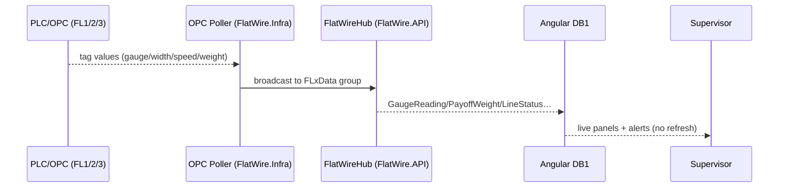

# PHASE 3 — Line Status Board & Real-Time Backbone

> **Part of the [Flat Wire Mill — Master Implementation Roadmap](../ShopfloorAndRealTimePlan.md).** See [Foundations](./00-foundations.md) for §0.2–0.4 shared context (esp. §0.4 real-time architecture, which this phase realises).
> **Prev:** [Phase 2 — Pass Schedule Management](./phase-02-pass-schedule-management.md) · **Next:** [Phase 4 — Rod Check-In & PLC Configuration](./phase-04-rod-checkin-plc-config.md)

---

**Project:** Flat Wire Mill Implementation
**Last Updated:** 2026-07-30
**Status:** Ready to build
**Layer:** Full-stack vertical slice + real-time backbone
**Owner:** **RT + FE** (stream) — *named owner TBD, see [Capacity & Effort Model](../CapacityAndEffortModel.md#1-delivery-streams-and-roster) §1*
**Effort:** **190 h** (23.8 d) — FE 64 · BE 16 · DB 4 · RT 40 · QA 41 · cont. 25 · **Window:** W2–W3 (Aug 24–Sep 4, 10 working days)
**Scope call:** **Not deferrable.** Includes a discrete **16 h hub load test whose pass criteria do not exist** — the NFRs (AGC sample rate, concurrent clients, latency budget, `RunReading` retention) are undefined (G9 / OI-34). Any resulting real-time rework is **not** in this estimate.

*First live end-to-end slice: OPC → FlatWireHub → Dashboard 1. Establishes the real-time spine every later shopfloor phase consumes.*

## Business Overview
- **Objective:** a persistent supervisor board showing all three lines with live readings and alerts, backed by the `FlatWireHub` streaming pipeline.
- **Business purpose:** floor-wide situational awareness; the always-on entry point to line-specific screens.
- **User roles:** Supervisor/Foreman (primary); all authenticated users can view.
- **Entry conditions:** Phase 1 hub skeleton + OPC poller; scheduling data (upstream planning/scheduling) for order/alpha fields.
- **Exit conditions:** Dashboard 1 renders live line-state, gauge/width, payoff, speed, run-time, and alerts via SignalR (real or simulated).

## User Journey
1. Supervisor opens **Dashboard 1**; sees FL1/FL2/FL3 panels with status badge, order/alpha, alloy/route, speed, gauge/width (real-time FL1/FL3; blank for FL2 idle), payoff weight bar + Payoff-2 status, run time.
2. Alert chips below (payoff low, gauge deviation, component fault, WIP rejection, no weld material).
3. Clicking a panel → that line's Dashboard 3 (running) or Dashboard 2/5 (idle); header links → Dashboard 13 (HMI) / Dashboard 14 (SCADA).
- **Decision points:** navigate by line state.
- **Error scenarios:** SignalR drop → "Reconnecting…" banner, cached last-known state; no blank screen.

## UI Implementation (Angular)
- **Screens:** Dashboard 1 (`dashboard_1_line_status.html`).
- **Components:** `dashboard-1-line-status`, `line-status-panel`, `payoff-weight-bar`, `alert-banner`.
- **Services:** `flat-wire-signalr.service` (subscribe to `FL1Data/FL2Data/FL3Data`), `flat-wire-api` (`GET /lines/status` on load).
- **State/nav:** subscribes to `lineStatus$/gaugeReading$/widthReading$/speedFpm$/payoffWeight$/alertRaised$/alertCleared$`; panel-click routing.
- **Error handling:** reconnect banner; alert auto-dismiss on `AlertCleared`.

## Backend Implementation (.NET)
- **APIs:** `LinesController` `GET /lines/status` (snapshot for load; live via hub).
- **Response models:** `LinesStatusResponse`/`LineStatusDto`/`PayoffStatusDto`/`ActiveAlertDto`. `PayoffStatusDto` carries bay **occupancy** (`state`, `rodAlpha`) alongside live weight — see `GET /payoff/status` for the fuller per-bay shape used by Dashboard 2A.
- **Business services:** `LineStatusService` (composes scheduling + run + latest OPC readings); strongly-typed `FlatWireHub : Hub<IFlatWireClient>` (MessagePack; `JoinLineGroup`); OPC ingest → bounded channel → cadence-driven broadcast loop emitting `GaugeReading[]/WidthReading[]/SpeedFPM/PayoffWeight/ComponentStatus/LineStatus/FootageCounter` + `AlertRaised/AlertCleared` from the rules engine (see §0.4).
- **Business rules (alert engine):** Payoff1<3,000 lb → Warning; gauge outside ±tol → Warning; component fault → Critical; active WIP rejection → Warning; Payoff2 not loaded & Payoff1<2,000 lb → Critical.
- **Data source for "Payoff2 not loaded":** `RodStaging` — a `Staged` row on `(LineId, PayoffPosition)` means loaded. Until Phase 4 delivered that table this rule had **no way to be evaluated**, since nothing recorded bay occupancy; `PayoffWeight` alone cannot distinguish "empty bay" from "sensor reading zero". Consume the `PayoffStateChanged` event to keep the evaluation live.
- **Logging/authz:** any authenticated role reads.

## Database Changes
- **Tables:** reads `FlatWireRun` (active run/line-state), scheduling (order/alpha), latest readings buffered in-memory (not persisted per-tick in Phase 1).
- **Indexes:** `FlatWireRun(LineId, Status)`.

## Real-Time Functionality (the real-time backbone — see §0.4)
- **Design:** strongly-typed `FlatWireHub : Hub<IFlatWireClient>`, MessagePack, WebSockets-first; OPC ingest → bounded channel → ~10 Hz batched broadcast per line group; hot telemetry batched/decimated, domain events sent immediately.
- **Events:** all hub events; **publisher** = OPC ingest loop + alert rules engine; **subscriber** = Dashboard 1 (and DB13/14, DB3 later) via ring-buffer + rAF render outside NgZone.
- **Cache sync:** service worker caches last snapshot.
- **Retry:** auto-reconnect w/ backoff + group re-join; scale-out via Redis / Azure SignalR backplane (config-only).

## Integration Flow

## Testing
- **Unit:** alert-rule thresholds; DTO mapping.
- **API:** `/lines/status` contract; hub join/leave.
- **UI:** live update without refresh; FL2 idle blanks gauge; reconnect banner.
- **Integration:** simulated stream drives all panels; alert raise/clear.
- **Acceptance:** supervisor watches three lines update live from the (simulated) PLC feed.

## Deliverables
Dashboard 1; `LinesController` + `LineStatusService`; `FlatWireHub` broadcasting; OPC poller + alert engine; `flat-wire-signalr.service` fully wired.

**OQ blockers:** OQ-4 (SCADA tag paths — decided, confirm with Tim O./commissioning), GAP-8 (show pass-schedule ID on DB1 — open, low). **Stories:** FW-060, FW-080, FW-081 (chart component groundwork).
