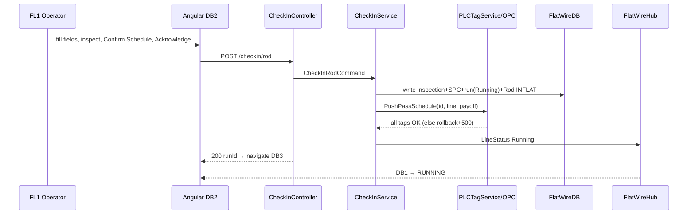

# PHASE 4 — Rod Check-In & PLC Configuration (FL1 / FL3)

> **Part of the [Flat Wire Mill — Master Implementation Roadmap](../ShopfloorAndRealTimePlan.md).** See [Foundations](./00-foundations.md) for §0.2–0.4 shared context.
> **Prev:** [Phase 3 — Line Status Board & Real-Time Backbone](./phase-03-line-status-board-realtime-backbone.md) · **Next:** [Phase 5 — Active Run Monitoring & Live Gauge/Width Trace](./phase-05-active-run-monitoring-gauge-trace.md)

---

*The core operator entry point: validate material, inspect, confirm the pass schedule, push PLC tags, start the run.*

## Business Overview
- **Objective:** guided check-in that captures incoming rod, forces visual inspection, requires explicit pass-schedule confirmation, writes audit records, then pushes PLC tags and starts the run.
- **Business purpose:** the gate that configures the machine correctly and sets `INFLAT`; prevents a wrong schedule being silently applied.
- **User roles:** FL1 operator (also FL3), Supervisor.
- **Entry conditions:** rod STAGED (upstream rod receiving); Active pass schedule (Phase 2); job scheduled (upstream planning/scheduling); real-time spine (Phase 3).
- **Exit conditions:** run `Running`, rod `INFLAT`, PLC tags pushed, transition to Dashboard 3.

## User Journey (RocCheckin logical flow — delivered as the new 6-step wizard)
> **UI shape (new mockup):** a 6-step guided tab-wizard with progressive unlock — **(1) Visual Inspection · (2) Pass Schedule · (3) Pre-run SPC · (4) Die Block (DB1/DB2) · (5) Rolling Mill (FM1) · (6) Lube & Safety**; Acknowledge is disabled until all six clear (or a supervisor override is on file for a deviation). The logical gate sequence below still holds within that wizard.
1. **Pre-flight validation:** rod alpha valid (`GET /rod/{alpha}`), diameter/weights/payoff filled, **all inspection items Pass**, pre-run SPC diameter entered, pass schedule loaded. Any fail disables Acknowledge.
2. **Pass-schedule confirmation gate:** attribute-lookup recommends a schedule (alloy + rod dia + target gauge×width + route); confirm-bar is amber until **Confirm Schedule** (then green); "Change ▼" lists alternates (non-recommended flagged for Ops review). **PLC tags are never pushed until this confirmation.**
3. **Write records BEFORE PLC push:** inspection result → rod record; pre-run SPC diameter → SPC checkpoint (PreRun); schedule ID+version → run record; acknowledgment → audit log.
4. **PLC tag push** (component activation, die sizes, FM1 gap, edge type, speed limits, gauge/width targets) to the selected payoff position; transactional.
5. **Run starts:** timer starts; Dashboard 1 → RUNNING (schedule ID shown); transition to Dashboard 3.
- **Decision points:** inspection pass/fail (fail → Dashboard 8 hard block); Payoff 1/2; Mode-A checkout (footage=0).
- **Error scenarios:** PLC write fails → **entire check-in rolled back** (500); line already running → 409; Draft schedule → 422.

## UI Implementation (Angular)
- **Screens:** Dashboard 2 — **new approved mockup** `dashboard_2_rod_checkin - New.html` (FL3 variant to follow; old `dashboard_2_rod_checkin.html` / `- Old.html` retired).
- **Layout:** 6-step guided **tab-wizard** (Visual Inspection → Pass Schedule → Pre-run SPC → Die Block → Rolling Mill → Lube & Safety) with progressive unlock; footer **Acknowledge & Begin Check-in** disabled until all steps complete; supervisor-override path for any deviation/out-of-spec.
- **Components:** `dashboard-2-rod-checkin` (wizard host), shared `pass-schedule-table`, `confirm-bar` (amber→green, retained), `payoff-option` selector cards, pass/fail `pill-btn` + OK/NG/NA machine-inspection buttons, `tolerance-viz` (SPC marker on a band — **replaces the old inline-SVG progress ring**), standard `.input` fields with `.invalid`/`field-error` states.
- **Services/models:** `flat-wire-api` (`checkin/rod`, `rod/{alpha}`), `line-context`, `run-state`; `checkin.model.ts`. *(Inspection scope expanded vs the DTO — the new wizard adds machine-inspection steps (Die Block, Rolling Mill, Lube & Safety) and OK/NG/NA states beyond the 3-item DTO; reconcile — see G14.)*
- **Forms/validation:** each step gates the next; Acknowledge enabled only when all steps complete + confirm-bar green (or supervisor override on file).
- **Navigation/error:** → Dashboard 3 on success; → Dashboard 8 on inspection fail; → Dashboard 12 Mode A via footer; rollback error toast.

## Backend Implementation (.NET)
- **APIs:** `CheckInController` `POST /checkin/rod`.
- **Request/Response:** `CheckInRodCommand` (line, rodAlpha, payoff, diameterMeasured, weights, `InspectionDto`, passScheduleId, operatorId, orderId) → `CheckInRodResponse` (runId, checkedInAt, plcTagsPushed).
- **Business services:** `CheckInService` (records-before-push orchestration) → `PLCTagService.PushPassSchedule(passScheduleId, lineId, payoffPosition)`.
- **MediatR handlers:** `CheckInRodCommand` handler with **atomic** side-effects (INFLAT, ack record, PLC push, timer, `LineStatus` broadcast).
- **Business rules:** all-or-nothing; Draft not acknowledgeable; single active run per line.
- **Logging/authz:** PLC push audited (tag/value/operator/result); Operator+ policy.

## Database Changes
- **Tables (write):** `RodCheckin` (inspection cols, payoff, `PlcTagsPushed`, pre-run SPC M1/M2/ovality), `FlatWireRun` (create run header, `Status=Running`, `StartedAt`), `SpcCheckpoint`+`SpcMeasurement` (PreRun); **existing `coils` rod row → status `INFLAT`** (FW-002; cross-DB write — see G2).
- **Reads:** `PassSchedule`(+components) for the push payload; `coils` for rod validation.
- **Indexes:** `RodCheckin(RunId)`, `RodCheckin(RodAlpha)`.
- **Relationships:** `FlatWireRun` hub row created here anchors all subsequent events; `RodCheckin.RodAlpha` is a logical link to the `coils` R-series row (cross-DB).

## Real-Time Functionality
- **Publisher:** on success, broadcast `LineStatus {status:Running}` → Dashboard 1 flips to RUNNING; `ComponentStatus` reflects pushed values.
- **Retry:** if PLC push fails, no broadcast (state rolled back).

## Integration Flow

## Testing
- **Unit:** gate logic; confirm-bar; rollback on PLC failure; INFLAT transition.
- **API:** contract; 409/422/500 paths; authz.
- **UI:** inspection-fail routing; Acknowledge enablement; confirm-bar states.
- **Integration/DB:** records-before-push ordering; audit log written; single-active-run.
- **Acceptance:** operator checks in a rod → PLC tags pushed (simulated) → run active → Dashboard 3.

## Deliverables
Dashboard 2 (+FL3); `CheckInController` + `CheckInService`; `PLCTagService.PushPassSchedule`; INFLAT + run header; audit logging.

**OQ blockers:** **OQ-14** (traveler fields per station — Critical, gates final field list), **OQ-51** (no-match path — Critical residual; stub assumes single active schedule → `PS-1100-FL1-003`), OQ-27 (mid-run schedule change/alpha — decided), OQ-30 (roll-gap validation before start). **Stories:** FW-061, FW-082, FW-010, FW-002. *(Consumes upstream FW-020 rod alphas via `GET /rod/{alpha}`.)*
