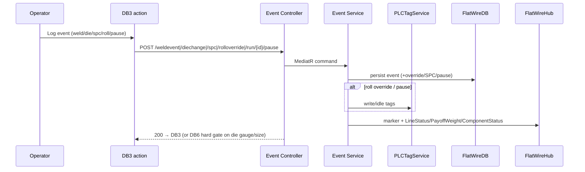

# PHASE 6 — In-Run Production Events (Weld · Die Change · SPC · Roll Adjust · Pause)

> **Part of the [Flat Wire Mill — Master Implementation Roadmap](../ShopfloorAndRealTimePlan.md).** See [Foundations](./00-foundations.md) for §0.2–0.4 shared context.
> **Prev:** [Phase 5 — Active Run Monitoring & Live Gauge/Width Trace](./phase-05-active-run-monitoring-gauge-trace.md) · **Next:** [Phase 7 — Exception Handling: WIP Rejection & Rod Checkout](./phase-07-wip-rejection-rod-checkout.md)

---

*Every transaction an operator logs mid-run without ending the run. Grouped because they share the active-run context and the SPC/PLC/override plumbing.*

## Business Overview
- **Objective:** log weld joins (traceability), die changes (→ auto SPC), SPC checkpoints (quality gate), roll-gap overrides (correct drift without editing the schedule), and pause/resume (categorised downtime).
- **Business purpose:** continuity, quality conformance, and full audit of every mid-run change.
- **User roles:** FL1/FL3 operator (Roll Adjust FL1/FL2); Ops Manager for override revert.
- **Entry conditions:** active run (Phase 5).
- **Exit conditions:** each event persisted against run+footage; run resumes or gates on SPC.

## User Journey (per event)
- **Weld (Dashboard 4):** outgoing alpha + weld footage auto; **incoming rod defaults to the `Staged` rod on the idle bay** rather than free entry — `PCI008` requires pre-checked-in material to be surfaced during weld selection to enforce sequencing (operator can still override by scanning); **Induction only**; quality Pass/Fail (+reason); Confirm links `Rout→Rin`, all later footage attributed to incoming rod, weld marker on trace, WELD-SOON/NOW alert cleared.
- **Die Change (DC screen):** select DB1/DB2/Both; scan incoming die (validated against die inventory); reason (Planned/Gauge drift/Die failure/Size change/Other); Confirm → die-change event + linked override; if reason=Gauge drift/Size change → **navigate to SPC (hard gate)**, run paused until SPC passes; Die failure → optional QA hold on footage range.
- **SPC (Dashboard 6):** type Pre-Run/Post DB1/Post Die Change/Manual Spot Check/Post-Run; measurements per type; Submit-Continue (in spec) or Submit-Suspend (→ Dashboard 8, coil `SPC-HOLD`); marker `pct=50+((measured−target)/(tol×1.67))×50` clamped 4–96%.
- **Roll Adjust (Dashboard 11):** per-roller Scheduled/Current/New/Delta table (bypassed greyed); required measured gauge+width; reason chip; Apply → **run-level override** (not schedule) + PLC tag write + SPC log at footage; no-change → "No changes — return to run".
- **Pause/Resume:** reason (Equipment/Material/Quality/Operational/Safety/Other); Confirm → timer paused, footage frozen, PLC idle, Dashboard 1 → PAUSED; Resume outcomes: Yes-resume / No-WIP reject / No-continue pause / No-check out rod (Mode B).
- **Error scenarios:** die not in inventory → scan rejected; override with all deltas 0 → no write; SPC fail → disposition.

## UI Implementation (Angular)
- **Screens:** Dashboard 4 (`dashboard_4_weld_event.html`), Die Change (`dashboard_die_change.html`), Dashboard 6 (`dashboard_6_spc_checkpoint.html`), Dashboard 11 (`dashboard_11_roll_adjust.html`), Pause/Resume dialogs (shared `pause_run.js` pattern).
- **Components:** `dashboard-4-weld-event`, `die-change`, `dashboard-6-spc-checkpoint`, `dashboard-11-roll-adjust`, `pause-run-dialog`, `resume-run-dialog`.
- **Services/models:** `flat-wire-api` (`weldevent`, `diechange`, `spc`, `rolloverride`, `run/{id}/pause|resume`); `weld-event.model`, `spc-checkpoint.model`, `roll-override.model`, `die-change.model`, `pause.model`.
- **Validation:** weld requires quality (+reason on fail); die incoming size must match unless Size change; SPC reason gates; roll adjust requires reason + measurements; pause requires reason.
- **Navigation/error:** DC→SPC hard gate; SPC-suspend→DB8; pause-resume→DB8/DB12.

## Backend Implementation (.NET)
- **APIs:** `WeldEventController POST /weldevent`; `DieChangeController POST /diechange`; `SpcController POST /spc`; `RollAdjustController POST /rolloverride`; `RunController POST /run/{id}/pause` + `/resume`.
- **Request/Response:** per `APIContracts.md` (weld types/quality; die positions/reasons + `spcCheckpointRequired`; SPC measurements by type; override adjustments + delta + `plcTagWritten` + `spcCheckpointId`; pause reason category/code; resume outcome + duration).
- **Business services:** `WeldService` (advance active-rod pointer, clear weld-pending), `DieChangeService` (auto-create override + require SPC), `SpcService` (spec calc + coil `SPC-HOLD`), `RollOverrideService` (write override + `PLCTagService` per-roll write + SPC log), `RunControlService` (pause/resume, PLC idle/restore).
- **MediatR handlers:** `RecordWeldEvent`, `RecordDieChange`, `SubmitSpcCheckpoint`, `RecordRollOverride`, `PauseRun`, `ResumeRun`.
- **Business rules:** weld traceability chain; die-change→PostDieChange SPC gate (thread mode allowed; hard block until pass — OQ-56 decided); roll override never edits `PassSchedule`; override revert Ops-Manager only.
- **Logging/authz:** all events audited; `Require SPC on resume` toggle-off is Ops-Manager/Quality only + logged exception (OQ-56).

## Database Changes
- **Tables (write):** `WeldEvent`, `DieChangeEvent` (+`LinkedOverrideId`), `SpcCheckpoint`+`SpcMeasurement`, `RollOverride`, `RunPauseEvent`.
- **Reads:** `PassScheduleComponent` (scheduled gaps), die inventory, `FlatWireRun`.
- **Indexes:** `(RunId)` on every event table.
- **Relationships:** all hang off `FlatWireRun.RunId`; `DieChangeEvent.LinkedOverrideId → RollOverride.OverrideId`; SPC auto-linked to die change.

## Real-Time Functionality
- **Publishers:** `WeldJoinEvent`, `DieChangeEvent`, `SPCCheckpoint`, `PauseEvent` markers to trace/SCADA; `LineStatus` RUNNING↔PAUSED; `PayoffWeight` re-establish after weld; `ComponentStatus` after roll override.
- **Subscribers:** Dashboard 3 traces, Dashboard 1 board, Dashboard 14 markers.
- **Retry:** standard reconnect.

## Integration Flow

## Testing
- **Unit:** weld chain attribution; die→SPC gate routing; SPC marker math + in/out spec; override delta + no-change path; pause reason required + 4 resume outcomes.
- **API:** all five endpoints' contracts + side-effects; authz for override revert / SPC-skip.
- **UI:** weld link label; DC size-match validation; roll-adjust greying + amber deltas; pause/resume dialogs.
- **Integration/DB:** events persist against run+footage; markers appear on trace; PLC tag writes logged.
- **Acceptance:** each mid-run event is logged, gated where required, and reflected live on Dashboards 1/3/14.

## Deliverables
Dashboards 4/6/11 + Die Change + Pause/Resume; five event controllers + services; die-inventory validation hook; override→PLC write; SPC gating.

**OQ blockers:** OQ-22/23/24/25 (weld cert rules), OQ-27 (mid-run change alpha — decided), OQ-28 (override authority — decided), OQ-56 (SPC-on-resume authority — decided), die-life threshold config (Die Management, Phase 13). **Stories:** FW-063, FW-073, FW-065, FW-070, FW-071.
