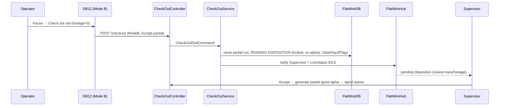

# PHASE 7 — Exception Handling: WIP Rejection & Rod Checkout

> **Part of the [Flat Wire Mill — Master Implementation Roadmap](../ShopfloorAndRealTimePlan.md).** See [Foundations](./00-foundations.md) for §0.2–0.4 shared context.
> **Prev:** [Phase 6 — In-Run Production Events](./phase-06-in-run-production-events.md) · **Next:** [Phase 8 — FL2 Spool Check-In & Finishing Run](./phase-08-fl2-spool-checkin-finishing-run.md)

---

**Project:** Flat Wire Mill Implementation
**Last Updated:** 2026-07-30
**Status:** Ready to build
**Layer:** Full-stack vertical slice
**Owner:** **FE + BE** (stream) — *named owner TBD, see [Capacity & Effort Model](../CapacityAndEffortModel.md#1-delivery-streams-and-roster) §1*
**Effort:** **205 h** (25.6 d) — FE 64 · BE 40 · DB 28 · RT 16 · QA 30 · cont. 27 · **Window:** W5 (Sep 14–18, 5 working days)
**Scope call:** **Not deferrable.** The DB line includes **16 h for new columns on the shared `coils` table** (`footage_run_to_date`, `remaining_weight_estimate`) plus `Spool.source_rod_alpha` — a second shared-schema change after FW-001, with its own audit need. The BE line includes 16 h for the durable pending-approval queue (G7).

*Formal off-ramps for suspect material and for rods removed before natural completion, including supervisor-approved partial runs.*

## Business Overview
- **Objective:** log WIP rejections (suspend/scrap/rework) with supervisor alerting, and check out rods (Mode A pre-run / Mode B mid-run) with correct material disposition and PLC tag clearing.
- **Business purpose:** quality holds and material traceability; prevents ghost inventory; controls partial-run material.
- **User roles:** any operator (WIP reject flag); Supervisor/Ops Manager (mid-run checkout approval — OQ-48 decided).
- **Entry conditions:** active run or inspection failure.
- **Exit conditions:** material status set (`HOLD/SCRAP/STAGED/RECEIVED`); PLC tags cleared; line IDLE; partial spool alpha only after supervisor approval.

## User Journey
- **WIP Rejection (Dashboard 8):** context auto (alpha, stage, footage, time); group→reason dropdowns; details (measured/target/deviation); disposition Suspend(→HOLD)/Scrap(→SCRAP)/Rework(→return stage); observation required for Suspend; Submit → status set, WIP-Held queue, `AlertRaised` to Dashboard 1.
- **Rod Pre-Check-out / Mode P (never checked in, Dashboard 2A):** releases a rod that was only *pre*-checked-in, so there is **no acknowledgement to void and no PLC tags to clear** — and, unlike Modes A/B, **no `FL{n}.LineState` gate is needed** because an idle bay is not running. Reason (Wrong rod/Order cancelled/Failed re-inspection/Relocated/Other); disposition Return-to-floor / Return-to-warehouse; Confirm → `RodStaging.Status='Unstaged'`, `RodCheckout` row with `Mode='ModeP'`, the WIP queue entry created at staging **reversed**, `PayoffStateChanged → NotStaged`. Distinct from Mode A: see the modes-compared table in `FlatWireSchema_QualityOutput.md`.
- **Rod Checkout Mode A (footage=0, Dashboard 12):** from DB2 footer or DB3 (footage=0); reason (Wrong rod/Order cancelled/Failed re-inspection/Relocated/Other); disposition Return-to-floor(→STAGED)/Return-to-warehouse(→RECEIVED); Confirm → ack voided, `ClearPayoffTags`, line IDLE.
- **Rod Checkout Mode B (footage>0):** **only** via Pause→"Check out rod"; DB3 button disabled when footage>0; line-state guard (app reads `FL1.LineState`, blocks if Running); reason; rod disposition Hold/Scrap/Defer; **in-process material disposition** Hold/Scrap/Accept-partial → **PENDING DISPOSITION** record, material locked (no alpha), **SignalR to Supervisor**; supervisor Accept(→partial spool alpha, spool queue)/Hold(→alpha Hold, QC release)/Reject(→WIP Rejection→scrap).
- **Partial-rod re-check-in (carry-forward):** scanning a rod with `footage_run_to_date>0` forces carry-forward path (fresh-start blocked); supervisor sign-off; opens a new run at 0 ft; each segment → its own spool alpha with `source_rod_alpha`. **The gate now fires earlier — at the Dashboard 2A staging scan**, which is where the rod is first identified, so a partial rod is caught before it is ever mounted. `RodStaging.FootageRunToDateAtStaging` records the evidence and `POST /staging/rod` rejects `422` without `acknowledgedCarryForward` (`PRC007`); the fresh-start control is absent from the DOM, not merely disabled (`PRC008`).
- **Error scenarios:** checkout while line Running → blocked; Accept-partial without supervisor → no alpha.

## UI Implementation (Angular)
- **Screens:** Dashboard 8 (`dashboard_8_wip_rejection.html`), Dashboard 12 (`dashboard_12_rod_checkout.html`), partial re-check-in variant.
- **Components:** `dashboard-8-wip-rejection`, `dashboard-12-rod-checkout` (Mode A/B), `partial-recheckin`.
- **Services/models:** `flat-wire-api` (`wipreject`, `checkout`); `wip-rejection.model`, `rod-checkout.model`.
- **Validation:** observation required on Suspend; Mode B requires both dispositions; reason required.
- **Navigation:** SPC/inspection/pause → DB8; pause → DB12 Mode B; supervisor approval screen (any terminal).

## Backend Implementation (.NET)
- **APIs:** `WipRejectionController POST /wipreject`; `CheckOutController POST /checkout`.
- **Request/Response:** rejection (group/reason/disposition/measured/targets) → status+alertBroadcast; checkout (mode/footage/reason/rodDisposition/materialDisposition/remainingWeight) → newRodStatus/plcTagsCleared/partialSpoolAlpha.
- **Business services:** `WipRejectionService` (status + WIP-Held + alert), `CheckOutService` (ack void, `ClearPayoffTags`, PENDING DISPOSITION, supervisor notify).
- **MediatR handlers:** `SubmitWipRejection`, `CheckOutRod`, supervisor-disposition command.
- **Business rules:** Mode B supervisor approval (OQ-48/OQ-50 decided); line-state gate before tag clear (OQ-49 proposed); partial spool alpha only on Accept.
- **Logging/authz:** operator flags, supervisor disposes; all audited.

## Database Changes
- **Tables (write):** `WipRejection` (nullable `RunId`), `RodCheckout` (**Mode P**/A/B, `PartialSpoolAlpha`, dispositions — `CK_RodCheckout_ModeP` and `CK_RodCheckout_ModeB` now enforce the per-mode field rules in the database rather than in prose, closing REVIEW.md #20); `RodStaging.Status → 'Unstaged'` on Mode P; status transitions on the existing **`coils`** rod row / `Spool.Status` / `CoilOutput.Status`; carry-forward columns added to the existing **`coils`** rod row (`footage_run_to_date`, `remaining_weight_estimate`) + `source_rod_alpha` on `Spool` (**new columns — schema addition this phase**, per PartialRodReCheckin design).
- **Indexes:** `WipRejection(RunId)`, `RodCheckout(RunId)`.
- **Relationships:** polymorphic `WipRejection.MaterialAlpha` (rod or spool, no FK), `RodCheckout.PartialSpoolAlpha` (no FK).

## Real-Time Functionality
- **Publishers:** `AlertRaised` (WIP hold) → Dashboard 1; `RodCheckoutEvent` marker; **SignalR notification to Supervisor role** for pending disposition; `LineStatus` → IDLE on checkout.
- **Subscribers:** Dashboard 1, supervisor terminals, Dashboard 14 markers.

## Integration Flow

## Testing
- **Unit:** disposition→status mapping; Mode A vs B; carry-forward forces re-check-in; line-state gate.
- **API:** both contracts + supervisor approval; authz.
- **UI:** observation-required; Mode B dual disposition; DB3 checkout-disabled when footage>0.
- **Integration/DB:** PENDING DISPOSITION lifecycle; partial spool alpha on Accept only; alert broadcast.
- **Acceptance:** suspect material is held/scrapped with alert; a mid-run rod is checked out and its material dispositioned by supervisor.

## Deliverables
Dashboards 8 + 12 (A/B) + partial re-check-in; `WipRejectionController`/`CheckOutController` + services; supervisor-approval flow; carry-forward schema columns.

**OQ blockers:** OQ-47 (carry-forward design — in progress), OQ-48 (checkout auth — decided: supervisor), OQ-49 (PLC on checkout — in progress), OQ-50 (partial material auth — decided), OQ-8 (WIP reason list — Shannon R.). **Stories:** FW-067, FW-072, FW-071.

---

## Client answers of 30 Jul 2026

**A WIP rejection now has a second job: releasing a payoff bay.** When the rejected material is a rod that failed its **staging** inspection (routed here from Dashboard 2A), submitting the rejection must also set `RodStaging.Status='Unstaged'` with `UnstageKind='WipRejection'` and `WipRejectionId`, and broadcast `PayoffStateChanged{NotStaged}`. **Nothing else clears a `BLOCKED` bay** (OQ-72 item 3) — without this write the bay is enterable but not clearable, and the next rod cannot be staged. Note `runId` and `footagePosition` are both **null** on that path; the rod never ran.

**Welded pre-check-out is a rejection, and it lands in this phase's table.** Releasing a staged rod that has been induction-welded requires a **supervisor override** with a documented reason, and the rod goes to **`HOLD`** — removal means cutting the material (OQ-68/OQ-77). Recorded as `RodCheckout` Mode P with `WasWelded=1` and the approval stamp.

> **⚠ Gap G24 — this phase inherits an unpersisted decision.** `RodCheckout` had **no `ApprovedBy`/`ApprovedAt`/`OverrideReason` columns at all** until 1 Aug 2026, so **OQ-48** (mid-run checkout approval) and **OQ-50** (partial-run disposition approval) — both decided 4 May 2026 and both described in `LatestDocument/RequirementDocuments/RodCheckout.md` as writing "a disposition record with supervisor ID, decision, reason code, timestamp" — had nowhere to write it. The columns now exist and Mode B approval is **enforced by constraint**, which is a behaviour change for any code that wrote a Mode B checkout without one. The **PIN validation source** is still undecided (**OI-38**).
