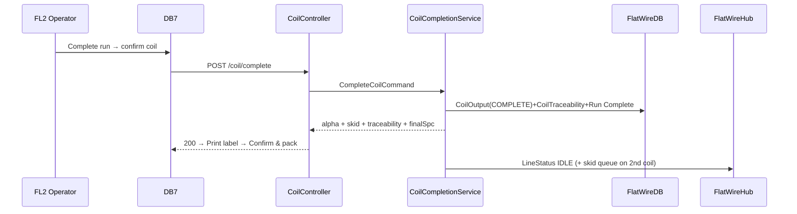

# PHASE 9 — Output Coil Completion, Labeling & Packing

> **Part of the [Flat Wire Mill — Master Implementation Roadmap](../ShopfloorAndRealTimePlan.md).** See [Foundations](./00-foundations.md) for §0.2–0.4 shared context.
> **Prev:** [Phase 8 — FL2 Spool Check-In & Finishing Run](./phase-08-fl2-spool-checkin-finishing-run.md) · **Next:** [Phase 10 — FL3 Hybrid Continuous Operation](./phase-10-fl3-hybrid-continuous-operation.md)

---

**Project:** Flat Wire Mill Implementation
**Last Updated:** 2026-07-30
**Status:** Ready to build
**Layer:** Full-stack vertical slice
**Owner:** **FE + BE** (stream) — *named owner TBD, see [Capacity & Effort Model](../CapacityAndEffortModel.md#1-delivery-streams-and-roster) §1*
**Effort:** **222 h** (27.8 d) — FE 104 · BE 26 · DB 16 · RT 8 · QA 31 · BA 8 · cont. 29 · **Window:** W6 (Sep 21–25, 5 working days)
**Scope call:** **Not deferrable.** ⚠ **Estimate provisional:** carries a **16–32 h reserve** (excluded from the total) pending OI-45 / OQ-36 — the footage→weight *dimensional basis* is unsettled, and integrating over `RunReading` is materially more work than a target-derived weight.

*The finish line: confirm the coreless coil, generate its alpha, record source traceability, compute weight, print the coil label, and manage the 2-per-skid packing rule.*

## Business Overview
- **Objective:** complete a coil at TKUP-2 — generate output alpha, final SPC, source-rod traceability, footage-based weight, coil label, skid assignment (2 coils/skid), packing queue.
- **Business purpose:** the customer-facing deliverable + the traceability record for the C of C.
- **User roles:** FL2 operator (also FL3 output).
- **Entry conditions:** an active FL2/FL3 run with footage produced.
- **Exit conditions:** coil `COMPLETE`, linked to skid; on 2nd coil, skid closed + label + packing queue; run marked complete; line IDLE.

## User Journey
1. **Dashboard 7**: system-calculated coil details — new alpha `FW-#####-C##`, alloy/temper, **gauge/width shown as target when in tolerance** (not average), footage, **net weight = footage × density factor** (operator can override with scale).
2. **Source Traceability** table: one row per source rod with footage-from/to at each weld boundary.
3. **Final SPC**: gauge/width in-spec badges; out-of-spec → Submit-Suspend primary (supervisor review).
4. **Skid tracking**: Coil 1 of 2 (skid open) / Coil 2 of 2 (close + print skid label); exactly 2 per skid.
5. **Print Coil Label** (physical, NOT traveler); **Confirm & Move to Packing** → coil COMPLETE, skid linked; on 2nd coil skid finalized + packing queue; run complete → Dashboard 3 "Run Complete"; Dashboard 1 → IDLE.
- **Decision points:** weight override; 1-of-2 vs 2-of-2; suspend on out-of-spec.
- **Error scenarios:** out-of-spec final SPC → suspend path; density factor pending (OQ-36) → "pending confirmation" + override.

## UI Implementation (Angular)
- **Screens:** Dashboard 7 (`dashboard_7_coil_completion.html`), Packing Station (`dashboard_7b_packing_station.html`).
- **Components:** `dashboard-7-coil-completion`, `source-traceability-table`, `skid-tracker`, `coil-label`.
- **Services/models:** `flat-wire-api` (`coil/complete`, `coil/{alpha}/label`); `coil-output.model`, `traceability.model`.
- **Validation:** weight override; skid selection; final SPC.
- **Navigation:** → Dashboard 1 (IDLE) after packing; → Dashboard 8 on suspend.

## Backend Implementation (.NET)
- **APIs:** `CoilController POST /coil/complete`, `GET /coil/{alpha}/label`.
- **Request/Response:** complete (weights, final gauge/width, skid assignment) → coil alpha, skid id/status, footage total, `sourceTraceability[]`, finalSpc; label DTO (all label fields incl. source rod alphas + lot).
- **Business services:** `CoilCompletionService` (alpha gen, traceability build from weld boundaries, footage→weight via alloy factor, skid rule, run complete), `LabelService` (coil label).
- **MediatR handlers:** `CompleteCoil`, `GetCoilLabel`.
- **Business rules:** 2 coils/skid enforced; gauge/width target-when-in-tolerance; pass-schedule ID+snapshot written to coil record (OQ-54 decided); footage→weight per alloy (OQ-36).
- **Authz:** Operator+.

## Database Changes
- **Tables (write):** `CoilOutput` (alpha, weights, final gauge/width, `SkidId`, `SkidStatus`, `Status=COMPLETE`, in-spec flags), `CoilTraceability` (footage ranges → rod alphas), `FlatWireRun.Status=Complete`/`CompletedAt`.
- **Reads:** `WeldEvent` (boundaries), alloy factor, `FlatWireRun` footage.
- **Indexes:** `CoilTraceability(CoilAlpha)`, `CoilTraceability(RodAlpha)`.
- **Relationships:** `CoilOutput 1→N CoilTraceability`; `CoilOutput.SkidId` → existing skid table (no DB FK).

## Real-Time Functionality
- **Publisher:** `LineStatus` → IDLE on completion; skid closed → packing queue update.
- **Subscribers:** Dashboard 1; packing station.

## Integration Flow

## Testing
- **Unit:** alpha gen; traceability from weld boundaries; footage→weight + override; 2-per-skid; target-vs-measured display.
- **API:** complete + label contracts.
- **UI:** traceability table; skid 1-of-2/2-of-2; label fields; suspend path.
- **Integration/DB:** COMPLETE + traceability rows; run marked complete; genealogy query returns coil→`coils` R-series→heat (cross-DB join).
- **Acceptance:** a coil completes with correct traceability, weight, label, and skid closure.

## Deliverables
Dashboard 7 + packing station; `CoilController` + completion/label services; traceability build; footage→weight; skid rule.

**OQ blockers:** OQ-36 (footage→weight — Critical), OQ-16 (skid labeling), OQ-31 (coil OD/ID limits), OQ-54 (schedule snapshot on coil — decided). **Stories:** FW-066, FW-100 (weight).
