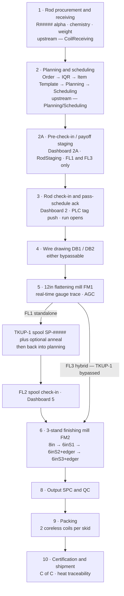
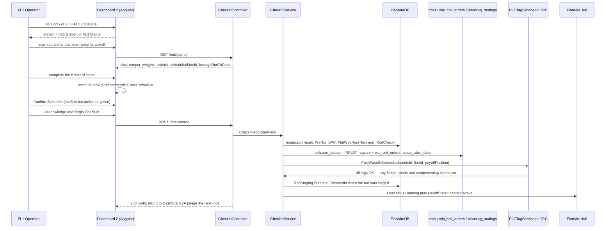
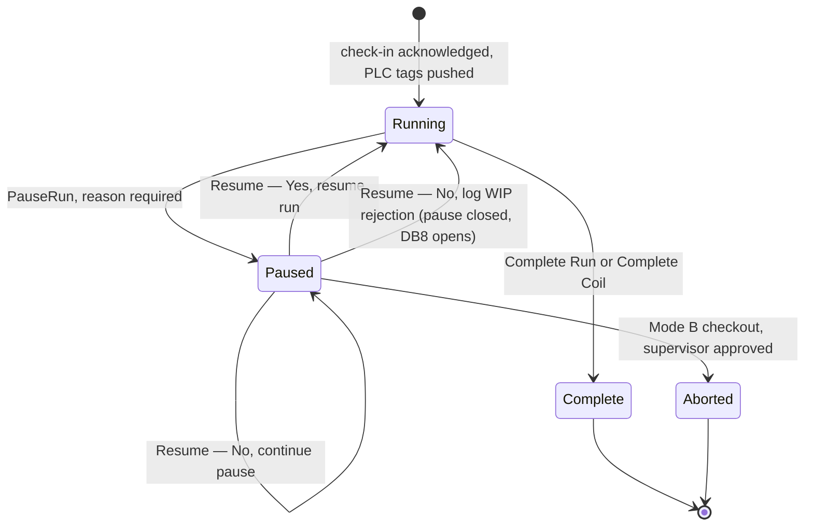
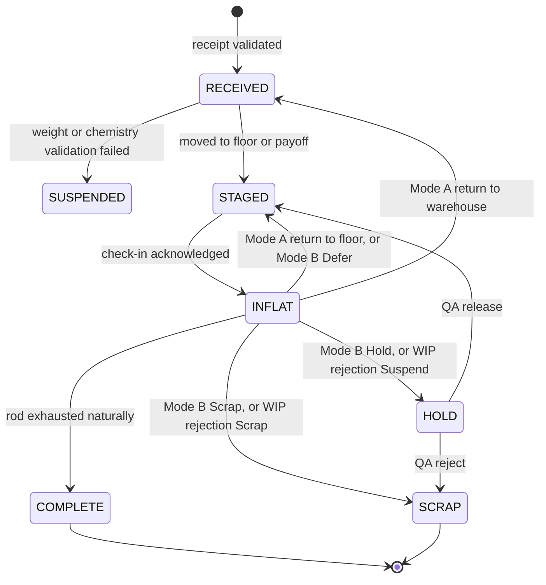
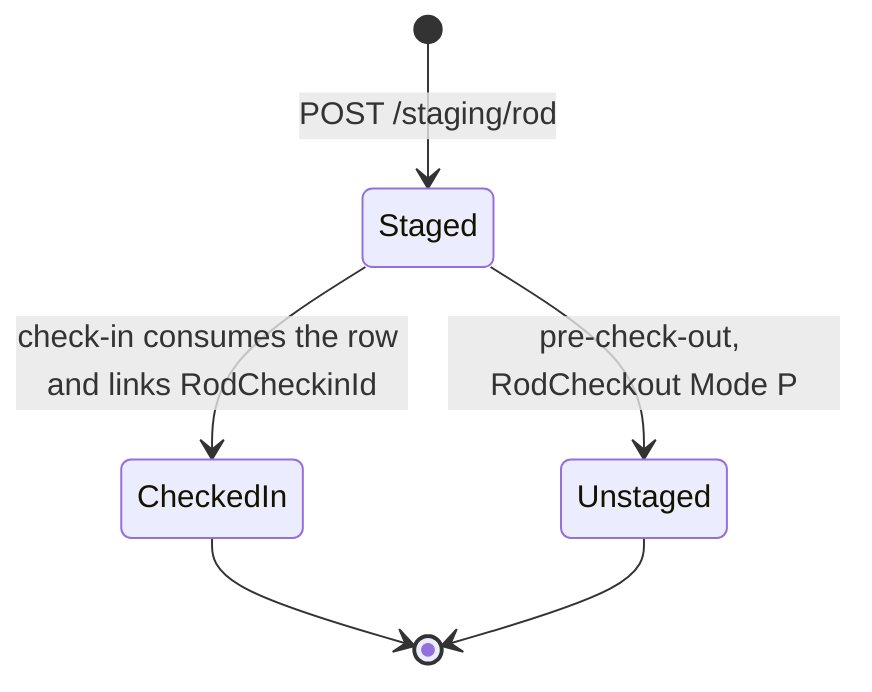
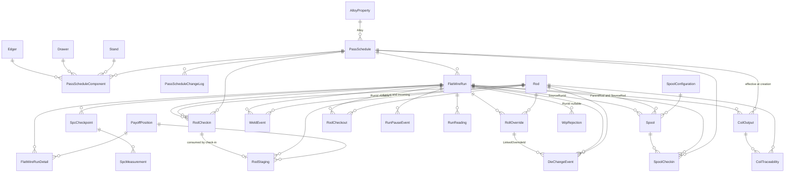
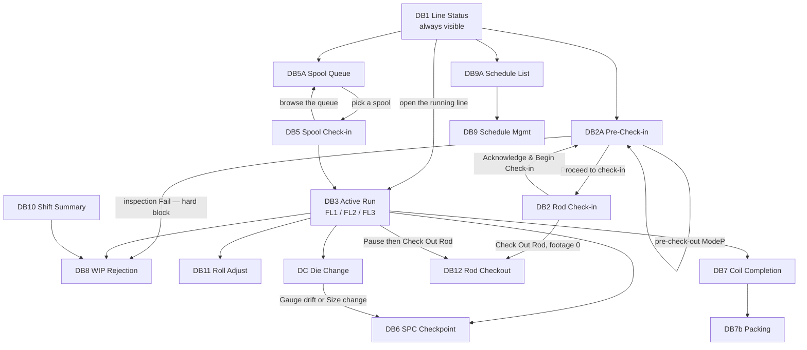

# Flat Wire Mill — Master Specification

**Project:** United Aluminum (UAL) — Flat Wire Mill Module
**Last Updated:** August 4, 2026
**Status:** Consolidated master specification — implementation-ready, with open items listed in §11. The 30 Jul 2026 client answers are applied to **§11 and to the affected body sections** (§3 flow, §4 pre-check-in note, FR-045, §5 `AlloyProperty` and `RodStaging`) — see [`../Analysis/ClientCall_2026-07-30_SyncPlan.md`](../Analysis/ClientCall_2026-07-30_SyncPlan.md)
**Latest change (4 Aug 2026):** the **FM2 roller-size correction** — FM2 has **three** stands, **S1 = 8", S2 = 6", S3 = 6"** (decision **D-26**, §10.2). This supersedes **D-21**'s "three 6-inch stands" and closes **OI-04** and **OI-36**. Component names are now position-only (`FM2_S1`/`FM2_S2`/`FM2_S3`) and roll diameter is data (`Stand.RollDiameterIn`).
**Supersedes (as a reading path, not as files):** every artifact in `../Analysis/`, `../DevelopmentPlan/`, `../DevelopmentPlan/Schema/`, `../SRS/` and `../BaseDocuments/`. Those files remain the audit trail and are **not** modified by this document. Where two of them disagree, this document states the single resolved answer and records the losing side in §10 or §11.
**Scope of authority:** this document is a *reconciliation*. It is authoritative for what to build. The executable DDL in [`../DevelopmentPlan/Schema/SQL/`](../DevelopmentPlan/Schema/SQL/) remains authoritative for column-level types, and the HTML in [`../Mockups/`](../Mockups/) remains authoritative for pixel-level layout.

---

## Table of Contents

1. [Executive Summary](#1-executive-summary)
2. [Domain Model & Glossary](#2-domain-model--glossary)
3. [End-to-End Process Flows](#3-end-to-end-process-flows)
4. [Functional Requirements](#4-functional-requirements)
5. [Data Model](#5-data-model)
6. [API & Real-Time Contracts](#6-api--real-time-contracts)
7. [User Interface Specification](#7-user-interface-specification)
8. [Architecture & Integration](#8-architecture--integration)
9. [Delivery Roadmap](#9-delivery-roadmap)
10. [Decisions Register](#10-decisions-register)
11. [Open Issues & Gaps](#11-open-issues--gaps)
- [Appendix A — Source Provenance](#appendix-a--source-provenance)
- [Appendix B — Change Log](#appendix-b--change-log)

---

## 1. Executive Summary

### 1.1 What the Flat Wire module is

United Aluminum is entering a new market: **oscillate-wound flat wire** produced from aluminum rod, instead of traditional pancake (strip) coils. Three new **Flattening Lines** — FL1, FL2 and the hybrid FL3 — convert aluminum rod into coreless oscillated flat-wire coils through wire drawing, controlled flattening, optional annealing and finish rolling [SRS §1.3; `Analysis/FlatWireEndToEndProcess.md`].

The Flat Wire module is the **shopfloor and dashboard layer** that drives operator transactions and machine behaviour for those three lines. It is a new capability inside the existing UAL Manufacturing Execution System, not a standalone application: it reuses UAL's authentication, machine configuration, planning, scheduling, reporting, WIP/rejection, yield and cost patterns, and it registers FL1/FL2/FL3 as first-class machine entries alongside the existing slitters and mills [SRS §2.1].

Two things make this module different from every other UAL shopfloor module:

1. **The Pass Schedule is the machine's brain.** A single configuration record decides which components are active or bypassed, the die sizes, the roll clearances, the edge configuration, the gauge and width targets and the route mode. Operator acknowledgement of that record at check-in is what pushes PLC tags to the line. Nothing runs without it [SRS §2.5, §4.7; `Analysis/FlatWirePlan.md` §1].
2. **Weld genealogy is a contractual deliverable.** Welding-wire customers require a traceable chain from supplier heat, through every rod-to-rod induction weld, to the finished coil alpha — with footage attribution per source rod. That requirement shapes the run model, the traceability tables and the certificate query [SRS `WLD008`/`WLD009`, `NFR012`; `LatestDocument/RequirementDocuments/WeldEvent.md`].

### 1.2 Why

- **Lower unit cost than pancake coils** and access to new customers, notably welding-wire buyers [SRS §1.3; `BaseDocuments/April 16 Meeting Summary.docx`].
- Existing UAL applications cannot represent rod as an input, a flattening operation, a bundle width, an edge type, or a coreless oscillated coil — so ~24 applications need extension, catalogued in `BaseDocuments/New Flat Wire Machine - Impact on Applications 041726.xlsx`.

### 1.3 Scope

**In scope for this specification (the shopfloor + dashboard layer):**

| Area | Contents |
|---|---|
| Operator screens | Pre-check-in, check-in (rod and spool), active-run monitoring, welding, SPC, roll adjust, die change, pause/resume, WIP rejection, rod checkout, coil completion, packing |
| Dashboards | Line Status (DB1), Active Run Monitor (DB3), Pass Schedule Management + List (DB9 / DB9A), Shift Summary (DB10), Roll Adjust (DB11), Rod Checkout (DB12), Die Change, Die Management, OEE |
| Data model | The standalone `FlatWireDB` schema (**27 tables**) plus the named legacy integration points in the shared databases |
| Integration | PLC tag push/clear, OPC tag consumption (mill speed, feet consumption), SignalR real-time streaming |
| Quality | SPC checkpoints, SPC-HOLD, CPK, WIP rejection |

**Explicitly out of scope of the shopfloor build** (owned by existing upstream/adjacent systems, but consumed here):

| Area | Owner | What this module consumes |
|---|---|---|
| Rod receiving (R-series alpha generation, chemistry, suspend logic) | existing CoilReceiving module | a rod row in the shared `coils` table with status `RECEIVED`/`STAGED` |
| Order planning & line scheduling | existing Planning / Scheduling systems | a rod→order allocation in `planning_routings` and an order→line booking |
| Coil Yield and Cost Ledger | own module documents | run/traceability data produced here |
| Web (Orders / Quotes / IQR / Item Template / Alloys / Vendor) | `FlatWireJiraStories.md` Epic E06 | the Flat Wire flag, Bundle Width, Edge Type on the order |
| EDI rod receiving | deferred to Phase 2 | — |

[Scope split per `DevelopmentPlan/ShopfloorAndRealTimePlan.md` scope note and SRS §1.2 / Appendix D.]

### 1.4 Non-goals

- **No new frameworks.** Angular 18.2+, .NET 8, SQL Server, SignalR, Chart.js only. No React/Blazor, no separate mobile app, no message broker (Kafka/RabbitMQ) in Phase 1 [`DevelopmentPlan/TechStackRecommendation.md`].
- **No printed traveler.** The traveler is fully digital; the "Print Traveler" action is disabled for flat wire. Coil, spool and skid **labels are still printed** [decision Apr 28 2026, `Analysis/FlatWireShopfloorDashboards.md` design principle 8].
- **No auto-applied pass schedule.** "Generate from Specs" produces a *draft* for human approval; nothing reaches the PLC except by operator acknowledgement at check-in [`PSM003`].
- **No software stop command to the PLC.** The application is a gatekeeper that reads line state; the operator always stops the machine physically [`RCO007`; `LatestDocument/RequirementDocuments/RodCheckout.md`].
- **No laser welding.** Removed May 21 2026 as not viable; induction only [`WLD012`].
- **The word "strip" is not used.** Always "flat wire" [SRS §6.3].

### 1.5 Current status (as of July 30 2026)

| Dimension | State |
|---|---|
| Requirements | Consolidated SRS v3 (`SRS/Shopfloor_Flat_wireSRS_Consolidated_v3.docx`) — **removed from the repository 1 Aug 2026**, in git history at `6096921`; §4 below and `ProjectPlan/02-SRS.md` now carry its rules. ~29 feature areas, requirement IDs `OL`/`PCI`/`CHK`/`WLD`/`TRV`/`ORD`/`PSM`/`GWT`/`SPC`/`ALT`/`STP`/`WBK`/`PR`/`FRT`/`DAT`/`WRJ`/`PKG`/`RCO`/`PRC`/`LST`/`ARM`/`PSL`/`SHS`/`RAJ`/`DCH`/`DMG`/`HMI`/`SCD`/`OEE`/`PRN`/`DM`/`INT`/`NFR` |
| Schema | Designed, scripted, and validated on SQL Server 2019 — 27 tables, 41 FK constraints, indexes, one trigger, two read procs, idempotent build+seed |
| API | Contract published for 30 REST endpoints + 9 hub events; four Tier-1 correctness bugs identified and corrected in §6 of this document |
| UI | 27 static HTML mockups delivered and approved as the visual baseline; no Angular code written |
| Code | **None.** `ual-angular` library `flat-wire-shopfloor` and `ual-api` domain `FlatWire` are both un-started |
| Decisions | 74 tracked questions; 21 Decided, 8 In Progress, 45 Open — 6 of the Open ones are Critical |
| Schedule | Phase 1 (platform) due **14 Aug 2026**; feature work **17 Aug → 30 Sep 2026**; UAT 28–30 Sep; on-line trial early Oct 2026 (TBD); production Q4 2026 (TBD) |
| Effort | **465.6 dev-days** across 14 phases vs **44 working days** available (32 post-gate) → **10.6 FTE sustained**. See `DevelopmentPlan/CapacityAndEffortModel.md` |

**The three things most likely to stop this project** are, in order:

1. **The 30 Sep date is unreachable as scoped — and this is now measured, not feared.** The plan is **465.6 dev-days against 44 working days**: **10.6 people sustained**, **10.7 FTE** for the Phase-1 gate alone, and an arithmetically impossible **27.2 FTE in W7**. Descoping cannot rescue it — the full ladder recovers **12%** (55.9 days, leaving 9.3 FTE), and G1's own stated mitigation is worth **34.5 days ≈ 0.8 FTE**. A programme decision is required: staff to ~11 FTE, move the date (6 FTE → **18 Nov 2026**; 8 FTE → **22 Oct 2026**, both inside the already-planned Q4 window), or cut below the critical path. Gap **G1** / open issue **OI-51**; full derivation in `DevelopmentPlan/CapacityAndEffortModel.md`. *(This was previously third on this list and stated as "no staffing or effort model." The model now exists; the problem it revealed is larger than the missing model was.)*
2. **The Pass Schedule content itself is still being authored by Operations** — every check-in depends on it, and Phase 2 gates every check-in phase.
3. **The footage→weight conversion factor (OQ-36 / OI-45) is undefined** — every output weight, yield figure and remaining-weight estimate depends on it, and the choice of dimensional basis also decides whether `FR-153`'s ±2 % threshold is workable.

### 1.6 How to read this document

- §2–§3 are the domain. Read them once.
- §4 is what to build, screen by screen, with numbered `FR-###` requirements traceable to SRS IDs.
- §5–§6 are the contracts a developer codes against.
- §7 describes the screens without reproducing them; the HTML in `../Mockups/` is the pixel authority.
- §9 is the plan; §10 tells you what was already decided and must not be re-opened; §11 tells you what is still genuinely undecided.

---

## 2. Domain Model & Glossary

### 2.1 Flat wire manufacturing at United Aluminum

The process converts aluminum **rod** — round, ~0.375" diameter, received in bundled coils from vendors such as Constellium, Arconic, Southwire or Nexans — into **coreless oscillated flat wire coils**: flat (2-D cross-section) aluminum wire wound without a core mandrel, so the collapsible spool ejects the finished coil.

The transformation is four operations, of which any of the first two may be bypassed:

1. **Wire drawing** (DB1, DB2) — pulls the rod through tungsten-carbide dies to reduce diameter and correct roundness. Wet lubricant is applied; residue is a downstream handling consideration. Either die block can be bypassed if the rod is already at size.
2. **Flattening** (FM1, the 12" mill) — the primary 3-D → 2-D transformation. Round wire becomes flat wire. FM1 carries gauge stands, a dancer for tension, and **automatic gauge control (AGC)**, which runs set-and-forget through the run.
3. **Optional anneal** — FL1 output spools are routed to a furnace before FL2 if the target temper requires it. Not inline. The hybrid route bypasses it entirely.
4. **Finish rolling** (FM2, the 3-stand mill) — brings flat wire to final gauge and width, with edge conditioning.

Continuous operation is achieved at the payoff: the **VPS** (Variable Position Payoff) holds two rod bundles eye-to-sky, and when the drawing bundle nears exhaustion the operator **induction-welds** the tail of the running rod to the head of the staged rod. The line never stops. This is why pre-check-in exists, and why weld genealogy is a first-class concern.

Output is wound at a **traversing take-up** that oscillates across the coil face — the "oscillation width" (**bundle width**) is a Min/Max range specified per order, and is a different quantity from the flat wire's own width.

### 2.2 The three lines

| | **FL1 (standalone)** | **FL2 (standalone)** | **FL3 (hybrid)** |
|---|---|---|---|
| Machine entry | Flattening Line 1 | Flattening Line 2 | Flattening Line 3 (FL1 + FL2 continuous) |
| Input | Rod or round wire, at the VPS | Flat wire **spool** on the TPO | Rod or round wire, at the VPS |
| Flow | VPS → DB1 → DB2 → **FM1** → TKUP-1 | TPO → **FM2** (**8" S1 → 6" S2 → 6" S3**) → TKUP-2 | VPS → DB1 → DB2 → FM1 → *(TKUP-1 bypassed)* → TPO → FM2 → TKUP-2 |
| Output | Intermediate **spool**, `SP-#####`, ≤ 3,500 lb | Coreless oscillated **coil**, `FW-#####-C##`, ≤ 1,100 lb | Coreless oscillated **coil**, ≤ 1,100 lb |
| **Edger** | **None** — FL1 has no edger | Edgers at **S2 and S3 only** | Edgers at S2 and S3 (the FM2 side) |
| Gauge trace | **Real-time** (live AGC feed) | **Historical / profile** — broadcasts `null` live gauge and width | **Real-time**, end to end |
| Intermediate anneal | Yes, optional, after TKUP-1 | N/A | **No** — bypassed by definition |
| Intermediate alpha | Yes — spool alpha issued | N/A | **No** intermediate alpha |
| PLC tag push | At FL1 check-in | At FL2 check-in | At FL1 check-in — **one acknowledgement pushes both FM1 and FM2 tags** |
| Pre-check-in supported | **Yes** | **No** (`PCI002` — no staging space) | **Yes** |
| Scheduling | Own machine booking | Own machine booking | Own machine booking; **FL3 cannot run if FL1 or FL2 have scheduled orders** |
| Die change screen | Yes (DB1/DB2) | **No** — no drawing dies | Yes |
| Roll Adjust screen | See §11 open item **OI-11** | Yes (FM2 gaps) | Yes (FM2 gaps) |

FL1 and FL2 may run **independent orders simultaneously** in standalone mode; their throughput ratio is roughly **3:1** (FL1 faster), so FL1 opens capacity more often than FL2 [OQ-45, Decided May 4 2026].

**Authoritative equipment configuration is `00-foundations.md` §0.3**, as corrected by the client on May 21 2026 (FL1 has no edger) and **Aug 4 2026 (FM2 roller sizes)**. Superseded, in any source of any date: an edger on FL1; FM2 shown as `8" → 6"S1 → 6"S2` with S2 final; **FM2 shown with four stands, with a separate `8" Roller` component, or with a 6" stand named S1**. FM2 has **three** stands — **S1 (8"), S2 (6"), S3 (6", final)**.

### 2.3 Equipment inventory

| Equipment | Line | Role | Capacity / value | Bypassable |
|---|---|---|---|---|
| **VPS** payoff (dual position) | FL1 / FL3 | Rod / round-wire feed, eye-to-sky | **9,000 lb per position** | No |
| **DB1** | FL1 / FL3 | Wire drawing die 1 (roughing) | — | **Yes** |
| **DB2** | FL1 / FL3 | Wire drawing die 2 (finishing draw) | — | **Yes** |
| **FM1** — 12" flattening mill | FL1 / FL3 | Round → flat; gauge stands + dancer; **no edger** | — | **No** (`CK_PSC_FM1NotBypassable`) |
| **TKUP-1** traversing take-up | FL1 | Intermediate spool | **3,500 lb** | N/A — non-hybrid only |
| **TPO** traversing payoff | FL2 / FL3 | Feeds FM2 | 3,500 lb | N/A |
| **FM2 — S1 (8" roller)** | FL2 / FL3 | Finishing stand 1; no edger | — | **Yes** |
| **FM2 — S2 (6" roller)** (+ edger) | FL2 / FL3 | Finishing stand 2; edger here | — | **Yes** |
| **FM2 — S3 (6" roller)** (+ edger) | FL2 / FL3 | Finishing stand 3, **final gauge control**; edger here | — | **No** |
| **TKUP-2** traversing take-up | FL2 / FL3 | Finished coreless coil | **1,100 lb** (OQ-32, revised up from 1,000 lb May 4 2026) | No |
| Line speed | all | Governed by the final take-up | **~1,800–2,000 FPM** | — |
| Skid | packing | Finished output | **2 coreless coils per skid** | — |
| Anneal furnace | off-line | Intermediate anneal between FL1 and FL2 | shared capacity — see OI-19 | Optional |

> **Note on the mandatory stand — `OI-04` is closed (Aug 4 2026).** The mandatory stand is **`FM2_S3`**, FM2's final gauge-control stand. The contradiction was apparent, not real: the DDL/API/HMI rule *"`FM2_6inS2` must always be Active"* and SRS §2.7's *"6" S3 is non-bypassable"* named **the same physical stand**. Only the phantom fourth stand made them look inconsistent. Implement the constraint against `FM2_S3`; `FM2_S1` and `FM2_S2` are bypassable.

**Component vocabulary (Aug 4 2026).** FM2's components are **`FM2_S1`** (8"), **`FM2_S2`** (6") and **`FM2_S3`** (6", final) — position only, with roll diameter held in `Stand.RollDiameterIn`. The former `FM2_8in` / `FM2_6inS1` / `FM2_6inS2` / `FM2_6inS3` set is retired and maps `FM2_8in`→`FM2_S1`, `FM2_6inS1`→`FM2_S2`, `FM2_6inS2`→`FM2_S3`, with `FM2_6inS3` withdrawn as never-existent. `EdgeSet` remains a valid component name but is FL1-legacy — FL1 has no edger, so no new FL1 schedule should carry it.

### 2.4 Alpha / identifier formats

Every material and event unit carries an **alpha** — the traceability handle that certs, quality records and dispositions tie back to.

| Entity | Format | Example | Generated by | Notes |
|---|---|---|---|---|
| Rod | `R#####` | `R00041` | Rod Receiving, at receipt | Range R00001–R99999, incremented by 1 per received rod per lot, **no gaps**; historical R-series retained permanently in `coils` (`NFR013`) |
| Intermediate spool | `SP-#####` | `SP-00021` | FL1 at spool completion | **Canonical.** The SRS narrative's `TS######` ("Temp Spool", TS000001–TS999999) is the competing format — see OI-02 |
| Run | `RUN-####` | `RUN-0042` | On check-in | One per check-in event |
| Pass schedule | `PS-{alloy}-{line}-{seq}` | `PS-1100-FL1-003` | Operations, at creation | Natural primary key |
| Weld event | `WLD-###` | `WLD-002` | On weld confirm | |
| Roll override | `OVR-####` | `OVR-0042` | On Apply in Roll Adjust | |
| Die change | `DC-####` | `DC-0041` | On die-change confirm | |
| SPC checkpoint | `SPC-####` | `SPC-0041` | On checkpoint submit | |
| WIP rejection | `REJ-####` | `REJ-0041` | On rejection submit | Mockup shows the richer `REJ-2026-0418`; the schema constraint is `varchar(20)` so both fit — pick one (OI-21) |
| Rod checkout | `CO-####` | `CO-0041` | On checkout confirm | |
| Output coil | `FW-#####-C##` | `FW-00421-C01` | At coil completion | The `FW-#####` part is the order; `C##` is the coil sequence |
| Output coil, mid-run child | `FW-#####-C##-A` | `FW-00421-C01-A` | On a product-spec change mid-run | Per OQ-27 cases 2, 3, 5 |
| Skid | `SK-#####` | `SK-00201` | On first coil placed | 2 coils per skid |
| Die tooling | `D-{size×1000}-{seq}` | `D-310-034` | Die Management, at registration | `D-310-…` = a 0.310" die |
| MMS ID | *(no format defined)* | — | At check-in, per input coil | Stored on `RodCheckin.MmsId` / `SpoolCheckin.MmsId`; **format undefined** — see OI-03 |
| Scrap box | `SB-{alloy}-{nn}` | `SB-1100-04` | *(external — slitter scrap-box source)* | Observed only in the Dashboard 2A mockup; no defining source — OI-15 |

> **`R#####`, not `ROD-#####`.** Some earlier planning text used `ROD-#####` (and `PartialRodReCheckin.md` uses `ROD-00412` / `SPL-00891` throughout its worked example). The canonical forms are `R#####` and `SP-#####`. Normalise before build [gap G14].

### 2.5 Status vocabularies

**Material status** — `Rod.Status`, `Spool.Status`, `CoilOutput.Status`, `RodCheckout.NewRodStatus`, and the shared `coils.coil_status`:

| Value | Applies to | Meaning |
|---|---|---|
| `RECEIVED` | Rod, Spool | Received from supplier or FL1; not yet staged |
| `STAGED` | Rod, Spool | Positioned at a payoff position; ready for check-in |
| `INFLAT` | Rod, Spool | **In-process on a flattening line.** New status added to the shared scheduling schema by story FW-002 |
| `COMPLETE` | Rod, Spool, Coil | Fully processed |
| `HOLD` | Rod, Spool, Coil | On hold pending quality or supervisor review |
| `SCRAP` | Rod, Spool, Coil | Scrapped |
| `SUSPENDED` | Rod (at receiving only) | Weight or chemistry validation failed at receipt — set by the Receiving module, never by this one |

**Run status** — `FlatWireRun.Status`: `Running` → `Paused` → `Complete` | `Aborted`.

**Pass schedule status** — `PassSchedule.Status`: `Draft` → `Active` → `Inactive` (and `Inactive` → `Active` to re-activate).

**Line state** (Dashboard 1 / PLC display): `RUNNING` · `IDLE` · `SETUP` · `OFFLINE` · `FAULT` · `PAUSED`.

**Staging status** — `RodStaging.Status`: `Staged` → `CheckedIn` | `Unstaged`. The **`Blocked`** bay state exposed by the UI and `GET /payoff/status` is **derived** (`Status='Staged'` with any inspection column `= 'Fail'`), not a fourth value — adding one would fall outside the `UX_RodStaging_Bay` filtered index and free a bay that is still physically occupied.

**Component state** — `PassScheduleComponent.State`: `Active` (engaged) · `Bypass` (present in-line but material passes through unprocessed) · `Skip` (not part of this schedule at all). This is a **three-value enum, never a boolean** — a bool cannot express Bypass vs Skip [REVIEW Tier 1 #3].

**Edge type** — domain values are **`Round` | `Square`** (enforced by `CK_Edger_EdgeType` and `CK_PSC_EdgeType`). The operator-facing labels are **"Round Edge" / "Flat Edge"**, mapped by a display pipe. The `Bevel edge` option present in the Dashboard 9 / 9A Generate modal has **no domain value** — see OI-05.

**Spool working states** (`ACTIVE` / `IN-PLAN` / `IN-USE` / `COMPLETED`) appear in the planning narrative and are a **second, unreconciled vocabulary** against the material statuses above. OQ-57 owns the reconciliation; see OI-06.

### 2.6 Glossary

| Term | Definition |
|---|---|
| **AGC** | Automatic Gauge Control — inline closed-loop feedback holding target thickness during rolling. Set at run start, runs without operator intervention. Both FM1 and FM2 have it |
| **Alpha** | The unique identifier assigned to a unit of material or an event. The handle every cert, quality record and disposition ties back to |
| **Bundle width** | The **oscillation width** of the wound coil — how wide the take-up traverses. A Min/Max range per order. Distinct from the flat wire's own width |
| **Coreless oscillated coil** | The finished product: flat wire wound with no core mandrel; the collapsible spool ejects the coil |
| **CPK** | Process capability index, computed per production run excluding unstable start/end regions |
| **Dancer** | Tension-management roller between components; tension is derived from speed, never entered manually (`PSM012`) |
| **Digital traveler** | The screen-based work instruction that adapts to the active station. Never printed for flat wire |
| **DB1 / DB2** | Draw box 1 / 2 — the wire drawing die blocks |
| **Edger** | Edge-conditioning tooling. On FM2 stands S2 and S3 only |
| **FM1 / FM2** | The 12" flattening mill (FL1) / the 3-stand finishing mill (FL2) — **S1 8", S2 6", S3 6"** |
| **Footage counter** | The PLC-sourced cumulative feet produced on a run. The clock everything mid-run is stamped against |
| **ITInhibit** | A system-controlled PLC tag that blocks machine run when prerequisites are unmet. Set and cleared **only** by the system, never by an operator |
| **MMS ID** | Material-management identifier generated per input coil at check-in; activated when a welded coil becomes active and closed **strictly on material consumption** (remaining ft = 0), never on operator action |
| **Pass schedule** | The central configuration record: components active/bypassed, die sizes, roll clearances, edge configuration, gauge/width targets, speed range, route mode |
| **Payoff / VPS** | The dual-position feed reel holding rod bundles eye-to-sky. 9,000 lb per position |
| **Route mode** | `Standalone` (single-line) or `Hybrid` (FL1 feeding FL2 continuously = FL3) |
| **Scrap box** | Alloy-based container for rod and in-process scrap; selection follows the same carry-forward logic as slitters |
| **Skid** | Packaging unit carrying exactly two finished coreless coils, consistent with the transformer line (R48) |
| **SPC-HOLD** | The state applied to output material when a checkpoint is submitted out of spec. Blocks advancement, shipping and release until QA lifts it — but does **not** stop the machine |
| **Spool (intermediate)** | Reusable collapsible metal spool holding FL1 output; routed to anneal then FL2 |
| **Thread mode** | Running the line slowly to verify a new die is seated and on-target, permitted while a post-die-change SPC checkpoint is outstanding |
| **TKUP-1 / TKUP-2 / TPO** | Traversing take-up 1 (FL1 output) / take-up 2 (finished coil) / traversing payoff (FL2 input) |
| **Traveler Queue** | The pre-checked-in / welded / available rod list for the current order at a line (`TRV004`, `TRV009`) |

---

## 3. End-to-End Process Flows

This section is the sequential narrative. Every step names the screen, the record written and the line variant. Where a step differs by route it says so explicitly.

### 3.1 The eleven stages



Stage 7 (weld events) and stage 11 (scrap disposition) are not sequential: a weld can occur any time during stages 4–6, and scrap arises at any stage. Stages 1 and 2 are upstream systems; this module consumes their outputs. Stage 2A onward is this module.

### 3.2 Before the line — material and job exist

| # | Step | Where | Record |
|---|---|---|---|
| 1 | PO raised in MPS with a 3-D specification (gauge x diameter x length/weight) | MPS | PO |
| 2 | Rod arrives as bundled coils. Operator enters the PO number; alloy, diameter and weight pull from the PO. Operator enters **gross (scale)** and **net** weight | Coil Receiving (Rod) | — |
| 3 | System validates scale weight against vendor gross weight within tolerance, and validates that rod chemistry documentation is present. **Either failing suspends the material** | Coil Receiving | `coils` row `SUSPENDED` |
| 4 | On success, rod alpha `R#####` assigned (no gaps, per lot). `coils` entry created: gauge populated; **width, OD, ID and surface finish blank** — rods have no width. Inventory type TBD (OQ-18) | Coil Receiving | `coils` row, status `RECEIVED` |
| 5 | Sales creates the order with the **Flat Wire** checkbox: bundle width Min/Max, edge type, alloy, temper, gauge. IQR links order to item template; template defines the route (e.g. `Rod → DRAW → FLATTEN`, optionally with `ANNEAL` mid-route) | Web (Orders/IQR/Item Template) | Order |
| 6 | Planner filters `Flatwire`, selects rod material, and enters **weight only**. The system computes the number of stops and **generates all alphas at planning time**, including a remainder alpha for unused weight. "Assign as-is" routes the remainder to stock. "Number of Cuts"/"Number of Stops" are not used for flat wire | Planning | `planning_routings` allocation |
| 7 | Scheduling books the job on **FL1**, **FL2** or **FL3** — three separate machine bookings. Operation letter **`F`**. FL3 cannot be booked if FL1 or FL2 have scheduled orders | Scheduling | order → line booking |
| 8 | **A pass schedule must already exist and be `Active`** for the alloy + line + target gauge x width + route. It is authored manually by Operations/Maintenance on Dashboard 9/9A and is never auto-generated | Dashboard 9 / 9A | `PassSchedule` + `PassScheduleComponent` |

### 3.3 Pre-check-in — staging the next rod (FL1 / FL3 only)

Purpose: register the *next* rod against the idle VPS bay while the current coil is still running, so the line can run continuously through an induction weld. **Priority is `Should`, not `Must`** — scanning an unstaged rod straight into check-in remains valid, and is the normal cold-start path.

1. Rod bundle is moved to the free VPS bay. **Bundles are not unbanded until positioned at the payoff** — a safety and bundle-integrity rule, and the reason the visual inspection happens here rather than at check-in.
2. Operator opens **Dashboard 2A** and runs the 3-step wizard: identify rod → assign bay → visual inspection (oxidation, surface defects, water stains).
3. The scan **resolves the order** from `planning_routings`. On a cold line this is what reveals which order the line is starting. A rod with no allocation is refused.
4. **The wrong station corrects itself** (30 Jul 2026): if the order is booked on the other rod line the screen **switches to that station** and continues — no message, no override. **One** deviation is **notified and supervisor-authorised, never refused**: the rod is not the one planning expects next (*out of sequence*). It uses the credential block — reason + supervisor badge/ID + PIN, with a remote-approval fallback. The PIN is never stored.
5. If the rod has prior footage (`footageRunToDate > 0`) the wizard **forces the carry-forward path**; the fresh-start control is absent from the DOM, not merely disabled.
6. Any inspection Fail is a **hard block with no bypass** — the only forward action is WIP Rejection.
7. On confirm: a `RodStaging` row is written with `Status='Staged'`; the shared coil status and WIP queue entry are updated (compensating writes across databases, **not one transaction**); `PayoffStateChanged` is broadcast. **No PLC tags are pushed.**
8. When the operator physically welds the staged rod to the running rod, **Mark as Welded** records operator + timestamp and validates alloy/temper/diameter against the running coil. It records the weld; it does **not** switch bays — the payoff transition happens when the running rod reaches 0 ft remaining.

### 3.4 Rod check-in — the gate for everything (FL1 / FL3)

Delivered as a **6-step guided tab wizard** with progressive unlock: (1) Visual Inspection, (2) Pass Schedule, (3) Pre-run SPC, (4) Die Block DB1/DB2, (5) Rolling Mill FM1, (6) Lube and Safety.



**Order of writes is mandatory: records first, PLC push second.** If the PLC write fails there is then an incomplete-push marker to recover from (`CHK016`).

**Gate conditions before Acknowledge enables** (`CHK009`–`CHK011`): rod alpha valid against `coils`; diameter within nominal +/- lookup tolerance; all mandatory fields complete; rod available (not checked in elsewhere); order Open and plan open; **all inspection items Pass**; pre-run SPC diameter entered and in spec; a pass schedule loaded and **explicitly confirmed**.

### 3.5 During the run — the events that can interrupt it

Any number, in any order, all stamped against `RunId` + footage position:

| Event | Screen | Written | Gate / consequence |
|---|---|---|---|
| **Weld** | Dashboard 2A — *Mark as welded* | `WeldEvent` (`WLD-###`) | Incoming rod **defaults to the `Staged` rod on the idle bay** (`PCI008`); footage auto-read from the encoder; induction only; quality Pass/Fail with a mandatory fail reason. All later footage attributed to the incoming rod. A Fail still logs and links the rods and flags for supervisor review — it does not silently block the run |
| **Die change** | Die Change (DC) | `DieChangeEvent` (`DC-####`) + auto-created `RollOverride` | Reason `Gauge drift` or `Size change` routes to the SPC Checkpoint screen, the run stays paused/blocked, **thread mode is permitted**, and full production is blocked until SPC passes. Reason `Die failure` shows an optional QA hold on a footage range. Reason `Planned life` returns straight to the run. An incoming die that is not in the Die Management inventory is rejected at the scan |
| **SPC checkpoint** | Dashboard 6 | `SpcCheckpoint` (`SPC-####`) + `SpcMeasurement` rows | Two exits: *Submit · continue run*, or *Submit · suspend material* (coil to `SPC-HOLD`; the machine keeps running) |
| **Roll adjust** | Dashboard 11 | `RollOverride` (`OVR-####`) + an SPC checkpoint of type `RollAdjustTrigger` | **Run-level override — never edits the pass schedule.** Requires measured gauge + width and a reason chip. PLC tag written immediately. All-zero deltas relabel the button "No changes — return to run" and write nothing |
| **Pause / resume** | Pause dialog (shared) | `RunPauseEvent` | One reason from a governed taxonomy; footage frozen; PLC to hold/idle; Dashboard 1 to `PAUSED`. Resume outcomes: resume · log WIP rejection · continue pause · (per the dashboards spec) check out rod |
| **WIP rejection** | Dashboard 8 | `WipRejection` (`REJ-####`) | Group + reason + measured/target + disposition Suspend/Scrap/Rework; `AlertRaised` to Dashboard 1 |
| **Rod checkout** | Dashboard 12 | `RodCheckout` (`CO-####`) | Three modes — see 3.8 |
| **Wire break** | prompt | *(no table defined — see OI-13)* | "Has the wire break happened?" then OD verification then defect inspection before resuming |
| **Spool weight milestones** | Dashboard 3 overlay | audit record per acknowledgement | Advisory 75 / 90 / 100 % ladder against target spool weight; non-blocking |

### 3.6 Run status state machine



`FlatWireRun.PausedAt` holds the current active pause start and is NULL when not paused; an open `RunPauseEvent` is one with `ResumedAt IS NULL`.

### 3.7 Material status state machines

**Rod** — the shared `coils` row for an R-series alpha, mirrored by `FlatWireDB.Rod.Status`:



> **DECIDED (client, 30 Jul 2026): `INFLAT` is set only at check-in.** ~~Whether pre-check-in itself sets `coils.coil_status = INFLAT` (SRS 4.2 data note) or leaves it `STAGED` (process walkthrough) is OQ-67, Critical.~~ Pre-check-in does **not** commit the shared status, and there is **no intermediate status** for a welded-but-not-checked-in rod. The process walkthrough wins and the SRS §4.2 `PCI` data note is superseded on this point. **Residual:** whether the reqsum / `wip_coil_orders` insert from that note stays at staging is unanswered (OI-01). ~~The interim design follows the SRS and treats `RodStaging.Status` (bay occupancy) as orthogonal to `coils.coil_status`, which makes rod status `STAGED` effectively vestigial for FL1. See OI-01.

**Spool**: `RECEIVED → STAGED → INFLAT → COMPLETE`, plus `HOLD` and `SCRAP`. An intermediate anneal **modifies the existing alpha** — no child alpha is issued (OQ-55). Re-passing a spool through FL1 is not possible (no capability). The full transition set is OQ-57, In Progress.

**Output coil**: `COMPLETE`, `HOLD` or `SCRAP`, with the transient `SPC-HOLD` quality flag layered on top — it blocks advancement, shipping and release until QA lifts it, but the machine keeps producing.

**Staging** (`RodStaging`):



`Blocked` is derived, not stored: `Status='Staged'` **and** any inspection column `='Fail'`.

### 3.8 The three checkout modes

| | **Mode P — pre-check-out** | **Mode A — pre-run** | **Mode B — mid-run** |
|---|---|---|---|
| Rod was checked in? | **No** — only pre-checked-in | Yes | Yes |
| `RunId` | NULL | NULL | populated |
| Footage | 0 | 0 | > 0 |
| Pass-schedule acknowledgement | none to void | voided | voided |
| PLC tags | **none were pushed** | cleared | cleared **after confirmed stop** |
| Line-state gate | **not needed** — an idle bay is not running | yes | yes |
| In-process material | none | none | requires a disposition |
| Approval | Operator *(OQ-68 open)* | Operator | **Supervisor** (OQ-48, Decided) |
| Screen | Dashboard 2A | Dashboard 12 | Dashboard 12, reached **only** via the Pause dialog |
| Resulting rod status | `RECEIVED` or `STAGED` | `STAGED` (floor) or `RECEIVED` (warehouse) | `HOLD`, `SCRAP` or `STAGED` (defer) |

**Mode B flow:** operator submits with locked footage, reason and rod disposition; the run closes as a partial run; a **PENDING DISPOSITION** record is created with the material **locked and carrying no alpha**; SignalR notifies the Supervisor role; the supervisor reviews the partial-run gauge trace, footage produced, reason, operator and timestamp from any connected terminal; then **Accept** (partial spool alpha generated, enters the spool queue), **Hold** (alpha generated with Hold status, QC must release) or **Reject** (WIP Rejection flow to scrap). No alpha exists until the supervisor approves.

**PLC gatekeeper rule (all modes with tags):** the application reads `FL{n}.LineState` before the dialog opens and before a confirm is accepted; if it reports Running the checkout is blocked with "Line is still running. Stop the line before checking out the rod." The application **never sends a stop command**. The footage counter is read and **locked at the moment the dialog opens** so the recorded value is final. Tags are cleared only after a confirmed stop and an operator confirm.

### 3.9 Partial-rod re-check-in (carry-forward)

A rod removed mid-run and returned to storage is only partly consumed. The design is **carry-forward on a single persistent rod record**:

- The rod record carries `footage_run_to_date` and `remaining_weight_estimate`, initialised to 0 and full original weight on first check-in and updated on every confirmed checkout.
- Re-check-in **retrieves the existing record by alpha**; it never creates a new one.
- If `footage_run_to_date > 0`, the **fresh-start path is removed from the DOM** and the operator sees the prior-run history (footage already run, remaining weight estimate, last run reference, prior spool alphas) with only *Proceed as partial re-check-in* and *Cancel*, plus an explicit physical-identity confirmation.
- A **new, independent run record** opens with its footage counter at zero. Each run segment produces **its own spool alpha**, and every partial spool alpha carries `source_rod_alpha` back to the originating rod, so the genealogy chain reconstructs across any number of runs.
- Material drawn or rolled and left in the mill at removal is **scrapped** and does not carry forward — only the undrawn rod portion does.
- On natural exhaustion the rod is marked Exhausted with remaining weight zero.

**This gate now fires at the Dashboard 2A staging scan**, not only at check-in — staging is where the rod is first identified, so a partial rod is caught before it is ever mounted (`PRC007`/`PRC008`; `RodStaging.FootageRunToDateAtStaging` records the evidence).

### 3.10 The route split at FM1 output

**Route A — FL1 standalone (produces WIP, not finished goods):**

1. Flat wire winds onto **TKUP-1** as an intermediate spool.
2. Advisory milestone alerts fire at **75 / 90 / 100 %** of target spool weight — non-blocking, acknowledge-to-arm-next, supersede-in-place.
3. When the operator physically stops the machine at or above target and the PLC confirms a `RUNNING → STOPPED` transition held for a configurable dwell (**default 5 s**, corroborated by speed near zero), a **modal** asks whether the stop was to remove the completed spool. **Yes** runs the spool completion transaction and prints labels. **No** records nothing; a manual *Complete spool* path stays available.
4. Per-spool SPC for gauge and width is a **mandatory gate before a spool alpha is issued**.
5. Spool alpha `SP-#####` generated, carrying source rod alphas, measured gauge/width, weights and the **stored gauge profile including weld markers**.
6. Spool label printed on a **high-temperature (furnace-compatible)** printer: temp spool no., alloy, width, gauge, temper, gross/net weight, source rod alphas.
7. Optional anneal; the existing alpha carries forward with the anneal recorded as an event against it. Physical tracking is tow motor to furnace to cooling to FL2.
8. Back into planning: the spool sits in warehouse inventory, a planner allocates weight to an order, the remainder receives a child alpha, and scheduling books it on FL2.
9. **FL2 spool check-in (Dashboard 5)** — spool loaded onto the TPO; operator scans the FL1-printed label and enters measured gauge, width and weights; the screen shows source rods and the **historical FL1 gauge profile with weld markers**; **no visual inspection** (already done at FL1); same mandatory pass-schedule confirmation; FM2 tags pushed; the FL2 run opens.

**Route B — FL3 hybrid (finished goods in one pass):** TKUP-1 is bypassed. Material flows continuously from FM1 through the TPO into FM2 — **no intermediate stop, no spool alpha, no spool label, no intermediate anneal and no FL2 check-in step**. The gauge trace stays real-time end to end, and one unified `PS-{alloy}-FL3-{seq}` schedule covers the FL1 and FL2 components together.

### 3.11 FM2 finishing, coil completion, packing, shipment

1. Material passes the FM2 stands in sequence: **S1 — 8" roller (bypassable), S2 — 6" roller + edger (bypassable), S3 — 6" roller + edger (final)**.
2. Automatic gauge and width measurement after the final 6" stand, recorded as an SPC checkpoint.
3. Output winds at **TKUP-2** (1,100 lb equipment maximum; a customer may specify lower in the order) as a coreless oscillated coil, oscillation width per the order's bundle-width range.
4. **Coil completion (Dashboard 7):** coil alpha `FW-#####-C##` issued — mid-run child `...-A` when a product-spec change split the coil. Footage from the counter. **Net weight = footage x density factor**, operator-overridable with a scale reading. **Gauge and width display the *target* value when SPC confirms in tolerance**; the measured value shows only when out of tolerance.
5. **Source traceability** captured: one row per contributing rod with footage-from / footage-to at each weld boundary, plus the spool alpha on the non-hybrid route. Full chain `R00041 → SP-00031 → FW-00421-C01 → SK-00201`.
6. **Final SPC**: gauge and width in-spec badges; out of spec makes *Submit · suspend* the primary path.
7. **Coil label printed** on the Sato standard printer: alpha, alloy, gauge, width, temper, gross/net weight, lot number, footage, **all contributing source rod alphas**. Pass-schedule data is **not** printed on the customer label.
8. **Skid tracking:** exactly two coreless coils per skid. Coil 1 opens `SK-#####`; coil 2 closes it, prints the skid label and queues it for packing with a staging location.
9. **Packing station (Dashboard 7b):** physical receipt confirmed, scale weight captured and reconciled against the calculated weight, skid closed, labels printed, staging location assigned.
10. **Certification and shipment:** C of C generated with chemistry, mechanical properties, dimensional data, alloy, temper and traceability to source rod heat. Welding-wire customers additionally require every weld join traceable, and may impose a contractual maximum weld count per coil (limit TBD — OQ-23).

### 3.12 Scrap — the parallel path

| Scrap type | Source stage | Disposition |
|---|---|---|
| Wire rod scrap (end crop, entry scrap) | check-in, drawing | scrap box, then baled into a scrap unit |
| In-process flat wire scrap (FL1/FL2) | flattening, finishing | follows existing slit-material scrap procedures |
| Out-of-spec wire bundles | output QC | compacted in the baler (max dimensions TBD — OQ-7) |
| Edge trim | FM2 edgers | scrap box **or scrap skid** — the new outlet selection required in the Scrap module |
| Material left in the mill at a mid-run rod removal | Mode B checkout | scrapped; does not return with the rod |

The **Scrap Box vs Scrap Skid** outlet selection is a new option that also benefits Conveyors and Inspection. Banding material (steel vs aluminium alloy) is unresolved (OQ-13).

---

## 4. Functional Requirements

Requirements are numbered `FR-###`, grouped by operator workflow. Each group names the screen, the SRS requirement IDs it satisfies, the actors, preconditions, field-level validation, actions, state changes, error paths and real-time events. Where a requirement restates an SRS ID exactly, the ID is given in brackets; where this document resolves a conflict, it says so.

**Role vocabulary used throughout:** Operator · Supervisor · Operations Manager · Engineering/Maintenance · QA · Admin. Full permission matrix in §8.5.

### 4.0 Cross-cutting requirements

| ID | Requirement | Source |
|---|---|---|
| **FR-001** | The system shall support manual login and logout at a flat-wire station, permitted only for operators who are punched in, capturing operator ID, timestamp and station. | `OL001` |
| **FR-002** | The system shall support automatic shift-based login and logout driven by configured shift schedules, and shall log every auto event. | `OL002` |
| **FR-003** | The system shall require a validated **supervisor override** before an operator who is not punched in may log in manually, recording operator ID, supervisor ID, timestamp and station. | `OL003` |
| **FR-004** | The system shall prompt "Who is running the machine?" at check-in, at each stop and restart, and whenever machine speed becomes greater than zero, and shall prevent operation continuing until an operator is identified against the run. | `OL004` |
| **FR-005** | The system shall make an operator logged in at FL1 selectable at FL2 and vice versa without re-login, tracking operator-to-line association per run rather than per login. | `OL005` |
| **FR-006** | The system shall display an order-instructions popup after check-in showing instructions, hold information and observations, consistent with the slitter shopfloor popup. | `ORD001` |
| **FR-007** | The system shall provide the order type **"Flat"** alongside Split, Slit, Anneal and Roll. | `ORD002` |
| **FR-008** | The system shall implement **ITInhibit** as a system-controlled PLC tag that blocks machine run, set and cleared **only** automatically — never by an operator. | `ALT001` |
| **FR-009** | The system shall set ITInhibit when: no coil/rod is checked in; **or** no active MMS ID exists; **or** PLC feet data is unavailable or invalid; **or** two or more consecutive data recordings are missing. | `ALT002`–`ALT005` |
| **FR-010** | While ITInhibit is set the system shall block machine run and related transactions, and shall record no rolling data without an active coil. | `ALT006` |
| **FR-011** | The system shall display progressive material-buildup alerts as remaining output length approaches the planned length: a first alert at **50 %** remaining and then every **10 %** (40, 30, 20, 10 %). | `ALT007` |
| **FR-012** | The system shall alert the operator when remaining feed (feet) for the current coil reaches configurable threshold values. | `ALT008` |
| **FR-013** | The system shall generate a unique **MMS ID per input coil at check-in**, activate it when a welded coil becomes active, automatically close the previous one, and close MMS IDs **strictly on material consumption** (remaining ft = 0) — never on operator action. An output spool may reference multiple MMS IDs. | `FRT005`–`FRT009` |
| **FR-014** | The system shall track remaining material length in real time for the active input coil **and** the next welded (queued) coil, sourcing feet consumption from the PLC where available. | `FRT001`, `FRT002`, `FRT004` |
| **FR-015** | The system shall calculate output weight during rolling from **recorded length, gauge and width** — never from a weigh scale — and shall calculate net weight as `Gross − Tare` with tail loss accounted for. | `FRT010`, `FRT011` |
| **FR-016** | The system shall provide **two independent data-collection application instances** (one per line), use both simultaneously in FL3 hybrid mode, and support FL1 and FL2 running independent jobs concurrently. | `DAT001`, `TRV008` |
| **FR-017** | The system shall start data recording automatically when mill speed exceeds zero, with no manual start action. | `DAT002`, `INT006` |
| **FR-018** | The system shall make the data-recording frequency configurable by Engineering/IT without a code change, defaulting to **4 ft per data point for finished product and 20 ft for intermediate product**; the applied rule is: a subsequent rolling operation exists → 20 ft; none → 4 ft; **FL2 always 4 ft**; **FL3 hybrid — both FL1 and FL2 at 4 ft**. | `DAT003`–`DAT005`, `NFR003`, `NFR004` |
| **FR-019** | The system shall capture gauge and width **simultaneously at every recording point**, so both traces derive from the same samples. | `DAT006`, `DAT007`, `GWT004` |
| **FR-020** | When two or more consecutive data-recording entries are missing, the system shall display a prominent data-recording alert and activate ITInhibit. | `DAT009` |
| **FR-021** | The system shall open the "Reason for Flatwire Stop" popup when the OPC mill-speed tag reads zero. | `INT006`, `STP001` |
| **FR-022** | The system shall source **all OPC tag paths from configuration** (`appsettings.json`), never hardcoded, so paths can be corrected after commissioning without redeployment. | `INT005` |

### 4.1 Pre-Check-In Station — Dashboard 2A

**Screen:** [`../Mockups/dashboard_2a_rod_precheckin.html`](../Mockups/dashboard_2a_rod_precheckin.html)
**SRS:** `PCI001`–`PCI008`, `WLD003`/`WLD005`/`WLD006`/`WLD010`, `TRV004`/`TRV009`, `PRC007`/`PRC008`/`PRC011`/`PRC014`
**Actors:** FL1 / FL3 operator (primary); Supervisor (override authorisation)
**Preconditions:** the line is FL1 or FL3; the rod exists in `coils`; planning has allocated the rod to an order in `planning_routings`
**Priority:** `Should` — the line remains operable through standard check-in if this station is unavailable

| ID | Requirement |
|---|---|
| **FR-030** | The system shall provide a dedicated Pre-Check-In station for FL1 and shall support pre-check-in of the next rod **while the current coil is still running**. [`PCI001`, `PCI003`] |
| **FR-031** | The system shall **not** support pre-check-in on FL2 — a `lineId` of `FL2` is rejected. FL2 is check-in only. [`PCI002`] |
| **FR-032** | The system shall present **both payoff bays as peers**, each capable of all four states, with one state machine and one renderer. Payoff 1 is empty at cold start, after a checkout, once its rod is consumed and between orders; Payoff 2 becomes the running bay after every payoff transition. |
| **FR-033** | Bay states shall be: `NOT STAGED` (empty; action: pre-check-in rod) · `PRE-CHECKED-IN` (staged, inspection passed, not checked in; actions: pre-check-out, proceed to check-in, mark as welded) · `ACTIVE` (checked in, rod `INFLAT`, run open; actions: open active run, check out rod) · `BLOCKED` (inspection failed at staging; **only** action: go to WIP Rejection). |
| **FR-034** | The payoff weight bar shall be coloured by **absolute pounds**, not percent bands, so the visual cue does not lag the alert: warning below **3,000 lb** ("prepare weld"), critical when **Payoff 2 is not staged and Payoff 1 is below 2,000 lb**. Bar *length* still shows percent remaining. |
| **FR-035** | The Traveler Queue shall list pre-checked-in, welded and available rod **for the current order**, each row carrying serial number, payoff position, diameter, gross weight and current status, plus `footageRunToDate` so a partial rod is visible **before** it is staged. [`TRV004`, `TRV009`] |
| **FR-036** | The queue shall carry **two sequence columns** — `Plan` (planning's intended order, with a green marker on the rod expected next) and `Run` (the actual staging order, blank until processed, with a deviation marker where the two differ). Alloy and Temper are **not** repeated per row; they are stated once in the order context header. |
| **FR-037** | The queue header shall state the order once: line, order number, the order's material spec, and progress (`n staged · n available · n on order`). `staged` counts every rod physically occupying a bay — pre-checked-in, welded and blocked alike. |
| **FR-038** | On a **cold line** (`activeOrderId` null) the queue shall be empty and the order header shall read `—`; the station must not display an order it has not started. The first rod scanned **reveals** the order from `planning_routings`. |
| **FR-039** | The pre-check-in wizard shall have three steps: (1) Identify rod — alpha (scan or type), measured diameter, optional scrap box, with alloy/temper/weights pre-populating; (2) Assign bay — Payoff 1 / Payoff 2 selector cards, with an occupied bay disabled and labelled with its occupant; (3) Visual inspection — oxidation, surface defects, water stains, Pass/Fail each, plus an observation field. [`PCI004`–`PCI006`] |
| **FR-040** | The inspection shall carry **exactly three items**. The connector-tag item is a check-in concern and must not be added here. |
| **FR-041** | Any inspection `Fail` shall be a **hard block with no bypass**; the only forward action is WIP Rejection. [`CHK010`] |
| **FR-042** | The rod alpha shall be validated against the `R#####` series in `coils` [`CHK006`], the measured diameter against nominal ± a lookup tolerance [`CHK007`], and a rod already checked in elsewhere shall be rejected [`CHK009`]. |
| **FR-043** | Where `footageRunToDate > 0`, the wizard shall show footage already run, remaining weight estimate, last run reference and prior spool alphas, and shall offer **only** *Proceed as partial re-check-in* plus an explicit physical-identity confirmation. **The fresh-start control shall not exist in the DOM.** [`PRC007`, `PRC008`, `PRC011`, `PRC014`] |
| **FR-044** | Staging shall **refuse** a rod with no `planning_routings` allocation, a rod that is not available (`coils.coil_status` in `INFLAT`/`COMPLETE`/`HOLD`/`SCRAP`, or already staged elsewhere), and a rod belonging to a **different order** once an order is established (welding across orders would break coil genealogy). |
| **FR-045** | *(Amended 30 Jul 2026 — off-schedule removed; see OI-73.)* Staging shall **notify and require supervisor authorisation — never refuse** — for **one** deviation: ~~**off-schedule** (the resolved order is booked on a different line) and~~ **out of sequence** (the rod is not the one planning expects next, defined as the lowest planned sequence still available). |
| **FR-046** | Both authorisations shall use one credential block — variance/deviation reason + supervisor badge/ID + **PIN** — and one sign-off covers both when they co-occur. **The PIN shall never be stored or carried in the payload.** A remote-approval fallback shall be offered when no supervisor is on the floor. |
| **FR-047** | The override flag, the authorising supervisor, the timestamp and the reason shall be persisted on the staging record, and the bay card shall keep showing the authorisation for as long as the rod is there. |
| **FR-048** | On confirm the system shall write a `RodStaging` row with `Status='Staged'`, assign `RodSeqno` **server-side** (the next actual position for the line — never client-supplied), snapshot `PlannedSeqno` from the allocation, update the shared coil status and WIP queue entry as **compensating writes**, and broadcast `PayoffStateChanged`. |
| **FR-049** | **No PLC write shall occur at pre-check-in.** Component flags, die sizes, roll gaps and gauge/width targets are pushed only on pass-schedule acknowledgement at check-in. |
| **FR-050** | **Mark as Welded** shall be presented **on the staged bay card** and shall be enabled only when a rod is pre-checked-in on that bay **and** a rod is running on the other bay; it shall validate alloy, temper and diameter against the running coil [`WLD006`] and record operator + timestamp [`WLD003`, `WLD010`]. When disabled it shall state the reason. *(Relocated from the station-level weld-readiness strip, 1 Aug 2026.)* |
| **FR-050a** | The outgoing and incoming rods shall be resolved from **which bay is actually running**, not from the card the operator activated — after a payoff transition the running bay may be either one. [`WLD010`; TC-068] |
| **FR-051** | Mark as Welded shall record the weld only — it shall **not** switch bays. The payoff transition is driven **solely by material consumption reaching 0 ft remaining**. [`WLD005`] |
| **FR-051a** | **Welds this run** shall be presented **on the active bay card**, carrying the weld count, and shall remain available at a count of zero. Where no run exists there is no active bay, so **the control shall be absent** rather than disabled. *(Relocated from the weld-readiness strip, 1 Aug 2026; supersedes the disabled-at-cold-start behaviour. Client confirmation pending — Q83.)* [`PCI021`] |
| **FR-051b** | The pre-check-in station shall **not** offer a link to the active run monitor from the active bay card; that screen is reached from the application bar and the line status board. *(1 Aug 2026.)* |
| **FR-052** | **Pre-check-out** shall release a staged rod that was never checked in: reason (Wrong rod / mis-scan · Order cancelled or deferred · Failed re-inspection · Relocated to different line · Other with free text) and disposition (Return to floor storage · Return to warehouse), plus optional notes. |
| **FR-053** | Pre-check-out shall set `RodStaging.Status='Unstaged'` with the un-stage audit stamp, write a `RodCheckout` row with `Mode='ModeP'`, `RunId` NULL, footage 0 and `PlcTagsCleared` false, **reverse** the WIP queue entry created at staging, and broadcast `PayoffStateChanged{state:"NotStaged"}`. It requires **no line-state gate**. |
| **FR-054** | Un-staging the last rod on an idle line shall **clear the established order** and return the station to cold start. |

**Error paths:** bay already occupied → `409` (from the filtered unique index, not a read-then-write race) · rod already staged on another bay → `409` · rod already checked in → `409` · `lineId = FL2` → `422` · any inspection Fail → `422` with `{route:"wipRejection"}` · prior footage without carry-forward acknowledgement → `422` · diameter outside tolerance → `422` · rod alpha not found → `404`.

**Real-time:** emits `PayoffStateChanged` (unbatched, immediate). Consumes `PayoffWeight` for live bay weight.

### 4.2 Rod Check-In — Dashboard 2 (FL1 / FL3)

**Screen (approved):** [`../Mockups/dashboard_2_rod_checkin - New.html`](../Mockups/dashboard_2_rod_checkin%20-%20New.html) — a guided 6-step tab wizard. **FL3 variant:** [`../Mockups/dashboard_2_rod_checkin_fl3.html`](../Mockups/dashboard_2_rod_checkin_fl3.html) *(still on the older single-page layout; a wizard-shaped FL3 variant is outstanding — OI-16)*.
**SRS:** `CHK001`–`CHK019`, `PSM015`–`PSM019`, `SPC003`, `INT001`–`INT004`
**Actors:** FL1 / FL3 operator; Supervisor (deviation override)
**Preconditions:** rod `STAGED` (or scanned directly); an `Active` pass schedule exists for the attribute combination; the job is scheduled; the real-time backbone is up

| ID | Requirement |
|---|---|
| **FR-060** | On clicking Check-In at FL1 the system shall display a popup asking *"Are you running FL1 only or with FL2?"* with buttons **"FL1 Only"** and **"FL1 and FL2 Together"**. [`CHK001`] |
| **FR-061** | The station name shall be set to **"FL1 Station"** for FL1 Only and **"FL3 Station" (Hybrid FL1 + FL2)** for FL1 and FL2 Together. [`CHK002`] |
| **FR-062** | Clicking Check-In at FL2 shall open the check-in popup directly with no FL1/FL2 selection. [`CHK003`] |
| **FR-063** | Rod/Flat Wire Number and Rod Diameter/Flat Wire Width shall be **mandatory**. Scrap Box shall be optional. [`CHK004`, `CHK005`] |
| **FR-064** | The rod number shall be validated against `coils`; invalid or non-existent rod numbers are rejected. [`CHK006`] |
| **FR-065** | The measured rod diameter shall be validated against `coil_gauge` within the ± tolerance from the lookup table, blocking check-in outside the range (e.g. 0.30 with ±0.01 gives a valid range of 0.29–0.31). **The tolerance source column does not exist yet — see OI-07.** [`CHK007`] |
| **FR-066** | The Scrap Box list shall be populated by alloy (same logic as the slitter shopfloor), auto-selecting the previously used scrap box when the last checked-in rod had the same alloy, and shall remain non-mandatory and changeable or blank. [`CHK008`] |
| **FR-067** | On **Done**, the system shall validate that the order is Open, the plan is open, all mandatory fields are complete, diameter tolerance is satisfied, and the rod is available (not checked in elsewhere) — and shall not proceed if any fails. [`CHK009`] |
| **FR-068** | Visual-inspection failure shall be a **hard block** routing the operator to WIP Rejection before check-in can proceed, with **no bypass**. [`CHK010`] |
| **FR-069** | A **Pre-Run SPC diameter measurement** shall be entered and in spec before "Acknowledge & Begin Check-in" is enabled. The approved wizard captures **two measurements at 90°** (M1, M2) and derives **ovality = \|M1 − M2\|**, which must be within tolerance. [`CHK011`; wizard step 3] |
| **FR-070** | The system shall retrieve the applicable pass schedule at check-in via **attribute lookup** (alloy + rod diameter + target gauge × width + route mode), surface the recommendation in a **confirm bar**, and present the component table clearly indicating which components are Active and which are Bypassed. [`CHK014`, `PSM015`–`PSM017`] |
| **FR-071** | The operator shall **explicitly confirm** pass-schedule identity in a mandatory confirmation before any PLC tags are pushed, and shall supply a **free-text reason** when selecting a schedule other than the recommended one; that selection is flagged for Operations review. [`CHK015`, `PSM015`, `PSM018`] |
| **FR-072** | The system shall write the audit records — visual inspection result, Pre-Run SPC checkpoint, pass-schedule **ID + version + effective date** on the run record, and the acknowledgement event — **before** the PLC push, retaining an incomplete-push recovery marker if the write fails. [`CHK016`] |
| **FR-073** | On acknowledgement the system shall push component activation flags, die sizes, roll gaps, speed limits and gauge/width targets to the controller for the selected payoff position, **as one batch**, and log the push timestamp, schedule ID and triggering operator. *(“Speed **limits**” versus “speed **targets**” is unresolved and deliberately left as-is — `PLC-Q06`.)* [`CHK017`, `INT001`, `INT002`] |
| **FR-074** | If any individual tag write fails, an exception shall be raised, **compensating writes shall re-clear the tags already written** and revert the shared-schema changes, and the check-in shall be aborted. The write set spans `FlatWireDB`, the shared `coils` schema and the PLC, **so this is a compensating re-clear and not an ACID rollback** — machine writes are not transactional. See §8.6 and `[PLC §7.5]`. *(Reworded 4 Aug 2026; closes gap **G16**.)* [`INT002`; gap G2] |
| **FR-075** | The system shall record the outcome of every tag push in `RodCheckin.PlcTagsPushed` / `SpoolCheckin.PlcTagsPushed`, and audit-log each write (tag path, value, operator, timestamp, result). [`INT004`] |
| **FR-076** | SPC prompts shall be initiated automatically after the traveler loads at check-in. [`CHK018`, `SPC003`] |
| **FR-077** | On successful check-in the system shall update the `coilno` field in WIP stations, set `coils.coil_status = INFLAT`, perform reqsum and insert `wip_coil_orders` if the rod is not yet reqsummed, and update `actual_start_date` in `planning_routings` and `routings`. [`CHK019`, `DM002`] |
| **FR-078** | Where a `RodStaging` row exists for the rod, check-in shall **consume** it (`Status → CheckedIn`, `CheckedInAt` and `RodCheckinId` set) rather than creating a parallel record, and the request's `payoffPosition` **must match** the staged position (mismatch → `409`). |
| **FR-079** | The wizard shall present six steps with **progressive unlock** — Visual Inspection, Pass Schedule, Pre-run SPC, Die Block (DB1/DB2), Rolling Mill (FM1), Lube & Safety — and shall keep the footer **Acknowledge & Begin Check-in** disabled until all six clear or a supervisor override is on file. |
| **FR-079a** | On a successful acknowledgement the operator shall be returned to **DB2A — Rod Pre-Check-in**, not to DB3. Check-in is complete at that point and the next task is staging the following rod on the idle payoff; the run monitor remains reachable from the application bar and the line status board. *(1 Aug 2026 — supersedes "navigate to Dashboard 3". Client confirmation pending — Q84.)* |
| **FR-080** | Machine-inspection steps 4–6 shall use **OK / NG / N/A** buttons and measured-value fields against a stated spec: DB1 and DB2 (die ring diameter vs spec, die surface condition, lubricant flow, bearing wear), FM1 (roll gap measured vs target, roll width measured vs target, roll surface condition, coolant flow), and Lubrication & Safety (drawing lubricant level, lube temperature vs 68–80 °F target, pump running, filter condition, all guards in place, E-stop verified, area clear, PPE worn) plus optional notes. |
| **FR-081** | Failed machine-inspection checks shall place the rod **on hold** and expose an **Authorize Override** path capturing supervisor badge, password and a required override reason. |
| **FR-082** | The payoff selector shall remain on Dashboard 2 for the direct-check-in fallback but shall render **pre-filled and read-only** when the rod arrived via pre-check-in. *(`CHK005` reads "Pre-Check-In station only"; this satisfies both readings — confirm with the business, OI-08.)* |
| **FR-083** | For **FL3**, one acknowledgement shall push **all FM1 and FM2 tags in a single batch**; `FlatWireRun.RouteMode` shall be `Hybrid`; **no `Spool` row shall be created**. |
| **FR-084** | A **Check Out Rod** action shall be available on the Dashboard 2 footer (pre-acknowledgement) and in the Dashboard 3 header (acknowledged, footage 0), and shall be **disabled once footage > 0**. [`RCO017`, `RCO018`, `ARM015`] |

**State changes on success:** `FlatWireRun` created with `Status='Running'` and `StartedAt`; `RodCheckin` written; `SpcCheckpoint(PreRun)` + measurements written; `RodStaging → CheckedIn`; `coils.coil_status = INFLAT`; PLC tags pushed; run timer started.

**Error paths:** line already has an active run → `409` · pass schedule is `Draft` → `422` · PLC push failed → `500` with the check-in aborted · inspection fail → routed to Dashboard 8 · no matching active schedule → **undefined, OQ-51 Critical** (the stub assumes a single active schedule).

**Real-time:** emits `LineStatus{Running}`, `PayoffStateChanged{Active}`, `ComponentStatus` reflecting the pushed values.

### 4.3 Spool Check-In — Dashboard 5 (FL2)

**Screen:** [`../Mockups/dashboard_5_spool_checkin.html`](../Mockups/dashboard_5_spool_checkin.html)
**SRS:** `CHK012`, `CHK013`, `PSM016`–`PSM019`, `GWT005`
**Actors:** FL2 operator
**Preconditions:** an FL1-produced spool exists and is ready for FL2; an `Active` FL2 pass schedule exists

| ID | Requirement |
|---|---|
| **FR-090** | At FL2 check-in the operator shall **scan the spool label printed at FL1 output** and shall measure and enter the width of the checked-in material; the system shall validate the scanned spool against the previously checked-in FL1/FL3 data. [`CHK012`] |
| **FR-091** | For a hybrid context the system shall validate that the spool's FL1 pass-schedule route mode is `Hybrid` and matches the expected FL2 input before allowing check-in. **Whether an FL2 check-in occurs at all in hybrid mode is contradictory across sources — see OI-09.** [`CHK013`] |
| **FR-092** | Dashboard 5 shall display **source traceability** from the FL1 run — each contributing rod with its footage range, and the induction weld rows between them with quality result and timestamp — as read-only. |
| **FR-093** | Dashboard 5 shall display the **historical FL1 gauge profile** with target line, tolerance band and weld markers, plus min / max / avg / std-dev / sample-count statistics and an "all in spec" or "N out of spec" badge. [`GWT005`, `DAT008`] |
| **FR-094** | Dashboard 5 shall show the FL2 pass-schedule component table (**S1 — 8" roller · S2 — 6" roller + edger · S3 — 6" roller + edger, final**) read-only, with the same mandatory confirm bar as Dashboard 2. |
| **FR-095** | Dashboard 5 shall have **no visual inspection section** — the spool was inspected at FL1. |
| **FR-096** | On acknowledgement the system shall push FM2-specific tags (**S1/S2/S3 roll gaps and stand states, edger activation and edge type at S2 and S3**), set `Spool.Status = INFLAT`, create the FL2 `FlatWireRun` linked to the source spool and its source rod alphas, and start the FL2 run. |

**Pre-flight validation:** spool alpha valid and ready for FL2 · gauge and width entered (or confirmed from FL1 data) · weight entered · pass schedule loaded · hybrid-origin guard where applicable.

### 4.3a Spool Queue — Dashboard 5A (FL2)

**Screen:** [`../Mockups/dashboard_5a_spool_queue.html`](../Mockups/dashboard_5a_spool_queue.html)
**SRS:** `CHK012`; **Q57**
**Actors:** FL2 operator
**Preconditions:** none — usable on opening

*Added 2 Aug 2026. FL1 has a pre-check-in station listing the rods planned for the running order; FL2 has none, because `PCI002` excludes it from staging — so the FL2 operator had **no view of waiting material at all**. `FR-090` has the operator scan the FL1-printed label and **Q57** records the client stating the operator "selects it by spool number for check-in"; both stand, and only the scan had a screen. This is the selection half, and the first thing actually named "the spool queue" — a phrase `FR-326`, `TC-389`, `RodCheckout.md` and phase 7 all use with no table, endpoint, screen or status behind it.*

| ID | Requirement |
|---|---|
| **FR-097** | Dashboard 5A shall, **on opening and without requiring a scan**, list every spool **available for processing irrespective of order** — identifier, order, source FL1 run and source rod alphas, gauge × width, net weight, origin route mode, status — with a rollup of spool count, ready count and total weight. **Gauge and width shall come from the source FL1 run**, since `Spool.GaugeIn`/`WidthIn` are null until check-in. |
| **FR-098** | On entry of a spool identifier the system shall **resolve that spool's order server-side and return the order context and all spools on that order in one response**, populating the order bar and narrowing the list together, marking the scanned spool, with a **Show all** action to restore the full list. Resolution triggers on the scanner's terminating keypress and on a short debounce after manual entry — **no submit control**. |
| **FR-099** | Dashboard 5A shall offer **check-in only for runnable spools** (`RECEIVED`, `STAGED`); list `HOLD` marked and actionless pending QA release; list `INFLAT`/`COMPLETE`/`SCRAP` without action; **mark hybrid-origin spools**; and treat an **unallocated spool (`OrderNo` null) as a valid single-spool result, not an error**. An unresolved identifier marks the field and **leaves the list unchanged**. |

**Read-only.** This screen writes nothing; all state change happens at Dashboard 5.

**Open:** which statuses count as "available" is **OI-55/Q57**; the two status vocabularies are **OI-06**; identifier and format are **OI-50** / **OI-02**; the hybrid consequence is **OI-47**. **`Spool.OrderNo` must be populated from planning or FR-098 cannot resolve anything** — the one dependency that would invalidate the screen.

**Deliberately absent:** spool age (`Spool` has no creation timestamp) and location (`Spool.Location` has no writer).

### 4.4 Active Run Monitor — Dashboard 3 (FL1 / FL2 / FL3)

**Screens:** [`../Mockups/dashboard_3_active_run_v2.html`](../Mockups/dashboard_3_active_run_v2.html) (FL1 — grouped action cluster + spool-completion overlay; **the sole FL1 layout since 1 Aug 2026**, when the earlier left-rail `dashboard_3_active_run.html` was withdrawn), [`../Mockups/dashboard_3_active_run_fl2.html`](../Mockups/dashboard_3_active_run_fl2.html), [`../Mockups/dashboard_3_active_run_fl3.html`](../Mockups/dashboard_3_active_run_fl3.html)
**SRS:** `ARM001`–`ARM024`, `TRV001`–`TRV010`, `GWT001`–`GWT006`
**Actors:** line operator
**Preconditions:** an active run on the line

| ID | Requirement |
|---|---|
| **FR-100** | The Active Run Monitor shall be **displayed continuously** during an active run, with run context in the header: order, alpha, alloy, target gauge, target width. [`ARM001`, `ARM002`] |
| **FR-101** | The system shall display a real-time **gauge trace** and a real-time **width trace**, each against its target and tolerance band. [`ARM003`, `ARM004`] |
| **FR-102** | Trace lines shall render **green in spec** and **red out of spec with an alert banner**. [`ARM005`, `ARM006`] |
| **FR-103** | After a **configurable number N of consecutive out-of-spec readings** the system shall auto-prompt a WIP checkpoint. | [`ARM007`] |
| **FR-104** | Each weld position shall render a **vertical marker labelled with the rod alpha**. [`ARM008`] |
| **FR-105** | Machine status shall show line speed and footage counter; component status shall show DB1 and DB2 on/off state and active die diameter (and FM1 gap/width). [`ARM009`, `ARM010`] |
| **FR-106** | Payoff 1 and Payoff 2 shall show weight indicators with percent-remaining bars, coloured **green above 50 %, amber 25–50 %, red below 25 % with a prepare-weld alert, and red-flashing below 10 % with a weld-now critical alert**. [`ARM011`, `ARM012`] |
| **FR-107** | The **FL1 action bar** shall have six buttons — Log Weld Event, Die Change, SPC Checkpoint, Pause Run, WIP Reject, Complete Run — with **no Roll Adjust and no edger controls**. [`ARM013`] |
| **FR-108** | The **FL3 action bar** shall have seven buttons — the six above plus **Roll Adjust**. [`ARM014`] |
| **FR-109** | The **FL2 action bar** shall omit Weld and Die Change (FL2 has no drawing dies) and shall include Roll Adjust and Complete Coil. |
| **FR-110** | **Check Out Rod** shall be enabled only when the footage counter equals zero. [`ARM015`] |
| ~~**FR-111**~~ | ~~A **View Trends** action shall navigate to SCADA Trends (Dashboard 14) with the active line pre-selected.~~ **[WITHDRAWN — descoped by client, Aug 4 2026]** [~~`ARM016`~~] |
| ~~**FR-112**~~ | ~~A tab strip shall offer **Traces** (default) and **Machine View**, persisting the last-used tab.~~ **[WITHDRAWN — descoped by client, Aug 4 2026]** — one tab remains, so there is nothing to persist. **The chart-section collapse toggle shares this strip and survives**, with its own `localStorage` key. [~~`ARM017`–`ARM019`~~] |
| **FR-113** | The **machine-status grid and the action buttons shall remain visible at all times**, including while the chart section is collapsed. *(Reworded 4 Aug 2026: previously “regardless of the active tab” — the tabs went with the Machine View, the rule did not.)* [`ARM020`, `ARM021`] |
| ~~**FR-114**~~ | ~~The Machine View tab shall render a compressed line schematic in the trace area, with a link to the full schematic.~~ **[WITHDRAWN — descoped by client, Aug 4 2026]** — the tab and DB13 are both descoped. [~~`ARM022`–`ARM024`~~] |
| **FR-115** | The screen shall carry the **Traveler** sections adapted to the active station: Incoming Bundle Information, Queue (pre-checked-in material), Pass/Reduction Schedule, Edger Configuration, Order/Constraint data, Current Run Status. [`TRV001`, `TRV002`] |
| **FR-116** | The Order/Constraint section shall display maximum and current spool/package weight, order weight, OD minimum and maximum limits and package width limits, and shall use them for runtime validation. [`TRV006`] |
| **FR-117** | The Traveler layout and stop-transaction popups shall vary automatically by output type — FL1-only intermediate spool versus FL2/FL3 finished product. [`TRV007`] |
| **FR-118** | The **main-station Traveler** shall display only the welded rods relevant to the current running rod; the **Pre-Check-In station Traveler** shall display both pre-checked-in and welded rods. Welded rods shall be distinguished by **both colour and explicit text**. [`TRV009`, `TRV010`] |
| **FR-119** | On a network drop the client shall show a "Reconnecting…" banner over cached last-known state — **never a blank screen** — and shall auto-reconnect with backoff and re-join its line group. [`NFR006`] |
| **FR-120** | FL2 in standalone mode shall render the **historical profile**, not a live streaming trace, because the server broadcasts `null` live gauge and width for it. [`INT010`] |

**Real-time consumed:** `GaugeReading[]`, `WidthReading[]`, `SpeedFPM`, `PayoffWeight`, `PayoffStateChanged`, `FootageCounter`, `ComponentStatus`, `LineStatus`, `AlertRaised`/`AlertCleared`, plus the SCADA marker events.

### 4.5 Spool Completion Alerts and Machine-Stop Confirmation (FL1 primary)

**Component:** [`../Mockups/spool_notification.js`](../Mockups/spool_notification.js), hosted in `dashboard_3_active_run_v2.html`
**Source:** `LatestDocument/RequirementDocuments/SpoolCompletionNotification.md` (Parts A and B)
**Actors:** line operator; Supervisor (weight-variance override)

**Part A — advisory milestone ladder**

| ID | Requirement |
|---|---|
| **FR-130** | The system shall raise an automatic, **non-blocking** notification when the actual processed weight on the current take-up crosses **75 %**, **90 %** and **100 %** of target spool weight, showing the current actual weight, the target and the percent complete. |
| **FR-131** | Acknowledging a milestone shall dismiss it and **arm the next**; acknowledging also closes every milestone below it. Acknowledging 100 % ends the ladder for that spool. |
| **FR-132** | An unacknowledged notification shall **keep updating live** (actual weight, percent, remaining, rate, ETA) and shall be **superseded in place** when the next milestone is reached — never stacked as a second card. |
| **FR-133** | The notification shall never block: no modal overlay, no backdrop, no focus trap; every other control on the active-run screen stays operable. It shall not obscure the command bar or either trace panel's header and live reading. |
| **FR-134** | Milestone state shall be **per spool** and shall re-arm from zero when a new spool starts on the same run. |
| **FR-135** | Each acknowledgement shall be **audited** with operator, milestone, actual weight at acknowledgement and timestamp. |
| **FR-136** | Milestone thresholds shall be **configuration, not constants** — table-driven so Operations can tune them without a release. |
| **FR-137** | Actual spool weight shall be derived as `(current footage − footage at spool start) × lb-per-ft`, where `lb-per-ft = A(in²) × 12 × ρ` — `A` applying the round-edge correction where applicable, and ρ read from **`united_db..alloys.alloy_density`** (§5.4). **For FL2, gauge and width shall come from the pass schedule / order, not live measurement**, because FL2 broadcasts `null`. Worked reference: 1100 at 0.110″ × 0.625″ gives **0.0809 lb/ft** square edge, so a 2,000 lb spool target is ≈ 24,700 ft. |

**Part B — PLC-confirmed stop confirmation**

| ID | Requirement |
|---|---|
| **FR-140** | The confirmation popup shall be **armed only while actual weight ≥ target weight** for the current spool. A stop below target raises nothing. |
| **FR-141** | The popup shall fire on the **`RUNNING → STOPPED` transition** of `FL{n}.LineState` — an edge, not a level — with speed ≈ 0 as corroboration, and shall be raised exactly **once per stop event**, re-arming only when the line returns to RUNNING. |
| **FR-142** | STOPPED shall persist for a **configurable dwell (default 5 s)** before the popup is displayed, so a jog, thread or slow-down does not trigger it. |
| **FR-143** | The weight shall be **latched at the PLC stop timestamp**; that latched value is what the popup shows and what the completion transaction and label use. |
| **FR-144** | The pending prompt shall be **server-owned state**, persisted against the run and pushed over `FlatWireHub`, so it survives a browser refresh or screen change and is re-delivered on reconnect. |
| **FR-145** | The prompt shall be **suppressed** when an open `RunPauseEvent` already captured a reason that is not spool removal. |
| **FR-146** | **Yes** shall route into the spool completion workflow — transaction committed, spool alpha finalised, labels printed. **Labels print only after the transaction commits.** |
| **FR-147** | **No** shall close the popup with no transaction, no alpha finalisation, no label print and no spool state change; the decline shall be logged. |
| **FR-148** | If the line returns to RUNNING while the popup is open it shall auto-dismiss, be logged as `line resumed`, and re-arm. |
| **FR-149** | Escape and click-outside shall **not** dismiss the question step; the operator must answer Yes or No. `Y` and `N` keyboard answers shall be provided and advertised on the choice rows. |
| **FR-150** | A manual **Complete spool** entry point shall remain available whenever weight ≥ target **and the PLC reports the line not running**, so a declined prompt is never a dead end. |
| **FR-151** | The completion step shall offer an **optional scale weight** entry. Entered as **gross**; the system derives `net = gross − spool tare` and reconciles it against the calculated net, showing the variance in **lb and % of calculated**. |
| **FR-152** | The operator shall **explicitly choose which weight is recorded**. A scale reading is **pre-selected once entered** (a weighing outranks a derivation) but is overridable back to calculated. The chosen basis governs the spool record, the label and everything downstream. |
| **FR-153** | A variance beyond a configurable tolerance (**default ± 2 %**) shall be flagged but shall **never disable the commit control**. A **supervisor override** panel appears (variance reason + supervisor badge/ID + PIN), the button relabels to "Override & complete spool", and a **Request remote approval** action is offered when no supervisor is on the floor. |
| **FR-154** | Pressing complete with an incomplete override shall flag exactly the missing fields and focus the first — it shall commit nothing and shall never dead-end the operator. |
| **FR-155** | An overridden completion shall be **marked on the spool record** (override flag, authorising supervisor, reason, both weights, the variance) and stated plainly on the result step. **Both weights and the variance shall be persisted regardless of which basis is chosen.** The PIN is never in the payload. |
| **FR-156** | Bringing the variance back inside tolerance shall remove the override requirement, and the completion then records no override. |
| **FR-157** | Answering Yes shall not bypass the workflow's own gates — **per-spool SPC for gauge and width remains mandatory** before a spool alpha is issued. |

### 4.6 Weld Event — captured at the Pre-Check-In station

> **Dashboard 4 (Weld Event Logger) was retired on 1 Aug 2026** (mockup deleted; in git history at
> `2a0426b`). The weld is now captured by **Dashboard 2A's *Mark as welded* dialog**, which since
> `PCI022` records the full weld event — both rod alphas, weld type, footage, and the quality result
> with its mandatory fail reason — writing the same `WeldEvent` row through the same
> `POST /weldevent`. The requirements below are unchanged in substance; only the screen that hosts
> them has moved. **Two capabilities had no new home:** DB4's re-sequenceable *Rods In Queue* and its
> *traceability chain* strip (see §DB4 note and gap **G27**).

**Screen:** [`../Mockups/dashboard_2a_rod_precheckin.html`](../Mockups/dashboard_2a_rod_precheckin.html) — *Mark as welded* dialog
**SRS:** `WLD001`–`WLD017`
**Actors:** FL1 / FL3 operator; Supervisor (weld removal)

| ID | Requirement |
|---|---|
| **FR-160** | The system shall support welding workflows in which the mill **may be stopped or running** when the weld is performed, treating welding as a controlled transition and requiring explicit operator confirmation before coil consumption continues. [`WLD001`] |
| **FR-161** | The architecture shall keep weld-state handling **event-driven and extensible** so future continuous-operation welding needs no redesign of coil sequencing, consumption or traceability. [`WLD002`] |
| **FR-162** | The outgoing rod alpha and the weld-point footage shall be **auto-populated** — footage read from the machine encoder, never typed — and the length laid by the outgoing rod computed as `weld point − rod start`. [`WLD014`] |
| **FR-163** | The incoming rod shall **default to the `Staged` rod on the idle bay** (`PCI008`); the operator may still override by scanning another alpha. |
| **FR-164** | Before a coil can be marked welded the system shall validate that **alloy, diameter and temper match the current coil**, rejecting with a clear validation error if any check fails. [`WLD006`] |
| **FR-165** | The system shall validate that the coil being welded is planned for the **current production order** and is compatible with the active pass schedule; coils that fail are ineligible for welding. [`WLD007`] |
| **FR-166** | Weld type shall be recorded as **Induction** — the only selectable type. *(Laser welding was removed May 21 2026; `LaserWeld` is retained in the data model for historical genealogy only.)* [`WLD012`] |
| **FR-167** | The system shall capture a weld quality result of **Pass or Fail**, requiring a fail reason (not the placeholder) whenever the result is Fail, from: misalignment at join · weld break on inspection · surface burn/scorching · weld not fully fused · diameter mismatch at join · other (see observation). [`WLD013`] |
| **FR-168** | A **Fail** result shall still log the weld event and link the rods, flag it for supervisor review, and optionally pause the run or emit an alert — it shall **not** silently block the run. The confirmed event is **immutable**; corrections go through a separate audit flow. [`WLD017`] |
| **FR-169** | A coil marked Welded shall automatically be treated as the **next coil in sequence** with no manual queuing, and the transition shall be driven **solely by material consumption reaching 0 ft remaining**, independent of operator timing. [`WLD004`, `WLD005`] |
| **FR-170** | The system shall attribute output footage per source rod at each weld point — crediting the outgoing rod with the length laid up to the weld point and beginning the incoming rod at the weld-point footage. [`WLD015`] |
| **FR-171** | The system shall validate the number of weld joints against the **maximum permitted per finished coil** (a customer contractual limit) at weld confirmation. **The limit is TBD — OQ-23.** [`WLD016`] |
| **FR-172** | The system shall maintain end-to-end traceability for **all parent coils** contributing material through welding, including parent alphas, weld sequence, confirming operator and timestamp, and shall support **multi-parent genealogy** so one output spool identifier references all contributing parents. [`WLD008`, `WLD009`] |
| **FR-173** | Removal or reversal of a welded coil shall require a **mandatory supervisor override**, capturing credentials, logging who/when/why, revoking welded eligibility and preventing invalid consumption. **The reversal flow is not yet specified.** [`WLD011`] |
| **FR-174** | The timestamp written shall be the **server-side timestamp at API receipt**, never the client clock displayed on screen. |
| **FR-175** | The screen shall display the **traceability chain** (completed rod → outgoing rod with remaining footage → incoming staged rod → future rod) and a **Rods In Queue** table that can be re-sequenced by drag, with an Undo. |

**Side effects on confirm:** `WeldEvent` written with both alphas, both payoff positions, footage, weld type, quality, operator and timestamp; the run's active-rod pointer advances; the weld-pending flag is cleared; a weld marker is queued for the gauge trace; `PayoffWeight` is re-established for the new payoff.

### 4.7 SPC Checkpoint — Dashboard 6

**Dialog:** `spc_checkpoint.js` — `openSpcCheckpoint(ctx)`. Converted from a screen to a popup 1 Aug 2026; [`../Mockups/dashboard_6_spc_checkpoint.html`](../Mockups/dashboard_6_spc_checkpoint.html) is now a launcher that opens it. Raised over the run being measured, and over the die change that mandated it.
**SRS:** `SPC001`–`SPC015`
**Actors:** any operator; QA (disposition of held material)

| ID | Requirement |
|---|---|
| **FR-180** | The system shall support SPC checkpoints at: **incoming rod diameter (pre-check-in)**, **post wire-draw diameter (after die changes)**, **post-FL1 gauge**, and **post-FL2 gauge**. [`SPC001`] |
| **FR-181** | The system shall monitor both **gauge (thickness) and width** at the FL1 and FL2 output stages. [`SPC002`] |
| **FR-182** | **Automatic gauge readings shall be the primary SPC data source** during normal operation ("set and forget"); manual SPC entry shall be required **only** during initial setup and die changes. [`SPC004`, `SPC005`] |
| **FR-183** | SPC sampling rules shall be **configurable by customer and by process stage** (e.g. FL1 vs FL2). [`SPC006`] |
| **FR-184** | The persisted checkpoint types shall be **five**: `PreRun`, `PostDieChange`, `ManualSpotCheck`, `PostRun`, `RollAdjustTrigger`. *(This corrects the API's four-value enum, which had no slot for the value `POST /rolloverride` writes — REVIEW Tier 1 #2. The UI additionally offers a **Post DB1** selector; see OI-10.)* |
| **FR-185** | A post-die-change event whose reason is **gauge drift or size change** shall route to the SPC Checkpoint screen, shall permit **thread mode** (running slowly to verify the new die), and shall keep the run **blocked from full production until SPC passes**. [`SPC008`, `DCH020`] |
| **FR-186** | **Force-continue shall be available at all times** — the operator may submit via "continue run" even with out-of-spec readings. [`SPC009`] |
| **FR-187** | When a measurement is out of spec (or the operator chooses to hold), the affected output material shall be routed to **SPC-HOLD** and **the machine shall not be stopped**. [`SPC010`] |
| **FR-188** | While material is on SPC-HOLD the coil shall be prevented from advancing to the next operation, shipping or release until a QA reviewer lifts the hold, while the machine continues producing further footage. [`SPC011`] |
| **FR-189** | QA disposition of SPC-HOLD material shall be **release (with concession)** or **quarantine/scrap**. [`SPC012`] |
| **FR-190** | The system shall compute **CPK per production run**, excluding the unstable start and end regions and using a defined stable process window. [`SPC013`] |
| **FR-191** | Every checkpoint record shall be stamped with operator, footage-at-check, timestamp, checkpoint type, measurements and any observation, and **the operator/footage/timestamp stamp shall be immutable**. Footage is captured when the checkpoint **opens**, not when it is submitted. [`SPC014`] |
| **FR-192** | An SPC checkpoint shall be **completed before the associated stop transaction can be submitted**; completion does not require the readings to be in spec. [`SPC015`, `STP012`] |
| **FR-193** | Each measurement row shall show name, measurement context, target and tolerance, a large touch-target input, a **tolerance-band visualization** with a marker positioned as `pct = 50 + ((measured − target) / (tolerance × 1.67)) × 50` clamped to 4–96 %, an in/out-of-spec badge and the signed deviation. A live summary badge shall count in-spec versus total and turn danger-styled when any fail. |
| **FR-194** | When any measurement is out of spec the **"Submit · suspend material"** button shall elevate to a filled danger style, guiding the operator to the appropriate action without blocking "Submit · continue run". |
| **FR-195** | Default measurement sets by checkpoint type shall be: `PreRun` → incoming rod diameter · `PostDieChange` → wire diameter post-draw, FM1 gauge, FM1 width · `ManualSpotCheck` → FM1 gauge, FM1 width · `PostRun` → final gauge, final width · `RollAdjustTrigger` → the measured gauge and width entered on Dashboard 11. |
| **FR-196** | For a `PostDieChange` checkpoint the system shall display a **trigger banner** naming the die block, the size change and the logging context (footage, operator, time, elapsed). |
| **FR-197** | **Camber** shall be available as an SPC measurement where the customer has camber specifications — the field is available but not mandatory for all orders. [OQ-39, Decided] |

### 4.8 Roll Adjust — Dashboard 11

**Screen:** [`../Mockups/dashboard_11_roll_adjust.html`](../Mockups/dashboard_11_roll_adjust.html)
**SRS:** `RAJ001`–`RAJ022`
**Actors:** line operator (apply); Operations Manager (revert)

| ID | Requirement |
|---|---|
| **FR-200** | Roll-gap changes shall be applied as a **run-level override that never modifies the underlying pass schedule record**. [`RAJ001`, `RAJ015`] |
| **FR-201** | A context strip shall show spool/alpha, pass-schedule ID, footage at adjustment, output targets with tolerances, and an override-type indicator reading "Run-level". [`RAJ002`] |
| **FR-202** | The adjustment table shall have columns **Component · Scheduled gap · Current gap · New gap · Delta**, with only **New gap** editable and the rest read-only. [`RAJ003`, `RAJ004`] |
| **FR-203** | Bypassed rollers shall render greyed out and read-only with no input, and **edgers shall be excluded entirely** — they set edge shape, not a gap. [`RAJ005`, `RAJ006`] |
| **FR-204** | Delta shall auto-calculate as `New − Current` **on every keystroke** and be colour-coded (green tightening, red opening, grey no change); rows with a non-zero delta shall be highlighted amber. [`RAJ007`, `RAJ008`] |
| **FR-205** | A measurement trigger panel shall show the measured value, target, tolerance, an in/out-of-spec badge, the deviation and a range bar. **Measured gauge and measured width are both required** and are recorded against the footage counter value. [`RAJ009`, `RAJ013`] |
| **FR-206** | A **reason code chip** shall be selected before Apply is enabled, from: Gauge drift high · Gauge drift low · Width drift · SPC flag · Roll wear · Post-weld correction · Operator discretion. An optional free-text notes field shall be provided. [`RAJ010`, `RAJ011`] |
| **FR-207** | A change-history panel shall show the **last 3 roll adjustments against the active pass schedule** (across all runs and operators) with time, operator, roll, change and reason. [`RAJ012`] |
| **FR-208** | Operator, timestamp and footage shall be **auto-populated and not editable**. [`RAJ014`] |
| **FR-209** | On Apply the system shall log **each changed roll gap individually** — component name, old value, new value, delta, reason, operator, timestamp, footage — write the override against the run/alpha/footage, **update the PLC tag immediately**, reflect the new current gap in the Active Run Monitor component panel, and make the override visible in the pass schedule's Overrides history tab. [`RAJ016`–`RAJ019`] |
| **FR-210** | The entered measurements shall be written to the SPC checkpoint log with type **`RollAdjustTrigger`**, so no separate SPC entry is required for the same footage position. [`RAJ020`] |
| **FR-211** | When all deltas are zero the Apply button shall be labelled **"No changes — return to run"** and shall write no record. [`RAJ021`] |
| **FR-212** | Operators may apply a roll-gap override; **reverting one is restricted to the Operations Manager**. [`RAJ022`] |

### 4.9 Die Change — DC screen

**Dialog:** `die_change.js` — `openDieChange(ctx)`. Converted from a screen to a popup 1 Aug 2026; [`../Mockups/dashboard_die_change.html`](../Mockups/dashboard_die_change.html) is now a launcher that opens it. Raised over the paused run it is logged against.
**SRS:** `DCH001`–`DCH028`
**Actors:** FL1 / FL3 operator; Operations Manager (SPC-waiver authority)

| ID | Requirement |
|---|---|
| **FR-220** | The Die Change event logger shall be provided for **FL1 and FL3 only** — FL2 has no drawing dies. [`DCH001`] |
| **FR-221** | While the Die Change screen is open the run shall show as **paused** in the context chip and the operator must complete or cancel before resuming production. [`DCH002`] |
| **FR-222** | A mutually exclusive die-block selector shall offer **DB1 · DB2 · Both**, with **DB2 pre-selected**; selecting a block updates the outgoing die panel and the confirm button label. Selecting **Both** shall display both outgoing alphas, clear the incoming input and require each new die to be scanned separately. [`DCH003`–`DCH006`] |
| **FR-223** | The outgoing die panel shall auto-fill read-only with die alpha, life bar, die size, footage on die, scheduled life, remaining footage, die type and installed time. The life bar shall be **green below 60 %, amber 60–85 %, red above 85 %**. [`DCH007`, `DCH008`] |
| **FR-224** | The incoming die input shall be a **scan/enter alpha field pre-focused for a barcode scanner**; scanning performs a lookup that populates size, condition, source, inspection timestamp, die type and scheduled life. A **New / Reconditioned** toggle shall default to New. [`DCH009`–`DCH012`] |
| **FR-225** | The incoming die size shall be required to **match the outgoing die size unless the reason code is `Size change`**. [`DCH013`] |
| **FR-226** | Five mutually exclusive reason codes shall be provided: **Planned life (default) · Gauge drift · Die failure · Size change · Other**. [`DCH014`] |
| **FR-227** | Reason **Die failure** shall reveal a red **Quality Hold** section with an editable Hold-from footage (defaulted to the footage the rod started on the die) and a read-only Hold-to footage set to the current counter; the "Flag WIP for QA hold" toggle shall create a quality hold record against that footage range on the output coil. [`DCH015`–`DCH017`] |
| **FR-228** | Reasons **Gauge drift** or **Size change** shall reveal a blue SPC checkpoint notice with a **"Require SPC on resume" toggle pre-checked ON**, and shall route Confirm to the SPC Checkpoint screen rather than Dashboard 3 — the run stays paused, thread mode is permitted, and return to full production is blocked until the checkpoint passes. [`DCH018`–`DCH020`] |
| **FR-229** | Reasons **Planned life** or **Die failure** shall route Confirm to Dashboard 3 and resume the run. On an SPC pass the system shall navigate to Dashboard 3 and resume; on an SPC fail it shall present operator disposition options (hold, re-adjust, or re-run SPC). [`DCH021`, `DCH022`] |
| **FR-230** | A read-only audit stamp shall show operator, server-side timestamp, footage at change and output coil alpha. [`DCH023`] |
| **FR-231** | **Cancel** shall discard all inputs, write no record and unpause the run. A confirmed die-change event shall be **immutable**; corrections go through a separate audit flow. [`DCH024`, `DCH025`] |
| **FR-232** | On Confirm the system shall write the event record including die block, outgoing/incoming alphas and sizes, incoming condition, reason code, footage at change, output alpha, operator, timestamp, quality hold and the SPC-checkpoint-required flag, plus an auto-created linked `RollOverride` for the die size change. [`DCH026`] |
| **FR-233** | A scanned incoming die that does not exist in the Die Management inventory shall be **rejected**, prompting Maintenance to register it first. [`DCH027`] |
| **FR-234** | Every **"Require SPC on resume" toggle-off** event shall be written to the audit log (user, role, timestamp, die change event ID, reason code) and shall surface the run as a **flagged exception** on the Shift Summary and OEE/Quality dashboards. [`DCH028`, `SHS012`] |

### 4.10 Die Management — Maintenance screen

**Screen:** [`../Mockups/dashboard_die_management.html`](../Mockups/dashboard_die_management.html)
**SRS:** `DMG001`–`DMG017`
**Actors:** Maintenance (only)
**Access:** Machines Application → Tooling Inventory tab. **Not reachable from the shopfloor dashboards.**

| ID | Requirement |
|---|---|
| **FR-240** | Die Management shall be provided to the **Maintenance role** and shall not be exposed from the shopfloor dashboards. [`DMG001`] |
| **FR-241** | Line filter pills (**All lines / FL1 / FL3**) shall narrow both the inventory list and the stats. [`DMG002`] |
| **FR-242** | A stats strip shall show **Active on line · Overdue for replacement · Nearing end of life · Spare/ready** counts. [`DMG003`] |
| **FR-243** | Inventory filter tabs (**All · Active · Nearing end · Overdue · Spare · Retired**) shall each carry a count badge. [`DMG004`] |
| **FR-244** | Inventory rows shall show **Alpha · Block · Size · Line · Status · Life used (bar + %) · Footage (run/threshold) · Last reset**, sorted **Overdue → Nearing → Active → Spare → Retired**, with retired rows at reduced opacity. [`DMG005`, `DMG006`] |
| **FR-245** | Selecting a row shall populate a detail panel with the die header, a life bar, a six-field grid (footage on die, life threshold, remaining, die size, die type, last reset by), status alert banners, action buttons and a history section. [`DMG007`, `DMG008`] |
| **FR-246** | A **red danger banner** shall show when a die is Overdue and an **amber warning banner** when Nearing end of life. [`DMG009`] |
| **FR-247** | **Register New Die** shall create a record with status **Spare**, capturing alpha (`D-[size×1000]-[seq]`), compatible block (DB1/DB2/Both), hole size, die type/material (TC Mono · TC Poly · Natural diamond), life threshold, source, condition, inspection date and optional notes. [`DMG010`] |
| **FR-248** | **Reset Counter** shall reset footage to zero, support **Reconditioned** or **New spare** disposition, update the life threshold when Reconditioned (defaulting to ~80–85 % of the original), and write the event to the Replacement log. [`DMG011`] |
| **FR-249** | **Edit Threshold** shall change the footage limit for **this die only or all dies of the same type/size**, require a reason, and update the default threshold for future registrations when applied to all. [`DMG012`] |
| **FR-250** | **Retire Die** shall permanently retire a die, requiring a reason (end of life · physical damage · bore out of tolerance · size discontinued · other), retaining it in history and excluding it from active and spare counts. [`DMG013`] |
| **FR-251** | Reset, Edit Threshold and Retire shall be **disabled for an already-retired die**. [`DMG014`] |
| **FR-252** | A history section shall provide a **Run history** tab (order, line, footage added, date, operator) and a **Replacement log** tab (install, reset and retirement events). [`DMG015`] |
| **FR-253** | Life-status thresholds shall be applied **consistently** across the stats strip, filter counts, list badge, inline bar, detail life bar and alert banners: **Active < 65 % used · Nearing end 65–79 % · Overdue ≥ 80 % · Spare (0 footage, not installed) · Retired**. |
| **FR-254** | Die Management shall be the **source of truth** the Die Change screen reads at runtime for alpha→size/type/condition lookup, accumulated footage counter and scheduled-life threshold. [`DMG017`] |
| **FR-255** | Cumulative footage per die shall be incremented from the **PLC footage counter** on each completed or partial run — **no new sensor is required**. On a mid-run swap the system closes accumulation on the outgoing die and starts a new counter on the incoming die. [OQ-41, Decided] |

> Note the **inconsistency between the die-life colour bands** used on the Die Change screen (green < 60 %, amber 60–85 %, red > 85 %) and those used on Die Management (Active < 65 %, Nearing 65–79 %, Overdue ≥ 80 %). Both are as-specified in their own sources. See OI-12.

### 4.11 Pause / Resume

**Component:** [`../Mockups/pause_run.js`](../Mockups/pause_run.js) — a shared dialog for the FL1/FL2/FL3 active-run screens
**SRS:** `PRN001`–`PRN026`, `STP013`–`STP015`

| ID | Requirement |
|---|---|
| **FR-260** | Exactly **one** pause reason shall be selected before a pause can be confirmed; the Confirm Pause button stays disabled until then. [`PRN001`, `PRN010`] |
| **FR-261** | Pause reasons shall be organised under: **Equipment/Mechanical** (die change mid-run no weld · roll adjustment · lubrication/coolant · draw box inspection · component inspection non-fault) · **Material Handling** (Payoff 2 loading / weld preparation · downstream blockage — TKUP-2 full or FL2 not ready) · **Quality/Measurement** (gauge/width investigation · manual SPC measurement · surface inspection) · **Operational** (operator break · shift changeover · awaiting supervisor instruction) · **Safety** (safety observation non-fault) · **Other**. Each reason is a **glove-sized touch target, not a radio row**. Each reason is an **icon tile** in one of five category columns, every column headed by a category glyph and label; `Other` sits at the foot of the Equipment column. Above them a single row of **context chips** carries status, order, alpha, footage and pause start, and **footage and clock tick while the dialog is open** — the line is still running, so a frozen figure would be a lie about the value the operator is committing to. **Rod Checkout is no longer among them** — see `FR-262`. [`PRN002`–`PRN009`] |
| **FR-261a** | The dialog submits a **reason code and reason category** (`RunPauseEvent.ReasonCode` / `.ReasonCategory`), not a display label. **`Other` keeps the code `Other`** and carries the operator's text in `Notes`; the note does not replace the code. Notes are **mandatory on `Other`**, matching `CK_RunPauseEvent_NotesOther`. |
| **FR-261b** | Reasons naming an activity that has its own dialog — **die change** and **manual SPC measurement** — apply the pause and then **open that dialog directly**. The die change hand-off is not offered on **FL2**, which has no draw boxes. |
| **FR-262** | ~~Selecting the **Rod Checkout** reason shall navigate to the Rod Checkout screen **instead of pausing** the run.~~ **SUPERSEDED 1 Aug 2026 — OI-14 closed.** Rod Checkout was the only one of fifteen reasons that did not pause, rendered identically to the fourteen that did. It is now the fourth **resume outcome** (`FR-266`). [`PRN011`] |
| **FR-263** | On pause the system shall pause the run timer and track pause duration separately from productive run time, **freeze the footage counter** and record the position against the run and alpha, log the reason code, set PLC tags to a **hold/idle state**, and change the Dashboard 1 line status from RUNNING to **PAUSED with the reason visible to the supervisor**. [`PRN012`–`PRN016`] |
| **FR-264** | The pause start time shall be **auto-stamped and not editable**. The line badge and pause-timer badge shall switch to a paused presentation and the action button shall change to **Resume Run**. [`PRN017`, `PRN018`] |
| **FR-265** | On resume the system shall display a confirmation showing the pause reason and **elapsed pause duration**, and shall offer the resume outcomes with an optional "activity completed during pause" notes field; Confirm stays disabled until an outcome is selected. [`PRN019`–`PRN022`] |
| **FR-266** | **"Yes — resume run"** shall restart the run timer, restore the PLC tags, return Dashboard 3 to the active state and close the pause event with an end time and duration. **"No — log WIP rejection"** shall close the pause event and open Dashboard 8. **"No — continue pause"** shall dismiss the dialog, leave the line paused and keep the timer running. [`PRN023`–`PRN025`] |
| **FR-267** | Pause events shall roll into the Shift Summary as total downtime minutes, a downtime reason breakdown by category, line utilisation and the WIP rejection count. [`PRN026`] |

> **✅ Resolved 1 Aug 2026 — four outcomes. OI-14 closed.** The contract (`POST /run/{runId}/resume`), the schema (`CK_RunPauseEvent_Outcome`) and `Analysis/FlatWireShopfloorDashboards.md` all specified four; only `pause_run.js` dissented. It now implements four and `FR-262` is superseded. Beyond the contract, the deciding argument is that a reason which uniquely does **not** pause, presented like fourteen that do, is a trap on a touch panel — and Mode B needs the line stopped anyway, so reaching it *through* a pause is the truthful sequence.

### 4.12 Stop Transaction and Output of Rolling

**SRS:** `STP001`–`STP018`

| ID | Requirement |
|---|---|
| **FR-270** | The Stop popup shall be invoked from the STOP button **or** when mill speed reaches 0 as read from the OPC tag; on mill stop the system shall first present "Reason for Flatwire Stop" and, on Stop Completed, open the STOP popup titled **"ROLLING TRANSACTION FOR ROD #RODNO – STOP #stopno"**. [`STP001`, `STP002`] |
| **FR-271** | Stop popup fields shall be: **Rod Buildup** (numeric, required, editable, positive up to 40, with a virtual keyboard) · **Spool ID** (dropdown, required — auto-populated from the ID range for FL3 and FL2, fixed for FL1) · **Length** (read-only, system-calculated) · **Spool OD** (read-only, auto-populated from Rod Buildup and Spool ID) · **Scrap Box #** (typeahead autocomplete, optional, with a Clear button). [`STP003`–`STP007`] |
| **FR-272** | The popup shall display next-section data: wire no, orders, customer, plan weight, rolled weight, width, total weight, spools, scrap spools, next operation and anneal temperature. [`STP008`] |
| **FR-273** | Balance-of-coil actions shall be worded in flat-wire terms: **"Continue Rolling For Same Order"** (enabled) · **"Scrap Balance"** (enabled) · **"Return Bal To Warehouse"** (enabled) · **"Continue Rolling For Different Order"** (disabled). [`STP009`] |
| **FR-274** | A red bold warning banner on a beige background — **"SPC has not been performed for this coil"** — shall show when SPC has not been performed, and the **Update button shall remain disabled until an SPC checkpoint has been performed** (readings need not be in spec). [`STP010`, `STP012`] |
| **FR-275** | Footer actions shall be **WIP Reject · SPC · Show Traveler · Back · Update**. [`STP011`] |
| **FR-276** | FL1 output shall be produced on reusable collapsible intermediate spools of approximately **3,500 lb**, each assigned a unique system-generated number printed on a **high-temperature label**, routed to a furnace for annealing before FL2 processing. [`STP016`, `STP017`] |
| **FR-277** | FL2 output shall be a coreless oscillated finished coil of approximately **1,100 lb**, packaged **two coils per skid**, routed directly to the packing line. [`STP018`] |

### 4.13 Wire Break

**SRS:** `WBK001`–`WBK003`

| ID | Requirement |
|---|---|
| **FR-280** | On a wire break the system shall prompt **"Has the wire break happened?"** with Yes and No buttons. [`WBK001`] |
| **FR-281** | On **Yes** the system shall prompt the operator to perform **OD verification**. On No the prompt is dismissed with no recovery workflow. [`WBK002`] |
| **FR-282** | Following a wire break the system shall prompt the operator to **inspect the wire for defects** before the line resumes normal operation. [`WBK003`] |

> **Gap:** wire break has three requirements, **no screen, no table and no phase owner**. Where the confirmation and the two verification results are persisted is undefined. See **OI-13**.

### 4.14 WIP Rejection — Dashboard 8

**Dialog:** `wip_rejection.js` — `openWipRejection(ctx)`. Converted from a screen to a popup 1 Aug 2026; [`../Mockups/dashboard_8_wip_rejection.html`](../Mockups/dashboard_8_wip_rejection.html) is now a launcher that opens it. Raised from five callers — mid-run, a failed staging inspection, an out-of-spec checkpoint, the resume dialog, and the More Options tile — each of which supplies its own material context.
**SRS:** `WRJ001`–`WRJ004`
**Actors:** any operator (flag); Supervisor / QA (dispose)

| ID | Requirement |
|---|---|
| **FR-290** | The system shall allow rejection of wire-in-progress with a **rejection group and reason**, consistent with existing coil WIP-rejection behaviour. [`WRJ001`] |
| **FR-291** | The rejection shall capture **material/alpha, stage, footage position, measured value, target range, deviation, observation and operator**, with the context auto-populated from the active run. [`WRJ002`] |
| **FR-292** | Dispositions shall be **Suspend** (alpha → `HOLD`, moved to the WIP Held queue, supervisor notified) · **Scrap** (alpha → `SCRAP`, routed to scrap disposition) · **Rework** (alpha flagged for rework at an operator-specified return stage). [`WRJ003`] |
| **FR-293** | The rejection shall be **linked to the gauge trace at the rejection footage position**. [`WRJ004`] |
| **FR-294** | Rejection groups and reasons shall be: **Surface Quality** (oxidation · water stain · surface defect · scratch · pit) · **Dimensional** (gauge out of spec · width out of spec · edge burr · camber) · **Weld Quality** (weld failure · weld break mid-run) · **Material** (chemistry non-conformance · wrong alloy · temper incorrect) · **Process** (die failure · roll gap error · component fault). |
| **FR-295** | The screen shall offer **quick-reason chips** for the common cases (gauge out of spec · width out of spec · surface defect · oxidation · weld failure · die failure · component fault) alongside the full group/reason dropdowns. |
| **FR-296** | An observation shall be **required for Suspend** and recommended otherwise. |
| **FR-297** | Selecting **Rework** shall reveal a Return-to-stage selector (e.g. FL1 draw bench 2 re-draw · FL1 FM1 re-roll · FL2 FM2 S2 re-finish). |
| **FR-298** | Selecting **Suspend** shall state that supervisor review is required and name the notified supervisor. |
| **FR-299** | On submit the system shall set the alpha status, update the WIP Held queue and broadcast `AlertRaised` to Dashboard 1. |

### 4.15 Rod Checkout — Dashboard 12

**Dialog:** `rod_checkout.js` — `openRodCheckout(ctx)`. Converted from a screen to a popup 1 Aug 2026; [`../Mockups/dashboard_12_rod_checkout.html`](../Mockups/dashboard_12_rod_checkout.html) is now a launcher that opens it. The **caller states the mode**: Mode A from the check-in station (no footage), Mode B from a paused run, which passes the footage frozen at that pause straight through.
**SRS:** `RCO001`–`RCO051`
**Actors:** line operator; Supervisor (Mode B approval)

**Common rules (all modes)**

| ID | Requirement |
|---|---|
| **FR-300** | Rod Checkout shall remove a checked-in rod from a VPS payoff position **without** invoking Run Complete, WIP Rejection/Scrap or a Weld Event. [`RCO001`] |
| **FR-301** | The system shall read `FL{n}.LineState` from the PLC **before opening the dialog and before accepting a confirmation**, and shall **block** the checkout while it reports "Running", showing *"Line is still running. Stop the line before checking out the rod."* [`RCO003`–`RCO006`] |
| **FR-302** | The system shall **never send a stop command to the PLC** — the operator physically stops the line. [`RCO007`] |
| **FR-303** | The system shall **read and lock the PLC footage counter at the moment the dialog opens**, so the recorded footage is final. [`RCO008`] |
| **FR-304** | PLC tags for the affected payoff position shall be cleared **only after the line is confirmed stopped and the operator confirms**, and the payoff assignment cleared on confirmation. [`RCO009`, `RCO010`] |
| **FR-305** | Every confirmed checkout shall be persisted with rod alpha, payoff position, originating check-in identifier, scenario/mode, reason code, footage at checkout, remaining weight estimate, rod disposition, material disposition, operator, timestamp and notes, **linked back to the originating check-in record**. [`RCO011`, `RCO012`, `RCO014`] |
| **FR-306** | The checkout timestamp shall be **auto-stamped and not operator-modifiable**, and free-text notes shall be **required when the reason is "Other"**. [`RCO013`, `RCO015`] |

**Mode A — pre-run (footage = 0)**

| ID | Requirement |
|---|---|
| **FR-310** | Mode A shall be available while the rod is checked in and the footage counter reads zero, entered from the Dashboard 2 footer (not yet acknowledged) or the Dashboard 3 header (acknowledged, run not started); the Dashboard 3 action shall be **disabled once footage > 0**. [`RCO016`–`RCO018`] |
| **FR-311** | The dialog shall show rod alpha and payoff position **read-only** and require a reason from: **Wrong rod / mis-scan · Order cancelled or deferred · Failed re-inspection · Relocated to different line · Other**, with optional notes. [`RCO019`–`RCO021`] |
| **FR-312** | A rod disposition of **STAGED (return to floor storage)** or **RECEIVED (return to warehouse)** shall be required, and shall drive the corresponding status transition from `INFLAT`. [`RCO022`–`RCO024`] |
| **FR-313** | Mode A shall **void the pass-schedule acknowledgement**, record footage-at-checkout as zero, leave material disposition null, and return the dashboard to "Ready for Check-In". [`RCO025`–`RCO028`] |

**Mode B — mid-run (footage > 0)**

| ID | Requirement |
|---|---|
| **FR-320** | Mode B shall be reachable **only** through the Dashboard 3 pause flow — since 1 Aug 2026 as the **`CheckOutRod` resume outcome** (`FR-266`), not as a pause reason. The line stays paused behind the checkout dialog: the pause closes when the checkout is confirmed, not when it is opened. [`RCO029`] |
| **FR-321** | The dialog shall show rod alpha read-only, **auto-capture footage at removal from the PLC counter** as read-only, and allow an optional remaining-weight estimate. [`RCO030`–`RCO032`] |
| **FR-322** | A reason shall be required from: **Equipment failure · Quality hold · Order quantity reached · Shift deferral · Other**, and a rod disposition from: **Hold — return to storage · Scrap — not re-usable · Defer — continue later on same line**, driving `INFLAT →` `HOLD` / `SCRAP` / `STAGED` respectively. [`RCO033`–`RCO037`] |
| **FR-323** | **Supervisor approval shall be required before a mid-run checkout is finalised**; the operator may not unilaterally accept partial spool footage. The confirm action shall read **"Submit for Supervisor Approval"**. [`RCO038`, `RCO039`] |
| **FR-324** | On submission the system shall close the run event, save a partial run record containing the locked footage value, create a **Pending Disposition record with the material locked, not plannable and carrying no alpha**, and push a **SignalR notification to the Supervisor role**. [`RCO040`–`RCO042`] |
| **FR-325** | A supervisor shall be able to review the pending disposition **from any connected terminal**, seeing the partial-run gauge trace, footage produced, reason for stop, operator identifier and timestamp, and shall select **Accept · Hold · Reject**. [`RCO043`, `RCO044`] |
| **FR-326** | **Accept** shall generate a partial spool alpha and enter it into the spool queue. **Hold** shall generate one with Hold status requiring QC release. **Reject** shall trigger the WIP Rejection flow and route the material to scrap. **No partial spool alpha shall be generated until the supervisor approves.** [`RCO045`–`RCO048`] |
| **FR-327** | A disposition record shall capture supervisor identifier, decision, reason code and timestamp; the resulting material disposition value (`HOLD` / `SCRAP` / `ACCEPT_PARTIAL`) and any generated partial spool alpha shall be recorded on the checkout record; the dashboard returns to "Ready for Check-In". [`RCO049`–`RCO051`] |

### 4.16 Output Coil Completion — Dashboard 7

**Screen:** [`../Mockups/dashboard_7_coil_completion.html`](../Mockups/dashboard_7_coil_completion.html)
**SRS:** `PR001`–`PR006`, `PKG001`–`PKG003`, `PSM024`
**Actors:** FL2 / FL3 operator

| ID | Requirement |
|---|---|
| **FR-330** | The system shall generate the output coil alpha `FW-#####-C##` on completion, linked to the order, and display alloy, temper, footage, lot, gross weight and calculated net weight. |
| **FR-331** | **Gauge and width shall display the target value when SPC confirms the coil is in tolerance**; the measured value shall be shown only when out of tolerance. |
| **FR-332** | **Net weight shall be derived from footage and cross-section, never from a scale during rolling**, as `A(in²) × 12 × ρ` per foot — where ρ is **`united_db..alloys.alloy_density`** (lb/in³) and `A` applies the round-edge correction where the edge type is Round. Full derivation, the per-alloy `k = 12ρ` constants and the recommended integration over `RunReading` are in §5.4. The screen shall show the derivation, and the operator may override with a scale reading. **The remaining open decision is the dimensional basis — target versus measured versus integrated (OI-45); the formula and the density source are settled.** |
| **FR-332a** | The mockup's `14,200 ft × 0.069 lb/ft` **shall not be implemented.** For 1100 at 0.110″ × 0.625″ the correct factor is **0.0809** (square edge) or **0.0778** (round edge); back-solving 0.069 implies ρ = 0.0836 lb/in³, which is not aluminium. `spool_notification.js` is the correct reference — its `24,900 ft × 0.0809 = 2,014 lb` checks out exactly. |
| **FR-333** | A **Source Traceability** table shall list one row per contributing rod with footage-from / footage-to, the weld rows between them with quality result, the derived weight per rod, and the chain summary `rod → spool → coil`. |
| **FR-334** | A **Final SPC** panel shall show gauge and width against target ± tolerance with in-spec badges and tolerance tracks; out of spec shall make Submit·suspend the primary path. |
| **FR-335** | **Skid tracking** shall enforce exactly **two coreless coils per skid**: the first coil opens the skid and links the alpha; the second closes it, prints the skid label and moves the skid to the packing queue. [`PKG003`] |
| **FR-336** | A **coil label preview** shall be shown before printing. The printed label shall include alpha, alloy, temper, gauge/diameter, width, gross weight, net weight, footage, lot number and **all contributing source rod alphas**. [`PR004`, `PR006`] |
| **FR-337** | At transaction finalisation the system shall **validate package OD, width and weight against the customer order constraints** and shall not complete the transaction if any limit is exceeded. [`PKG001`] |
| **FR-338** | The system shall write the **pass schedule ID, version and effective configuration snapshot** to the output coil record at coil creation, for technical traceability and quality audits — and shall **not** print that data on the customer label. [`PSM024`, OQ-54 Decided] |
| **FR-339** | Skid numbering and logic shall follow the existing skid rules, supporting reuse and continuity with existing skid systems. [`PKG002`] |
| **FR-340** | FL1 and FL2 shall each be equipped with **two label printers — a standard Sato and a high-temperature (furnace-compatible)** unit. The FL1 payoff printer is **deferred for Day 1** (send-back-to-stock is considered low likelihood). [`PR001`–`PR003`] |

### 4.17 Packing Station — Dashboard 7b

**Screen:** [`../Mockups/dashboard_7b_packing_station.html`](../Mockups/dashboard_7b_packing_station.html)
**SRS:** `PKG001`–`PKG004`
**Actors:** packing operator

| ID | Requirement |
|---|---|
| **FR-345** | The station shall show the **new arrival** from the producing line with its completion context (alpha, confirmed time, completing operator, alloy, gauge, width, footage, net weight, assigned skid and slot). |
| **FR-346** | **Coil verification** shall confirm physical receipt and capture a **physical scale weight**, showing the calculated net weight and its derivation alongside, and the **variance against the completion gross weight**. |
| **FR-347** | A **skid slot layout** shall show both slots with their alphas and weights and the combined net weight. |
| **FR-348** | A **coil label** panel shall preview the label and print it on confirm. |
| **FR-349** | A **skids-this-shift** table shall list skid, line, coils, weight, closed time, staging location and status. |
| **FR-350** | A **pending arrivals** panel shall show, per line, what is coming and when. |
| **FR-351** | Closing the skid shall assign a **staging location**, print the skid label, mark both coil labels confirmed, and return to the queue. |
| **FR-352** | The system shall present **R48-style prompts and pop-ups** guiding correct packaging orientation and confirmation. [`PKG004`] |

### 4.18 Pass Schedule Management — Dashboard 9

**Screen:** [`../Mockups/dashboard_9_pass_schedule.html`](../Mockups/dashboard_9_pass_schedule.html)
**SRS:** `PSM001`–`PSM024`
**Actors:** Operations Manager (full, including activation); Engineering/Maintenance (create/edit/generate); all operators (read-only)

| ID | Requirement |
|---|---|
| **FR-360** | The system shall maintain a **central Pass Schedule table accessible from both the shopfloor and the web applications**. [`PSM001`] |
| **FR-361** | Pass schedules shall be **created, edited and maintained only by authorised Maintenance / Engineering (Operations) users** and shall be **read-only to floor operators**. [`PSM002`] |
| **FR-362** | The system shall **never silently auto-apply a pass schedule.** It may provide a human-in-the-loop **"Generate & Review"** physics-based draft algorithm producing a `Draft` that requires explicit Operations approval (Save as Active). No schedule — generated or manual — reaches the PLC except through operator acknowledgement at check-in. [`PSM003`, `PSM019`] |
| **FR-363** | Each schedule shall support **machine-specific routing** covering FL1 standalone, FL2 standalone and Hybrid FL3, with a routing flag; a **Hybrid FL3 schedule is a single unified record** covering both drawing and finishing components. [`PSM004`, `PSM011`] |
| **FR-364** | Each schedule shall represent **which components are active and which bypassed**, define **DB1 and DB2 die sizes**, **FL1 and FL2 roll clearances / gap settings**, **target gauge and width at each processing stage**, **line speed and reduction percentages**, and **edger configuration (edge type and stand position) for the applicable FL2 stands S2 and S3** — FL1 has no edger. [`PSM005`–`PSM010`] |
| **FR-365** | **Tension shall be excluded** from the pass schedule; it is derived automatically from speed control. [`PSM012`] |
| **FR-366** | Schedules shall be associable with specific production orders or with gauge/width combinations, and **only schedules compatible with the current order and routing shall be selectable at runtime**. [`PSM013`, `PSM014`] |
| **FR-367** | The pass schedule shall stay **read-only to floor operators mid-run**, permitting an operator-initiated change only for a **one-for-one same-size die swap**; any other change requires an Operations Manager. [`PSM020`] |
| **FR-368** | Every mid-run override shall record **parameter changed, old value → new value, user ID, timestamp and a reason code or free-text reason**. [`PSM021`] |
| **FR-369** | Saving a mid-run override shall raise a **real-time alert on the Active Run Monitor** of the affected line requiring an explicit **Acknowledge** (continue under the new configuration) or **Stop Run** (supervisor review). **Passive dismissal shall not be permitted**, and the line shall **continue running under the previous PLC values until the operator acknowledges**. [`PSM022`, `NFR009`] |
| **FR-370** | A mid-run pass schedule change — particularly a die-size or roll-gap change — shall **automatically set an SPC checkpoint as required**, and the "awaiting SPC checkpoint" status shall not be clearable until SPC is completed. [`PSM023`] |
| **FR-371** | The component-configuration editor shall present per-component **toggles** and parameter inputs, with the **mandatory final stand locked on**, bypassed rows showing "Bypassed · no parameters", and edger rows offering an edge-type selector. |
| **FR-372** | A **Targets & tolerances** panel shall carry output gauge ±, output width ±, and a line-speed min–max range, with helper text naming the measurement point (post-FM1 for gauge, post-edger for width). |
| **FR-373** | An **Input rod specification** panel shall show diameter, temper and condition as read-only. |
| **FR-374** | A **Change history** panel shall provide three tabs — **Overrides · Schedule edits · Acknowledgments** — showing the last 5 with time, user, parameter, old → new and reason code, and a "View all" link. |
| **FR-375** | Footer actions shall be **Generate from Specs · Copy schedule · Deactivate · Discard changes · Save changes / Save as active**, with a status strip showing unsaved-changes and generated-draft states and the last-saved stamp. |

**Generate from Specs — algorithm (corrected)**

| ID | Requirement |
|---|---|
| **FR-380** | The generate modal shall take **alloy · incoming rod diameter · target gauge · target width · edge type** and produce a draft, showing the selected alloy's max reduction per pass, spring-back factor and default tolerances live. Input ranges: rod diameter 0.100–0.750", gauge 0.010–0.500", width 0.050–3.000". |
| **FR-381** | **Step 1 — pre-flatten diameter:** `D_pre = sqrt(4 × target_gauge × target_width / π)`. |
| **FR-382** | **Step 2 — total area reduction:** `areaRed = 1 − (D_pre² / rodDia²)`. |
| **FR-383** | **Step 3 — draw passes:** `areaRed ≤ 2 %` → DB1 and DB2 both **Bypass**; `≤ 1× alloy max` → DB1 Active, DB2 Bypass; `≤ 2× alloy max` → both Active; `> 2× alloy max` → **error flag** ("Target cannot be achieved in 2 draw passes; pre-drawn wire required, or adjust target gauge/width") while still returning the result. **"Alloy max" shall be read from `united_db..alloys.Draw_max_reduction`** — the draw-specific limit Process Engineering already maintains — **not** from the provisional `AlloyProperty.MaxReductionPerPass` seed (§5.4, OI-93). Whether that upstream column is expressed **per pass or cumulative** must be confirmed before use; the algorithm needs per-pass. |
| **FR-384** | **Step 4 — die sizes:** `DB1 = geometric_mean(rodDia, D_pre)` and `DB2 = D_pre`, each **snapped to the nearest 0.005"**, with an informational warning naming the snap. |
| **FR-385** | **Step 5 — FM1 roll gap:** `gauge × alloy springback factor`. |
| **FR-386** | **Step 6 — FM2 requirement:** `aspectRatio = width / gauge`. If `aspectRatio > 5.5` **or** alloy is `1350` (welding wire) → **activate FM2 and set `routeMode = Hybrid`**. Otherwise `FM2_S1` and `FM2_S2` are bypassed and the route is Standalone. **`FM2_S3`, the final stand, is always Active.** |
| **FR-387** | **Step 7 — FM2 roll gaps**, one per stand: `FM2_S1 = gauge × 1.06`, `FM2_S2 = gauge × 1.02`, `FM2_S3 = gauge × springback factor`. *(Aug 4 2026: the multipliers are unchanged; they were previously labelled by roll diameter — `8"`, `6"S1`, `6"S2` — which left FM2's final stand with no formula. Labelling by position fixes that.)* |
| **FR-388** | Warnings shall be raised for: FM2 activated (aspect ratio > 5.5) · route set to Hybrid · 1350 precision mode · very high aspect ratio (> 10, verify FM2 capability) · die size snapped · target gauge below machine minimum (error) · alloy not configured (error) · no die in inventory within 0.005" of the calculated size. |
| **FR-389** | **Apply shall remain enabled for all results including error cases**, so Operations can inspect and adjust the draft manually before deciding whether to proceed. |
| **FR-390** | Applying shall populate the Dashboard 9 form with the calculated values **highlighted to indicate algorithm-generated origin**, set the status to `Draft`, and replace "Save Changes" with **"Save as Active"**. The highlight clears on save. |
| **FR-391** | **PLC tags shall never be pushed during generation or apply.** The generate workflow writes only to the pass schedule record. |

> **Worked example, corrected.** `APIContracts.md` publishes a worked example for alloy 1100, rod 0.375", gauge 0.125", width 0.875" that is **internally inconsistent on three counts** (REVIEW Tier 1 #1). The corrected numbers are:
>
> | Field | Published (wrong) | Correct |
> |---|---|---|
> | `preflattenDiameterIn` | 0.265 | **0.3732** — `sqrt(4 × 0.125 × 0.875 / π)` |
> | `areaReductionPct` | 50.1 | **≈ 0.95 %** — `1 − (0.3732² / 0.375²)` |
> | `drawPasses` | 2 (DB1 + DB2 Active) | **0 — both bypassed**, because 0.95 % ≤ the 2 % threshold |
> | `aspectRatio` | 7.0 | **7.0** (correct) |
> | `routeMode` | `Standalone`, FM2 bypassed, no warnings | **`Hybrid`, FM2 activated**, with the `FM2Activated` and `RouteSetToHybrid` warnings — because 7.0 > 5.5 |
>
> The published example's `areaReductionPct` of 50.1 is consistent with its own wrong 0.265 diameter, not with the formula. Implementers must build to the formula, not the example.

**Alloy lookup table (must be an editable admin table, not hardcoded):**

| Alloy | Max reduction / pass | Spring-back factor | Gauge tol. default | Width tol. default | Speed range (FPM) |
|---|---|---|---|---|---|
| 1100 | 26 % | 0.98 | ± 0.003" | ± 0.010" | 800 – 2,000 |
| 1350 | 22 % | 0.97 | ± 0.002" | ± 0.008" | 600 – 1,600 |
| 3003 | 24 % | 0.98 | ± 0.004" | ± 0.012" | 700 – 1,800 |
| 5052 | 20 % | 0.97 | ± 0.003" | ± 0.010" | 500 – 1,400 |
| 6061 | 18 % | 0.96 | ± 0.003" | ± 0.010" | 400 – 1,200 |

These values require Process Engineering sign-off and are maintained via an admin screen [`Analysis/FlatWireShopfloorDashboards.md`, alloy lookup table].

### 4.19 Pass Schedule List — Dashboard 9A

**Screen:** [`../Mockups/dashboard_9a_schedule_list.html`](../Mockups/dashboard_9a_schedule_list.html)
**SRS:** `PSL001`–`PSL020`

| ID | Requirement |
|---|---|
| **FR-400** | The system shall present an index listing **all** pass schedule records. [`PSL001`] |
| **FR-401** | A **live search** shall filter rows by Schedule ID, Description and Alloy as the user types, clearing on the × control. [`PSL002`] |
| **FR-402** | **Alloy** (All / 1100 / 1350 / 3003 / 5052 / 6061), **Line** (All / FL1 / FL2 / FL3) and **Status** (All / Active / Draft / Inactive) dropdown filters shall be provided, applied **simultaneously** with the search so displayed rows match all active criteria. [`PSL003`–`PSL006`] |
| **FR-403** | Any active (non-"All") filter control shall display with an **amber background** to signal the list is restricted. [`PSL007`] |
| **FR-404** | A stats strip shall show **total · Active · Draft · Inactive** counts, updating dynamically as filters change, and shall remain visible showing zero counts when no rows match. [`PSL008`, `PSL019`] |
| **FR-405** | Columns shall be **Schedule ID · Description · Alloy · Line · Route · Status · Last Modified · Open**, with an **"In use: FW-XXXXX" chip** in subdued text below the description when the schedule is linked to an active job. [`PSL009`, `PSL010`] |
| **FR-406** | The **FL3 line tag shall render in purple** to indicate the Hybrid route, and status badges as **Active (green) · Draft (purple) · Inactive (grey)**. [`PSL011`, `PSL012`] |
| **FR-407** | Column sorting shall be supported — first click ascending, second reversing, an arrow marking the active column — and results shall be **stable-sorted**. [`PSL013`, `PSL014`] |
| **FR-408** | Clicking a row or the Open button shall open Dashboard 9 for that schedule. [`PSL015`] |
| **FR-409** | **+ New Schedule** shall open a choice popup offering **Enter Manually** (navigates to a blank Dashboard 9 in `Draft`) or **Generate from Specs** (opens the modal; on Apply navigates to Dashboard 9 pre-populated in `Draft`). A **Generate from Specs** toolbar shortcut shall do the same. [`PSL016`–`PSL018`] |
| **FR-410** | Creation, generation and activation shall be **restricted to Operations Manager / Maintenance**; all operators may view. [`PSL020`] |

### 4.20 Line Status Overview — Dashboard 1

**Screen:** [`../Mockups/dashboard_1_line_status.html`](../Mockups/dashboard_1_line_status.html)
**SRS:** `LST001`–`LST019`
**Actors:** Supervisor / Foreman (primary); all authenticated users may view

| ID | Requirement |
|---|---|
| **FR-420** | All three lines shall be displayed **concurrently on a single master board**, presented as a **persistently displayed screen** intended to remain always visible on the floor. [`LST001`, `LST002`] |
| **FR-421** | Per line the board shall show: **line status** (Running / Idle / Setup / Offline / Fault) from the PLC · current **order identifier and alpha** from scheduling · **alloy and route** from the order/item template · **live line speed (FPM)** · **live gauge and width for FL1 and FL3, blank for FL2 when idle** · **Payoff 1 weight decrementing as the rod runs off** · **Payoff 2 status (Ready / Not Loaded)** · **run time elapsed since check-in acknowledgement**. [`LST003`–`LST010`] |
| **FR-422** | A **floor-wide alerts panel** driven by the rules engine shall be displayed. [`LST011`] |
| **FR-423** | The alert rules shall be exactly: **Payoff 1 weight < 3,000 lb → Warning** "Prepare weld — Payoff 2 must be ready" · **gauge outside target ± tolerance on FL1/FL3 → Warning** · **component PLC fault → Critical** "Component fault — line stopped" · **active WIP rejection on any line → Warning** "WIP rejection requires disposition" · **Payoff 2 not loaded and Payoff 1 < 2,000 lb → Critical** "No weld material available". [`LST012`–`LST016`] |
| **FR-424** | The data source for "Payoff 2 not loaded" shall be **`RodStaging`** — a `Staged` row on `(LineId, PayoffPosition)` means loaded. `PayoffWeight` alone cannot distinguish an empty bay from a sensor reading zero; the `PayoffStateChanged` event keeps the evaluation live. |
| ~~**FR-425**~~ | ~~A per-line **"Open HMI"** drill-down shall navigate to the Line Schematic (Dashboard 13), and a header **"SCADA Trends"** action to Dashboard 14.~~ **[WITHDRAWN — descoped by client, Aug 4 2026]** — both destinations are descoped, so DB1 loses both header drill-downs. *(Neither was ever implemented in the mockup.)* [~~`LST017`, `LST018`~~] |
| **FR-426** | All live readings and alerts shall update in real time via the SignalR stream. [`LST019`] |
| **FR-427** | The board shall additionally surface, per the approved mockup: a shift strip (lines active, lbs this shift against target, orders completed, average shift utilisation, shift end and time remaining); per-line welds this run, scrap rate, component list with die sizes and **die life percentages**, the **active pass schedule ID**, the last SPC check time and result, next-job context for an idle line, and idle-for / last-run context. |
| **FR-428** | Alerts shall be individually **acknowledgeable**, with an acknowledged count shown alongside the active count. |

> `FR-427` resolves gap **GAP-8** from `PassScheduleManagement.md`: the pass schedule ID is now shown on Dashboard 1 for supervisor situational awareness.

### 4.21 HMI Line Schematic — Dashboard 13 — [WITHDRAWN — descoped by client, Aug 4 2026]

### 4.22 SCADA Trends — Dashboard 14 — [WITHDRAWN — descoped by client, Aug 4 2026]

> **Withdrawn from scope at client request (4 Aug 2026)**, together with the **Machine View tab** on the active run monitor (`FR-112`, `FR-114`). The two mockups and `HMIAndSCADALayout.md` are deleted. Requirement numbers are retained and never reused: **`FR-440`–`FR-451`** (`HMI001`–`HMI017`, the route-adaptive SVG schematic) and **`FR-460`–`FR-470`** (`SCD001`–`SCD015`, the four trend charts).

**Nothing structural was removed with them.** All six run event markers still land on the DB3 traces, `sp_GetGaugeTrace` keeps its other consumers, and no hub event, endpoint, table or column is deleted — every DB13/DB14 reference in the real-time and tag tables was a *consumer* entry, never a row.

| Concern these screens carried | Where it lives now |
|---|---|
| The **machine tag map** | [`RequirementDocuments/PLCTagSpecification.md`](RequirementDocuments/PLCTagSpecification.md) §3, split per line — now the only tag map |
| The **five alert conditions** | `FR-423`, unchanged. DB1 is unaffected |
| **SPC control-limit methodology** (`FR-466`) | The SPC checkpoint and the gauge-trace report, both unaffected |
| **Which finishing stand cannot be bypassed** (`FR-444`) | Still open and still consequential — it governs pass-schedule validation and the tag push, not a schematic marking (**OI-04**) |
| **`FR-442`’s payoff percentage bands** | Moot. The contradiction with `FR-034`’s absolute thresholds dies with the screen — but **`FR-106` carries the same defect on DB3** and is untouched |
| The **no-print rule** | `D-17`, unchanged |

**Schedule effect:** **descope-ladder rung 7 is removed entirely.** Its 67 h stops being *recoverable* effort and becomes *never-planned* effort — Phase 5 drops 221 → **~154 h** and the programme 3,727 → **~3,660 h**, but the ladder loses its largest optional rung and Phase 5 is no longer partly deferrable.

---

### 4.23 Shift Summary — Dashboard 10

**Screen:** [`../Mockups/dashboard_10_shift_summary.html`](../Mockups/dashboard_10_shift_summary.html)
**SRS:** `SHS001`–`SHS015`
**Actors:** Supervisor / Shift Manager (primary)

| ID | Requirement |
|---|---|
| **FR-480** | A **machine tab selector (FL1 / FL2 / FL3 / All Lines)** shall control which machine's data is shown; the KPI tiles (footage, weight out, coils, downtime) shall update to reflect the selection. [`SHS001`, `SHS002`] |
| **FR-481** | The utilisation timeline shall show the **selected machine only** on a single-machine tab, and **all three stacked** on All Lines. [`SHS003`] |
| **FR-482** | Per-machine footage shall come from that line's footage counter filtered to the shift window; weight out from the sum of net weights of coils completed on that line during the shift; coils out from the count of output alphas completed. [`SHS004`–`SHS006`] |
| **FR-483** | Quality metrics shall include **SPC pass rate, WIP rejection count and suspended-coil count** for the shift window. [`SHS007`] |
| **FR-484** | **Weld events per line** shall be shown from the weld event log filtered to the shift, with an event log listing time, rod pair, footage, weld type and quality result. [`SHS008`] |
| **FR-485** | **Material status** shall show rod in storage, spools on floor, coils in packing and WIP-held items. [`SHS009`] |
| **FR-486** | **Line utilisation** shall be calculated as run-timer time versus available shift hours per line. [`SHS010`] |
| **FR-487** | **Pause downtime** shall roll up as total pause minutes per line per shift with a breakdown grouped by pause category (Equipment, Material, Quality, Operational, Safety). [`SHS011`] |
| **FR-488** | Any run that **resumed without a completed SPC checkpoint** following a Gauge-drift or Size-change die change shall be flagged as an **exception**. [`SHS012`] |
| **FR-489** | **Export Shift Report**, **Print** and **View WIP Rejections** actions shall be provided. [`SHS013`, `SHS014`] |
| **FR-490** | The Shift Summary shall be restricted to the **Supervisor / Shift Manager** role as its primary screen. [`SHS015`] |

### 4.24 OEE Dashboard

**Screen:** [`../Mockups/dashboard_oee.html`](../Mockups/dashboard_oee.html)
**SRS:** `OEE001`–`OEE017`
**Note:** requirements are derived from the mockup — it is the **only source** for this screen.

| ID | Requirement |
|---|---|
| **FR-500** | The system shall present an **Availability / Performance / Quality** dashboard with OEE per machine and a combined view, with a machine detail selector (FL1/FL2/FL3) and a shift selector (Day / Night / Previous). [`OEE001`–`OEE003`] |
| **FR-501** | An OEE strip shall show one tile per line with **OEE percent, the A·P·Q breakdown, a donut gauge and a variance-vs-target chip**; an offline line renders in an offline state with no donut arc. [`OEE004`, `OEE005`] |
| **FR-502** | **MTBF** and **MTTR** tiles shall each show a 7-shift average value and a trend chip. [`OEE006`, `OEE007`] |
| **FR-503** | An OEE breakdown panel shall show the **Availability split (running / planned / unplanned)**, a Performance bar, a Quality bar and the result as `Availability × Performance × Quality`. [`OEE008`] |
| **FR-504** | A **7-shift OEE trend chart** shall show a target line, colour-coded bars and a 3-shift moving average. [`OEE009`] |
| **FR-505** | A **Six Big Losses** panel shall categorise by Availability, Performance and Quality with time lost and estimated footage per loss. [`OEE010`] |
| **FR-506** | A **line comparison table** shall show Availability, Performance, Quality, Day OEE, Night OEE and variance versus the 85 % target per line, and a **Top Loss Events** list ranked by duration with loss category and acknowledgement status. [`OEE011`, `OEE012`] |
| **FR-507** | OEE colour thresholds shall be **green ≥ 85 %, amber 70–84 %, red < 70 %**, with offline placeholders for a machine that did not run. [`OEE013`, `OEE014`] |
| **FR-508** | **Export PDF** and **Print Report** actions shall be provided; data shall be sourced from **OPC + the Planning DB**; the target OEE shall be configurable, defaulting to **85.0 %**. [`OEE015`–`OEE017`] |

---

## 5. Data Model

### 5.1 Target database and authority

The flat-wire-specific model lives in a **new standalone SQL Server database, `FlatWireDB`** (schema `dbo`), created by `FlatWire_DDL_00_Database.sql` with `READ_COMMITTED_SNAPSHOT ON` and `ALLOW_SNAPSHOT_ISOLATION ON`. It is **not** an extension of `united_db`. Any DDL header still reading `USE [united_db]` is stale [`00-foundations.md` decision 2].

**The executable DDL is the authority for column-level types.** The per-domain markdown design docs (`Schema/FlatWireSchema_*.md`) declare many numeric columns as bare `decimal` — which SQL Server resolves to `decimal(18,0)`, zero fraction. Regenerating DDL from those docs would round weights and measurements to whole numbers. **Never regenerate the DDL from the markdown**; correct the markdown up to the DDL [REVIEW Tier 3 #18].

**Table count: 27.** This is what the DDL creates and what `FlatWire_ERDiagram_Documentation.md` documents as as-built. Other counts appear across the repo (21, 22, 25) and are all superseded — see §10 decision D-03 for the full history.

| Group | Script | Count | Tables |
|---|---|---|---|
| **Lookup / Reference** | `01_Lookup` | 6 | `Stand` · `Drawer` · `Edger` · `SpoolConfiguration` · `AlloyProperty` · `PayoffPosition` |
| **Schedule** | `02_Schedule` | 3 | `PassSchedule` · `PassScheduleComponent` · `PassScheduleChangeLog` |
| **Materials** | `03_Materials` | 3 | `Rod` · `FlatWireRun` · `Spool` |
| **Runs** | `04_Runs` | 9 | `FlatWireRunDetail` · `RodStaging` · `RodCheckin` · `SpoolCheckin` · `RunPauseEvent` · `WeldEvent` · `RollOverride` · `DieChangeEvent` · `RunReading` |
| **Quality / Output** | `05_QualityOutput` | 6 | `SpcCheckpoint` · `SpcMeasurement` · `WipRejection` · `CoilOutput` · `CoilTraceability` · `RodCheckout` |

**41 foreign-key constraints** are added in `06_ForeignKeys` (the `FlatWireSchema_Mapping.md` count of 37 predates `RodStaging` and `PayoffPosition`). **41 non-clustered indexes plus 3 filtered-unique indexes** are created in `07_Indexes`. One trigger and two read procedures in `08_Programmability`.

`FlatWireRun` is created in `03_Materials`, not `04_Runs`, so that `Spool.SourceRunId` can reference it.

### 5.2 The `Rod` table decision

**`Rod` is retained as a `FlatWireDB`-local master with enforced rod-alpha foreign keys.** It mirrors the shared legacy `coils` record populated by the Receiving module.

This is the **"Hybrid foundation" decision**, and it reverses the earlier `00-foundations.md` decision 3 / `phase-01c` position that the `Rod` table should be **dropped** and every rod-alpha reference become an unenforced cross-database logical link to `coils`. The DDL and the ER document are the later artifacts and they win; they are also the ones that were built and validated. Consequence: `Spool.ParentRodAlpha`, `Spool.SourceRodAlpha`, `RodStaging.RodAlpha`, `RodCheckin.RodAlpha`, `WeldEvent.OutgoingRodAlpha`/`IncomingRodAlpha`, `RollOverride.RodAlpha`, `DieChangeEvent.RodAlpha`, `CoilTraceability.RodAlpha` and `RodCheckout.RodAlpha` all carry **real, enforced FKs** to `Rod.Alpha`.

The superseded variant is recorded in §10 (D-04). The unresolved consequence of keeping a mirror — how and when `Rod` is synchronised with `coils`, and which is master for each shared column — is **OI-42** in §11.

### 5.3 ER overview



**`FlatWireRun` is the hub.** Every in-process event is one of its children via `RunId` (`DM005`). The certificate genealogy chain is `CoilOutput.CoilAlpha → CoilTraceability(FootageFrom..FootageTo) → Rod.Alpha → supplier heat / lot`.

### 5.4 Group 1 — Lookup / Reference (`FlatWire_DDL_01_Lookup.sql`)

#### `Stand` — rolling mill finishing stands

| Column | Type | Null | Notes |
|---|---|---|---|
| `Id` | INT IDENTITY | NOT NULL | PK clustered |
| `Name` | VARCHAR(30) | NOT NULL | UNIQUE. Position only: `FM1`, `FM2_S1`, `FM2_S2`, `FM2_S3` |
| `LineId` | VARCHAR(5) | NULL | `FL1`/`FL2`/`FL3`; NULL = shared across lines |
| `RollDiameterIn` | DECIMAL(5,3) | NOT NULL | Working roll diameter, inches — **FM1 12.000; FM2 `S1` 8.000, `S2` 6.000, `S3` 6.000**. `CK_Stand_RollDiameterIn`: > 0. Added Aug 4 2026 so diameter is data rather than part of the name |
| `MinGaugeIn` / `MaxGaugeIn` | DECIMAL(8,4) | NOT NULL | Input gauge range, inches. `CK_Stand_Gauge`: Min < Max |
| `MinWidthIn` / `MaxWidthIn` | DECIMAL(8,4) | NOT NULL | Flat wire width range, inches. `CK_Stand_Width`: Min < Max. *(The DDL comment reads "strip width" — a terminology slip in the source; the column means flat wire width.)* |
| `IsActive` | BIT | NOT NULL | default 1 — soft delete |

#### `Drawer` — draw box die configurations

| Column | Type | Null | Notes |
|---|---|---|---|
| `Id` | INT IDENTITY | NOT NULL | PK |
| `Name` | VARCHAR(50) | NOT NULL | UNIQUE — die name or part number |
| `DiameterIn` | DECIMAL(8,4) | NOT NULL | Die hole diameter = output wire size. `CK_Drawer_DiamPos`: > 0 |
| `MinDiameterIn` / `MaxDiameterIn` | DECIMAL(8,4) | NULL | Acceptable feed diameter range. `CK_Drawer_FeedRange` when both present |
| `IsActive` | BIT | NOT NULL | default 1 |

#### `Edger` — edger tooling configurations

| Column | Type | Null | Notes |
|---|---|---|---|
| `Id` | INT IDENTITY | NOT NULL | PK |
| `Name` | VARCHAR(50) | NOT NULL | UNIQUE |
| `EdgeType` | VARCHAR(10) | NOT NULL | `CK_Edger_EdgeType IN ('Round','Square')` |
| `ToolingSetNo` | VARCHAR(20) | NULL | Physical tooling set number |
| `IsActive` | BIT | NOT NULL | default 1 |

#### `SpoolConfiguration` — spool type constraints

| Column | Type | Null | Notes |
|---|---|---|---|
| `Id` | INT IDENTITY | NOT NULL | PK |
| `Name` | VARCHAR(50) | NOT NULL | UNIQUE — e.g. `15lb`, `30lb` |
| `MinWeightLb` / `MaxWeightLb` | DECIMAL(8,2) | NOT NULL | Acceptable loaded spool weight. `CK_SpoolConfig_Weight` |
| `MinCoreDiameterIn` / `MaxCoreDiameterIn` | DECIMAL(8,4) | NOT NULL | Core (inside arbor) diameter. `CK_SpoolConfig_CoreDiam` |
| `MinOuterDiameterIn` / `MaxOuterDiameterIn` | DECIMAL(8,4) | NOT NULL | Loaded spool OD. `CK_SpoolConfig_OuterDiam` |
| `IsActive` | BIT | NOT NULL | default 1 |

#### `AlloyProperty` — per-alloy process properties (the authoritative alloy list)

| Column | Type | Null | Notes |
|---|---|---|---|
| `Id` | INT IDENTITY | NOT NULL | PK |
| `Alloy` | VARCHAR(10) | NOT NULL | UNIQUE. Parent of `PassSchedule.Alloy` |
| `MaxReductionPerPass` | DECIMAL(5,3) | NOT NULL | Fractional (0.220 = 22 %). `CK`: 0 < v < 1 |
| `SpringbackFactor` | DECIMAL(5,3) | NOT NULL | Roll-gap springback multiplier |
| `GaugeToleranceMinusIn` / `GaugeTolerancePlusIn` | DECIMAL(8,4) | NOT NULL | Lower/upper gauge limit as an offset about nominal, in inches. `CK`: both > 0. *(Renamed from `GaugeToleranceDefault` on 1 Aug 2026 — tolerances are min/max, OQ-71)* |
| `RodDiameterToleranceMinusIn` / `RodDiameterTolerancePlusIn` | DECIMAL(8,4) | **NULL** | Incoming-rod diameter band, `CHK007`. All-or-nothing. **Unseeded — values owed by e-mail** |
| `RodOvalityMaxIn` | DECIMAL(8,4) | **NULL** | Max \|M1 − M2\|. Supersedes the hard-coded 0.003″ in `CheckinImplementationPlan.md`. **Unseeded** |
| `WidthToleranceDefault` | DECIMAL(8,4) | NOT NULL | ± inches. `CK`: > 0 |
| `SpeedRangeMinFpm` / `SpeedRangeMaxFpm` | INT | NOT NULL | `CK_AlloyProperty_Speed`: Min < Max |
| `LbPerFtFactor` | DECIMAL(10,6) | NULL | **Do not populate.** Seeded NULL with the comment "OQ-36 PENDING"; a scalar lb/ft is the wrong shape — see below |
| `DensityLbPerIn3` | DECIMAL(10,6) | NULL | Seeded 0.0971–0.0990, but **duplicates `united_db..alloys.alloy_density`** — read across instead |
| `IsWeldingWire` | BIT | NOT NULL | default 0 — welding-wire grade flag. Drives the 1350 precision branch in the generator |
| `IsActive` | BIT | NOT NULL | default 1 |

#### Weight derivation — and why this table must not own density

**There is no single footage-to-weight factor.** A scalar lb/ft is valid for exactly one gauge × width, and the line runs 0.110″ × 0.625″ on FL1 and finishes to 0.0160″ × 0.625″ on FL2 — a **7× difference in cross-section**. Compute it from density at runtime:

```
lb/ft  =  A(in²) × 12(in/ft) × ρ(lb/in³)

Square edge:  A = t × w
Round edge:   A = t·w − t²(1 − π/4)  =  t·w − 0.2146·t²
```

Round edge is a rectangle with semicircular ends, so it holds **less** metal than the bounding rectangle: **−3.8 %** at 0.110″ × 0.625″, **−3.1 %** at 0.125″ × 0.875″, but only **−0.6 %** at 0.0160″ × 0.625″. The correction matters most on thick-gauge FL1 spools — exactly where the 2,000 lb target sits. *(Whether UA's round edge is a true semicircle or a partial radius changes the 0.2146 coefficient — confirm with Process Engineering.)*

The reusable constant is **`k = 12ρ`**, so `lb/ft = A × k`:

| Alloy | ρ (lb/in³) | **k (lb per in²·ft)** | 0.110″ × 0.625″ square / round | 0.0160″ × 0.625″ |
|---|---|---|---|---|
| 1100 | 0.0980 | **1.1760** | 0.0809 / 0.0778 | 0.0118 / 0.0117 |
| 1350 | 0.0974 | **1.1688** | 0.0804 / 0.0773 | 0.0117 / 0.0116 |
| 3003 | 0.0990 | **1.1880** | 0.0817 / 0.0786 | 0.0119 / 0.0118 |
| 5052 | 0.0971 | **1.1652** | 0.0801 / 0.0770 | 0.0117 / 0.0116 |
| 6061 | 0.0975 | **1.1700** | 0.0804 / 0.0774 | 0.0117 / 0.0116 |

**Density and draw reduction already exist upstream — read across, do not duplicate.** `united_db..alloys` carries four columns this table shadows:

| `AlloyProperty` column | Already in `united_db..alloys` | Verdict |
|---|---|---|
| `DensityLbPerIn3` | **`alloy_density`** `[float] NULL` | Exact duplicate — **read across** |
| `MaxReductionPerPass` | **`Draw_max_reduction`** / `Draw_min_reduction` (plus `Non_Draw_*`, `alloy_abs_max_pct_reduct`, `alloy_reroll_min_pct_reduct`) | **The generator's core input.** Read across |
| *(machine capability)* | `alloy_max_gauge` | Overlaps the `Stand` gauge range — reconcile |
| `IsActive` | `alloy_status`, `IsActive` | Two flags already exist upstream |

**The unit is verified as lb/in³**, not g/cm³ — `PlanningDB..Planning_GetorderminPIW` computes `((alloy_density × PI() × width) / 4) × (OD² − ID²) / width`, which reduces to `ρ × π/4 × (OD² − ID²)` and yields pounds per inch of width only if ρ is lb/in³. The same usage appears in `CommonControls_CalculateOdAndWgtAtPayoff`, `CoilYield_CalculateODBuildupLoss`, `Common_CreateCoilManually`, the Slitter OD/stops procedures and the Planning OD functions. **So `k = 12ρ` holds with no unit conversion.**

What this table should therefore keep versus read across:

| Keep in `FlatWireDB.AlloyProperty` | Why |
|---|---|
| `Alloy` (PK) | `PassSchedule.Alloy` needs an enforceable **local** FK parent |
| `SpringbackFactor` | Roll-gap springback — flattening-mill specific, no upstream equivalent |
| `GaugeToleranceDefault`, `WidthToleranceDefault` | Flat-wire output tolerances *(but see the tolerance caveat below)* |
| `SpeedRangeMinFpm` / `SpeedRangeMaxFpm` | Flattening-line speeds, trial-derived (OQ-44) |
| `IsWeldingWire` | The 1350 precision branch |

| Read from `united_db..alloys` | Consumed by |
|---|---|
| `alloy_density` | net-weight derivation (`FR-332`), spool progress (`FR-137`) |
| `Draw_max_reduction` / `Draw_min_reduction` | the generator's draw-pass decision (`FR-383`) |

Access pattern in §5.12. The duplication itself, and the fact that **FW-054 is actively adding flat-wire alloy data to `united_db`** while this table shadows it, is **OI-93**.

> **Tolerance caveat — the alloy defaults cannot span the gauge range.** `GaugeToleranceDefault` is seeded ±0.0020″ for 1100. At the FL1 gauge of 0.110″ that is ±1.8 %; at the FL2 finished gauge of 0.0160″ it is **±12.5 %**, which is meaningless. The Dashboard 11 mockup uses ±0.0002″ from the *pass schedule*, ten times tighter. Tolerance belongs on `PassSchedule`, which is where the DDL already puts it — treat these columns strictly as seed defaults for a new schedule, never as runtime limits.
>
> **And the tolerance stack breaks the ±2 % variance rule.** Deriving weight from *target* dimensions at 0.110 ± 0.002 and 0.625 ± 0.005 gives a worst case of **±2.6 %** on weight — larger than the ±2 % scale-versus-calculated tolerance in `FR-153`, so a perfectly in-spec coil can trip the supervisor override for no reason. **Recommendation: integrate over `RunReading`** — `weight = Σᵢ A(gaugeᵢ, widthᵢ) × k × Δfootageᵢ` — which removes the tolerance error and uses data the system already persists. Fall back to pass-schedule targets only for **FL2 standalone**, which broadcasts `null` live gauge and width. Choosing the basis is a business decision — OI-45.

> **Missing column, blocking `CHK007`.** There is **no rod-diameter tolerance column anywhere in the schema**. `GaugeToleranceDefault` and `WidthToleranceDefault` are flat-wire *output* dimensions. Incoming rod diameter is a different measurement, and check-in and staging both need its tolerance. Likely resolution: add `AlloyProperty.RodDiameterToleranceDefault DECIMAL(8,4)`. **OQ-71 / OI-07.**

#### `PayoffPosition` — material input/output positions (pinned reference)

| Column | Type | Null | Notes |
|---|---|---|---|
| `Id` | INT | NOT NULL | PK, **pinned — not IDENTITY**. `CK`: IN (1,2,3) |
| `Code` | VARCHAR(20) | NOT NULL | UNIQUE. `CK`: IN (`Payoff1`,`Payoff2`,`TraversingTakeup`) |
| `DisplayName` | VARCHAR(40) | NOT NULL | Operator-facing label |
| `Equipment` | VARCHAR(20) | NOT NULL | `CK`: IN (`VPS`,`TraversingTakeup`) |
| `MaxWeightLb` | DECIMAL(8,2) | NULL | Position capacity |
| `IsRodFed` | BIT | NOT NULL | 1 = accepts a rod bundle |
| `IsActive` | BIT | NOT NULL | default 1 |

Seeded **by the DDL itself** (not the sample-data script — the `FlatWireRunDetail` FK depends on the rows existing):

| Id | Code | Equipment | MaxWeightLb | IsRodFed |
|---|---|---|---|---|
| 1 | `Payoff1` | `VPS` | 9,000.00 | 1 |
| 2 | `Payoff2` | `VPS` | 9,000.00 | 1 |
| 3 | `TraversingTakeup` | `TraversingTakeup` | NULL | 0 |

**Deliberate narrowing:** rod-fed tables (`RodStaging`, `RodCheckin`, `RodCheckout`, `SpoolCheckin`) keep `CHECK (PayoffPosition IN (1,2))`. That is intentional — a rod bundle only ever mounts on a VPS bay. `TraversingTakeup` exists so FL2 can be represented without inventing a fourth vocabulary, but **it currently has no UI anywhere** (residual part of REVIEW #15 / gap G20).

### 5.5 Group 2 — Schedule (`FlatWire_DDL_02_Schedule.sql`)

#### `PassSchedule` — the header

| Column | Type | Null | Notes |
|---|---|---|---|
| `ScheduleId` | VARCHAR(30) | NOT NULL | **PK clustered** — natural key, e.g. `PS-1100-FL1-003` |
| `Description` | VARCHAR(200) | NULL | |
| `Alloy` | VARCHAR(10) | NOT NULL | **FK → `AlloyProperty.Alloy`** |
| `LineId` | VARCHAR(5) | NOT NULL | `CK`: IN (`FL1`,`FL2`,`FL3`) |
| `RouteMode` | VARCHAR(15) | NOT NULL | `CK`: IN (`Standalone`,`Hybrid`) |
| `Status` | VARCHAR(10) | NOT NULL | `CK`: IN (`Draft`,`Active`,`Inactive`) |
| `TargetGauge` / `GaugeTolerance` | DECIMAL(8,4) | NOT NULL | `CK`: tolerance > 0 |
| `TargetWidth` / `WidthTolerance` | DECIMAL(8,4) | NOT NULL | `CK`: tolerance > 0 |
| `InputRodDiameterIn` | DECIMAL(8,4) | NULL | Expected input rod diameter |
| `InputTemper` | VARCHAR(10) | NULL | e.g. `H19`, `H14`, `H18`, `H34`, `T8` |
| `InputCondition` | VARCHAR(50) | NULL | e.g. `Hard drawn`, `Strain hardened` |
| `LineSpeedMinFpm` / `LineSpeedMaxFpm` | INT | NOT NULL | `CK`: Min < Max |
| `ActiveJobId` | VARCHAR(20) | NULL | Order currently using this schedule — the "in use" chip on DB9A |
| `CreatedBy` / `CreatedAt` | VARCHAR(50) / DATETIMEOFFSET | NOT NULL | `CreatedAt` defaults to `SYSDATETIMEOFFSET()` |
| `ModifiedBy` / `ModifiedAt` | VARCHAR(50) / DATETIMEOFFSET | NULL | |
| `RowVersion` | ROWVERSION | NOT NULL | Optimistic-concurrency token |

**Business rule enforced in the database:** `UX_PassSchedule_OneActivePerLineAlloy` — a filtered UNIQUE index on `(LineId, Alloy) WHERE Status = 'Active'`. At most one Active schedule per line + alloy.

#### `PassScheduleComponent` — per-component rows (renamed from `FlatLineSetup`)

| Column | Type | Null | Notes |
|---|---|---|---|
| `Id` | INT IDENTITY | NOT NULL | PK |
| `PassScheduleId` | VARCHAR(30) | NOT NULL | FK → `PassSchedule.ScheduleId` |
| `ComponentName` | VARCHAR(20) | NOT NULL | `CK`: IN (`DB1`,`DB2`,`FM1`,`EdgeSet`,`FM2_S1`,`FM2_S2`,`FM2_S3`) |
| `State` | VARCHAR(10) | NOT NULL | `CK`: IN (`Active`,`Bypass`,`Skip`) — **three values, never a boolean** |
| `ParameterValue` | DECIMAL(8,4) | NULL | Die diameter or roll gap. `CK_PSC_ParamValue`: must be NULL unless `State='Active'` |
| `EdgeType` | VARCHAR(10) | NULL | `CK`: IN (`Round`,`Square`) or NULL. `CK_PSC_EdgeTypeReq`: required when an `EdgeSet` component is Active |
| `Sequence` | INT | NOT NULL | UNIQUE with `PassScheduleId` |
| `IsMandatory` | BIT | NOT NULL | default 0 — UI lock preventing toggle-off |
| `StandId` / `DrawerId` / `EdgerId` | INT | NULL | FKs → `Stand` / `Drawer` / `Edger` |
| `EntryGauge` / `ExitGauge` | DECIMAL(8,4) | NULL | Calculated, informational |
| `SetupNo` | VARCHAR(20) | NULL | Legacy traceability from `FlatLineSetup` |

`CK_PSC_FM1NotBypassable` — `FM1` must be `Active`.

#### `PassScheduleChangeLog` — immutable audit trail

| Column | Type | Null | Notes |
|---|---|---|---|
| `Id` | INT IDENTITY | NOT NULL | PK |
| `PassScheduleId` | VARCHAR(30) | NOT NULL | FK → `PassSchedule.ScheduleId` |
| `ChangeType` | VARCHAR(20) | NOT NULL | `CK`: IN (`Override`,`Edit`,`Acknowledgment`) |
| `ParameterName` | VARCHAR(50) | NULL | NULL for whole-schedule acknowledgements |
| `OldValue` / `NewValue` | VARCHAR(100) | NULL | Text, unit-agnostic |
| `ReasonCode` | VARCHAR(50) | NULL | e.g. `DieWear`, `SpcDrift`, `OrderSpec`, `ProcessUpdate`, `CampaignStart` |
| `ReasonNotes` | VARCHAR(500) | NULL | |
| `RunId` | VARCHAR(20) | NULL | Run context when the change was made |
| `OperatorId` | VARCHAR(50) | NOT NULL | |
| `Timestamp` | DATETIMEOFFSET | NOT NULL | defaults `SYSDATETIMEOFFSET()` |

This table satisfies OQ-28 and backs the Dashboard 9 Change History tabs (Overrides / Schedule edits / Acknowledgments).

### 5.6 Group 3 — Materials (`FlatWire_DDL_03_Materials.sql`)

#### `Rod` — wire rod receiving and lifecycle

| Column | Type | Null | Notes |
|---|---|---|---|
| `Id` | INT IDENTITY | NOT NULL | PK |
| `Alpha` | VARCHAR(20) | NOT NULL | **UNIQUE** — the scan key, e.g. `R00041` |
| `Alloy` / `Temper` | VARCHAR(10) | NOT NULL | |
| `DiameterIn` | DECIMAL(8,4) | NOT NULL | `CK`: > 0 |
| `GrossWeightLb` / `NetWeightLb` | DECIMAL(8,2) | NOT NULL | |
| `TareWeightLb` | computed **PERSISTED** | — | `GrossWeightLb − NetWeightLb` |
| `SupplierHeat` | VARCHAR(50) | NULL | Heat/cast number — the far end of the cert chain |
| `InventoryType` | VARCHAR(20) | NULL | Planning/cost classification — **OQ-18 PROVISIONAL** |
| `Status` | VARCHAR(20) | NOT NULL | `CK`: IN (`RECEIVED`,`STAGED`,`INFLAT`,`COMPLETE`,`HOLD`,`SCRAP`) |
| `Location` | VARCHAR(50) | NULL | Physical floor location |
| `FootageRunToDate` | DECIMAL(10,2) | NULL | Cumulative footage across partial runs (carry-forward) |
| `RemainingWeightEstimateLb` | DECIMAL(8,2) | NULL | Estimated remaining weight after a partial run |
| `ReceivedAt` | DATETIMEOFFSET | NOT NULL | defaults `SYSDATETIMEOFFSET()` |
| `CreatedBy` / `ModifiedBy` / `ModifiedAt` | — | NULL | Audit |
| `RowVersion` | ROWVERSION | NOT NULL | |

> `StagedPayoffPosition` and `IsWelded` were **removed** from this table on 29 Jul 2026. A nullable column pair cannot express "one rod per payoff bay"; staging moved to `RodStaging`, where two filtered unique indexes make the invariant unviolatable.

#### `FlatWireRun` — the run header (the hub)

| Column | Type | Null | Notes |
|---|---|---|---|
| `Id` | INT IDENTITY | NOT NULL | PK |
| `RunId` | VARCHAR(20) | NOT NULL | **UNIQUE** — e.g. `RUN-0042`; every child references this |
| `LineId` | VARCHAR(5) | NOT NULL | `CK`: IN (`FL1`,`FL2`,`FL3`) |
| `OrderId` | VARCHAR(20) | NOT NULL | Manufacturing order |
| `PassScheduleId` | VARCHAR(30) | NOT NULL | FK → `PassSchedule.ScheduleId` |
| `Alloy` | VARCHAR(10) | NOT NULL | Denormalised from `PassSchedule.Alloy` — keep in sync |
| `RouteMode` | VARCHAR(15) | NOT NULL | `CK`: IN (`Standalone`,`Hybrid`) |
| `Status` | VARCHAR(20) | NOT NULL | `CK`: IN (`Running`,`Paused`,`Complete`,`Aborted`) |
| `StartedAt` | DATETIMEOFFSET | NOT NULL | |
| `PausedAt` | DATETIMEOFFSET | NULL | Current active pause start |
| `CompletedAt` | DATETIMEOFFSET | NULL | |
| `FootageFt` | DECIMAL(10,2) | NOT NULL | default 0. `CK`: ≥ 0. Updated live from the PLC |
| `OperatorId` | VARCHAR(50) | NOT NULL | |
| `CreatedBy` / `ModifiedBy` / `ModifiedAt` | — | NULL | Audit |
| `RowVersion` | ROWVERSION | NOT NULL | `FootageFt` and `Status` change live |

#### `Spool` — pre-drawn intermediate spools

| Column | Type | Null | Notes |
|---|---|---|---|
| `Id` | INT IDENTITY | NOT NULL | PK |
| `Alpha` | VARCHAR(20) | NOT NULL | **UNIQUE** — e.g. `SP-00021` |
| `SpoolTypeId` | INT | NOT NULL | FK → `SpoolConfiguration.Id` |
| `OrderNo` | VARCHAR(50) | NULL | |
| `RelLetter` | VARCHAR(10) | NULL | Release letter |
| `ParentRodAlpha` | VARCHAR(20) | NULL | **FK → `Rod.Alpha`** — the rod drawn into this spool |
| `SourceRodAlpha` | VARCHAR(20) | NULL | **FK → `Rod.Alpha`** — partial-run source rod (carry-forward) |
| `SourceRunId` | VARCHAR(20) | NULL | FK → `FlatWireRun.RunId` — the FL1 run that produced it |
| `LineId` | VARCHAR(5) | NULL | `CK`: IN (`FL1`,`FL2`,`FL3`) or NULL |
| `OriginRouteMode` | VARCHAR(15) | NULL | `CK`: IN (`Standalone`,`Hybrid`) or NULL — FL2 rejects a Standalone schedule on Hybrid-origin material (OQ-52) |
| `Status` | VARCHAR(20) | NOT NULL | `CK`: same six material statuses |
| `GaugeIn` / `WidthIn` | DECIMAL(8,4) | NULL | Set at FL2/FL3 check-in |
| `GrossWeightLb` / `NetWeightLb` | DECIMAL(8,2) | NULL | |
| `Location` | VARCHAR(50) | NULL | |
| `ReceivedAt` / `StagedAt` | DATETIMEOFFSET | NULL | |
| `CreatedBy` / `ModifiedBy` / `ModifiedAt` | — | NULL | Audit |
| `RowVersion` | ROWVERSION | NOT NULL | |

### 5.7 Group 4 — Runs (`FlatWire_DDL_04_Runs.sql`)

#### `FlatWireRunDetail` — per-stop detail (renamed from `FlatLineProcessing`)

| Column | Type | Null | Notes |
|---|---|---|---|
| `Id` | INT IDENTITY | NOT NULL | PK |
| `RunId` | VARCHAR(20) | NOT NULL | FK → `FlatWireRun.RunId` |
| `SetupNo` | VARCHAR(20) | NULL | Legacy traceability |
| `StopNo` / `SequenceNo` | INT | NOT NULL | Stop number within the run / sub-sequence within the stop |
| `PlanId` / `CoilOrderPlanId` | INT | NULL | **External references** — no local parent table (planning) |
| `HomeMfgOrderNo` | VARCHAR(50) | NULL | |
| `PayoffPositionId` | INT | NOT NULL | **FK → `PayoffPosition.Id`** |
| `FootageFt` | DECIMAL(10,2) | NOT NULL | Footage at which this stop occurred |
| `OnGaugeWeight` | DECIMAL(8,2) | NULL | On-gauge material weight to this stop |
| `TargetGauge` / `GaugeTolerance` / `TargetWidth` / `WidthTolerance` | DECIMAL(8,4) | NULL | Per-stop targets |
| `StartGauge` / `ExitGauge` | DECIMAL(8,4) | NULL | Actual gauge at stop start / exit |
| `OutputOD` / `OutputID` | DECIMAL(8,4) | NULL | Output coil/spool outer / inner diameter |

#### `RodStaging` — pre-check-in (SRS §4.2)

The most heavily constrained table in the schema. FL1 and FL3 only.

| Column | Type | Null | Notes |
|---|---|---|---|
| `Id` | INT IDENTITY | NOT NULL | PK |
| `LineId` | VARCHAR(5) | NOT NULL | `CK`: IN (`FL1`,`FL3`) — `PCI002` excludes FL2 |
| `PayoffPosition` | INT | NOT NULL | **FK → `PayoffPosition.Id`**; `CK`: IN (1,2) |
| `RodAlpha` | VARCHAR(20) | NOT NULL | **FK → `Rod.Alpha`** |
| `RodSeqno` | INT | NOT NULL | **Actual** processing sequence, assigned server-side, monotonic per line. `CK`: > 0 |
| `PlannedSeqno` | INT | NULL | **Planned** sequence, snapshotted at staging. `CK`: NULL or > 0. **Deliberately no constraint relating it to `RodSeqno`** — a difference is the normal case |
| `IsWelded` | BIT | NOT NULL | default 0 — `WLD010` |
| `Status` | VARCHAR(12) | NOT NULL | `CK`: IN (`Staged`,`CheckedIn`,`Unstaged`) |
| `OrderId` | VARCHAR(20) | NULL | Resolved from `planning_routings` at the scan — never typed |
| ~~`OffScheduleOverride`~~ | — | — | **Dropped 1 Aug 2026.** The station auto-switches instead (OQ-74) |
| `OutOfSequenceOverride` | BIT | NOT NULL | default 0 — the rod is not the one planning expects next |
| ~~`ScheduledLineId`~~ | — | — | **Dropped 1 Aug 2026** with `OffScheduleOverride` |
| `UnstageKind` | VARCHAR(20) | NULL | `PreCheckOut` \| `WipRejection`. Required when `Status='Unstaged'` |
| `WipRejectionId` | INT | NULL | FK → `WipRejection.Id`. Present exactly when the release was a rejection — this is what clears a `BLOCKED` bay (OQ-72) |
| `ExpectedRodAlpha` | VARCHAR(20) | NULL | The rod planning expected, at the moment of deviation |
| `OverrideBy` / `OverrideAt` / `OverrideReason` | VARCHAR(50) / DATETIMEOFFSET / VARCHAR(200) | NULL | The credential stamp. **The PIN is never stored** |
| `ScrapBoxRef` | VARCHAR(20) | NULL | `PCI005` |
| `DiameterIn` | DECIMAL(8,4) | NOT NULL | Measured at staging (`PCI004`). `CK`: > 0 |
| `GrossWeightLb` / `NetWeightLb` | DECIMAL(8,2) | NOT NULL | |
| `FootageRunToDateAtStaging` | DECIMAL(10,2) | NOT NULL | default 0. **> 0 forces the carry-forward path** (`PRC007`) |
| `InspectionOxidation` / `InspectionSurfaceDefects` / `InspectionWaterStains` | VARCHAR(10) | NOT NULL | `CK`: IN (`Pass`,`Fail`). **Three items — do not add a connector-tag item** |
| `InspectionNotes` | VARCHAR(500) | NULL | Expected when any item fails |
| `StagedAt` / `StagedBy` | DATETIMEOFFSET / VARCHAR(50) | NOT NULL | |
| `WeldedAt` / `WeldedBy` | — | NULL | `WLD003` |
| `CheckedInAt` | DATETIMEOFFSET | NULL | Set when check-in consumes the row |
| `RodCheckinId` | INT | NULL | **FK → `RodCheckin.Id`** — closes the staging → check-in chain |
| `UnstagedAt` / `UnstagedBy` / `UnstageReasonCode` | — | NULL | Pre-check-out audit |
| `RowVersion` | ROWVERSION | NOT NULL | |

**Constraints that carry business meaning:**

| Constraint | Rule |
|---|---|
| `CK_RodStaging_Override` | The credential stamp is **all-or-nothing**, keyed on `OutOfSequenceOverride` alone |
| `CK_RodStaging_OutOfSeq` | `ExpectedRodAlpha` present exactly when `OutOfSequenceOverride = 1` |
| `CK_RodStaging_UnstageKind` | `UnstageKind` is NULL or `PreCheckOut` / `WipRejection` |
| `CK_RodStaging_RejectLink` | `WipRejectionId` present exactly when `UnstageKind = 'WipRejection'` (written with `ISNULL(...)` — a bare comparison is UNKNOWN while the column is NULL, and a CHECK accepts UNKNOWN) |
| ~~`CK_RodStaging_OffSched`~~ · ~~`CK_RodStaging_OffSchedLine`~~ | **Dropped 1 Aug 2026** with `OffScheduleOverride` / `ScheduledLineId` — the station auto-switches instead (OQ-74) |
| `CK_RodStaging_OutOfSeqRod` | `ExpectedRodAlpha <> RodAlpha` |
| `CK_RodStaging_Welded` | `WeldedAt`/`WeldedBy` both set exactly when `IsWelded = 1` |
| `CK_RodStaging_Unstaged` | The three un-stage columns all set exactly when `Status='Unstaged'` |
| `CK_RodStaging_CheckedIn` | `CheckedInAt`/`RodCheckinId` both set exactly when `Status='CheckedIn'` |
| **`UX_RodStaging_Bay`** | filtered UNIQUE `(LineId, PayoffPosition) WHERE Status='Staged'` — **one rod per payoff bay** |
| **`UX_RodStaging_RodActive`** | filtered UNIQUE `(RodAlpha) WHERE Status='Staged'` — **one bay per rod** |

Those two filtered indexes are the reason this is a table rather than columns on `Rod`: they make the bay-occupancy invariant impossible to violate, **including under concurrent staging from two clients**. Any client writing here needs `QUOTED_IDENTIFIER ON`.

#### `RodCheckin`

| Column | Type | Null | Notes |
|---|---|---|---|
| `Id` | INT IDENTITY | NOT NULL | PK |
| `RunId` | VARCHAR(20) | NOT NULL | FK → `FlatWireRun.RunId` |
| `LineId` | VARCHAR(5) | NOT NULL | `CK`: IN (`FL1`,`FL2`,`FL3`) |
| `RodAlpha` | VARCHAR(20) | NOT NULL | **FK → `Rod.Alpha`** |
| `PayoffPosition` | INT | NOT NULL | `CK`: IN (1,2) |
| `DiameterMeasuredIn` | DECIMAL(8,4) | NOT NULL | |
| `GrossWeightLb` / `NetWeightLb` | DECIMAL(8,2) | NOT NULL | Verified at check-in |
| `PassScheduleId` | VARCHAR(30) | NOT NULL | FK → `PassSchedule.ScheduleId` — the schedule acknowledged |
| `OrderId` | VARCHAR(20) | NOT NULL | |
| `ScrapBoxRef` | VARCHAR(20) | NULL | Reuses the slitter scrap-box source |
| `MmsId` | VARCHAR(30) | NULL | Material-tracking identity generated at check-in |
| `MmsStatus` | VARCHAR(15) | NULL | `CK`: IN (`Open`,`Active`,`Closed`) or NULL |
| `OperatorId` | VARCHAR(50) | NOT NULL | |
| `CheckedInAt` | DATETIMEOFFSET | NOT NULL | |
| `PlcTagsPushed` | BIT | NOT NULL | 1 = all tags written successfully |
| `InspectionOxidation` / `InspectionSurfaceDefects` / `InspectionWaterStains` / **`InspectionConnectorTag`** | VARCHAR(10) | **NOT NULL** | `CK`: IN (`Pass`,`Fail`). **Four items here — the connector tag is a check-in concern** |
| `InspectionNotes` | VARCHAR(500) | NULL | |
| `SpcM1In` / `SpcM2In` | DECIMAL(8,4) | **NOT NULL** | Pre-run SPC: primary diameter and the 90° secondary |
| `SpcOvalityIn` | computed **PERSISTED** | — | `ABS(SpcM1In − SpcM2In)` |

> **Contract mismatch that will break inserts.** `SpcM1In`, `SpcM2In` and `InspectionConnectorTag` are `NOT NULL`, but the published `POST /checkin/rod` body and its 3-item `InspectionDto` **send none of them** [REVIEW Tier 1 #5]. **Resolution adopted here: extend the contract** — the approved Dashboard 2 wizard captures all three (step 1 has four inspection items; step 3 captures M1 and M2). See §6.5 for the corrected request shape.

#### `SpoolCheckin`

Mirrors `RodCheckin` for the spool-feed workflow. `LineId` `CK`: IN (`FL2`,`FL3`). Columns: `Id`, `RunId` (FK), `LineId`, `SpoolAlpha` (FK → `Spool.Alpha`), `PayoffPosition` `CK` IN (1,2), `GaugeIn` and `WidthIn` DECIMAL(8,4) NOT NULL (operator-measured, validated against the schedule targets), `GrossWeightLb`/`NetWeightLb` DECIMAL(8,2) NOT NULL, `PassScheduleId` (FK), `OrderId`, `MmsId`/`MmsStatus`, `OperatorId`, `CheckedInAt`, `PlcTagsPushed`, `InspectionSurface` VARCHAR(10) NOT NULL `CK` IN (`Pass`,`Fail`), `InspectionNotes`.

#### `RunPauseEvent`

| Column | Type | Null | Notes |
|---|---|---|---|
| `Id` | INT IDENTITY | NOT NULL | PK |
| `RunId` | VARCHAR(20) | NOT NULL | FK → `FlatWireRun.RunId` |
| `PausedAt` | DATETIMEOFFSET | NOT NULL | |
| `FootageAtPause` | INT | NOT NULL | `CK`: ≥ 0 |
| `ReasonCode` / `ReasonCategory` | VARCHAR(50) | NOT NULL | e.g. `GaugeWidthInvestigation` / `QualityMeasurement` |
| `Notes` | VARCHAR(500) | NULL | **`CK_RunPauseEvent_NotesOther`: required when `ReasonCategory = 'Other'`** |
| `ResumedAt` | DATETIMEOFFSET | NULL | NULL = pause still open |
| `PauseDurationSeconds` | computed | — | `DATEDIFF(SECOND, PausedAt, ResumedAt)`; NULL while open |
| `Outcome` | VARCHAR(30) | NULL | `CK`: IN (`ResumeRun`,`LogWipRejection`,`CheckOutRod`,`ContinuePause`) or NULL |
| `ActivityCompleted` | VARCHAR(500) | NULL | |
| `OperatorId` / `ResumedBy` | VARCHAR(50) | NOT NULL / NULL | |

#### `WeldEvent`

| Column | Type | Null | Notes |
|---|---|---|---|
| `Id` | INT IDENTITY | NOT NULL | PK |
| `WeldEventId` | VARCHAR(20) | NOT NULL | **UNIQUE** — e.g. `WLD-002` |
| `RunId` | VARCHAR(20) | NOT NULL | FK → `FlatWireRun.RunId` |
| `LineId` | VARCHAR(5) | NOT NULL | `CK`: IN (`FL1`,`FL2`,`FL3`) |
| `OutgoingRodAlpha` / `IncomingRodAlpha` | VARCHAR(20) | NOT NULL | **FKs → `Rod.Alpha`** |
| `OutgoingPayoffPosition` / `IncomingPayoffPosition` | INT | NULL | `CK`: IN (1,2) or NULL. **`CK_WeldEvent_PayoffDiff`: a bay cannot be welded to itself** |
| `FootagePosition` | INT | NOT NULL | `CK`: ≥ 0 — read from the encoder |
| `WeldType` | VARCHAR(20) | NOT NULL | `CK`: IN (`InductionWeld`,`LaserWeld`). **Induction is the only live type**; Laser is retained for historical genealogy |
| `WeldQuality` | VARCHAR(10) | NOT NULL | `CK`: IN (`Pass`,`Fail`) |
| `WeldQualityFailReason` | VARCHAR(200) | NULL | **`CK_WeldEvent_FailReason`: mandatory when quality is `Fail`** (`WLD013`) |
| `OperatorId` / `Timestamp` | — | NOT NULL | Server-side timestamp |

The weld **is** the payoff handover, which is why both positions are recorded here rather than inferred by joining `RodCheckin`/`RodStaging` per alpha.

#### `RollOverride`

| Column | Type | Null | Notes |
|---|---|---|---|
| `Id` | INT IDENTITY | NOT NULL | PK |
| `OverrideId` | VARCHAR(20) | NOT NULL | **UNIQUE** — e.g. `OVR-0042` |
| `RunId` | VARCHAR(20) | NOT NULL | FK → `FlatWireRun.RunId` |
| `LineId` | VARCHAR(5) | NOT NULL | `CK` |
| `RodAlpha` | VARCHAR(20) | NOT NULL | **FK → `Rod.Alpha`** |
| `FootagePosition` | INT | NOT NULL | `CK`: ≥ 0 |
| `ComponentName` | VARCHAR(20) | NOT NULL | `CK`: same eight component names |
| `OldValue` / `NewValue` | DECIMAL(8,4) | NOT NULL | |
| `Delta` | computed **PERSISTED** | — | `NewValue − OldValue` |
| `ReasonCode` | VARCHAR(50) | NOT NULL | `CK`: IN (`GaugeDriftHigh`,`GaugeDriftLow`,`WidthDrift`,`SpcFlag`,`RollWear`,`PostWeldCorrection`,`OperatorDiscretion`,`Other`) |
| `Notes` | VARCHAR(500) | NULL | |
| `MeasuredGaugeIn` / `MeasuredWidthIn` | DECIMAL(8,4) | NULL | The readings that prompted the override |
| `PlcTagWritten` | BIT | NOT NULL | |
| `OperatorId` / `Timestamp` | — | NOT NULL | |

#### `DieChangeEvent`

| Column | Type | Null | Notes |
|---|---|---|---|
| `Id` | INT IDENTITY | NOT NULL | PK |
| `DieChangeId` | VARCHAR(20) | NOT NULL | **UNIQUE** — e.g. `DC-0041` |
| `RunId` | VARCHAR(20) | NOT NULL | FK → `FlatWireRun.RunId` |
| `LineId` | VARCHAR(5) | NOT NULL | `CK` |
| `RodAlpha` | VARCHAR(20) | NOT NULL | **FK → `Rod.Alpha`** |
| `FootagePosition` | INT | NOT NULL | `CK`: ≥ 0 |
| `DiePosition` | VARCHAR(5) | NOT NULL | `CK`: IN (`DB1`,`DB2`) |
| `OldDieSizeIn` / `NewDieSizeIn` | DECIMAL(8,4) | NOT NULL | |
| `ReasonCode` | VARCHAR(50) | NOT NULL | `CK`: IN (`PlannedLife`,`GaugeDrift`,`DieFailure`,`SizeChange`,`DieWear`,`Breakage`,`ScheduledChange`,`Other`) |
| `LinkedOverrideId` | VARCHAR(20) | NULL | **FK → `RollOverride.OverrideId`** — the auto-created override |
| `SpcCheckpointRequired` | BIT | NOT NULL | default 1 |
| `OperatorId` / `Timestamp` | — | NOT NULL | |

> The `ReasonCode` CHECK carries **eight** values because it merges two vocabularies — the screen's five (`PlannedLife`, `GaugeDrift`, `DieFailure`, `SizeChange`, `Other`) and an earlier API list (`DieWear`, `Breakage`, `ScheduledChange`). Build the UI against the **five**; the extra three are tolerated by the constraint but should not be offered.

#### `RunReading` — the sampled gauge/width/speed profile

| Column | Type | Null | Notes |
|---|---|---|---|
| `Id` | INT IDENTITY | NOT NULL | PK |
| `RunId` | VARCHAR(20) | NOT NULL | FK → `FlatWireRun.RunId` |
| `FootageFt` | DECIMAL(10,2) | NOT NULL | `CK`: ≥ 0 |
| `GaugeIn` | DECIMAL(8,4) | NULL | **NULL for the FL2 standalone live feed** |
| `WidthIn` | DECIMAL(8,4) | NULL | |
| `SpeedFpm` | DECIMAL(8,2) | NULL | |
| `InSpec` | BIT | NOT NULL | default 1 — within gauge tolerance at capture |
| `ReadingTs` | DATETIME2 | NOT NULL | defaults `SYSUTCDATETIME()` |

**This is not a per-tick historian.** Writes are sampled/decimated. It exists because FL2's historical profile and the Gauge-Trace / Gauge-CPK / Cut-Traceability reports had no data source at all (gap G3). **Retention and rollup policy is undefined — OI-17.** Indexed `(RunId, FootageFt)`.

### 5.8 Group 5 — Quality / Output (`FlatWire_DDL_05_QualityOutput.sql`)

#### `SpcCheckpoint`

| Column | Type | Null | Notes |
|---|---|---|---|
| `Id` | INT IDENTITY | NOT NULL | PK |
| `CheckpointId` | VARCHAR(20) | NOT NULL | **UNIQUE** — e.g. `SPC-0041` |
| `RunId` | VARCHAR(20) | NOT NULL | FK → `FlatWireRun.RunId` |
| `LineId` | VARCHAR(5) | NOT NULL | `CK` |
| `CheckpointType` | VARCHAR(30) | NOT NULL | `CK`: IN (`PreRun`,`PostDieChange`,`ManualSpotCheck`,`PostRun`,**`RollAdjustTrigger`**) |
| `FootagePosition` | INT | NOT NULL | `CK`: ≥ 0 — captured when the checkpoint **opens** |
| `OperatorId` | VARCHAR(50) | NOT NULL | |
| `TriggerDescription` | VARCHAR(200) | NULL | Free text, e.g. "DB2 die changed from 0.310 → 0.308" |
| `AllInSpec` | BIT | NULL | 1 = all pass, 0 = any fail, NULL = not yet evaluated |
| `Timestamp` | DATETIMEOFFSET | NOT NULL | |

> **The checkpoint cannot join to its trigger.** A `PostDieChange` or `RollAdjustTrigger` checkpoint is auto-created by a `DieChangeEvent` / `RollOverride`, but the only link is the free-text `TriggerDescription` — there is no `DieChangeId` or `OverrideId` FK. See **OI-18**.

#### `SpcMeasurement`

| Column | Type | Null | Notes |
|---|---|---|---|
| `Id` | INT IDENTITY | NOT NULL | PK |
| `CheckpointId` | VARCHAR(20) | NOT NULL | FK → `SpcCheckpoint.CheckpointId` |
| `Name` | VARCHAR(50) | NOT NULL | e.g. `FM1Gauge`, `FM1Width`, `WireDiameterPostDraw`, `IncomingRodDiameter`, `FinalGauge`, `FinalWidth` |
| `TargetValue` | DECIMAL(8,4) | NOT NULL | |
| `ToleranceValue` | DECIMAL(8,4) | NOT NULL | `CK`: ≥ 0 |
| `ActualValue` | DECIMAL(8,4) | NOT NULL | |
| `Deviation` | computed **PERSISTED** | — | `ActualValue − TargetValue` (signed) |
| `InSpec` | computed **PERSISTED** | — | `ABS(Actual − Target) <= Tolerance` |

#### `WipRejection`

| Column | Type | Null | Notes |
|---|---|---|---|
| `Id` | INT IDENTITY | NOT NULL | PK |
| `RejectionId` | VARCHAR(20) | NOT NULL | **UNIQUE** — e.g. `REJ-0041` |
| `RunId` | VARCHAR(20) | **NULL** | FK → `FlatWireRun.RunId`; NULL for pre-run incoming rejections |
| `LineId` | VARCHAR(5) | NOT NULL | `CK` |
| `MaterialAlpha` | VARCHAR(20) | NOT NULL | **Polymorphic — rod *or* spool alpha, no FK.** Orphan-prone; see OI-20 |
| `Stage` | VARCHAR(30) | NOT NULL | e.g. `FL1ActiveRun`, `FL2Incoming`, `FL1Incoming` |
| `FootagePosition` | INT | NULL | NULL for pre-run |
| `RejectionGroup` | VARCHAR(30) | NOT NULL | `CK`: IN (`SurfaceQuality`,`Dimensional`,`WeldQuality`,`Material`,`Process`) |
| `RejectionReason` | VARCHAR(50) | NOT NULL | e.g. `GaugeOutOfSpec`, `WeldBreak` |
| `MeasuredValue` / `TargetMin` / `TargetMax` | DECIMAL(10,4) | NULL | |
| `Disposition` | VARCHAR(20) | NOT NULL | `CK`: IN (`Suspend`,`Scrap`,`Rework`) |
| `ObservationNotes` | VARCHAR(500) | NULL | |
| `NewMaterialStatus` | VARCHAR(20) | NOT NULL | `CK`: IN (`HOLD`,`SCRAP`) |
| `OperatorId` / `Timestamp` | — | NOT NULL | |

> **`Rework` has no status.** The `Disposition` domain allows `Rework`, but `NewMaterialStatus` allows only `HOLD` or `SCRAP`, and there is no column for the operator-specified return stage that `WRJ003` and the mockup both require. See **OI-22**.

#### `CoilOutput`

| Column | Type | Null | Notes |
|---|---|---|---|
| `Id` | INT IDENTITY | NOT NULL | PK |
| `CoilAlpha` | VARCHAR(30) | NOT NULL | **UNIQUE** — e.g. `FW-00421-C01` |
| `RunId` | VARCHAR(20) | NOT NULL | FK → `FlatWireRun.RunId` |
| `LineId` | VARCHAR(5) | NOT NULL | `CK` |
| `OrderId` | VARCHAR(20) | NOT NULL | |
| `GrossWeightLb` / `NetWeightLb` | DECIMAL(8,2) | NOT NULL | Net = footage × `AlloyProperty.LbPerFtFactor` (OQ-36) |
| `NetWeightOverrideLb` | DECIMAL(8,2) | NULL | Manual override when the derived weight is disputed |
| `ScaleWeightLb` | DECIMAL(8,2) | NULL | Physical scale weight captured at packing |
| `FinalGaugeIn` / `FinalWidthIn` | DECIMAL(8,4) | NOT NULL | |
| `FootageFt` | DECIMAL(10,2) | NOT NULL | `CK`: > 0 |
| `PassScheduleId` | VARCHAR(30) | NULL | FK → `PassSchedule.ScheduleId` — the schedule effective at creation (OQ-54) |
| `PassScheduleSnapshot` | NVARCHAR(MAX) | NULL | **JSON snapshot of the configuration at coil creation** (`NFR013`) |
| `SkidId` | VARCHAR(20) | NULL | **External reference** — the existing skid table, no local FK |
| `SkidStatus` | VARCHAR(20) | NULL | `CK`: IN (`Open`,`Closing`,`Staged`,`Closed`) or NULL |
| `StagingLocation` | VARCHAR(20) | NULL | Packing staging bay, e.g. `A-3` |
| `Status` | VARCHAR(20) | NOT NULL | `CK`: IN (`COMPLETE`,`HOLD`,`SCRAP`) |
| `GaugeInSpec` / `WidthInSpec` | BIT | NULL | From the PostRun SPC checkpoint; NULL until evaluated |
| `CompletedAt` / `OperatorId` | — | NOT NULL | |
| `CreatedBy` / `ModifiedBy` / `ModifiedAt` | — | NULL | Audit |
| `RowVersion` | ROWVERSION | NOT NULL | |

> `SPC-HOLD` is a *state the SRS names* but **no column expresses it**. `Status='HOLD'` is the closest fit; whether SPC-HOLD is distinct from a WIP-rejection HOLD is unresolved — **OI-23**. `lotNumber`, returned by `GET /coil/{alpha}/label`, likewise has **no column and no generating story** — **OI-24**.

#### `CoilTraceability` — the genealogy chain

| Column | Type | Null | Notes |
|---|---|---|---|
| `Id` | INT IDENTITY | NOT NULL | PK |
| `CoilAlpha` | VARCHAR(30) | NOT NULL | FK → `CoilOutput.CoilAlpha` |
| `RodAlpha` | VARCHAR(20) | NOT NULL | **FK → `Rod.Alpha`** |
| `FootageFrom` / `FootageTo` | INT | NOT NULL | `CK_CoilTraceability_Range`: `From < To` |

**Non-overlap is enforced by a trigger**, `trg_CoilTraceability_NoOverlap` (DDL_08), because SQL Server has no exclusion constraint. Ranges are treated as half-open `[From, To)`: two rows overlap when `a.From < b.To AND b.From < a.To` (`DM010`).

> **Two coordinate systems.** Run events (`WeldEvent.FootagePosition`, `RollOverride.FootagePosition`, …) use **cumulative run footage**; `CoilTraceability.FootageFrom/To` are **coil-local**. Mapping a source rod to coil footage needs a coil-start offset that no artifact states. **OI-25.**

#### `RodCheckout`

| Column | Type | Null | Notes |
|---|---|---|---|
| `Id` | INT IDENTITY | NOT NULL | PK |
| `CheckoutId` | VARCHAR(20) | NOT NULL | **UNIQUE** — e.g. `CO-0041` |
| `RunId` | VARCHAR(20) | **NULL** | FK → `FlatWireRun.RunId`; NULL for Modes P and A |
| `LineId` | VARCHAR(5) | NOT NULL | `CK` |
| `RodAlpha` | VARCHAR(20) | NOT NULL | **FK → `Rod.Alpha`** |
| `PayoffPosition` | INT | NOT NULL | `CK`: IN (1,2) |
| `Mode` | VARCHAR(10) | NOT NULL | `CK`: IN (`ModeP`,`ModeA`,`ModeB`) |
| `FootageAtCheckout` | INT | NOT NULL | default 0. `CK`: ≥ 0 |
| `ReasonCode` | VARCHAR(50) | NOT NULL | |
| `RodDisposition` | VARCHAR(30) | NOT NULL | `CK`: IN (`ReturnToFloorStorage`,`ReturnToWarehouse`,`HoldReturnToStorage`,`Scrap`,`DeferContinueLater`) |
| `RemainingWeightLbEstimate` | DECIMAL(8,2) | NULL | Mode B only |
| `InProcessMaterialDisposition` | VARCHAR(30) | NULL | `CK`: IN (`HoldPendingSupervisor`,`Scrap`,`AcceptAsPartialRun`) or NULL |
| `PartialSpoolAlpha` | VARCHAR(20) | NULL | Set only on `AcceptAsPartialRun`. **No FK** — see OI-20 |
| `NewRodStatus` | VARCHAR(20) | NOT NULL | `CK`: the six material statuses |
| `PlcTagsCleared` | BIT | NOT NULL | |
| `OperatorId` / `Timestamp` | — | NOT NULL | |

**Per-mode rules enforced in the database:**

- `CK_RodCheckout_ModeP` — when `Mode='ModeP'`: `RunId` NULL, footage 0, `PlcTagsCleared` 0, and both `InProcessMaterialDisposition` and `PartialSpoolAlpha` NULL. Nothing was acknowledged and no tags were ever pushed.
- `CK_RodCheckout_ModeB` — `InProcessMaterialDisposition` is permitted **only** when `Mode='ModeB'`.

### 5.9 Foreign keys (all 41, added last in `06_ForeignKeys`)

FKs are deliberately added in a single script **after** all tables exist, so tables can be created in logical groups without cross-group ordering concerns.

| Child | Column | Parent | Nullable | Purpose |
|---|---|---|---|---|
| `PassSchedule` | `Alloy` | `AlloyProperty.Alloy` | NOT NULL | Authoritative alloy list |
| `PassScheduleChangeLog` | `PassScheduleId` | `PassSchedule.ScheduleId` | NOT NULL | Audit trail |
| `PassScheduleComponent` | `PassScheduleId` | `PassSchedule.ScheduleId` | NOT NULL | |
| `PassScheduleComponent` | `StandId` | `Stand.Id` | NULL | FM components only |
| `PassScheduleComponent` | `DrawerId` | `Drawer.Id` | NULL | DB components only |
| `PassScheduleComponent` | `EdgerId` | `Edger.Id` | NULL | EdgeSet only |
| `FlatWireRun` | `PassScheduleId` | `PassSchedule.ScheduleId` | NOT NULL | Schedule governing the run |
| `Spool` | `SpoolTypeId` | `SpoolConfiguration.Id` | NOT NULL | |
| `Spool` | `ParentRodAlpha` | `Rod.Alpha` | NULL | Rod drawn into this spool |
| `Spool` | `SourceRodAlpha` | `Rod.Alpha` | NULL | Partial-run source rod |
| `Spool` | `SourceRunId` | `FlatWireRun.RunId` | NULL | FL1 run that produced it |
| `FlatWireRunDetail` | `RunId` | `FlatWireRun.RunId` | NOT NULL | |
| `FlatWireRunDetail` | `PayoffPositionId` | `PayoffPosition.Id` | NOT NULL | Previously an FK-style int with no parent |
| `RodStaging` | `RodAlpha` | `Rod.Alpha` | NOT NULL | |
| `RodStaging` | `PayoffPosition` | `PayoffPosition.Id` | NOT NULL | |
| `RodStaging` | `RodCheckinId` | `RodCheckin.Id` | NULL | Closes the staging → check-in chain |
| `RodCheckin` | `RunId` / `RodAlpha` / `PassScheduleId` | `FlatWireRun.RunId` / `Rod.Alpha` / `PassSchedule.ScheduleId` | NOT NULL | 3 FKs |
| `SpoolCheckin` | `RunId` / `SpoolAlpha` / `PassScheduleId` | `FlatWireRun.RunId` / `Spool.Alpha` / `PassSchedule.ScheduleId` | NOT NULL | 3 FKs |
| `RunPauseEvent` | `RunId` | `FlatWireRun.RunId` | NOT NULL | |
| `WeldEvent` | `RunId` / `OutgoingRodAlpha` / `IncomingRodAlpha` | `FlatWireRun.RunId` / `Rod.Alpha` ×2 | NOT NULL | 3 FKs |
| `RollOverride` | `RunId` / `RodAlpha` | `FlatWireRun.RunId` / `Rod.Alpha` | NOT NULL | 2 FKs |
| `DieChangeEvent` | `RunId` / `RodAlpha` | `FlatWireRun.RunId` / `Rod.Alpha` | NOT NULL | 2 FKs |
| `DieChangeEvent` | `LinkedOverrideId` | `RollOverride.OverrideId` | NULL | The auto-created override |
| `SpcCheckpoint` | `RunId` | `FlatWireRun.RunId` | NOT NULL | |
| `SpcMeasurement` | `CheckpointId` | `SpcCheckpoint.CheckpointId` | NOT NULL | |
| `WipRejection` | `RunId` | `FlatWireRun.RunId` | **NULL** | NULL for pre-run rejections |
| `CoilOutput` | `RunId` | `FlatWireRun.RunId` | NOT NULL | |
| `CoilOutput` | `PassScheduleId` | `PassSchedule.ScheduleId` | NULL | Schedule effective at creation |
| `RunReading` | `RunId` | `FlatWireRun.RunId` | NOT NULL | |
| `CoilTraceability` | `CoilAlpha` / `RodAlpha` | `CoilOutput.CoilAlpha` / `Rod.Alpha` | NOT NULL | 2 FKs |
| `RodCheckout` | `RunId` | `FlatWireRun.RunId` | **NULL** | NULL for Modes P and A |
| `RodCheckout` | `RodAlpha` | `Rod.Alpha` | NOT NULL | |

**Documented external references with no local parent** (do **not** create dangling FKs for these): `FlatWireRunDetail.PlanId`, `FlatWireRunDetail.CoilOrderPlanId`, `FlatWireRunDetail.HomeMfgOrderNo`, `CoilOutput.SkidId`, `PassScheduleChangeLog.RunId`, `WipRejection.MaterialAlpha` (polymorphic), `RodCheckout.PartialSpoolAlpha`.

### 5.10 Indexes and programmability

**Filtered UNIQUE (business rules enforced as indexes):**

| Index | Rule |
|---|---|
| `UX_PassSchedule_OneActivePerLineAlloy` | one `Active` `PassSchedule` per `(LineId, Alloy)` |
| `UX_RodStaging_Bay` | one `Staged` rod per `(LineId, PayoffPosition)` |
| `UX_RodStaging_RodActive` | one `Staged` bay per `RodAlpha` |

**Performance indexes** (41 non-clustered) cover every FK/`RunId` join column and the hot query paths: `PassSchedule(LineId,Alloy,Status)`; `PassScheduleComponent` filtered indexes on `StandId`/`DrawerId`/`EdgerId`; `PassScheduleChangeLog(PassScheduleId, Timestamp DESC)`; `FlatWireRun(LineId,Status)`, `(Status)`, `(PassScheduleId)`, `(OrderId)`; `Spool(SourceRunId)`, `(ParentRodAlpha)`, `(SourceRodAlpha)`, `(Status)`; `RodStaging(LineId,Status)` and `(RodAlpha)`; `RodCheckin(RunId)`, `(RodAlpha)`, `(LineId,PayoffPosition)`, `(PassScheduleId)`; `SpoolCheckin(RunId)`, `(SpoolAlpha)`; `(RunId)` on every event table; `WeldEvent(OutgoingRodAlpha)` and `(IncomingRodAlpha)`; `RollOverride(RodAlpha)`; `DieChangeEvent(LinkedOverrideId)` filtered; **`RunReading(RunId, FootageFt)`** — the gauge-trace path; `SpcCheckpoint(RunId, CheckpointType)`; `SpcMeasurement(CheckpointId)`; `WipRejection(RunId)`, `(MaterialAlpha)`; `CoilOutput(RunId)`, `(OrderId)`, `(SkidId)` filtered, `(PassScheduleId)` filtered; `CoilTraceability(CoilAlpha, FootageFrom, FootageTo)` and `(RodAlpha)`; `RodCheckout(RunId)`, `(RodAlpha)`.

**Programmability (`08_Programmability`):**

| Object | Purpose |
|---|---|
| `trg_CoilTraceability_NoOverlap` | AFTER INSERT/UPDATE trigger rejecting overlapping footage ranges within one coil (`DM010`) |
| `sp_GetGaugeTrace(@RunId, @FromFt, @ToFt, @Resolution)` | Paged, decimated gauge/width trace for a run **plus the weld markers in the window** as a second result set. Backs Dashboard 3/14 and the Gauge-Trace report |
| `sp_ShiftSummary(@LineId, @ShiftStart, @ShiftEnd)` | Per-line shift aggregation: coils completed, net weight, footage, WIP rejections, SPC checkpoints, checkpoints in spec, pause seconds |

Both procedures carry a least-privilege `GRANT EXECUTE` to `ua_user`. All access is otherwise EF Core (writes) and Dapper (high-volume reads).

**Production-readiness hardening:** `ROWVERSION` concurrency tokens on `PassSchedule`, `Rod`, `FlatWireRun`, `Spool`, `CoilOutput`; PERSISTED computed columns for `Rod.TareWeightLb`, `RodCheckin.SpcOvalityIn`, `RollOverride.Delta`, `SpcMeasurement.Deviation` and `InSpec`, and a computed `RunPauseEvent.PauseDurationSeconds`. Every object-creating script sets `QUOTED_IDENTIFIER ON` and `ANSI_NULLS ON` — required by the PERSISTED computed columns and the filtered indexes.

### 5.11 Deployment

Scripts are **numbered by execution order** and every object is guarded (`IF NOT EXISTS` / `IF EXISTS…DROP…CREATE`), so the whole build is **idempotent and safe to re-run against an existing `FlatWireDB`**.

| # | Script | Creates |
|---|---|---|
| 00 | `FlatWire_DDL_00_Database.sql` | `FlatWireDB`, RCSI + snapshot isolation, `ua_user` (db_datareader, db_datawriter, `GRANT EXECUTE ON SCHEMA::dbo`) |
| 01 | `FlatWire_DDL_01_Lookup.sql` | 6 lookup tables **+ the three pinned `PayoffPosition` rows** |
| 02 | `FlatWire_DDL_02_Schedule.sql` | 3 schedule tables |
| 03 | `FlatWire_DDL_03_Materials.sql` | `Rod`, `FlatWireRun`, `Spool` |
| 04 | `FlatWire_DDL_04_Runs.sql` | 9 run tables |
| 05 | `FlatWire_DDL_05_QualityOutput.sql` | 6 quality/output tables |
| 06 | `FlatWire_DDL_06_ForeignKeys.sql` | **all 41 FKs** |
| 07 | `FlatWire_DDL_07_Indexes.sql` | indexes incl. the 3 filtered-unique |
| 08 | `FlatWire_DDL_08_Programmability.sql` | trigger + 2 read procs + grants |
| 99 | `FlatWire_DDL_99_Teardown.sql` | drop everything |

Seed order is strict: **Lookup → Schedule → Materials → Runs → Quality/Output** (`FlatWire_SampleData_*.sql`), because the schedule seed depends on the lookup IDENTITY values.

The seed set is a **coherent demo dataset**, not disconnected fixtures — it is what the 1A mock service and the 1B stubs should mirror:

| Seed | Content |
|---|---|
| Lookup | `Stand` with **fixed IDENTITY** 1=FM1 (12"), 2=FM2_S1 (8"), 3=FM2_S2 (6"), 4=FM2_S3 (6", final) — **four rows; the former Id 5 is withdrawn** · `Drawer` 1–13 (`DIE-0210` … `DIE-0340`) · `Edger` 1=`EDGE-ROUND-A`, 2=`EDGE-SQUARE-B` · `SpoolConfiguration` · `AlloyProperty` for 1100 / 1350 / 3003 / 5052 / 6061 |
| Schedule | 10 `PassSchedule` + 70 `PassScheduleComponent` (7 per schedule) + `PassScheduleChangeLog` rows. Coverage: Draft 3 / Active 6 / Inactive 1 · FL1 8 / FL2 1 / FL3 1 · Round 6 / Square 4 |
| Materials | 8 rods, 5 runs, 3 spools — `RUN-0001` FL1 standalone → coil `FW-00421-C01` from `R00041` + welded `R00042` · `RUN-0002` FL3 hybrid → coil, no spool · `RUN-0003` FL1 hybrid → spools `SP-00031/32` · `RUN-0004` FL2 finishing, **Paused**, consuming `SP-00031` · `RUN-0005` FL1 **aborted** with a mid-run checkout producing partial spool `SP-00033` |
| Runs | `RodCheckin`, `RodStaging`, `SpoolCheckin`, `FlatWireRunDetail`, `RunPauseEvent`, `WeldEvent`, `RollOverride`, `DieChangeEvent`, `RunReading` |
| Quality/Output | `SpcCheckpoint`, `SpcMeasurement`, `WipRejection`, `CoilOutput`, `CoilTraceability`, `RodCheckout` |

Every block is guarded by `IF NOT EXISTS`; computed columns and `ROWVERSION` are never inserted; `CoilTraceability` ranges are seeded non-overlapping so the trigger passes. **`REVIEW.md` Tier 3 #28's "lookup seed not present in the repo" is now stale** — the file exists and carries the fixed IDENTITY values the schedule seed references. The route-coverage comment defect in the schedule seed header is **not** fixed.

**SQLCMD mode is required** — `FlatWire_DDL_RunAll.sql` uses `:r` includes and `:on error exit`, and the include paths are relative to the invocation directory:

```powershell
# Full build + seed, in order. Run FROM the SQL folder.
cd "c:\UAL\Flatwire-planning\DevelopmentPlan\Schema\SQL"
sqlcmd -S "(localdb)\MSSQLLocalDB" -E -C -i FlatWire_DDL_RunAll.sql

# A single script
sqlcmd -S "<server>" -E -C -i FlatWire_DDL_04_Runs.sql

# Drop everything
sqlcmd -S "<server>" -E -C -i FlatWire_DDL_99_Teardown.sql
```

In SSMS use **Query → SQLCMD Mode** before executing `RunAll`.

**Post-deployment verification:** 27 tables present · every FK in `06` resolves · every index in `07` exists · exactly one `Active` `PassSchedule` per `LineId+Alloy` · `CoilTraceability` ranges non-overlapping per coil · a smoke insert→select round-trips through EF · seed rows back the fixture alphas `R00041`–`R00043`, `SP-00021`, `PS-1100-FL1-003`, `RUN-0042`/`RUN-0043`.

> **Seed-data defect:** `FlatWire_SampleData_Schedule.sql`'s header comment claims Standalone 3 / Hybrid 7 coverage; the actual content is **4 / 6**. Correct the comment [REVIEW Tier 3 #28].

### 5.12 Cross-database touchpoints

`FlatWireDB` is authoritative for flat-wire-specific entities. Named legacy integration points in the **shared** databases are still written so scheduling, planning, reporting, cost and yield keep working without regression (`DM001`–`DM003`).

| Shared object | Database | Written when | By this module? |
|---|---|---|---|
| `coils.coil_status = INFLAT` | `proddb` / shared | at check-in acknowledgement; **cleared** on checkout, run completion or WIP rejection | **Yes** |
| `coils` R-series row (alpha, alloy, temper, gauge, weights, heat, lot) | shared | at rod receipt | No — read only |
| `wip_coil_orders` | `proddb` | reqsum entry created at check-in if the rod is not yet reqsummed | **Yes** |
| `planning_routings` / `routings`.`actual_start_date` | shared | updated at check-in | **Yes** |
| `planning_routings` rod→order allocation | shared | by Planning | No — **read** (this is how a scan resolves its order) |
| `wip_stations.coilno` | `CommonDB` (viewed from `united_db`/`proddb`/`SlitterDB`) | updated on successful check-in | **Yes** |
| `machines` FL1/FL2/FL3 | `united_db` | one-time registration (FW-003) | Seeded once |
| `cost_centre_cost` | shared | cost-centre entry for the flat-wire lines | One-time |
| skid table | existing | `CoilOutput.SkidId` points at it | Referenced |
| **`alloys.alloy_density`** | `united_db` | maintained by the Alloys module | **Read** — the authoritative density for all weight derivation (§5.4) |
| **`alloys.Draw_max_reduction` / `Draw_min_reduction`** | `united_db` | maintained by the Alloys module | **Read** — the pass-schedule generator's draw-pass input |
| `alloy_reductions`, `alloy_tempers_group_reductions`, `alloy_vendor_gauge`, `alloy_anneal_cycle` | `united_db` | extended for flat wire by story **FW-054** | Read — the `Rod/Wire` material-type variants land here |
| `Lots` / chemistry tables | shared | the far end of the cert chain | Read |

**Access pattern for `alloys` — follow the existing convention, do not invent one.** `united_db..alloys` is already surfaced as a view named **`Alloys`** in six consuming databases — CommonDB, MillsDB, PackingDB, AccountingDB, SlitterDB and PlanningDB — each projecting `alloy_density` among its columns. `FlatWireDB` should do the same: create a **`FlatWireDB..Alloys` view** over `united_db..alloys`. That gives one place to absorb three real mismatches rather than repeating them at every call site:

| Mismatch | Detail | Handle in the view |
|---|---|---|
| Type | `alloy_density` is `[float]`; `AlloyProperty.DensityLbPerIn3` is `DECIMAL(10,6)`; consuming procedures variously declare it `DECIMAL(8,5)` or `FLOAT` | `CAST` once |
| Nullability | `united_db..alloys.alloy_density` is **NULLABLE**; `proddb..alloys.alloy_density` is **NOT NULL** — and which is authoritative for the flattening lines is unstated | Null guard + a decision (OI-93) |
| Join width | `alloys.alloy` is `varchar(50)`; `AlloyProperty.Alloy` and `PassSchedule.Alloy` are `varchar(10)` — joining on the code forces an implicit conversion | Project a narrowed column, or key on `alloy_idx` |

**Prior art worth reading before writing `CoilCompletionService`:** `MillsDB..RollCoil_GetTotalRolledWeightinlastMillRun` already derives total rolled weight for a mill run from `alloy_density`. That is structurally the same problem as flat-wire output weight, and it may already encode UA's convention for tail loss and net-versus-gross — the part of `FRT011` still open.

**WIP station registration** (`DevelopmentPlan/DBScripts/CommonDB_Insert_WIPStations_FlatWire.sql`) creates:

| Station | Machine | StationType | Notes |
|---|---|---|---|
| `FL1` | machine_idx **125** | `R` (rolling mill) | |
| `FL2` | machine_idx **126** | `R` | |
| `FL3` | machine_idx **127** | `R` | |
| `FL1PO` | shares FL1's MachineIdx | `R` | **The Pre-Check-In station** (`PCI003`), same pattern as legacy `ZR23`/`ZR23PO` |
| `FWPACK` | MachineIdx **NULL** by design | `P` (packing) | Serves all three lines, so maps to no single machine |

`FL2PO` is **deliberately not created** — `PCI002` excludes FL2 from pre-check-in. **There is no `FL3PO`**: the script never mentions one, while the schema, DDL and API all scope staging to FL1 **and FL3**. The working assumption is that FL3 posts to `FL1PO` (one physical VPS shared between FL1 and FL3 modes) — **OQ-73 / OI-26**.

Script constraints worth knowing before running it: `machines.machine_idx` is **not** an IDENTITY (values assigned explicitly, fixed at 125–127 so DEV/TEST/PROD agree); `machines.status` must be `1` or the machine is invisible to the `CommonDB.dbo.Machines` view; `WIPStations` has a UNIQUE index on `CoilNo`, so an idle station parks **its own station name** in `CoilNo` as a guaranteed-unique placeholder; `WIPStation` is space-padded to 6 characters and `PrinterName` to 12. Machine capability values seeded by the script are **provisional**, derived from this repo's own lookup seed rather than the (unfinished) Naj/Bob/Tim standards spreadsheet.

**Open on that script:** `machine_type = 1` (rolling mill) is the working choice but is undecided — type 1 is what every existing mill query, report and dropdown filters on, so FL1/FL2/FL3 will appear alongside ZR23/ZR24 wherever it is used. Related and **not fixed**: `AccountingDB.dbo.GetMachineTypeFromOpLetter` maps op letters to machine types (`R`→1, `T`/`X`/`S`→2, `I`→3, `P`→4, `A`→5) and has **no case for the flattening letter `F`**, so it returns NULL for flat wire today. See **OI-27**.

### 5.13 FW-001 — the shared-schema renames and their blast radius

Story **FW-001** applies **slash dual-naming** renames to the **existing shared scheduling / `coils` schema** — not to `FlatWireDB`. This is the single highest-blast-radius change in the project.

| Current column | New column |
|---|---|
| `CoilNo` | `Coil/BundleNo` |
| `SlitWidth` | `Slit/FlatWidth` |
| `IsCampaingCoil` *(typo corrected)* | `IsCampaignCoil/Bundle` |
| `CoilLocation` | `Coil/BundleLocation` |
| `CoilWeight` | `Coil/BundleWeight` |
| `CoilStatus` | `Coil/BundleStatus` |
| `OutgoingCoilId` | `OutgoingCoil/BundleId` |
| `OutgoingCoilOd` | `OutgoingCoil/BundleOd` |

**New columns:** `OutgoingCoil/BundleWidth`, `IncomingWireDia`.
**New status value:** `INFLAT` (story FW-002).
**New machine rows:** FL1, FL2, FL3 with unique `IdNo` values.
**New operation letter:** `F` in `PrevOpLetter`, `RemainingOps`, `RootRemainingOps`, `OpLetter`.

**Blast radius.** These columns are read by upstream receiving, planning, scheduling, reporting, yield and cost. A **full stored-procedure / view / report / query audit must precede the migration**, and a regression pass over renamed-column reports is scheduled at QA4. Front-load this work in Phase 1 — it is the risk most likely to surface late. Related web/report renames that ride along: "Outgoing Gauge" → "Outgoing Gauge/Diameter", "Coil #" → "Coil/Bundle #", "Gauge" → "Gauge/Diameter", and the removal of the "# Cuts" column from flat-wire report layouts.

### 5.14 Concepts the SRS names that the schema does not carry

Recorded here rather than glossed over. Each is an open issue in §11.

| Concept | Where it is required | Schema state |
|---|---|---|
| **MMS ID format and lifecycle** | `FRT005`–`FRT009`, `DM006` | Columns `RodCheckin.MmsId` / `SpoolCheckin.MmsId` exist; **no format, no generator, and SRS §6.4.3.1 still records it as unmapped** — OI-03 |
| **`FlatwireQueue` table** (`Rodno`, `RodSeqno`, `Welded`) | SRS §6.4.3.4 | **Superseded** by `RodStaging`, which carries the same three concepts plus the constraints. Recorded as resolved — D-10 |
| **Scrap box entity** | `PCI005`, `CHK008`, `STP007` | `ScrapBoxRef` is a free `varchar` on `RodStaging` and `RodCheckin`; **no lookup table** — reuses the slitter scrap-box source — OI-15 |
| **Alert lifecycle** | `LST011`–`LST016`, hub `AlertRaised`/`AlertCleared` | **No table stores alerts** and no story implements raise/clear — OI-28 |
| **Lot number** | `GET /coil/{alpha}/label` returns `lotNumber` | No column, no generator — OI-24 |
| **Rework return stage** | `WRJ003` | No column — OI-22 |
| **Wire break record** | `WBK001`–`WBK003` | No table — OI-13 |
| **Rod bundle / receiving-lot header** | "rod bundle receiving" workflow | `Rod` and `coils` model one physical unit per row with no parent bundle grouping — OI-29 |
| **Gap-free `R#####` sequence** | rod alpha "no gaps per lot" | Alphas are UNIQUE `varchar` only — no SEQUENCE or numbering table; app-enforced — OI-30 |
| **Legacy `FlatLineSetup` / `FlatLineProcessing` data migration** | those tables are renamed into `PassScheduleComponent` / `FlatWireRunDetail` | No mapping, migration or drop-criteria deliverable exists — OI-31 (gap G8) |

---

## 6. API & Real-Time Contracts

### 6.1 The service

A single new microservice **`FlatWire`** in `ual-api`, at `API/Domain/FlatWire/`, following the established Clean-Architecture, per-domain pattern.

```
FlatWire/
├── FlatWire.sln
├── FlatWire.API/            controllers (thin) + Hubs/FlatWireHub.cs + Program.cs + appsettings
├── FlatWire.Application/    Commands/ and Queries/ (MediatR), pipeline behaviors
├── FlatWire.Domain/         AggregatesModel/, ParamModels/, Enums/, IFlatWireClient
└── FlatWire.Infrastructure/ Repositories/, Services/PLCTagService.cs, Context/FlatWireDbContext.cs
```

Project references: `API → Application, Domain, Infrastructure` · `Application → Domain` · `Infrastructure → Domain`.

**Base URL:** `/api/v1/flatwire`. **Hub URL:** `/hubs/flatwire`.

Controllers are **thin** and extend `UAController` from `UA.Framework.API`; all logic routes through MediatR commands and queries. Data access is mixed per UAL convention: **EF Core** (`FlatWireDbContext`) for entity writes, **Dapper** for high-volume reads (gauge trace, shift summary, list grids).

**Every controller and endpoint carries `[Authorize]`.** This resolves the inconsistency where `CheckinImplementationPrompt.md` used a bare `ControllerBase` with no attribute [REVIEW Tier 5 #43].

**Response envelope** (all endpoints):

```json
// success
{ "data": { }, "success": true }

// validation error — 400
{ "success": false, "errors": ["Field X is required"] }

// not found — 404 · conflict — 409 · unprocessable — 422 · server/PLC — 500
{ "success": false, "errors": ["…"] }
```

### 6.2 Controllers

| Controller | Routes |
|---|---|
| `LinesController` | `/lines/status` |
| `PassScheduleController` | `/passschedule/**` |
| `RodReceivingController` | `/rod/**` |
| `PayoffStagingController` | `/payoff/status`, `/staging/**` |
| `CheckInController` | `/checkin/**` |
| `RunController` | `/run/**` |
| `SpcController` | `/spc` |
| `WeldEventController` | `/weldevent` |
| `RollAdjustController` | `/rolloverride` |
| `DieChangeController` | `/diechange` |
| `CheckOutController` | `/checkout` |
| `WipRejectionController` | `/wipreject` |
| `CoilController` | `/coil/**` |
| `ShiftSummaryController` | `/shiftsummary` |

### 6.3 Canonical enums (define once, mirror in TypeScript and the DB CHECK)

```csharp
enum LineId          { FL1, FL2, FL3 }
enum LineState       { Running, Idle, Setup, Paused, Fault, Offline }
enum RouteMode       { Standalone, Hybrid }
enum ScheduleStatus  { Draft, Active, Inactive }
enum ComponentName   { DB1, DB2, FM1, EdgeSet, FM2_S1, FM2_S2, FM2_S3 }   // FM2: S1 = 8", S2 = 6", S3 = 6" final
enum ComponentState  { Active, Bypass, Skip }          // three values — never a boolean
enum EdgeType        { Round, Square }                  // UI labels: "Round Edge" / "Flat Edge"
enum MaterialStatus  { RECEIVED, STAGED, INFLAT, COMPLETE, HOLD, SCRAP }
enum PayoffPosition  { Payoff1 = 1, Payoff2 = 2, TraversingTakeup = 3 }
enum CheckpointType  { PreRun, PostDieChange, RollAdjustTrigger, ManualSpotCheck, PostRun }
enum DispositionCode { Suspend, Scrap, Rework }
enum AlertSeverity   { Info, Warning, Critical }
enum CheckoutMode    { ModeP, ModeA, ModeB }
enum StagingStatus   { Staged, CheckedIn, Unstaged }
```

**Four corrections applied to the April contract** (all from `REVIEW.md` Tier 1):

1. `ComponentName` is **`FM2_S1` / `FM2_S2` / `FM2_S3`** and drops the stray `Edger` value — the edger is expressed by `EdgeType` on the component, not by a component name. *(Aug 4 2026: supersedes the four-name set. FM2 has three stands and the 8" roller is S1; `FM2_6inS3` is withdrawn as never-existent.)*
2. `CheckpointType` gains **`RollAdjustTrigger`** — `POST /rolloverride` writes a checkpoint of that type and the DB `CHECK` already allows it, but the published enum had only four values.
3. `PayoffPosition` gains **`TraversingTakeup = 3`** to match the pinned lookup rows. Rod-fed endpoints still accept only 1 and 2.
4. `LineStatus` (the enum) is renamed **`LineState`** so it does not collide with the `LineStatus` hub event name.

### 6.4 Endpoint index (30 endpoints)

| # | Method + route | Purpose | Owning phase |
|---|---|---|---|
| 1 | `GET /lines/status` | Snapshot of all three lines for Dashboard 1 on load | 3 |
| 2 | `GET /passschedule` | Filtered, paginated schedule list + counts | 2 |
| 3 | `GET /passschedule/{id}` | Full detail incl. components and recent overrides | 2 |
| 4 | `POST /passschedule` | Create (starts `Draft`) | 2 |
| 5 | `PUT /passschedule/{id}` | Replace editable fields | 2 |
| 6 | `PATCH /passschedule/{id}/status` | `Draft→Active`, `Active→Inactive`, `Inactive→Active` | 2 |
| 7 | `POST /passschedule/generate` | Run the generator; returns a **draft, unpersisted** | 2 |
| 8 | `GET /rod/{alpha}` | Validate + return rod details at scan | upstream data, used in 4 |
| 9 | `POST /rod` | Receive a rod, generate an R-series alpha (backend only, Phase 1) | upstream |
| 10 | `GET /payoff/status?lineId=` | Both payoff bays on one line — the Dashboard 2A primary read | 4 |
| 11 | `POST /staging/rod` | Pre-check-in: stage a rod at a bay | 4 |
| 12 | `POST /staging/rod/unstage` | Pre-check-out (writes `RodCheckout` Mode P) | 4 / 7 |
| ~~13~~ | ~~`POST /staging/rod/mark-welded`~~ **RETIRED 1 Aug 2026** — superseded by `POST /weldevent`, the single weld write | — |
| 14 | `GET /staging/queue?lineId=` | The Traveler Queue projection | 4 |
| 15 | `POST /checkin/rod` | FL1/FL3 rod check-in + PLC push | 4 |
| 16 | `POST /checkin/spool` | FL2 spool check-in + FM2 PLC push | 8 |
| 17 | `GET /run/active?line=` | Active run for a line (Dashboard 3 load/resume) | 5 |
| 18 | `GET /run/{runId}/gaugetrace` | Historical/decimated trace + weld markers | 5 / 8 |
| 19 | `POST /run/{runId}/pause` | Pause with a categorised reason | 6 |
| 20 | `POST /run/{runId}/resume` | Resume with one of four outcomes | 6 |
| 21 | `POST /spc` | Record a checkpoint measurement set | 4 (pre-run), 6 |
| 22 | `POST /weldevent` | Record a weld join | 6 |
| 23 | `POST /rolloverride` | Run-level roll gap override + PLC write + SPC log | 6 |
| 24 | `POST /diechange` | Die change event; triggers PostDieChange SPC | 6 |
| 25 | `POST /checkout` | Rod checkout Mode A / Mode B | 7 |
| 26 | `POST /wipreject` | WIP rejection + supervisor alert | 7 |
| 27 | `POST /coil/complete` | Complete a coil: alpha, traceability, skid | 9 |
| 28 | `GET /coil/{alpha}/label` | Label render data | 9 |
| 29 | `GET /shiftsummary` | Per-shift aggregation across lines | 11 |
| 30 | `GET /health` | DB + OPC reachability | 1 |

**Endpoints the contract still lacks** and that this specification requires: alloy-lookup CRUD with audit (FW-004 needs an editable, audited alloy table the generator reads), roll-override **revert** (Operations-Manager-only, `RAJ022`), the supervisor **disposition** command for a pending Mode B checkout (`RCO044`–`RCO049`), die-inventory CRUD backing Die Management, spool-completion (`SpoolCompletionPromptDue` / `…Resolved` + the commit), and an SPC-HOLD **QA release** endpoint (`SPC012`). See OI-32.

### 6.5 Key request/response shapes

Only the shapes that carry a correction or a non-obvious rule are given in full. The rest follow the same envelope and the field names in §5.

#### `GET /lines/status`

```json
{ "data": { "lines": [ {
      "lineId": "FL1", "status": "Running",
      "activeOrderId": "FW-00421", "activeAlpha": "R00041",
      "alloy": "1100", "routeMode": "Standalone",
      "speedFpm": 1620.0,
      "currentGauge": 0.110, "currentWidth": 0.625,
      "targetGauge": 0.110, "targetWidth": 0.625,
      "gaugeTolerance": 0.002, "widthTolerance": 0.005,
      "passScheduleId": "PS-1100-FL1-003",
      "runStartedAt": "2026-08-24T06:14:00Z",
      "payoffs": [
        { "position": 1, "weightLb": 4200.0, "percentRemaining": 47.0, "alpha": "R00041", "state": "Active" },
        { "position": 2, "weightLb": 8500.0, "percentRemaining": 100.0, "alpha": "R00043", "state": "Staged" } ],
      "activeAlerts": [ { "alertType": "PayoffLow", "severity": "Warning",
                          "message": "Payoff 1 below 3,000 lb — prepare weld",
                          "raisedAt": "2026-08-24T07:41:00Z" } ] } ],
    "asOf": "2026-08-24T07:42:00Z" }, "success": true }
```

`activeOrderId` is **`null` while a line is `Idle`** — the station must not display an order it has not started. `currentGauge`/`currentWidth` are `null` for FL2. `payoffs[].state` carries bay occupancy from `RodStaging` (`FR-424`); `weightLb`/`percentRemaining` come from the live `PayoffWeight` feed and are `null` on a bay that is not drawing.

#### `POST /passschedule/generate`

Request: `{ "alloy", "rodDiameterInches", "targetGaugeInches", "targetWidthInches", "edgeType" }`.

Response carries `preflattenDiameterIn`, `areaReductionPct`, `drawPasses`, `aspectRatio`, `routeMode`, `warnings[]`, `errors[]` and the draft `components[]`. Nothing is persisted; the client then calls `POST /passschedule`.

**Corrected worked example** — alloy 1100, rod 0.375", gauge 0.125", width 0.875":

```json
{ "data": {
    "preflattenDiameterIn": 0.3732,
    "areaReductionPct": 0.95,
    "drawPasses": 0,
    "aspectRatio": 7.0,
    "routeMode": "Hybrid",
    "warnings": [
      { "code": "FM2Activated",     "message": "FM2 activated — aspect ratio 7.0 exceeds 5.5" },
      { "code": "RouteSetToHybrid", "message": "Route set to Hybrid FL3" } ],
    "errors": [],
    "components": [
      { "componentName": "DB1",       "state": "Bypass", "parameterValue": null,  "edgeType": null },
      { "componentName": "DB2",       "state": "Bypass", "parameterValue": null,  "edgeType": null },
      { "componentName": "FM1",       "state": "Active", "parameterValue": 0.1225, "edgeType": null },
      { "componentName": "FM2_S1",    "state": "Active", "parameterValue": 0.1325, "edgeType": null },
      { "componentName": "FM2_S2",    "state": "Active", "parameterValue": 0.1275, "edgeType": "Round" },
      { "componentName": "FM2_S3",    "state": "Active", "parameterValue": 0.1225, "edgeType": "Round" } ] },
  "success": true }
```

Derivation: `D_pre = sqrt(4 × 0.125 × 0.875 / π) = 0.3732"`; `areaRed = 1 − (0.3732² / 0.375²) = 0.95 %`, which is ≤ 2 %, so **both draw boxes bypass**; `aspectRatio = 0.875 / 0.125 = 7.0 > 5.5`, so **FM2 activates and the route is Hybrid**; `FM1 gap = 0.125 × 0.98 = 0.1225`; FM2 gaps per `FR-387` — `FM2_S1 = 0.125 × 1.06 = 0.1325`, `FM2_S2 = 0.125 × 1.02 = 0.1275`, `FM2_S3 = 0.125 × 0.98 = 0.1225`. The published example's `0.265` / `50.1 %` / `Standalone` is wrong on all three counts and must not be copied.

**Warning codes:** `FM2Activated` · `RouteSetToHybrid` · `PrecisionMode1350` · `HighAspectRatioWarning` (> 10) · `DieSizeSnapped` · `TooManyDrawPasses` (error) · `GaugeBelowMachineMinimum` (error) · `AlloyNotConfigured` (error) · `NoDieInInventory`.

#### `GET /rod/{alpha}`

Returns `alpha, alloy, temper, diameterIn, grossWeightLb, netWeightLb, status, location, receivedAt`, **plus**:

| Field | Why it is required, not optional |
|---|---|
| `orderId` | The rod→order resolution read from `planning_routings`. **`null` for a rod planning has not allocated — such a rod cannot be staged.** This is what lets a cold station identify which order it is starting |
| `scheduledLineId` | The line the order is booked on — lets the caller detect an off-schedule rod **before** committing |
| `footageRunToDate` | Without it the caller cannot enforce the `PRC007` carry-forward gate; the scan would silently offer a fresh-start check-in for a rod that has already run footage, which `PRC008` forbids |
| `remainingWeightEstimateLb` | Starting weight for a carry-forward run |
| `stagedPayoffPosition`, `isWelded` | **Projected from the current `RodStaging` row where `Status='Staged'`** (null/false when not staged). They are no longer columns on `Rod` |

#### `POST /staging/rod`

```json
{ "lineId": "FL1", "payoffPosition": 2, "rodAlpha": "R00043",
  "orderId": "FW-00421", "scrapBoxRef": "SB-1100-04",
  "diameterIn": 0.375, "grossWeightLb": 8780.0, "netWeightLb": 8440.0,
  "inspection": { "oxidation": "Pass", "surfaceDefects": "Pass",
                  "waterStains": "Pass", "observationNotes": null },
  "acknowledgedCarryForward": false,
  "supervisorOverride": {
      "offSchedule":   { "scheduledLineId": "FL2" },
      "outOfSequence": { "expectedRodAlpha": "R00043" },
      "supervisorBadge": "SUP-204", "supervisorPin": "••••",
      "reason": "FL2 down for maintenance; R00043 blocked behind a forklift" },
  "operatorId": "dave.m" }
```

**`rodSeqno` and `plannedSeqno` are not request fields — the server assigns and snapshots them.** Letting a client supply the actual sequence would let two operators claim the same position and would let the UI echo a rod's *planned* number back as though it were the order it ran in.

**The order is resolved, not supplied.** `orderId` in the body is what the client resolved from `planning_routings`; the server **re-resolves and rejects a mismatch**.

Include only the deviation objects that apply; omit `supervisorOverride` entirely when neither does. `422` if a deviation applies and the authorisation is missing or incomplete. **The PIN is never stored.**

Validation and outcomes:

| Check | Rule | Outcome |
|---|---|---|
| Allocation | rod has a `planning_routings` entry, which **yields the order** | `422` if absent |
| Order membership | once an order is established the rod must belong to **that** order | `409` — welding across orders breaks genealogy |
| Order's line | the resolved order is scheduled on **this** line | **not a refusal** — supervisor override |
| Availability | `coils.coil_status` not `INFLAT`/`COMPLETE`/`HOLD`/`SCRAP`, and no `Staged` `RodStaging` row | `409` |
| Planned sequence | the rod is the one planning expects next (lowest `plannedSeqno` still available) | **not a refusal** — supervisor override |
| Bay occupancy | `UX_RodStaging_Bay` / `UX_RodStaging_RodActive` | `409` from the index, not a read-then-write race |
| Line | `lineId = FL2` | `422` (`PCI002`) |
| Inspection | any item `Fail` | `422` with `{"route":"wipRejection","rodAlpha":"…"}` — **hard block, no override** |
| Carry-forward | `footageRunToDate > 0` without `acknowledgedCarryForward` | `422` (`PRC007`) |
| Diameter | outside nominal ± lookup tolerance | `422` (`CHK007`) |
| Rod | not found in `coils` | `404` |

Side effects (**compensating writes, not one ACID transaction**): `RodStaging` insert with server-assigned `RodSeqno` and snapshotted `PlannedSeqno`; shared `coils.coil_status` + reqsum + `wip_coil_orders` insert (cross-database); `PayoffStateChanged` broadcast. **No PLC write.**

#### `GET /staging/queue?lineId=`

Returns rows of `{ plannedSeqno, rodSeqno, rodAlpha, alloy, temper, diameterIn, grossWeightLb, payoffPosition, status, isWelded, footageRunToDate }` with `status ∈ {Available, PreCheckedIn, Welded}`.

- An `Available` row has **`rodSeqno: null`** — nothing has happened to it yet.
- `rodSeqno < plannedSeqno` is a **normal, non-exceptional** outcome.
- Rows sort by `rodSeqno` where present (the actual run order, which is what the traveler documents), then by `plannedSeqno` for unprocessed rod.
- The queue returns **`[]` on a cold line** — it is a projection of *an order's* rod list, and no order is established.
- Later-planned rods **stay listed and stageable**; they are gated by the override, never omitted or disabled.

**This is a derived projection, not a stored queue, and there must not be a `RodQueue` table.** `PreCheckedIn`/`Welded` rows come from `RodStaging`; `Available` rows are resolved at request time from `planning_routings` for the established order, filtered by availability. Planning owns rod→order and scheduling owns order→line; mirroring either into `FlatWireDB` would create a second source of truth **with no event channel to keep it current** — a stale row costs an operator a physical trip with a 9,000 lb bundle. Read across via an indexed alpha and a read-only view (gap G17). **The exact `ual-database` column names behind this projection are still unmapped — OI-33.**

#### `POST /checkin/rod` — corrected request

```json
{ "lineId": "FL1", "rodAlpha": "R00041", "payoffPosition": 1,
  "diameterMeasuredIn": 0.374,
  "grossWeightLb": 8840.0, "netWeightLb": 8500.0,
  "inspection": { "oxidation": "Pass", "surfaceDefects": "Pass",
                  "waterStains": "Pass", "connectorTag": "Pass",
                  "observationNotes": null },
  "preRunSpc": { "m1In": 0.375, "m2In": 0.374 },
  "passScheduleId": "PS-1100-FL1-003",
  "orderId": "FW-00421", "operatorId": "john.d" }
```

**Three fields added to the published contract**, because `RodCheckin.InspectionConnectorTag`, `SpcM1In` and `SpcM2In` are `NOT NULL` and the April body sent none of them — inserts would fail as specified [REVIEW Tier 1 #5]. `SpcOvalityIn` is computed by the database, never sent.

> **Note the deliberate asymmetry:** `POST /staging/rod` uses the **3-item** `InspectionDto` and `POST /checkin/rod` uses a **4-item** one. That is correct — the connector-tag check belongs to check-in. The wider 3-vs-4 divergence across older documents is gap **G14**; this specification resolves it as *three at staging, four at check-in*.

Response: `{ runId, lineId, rodAlpha, passScheduleId, checkedInAt, plcTagsPushed }`.
Errors: `409` line already has an active run · `409` payoff mismatch against an existing staged row · `422` schedule is `Draft` · `500` PLC push failed, check-in aborted.

#### `POST /run/{runId}/pause` and `/resume`

Pause reason categories and codes:

| Category | Codes |
|---|---|
| `EquipmentMechanical` | `DieChangeMidRun`, `RollAdjustment`, `LubricationCoolant`, `DrawBoxInspection`, `ComponentInspection` |
| `MaterialHandling` | `Payoff2LoadingWeld`, `DownstreamBlockage` |
| `QualityMeasurement` | `GaugeWidthInvestigation`, `ManualSpcMeasurement`, `SurfaceInspection` |
| `Operational` | `OperatorBreak`, `ShiftChangeover`, `AwaitingSupervisor` |
| `Safety` | `SafetyObservation` |
| ~~`RodCheckout`~~ | **Removed 1 Aug 2026 (OI-14).** Not a pause reason — it is the `CheckOutRod` **resume outcome**. |
| `Other` | `Other` — **requires `notes`** |

Resume outcomes: `ResumeRun` · `LogWipRejection` · `ContinuePause` · `CheckOutRod`. Response returns `resumedAt` and `pauseDurationSeconds`.

#### `POST /spc`

Request carries `runId, lineId, checkpointType, footagePosition, operatorId, triggerDescription, measurements[{name, targetValue, toleranceValue, actualValue}]`. **`toleranceValue` is required** — `SpcMeasurement.ToleranceValue` is `NOT NULL` and drives the computed `InSpec`; the April contract omitted it from the example.

Measurement names by checkpoint type: `PreRun` → `IncomingRodDiameter` · `PostDieChange` → `WireDiameterPostDraw`, `FM1Gauge`, `FM1Width` · `ManualSpotCheck` → `FM1Gauge`, `FM1Width` · `PostRun` → `FinalGauge`, `FinalWidth` · `RollAdjustTrigger` → the gauge and width entered on Dashboard 11.

Response: `{ checkpointId, allInSpec, results[{name, inSpec, deviation}] }`.

#### `POST /rolloverride`

Request carries `runId, lineId, alpha, footagePosition, operatorId, reasonCode, notes, measuredGaugeIn, measuredWidthIn, adjustments[{componentName, scheduledValue, newValue}]`.
Side effects: one `RollOverride` row **per adjusted component**; a `PLCTagService` write per component; **an SPC checkpoint of type `RollAdjustTrigger`** at the footage position.
Response: `{ overrides[{overrideId, componentName, oldValue, newValue, delta, plcTagWritten}], spcCheckpointId }`.

#### `POST /checkout`

Request carries `runId, lineId, rodAlpha, payoffPosition, mode, footageAtCheckout, reasonCode, rodDisposition, remainingWeightLbEstimate, inProcessMaterialDisposition, operatorId`.
Mode A reasons: `WrongRodMisScan`, `OrderCancelledDeferred`, `FailedReInspection`, `RelocatedToLine`, `Other`. Mode B reasons: `EquipmentFailure`, `QualityHold`, `OrderQuantityReached`, `ShiftDeferral`, `Other`.
Rod disposition Mode A: `ReturnToFloorStorage` → `STAGED`, `ReturnToWarehouse` → `RECEIVED`. Mode B: `HoldReturnToStorage`, `Scrap`, `DeferContinueLater`.
In-process disposition (Mode B only): `HoldPendingSupervisor`, `Scrap`, `AcceptAsPartialRun`.
Response: `{ checkoutId, lineId, rodAlpha, newRodStatus, plcTagsCleared, partialSpoolAlpha }` — `partialSpoolAlpha` stays **null until a supervisor approves**.

#### `POST /coil/complete`

Request carries `runId, lineId, grossWeightLb, netWeightLb, finalGaugeMeasuredIn, finalWidthMeasuredIn, skidAssignment (Coil1Of2 | Coil2Of2), existingSkidId, operatorId`.
Response: `{ coilAlpha, skidId, skidStatus, footageTotal, netWeightLb, sourceTraceability[{rodAlpha, footageFrom, footageTo}], finalSpc{gaugeInSpec, widthInSpec} }`.

### 6.6 `FlatWireHub` — the real-time contract

**Hosted only inside `FlatWire.API`.** The shared `Notification` service is not extended, and the existing hubs (`CoilDataHub`, `OPCManagerHub`, `supervisor-monitor-hub`) are **not templates**.

**Client → server:** `JoinLineGroup({lineId})` · `LeaveLineGroup({lineId})`. Groups are `FL1Data` / `FL2Data` / `FL3Data`.

**Auth:** JWT via the `?access_token=` query parameter; hub methods `[Authorize]`.

**Server → client events** — a strongly-typed `Hub<IFlatWireClient>`, no magic-string method names:

| Event | Payload | Cadence | Consumers |
|---|---|---|---|
| `GaugeReading` | `GaugeReading[]` — each `{lineId, value(in), timestamp, footagePosition}` | **batched**, ~10 Hz | DB3 traces, DB1 live gauge |
| `WidthReading` | `WidthReading[]` — same shape | **batched**, ~10 Hz | DB3 traces, DB1 live width |
| `SpeedFPM` | `{lineId, value(FPM), timestamp}` | batched / decimated | DB1 board, DB3 header, **the machine-stop prompt** |
| `PayoffWeight` | `{lineId, position, weightLb, percentRemaining}` | batched | DB1, DB2A, DB3 payoff bars |
| `FootageCounter` | `{lineId, footage(ft), timestamp}` | batched | DB3 header, spool progress, die-life accumulation |
| `ComponentStatus` | `{lineId, component, isActive, currentValue}` | **on change only** | DB3 component panel, roll-adjust dialog |
| `LineStatus` | `{lineId, status, orderId, alpha}` | **on change only, immediate** | DB1 header badge |
| `AlertRaised` | `{lineId, alertType, severity, message, timestamp}` | **immediate, unbatched** | DB1 alert bar |
| `AlertCleared` | `{lineId, alertType}` | **immediate, unbatched** | DB1 alert bar |
| `PayoffStateChanged` | `{lineId, position, state, rodAlpha, rodSeqno, isWelded}` | **immediate, unbatched** | DB2A bay cards, DB1 "Payoff 2 not loaded" rule |

`state` on `PayoffStateChanged` is `NotStaged` · `Staged` · `Active` · `Blocked`. It fires on every bay-occupancy change: pre-check-in, pre-check-out, mark-as-welded, and check-in consuming a staged row.

> **`PayoffStateChanged` must never enter the ~100 ms telemetry batch.** A bay changing hands is an operator-visible state transition, not a sampled reading. `PayoffWeight` stays in the batched hot path; the two are complementary and Dashboard 2A needs both — occupancy from one, live weight from the other.

**Run event markers** (also broadcast, consumed by DB3 traces): `WeldJoinEvent` · `DieChangeEvent` · `PauseEvent` · `SPCCheckpoint` · `AlertEvent` · `RodCheckoutEvent`.

> **Naming:** the domain aggregate, the table, the endpoint and the story are all **`WeldEvent`**. The SignalR *marker method* may keep the name `WeldJoinEvent`, but only because it is documented here — do not let the aggregate drift back to `WeldJoinEvent` [REVIEW Tier 3 #29].

**Events the spool-completion feature adds** (specified in `SpoolCompletionNotification.md`, not yet in the published contract): a derived **spool-progress payload** (actual weight, target, percent, remaining, rate, ETA) so every client evaluates the same number rather than each computing its own; `SpoolWeightMilestone` (line, run, spool, milestone 75/90/100, actual, target) raised **server-side on crossing**; `SpoolCompletionPromptDue` (line, run, spool alpha, PLC stop timestamp, latched weight, target); `SpoolCompletionPromptResolved` (answer `Yes`/`No`/`AutoDismissed`, operator, timestamp).

**Angular observable map:**

```typescript
gaugeReading$(lineId): Observable<GaugeReadingEvent[]>
widthReading$(lineId): Observable<WidthReadingEvent[]>
speedFpm$(lineId): Observable<SpeedFpmEvent>
payoffWeight$(lineId): Observable<PayoffWeightEvent>
payoffStateChanged$(lineId): Observable<PayoffStateChangedEvent>
footageCounter$(lineId): Observable<FootageCounterEvent>
componentStatus$(lineId): Observable<ComponentStatusEvent>
lineStatus$(lineId): Observable<LineStatusEvent>
alertRaised$(lineId): Observable<AlertRaisedEvent>
alertCleared$(lineId): Observable<AlertClearedEvent>
```

### 6.7 Real-time architecture

Purpose-built for high-frequency AGC telemetry. Design goals: low latency, minimal payload, **no operator-screen change-detection storms**, graceful degradation under burst load, horizontal-scale readiness.

**Transport and protocol**
- **WebSockets-first** (`SkipNegotiation` where the topology allows); SSE and long-poll only as a last-resort fallback. **IIS WebSockets must be enabled** on the deployment target.
- **MessagePack** hub protocol on both ends — `AddSignalR().AddMessagePackProtocol()` server-side, `@microsoft/signalr-protocol-msgpack` client-side. Binary, compact, fast for dense numeric telemetry. *(Treat as measure-first: batching and decimation are the real win, and MessagePack is a new client dependency the repo does not otherwise use — gap G10.)*
- **Strongly-typed hub:** `FlatWireHub : Hub<IFlatWireClient>`.

**Ingest → broadcast pipeline (backpressure-safe)**
- OPC/PLC tags are ingested by a hosted `IHostedService` into a **bounded `System.Threading.Channels.Channel<Reading>`** with a **drop-oldest / coalesce** policy. This decouples the PLC poll rate from client fan-out and caps memory under bursts.
- A broadcast loop **drains the channel on a fixed cadence** (configurable, default ~100 ms / 10 Hz) and sends **batched arrays** per line group — collapsing thousands of AGC samples per second into a steady, bounded message rate instead of one message per reading.
- **Coalesce/delta:** `ComponentStatus` and `LineStatus` are sent only on change; hot numeric channels are decimated to the cadence.
- **Split by frequency:** hot telemetry batched; rare domain events sent immediately, unbatched.
- **FL2 standalone suppresses the batched gauge/width channels** — its historical profile is a REST query. Status and marker events still flow.

**Groups, reliability and scale**
- Per-line groups; clients `JoinLineGroup` on the screens they open and `LeaveLineGroup` on teardown, so the server fans out only to interested clients.
- Tuned `KeepAliveInterval` / `ClientTimeoutInterval`; **automatic reconnect with exponential backoff plus line-group re-join on reconnect**.
- **Scale-out ready:** the hub is stateless. If `FlatWire.API` runs multi-instance, add a **Redis backplane or Azure SignalR Service** — configuration only, no code change. A single instance is fine for the trial.

**Client rendering (Angular) — no change-detection storms**
- SignalR callbacks run **outside the Angular zone** (`NgZone.runOutsideAngular`); incoming batches land in a **ring buffer** in `flat-wire-signalr.service`.
- Charts and gauges refresh on a **`requestAnimationFrame` throttle** coalesced to ~60 fps, re-entering the zone once per frame; Chart.js is updated in place (`update('none')`); `ChangeDetectionStrategy.OnPush` everywhere; trace components keep a **fixed window (e.g. the last 500 points)** to bound DOM and GPU work.
- A **PWA service worker** caches the pass schedule and active-run snapshot so an operator screen does not go blank during a short network drop.

**Non-functional targets:** default push interval **1 second**, configurable to 5/10/30 s, **with no polling** (`NFR005`). Two simultaneous dashboard instances supported when FL1 and FL2 run independently (`NFR007`). A hub load test (N clients × 3 lines × cadence) is scheduled at QA2 — the remaining NFRs (AGC sample rate, concurrent client count, latency budget, reading retention) are **undefined**, gap **G9** / OI-34.

### 6.8 PLC / OPC integration surface

**The integration layer is the existing `OPCConnection` service, extended to subscribe to FL1/FL2/FL3 tags.** PLCs are new hardware; **OPC servers are unchanged**; no new integration layer is introduced (`INT007`).

> **Everything else in this section is superseded by [`RequirementDocuments/PLCTagSpecification.md`](RequirementDocuments/PLCTagSpecification.md) (4 Aug 2026)** — the write surface (`[PLC §7]`), the **per-line tag map** (`[PLC §5.2]`), the naming convention (`[PLC §4]`), `ITInhibit` (`[PLC §8]`), the sixteen-moment tag lifecycle (`[PLC §9]`), feet consumption (`[PLC §5.1]`), the commissioning sequence (`[PLC §12]`) and the `PLC-Q##` open-item register (`[PLC §13]`).
>
> That document is the **only** tag map in the repository. This section carried a 13-row FL1 map; the sixth copy, in `HMIAndSCADALayout.md`, was deleted with the DB13/DB14 descope on the same day, and the two facts only it recorded — the **FM2 6″ S3 row** and the register entry for **confirming every tag path** — were rescued before deletion.

## 7. User Interface Specification

The 27 HTML files in [`../Mockups/`](../Mockups/) are the **approved visual baseline** and the pixel authority. They open directly in a browser with no build step. This section describes them; it does not reproduce them.

### 7.1 Screen inventory — approved variants

| ID | Screen | File | Primary user | Trigger |
|---|---|---|---|---|
| **DB1** | Line Status Overview | `dashboard_1_line_status.html` | Supervisor / Foreman | Always visible — the floor master board |
| **DB2A** | Rod Pre-Check-in Station (FL1/FL3) | `dashboard_2a_rod_precheckin.html` | FL1 operator | Staging the next rod while the current coil runs |
| **DB2** | Rod Check-in & Pre-Run Setup (FL1/FL3) | **`dashboard_2_rod_checkin - New.html`** | FL1 operator | Start of each rod |
| **DB2-FL3** | Rod Check-in — FL3 hybrid variant | `dashboard_2_rod_checkin_fl3.html` | FL3 operator | Start of each hybrid rod |
| **DB3** | Active Run Monitor (FL1) | `dashboard_3_active_run_v2.html` *(the earlier left-rail `dashboard_3_active_run.html` was withdrawn 1 Aug 2026; git history at `2a0426b`)* | FL1 operator | During every run |
| **DB3-FL2** | Active Run Monitor (FL2) | `dashboard_3_active_run_fl2.html` | FL2 operator | During every FL2 run |
| **DB3-FL3** | Active Run Monitor (FL3) | `dashboard_3_active_run_fl3.html` | FL3 operator | During every hybrid run |
| ~~**DB4**~~ | ~~Weld Event Logger~~ — **RETIRED 1 Aug 2026**, folded into DB2A's *Mark as welded* dialog | ~~`dashboard_4_weld_event.html`~~ *(deleted; git history at `2a0426b`)* | — | — |
| **DB5A** | FL2 Spool Queue | `dashboard_5a_spool_queue.html` | FL2 operator | Choosing which spool to run next *(added 2 Aug 2026)* |
| **DB5** | FL2 Spool Check-in | `dashboard_5_spool_checkin.html` | FL2 operator | Loading each spool onto the TPO |
| **DB6** | SPC Checkpoint Entry — **dialog** | `spc_checkpoint.js` *(launcher: `dashboard_6_spc_checkpoint.html`)* | Any operator | Pre-run, post-die-change, spot check |
| **DB7** | Output Coil Completion & Label | `dashboard_7_coil_completion.html` | FL2/FL3 operator | Coil complete at TKUP-2 |
| **DB7b** | Packing Station | `dashboard_7b_packing_station.html` | Packing operator | Coil arrives from a line |
| **DB8** | WIP Rejection — **dialog** | `wip_rejection.js` *(launcher: `dashboard_8_wip_rejection.html`)* | Any operator | Material fails at any stage |
| **DB9** | Pass Schedule Management | `dashboard_9_pass_schedule.html` | Operations Manager / Maintenance | Before a new product campaign |
| **DB9A** | Pass Schedule List | `dashboard_9a_schedule_list.html` | Operations Manager / Maintenance | Browsing the schedule library |
| **DB10** | Supervisor Shift Summary | `dashboard_10_shift_summary.html` | Supervisor / Shift Manager | End of shift or on demand |
| **DB11** | Roll Adjust | `dashboard_11_roll_adjust.html` | Line operator | FM2 roll-gap drift during a run |
| **DB12** | Rod Checkout (Mode A / Mode B) — **dialog** | `rod_checkout.js` *(launcher: `dashboard_12_rod_checkout.html`)* | FL1/FL3 operator | Rod removed before natural completion |
| **DC** | Die Change — **dialog** | `die_change.js` *(launcher: `dashboard_die_change.html`)* | FL1/FL3 operator | Drawing die replaced mid-run |
| **DM** | Die Management | `dashboard_die_management.html` | Maintenance | Machines App → Tooling Inventory |
| **OEE** | OEE Dashboard | `dashboard_oee.html` | Supervisor / CI engineer | On demand |
| — | Coil Spinner (loading indicator) | `coil-spinner.html` | — | A component demo, not a screen |

**Retired / superseded variants — do not re-adopt:**

- `dashboard_2_rod_checkin - Old.html` — the original grid + inline-SVG progress-ring layout, with a 9-step footer counter. **Retired.**
- `dashboard_2_rod_checkin.html` — the interim single-page rod-scan-row layout with an 8-step counter. **Superseded** by the `- New.html` wizard.

### 7.2 Navigation map



Additional routes: the shared topbar's **More Options** tile popup reaches Pass Schedule, WIP Rejection, Rod Pre-Check-in, Rod Checkout and Shift Summary from **any** screen, plus placeholder tiles for Downtime, Supervisor Monitor, Observation, Order Info, Order Instruction and Reprint Labels. DB14 has a back link to Active Run or Line Status; DB13 has back links to Line Status and Active Run.

### 7.3 Shared chrome

**`flat-wire-topbar.js`** injects the shared application bar on `DOMContentLoaded`: the UA logo (`mainlogo.gif`), the environment / greeting strip (`THIS IS TESTING ENVIRONMENT (…)`, "Good Afternoon, <user>", the date), **multi-operator signed-in chips** with a switch-operator dialog, and the action group **Help · Refresh · Login · Switch · Logout**. It also injects the **More Options** tile popup. Include once before `</body>`; it needs the shared stylesheet and `mainlogo.gif` in the same folder.

**23 of the 25 screens include it.** The two that do not: `coil-spinner.html` (a component demo) and **`dashboard_2_rod_checkin - New.html`, which inlines its own app bar**. When starting a new screen, **clone Dashboard 12's skeleton, not Dashboard 2's**.

**`fw-modal.js`** is the shared dialog runtime — `FwModal.open/close/closeAll/register/fit` — and must load before any script that opens a popup. It owns open/close, focus restore, backdrop dismissal, ESC and the focus trap, all extracted from `dashboard_2a_rod_precheckin.html` on 1 Aug 2026. It also **fits every dialog to the window rather than scrolling it**: `.gb-modal` carries no `max-height`, `.gb-modal-body` is `overflow: visible`, and an oversized dialog is shrunk by `--fw-modal-fit` until all of it is visible. An operator in gloves on a touch panel cannot be asked to drag a scrollbar to reach *Confirm*.

**`die_change.js` · `spc_checkpoint.js` · `wip_rejection.js`** are the three run-event dialogs (DC, DB6, DB8), converted from standalone screens on 1 Aug 2026. Each takes its context from the caller instead of hard-coding one run. Two hand-offs that the spec always described now actually work: a gauge-drift or size-change die change opens the SPC checkpoint it mandates, and an out-of-spec checkpoint's *suspend material* opens the WIP rejection with the failing reading already filled in. Dialogs are never stacked — the current one closes before the next opens.

**`pause_run.js`** is the shared Pause/Resume dialog for the FL1/FL2/FL3 active-run screens, **redesigned 1 Aug 2026**. It expects the element IDs `pause-btn`, `pause-timer-badge`, `pause-elapsed` and `.line-badge`, takes its run from a context object (falling back to the host's `fwRunCtx()`), and uses the shared `.gb-modal` shell. The fifteen pause reasons are glove-sized cards in five category columns rather than a radio list, and the dialog carries reason **codes** rather than labels. All three resume hand-offs are now dialogs: WIP rejection, rod checkout (Mode B) and — from the reason itself — die change and SPC checkpoint.

**`rod_checkout.js`** is the rod checkout dialog (DB12), converted from a screen on the same day. Mode A is the pre-run case with no footage; Mode B is mid-run and reached only from a paused run.

**`spool_notification.js`** is the shared spool-progress component (Part A milestone card + docked pill, and the Part B PLC-stop modal). Wired into `dashboard_3_active_run_v2.html`. It keeps the host screen's `#fw-spool-lb` / `#fw-spool-target` readout in step so the screen and the notification never disagree.

**`flat-wire-fit.js`** scales a screen to the browser window so all of it is visible without fullscreen and without a scrollbar — a normal desktop window offers only ~600–950 px of height against the 1280 × 1024 authored size. Include it **after** `flat-wire-topbar.js`, because the topbar injects on `DOMContentLoaded` and changes the content height. Behaviour:

- It transforms **`<body>`**, not `.dashboard`, so body-level overlays scale too.
- It **never scales above 1:1** — on the real shopfloor panel nothing is resized.
- **24 of the 25 files use `data-fit="fill"`** (all but `coil-spinner.html`), which widens the design box to the window's full width as well. `data-fit="scale"` is a retained escape hatch that keeps the 1280 px width and letterboxes instead.
- Design **height is measured, not assumed** — several screens legitimately need more than 1024 px and were previously clipped.
- It normalises SVG charts: `preserveAspectRatio="none"` charts stretch their plot geometry, but their labels, live dots and `rect[rx]` chips are **counter-scaled** (via `--fw-unstretch` and `transform-box: fill-box`, so nothing breaks when page scripts move dots by setting `cy`), and chart labels are lifted toward the 14 px floor (`--fw-textgrow`) up to the point where an axis column would collide.

### 7.4 The design-token system

Every screen uses **one semantic token system**, defined in `flat-wire-shopfloor.styles.scss` and compiled to `.css`. Edit the `.scss`; the `.css` is its output.

> **The `--fw-*` token prefix that appears in older source documents is stale.** No mockup and no stylesheet uses it. `CheckinImplementationPlan.md` §1.2 and `CheckinImplementationPrompt.md` step 8 both hard-code a `--fw-*` system — **do not follow them**; there is no migration to perform. [gap G18, REVIEW Tier 5 #39]

| Group | Tokens |
|---|---|
| Backgrounds | `--color-background-primary` `-secondary` `-tertiary` `-info` `-success` `-warning` `-danger` `-draft` `-purple` |
| Text | `--color-text-primary` `-secondary` `-tertiary` `-info` `-success` `-warning` `-danger` `-draft` `-purple` |
| Borders | `--color-border-primary` `-secondary` `-tertiary` |
| Semantic colour | `--color-green` `#1D9E75` · `--color-amber` `#EF9F27` · `--color-red` `#D85A30` · `--color-blue` `#185FA5` · `--color-purple` `#6B3FA0` · `--color-gray` `#888780`, each with a `-light` companion |
| Type | `--font-sans` · `--font-mono` |
| Radius | `--border-radius-md` 8px · `--border-radius-lg` 12px |

Colour semantics used consistently: **green = active / in spec / on target · amber = warning / weld-soon / draft-attention · red = fault / out of spec / overdue · grey = bypassed or offline · purple = Draft status and the FL3 hybrid route**.

**Dark mode** is supported via `@media (prefers-color-scheme: dark)`, which redefines every background, text and border token and softens the `-light` companions to low-alpha overlays. Angular components must use `ViewEncapsulation.None` or `:host` scoping so the tokens resolve.

### 7.5 Shopfloor constraints

| Constraint | Value | Why |
|---|---|---|
| Authored canvas | **1280 × 1024** | The physical shopfloor panel |
| Minimum text size | **14 px** (`MIN_FONT` in `flat-wire-fit.js`) | Read at arm's length, standing, sometimes gloved |
| Form controls | pinned to 14 px for `input, select, textarea, button, option` | They do not inherit the body font, and the browser default is 13.333 px |
| Tap targets | **≥ 48 px** | Touch-first, gloved hands (`HMI016`) |
| Hover | **No action may depend on hover** | Touch screens have no hover |
| Numeric readings | rendered in `--font-mono` | Legibility and column alignment |
| Data entry | on-screen virtual keyboard and numeric keypad | No physical keyboard at the machine |
| Transactional actions | modal pop-ups that must be resolved or explicitly dismissed | Stop, Weld, Checkout, SPC entry |
| Supervisor overrides | **block passive dismissal** (`NFR009`) | An override must be a decision, not an accident |
| Print | **no print action** on any operator screen | Consistent with the digital-traveler decision |

**The documented exception to the 14 px floor** is axis labels inside vertically compressed SVG charts — `dashboard_3_active_run_v2`, `_fl2` and `_fl3` — where tick spacing cannot fit 14 px without dropping ticks or making the charts taller. Do **not** "fix" these by shrinking text elsewhere.

### 7.6 Screen notes — layout and behaviour worth carrying forward

Only what a developer cannot infer from §4 is repeated here.

**DB1 — Line Status Overview.** Three equal line cards side by side, each clickable through to its line's screen. Header carries navigation chips to Shift Summary, WIP Rejections, Pass Schedules and OEE, plus a shift selector and a "Live · just now" badge. A shift strip above the cards shows lines active, lbs this shift against target with a percentage, orders completed, average shift utilisation and shift end with time remaining. Each card carries status dot + label, order/alpha/alloy/route, a payoff progress bar with ETA, speed, run time, welds this run, gauge, width, scrap rate, a **Payoffs** block with both bays, a **Components** block naming the active pass schedule and each component's setting **with a die-life percentage**, and an **SPC** line with the last check time, result and a View link. An idle card shows next-job context, "Idle for", shift utilisation and the last run. An offline card shows last run, last alpha and next scheduled. The alert panel at the foot lists active alerts with an Acknowledge action and an acknowledged count.

```
┌──────────────────────────────────────────────────────────────────────────┐
│ FLAT WIRE MILL — LINE STATUS      Shift: Day   Live · just now           │
│ [Shift Summary] [WIP Rejections] [Pass Schedules] [OEE]                  │
│ Lines active 1/3 · Lbs 9,200/18,000 (51%) · Orders 2 · Util 61% · End 2:30PM │
├───────────────────┬───────────────────┬──────────────────────────────────┤
│ FL1  ● RUNNING    │ FL2  ○ IDLE       │ FL3 (hybrid)  ○ OFFLINE          │
│ Order/Alpha/Alloy │ Awaiting spool    │ No active job                    │
│ Payoff bar + ETA  │ Next job context  │ Last run / last alpha            │
│ Speed·Runtime·Weld│ Idle for 18m      │ Next scheduled —                 │
│ Gauge·Width·Scrap │ Shift util 61%    │                                  │
│ Payoffs P1 / P2   │ Pass schedule id  │                                  │
│ Components + life │                   │                                  │
│ SPC last check    │ SPC last check    │ SPC last check                   │
├───────────────────┴───────────────────┴──────────────────────────────────┤
│ ALERTS  2 active · 0 acknowledged                          [View all →]  │
│ ! FL1 — Payoff 1 below 3,000 lb · prepare weld   07:41   [Acknowledge]  │
│ ✓ No active WIP rejections on any line                                   │
└──────────────────────────────────────────────────────────────────────────┘
```

**DB2A — Pre-Check-in.** **Three body regions: two bay cards side by side as peers, and the Traveler Queue at the foot** (headed *Rods In Queue*). A fourth — a 96 px weld-readiness strip between them — was **removed 1 Aug 2026**: it restated what the cards already showed, and its two controls moved onto the bays they act on (**Mark as welded** on the staged card, **Welds this run · N** on the active card). **Open active run** was dropped from the active card at the same time. Bay facts sit on **one row** (net weight · run · check-in time · operator · inspection) and each bay alert is **one line**; the strip's one non-duplicated sentence — *induction-weld tail to head* — became the staged card's alert while a rod is running. Those choices are what let the whole screen fit the 1024 px panel at 1:1; the queue absorbed the strip's 96 px (about four more rows) and scrolls internally, so a longer queue never changes the page height. Card actions carry **at most one primary each** — the active card deliberately has none — with a leading icon for actions and a trailing chevron for the two navigations. Three modals: the 3-step pre-check-in wizard, pre-check-out, and mark-as-welded. A station stamp in the footer shows operator, station (`FL1PO`), timestamp and bays-occupied. The mockup includes a **station demo state** strip (cold start · P1 running · P2 staged · P2 welded · P2 blocked · swapped) — a mockup-only affordance, not a requirement.

**DB2 — Rod Check-in (approved wizard).** A rod-scan row and an Incoming Bundle Information grid stay visible above a **6-tab wizard** with a per-tab index, name and hint and a "Step n of 6" caption. Tabs unlock progressively. Step 2 carries the pass-schedule confirm bar (amber until confirmed, then green), a **Change** dropdown listing alternates with the recommended one flagged, a warning that a non-recommended selection is flagged for Operations review, the component table and an info callout stating that parameters push to PLC tags on acknowledgement. Step 3 carries M1, M2, the derived ovality and a **tolerance-band visualization** — this is what replaced the retired progress ring. Steps 4–6 are machine inspections using **OK / Not Good / N/A** buttons with measured-value fields against a stated spec. A failed-checks banner offers **Authorize Override** (supervisor badge, password, required reason). The footer shows an `n/6` progress ring, "n of 6 steps complete · complete each step to proceed", Cancel, and **Acknowledge & Begin Check-in**.

**DB3 — Active Run.** Header with line badge, order, alpha, alloy and a pause-timer badge. A grouped action cluster (*Run events* — SPC Checkpoint, WIP Reject; *Go to* — Die Change, Check Out Rod; *Run control* — Pause run, Complete Run). A machine-status panel with run time, speed, footage, lube temperature and, in v2, the live spool fill (`SP-00031 · 1,460 / 2,000 lb`). Payoff blocks with progress fills. A components block naming the pass schedule. Collapsible **Rod Information** and **Order Information** accordions (order no, customer, due date, gauge tol, width tol, setup width, setup gauge, finish, OD min–max, max weight of spool, total spool weight, order weight) and a **Rods In Queue** table. Tab strip **Traces | Machine View**, with each trace panel carrying a title, target subtitle, live reading, in/out-of-spec badge, a maximize control and a stats row (min, max, avg, deviation). v2 adds a **Complete this run?** confirmation modal.

**DB4 — Weld Event.** ~~A **Rods In Queue** accordion that can be re-sequenced by drag with an Undo; a **traceability chain** strip showing completed → outgoing (with remaining footage and a WELD NOW chip) → incoming (staged) → future rod, above the weld-point footage; two rod panels (outgoing auto-identified, incoming scan-or-enter) with alloy, diameter, temper, gross weight, check-in time and inspection result; a weld-type block showing **Induction only**; a quality Pass/Fail pair with a fail-reason select; a footer stamp (operator, timestamp, output alpha) and a confirm button labelled **"Confirm weld · link R00042 → R00043"**.~~

> **RETIRED 1 Aug 2026.** The capture form moved to Dashboard 2A's *Mark as welded* dialog, which records the same `WeldEvent` row. **Two elements described above did not move and have no home in the design:** the re-sequenceable **Rods In Queue** accordion and the **traceability chain** strip. Logged as gap **G27**.

**DB6 — SPC Checkpoint.** Fixed vertical rhythm: header 72 px, checkpoint type 148 px, measurements flex (~560 px), observation 110 px, footer 84 px. A 3-column checkpoint-type selector (the mockup offers **Pre-run · Post DB1 · Post die change · Manual spot check**); an amber **trigger banner** for a post-die-change; measurement rows as a 4-column grid — info · 56 px-tall 22 px monospace input · tolerance track with a 22 px marker · result badge and signed deviation.

**DB7 — Coil Completion.** Coil-details block with the auto-generated alpha and its generation stamp; spec tiles (alloy, temper, footage, gauge with a ✓ target flag, width, lot); weight fields with the derivation shown (`14,200 ft × 0.069 lb/ft`); a **coil label preview** with a barcode bar; a source-traceability list with rod rows, weld rows and per-rod weights and a chain summary; a final-SPC block with tolerance tracks; a skid-tracking block with **Coil 1 of 2 / Coil 2 of 2** radio cards and a slot layout; footer **Print coil label** and **Confirm & move to packing**.

**DB9 — Pass Schedule Management.** Header with an "All schedules" back link, an Operations Manager chip and the editing-as user. A meta row (schedule ID, description, alloy, line, status). A component-configuration table grouped by **FL1** and **FL2** sub-headers with per-row toggles and parameter inputs — the mandatory final stand rendered locked-on, bypassed rows reading "Bypassed · no parameters", edger rows carrying an edge-type select. A **Targets & tolerances** panel and a read-only **Input rod specification** panel. A **Change history** panel with three tabs (Overrides · Schedule edits · Acknowledgments) showing the last 5 and a View-all link. A status strip for unsaved changes / generated draft with the last-saved stamp. Footer: Generate from Specs · Copy schedule · Deactivate · Discard changes · Save changes / **Save as active**. The **Generate** modal is two-panel: inputs and a live alloy-limits box on the left; calculation summary, generated component configuration, route mode, output targets and warnings on the right; **Cancel** and **Apply to schedule** (DB9) or **Open in editor** (DB9A).

**DB12 — Rod Checkout.** A **Mode A / Mode B toggle**, a context banner of facts (rod alpha, payoff, order, footage at checkout, check-in time, pass schedule), a **consequence box** spelling out exactly what the checkout will do, then option-card lists for checkout reason, rod disposition and — Mode B only — in-process material disposition, each card carrying a name and a plain-language consequence including the resulting status. A footer stamp and **Confirm checkout**.

**DB13 — HMI Schematic** and **DB14 — SCADA Trends** were **descoped on 4 Aug 2026** together with the Machine View tab. Both mockups are deleted and the screen count is now **20**.

**DM — Die Management.** Header with line pills and a **Register new die** button; a 4-card stats strip; a two-column body — inventory list on the left with filter tabs and count badges, detail panel on the right (464 px) with header, life bar, six-field grid, alert banners, action buttons and a tabbed history. Four modals: Reset counter · Edit threshold · Retire die · Register new die.

**OEE.** Machine and shift selectors; an OEE strip of per-line tiles with donut gauges and A·P·Q breakdowns; MTBF and MTTR tiles; an OEE breakdown panel; a 7-shift trend chart with target line and 3-shift moving average; a Six Big Losses panel; a line-comparison table; a Top Loss Events list; a threshold legend; Export PDF and Print Report.

### 7.7 Reusable controls to build (all new, `fw`-prefixed)

There is **no Angular structural or UI template** for this library. Every control is built fresh from the mockups. The set recurring across screens:

`pass-schedule-table` · `confirm-bar` (amber → green gate) · `payoff-option` selector cards · `payoff-weight-bar` · `gauge-trace-chart` (live and profile modes, one component with an `isLive` flag) · `tolerance-viz` (track + marker + min/center/max labels) · `alert-banner` · `action-bar` (line-mode configurable) · `option-card` (radio card with name + consequence) · `consequence-box` · `footer-stamp` · `tab-wizard` (progressive unlock) · pass/fail `pill-btn` and OK/NG/NA inspection buttons · `.input` with `.invalid` / `field-error` states · `info-table` accordion · `machine-status-panel` · `skid-tracker` · `source-traceability-table` · `coil-label` preview with barcode bar · monospace readouts.

### 7.8 Equipment reference image

The physical line layout is illustrated in [`../Mockups/Flat Wire Machine - Big Beautiful Diagram.png`](../Mockups/Flat%20Wire%20Machine%20-%20Big%20Beautiful%20Diagram.png). Use it for orientation when reading the HMI schematic; it is not a specification.

---

## 8. Architecture & Integration

### 8.1 Where the code lands

| Layer | Repository | Location | Status |
|---|---|---|---|
| Frontend | `c:\UAL\ual-angular` | **new library `flat-wire-shopfloor`**, prefix `fw`, at `projects/flat-wire-shopfloor/` | Not started |
| Backend | `c:\UAL\ual-api` | **new domain `API/Domain/FlatWire/`**, 4 projects + `FlatWire.sln` | Not started |
| Database | `ual-database` | **new `FlatWireDB`**; FW-001 renames stay in the existing shared scheduling schema | DDL written and validated; not deployed |
| Planning artifacts | `c:\UAL\Flatwire-planning` | this repository — requirements, schema, mockups, roadmap | Complete |

`DevelopmentPlan/Flat Wire.code-workspace` opens this folder alongside both code repositories.

**Angular library scaffold:** `ng generate library flat-wire-shopfloor --prefix=fw`, registered in `angular.json` and `tsconfig` paths, added to the `build:shop-floor` npm chain. Folder layout `src/lib/{components, components/shared, services, models, guards, styles}` plus `flat-wire-shopfloor.module.ts`, `flat-wire-shopfloor-routing.ts`, `public-api.ts` — the **standard Angular library layout, not copied from any existing feature library**.

**Routing:** lazily-loaded `FLAT_WIRE_ROUTES` under `/flat-wire`, with per-line routes such as `/flat-wire/line/:lineId/checkin/rod`, `/flat-wire/line/FL2/checkin/spool`, `/flat-wire/line/:lineId/run/active`.

**API client:** `flat-wire-api.interface.ts` with **two implementations** — `flat-wire-api-real.service.ts` over the shared `api-gateway.service`, and `flat-wire-api-mock.service.ts` — DI-swapped by a `useMockData` environment flag (`true` in `environment.development.ts`, `false` elsewhere). This is what lets the UI be built against dummy data before the service exists.

**State:** `line-context.service` (which line is in scope) and `run-state.service` (active alpha, footage, payoff) over RxJS `BehaviorSubject`s. **No NgRx** — it is not used in the repository.

### 8.2 Reference-code rules — binding, and non-obvious

**Backend — what to copy:**

| Existing domain | Role for Flat Wire |
|---|---|
| **`API/Domain/CoilCheckin`** | **The primary template.** Copy the controller shape, the MediatR command pattern, `Program.cs`, the four `.csproj` files and the NuGet set |
| `API/Domain/OPCConnection` | The OPC/PLC tag read/write layer to integrate with. **`OPCManagerHub.cs` is *not* a template** — the real-time layer is purpose-built |
| `API/Domain/WipRejection` | Existing service to **extend** for flat-wire outlets |
| `API/Framework/UA.Framework.API/UAController.cs` | The base controller every new controller extends; the standard `Data`/`Success`/`Errors` envelope |
| `Notification`, `Login`, `Common`, `Shared`, `Reports`, `Planning`, `Scheduling`, `CoilReceiving`, `CoilYield`, `CoilCosting` | Cross-cutting and upstream services touched by later phases |

**`API/Domain/SlitterInterface` is explicitly NOT a reference — neither for UI/structure nor for the real-time / `CoilDataHub` pattern.**

**Frontend — what NOT to copy.** There is **no Angular structural, UI or CSS template**. `flat-wire-shopfloor` is all-new screens and controls built from `Mockups/`. The following are **not** references: `checkin-precheckin`, `shop-floor` / `shop-floor-common`, `statistical-process-control`, `wip-rejection`, `slitter-*`, `coil-receiving`, `common-grid` / `multi-grid-layout`, `opc`, `label-printing`, `print-traveler`.

**The only frontend reuse** is the foundational, app-wide **`shared` services**, consumed so the library plugs into the existing app shell rather than re-inventing plumbing: `api-gateway.service` · `app-config.service` · `login.service` + `login-api.service` · `token-interceptor.service` · `correlation-id-interceptor.service` + `correlation-id.service` · `error-handler.service` + `global-error-handler-api.service` · `ui-log.service` · `notification.service` · `subscription.service` · `print-export.service` · `util.service`. **Do not rebuild these, and do not add new interceptors.**

The Flat Wire real-time client is purpose-built; existing SignalR hub clients such as `supervisor-monitor-hub.service.ts` are **not** copied.

**`flat-wire-shopfloor` joins the `build:shop-floor` npm chain for build ordering only.** That is a build-sequencing concern and implies **no** UI or code reuse from the other libraries in the chain.

> Two check-in implementation documents in this repository actively contradict these rules. `CheckinImplementationPlan.md` and `CheckinImplementationPrompt.md` instruct developers to "copy patterns from `checkin-precheckin`", to port the **retired** `dashboard_2_rod_checkin.html`, and to build a `--fw-*` token system. **All three instructions are wrong.** They also cite story IDs (`FW-S3-009`, `FW-S1-001`) that do not exist in the backlog — the real ones are FW-061 and FW-082. Use them only for their stub-first delivery model and their fixture set.

### 8.3 Stack constraints

| Layer | Technology | Constraint |
|---|---|---|
| Frontend | Angular 18.2+, delivered as a **PWA** | Touch-first; Angular Material large-target components; **no hover-dependent states** |
| Charts | **Chart.js** for streaming traces; **inline SVG** for the historical profile and the HMI schematic | The FL2 gauge profile in the mockup is hand-crafted SVG, not Chart.js |
| API | .NET 8.0, Clean Architecture, MediatR CQRS | Command-heavy shopfloor operations fit CQRS |
| Database | SQL Server — new `FlatWireDB` | Traceability joins stay in-engine |
| Real-time | SignalR | AGC data needs push, not polling |
| PLC/OPC | existing `OPCConnection`, extended | OPC servers unchanged |
| Auth / logging | JWT + Serilog | Inherited, zero additional work |
| Validation | FluentValidation per command | e.g. the mandatory FM2 stand must be Active; FL3 requires Hybrid; `State ∈ {Active,Bypass,Skip}` |
| Resilience | Angular Service Worker, short cache for pass schedule + active run | The shop floor has spotty connectivity |

**Explicitly avoided:** new frameworks (React, Blazor) — the window does not allow ramp-up; a separate mobile app — the PWA covers touchscreens; a message broker (Kafka/RabbitMQ) — SignalR is sufficient for AGC volume in Phase 1, revisit post-go-live.

### 8.4 Environments

| Environment | Host | Use |
|---|---|---|
| test1 / test2 | `devual-uadev001` / `002` | Developer testing |
| dev1 / dev2 | — | Integration testing |
| staging | `uanet-staging` (UAT on `devual-uadev001` or equivalent) | Pre-production, UAT |
| production | `uanet05` | Live |

**Deploy path:** Angular `ng build` → static files to IIS · `dotnet publish FlatWire.API` → IIS application pool **with the WebSockets feature enabled** (required by the real-time design) · DDL via the ordered migration scripts. Configuration lives in `appsettings.{Environment}.json`: the `FlatWireDB` connection string, JWT settings, the **OPC tag-path map** (config-driven, never hardcoded) and the SignalR settings (MessagePack, keep-alive/timeout, cadence). A `/health` endpoint reports DB and OPC reachability.

Until PLC commissioning completes, every line runs `SimulatePLCTagPush` plus a mock SignalR stream, so the UI stays fully testable and development is **not** blocked on commissioning.

### 8.5 Security and roles

**Authentication** is JWT throughout, inherited from the existing `Login` service. Hub authentication uses `?access_token=`. **Every controller and endpoint carries `[Authorize]`.**

**Roles:** Operator · Supervisor · Operations Manager · Engineering/Maintenance · QA · Admin.

| Action | Operator | Supervisor | Ops Manager | Eng/Maint | QA |
|---|---|---|---|---|---|
| Manual / auto login & logout | ✓ | ✓ | ✓ | ✓ | ✓ |
| Supervisor override for un-punched login | ✗ | ✓ | ✓ | ✗ | ✗ |
| View pass schedule / acknowledge at check-in | ✓ | ✓ | ✓ | ✓ | ✓ |
| Create / edit pass schedule (DB9) | ✗ | ✗ | ✓ | ✓ | ✗ |
| Activate / deactivate pass schedule | ✗ | ✗ | ✓ | ✓ | ✗ |
| Override a pass-schedule setting mid-run | ✗ | ✗ | ✓ | ✓ | ✗ |
| One-for-one same-size die swap at run | ✓ | ✓ | ✓ | ✓ | ✗ |
| Apply roll-gap override (DB11) | ✓ | ✓ | ✓ | ✓ | ✗ |
| **Revert** a roll-gap override | ✗ | ✗ | ✓ | ✓ | ✗ |
| Approve mid-run rod checkout (DB12 Mode B) | ✗ | ✓ | ✓ | ✗ | ✗ |
| Approve partial-run material disposition | ✗ | ✓ | ✓ | ✗ | ✗ |
| Supervisor override for weld removal / reversal | ✗ | ✓ | ✓ | ✗ | ✗ |
| Authorise an off-schedule / out-of-sequence staging | ✗ | ✓ | ✓ | ✗ | ✗ |
| Authorise an out-of-tolerance spool weight | ✗ | ✓ | ✓ | ✗ | ✗ |
| Flag WIP rejection | ✓ | ✓ | ✓ | ✓ | ✓ |
| **Dispose** WIP rejection | ✗ | ✓ | ✓ | ✗ | ✓ |
| SPC disposition at transaction finalisation | ✓ (record) | ✓ | ✓ | ✗ | ✓ |
| Die management / tooling life tracking | ✗ | ✗ | ✓ | ✓ | ✗ |
| Edit alloy lookup table | ✗ | ✗ | ✗ | ✓ (Process Eng / Sys Admin) | ✗ |
| View shift summary | ✗ | ✓ | ✓ | ✗ | ✗ |

Angular enforces this with `FlatWireAuthGuard` (authenticated) and `FlatWireRoleGuard` (Operations-Manager routes DB9/DB9A gated from operator routes). The API enforces it with role policies matching the endpoint authorization matrix.

> **Unverified assumption:** whether these five/six roles already exist as JWT claims, or are new and need provisioning in the `Login` service, has never been confirmed. It could block the build. Gap **G6** / OI-37. The `Engineering/Maintenance` and `QA` role definitions are themselves **inferred** from source usage rather than explicitly specified [SRS §2.8 open item].

**Auditability (`NFR010`, `NFR011`):** every override, supervisor action, pass-schedule change and PLC tag write/clear is logged with **who, when and why** — operator/supervisor ID, timestamp, station/line, old→new value, and a reason code or free text — and retained for quality audit and engineering review. Every login/logout event (manual, auto shift-based, supervisor-override) is captured and timestamped with operator ID and station.

**Supervisor PIN handling:** the PIN authenticates only. It is **never carried in the payload and never stored** — only the flag, the authorising supervisor's badge/ID, the timestamp and the reason are persisted. **Whether the PIN validates against the existing login/authorisation service or a separate supervisor credential store is undecided** and now gates three separate overrides — OQ-66/OQ-74, OI-38.

### 8.6 The transactional boundary — read this before writing check-in

Check-in spans **three systems**: `FlatWireDB` (run, check-in, SPC, staging), the shared `coils` / `wip_coil_orders` / `planning_routings` schema, and the PLC via OPC.

**This is not one ACID transaction, and it cannot be made into one.** OPC writes are not transactional at all, and the two databases are separate. The design must therefore be:

1. **Records first, PLC second.** Write every audit record before pushing tags, so a failed push leaves an incomplete-push marker to recover from (`CHK016`).
2. **Compensating writes, not rollback.** On failure, issue compensating operations — re-clear the tags, revert the shared status, reverse the `wip_coil_orders` insert. Never describe this as an "atomic rollback"; that wording has misled implementers before.
3. **Define the recovery path explicitly.** What happens when the `FlatWireDB` write succeeds and the legacy write fails, and vice versa, is **not specified anywhere** and must be before Phase 4.

This is gap **G2** (Critical) and gap **G16**. The candidate solutions on the table are a saga/outbox pattern with compensating PLC clears, or mirroring an `INFLAT` marker into `FlatWireDB` so the local state is self-consistent. **Neither has been chosen** — OI-39.

The same reasoning applies to pre-check-in, which writes `RodStaging` + `coils` + `wip_coil_orders`, and to pre-check-out, which must **reverse** the `wip_coil_orders` insert.

---

## 9. Delivery Roadmap

### 9.1 Timeline — authoritative

| Milestone | Date |
|---|---|
| **Phase 1 (Core Platform) complete — hard gate** | **14 August 2026** |
| Feature development window | **17 August → 30 September 2026** (~6.5 weeks) |
| M1 — platform ready (scaffolded UI ↔ stubbed service ↔ created schema ↔ simulated hub) | 23 Aug 2026 *(see note)* |
| M2 — Pass Schedule Active-able; Dashboard 1 live | 6 Sep 2026 |
| M3 — first full FL1 slice live (check-in → PLC push simulated → live trace) | 13 Sep 2026 |
| M4 — FL1 + FL2 complete a coil with traceability and label; FL3 hybrid + reporting | 20–27 Sep 2026 |
| M5 — critical-path feature-complete, ready for UAT | 30 Sep 2026 |
| PLC commissioning target | by 30 Sep 2026 |
| UAT / sign-off | 28–30 Sep 2026, on staging |
| On-line trial | early **October 2026**, TBD with Tim O. / Shannon R. |
| Production | after trial acceptance — **Q4 2026**, TBD |

**Superseded targets — do not use.** The April-dated documents carry "machine setup and PLC commissioning complete end of June 2026 · trials 1 July 2026 · production 1 August 2026 · ~10-week window · 5 sprints". Every one of those is dead. `FlatWireJiraStories.md`, `APIContracts.md`, `FlatWireTables.md` and `TechStackRecommendation.md` still print them.

> **Known calendar conflict, unresolved.** Phase 1 is due **14 Aug** but the roadmap's own week grid schedules it in W1 = **Aug 17–23**, and milestone M1 sits at **Aug 23**. The gate is the later directive and wins; M1 and QA1 need re-baselining against it. Nobody has done that re-baselining. See OI-40.

### 9.2 Phase index

Phase 1 is the only phase organised by technology layer. Phases 2–14 are **complete vertical slices** — UI → API → business layer → database → real-time → dashboard — delivered in the sequence users experience the system.

| # | Phase | Objective | Key deliverables | Depends on | Backlog |
|---|---|---|---|---|---|
| **1** | **Core Platform Setup** (1A Angular · 1B Backend · 1C Database, in parallel) | Stand up the reusable platform so every later phase is pure feature work | Angular library scaffold + mock API + mock SignalR; `FlatWire` 4-project solution with stubbed controllers; `FlatWireHub` skeleton; `PLCTagService` in simulate mode; `FlatWireDB` created with 27 tables, FKs, indexes, seed; FW-001/FW-002 migrations | — | FW-001, 002, 004, 005, 006, 007; scaffolds of 080/082 |
| **2** | **Pass Schedule Management** | The machine recipe library — **the highest dependency in the project** | DB9 + DB9A + Generate-from-Specs modal; `PassScheduleController` + handlers + generator; alloy lookup consumption; override/audit logging | 1 | FW-010, 011, 012, 013, 014, 004 |
| **3** | **Line Status Board & Real-Time Backbone** | First live end-to-end slice: OPC → hub → Dashboard 1 | DB1; `LinesController` + `LineStatusService`; `FlatWireHub` broadcasting; OPC poller + alert engine; `flat-wire-signalr.service` fully wired | 1 | FW-060, 080, 081 (chart groundwork) |
| **4** | **Rod Check-In & PLC Configuration** (FL1/FL3) **+ Pre-Check-In** | The core operator entry point, and the staging station that makes continuous feed possible | DB2 (+FL3); **DB2A**; `CheckInController` + `CheckInService`; **`PayoffStagingController` + `RodStagingService`**; `PLCTagService.PushPassSchedule`; `INFLAT` + run header; `PayoffStateChanged`; the `FL1PO` station; audit logging | 2, 3, upstream rod + scheduling | FW-061, 082, 010, 002 |
| **5** | **Active Run Monitoring & Live Gauge/Width Trace** | The run cockpit | DB3 (FL1/FL3); `gauge-trace-chart`; `RunController` (active + gaugetrace) | 4 | FW-062, 081, 080 |
| **6** | **In-Run Production Events** (weld · die change · SPC · roll adjust · pause) | Every mid-run transaction | DB6, DB11, DC, Pause/Resume; five event controllers + services; die-inventory validation hook; override → PLC write; SPC gating | 5 | FW-063, 073, 065, 070, 071 |
| **7** | **Exception Handling: WIP Rejection & Rod Checkout** | Formal off-ramps for suspect material and early rod removal | DB8 + DB12 (Modes A/B) + partial re-check-in; `WipRejectionController` / `CheckOutController` + services; supervisor-approval flow; carry-forward columns | 6 | FW-067, 072, 071 |
| **8** | **FL2 Spool Check-In & Finishing Run** | The finishing leg | DB5 + DB3 FL2 variant; `POST /checkin/spool`; historical gauge-trace query; FL2 PLC push | 4–6 output (a spool must exist) | FW-064, 070 |
| **9** | **Output Coil Completion, Labeling & Packing** | The customer-facing deliverable and the cert record | DB7 + DB7b; `CoilController` + completion/label services; traceability build; footage→weight; 2-per-skid rule | 8 | FW-066, 100 |
| **10** | **FL3 Hybrid Continuous Operation** | The most complex route, validated end to end | FL3 variants of check-in and active run; hybrid single-push logic; hybrid completion | 4, 5, 6, 9 | FW-122; reuses 061/062/082/066 |
| **11** | **Shift Summary, Reporting & Certification** | Back-office visibility and welding-wire certs | DB10 (per-machine); `ShiftSummaryController` + service; Flattening Lines reports — Gauge Trace, Gauge CPK, SPC at FL, Coil Pass Detail, **Cut Traceability** | 4–10 run data | FW-069, 090–095 |
| **12** | **Yield, Cost Ledger & Scrap** | Costing and scrap disposition | Footage-based yield with weld attribution; cost ledger config; Scrap Box / Scrap Skid outlet | 9, 11 | FW-100, 101\*, 102\*, 110\* |
| **13** | **Administration & Reference Data** | The admin surfaces that keep the platform running | Alloy lookup admin; **Die Management screen**; machine template tabs; role assignment | 1 | FW-004 (admin), 003, 054 |
| **14** | **Integration Testing, PLC Commissioning & Go-Live** | Three-route E2E, commissioning support, UAT, release | FW-120 FL1 E2E · FW-121 FL2 E2E · FW-122 FL3 E2E; switch `SimulatePLCTagPush` → live; UAT sign-off | all | FW-120–123 |

\* Deferred candidates — first to slip past 30 Sep.

> **Dependency-graph correction.** `back-matter.md` draws Phase 8 → 9 → 10, implying FL3 hybrid depends on the FL2 **spool check-in**. It does not — **FL3 has no intermediate spool**. FL3 depends on Phases 4, 5, 6 and 9. Corrected in the table above [REVIEW Tier 4 #35].

> **Phase 6 depends on Phase 13.** Die-change validation (Phase 6) needs the die inventory that Die Management (Phase 13) creates. Either pull a minimal die reference forward into Phase 6 or resequence. Unresolved — OI-41 [REVIEW Tier 4 #34].

### 9.3 Dependency chain

```
Phase 1 (Platform: Angular scaffold + FlatWire service + FlatWireDB + hub/OPC)
  └─> Phase 2 (Pass Schedule) ── highest dependency; blocks all check-in and PLC work
       ├─> Phase 4 (Rod Check-in FL1/FL3 + Pre-Check-in DB2A)   [also needs Phase 3 real-time,
       │    │                                                     and upstream rod + scheduled job]
       │    ├─> Phase 5 (Active Run + live trace)
       │    │    └─> Phase 6 (In-run events)
       │    │         └─> Phase 7 (WIP rejection / checkout)
       │    └─> Phase 4's RodStaging back-feeds Phase 3
       │           (the "Payoff 2 not loaded" alert has no other data source)
       └─> Phase 8 (FL2 spool check-in)   [needs an FL1-produced spool]
            └─> Phase 9 (Coil completion / label / skid)
                 └─> Phase 10 (FL3 hybrid)   [also needs Phases 4, 5, 6]

Phase 3 (Line board + real-time backbone) ──> consumed by Phases 4, 5, 6, 8, 9
Phases 11 / 12 / 13 ──> consume completed-run and reference data
Phase 14 ──> requires all critical-path phases
Upstream (existing CoilReceiving + Planning/Scheduling) ──> feed material and jobs into Phase 4
```

**Shared building blocks — build once, reuse everywhere:**

| Asset | Built in | Reused by |
|---|---|---|
| `flat-wire-signalr.service` + `FlatWireHub` | 1 / 3 | 3, 5, 6, 7, 8, 9, 11 |
| `PLCTagService` (push / clear) | 1 / 4 | 4, 6, 7, 8, 10 |
| `pass-schedule-table` + confirm-bar | 2 / 4 | 2, 4, 8 |
| `gauge-trace-chart` (live + profile) | 3 / 5 | 5, 8, 11 |
| `FlatWireRun` hub + event tables | 1 | all shopfloor phases |
| `CoilTraceability` genealogy | 9 | 9, 11 (Cut Traceability), 12 (yield) |
| Alloy lookup | 1 | 2 (generate), 9/12 (weight), 13 (admin) |

**Parallelisable:** Phases 2 and 3 after Phase 1 (different teams — Ops-recipe UI versus real-time backbone), converging at Phase 4. Within Phase 6, the five events can be built in parallel by feature once Phase 5 exists. Phases 11/12/13 are parallel back-office tracks once run data exists.
**Must be sequential:** 2→4, 4→5→6→7, 8→9, 9→10, and 14 last.

### 9.4 Week grid

Working days are **counted, not assumed**: **Labor Day falls on Mon 7 Sep 2026** (inside W4), and W7 holds only 3 days. Effort is in dev-days from `DevelopmentPlan/CapacityAndEffortModel.md`; peak FTE = that week's days ÷ its working days.

| Week | Dates | Wk days | Phases | Effort | Peak FTE | Focus |
|---|---|---|---|---|---|---|
| **W0** | to **14 Aug** | 12 | **1 (1A/1B/1C in parallel)** | 128.3 | **10.7** | Angular scaffold · FlatWire service · FlatWireDB schema · hub/OPC skeleton — **hard gate** |
| W1 | Aug 17–21 | 5 | 1 completion / carry-over | — | 0.0 | *the only slack in the plan — the whole recovery budget* |
| W2 | Aug 24–28 | 5 | 2 (start) · 3 (start) | 26.4 | 5.3 | Recipe library; hub streaming |
| W3 | Aug 31–Sep 4 | 5 | 2 (finish) · 3 (DB1 live) | 26.3 | 5.3 | Generate-from-Specs; line board |
| W4 | Sep 8–11 | **4** | 4 (+ DB2A) · 5 | 59.6 | **14.9** | PLC push + `INFLAT`; `RodStaging` + payoff staging + `FL1PO`; live gauge/width *(DB13/14 descoped 4 Aug — −67 h)* |
| W5 | Sep 14–18 | 5 | 6 · 7 · 8 (start) | 70.2 | **14.0** | Weld/die/SPC/roll/pause; rejection/checkout; spool check-in |
| W6 | Sep 21–25 | 5 | 8 (finish) · 9 · 10 · 11 | 73.3 | **14.7** | Historical profile; coil/label/skid; hybrid; shift + reports |
| W7 | Sep 28–30 | **3** | 12\* · 13 · 14 | 81.5 | **27.2** | Yield/cost/scrap\*; admin; 3-route E2E + UAT sign-off |

**Post-gate window = 32 working days**; whole window **44** (inclusive of Thu 30 Jul). Total **465.6 dev-days** → **10.6 FTE sustained**.

**QA milestones:** QA1 (Sep 6) pass-schedule + generator unit/contract suites green · QA2 (Sep 13) check-in rollback + real-time integration verified on staging, **hub load test (N clients × 3 lines × cadence)** · QA3 (Sep 24) FL1 + FL2 E2E pass · QA4 (Sep 28) FL3 hybrid E2E pass, **regression on renamed-column reports** · QA5 (Sep 30) full UAT, all Critical OQs closed.

> **The window does not close as scoped — this is now arithmetic, not judgement.** The 14 phases (1 platform + 13 workflow phases) total **465.6 dev-days** against **32 post-gate working days** (44 including the run-up to the Aug-14 gate): **10.6 people sustained**, a **10.7-FTE Phase-1 gate**, and an arithmetically impossible **27.2 FTE in W7**. The previously recorded mitigation — defer Phase 12 and the non-Critical parts of Phase 13 — is worth **34.5 days ≈ 0.8 FTE**; the *full* descope ladder recovers only **12%** (55.9 days), leaving **9.3 FTE**. **Three options, one of which must be chosen:** staff to ~11 FTE, move the date (6 FTE → 18 Nov 2026; 8 FTE → 22 Oct 2026, both inside the planned Q4 window), or cut below the critical path. Independently of team size, **UAT cannot share W7 with feature work.** Full derivation, per-phase owners, required-FTE-by-week, and the ordered descope ladder: `DevelopmentPlan/CapacityAndEffortModel.md` — gap **G1**, open issue **OI-51**.
>
> Two things the effort derivation surfaced that the plan did not record: **(a)** epic **E01 (7 stories / 28 points) is entirely database work** — no story anywhere in the 58 covers the Angular library scaffold, the `FlatWire` .NET solution and its 13 controllers, or the OPC ingest and `PLCTagService`, which is the main reason the window was believed to fit; **(b)** the resulting ratio is **~2.2 dev-days per story point** excluding Phase 1, roughly double the ~1 day/point the April sizing implies.

### 9.5 Backlog — 12 epics, 58 stories

| Epic | Title | Stories | Points | Scope |
|---|---|---|---|---|
| E01 | Foundation & Infrastructure | 7 | 28 | Shopfloor |
| E02 | Pass Schedule Module | 5 | 27 | Shopfloor |
| E03 | Rod Receiving | 3 | 10 | **Upstream** |
| E04 | Scheduling System | 2 | 5 | **Upstream** |
| E05 | Planning System | 4 | 16 | **Upstream** |
| E06 | Web App Changes | 6 | 16 | **Upstream** (FW-054 stays in shopfloor Phase 13) |
| E07 | Shopfloor UI | 14 | 67 | Shopfloor |
| E08 | Real-Time / PLC | 3 | 13 | Shopfloor |
| E09 | Reporting Suite | 6 | 17 | Shopfloor |
| E10 | Coil Yield & Cost | 3 | 9 | Shopfloor (deferred candidates) |
| E11 | Scrap Management | 1 | 2 | Shopfloor (deferred) |
| E12 | Testing & Go-Live | 4 | 16 | Shopfloor |
| | **Total** | **58** | **226** | |

> **Point-total correction.** The published summary says E07 = 65 and a grand total of 224. The 14 E07 stories sum to **67**, so the grand total is **226** [REVIEW Tier 7 #51].

**Story → phase mapping (44 shopfloor stories):**

| Story | Title | Phase | Priority | Pts |
|---|---|---|---|---|
| FW-001 | Existing-schema column renames | 1 | Critical | 5 |
| FW-002 | `INFLAT` coil status | 1 (used 4) | Critical | 2 |
| FW-003 | Register FL1/FL2/FL3 machines | 13 | Critical | 5 |
| FW-004 | Alloy properties lookup | 1 (2 generate, 13 admin) | Critical | 3 |
| FW-005 | Fix existing FlatWire tables | 1 | Critical | 3 |
| FW-006 | Core entity tables | 1 | Critical | 5 |
| FW-007 | Event/output tables | 1 | Critical | 5 |
| FW-010 | Pass Schedule data model + API | 2 | Critical | 5 |
| FW-011 | DB9A — schedule list | 2 | High | 3 |
| FW-012 | DB9 — schedule management | 2 | Critical | 8 |
| FW-013 | Generate-from-Specs algorithm | 2 | High | 8 |
| FW-014 | Pass-schedule override logging | 2 (used 6) | High | 3 |
| FW-054 | Alloys material type | 13 | High | 5 |
| FW-060 | DB1 — line status | 3 | High | 5 |
| FW-061 | DB2 — rod check-in | 4 | Critical | 8 |
| FW-062 | DB3 — active run | 5 | Critical | 8 |
| FW-063 | Weld event capture — **DB2A dialog**, not a screen (DB4 retired) | 6 | High | 5 |
| FW-064 | DB5 — FL2 spool check-in | 8 | High | 5 |
| FW-065 | DB6 — SPC checkpoint | 4 (pre-run) & 6 | High | 3 |
| FW-066 | DB7 — coil completion | 9 | High | 5 |
| FW-067 | DB8 — WIP rejection | 7 | High | 5 |
| FW-068 | DB9/9A shopfloor integration | 2 | High | 2 |
| FW-069 | DB10 — shift summary | 11 | Medium | 5 |
| FW-070 | DB11 — roll adjust | 6 (FL3 in 10) | High | 5 |
| FW-071 | Pause/Resume dialog | 6 | High | 3 |
| FW-072 | DB12 — rod checkout A/B | 7 | High | 5 |
| FW-073 | Die Change screen | 6 (Die Mgmt in 13) | High | 3 |
| FW-080 | SignalR hub `FlatWireHub` | 1 / 3 | Critical | 5 |
| FW-081 | Live gauge-trace chart | 5 (groundwork 3) | High | 3 |
| FW-082 | PLC tag push on acknowledge | 4 | Critical | 5 |
| FW-090 | Reports — Flattening Lines tab | 11 | High | 2 |
| FW-091 | Gauge Trace report | 11 | High | 5 |
| FW-092 | Gauge CPK reports | 11 | High | 3 |
| FW-093 | Coil Pass Detail report | 11 | High | 3 |
| FW-094 | SPC at Flattening Line report | 11 | High | 2 |
| FW-095 | Cut Traceability report | 11 | High | 2 |
| FW-100 | Footage-based weight calc | 9 (yield 12) | High | 3 |
| FW-101 | Weld traceability in yield | 12 | High | 3 |
| FW-102 | Cost Ledger config | 12 | Medium | 3 |
| FW-110 | Scrap Box/Skid outlet | 12 | Low | 2 |
| FW-120 | E2E — FL1 standalone | 14 | Critical | 5 |
| FW-121 | E2E — FL2 standalone | 14 | Critical | 3 |
| FW-122 | E2E — FL3 hybrid | 10 / 14 | Critical | 5 |
| FW-123 | UAT & stakeholder sign-off | 14 | Critical | 3 |

**Out of shopfloor scope — 14 upstream stories** (existing CoilReceiving / Planning / Scheduling / Web systems): FW-020, 021, 022 (rod receiving) · FW-030, 031 (scheduling) · FW-040, 041, 042, 043 (planning) · FW-050, 051, 052, 053, 055 (web app). They remain Critical/High **for their own teams** — this plan consumes their outputs but does not build them.

**Coverage: 44/44 shopfloor stories mapped.** Deferred candidates, first to slip past 30 Sep: FW-101, FW-102, FW-110.

**Effort roll-up per phase (dev-days).** Points are **not** the delivery unit — the schedulable estimate is in dev-days, derived in `DevelopmentPlan/CapacityAndEffortModel.md` §2–§3 from each phase's own deliverable inventory. Points appear below only as the cross-check basis.

| Phase | Owner (stream) | Dev-days | Wk | Phase | Owner (stream) | Dev-days | Wk |
|---|---|---|---|---|---|---|---|
| **1** platform | FE · BE+RT · DB | **128.3** | W0 | **8** FL2 spool | FE + BE | 14.7 | W5–W6 |
| **2** pass schedule | FE + BE | 29.0 | W2–W3 | **9** coil completion | FE + BE | 27.6 *(+2–4)* | W6 |
| **3** real-time backbone | RT + FE | 23.7 | W2–W3 | **10** FL3 hybrid | BE + FE | 7.6 | W6 |
| **4** rod check-in | FE + BE + RT | 32.0 *(+3–8)* | W4 | **11** shift/reports | BE + FE | 30.8 | W6 |
| **5** active run | FE | 27.6 | W4 | **12** yield/cost/scrap | BE | 22.1 | W7 |
| **6** in-run events | FE + BE | 37.3 | W5 | **13** administration | FE + BE | 26.1 | W7 |
| **7** WIP/checkout | FE + BE | 25.5 | W5 | **14** integration/UAT | QA + BA | 33.3 | W7 |
| | | | | | **TOTAL** | **465.6** | |

By stream, contingency included: FE **162.7** · BE **108.8** · QA **77.4** · RT **53.9** · DB **52.3** · BA **10.5**. Parenthesised figures are reserves excluded from the total (Phase 4: OI-39/G2 cross-DB recovery; Phase 9: OI-45/OQ-36 weight basis) — those two phase estimates are **provisional until their open issue closes**.

**Cross-check.** 44 shopfloor stories = **184 points** (226 − 42 upstream; FW-054 stays in shopfloor Phase 13). 465.6 days ÷ 184 = **2.53 days/point**; excluding Phase 1, 337.3 ÷ 156 = **2.16**. The divergence from the ~1 day/point the April sizing implies was investigated — see the §9.4 callout: E01 covers no scaffold work, and the April sizing is thin for mockup-fidelity shopfloor vertical slices.

**Backlog housekeeping still outstanding:** `FlatWireJiraStories.md` still tags the 14 upstream stories as in-scope Critical/High Sprint 2–3, still uses the dead 5-sprint model with no sprint→phase crosswalk, still declares `IsActive (bool)` in FW-010 instead of the three-value `State` enum, still prints the 20-table count, and has no change log. Reconcile it up to this document rather than maintaining two plans.

### 9.6 Risks

| Risk | Likelihood | Impact | Mitigation |
|---|---|---|---|
| Pass Schedule content not finalised before shopfloor build | High | **Critical** | Front-load Phase 2; the stub check-in assumes a single active schedule. **There is no other workaround** |
| OQ-14 / OQ-51 / OQ-52 unresolved | High | High | The stub routes around them (single-schedule assumption); schedule an explicit **de-stub pass** when they close; escalate to Tim O. / Jaspreet |
| PLC commissioning slips past 30 Sep | Medium | High | `SimulatePLCTagPush` + mock SignalR keep the UI fully testable; **development is not blocked**, go-live is |
| FW-001 column renames break existing reports | Medium | High | Full query/SP/view audit **before** migration; regression at QA4 |
| OQ-36 (footage→weight) unresolved | Medium | High | Dashboard 7 shows "pending confirmation" with an operator override; keep the factor table-driven |
| SignalR drops on the shopfloor network | Medium | Medium | Auto-reconnect + group re-join; PWA cache; "Reconnecting…" banner |
| 6.5-week window / scope creep | High | High | Parallel streams; critical path only; defer Medium/Low past 30 Sep |
| Touch-screen usability | Medium | Medium | Mockups for early user testing; UAT at the start of Phase 14 |
| Roles are not existing JWT claims | Medium | High | Confirm the claim mapping in `Login` early; add a provisioning story if new (G6) |
| Cross-DB check-in has no defined recovery | High | **Critical** | Choose saga/outbox or a local `INFLAT` mirror **before Phase 4** (G2) |

---

## 10. Decisions Register

Every decision that is closed. **Do not re-open these.** Where a decision replaced an earlier one, the superseded position is stated so the history stays visible.

### 10.1 Design and architecture decisions

| ID | Decision | Date | Consequence | Supersedes |
|---|---|---|---|---|
| **D-01** | The Flat Wire UI is a **brand-new, standalone Angular library** `flat-wire-shopfloor`, not folded into an existing library | 26 Jul 2026 | New library scaffold; joins `build:shop-floor` for ordering only | — |
| **D-02** | The flat-wire tables live in a **new `FlatWireDB`** database, not `united_db`. Only the FW-001 column renames touch the existing shared scheduling schema, which is **not** moved | 26 Jul 2026 | `FlatWire_DDL_00_Database.sql` creates the database; cross-DB reads for planning/scheduling data | Any DDL header reading `USE [united_db]` |
| **D-03** | The schema is **27 tables** | 29 Jul 2026 (as-built) | The count in the DDL and the ER document | 20 (`FlatWireJiraStories`) → 22 (original ERD, `FlatWireTables`, SRS `DM001`) → 21 (roadmap index, after the `Rod` drop) → 22 (`phase-01c`, + `RunReading`) → 25 (`Schema_Mapping`, CLAUDE.md, + `AlloyProperty`/`ChangeLog`/`RunReading`) → **27** (+ `PayoffPosition`, `RodStaging`) |
| **D-04** | **`Rod` is retained** as a `FlatWireDB`-local master mirroring the shared `coils` record, with **enforced** rod-alpha FKs | Jul 2026 ("Hybrid foundation") | 27 tables; referential integrity for all rod references in-database | **Supersedes** `00-foundations.md` decision 3 and `phase-01c`, which dropped `Rod` and made every rod-alpha reference an unenforced cross-DB link (21–22 tables) |
| **D-05** | The real-time layer is **purpose-built**, self-contained in `FlatWire.API` — strongly-typed MessagePack hub, WebSockets-first, bounded-channel ingest with batching/decimation, NgZone-out + rAF rendering, backplane-ready | 26 Jul 2026 | `FlatWireHub` hosted only in `FlatWire.API`; the shared `Notification` service is not extended | **Supersedes** any plan to copy `CoilDataHub` / `OPCManagerHub` / `supervisor-monitor-hub` |
| **D-06** | **`SlitterInterface` / `slitter-*` are explicitly NOT references** — neither UI/structure nor real-time. Backend template is `CoilCheckin`; **there is no frontend template at all** | 26 Jul 2026 | Every control built fresh from `Mockups/`; only foundational `shared` services consumed | **Supersedes** the earlier frontend-reuse plan that named `checkin-precheckin` etc. |
| **D-07** | The UI is built from the approved `Mockups/`, which already share **one `--color-*` semantic token system** | 26 Jul 2026 | No token migration to perform | **Supersedes** the `--fw-*` system in `CheckinImplementationPlan/Prompt` (gap G18) |
| **D-08** | **Dashboard 2 is `dashboard_2_rod_checkin - New.html`** — a guided 6-step tab wizard with tolerance-viz, OK/NG/NA machine inspection and a supervisor-override path; the confirm-bar gate is retained | 26 Jul 2026 | `- Old.html` (grid + progress ring) and the interim `dashboard_2_rod_checkin.html` are **retired** | Both earlier DB2 layouts |
| **D-09** | Stay entirely within the existing UAL stack — **no new frameworks**, no separate mobile app, no message broker in Phase 1 | 29 Apr 2026 | Angular/.NET/SQL Server/SignalR/Chart.js only | — |
| **D-10** | Pre-check-in state lives in a dedicated **`RodStaging`** table, not in columns on `Rod` | 29 Jul 2026 | Two filtered unique indexes make one-rod-per-bay unviolatable, including under concurrent staging. The provisional `Rod.StagedPayoffPosition` / `Rod.IsWelded` columns are **retired**. This is also the concrete home for the SRS narrative's `FlatwireQueue` (`Rodno` / `RodSeqno` / `Welded`) | The two nullable `Rod` columns; the un-modelled `FlatwireQueue` |
| **D-11** | **`PayoffPosition`** is a real lookup with three **pinned** Ids — `Payoff1`, `Payoff2`, `TraversingTakeup` — and `FlatWireRunDetail.PayoffPositionId` has an enforced FK | 29 Jul 2026 | Rod-fed tables keep `CHECK (1,2)` as a **documented deliberate narrowing** — a rod bundle only ever mounts on a VPS bay | The three incompatible payoff representations (INT CHECK, FK to a non-existent table, a 2-value API enum) |
| **D-12** | A **`RunReading`** time-series table persists the sampled gauge/width/speed profile | 26 Jul 2026 | FL2's historical profile and the Gauge-Trace / CPK / Cut-Traceability reports finally have a data source. It is **not** a per-tick historian | The position that readings were "buffered, not persisted" |
| **D-13** | `FlatWireRun` (header) / `FlatWireRunDetail` (per-stop detail) is a **header/detail split**; `FlatLineProcessing` → `FlatWireRunDetail`, `FlatLineSetup` → `PassScheduleComponent` | Apr–Jul 2026 | Run-level fields live on the header, never on stop rows | FW-005's plan to pile run-level fields onto one table |
| **D-14** | Component state is a **three-value enum** `Active` / `Bypass` / `Skip` | Jul 2026 | A boolean cannot express Bypass versus Skip | FW-010's `IsActive (bool)` |
| **D-15** | Edge type has **one domain value set** `Round` / `Square`, with display labels "Round Edge" / "Flat Edge" | Jul 2026 | One enum, one CHECK, one display pipe | The three competing vocabularies (`Round/Square`, `Round/Flat`, `Round Edge/Flat Edge`) |
| **D-16** | `CheckpointType` has **five** values, including `RollAdjustTrigger` | Jul 2026 | `POST /rolloverride` can write the checkpoint it is specified to write | The four-value API enum |
| **D-17** | The **traveler is fully digital**; printing is disabled for flat wire. Coil, spool and skid **labels still print** | 28 Apr 2026 | No "Print Traveler" action; no print action on any operator screen either | — |
| **D-18** | Alpha generation happens **at planning time**, not during execution; stop calculation is system-driven; the planner enters **weight only** | 28 Apr 2026 | "Number of Cuts" / "Number of Stops" are not used for flat wire; a remainder alpha is generated; "Assign as-is" routes the remainder to stock | Execution-time alpha generation |
| **D-19** | The rectangular pattern picture in Planning is replaced by a **tabular order → spool → weight grid** | 28 Apr 2026 | Flat wire output is not a rectangular pattern | — |

### 10.2 Equipment and process decisions — the May 21 2026 client corrections

| ID | Decision | Consequence | Supersedes |
|---|---|---|---|
| **D-20** | **FL1 has no edger.** Edge Set removed from FL1 check-in, FL1 active run and FL1 pass schedules | No edge-set fields on FL1 screens; the FL1 HMI route variant must drop its Edge Set node | Every April-dated source showing an edger on FL1 |
| ~~**D-21**~~ | ~~**FM2 has three 6" stands (S1, S2, S3); edgers sit at S2 and S3 only**~~ · **SUPERSEDED by D-26 (4 Aug 2026)** — the stand *count* and the edger placement were right, the *diameters* were not | ~~`FM2_6inS3` added to the component vocabulary; `FM2_8in` retained for legacy schedules~~ | The `8" → 6"S1 → 6"S2` sequence with S2 final |
| **D-22** | **Weld is induction only.** Laser welding removed as not viable | `LaserWeld` retained in the data model for historical genealogy only; never selectable | Laser welding for flat-to-flat joins |
| **D-23** | **Shift Summary is per-machine** — FL1/FL2/FL3 tabs plus All Lines; the KPI strip reflects the selected machine | One screen, four scopes | A single combined view |
| **D-24** | **SPC checkpoint types add "Post DB1"** | Available in the UI selector | — |
| **D-25** | Dashboard 7 shows gauge and width as the **target value when in tolerance**, not the measured average | Cleaner label and cert data | Average-measured display |
| **D-26** *(4 Aug 2026)* | **FM2 has three stands: `S1` = 8", `S2` = 6", `S3` = 6". Edgers at S2 and S3 only; S3 is the final, non-bypassable stand.** The 8" roller **is** S1 — it is not a separate component upstream of three 6" stands | Component vocabulary becomes position-only — `FM2_S1` / `FM2_S2` / `FM2_S3` — and roll diameter moves into the new `Stand.RollDiameterIn` column (12.000 / 8.000 / 6.000 / 6.000), so a re-roll is a one-row update. `FM2_6inS3` is **withdrawn as never-existent** (it never had a tag path or a seed row). Mapping: `FM2_8in`→`FM2_S1`, `FM2_6inS1`→`FM2_S2`, `FM2_6inS2`→`FM2_S3`. `Stand.Id` 1–4 keep their meaning; Id 5 is removed. PLC stations become `FL2.FM2.S1/S2/S3` pending `PLC-Q04`. **Closes `OI-04` and `OI-36`** | **D-21**, and every source showing four FM2 stands, a separate `8" Roller` component, or a 6" stand named S1 |

### 10.3 Business decisions from the open-questions register

| OQ | Decision | Date | Consequence |
|---|---|---|---|
| ~~**OQ-4**~~ | ~~SCADA chart layout is **defined as Dashboard 14**~~ — **SUPERSEDED 4 Aug 2026.** DB13, DB14 and the Machine View are descoped, so the chart-layout half is moot. Its *other* subject — **machine tags for flat wire** — survives, is specified in `RequirementDocuments/PLCTagSpecification.md`, and remains unconfirmed as **`PLC-Q02`**. *(Raised, not asked: DB14 was also the answer to the legacy .NET SCADA report.)* | ~~15 May 2026~~ | ~~Unblocked SCADA report development. Tag paths still need commissioning confirmation |
| **OQ-27** | Mid-run pass-schedule change — **five cases**: (1) same-spec tooling swap → **single alpha** + die-change event at footage; (2) size/product-config change → **new child alpha** at the footage breakpoint; (3) edge-type change → **new child alpha**; (4) roll-gap adjustment within tolerance (AGC) → **single alpha, no change**; (5) roll-gap change to a new target → **new child alpha** | 4 May 2026 | Determines when `FW-…-C##-A` children are minted |
| **OQ-28** | Pass-schedule override authority — **four-step flow**: Ops Manager logs the override in DB9 → Active Run Monitor raises an alert requiring explicit **Acknowledge or Stop Run** (no passive dismissal) → the system records material before and after under their respective configurations → an **automatic SPC checkpoint** fires post-change. Operators are read-only except a one-for-one same-size die swap | 4 May 2026 | The machine keeps running on the **old** PLC values until the operator acknowledges |
| **OQ-29** | Component failure mid-run — build an **unplanned component bypass** as a distinct transaction from a planned bypass: captures component, time, footage at failure, reason, operator; **alpha split** at the bypass point; **supervisor acknowledgement** required; a **disposition step** for pre-bypass material | 4 May 2026 | A new event type not yet in the schema — see OI-43 |
| **OQ-32** | Maximum finished coil weight = **1,100 lb** (TKUP-2 equipment limit) | 28 Apr, revised 4 May 2026 | Customers set their own lower limit in orders/quotes; orders exceeding a single rod/spool split into multiple stops, each with its own alpha. **Revised up from 1,000 lb** |
| **OQ-33** | **No interleave separator** between oscillate layers — UA has no capability to provide one | 4 May 2026 | No pack-specification field needed |
| **OQ-39** | **Camber** SPC measurement available where the customer specifies it — conditional, not mandatory | 4 May 2026 | Field present but optional |
| **OQ-40** | **Edge burr not currently measured** | 4 May 2026 | No system implementation |
| **OQ-41** | **System-level die-life tracking required**: cumulative footage per unique die ID from the existing PLC footage counter (no new sensor); configurable threshold per die type; **passive banner, no hard block**; Maintenance can acknowledge and extend with a reason; mid-run swap closes the outgoing counter and starts the incoming one; manual reset through the die-management screen logs who and when | 4 May 2026 | Threshold value **deferred** until failure data exists from production |
| **OQ-44** | **Line speeds unknown**, to be determined by trial; added to a configuration table by UA once known | 4 May 2026 | The scheduling algorithm must be **table-driven** for this input. Not a blocker |
| **OQ-45** | **FL1 and FL2 can run independent orders simultaneously** as separate machines with separate bookings, alphas and check-ins; throughput ratio ≈ **3:1** (FL1 faster); **FL3 cannot run if FL1 or FL2 have scheduled orders** | 4 May 2026 | Two concurrent dashboard instances must be supported |
| **OQ-48** | **Mid-run rod checkout requires supervisor approval** | 4 May 2026 | Operator submits; supervisor approves. Mirrors the WIP-rejection disposition flow |
| **OQ-50** | **Partial-run material disposition requires supervisor approval** via a notification-driven remote model: operator confirms → Pending Disposition created → material locked, **no alpha** → SignalR notifies the supervisor → supervisor reviews gauge trace, footage, reason, operator, timestamp → **Accept / Hold / Reject** → disposition record written | 4 May 2026 | No partial spool alpha exists until approval |
| **OQ-54** | Pass-schedule data is **not printed on the coil label**; the schedule ID, version and effective configuration **are logged against the coil record at creation** | 4 May 2026 | Auditable even after the schedule is later edited (`CoilOutput.PassScheduleSnapshot`) |
| **OQ-55** | An **anneal modifies the existing spool alpha** — no child alpha. **Re-passing a spool through FL1 is not applicable** (no capability) | 4 May 2026 | The anneal is recorded as an event against the existing alpha |
| **OQ-56** | Post-die-change SPC is a **hard block on full production**, not a soft queue. **Thread mode is permitted** while SPC is taken. Confirm routes to the SPC Checkpoint screen for Gauge drift and Size change. Every toggle-off is audited and surfaces as a flagged exception | 4 May 2026 | Override authority (who may toggle it off) remains open — Operations Manager minimum is the standing recommendation |
| **OQ-66 (part 3)** | An **out-of-tolerance spool weight must not block spool creation.** The completion is **authorised, not prevented**: a supervisor override appears (reason + badge/ID + PIN, remote-approval fallback) and the commit control stays enabled throughout | 29 Jul 2026 | The override, the authorising supervisor and the reason land on the spool record. **The PIN is never stored** |
| **OQ-74 (off-schedule)** | ~~A rod whose order is scheduled on **another line is not refused.** The operator is notified and a **supervisor override** authorises staging it here~~ **SUPERSEDED 30 Jul 2026: no message and no override — the system auto-selects the correct station**, at both pre-check-in and check-in. The columns below are dropped | ~~29 Jul 2026~~ → 30 Jul 2026 | ~~Recorded as `OffScheduleOverride` + `ScheduledLineId` + the credential stamp. Rod→order resolves from `planning_routings`, so the order is *revealed* by the scan rather than chosen — which is what makes even the first rod on a cold line validatable |
| **OQ-74 (out-of-sequence)** | Departing from the **planned rod sequence is permitted but authorised**: the operator is notified that the rod is not the one planning expects next, and a **supervisor signs off**. Never a hard refusal. "Expects next" is the lowest planned sequence still available, so a blocked bundle does not freeze the sequence behind it | 30 Jul 2026 | Recorded as `OutOfSequenceOverride` + `ExpectedRodAlpha`, sharing one credential stamp with the off-schedule override. **Supersedes** the 29 Jul "free processing order" requirement, which had the operator re-sequencing at will with explicitly no warning and no override |
| **OQ-70 (partly)** | **Both sequences are retained.** `RodStaging.RodSeqno` is the **actual** processing sequence, assigned server-side at pre-check-in, monotonic per line. `RodStaging.PlannedSeqno` **snapshots** the planned position at staging time | 29 Jul 2026 | Variance is a subtraction, not a reconstruction. `PlannedSeqno` is a snapshot, not a live join back to planning — the same pattern already used for the pass-schedule id/version on the run record |
| **OQ-72 (partly)** | The `Blocked` bay state is **derived** (`Status='Staged'` + any inspection column `Fail`), **not** a fourth `Status` value | 29 Jul 2026 | A fourth value would fall outside the `UX_RodStaging_Bay` filter and free a bay that is still physically occupied |
| **G19** | **Pre-check-in is delivered.** The SRS specified it with numbered, testable requirements, but it had no analysis note, no mockup, no data model, no API and no phase owner — and the WIP-station script explicitly declined to create its station | 29 Jul 2026 | Delivered as `LatestDocument/RequirementDocuments/RodPreCheckin.md`, Dashboard 2A, the `RodStaging` table, `/staging/**`, `PayoffStateChanged` and the `FL1PO` station. Two items still need business sign-off (OI-01, OI-44) |

### 10.4 Superseded decisions, preserved

| Superseded position | Replaced by | Why it matters |
|---|---|---|
| Drop the `Rod` table; rod lives only in `coils`; 21–22 tables; all rod refs unenforced cross-DB links | **D-04** — `Rod` retained with enforced FKs, 27 tables | Anyone reading `00-foundations.md` decision 3 or `phase-01c` in isolation will build the wrong schema |
| `Rod.StagedPayoffPosition` + `Rod.IsWelded` as the staging model | **D-10** — the `RodStaging` table | A nullable column pair cannot enforce one-rod-per-bay |
| A `FlatwireQueue` table (`Rodno`, `RodSeqno`, `Welded`) | **D-10** — `RodStaging` carries all three concepts plus the constraints | The SRS still describes `FlatwireQueue` as unmapped |
| Free rod processing order — operator re-sequences at will, explicitly no warning and no override | **OQ-74** — notify and authorise | Only one day separated these two client directions (29 → 30 Jul 2026) |
| `--fw-*` design tokens | **D-07** — `--color-*` semantic tokens | Two implementation documents still hard-code `--fw-*` |
| `dashboard_2_rod_checkin.html` and `- Old.html` | **D-08** — the `- New.html` wizard | Both retired files are still in the folder |
| Jul 1 2026 trial / Aug 1 2026 production / ~10-week window / 5 sprints | **§9.1** — Aug 17 → Sep 30 2026, Phase-1 gate Aug 14, production Q4 2026 | Four April-dated documents still print the dead dates |
| `POST /passschedule/generate` worked example returning `0.265` / `50.1 %` / `Standalone` | **§6.5** — the corrected `0.3732` / `0.95 %` / `Hybrid` | The published example contradicts its own algorithm |
| `CheckpointType` with four values | **D-16** — five, including `RollAdjustTrigger` | `/rolloverride` writes the missing value |
| A 3-item inspection DTO at check-in | **§6.5** — 3 items at **staging**, 4 at **check-in** | `RodCheckin.InspectionConnectorTag` is `NOT NULL` |
| Max finished coil weight 1,000 lb | **OQ-32** — 1,100 lb | Two figures circulate; 1,100 is current |
| Coils-table inventory "22 tables" in the SRS `DM001` | **D-03** — 27 | The SRS was written before `PayoffPosition` and `RodStaging` |

---

## 11. Open Issues & Gaps

Every unresolved item, with impact, the phase it blocks, and who must decide. **`⚠️ UNRESOLVED`** marks the contradictions this document could not settle from the sources.

> **Updated 1 Aug 2026 with the 30 Jul client answers.** Seven items move: **OI-01** (`INFLAT` at check-in only), **OI-07** (four min/max tolerance pairs, values owed), **OI-44** (pre-check-out approval depends on the weld), **OI-70** (WIP rejection releases the blocked row), **OI-71** (a rod may carry two orders — *inverted*), **OI-73** (off-schedule becomes an auto-switch — *reversed*), **OI-74**/**OI-75** (customer weight range; short close is an unplanned stop). Four are added: **OI-94**, **OI-95**, **OI-96**, **OI-97**. **These edits are confined to §11** — the body sections still state the superseded rules until the propagation waves reach them.

### 11.1 Critical — resolve before the owning phase starts

| ID | Issue | Impact | Blocks | Owner |
|---|---|---|---|---|
| **OI-01** | **PART-RESOLVED (client, 30 Jul 2026) — `INFLAT` is set only at check-in.** ~~Does pre-check-in set `coils.coil_status = INFLAT` (SRS §4.2 data note) or leave it `STAGED` (process walkthrough step 8)?~~ Pre-check-in does **not** commit the shared status, and there is **no intermediate status** for welded-but-not-checked-in. The SRS §4.2 data note is superseded; the process walkthrough wins; rod status `STAGED` stops being vestigial. **Residual:** the note also performs the `FlatwireQueue` insert, the reqsum and the `wip_coil_orders` insert — whether *those* stay at staging is unanswered, and if they do, the reversal question below is unchanged [OQ-67] | Staging writes cross database boundaries as compensating writes; the more state pre-check-in commits, the more there is to unwind correctly | **Phase 4** | Tim O. / IT |
| **OI-39** | **Cross-database check-in has no defined recovery path.** Check-in spans `FlatWireDB` + shared `coils`/`wip_coil_orders`/`planning_routings` + the PLC. It is **not one ACID transaction** and the "atomic rollback" claim in `INT002` is invalid. Candidates: saga/outbox with compensating PLC clears, or mirror an `INFLAT` marker into `FlatWireDB`. Neither chosen [G2, G16] | Partial failure leaves inconsistent state across systems | **Phase 4** | Architecture / Jaspreet |
| **OI-45** | **OQ-36 — footage-to-weight: the formula and the density source are now settled; the *dimensional basis* is not.** §5.4 fixes the calculation as `A × 12ρ` per foot with a round-edge area correction, and ρ as `united_db..alloys.alloy_density` (unit verified lb/in³). **Four things still need sign-off:** (a) the basis — **target** dimensions, **measured-at-completion**, or **integrated over `RunReading`** (integration is recommended, because target-derived weight carries a ±2.6 % tolerance stack that exceeds the ±2 % variance threshold in `FR-153`); (b) whether the round edge is a true semicircle or a partial radius, which changes the 0.2146 coefficient; (c) Process Engineering confirmation of the density values; (d) the tail-loss treatment in `FRT011`'s `Net = Gross − Tare` | Every output weight, net weight, yield figure, remaining-weight estimate and spool-progress calculation. The basis choice also decides whether `FR-153`'s ±2 % threshold is workable | **Phases 9, 12** (and the spool alerts) | Tim O. / Bob S. / Process Engineering |
| **OI-46** | **OQ-51 — no-match path at check-in is undefined.** The attribute lookup and confirm bar are specified, but what happens when **no active schedule matches** the order's attributes is not. Block and alert Operations, or allow a credential-gated manual override? | An operator on a new product variant reaches check-in with no schedule and no defined path forward | **Phase 4** | Tim O. / Jaspreet |
| **OI-47** | **OQ-52 — FL2 check-in validation for hybrid-origin spools is undefined.** The unified single-record FL3 schedule is settled; what is not settled is whether Dashboard 5 must prevent applying a standalone FL2 schedule to material originally run under a hybrid configuration | Wrong configuration silently applied to hybrid-origin material | **Phase 8** | Tim O. / Jaspreet |
| **OI-48** | **OQ-14 — the full traveler field list per station** (FL1 / FL2 / FL3) has never been documented. Generic labels are agreed in principle only | Gates the final field list on the check-in and active-run screens | **Phase 4** | Jaspreet / Tim O. |
| **OI-49** | **OQ-18 — inventory type for rod entries in the `coils` table** is TBD | Affects planning allocation, cost tracking and yield reporting | **Phase 4** and upstream receiving | Tim O. / Jeff G. |
| **OI-50** | **OQ-15 — which identifier is scanned at FL2 check-in** (SP-series alpha, spool number or bundle ID) and how it links to the outgoing coil record. Interacts with OI-02 | Gates the FL2 check-in scan | **Phase 8** | Jaspreet / Tim O. |
| **OI-51** | ~~**G1 — no capacity or effort model.** Thirteen workflow phases in ~6.5 weeks with no per-phase owner or effort estimate~~ **✅ MODEL DELIVERED (Jul 30 2026)** — `DevelopmentPlan/CapacityAndEffortModel.md`: six delivery streams, a published unit-rate card, per-phase dev-day effort for all 17 phase specs, a working-day capacity model, an ordered descope ladder, and an Aug-14 calibration checkpoint. Per-phase **Owner** + **Effort** are stamped on every phase file and in the roadmap nav table. *(Both counts were correct — 14 phases = 1 platform + 13 workflow phases 2–14.)* **The finding is worse than the gap stated:** **465.6 dev-days vs 32 post-gate working days (44 total) = 10.6 FTE sustained**, a **10.7-FTE Phase-1 gate**, an impossible **27.2-FTE W7**; the full descope ladder recovers **12%** (55.9 days, leaving 9.3 FTE), and this row's original mitigation is worth **34.5 days ≈ 0.8 FTE**. **Two residuals, both for programme management: (1)** the §1 named-owner roster is unfilled, so required-vs-available FTE cannot be computed; **(2)** the 30 Sep date requires an explicit decision — staff to ~11 FTE, move the date (6 FTE → 18 Nov; 8 FTE → 22 Oct, both inside the planned Q4 window), or cut below the critical path (model §7) | ~~Phases miss 30 Sep; silent scope loss~~ → **quantified**: 30 Sep is unreachable at any plausible team size. The escalation, not the model, is the open item | all | Programme management |

| ~~**OI-36**~~ | ~~**The final finishing stand (6″ S3) has no tag path, and the *write* side already targets it.**~~ **DECIDED (4 Aug 2026) — the final stand's tag path exists and always did.** The FM2 roller-size correction (**D-26**) establishes that FM2 has three stands, so the client's published map — which carries exactly **three** FM2 stations, all `[CONFIRMED]` by observation — was complete. The station formerly read as *"6″ S2"* **is** the final stand, now specified as **`FL2.FM2.S3`**. The stand that had no path was the phantom `FM2_6inS3`, which does not exist. The residual is not a missing tag but a **naming** question: the rename from the observed `Stand8`/`Stand6S1`/`Stand6S2` to `S1`/`S2`/`S3` needs controls-engineer sign-off — tracked as **`PLC-Q04`** / gap **G32**, with the as-published → as-specified mapping in `[PLC §4.3]`. **The stand that had no path does not exist.** The edger paths at S2 and S3 remain genuinely absent — that is **`PLC-Q07`** / **G29**, unaffected | ~~The FL2/FL3 pass-schedule push~~ → narrowed to station naming | Closed | Closed |

### 11.2 High — resolve before the dependent build

| ID | Issue | Impact | Blocks | Owner |
|---|---|---|---|---|
| ~~**OI-04**~~ | ~~Which FM2 stand is non-bypassable? SRS §2.7 says **6" S3**; the DDL comment, the API validation rules and `HMI008` all say **`FM2_6inS2`**~~ · **DECIDED (4 Aug 2026) — `FM2_S3`.** There was never a real contradiction: under the three-stand correction (**D-26**) the DDL's `FM2_6inS2` and the SRS's `6" S3` are **the same physical stand**, FM2's final gauge-control stand. Only the phantom fourth stand made them look inconsistent. Enforce against `FM2_S3`; `FM2_S1` and `FM2_S2` are bypassable | — | Closed | Closed |
| **OI-07** | **RESPECIFIED (client, 30 Jul 2026) — four min/max tolerance pairs, values owed.** ~~Add `AlloyProperty.RodDiameterToleranceDefault`~~ Tim confirmed **upper and lower limits for gauge (height), width and diameter, plus ovality**, held in the lookup and applied at **both** staging and check-in. That makes this a **rename-and-widen** of the two existing single-± columns plus two new dimensions — not a single column add. The hard-coded ovality `≤ 0.003"` in `CheckinImplementationPlan.md` must move into the lookup too. **The values are owed by e-mail** ("I want to say it's plus or minus 10" is not a specification), so columns go in nullable and **nothing is seeded**; the Dashboard 2A per-alloy map stays visibly mock | `CHK007` is not implementable until the values land; out-of-tolerance rod would be accepted | Phase 4 | Tim O. / IT |
| **OI-14** | **✅ CLOSED 1 Aug 2026 — four outcomes.** `pause_run.js` now implements `ResumeRun` / `LogWipRejection` / `CheckOutRod` / `ContinuePause`, matching `POST /run/{runId}/resume` and `CK_RunPauseEvent_Outcome`. Rod Checkout is no longer a pause reason and `FR-262` is superseded | — | Phase 6 | Closed |
| **OI-34** | **G9 — the non-functional targets are absent.** AGC sample rate, concurrent client count, latency budget and reading-retention period are all undefined. A hub load test is scheduled at QA2 but has no pass criteria | Real-time may not scale or perform; `RunReading` has no retention policy | Phases 3, 5 | Architecture / Engineering |
| **OI-35** | **OQ-63 — `FL{n}.LineState` vocabulary is undocumented.** Two-state run/stop bit, or `RUNNING / STOPPED / PAUSED / FAULT / THREADING / JOG`? Also needed: the **stop dwell value** (5 s proposed) and whether the prompt should be suppressed when a software Pause already captured a reason | Two features depend on it — the rod-checkout gatekeeper and the spool stop-confirmation | Phases 7, and the spool completion feature | Engineering / Tim O. |
| **OI-37** | **G6 — roles are not confirmed as existing JWT claims.** Whether Operator / Supervisor / Operations Manager / Maintenance / QA / Admin already exist in `Login`, or are new and need provisioning, has never been checked. `Engineering/Maintenance` and `QA` are themselves **inferred** definitions | Authorisation may block the build outright | Phase 1 | Security / Login owner |
| **OI-38** | **PIN validation source undecided.** Whether the supervisor PIN validates against the existing login/authorisation service or a separate credential store still gates **three** overrides — spool weight, out-of-sequence staging, and (new, 30 Jul 2026) **welded pre-check-out**. *(Off-schedule staging dropped out on 30 Jul: it is now an auto-switch, not an override.)* | Blocks all three override flows | Phases 4, 7, and spool completion | Tim O. / IT |
| **OI-42** | **`Rod` ↔ `coils` synchronisation is unspecified.** `Rod` is retained as a local mirror, but nothing states how or when it is populated from `coils`, which side is master for each shared column, or what happens when they diverge | Two sources of truth for rod material with no reconciliation | Phase 1 / 4 | Architecture |
| **OI-52** | **OQ-30 — roll-gap validation before run start.** Three options open: operator measures and enters, PLC encoder readback compared to setpoint, or no readback (the current implied design, rated HIGH risk). A secondary question follows: is a supervisor override enough to bypass an out-of-tolerance gap, or is it a hard stop? | The run may start on gaps that were never verified | Phase 4 | Jaspreet / Tim O. + engineering |
| **OI-53** | **OQ-47 — the full carry-forward design** (persistent rod record, `footage_run_to_date`, `remaining_weight_estimate`) is confirmed in principle but not fully. Also open: whether a **payoff-side scale** exists or is required for weighing partial rods returning to the warehouse | Partial-rod accounting; the same scale question feeds OQ-58 and OQ-66 | Phase 7 | Tim O. + Scott/Bob/Shannon |
| **OI-54** | **OQ-49 — PLC tag behaviour on checkout** is In Progress. The proposed rule (never send stop, clear only when confirmed stopped, block while running) awaits engineering confirmation, and the exact stopped-state definition is unconfirmed (see OI-35) | Phase 7 build cannot be finished | Phase 7 | Jaspreet / Tim O. + engineering |
| **OI-55** | **OQ-57 — the spool status state machine** is In Progress. Unique IDs and the FL1 → furnace → cooling → FL2 workflow are confirmed; the full valid-transition set is not. Also unreconciled with OI-06 | The system cannot prevent invalid progressions (a COMPLETE spool re-opened for FL2, a spool planned for two orders) | Phase 8 | Tim O. / Jaspreet |
| **OI-56** | **OQ-66 (remaining parts)** — the scale-vs-calculated weight variance **tolerance value** (±2 % proposed), the **default basis** (scale pre-selected proposed), and **whether a scale exists at the take-up at all** | The spool completion step's central reconciliation | spool completion feature | Tim O. / Shannon R. |
| **OI-57** | **OQ-38 — published tolerance bands** per alloy and temper (ASTM B236, customer PO, or UA internal) are undefined | SPC control limits cannot be configured, and the gauge-trace report produces no meaningful alarms | Phases 6, 11 | Tim O. / Mick |
| **OI-58** | **OQ-21 / OQ-25 — certificate granularity and frequency.** What traceability unit welding-wire customers require (coil / lot / heat), whether it must appear explicitly on the C of C, and whether certs are per coil, per order or per heat | Gates the cert query and report format before first shipment | Phase 11 | Tim O. / Mick |
| **OI-59** | **OQ-22 / OQ-23 / OQ-24 — weld attribution and limits.** The footage-split rule at the exact weld point; the **maximum weld joints per finished coil** (a validation rule the system must enforce); and whether a re-weld after a break must appear on the cert | `WLD016` cannot be implemented; exceeding a customer's joint limit causes wire jams in their welding equipment | Phases 6, 11 | Tim O. / Sales / Mick |
| **OI-60** | **OQ-35 — expected metallic yield per route** (rod → flat direct, rod → round wire → flat, flat → flat re-pass) is undefined | Planning cannot size rod input weight per order | upstream Planning; Phase 12 | Tim O. / Jeff G. |
| **OI-61** | **OQ-37 — per-pass scrap allowance** (die entry crop, edge trim, end crop, weld scrap) for planning rod input sizing | Planners systematically under-order rod and discover the shortage at the machine | upstream Planning | Tim O. / Margo |
| **OI-62** | **OQ-34 — twist and torsion tolerance for welding wire.** Maximum allowable twist per foot for feedability through automated welding equipment | A common first-shipment field failure; may need to be a system-enforced checkpoint | Phase 11 | Tim O. / Technical |
| **OI-63** | **OQ-10 — FL3 scheduling representation.** Partly decided (FL3 cannot run if FL1/FL2 have scheduled orders; all three tracked as separate machines); how FL3 is represented as a **booking unit** is still open | Capacity planning logic | upstream Scheduling | Tim O. / Stephen |
| **OI-64** | **OQ-20 / OQ-46 — anneal rules and shared furnace capacity.** No timeline for the rod/wire anneal rules the scheduler needs; and whether flat-wire furnace slots share the existing coil anneal schedule | The scheduler cannot sequence jobs with an intermediate anneal | upstream Scheduling | Dan F. / Tim O. |
| **OI-65** | **OQ-31 — coreless coil OD/ID limits.** Both UA equipment bounds and customer limits apply; the UA equipment specifics are still pending | Determines how continuous output splits into coil alphas | Phase 9 | Tim O. / Sales |
| **OI-66** | **OQ-58 — the OD → weight conversion formula** for a spool measured by outer diameter at the take-up (using OD, ID, coil width and alloy density) | Spool weight tracking and "assign as-is" stock handling | Phase 8 / spool completion | Tim O. |
| **OI-67** | **OQ-16 — coreless coil skid labeling rules.** Whether skid labeling, alpha assignment and packaging records follow the transformer line exactly or need flat-wire adjustments | Skid records and labels may need rework after build | Phase 9 | Tim O. / Shannon R. |
| **OI-68** | **OQ-5 / OQ-3 — standard times per machine and costing standards / industry codes** | The yield and cost-ledger modules cannot be completed | Phase 12 | Tim O. / Jeff G. |
| **OI-69** | **OQ-17 — rod receiving label format** is TBD, including whether it must support tolling labels for customer-supplied rod | Rod arrives on the floor unlabelled or wrongly labelled | upstream receiving | Tim O. / Darlene |
| **OI-93** | **`AlloyProperty` duplicates four columns that already exist in `united_db..alloys`** — `alloy_density`, `Draw_max_reduction`/`Draw_min_reduction`, `alloy_max_gauge` and the active flag. `Draw_max_reduction` is the **pass-schedule generator's core input**, and the local copy is a provisional seed (0.250 for 1100) while Process Engineering maintains the real value upstream. Story **FW-054** is simultaneously adding flat-wire alloy data *into* `united_db` (Material Type splits on Reduction Rules and Vendor O Gauge, landing on the existing `alloy_reductions`, `alloy_tempers_group_reductions`, `alloy_vendor_gauge` and `alloy_anneal_cycle` tables), so the collision widens rather than resolves. Also unresolved: whether `united_db..alloys.alloy_density` (NULLABLE) or `proddb..alloys.alloy_density` (NOT NULL) is authoritative for the flattening lines, and whether `Draw_max_reduction` is per-pass or cumulative | The generator runs off a guess while the maintained value sits upstream; two sources of truth for one physical constant | **Phases 1C, 2, 13** | Tim O. / Process Engineering / Architecture |
| **OI-94** | **OQ-78 — may a rod run when its order is scheduled on *neither* FL1 nor FL3?** Not covered on the 30 Jul call and carried forward. Today it is a refusal by omission rather than by decision. If it is allowed, is a supervisor override the gate, does it apply at both pre-check-in and check-in, and what order does the run book against? **Cost note:** the dropped `OffSchedule*` group would have to be **re-added** — only the three shared credential columns survive for reuse | Unscheduled or rush material has no path; or an unaudited one | Phase 4 | Tim O. / Shannon R. |
| **OI-96** | **OQ-80 — shopfloor panel resolution.** Every mockup is authored at **1280×1024**, `flat-wire-fit.js` calibrates its 14 px text floor to that box, and phase-01a pins it as an **acceptance criterion**. Tim expects 1280×1024 (what UA stocks) but will verify with Charles and Juan; we send the required **1920×1080** by e-mail. That is a **1.5× width / 1.05× height** change — a **re-layout of all 25+ screens, not a rescale** | A Phase-1 acceptance criterion against a **14 Aug gate**; an answer after Phase 1 closes is not free | **Phase 1A** | Tim O. / Charles / Juan |
| **OI-97** | **OQ-81 — rod bundle gross weight is stated two ways.** `GET /payoff/status`, `GET /staging/queue` and `POST /staging/rod` say **8,690–8,840 lb**; `GET /rod/{alpha}` and `POST /checkin/rod` say **~2,000 lb** — same series, same diameter, 4× apart. Re-homed from OQ-75 when stacking was ruled out, because it is independent of stacking | One set of contract examples is wrong, and the payoff weight bar plus the weld alerts (warn 3,000 lb / critical 2,000 lb) are calibrated to it | Phase 4 | Tim O. / Bob S. |

### 11.3 Medium

| ID | Issue | Impact | Blocks | Owner |
|---|---|---|---|---|
| **OI-02** | **⚠️ UNRESOLVED** — Intermediate spool numbering: schema `SP-#####` versus the SRS narrative's `TS######` (TS000001–TS999999, and `OUT003`/`OUT004` state the range starts at TS000001). One canonical format must be chosen across schema, label template and UI | Label template, scan validation, every spool reference | Phase 8 | Tim O. |
| **OI-03** | **MMS ID is a first-class SRS concept with no defined format and an unresolved mapping.** `RodCheckin.MmsId` / `SpoolCheckin.MmsId` columns exist, but SRS §6.4.3.1 still records the mapping as open (map onto `RunId`, or keep a distinct identity) and no generator is specified | `FRT005`–`FRT009` and the ITInhibit rule that depends on "no active MMS ID" | Phase 4 | IT / Jaspreet |
| **OI-05** | **`Bevel edge` has no domain value.** The Dashboard 9 / 9A Generate modal offers Round / Flat / **Bevel**; the domain and the DB CHECK allow only `Round` / `Square` | Either a fourth vocabulary or dead UI | Phase 2 | Tim O. / Technical |
| **OI-06** | **⚠️ UNRESOLVED** — Two spool status vocabularies: the schema's `RECEIVED/STAGED/INFLAT/COMPLETE/HOLD/SCRAP` and the planning narrative's `ACTIVE/IN-PLAN/IN-USE/COMPLETED/SCRAPPED`. Nothing maps them | Planning integration and the state machine (OI-55) | Phase 8 | Tim O. / Jaspreet |
| **OI-08** | **`CHK005` versus the approved Dashboard 2 mockup.** The SRS says the Payoff 1/2 buttons are "available on the Pre-Check-In station only", but Dashboard 2 has the selector in its always-visible rod-scan row. Interim resolution: keep it for the direct-check-in fallback, rendered pre-filled and read-only when the rod arrived via pre-check-in | Needs business confirmation | Phase 4 | Tim O. |
| **OI-09** | **⚠️ UNRESOLVED** — Does an FL2 check-in occur at all in hybrid mode? `FlatWireEndToEndProcess.md` says hybrid/FL3 has **no discrete FL2 check-in step** (continuous feed); `RocCheckin.md` and Dashboard 5 define a **hybrid-mode FL2 check-in validation** (`CHK013`) | Determines whether `CHK013` is implementable | Phases 8, 10 | Tim O. / Jaspreet |
| **OI-10** | **"Post DB1" checkpoint type is in the UI but not in the enum.** The Dashboard 6 selector offers Pre-run / **Post DB1** / Post die change / Manual spot check; the persisted `CheckpointType` domain has no `PostDb1` value | Either add the value or drop the selector option | Phase 6 | Tim O. / Jaspreet |
| **OI-11** | **⚠️ UNRESOLVED** — Roll Adjust line applicability. The DB11 header and access-control table say **FL1 / FL2**, and the wireframe shows FL2; the DB3 quick-action table says **FL3 only**; `DieChangeAndManagement.md` says FL2 and FL3 are the lines with roller gaps. FL1 (drawing + FM1 only) is unlikely to expose it | Which action bars carry the button | Phases 6, 10 | Tim O. |
| **OI-12** | **Die-life colour bands differ between two screens.** Die Change uses green < 60 % / amber 60–85 % / red > 85 %; Die Management uses Active < 65 % / Nearing 65–79 % / Overdue ≥ 80 %. Both are as-specified in their own source | Inconsistent operator signal for the same die | Phases 6, 13 | Maintenance / Tim O. |
| **OI-13** | **Wire break has three requirements, no screen, no table and no phase owner.** Where the break confirmation and the OD-verification and defect-inspection results are persisted is undefined | `WBK001`–`WBK003` are unimplementable as written | unassigned | Jaspreet |
| **OI-15** | **No scrap-box entity.** `ScrapBoxRef` is a free `varchar` on `RodStaging` and `RodCheckin`, and the Stop popup has a Scrap Box # field, but there is no lookup table. Either reuse the existing slitter scrap-box source or define a flat-wire lookup | The alloy-filtered list and carry-forward auto-select in `CHK008` have no source | Phases 4, 6 | Tim O. / IT |
| **OI-16** | **No FL3 check-in wizard variant.** Dashboard 2 was revised to the 6-step wizard; `dashboard_2_rod_checkin_fl3.html` is still on the older single-page layout | FL3 operators get a different interaction model from FL1 | Phase 10 | UX / Analysis |
| **OI-17** | **`RunReading` retention and rollup policy is undefined** (noted in the DDL itself as a G3 open item) | Unbounded time-series growth; report query performance | Phases 1C, 3 | Architecture / DBA |
| **OI-18** | **An SPC checkpoint cannot join to its trigger.** `PostDieChange` and `RollAdjustTrigger` checkpoints are auto-created by a `DieChangeEvent` / `RollOverride`, but the only link is the free-text `TriggerDescription` — there is no `DieChangeId` / `OverrideId` FK | Cannot programmatically prove which die change a checkpoint verified | Phase 6 | Architecture |
| **OI-19** | **Anneal furnace capacity for flat wire** — shared with the existing coil anneal schedule, or dedicated? (see also OI-64) | Furnace contention in the scheduling algorithm | upstream Scheduling | Dan F. / Tim O. |
| **OI-20** | **Polymorphic material references have no integrity.** `WipRejection.MaterialAlpha` (a rod **or** a spool alpha) and `RodCheckout.PartialSpoolAlpha` have no FK and no discriminator | Orphan-prone; a typo produces a rejection against nothing | Phases 7, 9 | Architecture |
| **OI-21** | **Two rejection-ID formats.** The alpha table says `REJ-####`; the Dashboard 8 mockup shows `REJ-2026-0418` | Pick one before the generator is written | Phase 7 | IT |
| **OI-22** | **`Rework` disposition has no landing place.** `WipRejection.Disposition` allows `Rework`, but `NewMaterialStatus` allows only `HOLD` or `SCRAP`, and there is **no column for the operator-specified return stage** that `WRJ003` and the mockup both require | A third of the disposition options is unpersistable | Phase 7 | Architecture / Shannon R. |
| **OI-23** | **`SPC-HOLD` has no column.** The SRS names it as a distinct state that blocks advancement, shipping and release; `CoilOutput.Status='HOLD'` is the closest fit, but whether SPC-HOLD is distinguishable from a WIP-rejection HOLD is unstated | QA release flow and the "prevent advancement" rule | Phase 6 | Architecture / QA |
| **OI-24** | **Lot number has no column and no generator.** `GET /coil/{alpha}/label` returns `lotNumber` and the label prints it | The label cannot be rendered | Phase 9 | IT / Tim O. |
| **OI-25** | **Two footage coordinate systems.** Run events use cumulative **run** footage; `CoilTraceability.FootageFrom/To` are **coil-local**. Mapping a source rod to coil footage needs a coil-start offset that no artifact states | Source-traceability rows will be wrong on any run producing more than one coil | Phase 9 | Architecture |
| **OI-26** | **OQ-73 — which WIP station does FL3 pre-check-in post to?** The schema, DDL and API all scope staging to FL1 **and FL3**, but only `FL1PO` is seeded and no `FL3PO` exists. Working assumption: FL3 posts to `FL1PO` (one physical VPS). Also: should staging rows record `LineId='FL3'` when in hybrid mode even though the station is `FL1PO`? | Determines whether the FL3 Traveler Queue is a distinct queue | Phases 4, 10 | Tim O. / IT |
| **OI-27** | **`machine_type` for the flattening lines is undecided**, and `AccountingDB.dbo.GetMachineTypeFromOpLetter` has **no case for the flattening letter `F`** — it returns NULL for flat wire today. Whichever type is chosen, that function needs an `F` case | FL1/FL2/FL3 appear (or fail to appear) in every query filtering on `machine_type` | Phase 13 / FW-003 | Accounting / IT |
| **OI-28** | **The alert lifecycle is unbacked.** `AlertRaised`/`AlertCleared`, `activeAlerts` in the API response and the Dashboard 1 rules all exist, but **no table stores an alert** and no story implements raise/clear or acknowledgement persistence | Alerts cannot survive a restart; acknowledgements cannot be audited | Phase 3 | Architecture |
| **OI-29** | **No rod bundle / receiving-lot header.** "Rod bundle receiving" is a stated workflow, but `Rod` and `coils` model one physical unit per row with no parent grouping | Bundle-level operations have nothing to hang off | upstream receiving | Tim O. |
| **OI-30** | **No database support for a gap-free `R#####` sequence.** Alphas are UNIQUE `varchar` only — no SEQUENCE, no numbering table. Currently app-enforced | "No gaps per lot" is unenforceable | upstream receiving | IT |
| **OI-31** | **G8 — no data-migration deliverable for legacy `FlatLineSetup` / `FlatLineProcessing`.** Both are renamed into the new model, but there is no mapping, migration, validation or drop-criteria plan | Legacy data stranded when the old tables are dropped | Phase 1C | DBA / Jaspreet |
| **OI-32** | **Six endpoint groups the contract lacks:** alloy-lookup CRUD with audit, roll-override revert, the supervisor disposition command for a pending Mode B checkout, die-inventory CRUD, spool-completion prompt/commit, and SPC-HOLD QA release | Six specified behaviours have no API surface | Phases 2, 6, 7, 9, 13 | Backend / Jaspreet |
| **OI-33** | **The `planning_routings` column mapping is unmapped.** The `Available` queue projection and the rod→order resolution read planning and scheduling tables in `ual-database` whose exact names and columns are outside this repository. This is the missing "Tables (read)" entry in the Phase 4 spec | Phase 4 cannot be built without it | **Phase 4** | Planning DB owner |
| **OI-40** | **The calendar is internally inconsistent.** The Phase-1 gate is 14 Aug; the week grid puts Phase 1 in W1 = Aug 17–23 and M1 at Aug 23. Nobody has re-baselined M1 and QA1 against the gate | Milestones cannot be reported against | all | Programme management |
| **OI-41** | **Phase 6 depends on Phase 13.** Die-change validation needs the die inventory Die Management creates. Either pull a minimal die reference into Phase 6 or resequence | Die-change scan validation has no inventory to check against | Phase 6 | Programme management |
| **OI-43** | **The OQ-29 unplanned-component-bypass event has no home.** The decision specifies a distinct transaction with component, time, footage, reason, operator, an alpha split, supervisor acknowledgement and a pre-bypass disposition step — **no table, endpoint, screen or story exists for it** | A decided requirement is unimplemented | Phase 6 | Architecture / Jaspreet |
| **OI-44** | **RESOLVED (client, 30 Jul 2026) — approval depends on the weld.** ~~Does pre-check-out require supervisor approval?~~ **Not welded:** operator-only, reason captured — the interim design was right. **Welded:** **supervisor override required**, documented reason, rod to **`HOLD`** — removal means cutting the material, so it is a rejection, not a return. This also resolves **OQ-77 / `WLD011`** for the un-staging direction and reverses the 31 Jul removal of the welded-rod Unstage control. **Build consequence:** `RodCheckout` has **no supervisor columns at all** (OQ-48's mid-run approval is equally unpersisted) — Mode P needs `ApprovedBy` / `ApprovedAt` / `OverrideReason` plus a constraint tying them, and `NewRodStatus='HOLD'`, to the welded case. **Residual requirements gap:** pre-check-out still has **no SRS requirement ID** — §4.17 covers only post-check-in removal, so a new `PCI`-series block is needed | Phase 4/7 build detail; and a requirements gap | Phase 7 | Tim O. / Shannon R. |
| **OI-70** | **RESOLVED (31 Jul + client, 30 Jul 2026) — the row is written, and WIP rejection releases it.** ~~Nothing writes a `Blocked` staging row.~~ Pre-check-in **commits the `RodStaging` row before the inspection gate** (`POST /staging/rod` → `201` with `state:"Blocked"`), and a failed inspection is **captured as a rejection with a reason on the rejection screen, putting the rod on `HOLD`** — which is what releases the row and frees the bay. `CHK010` unchanged: no bypass. **Implementation choice left to the DDL:** reuse `Status='Unstaged'` with a release reason *(recommended)* rather than adding a fourth `Rejected` value, which would force the vocabulary, `CK_RodStaging_Unstaged` and `UX_RodStaging_Bay`'s filter to change together. **Still open:** should `InspectionNotes` be constraint-enforced NOT NULL when any item fails? | Inspection evidence is lost at navigation | Phase 4 | Tim O. / IT |
| **OI-71** | **RESOLVED, INVERTED (client, 30 Jul 2026) — a rod may carry more than one order.** ~~Can a rod be pre-checked-in against a future order? Leaning "no", validation scoped to the *current* order.~~ Srikanth and Tim confirmed the multi-order rod (finishing order 1 on a 7,000 lb A-rod and starting order 2, same alloy), handled in **planning** in multiples of the ~900 lb outgoing coil. The "current order only, else refuse" rule is therefore **wrong for the same-rod successor**, and the recorded consequence *"continuous feed cannot cross an order boundary"* is wrong with it. **Sequencing is not decided** — Srikanth is checking his notes; Shray's one-order-at-a-time proposal is on the table; **MVP2 deferral to be confirmed**. Tracked as **OQ-79 / OI-95**; until it closes the staging validation is a known-wrong rule, not a rule to edit | Whether a rod's second order can be run without stopping the line | Phase 4 | Tim O. / Planning / Srikanth |
| **OI-72** | **OQ-70 (remaining) — `RodSeqno` scope.** Per line is the interim choice; per order reads more naturally on a traveler but makes two concurrent orders on one line show duplicate positions. Does per-line numbering need a reset point? Should `PlannedSeqno` be displayed as "3 of 5" rather than a bare ordinal? Does un-staging **release** the actual position for reuse (interim: yes) or leave a gap — reuse means the same number can be issued twice, which a traceability audit may object to | Traveler ordering and audit defensibility | Phase 4 | IT |
| **OI-73** | **OQ-74 — off-schedule is REVERSED (client, 30 Jul 2026); the rest stands.** ~~A rod whose order is booked on another line is notified and authorised by supervisor override.~~ **No blocking message and no override — the system auto-selects the correct station** (an FL3-planned rod scanned on the FL1 tab switches the tab), at both pre-check-in and check-in. The `OffSchedule*` column group and `CK_RodStaging_OffSched` are **dropped** (project decision, 1 Aug 2026); `OverrideBy`/`OverrideAt`/`OverrideReason` survive because the out-of-sequence override shares them. Scheduling correction and other-line notification are **moot**. **Newly raised by the reversal:** what happens to a **part-completed wizard** when the station switches mid-transaction, and whether an FL3 tab exists on the FL1 panel at all (**OI-26 / OQ-73 / OQ-76**). **Still open:** the mid-order cross-order refusal, now reframed by OI-71 — a same-rod successor order must pass, a genuinely unrelated order need not; and whether the out-of-sequence panel also applies at **Dashboard 2** (only 2A carries it today) | Consistency of the deviation model across screens | Phase 4 | Tim O. / Shannon R. |
| **OI-74** | **OQ-60 basis RESOLVED (client, 30 Jul 2026) — the customer weight range, not a default.** ~~Order *Max Wgt of Spool* versus take-up capacity, with a 2,000 lb default assumed.~~ The customer specifies a **min–max weight** (e.g. 900 max / 800 min) and completion is graded against **that range, by weight**; spools are sized ~**1,800 lb** so two finished coils can be cut at FL2. **The 2,000 lb default is withdrawn** and must come out of the mockup and `spool_notification.js`. **Still open:** *which order field* carries the customer min/max; whether an **over-target M4 state** is required; whether the ladder applies to **finished coils at TKUP-2** (OQ-61); and supervisor mirroring plus the acknowledgement audit record's home (OQ-62) | The spool alert's central comparison basis | spool completion feature | Tim O. / Operations / IT |
| **OI-75** | **OQ-65 RESOLVED (client, 30 Jul 2026) — a short close is an unplanned stop; OQ-64 still open.** ~~Is a short close a real case, and should it prompt?~~ It is real and is handled as an **unplanned stop on the mill 10-90 pattern** with a reason code, graded against the **customer min/max weight**: inside the range continue; outside it, **supervisor override + production hold** or **offer to the customer under concession** before planning a remake (offer first). **The spool is run off either way** — FL2 has no spool stripper, so it must return to FL1 emptied. **Mid-run coil break:** the stop is removed and a **new stop starts from zero**; weight does not resume from the break point; leftover material is welded to the next coil on FL1, or on FL2 run to a finished stop and offered, or scrapped. That last rule is a **run/stop model** change — check it against `FlatWireRun`/`CoilOutput` footage accumulation and `CoilTraceability`'s coil-local footage (**OI-25**). **The 10-90 SOP document is not in the repository and must be obtained.** **Still open (OQ-64):** supervisor visibility of the prompt and multi-operator arbitration | Multi-operator behaviour; a now-specified operational case | spool completion feature | Tim O. / Operations |
| **OI-95** | **OQ-79 — multi-order rod sequencing and MVP scope.** OI-71 established that a rod can carry two orders; the sequencing rule when the operator departs from the planned order across such a rod is unanswered (Srikanth checking his notes), as is whether a rod may be staged against the **later** order while the earlier is still running, and whether the whole case is **MVP2**. Minimum change when it lands: the `planning_routings` lookup returns **orders (plural)**, order membership becomes an **ordered set**, and `RodStaging.OrderId` needs a defined meaning for a rod that spans two | The Phase-4 staging validation is knowingly wrong until this closes | Phase 4 | Srikanth / Tim O. |
| **OI-76** | **OQ-53 — should planning/scheduling warn when a job is booked on a line with no active pass schedule** for that alloy/gauge/width/edge combination? | Without it, operators arrive ready to run and the line is blocked until Operations creates a schedule | upstream Scheduling | Tim O. / Stephen |
| **OI-77** | **OQ-42 / OQ-43 — edger blade profiles and roll regrind.** Whether blade profiles are standardised or custom per edge type/alloy, who maintains the library, and whether it belongs in the system alongside the pass schedule; and whether rolls are reground in-house or out, the turnaround, the spare-set count, and whether the system must track roll condition, footage and location | Tooling management scope | Phase 13 | Tim O. / Maintenance |
| **OI-78** | **G11 — Phases 10, 12, 13 and 14 do not follow the full phase template**; 12 and 13 have **no acceptance criterion** and 14 has no exit-test matrix beyond "three green E2E runs" | Uneven detail; no definition of done for four phases | Phases 10, 12, 13, 14 | Programme management |
| **OI-79** | **The digital traveler is orphaned.** Foundations declares it "fully digital", the SRS gives it ten requirements (`TRV001`–`TRV010`), but **no phase owns building, storing or displaying it** as an artifact — only OQ-14 touches it | A `Must`-priority feature with no owner | unassigned | Programme management |
| **OI-80** | **G13/G17 residual — `TraversingTakeup` has no UI.** The lookup row exists so FL2's take-up can be represented, but no screen, endpoint or payload uses position 3 | FL2's take-up is modelled but invisible | Phase 8 | UX / Analysis |

### 11.4 Low

| ID | Issue | Impact | Owner |
|---|---|---|---|
| **OI-81** | **OQ-2 / OQ-9 / OQ-11 / OQ-12 — web-application details:** flat-wire pricing auto-population on Orders/Quotes; whether the Finish field lock is temporary or permanent; how the Bundle Width Min/Max range is determined; and whether any flat-wire product makes edge quality contractual, contradicting the automatic "5 — Edge not a consideration" default | upstream Web | Sales / Tim O. / Technical |
| **OI-82** | **OQ-6 — FL1/FL2/FL3 output throughput rates** (lbs/hr or ft/min) are undocumented; only equipment capacities are known | Scheduling run-time estimates | Bob S. |
| **OI-83** | **OQ-7 / OQ-13 — baler maximum dimensions** and **scrap banding material** (steel versus aluminium alloy) | Scrap handling detail | Plant / Tim O. |
| **OI-84** | **OQ-8 — WIP REJ report column definitions** are undocumented | The report cannot be modified | Shannon R. |
| **OI-85** | **OQ-19 — rod storage system-side location tracking.** Are bay/row/position fields required, or is storage managed physically? *(The Dashboard 2A queue's Location column was removed pending this.)* | Whether a location column returns to the queue | Naj / Chuck |
| **OI-86** | **OQ-26 — tolled flat-wire cert liability.** For customer-supplied rod, who holds chemistry cert liability | What the receiving module must capture and retain | Tim O. / Legal |
| **OI-87** | **OQ-59 — planning grid versus a dedicated flat-wire section.** Existing grid with column renames and a filter dropdown, or an isolated flat-wire planning view | UI scoping and regression risk for non-flat-wire planning | IT / team |
| **OI-88** | **OQ-1 — a Pass Schedule UI versus direct table management.** A UI is expected given the manual-maintenance requirement, and DB9/DB9A have been designed on that assumption; formal confirmation is outstanding | Formal confirmation only | Tim O. |
| **OI-89** | **Documentation hygiene** across the four April docs: no change log, stale `Last Updated` (Apr 29–30) and `Status: Draft`; the 14 upstream stories still tagged in-scope; no sprint→phase crosswalk; `IsActive (bool)` in FW-010; the 20-table count; the E07 point total; and no document-control block on any of the 14 phase files | Readers trust superseded content | Documentation owner |
| ~~**OI-90**~~ | ~~**Minor count drift in `CLAUDE.md`:** it states 25 tables (actual 27) and "all 25 screens use `data-fit=fill`"~~ **CLOSED 1 Aug 2026** — `CLAUDE.md` now states **27 tables**, and the `data-fit` claim was restated as **24 of 25 files** (every file but `coil-spinner.html`) after Dashboard 4 and the DB3 left-rail layout were withdrawn | — | Closed |
| **OI-91** | **`LatestDocument/RequirementDocuments/LineStatusOverview.md` is an empty file** (0 bytes) | A named analysis document with no content; the Dashboard 1 spec lives in `FlatWireShopfloorDashboards.md` and the SRS instead | Analysis team |
| **OI-92** | **Load-bearing TBD placeholders** remain in the phase files: the die-life threshold (Phase 13), trial and production dates (Phase 14 / back matter), FW-050 pricing, FW-102 configuration | Cannot be planned around | Programme management |

### 11.5 New contradictions found by this reconciliation

These are **not** in the existing registers and are recorded here for the first time:

| ID | Finding |
|---|---|
| **`PLC-Q06`** | **The SRS contradicts itself on speed.** §9.1 said the push carries *speed **targets***; `FR-073` says *speed **limits***. A setpoint and a safety clamp are different tags with opposite failure modes — write a setpoint where the machine expected a ceiling and a check-in starts a threading line at production speed. Raised as `Q85`; `FR-073`’s wording is deliberately left unfixed until it closes |
| **`PLC-Q07`** | **No edger tag path exists on any line, yet edge type is in the push payload.** The only edger-adjacent tag in any published map was on **FL1 — the one line with no edger**. FM2’s edgers at S2 and S3 have no activation, status or profile path. Raised as `Q86` / gap **G29** |
| **`PLC-Q08`** | **FM2’s controller namespace on FL3 is undetermined.** Every published map addresses the finishing stands under the **FL2** namespace — including the map headed *"FL1 shown, other lines follow the same pattern"* — while FL3 pushes FM1 **and** FM2 in one batch. So it is unknown whether that batch crosses a controller boundary, which decides whether there is one failure domain or two for the compensating re-clear to undo. **Commissioning test `C5` passes under either topology and cannot distinguish them.** Raised as `Q87` / gap **G30** |
| **`PLC-Q15`** | **Units are stated in two tag paths and absent from nine.** Speed and payoff weight name their unit; gauge, width, roll gap and die diameter do not, and inches are assumed everywhere without ever being stated. A controller reporting gauge in **mils** would pass every structural check and produce out-of-specification wire. Raised as `Q88` |
| **`LineState` × 3** | **Three different things were called "line state"**: the machine tag, a six-member application enum with **no `Stopped`**, and a hub event — while `FR-141` fires the spool prompt on a *running → stopped* transition, a value the enum does not contain. Resolved by renaming the enum and the event, and by publishing the machine-value→state mapping as **configuration** (`[PLC §6]`); the machine’s vocabulary itself is **`PLC-Q01`** |
| ~~**OI-04**~~ | ~~The **mandatory FM2 stand** is `S3` per SRS §2.7 but `FM2_6inS2` per the DDL comment, the API validation rules and `HMI008`.~~ **DECIDED 4 Aug 2026 — `FM2_S3`.** Both sources named the same physical stand; the phantom fourth stand created the appearance of a conflict. See **D-26** and §11.2. |
| **OI-05** | **`Bevel edge`** appears as a third option in the Generate-from-Specs modal on **two** screens, with no domain value, no CHECK value and no mention in any requirement. It is a **fourth** edge-type vocabulary on top of the three `REVIEW.md` already catalogued. |
| **OI-10** | **"Post DB1"** is offered as a checkpoint type by the Dashboard 6 selector and named as a decided addition in the May 21 corrections, but it is **absent from the persisted `CheckpointType` domain** in both the API enum and the DB CHECK. The May 21 decision was applied to the UI and never to the data model. |
| **OI-12** | The **die-life colour bands differ between the two die screens** — 60/85 % on Die Change versus 65/79/80 % on Die Management — for the same underlying die. Both are internally consistent with their own source, so neither document flags it. |
| **OI-22** | **`Rework` is unpersistable.** The disposition domain offers it, `WRJ003` requires an operator-specified return stage, and the mockup renders a return-stage selector — but `NewMaterialStatus` admits only `HOLD`/`SCRAP` and no return-stage column exists. |
| **OI-25** | **Weld footage and coil footage are in different coordinate systems** and the offset between them is never stated. Any run producing more than one coil will build wrong `CoilTraceability` rows. *(`REVIEW.md` Tier 3 #24 flags the frames; the consequence for multi-coil runs is new.)* |
| **OI-27** | `AccountingDB.dbo.GetMachineTypeFromOpLetter` has **no case for `F`**, so it returns NULL for every flat-wire operation today — regardless of which `machine_type` is chosen. Noted inside the WIP-station script as a "related gap, not fixed here" and tracked nowhere else. |
| **OI-32** | **Six specified behaviours have no endpoint at all**: alloy-lookup CRUD, roll-override revert, supervisor disposition of a pending Mode B checkout, die-inventory CRUD, the spool-completion prompt and commit, and SPC-HOLD QA release. Two of these (revert, disposition) are named in *decided* requirements. |
| **OI-43** | The **OQ-29 unplanned-component-bypass event** was decided on 4 May 2026 in full detail — distinct transaction, alpha split, supervisor acknowledgement, pre-bypass disposition — and then never given a table, an endpoint, a screen or a story. It is the only *decided* requirement in the register with no implementation path at all. |
| **OI-79** | The **digital traveler** has ten `Must` requirements and no owning phase. |
| **OI-91** | `LatestDocument/RequirementDocuments/LineStatusOverview.md` is **empty**. |
| **OI-93** | **`AlloyProperty` shadows `united_db..alloys`.** Density, draw-reduction limits and max gauge already exist upstream, maintained by the Alloys module with a full audit trail — and `Draw_max_reduction` is precisely the generator input the local table holds only as a provisional seed. Nothing in `REVIEW.md`, `back-matter.md` or the open-questions register notices this, and story FW-054 is concurrently pushing *more* flat-wire alloy data into `united_db`, so the two diverge further with every sprint. It is the same single-source-of-truth failure that `00-foundations.md` decision 3 identified for rod material and solved by making `coils` authoritative — applied to alloys, and unsolved. |
| **OI-45** | **The ±2 % weight-variance threshold is arithmetically unreachable from target dimensions.** `FR-153` flags a scale-versus-calculated variance beyond ±2 % for supervisor override, but gauge ±0.002 on 0.110 (±1.8 %) stacked with width ±0.005 on 0.625 (±0.8 %) gives ±2.6 % worst case on a coil that is fully in spec. Neither `SpoolCompletionNotification.md` nor the open-questions register connects the tolerance bands to the variance threshold, so the override would fire on conforming material. |

---

## Appendix A — Source Provenance

Every file in `c:\UAL\Flatwire-planning\` was consulted. Status values: **current** (authoritative for its subject) · **superseded** (content overtaken; retained as audit trail) · **read-only evidence** (business source input) · **partially superseded** (some content current, some overtaken) · **unreadable**.

### A.1 Repository root

| File | Date | Status | Fed into |
|---|---|---|---|
| `CLAUDE.md` | — | current, with two count errors (OI-90) | §1, §2, §5, §7, §8, §10 |
| `README.md` | — | current (a 1-line pointer to `DevelopmentPlan/ShopfloorAndRealTimePlan.md`) | §1.6 |
| `Shopfloor_Flat_wireSRS_Consolidated_v2.docx` | — | superseded by v3 | cross-checked against v3; no unique content carried |
| `Flat Wire Mockups.xlsx` | — | read-only evidence (IQR / Item / Alloys / Scheduling sketch sheets) | §2.4, §5.13 |

### A.2 `Analysis/` — 19 files

| File | Last Updated | Status | Fed into |
|---|---|---|---|
| `FlatWireOpenQuestions.md` | 30 Jul 2026 | **current — the authoritative decision register (74 items)** | §10, §11 (every OQ reference) |
| `FlatWireShopfloorDashboards.md` | 4 Aug 2026 | **current — authoritative screen specs DB1–DB12 + 2A** (DB13/DB14 removed with the descope) | §4, §7 |
| `FlatWireProcessWalkthrough.md` | 29 Jul 2026 | current — the 45-step sequential overlay | §3 |
| `RodPreCheckin.md` | 30 Jul 2026 | current | §3.3, §4.1, §5.7, §6.5 |
| `SpoolCompletionNotification.md` | 29 Jul 2026 | current | §3.10, §4.5, §6.6 |
| `FlatWireEndToEndProcess.md` | 28 Apr 2026 | **partially superseded** — its equipment description predates the May 21 corrections (edger on FL1, FM2 as 8"→S1→S2, laser welding) | §3 (stage structure, scrap, capacities); equipment facts taken from the corrections instead |
| `FlatWirePlan.md` | 28 Apr 2026 | **partially superseded** — dead timeline (Jul 1 / Aug 1, 10 weeks) and pre-May-21 equipment; scope-of-changes content still current | §1.3, §2.3, §5.13, §8, §11 |
| `PassScheduleManagement.md` | 4 May 2026 | current — integration analysis + the generator algorithm | §4.18, §6.5, §11 |
| `RocCheckin.md` | 25 Apr 2026 | current — the acknowledge-flow gate sequence | §3.4, §4.2, §4.3 |
| `RodCheckout.md` | 4 May 2026 | current | §3.8, §4.15 |
| `PartialRodReCheckin.md` | 4 May 2026 | current in design; uses non-canonical `ROD-`/`SPL-` alphas in its worked example | §3.9, §4.2 |
| `WeldEvent.md` | — | current | §4.6 |
| `SPCCheckpoint.md` | — | current | §4.7 |
| `DieChangeAndManagement.md` | — | current | §4.9, §4.10 |
| `Spool.md` | 4 May 2026 | current | §2, §3.10, §11 |
| ~~`HMIAndSCADALayout.md`~~ | — | **DELETED 4 Aug 2026** with the DB13/DB14 descope. Its machine tag map — including the FM2 S3 row that no other copy carried — was rescued into `RequirementDocuments/PLCTagSpecification.md` first | ~~§4.21, §4.22, §6.8~~ |
| `RequirementDocuments/PLCTagSpecification.md` | 4 Aug 2026 | **current — authoritative for the PLC/OPC tag surface.** Supersedes §6.8 and the tag map formerly in `HMIAndSCADALayout.md`; carries the `PLC-Q##` series | §6.8 |
| `OperationsManager.md` | — | current — role definition | §8.5 |
| `ClientQuestionsEmail.md` | 27 Apr 2026 | superseded by the register, retained as the decision audit trail | §10, §11 (cross-check) |
| `LineStatusOverview.md` | — | **empty file (0 bytes)** — OI-91 | nothing |

### A.3 `DevelopmentPlan/` — plan, contracts and backlog

| File | Last Updated | Status | Fed into |
|---|---|---|---|
| `ShopfloorAndRealTimePlan.md` | 26 Jul 2026 | **current — the roadmap index** | §1.5, §9 |
| `REVIEW.md` | 29 Jul 2026 | **current — the arbiter map** (Tiers 1–7, 56 findings) | §6 corrections, §10, §11 |
| `APIContracts.md` | 29 Jul 2026 (staging section); **body 30 Apr 2026** | **partially superseded** — carries four Tier-1 correctness bugs, a dead sprint schedule and a four-value `CheckpointType` | §6 (with every correction stated) |
| `FlatWireJiraStories.md` | 30 Apr 2026 | **partially superseded** — dead timeline, 5-sprint model, upstream stories still tagged in-scope, `IsActive` bool, 20-table count, wrong point total | §9.5 (story titles, points, priorities) |
| `FlatWireTables.md` | 30 Apr 2026 | **superseded by the DDL** — bare `decimal` types, 22-table count, `Rod` as a new table, `united_db` target | §5 (design rationale only; never types) |
| `TechStackRecommendation.md` | 29 Apr 2026 | **partially superseded** — dead timeline, "five SPC checkpoints" versus the four/five-type enum, "new `FlatWireDB` or schema extension" now decided | §8.3 |
| `CheckinImplementationPlan.md` | 30 Apr 2026 | **superseded and actively misleading** — `--fw-*` tokens, the retired DB2 layout, a forbidden reference library, non-existent story IDs, pre-replan fixtures | §8.2 (as a warning); fixture set retained |
| `CheckinImplementationPrompt.md` | 30 Apr 2026 | **superseded and actively misleading** — same defects plus bare `ControllerBase` with no `[Authorize]` | §8.2 (as a warning) |
| `Flat Wire.code-workspace` | — | current — opens this repo alongside `ual-angular` and `ual-api` | §8.1 |

### A.4 `DevelopmentPlan/ShopfloorPlan/` — 18 files

| File | Last Updated | Status | Fed into |
|---|---|---|---|
| `00-foundations.md` | 26 Jul 2026 | **current except decision 3** (the `Rod` drop, superseded by the DDL) | §2, §6.7, §8.2, §10 |
| `back-matter.md` | 26–29 Jul 2026 | current — dependency chain, calendar, gaps G1–G28 | §9, §11 |
| `phase-01-core-platform-setup.md` | 26 Jul 2026 | superseded by the 1A/1B/1C splits; its 21-table statement is stale | §9.2 |
| `phase-01a-angular-foundation.md` | 26 Jul 2026 | current | §7, §8.1, §9.2 |
| `phase-01b-backend-foundation.md` | 26 Jul 2026 | current | §6, §8.2, §9.2 |
| `phase-01c-database-foundation.md` | 26 Jul 2026 | **partially superseded** — states 22 tables and `Rod` dropped; its hardening list and precision ruling are current | §5, §9.2 |
| `phase-02-pass-schedule-management.md` | 26 Jul 2026 | current | §4.18, §9.2 |
| `phase-03-line-status-board-realtime-backbone.md` | 26 Jul 2026 | current | §4.20, §6.7, §9.2 |
| `phase-04-rod-checkin-plc-config.md` | 29 Jul 2026 | current | §4.1, §4.2, §9.2 |
| `phase-05-active-run-monitoring-gauge-trace.md` | 26 Jul 2026 | current | §4.4, §9.2 |
| `phase-06-in-run-production-events.md` | 26 Jul 2026 | current | §4.6–§4.11, §9.2 |
| `phase-07-wip-rejection-rod-checkout.md` | 29 Jul 2026 | current | §4.14, §4.15, §9.2 |
| `phase-08-fl2-spool-checkin-finishing-run.md` | 26 Jul 2026 | current; still contains a residual dropped-`Rod` pointer | §4.3, §9.2 |
| `phase-09-output-coil-completion-labeling-packing.md` | 26 Jul 2026 | current | §4.16, §4.17, §9.2 |
| `phase-10-fl3-hybrid-continuous-operation.md` | 26 Jul 2026 | current; abbreviated template (OI-78) | §9.2 |
| `phase-11-shift-summary-reporting-certification.md` | 26 Jul 2026 | current | §4.23, §9.2 |
| `phase-12-yield-cost-ledger-scrap.md` | 26 Jul 2026 | current; abbreviated, no acceptance criterion (OI-78) | §9.2 |
| `phase-13-administration-reference-data.md` | 26 Jul 2026 | current; abbreviated, no acceptance criterion (OI-78) | §4.10, §9.2 |
| `phase-14-integration-testing-plc-commissioning-golive.md` | 26 Jul 2026 | current; no exit-test matrix (OI-78) | §9.1, §9.2 |

### A.5 `DevelopmentPlan/Schema/` and `Schema/SQL/`

| File | Last Updated | Status | Fed into |
|---|---|---|---|
| `FlatWireSchema_Lookup.md` | 29 Jul 2026 | current | §5.4 |
| `FlatWireSchema_Schedule.md` | 26 Jul 2026 | current | §5.5 |
| `FlatWireSchema_Materials.md` | 29 Jul 2026 | current; declares some bare `decimal` (DDL wins) | §5.6 |
| `FlatWireSchema_Runs.md` | 30 Jul 2026 | current — the fullest `RodStaging` data dictionary | §5.7 |
| `FlatWireSchema_QualityOutput.md` | 29 Jul 2026 | current | §5.8 |
| `FlatWireSchema_Mapping.md` | 26 Jul 2026 | **partially superseded** — 25 tables / 37 FKs, both predating `PayoffPosition` and `RodStaging` | §2.4, §5.9 |
| `SQL/FlatWire_ERDiagram_Documentation.md` | 26 Jul 2026 (content current to 29 Jul) | **current — the as-built description, 27 tables** | §5 |
| `SQL/FlatWire_DDL_00_Database.sql` | — | **current — authoritative** | §5.1, §5.11 |
| `SQL/FlatWire_DDL_01_Lookup.sql` | — | **current — authoritative** | §5.4 |
| `SQL/FlatWire_DDL_02_Schedule.sql` | — | **current — authoritative** | §5.5 |
| `SQL/FlatWire_DDL_03_Materials.sql` | — | **current — authoritative** | §5.2, §5.6 |
| `SQL/FlatWire_DDL_04_Runs.sql` | — | **current — authoritative** | §5.7 |
| `SQL/FlatWire_DDL_05_QualityOutput.sql` | — | **current — authoritative** | §5.8 |
| `SQL/FlatWire_DDL_06_ForeignKeys.sql` | — | **current — authoritative (41 FKs)** | §5.9 |
| `SQL/FlatWire_DDL_07_Indexes.sql` | — | **current — authoritative** | §5.10 |
| `SQL/FlatWire_DDL_08_Programmability.sql` | — | **current — authoritative** | §5.10 |
| `SQL/FlatWire_DDL_99_Teardown.sql` | — | current | §5.11 |
| `SQL/FlatWire_DDL_RunAll.sql` | — | current — SQLCMD runner | §5.11 |
| `SQL/FlatWire_SampleData_Lookup.sql` | — | current | §5.11 |
| `SQL/FlatWire_SampleData_Schedule.sql` | — | current; **header coverage comment wrong** (says 3/7, actual 4/6) | §5.11 |
| `SQL/FlatWire_SampleData_Materials.sql` | — | current | §5.11 |
| `SQL/FlatWire_SampleData_Runs.sql` | — | current | §5.11 |
| `SQL/FlatWire_SampleData_QualityOutput.sql` | — | current | §5.11 |
| `DBScripts/CommonDB_Insert_WIPStations_FlatWire.sql` | 28 Jul 2026 (D2 revised 29 Jul) | current — Draft; `machine_type` and StationType pending sign-off | §5.12, §11 |

### A.6 `Mockups/` — 33 files

| File | Status | Fed into |
|---|---|---|
| The **20 approved screens** *(DB13 and DB14 removed 4 Aug 2026)* — `dashboard_1_line_status` · `dashboard_2a_rod_precheckin` · `dashboard_2_rod_checkin - New` · `dashboard_2_rod_checkin_fl3` · `dashboard_3_active_run_v2` · `dashboard_3_active_run_fl2` · `dashboard_3_active_run_fl3` · `dashboard_5_spool_checkin` · `dashboard_6_spc_checkpoint` · `dashboard_7_coil_completion` · `dashboard_7b_packing_station` · `dashboard_8_wip_rejection` · `dashboard_9_pass_schedule` · `dashboard_9a_schedule_list` · `dashboard_10_shift_summary` · `dashboard_11_roll_adjust` · `dashboard_12_rod_checkout` · `dashboard_die_change` · `dashboard_die_management` · `dashboard_oee` (all `.html`) | **current — approved visual baseline** | §4 (field lists, states, validations), §7 |
| `dashboard_2_rod_checkin.html` | **superseded** (interim 8-step layout) | §7.1 (listed as retired) |
| `dashboard_2_rod_checkin - Old.html` | **retired** (grid + progress ring, 9-step) | §7.1 (listed as retired) |
| `coil-spinner.html` | current — a loading-indicator component demo, not a screen | §7.1 |
| `flat-wire-shopfloor.styles.scss` | **current — the design-token authority** | §7.4 |
| `flat-wire-shopfloor.styles.css` | current — compiled output of the `.scss` | §7.4 |
| `flat-wire-topbar.js` | current — shared app bar + More Options tiles | §7.2, §7.3 |
| `flat-wire-fit.js` | current — window fitting, `MIN_FONT = 14`, `DESIGN_W = 1280` | §7.3, §7.5 |
| `pause_run.js` | current — shared Pause/Resume modal | §4.11, §7.3 |
| `spool_notification.js` | current — spool milestone card + PLC-stop modal | §4.5, §7.3 |
| `mainlogo.gif` | current — required asset for the topbar | §7.3 |
| `Flat Wire Machine - Big Beautiful Diagram.png` | read-only evidence — equipment layout | §7.8 |

All HTML files were parsed for structure (titles, script includes, `data-fit` mode, class inventory, every `input`/`select`/`textarea`/`button` with its id, type, placeholder and default value, and the full visible text). **Nothing in `Mockups/` was created, modified or reproduced.**

### A.7 `BaseDocuments/` — 15 read-only business sources

Text was extracted from the `.docx` zip containers (`python-docx`) and the workbooks (`openpyxl`). **Several of these documents are largely screenshots** — the `.docx` files run 250–890 KB but yield only 0.4–4 KB of text each, so their substance is embedded images that carry annotated UI mockups. The extracted prose is captured below; the screenshot content is not machine-readable and was **not** transcribed.

| File | Date | Extracted | Fed into |
|---|---|---|---|
| `March 5 Meeting in UA premisis.docx` | 5 Mar 2026 | 4.2 KB | §2.1, §3, §4.7 (SPC checkpoints), §4.18 (pass schedule as a database not a generator), edge conditioning, labelling |
| `April 16 Meeting Summary.docx` | 16 Apr 2026 | 4.4 KB | §1.2, §1.4, §2.1, §8.3 (one shared UI; no EDI; PLCs new / OPC unchanged; width via pass schedule) |
| `Flat wire Coil Receiving.docx` | — | 2.8 KB | §3.2 (rod receipt, validations, `R#####` generation, coils-table population rules) |
| `Flat Wire Machine - Web Changes 04062026.docx` | 6 Apr 2026 | 2.2 KB | §1.3 (upstream web scope) — superseded by the 13 Apr version |
| `Flat Wire Machine - Web Changes 04132026.docx` | 13 Apr 2026 | 3.4 KB | §1.3, §5.13 (Flat Wire flag, Bundle Width, Edge Type, Alloys material-type splits, Vendor Maintenance) |
| `Machines Application  Wire Flattening Process 04132026.docx` | 13 Apr 2026 | 2.9 KB | §5.12, §9.5 (FW-003 machine template tabs; dies and edgers as tooling; component checkboxes on the Speed tab) |
| `Scheduling System  Wire Flattening Process 04132026.docx` | 13 Apr 2026 | 0.9 KB | §5.13 (**the definitive list of FW-001 renames**, `INFLAT`, operation letter `F`, the Flattening Lines tab) |
| `Planning System Changes 04172026.docx` | 17 Apr 2026 | 0.9 KB | §3.2 step 6 (weight-only drop, remainder alpha, pattern replaced) |
| `WIPREJ_WEB  Wire Flattening Mill.docx` | — | 1.6 KB | §9.5 (report scope) — superseded by the 17 Apr version |
| `WIPREJ_WEB  Wire Flattening Mill 04172026.docx` | 17 Apr 2026 | 1.8 KB | §9.5 (**report priorities**: Flattening Lines tab, Gauge Trace, CPK, Coil Pass Detail, SPC at FL, Cut Traceability all High; Rolls in Flattening and WIP Log Low) |
| `Coil Yield-Cost Ledger Applications  Wire Flattening Mill 04132026.docx` | 13 Apr 2026 | 0.6 KB | §5.13, §9.2 Phase 12 (field renames, Flat Wire checkbox, standard times, industry-code question) |
| `(SSS) Scrap Sales System & Wire Flattening Process.docx` | — | 0.6 KB | §3.12 (scrap outlets, baler, banding) |
| `New Machine Thruput_UAICON  Wire Flattening Mill.docx` | — | 0.4 KB | §9.5 (throughput reporting buckets) |
| `New Flat Wire Machine - Impact on Applications 041726.xlsx` | 17 Apr 2026 | 7.4 KB | §1.2, §1.3 (the 24-application impact tracker with priority, stakeholders and per-application notes) |
| `FL Alphas Plus.xlsm` | — | 3.7 KB | §2.4, §3.9 — a **worked alpha-generation model**: 11 rods → 23 spools → 45 stops at 91.8 % efficiency, showing how a single spool spans two rods (`R00001C - R00002A`) and how stop alphas nest under spool alphas. Note it uses a **suffix-letter** scheme (`R00001A`), which is a *third* alpha convention alongside `SP-#####` and `TS######` |

### A.8 `SRS/`

| File | Status | Fed into |
|---|---|---|
| `Shopfloor_Flat_wireSRS_Consolidated_v3.docx` | ~~**current — the delivered consolidated SRS**~~ **REMOVED from the repository 1 Aug 2026** (git history, `6096921`). Was 201 KB of extracted text, ~29 feature areas, full requirement IDs, traceability matrix and open-items register | §1, §2, §3, §4 (every requirement ID), §5.12, §6.8, §8.5, §11 |
| `Shopfloor_Flat_wireSRS.docx` | **superseded** — the original shopfloor SRS (33 KB extracted). Contains **zero** pre-check-in content, which is precisely why `PCI001`–`PCI008` went unnoticed for so long | cross-checked; no unique content carried |
| `~$opfloor_Flat_wireSRS.docx` | Word lock artifact | **skipped — not a document** |

### A.9 Files that could not be read

**None.** Every `.md`, `.sql`, `.html`, `.js`, `.scss`, `.css`, `.docx`, `.xlsx` and `.xlsm` file in the repository was read or extracted successfully. Three items were deliberately not treated as documents:

| File | Reason |
|---|---|
| `SRS/~$opfloor_Flat_wireSRS.docx` | Word lock artifact, not content |
| `Mockups/mainlogo.gif` | Binary image asset |
| `Mockups/Flat Wire Machine - Big Beautiful Diagram.png` | Binary image; referenced by link, not transcribed |

**One caveat on completeness:** the `BaseDocuments/` `.docx` files are mostly annotated **screenshots**. Their extractable prose is fully captured above, but any requirement that exists **only** as an annotation inside an embedded image is not represented in this document. Given that the pre-check-in requirement set (`PCI001`–`PCI008`) hid inside a `.docx` for months precisely because `grep` cannot reach into zip containers, the same class of blind spot may still exist inside those images. **A human should page through the screenshots in `Flat Wire Machine - Web Changes 04132026.docx`, `Machines Application …`, `WIPREJ_WEB …` and `Flat wire Coil Receiving.docx` before Phase 1 closes.**

### A.10 Files referenced but outside this repository

| Path | Why it matters |
|---|---|
| `c:\UAL\CLAUDE.md` | Parent ecosystem conventions — build/test commands, Angular/.NET/SQL patterns, environment variables, connection strings |
| `c:\UAL\ual-angular` | Where `flat-wire-shopfloor` will be created; source of the `shared` services to consume |
| `c:\UAL\ual-api` | Where `API/Domain/FlatWire/` will be created; source of the `CoilCheckin` template, `OPCConnection` and `UAController` |
| `ual-database` | Home of the shared `coils`, `planning_routings`, `routings`, `wip_coil_orders`, `machines`, `wip_stations`, `Lots` and skid tables — and of the column mapping still missing for OI-33 |

**One targeted read outside this repository was performed** (read-only; nothing there was modified), to settle the density question in §5.4:

| Path read | What it established |
|---|---|
| `ual-database/Databases/united_db/Tables/alloys/CreateTable.sql` | `alloy_density [float] NULL`, plus `Draw_max_reduction`, `Draw_min_reduction`, `Non_Draw_*`, `alloy_abs_max_pct_reduct`, `alloy_reroll_min_pct_reduct`, `alloy_max_gauge`, `alloy_status`, `IsActive` — the four columns `AlloyProperty` duplicates (OI-93) |
| `ual-database/Databases/proddb/Tables/alloys/CreateTable.sql` | The same column is **NOT NULL** here but NULLABLE in `united_db` — which is authoritative for the flattening lines is unstated |
| `PlanningDB/Functions/Planning_GetorderminPIW.sql`, `Planning_GetItemMinPIW.sql`, `Planning_GetOrderIDODDetails.sql` | **Proof that `alloy_density` is in lb/in³** — the PIW formula `ρ × π/4 × (OD² − ID²)` is only dimensionally correct in those units |
| `CommonDB/Views/Alloys.sql` (and the equivalents in MillsDB, PackingDB, AccountingDB, SlitterDB, PlanningDB) | The established cross-database access pattern: a view named `Alloys` per consuming database — the convention §5.12 tells `FlatWireDB` to follow |
| `MillsDB/Stored Procedures/RollCoil_GetTotalRolledWeightinlastMillRun.sql` | Prior art for deriving total rolled weight for a run from `alloy_density`; may already encode UA's tail-loss and net-versus-gross convention (`FRT011`) |
| `united_db/Tables/` listing | `alloy_reductions`, `alloy_tempers_group_reductions`, `alloy_vendor_gauge`, `alloy_anneal_cycle` all already exist — story FW-054's whole scope lands on existing structures |

**Not verifiable from `ual-database`:** it holds DDL only, no data, so the **stored magnitudes** of `alloy_density` per alloy are unconfirmed. Run a `SELECT alloy, alloy_density FROM united_db..alloys` on DEV before wiring — a nullable `float` could plausibly hold g/cm³ in stray rows. Likewise whether `Draw_max_reduction` is per-pass or cumulative cannot be told from the schema. Both are folded into OI-93.

---

## Appendix B — Change Log

| Date | Author | Change |
|---|---|---|
| 30 Jul 2026 | Consolidation pass | **Footage-to-weight resolved as far as the sources allow, and a new duplication found.** §5.4 gains the weight-derivation subsection: the formula `lb/ft = A × 12ρ` with the round-edge area correction `A = t·w − 0.2146·t²`, the per-alloy `k = 12ρ` constants, reference lb/ft for the line's real cross-sections, and the ruling that **a scalar `LbPerFtFactor` is the wrong shape** and must stay NULL. Density is re-sourced to **`united_db..alloys.alloy_density`**, with its unit **verified as lb/in³** from the PIW formula in `Planning_GetorderminPIW`. §5.12 adds the `alloys` touchpoints plus the **`FlatWireDB..Alloys` view** access pattern — the convention already used by six other databases — and the three type/nullability/join-width mismatches it must absorb. `FR-137`, `FR-332` and `FR-383` re-sourced accordingly; `FR-332a` added to stop Dashboard 7's incorrect `0.069 lb/ft` reaching code. **New issue OI-93:** `AlloyProperty` duplicates four `united_db..alloys` columns, one of which (`Draw_max_reduction`) is the generator's core input held locally only as a provisional seed — while story FW-054 pushes more flat-wire alloy data upstream. **OI-45 rescoped** from "the factor is undefined" to the four sign-offs that actually remain, and a second finding recorded: the ±2 % variance threshold in `FR-153` is unreachable from target dimensions, whose tolerance stack is ±2.6 %. Two malformed table rows in §11.2 (OI-67, OI-69) repaired. Appendix A.10 records the read-only excursion into `ual-database` and what it could not establish. |
| 30 Jul 2026 | Consolidation pass | **Initial creation.** Reconciled every artifact in `Flatwire-planning/` — 19 analysis notes, 18 roadmap/phase files, 8 development-plan documents, 6 schema design docs, 15 DDL/seed scripts, 1 CommonDB script, 27 mockups and 8 shared UI assets, 15 business source documents and 3 SRS revisions — into one self-contained master specification. **Resolutions applied:** the July 26 roadmap and `ShopfloorPlan/*` take precedence over the four April 29–30 documents; the four `REVIEW.md` Tier-1 correctness bugs in `APIContracts.md` are corrected in place (the `/passschedule/generate` worked example recomputed, `RollAdjustTrigger` added to `CheckpointType`, the edge-type vocabulary reduced to one domain set with a display mapping, and the `POST /checkin/rod` body extended with the three `NOT NULL` fields it never sent); the timeline is stated only as 17 Aug → 30 Sep 2026 with the 14 Aug Phase-1 gate; the `Rod`-table divergence is resolved in favour of the DDL and ER document, giving **27 tables** with enforced rod-alpha FKs, and the superseded 21/22-table variant is recorded in §10; the `--fw-*` token prefix is confirmed stale in favour of the `--color-*` semantic system; and Dashboard 2 is fixed as the `- New.html` 6-step wizard with the two earlier layouts listed once as retired. **11 contradictions not present in any existing register were found and recorded** in §11.5. Existing files were not modified. |
| 1 Aug 2026 | Client sync (30 Jul call) | **§11 updated with eleven client answers; body sections deliberately untouched.** Seven open items move — **OI-01** `INFLAT` is set only at check-in (the SRS §4.2 `PCI` data note is superseded; the reqsum / `wip_coil_orders` residual stays open); **OI-07** respecified as **four min/max tolerance pairs** (gauge, width, diameter, ovality) with the values owed by e-mail and nothing to be seeded; **OI-44** pre-check-out needs supervisor approval **only when the rod is welded**, where it is a rejection to `HOLD` — which also settles `WLD011` for the un-staging direction and reverses the 31 Jul removal of that control; **OI-70** WIP rejection releases the blocked staging row; **OI-71** *inverted* — a rod may carry more than one order, so "current order only, else refuse" is wrong for the same-rod successor; **OI-73** *reversed* — off-schedule is no longer an override but an **auto-switch to the correct station**, and the `OffSchedule*` columns are dropped; **OI-74/OI-75** the completion basis is the **customer min/max weight** (the 2,000 lb default is withdrawn) and a short close is an **unplanned stop** on the mill 10-90 pattern, with the mid-run coil break restarting the stop from zero. Four added: **OI-94** (rod scheduled on neither rod line), **OI-95** (multi-order sequencing / MVP scope), **OI-96** (panel resolution — gates Phase 1A against the 14 Aug gate), **OI-97** (bundle gross weight, re-homed from OQ-75). **The body of this document still states the superseded rules** — §4 pre-check-in note, §5 tolerance and staging columns, §6 staging contracts, §7 Dashboard 2A — and is scheduled for wave W6 in [`../Analysis/ClientCall_2026-07-30_SyncPlan.md`](../Analysis/ClientCall_2026-07-30_SyncPlan.md). |
| 1 Aug 2026 | Build decision | **DB6, DB8 and DC are dialogs, not screens.** SPC checkpoint, WIP rejection and die change moved out of `dashboard_6_spc_checkpoint.html` / `dashboard_8_wip_rejection.html` / `dashboard_die_change.html` into `spc_checkpoint.js` / `wip_rejection.js` / `die_change.js`, opened as popups over the screen the operator is already on; the three `.html` files remain as launchers so every reference to them still resolves. **No requirement text changed** — the requirements are unaffected by the container. What changed is that each dialog now receives its material context from the caller instead of hard-coding one run, which is what finally lets the pre-check-in rejection path (Q72 item 3) be represented: no run, no footage position, and submitting releases the bay. Two hand-offs the spec already described also become real — a gauge-drift or size-change die change opens the SPC checkpoint it mandates, and an out-of-spec checkpoint's *suspend material* opens the WIP rejection with the failing reading carried over. DB6 gains a **read-only mode** for DB1's "SPC · Last check … · View →", which reviews a recorded checkpoint rather than opening a blank form. New open item **Q82**: DB1's "WIP Rejection**s**" nav item reads as a list screen that has never been specified. |
| 1 Aug 2026 | Build decision | **Pause/Resume redesigned; DB12 becomes a dialog; OI-14 closed at four outcomes.** The fifteen pause reasons were a flat radio list ~1100px tall — the last screen in the suite on radio buttons, and tall enough that the dialog was scaled on every window, taking its 14px labels under the shopfloor floor. They are now glove-sized cards in one column per category and the dialog fits the 1280×1024 panel at 1:1. **Rod Checkout is no longer a pause reason** — it was the only one of fifteen that did not pause, rendered identically to the fourteen that did — and is now the `CheckOutRod` **resume outcome**, which `POST /run/{runId}/resume` and `CK_RunPauseEvent_Outcome` already accepted. That closes **OI-14** and supersedes **FR-262**. **Rod Checkout itself (DB12) moved into `rod_checkout.js`**, so Mode B opens over the pause that raised it with the frozen footage carried over rather than navigating away and losing the pause. Four correctness fixes went with the redesign, all of which the mockup could previously get wrong: the payload now carries **`ReasonCode` + `ReasonCategory`** rather than a display label (`Other` used to overwrite its own code with the note text); **notes are mandatory on `Other`**, matching `CK_RunPauseEvent_NotesOther`; footage comes from the caller rather than a `#footage-val` element that **does not exist on the FL1 monitor**, where the dialog had always shown “Footage —”; and duration reads **h:mm:ss** past an hour instead of reporting a 90-minute stop as “90:00”. New requirements `FR-261a`–`FR-261b` and `FR-266a`–`FR-266b` record the rules; no existing number was reused. |

---

## Change Log

| Date | Change |
|---|---|
| Aug 4, 2026 | **FM2 roller-size correction (client).** FM2 has **three** stands — **S1 = 8", S2 = 6", S3 = 6"** — with edgers at S2 and S3 and S3 final. This is not a digit swap: the repo had modelled a **separate 8" roller upstream of three 6" stands (four components)**, a misreading of the May 21 note recorded in `00-foundations.md` §0.3 as *"three 6-inch stands"*. The 8" roller **is S1**, and `FM2_6inS3` never corresponded to real equipment. New decision **D-26** supersedes **D-21**. Component vocabulary becomes **position-only** — `FM2_S1` / `FM2_S2` / `FM2_S3` — and roll diameter moves into a new **`Stand.RollDiameterIn`** column (12.000 / 8.000 / 6.000 / 6.000), because diameter-in-the-name is what let the error hide for ten weeks. Mapping: `FM2_8in`→`FM2_S1`, `FM2_6inS1`→`FM2_S2`, `FM2_6inS2`→`FM2_S3`; `Stand.Id` 1–4 keep their meaning and Id 5 is removed. `FR-094`, `FR-096`, `FR-297`, `FR-386` and `FR-387` reworded — **`FR-387`'s multipliers are unchanged** (1.06 / 1.02 / springback), they simply move from diameter labels to positions, which incidentally fixes a pre-existing defect where FM2's final stand had no gap formula. `CK_PSC_ComponentName` and `CK_RollOverride_Component` updated; the `Stand` seed drops 5 rows → 4. **Two open items close. `OI-04`** (mandatory stand: `FM2_6inS2` or `6" S3`?) was never a real contradiction — both named the same physical stand, now `FM2_S3`. **`OI-36`** (the final stand has no tag path) is void: the client's published map carries exactly **three** FM2 stations, all `[CONFIRMED]` by observation, so it was complete — the stand with no path was the phantom. PLC stations are renamed to bare position (`FL2.FM2.S1/S2/S3`) pending controls-engineer sign-off as **`PLC-Q04`** / gap **G32**, with the as-published mapping preserved in `[PLC §4.3]`. `PassScheduleGenerationSpec.md` §3.3.5's worked illustration is recomputed at **k = 3**, and §3.3.2's bite condition now states that **S1's larger radius admits ~1.33× the draft** of a 6" stand. |
| Aug 4, 2026 | **HMI/SCADA descoped.** Dashboard 13 (HMI Line Schematic), Dashboard 14 (SCADA Trends) and the Machine View tab on the active run monitor are **withdrawn at client request**. `FR-111`, `FR-112`, `FR-114`, `FR-425`, `FR-440`–`FR-451` and `FR-460`–`FR-470` are marked **withdrawn** — numbers retained, never renumbered — and `FR-113` **reworded**, since it asserted a rule about "the active tab" that outlives the tabs. Both mockups and `HMIAndSCADALayout.md` are deleted. **Descope-ladder rung 7 is removed entirely:** its 67 h stops being *recoverable* effort and becomes *never-planned*, so Phase 5 drops 221 → ~154 h and the programme 3,727 → ~3,660 h, but the ladder loses its largest optional rung and Phase 5 is no longer deferrable. **Nothing structural was removed:** all six run event markers still land on the DB3 traces and no hub event, endpoint, table or column is deleted — every DB13/DB14 reference in the real-time and tag tables was a *consumer* entry, not a row. `Q4`/`OQ-4` is **superseded**, because Dashboard 14 was its answer. §4.21 and §4.22 replaced with withdrawal notices; the approved-screen count drops 22 → **20**. **PLC tag surface consolidated.** The surface existed in six partial, mutually contradictory copies; it now has one home in [`PLCTagSpecification.md`](RequirementDocuments/PLCTagSpecification.md) (client-facing, `[PLC]`, with its own `PLC-Q##` register) plus `DevelopmentPlan/PLCTagImplementation.md` (internal). This document’s tag-surface section is reduced to a pointer, keeping only what is genuinely its own job. §6.8 keeps only the `INT007` *no new integration layer* sentence. **`OI-36` escalated Medium → Critical** and moved to §11.1: the *write* side already pushes a roll gap and an edge configuration to FM2 6″ S3, for which **no read path exists in any document**, so it blocks the FL2/FL3 push rather than a schematic node — and with DB13 descoped its old *"schematic node"* impact clause is void. §11.5 gains four contradictions surfaced only by reading the six copies as one: speed **target vs limit**, the **edger paths that exist nowhere**, **FM2’s namespace on FL3**, and **units in the path**. |
