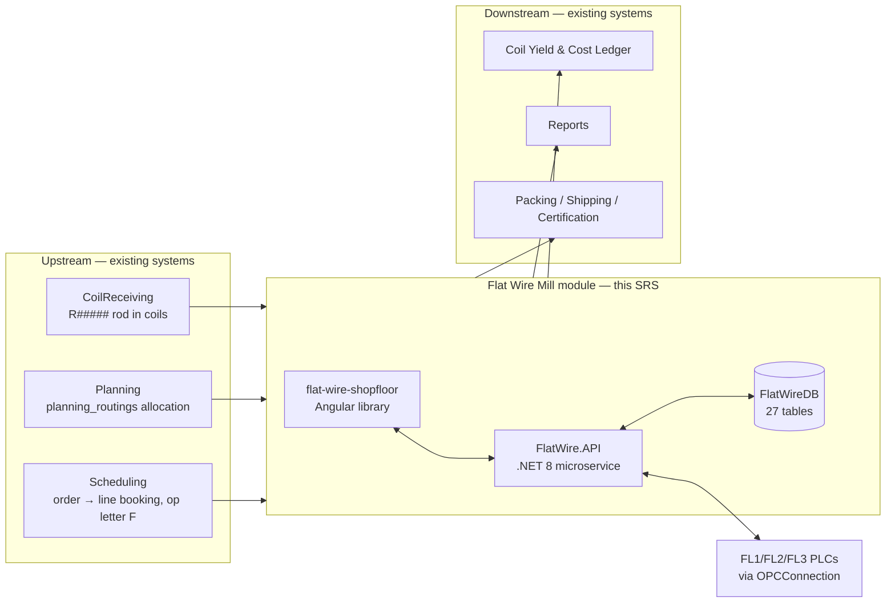
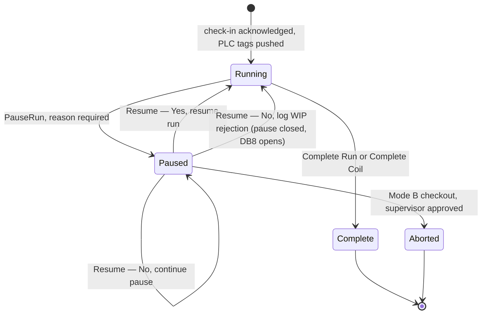
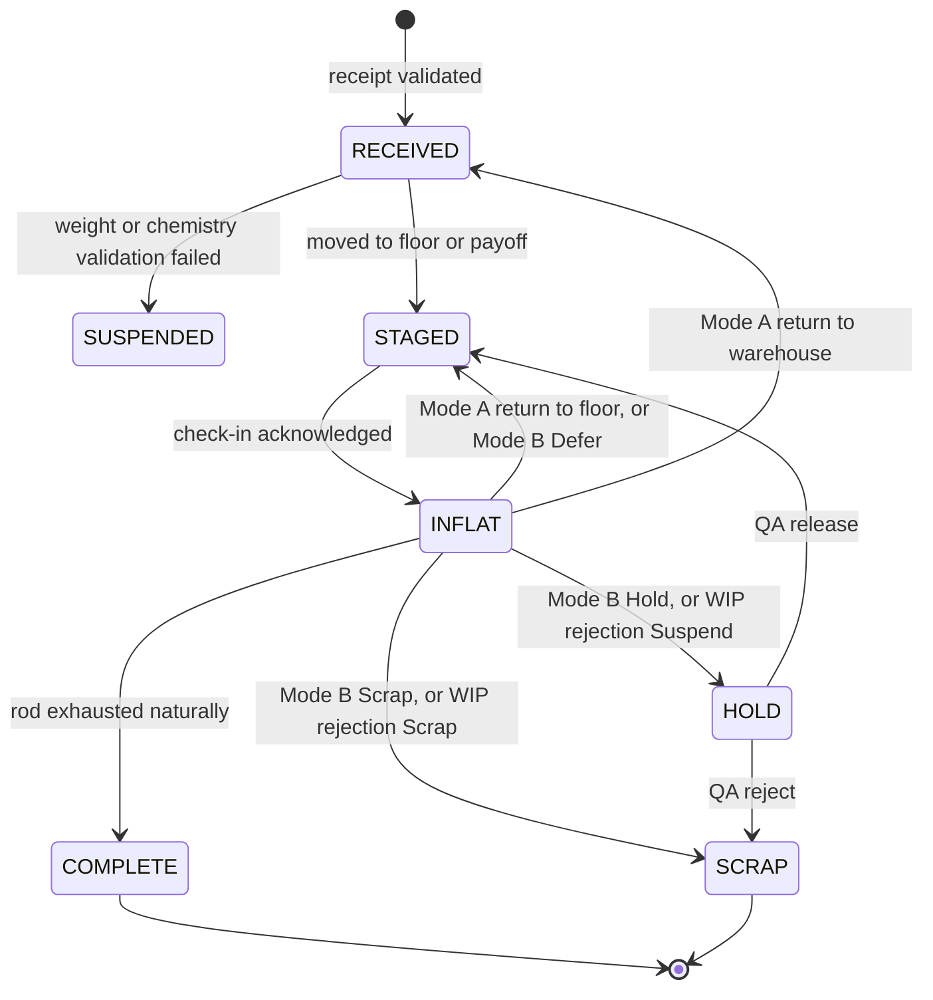
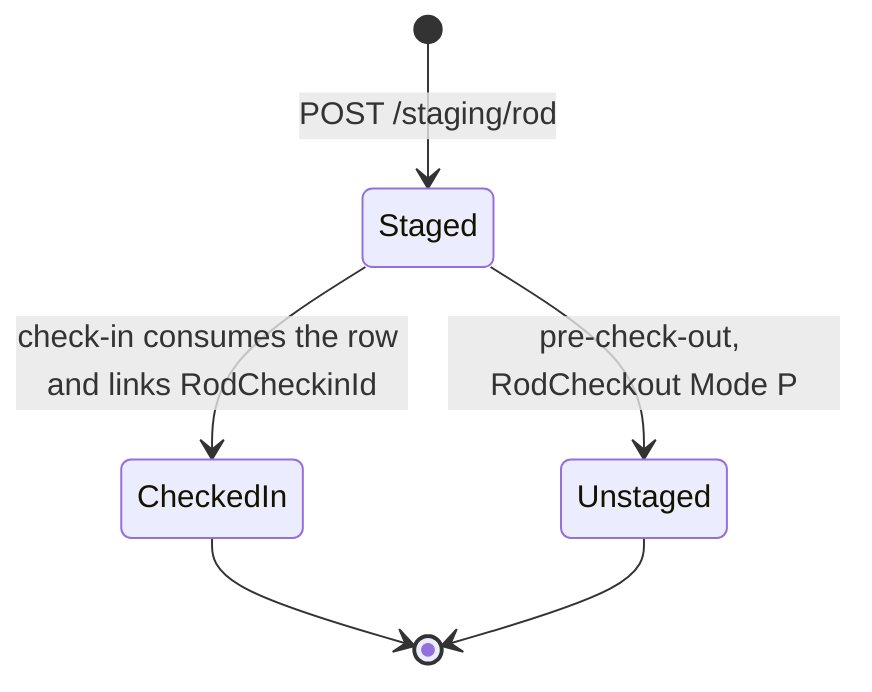
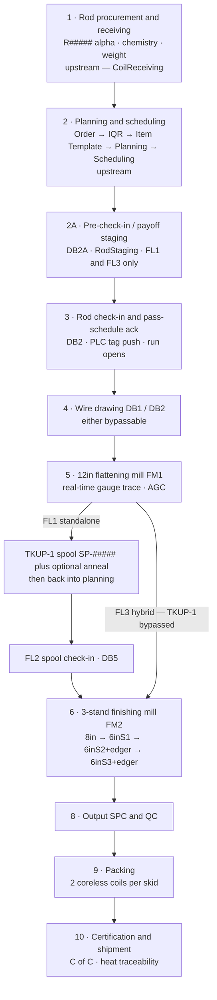
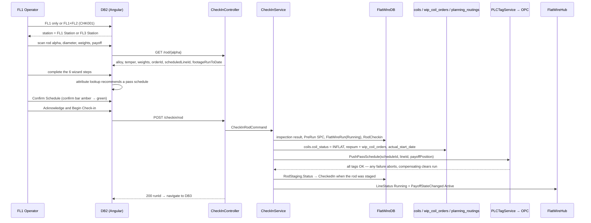
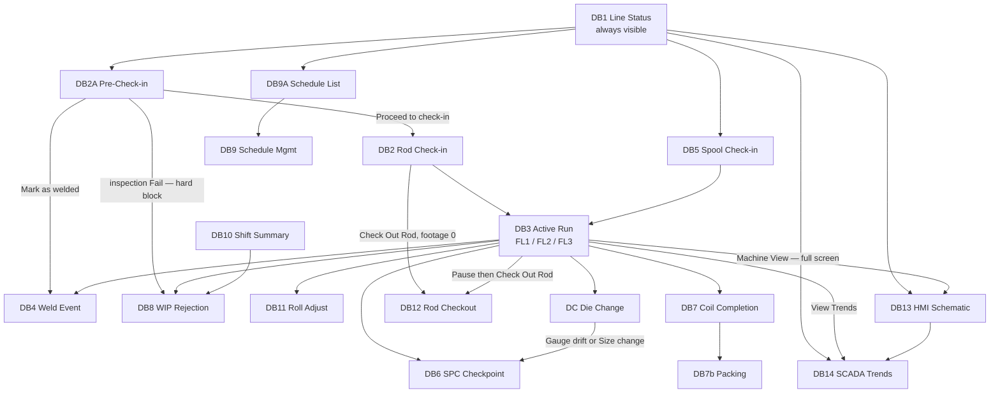

# Flat Wire Mill — Software Requirements Specification

**Project:** United Aluminum (UAL) — Flat Wire Mill Module
**Last Updated:** July 30, 2026
**Document Type:** Software Requirements Specification (non-functional requirements folded in — see §6)
**Status:** Baselined for build — open requirements issues in §11
**Owner:** BA / Analysis stream
**Audience:** Developers (Angular, .NET, SQL), QA, BA, architects
**Sources:** [`../FlatWire_MasterSpecification.md`](../FlatWire_MasterSpecification.md) §2, §3, §4, §7, §8.5 · [`Shopfloor_Flat_wireSRS_Consolidated_v3.docx`](../../SRS/Shopfloor_Flat_wireSRS_Consolidated_v3.docx) · [`../../Analysis/`](../../Analysis/) · [`../../Mockups/`](../../Mockups/) · [`../../DevelopmentPlan/ShopfloorPlan/00-foundations.md`](../../DevelopmentPlan/ShopfloorPlan/00-foundations.md)

**Companion documents:** `[VS]` [01-VisionAndScope.md](./01-VisionAndScope.md) · `[HLD]` [03-HLD-and-ERDiagram.md](./03-HLD-and-ERDiagram.md) · `[API]` [04-APIContract.md](./04-APIContract.md) · `[SP]` [05-SprintPlanAndBacklog.md](./05-SprintPlanAndBacklog.md) · `[TP]` [06-TestPlanAndTestCases.md](./06-TestPlanAndTestCases.md) · `[DR]` [07-DeploymentRunbookAndRollback.md](./07-DeploymentRunbookAndRollback.md)

---

## 1. Introduction

### 1.1 Purpose

This document specifies what the **Flat Wire Mill module** must do. It is the reference a developer builds from and a tester writes cases against. It carries **363 numbered functional requirements (`FR-001` … `FR-508`)**, every one traceable to a source requirement ID in the delivered SRS, an analysis note, or an approved mockup.

Requirement numbers are **carried forward unchanged** from [`../FlatWire_MasterSpecification.md`](../FlatWire_MasterSpecification.md) §4. Nothing has been renumbered, merged or dropped.

### 1.2 Scope

The shopfloor and dashboard layer for three new Flattening Lines (FL1, FL2, FL3) inside the existing UAL Manufacturing Execution System. In-scope and out-of-scope areas, with the interface consumed from each upstream system, are in `[VS §6]` and `[VS §7]`.

### 1.3 Definitions, acronyms and abbreviations

Full glossary in §3.6. The terms that most often cause misreadings:

| Term | Meaning |
|---|---|
| **Alpha** | The unique identifier assigned to a unit of material or an event — the handle every certificate, quality record and disposition ties back to |
| **Bundle width** | The **oscillation width** of the wound coil. **Distinct from the flat wire's own width** |
| **Pass schedule** | The configuration record that decides how the machine is set. Acknowledging it at check-in is what pushes PLC tags |
| **Flat wire** | The product. **Never called "strip"** — see §1.6 |

### 1.4 References

| Reference | Role |
|---|---|
| [`../FlatWire_MasterSpecification.md`](../FlatWire_MasterSpecification.md) | The reconciled source this SRS re-cuts. Authoritative where two older artifacts disagree |
| [`../../DevelopmentPlan/Schema/SQL/`](../../DevelopmentPlan/Schema/SQL/) | Authoritative for column-level types, nullability and constraints |
| [`../../Mockups/`](../../Mockups/) | Authoritative for pixel-level layout and screen behaviour |
| [`../../DevelopmentPlan/REVIEW.md`](../../DevelopmentPlan/REVIEW.md) | Catalogue of known contradictions between older documents |
| [`../../Analysis/FlatWireOpenQuestions.md`](../../Analysis/FlatWireOpenQuestions.md) | The open-questions register (`OQ-##`) |

### 1.5 Document conventions and ID schemes

| Scheme | Meaning | Owner |
|---|---|---|
| `FR-###` | A functional requirement in this document | This SRS (§5) |
| `[NFR]` | Marks a non-functional constraint stated **inline** in the functional group it constrains | §6 register |
| `OL`, `PCI`, `CHK`, `WLD`, `TRV`, `ORD`, `PSM`, `GWT`, `SPC`, `ALT`, `STP`, `WBK`, `PR`, `FRT`, `DAT`, `WRJ`, `PKG`, `RCO`, `PRC`, `LST`, `ARM`, `PSL`, `SHS`, `RAJ`, `DCH`, `DMG`, `HMI`, `SCD`, `OEE`, `PRN`, `DM`, `INT`, `NFR` | Source requirement IDs from the delivered SRS | `SRS/…_v3.docx` |
| `OQ-##` | Open question | `Analysis/FlatWireOpenQuestions.md` |
| `OI-##` | Open issue blocking a build | Master spec §11, carried to §11 here |
| `G#` | Gap register entry | `ShopfloorPlan/back-matter.md` |
| `FW-###` | Backlog story | `[SP §7]` |
| `TC-###` | Test case | `[TP §5]` |
| `DB1`…`DB14`, `DB2A`, `DB7b`, `DB9A`, `DC`, `DM`, `OEE` | Screen identifiers | §7.1 |

**Priority scheme.** `Must` · `Should` · `Could`.

> **How priority was assigned — read this before treating a priority as authoritative.** The master specification states an explicit priority for exactly two groups: **§5.1 Pre-Check-In is `Should`** (the line remains operable through standard check-in if the station is unavailable) and **§5.5 Part A/B spool alerts are advisory and non-blocking**. For every other group the priority here is **derived** from the priority of the backlog story that delivers it (`Critical`/`High` → `Must`, `Medium` → `Should`, `Low` → `Could`) and is marked *(derived)* in the group heading. Where a single requirement inside a `Must` group is itself optional, it is marked at the row.

### 1.6 Terminology rules — binding

- The product is **flat wire**. The word "strip" is not used anywhere in this system — not on screens, labels, reports, column headings or code comments. *(One DDL comment on `Stand.MinWidthIn` uses it; that is a source slip, corrected in `[HLD §6]`.)*
- The traveler is **fully digital**. Coil, spool and skid **labels still print**.
- Welding is **induction only**.
- Rod alphas are `R#####`, **not** `ROD-#####`. Spool alphas are `SP-#####`.

---

## 2. Overall description

### 2.1 Product perspective

The module is a new capability inside the existing UAL MES. It does not replace planning, scheduling, receiving, yield, cost or reporting; it produces the shopfloor transactions those systems consume and consumes the material and job records they produce.

### 2.2 Product functions

| # | Function | Requirements |
|---|---|---|
| F1 | Stage the next rod at an idle payoff bay while the current rod runs | §5.1 |
| F2 | Check a rod or spool in, acknowledge a pass schedule, and configure the line | §5.2, §5.3 |
| F3 | Monitor the run live — gauge, width, speed, footage, payoff weight, component state | §5.4 |
| F4 | Alert on spool progress and confirm a machine stop was for spool removal | §5.5 |
| F5 | Record the in-run events — weld, SPC, roll adjust, die change, pause, wire break | §5.6 – §5.13 |
| F6 | Handle exceptions — WIP rejection and the three rod-checkout modes | §5.14, §5.15 |
| F7 | Complete, label, trace and pack the output coil | §5.16, §5.17 |
| F8 | Author, generate, activate and audit pass schedules | §5.18, §5.19 |
| F9 | Present floor-wide, HMI, SCADA, shift and OEE views | §5.20 – §5.24 |

### 2.3 User classes and characteristics

Six roles — Operator, Supervisor, Operations Manager, Engineering/Maintenance, QA, Admin. Characteristics and needs in `[VS §5]`; the full permission matrix in §8.

### 2.4 Operating environment

| Dimension | Value |
|---|---|
| Client | Touch panel at the machine, **1280 × 1024**, gloved operation, no physical keyboard; Angular PWA in a modern Chromium browser |
| Also used on | Supervisor desktop (Line Status, Shift Summary, pending dispositions), Maintenance desktop (Die Management), Operations desktop (Pass Schedule) |
| Server | IIS; `FlatWire.API` on .NET 8 with the **WebSockets feature enabled** |
| Database | SQL Server — new standalone `FlatWireDB`, plus cross-database reads/writes to the shared schema |
| Equipment | New FL1/FL2/FL3 PLCs; **unchanged** OPC servers, reached through the existing `OPCConnection` service |
| Network | Shopfloor wireless with known drop-outs — see `FR-119` and `[NFR006]` |

### 2.5 Design and implementation constraints

Stay within the existing UAL stack: Angular 18.2+, .NET 8, SQL Server, SignalR, Chart.js, JWT, Serilog. No new frameworks, no separate mobile app, no message broker in Phase 1. Full constraint table and rationale in `[HLD §12]`.

Two constraints that change the shape of the code rather than the choice of library:

1. **Check-in is not one ACID transaction.** It spans `FlatWireDB`, the shared schema and the PLC. Order of writes is mandatory — records first, PLC second — and recovery is by **compensating writes**. `[HLD §10]`.
2. **PLC tag paths are configuration**, never hardcoded, so they can be corrected after commissioning without redeployment (`FR-022`).

### 2.6 Assumptions and dependencies

| Assumption / dependency | Consequence if false |
|---|---|
| A rod exists in `coils` with a `planning_routings` allocation before it reaches the line | Staging and check-in refuse it; the line has no material |
| An `Active` pass schedule exists for the alloy + line + target combination | Check-in has no schedule to acknowledge; the no-match path is **undefined** (OI-46) |
| The six roles exist as JWT claims in `Login` | Authorisation blocks the build (OI-37) |
| PLC tag paths are confirmed at commissioning | Simulated push covers development; go-live is gated |

---

## 3. Domain model and glossary

### 3.1 The three lines

See `[VS §3.2]` for the full comparison. The facts most often got wrong, restated because they are load-bearing for requirements:

- **FL1 has no edger.** No edge-set field appears on any FL1 screen, and the FL1 HMI route variant must not render an Edge Set node.
- **FM2 has three 6″ stands (S1, S2, S3); edgers sit at S2 and S3 only.**
- **FL2 standalone broadcasts `null` live gauge and width.** Its trace is a historical profile served by a REST query, not a live stream.
- **FL3 is FL1 feeding FL2 continuously**, with no intermediate stop, no spool alpha, no intermediate anneal and no FL2 check-in step.

> **⚠️ UNRESOLVED — which FM2 stand is non-bypassable.** SRS §2.7 says **6″ S3**; the DDL comment, the API validation rules and `HMI008` all say **`FM2_6inS2`**. Build the constraint against `FM2_6inS3` (the later, equipment-corrected source) and keep `FM2_6inS2` bypassable, but do not delete the `FM2_6inS2` validation until the business confirms. **OI-04.**

### 3.2 Equipment inventory

In `[VS §3.3]`. Component vocabulary used throughout the requirements and the schema:

`DB1` · `DB2` · `FM1` · `EdgeSet` · `FM2_8in` · `FM2_6inS1` · `FM2_6inS2` · `FM2_6inS3`

`FM2_8in` is retained for pre-May-21 schedules. `EdgeSet` remains a valid component name but is **FL1-legacy** — FL1 has no edger, so no new FL1 schedule may carry it.

### 3.3 Alpha / identifier formats

| Entity | Format | Example | Generated by |
|---|---|---|---|
| Rod | `R#####` | `R00041` | Rod Receiving, at receipt (range R00001–R99999, **no gaps** per lot) |
| Intermediate spool | `SP-#####` | `SP-00021` | FL1 at spool completion |
| Run | `RUN-####` | `RUN-0042` | On check-in — one per check-in event |
| Pass schedule | `PS-{alloy}-{line}-{seq}` | `PS-1100-FL1-003` | Operations, at creation — natural primary key |
| Weld event | `WLD-###` | `WLD-002` | On weld confirm |
| Roll override | `OVR-####` | `OVR-0042` | On Apply in Roll Adjust |
| Die change | `DC-####` | `DC-0041` | On die-change confirm |
| SPC checkpoint | `SPC-####` | `SPC-0041` | On checkpoint submit |
| WIP rejection | `REJ-####` | `REJ-0041` | On rejection submit *(two formats circulate — OI-21)* |
| Rod checkout | `CO-####` | `CO-0041` | On checkout confirm |
| Output coil | `FW-#####-C##` | `FW-00421-C01` | At coil completion |
| Output coil, mid-run child | `FW-#####-C##-A` | `FW-00421-C01-A` | On a product-spec change mid-run |
| Skid | `SK-#####` | `SK-00201` | On first coil placed — 2 coils per skid |
| Die tooling | `D-{size×1000}-{seq}` | `D-310-034` | Die Management, at registration |
| MMS ID | *(no format defined)* | — | At check-in, per input coil — **OI-03** |
| Scrap box | `SB-{alloy}-{nn}` | `SB-1100-04` | External (slitter scrap-box source) — **OI-15** |

> **Open — spool numbering.** The schema says `SP-#####`; the delivered SRS narrative says `TS######` (TS000001–TS999999). One canonical format must be chosen across schema, label template and UI. **OI-02.**

### 3.4 Status vocabularies

**Material status** — applies to `Rod.Status`, `Spool.Status`, `CoilOutput.Status`, `RodCheckout.NewRodStatus` and the shared `coils.coil_status`:

`RECEIVED` · `STAGED` · `INFLAT` · `COMPLETE` · `HOLD` · `SCRAP` · `SUSPENDED` *(receiving only)*

**Run status** — `FlatWireRun.Status`: `Running` · `Paused` · `Complete` · `Aborted`
**Pass schedule status** — `PassSchedule.Status`: `Draft` · `Active` · `Inactive`
**Line state** — DB1 / DB13 / PLC display: `RUNNING` · `IDLE` · `SETUP` · `OFFLINE` · `FAULT` · `PAUSED`
**Staging status** — `RodStaging.Status`: `Staged` · `CheckedIn` · `Unstaged`
**Component state** — `PassScheduleComponent.State`: `Active` · `Bypass` · `Skip` — **a three-value enum, never a boolean.** A boolean cannot express Bypass (present in-line, material passes through unprocessed) versus Skip (not part of this schedule at all).
**Edge type** — domain values `Round` · `Square`; operator-facing labels **"Round Edge" / "Flat Edge"**, mapped by a display pipe.

> **`Blocked` is a derived bay state, not a stored status** — `Status='Staged'` **and** any inspection column `= 'Fail'`. Adding a fourth `Status` value would fall outside the `UX_RodStaging_Bay` filtered index and free a bay that is still physically occupied.
>
> **⚠️ UNRESOLVED — a second spool vocabulary.** `ACTIVE` / `IN-PLAN` / `IN-USE` / `COMPLETED` appears in the planning narrative and is unreconciled with the material statuses above. **OI-06**, and the full transition set is **OI-55**.
>
> **`Bevel edge`** is offered by the Dashboard 9/9A Generate modal and has **no domain value** — a fourth edge-type vocabulary. **OI-05.**

### 3.5 State machines

**Run status:**

`FlatWireRun.PausedAt` holds the current active pause start and is NULL when not paused. An open pause is a `RunPauseEvent` with `ResumedAt IS NULL`.

**Rod material status:**

> **Open (Critical).** Whether pre-check-in itself sets `coils.coil_status = INFLAT` or leaves it `STAGED` is **OI-01**. The interim design follows the delivered SRS and treats `RodStaging.Status` (bay occupancy) as orthogonal to `coils.coil_status`, which makes rod status `STAGED` effectively vestigial for FL1.

**Staging:**

**Spool:** `RECEIVED → STAGED → INFLAT → COMPLETE`, plus `HOLD` and `SCRAP`. An intermediate anneal **modifies the existing alpha** — no child alpha. Re-passing a spool through FL1 is not possible.

**Output coil:** `COMPLETE` · `HOLD` · `SCRAP`, with the transient **SPC-HOLD** quality flag layered on top — it blocks advancement, shipping and release until QA lifts it, but the machine keeps producing. *(SPC-HOLD has no column of its own — **OI-23**.)*

### 3.6 Glossary

| Term | Definition |
|---|---|
| **AGC** | Automatic Gauge Control — inline closed-loop feedback holding target thickness during rolling. Set at run start, runs without operator intervention. Both FM1 and FM2 have it |
| **Alpha** | The unique identifier assigned to a unit of material or an event |
| **Bundle width** | The oscillation width of the wound coil — a Min/Max range per order. Distinct from the flat wire's own width |
| **Coreless oscillated coil** | The finished product: flat wire wound with no core mandrel; the collapsible spool ejects the coil |
| **CPK** | Process capability index, computed per production run excluding unstable start and end regions |
| **Dancer** | Tension-management roller. Tension is derived from speed, never entered manually |
| **DB1 / DB2** | Draw box 1 / 2 — the wire drawing die blocks |
| **Digital traveler** | The screen-based work instruction that adapts to the active station. Never printed for flat wire |
| **Edger** | Edge-conditioning tooling. On FM2 stands S2 and S3 only |
| **FM1 / FM2** | The 12″ flattening mill (FL1) / the 3-stand 6″ finishing mill (FL2) |
| **Footage counter** | The PLC-sourced cumulative feet produced on a run. The clock every mid-run event is stamped against |
| **ITInhibit** | A system-controlled PLC tag that blocks machine run when prerequisites are unmet. Set and cleared **only** by the system, never by an operator |
| **MMS ID** | Material-management identifier generated per input coil at check-in; activated when a welded coil becomes active; closed **strictly on material consumption** |
| **Pass schedule** | The central configuration record — components active/bypassed, die sizes, roll clearances, edge configuration, gauge/width targets, speed range, route mode |
| **Payoff / VPS** | The dual-position feed reel holding rod bundles eye-to-sky. 9,000 lb per position |
| **Route mode** | `Standalone` (single-line) or `Hybrid` (FL1 feeding FL2 continuously = FL3) |
| **Scrap box** | Alloy-based container for rod and in-process scrap; selection follows the same carry-forward logic as slitters |
| **Skid** | Packaging unit carrying exactly two finished coreless coils |
| **SPC-HOLD** | The state applied to output material when a checkpoint is submitted out of spec. Blocks advancement, shipping and release until QA lifts it — but does **not** stop the machine |
| **Spool (intermediate)** | Reusable collapsible metal spool holding FL1 output; routed to anneal then FL2 |
| **Thread mode** | Running the line slowly to verify a new die is seated and on-target, permitted while a post-die-change SPC checkpoint is outstanding |
| **TKUP-1 / TKUP-2 / TPO** | Traversing take-up 1 (FL1 output) / take-up 2 (finished coil) / traversing payoff (FL2 input) |
| **Traveler Queue** | The pre-checked-in / welded / available rod list for the current order at a line |

---

## 4. Process flows

### 4.1 The eleven stages

Stage 7 (weld events) and stage 11 (scrap disposition) are **not sequential** — a weld can occur any time during stages 4–6, and scrap arises at any stage. Stages 1 and 2 are upstream; stage 2A onward is this module.

### 4.2 Before the line — material and job exist

| # | Step | Where | Record |
|---|---|---|---|
| 1 | PO raised with a 3-D specification (gauge × diameter × length/weight) | MPS | PO |
| 2 | Rod arrives as bundled coils. Operator enters the PO number; alloy, diameter and weight pull from it. Operator enters **gross (scale)** and **net** weight | Coil Receiving | — |
| 3 | System validates scale weight against vendor gross weight within tolerance and validates that chemistry documentation is present. **Either failing suspends the material** | Coil Receiving | `coils` row `SUSPENDED` |
| 4 | On success, alpha `R#####` assigned (no gaps, per lot). `coils` entry created: gauge populated; **width, OD, ID and surface finish blank** — rods have no width. Inventory type **TBD (OI-49)** | Coil Receiving | `coils` row `RECEIVED` |
| 5 | Sales creates the order with the **Flat Wire** checkbox: bundle width Min/Max, edge type, alloy, temper, gauge. IQR links order to item template; the template defines the route | Web | Order |
| 6 | Planner filters `Flatwire`, selects rod material, enters **weight only**. The system computes the number of stops and **generates all alphas at planning time**, including a remainder alpha. "Number of Cuts"/"Number of Stops" are not used for flat wire | Planning | `planning_routings` allocation |
| 7 | Scheduling books the job on **FL1**, **FL2** or **FL3** — three separate machine bookings. Operation letter **`F`**. FL3 cannot be booked if FL1 or FL2 have scheduled orders | Scheduling | order → line booking |
| 8 | **A pass schedule must already exist and be `Active`** for the alloy + line + target gauge × width + route. Authored manually by Operations; never auto-generated | DB9 / DB9A | `PassSchedule` + `PassScheduleComponent` |

### 4.3 Pre-check-in — staging the next rod (FL1 / FL3 only)

Register the *next* rod against the idle VPS bay while the current rod is still running, so the line can run continuously through an induction weld. **Priority `Should`** — scanning an unstaged rod straight into check-in remains valid and is the normal cold-start path.

1. The rod bundle is moved to the free VPS bay. **Bundles are not unbanded until positioned at the payoff** — a safety and bundle-integrity rule, and the reason visual inspection happens here rather than at check-in.
2. The operator runs the 3-step wizard on DB2A: identify rod → assign bay → visual inspection.
3. The scan **resolves the order** from `planning_routings`. On a cold line this is what reveals which order the line is starting. A rod with no allocation is refused.
4. Two deviations are **notified and supervisor-authorised, never refused**: *off-schedule* (the order is booked on a different line) and *out of sequence* (the rod is not the one planning expects next). One credential block covers both.
5. If the rod has prior footage the wizard **forces the carry-forward path**; the fresh-start control is absent from the DOM, not merely disabled.
6. Any inspection Fail is a **hard block with no bypass** — the only forward action is WIP Rejection.
7. On confirm a `RodStaging` row is written; the shared coil status and WIP queue entry are updated as **compensating writes, not one transaction**; `PayoffStateChanged` is broadcast. **No PLC tags are pushed.**
8. **Mark as Welded** records operator and timestamp and validates alloy/temper/diameter against the running coil. It records the weld; it does **not** switch bays — the payoff transition happens when the running rod reaches 0 ft remaining.

### 4.4 Rod check-in — the gate for everything (FL1 / FL3)

A **6-step guided tab wizard** with progressive unlock: (1) Visual Inspection, (2) Pass Schedule, (3) Pre-run SPC, (4) Die Block DB1/DB2, (5) Rolling Mill FM1, (6) Lube & Safety.

**Order of writes is mandatory: records first, PLC second.** If the PLC write fails there is then an incomplete-push marker to recover from.

**Gate conditions before Acknowledge enables:** rod alpha valid against `coils` · diameter within nominal ± lookup tolerance · all mandatory fields complete · rod available (not checked in elsewhere) · order Open and plan open · **all inspection items Pass** · pre-run SPC diameter entered and in spec · a pass schedule loaded and **explicitly confirmed**.

### 4.5 During the run — the events that can interrupt it

Any number, in any order, all stamped against `RunId` + footage position:

| Event | Screen | Written | Gate / consequence |
|---|---|---|---|
| **Weld** | DB4 | `WeldEvent` (`WLD-###`) | Incoming rod **defaults to the `Staged` rod on the idle bay**; footage auto-read from the encoder; induction only; quality Pass/Fail with a mandatory fail reason. All later footage attributed to the incoming rod. A Fail still logs and links the rods and flags for supervisor review |
| **Die change** | DC | `DieChangeEvent` (`DC-####`) + auto-created `RollOverride` | `Gauge drift` / `Size change` route to SPC; the run stays blocked from full production, **thread mode permitted**. `Die failure` offers a QA hold on a footage range. `Planned life` returns straight to the run. An incoming die not in inventory is rejected at the scan |
| **SPC checkpoint** | DB6 | `SpcCheckpoint` + `SpcMeasurement` | Two exits: *Submit · continue run*, or *Submit · suspend material* (coil to SPC-HOLD; **the machine keeps running**) |
| **Roll adjust** | DB11 | `RollOverride` (`OVR-####`) + an SPC checkpoint of type `RollAdjustTrigger` | **Run-level override — never edits the pass schedule.** Measured gauge + width required, plus a reason chip. PLC tag written immediately. All-zero deltas write nothing |
| **Pause / resume** | shared dialog | `RunPauseEvent` | One reason from a governed taxonomy; footage frozen; PLC to hold/idle; DB1 to `PAUSED` |
| **WIP rejection** | DB8 | `WipRejection` (`REJ-####`) | Group + reason + measured/target + disposition; `AlertRaised` to DB1 |
| **Rod checkout** | DB12 | `RodCheckout` (`CO-####`) | Three modes — §4.6 |
| **Wire break** | prompt | *(no table defined — **OI-13**)* | Break confirmation → OD verification → defect inspection before resuming |
| **Spool weight milestones** | DB3 overlay | audit record per acknowledgement | Advisory 75 / 90 / 100 % ladder; non-blocking |

### 4.6 The three checkout modes

| | **Mode P — pre-check-out** | **Mode A — pre-run** | **Mode B — mid-run** |
|---|---|---|---|
| Rod was checked in? | **No** — only pre-checked-in | Yes | Yes |
| `RunId` | NULL | NULL | populated |
| Footage | 0 | 0 | > 0 |
| Pass-schedule acknowledgement | none to void | voided | voided |
| PLC tags | **none were pushed** | cleared | cleared **after confirmed stop** |
| Line-state gate | **not needed** | yes | yes |
| In-process material | none | none | requires a disposition |
| Approval | Operator *(OI-44 open)* | Operator | **Supervisor** |
| Screen | DB2A | DB12 | DB12, reached **only** via the Pause dialog |
| Resulting rod status | `RECEIVED` or `STAGED` | `STAGED` or `RECEIVED` | `HOLD`, `SCRAP` or `STAGED` |

**Mode B flow:** operator submits with locked footage, reason and rod disposition → the run closes as a partial run → a **PENDING DISPOSITION** record is created with the material **locked and carrying no alpha** → SignalR notifies the Supervisor role → the supervisor reviews the partial-run gauge trace, footage, reason, operator and timestamp from any connected terminal → **Accept** (partial spool alpha generated, enters the spool queue) · **Hold** (alpha generated with Hold status, QC must release) · **Reject** (WIP Rejection flow to scrap). **No alpha exists until the supervisor approves.**

**PLC gatekeeper rule (all modes with tags):** the application reads `FL{n}.LineState` before the dialog opens **and** before a confirm is accepted; if it reports Running the checkout is blocked. The application **never sends a stop command**. The footage counter is read and **locked at the moment the dialog opens**.

### 4.7 Partial-rod re-check-in (carry-forward)

A rod removed mid-run and returned to storage is only partly consumed. The design is **carry-forward on a single persistent rod record**:

- The rod record carries `FootageRunToDate` and `RemainingWeightEstimateLb`, initialised on first check-in and updated on every confirmed checkout.
- Re-check-in **retrieves the existing record by alpha**; it never creates a new one.
- If `FootageRunToDate > 0`, the **fresh-start path is removed from the DOM** and the operator sees the prior-run history with only *Proceed as partial re-check-in* and *Cancel*, plus an explicit physical-identity confirmation.
- A **new, independent run record** opens with its footage counter at zero. Each run segment produces **its own spool alpha**, and every partial spool alpha carries `SourceRodAlpha` back to the originating rod.
- Material drawn or rolled and left in the mill at removal is **scrapped** and does not carry forward.
- **The gate fires at the DB2A staging scan**, not only at check-in — staging is where the rod is first identified.

### 4.8 The route split at FM1 output

**Route A — FL1 standalone (produces WIP, not finished goods):**

1. Flat wire winds onto **TKUP-1** as an intermediate spool.
2. Advisory milestone alerts fire at **75 / 90 / 100 %** of target spool weight — non-blocking, acknowledge-to-arm-next, supersede-in-place.
3. When the operator physically stops the machine at or above target and the PLC confirms a `RUNNING → STOPPED` transition held for a configurable dwell (**default 5 s**), a **modal** asks whether the stop was to remove the completed spool. **Yes** runs the completion transaction and prints labels. **No** records nothing; a manual *Complete spool* path stays available.
4. Per-spool SPC for gauge and width is a **mandatory gate before a spool alpha is issued**.
5. Spool alpha generated, carrying source rod alphas, measured gauge/width, weights and the **stored gauge profile including weld markers**.
6. Spool label printed on a **high-temperature (furnace-compatible)** printer.
7. Optional anneal; the existing alpha carries forward with the anneal recorded as an event against it.
8. Back into planning: a planner allocates spool weight to an order; the remainder receives a child alpha; scheduling books it on FL2.
9. **FL2 spool check-in (DB5)** — operator scans the FL1-printed label, enters measured gauge, width and weights; the screen shows source rods and the **historical FL1 gauge profile with weld markers**; **no visual inspection**; same mandatory pass-schedule confirmation; FM2 tags pushed; the FL2 run opens.

**Route B — FL3 hybrid (finished goods in one pass):** TKUP-1 is bypassed. Material flows continuously from FM1 through the TPO into FM2 — **no intermediate stop, no spool alpha, no spool label, no intermediate anneal and no FL2 check-in step**. The gauge trace stays real-time end to end, and one unified `PS-{alloy}-FL3-{seq}` schedule covers the FL1 and FL2 components together.

### 4.9 FM2 finishing, coil completion, packing, shipment

1. Material passes the FM2 stands in sequence: **8″ roller (bypassable) → 6″ S1 (bypassable) → 6″ S2 + edger → 6″ S3 + edger (final)**.
2. Automatic gauge and width measurement after the final 6″ stand, recorded as an SPC checkpoint.
3. Output winds at **TKUP-2** (1,100 lb equipment maximum; a customer may specify lower).
4. **Coil completion (DB7):** coil alpha issued — mid-run child `…-A` when a product-spec change split the coil. Footage from the counter. **Net weight derived from footage and cross-section**, operator-overridable with a scale reading. **Gauge and width display the *target* value when SPC confirms in tolerance**; the measured value shows only when out of tolerance.
5. **Source traceability** captured: one row per contributing rod with footage-from / footage-to at each weld boundary, plus the spool alpha on the non-hybrid route. Full chain `R00041 → SP-00031 → FW-00421-C01 → SK-00201`.
6. **Final SPC**: gauge and width in-spec badges; out of spec makes *Submit · suspend* the primary path.
7. **Coil label printed** on the Sato standard printer, including **all contributing source rod alphas**. Pass-schedule data is **not** printed on the customer label.
8. **Skid tracking:** exactly two coreless coils per skid. Coil 1 opens the skid; coil 2 closes it, prints the skid label and queues it for packing.
9. **Packing station (DB7b):** physical receipt confirmed, scale weight captured and reconciled, skid closed, labels printed, staging location assigned.
10. **Certification and shipment:** C of C with chemistry, mechanical properties, dimensional data, alloy, temper and traceability to source rod heat. Welding-wire customers additionally require every weld join traceable, and may impose a contractual maximum weld count per coil *(limit TBD — OI-59)*.

### 4.10 Scrap — the parallel path

| Scrap type | Source stage | Disposition |
|---|---|---|
| Wire rod scrap (end crop, entry scrap) | check-in, drawing | scrap box, then baled into a scrap unit |
| In-process flat wire scrap (FL1/FL2) | flattening, finishing | follows existing slit-material scrap procedures |
| Out-of-spec wire bundles | output QC | compacted in the baler *(max dimensions TBD — OI-83)* |
| Edge trim | FM2 edgers | scrap box **or scrap skid** — a new outlet selection required in the Scrap module |
| Material left in the mill at a mid-run rod removal | Mode B checkout | scrapped; does not return with the rod |

---

## 5. Functional requirements

Requirements are numbered `FR-###` and grouped by operator workflow. Each group names its screen, the source requirement IDs it satisfies, the actors, the preconditions, the priority, the field-level validation, the actions, the state changes, the error paths and the real-time events emitted.

**Role vocabulary:** Operator · Supervisor · Operations Manager · Engineering/Maintenance · QA · Admin. Full permission matrix in §8.

**`[NFR]` rows** are non-functional constraints stated **inline in the group they constrain**, so a developer reading check-in sees the audit and latency obligations that apply to check-in. Every one also appears in the §6 register with its measurable target and verification method.

### 5.0 Cross-cutting requirements

**Priority:** `Must` *(derived — these gate every workflow)*

| ID | Requirement | Priority | Source |
|---|---|---|---|
| **FR-001** | The system shall support manual login and logout at a flat-wire station, permitted only for operators who are punched in, capturing operator ID, timestamp and station. | Must | `OL001` |
| **FR-002** | The system shall support automatic shift-based login and logout driven by configured shift schedules, and shall log every auto event. | Must | `OL002` |
| **FR-003** | The system shall require a validated **supervisor override** before an operator who is not punched in may log in manually, recording operator ID, supervisor ID, timestamp and station. | Must | `OL003` |
| **FR-004** | The system shall prompt "Who is running the machine?" at check-in, at each stop and restart, and whenever machine speed becomes greater than zero, and shall prevent operation continuing until an operator is identified against the run. | Must | `OL004` |
| **FR-005** | The system shall make an operator logged in at FL1 selectable at FL2 and vice versa without re-login, tracking operator-to-line association **per run** rather than per login. | Must | `OL005` |
| **FR-006** | The system shall display an order-instructions popup after check-in showing instructions, hold information and observations, consistent with the slitter shopfloor popup. | Must | `ORD001` |
| **FR-007** | The system shall provide the order type **"Flat"** alongside Split, Slit, Anneal and Roll. | Must | `ORD002` |
| **FR-008** | The system shall implement **ITInhibit** as a system-controlled PLC tag that blocks machine run, set and cleared **only** automatically — never by an operator. | Must | `ALT001` |
| **FR-009** | The system shall set ITInhibit when: no coil/rod is checked in; **or** no active MMS ID exists; **or** PLC feet data is unavailable or invalid; **or** two or more consecutive data recordings are missing. | Must | `ALT002`–`ALT005` |
| **FR-010** | While ITInhibit is set the system shall block machine run and related transactions, and shall record no rolling data without an active coil. | Must | `ALT006` |
| **FR-011** | The system shall display progressive material-buildup alerts as remaining output length approaches the planned length: a first alert at **50 %** remaining and then every **10 %** (40, 30, 20, 10 %). | Must | `ALT007` |
| **FR-012** | The system shall alert the operator when remaining feed (feet) for the current coil reaches configurable threshold values. | Must | `ALT008` |
| **FR-013** | The system shall generate a unique **MMS ID per input coil at check-in**, activate it when a welded coil becomes active, automatically close the previous one, and close MMS IDs **strictly on material consumption** (remaining ft = 0) — **never on operator action**. An output spool may reference multiple MMS IDs. | Must | `FRT005`–`FRT009` |
| **FR-014** | The system shall track remaining material length in real time for the active input coil **and** the next welded (queued) coil, sourcing feet consumption from the PLC where available. | Must | `FRT001`, `FRT002`, `FRT004` |
| **FR-015** | The system shall calculate output weight during rolling from **recorded length, gauge and width** — never from a weigh scale — and shall calculate net weight as `Gross − Tare` with tail loss accounted for. | Must | `FRT010`, `FRT011` |
| **FR-016** | The system shall provide **two independent data-collection application instances** (one per line), use both simultaneously in FL3 hybrid mode, and support FL1 and FL2 running independent jobs concurrently. | Must | `DAT001`, `TRV008` |
| **FR-017** | The system shall start data recording automatically when mill speed exceeds zero, with no manual start action. | Must | `DAT002`, `INT006` |
| **FR-018** | The system shall make the data-recording frequency **configurable by Engineering/IT without a code change**, defaulting to **4 ft per data point for finished product and 20 ft for intermediate product**. Applied rule: a subsequent rolling operation exists → 20 ft; none → 4 ft; **FL2 always 4 ft**; **FL3 hybrid — both FL1 and FL2 at 4 ft**. | Must | `DAT003`–`DAT005`, **`NFR003`**, **`NFR004`** |
| **[NFR]** | **`NFR003` / `NFR004` — recording cadence.** The 4 ft / 20 ft rule above is the measurable non-functional target and is **configuration, not a constant**. Verification: `[TP]` cadence suite. | Must | `NFR003`, `NFR004` |
| **FR-019** | The system shall capture gauge and width **simultaneously at every recording point**, so both traces derive from the same samples. | Must | `DAT006`, `DAT007`, `GWT004` |
| **FR-020** | When two or more consecutive data-recording entries are missing, the system shall display a prominent data-recording alert **and activate ITInhibit**. | Must | `DAT009` |
| **FR-021** | The system shall open the "Reason for Flatwire Stop" popup when the OPC mill-speed tag reads zero. | Must | `INT006`, `STP001` |
| **FR-022** | The system shall source **all OPC tag paths from configuration** (`appsettings.json`), never hardcoded, so paths can be corrected after commissioning without redeployment. | Must | `INT005` |

---

### 5.1 Pre-Check-In Station — Dashboard 2A

**Screen:** [`dashboard_2a_rod_precheckin.html`](../../Mockups/dashboard_2a_rod_precheckin.html)
**Source IDs:** `PCI001`–`PCI008`, `WLD003`/`WLD005`/`WLD006`/`WLD010`, `TRV004`/`TRV009`, `PRC007`/`PRC008`/`PRC011`/`PRC014`
**Actors:** FL1 / FL3 operator (primary); Supervisor (override authorisation)
**Preconditions:** the line is FL1 or FL3; the rod exists in `coils`; planning has allocated the rod to an order in `planning_routings`
**Priority:** **`Should`** — *stated explicitly in the source.* The line remains operable through standard check-in if this station is unavailable.

| ID | Requirement | Priority | Source |
|---|---|---|---|
| **FR-030** | The system shall provide a dedicated Pre-Check-In station for FL1 and shall support pre-check-in of the next rod **while the current coil is still running**. | Should | `PCI001`, `PCI003` |
| **FR-031** | The system shall **not** support pre-check-in on FL2 — a `lineId` of `FL2` is rejected. FL2 is check-in only. | Should | `PCI002` |
| **FR-032** | The system shall present **both payoff bays as peers**, each capable of all four states, with one state machine and one renderer. Payoff 1 is empty at cold start, after a checkout, once its rod is consumed and between orders; Payoff 2 becomes the running bay after every payoff transition. | Should | Analysis |
| **FR-033** | Bay states shall be: `NOT STAGED` (empty; action: pre-check-in rod) · `PRE-CHECKED-IN` (staged, inspection passed, not checked in; actions: pre-check-out, proceed to check-in, mark as welded) · `ACTIVE` (checked in, rod `INFLAT`, run open; actions: open active run, check out rod) · `BLOCKED` (inspection failed at staging; **only** action: go to WIP Rejection). | Should | Analysis |
| **FR-034** | The payoff weight bar shall be coloured by **absolute pounds**, not percent bands, so the visual cue does not lag the alert: warning below **3,000 lb** ("prepare weld"), critical when **Payoff 2 is not staged and Payoff 1 is below 2,000 lb**. Bar *length* still shows percent remaining. | Should | Analysis |
| **FR-035** | The Traveler Queue shall list pre-checked-in, welded and available rod **for the current order**, each row carrying serial number, payoff position, diameter, gross weight and current status, plus `footageRunToDate` so a partial rod is visible **before** it is staged. | Should | `TRV004`, `TRV009` |
| **FR-036** | The queue shall carry **two sequence columns** — `Plan` (planning's intended order, with a green marker on the rod expected next) and `Run` (the actual staging order, blank until processed, with a deviation marker where the two differ). Alloy and Temper are **not** repeated per row; they are stated once in the order context header. | Should | Analysis |
| **FR-037** | The queue header shall state the order once: line, order number, the order's material spec, and progress (`n staged · n available · n on order`). `staged` counts every rod physically occupying a bay — pre-checked-in, welded and blocked alike. | Should | Analysis |
| **FR-038** | On a **cold line** (`activeOrderId` null) the queue shall be empty and the order header shall read `—`; the station must not display an order it has not started. The first rod scanned **reveals** the order from `planning_routings`. | Should | Analysis |
| **FR-039** | The pre-check-in wizard shall have three steps: (1) Identify rod — alpha (scan or type), measured diameter, optional scrap box, with alloy/temper/weights pre-populating; (2) Assign bay — Payoff 1 / Payoff 2 selector cards, an occupied bay disabled and labelled with its occupant; (3) Visual inspection — oxidation, surface defects, water stains, Pass/Fail each, plus an observation field. | Should | `PCI004`–`PCI006` |
| **FR-040** | The inspection shall carry **exactly three items**. The connector-tag item is a check-in concern and must not be added here. | Should | Analysis, G14 |
| **FR-041** | Any inspection `Fail` shall be a **hard block with no bypass**; the only forward action is WIP Rejection. | Must | `CHK010` |
| **FR-042** | The rod alpha shall be validated against the `R#####` series in `coils`, the measured diameter against nominal ± a lookup tolerance, and a rod already checked in elsewhere shall be rejected. | Must | `CHK006`, `CHK007`, `CHK009` |
| **FR-043** | Where `footageRunToDate > 0`, the wizard shall show footage already run, remaining weight estimate, last run reference and prior spool alphas, and shall offer **only** *Proceed as partial re-check-in* plus an explicit physical-identity confirmation. **The fresh-start control shall not exist in the DOM.** | Must | `PRC007`, `PRC008`, `PRC011`, `PRC014` |
| **FR-044** | Staging shall **refuse** a rod with no `planning_routings` allocation, a rod that is not available (`coils.coil_status` in `INFLAT`/`COMPLETE`/`HOLD`/`SCRAP`, or already staged elsewhere), and a rod belonging to a **different order** once an order is established (welding across orders would break coil genealogy). | Must | Analysis |
| **FR-045** | Staging shall **notify and require supervisor authorisation — never refuse** — for two deviations: **off-schedule** (the resolved order is booked on a different line) and **out of sequence** (the rod is not the one planning expects next, defined as the lowest planned sequence still available). | Must | OQ-74 |
| **FR-046** | Both authorisations shall use one credential block — variance/deviation reason + supervisor badge/ID + **PIN** — and one sign-off covers both when they co-occur. **The PIN shall never be stored or carried in the payload.** A remote-approval fallback shall be offered when no supervisor is on the floor. | Must | OQ-74 |
| **FR-047** | The override flag, the authorising supervisor, the timestamp and the reason shall be persisted on the staging record, and the bay card shall keep showing the authorisation for as long as the rod is there. | Must | OQ-74 |
| **FR-048** | On confirm the system shall write a `RodStaging` row with `Status='Staged'`, assign `RodSeqno` **server-side** (never client-supplied), snapshot `PlannedSeqno` from the allocation, update the shared coil status and WIP queue entry as **compensating writes**, and broadcast `PayoffStateChanged`. | Must | OQ-70, Analysis |
| **FR-049** | **No PLC write shall occur at pre-check-in.** Component flags, die sizes, roll gaps and gauge/width targets are pushed only on pass-schedule acknowledgement at check-in. | Must | Analysis |
| **FR-050** | **Mark as Welded** shall be enabled only when a rod is pre-checked-in on the idle bay **and** a rod is running on the other bay; it shall validate alloy, temper and diameter against the running coil and record operator + timestamp. | Should | `WLD003`, `WLD006`, `WLD010` |
| **FR-051** | Mark as Welded shall record the weld only — it shall **not** switch bays. The payoff transition is driven **solely by material consumption reaching 0 ft remaining**. | Must | `WLD005` |
| **FR-052** | **Pre-check-out** shall release a staged rod that was never checked in: reason (Wrong rod / mis-scan · Order cancelled or deferred · Failed re-inspection · Relocated to different line · Other with free text) and disposition (Return to floor storage · Return to warehouse), plus optional notes. | Should | Analysis *(no source ID exists — OI-44)* |
| **FR-053** | Pre-check-out shall set `RodStaging.Status='Unstaged'` with the un-stage audit stamp, write a `RodCheckout` row with `Mode='ModeP'`, `RunId` NULL, footage 0 and `PlcTagsCleared` false, **reverse** the WIP queue entry created at staging, and broadcast `PayoffStateChanged{state:"NotStaged"}`. It requires **no line-state gate**. | Should | Analysis |
| **FR-054** | Un-staging the last rod on an idle line shall **clear the established order** and return the station to cold start. | Should | Analysis |

**Error paths:** bay already occupied → `409` (from the filtered unique index, not a read-then-write race) · rod already staged on another bay → `409` · rod already checked in → `409` · `lineId = FL2` → `422` · any inspection Fail → `422` with `{route:"wipRejection"}` · prior footage without carry-forward acknowledgement → `422` · diameter outside tolerance → `422` · rod alpha not found → `404`.

**Real-time:** emits `PayoffStateChanged` (unbatched, immediate). Consumes `PayoffWeight` for live bay weight.

**Open:** `Blocked` is currently unreachable in practice — a failed inspection routes straight to WIP Rejection, so the staging row is never committed (**OI-70**). Whether pre-check-out needs supervisor approval is **OI-44**. Whether a rod may be pre-checked-in against a *future* order is **OI-71**.

---

### 5.2 Rod Check-In — Dashboard 2 (FL1 / FL3)

**Screen (approved):** [`dashboard_2_rod_checkin - New.html`](../../Mockups/dashboard_2_rod_checkin%20-%20New.html) — a guided 6-step tab wizard.
**FL3 variant:** [`dashboard_2_rod_checkin_fl3.html`](../../Mockups/dashboard_2_rod_checkin_fl3.html) *(still on the older single-page layout; a wizard-shaped FL3 variant is outstanding — **OI-16**)*.
**Source IDs:** `CHK001`–`CHK019`, `PSM015`–`PSM019`, `SPC003`, `INT001`–`INT004`
**Actors:** FL1 / FL3 operator; Supervisor (deviation override)
**Preconditions:** rod `STAGED` (or scanned directly); an `Active` pass schedule exists for the attribute combination; the job is scheduled; the real-time backbone is up
**Priority:** **`Must`** *(derived — FW-061 is Critical)*

| ID | Requirement | Priority | Source |
|---|---|---|---|
| **FR-060** | On clicking Check-In at FL1 the system shall display a popup asking *"Are you running FL1 only or with FL2?"* with buttons **"FL1 Only"** and **"FL1 and FL2 Together"**. | Must | `CHK001` |
| **FR-061** | The station name shall be set to **"FL1 Station"** for FL1 Only and **"FL3 Station" (Hybrid FL1 + FL2)** for FL1 and FL2 Together. | Must | `CHK002` |
| **FR-062** | Clicking Check-In at FL2 shall open the check-in popup directly with no FL1/FL2 selection. | Must | `CHK003` |
| **FR-063** | Rod/Flat Wire Number and Rod Diameter/Flat Wire Width shall be **mandatory**. Scrap Box shall be optional. | Must | `CHK004`, `CHK005` |
| **FR-064** | The rod number shall be validated against `coils`; invalid or non-existent rod numbers are rejected. | Must | `CHK006` |
| **FR-065** | The measured rod diameter shall be validated against `coil_gauge` within the ± tolerance from the lookup table, blocking check-in outside the range (e.g. 0.30 with ±0.01 gives 0.29–0.31). **The tolerance source column does not exist yet — OI-07.** | Must | `CHK007` |
| **FR-066** | The Scrap Box list shall be populated by alloy (same logic as the slitter shopfloor), auto-selecting the previously used scrap box when the last checked-in rod had the same alloy, and shall remain non-mandatory, changeable or blank. | Should | `CHK008` |
| **FR-067** | On **Done**, the system shall validate that the order is Open, the plan is open, all mandatory fields are complete, diameter tolerance is satisfied, and the rod is available — and shall not proceed if any fails. | Must | `CHK009` |
| **FR-068** | Visual-inspection failure shall be a **hard block** routing the operator to WIP Rejection before check-in can proceed, with **no bypass**. | Must | `CHK010` |
| **FR-069** | A **Pre-Run SPC diameter measurement** shall be entered and in spec before "Acknowledge & Begin Check-in" is enabled. The approved wizard captures **two measurements at 90°** (M1, M2) and derives **ovality = \|M1 − M2\|**, which must be within tolerance. | Must | `CHK011`; wizard step 3 |
| **FR-070** | The system shall retrieve the applicable pass schedule at check-in via **attribute lookup** (alloy + rod diameter + target gauge × width + route mode), surface the recommendation in a **confirm bar**, and present the component table clearly indicating which components are Active and which Bypassed. | Must | `CHK014`, `PSM015`–`PSM017` |
| **FR-071** | The operator shall **explicitly confirm** pass-schedule identity in a mandatory confirmation before any PLC tags are pushed, and shall supply a **free-text reason** when selecting a schedule other than the recommended one; that selection is flagged for Operations review. | Must | `CHK015`, `PSM015`, `PSM018` |
| **FR-072** | The system shall write the audit records — visual inspection result, Pre-Run SPC checkpoint, pass-schedule **ID + version + effective date** on the run record, and the acknowledgement event — **before** the PLC push, retaining an incomplete-push recovery marker if the write fails. | Must | `CHK016` |
| **FR-073** | On acknowledgement the system shall push component activation flags, die sizes, roll gaps, speed limits and gauge/width targets to the controller for the selected payoff position, as a **single transactional batch**, and log the push timestamp, schedule ID and triggering operator. | Must | `CHK017`, `INT001`, `INT002` |
| **FR-074** | If any individual tag write fails, the batch shall be rolled back, an exception raised and the check-in aborted. Because the write set spans `FlatWireDB`, the shared `coils` schema and the PLC, the recovery is **compensating writes, not an ACID rollback** — see `[HLD §10]`. | Must | `INT002`; G2/G16 |
| **FR-075** | The system shall record the outcome of every tag push in `RodCheckin.PlcTagsPushed` / `SpoolCheckin.PlcTagsPushed`, and audit-log each write (tag path, value, operator, timestamp, result). | Must | `INT004` |
| **[NFR]** | **`NFR010` / `NFR011` — audit.** Every PLC tag write and clear, every supervisor action and every pass-schedule change performed in this flow is logged with **who, when and why** — operator/supervisor ID, timestamp, station/line, old→new value, and a reason code or free text — and retained for quality audit. Verification: `[TP]` audit suite. | Must | `NFR010`, `NFR011` |
| **FR-076** | SPC prompts shall be initiated automatically after the traveler loads at check-in. | Must | `CHK018`, `SPC003` |
| **FR-077** | On successful check-in the system shall update the `coilno` field in WIP stations, set `coils.coil_status = INFLAT`, perform reqsum and insert `wip_coil_orders` if the rod is not yet reqsummed, and update `actual_start_date` in `planning_routings` and `routings`. | Must | `CHK019`, `DM002` |
| **FR-078** | Where a `RodStaging` row exists for the rod, check-in shall **consume** it (`Status → CheckedIn`, `CheckedInAt` and `RodCheckinId` set) rather than creating a parallel record, and the request's `payoffPosition` **must match** the staged position (mismatch → `409`). | Must | Analysis |
| **FR-079** | The wizard shall present six steps with **progressive unlock** — Visual Inspection, Pass Schedule, Pre-run SPC, Die Block (DB1/DB2), Rolling Mill (FM1), Lube & Safety — and shall keep the footer **Acknowledge & Begin Check-in** disabled until all six clear or a supervisor override is on file. | Must | Mockup DB2 |
| **FR-080** | Machine-inspection steps 4–6 shall use **OK / NG / N/A** buttons and measured-value fields against a stated spec: DB1 and DB2 (die ring diameter vs spec, die surface condition, lubricant flow, bearing wear), FM1 (roll gap measured vs target, roll width measured vs target, roll surface condition, coolant flow), and Lubrication & Safety (drawing lubricant level, lube temperature vs 68–80 °F target, pump running, filter condition, all guards in place, E-stop verified, area clear, PPE worn) plus optional notes. | Must | Mockup DB2 |
| **FR-081** | Failed machine-inspection checks shall place the rod **on hold** and expose an **Authorize Override** path capturing supervisor badge, password and a required override reason. | Must | Mockup DB2 |
| **FR-082** | The payoff selector shall remain on Dashboard 2 for the direct-check-in fallback but shall render **pre-filled and read-only** when the rod arrived via pre-check-in. *(Reconciles `CHK005` with the approved mockup — confirm with the business, **OI-08**.)* | Must | `CHK005` |
| **FR-083** | For **FL3**, one acknowledgement shall push **all FM1 and FM2 tags in a single batch**; `FlatWireRun.RouteMode` shall be `Hybrid`; **no `Spool` row shall be created**. | Must | Analysis |
| **FR-084** | A **Check Out Rod** action shall be available on the Dashboard 2 footer (pre-acknowledgement) and in the Dashboard 3 header (acknowledged, footage 0), and shall be **disabled once footage > 0**. | Must | `RCO017`, `RCO018`, `ARM015` |

**State changes on success:** `FlatWireRun` created with `Status='Running'` and `StartedAt` · `RodCheckin` written · `SpcCheckpoint(PreRun)` + measurements written · `RodStaging → CheckedIn` · `coils.coil_status = INFLAT` · PLC tags pushed · run timer started.

**Error paths:** line already has an active run → `409` · pass schedule is `Draft` → `422` · PLC push failed → `500` with the check-in aborted · inspection fail → routed to DB8 · **no matching active schedule → undefined, OI-46 (Critical)** — the stub assumes a single active schedule.

**Real-time:** emits `LineStatus{Running}`, `PayoffStateChanged{Active}`, `ComponentStatus` reflecting the pushed values.

---

### 5.3 Spool Check-In — Dashboard 5 (FL2)

**Screen:** [`dashboard_5_spool_checkin.html`](../../Mockups/dashboard_5_spool_checkin.html)
**Source IDs:** `CHK012`, `CHK013`, `PSM016`–`PSM019`, `GWT005`
**Actors:** FL2 operator
**Preconditions:** an FL1-produced spool exists and is ready for FL2; an `Active` FL2 pass schedule exists
**Priority:** **`Must`** *(derived — FW-064 is High)*

| ID | Requirement | Priority | Source |
|---|---|---|---|
| **FR-090** | At FL2 check-in the operator shall **scan the spool label printed at FL1 output** and shall measure and enter the width of the checked-in material; the system shall validate the scanned spool against the previously checked-in FL1/FL3 data. | Must | `CHK012` |
| **FR-091** | For a hybrid context the system shall validate that the spool's FL1 pass-schedule route mode is `Hybrid` and matches the expected FL2 input before allowing check-in. **Whether an FL2 check-in occurs at all in hybrid mode is contradictory across sources — ⚠️ OI-09.** | Must | `CHK013` |
| **FR-092** | Dashboard 5 shall display **source traceability** from the FL1 run — each contributing rod with its footage range, and the induction weld rows between them with quality result and timestamp — as read-only. | Must | Analysis |
| **FR-093** | Dashboard 5 shall display the **historical FL1 gauge profile** with target line, tolerance band and weld markers, plus min / max / avg / std-dev / sample-count statistics and an "all in spec" or "N out of spec" badge. | Must | `GWT005`, `DAT008` |
| **FR-094** | Dashboard 5 shall show the FL2 pass-schedule component table (8″ Roller, 6″ S1, 6″ S2 + edger, 6″ S3 + edger) read-only, with the same mandatory confirm bar as Dashboard 2. | Must | `PSM016`–`PSM019` |
| **FR-095** | Dashboard 5 shall have **no visual inspection section** — the spool was inspected at FL1. | Must | Analysis |
| **FR-096** | On acknowledgement the system shall push FM2-specific tags (8″ roller, 6″ S1/S2/S3 gaps, edger activation and edge type), set `Spool.Status = INFLAT`, create the FL2 `FlatWireRun` linked to the source spool and its source rod alphas, and start the FL2 run. | Must | `INT001`, Analysis |

**Pre-flight validation:** spool alpha valid and ready for FL2 · gauge and width entered (or confirmed from FL1 data) · weight entered · pass schedule loaded · hybrid-origin guard where applicable *(**OI-47**)*.

**Open:** which identifier is scanned — SP-series alpha, spool number or bundle ID — is **OI-50** (Critical).

---

### 5.4 Active Run Monitor — Dashboard 3 (FL1 / FL2 / FL3)

**Screens:** [`dashboard_3_active_run.html`](../../Mockups/dashboard_3_active_run.html) (FL1) · [`dashboard_3_active_run_v2.html`](../../Mockups/dashboard_3_active_run_v2.html) (FL1, revised layout + spool-completion overlay) · [`dashboard_3_active_run_fl2.html`](../../Mockups/dashboard_3_active_run_fl2.html) · [`dashboard_3_active_run_fl3.html`](../../Mockups/dashboard_3_active_run_fl3.html)
**Source IDs:** `ARM001`–`ARM024`, `TRV001`–`TRV010`, `GWT001`–`GWT006`
**Actors:** line operator
**Preconditions:** an active run on the line
**Priority:** **`Must`** *(derived — FW-062 is Critical)*

| ID | Requirement | Priority | Source |
|---|---|---|---|
| **FR-100** | The Active Run Monitor shall be **displayed continuously** during an active run, with run context in the header: order, alpha, alloy, target gauge, target width. | Must | `ARM001`, `ARM002` |
| **FR-101** | The system shall display a real-time **gauge trace** and a real-time **width trace**, each against its target and tolerance band. | Must | `ARM003`, `ARM004` |
| **FR-102** | Trace lines shall render **green in spec** and **red out of spec with an alert banner**. | Must | `ARM005`, `ARM006` |
| **FR-103** | After a **configurable number N of consecutive out-of-spec readings** the system shall auto-prompt a WIP checkpoint. | Must | `ARM007` |
| **FR-104** | Each weld position shall render a **vertical marker labelled with the rod alpha**. | Must | `ARM008` |
| **FR-105** | Machine status shall show line speed and footage counter; component status shall show DB1 and DB2 on/off state and active die diameter (and FM1 gap/width). | Must | `ARM009`, `ARM010` |
| **FR-106** | Payoff 1 and Payoff 2 shall show weight indicators with percent-remaining bars, coloured **green above 50 %, amber 25–50 %, red below 25 % with a prepare-weld alert, and red-flashing below 10 % with a weld-now critical alert**. | Must | `ARM011`, `ARM012` |
| **FR-107** | The **FL1 action bar** shall have six buttons — Log Weld Event, Die Change, SPC Checkpoint, Pause Run, WIP Reject, Complete Run — with **no Roll Adjust and no edger controls**. | Must | `ARM013` |
| **FR-108** | The **FL3 action bar** shall have seven buttons — the six above plus **Roll Adjust**. | Must | `ARM014` |
| **FR-109** | The **FL2 action bar** shall omit Weld and Die Change (FL2 has no drawing dies) and shall include Roll Adjust and Complete Coil. | Must | Analysis |
| **FR-110** | **Check Out Rod** shall be enabled only when the footage counter equals zero. | Must | `ARM015` |
| **FR-111** | A **View Trends** action shall navigate to SCADA Trends (DB14) with the active line pre-selected. | Must | `ARM016` |
| **FR-112** | A tab strip shall offer **Traces** (default) and **Machine View**, persisting the last-used tab in browser `localStorage` and restoring it on load. | Should | `ARM017`–`ARM019` |
| **FR-113** | The machine-status grid and the action buttons shall stay visible regardless of the active tab. | Must | `ARM020`, `ARM021` |
| **FR-114** | The Machine View tab shall render a **compressed line schematic scaled to the 440 px trace area**, showing each component's status and primary value only, driven by the same SignalR stream, with an "Open full screen" link to DB13. | Should | `ARM022`–`ARM024` |
| **FR-115** | The screen shall carry the **Traveler** sections adapted to the active station: Incoming Bundle Information, Queue (pre-checked-in material), Pass/Reduction Schedule, Edger Configuration, Order/Constraint data, Current Run Status. | Must | `TRV001`, `TRV002` |
| **FR-116** | The Order/Constraint section shall display maximum and current spool/package weight, order weight, OD minimum and maximum limits and package width limits, and shall use them for runtime validation. | Must | `TRV006` |
| **FR-117** | The Traveler layout and stop-transaction popups shall vary automatically by output type — FL1-only intermediate spool versus FL2/FL3 finished product. | Must | `TRV007` |
| **FR-118** | The **main-station Traveler** shall display only the welded rods relevant to the current running rod; the **Pre-Check-In station Traveler** shall display both pre-checked-in and welded rods. Welded rods shall be distinguished by **both colour and explicit text**. | Must | `TRV009`, `TRV010` |
| **FR-119** | On a network drop the client shall show a **"Reconnecting…" banner over cached last-known state — never a blank screen** — and shall auto-reconnect with backoff and re-join its line group. | Must | **`NFR006`** |
| **[NFR]** | **`NFR005` — push, not poll.** Live readings reach this screen by SignalR push at a **default 1-second interval, configurable to 5/10/30 s, with no polling.** Verification: `[TP §6]`. | Must | `NFR005` |
| **[NFR]** | **`NFR007` — concurrency.** Two simultaneous dashboard instances shall be supported when FL1 and FL2 run independent jobs. Verification: `[TP §6]`. | Must | `NFR007` |
| **[NFR]** | **`NFR006` — resilience.** `FR-119` is the measurable form of this NFR: on transport loss, cached state renders within one frame, the banner appears, reconnect uses exponential backoff, and the line group is re-joined automatically. | Must | `NFR006` |
| **FR-120** | FL2 in standalone mode shall render the **historical profile**, not a live streaming trace, because the server broadcasts `null` live gauge and width for it. | Must | `INT010` |

**Real-time consumed:** `GaugeReading[]`, `WidthReading[]`, `SpeedFPM`, `PayoffWeight`, `PayoffStateChanged`, `FootageCounter`, `ComponentStatus`, `LineStatus`, `AlertRaised`/`AlertCleared`, plus the SCADA marker events.

**Undefined NFRs that constrain this screen:** AGC sample rate, concurrent client count, latency budget and `RunReading` retention are **undefined — G9 / OI-34.** A hub load test is scheduled at QA2 **with no pass criteria.** See §6.4.

---

### 5.5 Spool Completion Alerts and Machine-Stop Confirmation (FL1 primary)

**Component:** [`spool_notification.js`](../../Mockups/spool_notification.js), hosted in `dashboard_3_active_run_v2.html`
**Source:** `Analysis/SpoolCompletionNotification.md` Parts A and B
**Actors:** line operator; Supervisor (weight-variance override)
**Priority:** Part A **`Should`** — *stated: advisory and non-blocking.* Part B **`Must`** — it is the gate on the spool completion transaction.

**Part A — advisory milestone ladder**

| ID | Requirement | Priority | Source |
|---|---|---|---|
| **FR-130** | The system shall raise an automatic, **non-blocking** notification when the actual processed weight on the current take-up crosses **75 %**, **90 %** and **100 %** of target spool weight, showing current actual weight, target and percent complete. | Should | Analysis |
| **FR-131** | Acknowledging a milestone shall dismiss it and **arm the next**; acknowledging also closes every milestone below it. Acknowledging 100 % ends the ladder for that spool. | Should | Analysis |
| **FR-132** | An unacknowledged notification shall **keep updating live** (actual weight, percent, remaining, rate, ETA) and shall be **superseded in place** when the next milestone is reached — never stacked as a second card. | Should | Analysis |
| **FR-133** | The notification shall never block: no modal overlay, no backdrop, no focus trap; every other control stays operable. It shall not obscure the command bar or either trace panel's header and live reading. | Should | Analysis |
| **FR-134** | Milestone state shall be **per spool** and shall re-arm from zero when a new spool starts on the same run. | Should | Analysis |
| **FR-135** | Each acknowledgement shall be **audited** with operator, milestone, actual weight at acknowledgement and timestamp. | Must | `NFR010` |
| **FR-136** | Milestone thresholds shall be **configuration, not constants** — table-driven so Operations can tune them without a release. | Should | Analysis |
| **FR-137** | Actual spool weight shall be derived as `(current footage − footage at spool start) × lb-per-ft`, where `lb-per-ft = A(in²) × 12 × ρ` — `A` applying the round-edge correction where applicable, and ρ read from **`united_db..alloys.alloy_density`**. **For FL2, gauge and width shall come from the pass schedule / order, not live measurement**, because FL2 broadcasts `null`. Worked reference: 1100 at 0.110″ × 0.625″ gives **0.0809 lb/ft** square edge, so a 2,000 lb spool target is ≈ 24,700 ft. | Must | Analysis; see `[HLD §6.6]` |

**Part B — PLC-confirmed stop confirmation**

| ID | Requirement | Priority | Source |
|---|---|---|---|
| **FR-140** | The confirmation popup shall be **armed only while actual weight ≥ target weight** for the current spool. A stop below target raises nothing. | Must | Analysis |
| **FR-141** | The popup shall fire on the **`RUNNING → STOPPED` transition** of `FL{n}.LineState` — an edge, not a level — with speed ≈ 0 as corroboration, and shall be raised exactly **once per stop event**, re-arming only when the line returns to RUNNING. | Must | Analysis |
| **FR-142** | STOPPED shall persist for a **configurable dwell (default 5 s)** before the popup is displayed, so a jog, thread or slow-down does not trigger it. | Must | Analysis |
| **FR-143** | The weight shall be **latched at the PLC stop timestamp**; that latched value is what the popup shows and what the completion transaction and label use. | Must | Analysis |
| **FR-144** | The pending prompt shall be **server-owned state**, persisted against the run and pushed over `FlatWireHub`, so it survives a browser refresh or screen change and is re-delivered on reconnect. | Must | Analysis |
| **FR-145** | The prompt shall be **suppressed** when an open `RunPauseEvent` already captured a reason that is not spool removal. | Must | Analysis |
| **FR-146** | **Yes** shall route into the spool completion workflow — transaction committed, spool alpha finalised, labels printed. **Labels print only after the transaction commits.** | Must | Analysis |
| **FR-147** | **No** shall close the popup with no transaction, no alpha finalisation, no label print and no spool state change; the decline shall be logged. | Must | Analysis |
| **FR-148** | If the line returns to RUNNING while the popup is open it shall auto-dismiss, be logged as `line resumed`, and re-arm. | Must | Analysis |
| **FR-149** | Escape and click-outside shall **not** dismiss the question step; the operator must answer Yes or No. `Y` and `N` keyboard answers shall be provided and advertised on the choice rows. | Must | Analysis |
| **FR-150** | A manual **Complete spool** entry point shall remain available whenever weight ≥ target **and the PLC reports the line not running**, so a declined prompt is never a dead end. | Must | Analysis |
| **FR-151** | The completion step shall offer an **optional scale weight** entry. Entered as **gross**; the system derives `net = gross − spool tare` and reconciles it against the calculated net, showing the variance in **lb and % of calculated**. | Must | Analysis |
| **FR-152** | The operator shall **explicitly choose which weight is recorded**. A scale reading is **pre-selected once entered** (a weighing outranks a derivation) but is overridable back to calculated. The chosen basis governs the spool record, the label and everything downstream. | Must | Analysis |
| **FR-153** | A variance beyond a configurable tolerance (**default ± 2 %**) shall be flagged but shall **never disable the commit control**. A **supervisor override** panel appears (variance reason + supervisor badge/ID + PIN), the button relabels to "Override & complete spool", and a **Request remote approval** action is offered when no supervisor is on the floor. | Must | OQ-66 |
| **FR-154** | Pressing complete with an incomplete override shall flag exactly the missing fields and focus the first — it shall commit nothing and shall never dead-end the operator. | Must | Analysis |
| **FR-155** | An overridden completion shall be **marked on the spool record** (override flag, authorising supervisor, reason, both weights, the variance) and stated plainly on the result step. **Both weights and the variance shall be persisted regardless of which basis is chosen.** The PIN is never in the payload. | Must | OQ-66, `NFR010` |
| **FR-156** | Bringing the variance back inside tolerance shall remove the override requirement, and the completion then records no override. | Must | Analysis |
| **FR-157** | Answering Yes shall not bypass the workflow's own gates — **per-spool SPC for gauge and width remains mandatory** before a spool alpha is issued. | Must | Analysis |

> **⚠️ Arithmetic conflict, unresolved.** `FR-153`'s ±2 % threshold is **unreachable from target dimensions**: gauge ±0.002 on 0.110 (±1.8 %) stacked with width ±0.005 on 0.625 (±0.8 %) gives **±2.6 %** worst case on a coil that is fully in spec, so the override would fire on conforming material. The recommended resolution is to derive weight by **integrating over `RunReading`**, which removes the tolerance error. Basis choice is **OI-45** (Critical).

**Open:** target weight source, an over-target M4 state, whether the ladder applies to finished coils at TKUP-2, and supervisor mirroring are **OI-74**. Multi-operator arbitration and the "short close" case are **OI-75**. The stop-dwell value and `LineState` vocabulary are **OI-35**.

---

### 5.6 Weld Event Logger — Dashboard 4

**Screen:** [`dashboard_4_weld_event.html`](../../Mockups/dashboard_4_weld_event.html)
**Source IDs:** `WLD001`–`WLD017`
**Actors:** FL1 / FL3 operator; Supervisor (weld removal)
**Priority:** **`Must`** *(derived — FW-063 is High; weld genealogy is contractual)*

| ID | Requirement | Priority | Source |
|---|---|---|---|
| **FR-160** | The system shall support welding workflows in which the mill **may be stopped or running** when the weld is performed, treating welding as a controlled transition and requiring explicit operator confirmation before coil consumption continues. | Must | `WLD001` |
| **FR-161** | The architecture shall keep weld-state handling **event-driven and extensible** so future continuous-operation welding needs no redesign of coil sequencing, consumption or traceability. | Must | `WLD002` |
| **FR-162** | The outgoing rod alpha and the weld-point footage shall be **auto-populated** — footage read from the machine encoder, **never typed** — and the length laid by the outgoing rod computed as `weld point − rod start`. | Must | `WLD014` |
| **FR-163** | The incoming rod shall **default to the `Staged` rod on the idle bay**; the operator may still override by scanning another alpha. | Must | `PCI008` |
| **FR-164** | Before a coil can be marked welded the system shall validate that **alloy, diameter and temper match the current coil**, rejecting with a clear validation error if any check fails. | Must | `WLD006` |
| **FR-165** | The system shall validate that the coil being welded is planned for the **current production order** and is compatible with the active pass schedule; coils that fail are ineligible for welding. | Must | `WLD007` |
| **FR-166** | Weld type shall be recorded as **Induction** — the only selectable type. *(Laser welding was removed 21 May 2026; `LaserWeld` is retained in the data model for historical genealogy only.)* | Must | `WLD012` |
| **FR-167** | The system shall capture a weld quality result of **Pass or Fail**, requiring a fail reason (not the placeholder) whenever the result is Fail, from: misalignment at join · weld break on inspection · surface burn/scorching · weld not fully fused · diameter mismatch at join · other (see observation). | Must | `WLD013` |
| **FR-168** | A **Fail** result shall still log the weld event and link the rods, flag it for supervisor review, and optionally pause the run or emit an alert — it shall **not** silently block the run. The confirmed event is **immutable**; corrections go through a separate audit flow. | Must | `WLD017` |
| **FR-169** | A coil marked Welded shall automatically be treated as the **next coil in sequence** with no manual queuing, and the transition shall be driven **solely by material consumption reaching 0 ft remaining**, independent of operator timing. | Must | `WLD004`, `WLD005` |
| **FR-170** | The system shall attribute output footage per source rod at each weld point — crediting the outgoing rod with the length laid up to the weld point and beginning the incoming rod at the weld-point footage. | Must | `WLD015` |
| **FR-171** | The system shall validate the number of weld joints against the **maximum permitted per finished coil** (a customer contractual limit) at weld confirmation. **The limit is TBD — OI-59.** | Must | `WLD016` |
| **FR-172** | The system shall maintain end-to-end traceability for **all parent coils** contributing material through welding, including parent alphas, weld sequence, confirming operator and timestamp, and shall support **multi-parent genealogy** so one output spool identifier references all contributing parents. | Must | `WLD008`, `WLD009` |
| **[NFR]** | **`NFR012` — traceability retention.** The weld genealogy chain is a **contractual deliverable for welding-wire customers** and must remain queryable for the certificate lifetime. Verification: `[TP]` weld genealogy suite + retention check. | Must | `NFR012` |
| **FR-173** | Removal or reversal of a welded coil shall require a **mandatory supervisor override**, capturing credentials, logging who/when/why, revoking welded eligibility and preventing invalid consumption. **The reversal flow is not yet specified.** | Must | `WLD011` |
| **FR-174** | The timestamp written shall be the **server-side timestamp at API receipt**, never the client clock displayed on screen. | Must | Analysis |
| **FR-175** | The screen shall display the **traceability chain** (completed rod → outgoing rod with remaining footage → incoming staged rod → future rod) and a **Rods In Queue** table that can be re-sequenced by drag, with an Undo. | Should | Mockup DB4 |

**Side effects on confirm:** `WeldEvent` written with both alphas, both payoff positions, footage, weld type, quality, operator and timestamp · the run's active-rod pointer advances · the weld-pending flag is cleared · a weld marker is queued for the gauge trace · `PayoffWeight` is re-established for the new payoff.

---

### 5.7 SPC Checkpoint — Dashboard 6

**Screen:** [`dashboard_6_spc_checkpoint.html`](../../Mockups/dashboard_6_spc_checkpoint.html)
**Source IDs:** `SPC001`–`SPC015`
**Actors:** any operator; QA (disposition of held material)
**Priority:** **`Must`** *(derived — FW-065 is High; SPC gates check-in and die change)*

| ID | Requirement | Priority | Source |
|---|---|---|---|
| **FR-180** | The system shall support SPC checkpoints at: **incoming rod diameter (pre-check-in)**, **post wire-draw diameter (after die changes)**, **post-FL1 gauge**, and **post-FL2 gauge**. | Must | `SPC001` |
| **FR-181** | The system shall monitor both **gauge (thickness) and width** at the FL1 and FL2 output stages. | Must | `SPC002` |
| **FR-182** | **Automatic gauge readings shall be the primary SPC data source** during normal operation ("set and forget"); manual SPC entry shall be required **only** during initial setup and die changes. | Must | `SPC004`, `SPC005` |
| **FR-183** | SPC sampling rules shall be **configurable by customer and by process stage** (e.g. FL1 vs FL2). | Should | `SPC006` |
| **FR-184** | The persisted checkpoint types shall be **five**: `PreRun`, `PostDieChange`, `ManualSpotCheck`, `PostRun`, `RollAdjustTrigger`. *(Corrects the published four-value enum, which had no slot for the value `POST /rolloverride` writes. The UI additionally offers a **Post DB1** selector — **OI-10**.)* | Must | `SPC001`; REVIEW Tier 1 #2 |
| **FR-185** | A post-die-change event whose reason is **gauge drift or size change** shall route to the SPC Checkpoint screen, shall permit **thread mode**, and shall keep the run **blocked from full production until SPC passes**. | Must | `SPC008`, `DCH020` |
| **FR-186** | **Force-continue shall be available at all times** — the operator may submit via "continue run" even with out-of-spec readings. | Must | `SPC009` |
| **FR-187** | When a measurement is out of spec (or the operator chooses to hold), the affected output material shall be routed to **SPC-HOLD** and **the machine shall not be stopped**. | Must | `SPC010` |
| **FR-188** | While material is on SPC-HOLD the coil shall be prevented from advancing to the next operation, shipping or release until a QA reviewer lifts the hold, while the machine continues producing further footage. | Must | `SPC011` |
| **FR-189** | QA disposition of SPC-HOLD material shall be **release (with concession)** or **quarantine/scrap**. | Must | `SPC012` |
| **FR-190** | The system shall compute **CPK per production run**, excluding the unstable start and end regions and using a defined stable process window. | Must | `SPC013` |
| **FR-191** | Every checkpoint record shall be stamped with operator, footage-at-check, timestamp, checkpoint type, measurements and any observation, and **the operator/footage/timestamp stamp shall be immutable**. Footage is captured when the checkpoint **opens**, not when it is submitted. | Must | `SPC014` |
| **FR-192** | An SPC checkpoint shall be **completed before the associated stop transaction can be submitted**; completion does not require the readings to be in spec. | Must | `SPC015`, `STP012` |
| **FR-193** | Each measurement row shall show name, measurement context, target and tolerance, a large touch-target input, a **tolerance-band visualization** with a marker positioned as `pct = 50 + ((measured − target) / (tolerance × 1.67)) × 50` clamped to 4–96 %, an in/out-of-spec badge and the signed deviation. A live summary badge shall count in-spec versus total and turn danger-styled when any fail. | Must | Mockup DB6 |
| **FR-194** | When any measurement is out of spec the **"Submit · suspend material"** button shall elevate to a filled danger style, guiding the operator without blocking "Submit · continue run". | Must | Mockup DB6 |
| **FR-195** | Default measurement sets by checkpoint type shall be: `PreRun` → incoming rod diameter · `PostDieChange` → wire diameter post-draw, FM1 gauge, FM1 width · `ManualSpotCheck` → FM1 gauge, FM1 width · `PostRun` → final gauge, final width · `RollAdjustTrigger` → the measured gauge and width entered on DB11. | Must | Analysis |
| **FR-196** | For a `PostDieChange` checkpoint the system shall display a **trigger banner** naming the die block, the size change and the logging context (footage, operator, time, elapsed). | Must | Mockup DB6 |
| **FR-197** | **Camber** shall be available as an SPC measurement where the customer has camber specifications — the field is available but not mandatory for all orders. | Could | OQ-39 |

**Open:** published tolerance bands per alloy and temper (ASTM B236, customer PO or UA internal) are undefined — **OI-57**, and without them SPC control limits cannot be configured. An SPC checkpoint **cannot join to its trigger** (no `DieChangeId`/`OverrideId` FK) — **OI-18**. SPC-HOLD has no column — **OI-23**.

---

### 5.8 Roll Adjust — Dashboard 11

**Screen:** [`dashboard_11_roll_adjust.html`](../../Mockups/dashboard_11_roll_adjust.html)
**Source IDs:** `RAJ001`–`RAJ022`
**Actors:** line operator (apply); Operations Manager (revert)
**Priority:** **`Must`** *(derived — FW-070 is High)*

| ID | Requirement | Priority | Source |
|---|---|---|---|
| **FR-200** | Roll-gap changes shall be applied as a **run-level override that never modifies the underlying pass schedule record**. | Must | `RAJ001`, `RAJ015` |
| **FR-201** | A context strip shall show spool/alpha, pass-schedule ID, footage at adjustment, output targets with tolerances, and an override-type indicator reading "Run-level". | Must | `RAJ002` |
| **FR-202** | The adjustment table shall have columns **Component · Scheduled gap · Current gap · New gap · Delta**, with only **New gap** editable. | Must | `RAJ003`, `RAJ004` |
| **FR-203** | Bypassed rollers shall render greyed out and read-only with no input, and **edgers shall be excluded entirely** — they set edge shape, not a gap. | Must | `RAJ005`, `RAJ006` |
| **FR-204** | Delta shall auto-calculate as `New − Current` **on every keystroke** and be colour-coded (green tightening, red opening, grey no change); rows with a non-zero delta shall be highlighted amber. | Must | `RAJ007`, `RAJ008` |
| **FR-205** | A measurement trigger panel shall show the measured value, target, tolerance, an in/out-of-spec badge, the deviation and a range bar. **Measured gauge and measured width are both required** and are recorded against the footage counter value. | Must | `RAJ009`, `RAJ013` |
| **FR-206** | A **reason code chip** shall be selected before Apply is enabled, from: Gauge drift high · Gauge drift low · Width drift · SPC flag · Roll wear · Post-weld correction · Operator discretion. An optional free-text notes field shall be provided. | Must | `RAJ010`, `RAJ011` |
| **FR-207** | A change-history panel shall show the **last 3 roll adjustments against the active pass schedule** (across all runs and operators) with time, operator, roll, change and reason. | Should | `RAJ012` |
| **FR-208** | Operator, timestamp and footage shall be **auto-populated and not editable**. | Must | `RAJ014` |
| **FR-209** | On Apply the system shall log **each changed roll gap individually** — component name, old value, new value, delta, reason, operator, timestamp, footage — write the override against the run/alpha/footage, **update the PLC tag immediately**, reflect the new current gap in the Active Run Monitor component panel, and make the override visible in the pass schedule's Overrides history tab. | Must | `RAJ016`–`RAJ019` |
| **FR-210** | The entered measurements shall be written to the SPC checkpoint log with type **`RollAdjustTrigger`**, so no separate SPC entry is required for the same footage position. | Must | `RAJ020` |
| **FR-211** | When all deltas are zero the Apply button shall be labelled **"No changes — return to run"** and shall write no record. | Must | `RAJ021` |
| **FR-212** | Operators may apply a roll-gap override; **reverting one is restricted to the Operations Manager**. | Must | `RAJ022` |

**Open:** which lines expose Roll Adjust is **⚠️ OI-11** — the DB11 header and access-control table say FL1/FL2, the DB3 quick-action table says FL3 only, and the die-management analysis says FL2 and FL3. There is **no revert endpoint** in the contract — **OI-32**.

---

### 5.9 Die Change — DC screen

**Screen:** [`dashboard_die_change.html`](../../Mockups/dashboard_die_change.html)
**Source IDs:** `DCH001`–`DCH028`
**Actors:** FL1 / FL3 operator; Operations Manager (SPC-waiver authority)
**Priority:** **`Must`** *(derived — FW-073 is High)*

| ID | Requirement | Priority | Source |
|---|---|---|---|
| **FR-220** | The Die Change event logger shall be provided for **FL1 and FL3 only** — FL2 has no drawing dies. | Must | `DCH001` |
| **FR-221** | While the Die Change screen is open the run shall show as **paused** in the context chip and the operator must complete or cancel before resuming production. | Must | `DCH002` |
| **FR-222** | A mutually exclusive die-block selector shall offer **DB1 · DB2 · Both**, with **DB2 pre-selected**; selecting a block updates the outgoing die panel and the confirm button label. Selecting **Both** shall display both outgoing alphas, clear the incoming input and require each new die to be scanned separately. | Must | `DCH003`–`DCH006` |
| **FR-223** | The outgoing die panel shall auto-fill read-only with die alpha, life bar, die size, footage on die, scheduled life, remaining footage, die type and installed time. The life bar shall be **green below 60 %, amber 60–85 %, red above 85 %**. | Must | `DCH007`, `DCH008` |
| **FR-224** | The incoming die input shall be a **scan/enter alpha field pre-focused for a barcode scanner**; scanning performs a lookup that populates size, condition, source, inspection timestamp, die type and scheduled life. A **New / Reconditioned** toggle shall default to New. | Must | `DCH009`–`DCH012` |
| **FR-225** | The incoming die size shall be required to **match the outgoing die size unless the reason code is `Size change`**. | Must | `DCH013` |
| **FR-226** | Five mutually exclusive reason codes shall be provided: **Planned life (default) · Gauge drift · Die failure · Size change · Other**. | Must | `DCH014` |
| **FR-227** | Reason **Die failure** shall reveal a red **Quality Hold** section with an editable Hold-from footage (defaulted to the footage the rod started on the die) and a read-only Hold-to footage set to the current counter; the "Flag WIP for QA hold" toggle shall create a quality hold record against that footage range on the output coil. | Must | `DCH015`–`DCH017` |
| **FR-228** | Reasons **Gauge drift** or **Size change** shall reveal a blue SPC checkpoint notice with a **"Require SPC on resume" toggle pre-checked ON**, and shall route Confirm to the SPC Checkpoint screen rather than DB3 — the run stays paused, thread mode is permitted, and return to full production is blocked until the checkpoint passes. | Must | `DCH018`–`DCH020` |
| **FR-229** | Reasons **Planned life** or **Die failure** shall route Confirm to DB3 and resume the run. On an SPC pass the system shall navigate to DB3 and resume; on an SPC fail it shall present operator disposition options (hold, re-adjust, or re-run SPC). | Must | `DCH021`, `DCH022` |
| **FR-230** | A read-only audit stamp shall show operator, server-side timestamp, footage at change and output coil alpha. | Must | `DCH023` |
| **FR-231** | **Cancel** shall discard all inputs, write no record and unpause the run. A confirmed die-change event shall be **immutable**; corrections go through a separate audit flow. | Must | `DCH024`, `DCH025` |
| **FR-232** | On Confirm the system shall write the event record including die block, outgoing/incoming alphas and sizes, incoming condition, reason code, footage at change, output alpha, operator, timestamp, quality hold and the SPC-checkpoint-required flag, plus an **auto-created linked `RollOverride`** for the die size change. | Must | `DCH026` |
| **FR-233** | A scanned incoming die that does not exist in the Die Management inventory shall be **rejected**, prompting Maintenance to register it first. | Must | `DCH027` |
| **FR-234** | Every **"Require SPC on resume" toggle-off** event shall be written to the audit log (user, role, timestamp, die change event ID, reason code) and shall surface the run as a **flagged exception** on the Shift Summary and OEE/Quality dashboards. | Must | `DCH028`, `SHS012` |

**Open:** `FR-233` requires a die inventory that **does not exist as a table** anywhere in the schema — only the `Drawer` lookup and `DieChangeEvent`. This is why Phase 6 depends on Phase 13 (**OI-41**). Die-life colour bands differ between this screen and Die Management (**OI-12**).

---

### 5.10 Die Management — Maintenance screen

**Screen:** [`dashboard_die_management.html`](../../Mockups/dashboard_die_management.html)
**Source IDs:** `DMG001`–`DMG017`
**Actors:** Maintenance only
**Access:** Machines Application → Tooling Inventory tab. **Not reachable from the shopfloor dashboards.**
**Priority:** **`Should`** *(derived — a Phase 13 non-critical deliverable and descope-ladder rung 5; but `FR-254` is `Must` because Die Change reads it)*

| ID | Requirement | Priority | Source |
|---|---|---|---|
| **FR-240** | Die Management shall be provided to the **Maintenance role** and shall not be exposed from the shopfloor dashboards. | Should | `DMG001` |
| **FR-241** | Line filter pills (**All lines / FL1 / FL3**) shall narrow both the inventory list and the stats. | Should | `DMG002` |
| **FR-242** | A stats strip shall show **Active on line · Overdue for replacement · Nearing end of life · Spare/ready** counts. | Should | `DMG003` |
| **FR-243** | Inventory filter tabs (**All · Active · Nearing end · Overdue · Spare · Retired**) shall each carry a count badge. | Should | `DMG004` |
| **FR-244** | Inventory rows shall show **Alpha · Block · Size · Line · Status · Life used (bar + %) · Footage (run/threshold) · Last reset**, sorted **Overdue → Nearing → Active → Spare → Retired**, with retired rows at reduced opacity. | Should | `DMG005`, `DMG006` |
| **FR-245** | Selecting a row shall populate a detail panel with the die header, a life bar, a six-field grid (footage on die, life threshold, remaining, die size, die type, last reset by), status alert banners, action buttons and a history section. | Should | `DMG007`, `DMG008` |
| **FR-246** | A **red danger banner** shall show when a die is Overdue and an **amber warning banner** when Nearing end of life. | Should | `DMG009` |
| **FR-247** | **Register New Die** shall create a record with status **Spare**, capturing alpha (`D-[size×1000]-[seq]`), compatible block (DB1/DB2/Both), hole size, die type/material (TC Mono · TC Poly · Natural diamond), life threshold, source, condition, inspection date and optional notes. | Must | `DMG010` |
| **FR-248** | **Reset Counter** shall reset footage to zero, support **Reconditioned** or **New spare** disposition, update the life threshold when Reconditioned (defaulting to ~80–85 % of the original), and write the event to the Replacement log. | Should | `DMG011` |
| **FR-249** | **Edit Threshold** shall change the footage limit for **this die only or all dies of the same type/size**, require a reason, and update the default threshold for future registrations when applied to all. | Should | `DMG012` |
| **FR-250** | **Retire Die** shall permanently retire a die, requiring a reason (end of life · physical damage · bore out of tolerance · size discontinued · other), retaining it in history and excluding it from active and spare counts. | Should | `DMG013` |
| **FR-251** | Reset, Edit Threshold and Retire shall be **disabled for an already-retired die**. | Should | `DMG014` |
| **FR-252** | A history section shall provide a **Run history** tab (order, line, footage added, date, operator) and a **Replacement log** tab (install, reset and retirement events). | Should | `DMG015` |
| **FR-253** | Life-status thresholds shall be applied **consistently** across the stats strip, filter counts, list badge, inline bar, detail life bar and alert banners: **Active < 65 % used · Nearing end 65–79 % · Overdue ≥ 80 % · Spare (0 footage, not installed) · Retired**. | Should | Mockup DM |
| **FR-254** | Die Management shall be the **source of truth** the Die Change screen reads at runtime for alpha→size/type/condition lookup, accumulated footage counter and scheduled-life threshold. | **Must** | `DMG017` |
| **FR-255** | Cumulative footage per die shall be incremented from the **PLC footage counter** on each completed or partial run — **no new sensor is required**. On a mid-run swap the system closes accumulation on the outgoing die and starts a new counter on the incoming die. | Must | OQ-41 |

**Open:** the die-life **threshold value** is deferred until production failure data exists (OQ-41). There is **no die master table** in the schema — raised in `[HLD §6.9]`.

---

### 5.11 Pause / Resume

**Component:** [`pause_run.js`](../../Mockups/pause_run.js) — a shared dialog for the FL1/FL2/FL3 active-run screens
**Source IDs:** `PRN001`–`PRN026`, `STP013`–`STP015`
**Priority:** **`Must`** *(derived — FW-071 is High and gates Mode B checkout)*

| ID | Requirement | Priority | Source |
|---|---|---|---|
| **FR-260** | Exactly **one** pause reason shall be selected before a pause can be confirmed; the Confirm Pause button stays disabled until then. | Must | `PRN001`, `PRN010` |
| **FR-261** | Pause reasons shall be organised under: **Equipment/Mechanical** (die change mid-run no weld · roll adjustment · lubrication/coolant · draw box inspection · component inspection non-fault) · **Material Handling** (Payoff 2 loading / weld preparation · downstream blockage) · **Quality/Measurement** (gauge/width investigation · manual SPC measurement · surface inspection) · **Operational** (operator break · shift changeover · awaiting supervisor instruction) · **Safety** (safety observation non-fault) · **Rod Checkout** · **Other** (free text stored as the reason). | Must | `PRN002`–`PRN009` |
| **FR-262** | Selecting the **Rod Checkout** reason shall navigate to the Rod Checkout screen **instead of pausing** the run. | Must | `PRN011` |
| **FR-263** | On pause the system shall pause the run timer and track pause duration separately from productive run time, **freeze the footage counter** and record the position against the run and alpha, log the reason code, set PLC tags to a **hold/idle state**, and change the DB1 line status from RUNNING to **PAUSED with the reason visible to the supervisor**. | Must | `PRN012`–`PRN016` |
| **FR-264** | The pause start time shall be **auto-stamped and not editable**. The line badge and pause-timer badge shall switch to a paused presentation and the action button shall change to **Resume Run**. | Must | `PRN017`, `PRN018` |
| **FR-265** | On resume the system shall display a confirmation showing the pause reason and **elapsed pause duration**, and shall offer the resume outcomes with an optional "activity completed during pause" notes field; Confirm stays disabled until an outcome is selected. | Must | `PRN019`–`PRN022` |
| **FR-266** | **"Yes — resume run"** shall restart the run timer, restore the PLC tags, return DB3 to the active state and close the pause event with an end time and duration. **"No — log WIP rejection"** shall close the pause event and open DB8. **"No — continue pause"** shall dismiss the dialog, leave the line paused and keep the timer running. | Must | `PRN023`–`PRN025` |
| **FR-267** | Pause events shall roll into the Shift Summary as total downtime minutes, a downtime reason breakdown by category, line utilisation and the WIP rejection count. | Must | `PRN026` |

> **⚠️ UNRESOLVED — three resume outcomes or four?** `Analysis/FlatWireShopfloorDashboards.md` specifies **four**, including *"No — check out rod (partial run)"* opening Rod Checkout Mode B; `pause_run.js` implements **three** and instead exposes Rod Checkout as a pause *reason* (`FR-262`). Both readings reach Mode B; they disagree on where the door is. **The API's `POST /run/{runId}/resume` accepts a `CheckOutRod` outcome, so the four-outcome model is what the contract currently supports.** **OI-14.**

---

### 5.12 Stop Transaction and Output of Rolling

**Source IDs:** `STP001`–`STP018`
**Priority:** **`Must`** *(derived — the stop transaction gates output recording)*

| ID | Requirement | Priority | Source |
|---|---|---|---|
| **FR-270** | The Stop popup shall be invoked from the STOP button **or** when mill speed reaches 0 as read from the OPC tag; on mill stop the system shall first present "Reason for Flatwire Stop" and, on Stop Completed, open the STOP popup titled **"ROLLING TRANSACTION FOR ROD #RODNO – STOP #stopno"**. | Must | `STP001`, `STP002` |
| **FR-271** | Stop popup fields shall be: **Rod Buildup** (numeric, required, editable, positive up to 40, with a virtual keyboard) · **Spool ID** (dropdown, required — auto-populated from the ID range for FL3 and FL2, fixed for FL1) · **Length** (read-only, system-calculated) · **Spool OD** (read-only, auto-populated from Rod Buildup and Spool ID) · **Scrap Box #** (typeahead autocomplete, optional, with a Clear button). | Must | `STP003`–`STP007` |
| **FR-272** | The popup shall display next-section data: wire no, orders, customer, plan weight, rolled weight, width, total weight, spools, scrap spools, next operation and anneal temperature. | Must | `STP008` |
| **FR-273** | Balance-of-coil actions shall be worded in flat-wire terms: **"Continue Rolling For Same Order"** (enabled) · **"Scrap Balance"** (enabled) · **"Return Bal To Warehouse"** (enabled) · **"Continue Rolling For Different Order"** (disabled). | Must | `STP009` |
| **FR-274** | A red bold warning banner on a beige background — **"SPC has not been performed for this coil"** — shall show when SPC has not been performed, and the **Update button shall remain disabled until an SPC checkpoint has been performed** (readings need not be in spec). | Must | `STP010`, `STP012` |
| **FR-275** | Footer actions shall be **WIP Reject · SPC · Show Traveler · Back · Update**. | Must | `STP011` |
| **FR-276** | FL1 output shall be produced on reusable collapsible intermediate spools of approximately **3,500 lb**, each assigned a unique system-generated number printed on a **high-temperature label**, routed to a furnace for annealing before FL2 processing. | Must | `STP016`, `STP017` |
| **FR-277** | FL2 output shall be a coreless oscillated finished coil of approximately **1,100 lb**, packaged **two coils per skid**, routed directly to the packing line. | Must | `STP018` |

---

### 5.13 Wire Break

**Source IDs:** `WBK001`–`WBK003`
**Priority:** **`Must`** *(source priority; but see the gap below)*

| ID | Requirement | Priority | Source |
|---|---|---|---|
| **FR-280** | On a wire break the system shall prompt **"Has the wire break happened?"** with Yes and No buttons. | Must | `WBK001` |
| **FR-281** | On **Yes** the system shall prompt the operator to perform **OD verification**. On No the prompt is dismissed with no recovery workflow. | Must | `WBK002` |
| **FR-282** | Following a wire break the system shall prompt the operator to **inspect the wire for defects** before the line resumes normal operation. | Must | `WBK003` |

> **Gap.** Wire break has three requirements, **no screen, no table and no phase owner**. Where the confirmation and the two verification results are persisted is undefined. These requirements are **not implementable as written**. **OI-13.**

---

### 5.14 WIP Rejection — Dashboard 8

**Screen:** [`dashboard_8_wip_rejection.html`](../../Mockups/dashboard_8_wip_rejection.html)
**Source IDs:** `WRJ001`–`WRJ004`
**Actors:** any operator (flag); Supervisor / QA (dispose)
**Priority:** **`Must`** *(derived — FW-067 is High; it is the only forward action from a failed inspection)*

| ID | Requirement | Priority | Source |
|---|---|---|---|
| **FR-290** | The system shall allow rejection of wire-in-progress with a **rejection group and reason**, consistent with existing coil WIP-rejection behaviour. | Must | `WRJ001` |
| **FR-291** | The rejection shall capture **material/alpha, stage, footage position, measured value, target range, deviation, observation and operator**, with the context auto-populated from the active run. | Must | `WRJ002` |
| **FR-292** | Dispositions shall be **Suspend** (alpha → `HOLD`, moved to the WIP Held queue, supervisor notified) · **Scrap** (alpha → `SCRAP`, routed to scrap disposition) · **Rework** (alpha flagged for rework at an operator-specified return stage). | Must | `WRJ003` |
| **FR-293** | The rejection shall be **linked to the gauge trace at the rejection footage position**. | Must | `WRJ004` |
| **FR-294** | Rejection groups and reasons shall be: **Surface Quality** (oxidation · water stain · surface defect · scratch · pit) · **Dimensional** (gauge out of spec · width out of spec · edge burr · camber) · **Weld Quality** (weld failure · weld break mid-run) · **Material** (chemistry non-conformance · wrong alloy · temper incorrect) · **Process** (die failure · roll gap error · component fault). | Must | Mockup DB8 |
| **FR-295** | The screen shall offer **quick-reason chips** for the common cases (gauge out of spec · width out of spec · surface defect · oxidation · weld failure · die failure · component fault) alongside the full group/reason dropdowns. | Should | Mockup DB8 |
| **FR-296** | An observation shall be **required for Suspend** and recommended otherwise. | Must | Mockup DB8 |
| **FR-297** | Selecting **Rework** shall reveal a Return-to-stage selector (e.g. FL1 draw bench 2 re-draw · FL1 FM1 re-roll · FL2 6″ S1 re-finish). | Must | `WRJ003`, Mockup DB8 |
| **FR-298** | Selecting **Suspend** shall state that supervisor review is required and name the notified supervisor. | Must | Mockup DB8 |
| **FR-299** | On submit the system shall set the alpha status, update the WIP Held queue and broadcast `AlertRaised` to DB1. | Must | Analysis |

> **`Rework` is currently unpersistable.** `WipRejection.Disposition` allows `Rework`, but `NewMaterialStatus` allows only `HOLD` or `SCRAP`, and **no column exists for the return stage** `FR-297` requires. **OI-22** — resolve before Phase 7.

---

### 5.15 Rod Checkout — Dashboard 12

**Screen:** [`dashboard_12_rod_checkout.html`](../../Mockups/dashboard_12_rod_checkout.html)
**Source IDs:** `RCO001`–`RCO051`
**Actors:** line operator; Supervisor (Mode B approval)
**Priority:** **`Must`** *(derived — FW-072 is High)*

**Common rules (all modes)**

| ID | Requirement | Priority | Source |
|---|---|---|---|
| **FR-300** | Rod Checkout shall remove a checked-in rod from a VPS payoff position **without** invoking Run Complete, WIP Rejection/Scrap or a Weld Event. | Must | `RCO001` |
| **FR-301** | The system shall read `FL{n}.LineState` from the PLC **before opening the dialog and before accepting a confirmation**, and shall **block** the checkout while it reports "Running", showing *"Line is still running. Stop the line before checking out the rod."* | Must | `RCO003`–`RCO006` |
| **FR-302** | The system shall **never send a stop command to the PLC** — the operator physically stops the line. | Must | `RCO007` |
| **FR-303** | The system shall **read and lock the PLC footage counter at the moment the dialog opens**, so the recorded footage is final. | Must | `RCO008` |
| **FR-304** | PLC tags for the affected payoff position shall be cleared **only after the line is confirmed stopped and the operator confirms**, and the payoff assignment cleared on confirmation. | Must | `RCO009`, `RCO010` |
| **FR-305** | Every confirmed checkout shall be persisted with rod alpha, payoff position, originating check-in identifier, scenario/mode, reason code, footage at checkout, remaining weight estimate, rod disposition, material disposition, operator, timestamp and notes, **linked back to the originating check-in record**. | Must | `RCO011`, `RCO012`, `RCO014` |
| **FR-306** | The checkout timestamp shall be **auto-stamped and not operator-modifiable**, and free-text notes shall be **required when the reason is "Other"**. | Must | `RCO013`, `RCO015` |

**Mode A — pre-run (footage = 0)**

| ID | Requirement | Priority | Source |
|---|---|---|---|
| **FR-310** | Mode A shall be available while the rod is checked in and the footage counter reads zero, entered from the DB2 footer (not yet acknowledged) or the DB3 header (acknowledged, run not started); the DB3 action shall be **disabled once footage > 0**. | Must | `RCO016`–`RCO018` |
| **FR-311** | The dialog shall show rod alpha and payoff position **read-only** and require a reason from: **Wrong rod / mis-scan · Order cancelled or deferred · Failed re-inspection · Relocated to different line · Other**, with optional notes. | Must | `RCO019`–`RCO021` |
| **FR-312** | A rod disposition of **STAGED (return to floor storage)** or **RECEIVED (return to warehouse)** shall be required, and shall drive the corresponding status transition from `INFLAT`. | Must | `RCO022`–`RCO024` |
| **FR-313** | Mode A shall **void the pass-schedule acknowledgement**, record footage-at-checkout as zero, leave material disposition null, and return the dashboard to "Ready for Check-In". | Must | `RCO025`–`RCO028` |

**Mode B — mid-run (footage > 0)**

| ID | Requirement | Priority | Source |
|---|---|---|---|
| **FR-320** | Mode B shall be reachable **only** through the DB3 Pause dialog as a "Check Out Rod (Partial Run)" option. | Must | `RCO029` |
| **FR-321** | The dialog shall show rod alpha read-only, **auto-capture footage at removal from the PLC counter** as read-only, and allow an optional remaining-weight estimate. | Must | `RCO030`–`RCO032` |
| **FR-322** | A reason shall be required from: **Equipment failure · Quality hold · Order quantity reached · Shift deferral · Other**, and a rod disposition from: **Hold — return to storage · Scrap — not re-usable · Defer — continue later on same line**, driving `INFLAT →` `HOLD` / `SCRAP` / `STAGED` respectively. | Must | `RCO033`–`RCO037` |
| **FR-323** | **Supervisor approval shall be required before a mid-run checkout is finalised**; the operator may not unilaterally accept partial spool footage. The confirm action shall read **"Submit for Supervisor Approval"**. | Must | `RCO038`, `RCO039` |
| **FR-324** | On submission the system shall close the run event, save a partial run record containing the locked footage value, create a **Pending Disposition record with the material locked, not plannable and carrying no alpha**, and push a **SignalR notification to the Supervisor role**. | Must | `RCO040`–`RCO042` |
| **FR-325** | A supervisor shall be able to review the pending disposition **from any connected terminal**, seeing the partial-run gauge trace, footage produced, reason for stop, operator identifier and timestamp, and shall select **Accept · Hold · Reject**. | Must | `RCO043`, `RCO044` |
| **FR-326** | **Accept** shall generate a partial spool alpha and enter it into the spool queue. **Hold** shall generate one with Hold status requiring QC release. **Reject** shall trigger the WIP Rejection flow and route the material to scrap. **No partial spool alpha shall be generated until the supervisor approves.** | Must | `RCO045`–`RCO048` |
| **FR-327** | A disposition record shall capture supervisor identifier, decision, reason code and timestamp; the resulting material disposition value (`HOLD` / `SCRAP` / `ACCEPT_PARTIAL`) and any generated partial spool alpha shall be recorded on the checkout record; the dashboard returns to "Ready for Check-In". | Must | `RCO049`–`RCO051` |

> **Reliability gap.** `FR-324`/`FR-325` rely on a **transient SignalR notification** to reach a supervisor. If no supervisor is connected, the approval is lost and the material stays locked with no alpha. A **durable pending-approval queue** is required, with SignalR as a live nudge only — gap **G7**. There is also **no endpoint** for the supervisor disposition command — **OI-32**.

---

### 5.16 Output Coil Completion — Dashboard 7

**Screen:** [`dashboard_7_coil_completion.html`](../../Mockups/dashboard_7_coil_completion.html)
**Source IDs:** `PR001`–`PR006`, `PKG001`–`PKG003`, `PSM024`
**Actors:** FL2 / FL3 operator
**Priority:** **`Must`** *(derived — FW-066 is High; this is the customer-facing deliverable)*

| ID | Requirement | Priority | Source |
|---|---|---|---|
| **FR-330** | The system shall generate the output coil alpha `FW-#####-C##` on completion, linked to the order, and display alloy, temper, footage, lot, gross weight and calculated net weight. | Must | Analysis |
| **FR-331** | **Gauge and width shall display the target value when SPC confirms the coil is in tolerance**; the measured value shall be shown only when out of tolerance. | Must | OQ D-25 |
| **FR-332** | **Net weight shall be derived from footage and cross-section, never from a scale during rolling**, as `A(in²) × 12 × ρ` per foot — where ρ is **`united_db..alloys.alloy_density`** (lb/in³) and `A` applies the round-edge correction where the edge type is Round. The screen shall show the derivation, and the operator may override with a scale reading. **The remaining open decision is the dimensional basis — target versus measured versus integrated (OI-45); the formula and the density source are settled.** | Must | `FRT010`, `FRT011` |
| **FR-332a** | The mockup's `14,200 ft × 0.069 lb/ft` **shall not be implemented.** For 1100 at 0.110″ × 0.625″ the correct factor is **0.0809** (square edge) or **0.0778** (round edge); back-solving 0.069 implies ρ = 0.0836 lb/in³, which is not aluminium. `spool_notification.js` is the correct reference — its `24,900 ft × 0.0809 = 2,014 lb` checks out exactly. | Must | Master spec §4.16 |
| **FR-333** | A **Source Traceability** table shall list one row per contributing rod with footage-from / footage-to, the weld rows between them with quality result, the derived weight per rod, and the chain summary `rod → spool → coil`. | Must | `WLD008`, `WLD009` |
| **FR-334** | A **Final SPC** panel shall show gauge and width against target ± tolerance with in-spec badges and tolerance tracks; out of spec shall make Submit·suspend the primary path. | Must | `SPC010` |
| **FR-335** | **Skid tracking** shall enforce exactly **two coreless coils per skid**: the first coil opens the skid and links the alpha; the second closes it, prints the skid label and moves the skid to the packing queue. | Must | `PKG003` |
| **FR-336** | A **coil label preview** shall be shown before printing. The printed label shall include alpha, alloy, temper, gauge/diameter, width, gross weight, net weight, footage, lot number and **all contributing source rod alphas**. | Must | `PR004`, `PR006` |
| **FR-337** | At transaction finalisation the system shall **validate package OD, width and weight against the customer order constraints** and shall not complete the transaction if any limit is exceeded. | Must | `PKG001` |
| **FR-338** | The system shall write the **pass schedule ID, version and effective configuration snapshot** to the output coil record at coil creation, for technical traceability and quality audits — and shall **not** print that data on the customer label. | Must | `PSM024`, OQ-54 |
| **[NFR]** | **`NFR013` — record retention.** The pass-schedule configuration snapshot on the coil record, and the historical `R#####` rod series in `coils`, are **retained permanently** so a certificate remains reproducible after the schedule is later edited. Verification: `[TP §6]`. | Must | `NFR013` |
| **FR-339** | Skid numbering and logic shall follow the existing skid rules, supporting reuse and continuity with existing skid systems. | Must | `PKG002` |
| **FR-340** | FL1 and FL2 shall each be equipped with **two label printers — a standard Sato and a high-temperature (furnace-compatible)** unit. The FL1 payoff printer is **deferred for Day 1**. | Should | `PR001`–`PR003` |

**Open:** `lotNumber` is returned by the label endpoint and printed, but has **no column and no generator** — **OI-24**. Weld footage and coil footage are in **two different coordinate systems** with no stated offset, so any run producing more than one coil will build wrong traceability rows — **OI-25**. Coreless coil OD/ID limits are pending — **OI-65**.

---

### 5.17 Packing Station — Dashboard 7b

**Screen:** [`dashboard_7b_packing_station.html`](../../Mockups/dashboard_7b_packing_station.html)
**Source IDs:** `PKG001`–`PKG004`
**Actors:** packing operator
**Priority:** **`Must`** *(derived — part of FW-066)*

| ID | Requirement | Priority | Source |
|---|---|---|---|
| **FR-345** | The station shall show the **new arrival** from the producing line with its completion context (alpha, confirmed time, completing operator, alloy, gauge, width, footage, net weight, assigned skid and slot). | Must | Mockup DB7b |
| **FR-346** | **Coil verification** shall confirm physical receipt and capture a **physical scale weight**, showing the calculated net weight and its derivation alongside, and the **variance against the completion gross weight**. | Must | Mockup DB7b |
| **FR-347** | A **skid slot layout** shall show both slots with their alphas and weights and the combined net weight. | Must | `PKG003` |
| **FR-348** | A **coil label** panel shall preview the label and print it on confirm. | Must | `PR004` |
| **FR-349** | A **skids-this-shift** table shall list skid, line, coils, weight, closed time, staging location and status. | Should | Mockup DB7b |
| **FR-350** | A **pending arrivals** panel shall show, per line, what is coming and when. | Should | Mockup DB7b |
| **FR-351** | Closing the skid shall assign a **staging location**, print the skid label, mark both coil labels confirmed, and return to the queue. | Must | `PKG002`, `PKG003` |
| **FR-352** | The system shall present **R48-style prompts and pop-ups** guiding correct packaging orientation and confirmation. | Must | `PKG004` |

---

### 5.18 Pass Schedule Management — Dashboard 9

**Screen:** [`dashboard_9_pass_schedule.html`](../../Mockups/dashboard_9_pass_schedule.html)
**Source IDs:** `PSM001`–`PSM024`
**Actors:** Operations Manager (full, including activation); Engineering/Maintenance (create/edit/generate); all operators (read-only)
**Priority:** **`Must`** *(derived — FW-012 is Critical; this gates every check-in phase)*

| ID | Requirement | Priority | Source |
|---|---|---|---|
| **FR-360** | The system shall maintain a **central Pass Schedule table accessible from both the shopfloor and the web applications**. | Must | `PSM001` |
| **FR-361** | Pass schedules shall be **created, edited and maintained only by authorised Maintenance / Engineering (Operations) users** and shall be **read-only to floor operators**. | Must | `PSM002` |
| **FR-362** | The system shall **never silently auto-apply a pass schedule.** It may provide a human-in-the-loop **"Generate & Review"** physics-based draft algorithm producing a `Draft` that requires explicit Operations approval (Save as Active). **No schedule — generated or manual — reaches the PLC except through operator acknowledgement at check-in.** | Must | `PSM003`, `PSM019` |
| **FR-363** | Each schedule shall support **machine-specific routing** covering FL1 standalone, FL2 standalone and Hybrid FL3, with a routing flag; a **Hybrid FL3 schedule is a single unified record** covering both drawing and finishing components. | Must | `PSM004`, `PSM011` |
| **FR-364** | Each schedule shall represent **which components are active and which bypassed**, define **DB1 and DB2 die sizes**, **FL1 and FL2 roll clearances / gap settings**, **target gauge and width at each processing stage**, **line speed and reduction percentages**, and **edger configuration (edge type and stand position) for the applicable FL2 stands S2 and S3** — FL1 has no edger. | Must | `PSM005`–`PSM010` |
| **FR-365** | **Tension shall be excluded** from the pass schedule; it is derived automatically from speed control. | Must | `PSM012` |
| **FR-366** | Schedules shall be associable with specific production orders or with gauge/width combinations, and **only schedules compatible with the current order and routing shall be selectable at runtime**. | Must | `PSM013`, `PSM014` |
| **FR-367** | The pass schedule shall stay **read-only to floor operators mid-run**, permitting an operator-initiated change only for a **one-for-one same-size die swap**; any other change requires an Operations Manager. | Must | `PSM020` |
| **FR-368** | Every mid-run override shall record **parameter changed, old value → new value, user ID, timestamp and a reason code or free-text reason**. | Must | `PSM021` |
| **FR-369** | Saving a mid-run override shall raise a **real-time alert on the Active Run Monitor** of the affected line requiring an explicit **Acknowledge** (continue under the new configuration) or **Stop Run** (supervisor review). **Passive dismissal shall not be permitted**, and the line shall **continue running under the previous PLC values until the operator acknowledges**. | Must | `PSM022`, **`NFR009`** |
| **[NFR]** | **`NFR009` — overrides block passive dismissal.** No supervisor override or mid-run configuration alert may be dismissed by clicking outside, pressing Escape, or navigating away. The measurable form is `FR-369` and `FR-149`. Verification: `[TP §6]`. | Must | `NFR009` |
| **FR-370** | A mid-run pass schedule change — particularly a die-size or roll-gap change — shall **automatically set an SPC checkpoint as required**, and the "awaiting SPC checkpoint" status shall not be clearable until SPC is completed. | Must | `PSM023` |
| **FR-371** | The component-configuration editor shall present per-component **toggles** and parameter inputs, with the **mandatory final stand locked on**, bypassed rows showing "Bypassed · no parameters", and edger rows offering an edge-type selector. | Must | Mockup DB9 |
| **FR-372** | A **Targets & tolerances** panel shall carry output gauge ±, output width ±, and a line-speed min–max range, with helper text naming the measurement point (post-FM1 for gauge, post-edger for width). | Must | Mockup DB9 |
| **FR-373** | An **Input rod specification** panel shall show diameter, temper and condition as read-only. | Must | Mockup DB9 |
| **FR-374** | A **Change history** panel shall provide three tabs — **Overrides · Schedule edits · Acknowledgments** — showing the last 5 with time, user, parameter, old → new and reason code, and a "View all" link. | Must | `PSM021`, OQ-28 |
| **FR-375** | Footer actions shall be **Generate from Specs · Copy schedule · Deactivate · Discard changes · Save changes / Save as active**, with a status strip showing unsaved-changes and generated-draft states and the last-saved stamp. | Must | Mockup DB9 |

**Generate from Specs — algorithm (corrected)**

| ID | Requirement | Priority | Source |
|---|---|---|---|
| **FR-380** | The generate modal shall take **alloy · incoming rod diameter · target gauge · target width · edge type** and produce a draft, showing the selected alloy's max reduction per pass, spring-back factor and default tolerances live. Input ranges: rod diameter 0.100–0.750″, gauge 0.010–0.500″, width 0.050–3.000″. | Must | `PSM003` |
| **FR-381** | **Step 1 — pre-flatten diameter:** `D_pre = sqrt(4 × target_gauge × target_width / π)`. | Must | Analysis |
| **FR-382** | **Step 2 — total area reduction:** `areaRed = 1 − (D_pre² / rodDia²)`. | Must | Analysis |
| **FR-383** | **Step 3 — draw passes:** `areaRed ≤ 2 %` → DB1 and DB2 both **Bypass**; `≤ 1× alloy max` → DB1 Active, DB2 Bypass; `≤ 2× alloy max` → both Active; `> 2× alloy max` → **error flag** while still returning the result. **"Alloy max" shall be read from `united_db..alloys.Draw_max_reduction`**, not from the provisional `AlloyProperty.MaxReductionPerPass` seed. Whether that upstream column is **per pass or cumulative** must be confirmed before use; the algorithm needs per-pass. | Must | Analysis; **OI-93** |
| **FR-384** | **Step 4 — die sizes:** `DB1 = geometric_mean(rodDia, D_pre)` and `DB2 = D_pre`, each **snapped to the nearest 0.005″**, with an informational warning naming the snap. | Must | Analysis |
| **FR-385** | **Step 5 — FM1 roll gap:** `gauge × alloy springback factor`. | Must | Analysis |
| **FR-386** | **Step 6 — FM2 requirement:** `aspectRatio = width / gauge`. If `aspectRatio > 5.5` **or** alloy is `1350` (welding wire) → **activate FM2 and set `routeMode = Hybrid`**. Otherwise FM2 8″ and 6″S1 are bypassed and the route is Standalone. The mandatory final FM2 stand is always Active. | Must | Analysis |
| **FR-387** | **Step 7 — FM2 roll gaps:** `8″ = gauge × 1.06`, `6″S1 = gauge × 1.02`, `6″S2 = gauge × springback factor`. | Must | Analysis |
| **FR-388** | Warnings shall be raised for: FM2 activated (aspect ratio > 5.5) · route set to Hybrid · 1350 precision mode · very high aspect ratio (> 10) · die size snapped · target gauge below machine minimum (error) · alloy not configured (error) · no die in inventory within 0.005″ of the calculated size. | Must | Analysis |
| **FR-389** | **Apply shall remain enabled for all results including error cases**, so Operations can inspect and adjust the draft manually before deciding whether to proceed. | Must | Analysis |
| **FR-390** | Applying shall populate the DB9 form with the calculated values **highlighted to indicate algorithm-generated origin**, set the status to `Draft`, and replace "Save Changes" with **"Save as Active"**. The highlight clears on save. | Must | Mockup DB9 |
| **FR-391** | **PLC tags shall never be pushed during generation or apply.** The generate workflow writes only to the pass schedule record. | Must | `PSM003` |

> **The published worked example is wrong on three counts and must not be copied.** For alloy 1100, rod 0.375″, gauge 0.125″, width 0.875″ the correct values are `preflattenDiameterIn` **0.3732** (not 0.265), `areaReductionPct` **≈ 0.95 %** (not 50.1), `drawPasses` **0 — both bypassed** (not 2), and `routeMode` **`Hybrid` with FM2 activated** (not `Standalone`), because `aspectRatio` 7.0 > 5.5. **Implementers must build to the formula, not the example.** Corrected response in `[API §4.2]`.

**Alloy lookup table — must be an editable admin table, never hardcoded:**

| Alloy | Max reduction / pass | Spring-back factor | Gauge tol. default | Width tol. default | Speed range (FPM) |
|---|---|---|---|---|---|
| 1100 | 26 % | 0.98 | ± 0.003″ | ± 0.010″ | 800 – 2,000 |
| 1350 | 22 % | 0.97 | ± 0.002″ | ± 0.008″ | 600 – 1,600 |
| 3003 | 24 % | 0.98 | ± 0.004″ | ± 0.012″ | 700 – 1,800 |
| 5052 | 20 % | 0.97 | ± 0.003″ | ± 0.010″ | 500 – 1,400 |
| 6061 | 18 % | 0.96 | ± 0.003″ | ± 0.010″ | 400 – 1,200 |

These values require Process Engineering sign-off. **They also duplicate columns already maintained upstream in `united_db..alloys` — OI-93**, and there is **no CRUD endpoint** for them — **OI-32**.

---

### 5.19 Pass Schedule List — Dashboard 9A

**Screen:** [`dashboard_9a_schedule_list.html`](../../Mockups/dashboard_9a_schedule_list.html)
**Source IDs:** `PSL001`–`PSL020`
**Priority:** **`Must`** *(derived — FW-011 is High)*

| ID | Requirement | Priority | Source |
|---|---|---|---|
| **FR-400** | The system shall present an index listing **all** pass schedule records. | Must | `PSL001` |
| **FR-401** | A **live search** shall filter rows by Schedule ID, Description and Alloy as the user types, clearing on the × control. | Must | `PSL002` |
| **FR-402** | **Alloy**, **Line** (All / FL1 / FL2 / FL3) and **Status** (All / Active / Draft / Inactive) dropdown filters shall be provided, applied **simultaneously** with the search so displayed rows match all active criteria. | Must | `PSL003`–`PSL006` |
| **FR-403** | Any active (non-"All") filter control shall display with an **amber background** to signal the list is restricted. | Should | `PSL007` |
| **FR-404** | A stats strip shall show **total · Active · Draft · Inactive** counts, updating dynamically as filters change, and shall remain visible showing zero counts when no rows match. | Must | `PSL008`, `PSL019` |
| **FR-405** | Columns shall be **Schedule ID · Description · Alloy · Line · Route · Status · Last Modified · Open**, with an **"In use: FW-XXXXX" chip** in subdued text below the description when the schedule is linked to an active job. | Must | `PSL009`, `PSL010` |
| **FR-406** | The **FL3 line tag shall render in purple** to indicate the Hybrid route, and status badges as **Active (green) · Draft (purple) · Inactive (grey)**. | Should | `PSL011`, `PSL012` |
| **FR-407** | Column sorting shall be supported — first click ascending, second reversing, an arrow marking the active column — and results shall be **stable-sorted**. | Should | `PSL013`, `PSL014` |
| **FR-408** | Clicking a row or the Open button shall open DB9 for that schedule. | Must | `PSL015` |
| **FR-409** | **+ New Schedule** shall open a choice popup offering **Enter Manually** (a blank DB9 in `Draft`) or **Generate from Specs** (the modal; on Apply navigates to DB9 pre-populated in `Draft`). A **Generate from Specs** toolbar shortcut shall do the same. | Must | `PSL016`–`PSL018` |
| **FR-410** | Creation, generation and activation shall be **restricted to Operations Manager / Maintenance**; all operators may view. | Must | `PSL020` |

---

### 5.20 Line Status Overview — Dashboard 1

**Screen:** [`dashboard_1_line_status.html`](../../Mockups/dashboard_1_line_status.html)
**Source IDs:** `LST001`–`LST019`
**Actors:** Supervisor / Foreman (primary); all authenticated users may view
**Priority:** **`Must`** *(derived — FW-060 is High; it is the floor master board)*

| ID | Requirement | Priority | Source |
|---|---|---|---|
| **FR-420** | All three lines shall be displayed **concurrently on a single master board**, presented as a **persistently displayed screen** intended to remain always visible on the floor. | Must | `LST001`, `LST002` |
| **FR-421** | Per line the board shall show: **line status** (Running / Idle / Setup / Offline / Fault) from the PLC · current **order identifier and alpha** from scheduling · **alloy and route** · **live line speed (FPM)** · **live gauge and width for FL1 and FL3, blank for FL2 when idle** · **Payoff 1 weight decrementing as the rod runs off** · **Payoff 2 status (Ready / Not Loaded)** · **run time elapsed since check-in acknowledgement**. | Must | `LST003`–`LST010` |
| **FR-422** | A **floor-wide alerts panel** driven by the rules engine shall be displayed. | Must | `LST011` |
| **FR-423** | The alert rules shall be exactly: **Payoff 1 weight < 3,000 lb → Warning** "Prepare weld — Payoff 2 must be ready" · **gauge outside target ± tolerance on FL1/FL3 → Warning** · **component PLC fault → Critical** "Component fault — line stopped" · **active WIP rejection on any line → Warning** "WIP rejection requires disposition" · **Payoff 2 not loaded and Payoff 1 < 2,000 lb → Critical** "No weld material available". | Must | `LST012`–`LST016` |
| **FR-424** | The data source for "Payoff 2 not loaded" shall be **`RodStaging`** — a `Staged` row on `(LineId, PayoffPosition)` means loaded. `PayoffWeight` alone cannot distinguish an empty bay from a sensor reading zero; the `PayoffStateChanged` event keeps the evaluation live. | Must | Analysis |
| **FR-425** | A per-line **"Open HMI"** drill-down shall navigate to the Line Schematic (DB13) for that line, and a header **"SCADA Trends"** action to DB14. | Must | `LST017`, `LST018` |
| **FR-426** | All live readings and alerts shall update in real time via the SignalR stream. | Must | `LST019` |
| **FR-427** | The board shall additionally surface, per the approved mockup: a shift strip (lines active, lbs this shift against target, orders completed, average shift utilisation, shift end and time remaining); per-line welds this run, scrap rate, component list with die sizes and **die life percentages**, the **active pass schedule ID**, the last SPC check time and result, next-job context for an idle line, and idle-for / last-run context. | Must | Mockup DB1 |
| **FR-428** | Alerts shall be individually **acknowledgeable**, with an acknowledged count shown alongside the active count. | Must | Mockup DB1 |

> **The alert lifecycle is unbacked.** `AlertRaised` / `AlertCleared`, the `activeAlerts` payload and these rules all exist, but **no table stores an alert** and no story implements raise, clear or acknowledgement persistence. Alerts cannot survive a restart and acknowledgements cannot be audited. **OI-28** — blocks Phase 3.

---

### 5.21 HMI Line Schematic — Dashboard 13

**Screen:** [`dashboard_13_hmi_schematic.html`](../../Mockups/dashboard_13_hmi_schematic.html)
**Source IDs:** `HMI001`–`HMI017`
**Priority:** **`Should`** *(derived — DB13/DB14 are rung 7 of the descope ladder; the run cockpit DB3 is unaffected by their loss)*

| ID | Requirement | Priority | Source |
|---|---|---|---|
| **FR-440** | The system shall display a **full-screen, route-adaptive SVG schematic** of the flat wire line with live PLC data overlaid on every component, reconfiguring automatically for FL1 Standalone, FL2 Standalone or FL3 Hybrid. | Should | `HMI001`, `HMI002` |
| **FR-441** | Each component node shall display a **status indicator, the configured parameter and the live measurement**. | Should | `HMI003` |
| **FR-442** | Payoff nodes shall render **green above 25 %, amber at or below 25 %, red with pulsing at or below 10 %**, alongside weight and percent remaining. | Should | `HMI004` |
| **FR-443** | Gauge and width sensor nodes shall render **green in spec, red out of spec**, showing the live reading. | Should | `HMI005`, `HMI006` |
| **FR-444** | Components shall render **green active, grey bypassed, red faulted**; the mandatory final FM2 stand shall render **non-bypassable** (green active or red fault only). | Should | `HMI007`, `HMI008` |
| **FR-445** | Flow dashes shall animate along connector paths when `SpeedFPM > 0`, stop when paused or idle, show **static orange** when paused and **static red** on fault. | Should | `HMI009` |
| **FR-446** | Components inactive for the current route shall be **greyed at 40 % opacity with a BYPASS or OFFLINE badge in place of parameter values** — dimmed, never removed, so operators see the whole machine at all times. | Should | `HMI010`, `HMI011` |
| **FR-447** | A fixed **bottom alert bar** shall use the same alert rules as DB1, and a header shall show route selector, line status, order/alpha, live speed and footage. | Should | `HMI012`, `HMI013` |
| **FR-448** | Navigation shall be provided to Line Status (DB1), Active Run (DB3, when a run is active) and SCADA Trends (DB14). | Should | `HMI014` |
| **FR-449** | The schematic shall be driven from `FlatWireHub` events and shall **reconnect automatically** after a network drop. | Should | `HMI015`, `NFR006` |
| **FR-450** | All interactive elements shall have a **tap target of at least 48 px** and all numeric readings shall render in the **monospace** token. | Must | `HMI016` |
| **FR-451** | **No print action** shall be provided on the HMI schematic. | Must | `HMI017` |

> **The FL1 route variant must not show an Edge Set node.** `HMIAndSCADALayout.md` (15 May) still depicts one; the 21 May correction removed the edger from FL1. Correct the FL1 schematic.

---

### 5.22 SCADA Trends — Dashboard 14

**Screen:** [`dashboard_14_scada_trends.html`](../../Mockups/dashboard_14_scada_trends.html)
**Source IDs:** `SCD001`–`SCD015`
**Priority:** **`Should`** *(derived — descope-ladder rung 7 with DB13)*

| ID | Requirement | Priority | Source |
|---|---|---|---|
| **FR-460** | The system shall display **multi-pen time-series trend charts for gauge, width, speed and payoff weight**. | Should | `SCD001` |
| **FR-461** | The gauge chart shall show a **target centerline, ± tolerance band, UCL/LCL control lines and out-of-spec shading**; the width chart shall use the same visual language. | Should | `SCD002`, `SCD003` |
| **FR-462** | The speed chart shall show a **max-speed line from the pass schedule**, grey shading over paused periods and the **pause reason on hover**. *(Hover is presentational only here — no action depends on it, per §7.5.)* | Should | `SCD004` |
| **FR-463** | The payoff weight chart shall show **Payoff 1 solid, Payoff 2 dashed and a 3,000 lb weld-soon threshold line**. | Should | `SCD005` |
| **FR-464** | Time-window options shall be **30 min · 1 hr · 4 hr · Shift · Custom** with appropriate x-axis labels. | Should | `SCD006` |
| **FR-465** | **Shared event markers** shall be displayed on a synchronised x-axis for weld join (▲ amber), die change (✦ blue), pause start/end (⏸ grey), SPC checkpoint (◆ purple), alert raised (⚠ red), alert cleared (✓ green) and rod checkout (✕ orange). | Should | `SCD007` |
| **FR-466** | SPC control limits shall be calculated from the **last N measurements (default 25 per run)** using X̄-R methodology: `UCL = X̄ + 3σ`, `LCL = X̄ − 3σ`, `USL = target + tolerance`, `LSL = target − tolerance`. Out-of-spec regions shall be shaded red and in-spec green at low opacity. | Should | `SCD008`, `SCD009` |
| **FR-467** | **CSV export** shall contain `Timestamp, Footage_ft, Gauge_in, Width_in, Speed_FPM, Payoff1_lb, Payoff2_lb, GaugeSpec_in, GaugeTol_in, WidthSpec_in, WidthTol_in, EventType, EventDetail`, one row per SignalR reading interval. | Should | `SCD010` |
| **FR-468** | A settings panel shall control **update interval (1/5/10/30 s) · SPC sample size (10/25/50) · show/hide control limits · chart layout · dark mode**. | Should | `SCD011`, `NFR005` |
| **FR-469** | A **line selector (FL1 / FL2 / FL3)** shall be provided, with navigation from DB1, DB3 and DB13 and back to Active Run or Line Status. | Should | `SCD012`, `SCD013` |
| **FR-470** | Charts shall be driven from `FlatWireHub` events with automatic reconnect, and **no print action** shall be provided. | Should | `SCD014`, `SCD015` |

---

### 5.23 Shift Summary — Dashboard 10

**Screen:** [`dashboard_10_shift_summary.html`](../../Mockups/dashboard_10_shift_summary.html)
**Source IDs:** `SHS001`–`SHS015`
**Actors:** Supervisor / Shift Manager (primary)
**Priority:** **`Should`** *(derived — FW-069 is Medium)*

| ID | Requirement | Priority | Source |
|---|---|---|---|
| **FR-480** | A **machine tab selector (FL1 / FL2 / FL3 / All Lines)** shall control which machine's data is shown; the KPI tiles (footage, weight out, coils, downtime) shall update to reflect the selection. | Should | `SHS001`, `SHS002` |
| **FR-481** | The utilisation timeline shall show the **selected machine only** on a single-machine tab, and **all three stacked** on All Lines. | Should | `SHS003` |
| **FR-482** | Per-machine footage shall come from that line's footage counter filtered to the shift window; weight out from the sum of net weights of coils completed on that line during the shift; coils out from the count of output alphas completed. | Should | `SHS004`–`SHS006` |
| **FR-483** | Quality metrics shall include **SPC pass rate, WIP rejection count and suspended-coil count** for the shift window. | Should | `SHS007` |
| **FR-484** | **Weld events per line** shall be shown from the weld event log filtered to the shift, with an event log listing time, rod pair, footage, weld type and quality result. | Should | `SHS008` |
| **FR-485** | **Material status** shall show rod in storage, spools on floor, coils in packing and WIP-held items. | Should | `SHS009` |
| **FR-486** | **Line utilisation** shall be calculated as run-timer time versus available shift hours per line. | Should | `SHS010` |
| **FR-487** | **Pause downtime** shall roll up as total pause minutes per line per shift with a breakdown grouped by pause category (Equipment, Material, Quality, Operational, Safety). | Should | `SHS011` |
| **FR-488** | Any run that **resumed without a completed SPC checkpoint** following a Gauge-drift or Size-change die change shall be flagged as an **exception**. | Must | `SHS012`, `DCH028` |
| **FR-489** | **Export Shift Report**, **Print** and **View WIP Rejections** actions shall be provided. | Should | `SHS013`, `SHS014` |
| **FR-490** | The Shift Summary shall be restricted to the **Supervisor / Shift Manager** role as its primary screen. | Must | `SHS015` |

---

### 5.24 OEE Dashboard

**Screen:** [`dashboard_oee.html`](../../Mockups/dashboard_oee.html)
**Source IDs:** `OEE001`–`OEE017`
**Note:** requirements are derived from the mockup — **it is the only source for this screen.**
**Priority:** **`Could`** *(derived — no backlog story delivers it; it has no phase owner)*

| ID | Requirement | Priority | Source |
|---|---|---|---|
| **FR-500** | The system shall present an **Availability / Performance / Quality** dashboard with OEE per machine and a combined view, with a machine detail selector (FL1/FL2/FL3) and a shift selector (Day / Night / Previous). | Could | `OEE001`–`OEE003` |
| **FR-501** | An OEE strip shall show one tile per line with **OEE percent, the A·P·Q breakdown, a donut gauge and a variance-vs-target chip**; an offline line renders in an offline state with no donut arc. | Could | `OEE004`, `OEE005` |
| **FR-502** | **MTBF** and **MTTR** tiles shall each show a 7-shift average value and a trend chip. | Could | `OEE006`, `OEE007` |
| **FR-503** | An OEE breakdown panel shall show the **Availability split (running / planned / unplanned)**, a Performance bar, a Quality bar and the result as `Availability × Performance × Quality`. | Could | `OEE008` |
| **FR-504** | A **7-shift OEE trend chart** shall show a target line, colour-coded bars and a 3-shift moving average. | Could | `OEE009` |
| **FR-505** | A **Six Big Losses** panel shall categorise by Availability, Performance and Quality with time lost and estimated footage per loss. | Could | `OEE010` |
| **FR-506** | A **line comparison table** shall show Availability, Performance, Quality, Day OEE, Night OEE and variance versus the 85 % target per line, and a **Top Loss Events** list ranked by duration with loss category and acknowledgement status. | Could | `OEE011`, `OEE012` |
| **FR-507** | OEE colour thresholds shall be **green ≥ 85 %, amber 70–84 %, red < 70 %**, with offline placeholders for a machine that did not run. | Could | `OEE013`, `OEE014` |
| **FR-508** | **Export PDF** and **Print Report** actions shall be provided; data shall be sourced from **OPC + the Planning DB**; the target OEE shall be configurable, defaulting to **85.0 %**. | Could | `OEE015`–`OEE017` |

> **No backlog story covers the OEE dashboard.** It has a mockup, 17 source requirements and no phase, owner or story. Recorded as **PP-03** in §11.3.

---

## 6. Non-functional requirements

**NFRs are folded in, not annexed.** Every NFR appears twice: once **inline** in §5, marked `[NFR]`, inside the functional group it constrains — so a developer reading check-in sees the audit obligation that applies to check-in — and once here, with its measurable target, verification method and the FR groups it constrains.

### 6.1 The register

| ID | Category | Measurable target | Verification | Constrains | Inline at |
|---|---|---|---|---|---|
| **NFR003** | Performance / data capture | Recording frequency **4 ft per data point for finished product**, configurable by Engineering/IT **without a code change** | `TC-601` — set to a non-default value via configuration, restart nothing, confirm the applied cadence | §5.0 | `FR-018` |
| **NFR004** | Performance / data capture | Recording frequency **20 ft for intermediate product**. Applied rule: subsequent rolling operation exists → 20 ft; none → 4 ft; **FL2 always 4 ft**; **FL3 hybrid — both instances 4 ft** | `TC-602`, `TC-603` — one case per line/route combination | §5.0 | `FR-018` |
| **NFR005** | Performance / real-time | Default push interval **1 second**, configurable to **5 / 10 / 30 s**, **with no polling**. No client may issue a periodic GET for live readings | `TC-604` — network trace over a 5-minute run shows zero polling requests; `TC-605` — each configured interval applies | §5.4, §5.20, §5.21, §5.22 | `FR-119` group, `FR-468` |
| **NFR006** | Reliability / availability | On transport loss the client renders **cached last-known state within one frame** with a "Reconnecting…" banner — **never a blank screen** — reconnects with exponential backoff and **re-joins its line group** automatically | `TC-606`, `TC-607` — kill the transport mid-run; kill it during a modal | §5.4, §5.21, §5.22 | `FR-119` |
| **NFR007** | Concurrency | **Two simultaneous dashboard instances** supported when FL1 and FL2 run independent jobs, with no cross-talk between line groups | `TC-608` — two clients, two lines, assert group isolation | §5.4 | `FR-119` group |
| **NFR009** | Usability / safety | **Supervisor overrides and mid-run configuration alerts block passive dismissal.** Escape, click-outside and navigation must not dismiss; the line continues on the **previous** PLC values until acknowledged | `TC-609`, `TC-610` | §5.5, §5.18 | `FR-369`, `FR-149` |
| **NFR010** | Auditability | **Every** override, supervisor action, pass-schedule change and PLC tag write/clear is logged with **who, when and why** — operator/supervisor ID, timestamp, station/line, old→new value, reason code or free text | `TC-611`–`TC-614` — one per audit class | §5.2, §5.5, §5.8, §5.9, §5.18 | `FR-075`, `FR-135`, `FR-155` |
| **NFR011** | Auditability | **Every login/logout event** (manual, auto shift-based, supervisor-override) is captured and timestamped with operator ID and station | `TC-615` | §5.0, §5.2 | `FR-075` group |
| **NFR012** | Traceability / retention | The **weld genealogy chain is a contractual deliverable** and must remain queryable for the certificate lifetime: coil alpha → non-overlapping footage ranges → rod alpha → supplier heat | `TC-616` — reconstruct a full chain; `TC-617` — assert coverage and non-overlap | §5.6, §5.16 | `FR-172` group |
| **NFR013** | Data retention | Historical `R#####` rod series **retained permanently** in `coils`; the **pass-schedule configuration snapshot** on the coil record retained so a certificate stays reproducible after the schedule is edited | `TC-618` — edit a schedule after coil creation, re-render the coil's technical record | §5.16 | `FR-338` group |

### 6.2 NFR targets that are undefined — G9 / OI-34

These are **not omissions from this document**; they are undefined in every source. **A hub load test is scheduled at QA2 with no pass criteria, which means it cannot fail.** They must be set before QA2.

| Undefined target | Why it matters | Owner | Needed by |
|---|---|---|---|
| **AGC sample rate** | Determines the ingest channel size, the decimation ratio and whether the 10 Hz broadcast cadence is adequate | Engineering | QA2 |
| **Concurrent client count** | The hub load test's `N`. Without it there is no test to run | Architecture | QA2 |
| **End-to-end latency budget** (PLC read → operator screen) | The only number that says whether the real-time design succeeded | Architecture / Engineering | QA2 |
| **`RunReading` retention and rollup policy** | Unbounded time-series growth; report query performance degrades silently | Architecture / DBA | Phase 1C |

Marked **untestable-until-defined** in `[TP §6]`. No threshold has been invented for them here.

### 6.3 Non-functional constraints stated elsewhere in this document

Not every non-functional obligation carries an `NFR###` ID in the source. These are stated in their functional context and are listed here so the set is complete:

| Constraint | Target | Where |
|---|---|---|
| Minimum text size | **14 px**, form controls pinned to 14 px | §7.5 |
| Tap targets | **≥ 48 px** | §7.5, `FR-450` |
| Hover | **No action may depend on hover** | §7.5 |
| Authored canvas | **1280 × 1024**, renders complete at 1:1 | §7.5 |
| Angular test coverage | **95 %** branches, functions, lines, statements | `[TP §1]` |
| Stop-confirmation dwell | **5 s default**, configurable | `FR-142` |
| Milestone thresholds | **Table-driven**, not constants | `FR-136` |
| OPC tag paths | **Configuration, never hardcoded** | `FR-022` |
| Server-side timestamps | Every event timestamp is **server-side at API receipt**, never the client clock | `FR-174` |

### 6.4 A gap in the NFR numbering

**`NFR001`, `NFR002` and `NFR008` are cited nowhere** in the master specification, the analysis notes, the API contract or the schema — only `NFR003`–`NFR007` and `NFR009`–`NFR013` appear. Either three NFRs exist in the delivered SRS that no downstream artifact consumes, or the numbering has gaps. **This must be checked against `SRS/Shopfloor_Flat_wireSRS_Consolidated_v3.docx` §4 requirement-by-requirement** — and note that `.docx` files are zip containers, so grep never reaches inside them. That blind spot is exactly how the entire pre-check-in feature went unnoticed across every artifact until 29 Jul 2026 (gap **G19**). Recorded as **PP-02** in §11.3.

---

## 7. User interface requirements

The 27 HTML files in [`../../Mockups/`](../../Mockups/) are the **approved visual baseline and the pixel authority**. They open directly in a browser with no build step. This section states what a developer cannot infer from §5.

### 7.1 Screen inventory — approved variants

| ID | Screen | File | Primary user | Trigger |
|---|---|---|---|---|
| **DB1** | Line Status Overview | `dashboard_1_line_status.html` | Supervisor / Foreman | Always visible — the floor master board |
| **DB2A** | Rod Pre-Check-in Station (FL1/FL3) | `dashboard_2a_rod_precheckin.html` | FL1 operator | Staging the next rod while the current coil runs |
| **DB2** | Rod Check-in & Pre-Run Setup | **`dashboard_2_rod_checkin - New.html`** | FL1 operator | Start of each rod |
| **DB2-FL3** | Rod Check-in — FL3 hybrid variant | `dashboard_2_rod_checkin_fl3.html` | FL3 operator | Start of each hybrid rod *(older layout — OI-16)* |
| **DB3** | Active Run Monitor (FL1) | `dashboard_3_active_run.html` · revised `dashboard_3_active_run_v2.html` | FL1 operator | During every run |
| **DB3-FL2** | Active Run Monitor (FL2) | `dashboard_3_active_run_fl2.html` | FL2 operator | During every FL2 run |
| **DB3-FL3** | Active Run Monitor (FL3) | `dashboard_3_active_run_fl3.html` | FL3 operator | During every hybrid run |
| **DB4** | Weld Event Logger | `dashboard_4_weld_event.html` | FL1/FL3 operator | Payoff 1 nearing end |
| **DB5** | FL2 Spool Check-in | `dashboard_5_spool_checkin.html` | FL2 operator | Loading each spool onto the TPO |
| **DB6** | SPC Checkpoint Entry | `dashboard_6_spc_checkpoint.html` | Any operator | Pre-run, post-die-change, spot check |
| **DB7** | Output Coil Completion & Label | `dashboard_7_coil_completion.html` | FL2/FL3 operator | Coil complete at TKUP-2 |
| **DB7b** | Packing Station | `dashboard_7b_packing_station.html` | Packing operator | Coil arrives from a line |
| **DB8** | WIP Rejection | `dashboard_8_wip_rejection.html` | Any operator | Material fails at any stage |
| **DB9** | Pass Schedule Management | `dashboard_9_pass_schedule.html` | Ops Manager / Maintenance | Before a new product campaign |
| **DB9A** | Pass Schedule List | `dashboard_9a_schedule_list.html` | Ops Manager / Maintenance | Browsing the schedule library |
| **DB10** | Supervisor Shift Summary | `dashboard_10_shift_summary.html` | Supervisor / Shift Manager | End of shift or on demand |
| **DB11** | Roll Adjust | `dashboard_11_roll_adjust.html` | Line operator | FM2 roll-gap drift during a run |
| **DB12** | Rod Checkout (Mode A / Mode B) | `dashboard_12_rod_checkout.html` | FL1/FL3 operator | Rod removed before natural completion |
| **DC** | Die Change | `dashboard_die_change.html` | FL1/FL3 operator | Drawing die replaced mid-run |
| **DM** | Die Management | `dashboard_die_management.html` | Maintenance | Machines App → Tooling Inventory |
| **DB13** | HMI Line Schematic | `dashboard_13_hmi_schematic.html` | Supervisor / Operator | From DB1 card or DB3 Machine View |
| **DB14** | SCADA Multi-Trend Charts | `dashboard_14_scada_trends.html` | Operations / Supervisor / Engineering | From DB1 header, DB3 action bar or DB13 |
| **OEE** | OEE Dashboard | `dashboard_oee.html` | Supervisor / CI engineer | On demand |
| — | Coil Spinner | `coil-spinner.html` | — | A component demo, not a screen |

**Retired / superseded — do not re-adopt:** `dashboard_2_rod_checkin - Old.html` (grid + inline-SVG progress ring, 9-step footer counter) and `dashboard_2_rod_checkin.html` (interim single-page rod-scan-row layout, 8-step counter). Both are **retired**; two implementation documents in this repository still point at them (see §9.4).

### 7.2 Navigation map

The shared topbar's **More Options** tile popup reaches Pass Schedule, WIP Rejection, Rod Pre-Check-in, Rod Checkout and Shift Summary from **any** screen.

### 7.3 Shared chrome

| Asset | Role | Constraint |
|---|---|---|
| `flat-wire-topbar.js` | Injects the application bar (logo, environment/greeting strip, multi-operator chips with switch-operator dialog, Help · Refresh · Login · Switch · Logout) and the More Options tile popup | Include once before `</body>`; needs the shared stylesheet and `mainlogo.gif` in the same folder. **25 of 27 screens include it.** The two that do not are `coil-spinner.html` and **`dashboard_2_rod_checkin - New.html`, which inlines its own app bar** — so **clone Dashboard 12's skeleton, not Dashboard 2's**, when starting a new screen |
| `pause_run.js` | The shared Pause/Resume modal for the FL1/FL2/FL3 active-run screens | Expects element IDs `pause-btn`, `pause-timer-badge`, `footage-val`, `clock`; hard-codes navigation to DB8 and DB12 |
| `spool_notification.js` | The shared spool-progress component — Part A milestone card + docked pill, Part B PLC-stop modal | Keeps the host screen's `#fw-spool-lb` / `#fw-spool-target` readout in step so screen and notification never disagree |
| `flat-wire-fit.js` | Scales a screen to the browser window so all of it is visible without fullscreen and without a scrollbar | Include **after** `flat-wire-topbar.js` (the topbar injects on `DOMContentLoaded` and changes content height). Transforms `<body>`, not `.dashboard`, so body-level overlays scale too. **Never scales above 1:1.** **26 of 27 files use `data-fit="fill"`**. Design height is **measured, not assumed** |

### 7.4 The design-token system

Every screen uses **one semantic token system**, defined in `flat-wire-shopfloor.styles.scss` and compiled to `.css`. **Edit the `.scss`; the `.css` is its output.**

| Group | Tokens |
|---|---|
| Backgrounds | `--color-background-primary` `-secondary` `-tertiary` `-info` `-success` `-warning` `-danger` `-draft` `-purple` |
| Text | `--color-text-primary` `-secondary` `-tertiary` `-info` `-success` `-warning` `-danger` `-draft` `-purple` |
| Borders | `--color-border-primary` `-secondary` `-tertiary` |
| Semantic colour | `--color-green` `#1D9E75` · `--color-amber` `#EF9F27` · `--color-red` `#D85A30` · `--color-blue` `#185FA5` · `--color-purple` `#6B3FA0` · `--color-gray` `#888780`, each with a `-light` companion |
| Type | `--font-sans` · `--font-mono` |
| Radius | `--border-radius-md` 8px · `--border-radius-lg` 12px |

**Colour semantics, used consistently:** green = active / in spec / on target · amber = warning / weld-soon / draft-attention · red = fault / out of spec / overdue · grey = bypassed or offline · **purple = Draft status and the FL3 hybrid route**.

**Dark mode** is supported via `@media (prefers-color-scheme: dark)`. Angular components must use `ViewEncapsulation.None` or `:host` scoping so the tokens resolve.

> **The `--fw-*` token prefix in older source documents is stale.** No mockup and no stylesheet uses it. `CheckinImplementationPlan.md` §1.2 and `CheckinImplementationPrompt.md` step 8 both hard-code a `--fw-*` system — **do not follow them; there is no migration to perform.** Gap **G18**.

### 7.5 Shopfloor constraints

| Constraint | Value | Why |
|---|---|---|
| Authored canvas | **1280 × 1024** | The physical shopfloor panel |
| Minimum text size | **14 px** (`MIN_FONT` in `flat-wire-fit.js`) | Read at arm's length, standing, sometimes gloved |
| Form controls | pinned to 14 px for `input, select, textarea, button, option` | They do not inherit the body font, and the browser default is 13.333 px |
| Tap targets | **≥ 48 px** | Touch-first, gloved hands |
| Hover | **No action may depend on hover** | Touch screens have no hover |
| Numeric readings | rendered in `--font-mono` | Legibility and column alignment |
| Data entry | on-screen virtual keyboard and numeric keypad | No physical keyboard at the machine |
| Transactional actions | modal pop-ups that must be resolved or explicitly dismissed | Stop, Weld, Checkout, SPC entry |
| Supervisor overrides | **block passive dismissal** | An override must be a decision, not an accident |
| Print | **no print action** on DB13 or DB14 | Consistent with the digital-traveler decision |

**The documented exception to the 14 px floor** is axis labels inside vertically compressed SVG charts — `dashboard_3_active_run` and `_v2`, `dashboard_13_hmi_schematic`, `dashboard_14_scada_trends` — where tick spacing cannot fit 14 px without dropping ticks or making the charts taller. **Do not "fix" these by shrinking text elsewhere.**

### 7.6 Reusable controls to build — all new, `fw`-prefixed

There is **no Angular structural or UI template** for this library. Every control is built fresh from the mockups:

`pass-schedule-table` · `confirm-bar` (amber → green gate) · `payoff-option` selector cards · `payoff-weight-bar` · `gauge-trace-chart` (live and profile modes, one component with an `isLive` flag) · `tolerance-viz` (track + marker + min/center/max labels) · `alert-banner` · `action-bar` (line-mode configurable) · `option-card` (radio card with name + consequence) · `consequence-box` · `footer-stamp` · `tab-wizard` (progressive unlock) · pass/fail `pill-btn` and OK/NG/NA inspection buttons · `.input` with `.invalid` / `field-error` states · `info-table` accordion · `machine-status-panel` · `skid-tracker` · `source-traceability-table` · `coil-label` preview with barcode bar · monospace readouts.

---

## 8. Security, roles and permissions

**Authentication** is JWT throughout, inherited from the existing `Login` service. Hub authentication uses `?access_token=`. **Every controller and endpoint carries `[Authorize]`.**

**Roles:** Operator · Supervisor · Operations Manager · Engineering/Maintenance · QA · Admin.

| Action | Operator | Supervisor | Ops Manager | Eng/Maint | QA |
|---|---|---|---|---|---|
| Manual / auto login & logout | ✓ | ✓ | ✓ | ✓ | ✓ |
| Supervisor override for un-punched login | ✗ | ✓ | ✓ | ✗ | ✗ |
| View pass schedule / acknowledge at check-in | ✓ | ✓ | ✓ | ✓ | ✓ |
| Create / edit pass schedule (DB9) | ✗ | ✗ | ✓ | ✓ | ✗ |
| Activate / deactivate pass schedule | ✗ | ✗ | ✓ | ✓ | ✗ |
| Override a pass-schedule setting mid-run | ✗ | ✗ | ✓ | ✓ | ✗ |
| One-for-one same-size die swap at run | ✓ | ✓ | ✓ | ✓ | ✗ |
| Apply roll-gap override (DB11) | ✓ | ✓ | ✓ | ✓ | ✗ |
| **Revert** a roll-gap override | ✗ | ✗ | ✓ | ✓ | ✗ |
| Approve mid-run rod checkout (Mode B) | ✗ | ✓ | ✓ | ✗ | ✗ |
| Approve partial-run material disposition | ✗ | ✓ | ✓ | ✗ | ✗ |
| Supervisor override for weld removal / reversal | ✗ | ✓ | ✓ | ✗ | ✗ |
| Authorise off-schedule / out-of-sequence staging | ✗ | ✓ | ✓ | ✗ | ✗ |
| Authorise an out-of-tolerance spool weight | ✗ | ✓ | ✓ | ✗ | ✗ |
| Flag WIP rejection | ✓ | ✓ | ✓ | ✓ | ✓ |
| **Dispose** WIP rejection | ✗ | ✓ | ✓ | ✗ | ✓ |
| SPC disposition at transaction finalisation | ✓ (record) | ✓ | ✓ | ✗ | ✓ |
| Die management / tooling life tracking | ✗ | ✗ | ✓ | ✓ | ✗ |
| Edit alloy lookup table | ✗ | ✗ | ✗ | ✓ (Process Eng / Sys Admin) | ✗ |
| View shift summary | ✗ | ✓ | ✓ | ✗ | ✗ |

Angular enforces this with `FlatWireAuthGuard` (authenticated) and `FlatWireRoleGuard` (Operations-Manager routes DB9/DB9A gated from operator routes). The API enforces it with role policies matching the endpoint authorization matrix in `[API §9]`.

**Supervisor PIN handling.** The PIN **authenticates only**. It is **never carried in the payload and never stored** — only the flag, the authorising supervisor's badge/ID, the timestamp and the reason are persisted. **Whether the PIN validates against the existing login/authorisation service or a separate supervisor credential store is undecided** and now gates three separate overrides (spool weight, off-schedule staging, out-of-sequence staging) — **OI-38**.

**Auditability.** See `NFR010` / `NFR011` in §6.1.

> **Unverified.** Whether these roles exist as JWT claims or need provisioning has never been confirmed — **OI-37**, and it can block the build outright.

---

## 9. External interface requirements

### 9.1 PLC write surface — `PLCTagService`

| Operation | When | Content |
|---|---|---|
| `PushPassSchedule(scheduleId, lineId, payoffPosition)` | **Only** on explicit operator acknowledgement at check-in — **never** on schedule save, load or generation | Component active/bypass state, DB1/DB2 die sizes, FM1 and FM2 roll gaps, edge type, speed targets, gauge/width targets |
| `ClearPayoffTags(lineId, payoffPosition)` | On rod checkout, **after the line is confirmed stopped** | Reset to idle/bypass defaults; result recorded in `RodCheckout.PlcTagsCleared` |
| per-component write | On Roll Adjust Apply | The new roll gap; result in `RollOverride.PlcTagWritten` |
| hold / idle | On pause | Drive enable / speed to idle |
| `SimulatePLCTagPush` | Dev and pre-commissioning | Logs intended writes with no live PLC connection |

Every write is audit-logged with tag path, value, operator, timestamp and result (`FR-075`).

> **OPC writes are not transactional.** `INT002` says the batch is "rolled back" on failure; the actual recovery is a **compensating re-clear**. Describe it that way in code and comments — gap **G16**.

### 9.2 OPC read surface — representative FL1 tag map

All paths come from `appsettings.json` (`FR-022`). FL2/FL3 follow the same pattern.

| Tag path | Description | Used in |
|---|---|---|
| `FL1.DB1.Die.ActiveDiameter` / `FL1.DB2.Die.ActiveDiameter` | Current die diameter (in) | DB13 DB nodes, DB3 component panel |
| `FL1.DB1.Status.Active` / `FL1.DB2.Status.Active` | Active (bool) | DB13 status colour |
| `FL1.FM1.RollGap.Current` | FM1 current roll gap (in) | DB13 FM1 node |
| `FL1.FM1.Status.Active` / `.Status.Fault` | Running / fault (bool) | DB13 status + fault colour |
| `FL1.AGC.Gauge.Current` | Live gauge post-FM1 (in) | DB13 gauge sensor, DB14 chart 1, DB3 |
| `FL1.AGC.Width.Current` | Live width (in) | DB13 width sensor, DB14 chart 2, DB3 |
| `FL1.Speed.FPM` | Line speed | DB13 animation, DB14 chart 3, **and the stop-popup trigger** |
| `FL1.Payoff1.Weight.Lb` / `FL1.Payoff2.Weight.Lb` | Load-cell weight | DB1/DB2A/DB3 payoff bars, DB13, DB14 chart 4 |
| `FL1.EdgeSet.Status.Active` | Edge set active | DB13 EdgeSet node — **remove from the FL1 route variant; FL1 has no edger** |
| `FL1.TKUP1.Footage.Current` / `FL1.TKUP2.Footage.Current` | Footage counter | DB3, DB13 TKUP nodes, spool progress |
| `FL2.FM2.Stand8.RollGap.Current` / `.Stand6S1.` / `.Stand6S2.` | FM2 stand gaps | DB13 FM2 nodes |
| **`FL{n}.LineState`** | The run/stop state tag | **Rod-checkout gatekeeper** and the **spool stop-confirmation trigger** |

> **Two open items on this map.** `FL{n}.LineState`'s **state vocabulary is undocumented** — a two-state run/stop bit, or `RUNNING / STOPPED / PAUSED / FAULT / THREADING / JOG`? Two features depend on the answer — **OI-35**. And the FM2 tag map lists **only S1 and S2**; the 21 May revision added **S3 and made it final**, so the final stand has no tag path — **OI-36**.

**Feet consumption** is sourced from the PLC wherever available, continuously updating remaining feet and derived weight for **both the active input coil and the next welded (queued) coil**. Unavailable or invalid feet data sets ITInhibit and prevents rolling (`FR-009`, `FR-010`).

### 9.3 Real-time interface — `FlatWireHub`

Ten server→client events plus six SCADA marker events, on per-line groups `FL1Data` / `FL2Data` / `FL3Data`. Full payloads, cadences and consumers in `[API §5]`. The requirement-level constraints are `NFR005`, `NFR006`, `NFR007` in §6.1, and `FR-120` (FL2 broadcasts `null` live gauge and width).

### 9.4 Cross-database touchpoints

| Shared object | Database | Written when | By this module? |
|---|---|---|---|
| `coils.coil_status = INFLAT` | shared | At check-in acknowledgement; **cleared** on checkout, run completion or WIP rejection | **Yes** |
| `coils` R-series row | shared | At rod receipt | No — **read only** |
| `wip_coil_orders` | `proddb` | Reqsum entry created at check-in if the rod is not yet reqsummed | **Yes** |
| `planning_routings` / `routings`.`actual_start_date` | shared | Updated at check-in | **Yes** |
| `planning_routings` rod→order allocation | shared | By Planning | No — **read** (this is how a scan resolves its order) |
| `wip_stations.coilno` | `CommonDB` | Updated on successful check-in | **Yes** |
| `machines` FL1/FL2/FL3 | `united_db` | One-time registration (FW-003) | Seeded once |
| skid table | existing | `CoilOutput.SkidId` points at it | Referenced |
| **`alloys.alloy_density`** | `united_db` | Maintained by the Alloys module | **Read** — the authoritative density for all weight derivation |
| **`alloys.Draw_max_reduction`** | `united_db` | Maintained by the Alloys module | **Read** — the pass-schedule generator's draw-pass input |
| `Lots` / chemistry tables | shared | The far end of the cert chain | Read |

**WIP station registration** creates `FL1` (machine_idx 125), `FL2` (126), `FL3` (127), **`FL1PO`** (the Pre-Check-In station, sharing FL1's MachineIdx) and `FWPACK` (packing, MachineIdx NULL by design). **`FL2PO` is deliberately not created** — FL2 is excluded from pre-check-in. **There is no `FL3PO`**; the working assumption is that FL3 posts to `FL1PO` — **OI-26**.

> `AccountingDB.dbo.GetMachineTypeFromOpLetter` has **no case for the flattening letter `F`** and returns NULL for every flat-wire operation today, regardless of which `machine_type` is chosen — **OI-27**.

### 9.5 FW-001 — the shared-schema renames

Story **FW-001** applies **slash dual-naming** renames to the **existing shared scheduling / `coils` schema** — not to `FlatWireDB`.

| Current column | New column |
|---|---|
| `CoilNo` | `Coil/BundleNo` |
| `SlitWidth` | `Slit/FlatWidth` |
| `IsCampaingCoil` *(typo corrected)* | `IsCampaignCoil/Bundle` |
| `CoilLocation` | `Coil/BundleLocation` |
| `CoilWeight` | `Coil/BundleWeight` |
| `CoilStatus` | `Coil/BundleStatus` |
| `OutgoingCoilId` | `OutgoingCoil/BundleId` |
| `OutgoingCoilOd` | `OutgoingCoil/BundleOd` |

**New columns:** `OutgoingCoil/BundleWidth`, `IncomingWireDia`. **New status value:** `INFLAT`. **New machine rows:** FL1, FL2, FL3. **New operation letter:** `F` in `PrevOpLetter`, `RemainingOps`, `RootRemainingOps`, `OpLetter`.

**This is the single highest-blast-radius change in the project.** These columns are read by upstream receiving, planning, scheduling, reporting, yield and cost. A **full stored-procedure / view / report / query audit must precede the migration** (40 h costed in Phase 1C), with a regression pass at QA4. Rollback treatment in `[DR §6.3]`.

---

## 10. Traceability appendix

### 10.1 FR group → source IDs → screen → phase

| SRS § | FR range | Count | Source ID families | Screen | Phase |
|---|---|---|---|---|---|
| 5.0 | FR-001 – FR-022 | 22 | `OL`, `ORD`, `ALT`, `FRT`, `DAT`, `INT` | all | 1, 4, 5 |
| 5.1 | FR-030 – FR-054 | 25 | `PCI`, `WLD`, `TRV`, `PRC`, `CHK` | DB2A | 4 |
| 5.2 | FR-060 – FR-084 | 25 | `CHK`, `PSM`, `SPC`, `INT`, `RCO`, `ARM`, `DM` | DB2 | 4 |
| 5.3 | FR-090 – FR-096 | 7 | `CHK`, `PSM`, `GWT`, `DAT` | DB5 | 8 |
| 5.4 | FR-100 – FR-120 | 21 | `ARM`, `TRV`, `GWT`, `NFR`, `INT` | DB3 | 5, 8 |
| 5.5 | FR-130 – FR-157 | 26 | Analysis, `NFR010`, OQ-66 | DB3 v2 overlay | 5, 9 |
| 5.6 | FR-160 – FR-175 | 16 | `WLD`, `PCI`, `NFR012` | DB4 | 6 |
| 5.7 | FR-180 – FR-197 | 18 | `SPC`, `DCH`, `STP`, OQ-39 | DB6 | 4, 6 |
| 5.8 | FR-200 – FR-212 | 13 | `RAJ` | DB11 | 6, 10 |
| 5.9 | FR-220 – FR-234 | 15 | `DCH`, `SHS` | DC | 6 |
| 5.10 | FR-240 – FR-255 | 16 | `DMG`, OQ-41 | DM | 13 |
| 5.11 | FR-260 – FR-267 | 8 | `PRN`, `STP` | shared dialog | 6 |
| 5.12 | FR-270 – FR-277 | 8 | `STP` | stop popup | 6, 9 |
| 5.13 | FR-280 – FR-282 | 3 | `WBK` | **none — OI-13** | **unassigned** |
| 5.14 | FR-290 – FR-299 | 10 | `WRJ` | DB8 | 7 |
| 5.15 | FR-300 – FR-327 | 19 | `RCO` | DB12 | 7 |
| 5.16 | FR-330 – FR-340 (incl. 332a) | 12 | `PR`, `PKG`, `PSM`, `FRT`, `WLD`, `NFR013` | DB7 | 9 |
| 5.17 | FR-345 – FR-352 | 8 | `PKG`, `PR` | DB7b | 9 |
| 5.18 | FR-360 – FR-391 | 28 | `PSM`, `NFR009` | DB9 | 2 |
| 5.19 | FR-400 – FR-410 | 11 | `PSL` | DB9A | 2 |
| 5.20 | FR-420 – FR-428 | 9 | `LST` | DB1 | 3 |
| 5.21 | FR-440 – FR-451 | 12 | `HMI` | DB13 | 5 |
| 5.22 | FR-460 – FR-470 | 11 | `SCD` | DB14 | 5 |
| 5.23 | FR-480 – FR-490 | 11 | `SHS`, `PRN` | DB10 | 11 |
| 5.24 | FR-500 – FR-508 | 9 | `OEE` | OEE | **none — PP-03** |
| | **Total** | **363** | | | |

### 10.2 Dashboard → phase

| Dashboard | Phase | | Dashboard | Phase |
|---|---|---|---|---|
| DB1 Line Status | 3 | | DB9 / DB9A Pass Schedule | 2 |
| DB2A Pre-Check-in | 4 | | DB10 Shift Summary | 11 |
| DB2 Rod Check-in | 4 | | DB11 Roll Adjust | 6 (FL1/FL2), 10 (FL3) |
| DB3 Active Run (FL1/FL3) | 5 | | DB12 Rod Checkout | 7 |
| DB3 (FL2 variant) | 8 | | DC Die Change | 6 |
| DB4 Weld Event | 6 | | DM Die Management | 13 |
| DB5 FL2 Spool Check-in | 8 | | DB13 HMI Schematic | 5 |
| DB6 SPC Checkpoint | 4 (pre-run), 6 | | DB14 SCADA Trends | 5 |
| DB7 / DB7b Coil Completion & Packing | 9 | | OEE | **unassigned** |
| DB8 WIP Rejection | 7 | | | |

Full FR → story → test-case coverage is proven in `[SP §11]` and `[TP §10]`.

---

## 11. Open requirements issues

### 11.1 Critical — block the owning phase

| ID | Issue | Blocks | Owner |
|---|---|---|---|
| **OI-01** | ⚠️ Does pre-check-in set `coils.coil_status = INFLAT` or leave it `STAGED`? If `INFLAT`, must pre-check-out reverse the reqsum and `wip_coil_orders` insert? | Phase 4 | Tim O. / IT |
| **OI-39** | Cross-database check-in has **no defined recovery path** | Phase 4 | Architecture / Jaspreet |
| **OI-45** | Footage→weight **dimensional basis** undecided; also the round-edge coefficient, density sign-off and tail-loss treatment. The ±2 % variance threshold in `FR-153` is arithmetically unreachable from target dimensions | Phases 9, 12 | Tim O. / Process Engineering |
| **OI-46** | The **no-match path at check-in** is undefined | Phase 4 | Tim O. / Jaspreet |
| **OI-47** | FL2 check-in validation for **hybrid-origin spools** is undefined | Phase 8 | Tim O. / Jaspreet |
| **OI-48** | The **full traveler field list** per station has never been documented | Phase 4 | Jaspreet / Tim O. |
| **OI-49** | **Inventory type** for rod entries in `coils` is TBD | Phase 4 | Tim O. / Jeff G. |
| **OI-50** | Which **identifier is scanned at FL2 check-in** | Phase 8 | Jaspreet / Tim O. |
| **OI-51** | The 30 Sep date requires an explicit programme decision | all | Programme management |

### 11.2 High and Medium — carried, not restated

The full register — **OI-02 through OI-93**, across High, Medium and Low tiers — is in [`../FlatWire_MasterSpecification.md`](../FlatWire_MasterSpecification.md) §11 and is carried into `[SP §10]` with owner and needed-by date. The ones this document flags at their point of use are: **OI-02** (spool numbering), **OI-03** (MMS ID format), **OI-04** (which FM2 stand is mandatory), **OI-05** (`Bevel edge`), **OI-06** (second spool vocabulary), **OI-07** (no rod-diameter tolerance column), **OI-08** (`CHK005` vs the DB2 mockup), **OI-09** (does FL2 check-in occur in hybrid?), **OI-10** ("Post DB1" not in the enum), **OI-11** (Roll Adjust line applicability), **OI-12** (die-life colour bands), **OI-13** (wire break has no home), **OI-14** (three or four resume outcomes), **OI-16** (no FL3 wizard variant), **OI-18** (SPC cannot join its trigger), **OI-21** (two rejection-ID formats), **OI-22** (`Rework` unpersistable), **OI-23** (SPC-HOLD has no column), **OI-24** (lot number has no column), **OI-25** (two footage coordinate systems), **OI-26** (which station FL3 pre-check-in posts to), **OI-27** (no `F` case in the op-letter map), **OI-28** (alert lifecycle unbacked), **OI-32** (six behaviours with no endpoint), **OI-34** (NFRs absent), **OI-35** (`LineState` vocabulary), **OI-36** (FM2 S3 has no tag path), **OI-37** (roles unconfirmed), **OI-38** (PIN validation source), **OI-41** (Phase 6 depends on Phase 13), **OI-44** (pre-check-out approval, and it has **no source requirement ID at all**), **OI-57** (published tolerance bands), **OI-59** (weld attribution and joint limit), **OI-70** to **OI-73** (staging edge cases), **OI-79** (the digital traveler is orphaned — ten `Must` requirements, no owning phase), **OI-93** (`AlloyProperty` shadows `united_db..alloys`).

### 11.3 Raised by this document

| ID | Finding | Resolution taken here |
|---|---|---|
| **PP-02** | **`NFR001`, `NFR002` and `NFR008` are cited nowhere** in any downstream artifact — only `NFR003`–`NFR007` and `NFR009`–`NFR013` appear. Either three NFRs exist in the delivered SRS that nothing consumes, or the numbering has gaps | The register in §6.1 carries **only the ten NFRs that are actually cited**. No NFR has been invented to fill the gap. The `.docx` must be extracted and read requirement-by-requirement — `grep` cannot reach inside a zip container, which is exactly how gap **G19** happened |
| **PP-03** | **The OEE dashboard has no backlog story, no phase and no owner** — it has a mockup and 17 source requirements (`OEE001`–`OEE017`), and `FR-500`–`FR-508` carry them, but nothing delivers it | Carried at priority `Could` and listed as uncovered in `[SP §11]` and `[TP §10]`. Either add a story or record it as out of scope |

---

## Change Log

| Date | Changed By | Description |
|------|-----------|-------------|
| Jul 30, 2026 | Plan team | Initial publication. Carries all **363 functional requirements** (`FR-001`–`FR-508`) forward from `FlatWire_MasterSpecification.md` §4 with numbers unchanged, in the same 25 operator-workflow groups, each with screen, source IDs, actors, preconditions, priority, validation, actions, state changes, error paths and real-time events. **NFRs are folded in** — inline `[NFR]` rows in the constraining group plus the §6 register of the ten NFRs that are actually cited, with measurable targets and `TC-###` verification. Adds the domain model with mermaid state machines, the process flows, the UI specification, the role × capability matrix, the external-interface surfaces and a full traceability appendix. Records two new findings: **PP-02** (`NFR001`/`NFR002`/`NFR008` cited nowhere) and **PP-03** (the OEE dashboard has no owning story or phase). |

