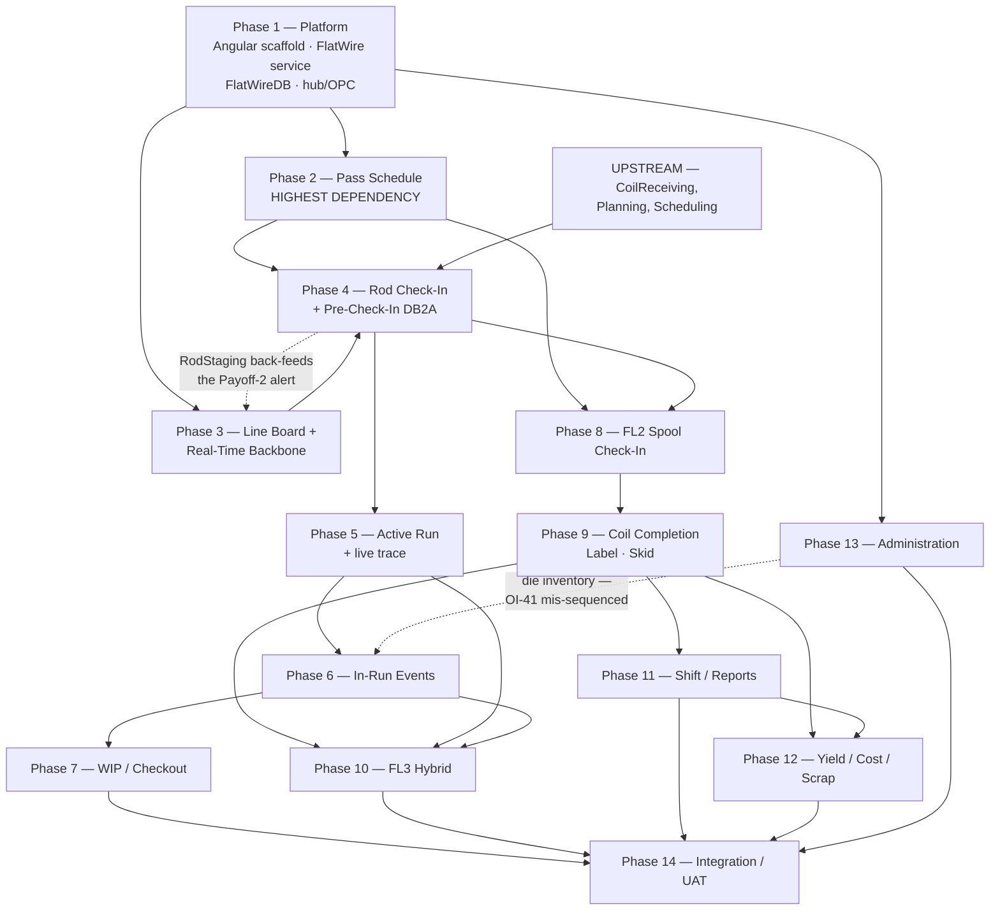

# Flat Wire Mill — Sprint Plan & Backlog

**Project:** United Aluminum (UAL) — Flat Wire Mill Module
**Last Updated:** August 4, 2026
**Document Type:** Sprint plan and delivery backlog
**Status:** Published — **the plan below does not fit the window; §1 requires a programme decision before it can be committed**
**Owner:** Delivery lead / programme management
**Audience:** Delivery lead, scrum team, programme management
**Sources:** [`../FlatWire_MasterSpecification.md`](../FlatWire_MasterSpecification.md) §9 · [`../../DevelopmentPlan/CapacityAndEffortModel.md`](../../DevelopmentPlan/CapacityAndEffortModel.md) · [`../../DevelopmentPlan/ShopfloorPlan/back-matter.md`](../../DevelopmentPlan/ShopfloorPlan/back-matter.md) · [`../../DevelopmentPlan/FlatWireJiraStories.md`](../../DevelopmentPlan/FlatWireJiraStories.md) (April — **superseded as a schedule**)

**Companion documents:** `[VS]` [01-VisionAndScope.md](./01-VisionAndScope.md) · `[SRS]` [02-SRS.md](./02-SRS.md) · `[HLD]` [03-HLD-and-ERDiagram.md](./03-HLD-and-ERDiagram.md) · `[API]` [04-APIContract.md](./04-APIContract.md) · `[TP]` [06-TestPlanAndTestCases.md](./06-TestPlanAndTestCases.md) · `[DR]` [07-DeploymentRunbookAndRollback.md](./07-DeploymentRunbookAndRollback.md)

---

## 1. Capacity reality check — read this before the plan

> ### ⚠ The plan in this document is presented **as scoped**, and **as scoped it does not fit the window**.
>
> This is arithmetic, not judgement, and it is stated first rather than buried in an appendix because every other section depends on the decision it forces.

### 1.1 The measured position

| Measure | Value |
|---|---|
| Total effort, 14 phases | **3,727 hours** = **465.9 dev-days** (at 1 dev-day = 8 h) |
| Working days available (Thu 30 Jul → 30 Sep) | **44** — of which **32 are post-gate** |
| Capacity per full-time person over the window | **352 hours** |
| **Sustained requirement** | **≈ 10.6 FTE** |
| Phase-1 gate (1,027 h in 12 working days, 96 h/person) | **10.7 FTE on Phase 1 alone** |
| W7 (653 h in 3 working days, 24 h/person) | **27.2 FTE — arithmetically impossible** |
| Recovery available from the full descope ladder | **448 h = 12 %**, leaving **9.3 FTE** |

**On a hands-on-keyboard reading** (6.5 productive h/day rather than 8 calendar hours) the requirement rises to **13.0 FTE**. Pick one reading and state it before comparing against a roster — mixing them either double-counts overhead or hides it. Every figure in this document uses the **8 h calendar** reading.

### 1.2 Why descoping cannot rescue it

The full ordered ladder in §8 recovers **448 of 3,727 hours — 12 %**. The mitigation previously recorded in the gaps register ("defer Phase 12 and non-critical Phase 13") is worth **276 h ≈ 0.8 FTE**, against a shortfall measured in whole people. Below the last rung there is nothing left that is not a production route, a check-in path, or the traveler.

**Scope is not where the 30 Sep date can be recovered.**

### 1.3 The three options

| Option | What it means | Cost / consequence |
|---|---|---|
| **A — Staff to the plan** | ~11 concurrent people (**88 h/day**) across the six streams, from W0 | The only option that holds 30 Sep. Requires ~3.7 FE, ~2.5 BE, ~1.8 QA, ~1.2 RT, ~1.2 DB, ~0.2 BA. **Ramp-up time is not in the 3,727 h** |
| **B — Move the date** | Keep a realistic team; publish the date the model gives | At 6 FTE (48 h/day) → **18 Nov 2026**; at 8 FTE (64 h/day) → **22 Oct 2026**. **Both land inside the already-planned Q4 2026 production window** |
| **C — Cut scope to the critical path** | The full ladder in §8, plus a further decision on which of Phases 11/13 ship at all | Recovers only **12 %**, leaving 9.3 FTE. **Insufficient alone**; must be combined with A or B |

**Finish date by team size** (all 14 phases, starting Thu 30 Jul, weekends and US holidays excluded, 8 h/person/day):

| Team (FTE) | Working days | Finish | vs 30 Sep |
|---|---|---|---|
| 4 | 117 | Mon 18 Jan 2027 | +110 days |
| 5 | 94 | Mon 14 Dec 2026 | +75 days |
| 6 | 78 | Wed 18 Nov 2026 | +49 days |
| 8 | 59 | Thu 22 Oct 2026 | +22 days |
| 10 | 47 | Tue 6 Oct 2026 | +6 days |
| **11** | 43 | **Wed 30 Sep 2026** | **on target** |
| 12 | 39 | Thu 24 Sep 2026 | −6 days |
| 14 | 34 | Thu 17 Sep 2026 | −13 days |

### 1.4 One scheduling consequence, independent of team size

**UAT cannot share W7 with feature work.** Phase 14's 267 h — including 112 h of QA and 40 h of UAT/BA — must be pulled into a dedicated window after feature-complete, whichever date that lands on. At no team size can stakeholder sign-off begin on the same day feature work completes.

### 1.5 Status

**Gap `G1` / open issue `OI-51`.** The effort model itself is **delivered**; the **escalation is the open item**, together with the unfilled roster in §3. Full derivation: [`CapacityAndEffortModel.md`](../../DevelopmentPlan/CapacityAndEffortModel.md).

> **Two things the effort derivation surfaced that no earlier plan recorded:**
>
> 1. **Epic E01 contains no story for the Angular or .NET scaffold.** E01 "Foundation & Infrastructure" is 7 stories / 28 points, and **all seven are database stories**. Nothing in the 58 covers scaffolding the `flat-wire-shopfloor` library, creating the `FlatWire` solution and its 14 controllers, or the OPC ingest and `PLCTagService`. Phase 1 is **1,027 h against ~28 points of nominal coverage**. **This is the single largest reason the window was believed to fit** — and it is a backlog gap, not an estimating error. Corrected by the `[NEW]` stories in §7.3.
> 2. **Excluding Phase 1, the ratio is 2,700 h / 156 points = 17.3 h per point** — roughly double the ~8 h/point the April sizing implies, and defensible for full vertical slices built to mockup fidelity.

---

## 2. Delivery model

### 2.1 Fourteen phases, one of them layered

**Phase 1 is the only phase organised by technology layer** (1A Angular · 1B Backend · 1C Database, in parallel). **Phases 2–14 are complete vertical slices** — UI → API → business layer → database → real-time → dashboard — delivered in the sequence users experience the system. No phase is "the Angular phase" or "the database phase".

The canonical phrasing: **14 phases = 1 platform + 13 workflow phases (2–14).**

### 2.2 Why two phases were removed

**Rod Receiving** and **Order Planning & Line Scheduling** were originally planned as Phases 3 and 4 and have been **removed from the shopfloor build**. They are handled upstream by the existing CoilReceiving / Planning / Scheduling systems.

Their outputs remain **prerequisites consumed at Phase 4**:

| Removed phase | Now consumed at Phase 4 as |
|---|---|
| Rod Receiving | A rod row in the shared `coils` table with status `RECEIVED`/`STAGED`, carrying alloy, temper, diameter, weights, supplier heat and lot |
| Order Planning & Line Scheduling | A rod→order allocation in `planning_routings` and an order→line booking with operation letter `F` |

**If either upstream track slips, Phase 4 has no material and no scheduled job.** Their 14 stories are listed in §7.5 and are **not costed here**.

### 2.3 Stub-first

The shopfloor UI builds against dummy data first, via the two DI-swapped API implementations in `[API §7]`. This is what makes Phases 2–9 buildable in parallel with the backend, and it is why Phase 1's mock service and stub controllers are on the critical path.

**Schedule an explicit de-stub pass** when OI-46, OI-47 and OI-48 close — the stub deliberately routes around them by assuming a single active schedule, and that assumption will not remove itself.

---

## 3. Team model

### 3.1 Six delivery streams

Derived from the layers the phase specifications actually name. **Owner on every phase is a stream, not a person.**

| Code | Stream | Repository / surface | Hours (incl. contingency) | Share | Sustained FTE |
|---|---|---|---|---|---|
| **FE** | Angular | `ual-angular` → new library `flat-wire-shopfloor` (prefix `fw`) | **1,302** | 34.9 % | **3.7** |
| **BE** | .NET | `ual-api` → new `FlatWire` microservice | **870** | 23.3 % | **2.5** |
| **QA** | Test / E2E / UAT | All phases + Phase 14 | **621** | 16.7 % | **1.8** |
| **RT** | Real-time / PLC | `FlatWireHub`, OPC ingest, `PLCTagService` | **432** | 11.6 % | **1.2** |
| **DB** | SQL Server | New `FlatWireDB` + the shared-schema FW-001 renames | **418** | 11.2 % | **1.2** |
| **BA** | BA / Ops liaison | Pass-schedule content, OQ closure, UAT coordination | **84** | 2.3 % | **0.2** |
| | | **Total** | **3,727** | 100 % | **10.6** |

**FE is the binding constraint** — 35 % of all hours, and 6.0–6.5 FTE in every peak week, roughly triple its W2/W3 load.

### 3.2 Roster — to be completed by programme management

**This is the one table this plan cannot fill.** Until it is filled, the gap column cannot be computed and **G1 remains partly open**.

| Stream | Named owner | FTE | Hours available in window | Available from | Absence (PTO / holiday / split allocation) | Gap vs required |
|---|---|---|---|---|---|---|
| FE — Angular lead | *TBD* | *TBD* | *TBD* | *TBD* | *TBD* | *(3.7 required)* |
| FE — Angular dev(s) | *TBD* | *TBD* | *TBD* | *TBD* | *TBD* | |
| BE — .NET lead | *TBD* | *TBD* | *TBD* | *TBD* | *TBD* | *(2.5 required)* |
| BE — .NET dev(s) | *TBD* | *TBD* | *TBD* | *TBD* | *TBD* | |
| DB — SQL / data | *TBD* | *TBD* | *TBD* | *TBD* | *TBD* | *(1.2 required)* |
| RT — real-time / PLC / OPC | *TBD* | *TBD* | *TBD* | *TBD* | *TBD* | *(1.2 required)* |
| QA | *TBD* | *TBD* | *TBD* | *TBD* | *TBD* | *(1.8 required)* |
| BA / Ops liaison | *TBD* | *TBD* | *TBD* | *TBD* | *TBD* | *(0.2 required)* |

One full-time person available for the whole window contributes **352 h** (44 working days × 8 h). Pro-rate for later start dates and absence.

### 3.3 Unit-rate card

**The unit is hours.** Story points are deliberately **not** the delivery unit; they survive only as the cross-check in §1.5. Day figures are derived at **1 dev-day = 8 h** and are a reading aid only.

| Unit | Hours | Notes |
|---|---|---|
| New dashboard screen | **24 h** | `Mockups/*.html` is the approved visual spec — **no design time is included** |
| Screen variant (FL2/FL3 mode of an existing screen) | **8 h** | |
| Modal / dialog | **12 h** | |
| Shared composite control | **20 h** | `pass-schedule-table`, `gauge-trace-chart`, `tolerance-viz`, `tab-wizard`, `action-bar`, `payoff-weight-bar` |
| Shared primitive control | **8 h** | `.input` states, monospace readouts, pass/fail buttons, `alert-banner` |
| Command endpoint (MediatR + FluentValidation + unit test) | **6 h** | `API/Domain/CoilCheckin` is the template |
| Query endpoint | **4 h** | |
| Non-trivial business service / algorithm | **12–24 h** | Priced individually |
| Table (DDL + FK + index + EF mapping + repository) | **4 h** | |
| Stored proc / reporting view | **8 h** | |
| Report | **8 h** FE + **8 h** BE | Extends the existing `Reports` service |
| New hub event (typed contract + publisher + subscriber) | **8 h** | |
| PLC tag group push + compensating clear | **16 h** | |
| **QA uplift** | **+20 %** of FE+BE+DB+RT | Suppressed in Phase 14, which *is* the QA phase |
| **Contingency** | **+15 %** of (base + QA) | Stated once, not hidden per line |

Two discrete items that are **not** rate-card units, added because omitting them is how the plan under-read its own size:

| Discrete item | Hours | Where |
|---|---|---|
| **FW-001 shared-schema rename impact audit** | **40 h** | Phase 1C — the rename itself is 16 h; the SP/view/report audit across `united_db` and the legacy tier is separate |
| **Hub load test** (N clients × 3 lines × cadence) | **16 h** | Phase 3 — **its pass criteria do not exist**, G9/OI-34 |

**Reserves excluded from the total:**

| Reserve | Hours | Phase | Blocked by |
|---|---|---|---|
| Cross-DB check-in recovery | **24–64 h** | 4 | **OI-39** / G2 — neither saga/outbox nor an `INFLAT` mirror has been chosen |
| Footage→weight basis | **16–32 h** | 9 | **OI-45** / OQ-36 — integrating over `RunReading` is materially more work than a target-derived weight |

**Phase 4 and Phase 9 estimates are provisional until those two issues close.**

---

## 4. Sprint calendar

Working days are **counted, not assumed**: **Labor Day falls on Mon 7 Sep 2026** (inside W4), and **W7 holds only 3 days**.

### 4.1 The week grid

| Week | Dates | Wk days | Cap/person | Phase(s) | Hours | Peak FTE | Focus |
|---|---|---|---|---|---|---|---|
| **W0** | to **Aug 14** | 12 | 96 h | **1** (1A/1B/1C parallel) — **hard gate** | 1,027 | **10.7** | Angular scaffold · FlatWire service · FlatWireDB schema · hub/OPC skeleton |
| W1 | Aug 17–21 | 5 | 40 h | 1 completion / carry-over | — | 0.0 | *the only slack in the plan — the whole recovery budget, 200 person-hours at 5 FTE* |
| W2 | Aug 24–28 | 5 | 40 h | **2** (start) · **3** (start) | 211 | 5.3 | Recipe library; hub streaming |
| W3 | Aug 31–Sep 4 | 5 | 40 h | **2** (finish) · **3** (DB1 live) | 210 | 5.3 | Generate-from-Specs; line board |
| W4 | Sep 8–11 | **4** | **32 h** | **4** (+ DB2A) · **5** | 409 | **12.8** | PLC push + `INFLAT`; `RodStaging` + `FL1PO`; live gauge/width *(DB13/14 descoped 4 Aug — −67 h)* |
| W5 | Sep 14–18 | 5 | 40 h | **6** · **7** · **8** (start) | 562 | **14.1** | Weld/die/SPC/roll/pause; rejection/checkout; spool check-in |
| W6 | Sep 21–25 | 5 | 40 h | **8** (finish) · **9** · **10** · **11** | 588 | **14.7** | Historical profile; coil/label/skid; hybrid; shift + reports |
| W7 | Sep 28–30 | **3** | **24 h** | **12*** · **13** · **14** | 653 | **27.2** | Yield/cost/scrap*; admin; 3-route E2E + UAT sign-off |

\* Rungs 1–4 of the descope ladder. **The `Hours` column sums to 3,727** — the grand total, allocated with no leakage.

### 4.2 Sprints

| Sprint | Weeks | Goal | Phases | Entry criteria | Exit criteria | Demo | Gates |
|---|---|---|---|---|---|---|---|
| **S0** | W0 (to 14 Aug) | **Stand up the platform.** Every later phase assumes it exists | 1A, 1B, 1C | Roster confirmed; `FlatWireDB` server available; `ual-angular` / `ual-api` branches cut | Angular library scaffolded and building; `FlatWire` 4-project solution with stubbed controllers returning contracted shapes; `FlatWireHub` skeleton broadcasting simulated data; `PLCTagService` in simulate mode; **`FlatWireDB` deployed with 27 tables, 43 FKs, 64 non-clustered indexes, trigger, 2 procs and full seed**; FW-001 impact audit complete | Scaffolded UI ↔ stubbed service ↔ created schema ↔ simulated hub, end to end | **M1 (14 Aug) hard gate** · **QA0** (Jest smoke, xUnit + stub-fixture + validator suites, DDL/seed idempotency + 27-table post-run check) · **Effort calibration checkpoint** |
| **S1** | W1–W3 (17 Aug – 4 Sep) | **The recipe library and the live backbone** | 2, 3 | S0 exit met | Pass schedules creatable, editable, generatable and activatable; DB9/DB9A complete; DB1 rendering live from the hub; alert rules firing; hub load test executed | Create a schedule from specs, activate it, watch DB1 update live | **M2 (6 Sep)** · **QA1 (6 Sep)** pass-schedule + generator suites green |
| **S2** | W4–W5 (8–18 Sep) | **The full FL1 operator journey** | 4, 5, 6, 7, 8 (start) | Phase 2 complete — **it gates every check-in phase** | Rod staged, checked in, PLC tags pushed (simulated), live trace running, every in-run event recorded, both exception off-ramps working | Stage → check in → run → weld → SPC → die change → pause → WIP reject → check out | **M3 (13 Sep)** · **QA2 (13 Sep)** check-in rollback + real-time integration on staging; **hub load test** |
| **S3** | W6 (21–25 Sep) | **Finished goods and back-office** | 8 (finish), 9, 10, 11 | An FL1-produced spool exists | FL2 finishes a coil with a label and traceability; FL3 hybrid runs end to end; shift summary and the five reports | Spool → FL2 → coil → skid → cert query; FL3 in one pass | **M4 (20–27 Sep)** · **QA3 (24 Sep)** FL1 + FL2 E2E pass |
| **S4** | W7 (28–30 Sep) | **Close out and hand over** | 12*, 13, 14 | Critical-path phases complete | Yield/cost/scrap*; admin surfaces; three green E2E route runs; UAT sign-off | Three-route E2E + the cert pack | **QA4 (28 Sep)** FL3 E2E + **renamed-column regression** · **QA5 (30 Sep)** full UAT · **M5 (30 Sep)** feature-complete |

> **S4 is the sprint the arithmetic breaks.** 653 hours in 3 working days. Even at 11 FTE it is a 27-FTE week. **UAT must move to a dedicated window** — §1.4.

### 4.3 Post-window

| Event | Date | Note |
|---|---|---|
| PLC commissioning target | by **30 Sep 2026** | Until it completes, every line runs `SimulatePLCTagPush` + mock SignalR. **Development is not blocked; go-live is** |
| On-line trial | early **Oct 2026** | TBD with Tim O. / Shannon R. |
| Production | **Q4 2026** | After trial acceptance |

> **Superseded — do not use.** The April-dated documents carry "commissioning end of June 2026 · trials 1 July 2026 · production 1 August 2026 · ~10-week window · 5 sprints". **Every one of those is dead.** `FlatWireJiraStories.md`, `APIContracts.md`, `FlatWireTables.md` and `TechStackRecommendation.md` still print them.

---

## 5. Phase table

| # | Phase | Streams | Hours | Days | Wk | Depends on | OQ / OI blockers | Stories | Spec |
|---|---|---|---|---|---|---|---|---|---|
| **1A** | Angular Foundation | FE (+RT) | **370** | 46.2 | W0 | — | — | `[NEW]` FW-N03 | [phase-01a](../../DevelopmentPlan/ShopfloorPlan/phase-01a-angular-foundation.md) |
| **1B** | Backend Foundation | BE + RT | **442** | 55.2 | W0 | — | OI-37 (roles) | `[NEW]` FW-N04, FW-N05; FW-080 scaffold | [phase-01b](../../DevelopmentPlan/ShopfloorPlan/phase-01b-backend-foundation.md) |
| **1C** | Database Foundation | DB | **215** | 26.9 | W0 | — | OI-31, OI-42, OI-93, OI-17 | FW-001, 002, 004, 005, 006, 007 | [phase-01c](../../DevelopmentPlan/ShopfloorPlan/phase-01c-database-foundation.md) |
| **2** | Pass Schedule Management | FE + BE | **231** | 28.9 | W2–W3 | 1 | **OI-04**, OI-05, OI-93 | FW-010, 011, 012, 013, 014, 068, 004 | [phase-02](../../DevelopmentPlan/ShopfloorPlan/phase-02-pass-schedule-management.md) |
| **3** | Line Status Board & Real-Time Backbone | RT + FE | **190** | 23.8 | W2–W3 | 1 | **OI-28** (alerts unbacked), OI-34 | FW-060, 080, 081 (groundwork), `[NEW]` FW-N06 | [phase-03](../../DevelopmentPlan/ShopfloorPlan/phase-03-line-status-board-realtime-backbone.md) |
| **4** | Rod Check-In & PLC Config **+ Pre-Check-In** | FE + BE + RT | **255** *(+24–64 reserve)* | 31.9 | W4 | 2, 3, upstream | **OI-01, OI-33, OI-39, OI-46, OI-48, OI-49**, OI-07, OI-38 | FW-061, 082, 010, 002, `[NEW]` FW-N01, FW-N12 | [phase-04](../../DevelopmentPlan/ShopfloorPlan/phase-04-rod-checkin-plc-config.md) |
| **5** | Active Run Monitoring & Gauge Trace | FE | **221** | 27.6 | W4 | 4 | OI-34, OI-36 | FW-062, 081, 080 | [phase-05](../../DevelopmentPlan/ShopfloorPlan/phase-05-active-run-monitoring-gauge-trace.md) |
| **6** | In-Run Production Events | FE + BE | **298** | 37.2 | W5 | 5 | **OI-41** (needs Phase 13 die data), OI-10, OI-11, OI-14, OI-18, OI-23, OI-43, OI-57 | FW-063, 065, 070, 071, 073, `[NEW]` FW-N11 | [phase-06](../../DevelopmentPlan/ShopfloorPlan/phase-06-in-run-production-events.md) |
| **7** | WIP Rejection & Rod Checkout | FE + BE | **205** | 25.6 | W5 | 6 | **OI-22** (Rework unpersistable), OI-20, OI-21, OI-35, OI-44, OI-53, OI-54 | FW-067, 072, 071 | [phase-07](../../DevelopmentPlan/ShopfloorPlan/phase-07-wip-rejection-rod-checkout.md) |
| **8** | FL2 Spool Check-In & Finishing Run | FE + BE | **118** | 14.8 | W5–W6 | 4–6 output | **OI-47, OI-50**, OI-02, OI-06, OI-09, OI-55, OI-80 | FW-064, 070 | [phase-08](../../DevelopmentPlan/ShopfloorPlan/phase-08-fl2-spool-checkin-finishing-run.md) |
| **9** | Output Coil Completion, Labeling & Packing | FE + BE | **222** *(+16–32 reserve)* | 27.8 | W6 | 8 | **OI-45** (weight basis), **OI-25** (footage frames), OI-24, OI-65, OI-67 | FW-066, 100, `[NEW]` FW-N02 | [phase-09](../../DevelopmentPlan/ShopfloorPlan/phase-09-output-coil-completion-labeling-packing.md) |
| **10** | FL3 Hybrid Continuous Operation | BE + FE | **61** | 7.6 | W6 | 4, 5, 6, 9 | OI-16, OI-26, OI-09 | FW-122; reuses 061/062/082/066 | [phase-10](../../DevelopmentPlan/ShopfloorPlan/phase-10-fl3-hybrid-continuous-operation.md) |
| **11** | Shift Summary, Reporting & Certification | BE + FE | **246** | 30.8 | W6 | 4–10 run data | OI-57, OI-58, OI-59, OI-62 | FW-069, 090–095 | [phase-11](../../DevelopmentPlan/ShopfloorPlan/phase-11-shift-summary-reporting-certification.md) |
| **12** | Yield, Cost Ledger & Scrap | BE | **177** | 22.1 | W7 | 9, 11 | OI-45, OI-60, OI-68 | FW-100, 101\*, 102\*, 110\* | [phase-12](../../DevelopmentPlan/ShopfloorPlan/phase-12-yield-cost-ledger-scrap.md) |
| **13** | Administration & Reference Data | FE + BE | **209** | 26.1 | W7 | 1 | **OI-27** (no `F` case), OI-77, OI-93 | FW-003, 004 (admin), 054, `[NEW]` FW-N07 | [phase-13](../../DevelopmentPlan/ShopfloorPlan/phase-13-administration-reference-data.md) |
| **14** | Integration Testing, PLC Commissioning & Go-Live | QA + BA | **267** | 33.4 | W7 | all | **OI-78** (no exit-test matrix) | FW-120, 121, 122, 123 | [phase-14](../../DevelopmentPlan/ShopfloorPlan/phase-14-integration-testing-plc-commissioning-golive.md) |
| | **Total** | | **3,727** | **465.9** | | | | | |

\* Deferred candidates — first to slip past 30 Sep.

**Roll-ups:** Phase 1 (1A+1B+1C) = **1,027 h** · Phases 2–14 = **2,700 h**.
**Largest phases:** 1B (442) · 1A (370) · 6 (298) · 14 (267) · 4 (255). **Smallest:** 10 (61) · 8 (118).

---

## 6. Dependency chain

### 6.1 The critical path

**Phase 1 → Phase 2 → Phase 4 → Phase 5 → Phase 6 → Phase 7 → Phase 14.**

**Phase 2 (Pass Schedule) gates every check-in phase.** No shopfloor slice works without it, and its *content* — the actual recipes — is still being authored by Operations. There is no workaround.

### 6.2 Two corrections to the published graph

1. **`back-matter.md` draws Phase 8 → 9 → 10**, implying FL3 hybrid depends on the FL2 **spool check-in**. **It does not — FL3 has no intermediate spool.** FL3 depends on Phases 4, 5, 6 and 9. Corrected above.
2. **Phase 6 depends on Phase 13.** Die-change validation (`FR-233`) needs the die inventory that Die Management creates — and **no die master table exists anywhere in the schema**. Either pull a minimal die reference forward into Phase 6 or resequence. Unresolved — **OI-41**, drawn as a dashed back-edge above.

### 6.3 Shared building blocks — build once, reuse everywhere

| Asset | Built in | Reused by |
|---|---|---|
| `flat-wire-signalr.service` + `FlatWireHub` | 1 / 3 | 3, 5, 6, 7, 8, 9, 11 |
| `PLCTagService` (push / clear) | 1 / 4 | 4, 6, 7, 8, 10 |
| `pass-schedule-table` + `confirm-bar` | 2 / 4 | 2, 4, 8 |
| `gauge-trace-chart` (live + profile, one component) | 3 / 5 | 5, 8, 11 |
| `FlatWireRun` hub + event tables | 1 | all shopfloor phases |
| `CoilTraceability` genealogy | 9 | 9, 11 (Cut Traceability), 12 (yield) |
| Alloy lookup | 1 | 2 (generate), 9/12 (weight), 13 (admin) |

### 6.4 Parallelisable / sequential

**Parallelisable:** Phases 2 and 3 after Phase 1 (different streams — Ops-recipe UI versus real-time backbone), converging at Phase 4. Within Phase 6, the five events can be built in parallel by feature once Phase 5 exists. Phases 11/12/13 are parallel back-office tracks once run data exists.

**Must be sequential:** 2→4 · 4→5→6→7 · 8→9 · 9→10 · and **14 last**.

---

## 7. Backlog

### 7.1 Epics

| Epic | Title | Stories | Points | Scope |
|---|---|---|---|---|
| E01 | Foundation & Infrastructure | 7 | 28 | Shopfloor |
| E02 | Pass Schedule Module | 5 | 27 | Shopfloor |
| E03 | Rod Receiving | 3 | 10 | **Upstream** |
| E04 | Scheduling System | 2 | 5 | **Upstream** |
| E05 | Planning System | 4 | 16 | **Upstream** |
| E06 | Web App Changes | 6 | 16 | **Upstream** (FW-054 stays in shopfloor Phase 13) |
| E07 | Shopfloor UI | 14 | 67 | Shopfloor |
| E08 | Real-Time / PLC | 3 | 13 | Shopfloor |
| E09 | Reporting Suite | 6 | 17 | Shopfloor |
| E10 | Coil Yield & Cost | 3 | 9 | Shopfloor (deferred candidates) |
| E11 | Scrap Management | 1 | 2 | Shopfloor (deferred) |
| E12 | Testing & Go-Live | 4 | 16 | Shopfloor |
| | **Total** | **58** | **226** | |

> **Point-total correction.** The published summary says E07 = 65 and a grand total of 224. **The 14 E07 stories sum to 67**, so the grand total is **226**.

### 7.2 Shopfloor stories — 44

Points are the April sizing, retained **only** as the cross-check basis in §1.5. **The schedulable estimate is the hours in §5.**

| Story | Title | Epic | Phase | Stream | Pts | Priority | Depends on | Acceptance criteria (Given / When / Then) |
|---|---|---|---|---|---|---|---|---|
| **FW-001** | Existing-schema column renames | E01 | 1C | DB | 5 | Critical | — | **Given** the shared `coils`/scheduling schema, **when** the eight slash-dual renames and two new columns are applied, **then** every dependent stored procedure, view and report is identified by the impact audit **and** a reverse script exists. **⚠ Highest blast radius in the project — front-load the impact audit (40 h, separate from the 16 h rename).** |
| **FW-002** | `INFLAT` coil status | E01 | 1C *(used 4)* | DB | 2 | Critical | FW-001 | **Given** the shared status vocabulary, **when** `INFLAT` is added, **then** check-in can set it and checkout/completion/rejection can clear it, **and** no existing consumer of `coil_status` breaks. |
| **FW-003** | Register FL1/FL2/FL3 machines | E01 | 13 | DB | 5 | Critical | — | **Given** `united_db..machines`, **when** FL1/FL2/FL3 are seeded at `machine_idx` **125/126/127** with `status = 1`, **then** they appear in the `CommonDB.dbo.Machines` view. **Blocked-adjacent: `GetMachineTypeFromOpLetter` has no `F` case — OI-27.** |
| **FW-004** | Alloy properties lookup | E01 | 1C *(2 generate, 13 admin)* | DB + BE | 3 | Critical | — | **Given** the generator needs per-alloy limits, **when** `AlloyProperty` is created and seeded, **then** `PassSchedule.Alloy` has an enforceable local FK parent **and** density/draw-reduction are read from `united_db..alloys`, not duplicated. **See OI-93.** |
| **FW-005** | Fix existing FlatWire reference tables | E01 | 1C | DB | 3 | Critical | — | **Given** `FlatLineSetup` / `FlatLineProcessing`, **when** they are mapped to `PassScheduleComponent` / `FlatWireRunDetail`, **then** the header/detail split holds **and** a migration + drop-criteria plan exists. **Currently missing — OI-31.** |
| **FW-006** | Core entity tables | E01 | 1C | DB | 5 | Critical | FW-004 | **Given** the schema design, **when** `01_Lookup` … `03_Materials` run, **then** 12 tables exist, `PayoffPosition` carries three pinned rows, and re-running is idempotent. |
| **FW-007** | Event/output tables | E01 | 1C | DB | 5 | Critical | FW-006 | **Given** the core tables, **when** `04_Runs` … `08_Programmability` run, **then** all **27 tables**, **43 FKs**, **64 non-clustered indexes**, the non-overlap trigger and both read procedures exist and pass the post-run checks. *(Counts re-measured against the deployed database 6 Aug 2026; the earlier 41/46 were a 30 Jul DDL count that had drifted.)* |
| **FW-010** | Pass Schedule data model + API | E02 | 2 | BE | 5 | Critical | FW-006 | **Given** an Operations user, **when** they create a schedule, **then** it starts `Draft`, **and** at most one `Active` schedule exists per `(LineId, Alloy)`. **Component state is the three-value enum, not `IsActive` bool.** |
| **FW-011** | Dashboard 9A — schedule list | E02 | 2 | FE | 3 | High | FW-010 | **Given** schedules exist, **when** search, alloy, line and status filters are applied, **then** they apply simultaneously, the stats strip updates, and any non-"All" filter renders amber. |
| **FW-012** | Dashboard 9 — schedule management | E02 | 2 | FE | 8 | Critical | FW-010 | **Given** a schedule open for edit, **when** the operator toggles components, **then** the mandatory final stand is locked on, bypassed rows read "Bypassed · no parameters", edger rows offer an edge-type selector, **and** nothing pushes to the PLC. |
| **FW-013** | Generate-from-Specs algorithm | E02 | 2 | BE | 8 | High | FW-004 | **Given** alloy 1100, rod 0.375″, gauge 0.125″, width 0.875″, **when** generate runs, **then** it returns `preflattenDiameterIn 0.3732`, `areaReductionPct 0.95`, `drawPasses 0`, `routeMode Hybrid` with the two warnings — **not the published 0.265 / 50.1 / Standalone.** Apply stays enabled on errors; **no PLC write ever occurs**. |
| **FW-014** | Pass-schedule override logging | E02 | 2 *(used 6)* | BE | 3 | High | FW-010 | **Given** a mid-run override, **when** it is saved, **then** `PassScheduleChangeLog` records parameter, old→new, user, timestamp and reason, **and** the Active Run Monitor raises an alert that **cannot be passively dismissed**, with the line continuing on the **previous** PLC values until acknowledged. |
| **FW-054** | Alloys material type | E06 | 13 | BE + DB | 5 | High | — | **Given** the Alloys module, **when** the flat-wire Material Type variants are added, **then** Reduction Rules and Vendor O Gauge carry them. **Collides with `AlloyProperty` — OI-93.** |
| **FW-060** | Dashboard 1 — line status | E07 | 3 | FE | 5 | High | FW-080 | **Given** three lines, **when** DB1 loads, **then** all three render concurrently from `GET /lines/status` and update by push with **no polling**; all five alert rules fire on their stated condition; alerts are individually acknowledgeable. |
| **FW-061** | Dashboard 2 — rod check-in | E07 | 4 | FE | 8 | Critical | FW-010, FW-082 | **Given** a staged rod, **when** the operator completes the 6-step wizard, **then** Acknowledge stays disabled until all six clear or a supervisor override is on file; **when** they acknowledge, **then** records are written **before** the PLC push and the operator lands on DB3. |
| **FW-062** | Dashboard 3 — active run | E07 | 5 | FE | 8 | Critical | FW-081 | **Given** an active FL1 run, **when** gauge and width stream, **then** traces render green in spec and red out of spec with a banner, weld markers carry rod alphas, and the action bar shows six buttons with **no Roll Adjust and no edger controls**. |
| **FW-063** | Weld event capture — DB2A dialog *(DB4 retired)* | E07 | 6 | FE + BE | 5 | High | FW-062 | **Given** a rod staged on the idle bay, **when** the weld screen opens, **then** the incoming rod defaults to it and footage auto-populates from the encoder; **when** quality is Fail, **then** a fail reason is mandatory and the event still logs and links the rods. |
| **FW-064** | Dashboard 5 — FL2 spool check-in | E07 | 8 | FE + BE | 5 | High | FW-061 | **Given** an FL1-produced spool, **when** the operator scans its label, **then** source rods and the **historical FL1 gauge profile with weld markers** render, there is **no visual inspection section**, and the same mandatory confirm bar gates acknowledgement. |
| **FW-065** | Dashboard 6 — SPC checkpoint | E07 | 4 (pre-run) & 6 | FE + BE | 3 | High | FW-007 | **Given** any checkpoint type, **when** a measurement is entered, **then** the tolerance-band marker positions per the stated formula and the in/out badge and signed deviation update; **when** any reading is out of spec, **then** "Submit · suspend material" elevates to danger style **without** blocking "Submit · continue run". |
| **FW-066** | Dashboard 7 — coil completion *(and DB7b packing)* | E07 | 9 | FE + BE | 5 | High | FW-100 | **Given** a completed coil, **when** the operator confirms, **then** the alpha is issued, traceability rows cover 100 % of coil footage without overlap, gauge/width show the **target** value when SPC confirms in tolerance, and **exactly two coils close a skid**. |
| **FW-067** | Dashboard 8 — WIP rejection | E07 | 7 | FE + BE | 5 | High | FW-062 | **Given** suspect material, **when** a rejection is submitted, **then** the alpha status is set, the WIP Held queue updates and `AlertRaised` reaches DB1; **when** the disposition is Suspend, **then** an observation is required. **`Rework` cannot be persisted — OI-22.** |
| **FW-068** | DB9/9A shopfloor integration | E02 | 2 | FE | 2 | High | FW-011, FW-012 | **Given** the shopfloor shell, **when** a user opens Pass Schedules from the More Options popup, **then** DB9A opens with role-appropriate actions and operators see read-only. |
| **FW-069** | Dashboard 10 — shift summary | E07 | 11 | FE + BE | 5 | Medium | FW-007 | **Given** a shift window, **when** a machine tab is selected, **then** the KPI tiles reflect **that machine only**, the utilisation timeline shows one line (or all three on All Lines), and runs that resumed without a completed SPC checkpoint are **flagged as exceptions**. |
| **FW-070** | Dashboard 11 — roll adjust | E07 | 6 *(FL3 in 10)* | FE + BE | 5 | High | FW-062 | **Given** gauge drift, **when** the operator enters measured gauge and width, selects a reason chip and applies, **then** each changed gap is logged individually, the PLC tag is written immediately, and a `RollAdjustTrigger` SPC checkpoint is created. **When all deltas are zero, nothing is written.** |
| **FW-071** | Pause/Resume dialog | E07 | 6 | FE + BE | 3 | High | FW-062 | **Given** a running line, **when** the operator selects exactly one reason and confirms, **then** the timer pauses, footage freezes, PLC tags go to hold/idle and DB1 shows PAUSED with the reason. **Selecting the Rod Checkout reason navigates instead of pausing.** |
| **FW-072** | Dashboard 12 — rod checkout A/B | E07 | 7 | FE + BE | 5 | High | FW-071 | **Given** any checkout mode, **when** the dialog opens, **then** `LineState` is read and the checkout is blocked while Running, footage is locked at open, and **no stop command is ever sent**; **Mode B** creates a Pending Disposition with the material locked and **no alpha until a supervisor approves**. |
| **FW-073** | Die Change screen | E07 | 6 *(Die Mgmt in 13)* | FE + BE | 3 | High | FW-062 | **Given** a die change, **when** the incoming die is scanned, **then** a die not in inventory is **rejected**; **when** the reason is Gauge drift or Size change, **then** Confirm routes to SPC, thread mode is permitted and full production stays blocked. **Depends on a die inventory that does not exist — OI-41.** |
| **FW-080** | SignalR hub `FlatWireHub` | E08 | 1 / 3 | RT | 5 | Critical | — | **Given** the hub, **when** a client joins a line group, **then** it receives the **ten** contracted events at the contracted cadence over WebSockets/MessagePack; hot telemetry is batched at ~10 Hz and `PayoffStateChanged` is **never** in that batch; FL2 receives no gauge/width. |
| **FW-081** | Live gauge-trace chart | E08 | 5 *(groundwork 3)* | FE | 3 | High | FW-080 | **Given** a 10 Hz batched feed, **when** the trace renders, **then** callbacks run outside the Angular zone, updates coalesce on `requestAnimationFrame`, and the component holds a fixed window. One component with an `isLive` flag serves both live and profile modes. |
| **FW-082** | PLC tag push on acknowledge | E08 | 4 | RT | 5 | Critical | FW-010 | **Given** an acknowledged schedule, **when** check-in commits, **then** component flags, die sizes, roll gaps, speed limits and gauge/width targets push as **one batch** after the records are written; **when** any write fails, **then** compensating clears are issued and the check-in aborts. **FL3 pushes FM1 and FM2 in one batch.** |
| **FW-090** | Reports — Flattening Lines tab | E09 | 11 | BE + FE | 2 | High | — | **Given** the existing Reports service, **when** the Flattening Lines tab is added, **then** the five flat-wire reports are reachable with line and date-range filters. |
| **FW-091** | Gauge Trace report | E09 | 11 | BE + FE | 5 | High | FW-007 | **Given** a completed run, **when** the report is generated, **then** it renders the decimated trace with target, tolerance band and weld markers from `sp_GetGaugeTrace`. |
| **FW-092** | Gauge CPK reports | E09 | 11 | BE + FE | 3 | High | FW-091 | **Given** a run's readings, **when** CPK is computed, **then** unstable start and end regions are excluded and the stable window is stated. **Control limits need published tolerance bands — OI-57.** |
| **FW-093** | Coil Pass Detail report | E09 | 11 | BE + FE | 3 | High | FW-066 | **Given** a coil alpha, **when** the report runs, **then** it shows the effective pass-schedule snapshot, the final SPC result and the per-stand configuration. |
| **FW-094** | SPC at Flattening Line report | E09 | 11 | BE + FE | 2 | High | FW-065 | **Given** a date range, **when** the report runs, **then** checkpoints group by type and line with in-spec rates. |
| **FW-095** | Cut Traceability report | E09 | 11 | BE + FE | 2 | High | FW-066 | **Given** a coil alpha, **when** the report runs, **then** it resolves the full chain to supplier heat with per-rod footage attribution. **Needed before first shipment.** |
| **FW-100** | Footage-based weight calculation | E10 | 9 *(yield 12)* | BE | 3 | High | FW-004 | **Given** footage and cross-section, **when** net weight is derived, **then** it uses `A × 12ρ` with ρ from `united_db..alloys.alloy_density` and the round-edge correction; the derivation is returned for display; the operator may override with a scale reading. **Dimensional basis undecided — OI-45.** |
| **FW-101** | Weld traceability in yield | E10 | 12 | BE | 3 | High | FW-095 | **Given** a coil made from multiple rods, **when** yield is computed, **then** it attributes per source rod. **Deferred candidate — descope rung 3; welding-wire certs are affected.** |
| **FW-102** | Cost Ledger config | E10 | 12 | BE | 3 | Medium | — | **Given** the cost ledger, **when** flat-wire cost standards are configured, **then** costing reports populate. **Deferred — rung 2.** |
| **FW-110** | Scrap module — new outlet selection | E11 | 12 | BE | 2 | Low | — | **Given** edge trim, **when** an outlet is selected, **then** Scrap Box **or Scrap Skid** is recorded. **Deferred — rung 1.** |
| **FW-120** | E2E — FL1 standalone | E12 | 14 | QA | 5 | Critical | all FL1 | **Given** a seeded environment, **when** the full FL1 journey runs (stage → check in → weld → SPC → spool completion), **then** it completes with a spool alpha, a stored profile and complete traceability. |
| **FW-121** | E2E — FL2 standalone | E12 | 14 | QA | 3 | Critical | FW-064, FW-066 | **Given** an FL1-produced spool, **when** the FL2 journey runs, **then** a coil completes with a label, final SPC and a closed skid at two coils. |
| **FW-122** | E2E — FL3 hybrid | E12 | 10 / 14 | QA | 5 | Critical | Phase 10 | **Given** a hybrid schedule, **when** the FL3 journey runs, **then** one acknowledgement pushes FM1+FM2, **no spool alpha is created**, the trace is real-time end to end, and a coil completes. |
| **FW-123** | UAT & stakeholder sign-off | E12 | 14 | QA + BA | 3 | Critical | FW-120–122 | **Given** three green E2E runs, **when** UAT executes, **then** every scenario in `[TP §7]` passes or has an accepted deviation, and all Critical open issues are closed. **Cannot share W7 with feature work.** |

### 7.3 `[NEW]` stories — work the master specification requires that no existing story covers

Each is flagged `[NEW]` with its rationale rather than folded silently into an existing story. **Together they are the reason Phase 1 is 1,027 h against ~28 points of nominal coverage.**

| Story | Title | Epic | Phase | Stream | Priority | Rationale — why no existing story covers it | Acceptance criteria |
|---|---|---|---|---|---|---|---|
| **FW-N01** `[NEW]` | Pre-Check-In Station (DB2A) + `RodStaging` + `/staging/**` | E07 | 4 | FE + BE + RT | **Must** | **Gap G19.** `SRS §4.2 PCI001`–`PCI008` fully specified a pre-check-in station, but it had **no analysis note, no mockup, no data model, no API, no phase owner and no story** until 29 Jul 2026. `FW-061` covers Dashboard 2 only. Root cause: `.docx` is a zip container, so grep never reached the requirements | **Given** an idle bay, **when** a rod is staged, **then** `RodStaging` is written with a server-assigned `RodSeqno`, the bay invariants hold under concurrent staging, and `PayoffStateChanged` broadcasts. **No PLC write occurs.** Covers `FR-030`–`FR-054` |
| **FW-N02** `[NEW]` | Spool completion alerts + PLC-confirmed stop | E07 | 9 (uses 5) | FE + BE + RT | **Must** | **28 requirements (`FR-130`–`FR-157`) have no story at all.** The milestone ladder, the PLC-confirmed stop modal, the weight reconciliation and the supervisor override are fully specified in `SpoolCompletionNotification.md` and delivered as a mockup component, but nothing in the 58 builds them | **Given** weight ≥ target, **when** the PLC reports `RUNNING → STOPPED` held for the dwell, **then** the prompt fires **once**, weight is latched at the stop timestamp, and the prompt is **server-owned state** surviving a refresh |
| **FW-N03** `[NEW]` | Angular library scaffold `flat-wire-shopfloor` | E01 | 1A | FE | **Must** | **E01 is entirely database stories.** Nothing covers `ng generate library`, `angular.json` / `tsconfig` registration, the `build:shop-floor` chain entry, the module/routing/public-api skeleton, the shared-services wiring, or the mock API implementation | **Given** a clean checkout, **when** the chain builds, **then** the library compiles, lazy routes resolve under `/flat-wire`, the mock service returns the canonical fixtures, and the `--color-*` tokens resolve in a component |
| **FW-N04** `[NEW]` | `FlatWire` .NET solution + 14 stubbed controllers | E01 | 1B | BE | **Must** | Same gap. Nothing covers the 4-project Clean-Architecture solution, `Program.cs`, the NuGet set, `UAController` inheritance, `[Authorize]`, the MediatR pipeline, FluentValidation wiring or the stub responses the UI builds against | **Given** the solution, **when** it runs, **then** all 30 endpoints respond with the contracted envelope and stub fixtures, `/health` reports DB and OPC reachability, and every controller carries `[Authorize]` |
| **FW-N05** `[NEW]` | OPC ingest hosted service + `PLCTagService` | E01 | 1B | RT | **Must** | Same gap. `FW-082` covers the *push on acknowledge*; nothing covers the bounded-channel ingest, the 10 Hz broadcast loop, decimation/coalescing, tag-path configuration or `SimulatePLCTagPush` | **Given** a simulated tag source, **when** readings arrive faster than the cadence, **then** the bounded channel drops-oldest without unbounded memory growth and the broadcast loop emits batched arrays at the configured cadence |
| **FW-N06** `[NEW]` | Alert lifecycle — table, raise/clear, acknowledgement | E08 | 3 | BE + DB | **Must** | **OI-28.** `AlertRaised`/`AlertCleared`, the `activeAlerts` payload and the five DB1 rules all exist, but **no table stores an alert** and no story implements raise, clear or acknowledgement persistence. Alerts cannot survive a restart; acknowledgements cannot be audited | **Given** a raised alert, **when** the service restarts, **then** the alert is still active; **when** it is acknowledged, **then** who and when are persisted and the acknowledged count updates |
| **FW-N07** `[NEW]` | Die master table + Die Management screen | E07 | 13 *(minimal ref pulled to 6)* | DB + BE + FE | **Must** *(the table)* / **Should** *(the screen)* | **`FR-233` and `FR-254` require a die inventory that has no table.** The schema has only the `Drawer` lookup and `DieChangeEvent`. `FW-073` covers the Die Change *screen*; nothing creates the inventory it validates against. **This is OI-41's actual content** | **Given** a scanned die alpha, **when** Die Change validates it, **then** an unregistered die is rejected; **given** a completed run, **when** footage accrues, **then** the die's cumulative counter increments from the PLC counter with no new sensor |
| **FW-N08** `[NEW]` | Wire-break capture | E07 | **unassigned** | FE + BE | **Must** *(blocked)* | `FR-280`–`FR-282` (`WBK001`–`WBK003`) have **no screen, no table and no phase owner**. Where the confirmation and the two verification results persist is undefined | **BLOCKED by OI-13.** Cannot be refined until the persistence target is decided. Carried in the backlog so it is not lost |
| **FW-N09** `[NEW]` | OEE dashboard | E07 | **unassigned** | FE + BE | **Could** | **PP-03.** The OEE dashboard has an approved mockup and 17 source requirements (`OEE001`–`OEE017`, carried as `FR-500`–`FR-508`) and **no story, no phase and no owner** | **Given** shift data, **when** OEE renders, **then** A·P·Q per line, MTBF/MTTR, the 7-shift trend and Six Big Losses display against the configurable 85 % target. **Or: formally record OEE as out of scope** |
| **FW-N10** `[NEW]` | Stop transaction popup | E07 | 6 | FE + BE | **Must** | `FR-270`–`FR-277` (`STP001`–`STP018`) specify the Stop popup, its five fields, the balance-of-coil actions and the SPC gate on Update — and **no story covers it.** `FW-071` is Pause/Resume, which is a different dialog | **Given** mill speed reaches zero, **when** the stop flow runs, **then** "Reason for Flatwire Stop" precedes the STOP popup, the Update button stays **disabled until an SPC checkpoint has been performed**, and "Continue Rolling For Different Order" is disabled |
| **FW-N11** `[NEW]` | Cross-cutting operator session, ITInhibit and MMS ID | E01 | 4 (used everywhere) | BE + FE | **Must** | `FR-001`–`FR-022` — login/logout including supervisor override, "Who is running the machine?", ITInhibit's five set conditions, MMS ID lifecycle, buildup alerts and the recording-cadence rule — are **cross-cutting with no owning story** | **Given** any of the five ITInhibit conditions, **when** it holds, **then** the tag is set and machine run is blocked; **given** material consumption reaches 0 ft, **when** it does, **then** the MMS ID closes — **never on operator action** |
| **FW-N12** `[NEW]` | De-stub pass | E12 | after OI-46/47/48 close | FE + BE | **Must** | The stub check-in deliberately assumes a single active schedule to route around three open issues. **That assumption will not remove itself**, and no story removes it | **Given** OI-46, OI-47 and OI-48 are closed, **when** the de-stub pass runs, **then** the no-match path, the hybrid-origin guard and the full traveler field list are implemented and the single-schedule assumption is gone |

**`[NEW]` story count: 12.** Ten are `Must`; one is `Could` (FW-N09); one is blocked (FW-N08).

> **These are not new scope.** Every one traces to requirements already in `[SRS §5]` — they are work the plan was already carrying without a backlog item to account for it. **They do not add to the 3,727 h**, which was derived from the phase deliverable inventories rather than from story points, and which is precisely why the two figures diverge by 2× per point.

### 7.4 Definition-of-done note on FW-001

**`FW-001` is flagged high blast radius.** The renames touch the shared `coils`/scheduling schema read by upstream receiving, planning, scheduling, reporting, yield and cost. Its Definition of Done includes:

1. A completed stored-procedure / view / report / query audit across `united_db` **and the legacy `ual-dot-net` tier** (40 h, costed separately from the 16 h rename).
2. A **reverse script**, tested.
3. A dependent-object recompilation check.
4. The regression pass scheduled at QA4.

**Front-load it in Phase 1C.** It is the risk most likely to surface late, and `[DR §6.3]` records it as the hardest element of the release to roll back.

### 7.5 Out of shopfloor scope — 14 upstream stories

Handled by the existing CoilReceiving / Planning / Scheduling / Web systems. They remain **Critical/High for their own teams**; this plan consumes their outputs but does not build them, and **they are not costed in the 3,727 h**.

| Epic | Stories |
|---|---|
| E03 Rod Receiving | FW-020 (R-series alpha generation) · FW-021 (rod receiving web UI) · FW-022 (suspend-coil logic for rods) |
| E04 Scheduling | FW-030 (Flattening Lines tab) · FW-031 (operation letter `F`) |
| E05 Planning | FW-040 (Flat Wire filter) · FW-041 (weight-based drop with alpha generation) · FW-042 (assign-as-is stock) · FW-043 (tabular allocation grid) |
| E06 Web | FW-050 (Orders & Quotes flags) · FW-051 (Search Customers) · FW-052 (IQR bundle width / edge type) · FW-053 (Item Template) · FW-055 (Vendor Maintenance) |

> **`FlatWireJiraStories.md` still tags all 14 as in-scope Critical/High, Sprint 2–3.** That is stale — reconcile it up to this plan rather than maintaining two backlogs.

---

## 8. Descope ladder

Pre-agreed and ordered, so descoping is a decision already taken rather than an improvisation on 29 Sep. Each rung carries the same QA and contingency uplift as §5, so the hours are directly comparable.

**Rungs 1–4 are all inside Phase 12** — FW-110, FW-102 and FW-101 are Phase-12 stories, so rung 4 is the **remainder** of the phase, not the phase again. The cumulative column is additive with no double-counting.

| # | Rung | Hours | Cumulative | What the business loses | Sign-off | Latest call |
|---|---|---|---|---|---|---|
| 1 | FW-110 Scrap Box/Skid outlet (Low) | 33 | 33 | Scrap routed manually post-go-live | Ops | W6 |
| 2 | FW-102 Cost Ledger config (Medium) | 49 | 82 | No flat-wire cost standards; costing reports blank | Cost accounting | W6 |
| 3 | FW-101 Weld traceability in yield (High) | 28 | 110 | Yield not attributed per source rod — **welding-wire certs affected** | Tim O. / Quality | W6 |
| 4 | Remainder of **Phase 12** (footage-based weight + yield form) | 67 | **177** = whole of Phase 12 | No footage-based yield at go-live | Programme | W6 |
| 5 | Phase 13 non-critical (Die Management screen, role assignment UI) | 99 | 276 | Die life tracked on paper; roles assigned by DBA | Maintenance / IT | W6 |
| 6 | Phase 11 reports FW-092/093/094/095 (4 of 5) | 105 | 381 | Only Gauge Trace ships; CPK / SPC / **Cut Traceability** deferred | Tim O. / Quality | W5 |
| — | *Phase 10 FL3 hybrid* | *61* | — | **Not deferrable** — FL3 is one of the three production routes | — | — |

> **Rung 6 carries a shipment risk.** FW-095 Cut Traceability is marked "needed before first shipment" — deferring it may block the first welding-wire delivery, not just a report.

**The ladder recovers 381 of 3,660 hours — 10 % — leaving 3,279 h, still 9.3 FTE over 44 working days.** Below rung 6 there is nothing left that is not a production route, a check-in path, or the traveler.

> **Rung 7 was removed on 4 Aug 2026, and this made the schedule *worse*, not better.** DB13 and DB14 were descoped at client request, so their **67 h stops being recoverable effort and becomes never-planned effort**. The programme total drops 3,727 → **3,660 h** and Phase 5 drops 221 → **~154 h**, but the ladder loses its largest optional rung: the residual after descoping everything is unchanged at 3,279 h, and the ladder now recovers **10 %** rather than 12 %. **Phase 5 is no longer partly deferrable.**

**Nothing here is a silent cap.** Every rung has a named sign-off and a latest-call date, and deferring any of them is a recorded decision, not a slip.

---

## 9. Definition of Ready / Definition of Done

### 9.1 Definition of Ready

A story may enter a sprint only when **all** hold:

- [ ] Its `FR-###` requirements in `[SRS §5]` are identified and none is blocked by an unresolved Critical `OI-##`.
- [ ] Its endpoint contract in `[API]` is published, including error codes and side effects.
- [ ] Its screen has an **approved** mockup, and the approved variant is named (notably DB2 = `- New.html`).
- [ ] Its data model exists in `FlatWireDB`, or its DDL change is in the same sprint.
- [ ] Acceptance criteria are written **Given / When / Then**.
- [ ] Its stream owner is assigned and has capacity in the sprint.
- [ ] Its dependencies (§6) are complete or in the same sprint with a stated sequence.

### 9.2 Definition of Done

A story is Done only when **all** hold:

- [ ] Code merged, reviewed, and building in the `build:shop-floor` chain (FE) or the `FlatWire.sln` (BE).
- [ ] **Angular: Jest unit + component tests at the 95 % coverage bar** (branches, functions, lines, statements).
- [ ] **.NET: xUnit tests with Moq**, including validator tests for every FluentValidation rule.
- [ ] **Test evidence from `[TP]`:** every `TC-###` mapped to this story in `[TP §10]` executes and passes, including at least one **negative/error-path** case and, where the story touches a role-gated action, one **permission** case.
- [ ] UI conformance checked against the mockup at **1280 × 1024 at 1:1** — no text below 14 px (bar the documented SVG-axis exception), tap targets ≥ 48 px, no hover-dependent action.
- [ ] Real-time behaviour verified where the story emits or consumes hub events, **including reconnect**.
- [ ] Audit obligations verified where the story performs an override, a supervisor action, a pass-schedule change or a PLC write.
- [ ] No new `--fw-*` tokens, no reference to a forbidden library, no copied `SlitterInterface` pattern.
- [ ] Documentation touched: any contract change reflected in `[API]`; any new open item raised as `OI-##` or `PP-##`.

---

## 10. Risk and issue register

### 10.1 Risks carried from `[VS §11]`

| ID | Risk | Likelihood | Impact | Owner | Needed by |
|---|---|---|---|---|---|
| **RISK-01** | The 30 Sep date is unreachable as scoped — 10.6 FTE sustained, 27.2 in W7, 12 % descope ceiling | Certain | Critical | Programme management | **Immediately** |
| **RISK-02** | Pass Schedule content still being authored by Operations; Phase 2 gates every check-in phase | High | Critical | Tim O. / Operations | Before W4 |
| **RISK-03** | Footage→weight basis undefined; the ±2 % variance threshold is unreachable from target dimensions | Medium | High | Tim O. / Process Eng | Before W6 |
| **RISK-04** | Cross-database check-in has no defined recovery path | High | Critical | Architecture / Jaspreet | Before W4 |
| **RISK-05** | FW-001 renames break existing reports | Medium | High | DBA / IT | Before W0 completes |
| **RISK-06** | Roles may not exist as JWT claims | Medium | High | Security / Login owner | Before W0 completes |
| **RISK-07** | PLC commissioning slips past 30 Sep | Medium | High | Engineering / Tim O. | Go-live gate |
| **RISK-08** | Real-time NFRs undefined — the QA2 load test cannot fail | High | High | Architecture / Engineering | Before QA2 (13 Sep) |
| **RISK-09** | SignalR drops on the shopfloor network | Medium | Medium | Architecture | W4 |
| **RISK-10** | UAT shares a 3-day W7 with feature work | High | High | Programme management | Before W6 |
| **RISK-11** | Touch-screen usability on an unfamiliar screen set | Medium | Medium | UX / Operations | UAT |
| **RISK-12** | Phase 6 depends on Phase 13 die data; no die master table exists | Medium | Medium | Programme management | Before W5 |

### 10.2 Gaps register

| Gap | Summary | Status |
|---|---|---|
| **G1** | No capacity/effort model | ✅ Model delivered — **the escalation is the open item** |
| **G2** | Check-in is not one ACID transaction | **Open — blocks Phase 4** |
| **G3** | No table persists raw AGC readings | ✅ Resolved — `RunReading` |
| **G4** | Story→phase coverage not provable | ✅ Resolved — §11 |
| **G5** | Rod source-of-truth ambiguity | ✅ Resolved — but see G12 and OI-42 |
| **G6** | Roles not confirmed as JWT claims | **Open** |
| **G7** | Mid-run checkout approval relies on transient SignalR | **Open — needs a durable queue** |
| **G8** | No data-migration deliverable for legacy tables | **Open** |
| **G9** | NFRs absent | **Open — load test scheduled with no criteria** |
| **G10** | MessagePack / IIS WebSockets prerequisites | Open — WebSockets added to the deploy runbook |
| **G11** | Phases 10/12/13/14 do not follow the full template; 12 and 13 have **no acceptance criterion** | **Open** |
| **G12** | Source artifacts still reference `united_db` and the dropped `Rod` | Open — DDL/ERD agree at 27 tables |
| **G13** | `slitter-interface` reference ambiguity | ✅ Resolved |
| **G14** | Pre-build data inconsistencies (3-vs-4 inspection, `R#####`, footage datatype) | Open — scoped to check-in |
| **G16** | PLC "rollback" wording | Open — partly reworded |
| **G17** | Rod→`coils` multiplies cross-DB logical FKs | Open |
| **G18** | Stale `--fw-*` design tokens | Open — corrected in these documents |
| **G19** | **Pre-check-in specified in the SRS, absent from every other artifact** | ✅ Resolved 29 Jul — two items still need sign-off |
| **G20** | Payoff position modelled three ways | ✅ Resolved for the data model — `TraversingTakeup` has no UI |

### 10.3 Open issues by needed-by date

| Needed by | Issues |
|---|---|
| **Immediately** | **OI-51** (programme decision + roster) |
| **Before W0 completes (14 Aug)** | OI-37 (roles), OI-31 (legacy migration), OI-42 (`Rod`↔`coils` sync), OI-17 (`RunReading` retention), OI-93 (alloy source of truth) |
| **Before W2 (24 Aug)** | **OI-04** (which FM2 stand is mandatory), OI-05 (`Bevel`) |
| **Before W4 (8 Sep)** | **OI-01, OI-33, OI-39, OI-46, OI-48, OI-49**, OI-07, OI-38, OI-52 |
| **Before QA2 (13 Sep)** | **OI-34** (real-time NFRs — the load test has no criteria) |
| **Before W5 (14 Sep)** | OI-10, OI-11, OI-14, OI-18, OI-22, OI-23, OI-35, OI-41, OI-43, OI-44, OI-53, OI-54, OI-57 |
| **Before W6 (21 Sep)** | **OI-45**, OI-02, OI-06, OI-09, OI-24, OI-25, OI-47, OI-50, OI-55, OI-59, OI-65, OI-80 |
| **Before W7 (28 Sep)** | OI-27, OI-58, OI-60, OI-62, OI-68, OI-77, OI-78 |
| **Unassigned / documentation** | OI-13 (wire break), OI-79 (digital traveler orphaned), OI-89, OI-90, OI-91, OI-92, **PP-01** … **PP-04** |

---

## 11. Coverage matrix — every `FR-###` reaches a story

| `[SRS]` § | FR range | Count | Delivering story | Phase |
|---|---|---|---|---|
| 5.0 | FR-001 – FR-022 | 22 | **`[NEW]` FW-N11** | 4 |
| 5.1 | FR-030 – FR-054 | 25 | **`[NEW]` FW-N01** | 4 |
| 5.2 | FR-060 – FR-084 | 25 | FW-061, FW-082, FW-010 | 4 |
| 5.3 | FR-090 – FR-096 | 7 | FW-064 | 8 |
| 5.4 | FR-100 – FR-120 | 21 | FW-062, FW-081, FW-080 | 5 |
| 5.5 | FR-130 – FR-157 | 26 | **`[NEW]` FW-N02** | 9 (uses 5) |
| 5.6 | FR-160 – FR-175 | 16 | FW-063 | 6 |
| 5.7 | FR-180 – FR-197 | 18 | FW-065 | 4, 6 |
| 5.8 | FR-200 – FR-212 | 13 | FW-070 | 6, 10 |
| 5.9 | FR-220 – FR-234 | 15 | FW-073 *(+ FW-N07 for the inventory it validates against)* | 6 |
| 5.10 | FR-240 – FR-255 | 16 | **`[NEW]` FW-N07** | 13 |
| 5.11 | FR-260 – FR-267 | 8 | FW-071 | 6 |
| 5.12 | FR-270 – FR-277 | 8 | **`[NEW]` FW-N10** | 6 |
| 5.13 | FR-280 – FR-282 | 3 | **`[NEW]` FW-N08 — BLOCKED (OI-13)** | **unassigned** |
| 5.14 | FR-290 – FR-299 | 10 | FW-067 | 7 |
| 5.15 | FR-300 – FR-327 | 19 | FW-072 | 7 |
| 5.16 | FR-330 – FR-340 | 12 | FW-066, FW-100 | 9 |
| 5.17 | FR-345 – FR-352 | 8 | FW-066 *(DB7b is inside its phase mapping)* | 9 |
| 5.18 | FR-360 – FR-391 | 28 | FW-010, FW-012, FW-013, FW-014 | 2 |
| 5.19 | FR-400 – FR-410 | 11 | FW-011, FW-068 | 2 |
| 5.20 | FR-420 – FR-428 | 9 | FW-060 *(+ FW-N06 for alert persistence)* | 3 |
| ~~5.21~~ | ~~FR-440 – FR-451~~ | ~~12~~ | ~~FW-062 (DB13 scope)~~ | **withdrawn 4 Aug 2026** |
| ~~5.22~~ | ~~FR-460 – FR-470~~ | ~~11~~ | ~~FW-062 (DB14 scope)~~ | **withdrawn 4 Aug 2026** |
| 5.23 | FR-480 – FR-490 | 11 | FW-069 | 11 |
| 5.24 | FR-500 – FR-508 | 9 | **`[NEW]` FW-N09 — `Could`, no phase** | **unassigned** |
| | **Total** | **363** | | |

### 11.1 Requirements not on the critical path — stated explicitly

| FR range | Status | Reason |
|---|---|---|
| **FR-280 – FR-282** (wire break, 3) | **Not deliverable** | `FW-N08` is blocked by **OI-13** — no screen, no table, no persistence target. The requirements are unimplementable as written |
| **FR-500 – FR-508** (OEE, 9) | **Not scheduled** | `FW-N09` has no phase and no owner (**PP-03**). Either schedule it or record OEE as out of scope |
| ~~**FR-440 – FR-470**~~ (DB13 + DB14, 23) | **[WITHDRAWN — descoped by client, Aug 4 2026]** | Withdrawn from scope entirely, not deferred. **FW-062 keeps its 8 points** — DB13, DB14 and the Machine View had no acceptance criteria of their own in it |
| **FR-500-series and FR-480-series reporting** | **Descope rung 6** | Four of five Phase-11 reports; Cut Traceability's deferral carries a shipment risk |

**All 363 requirements map to a story.** Of those, **351 (96.7 %) are schedulable**: the nine OEE requirements have a story (`FW-N09`) with no phase or owner, and the three wire-break requirements have a story (`FW-N08`) that is blocked by **OI-13**. Both are carried in the backlog rather than dropped, so neither can be lost — but neither can be committed to a sprint today. This matches `[TP §10.4]` exactly.

---

## Change Log

| Date | Changed By | Description |
|------|-----------|-------------|
| Jul 30, 2026 | Plan team | Initial publication. Leads with the **capacity reality check** — 3,727 h against 44 working days, 10.6 FTE sustained, an impossible 27.2-FTE W7 and a 12 % descope ceiling — and states the three programme options with their dates, unsoftened. Publishes the 14-phase delivery model, the six delivery streams with an **unfilled roster**, the unit-rate card, a five-sprint calendar mapped to the authoritative week grid with milestone and QA gates, the phase table with per-phase blockers, the dependency chain with **two corrections to the published graph**, all 12 epics and 44 shopfloor stories with Given/When/Then acceptance criteria, the ordered descope ladder with named sign-offs, Definition of Ready / Done, the risk and gaps registers, and a full `FR-###` → story coverage matrix. Adds **12 `[NEW]` stories** for work the specification requires that no existing story covered — including the Angular and .NET scaffolds absent from epic E01, the pre-check-in station, spool completion, the alert lifecycle, the die master and the stop-transaction popup — each flagged with its rationale rather than folded silently into an existing story. |
| Aug 1, 2026 | Client sync (30 Jul call) | **A new MVP2 candidate, and one scope reduction.** **Multi-order rod (OQ-69/OQ-79) is a candidate for MVP2** — the client confirmed a single rod may carry more than one production order, but the sequencing rule is unanswered (Srikanth is checking his notes) and the deferral itself is still to be confirmed with him. Until it closes, Phase 4's staging validation ships a **knowingly wrong** order-membership refusal (**G22**) — that is a recorded decision, not an oversight. **Scope reduction:** the off-schedule supervisor override is **removed** from Phase 4 (OQ-74) — a rod booked on the other rod line now triggers an automatic station switch, which is less work than the override panel, the five columns and the two constraints it replaces. Offsetting that: Phase 4 gains the auto-switch behaviour on **two** screens (DB2A and DB2), Phase 7 gains the welded pre-check-out approval path, and Phase 8/9 gain the short-close unplanned-stop flow (FR-130a–d). **Blocked on the client:** the four tolerance values owed by e-mail gate `CHK007` in Phase 4, and the panel-resolution answer (**OQ-80**) gates the Phase-1A canvas against the 14 Aug gate. |
| Aug 4, 2026 | Client direction | **HMI/SCADA descoped.** Dashboard 13 (HMI Line Schematic), Dashboard 14 (SCADA Trends) and the Machine View tab on the active run monitor are **withdrawn at client request**. `FR-111`, `FR-112`, `FR-114`, `FR-425`, `FR-440`–`FR-451` and `FR-460`–`FR-470` are marked **withdrawn** — numbers retained, never renumbered — and `FR-113` **reworded**, since it asserted a rule about "the active tab" that outlives the tabs. Both mockups and `HMIAndSCADALayout.md` are deleted. **Descope-ladder rung 7 is removed entirely:** its 67 h stops being *recoverable* effort and becomes *never-planned*, so Phase 5 drops 221 → ~154 h and the programme 3,727 → ~3,660 h, but the ladder loses its largest optional rung and Phase 5 is no longer deferrable. **Nothing structural was removed:** all six run event markers still land on the DB3 traces and no hub event, endpoint, table or column is deleted — every DB13/DB14 reference in the real-time and tag tables was a *consumer* entry, not a row. `Q4`/`OQ-4` is **superseded**, because Dashboard 14 was its answer. **FW-062 keeps its 8 points** — DB13, DB14 and the Machine View had no acceptance criteria of their own in it, and no `FW-###` was ever dedicated to them. The two traceability rows and the `FR-440`–`FR-470` range row are marked withdrawn, and the W4 hours drop from 476 to 409. |
