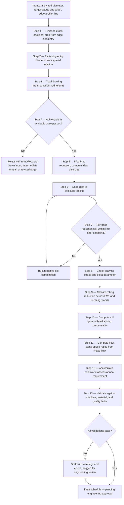
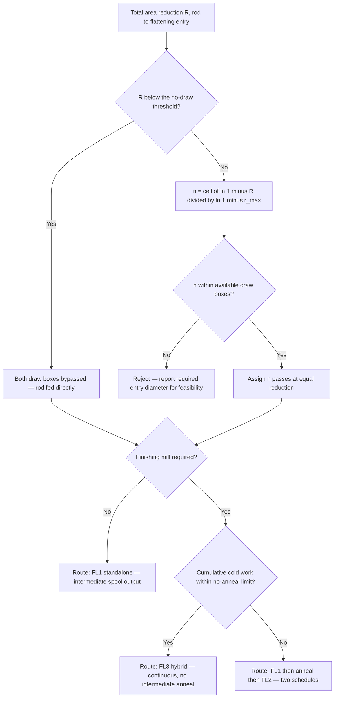

# Flat Wire Processing — Pass Schedule Generation Specification

**Project:** Flat Wire Mill
**Last Updated:** August 1, 2026
**Status:** Draft — Issued for Client Review and Sign-off

---

<!-- TOC -->

---

## Document Change History

| Version | Date | Changed By | Description |
|---|------|----------|-------------|
| 1.0 | Aug 1, 2026 | Analysis Team | Initial specification issued for client review — 13 sections, 23 data items (PSG-D01–D23), 26 open questions (PSG-Q01–Q26), 10 assumptions, 10 risks, 35 validations, 30 engineering rules, two worked examples, and a consolidated sign-off checklist |

---

## Provenance Convention

Every quantitative statement in this document carries one of three tags. Please read them carefully
— they tell you exactly where we are asserting engineering fact and where we are asking you to
supply knowledge that only United Aluminum has.

| Tag | Meaning |
|---|---|
| `[INDUSTRY STANDARD]` | Established published practice or physical law. The governing relation is named at the point of use. |
| `[RECOMMENDED DEFAULT]` | A starting value we propose so development can proceed. Expected to be tuned against trial data. |
| `[CLIENT INPUT REQUIRED]` | We do not know this and will not guess. Shown as a blank awaiting your input. |

The most common pattern in this document is a **standard relation with plant-specific
coefficients** — the equation is `[INDUSTRY STANDARD]`, the numbers that go into it are
`[CLIENT INPUT REQUIRED]`. That combination is normal and appears throughout.

**No value specific to United Aluminum's alloys, mills, tooling, or products is asserted anywhere in
this document as known.**

---

# 1. Introduction

## 1.1 Purpose of This Document

This specification defines the engineering and functional requirements for a **pass schedule
generation engine** for the flat wire mill. It serves two purposes of equal weight:

1. It is the **engineering specification** — the calculations, decision logic, rules, and
   validations the engine must implement.
2. It is the **information request** — a structured checklist and questionnaire identifying every
   piece of process knowledge, engineering data, and business rule that United Aluminum must supply
   or confirm before implementation can begin.

Sections 9 and 10 are designed to be worked through directly by your process engineering and
operations staff, completed, and returned as the basis for sign-off.

## 1.2 What Pass Schedule Generation Is For

Today, a pass schedule is composed manually. An engineer decides which components are active, what
die sizes to fit, what roll gaps to set, and what dimensional targets to hold — drawing on
experience and on precedent from similar products. This works, but it is slow, it is difficult to
audit, it does not scale as the product mix grows, and the reasoning behind a given schedule lives
in the engineer's head rather than in a record.

A generation engine takes the product requirement — alloy, incoming rod size, target dimensions,
edge profile — and produces a **complete draft schedule** with every parameter calculated from
first principles and every constraint checked. The engineer's role shifts from composing the
schedule to **reviewing and approving** it.

## 1.3 Why Pass Schedules Matter

A pass schedule is the single record that determines whether a length of flat wire meets its
specification. It governs:

- **Dimensional accuracy** — whether the delivered gauge and width fall inside the customer's
  tolerance band.
- **Metallurgical condition** — how much cold work is imparted, and therefore the temper,
  formability, and electrical or mechanical properties of the finished product.
- **Process stability** — whether the wire runs without breaks, whether the mill can hold gauge,
  and whether tension between stages stays controlled.
- **Tooling life** — whether dies and rolls are loaded within their design envelope or worn
  prematurely.
- **Traceability** — the configuration in force when a given footage was produced, which is what a
  quality audit or a customer certificate resolves against.

A schedule that is wrong in the wrong way does not produce marginal product. It breaks wire, stalls
the line, or produces material that must be scrapped after the fact.

## 1.4 Objectives of the Generation Engine

| # | Objective |
|---|---|
| O1 | Produce a complete, dimensionally consistent draft schedule from product inputs alone |
| O2 | Apply established drawing and rolling mechanics rather than interpolation from precedent |
| O3 | Detect and clearly report targets that cannot be achieved on the available equipment |
| O4 | Make every calculated value traceable to the formula and the inputs that produced it |
| O5 | Never bypass human approval — the engine drafts, an engineer approves |
| O6 | Accept all plant-specific coefficients as configurable data, tunable without code changes |
| O7 | Improve over time as measured production data accumulates |

## 1.5 Scope

**In scope:** generation of a draft pass schedule covering the wire drawing sequence, the flattening
and finishing rolling sequence, roll gap settings, dimensional targets and tolerances, inter-stand
speed relationships, route selection, and the validation and warning framework around them.

**Not in scope:** order planning and sequencing; machine scheduling and capacity; the operator's
check-in and acknowledgement procedure; machine control and tag transmission; quality data
collection; certification and labelling. The engine produces a schedule record; what consumes it is
outside this document.

**Explicitly not in scope:** automatic activation of a generated schedule. Every generated schedule
is a **draft requiring engineering approval**. No generated output is ever transmitted to machine
control without a human approval step.

## 1.6 Assumptions

Stated fully in Section 11. In summary: that plant-specific coefficients will be supplied or
derived from trial production; that the equipment configuration described in Section 2 is accurate
and stable; and that a process engineer will review every generated schedule before it is used.

## 1.7 Intended Audience

| Audience | What they should read |
|---|---|
| **Process Engineering** | Sections 3, 6, 7 — the engineering basis. Sections 9, 10 — the data and decisions we need from you. |
| **Operations / Production** | Sections 2, 7, 8 — rules and validations. Section 9 — operational decisions. |
| **Quality** | Sections 7, 8 — tolerance and acceptance rules. Section 9 — quality criteria. |
| **Maintenance** | Sections 4, 5 — machine and tooling data. Section 9 — capability limits. |
| **Development team** | All sections; Section 6 is the implementation specification. |
| **Project management** | Sections 12, and the Client Sign-off Checklist. |

---

# 2. Pass Schedule Fundamentals

## 2.1 What a Pass Schedule Is

A **pass schedule** is the complete configuration record for converting a specific incoming material
into a specific finished product on a specific line. It specifies, for every stage of the line:

- whether that stage is **active or bypassed**
- the **tooling** fitted at that stage — die size, roll set, edger profile
- the **setting** applied — die diameter, roll gap
- the **dimensional target** leaving that stage, with its tolerance
- the **speed** or speed relationship at that stage
- the **route** the material takes through the plant

It is simultaneously a setup instruction, an engineering design record, and a traceability
artefact.

## 2.2 Why It Is Required

Metal cannot be taken from rod to finished flat wire in one step. Each reduction is limited by how
much deformation the material can absorb before it fractures, and by how much force the equipment
can apply. The total change must therefore be **divided into a sequence of passes**, each within
limits, arranged so that the sequence as a whole lands on target.

Choosing that division is pass schedule design. Divide too coarsely and the wire breaks or the mill
stalls. Divide too finely and throughput and tooling life suffer. Divide unevenly and dimensional
control degrades in the final pass, which is where it matters most.

## 2.3 The Flat Wire Process

The plant comprises three line configurations.

| | **FL1 (standalone)** | **FL2 (standalone)** | **FL3 (hybrid)** |
|---|---|---|---|
| Input | Rod or round wire at the payoff | Flat wire spool | Rod or round wire at the payoff |
| Sequence | Payoff → DB1 → DB2 → **FM1** → take-up | Payoff → **FM2** (8″ → 6″ S1 → 6″ S2 → 6″ S3) → take-up | Payoff → DB1 → DB2 → FM1 → **FM2** → take-up, continuous |
| Output | Intermediate spool | Finished coreless coil | Finished coreless coil |
| **Edger** | **None** | Edgers at **S2 and S3 only** | Edgers at S2 and S3 |
| Intermediate anneal | Optional, off-line after the spool | Not applicable | **None** — bypassed by definition |

Two facts about this configuration shape the entire engineering discussion that follows:

1. **FL1 has no edger.** The width of flat wire leaving FM1 is not constrained by tooling. It is
   whatever **free lateral spread** produces. Width on FL1 is therefore a *predicted* quantity, not
   a *set* one — which makes the spread model (Section 3.3.3) load-bearing rather than academic.

2. **FL3 has no intermediate anneal, by definition.** Choosing the hybrid route commits the
   material to absorbing the entire cold work of drawing *and* flattening *and* finishing with no
   recovery step. Route selection is therefore a **metallurgical** decision, not only a geometric
   or scheduling one.

The line spans two physically distinct processes:

- **Wire drawing** (DB1, DB2) — the wire is pulled through a converging die. Deformation is
  compressive from the die wall and tensile along the axis. The limit is the **drawing stress**: the
  pulling force needed must remain safely below the strength of the wire that has just been drawn,
  or the wire simply snaps at the die exit.
- **Flat rolling** (FM1, FM2) — the material is compressed between rotating rolls. Deformation is
  compressive, driven by the rolls rather than by tension on the exit. The limits are **roll
  separating force** and **drive power**.

These obey different mechanics and different limits. Every engineering section below treats them
separately.

## 2.4 Manufacturing Objectives

A schedule must satisfy all of the following at once. Optimising any one alone produces a poor
schedule.

| Objective | What it constrains |
|---|---|
| Dimensional accuracy | Final gauge and width within customer tolerance |
| Edge condition | Round or square edge formed correctly and consistently |
| Surface finish | Freedom from die lines, roll marks, pickup, scoring |
| Metallurgical condition | Temper and formability appropriate to the product |
| Process stability | No breaks, no stalls, controlled tension throughout |
| Throughput | Fewest passes consistent with the above |
| Tooling life | Dies and rolls loaded within their design envelope |

## 2.5 Terminology

| Term | Definition |
|---|---|
| **Pass** | One deformation step — one die in drawing, one stand in rolling |
| **Draft** | The absolute thickness removed in a rolling pass, `h₀ − h₁` |
| **Reduction** | The proportional decrease in a dimension or in area, expressed as a fraction or percentage |
| **Area reduction** | `r = (A₀ − A₁) / A₀` — the primary measure in wire drawing |
| **Elongation** | The proportional increase in length, `l₁ / l₀` |
| **Spread** | The increase in width during a rolling pass — material displaced sideways rather than lengthways |
| **Spread coefficient** | The share of thickness strain that goes into width rather than length. Defined in §3.3.3 |
| **Draw ratio** | `A₀ / A₁` for a drawing pass |
| **Roll gap** | The distance between the rolls when unloaded. **Not** the delivered thickness — see mill spring |
| **Mill spring** | The elastic deflection of the mill under rolling load, which makes delivered thickness exceed the set gap |
| **Mill modulus** | The stiffness of the mill stand, relating roll separating force to that deflection |
| **Aspect ratio** | Width divided by thickness of the finished section |
| **Cold work** | Accumulated plastic strain imparted without recrystallisation, which raises strength and lowers ductility |
| **Anneal** | A heat treatment that relieves cold work and restores ductility |
| **Die semi-angle** | Half the included angle of the converging section of a drawing die |
| **Flow stress** | The stress at which the material deforms plastically, which rises as cold work accumulates |
| **Free spread** | Lateral spread that is not constrained by tooling — the condition on FL1 |

---

# 3. Industry Standard Pass Schedule Design

This section states the engineering basis. Section 6 turns it into an algorithm.

## 3.1 Pass Planning Methodology

The general method `[INDUSTRY STANDARD]`:

1. Establish the **finished cross-section** from the product specification, correctly accounting for
   edge geometry.
2. Establish the **incoming cross-section** from the rod specification.
3. Determine the **total deformation** required between them.
4. Determine how that total **divides between drawing and rolling** — the entry condition to the
   first flattening pass.
5. **Distribute** the drawing portion across the available dies, respecting the per-pass limit.
6. **Distribute** the rolling portion across the available stands, respecting force and power limits.
7. **Reserve the final pass** for dimensional control rather than bulk reduction.
8. **Validate** the whole sequence against material, machine, and quality limits.

Step 4 is the step most often skipped, and it is the one that determines whether the finishing mill
has anything to do. It is treated at length in §3.3.5.

## 3.2 Wire Drawing — DB1 and DB2

### 3.2.1 Area Reduction, and Why It Compounds

For a round section, area reduction per pass `[INDUSTRY STANDARD]`:

```
r = (A₀ − A₁) / A₀ = 1 − (d₁ / d₀)²          where A = π d² / 4
```

Reductions across successive passes **compound multiplicatively on the remaining area**. They do not
add. For `n` passes each at reduction `r`:

```
R_total = 1 − (1 − r)ⁿ
```

This is the single most consequential relation in the document, because the intuitive alternative —
that two passes at 25% give 50% — is wrong, and wrong in the unsafe direction.

| Passes | Per-pass limit | Naive sum | **True achievable total** |
|---|---|---|---|
| 2 | 20% | 40% | **36.00%** |
| 2 | 22% | 44% | **39.16%** |
| 2 | 25% | 50% | **43.75%** |
| 2 | 28% | 56% | **48.16%** |
| 3 | 25% | 75% | **57.81%** |

The gap between the naive and true figures is the band in which a schedule looks feasible on paper
and breaks wire in practice.

The governing relations `[INDUSTRY STANDARD]`:

```
Passes required:      n = ⌈ ln(1 − R_total) / ln(1 − r_max) ⌉

Equal distribution:   r_each = 1 − (1 − R_total)^(1/n)

Die diameters:        d_k = d₀ × (d_n / d₀)^(k/n)          for k = 1 … n
```

The die diameter relation is a **geometric progression**, which is precisely what delivers equal area
reduction at every pass. For two passes this reduces to the geometric mean, `d₁ = √(d₀ · d₂)`.

### 3.2.2 Per-Pass Reduction Limits

Typical practice for aluminium drawing is **15–30% area reduction per pass** `[INDUSTRY STANDARD]`,
most commonly 20–25%. The theoretical ceiling for an ideal perfectly-plastic material with no
friction and no redundant work is `1 − 1/e ≈ 63%` `[INDUSTRY STANDARD]`, but this is never
approached in practice.

The practical limit for each alloy is `[CLIENT INPUT REQUIRED]` — see **PSG-D01**. It depends on
purity, alloying, temper, work-hardening behaviour, die geometry, and lubrication, and it is best
established from your own experience and trial data.

> **A note on ordering.** Generally, higher-purity and lower-work-hardening alloys tolerate larger
> per-pass reductions than alloyed, work-hardening grades. We raise this because it is a useful
> cross-check when the limits are set: if the values assigned to the alloys do not follow that
> ordering, it is worth confirming the reason rather than assuming an error. See **PSG-Q02**.

### 3.2.3 Drawing Stress and the Safety Factor

The wire is pulled by tension applied *after* the die. That tension must be sufficient to deform the
material and overcome friction, but must remain **below the yield strength of the wire that has just
been drawn** — otherwise the wire elongates and fails at the die exit rather than deforming inside
it.

Siebel's relation for drawing stress `[INDUSTRY STANDARD]`:

```
σ_d = σ̄_f · [ (1 + μ/tan α) · ln(A₀/A₁) + (2/3) · α ]

  σ̄_f  mean flow stress across the pass          [CLIENT INPUT REQUIRED — PSG-D03]
  μ    coefficient of friction, die/wire          [CLIENT INPUT REQUIRED — PSG-D04]
  α    die semi-angle, radians                    [CLIENT INPUT REQUIRED — PSG-D05]
```

The three bracketed terms are the ideal deformation work, the friction work, and the redundant
(non-uniform) deformation work respectively.

The design criterion `[INDUSTRY STANDARD]`:

```
σ_d / σ_y(exit) ≤ 0.6          typical working limit
```

A value approaching 1.0 means the wire is being pulled at its own breaking strength. Common practice
is to keep a substantial margin `[RECOMMENDED DEFAULT: 0.6]`, with the working value confirmed by
your process engineering — **PSG-D06**.

### 3.2.4 Die Geometry and the Δ Parameter

Die semi-angle interacts with reduction to determine the character of the deformation. The governing
dimensionless group `[INDUSTRY STANDARD]`:

```
Δ ≈ α · (1 + √(1 − r))² / r
```

| Δ range | Consequence |
|---|---|
| Below ~1.5 | Long contact, high friction work, accelerated die wear and heat |
| **~1.5 – 3.0** | **The normal design window** |
| Above ~3.0 | Deformation concentrates at the surface; hydrostatic tension develops on the centreline; risk of **central bursting** (chevron cracking) |

Central bursting is particularly dangerous because it is an **internal** defect. The wire looks
sound, passes visual inspection, and fails later — potentially at the customer.

This check requires die semi-angle and bearing length to be known per die. Whether that data is
recorded for your tooling is **PSG-Q05**. If it is not available, the engine cannot perform this
check, and that limitation must be accepted knowingly.

### 3.2.5 Cold Work Accumulation

True (logarithmic) strain per pass `[INDUSTRY STANDARD]`:

```
ε = ln(A₀ / A₁) = −ln(1 − r)
```

Strain **accumulates additively** across passes, and continues accumulating through the flattening
and finishing stages. Total accumulated strain determines the temper of the finished product and
whether an intermediate anneal is required.

The threshold at which an anneal becomes necessary is alloy-specific and product-specific, and is
`[CLIENT INPUT REQUIRED]` — **PSG-D07**. This matters directly for route selection, because the
hybrid route has no intermediate anneal by definition.

## 3.3 Flat Rolling — FM1 and FM2

### 3.3.1 Draft, Reduction, and Mass Flow

```
Draft:        Δh = h₀ − h₁
Reduction:    r = Δh / h₀
Mass flow:    A₀ · v₀ = A₁ · v₁          (constant through the line)
```

Mass flow continuity `[INDUSTRY STANDARD]` is what links the stands together. It is not optional
bookkeeping — if the speed relationship between two stands does not match their area relationship,
the material between them is either being stretched or piling up.

### 3.3.2 Bite Condition

A pass only draws material in if the roll geometry permits `[INDUSTRY STANDARD]`:

```
Δh ≤ μ² · R          where R is roll radius, μ the roll/material friction coefficient
```

A stand whose gap is set **at or above the incoming thickness performs no work at all** — there is
no roll bite, no separating force, and no reduction. This sounds obvious, but it is a common failure
mode in a poorly allocated schedule, and §3.3.5 explains how it arises.

### 3.3.3 Lateral Spread — Why Width Is Predicted, Not Assumed

When material is compressed in a rolling pass, the displaced volume divides between **elongation**
(length) and **spread** (width). How it divides is not a free choice — it is a property of the
geometry, the material, and the friction conditions.

Using logarithmic strains, volume constancy gives `[INDUSTRY STANDARD]`:

```
ε_h = ε_w + ε_l

  ε_h = ln(h₀ / h₁)      thickness strain
  ε_w = ln(w₁ / w₀)      width strain (spread)
  ε_l = ln(l₁ / l₀)      length strain (elongation)
```

Define the **spread coefficient**:

```
β = ε_w / ε_h            so that  ε_l = (1 − β) · ε_h

  β = 0    plane strain — no spread, all elongation
  β = 1    no elongation — all spread
```

Real flat rolling sits between these, and `β` must be **calibrated from measured production data**.
The classical empirical treatments — Wusatowski, Ekelund, El-Kalay & Sparling, Shinokura & Takai
`[INDUSTRY STANDARD]` — were developed for flat-to-flat rolling of slab and wide strip. They provide
the functional form but their coefficients are not transferable to this application without
calibration.

> **The round-to-flat first pass is a special case.** Classical spread formulas assume a rectangular
> entry section. The first flattening pass at FM1 has a **round** entry, where "entry width" is not
> a well-defined quantity, and the contact geometry differs fundamentally. Published strip-rolling
> spread relations should not be applied to it directly. This pass needs its own empirical relation,
> calibrated from your trial data. This is **PSG-D08** and is among the highest-priority items in
> this document.

**Why this matters most on FL1.** With no edger at FM1, spread is entirely free. The delivered width
is whatever the entry diameter and the reduction produce. To hit a target width, the engine must
solve **backwards** — choosing the entry diameter that will spread to the required width. Without a
calibrated spread relation, that calculation cannot be performed, and width becomes an outcome to be
measured rather than a target to be designed.

On FM2, the edgers at S2 and S3 constrain width — but they *correct* spread, they do not eliminate
the need to predict it. Material arriving substantially over-width is trimmed or upset at the edger
rather than gently sized, and material arriving under-width cannot be widened at all.

**A common simplification, and why it is not safe.** It is tempting to derive the required entry
diameter by equating the round wire's area to the finished flat area:

```
d = √(4 · A_final / π)
```

This assumes the flattening pass produces **no elongation** — that all thickness strain converts to
width. That is the `β = 1` extreme. Since real flattening produces substantial elongation, the true
required entry diameter is **larger** than this expression gives, and the expression should be
treated only as a **lower bound**:

```
d_entry ≥ √(4 · A_final / π)
```

Using it as the answer rather than as a bound produces flat wire that is **under-width**.

### 3.3.4 Edge Geometry and Cross-Sectional Area

The finished cross-section is not a rectangle unless the edge is square `[INDUSTRY STANDARD]`:

| Edge profile | Cross-sectional area |
|---|---|
| **Square edge** | `A = t · w` |
| **Round edge** | `A = t · w − t² · (1 − π/4) = t · w − 0.2146 · t²` |

The round-edge section is a rectangle with semicircular ends. The correction is small in absolute
terms but not negligible: for a 0.110″ × 0.625″ section it is **3.8% of area**, which translates to
roughly 2% on the required entry diameter. That is larger than typical die increments, so it
propagates directly into die selection.

Edge profile is a required input to the area calculation, not merely a tooling setting.

### 3.3.5 Pass Allocation Between FM1 and FM2

This is the step that determines whether the finishing mill does useful work.

When a finishing mill follows a flattening mill, the **total rolling reduction must be distributed
across all active stands**. The upstream mill must deliver an **intermediate** gauge; the finishing
stands step it down to final.

The failure mode is straightforward and worth stating plainly. If FM1 is set to deliver the *final*
gauge, then every FM2 stand downstream is presented with material already at target. Any gap set at
or above that thickness achieves no bite (§3.3.2), takes no load, and performs no work. The finishing
mill spins while the material passes through untouched — and final dimensional control, which is
supposed to be the finishing mill's job, is left entirely to FM1.

Correct allocation, for `k` active finishing stands at equal draft `[INDUSTRY STANDARD]`:

```
Per-stand draft:        d_stand = 1 − (h_final / h_entry)^(1/k)

Required FM1 exit:      h_entry = h_final / (1 − d_stand)^k
```

**Worked illustration.** For a 0.110″ final gauge through four active finishing stands:

| FM1 exit gauge | Total FM2 reduction | Draft per stand |
|---|---|---|
| 0.130″ | 15.4% | **4.1%** |
| 0.150″ | 26.7% | **7.5%** |
| 0.170″ | 35.3% | **10.4%** |

All three are plausible finishing sequences. What is *not* plausible is FM1 delivering 0.110″, which
leaves all four stands with nothing to do.

The preferred per-stand draft for your finishing mill is `[CLIENT INPUT REQUIRED]` — **PSG-D09**.
It is bounded above by roll separating force and drive power, and below by the need for enough load
to hold gauge stably.

### 3.3.6 Rolling Force and Machine Limits

Roll separating force `[INDUSTRY STANDARD]`:

```
F = w̄ · L_p · Q_p · σ̄_f

  L_p = √(R' · Δh)      projected contact length
  R'                     deformed roll radius (Hitchcock flattening)
  Q_p                    geometry/friction factor
  σ̄_f                   mean flow stress across the pass
  w̄                     mean width
```

Force and drive power set the real ceiling on draft per stand — well before any material limit is
reached. Both are machine properties and are `[CLIENT INPUT REQUIRED]` — **PSG-D10**, **PSG-D11**.
These normally come from the mill builder's datasheet.

### 3.3.7 Roll Gap and Mill Spring

**Delivered thickness is not the set roll gap.** Under load, the mill stand deflects elastically,
and the gap opens. The gaugemeter relation `[INDUSTRY STANDARD]`:

```
h₁ = S₀ + F / K

  S₀   unloaded roll gap setting
  F    roll separating force
  K    mill modulus (stand stiffness)      [CLIENT INPUT REQUIRED — PSG-D12]
```

To deliver 0.110″ with a deflection of 0.004″, the gap is set to 0.106″. The compensation is
therefore always **negative** — the set gap is below the target gauge.

The critical property is that **`F/K` is load-dependent**. A wide, heavy-reduction pass deflects the
stand far more than a light, narrow one. A fixed percentage offset per alloy cannot express this: it
will be approximately right at one width and reduction, and progressively wrong away from that
point.

> **Terminology.** This effect is *mill spring*, sometimes *mill stretch* or *roll-force
> compensation*. It is a property of the **machine**, not the material. It should not be conflated
> with *springback*, which is elastic recovery in bending and is a material property. They are
> different phenomena with different causes, and treating a machine stiffness as an alloy constant
> obscures the fact that it must be measured by mill calibration under load.

Mill modulus is determined by loading the mill against itself and measuring deflection against force.
Whether this calibration exists for your stands is **PSG-Q08**.

### 3.3.8 Speed and Speed Ratios

A distinction that materially reduces what must be supplied:

- **Absolute line speed** depends on machine capability, product, surface finish requirement, and
  operator judgement. It is `[CLIENT INPUT REQUIRED]` and we understand it is to be established from
  trial production and held as configuration.

- **Inter-stand speed ratios are not a matter of judgement.** They follow directly from mass flow
  continuity `[INDUSTRY STANDARD]`:

```
v₁ / v₀ = A₀ / A₁
```

Since the engine computes every intermediate area, it can and should compute every speed ratio. Only
the absolute datum needs to be supplied. Getting these ratios wrong is what produces broken wire
between stands, or loops of accumulating material.

### 3.3.9 Surface Finish and Edge Profile

Surface finish is governed by roll and die surface condition, lubrication, reduction per pass, and
speed. Heavy reductions in a finishing pass degrade finish; light finishing passes improve it. This
is a further reason to reserve the last pass for dimensional control rather than bulk reduction
`[INDUSTRY STANDARD]`.

Edge profile is formed by the edgers at S2 and S3. Whether blade profiles are standard across
products or vary by edge type or alloy determines whether the schedule must specify a profile. This
is already registered as an open engineering item with your maintenance group; the pass schedule
implication is noted here as **PSG-Q12**.

### 3.3.10 Tolerance and Process Capability

Tolerance bands must be **achievable**, not merely specified. A band tighter than the process's
natural variation guarantees rejections regardless of schedule quality. Where a customer tolerance is
tighter than demonstrated capability, the schedule should compensate — additional light finishing
passes, reduced speed — or the target should be challenged.

Tolerance defaults per alloy and the process capability data to check them against are
`[CLIENT INPUT REQUIRED]` — **PSG-D13**.

## 3.4 Optimisation Strategy

With constraints satisfied, a residual choice remains. The recommended objective, in priority order
`[RECOMMENDED DEFAULT]`:

1. **Feasibility** — satisfy every hard constraint. Non-negotiable.
2. **Dimensional control** — reserve the final pass for accuracy, keeping its reduction light.
3. **Fewest passes** — subject to 1 and 2.
4. **Balanced loading** — distribute remaining reduction evenly, avoiding one heavily loaded pass.
5. **Tooling life** — prefer die and roll sizes already in service where the difference is marginal.

Confirmation of this priority order is **PSG-Q15**.

---

# 4. Required Inputs

Inputs grouped by origin. "Client must supply" indicates whether the value must come from United
Aluminum rather than being derived by the engine or read from the order.

## 4.1 Product and Order Inputs

| Input | Description | Unit | Type | M/O | Example | Source | Client supplies |
|---|---|---|---|---|---|---|---|
| Alloy | Alloy designation | — | Text | **M** | 1100 | Order | No |
| Temper (target) | Required finished temper | — | Text | **M** | H14 | Order / customer spec | No |
| Target thickness | Finished gauge | in | Decimal (4 dp) | **M** | 0.1100 | Order | No |
| Target width | Finished width | in | Decimal (4 dp) | **M** | 0.6250 | Order | No |
| Edge profile | Round or square | — | Enum | **M** | Round | Order | No |
| Gauge tolerance | Permitted deviation, − / + | in | Decimal (4 dp) | **M** | −0.0020 / +0.0020 | Customer spec | **Yes** — defaults |
| Width tolerance | Permitted deviation, − / + | in | Decimal (4 dp) | **M** | −0.0050 / +0.0050 | Customer spec | **Yes** — defaults |
| Surface finish requirement | Finish class or specification | — | Text | O | — | Customer spec | **Yes** |
| Precision / certification flag | Requires enhanced traceability or tighter control | — | Boolean | O | true | Customer spec | **Yes** |
| Order quantity | Total footage or weight required | ft / lb | Decimal | O | 12,000 | Order | No |

## 4.2 Incoming Material Inputs

| Input | Description | Unit | Type | M/O | Example | Source | Client supplies |
|---|---|---|---|---|---|---|---|
| Rod diameter (nominal) | Incoming rod size | in | Decimal (4 dp) | **M** | 0.3750 | Material record | No |
| Rod diameter tolerance | Acceptance band | in | Decimal (4 dp) | **M** | ±____ | Material spec | **Yes** |
| Rod ovality limit | Max out-of-round | in | Decimal (4 dp) | O | ____ | Material spec | **Yes** |
| Incoming temper / condition | As-cast, as-drawn, annealed | — | Text | **M** | O | Material record | No |
| Prior cold work | Strain already imparted upstream | — | Decimal | O | 0.00 | Material record | **Yes** — availability |
| Yield strength | At incoming condition | psi | Decimal | **M** | ____ | Material property data | **Yes** |
| Tensile strength | At incoming condition | psi | Decimal | **M** | ____ | Material property data | **Yes** |
| Elongation | At incoming condition | % | Decimal | O | ____ | Material property data | **Yes** |
| Work-hardening behaviour | Strength rise with strain | — | Curve or coefficients | **M** | ____ | Material property data | **Yes** |
| Bundle weight | Incoming rod bundle mass | lb | Decimal | O | 9,000 | Material record | No |

## 4.3 Machine and Tooling Inputs

| Input | Description | Unit | Type | M/O | Example | Source | Client supplies |
|---|---|---|---|---|---|---|---|
| Line selection | FL1, FL2, or FL3 | — | Enum | **M** | FL1 | Order / planning | No |
| Available draw boxes | Count and identity | — | Integer | **M** | 2 | Machine master | **Yes** |
| Available stands | Count, identity, sequence | — | List | **M** | 8″, S1, S2, S3 | Machine master | **Yes** |
| Stand gauge range | Min / max input gauge per stand | in | Decimal (4 dp) | **M** | ____ | Machine master | **Yes** |
| Stand width range | Min / max width per stand | in | Decimal (4 dp) | **M** | ____ | Machine master | **Yes** |
| Roll diameter | Working roll diameter per stand | in | Decimal | **M** | 12.0 / 8.0 / 6.0 | Machine master | **Yes** |
| Max roll separating force | Per stand | lbf | Decimal | **M** | ____ | Machine master | **Yes** |
| Max drive power | Per stand | hp | Decimal | **M** | ____ | Machine master | **Yes** |
| Mill modulus | Stand stiffness per stand | lbf/in | Decimal | **M** | ____ | Mill calibration | **Yes** |
| Available die sizes | Current tooling inventory | in | List | **M** | ____ | Tooling master | **Yes** |
| Die semi-angle | Per die or die type | deg | Decimal | O | ____ | Tooling master | **Yes** |
| Die bearing length | Per die or die type | in | Decimal | O | ____ | Tooling master | **Yes** |
| Edger availability | Which stands have edgers | — | List | **M** | S2, S3 | Machine master | No |
| Edger blade profiles | Available profiles | — | List | O | ____ | Tooling master | **Yes** |
| Min / max line speed | Speed envelope | FPM | Integer | **M** | ____ | Machine master | **Yes** |
| Take-up capacity | Max output weight | lb | Decimal | **M** | 3,500 / 1,100 | Machine master | No |

## 4.4 Process Engineering Inputs

| Input | Description | Unit | Type | M/O | Example | Source | Client supplies |
|---|---|---|---|---|---|---|---|
| Max reduction per pass (drawing) | Per alloy | % | Decimal | **M** | ____ | Process Engineering | **Yes** |
| Min reduction per pass (drawing) | Per alloy | % | Decimal | O | ____ | Process Engineering | **Yes** |
| Max draft per stand (rolling) | Per stand, per alloy | % | Decimal | **M** | ____ | Process Engineering | **Yes** |
| Min draft per stand (rolling) | Per stand | % | Decimal | O | ____ | Process Engineering | **Yes** |
| Spread coefficient | Round→flat and flat→flat, per alloy | — | Decimal | **M** | ____ | Trial data | **Yes** |
| Friction coefficient | Die/wire and roll/material | — | Decimal | **M** | ____ | Process Engineering | **Yes** |
| Drawing stress safety factor | Max σ_d / σ_y | — | Decimal | **M** | 0.6 | Process Engineering | **Yes** — confirm |
| Δ parameter working range | Acceptable range | — | Range | O | 1.5 – 3.0 | Process Engineering | **Yes** — confirm |
| Cold work anneal threshold | Strain at which anneal required, per alloy | — | Decimal | **M** | ____ | Process Engineering | **Yes** |
| Aspect ratio threshold | Ratio requiring finishing mill | — | Decimal | **M** | ____ | Process Engineering | **Yes** |
| Die snapping tolerance | Max acceptable deviation from calculated size | in | Decimal (4 dp) | **M** | ____ | Process Engineering | **Yes** |

## 4.5 Production Constraint Inputs

| Input | Description | Unit | Type | M/O | Source | Client supplies |
|---|---|---|---|---|---|---|
| Route preference | Hybrid vs two-stage, where both are feasible | — | Enum | O | Planning | **Yes** — rule |
| Anneal furnace availability | Whether intermediate anneal is practical | — | Boolean | O | Operations | **Yes** |
| Tooling change constraints | Acceptable frequency of die/roll change | — | Rule | O | Operations | **Yes** |
| Campaign / batching rules | Grouping of similar schedules | — | Rule | O | Planning | **Yes** |

---

# 5. Required Master Data

For each master: its purpose, the fields it must carry, its owner, and its availability today.
**Availability** is assessed as *Available* (exists and is populated), *Partial* (exists but
incomplete), or *Not established* (must be created).

| # | Master | Purpose | Key fields required | Owner | Availability | Item |
|---|---|---|---|---|---|---|
| M1 | **Material master** | Identify each alloy the engine can process | Alloy designation, description, active flag | Process Engineering | Available | — |
| M2 | **Material property master** | Supply mechanical behaviour to the stress and force calculations | Yield, tensile, elongation, work-hardening coefficients, density — per alloy **and per temper** | Process Engineering | **Partial** | **PSG-D03** |
| M3 | **Reduction rule master** | Per-pass limits for drawing and rolling | Max/min reduction per pass per alloy (drawing); max/min draft per stand per alloy (rolling) | Process Engineering | **Not established** | **PSG-D01**, **PSG-D02** |
| M4 | **Machine master** | Machine capability envelope | Per stand: roll diameter, gauge range, width range, max separating force, max drive power, mill modulus, edger fitted | Maintenance / Engineering | **Partial** | **PSG-D10–D12** |
| M5 | **Roll master** | Roll identity and condition | Roll ID, diameter, surface condition, footage run, location, regrind history | Maintenance | **Partial** | **PSG-Q13** |
| M6 | **Die / tooling master** | Available drawing tooling | Die ID, hole diameter, **semi-angle**, **bearing length**, condition, footage run | Maintenance | **Partial** | **PSG-D05**, **PSG-Q05** |
| M7 | **Product master** | Finished product definitions | Alloy, gauge, width, edge profile, tolerances, surface finish class, certification requirement | Sales / Process Engineering | **Partial** | **PSG-D13** |
| M8 | **Process parameter master** | Empirical coefficients | Spread coefficients, friction coefficients, mill spring characteristics, safety factors | Process Engineering | **Not established** | **PSG-D04**, **PSG-D08**, **PSG-D12** |
| M9 | **Speed rule master** | Speed envelope and constraints | Min/max speed per alloy and gauge; speed constraints by finish requirement | Process Engineering | **Not established** — to be derived from trial | **PSG-D14** |
| M10 | **Quality rule master** | Acceptance criteria | Acceptance limits per product class, inspection points, disposition rules | Quality | **Partial** | **PSG-D15** |
| M11 | **Tolerance rule master** | Default and customer-specific tolerances | Default gauge/width bands per alloy; customer overrides; process capability data | Quality / Sales | **Partial** | **PSG-D13** |

> **The critical observation.** Three of the eleven masters — M3, M8, M9 — are **not established
> today**, and they are precisely the masters that carry the engineering coefficients. M8 in
> particular cannot be fully populated from existing knowledge; it requires measured production data.
> Section 12 addresses how development proceeds in the meantime.

---

# 6. Pass Schedule Generation Logic

## 6.1 Overall Flow



## 6.2 Pass Count and Route Decision



> **Note on the finishing-mill test.** Whether a product requires the finishing mill is a
> **geometric and quality** question — driven by aspect ratio, tolerance, and finish. Which
> **route** then delivers it is a separate question, driven by metallurgy and capacity. Conflating
> the two means the engine can only ever produce hybrid or FL1-standalone schedules, and can never
> produce a standalone FL2 schedule for a spool that has already been flattened. The decision tree
> above keeps them separate. Confirmation of the route preference rule is **PSG-Q16**.

## 6.3 Calculation Sequence

### Step 1 — Finished cross-sectional area

```
IF edge_profile = Square:  A_final = t · w
IF edge_profile = Round:   A_final = t · w − 0.2146 · t²
```

### Step 2 — Flattening entry diameter

```
Lower bound (zero elongation):    d_min = √(4 · A_final / π)

With calibrated spread coefficient β for the round→flat pass:
    solve  ln(w_target / w_eff(d)) = β · ln(d / t_exit)   for d

Where β is unavailable, use d_min and flag the schedule as
"width not designed — spread model uncalibrated".
```

### Step 3 — Total drawing area reduction

```
A_rod = π · d_rod² / 4
R     = 1 − A_entry / A_rod
```

### Step 4 — Pass count

```
IF R ≤ no_draw_threshold:      n = 0
ELSE:                          n = ⌈ ln(1 − R) / ln(1 − r_max) ⌉

IF n > available_draw_boxes:   REJECT
```

### Step 5 — Reduction distribution and ideal die sizes

```
r_each = 1 − (1 − R)^(1/n)
d_k    = d_rod · (d_entry / d_rod)^(k/n)        for k = 1 … n
```

### Step 6 — Die snapping

```
FOR each calculated d_k:
    d_k_actual = nearest available die to d_k
    IF |d_k_actual − d_k| > snap_tolerance:  WARN
```

### Step 7 — Re-validate after snapping

```
FOR each pass k:
    r_k_actual = 1 − (d_k_actual / d_(k−1)_actual)²
    IF r_k_actual > r_max:   try alternative die combination; else REJECT
```

> **Why this step is mandatory.** Snapping each die independently to the nearest available size
> **redistributes** reduction between passes. Snapping one die up and the next down concentrates
> reduction into the later pass. A sequence designed at 22% per pass can emerge from snapping with
> one pass at 26%. The design is validated before snapping; the *actual* sequence is what runs.

### Step 8 — Drawing stress and Δ check

```
FOR each pass:
    σ_d = σ̄_f · [ (1 + μ/tan α) · ln(A₀/A₁) + (2/3) · α ]
    IF σ_d / σ_y_exit > safety_factor:   REJECT

    Δ = α · (1 + √(1 − r))² / r
    IF Δ outside working range:   WARN
```

### Step 9 — Rolling allocation

```
k = count of active finishing stands
d_stand = target draft per stand (from process parameters)

h_FM1_exit = t_final / (1 − d_stand)^k

IF h_FM1_exit outside FM1 capability:  reduce d_stand or k; re-solve
```

### Step 10 — Roll gaps

```
FOR each active stand:
    F  = w̄ · √(R' · Δh) · Q_p · σ̄_f
    S₀ = h_target − F / K
    IF F > F_max for that stand:  REJECT
```

### Step 11 — Speed ratios

```
FOR each consecutive pair of stages:
    v_ratio = A_upstream / A_downstream

Absolute speeds = v_ratio chain × line speed datum
IF any stage speed outside its envelope:  WARN
```

### Step 12 — Cold work

```
ε_total = Σ ln(A₀/A₁) over all drawing passes
        + Σ ln(A₀/A₁) over all rolling passes

IF ε_total > anneal_threshold(alloy):
    IF route = hybrid:  REJECT — hybrid has no intermediate anneal
    ELSE:               require intermediate anneal in the route
```

### Step 13 — Final validation

Per Section 8.

## 6.4 Worked Example A — Nominal Case

**Input:** Alloy 1100 · rod 0.3750″ · target 0.1100″ × 0.6250″ · **round edge** · FL1

Coefficients marked `[CLIENT INPUT REQUIRED]` are shown with an illustrative placeholder in
*italics* purely to carry the arithmetic. **These are not proposed values.**

**Step 1 — Finished area**
```
A_final = 0.1100 × 0.6250 − 0.2146 × 0.1100²
        = 0.068750 − 0.002597
        = 0.066153 in²
```
*(Square edge would give 0.068750 in² — 3.8% higher. The edge correction is not negligible.)*

**Step 2 — Entry diameter (lower bound)**
```
d_min = √(4 × 0.066153 / π) = √0.084229 = 0.2902 in
```
With no calibrated spread coefficient the engine cannot compute the true entry diameter. It proceeds
on the bound and flags the schedule accordingly. *(For contrast: the rectangular-area
approximation gives 0.2959″ — a 0.0057″ difference, larger than a typical die increment.)*

**Step 3 — Total drawing reduction**
```
A_rod = π × 0.3750² / 4 = 0.110447 in²
R     = 1 − 0.066153 / 0.110447 = 1 − 0.598962 = 0.4010  →  40.10%
```

**Step 4 — Pass count** *(r_max placeholder = 25%)*
```
n = ⌈ ln(0.598962) / ln(0.75) ⌉ = ⌈ (−0.512544) / (−0.287682) ⌉ = ⌈ 1.7817 ⌉ = 2 passes
```
Two draw boxes available → feasible. *(The two-pass ceiling at 25% is **43.75%**, not 50%. Our
40.10% clears it with margin.)*

**Step 5 — Distribution and die sizes**
```
r_each = 1 − (0.598962)^(1/2) = 1 − 0.773926 = 0.2261  →  22.61% per pass

DB1 die = 0.3750 × (0.2902/0.3750)^(1/2) = √(0.3750 × 0.2902) = 0.3299 in
DB2 die = 0.2902 in
```

**Steps 6–7 — Snap and re-validate** *(against an assumed tooling set)*
```
DB1: 0.3299 → 0.3300   deviation 0.0001 in
DB2: 0.2902 → 0.2900   deviation 0.0002 in

Actual r₁ = 1 − (0.3300/0.3750)² = 1 − 0.774400 = 22.56%   ✓ within 25%
Actual r₂ = 1 − (0.2900/0.3300)² = 1 − 0.772268 = 22.77%   ✓ within 25%
```
Both passes remain inside the limit after snapping. Schedule proceeds.

**Step 9 — Rolling allocation.** FL1 standalone: FM1 is the only rolling stand, so it delivers
final gauge directly. *(Had this been routed through the finishing mill, FM1 would deliver an
intermediate gauge per §3.3.5 — not 0.1100″.)*

**Step 10 — Roll gap**
```
S₀ = 0.1100 − F/K
```
Cannot be evaluated: roll separating force requires flow-stress data (**PSG-D03**) and the gap
requires mill modulus (**PSG-D12**). The engine reports the gap as **undetermined pending mill
calibration** rather than substituting a guess.

**Step 12 — Cold work**
```
ε_drawing = ln(0.110447/0.066153) = 0.5125
ε_rolling = (FM1 contribution — requires the spread model to resolve)
```

**Result:** a draft schedule with the drawing sequence fully determined, and the rolling parameters
explicitly marked as pending two coefficient sets. **This is the correct behaviour** — a partial
schedule with honest gaps is far more useful than a complete one built on invented constants.

## 6.5 Worked Example B — Stress Case, Correctly Rejected

**Input:** Alloy 1100 · rod 0.3750″ · target **0.0800″ × 0.7500″** · round edge

**Steps 1–3**
```
A_final = 0.0800 × 0.7500 − 0.2146 × 0.0800² = 0.060000 − 0.001373 = 0.058627 in²
d_min   = √(4 × 0.058627 / π) = 0.2732 in
R       = 1 − 0.058627 / 0.110447 = 1 − 0.530819 = 0.4692  →  46.92%
```

**Step 4 — Pass count** *(r_max placeholder = 25%)*
```
n = ⌈ ln(0.530819) / ln(0.75) ⌉ = ⌈ (−0.633345) / (−0.287682) ⌉ = ⌈ 2.2016 ⌉ = 3 passes
```

**Only two draw boxes exist. The engine rejects the schedule.**

> **This is the case that matters.** Under a naive additive rule — "two passes at 25% gives 50%,
> and 46.92% is under 50%" — this schedule would be **accepted** and issued. It would then be
> acknowledged by an operator, pushed to the machine, and would break wire at the second die,
> because two passes at 46.92% total require **27.1%** each — `1 − √0.530819` — against a 25%
> limit. The compounding relation is what catches it.

**What the engineer is told:**

```
ERROR — Target not achievable in the available draw passes.

  Required area reduction     46.92 %
  Maximum for 2 passes        43.75 %   (at 25.0 % per pass)
  Passes required             3

REMEDIES
  1. Feed pre-drawn round wire at 0.3643 in or smaller, in place of 0.3750 in rod.
     This brings the required reduction to 43.75 % — achievable in 2 passes.
  2. Introduce an intermediate anneal and run as two separate schedules.
  3. Revise the target dimensions.

WARNING — Aspect ratio 9.4 exceeds the finishing-mill threshold.
          Verify finishing capability before approving.
```

*Derivation of remedy 1:* for two passes, `A_entry ≤ A_final / (1 − 0.4375) = 0.104225 in²`, giving
`d ≤ √(4 × 0.104225 / π) = 0.3643 in`.

A rejection that names the constraint, quantifies the shortfall, and offers costed remedies is far
more useful to a process engineer than a bare failure.

## 6.6 Exception Handling and Recovery

| Condition | Response | Severity |
|---|---|---|
| Reduction exceeds available passes | Reject; report required entry diameter | **Error** |
| Post-snap reduction exceeds limit | Retry alternative die combination; reject if none | **Error** |
| No die within snap tolerance | Report nearest available and the deviation | **Warning** |
| Drawing stress above safety factor | Reject; recommend more passes or lighter reduction | **Error** |
| Δ outside working range | Warn; recommend alternative die geometry | **Warning** |
| Target gauge outside machine range | Reject; name the limiting stand | **Error** |
| Target width outside machine range | Reject; name the limiting stand | **Error** |
| Roll force above stand capacity | Reject; recommend redistributed allocation | **Error** |
| Cumulative cold work above threshold | Reject hybrid route; recommend anneal | **Error** |
| Alloy not configured | Reject | **Error** |
| Spread coefficient uncalibrated | Proceed on bound; flag width as not designed | **Warning** |
| Mill modulus unavailable | Report gap as undetermined | **Warning** |
| Aspect ratio above threshold | Warn; require capability verification | **Warning** |

**Principle:** a rejected result is still **returned and displayed** with all partial calculations
intact. The engineer must be able to see how far the calculation got and adjust from there. Rejection
prevents *approval*, not *inspection*.

---

# 7. Engineering & Manufacturing Rules

| # | Rule | Applies to | Basis | Value |
|---|---|---|---|---|
| R01 | Area reductions compound; they do not sum | Drawing | `[INDUSTRY STANDARD]` | `R = 1 − (1−r)ⁿ` |
| R02 | Maximum area reduction per drawing pass | Drawing | `[CLIENT INPUT REQUIRED]` | ____ per alloy |
| R03 | Minimum reduction per drawing pass — below which the pass is not worth making | Drawing | `[CLIENT INPUT REQUIRED]` | ____ |
| R04 | Drawing stress must remain below exit yield strength | Drawing | `[INDUSTRY STANDARD]` | Ratio ≤ `[RECOMMENDED DEFAULT: 0.6]` |
| R05 | Δ parameter working range | Drawing | `[INDUSTRY STANDARD]` | `[RECOMMENDED DEFAULT: 1.5–3.0]` |
| R06 | Equal reduction per pass as the default distribution | Drawing | `[INDUSTRY STANDARD]` | Confirm — **PSG-Q03** |
| R07 | Maximum draft per rolling stand | Rolling | `[CLIENT INPUT REQUIRED]` | ____ per stand |
| R08 | Minimum draft per rolling stand — below which gauge control is unstable | Rolling | `[CLIENT INPUT REQUIRED]` | ____ |
| R09 | Bite condition must be satisfied | Rolling | `[INDUSTRY STANDARD]` | `Δh ≤ μ²R` |
| R10 | A stand set at or above incoming thickness performs no work | Rolling | `[INDUSTRY STANDARD]` | Structural |
| R11 | Total rolling reduction must be distributed across active stands | Rolling | `[INDUSTRY STANDARD]` | §3.3.5 |
| R12 | Roll separating force must not exceed stand capacity | Rolling | `[CLIENT INPUT REQUIRED]` | ____ per stand |
| R13 | Drive power must not exceed stand rating | Rolling | `[CLIENT INPUT REQUIRED]` | ____ per stand |
| R14 | Roll gap set below target gauge by the mill spring allowance | Rolling | `[INDUSTRY STANDARD]` | `h = S₀ + F/K` |
| R15 | Inter-stand speed ratios follow mass flow | Both | `[INDUSTRY STANDARD]` | `v₁/v₀ = A₀/A₁` |
| R16 | Absolute line speed envelope | Both | `[CLIENT INPUT REQUIRED]` | ____ — trial-derived |
| R17 | Width-to-thickness ratio above which the finishing mill is required | Product | `[CLIENT INPUT REQUIRED]` | ____ |
| R18 | Width-to-thickness ratio above which capability must be verified | Product | `[CLIENT INPUT REQUIRED]` | ____ |
| R19 | Final pass reserved for dimensional control, not bulk reduction | Both | `[INDUSTRY STANDARD]` | Confirm — **PSG-Q15** |
| R20 | Cumulative cold work threshold requiring anneal | Material | `[CLIENT INPUT REQUIRED]` | ____ per alloy |
| R21 | Hybrid route unavailable where an intermediate anneal is required | Route | `[INDUSTRY STANDARD]` | Structural |
| R22 | Edge profile determines the area formula | Product | `[INDUSTRY STANDARD]` | §3.3.4 |
| R23 | Spread must be predicted, not assumed | Rolling | `[INDUSTRY STANDARD]` | §3.3.3 |
| R24 | Per-pass reduction re-validated after die snapping | Drawing | `[INDUSTRY STANDARD]` | §6.3 Step 7 |
| R25 | Maximum acceptable die snap deviation | Drawing | `[CLIENT INPUT REQUIRED]` | ____ |
| R26 | Gauge and width tolerance bands | Quality | `[CLIENT INPUT REQUIRED]` | ____ per alloy/product |
| R27 | Tolerance must be within demonstrated process capability | Quality | `[INDUSTRY STANDARD]` | §3.3.10 |
| R28 | Surface finish constraints on speed and reduction | Quality | `[CLIENT INPUT REQUIRED]` | ____ |
| R29 | The final finishing stand is not bypassable | Machine | Equipment | Structural |
| R30 | Generated schedules are drafts requiring approval | Governance | `[INDUSTRY STANDARD]` | Non-negotiable |

**Summary:** of 30 rules, **12 are industry standard** and can be implemented immediately;
**14 require client input** before they can be enforced; **4 are structural** properties of the
equipment.

---

# 8. Validation Framework

Every validation below runs before a schedule may be approved. **Error** blocks approval;
**Warning** permits approval with acknowledgement.

## 8.1 Engineering Validations

| ID | Check | Criterion | Severity |
|---|---|---|---|
| V01 | Pass count within available passes | `n ≤ available draw boxes` | Error |
| V02 | Per-pass reduction within limit (as designed) | `r_each ≤ r_max` | Error |
| V03 | Per-pass reduction within limit (**after snapping**) | `r_k_actual ≤ r_max` | Error |
| V04 | Per-pass reduction above minimum | `r_each ≥ r_min` | Warning |
| V05 | Drawing stress safety factor | `σ_d / σ_y ≤ limit` | Error |
| V06 | Δ parameter in range | `1.5 ≤ Δ ≤ 3.0` | Warning |
| V07 | Bite condition satisfied | `Δh ≤ μ²R` | Error |
| V08 | Every active stand performs work | `gap < incoming thickness` | Error |
| V09 | Rolling reduction distributed, not concentrated | Per §3.3.5 | Warning |
| V10 | Mass flow consistent end to end | Areas and speeds reconcile | Error |

## 8.2 Material Validations

| ID | Check | Criterion | Severity |
|---|---|---|---|
| V11 | Alloy configured | Present in material property master | Error |
| V12 | Rod diameter within acceptance band | Within tolerance | Error |
| V13 | Cumulative cold work within threshold | `ε_total ≤ threshold` | Error |
| V14 | Anneal requirement compatible with route | Hybrid excludes anneal | Error |
| V15 | Incoming temper suitable | Matches expected condition | Warning |
| V16 | Finished temper achievable | Cold work consistent with target temper | Warning |

## 8.3 Machine Capability Validations

| ID | Check | Criterion | Severity |
|---|---|---|---|
| V17 | Target gauge within every active stand's range | Min ≤ gauge ≤ max, per stand | Error |
| V18 | Target width within every active stand's range | Min ≤ width ≤ max, per stand | Error |
| V19 | Intermediate gauges within stand ranges | Checked at every stage, not only the final | Error |
| V20 | Roll separating force within capacity | `F ≤ F_max` per stand | Error |
| V21 | Drive power within rating | `P ≤ P_max` per stand | Error |
| V22 | Required dies available | Within snap tolerance | Warning |
| V23 | Speed within envelope at every stage | Per stage, not only line datum | Warning |
| V24 | Route physically available | Stands and edgers present on the selected line | Error |

> **V17–V19 together.** Checking only the *final* gauge against the *machine* is insufficient. Each
> stand has its own range, and the **intermediate** gauges must clear the stands they pass through.
> A target that is within FM1's range but outside the finishing stands' range is feasible on FL1 and
> infeasible on the hybrid route — and only a per-stand, per-stage check finds that.

## 8.4 Quality Validations

| ID | Check | Criterion | Severity |
|---|---|---|---|
| V25 | Tolerance band within process capability | Band ≥ demonstrated capability | Warning |
| V26 | Aspect ratio within normal range | Below verification threshold | Warning |
| V27 | Edge profile achievable on the selected route | Edger present where required | Error |
| V28 | Surface finish constraints satisfied | Speed and reduction within limits | Warning |
| V29 | Certification requirements met | Enhanced traceability where flagged | Warning |

## 8.5 Process Parameter Validations

| ID | Check | Criterion | Severity |
|---|---|---|---|
| V30 | All required coefficients present | Spread, friction, mill modulus, flow stress | Warning |
| V31 | Coefficients within plausible bounds | Sanity range per parameter | Warning |
| V32 | Coefficient calibration current | Within revalidation interval | Warning |

## 8.6 Production Feasibility Validations

| ID | Check | Criterion | Severity |
|---|---|---|---|
| V33 | Output weight within take-up capacity | Within limit | Warning |
| V34 | Anneal capacity available where required | Furnace accessible | Warning |
| V35 | Tooling change implied is acceptable | Within operational rules | Warning |

## 8.7 Validations Pending Client Data

The following **cannot run** until the corresponding data is supplied. Until then the engine reports
them as *not evaluated* rather than as passed — an unevaluated check must never be presented as a
clear one.

| Validation | Blocked by |
|---|---|
| V02, V03, V04 | **PSG-D01**, **PSG-D02** — reduction limits |
| V05 | **PSG-D03**, **PSG-D04**, **PSG-D05**, **PSG-D06** — flow stress, friction, die geometry, safety factor |
| V06 | **PSG-D05** — die semi-angle |
| V07 | **PSG-D04** — friction coefficient |
| V09 | **PSG-D09** — per-stand draft |
| V13, V14 | **PSG-D07** — anneal threshold |
| V17–V21 | **PSG-D10**, **PSG-D11** — machine capability |
| V20 | **PSG-D03** — flow stress |
| V23 | **PSG-D14** — speed envelope |
| V25 | **PSG-D13** — tolerance and capability data |

---

# 9. Client Review & Information Required

**This section is the checklist.** Each row is a discrete item we need from United Aluminum. Please
complete the *Client Comments* and *Approval Status* columns and return.

Ordered by priority. High-priority items block correct generation.

| ID | Requirement | Description | Why required | Impact if unavailable | Priority | Recommended value / best practice | Decision required | Client comments | Approval status |
|---|---|---|---|---|---|---|---|---|---|
| **PSG-D01** | Max area reduction per drawing pass, per alloy | The largest single-pass area reduction each alloy tolerates without breakage or excessive work hardening | Determines pass count and die sizing — the foundation of the drawing sequence | Cannot determine pass count; schedules may specify unachievable reductions | **High** | Aluminium typically 15–30%, commonly 20–25% | Yes | | |
| **PSG-D02** | Max and min draft per rolling stand, per alloy | Thickness reduction limits at FM1 and each finishing stand | Determines allocation across stands and whether each stand does useful work | Cannot allocate reduction; finishing stands may be configured to do nothing | **High** | From mill builder datasheet | Yes | | |
| **PSG-D03** | Mechanical property data per alloy and temper | Yield, tensile, elongation, and work-hardening behaviour | Required by both drawing stress and roll force calculations | Neither stress nor force can be computed; core safety checks disabled | **High** | Published alloy data as a starting point, confirmed against your material | Yes | | |
| **PSG-D08** | Spread behaviour, round→flat and flat→flat | How thickness reduction divides between width and length, per alloy and stand | Width on FL1 is set entirely by free spread — without this, width cannot be designed | Width becomes an outcome to be measured, not a target to be hit | **High** | Requires trial data; no published value transfers | Yes | | |
| **PSG-D10** | Roll separating force capacity per stand | Maximum force each stand can apply | The real limit on draft per pass | Schedules may exceed machine capability | **High** | Mill builder datasheet | Yes | | |
| **PSG-D11** | Drive power rating per stand | Maximum power available at each stand | Second limit on draft, often binding before force | Schedules may stall the mill | **High** | Mill builder datasheet | Yes | | |
| **PSG-D12** | Mill modulus per stand | Stand stiffness relating roll force to deflection | Roll gap cannot be set without it — gap is not gauge | Gap settings cannot be calculated; first-off setup becomes trial and error | **High** | From mill calibration under load | Yes | | |
| **PSG-D07** | Cold work threshold requiring anneal, per alloy | Accumulated strain above which an anneal is needed | Governs route selection — the hybrid route has no intermediate anneal | Hybrid route may be selected for material that cannot tolerate it | **High** | Alloy-specific; from your metallurgical practice | Yes | | |
| **PSG-D13** | Tolerance defaults and process capability | Default gauge/width bands per alloy, and demonstrated capability | Determines whether a requested tolerance is achievable | Unachievable tolerances accepted, producing guaranteed rejections | **High** | Customer specification with alloy defaults | Yes | | |
| **PSG-D04** | Friction coefficients | Die/wire and roll/material friction | Required by drawing stress, bite condition, and roll force | Three validations disabled | **Medium** | Typical lubricated aluminium 0.03–0.10 | Yes | | |
| **PSG-D05** | Die geometry data | Semi-angle and bearing length per die or die type | Required for drawing stress and the Δ (central bursting) check | Central bursting risk cannot be assessed — an internal defect that passes inspection | **Medium** | Typically recorded on die specification | Yes | | |
| **PSG-D06** | Drawing stress safety factor | Maximum acceptable ratio of drawing stress to exit yield | Sets the margin against wire breakage | Either over-conservative or unsafe schedules | **Medium** | `[RECOMMENDED DEFAULT: 0.6]` | Yes | | |
| **PSG-D09** | Preferred draft per finishing stand | Target reduction at each finishing stand | Determines the intermediate gauge FM1 must deliver | Allocation cannot be computed; finishing mill under-used | **Medium** | Derived from D02 and D10/D11 | Yes | | |
| **PSG-D14** | Line speed envelope | Min and max speed per alloy and gauge | Absolute speed datum; ratios are calculated | Speed cannot be proposed, only ratios | **Medium** | We understand this is to be trial-derived | Yes | | |
| **PSG-D15** | Quality acceptance criteria | Acceptance limits, inspection points, disposition rules | Aligns generation with acceptance | Schedules may target dimensions that would not be accepted | **Medium** | Existing quality practice | Yes | | |
| **PSG-D16** | Die snap tolerance | Max acceptable deviation between calculated and fitted die | Governs when a substitution is acceptable | Substitutions accepted silently or rejected over-strictly | **Medium** | `[RECOMMENDED DEFAULT: 0.005″]` — confirm against die increments | Yes | | |
| **PSG-D17** | Aspect ratio thresholds | Ratios triggering finishing mill and capability verification | Determines the finishing-mill decision | Finishing mill selected on judgement rather than rule | **Medium** | Requires your product experience | Yes | | |
| **PSG-D18** | Product dimensional envelope | Min/max gauge and width the plant will offer | Bounds input validation | Inputs accepted that no stand can process | **Medium** | From machine ranges and commercial policy | Yes | | |
| **PSG-D19** | Roll and die change criteria | When tooling is changed — footage, condition, or product change | Affects whether a schedule implies a tooling change | Tooling changes not anticipated in scheduling | **Low** | Existing maintenance practice | Yes | | |
| **PSG-D20** | Surface finish requirements | Finish classes and their process constraints | Constrains speed and reduction | Finish requirements not reflected in schedules | **Low** | Customer specification | Yes | | |
| **PSG-D21** | Scrap and rework handling | Disposition when a schedule produces out-of-spec material | Closes the loop from quality back to schedule | No feedback path from failures to schedule review | **Low** | Existing quality practice | Yes | | |
| **PSG-D22** | Operator override permissions | Whether floor staff may deviate from an approved schedule, and within what bounds | Defines the authority model | Override behaviour undefined | **Low** | Recommend read-only at the floor, with approved exceptions | Yes | | |
| **PSG-D23** | Approval workflow | Who approves a generated schedule, and whether a second approval is needed | Defines the governance gate | Approval authority ambiguous | **Low** | Recommend process engineering approval, with a second for new products | Yes | | |

---

# 10. Open Questions for Client

Each question is scoped so it can be answered directly. Please write your response in the space
provided.

## 10.1 Material

**PSG-Q01 — Per-alloy reduction limits**
*Background:* Aluminium drawing typically runs 15–30% area reduction per pass, most commonly 20–25%.
*Why needed:* This value drives pass count for every schedule.
*Example values:* 1100 ____% · 1350 ____% · 3003 ____% · 5052 ____% · 6061 ____%
*Response:* ______________________________________________

**PSG-Q02 — Ordering of reduction limits across alloys**
*Background:* Higher-purity, lower-work-hardening alloys generally tolerate larger per-pass
reductions than alloyed, work-hardening grades.
*Why needed:* A useful cross-check when the limits in PSG-Q01 are set. If your values do not follow
that ordering we would like to understand the reason rather than assume an error.
*Response:* ______________________________________________

**PSG-Q03 — Equal versus tapered reduction**
*Background:* Equal reduction per pass is a common default. Many operations prefer heavier early
passes and lighter finishing passes, for dimensional control and surface finish.
*Why needed:* Determines how the engine distributes reduction across dies.
*Example:* equal · or 25% / 20% tapered
*Response:* ______________________________________________

**PSG-Q04 — Cold work and anneal threshold**
*Background:* Accumulated strain determines finished temper and whether an anneal is required.
*Why needed:* Governs route selection, since the hybrid route has no intermediate anneal.
*Example:* anneal required above ____ true strain, per alloy
*Response:* ______________________________________________

## 10.2 Machine and Tooling

**PSG-Q05 — Die geometry records**
*Background:* Drawing stress and the central-bursting check both require die semi-angle; bearing
length refines the stress calculation.
*Why needed:* Without semi-angle neither check can run. Central bursting is an internal defect that
passes visual inspection and can fail at the customer.
*Example:* semi-angle 6–8° typical for aluminium
*Response:* ______________________________________________

**PSG-Q06 — Mill builder capability data**
*Background:* Roll separating force capacity, drive power, and mill modulus per stand are normally
on the mill builder's datasheet.
*Why needed:* These set the real limit on draft per pass and make roll gap calculable.
*Example:* per stand — max force ____ lbf, drive ____ hp, modulus ____ lbf/in
*Response:* ______________________________________________

**PSG-Q07 — Die inventory and increments**
*Background:* Calculated die sizes must be snapped to tooling actually on hand.
*Why needed:* Determines the snap tolerance and whether coverage has gaps that force large
deviations.
*Example:* sizes held, and the standard increment between them
*Response:* ______________________________________________

**PSG-Q08 — Mill calibration**
*Background:* Mill modulus is measured by loading the mill against itself and recording deflection
against force.
*Why needed:* Roll gap cannot be calculated without it — delivered gauge is not the set gap.
*Example:* has this calibration been performed, and when?
*Response:* ______________________________________________

## 10.3 Rolling Process

**PSG-Q09 — Spread measurement on trial**
*Background:* Width leaving FM1 is set entirely by free spread, since FL1 has no edger.
*Why needed:* Calibrating the spread relation needs matched sets of entry diameter, exit thickness,
and measured exit width, across alloys.
*Example:* can width be measured and logged at FM1 exit during trial production?
*Response:* ______________________________________________

**PSG-Q10 — Finishing stand draft distribution**
*Background:* Total reduction must be distributed across active finishing stands; FM1 must deliver
an intermediate gauge rather than the final gauge.
*Why needed:* Sets the intermediate target FM1 works to.
*Example:* equal draft across active stands, or progressively lighter toward S3?
*Response:* ______________________________________________

**PSG-Q11 — Which stands are normally active**
*Background:* The 8″ stand and 6″ S1 and S2 are bypassable; S3 is not.
*Why needed:* The typical active set determines the default allocation.
*Example:* is all-four typical, or is a subset more common?
*Response:* ______________________________________________

**PSG-Q12 — Edger blade profiles and the schedule**
*Background:* Edgers are fitted at S2 and S3 only.
*Why needed:* If blade profiles vary by product or alloy, the schedule must specify which profile,
and the engine must validate availability.
*Example:* one standard profile per edge type, or profiles varying by alloy or width?
*Response:* ______________________________________________

**PSG-Q13 — Roll condition and its effect on setup**
*Background:* Roll diameter changes with regrinding, which changes contact length and roll force.
*Why needed:* If the change through a regrind cycle is significant, the engine should use actual rather than nominal diameter.
*Example:* nominal 6.000″, minimum after regrind ____″
*Response:* ______________________________________________

## 10.4 Product

**PSG-Q14 — Dimensional envelope**
*Background:* The engine should reject targets outside what the plant can produce, before any
calculation runs.
*Why needed:* Prevents effort on impossible requests and gives a clear early message.
*Example:* gauge ____″ to ____″; width ____″ to ____″
*Response:* ______________________________________________

**PSG-Q15 — Optimisation priority**
*Background:* We propose: feasibility, then dimensional control, then fewest passes, then balanced
loading, then tooling life.
*Why needed:* Where several schedules are feasible, this decides which is generated.
*Response:* ______________________________________________

**PSG-Q16 — Route preference where both are feasible**
*Background:* A product needing the finishing mill can be made continuously on the hybrid route, or
as two separate runs with an intermediate spool — and optionally an anneal between them.
*Why needed:* Determines the default route when both are metallurgically acceptable.
*Example:* prefer hybrid for throughput, or two-stage for control?
*Response:* ______________________________________________

## 10.5 Quality

**PSG-Q17 — Tolerance defaults**
*Background:* Where a customer specifies no tolerance, a default applies.
*Why needed:* Sets the target band for the finishing passes.
*Example:* gauge ±____″, width ±____″, per alloy
*Response:* ______________________________________________

**PSG-Q18 — Demonstrated process capability**
*Background:* A tolerance tighter than natural process variation guarantees rejections.
*Why needed:* Lets the engine warn when a requested tolerance is not achievable.
*Example:* is capability data available from comparable products?
*Response:* ______________________________________________

**PSG-Q19 — Precision and certification products**
*Background:* Some products require enhanced traceability and tighter control.
*Why needed:* We would prefer to drive this from a **product or customer attribute** rather than by
naming particular alloys in the logic, so that the rule stays correct as the product mix changes.
*Example:* which products or customers carry this requirement, and what changes in the schedule?
*Response:* ______________________________________________

## 10.6 Production

**PSG-Q20 — Speed ratios versus absolute speed**
*Background:* We understand absolute line speeds are to be established from trial production. The
**ratios** between stages, however, follow directly from mass flow and can be calculated.
*Why needed:* Confirms the engine should propose ratios while leaving the absolute datum to
operations.
*Response:* ______________________________________________

**PSG-Q21 — Anneal furnace availability**
*Background:* An intermediate anneal is possible off-line between the two stages.
*Why needed:* If capacity is constrained, the engine should avoid routes requiring it where an
alternative exists.
*Response:* ______________________________________________

## 10.7 Exceptions

**PSG-Q22 — Handling an infeasible target**
*Background:* Some targets cannot be reached in the available passes.
*Why needed:* Determines whether the engine offers pre-drawn input, an anneal, or revised targets —
and in what order of preference.
*Response:* ______________________________________________

**PSG-Q23 — Proceeding on an incomplete schedule**
*Background:* Where a coefficient is missing, the engine can produce a partial schedule with the
gaps marked.
*Why needed:* Determines whether a partial schedule may be approved for trial, or must be blocked.
*Response:* ______________________________________________

## 10.8 Optimisation

**PSG-Q24 — Learning from production results**
*Background:* Measured gauge, width, and quality outcomes can refine the coefficients over time.
*Why needed:* Determines whether to build the data capture path now, even if refinement comes later.
*Response:* ______________________________________________

## 10.9 Approval

**PSG-Q25 — Approval authority**
*Background:* Every generated schedule is a draft requiring approval.
*Why needed:* Defines who approves, and whether new products need additional sign-off.
*Response:* ______________________________________________

**PSG-Q26 — Re-approval after edit**
*Background:* An engineer may adjust a generated draft before approving it.
*Why needed:* Determines whether edited values are re-validated, and whether an edit resets approval.
*Response:* ______________________________________________

---

# 11. Assumptions & Risks

## 11.1 Assumptions

| ID | Assumption | Basis |
|---|---|---|
| **PSG-A01** | The equipment configuration in §2.3 is accurate and stable | Current equipment documentation |
| **PSG-A02** | Trial production will occur, and will be instrumented well enough to calibrate empirical coefficients | Project plan |
| **PSG-A03** | Every generated schedule is reviewed by a qualified engineer before use | Stated governance requirement |
| **PSG-A04** | The alloys in §2 represent the near-term product range | Current scope |
| **PSG-A05** | Incoming rod is supplied in a consistent condition with known properties | Standard supply practice |
| **PSG-A06** | Die and roll inventories are known and maintained as reference data | Standard practice |
| **PSG-A07** | Coefficients can be changed as configuration, without code changes | Design intent |
| **PSG-A08** | Equal reduction per pass is acceptable as the default distribution | Common practice — confirm PSG-Q03 |
| **PSG-A09** | US customary units throughout | Existing plant practice |
| **PSG-A10** | Intermediate anneal is available where a route requires it | Equipment documentation |

## 11.2 Risks

| ID | Risk | Consequence | Likelihood | Impact | Mitigation |
|---|---|---|---|---|---|
| **PSG-R01** | Spread coefficients unavailable at go-live | Width cannot be designed on FL1; first-off setup becomes trial and error | **High** | **High** | Ship with the calculation structured and the coefficient defaulted to the zero-elongation bound; flag width as not designed; calibrate from first trials. Behaviour is explicit rather than silently wrong. |
| **PSG-R02** | Reduction limits set from assumption rather than experience | Wire breakage, or over-conservative schedules with unnecessary passes | **Medium** | **High** | Treat as blocking for production use; permit development against clearly-marked placeholders |
| **PSG-R03** | Mill capability data not obtainable from the builder | Force and power validations cannot run | **Medium** | **High** | Request early; derive conservative estimates from motor ratings and stand geometry as an interim, clearly marked |
| **PSG-R04** | Mill modulus never measured | Roll gaps cannot be calculated; setup remains manual | **Medium** | **Medium** | Schedule calibration during commissioning; interim, report gap as undetermined |
| **PSG-R05** | Die geometry not recorded | Central bursting check cannot run — an internal defect that passes inspection | **Medium** | **Medium** | Capture semi-angle at die registration going forward; document the limitation explicitly |
| **PSG-R06** | Coefficients tuned to early trials do not generalise | Schedules accurate for trial products, drifting for others | **Medium** | **Medium** | Record coefficient provenance and validity range; revalidate as the product mix widens |
| **PSG-R07** | Engine output over-trusted | Approval becomes a formality; an error reaches the floor | **Medium** | **High** | Show every calculation and its inputs; mark uncalibrated values prominently; never present an unevaluated check as passed |
| **PSG-R08** | Requested tolerances exceed process capability | Guaranteed rejections regardless of schedule quality | **Medium** | **Medium** | Capability check at generation; warn at quotation rather than at production |
| **PSG-R09** | Route selected on geometry alone, ignoring metallurgy | Hybrid route chosen for material needing an anneal | **Medium** | **High** | Separate the finishing-mill decision from the route decision; gate route on cumulative cold work |
| **PSG-R10** | Client data arrives late | Development proceeds on placeholders that are never replaced | **Medium** | **High** | Track every item to sign-off; block production release, not development, on outstanding items |

---

# 12. Implementation Readiness Assessment

## 12.1 What Is Available

| Area | Status |
|---|---|
| Equipment configuration and line topology | **Complete** |
| Alloy list and product family | **Complete** |
| Process flow and material routing | **Complete** |
| Standard engineering relations | **Complete** — all governing formulas are established practice |
| Product dimensional targets | **Available** per order |
| Structural rules (bypassable stands, edger positions, route definitions) | **Complete** |

## 12.2 What Is Missing

| Area | Status | Blocking item |
|---|---|---|
| Per-alloy reduction limits | **Missing** | PSG-D01 |
| Per-stand draft limits | **Missing** | PSG-D02 |
| Mechanical property data | **Partial** | PSG-D03 |
| Spread coefficients | **Missing — requires trial data** | PSG-D08 |
| Machine force and power capability | **Missing** | PSG-D10, PSG-D11 |
| Mill modulus | **Missing** | PSG-D12 |
| Cold work / anneal thresholds | **Missing** | PSG-D07 |
| Die geometry | **Missing** | PSG-D05 |
| Friction coefficients | **Missing** | PSG-D04 |
| Tolerance defaults and capability | **Partial** | PSG-D13 |

## 12.3 Critical Blockers

Only these prevent **correct production use**. Everything else can be defaulted and refined.

| # | Blocker | Why it is critical |
|---|---|---|
| B1 | **Per-alloy reduction limits** (PSG-D01) | Without them the engine cannot determine pass count. Every drawing schedule depends on this single number. |
| B2 | **Machine capability** (PSG-D10, D11) | Without force and power limits, no schedule can be confirmed as runnable on the equipment. |
| B3 | **Mechanical property data** (PSG-D03) | Both drawing stress and roll force need flow stress. Without it the principal safety checks cannot run. |
| B4 | **Spread coefficients** (PSG-D08) | Width on FL1 is set by free spread. Without calibration, width is not designed — only measured after the fact. |

B1, B2, and B3 are **data requests** — they exist somewhere, in your engineers' experience or the
mill builder's documentation. B4 is different in kind: it **requires measurement**, and cannot be
resolved by asking harder.

## 12.4 What Can Proceed Now

This is deliberately a longer list than the blockers, and it matters:

- The complete calculation framework — every formula in Section 6.
- Pass count and reduction distribution logic.
- Die selection, snapping, and post-snap re-validation.
- Pass allocation across stands.
- Speed ratio calculation from mass flow.
- Edge geometry handling.
- Cold work accumulation.
- The entire validation framework, structured so each check activates when its data arrives.
- Warning and error reporting, including the "not evaluated" state.
- Draft, review, and approval workflow.

**Development is not blocked.** The engine can be built with every coefficient as configuration and
sensible placeholders in place, so that supplying data later is a **data change, not a code change**.
What is blocked is *production use* of generated schedules, which requires the four items above.

## 12.5 Development Prerequisites

| # | Prerequisite | Needed by |
|---|---|---|
| P1 | Reduction limits confirmed, even provisionally | Start of engine development |
| P2 | Machine capability datasheet requested from the mill builder | Start of validation development |
| P3 | Mechanical property data assembled | Force and stress calculation |
| P4 | Coefficient tables agreed in structure, even if unpopulated | Data model design |
| P5 | Trial instrumentation agreed — width measurement at FM1 exit | Before trial production |
| P6 | Approval workflow and authority confirmed | Before user acceptance |

## 12.6 Recommended Next Steps

| # | Step | Owner | Sequence |
|---|---|---|---|
| 1 | Review Sections 9 and 10; complete the response columns | Process Engineering | **Immediate** |
| 2 | Request the capability datasheet from the mill builder | Maintenance / Engineering | **Immediate** — likely the longest lead time |
| 3 | Assemble mechanical property data per alloy and temper | Process Engineering | Week 1–2 |
| 4 | Confirm reduction limits, provisionally if necessary | Process Engineering | Week 1–2 |
| 5 | Agree trial instrumentation for spread calibration | Process Engineering / Operations | Before trial production |
| 6 | Begin engine development against the agreed structure | Development | Parallel with 2–4 |
| 7 | Calibrate coefficients from first trial results | Process Engineering | Post-trial |
| 8 | Validate generated schedules against known-good manual schedules | Process Engineering | Pre-release |

> **Step 8 is the strongest available validation.** Running the engine against products you have
> already made successfully, and comparing its output to the schedules your engineers wrote by hand,
> tests the whole calculation chain against known-good answers. Where they agree, confidence is
> earned. Where they differ, either the engine or an assumption is wrong — and either way something
> valuable is learned. We recommend assembling a set of historical schedules for this purpose.

---

# 13. Future Enhancements

Post-go-live capabilities, listed for direction only. None is proposed for the initial release.

**Automatic optimisation.** With coefficients calibrated, the engine could search feasible schedules
against an objective — minimum passes, minimum energy, maximum tooling life — rather than applying a
fixed distribution rule.

**SPC feedback integration.** Measured gauge and width from production, fed back automatically, would
refine spread coefficients and mill spring characteristics continuously rather than at discrete
calibration events.

**Historical schedule learning.** Analysing which schedules produced good material and which produced
rejections would surface patterns that no formula captures — particular alloy and dimension
combinations that consistently run better under a specific configuration.

**Predictive quality analysis.** With sufficient history, the engine could estimate the probability
that a proposed schedule delivers within tolerance, letting engineering see risk before committing
material.

**AI-assisted generation.** Models trained on the plant's own production history could propose
starting points for novel products, always subject to the same engineering validation and approval
gate. This complements the physics-based engine; it does not replace it.

**Digital twin simulation.** A process model could simulate a schedule before running it, predicting
force, power, temperature, and dimensional outcome — valuable for new products where trial material
is expensive.

**MES / ERP integration.** Schedule generation triggered directly from order entry, with feasibility
and capability confirmed at quotation rather than discovered at production.

---

# Client Sign-off Checklist

Consolidated list of every decision and data item required to proceed. Please complete and return.

## Part A — Data Items (Section 9)

| ID | Item | Priority | Owner | Due | Response received | Approved |
|---|---|---|---|---|---|---|
| PSG-D01 | Max area reduction per drawing pass, per alloy | **High** | | | ☐ | ☐ |
| PSG-D02 | Max/min draft per rolling stand | **High** | | | ☐ | ☐ |
| PSG-D03 | Mechanical property data per alloy and temper | **High** | | | ☐ | ☐ |
| PSG-D07 | Cold work threshold requiring anneal | **High** | | | ☐ | ☐ |
| PSG-D08 | Spread behaviour, round→flat and flat→flat | **High** | | | ☐ | ☐ |
| PSG-D10 | Roll separating force capacity per stand | **High** | | | ☐ | ☐ |
| PSG-D11 | Drive power rating per stand | **High** | | | ☐ | ☐ |
| PSG-D12 | Mill modulus per stand | **High** | | | ☐ | ☐ |
| PSG-D13 | Tolerance defaults and process capability | **High** | | | ☐ | ☐ |
| PSG-D04 | Friction coefficients | Medium | | | ☐ | ☐ |
| PSG-D05 | Die geometry — semi-angle and bearing length | Medium | | | ☐ | ☐ |
| PSG-D06 | Drawing stress safety factor | Medium | | | ☐ | ☐ |
| PSG-D09 | Preferred draft per finishing stand | Medium | | | ☐ | ☐ |
| PSG-D14 | Line speed envelope | Medium | | | ☐ | ☐ |
| PSG-D15 | Quality acceptance criteria | Medium | | | ☐ | ☐ |
| PSG-D16 | Die snap tolerance | Medium | | | ☐ | ☐ |
| PSG-D17 | Aspect ratio thresholds | Medium | | | ☐ | ☐ |
| PSG-D18 | Product dimensional envelope | Medium | | | ☐ | ☐ |
| PSG-D19 | Roll and die change criteria | Low | | | ☐ | ☐ |
| PSG-D20 | Surface finish requirements | Low | | | ☐ | ☐ |
| PSG-D21 | Scrap and rework handling | Low | | | ☐ | ☐ |
| PSG-D22 | Operator override permissions | Low | | | ☐ | ☐ |
| PSG-D23 | Approval workflow | Low | | | ☐ | ☐ |

## Part B — Questions (Section 10)

| ID | Question | Category | Answered | Approved |
|---|---|---|---|---|
| PSG-Q01 | Per-alloy reduction limits | Material | ☐ | ☐ |
| PSG-Q02 | Ordering of reduction limits across alloys | Material | ☐ | ☐ |
| PSG-Q03 | Equal versus tapered reduction | Material | ☐ | ☐ |
| PSG-Q04 | Cold work and anneal threshold | Material | ☐ | ☐ |
| PSG-Q05 | Die geometry records | Machine | ☐ | ☐ |
| PSG-Q06 | Mill builder capability data | Machine | ☐ | ☐ |
| PSG-Q07 | Die inventory and increments | Machine | ☐ | ☐ |
| PSG-Q08 | Mill calibration | Machine | ☐ | ☐ |
| PSG-Q09 | Spread measurement on trial | Rolling | ☐ | ☐ |
| PSG-Q10 | Finishing stand draft distribution | Rolling | ☐ | ☐ |
| PSG-Q11 | Which stands are normally active | Rolling | ☐ | ☐ |
| PSG-Q12 | Edger blade profiles and the schedule | Rolling | ☐ | ☐ |
| PSG-Q13 | Roll condition and its effect on setup | Rolling | ☐ | ☐ |
| PSG-Q14 | Dimensional envelope | Product | ☐ | ☐ |
| PSG-Q15 | Optimisation priority | Product | ☐ | ☐ |
| PSG-Q16 | Route preference where both are feasible | Product | ☐ | ☐ |
| PSG-Q17 | Tolerance defaults | Quality | ☐ | ☐ |
| PSG-Q18 | Demonstrated process capability | Quality | ☐ | ☐ |
| PSG-Q19 | Precision and certification products | Quality | ☐ | ☐ |
| PSG-Q20 | Speed ratios versus absolute speed | Production | ☐ | ☐ |
| PSG-Q21 | Anneal furnace availability | Production | ☐ | ☐ |
| PSG-Q22 | Handling an infeasible target | Exceptions | ☐ | ☐ |
| PSG-Q23 | Proceeding on an incomplete schedule | Exceptions | ☐ | ☐ |
| PSG-Q24 | Learning from production results | Optimisation | ☐ | ☐ |
| PSG-Q25 | Approval authority | Approval | ☐ | ☐ |
| PSG-Q26 | Re-approval after edit | Approval | ☐ | ☐ |

## Part C — Approval

| Role | Name | Signature | Date |
|---|---|---|---|
| Process Engineering | | | |
| Operations | | | |
| Quality | | | |
| Maintenance | | | |
| Project Sponsor | | | |

**By signing, the above confirm that the engineering basis in Sections 3, 6, 7 and 8 is accepted,
that the data items in Part A will be supplied by the dates shown, and that development may proceed
against the structure defined in this document.**

