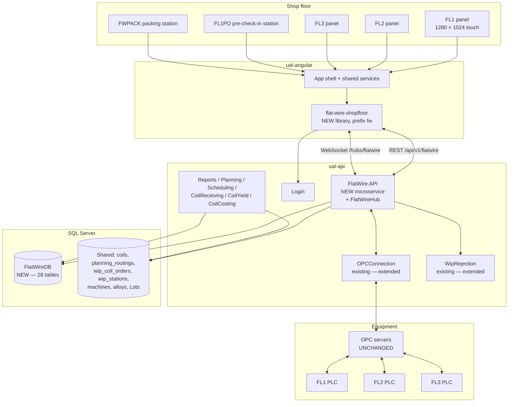
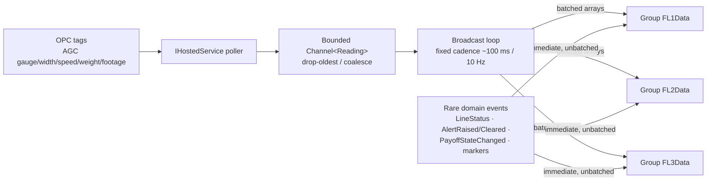
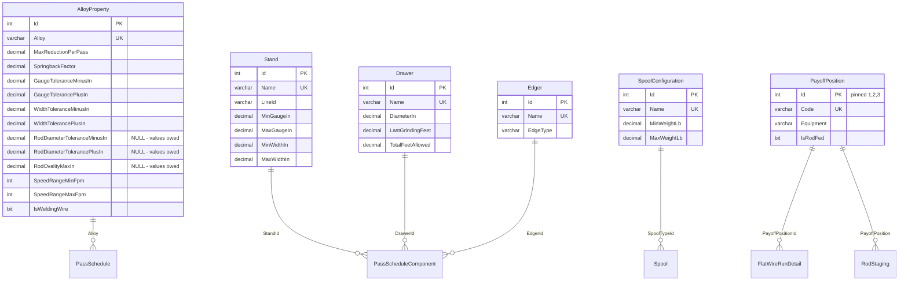
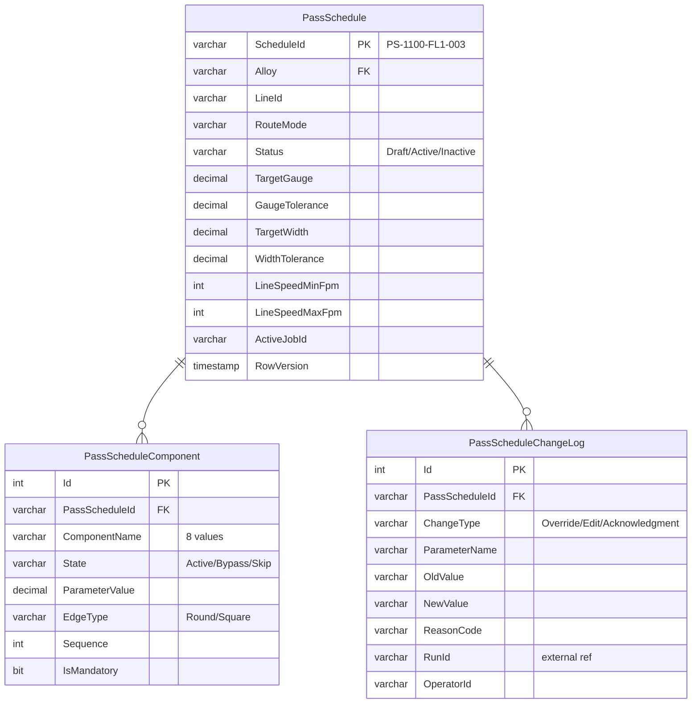
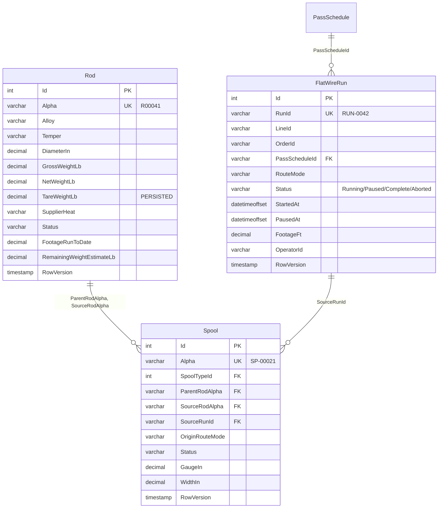
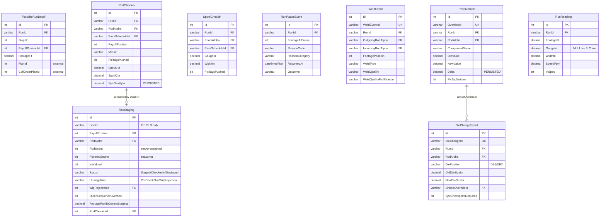
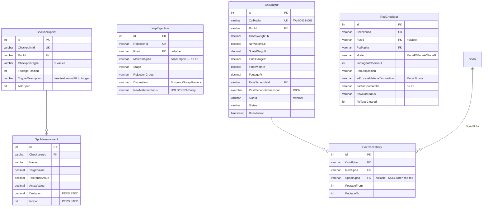

# Flat Wire Mill — High-Level Design & ER Diagram

**Project:** United Aluminum (UAL) — Flat Wire Mill Module
**Last Updated:** August 13, 2026 — **§14 added**: the stack ADR absorbed from `03-HLD-and-ERDiagram.md` §14, which was deleted in the same pass *(body otherwise August 6, 2026)*
**Document Type:** High-Level Design + Entity-Relationship model + the stack ADR (§14)
**Status:** Baselined for build — design risks in §13.2, unresolved items in §13.3; the §14 decisions are **Accepted**, not proposed
**Owner:** Architecture stream
**Audience:** Architects, Angular / .NET developers, DBA
**Sources:** [`../FlatWire_MasterSpecification.md`](../../LatestDocument/FlatWire_MasterSpecification.md) §5, §6.7, §8 · [`../DBChanges/Schema/SQL/`](../DBChanges/Schema/SQL/) (**counted, not quoted**) · [`../../MVP-1/ProjectPlan/ShopfloorPlan/00-foundations.md`](ShopfloorPlan/00-foundations.md) §0.2 / §0.4 · [`c:\UAL\CLAUDE.md`](../../../CLAUDE.md) ecosystem conventions

**Companion documents:** `[VS]` [01-VisionAndScope.md](./01-VisionAndScope.md) · `[SRS]` [02-SRS.md](./02-SRS.md) · `[API]` [04-APIContract.md](./04-APIContract.md) · `[SP]` [05-SprintPlanAndBacklog.md](./05-SprintPlanAndBacklog.md) · `[TP]` [06-TestPlanAndTestCases.md](./06-TestPlanAndTestCases.md) · `[DR]` [07-DeploymentRunbookAndRollback.md](./07-DeploymentRunbookAndRollback.md)

---

## 1. Architecture overview

### 1.1 Context



Three facts this diagram encodes that are easy to get wrong:

1. **`FlatWireHub` lives inside `FlatWire.API`.** The shared `Notification` service is not extended, and no existing hub is a template.
2. **OPC servers are unchanged.** Only the PLCs are new hardware. The integration point is the existing `OPCConnection` service, extended to subscribe to FL1/FL2/FL3 tags.
3. **`FlatWireDB` is a new standalone database.** It is not an extension of `united_db`. The cross-database writes to the shared schema are real and are the reason §10 exists.

### 1.2 Component view

| Component | Repository | Responsibility |
|---|---|---|
| `flat-wire-shopfloor` | `c:\UAL\ual-angular` | All 22 screens, all `fw`-prefixed controls, the SignalR client, line/run state |
| `FlatWire.API` | `c:\UAL\ual-api` | Thin controllers over MediatR; `FlatWireHub`; OPC ingest hosted service; `PLCTagService` |
| `FlatWire.Application` | `c:\UAL\ual-api` | Commands, queries, validators, pipeline behaviours |
| `FlatWire.Domain` | `c:\UAL\ual-api` | Aggregates, param models, enums, `IFlatWireClient` |
| `FlatWire.Infrastructure` | `c:\UAL\ual-api` | `FlatWireDbContext` (EF Core), Dapper readers, repositories, `PLCTagService` |
| `FlatWireDB` | `ual-database` | **MVP-1 build: 25 tables · 33 FKs · 41 index statements in script 07 · 1 procedure · 1 trigger** — counted from the scripts, comments stripped, 13 Aug 2026. **The full design is 28 tables / 43 FKs**; the three `PassSchedule*` tables and ten of the FKs are owned outside MVP-1 and built by `MVP-2/DBChanges`. *(The "64 non-clustered indexes" previously quoted here was a `sys.indexes` count from a deployed database, which includes constraint-backed indexes script 07 does not create — see §6.8.)* |

---

## 2. Where the code lands — and the binding reference rules

### 2.1 Locations

| Layer | Repository | Location | Status |
|---|---|---|---|
| Frontend | `c:\UAL\ual-angular` | **New library `flat-wire-shopfloor`**, prefix `fw`, at `projects/flat-wire-shopfloor/` | Not started |
| Backend | `c:\UAL\ual-api` | **New domain `API/Domain/FlatWire/`**, 4 projects + `FlatWire.sln` | Not started |
| Database | `ual-database` | **New `FlatWireDB`**; the FW-001 renames stay in the existing shared scheduling schema | DDL written and validated; **not deployed** |
| Planning artifacts | `c:\UAL\Flatwire-planning` | This repository | Complete |

`MVP-1/ProjectPlan/Flat Wire.code-workspace` opens this folder alongside both code repositories.

### 2.2 Reference-code rules — binding, and non-obvious

These are the rules most likely to be broken by a developer working from habit or from the two stale implementation documents in this repository. They are **decisions**, not preferences.

**Backend — what to copy:**

| Existing domain | Role for Flat Wire |
|---|---|
| **`API/Domain/CoilCheckin`** | **The primary template.** Copy the controller shape, the MediatR command pattern, `Program.cs`, the four `.csproj` files and the NuGet set |
| `API/Domain/OPCConnection` | The OPC/PLC tag read/write layer to integrate with. **`OPCManagerHub.cs` is *not* a template** — the real-time layer is purpose-built (§4) |
| `API/Domain/WipRejection` | Existing service to **extend** for flat-wire outlets |
| `API/Framework/UA.Framework.API/UAController.cs` | The base controller every new controller extends; the standard `Data` / `Success` / `Errors` envelope |
| `Notification`, `Login`, `Common`, `Shared`, `Reports`, `Planning`, `Scheduling`, `CoilReceiving`, `CoilYield`, `CoilCosting` | Cross-cutting and upstream services touched by later phases |

> **`API/Domain/SlitterInterface` is explicitly NOT a reference** — neither for UI/structure nor for the real-time / `CoilDataHub` pattern.

**Frontend — what NOT to copy.** There is **no Angular structural, UI or CSS template.** `flat-wire-shopfloor` is all-new screens and controls built from `MVP-1/Mockups/`. The following are **not** references: `checkin-precheckin`, `shop-floor` / `shop-floor-common`, `statistical-process-control`, `wip-rejection`, `slitter-*`, `coil-receiving`, `common-grid` / `multi-grid-layout`, `opc`, `label-printing`, `print-traveler`.

**The only frontend reuse** is the foundational, app-wide `shared` services, consumed so the library plugs into the existing app shell rather than re-inventing plumbing:

`api-gateway.service` · `app-config.service` · `login.service` + `login-api.service` · `token-interceptor.service` · `correlation-id-interceptor.service` + `correlation-id.service` · `error-handler.service` + `global-error-handler-api.service` · `ui-log.service` · `notification.service` · `subscription.service` · `print-export.service` · `util.service`

**Do not rebuild these, and do not add new interceptors.** The Flat Wire real-time client is purpose-built; existing SignalR hub clients such as `supervisor-monitor-hub.service.ts` are **not** copied.

> **`flat-wire-shopfloor` joins the `build:shop-floor` npm chain for build ordering only.** That is a build-sequencing concern and implies **no** UI or code reuse from the other libraries in the chain.

> **The two documents that contradicted these rules were deleted on 13 Aug 2026** (recoverable at `1964086`) — recorded because the instructions survive in git history. `CheckinImplementationPlan.md` and `CheckinImplementationPrompt.md` told developers to "copy patterns from `checkin-precheckin`", to port the **retired** interim DB2 layout (which held the `dashboard_2_rod_checkin.html` filename until 11 Aug 2026, when the approved wizard took it), and to build a `--fw-*` token system. **All three instructions are wrong**, and they cited story IDs (`FW-S3-009`, `FW-S1-001`) that do not exist — the real ones are FW-061 and FW-082. What was worth keeping was rehomed: the stub-first delivery contract is `ShopfloorPlan/00-foundations.md` §0.5, and the canonical fixture set is the DB seed.

---

## 3. Backend design

### 3.1 Solution structure

```
API/Domain/FlatWire/
├── FlatWire.sln
├── FlatWire.API/            controllers (thin) + Hubs/FlatWireHub.cs + Program.cs + appsettings
├── FlatWire.Application/    Commands/ and Queries/ (MediatR), pipeline behaviors
├── FlatWire.Domain/         AggregatesModel/, ParamModels/, Enums/, IFlatWireClient
└── FlatWire.Infrastructure/ Repositories/, Services/PLCTagService.cs, Context/FlatWireDbContext.cs
```

Project references: `API → Application, Domain, Infrastructure` · `Application → Domain` · `Infrastructure → Domain`.

### 3.2 Layering rules

| Layer | Contains | Must not contain |
|---|---|---|
| **API** | Controllers extending `UAController`, `FlatWireHub`, DI wiring, `Program.cs` | Business logic, EF queries, direct OPC calls |
| **Application** | MediatR command/query handlers, FluentValidation validators, pipeline behaviours | EF `DbContext` types, HTTP types, SignalR types |
| **Domain** | Aggregates (`FlatWireRun`, `PassSchedule`, `RodStaging`, `WeldEvent`, `CoilOutput`), enums, `IFlatWireClient` | Persistence concerns, framework attributes |
| **Infrastructure** | `FlatWireDbContext`, repositories, Dapper readers, `PLCTagService`, the OPC hosted service | Business rules |

**Controllers are thin.** All logic routes through MediatR. Every controller and endpoint carries `[Authorize]`.

### 3.3 CQRS and data access

Data access is **mixed per UAL convention**:

| Access | Technology | Used for |
|---|---|---|
| Entity writes | **EF Core** via `FlatWireDbContext` | Every command — check-in, staging, weld, SPC, override, checkout, coil completion |
| High-volume reads | **Dapper** | Gauge trace, shift summary, list grids, the staging-queue projection |

Two read procedures back the heaviest queries (§6.8): `sp_GetGaugeTrace` and `sp_ShiftSummary`.

### 3.4 Validation, behaviours and errors

| Concern | Implementation |
|---|---|
| Request validation | **FluentValidation** per command, invoked by a MediatR pipeline behaviour. Examples: the mandatory FM2 stand `FM2_S3` must be `Active`; FL3 requires `RouteMode = Hybrid`; `State ∈ {Active, Bypass, Skip}`; `lineId = FL2` is rejected at `/staging/rod` |
| Response envelope | `UAController` standard `Data` / `Success` / `Errors` — see `[API §1]` |
| Logging | **Serilog**, structured, with the correlation ID from the inbound header |
| Error handling | Domain rule violation → `422`; concurrency / uniqueness → `409`; not found → `404`; PLC failure → `500` with the transaction aborted and compensating writes issued |
| Concurrency | `ROWVERSION` tokens on `PassSchedule`, `Rod`, `FlatWireRun`, `Spool`, `CoilOutput` |

---

## 4. Real-time architecture

Purpose-built for high-frequency AGC telemetry. Design goals: **low latency, minimal payload, no operator-screen change-detection storms, graceful degradation under burst load, horizontal-scale readiness.**

> **This is deliberately not a copy of `CoilDataHub`, `OPCManagerHub` or `supervisor-monitor-hub`.** Those patterns were reviewed and rejected for this workload.

### 4.1 Transport and protocol

- **WebSockets-first** (`SkipNegotiation` where the topology allows); SSE and long-poll only as a last-resort fallback. **IIS WebSockets must be enabled on the deployment target** — see `[DR §4.4]`.
- **MessagePack** hub protocol on both ends — `AddSignalR().AddMessagePackProtocol()` server-side, `@microsoft/signalr-protocol-msgpack` client-side. Binary, compact, fast for dense numeric telemetry. *(Treat as **measure-first**: batching and decimation are the real win, and MessagePack is a new client dependency the repository does not otherwise use — gap **G10**.)*
- **Strongly-typed hub:** `FlatWireHub : Hub<IFlatWireClient>` — a compile-time contract, no magic-string method names.

### 4.2 Ingest → broadcast pipeline (backpressure-safe)



- The **bounded channel** decouples the PLC poll rate from client fan-out and caps memory under bursts.
- The broadcast loop **drains on a fixed cadence** and sends **batched arrays** per line group, collapsing thousands of AGC samples per second into a steady, bounded message rate.
- **Coalesce / delta:** `ComponentStatus` and `LineStatus` are sent only on change; hot numeric channels are decimated to the cadence.
- **Split by frequency:** hot telemetry batched; rare domain events sent immediately, unbatched. **`PayoffStateChanged` must never enter the ~100 ms telemetry batch** — a bay changing hands is an operator-visible state transition, not a sampled reading.
- **FL2 standalone suppresses the batched gauge/width channels** — its historical profile is a REST query. Status and marker events still flow.

### 4.3 Groups, reliability and scale

- Per-line groups `FL1Data` / `FL2Data` / `FL3Data`; clients `JoinLineGroup` on the screens they open and `LeaveLineGroup` on teardown, so the server fans out only to interested clients.
- Tuned `KeepAliveInterval` / `ClientTimeoutInterval`; **automatic reconnect with exponential backoff plus line-group re-join on reconnect**.
- **Scale-out ready:** the hub is stateless. If `FlatWire.API` runs multi-instance, add a **Redis backplane or Azure SignalR Service** — configuration only, no code change. A single instance is fine for the trial.
- Auth: JWT via `?access_token=`; hub methods `[Authorize]`.

### 4.4 Client rendering — no change-detection storms

- SignalR callbacks run **outside the Angular zone** (`NgZone.runOutsideAngular`); incoming batches land in a **ring buffer** in `flat-wire-signalr.service`.
- Charts and gauges refresh on a **`requestAnimationFrame` throttle** coalesced to ~60 fps, re-entering the zone once per frame; Chart.js is updated in place (`update('none')`); `ChangeDetectionStrategy.OnPush` everywhere; trace components keep a **fixed window (e.g. the last 500 points)** to bound DOM and GPU work.
- A **PWA service worker** caches the pass schedule and active-run snapshot so an operator screen does not go blank during a short network drop (`[SRS]` `FR-119`).

### 4.5 Non-functional position

Known targets: **1-second default push interval, configurable to 5/10/30 s, with no polling** (`NFR005`); **two simultaneous dashboard instances** (`NFR007`); **reconnect over cached state, never a blank screen** (`NFR006`).

**Undefined:** AGC sample rate, concurrent client count, latency budget, `RunReading` retention. A hub load test is scheduled at QA2 **with no pass criteria** — gap **G9** / **OI-34**. **If the load test fails, the real-time rework is not in the effort model.**

---

## 5. Frontend design

### 5.1 Library structure

Scaffolded with `ng generate library flat-wire-shopfloor --prefix=fw`, registered in `angular.json` and `tsconfig` paths, added to the `build:shop-floor` npm chain.

```
projects/flat-wire-shopfloor/src/lib/
├── components/            one folder per screen (DB1 … DB12, DB2A, DB7b, DB9A, DC, DM, OEE)
├── components/shared/     the fw-prefixed reusable controls ([SRS §7.6])
├── services/              flat-wire-api-*.service, flat-wire-signalr.service,
│                          line-context.service, run-state.service
├── models/                DTOs + the TypeScript mirror of the canonical enums
├── guards/                FlatWireAuthGuard, FlatWireRoleGuard
├── styles/                consumes flat-wire-shopfloor.styles.scss as-is
├── flat-wire-shopfloor.module.ts
├── flat-wire-shopfloor-routing.ts
└── public-api.ts
```

This is the **standard Angular library layout, not copied from any existing feature library**.

### 5.2 Routing

Lazily-loaded `FLAT_WIRE_ROUTES` under `/flat-wire`, per-line:

```
/flat-wire/line/:lineId/checkin/rod
/flat-wire/line/:lineId/staging            (FL1, FL3 only — guarded)
/flat-wire/line/FL2/checkin/spool
/flat-wire/line/:lineId/run/active
/flat-wire/line/:lineId/run/weld | spc | rolladjust | diechange | checkout
/flat-wire/status                          (DB1)
/flat-wire/passschedule | /passschedule/:id  (DB9A / DB9 — role-guarded)
/flat-wire/shift | /packing | /dies
```

### 5.3 The API client — two implementations

`flat-wire-api.interface.ts` with **two implementations**:

| Implementation | Backed by | Selected when |
|---|---|---|
| `flat-wire-api-real.service.ts` | The shared `api-gateway.service` | `useMockData = false` |
| `flat-wire-api-mock.service.ts` | The canonical fixture set, mirroring the DB seed | `useMockData = true` (`environment.development.ts`) |

DI-swapped by the `useMockData` environment flag. **This is what lets the UI be built against dummy data before the service exists** — the stub-first delivery model in `[API §7]`.

The mock service must mirror the **DB seed**, not invent fixtures: alphas `R00041`–`R00043`, `SP-00021`, `PS-1100-FL1-003`, `RUN-0042` / `RUN-0043`. Older implementation documents use inconsistent fixtures (`PS-1100-FL2-001` vs `-007`) — **do not follow them**.

### 5.4 State

`line-context.service` (which line is in scope) and `run-state.service` (active alpha, footage, payoff) over RxJS `BehaviorSubject`s. **No NgRx** — it is not used in the repository.

### 5.5 Charts

| Use | Technology | Why |
|---|---|---|
| Live streaming gauge/width traces | **Chart.js**, updated in place with `update('none')` | Bounded redraw cost under a 10 Hz feed |
| Historical FL2 profile | **Inline SVG** | The mockup's profile is hand-crafted SVG, not Chart.js |

`gauge-trace-chart` is **one component with an `isLive` flag**, not two components.

### 5.6 Mockup → component mapping

The mockups are the pixel authority. Two mechanical rules carry over from them into the Angular build:

1. **Clone Dashboard 12's skeleton, not Dashboard 2's**, when starting a new screen — DB2's `dashboard_2_rod_checkin.html` inlines its own app bar and omits `flat-wire-topbar.js`.
2. **Consume `flat-wire-shopfloor.styles.scss` as-is.** There is no token migration; the `--fw-*` prefix in older documents is stale (gap **G18**). Angular components need `ViewEncapsulation.None` or `:host` scoping so the tokens resolve.

---

## 6. Data model

### 6.1 Target database and authority

The flat-wire-specific model lives in a **new standalone SQL Server database, `FlatWireDB`** (schema `dbo`), created by `FlatWire_DDL_00_Database.sql` with `READ_COMMITTED_SNAPSHOT ON` and `ALLOW_SNAPSHOT_ISOLATION ON`. **It is not an extension of `united_db`.** Any DDL header still reading `USE [united_db]` is stale.

> **The executable DDL is the authority for column-level types.** The per-domain markdown design docs (`Schema/FlatWireSchema_*.md`) declare many numeric columns as bare `decimal` — which SQL Server resolves to `decimal(18,0)`, **zero fraction**. Regenerating DDL from those docs would round weights and measurements to whole numbers. **Never regenerate the DDL from the markdown**; correct the markdown up to the DDL.

### 6.2 Table count — counted, not quoted

**MVP-1 builds 25 tables. The full design is 28.** Both figures were taken by counting `CREATE TABLE` statements with comments stripped, on 13 Aug 2026 — not copied from any document:

| Group | Script | Count | Scope | Tables |
|---|---|---|---|---|
| **Lookup / Reference** | `01_Lookup` | **7** | MVP-1 | `Stand` · `Drawer` · `Edger` · `SpoolConfiguration` · `AlloyProperty` · `PayoffPosition` · **`Dancer`** |
| **Schedule** | `02_Schedule` | **3** | **MVP-2** | `PassSchedule` · `PassScheduleComponent` · `PassScheduleChangeLog` |
| **Materials** | `03_Materials` | **3** | MVP-1 | `Rod` · `FlatWireRun` · `Spool` |
| **Runs** | `04_Runs` | **9** | MVP-1 | `FlatWireRunDetail` · `RodStaging` · `RodCheckin` · `SpoolCheckin` · `RunPauseEvent` · `WeldEvent` · `RollOverride` · `DieChangeEvent` · `RunReading` |
| **Quality / Output** | `05_QualityOutput` | **6** | MVP-1 | `SpcCheckpoint` · `SpcMeasurement` · `WipRejection` · `CoilOutput` · `CoilTraceability` · `RodCheckout` |
| | | **25** | **MVP-1 build** | `FlatWire_DDL_RunAll.sql` skips `02_Schedule` deliberately |
| | | **28** | full design | MVP-1 + the three MVP-2 `PassSchedule*` tables |

**Two corrections landed here on 13 Aug 2026.** The Lookup row said **6** and omitted **`Dancer`**, which `01_Lookup` does create — the same omission `GapAnalysis.md` **E1**/**E3** records against the ER documentation and the script's own header. And the prose said "28 tables" above a table that summed to **27**, which is how a figure nobody could reproduce stayed in circulation.

**Other counts circulating in the repository — all superseded:** 20 → 21 → 22 → 24 → 27. `CLAUDE.md`'s *"verified … 24 tables"* is the most recent of them and is also wrong; the deployed-database check in `[DR §4.2]` now expects **25**.

`FlatWireRun` is created in `03_Materials`, **not** `04_Runs`, so that `Spool.SourceRunId` can reference it.

### 6.3 The `Rod` table decision — resolve it loudly

**`Rod` is retained as a `FlatWireDB`-local master with enforced rod-alpha foreign keys.** It mirrors the shared legacy `coils` record populated by the Receiving module.

This is the **"Hybrid foundation" decision (D-04)**, and it **reverses** the earlier `00-foundations.md` decision 3 / `phase-01c` position that `Rod` should be **dropped**, with every rod-alpha reference becoming an unenforced cross-database logical link to `coils` (21–22 tables). **The DDL and the ER document are the later artifacts, they win, and they are the ones that were built and validated.**

Consequence: `Spool.ParentRodAlpha`, `Spool.SourceRodAlpha`, `RodStaging.RodAlpha`, `RodCheckin.RodAlpha`, `WeldEvent.OutgoingRodAlpha` / `IncomingRodAlpha`, `RollOverride.RodAlpha`, `DieChangeEvent.RodAlpha`, `CoilTraceability.RodAlpha` and `RodCheckout.RodAlpha` all carry **real, enforced FKs** to `Rod.Alpha`.

> **The stale side, named explicitly so nobody builds from it:** `MVP-1/ProjectPlan/ShopfloorPlan/00-foundations.md` decision 3 and `MVP-1/ProjectPlan/ShopfloorPlan/phase-01c-database-foundation.md` both describe dropping `Rod`. **Anyone reading either in isolation will build the wrong schema.**
>
> **The unresolved consequence** of keeping a mirror — how and when `Rod` is synchronised with `coils`, which side is master for each shared column, and what happens when they diverge — is **OI-42**. It is a real design hole, not a documentation nit: it creates two sources of truth for rod material with no reconciliation.

### 6.4 `FlatWireRun` is the hub

Every in-process event is a child of `FlatWireRun` via `RunId`. The certificate genealogy chain is:

```
CoilOutput.CoilAlpha → CoilTraceability(FootageFrom..FootageTo) → Rod.Alpha → supplier heat / lot
```

### 6.5 Table inventory — purpose and key columns

**Group 1 — Lookup / Reference**

| Table | Purpose | Key columns / constraints |
|---|---|---|
| `Stand` | Rolling-mill finishing stands | `Name` UNIQUE — position only (`FM1`, `FM2_S1`, `FM2_S2`, `FM2_S3`), `LineId` (NULL = shared), **`RollDiameterIn DECIMAL(5,3)` > 0** (FM1 12.000; FM2 S1 8.000, S2 6.000, S3 6.000), gauge and width ranges `DECIMAL(8,4)` with Min<Max checks. *(Aug 4 2026: FM2 is three stands and diameter moved out of the name into `RollDiameterIn`. The DDL comment on `MinWidthIn` says "strip width" — a source terminology slip; the column means flat wire width.)* |
| `Drawer` | Draw-box die configurations | `Name` UNIQUE, `DiameterIn DECIMAL(8,4)` > 0, optional feed-diameter range. **Die life (6 Aug 2026):** `LastGrindingFeet DECIMAL(10,2)` NOT NULL DEFAULT 0 — feet run *since* the last grind, not the reading at it — and `TotalFeetAllowed DECIMAL(10,2)` NULL, the scheduled-life threshold (NULL until **OQ-83** supplies values). **No `LastGrindingFeet ≤ TotalFeetAllowed` check** — *overdue* is a displayed state, not a data error |
| `Edger` | Edger tooling configurations | `EdgeType` CHECK IN (`Round`,`Square`), `ToolingSetNo` |
| `SpoolConfiguration` | Spool type constraints | Weight / core-diameter / outer-diameter ranges with Min<Max checks |
| `AlloyProperty` | Per-alloy process properties; the **local** parent for `PassSchedule.Alloy` | `Alloy` UNIQUE, `MaxReductionPerPass DECIMAL(5,3)`, `SpringbackFactor`, tolerance defaults, speed range, `IsWeldingWire`. **`LbPerFtFactor` must not be populated** (seeded NULL, "OQ-10 PENDING") and `DensityLbPerIn3` **duplicates `united_db..alloys.alloy_density`** — see §6.6 |
| `PayoffPosition` | Material input/output positions | **Pinned Ids, not IDENTITY**: 1 `Payoff1` (VPS, 9,000 lb, rod-fed), 2 `Payoff2` (VPS, 9,000 lb, rod-fed), 3 `TraversingTakeup`. Seeded **by the DDL itself**, because the `FlatWireRunDetail` FK depends on the rows existing |

> **Deliberate narrowing.** Rod-fed tables (`RodStaging`, `RodCheckin`, `RodCheckout`, `SpoolCheckin`) keep `CHECK (PayoffPosition IN (1,2))`. That is intentional — a rod bundle only ever mounts on a VPS bay. `TraversingTakeup` exists so FL2 can be represented without a fourth vocabulary, but **it currently has no UI anywhere** (**OI-80**).

**Group 2 — Schedule**

| Table | Purpose | Key columns / constraints |
|---|---|---|
| `PassSchedule` | The configuration header — the machine's brain | `ScheduleId VARCHAR(30)` **PK clustered, natural key** (`PS-1100-FL1-003`); `Alloy` FK → `AlloyProperty`; `LineId` CHECK; `RouteMode` CHECK; `Status` CHECK (`Draft`,`Active`,`Inactive`); target gauge/width + tolerances; input rod spec; speed range; `ActiveJobId`; audit quad; `ROWVERSION`. **`UX_PassSchedule_OneActivePerLineAlloy`** — filtered UNIQUE on `(LineId, Alloy) WHERE Status='Active'` |
| `PassScheduleComponent` | Per-component rows (renamed from `FlatLineSetup`) | `ComponentName` CHECK over the eight names; **`State` CHECK IN (`Active`,`Bypass`,`Skip`) — three values, never a boolean**; `ParameterValue` must be NULL unless `State='Active'`; `EdgeType` required when an `EdgeSet` component is Active; `Sequence` UNIQUE with the schedule; `IsMandatory`; FKs to `Stand`/`Drawer`/`Edger`. **`CK_PSC_FM1NotBypassable`** — `FM1` must be `Active` |
| `PassScheduleChangeLog` | Immutable audit trail | `ChangeType` CHECK IN (`Override`,`Edit`,`Acknowledgment`); parameter, old→new, reason code and notes, `RunId` context, operator, server timestamp. Backs the DB9 Change History tabs |

**Group 3 — Materials**

| Table | Purpose | Key columns / constraints |
|---|---|---|
| `Rod` | Wire rod receiving and lifecycle (mirrors `coils`) | `Alpha` UNIQUE — the scan key; alloy/temper; `DiameterIn` > 0; gross/net weight; **`TareWeightLb` PERSISTED computed**; `SupplierHeat` — the far end of the cert chain; `Status` CHECK over the six material statuses; **`FootageRunToDate`** and **`RemainingWeightEstimateLb`** — the carry-forward columns; `ROWVERSION`. *(`StagedPayoffPosition` and `IsWelded` were removed 29 Jul 2026 — a nullable column pair cannot express "one rod per payoff bay")* |
| `FlatWireRun` | **The run header — the hub** | `RunId VARCHAR(20)` UNIQUE (`RUN-0042`); `LineId`; `OrderId`; `PassScheduleId` FK; `Alloy` denormalised; `RouteMode`; `Status` CHECK (`Running`,`Paused`,`Complete`,`Aborted`); `StartedAt` / `PausedAt` / `CompletedAt`; **`FootageFt DECIMAL(10,2)` updated live from the PLC**; `OperatorId`; `ROWVERSION` |
| `Spool` | Pre-drawn intermediate spools | `Alpha` UNIQUE (`SP-00021`); `SpoolTypeId` FK; **`ParentRodAlpha`** and **`SourceRodAlpha`** FKs → `Rod.Alpha`; `SourceRunId` FK → `FlatWireRun`; `OriginRouteMode` — FL2 rejects a Standalone schedule on Hybrid-origin material; `Status`; gauge/width set at FL2/FL3 check-in; `ROWVERSION` |

**Group 4 — Runs**

| Table | Purpose | Key columns / constraints |
|---|---|---|
| `FlatWireRunDetail` | Per-stop detail (renamed from `FlatLineProcessing`) | `RunId` FK; `StopNo` / `SequenceNo`; **`PlanId` / `CoilOrderPlanId` are external references with no local parent**; `PayoffPositionId` **FK → `PayoffPosition.Id`**; footage; on-gauge weight; per-stop targets; start/exit gauge; output OD/ID |
| `RodStaging` | Pre-check-in — **the most heavily constrained table in the schema.** FL1 and FL3 only | See §6.7 |
| `RodCheckin` | Rod check-in record | `RunId`/`RodAlpha`/`PassScheduleId` FKs; measured diameter; verified weights; `MmsId` + `MmsStatus`; `PlcTagsPushed`; **four** inspection columns NOT NULL including `InspectionConnectorTag`; **`SpcM1In` / `SpcM2In` NOT NULL** with `SpcOvalityIn` PERSISTED computed as `ABS(M1−M2)` |
| `SpoolCheckin` | Mirrors `RodCheckin` for the spool feed | `LineId` CHECK IN (`FL2`,`FL3`); `SpoolAlpha` FK; `GaugeIn`/`WidthIn` NOT NULL (operator-measured); single `InspectionSurface` column |
| `RunPauseEvent` | Pause / resume | `FootageAtPause`; reason code + category; **`Notes` required when `ReasonCategory='Other'`**; `ResumedAt` NULL = still open; `PauseDurationSeconds` computed; `Outcome` CHECK IN (`ResumeRun`,`LogWipRejection`,`CheckOutRod`,`ContinuePause`) |
| `WeldEvent` | The induction weld join | `WeldEventId` UNIQUE; **both** rod alphas FK → `Rod.Alpha`; **both** payoff positions with `CK_WeldEvent_PayoffDiff` — a bay cannot be welded to itself; `FootagePosition` from the encoder; `WeldType` CHECK (`InductionWeld`,`LaserWeld` — **induction is the only live type**); `WeldQuality`; **fail reason mandatory when quality is `Fail`**; server-side timestamp |
| `RollOverride` | Run-level roll-gap override | `OverrideId` UNIQUE; `RunId`/`RodAlpha` FKs; component name; old/new value with **`Delta` PERSISTED computed**; reason code CHECK over eight values; measured gauge/width; `PlcTagWritten` |
| `DieChangeEvent` | Die change | `DieChangeId` UNIQUE; `DiePosition` CHECK (`DB1`,`DB2`); old/new die size; **`ReasonCode` CHECK carries eight values** because it merges the screen's five with an earlier API list — **build the UI against the five** (`PlannedLife`, `GaugeDrift`, `DieFailure`, `SizeChange`, `Other`); `LinkedOverrideId` FK → `RollOverride`; `SpcCheckpointRequired` default 1 |
| `RunReading` | The sampled gauge/width/speed profile | `RunId` FK; `FootageFt`; **`GaugeIn` NULL for the FL2 standalone live feed**; `WidthIn`; `SpeedFpm`; `InSpec`; `ReadingTs`. **Not a per-tick historian** — writes are sampled/decimated. Indexed `(RunId, FootageFt)`. **Retention and rollup policy undefined — OI-17** |

**Group 5 — Quality / Output**

| Table | Purpose | Key columns / constraints |
|---|---|---|
| `SpcCheckpoint` | Checkpoint header | `CheckpointId` UNIQUE; `RunId` FK; **`CheckpointType` CHECK over five values including `RollAdjustTrigger`**; `FootagePosition` captured when the checkpoint **opens**; `TriggerDescription` free text; `AllInSpec` tri-state |
| `SpcMeasurement` | Per-measurement rows | `CheckpointId` FK; `Name`; target / tolerance / actual; **`Deviation` and `InSpec` both PERSISTED computed** |
| `WipRejection` | WIP rejection | `RejectionId` UNIQUE; **`RunId` NULLABLE** for pre-run rejections; **`MaterialAlpha` is polymorphic (rod *or* spool) with no FK**; stage; group CHECK over five values; disposition CHECK (`Suspend`,`Scrap`,`Rework`); `NewMaterialStatus` CHECK (`HOLD`,`SCRAP`) |
| `CoilOutput` | The finished coil | `CoilAlpha` UNIQUE; `RunId` FK; gross/net weight with `NetWeightOverrideLb` and `ScaleWeightLb`; final gauge/width; footage > 0; `PassScheduleId` FK + **`PassScheduleSnapshot NVARCHAR(MAX)` JSON**; **`SkidId` is an external reference**; `SkidStatus`; `StagingLocation`; `Status` CHECK (`COMPLETE`,`HOLD`,`SCRAP`); `ROWVERSION` |
| `CoilTraceability` | **The genealogy chain** | `CoilAlpha` FK → `CoilOutput`; `RodAlpha` FK → `Rod`; **`SpoolAlpha` FK → `Spool`, nullable — NULL on a rod-fed run, filtered index**; `FootageFrom` < `FootageTo`. **Non-overlap enforced by trigger** `trg_CoilTraceability_NoOverlap`, because SQL Server has no exclusion constraint. Ranges are half-open `[From, To)` |
| `RodCheckout` | All three checkout modes | `CheckoutId` UNIQUE; **`RunId` NULLABLE** for Modes P and A; `Mode` CHECK (`ModeP`,`ModeA`,`ModeB`); footage; reason; `RodDisposition` CHECK over five values; `InProcessMaterialDisposition` **Mode B only**; `PartialSpoolAlpha` **no FK**; `NewRodStatus` CHECK; `PlcTagsCleared`. Per-mode rules enforced by `CK_RodCheckout_ModeP` and `CK_RodCheckout_ModeB` |

### 6.6 Weight derivation — and why `AlloyProperty` must not own density

**There is no single footage-to-weight factor.** A scalar lb/ft is valid for exactly one gauge × width, and the line runs 0.110″ × 0.625″ on FL1 and finishes to 0.0160″ × 0.625″ on FL2 — a **7× difference in cross-section**. Compute it from density at runtime:

```
lb/ft  =  A(in²) × 12(in/ft) × ρ(lb/in³)

Square edge:  A = t × w
Round edge:   A = t·w − t²(1 − π/4)  =  t·w − 0.2146·t²
```

Round edge is a rectangle with semicircular ends, so it holds **less** metal than the bounding rectangle: **−3.8 %** at 0.110″ × 0.625″, **−3.1 %** at 0.125″ × 0.875″, but only **−0.6 %** at 0.0160″ × 0.625″. The correction matters most on thick-gauge FL1 spools — exactly where the 2,000 lb target sits.

The reusable constant is **`k = 12ρ`**, so `lb/ft = A × k`:

| Alloy | ρ (lb/in³) | **k (lb per in²·ft)** | 0.110″ × 0.625″ square / round | 0.0160″ × 0.625″ |
|---|---|---|---|---|
| 1100 | 0.0980 | **1.1760** | 0.0809 / 0.0778 | 0.0118 / 0.0117 |
| 1350 | 0.0974 | **1.1688** | 0.0804 / 0.0773 | 0.0117 / 0.0116 |
| 3003 | 0.0990 | **1.1880** | 0.0817 / 0.0786 | 0.0119 / 0.0118 |
| 5052 | 0.0971 | **1.1652** | 0.0801 / 0.0770 | 0.0117 / 0.0116 |
| 6061 | 0.0975 | **1.1700** | 0.0804 / 0.0774 | 0.0117 / 0.0116 |

**Density and draw reduction already exist upstream — read across, do not duplicate.**

| `AlloyProperty` column | Already in `united_db..alloys` | Verdict |
|---|---|---|
| `DensityLbPerIn3` | **`alloy_density`** `[float] NULL` | Exact duplicate — **read across** |
| `MaxReductionPerPass` | **`Draw_max_reduction`** / `Draw_min_reduction` | **The generator's core input.** Read across |
| *(machine capability)* | `alloy_max_gauge` | Overlaps the `Stand` gauge range — reconcile |
| `IsActive` | `alloy_status`, `IsActive` | Two flags already exist upstream |

**The unit is verified as lb/in³**, not g/cm³ — `PlanningDB..Planning_GetorderminPIW` computes `((alloy_density × PI() × width) / 4) × (OD² − ID²) / width`, which reduces to `ρ × π/4 × (OD² − ID²)` and yields pounds per inch of width only if ρ is lb/in³. So `k = 12ρ` holds with **no unit conversion**.

**Access pattern — follow the existing convention.** `united_db..alloys` is already surfaced as a view named **`Alloys`** in six consuming databases (CommonDB, MillsDB, PackingDB, AccountingDB, SlitterDB, PlanningDB). `FlatWireDB` should do the same: create a **`FlatWireDB..Alloys` view** over `united_db..alloys`, which gives one place to absorb three real mismatches rather than repeating them at every call site:

| Mismatch | Detail | Handle in the view |
|---|---|---|
| Type | `alloy_density` is `[float]`; `AlloyProperty.DensityLbPerIn3` is `DECIMAL(10,6)`; consuming procedures variously declare it `DECIMAL(8,5)` or `FLOAT` | `CAST` once |
| Nullability | `united_db..alloys.alloy_density` is **NULLABLE**; `proddb..alloys.alloy_density` is **NOT NULL** — which is authoritative is unstated | Null guard + a decision (**OI-93**) |
| Join width | `alloys.alloy` is `varchar(50)`; `AlloyProperty.Alloy` and `PassSchedule.Alloy` are `varchar(10)` | Project a narrowed column, or key on `alloy_idx` |

> **Tolerance caveat.** `GaugeToleranceMinusIn`/`GaugeTolerancePlusIn` (renamed from `GaugeToleranceDefault` on 1 Aug 2026) are seeded ±0.0020″ for 1100. At the FL1 gauge of 0.110″ that is ±1.8 %; at the FL2 finished gauge of 0.0160″ it is **±12.5 %**, which is meaningless. **Tolerance belongs on `PassSchedule`**, which is where the DDL already puts it — treat the alloy columns strictly as seed defaults for a new schedule, **never as runtime limits**.
>
> **And the tolerance stack breaks the ±2 % variance rule.** Deriving weight from *target* dimensions at 0.110 ± 0.002 and 0.625 ± 0.005 gives a worst case of **±2.6 %** on weight — larger than the ±2 % scale-versus-calculated tolerance in `[SRS]` `FR-153`, so a perfectly in-spec coil trips the supervisor override for no reason. **Recommendation: integrate over `RunReading`** — `weight = Σᵢ A(gaugeᵢ, widthᵢ) × k × Δfootageᵢ` — which removes the tolerance error and uses data the system already persists. Fall back to pass-schedule targets only for **FL2 standalone**, which broadcasts `null`. Basis choice is **OI-45**.
>
> **RESOLVED in shape, not in data (client, 30 Jul 2026 — OQ-22).** ~~There is no rod-diameter tolerance column anywhere in the schema.~~ `AlloyProperty` now carries **four min/max pairs** — gauge, width, rod diameter and an ovality maximum — applied at **both** pre-check-in and check-in, modelled as offsets about nominal so an asymmetric band is expressible. Gauge and width carry their previously seeded symmetric values into both columns; **rod diameter and ovality are NULL because the values are owed by e-mail**, so `CHK007` still cannot fire. The ovality constant hard-coded at `0.003"` in the April check-in implementation plan (deleted 13 Aug 2026) moves here too — **it is per-alloy reference data, not a constant**. Original note follows. ~~`GaugeToleranceDefault` and `WidthToleranceDefault` are flat-wire *output* dimensions. Likely resolution: add `AlloyProperty.RodDiameterToleranceDefault DECIMAL(8,4)`. **OI-07.**

**Prior art worth reading before writing `CoilCompletionService`:** `MillsDB..RollCoil_GetTotalRolledWeightinlastMillRun` already derives total rolled weight for a mill run from `alloy_density`. That is structurally the same problem, and it may already encode UA's convention for tail loss and net-versus-gross.

### 6.7 `RodStaging` — the constraint set that carries business meaning

Two filtered unique indexes are the reason this is a table rather than columns on `Rod`: they make the bay-occupancy invariant **impossible to violate, including under concurrent staging from two clients**.

| Constraint | Rule |
|---|---|
| `CK_RodStaging_Override` | The credential stamp is **all-or-nothing**, keyed on `OutOfSequenceOverride` alone |
| `CK_RodStaging_OutOfSeq` | `ExpectedRodAlpha` present exactly when `OutOfSequenceOverride = 1` |
| `CK_RodStaging_UnstageKind` | `UnstageKind` is NULL or one of `PreCheckOut` / `WipRejection` |
| `CK_RodStaging_RejectLink` | `WipRejectionId` present exactly when `UnstageKind = 'WipRejection'`. Written with `ISNULL(...)`, because a bare comparison is **UNKNOWN** while the column is NULL and a CHECK constraint *accepts* UNKNOWN |
| ~~`CK_RodStaging_OffSched`~~ | **Dropped 1 Aug 2026** with `OffScheduleOverride` / `ScheduledLineId` — a rod booked on the other rod line now triggers an **automatic station switch**, not an override (OQ-24) |
| ~~`CK_RodStaging_OffSchedLine`~~ | **Dropped 1 Aug 2026** |
| `CK_RodStaging_OutOfSeqRod` | `ExpectedRodAlpha <> RodAlpha` |
| `CK_RodStaging_Welded` | `WeldedAt` / `WeldedBy` both set exactly when `IsWelded = 1` |
| `CK_RodStaging_Unstaged` | The three un-stage columns all set exactly when `Status='Unstaged'` |
| `CK_RodStaging_CheckedIn` | `CheckedInAt` / `RodCheckinId` both set exactly when `Status='CheckedIn'` |
| **`UX_RodStaging_Bay`** | filtered UNIQUE `(LineId, PayoffPosition) WHERE Status='Staged'` — **one rod per payoff bay** |
| **`UX_RodStaging_RodActive`** | filtered UNIQUE `(RodAlpha) WHERE Status='Staged'` — **one bay per rod** |

Notable columns: `RodSeqno` (**actual** processing sequence, assigned server-side, monotonic per line) and `PlannedSeqno` (**planned** sequence, snapshotted at staging, with **deliberately no constraint relating the two** — a difference is the normal case); three inspection columns (**three items — do not add a connector-tag item**); `FootageRunToDateAtStaging` (**> 0 forces the carry-forward path**); the override credential stamp (**the PIN is never stored**).

> Any client writing to this table needs `QUOTED_IDENTIFIER ON`.

### 6.8 Indexes and programmability

**Filtered UNIQUE — business rules enforced as indexes:**

| Index | Rule |
|---|---|
| `UX_PassSchedule_OneActivePerLineAlloy` | One `Active` `PassSchedule` per `(LineId, Alloy)` |
| `UX_RodStaging_Bay` | One `Staged` rod per `(LineId, PayoffPosition)` |
| `UX_RodStaging_RodActive` | One `Staged` bay per `RodAlpha` |

**Index count — counted, not quoted.** `FlatWire_DDL_07_Indexes.sql` contains **41 index statements: 39 non-clustered plus 2 filtered UNIQUE** (`UX_RodStaging_Bay`, `UX_RodStaging_RodActive`). Counted from the script with comments stripped, 13 Aug 2026.

> ### `PP-01` — four index counts circulate, and they are not all measuring the same thing
>
> **The MVP-1 figure is 41** — what script 07 creates. Restated 13 Aug 2026 after counting the scripts directly.
>
> | Source | Claim | Status |
> |---|---|---|
> | **Script 07, counted** | **39 non-clustered + 2 filtered-unique = 41** | ✅ **Authoritative for MVP-1** |
> | This document, before 13 Aug | 43 + 3 = 46 | ❌ Pre-MVP-split; counted the full design including MVP-2's `07b` |
> | Master specification | "41 non-clustered plus 3 filtered-unique" (44) | ❌ Superseded |
> | ER documentation | "40 non-clustered + 1 filtered-unique" | ❌ Superseded |
>
> **A fifth number is not wrong, and is the one most likely to cause an argument:** a *deployed* database reports far more non-clustered indexes than script 07 creates, because every `PRIMARY KEY` and `UNIQUE` constraint builds its own backing index. **41 is a count of DDL statements, not of `sys.indexes` rows.** `[DR §4.2]`'s V3 check says so explicitly.

Coverage: every FK / `RunId` join column and the hot query paths — `PassSchedule(LineId,Alloy,Status)`; filtered indexes on `PassScheduleComponent.StandId`/`DrawerId`/`EdgerId`; `PassScheduleChangeLog(PassScheduleId, Timestamp DESC)`; `FlatWireRun(LineId,Status)`, `(Status)`, `(PassScheduleId)`, `(OrderId)`; `Spool(SourceRunId)`, `(ParentRodAlpha)`, `(SourceRodAlpha)`, `(Status)`; `RodStaging(LineId,Status)`, `(RodAlpha)`; `RodCheckin(RunId)`, `(RodAlpha)`, `(LineId,PayoffPosition)`, `(PassScheduleId)`; `(RunId)` on every event table; `WeldEvent(OutgoingRodAlpha)` and `(IncomingRodAlpha)`; **`RunReading(RunId, FootageFt)`** — the gauge-trace path; `SpcCheckpoint(RunId, CheckpointType)`; `WipRejection(RunId)`, `(MaterialAlpha)`; `CoilOutput(RunId)`, `(OrderId)`, filtered `(SkidId)` and `(PassScheduleId)`; `CoilTraceability(CoilAlpha, FootageFrom, FootageTo)` and `(RodAlpha)`; `RodCheckout(RunId)`, `(RodAlpha)`.

**Programmability (`08_Programmability`):**

| Object | Purpose |
|---|---|
| `trg_CoilTraceability_NoOverlap` | AFTER INSERT/UPDATE trigger rejecting overlapping footage ranges within one coil |
| `sp_GetGaugeTrace(@RunId, @FromFt, @ToFt, @Resolution)` | Paged, decimated gauge/width trace **plus the weld markers in the window as a second result set**. Backs DB3 and the Gauge-Trace report |
| `sp_ShiftSummary(@LineId, @ShiftStart, @ShiftEnd)` | Per-line shift aggregation: coils completed, net weight, footage, WIP rejections, SPC checkpoints, checkpoints in spec, pause seconds |

Both procedures carry a least-privilege `GRANT EXECUTE` to `ua_user`.

**Production-readiness hardening:** `ROWVERSION` on `PassSchedule`, `Rod`, `FlatWireRun`, `Spool`, `CoilOutput`; PERSISTED computed columns for `Rod.TareWeightLb`, `RodCheckin.SpcOvalityIn`, `RollOverride.Delta`, `SpcMeasurement.Deviation` and `InSpec`, plus computed `RunPauseEvent.PauseDurationSeconds`. **Every object-creating script sets `QUOTED_IDENTIFIER ON` and `ANSI_NULLS ON`** — required by the PERSISTED computed columns and the filtered indexes.

### 6.9 Concepts the requirements name that the schema does not carry

Each is an open issue, listed here so nobody assumes a table exists.

| Concept | Required by | Schema state |
|---|---|---|
| **Die master / inventory** | `[SRS]` `FR-233`, `FR-254`, all of §5.10 | **No table.** Only the `Drawer` lookup and `DieChangeEvent`. Die Change cannot validate a scan against an inventory that does not exist — this is why Phase 6 depends on Phase 13 (**OI-41**). **Narrowed 6 Aug 2026, not closed:** `Drawer` now carries `LastGrindingFeet` / `TotalFeetAllowed`, so the counter and threshold have somewhere to live — but against a die **size**, not a physical tool, so registration, condition, status and disposition history are all still missing |
| **Alert lifecycle** | `FR-422`–`FR-428`, hub `AlertRaised`/`AlertCleared` | **No table.** Alerts cannot survive a restart; acknowledgements cannot be audited — **OI-28** |
| **MMS ID format and lifecycle** | `FR-013` | Columns exist on `RodCheckin` / `SpoolCheckin`; **no format, no generator** — **OI-03** |
| **Lot number** | `GET /coil/{alpha}/label`, `FR-336` | **No column, no generator** — **OI-24** |
| **Rework return stage** | `FR-297` | **No column**, and `NewMaterialStatus` admits only `HOLD`/`SCRAP` — **OI-22** |
| **SPC-HOLD** | `FR-187`, `FR-188` | No column; `Status='HOLD'` is the closest fit — **OI-23** |
| **Wire break record** | `FR-280`–`FR-282` | **No table** — **OI-13** |
| **Scrap box entity** | `FR-066`, `FR-271` | `ScrapBoxRef` is a free `varchar`; **no lookup table** — **OI-15** |
| **Rod bundle / receiving-lot header** | "rod bundle receiving" workflow | One physical unit per row, no parent grouping — **OI-29** |
| **Gap-free `R#####` sequence** | Rod alpha "no gaps per lot" | UNIQUE `varchar` only — no SEQUENCE or numbering table; app-enforced — **OI-30** |
| **Unplanned component bypass** | OQ-63, a **decided** requirement | **No table, endpoint, screen or story** — **OI-43** |
| **Legacy data migration** for `FlatLineSetup` / `FlatLineProcessing` | Both are renamed into the new model | No mapping, migration, validation or drop-criteria deliverable — **OI-31** (gap **G8**) |

---

## 7. ER diagram

The full model does not read at 28 tables in one diagram. This section publishes an **overview** of the five groups and their inter-group edges, then **one detailed diagram per group**. No table is omitted from either level.

### 7.1 Overview — groups and the edges between them

```mermaid
erDiagram
    LOOKUP["Group 1 — Lookup (7)"]      ||--o{ SCHEDULE["Group 2 — Schedule (3)"] : "AlloyProperty→PassSchedule; Stand/Drawer/Edger→Component"
    LOOKUP                              ||--o{ MATERIALS["Group 3 — Materials (3)"] : "SpoolConfiguration→Spool"
    LOOKUP                              ||--o{ RUNS["Group 4 — Runs (9)"] : "PayoffPosition→RunDetail, RodStaging"
    SCHEDULE                            ||--o{ MATERIALS : "PassSchedule→FlatWireRun"
    SCHEDULE                            ||--o{ RUNS : "PassSchedule→RodCheckin, SpoolCheckin"
    SCHEDULE                            ||--o{ QUALITY["Group 5 — Quality/Output (6)"] : "PassSchedule→CoilOutput"
    MATERIALS                           ||--o{ RUNS : "FlatWireRun→8 tables; Rod→5 tables"
    MATERIALS                           ||--o{ QUALITY : "FlatWireRun→5 tables; Rod→2 tables"
    RUNS                                ||--o{ RUNS : "RollOverride→DieChangeEvent; RodCheckin→RodStaging"
    QUALITY                             ||--o{ QUALITY : "SpcCheckpoint→SpcMeasurement; CoilOutput→CoilTraceability"
```

**In prose:** Lookup is a pure parent group — nothing references out of it. Schedule parents both Materials and Quality. **Materials is the centre of gravity**, because `FlatWireRun` and `Rod` between them parent 15 of the 20 non-lookup tables. Runs and Quality each contain one internal edge pair. There are **no cycles**.

### 7.2 The hub relationships

```mermaid
erDiagram
    Rod            ||--o{ RodStaging : ""
    Rod            ||--o{ RodCheckin : ""
    Rod            ||--o{ WeldEvent : "outgoing and incoming"
    Rod            ||--o{ RollOverride : ""
    Rod            ||--o{ DieChangeEvent : ""
    Rod            ||--o{ CoilTraceability : ""
    Rod            ||--o{ RodCheckout : ""
    Rod            ||--o{ Spool : "ParentRod and SourceRod"

    FlatWireRun    ||--o{ FlatWireRunDetail : ""
    FlatWireRun    ||--o{ RodCheckin : ""
    FlatWireRun    ||--o{ SpoolCheckin : ""
    FlatWireRun    ||--o{ RunPauseEvent : ""
    FlatWireRun    ||--o{ WeldEvent : ""
    FlatWireRun    ||--o{ RollOverride : ""
    FlatWireRun    ||--o{ DieChangeEvent : ""
    FlatWireRun    ||--o{ RunReading : ""
    FlatWireRun    ||--o{ SpcCheckpoint : ""
    FlatWireRun    ||--o{ WipRejection : "RunId nullable"
    FlatWireRun    ||--o{ CoilOutput : ""
    FlatWireRun    ||--o{ RodCheckout : "RunId nullable"
    FlatWireRun    ||--o{ Spool : "SourceRunId"
```



**In prose:** `FlatWireRun` parents thirteen tables — every mid-run event, every quality record and every output. Two of those FKs are **nullable**: `WipRejection.RunId` (pre-run incoming rejections have no run) and `RodCheckout.RunId` (Modes P and A happen before a run exists). `Rod` parents eight, which is the enforced-integrity consequence of decision **D-04**.

### 7.3 Group 1 — Lookup / Reference



**In prose:** six reference tables, all soft-deleted by `IsActive`. Only `PayoffPosition` has pinned (non-IDENTITY) keys, because FK targets must exist before the DDL that references them runs.

### 7.4 Group 2 — Schedule



**In prose:** the header carries the targets and tolerances that are authoritative at runtime; the component rows carry the per-component state and parameter. `PassScheduleChangeLog.RunId` is a **free varchar, not an FK** — the log must survive a run being purged.

### 7.5 Group 3 — Materials



**In prose:** `Spool` carries **two** rod references — `ParentRodAlpha` (the rod drawn into it) and `SourceRodAlpha` (the partial-run source rod for carry-forward). Both are nullable, because a spool produced on FL3 hybrid has neither.

### 7.6 Group 4 — Runs



**In prose:** nine tables, every one keyed on `RunId` except `RodStaging` (which precedes the run). The two internal edges are the auto-created override a die change links to, and the staging row a check-in consumes. `RodStaging ||--o| RodCheckin` is **zero-or-one** in both directions: a check-in may have no staging row (direct check-in) and a staging row may never be checked in (un-staged).

### 7.7 Group 5 — Quality / Output



**In prose:** `CoilTraceability` is the genealogy chain and the reason `NFR012` is satisfiable. Its non-overlap invariant is enforced by trigger, not constraint. **`SpoolAlpha` (6 Aug 2026)** completes the `FR-333` chain `rod → spool → coil`, which was previously unsatisfiable — `CoilOutput` has no spool column and `RunId` cannot substitute, since `SpoolCheckin.RunId` is non-unique and `CoilOutput.RunId` is many-per-run, so the join returns a *set*. It sits on this range-grained row rather than on `CoilOutput` so that a spool running out mid-coil is expressible. Three columns in this group are **deliberately unconstrained references** — `WipRejection.MaterialAlpha` (rod *or* spool), `RodCheckout.PartialSpoolAlpha`, `CoilOutput.SkidId` — and all three are orphan-prone (**OI-20**).

### 7.8 The 41 foreign keys

FKs are added in a **single script after all tables exist** (`06_ForeignKeys`), so tables can be created in logical groups without cross-group ordering concerns. **No delete cascades are declared** — all are `NO ACTION`, which is why the FK/`RunId` indexes in §6.8 matter for parent-delete checks.

| Child | Column(s) | Parent | Nullable |
|---|---|---|---|
| `PassSchedule` | `Alloy` | `AlloyProperty.Alloy` | NOT NULL |
| `PassScheduleComponent` | `PassScheduleId` | `PassSchedule.ScheduleId` | NOT NULL |
| `PassScheduleComponent` | `StandId` | `Stand.Id` | NULL |
| `PassScheduleComponent` | `DrawerId` | `Drawer.Id` | NULL |
| `PassScheduleComponent` | `EdgerId` | `Edger.Id` | NULL |
| `PassScheduleChangeLog` | `PassScheduleId` | `PassSchedule.ScheduleId` | NOT NULL |
| `Spool` | `SpoolTypeId` | `SpoolConfiguration.Id` | NOT NULL |
| `Spool` | `ParentRodAlpha` | `Rod.Alpha` | NULL |
| `Spool` | `SourceRodAlpha` | `Rod.Alpha` | NULL |
| `Spool` | `SourceRunId` | `FlatWireRun.RunId` | NULL |
| `FlatWireRun` | `PassScheduleId` | `PassSchedule.ScheduleId` | NOT NULL |
| `FlatWireRunDetail` | `RunId` | `FlatWireRun.RunId` | NOT NULL |
| `FlatWireRunDetail` | `PayoffPositionId` | `PayoffPosition.Id` | NOT NULL |
| `RodStaging` | `RodAlpha` | `Rod.Alpha` | NOT NULL |
| `RodStaging` | `PayoffPosition` | `PayoffPosition.Id` | NOT NULL |
| `RodStaging` | `RodCheckinId` | `RodCheckin.Id` | NULL |
| `RodCheckin` | `RunId` | `FlatWireRun.RunId` | NOT NULL |
| `RodCheckin` | `RodAlpha` | `Rod.Alpha` | NOT NULL |
| `RodCheckin` | `PassScheduleId` | `PassSchedule.ScheduleId` | NOT NULL |
| `SpoolCheckin` | `RunId` | `FlatWireRun.RunId` | NOT NULL |
| `SpoolCheckin` | `SpoolAlpha` | `Spool.Alpha` | NOT NULL |
| `SpoolCheckin` | `PassScheduleId` | `PassSchedule.ScheduleId` | NOT NULL |
| `RunPauseEvent` | `RunId` | `FlatWireRun.RunId` | NOT NULL |
| `WeldEvent` | `RunId` | `FlatWireRun.RunId` | NOT NULL |
| `WeldEvent` | `OutgoingRodAlpha` | `Rod.Alpha` | NOT NULL |
| `WeldEvent` | `IncomingRodAlpha` | `Rod.Alpha` | NOT NULL |
| `RollOverride` | `RunId` | `FlatWireRun.RunId` | NOT NULL |
| `RollOverride` | `RodAlpha` | `Rod.Alpha` | NOT NULL |
| `DieChangeEvent` | `RunId` | `FlatWireRun.RunId` | NOT NULL |
| `DieChangeEvent` | `RodAlpha` | `Rod.Alpha` | NOT NULL |
| `DieChangeEvent` | `LinkedOverrideId` | `RollOverride.OverrideId` | NULL |
| `RunReading` | `RunId` | `FlatWireRun.RunId` | NOT NULL |
| `SpcCheckpoint` | `RunId` | `FlatWireRun.RunId` | NOT NULL |
| `SpcMeasurement` | `CheckpointId` | `SpcCheckpoint.CheckpointId` | NOT NULL |
| `WipRejection` | `RunId` | `FlatWireRun.RunId` | **NULL** |
| `CoilOutput` | `RunId` | `FlatWireRun.RunId` | NOT NULL |
| `CoilOutput` | `PassScheduleId` | `PassSchedule.ScheduleId` | NULL |
| `CoilTraceability` | `CoilAlpha` | `CoilOutput.CoilAlpha` | NOT NULL |
| `CoilTraceability` | `RodAlpha` | `Rod.Alpha` | NOT NULL |
| `CoilTraceability` | `SpoolAlpha` | `Spool.Alpha` | NULL |
| `RodCheckout` | `RunId` | `FlatWireRun.RunId` | **NULL** |
| `RodCheckout` | `RodAlpha` | `Rod.Alpha` | NOT NULL |

**Count: 41** — matching the DDL exactly (verified by counting `ADD CONSTRAINT [FK_` statements in `FlatWire_DDL_06_ForeignKeys.sql`).

**Documented external references with no local parent — do NOT create dangling FKs for these:** `FlatWireRunDetail.PlanId`, `FlatWireRunDetail.CoilOrderPlanId`, `FlatWireRunDetail.HomeMfgOrderNo`, `CoilOutput.SkidId`, `PassScheduleChangeLog.RunId`, `WipRejection.MaterialAlpha` (polymorphic), `RodCheckout.PartialSpoolAlpha`.

---

## 8. Cross-database touchpoints

`FlatWireDB` is authoritative for flat-wire-specific entities. The named legacy integration points in the **shared** databases are still written so scheduling, planning, reporting, cost and yield keep working without regression.

| Shared object | Database | Written when | Direction | Enforcement |
|---|---|---|---|---|
| `coils.coil_status = INFLAT` | shared | At check-in acknowledgement **only** — *not* at pre-check-in (OQ-68, decided 30 Jul 2026); **cleared** on checkout, run completion or WIP rejection | **Write** | Unenforced — compensating write |
| `coils` R-series row | shared | At rod receipt | **Read** | Mirrored into local `Rod` (**OI-42**) |
| `wip_coil_orders` | `proddb` | Reqsum entry at check-in if the rod is not yet reqsummed | **Write** | Unenforced |
| `planning_routings` / `routings`.`actual_start_date` | shared | Updated at check-in | **Write** | Unenforced |
| `planning_routings` rod→order allocation | shared | By Planning | **Read** | The scan resolves its order from here |
| `wip_stations.coilno` | `CommonDB` | On successful check-in | **Write** | Unenforced; `WIPStations` has a UNIQUE index on `CoilNo` |
| `machines` FL1/FL2/FL3 | `united_db` | One-time registration (FW-003) | Seeded | machine_idx **125/126/127**, fixed so DEV/TEST/PROD agree |
| `alloys.alloy_density` | `united_db` | Maintained by the Alloys module | **Read** | Via a `FlatWireDB..Alloys` view (§6.6) |
| `alloys.Draw_max_reduction` | `united_db` | Maintained by the Alloys module | **Read** | Via the same view |
| skid table | existing | `CoilOutput.SkidId` points at it | Reference | No local FK |
| `Lots` / chemistry | shared | The far end of the cert chain | **Read** | — |

**WIP station registration** creates `FL1`, `FL2`, `FL3`, **`FL1PO`** (the Pre-Check-In station, sharing FL1's MachineIdx, same pattern as legacy `ZR23`/`ZR23PO`) and `FWPACK` (packing, MachineIdx NULL by design because it serves all three lines). **`FL2PO` is deliberately not created.** **There is no `FL3PO`** — working assumption is that FL3 posts to `FL1PO` (**OI-26**).

Script constraints worth knowing before running it: `machines.machine_idx` is **not** an IDENTITY; `machines.status` must be `1` or the machine is invisible to the `CommonDB.dbo.Machines` view; an idle station parks **its own station name** in `CoilNo` as a guaranteed-unique placeholder; `WIPStation` is space-padded to 6 characters and `PrinterName` to 12.

> **`machine_type` is undecided**, and `AccountingDB.dbo.GetMachineTypeFromOpLetter` has **no case for the flattening letter `F`** — it returns NULL for flat wire today regardless of which type is chosen. **OI-27.**

**FW-001 renames** and their blast radius: see `[SRS §9.5]` and the rollback treatment in `[DR §6.3]`.

---

## 9. Integration design — PLC / OPC

### 9.1 The rule that governs everything

**PLC tags are pushed on exactly one trigger: explicit operator acknowledgement of a pass schedule at check-in.** Never on schedule save, load or generation. Never at pre-check-in.

### 9.2 The tag surface

> **Specified in [`PLCTagSpecification.md`](../../MVP-1/RequirementDocuments/PLCTagSpecification.md)** — the write operations and their triggers (`[PLC §7]`), the per-line tag map (`[PLC §5.2]`), `ITInhibit` and its five conditions (`[PLC §8]`), and the full tag lifecycle (`[PLC §9]`).

The architectural facts that belong here rather than there:

- **The integration layer is the existing OPC service, extended.** PLCs are new hardware; **OPC servers are unchanged**; no new integration layer is introduced (`INT007`).
- **Tag paths and the line-state mapping are configuration**, so both can be corrected after commissioning without redeployment.
- **Machine writes are not transactional.** Recovery is a **compensating re-clear**, never a rollback — gap **G16**. §9.1 above states the single-trigger rule; §10 below is the transactional boundary this creates.
- **On FL3 it is undetermined whether the single-batch push crosses a controller boundary** — every published map addresses the finishing stands under the FL2 namespace. That decides whether there are one or two failure domains for §10 to compensate. Gap **G30** / **`PLC-Q08`**.

## 10. The transactional boundary — read this before writing check-in

Check-in spans **three systems**: `FlatWireDB` (run, check-in, SPC, staging), the shared `coils` / `wip_coil_orders` / `planning_routings` schema, and the PLC via OPC.

**This is not one ACID transaction, and it cannot be made into one.** OPC writes are not transactional at all, and the two databases are separate.

The design rules are therefore:

1. **Records first, PLC second.** Write every audit record before pushing tags, so a failed push leaves an incomplete-push marker to recover from.
2. **Compensating writes, not rollback.** On failure, issue compensating operations — re-clear the tags, revert the shared status, reverse the `wip_coil_orders` insert. **Never describe this as an "atomic rollback".**
3. **Define the recovery path explicitly.** What happens when the `FlatWireDB` write succeeds and the legacy write fails, and vice versa, is **not specified anywhere** and must be before Phase 4.

```mermaid
sequenceDiagram
    participant SVC as CheckInService
    participant FWDB as FlatWireDB
    participant LEG as Shared schema
    participant PLC as PLCTagService

    SVC->>FWDB: 1. Run + checkin + SPC + inspection (local transaction)
    FWDB-->>SVC: committed
    SVC->>LEG: 2. coils INFLAT + reqsum + wip_coil_orders + actual_start_date
    alt legacy write fails
        SVC->>FWDB: COMPENSATE — mark run aborted, flag for recovery
        SVC-->>SVC: 500, check-in aborted
    end
    LEG-->>SVC: committed
    SVC->>PLC: 3. PushPassSchedule (batch)
    alt any tag write fails
        SVC->>PLC: COMPENSATE — ClearPayoffTags
        SVC->>LEG: COMPENSATE — revert coils status, reverse wip_coil_orders
        SVC->>FWDB: COMPENSATE — mark run aborted, PlcTagsPushed = 0
        SVC-->>SVC: 500, check-in aborted
    end
    PLC-->>SVC: all tags OK
    SVC->>FWDB: 4. RodStaging → CheckedIn; broadcast
```

**This is gap G2 (Critical) and gap G16.** The candidates on the table are a **saga/outbox pattern with compensating PLC clears**, or **mirroring an `INFLAT` marker into `FlatWireDB`** so local state is self-consistent. **Neither has been chosen — OI-39**, and it blocks Phase 4. Phase 4's estimate carries a **24–64 h reserve** against this decision.

The same reasoning applies to **pre-check-in** (writes `RodStaging` + `coils` + `wip_coil_orders`) and to **pre-check-out** (must **reverse** the `wip_coil_orders` insert).

---

## 11. Environments and topology

| Environment | Host | Use |
|---|---|---|
| test1 / test2 | `devual-uadev001` / `002` | Developer testing |
| dev1 / dev2 | — | Integration testing |
| staging | `uanet-staging` (UAT on `devual-uadev001` or equivalent) | Pre-production, UAT |
| production | `uanet05` | Live |

**Deploy path:** Angular `ng build` → static files to IIS · `dotnet publish FlatWire.API` → IIS application pool **with the WebSockets feature enabled** · DDL via the ordered migration scripts. Full runbook in `[DR]`.

**Configuration** lives in `appsettings.{Environment}.json`: the `FlatWireDB` connection string, JWT settings, the **OPC tag-path map** (config-driven, never hardcoded) and the SignalR settings (MessagePack, keep-alive/timeout, cadence). A `/health` endpoint reports DB and OPC reachability.

**To run the full stack locally:** SQL Server with `FlatWireDB` deployed → `Shared.API`, `Login.API`, `OPCConnection` and `FlatWire.API` running → `npm run serve:shop-floor` (or the equivalent chain entry) in `ual-angular`. Until PLC commissioning completes, every line runs `SimulatePLCTagPush` plus a mock SignalR stream, so the UI stays fully testable and **development is not blocked on commissioning**.

---

## 12. Cross-cutting concerns

| Concern | Design | Satisfies |
|---|---|---|
| **Authentication** | JWT inherited from `Login`; hub auth via `?access_token=`; **every** controller and endpoint `[Authorize]` | `[SRS §8]` |
| **Authorization** | API role policies matching the endpoint matrix; Angular `FlatWireAuthGuard` + `FlatWireRoleGuard` | `[SRS §8]` |
| **Correlation** | The shared `correlation-id-interceptor` sets the header; Serilog enriches every log line with it | Traceable failures across UI → API → DB |
| **Logging** | Serilog, structured, daily rolling files per the UAL convention | `NFR010`, `NFR011` |
| **Audit** | Domain-level: `PassScheduleChangeLog`, the override columns on `RodStaging`, `PlcTagsPushed`/`PlcTagsCleared`/`PlcTagWritten`, and an audit log line per tag write with path, value, operator, timestamp and result | `NFR010`, `NFR011` |
| **Caching** | PWA service worker caches the pass schedule and active-run snapshot; short-lived memory cache for lookup tables | `NFR006` |
| **Resilience** | SignalR automatic reconnect with exponential backoff + group re-join; Polly on outbound OPC calls; compensating writes on the cross-system boundary | `NFR006`, §10 |
| **Concurrency** | `ROWVERSION` optimistic tokens; filtered unique indexes carry the invariants that a read-then-write check would race on | §6.7 |
| **Performance** | Bounded-channel ingest + batching + decimation; Dapper for high-volume reads; `sp_GetGaugeTrace` decimates server-side; OnPush + rAF + fixed trace window client-side | `NFR005`, `NFR007` |
| **Time** | **Every event timestamp is server-side at API receipt**, never the client clock. `DATETIMEOFFSET` throughout | `FR-174` |

**How each NFR is architecturally satisfied:**

| NFR | Architectural mechanism |
|---|---|
| `NFR003` / `NFR004` | Recording cadence is a configuration value read by the OPC ingest service, not a constant |
| `NFR005` | Push-only via `FlatWireHub`; the client has **no polling path** — the mock service is the only source of non-push data, and only in development |
| `NFR006` | PWA cache + automatic reconnect + group re-join + the "Reconnecting…" banner over cached state |
| `NFR007` | Per-line groups mean two dashboards on two lines never share a fan-out path |
| `NFR009` | Modal implementation forbids backdrop-close and Escape-close on override dialogs; the PLC keeps the **previous** values until acknowledgement |
| `NFR010` / `NFR011` | The audit surfaces listed above, plus Serilog with correlation |
| `NFR012` | `CoilTraceability` with a non-overlap trigger and enforced FKs to `Rod.Alpha`, which is what decision **D-04** bought |
| `NFR013` | `CoilOutput.PassScheduleSnapshot` JSON + permanent retention of the R-series in `coils` |
| **Undefined** (AGC rate, client count, latency, retention) | **No mechanism can be designed against an undefined target.** G9 / OI-34 |

---

## 13. Architecture decisions and risks

### 13.1 Decision record

| ID | Decision | Rationale | Consequence |
|---|---|---|---|
| **D-01** | The UI is a brand-new standalone Angular library `flat-wire-shopfloor` | The screen set has no analogue in the existing libraries; folding it in would couple it to a release train it does not share | New scaffold; joins `build:shop-floor` for ordering only |
| **D-02** | Tables live in a **new `FlatWireDB`**, not `united_db` | Isolates a new domain from the shared schema's release risk; traceability joins stay in-engine | Cross-DB reads for planning/scheduling data; §10 exists because of this |
| **D-03** | The schema is **28 tables** | The as-built count | See §6.2 for the full supersession history |
| **D-04** | **`Rod` is retained** as a local master with enforced rod-alpha FKs | Referential integrity for the genealogy chain that `NFR012` makes contractual | **Reverses** `00-foundations.md` decision 3 / `phase-01c`. Leaves **OI-42** (sync with `coils`) open |
| **D-05** | The real-time layer is **purpose-built**, self-contained in `FlatWire.API` | AGC telemetry is a different workload from the event notifications the existing hubs carry | `CoilDataHub` / `OPCManagerHub` / `supervisor-monitor-hub` are **not** templates |
| **D-06** | **`SlitterInterface` is not a reference**; backend template is `CoilCheckin`; **there is no frontend template at all** | The mockups are the design; copying an existing library would import decisions the mockups reversed | Every control built fresh; only foundational `shared` services consumed |
| **D-07** | The UI consumes the existing `--color-*` semantic token system as-is | The mockups already share one system | **No token migration.** The `--fw-*` prefix in older docs is stale (G18) |
| **D-08** | **Dashboard 2 is the 6-step tab wizard, `dashboard_2_rod_checkin.html`** (`- New.html` until 11 Aug 2026) | Progressive unlock and tolerance-viz replaced the retired progress ring | Both earlier DB2 layouts retired |
| **D-09** | Stay entirely within the UAL stack — **no new frameworks** | The window does not permit ramp-up | Angular/.NET/SQL Server/SignalR/Chart.js only |
| **D-10** | Pre-check-in state lives in **`RodStaging`**, not columns on `Rod` | Two filtered unique indexes make one-rod-per-bay unviolatable under concurrency | The provisional `Rod.StagedPayoffPosition`/`IsWelded` columns retired |
| **D-11** | **`PayoffPosition`** is a real lookup with three **pinned** Ids | Replaces three incompatible representations | Rod-fed tables keep `CHECK (1,2)` as a documented narrowing |
| **D-12** | A **`RunReading`** time-series table persists the sampled profile | FL2's historical profile and three reports had **no data source at all** (G3) | Not a per-tick historian; retention undefined (**OI-17**) |
| **D-13** | `FlatWireRun` (header) / `FlatWireRunDetail` (detail) **split** | Run-level fields belong on the header, never on stop rows | `FlatLineProcessing` → `FlatWireRunDetail`, `FlatLineSetup` → `PassScheduleComponent` |
| **D-14** | Component state is a **three-value enum** | A boolean cannot express Bypass versus Skip | Mirrored in C#, TypeScript and the DB CHECK |
| **D-15** | Edge type has **one domain value set** `Round`/`Square` with a display pipe | Three vocabularies were circulating | One enum, one CHECK, one pipe |
| **D-16** | `CheckpointType` has **five** values including `RollAdjustTrigger` | `/rolloverride` writes a checkpoint of that type | The four-value API enum is corrected |
| **D-17** | The **traveler is fully digital**; labels still print | Business decision, 28 Apr 2026 | No print action on the run monitor either |

### 13.2 Design risks

| Risk | Impact | Mitigation |
|---|---|---|
| **The cross-system boundary has no chosen recovery pattern** | Partial failure leaves inconsistent state across three systems | Choose saga/outbox or a local `INFLAT` mirror **before Phase 4**; 24–64 h reserved |
| **Real-time NFRs are undefined, so the QA2 load test cannot fail** | If it does fail, the rework is not in the effort model | Set AGC rate, client count and latency budget before QA2 |
| **`Rod` ↔ `coils` synchronisation is unspecified** | Two sources of truth for rod material | Specify the sync direction and master-per-column before Phase 1C completes |
| **`AlloyProperty` shadows `united_db..alloys`**, and FW-054 is concurrently pushing *more* alloy data upstream | The generator runs off a provisional seed while the maintained value sits upstream | Build the `FlatWireDB..Alloys` view (§6.6) and read `Draw_max_reduction` across |
| **MessagePack is a new client dependency** the repository does not otherwise use | Build and support surface for a marginal gain | Treat as **measure-first**; batching and decimation are the real win (G10) |
| **`RunReading` has no retention policy** | Unbounded growth; silent query degradation | Set retention and a rollup before Phase 3 |
| **Six specified behaviours have no endpoint** | Alloy CRUD, override revert, Mode B disposition, die CRUD, spool-completion, SPC-HOLD release | Add them to the contract — `[API §10]` |
| **No die master table exists** | Die Change cannot validate a scan | Pull a minimal die reference into Phase 6 or resequence (**OI-41**) |

### 13.3 Open design items carried

**OI-17** (`RunReading` retention) · **OI-18** (SPC cannot join its trigger) · **OI-20** (polymorphic refs without integrity) · **OI-22** (`Rework` unpersistable) · **OI-23** (SPC-HOLD has no column) · **OI-24** (lot number) · **OI-25** (two footage coordinate systems) · **OI-26** (FL3 pre-check-in station) · **OI-27** (no `F` case in the op-letter map) · **OI-28** (alert lifecycle unbacked) · **OI-29** (no bundle header) · **OI-30** (no gap-free sequence) · **OI-31** (no legacy migration deliverable) · **OI-32** (six missing endpoint groups) · **OI-34** (NFRs absent) · **OI-35** (`LineState` vocabulary) · **OI-36** (FM2 S3 tag path) · **OI-37** (roles unconfirmed) · **OI-38** (PIN validation source) · **OI-39** (cross-DB recovery) · **OI-41** (Phase 6 ↔ 13) · **OI-42** (`Rod` ↔ `coils` sync) · **OI-43** (unplanned component bypass has no home) · **OI-45** (weight basis) · **OI-80** (`TraversingTakeup` has no UI) · **OI-93** (`AlloyProperty` shadows `alloys`).

New here: **PP-01** (the MVP-1 index count is **41**, not 44 or 46 — see §6.8).

---

## 14. Architecture Decision Record — the stack

> **Absorbed from `03-HLD-and-ERDiagram.md` §14 on 13 Aug 2026**, which was deleted in the same pass. The ADR sat at *"Recommendation — Pending Review"* for fifteen weeks while the whole build proceeded on its decisions; it was marked **Accepted** on 13 Aug and is recorded here because §13.1 is where this repository keeps decisions.
>
> **Only what §1–§13 did not already carry was brought across.** The suggested microservice structure (§3.1 is more detailed), the SignalR design (§4), environments (§11), the PWA service worker (§5), Chart.js and the `isLive` flag (§5.5), and the `SlitterInterface`-is-not-a-reference correction (§2.2) were all **dropped as duplicates**, not summarised.

**Status: Accepted.** These decisions are built against, not proposed. The original framing referenced a **July 1 trial**, superseded on 26 Jul 2026 by the **17 Aug – 30 Sep 2026** window with production in **Q4 2026**.

### 14.1 Core stack, layer by layer

The summary judgement: **stay entirely within the existing UAL stack.** The Flat Wire Mill module is an extension of the existing manufacturing execution system, not a greenfield application. The compressed window leaves no room for new-technology ramp-up, and every requirement maps to a pattern already running in the furnace or slitter modules.

| Layer | Technology | Rationale |
|---|---|---|
| **Frontend** | Angular 18.2+ (existing `ual-angular`) | Mockups are already HTML; the shopfloor *platform* pattern exists in the slitter/furnace modules — **but see §2.2: that is not permission to copy them** |
| **API** | .NET 8.0 — new `FlatWire` microservice in `ual-api` | Clean Architecture already established; MediatR CQRS fits command-heavy shopfloor operations (check-in, weld event, die change) |
| **Database** | SQL Server — **a new standalone `FlatWireDB`** *(decided; the "or schema extension" alternative is closed)* | Consistent with every other UAL database; traceability joins across R-series, coil and order tables stay in-engine. Cross-database references (`PlanId`, `SkidId`, `PassScheduleId`, rod alphas into `coils`) are **documented logical FKs, unenforced by design** — the cost of the standalone choice, tracked as **`G17`** |
| **Real-time / PLC data** | SignalR (existing pattern) | Gauge trace is live streaming — AGC data needs push, not polling; already wired in the `OPCConnection` service. Design in §4 |
| **OPC / PLC tags** | Existing `OPCConnection` service, extended for FL1/FL2/FL3 | The PLCs are new hardware but the OPC servers are unchanged — no new integration layer needed |
| **Auth / Logging** | JWT + Serilog (inherited from UAL) | Zero additional work |

### 14.2 What was rejected, and why

| Rejected | Reason |
|---|---|
| **New frameworks** (React, Blazor, …) | The window does not allow ramp-up; the team is already Angular/.NET. *(Written against the April 10-week estimate; the argument is **stronger** now — the window is ~6.5 weeks and already needs 9.4 FTE sustained.)* |
| **A separate mobile app** | The Angular PWA covers the touchscreen case without a second codebase |
| **A message broker** (Kafka/RabbitMQ) in Phase 1 | SignalR is sufficient for AGC gauge-trace volume; revisit post-go-live if throughput becomes an issue |

### 14.3 Approach by feature area

| Feature | Approach |
|---|---|
| Rod receiving (R-series alpha) | New `RodReceiving` controller in `FlatWire.API`; sequence managed in SQL with a no-gap guarantee |
| ~~Pass schedule management~~ **(MVP-2)** | Dedicated module with versioned records. **The PLC tag push on operator acknowledgement is MVP-1** — it happens at rod check-in, reading a schedule the other track published |
| Rod check-in / FL1 and FL2 | Shared Angular UI component; route mode (FL1/FL2/FL3) drives which fields and steps are shown |
| Weld join traceability | `WeldJoinEvent` domain entity linking Rod 1 alpha → Rod 2 alpha → output coil alpha; required for certificate generation |
| Gauge trace (live) | SignalR hub streaming AGC data → Chart.js component; FL1 and FL3 hybrid mode |
| Gauge trace (historical) | Query-based profile view for FL2 standalone mode |
| SPC checkpoints | **Five physical measurement points** — incoming rod, post-die, FM1 output, **FM2 final-stand (S3) output**, final coil; stored per run, surfaced in reports. **These are not the `CheckpointType` enum** — see §14.4 |
| WIP rejection | The existing WIP rejection module, extended with flat-wire outlet options and observation codes |
| Certificate of Conformance | The existing Certs module; the traceability chain must include every weld join event for welding-wire customers |
| Scrap disposition | The Scrap module, extended with a new outlet: `Scrap Box` vs `Scrap Skid` |

### 14.4 The "five SPC checkpoints" and the `CheckpointType` enum are different axes

**Closed 13 Aug 2026** (`REVIEW.md` Tier 1 #7, which read the two lists as a contradiction).

- **The five above are physical measurement points** — *where on the line* a checkpoint is taken.
- **`CheckpointType`** — `{PreRun, PostDieChange, ManualSpotCheck, PostRun, RollAdjustTrigger}` — is *why the checkpoint fired*. It is an event cause, not a location.

They do not map one-to-one and were never meant to: an incoming-rod measurement is a `PreRun`; an FM1-output measurement could be a `PostDieChange`, a `ManualSpotCheck` or a `RollAdjustTrigger` depending on what prompted it. **Neither list is wrong and neither needs reconciling to the other** — the measurement *name* is what distinguishes them within a checkpoint, which is why `SpcMeasurement` is a child of `SpcCheckpoint`. `RollAdjustTrigger` was missing from the enum until 13 Aug 2026 even though `POST /rolloverride` already wrote it.

### 14.5 Phase 1 constraints (April 16 meeting)

- No Angular/frontend receiving-screen changes in Phase 1 — rod receiving is backend only.
- No EDI — manual rod receiving only.
- One shared UI for FL1 and FL2 check-in and transactions.
- The PLCs are new hardware; the OPC servers remain unchanged.
