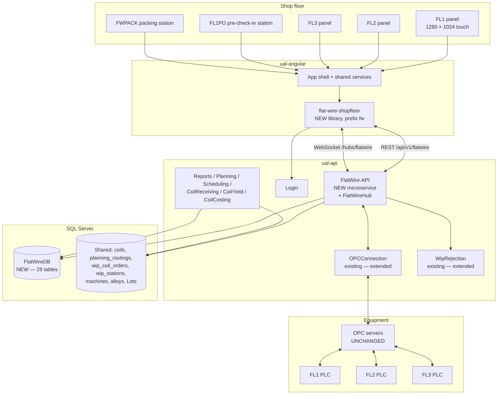

# Flat Wire Mill — Architecture

**Project:** United Aluminum (UAL) — Flat Wire Mill Module
**Last Updated:** August 13, 2026 — split out of `03-HLD-and-ERDiagram.md` in the ProjectPlan restructure. **Section numbers are unchanged**, so every `§n` citation still resolves; numbering inside this file is deliberately non-contiguous
**Document Type:** High-level design, code locations, cross-cutting concerns, the stack ADR
**Status:** Baselined for build — design risks in §13.2, unresolved items in §13.3
**Owner:** Architecture stream
**Audience:** Architects, Angular / .NET developers, DBA
**Shortcode:** `[ARC]`
**Part of:** `ProjectPlan/Architecture/` — index: [README.md](../README.md)

---

## 1. Architecture overview

### 1.1 Context



Three facts this diagram encodes that are easy to get wrong:

1. **`FlatWireHub` lives inside `FlatWire.API`.** The shared `Notification` service is not extended, and no existing hub is a template.
2. **OPC servers are unchanged.** Only the PLCs are new hardware. The integration point is the existing `OPCConnection` service, extended to subscribe to FL1/FL2/FL3 tags.
3. **`FlatWireDB` is a new standalone database.** It is not an extension of `united_db`. The cross-database writes to the shared schema are real and are the reason §10 exists.

### 1.2 Component view

| Component | Repository | Responsibility |
|---|---|---|
| `flat-wire-shopfloor` | `c:\UAL\ual-angular` | All 22 screens, all `fw`-prefixed controls, the SignalR client, line/run state |
| `FlatWire.API` | `c:\UAL\ual-api` | Thin controllers over MediatR; `FlatWireHub`; OPC ingest hosted service; `PLCTagService` |
| `FlatWire.Application` | `c:\UAL\ual-api` | Commands, queries, validators, pipeline behaviours |
| `FlatWire.Domain` | `c:\UAL\ual-api` | Aggregates, param models, enums, `IFlatWireClient` |
| `FlatWire.Infrastructure` | `c:\UAL\ual-api` | `FlatWireDbContext` (EF Core), Dapper readers, repositories, `PLCTagService` |
| `FlatWireDB` | `ual-database` | **MVP-1 build: 25 tables · 33 FKs · 41 index statements in script 07 · 1 procedure · 1 trigger** — counted from the scripts, comments stripped, 13 Aug 2026. **The full design is 28 tables / 43 FKs**; the three `PassSchedule*` tables and ten of the FKs are owned outside MVP-1 and built by `MVP-2/DBChanges`. *(The "64 non-clustered indexes" previously quoted here was a `sys.indexes` count from a deployed database, which includes constraint-backed indexes script 07 does not create — see §6.8.)* |

---

---

## 2. Where the code lands — and the binding reference rules

### 2.1 Locations

| Layer | Repository | Location | Status |
|---|---|---|---|
| Frontend | `c:\UAL\ual-angular` | **New library `flat-wire-shopfloor`**, prefix `fw`, at `projects/flat-wire-shopfloor/` | Not started |
| Backend | `c:\UAL\ual-api` | **New domain `API/Domain/FlatWire/`**, 4 projects + `FlatWire.sln` | Not started |
| Database | `ual-database` | **New `FlatWireDB`**; the FW-001 renames stay in the existing shared scheduling schema | DDL written and validated; **not deployed** |
| Planning artifacts | `c:\UAL\Flatwire-planning` | This repository | Complete |

`MVP-1/ProjectPlan/Flat Wire.code-workspace` opens this folder alongside both code repositories.

### 2.2 Reference-code rules — binding, and non-obvious

These are the rules most likely to be broken by a developer working from habit or from the two stale implementation documents in this repository. They are **decisions**, not preferences.

**Backend — what to copy:**

| Existing domain | Role for Flat Wire |
|---|---|
| **`API/Domain/CoilCheckin`** | **The primary template.** Copy the controller shape, the MediatR command pattern, `Program.cs`, the four `.csproj` files and the NuGet set |
| `API/Domain/OPCConnection` | The OPC/PLC tag read/write layer to integrate with. **`OPCManagerHub.cs` is *not* a template** — the real-time layer is purpose-built (§4) |
| `API/Domain/WipRejection` | Existing service to **extend** for flat-wire outlets |
| `API/Framework/UA.Framework.API/UAController.cs` | The base controller every new controller extends; the standard `Data` / `Success` / `Errors` envelope |
| `Notification`, `Login`, `Common`, `Shared`, `Reports`, `Planning`, `Scheduling`, `CoilReceiving`, `CoilYield`, `CoilCosting` | Cross-cutting and upstream services touched by later phases |

> **`API/Domain/SlitterInterface` is explicitly NOT a reference** — neither for UI/structure nor for the real-time / `CoilDataHub` pattern.

**Frontend — what NOT to copy.** There is **no Angular structural, UI or CSS template.** `flat-wire-shopfloor` is all-new screens and controls built from `MVP-1/Mockups/`. The following are **not** references: `checkin-precheckin`, `shop-floor` / `shop-floor-common`, `statistical-process-control`, `wip-rejection`, `slitter-*`, `coil-receiving`, `common-grid` / `multi-grid-layout`, `opc`, `label-printing`, `print-traveler`.

**The only frontend reuse** is the foundational, app-wide `shared` services, consumed so the library plugs into the existing app shell rather than re-inventing plumbing:

`api-gateway.service` · `app-config.service` · `login.service` + `login-api.service` · `token-interceptor.service` · `correlation-id-interceptor.service` + `correlation-id.service` · `error-handler.service` + `global-error-handler-api.service` · `ui-log.service` · `notification.service` · `subscription.service` · `print-export.service` · `util.service`

**Do not rebuild these, and do not add new interceptors.** The Flat Wire real-time client is purpose-built; existing SignalR hub clients such as `supervisor-monitor-hub.service.ts` are **not** copied.

> **`flat-wire-shopfloor` joins the `build:shop-floor` npm chain for build ordering only.** That is a build-sequencing concern and implies **no** UI or code reuse from the other libraries in the chain.

> **The two documents that contradicted these rules were deleted on 13 Aug 2026** (recoverable at `1964086`) — recorded because the instructions survive in git history. `CheckinImplementationPlan.md` and `CheckinImplementationPrompt.md` told developers to "copy patterns from `checkin-precheckin`", to port the **retired** interim DB2 layout (which held the `dashboard_2_rod_checkin.html` filename until 11 Aug 2026, when the approved wizard took it), and to build a `--fw-*` token system. **All three instructions are wrong**, and they cited story IDs (`FW-S3-009`, `FW-S1-001`) that do not exist — the real ones are FW-061 and FW-082. What was worth keeping was rehomed: the stub-first delivery contract is `Architecture/Architecture.md` §2.2 §0.5, and the canonical fixture set is the DB seed.

---

---

## 10. The transactional boundary — read this before writing check-in

Check-in spans **three systems**: `FlatWireDB` (run, check-in, SPC, staging), the shared `coils` / `wip_coil_orders` / `planning_routings` schema, and the PLC via OPC.

**This is not one ACID transaction, and it cannot be made into one.** OPC writes are not transactional at all, and the two databases are separate.

The design rules are therefore:

1. **Records first, PLC second.** Write every audit record before pushing tags, so a failed push leaves an incomplete-push marker to recover from.
2. **Compensating writes, not rollback.** On failure, issue compensating operations — re-clear the tags, revert the shared status, reverse the `wip_coil_orders` insert. **Never describe this as an "atomic rollback".**
3. **Define the recovery path explicitly.** What happens when the `FlatWireDB` write succeeds and the legacy write fails, and vice versa, is **not specified anywhere** and must be before Phase 4.

```mermaid
sequenceDiagram
    participant SVC as CheckInService
    participant FWDB as FlatWireDB
    participant LEG as Shared schema
    participant PLC as PLCTagService

    SVC->>FWDB: 1. Run + checkin + SPC + inspection (local transaction)
    FWDB-->>SVC: committed
    SVC->>LEG: 2. coils INFLAT + reqsum + wip_coil_orders + actual_start_date
    alt legacy write fails
        SVC->>FWDB: COMPENSATE — mark run aborted, flag for recovery
        SVC-->>SVC: 500, check-in aborted
    end
    LEG-->>SVC: committed
    SVC->>PLC: 3. PushPassSchedule (batch)
    alt any tag write fails
        SVC->>PLC: COMPENSATE — ClearPayoffTags
        SVC->>LEG: COMPENSATE — revert coils status, reverse wip_coil_orders
        SVC->>FWDB: COMPENSATE — mark run aborted, PlcTagsPushed = 0
        SVC-->>SVC: 500, check-in aborted
    end
    PLC-->>SVC: all tags OK
    SVC->>FWDB: 4. RodStaging → CheckedIn; broadcast
```

**This is gap G2 (Critical) and gap G16.** The candidates on the table are a **saga/outbox pattern with compensating PLC clears**, or **mirroring an `INFLAT` marker into `FlatWireDB`** so local state is self-consistent. **Neither has been chosen — OI-39**, and it blocks Phase 4. Phase 4's estimate carries a **24–64 h reserve** against this decision.

The same reasoning applies to **pre-check-in** (writes `RodStaging` + `coils` + `wip_coil_orders`) and to **pre-check-out** (must **reverse** the `wip_coil_orders` insert).

---

---

## 11. Environments and topology

| Environment | Host | Use |
|---|---|---|
| test1 / test2 | `devual-uadev001` / `002` | Developer testing |
| dev1 / dev2 | — | Integration testing |
| staging | `uanet-staging` (UAT on `devual-uadev001` or equivalent) | Pre-production, UAT |
| production | `uanet05` | Live |

**Deploy path:** Angular `ng build` → static files to IIS · `dotnet publish FlatWire.API` → IIS application pool **with the WebSockets feature enabled** · DDL via the ordered migration scripts. Full runbook in `[DEP]`.

**Configuration** lives in `appsettings.{Environment}.json`: the `FlatWireDB` connection string, JWT settings, the **OPC tag-path map** (config-driven, never hardcoded) and the SignalR settings (MessagePack, keep-alive/timeout, cadence). A `/health` endpoint reports DB and OPC reachability.

**To run the full stack locally:** SQL Server with `FlatWireDB` deployed → `Shared.API`, `Login.API`, `OPCConnection` and `FlatWire.API` running → `npm run serve:shop-floor` (or the equivalent chain entry) in `ual-angular`. Until PLC commissioning completes, every line runs `SimulatePLCTagPush` plus a mock SignalR stream, so the UI stays fully testable and **development is not blocked on commissioning**.

---

---

## 12. Cross-cutting concerns

| Concern | Design | Satisfies |
|---|---|---|
| **Authentication** | JWT inherited from `Login`; hub auth via `?access_token=`; **every** controller and endpoint `[Authorize]` | `[SEC §8]` |
| **Authorization** | API role policies matching the endpoint matrix; Angular `FlatWireAuthGuard` + `FlatWireRoleGuard` | `[SEC §8]` |
| **Correlation** | The shared `correlation-id-interceptor` sets the header; Serilog enriches every log line with it | Traceable failures across UI → API → DB |
| **Logging** | Serilog, structured, daily rolling files per the UAL convention | `NFR010`, `NFR011` |
| **Audit** | Domain-level: `PassScheduleChangeLog`, the override columns on `RodStaging`, `PlcTagsPushed`/`PlcTagsCleared`/`PlcTagWritten`, and an audit log line per tag write with path, value, operator, timestamp and result | `NFR010`, `NFR011` |
| **Caching** | PWA service worker caches the pass schedule and active-run snapshot; short-lived memory cache for lookup tables | `NFR006` |
| **Resilience** | SignalR automatic reconnect with exponential backoff + group re-join; Polly on outbound OPC calls; compensating writes on the cross-system boundary | `NFR006`, §10 |
| **Concurrency** | `ROWVERSION` optimistic tokens; filtered unique indexes carry the invariants that a read-then-write check would race on | §6.7 |
| **Performance** | Bounded-channel ingest + batching + decimation; Dapper for high-volume reads; `sp_GetGaugeTrace` decimates server-side; OnPush + rAF + fixed trace window client-side | `NFR005`, `NFR007` |
| **Time** | **Every event timestamp is server-side at API receipt**, never the client clock. `DATETIMEOFFSET` throughout | `FR-174` |

**How each NFR is architecturally satisfied:**

| NFR | Architectural mechanism |
|---|---|
| `NFR003` / `NFR004` | Recording cadence is a configuration value read by the OPC ingest service, not a constant |
| `NFR005` | Push-only via `FlatWireHub`; the client has **no polling path** — the mock service is the only source of non-push data, and only in development |
| `NFR006` | PWA cache + automatic reconnect + group re-join + the "Reconnecting…" banner over cached state |
| `NFR007` | Per-line groups mean two dashboards on two lines never share a fan-out path |
| `NFR009` | Modal implementation forbids backdrop-close and Escape-close on override dialogs; the PLC keeps the **previous** values until acknowledgement |
| `NFR010` / `NFR011` | The audit surfaces listed above, plus Serilog with correlation |
| `NFR012` | `CoilTraceability` with a non-overlap trigger and enforced FKs to `Rod.Alpha`, which is what decision **D-04** bought |
| `NFR013` | `CoilOutput.PassScheduleSnapshot` JSON + permanent retention of the R-series in `coils` |
| **Undefined** (AGC rate, client count, latency, retention) | **No mechanism can be designed against an undefined target.** G9 / OI-34 |

---

---

## 13. Architecture decisions and risks

### 13.1 Decision record

| ID | Decision | Rationale | Consequence |
|---|---|---|---|
| **D-01** | The UI is a brand-new standalone Angular library `flat-wire-shopfloor` | The screen set has no analogue in the existing libraries; folding it in would couple it to a release train it does not share | New scaffold; joins `build:shop-floor` for ordering only |
| **D-02** | Tables live in a **new `FlatWireDB`**, not `united_db` | Isolates a new domain from the shared schema's release risk; traceability joins stay in-engine | Cross-DB reads for planning/scheduling data; §10 exists because of this |
| **D-03** | The schema is **28 tables** | The as-built count | See §6.2 for the full supersession history |
| **D-04** | **`Rod` is retained** as a local master with enforced rod-alpha FKs | Referential integrity for the genealogy chain that `NFR012` makes contractual | **Reverses** `Architecture/Architecture.md` §13.1 `D-04` / `phase-01c`. Leaves **OI-42** (sync with `coils`) open |
| **D-05** | The real-time layer is **purpose-built**, self-contained in `FlatWire.API` | AGC telemetry is a different workload from the event notifications the existing hubs carry | `CoilDataHub` / `OPCManagerHub` / `supervisor-monitor-hub` are **not** templates |
| **D-06** | **`SlitterInterface` is not a reference**; backend template is `CoilCheckin`; **there is no frontend template at all** | The mockups are the design; copying an existing library would import decisions the mockups reversed | Every control built fresh; only foundational `shared` services consumed |
| **D-07** | The UI consumes the existing `--color-*` semantic token system as-is | The mockups already share one system | **No token migration.** The `--fw-*` prefix in older docs is stale (G18) |
| **D-08** | **Dashboard 2 is the 6-step tab wizard, `dashboard_2_rod_checkin.html`** (`- New.html` until 11 Aug 2026) | Progressive unlock and tolerance-viz replaced the retired progress ring | Both earlier DB2 layouts retired |
| **D-09** | Stay entirely within the UAL stack — **no new frameworks** | The window does not permit ramp-up | Angular/.NET/SQL Server/SignalR/Chart.js only |
| **D-10** | Pre-check-in state lives in **`RodStaging`**, not columns on `Rod` | Two filtered unique indexes make one-rod-per-bay unviolatable under concurrency | The provisional `Rod.StagedPayoffPosition`/`IsWelded` columns retired |
| **D-11** | **`PayoffPosition`** is a real lookup with three **pinned** Ids | Replaces three incompatible representations | Rod-fed tables keep `CHECK (1,2)` as a documented narrowing |
| **D-12** | A **`RunReading`** time-series table persists the sampled profile | FL2's historical profile and three reports had **no data source at all** (G3) | Not a per-tick historian; retention undefined (**OI-17**) |
| **D-13** | `FlatWireRun` (header) / `FlatWireRunDetail` (detail) **split** | Run-level fields belong on the header, never on stop rows | `FlatLineProcessing` → `FlatWireRunDetail`, `FlatLineSetup` → `PassScheduleComponent` |
| **D-14** | Component state is a **three-value enum** | A boolean cannot express Bypass versus Skip | Mirrored in C#, TypeScript and the DB CHECK |
| **D-15** | Edge type has **one domain value set** `Round`/`Square` with a display pipe | Three vocabularies were circulating | One enum, one CHECK, one pipe |
| **D-16** | `CheckpointType` has **five** values including `RollAdjustTrigger` | `/rolloverride` writes a checkpoint of that type | The four-value API enum is corrected |
| **D-17** | The **traveler is fully digital**; labels still print | Business decision, 28 Apr 2026 | No print action on the run monitor either |

### 13.2 Design risks

| Risk | Impact | Mitigation |
|---|---|---|
| **The cross-system boundary has no chosen recovery pattern** | Partial failure leaves inconsistent state across three systems | Choose saga/outbox or a local `INFLAT` mirror **before Phase 4**; 24–64 h reserved |
| **Real-time NFRs are undefined, so the QA2 load test cannot fail** | If it does fail, the rework is not in the effort model | Set AGC rate, client count and latency budget before QA2 |
| **`Rod` ↔ `coils` synchronisation is unspecified** | Two sources of truth for rod material | Specify the sync direction and master-per-column before Phase 1C completes |
| **`AlloyProperty` shadows `united_db..alloys`**, and FW-054 is concurrently pushing *more* alloy data upstream | The generator runs off a provisional seed while the maintained value sits upstream | Build the `FlatWireDB..Alloys` view (§6.6) and read `Draw_max_reduction` across |
| **MessagePack is a new client dependency** the repository does not otherwise use | Build and support surface for a marginal gain | Treat as **measure-first**; batching and decimation are the real win (G10) |
| **`RunReading` has no retention policy** | Unbounded growth; silent query degradation | Set retention and a rollup before Phase 3 |
| **Six specified behaviours have no endpoint** | Alloy CRUD, override revert, Mode B disposition, die CRUD, spool-completion, SPC-HOLD release | Add them to the contract — `[API §10]` |
| **No die master table exists** | Die Change cannot validate a scan | Pull a minimal die reference into Phase 6 or resequence (**OI-41**) |

### 13.3 Open design items carried

**OI-17** (`RunReading` retention) · **OI-18** (SPC cannot join its trigger) · **OI-20** (polymorphic refs without integrity) · **OI-22** (`Rework` unpersistable) · **OI-23** (SPC-HOLD has no column) · **OI-24** (lot number) · **OI-25** (two footage coordinate systems) · **OI-26** (FL3 pre-check-in station) · **OI-27** (no `F` case in the op-letter map) · **OI-28** (alert lifecycle unbacked) · **OI-29** (no bundle header) · **OI-30** (no gap-free sequence) · **OI-31** (no legacy migration deliverable) · **OI-32** (six missing endpoint groups) · **OI-34** (NFRs absent) · **OI-35** (`LineState` vocabulary) · **OI-36** (FM2 S3 tag path) · **OI-37** (roles unconfirmed) · **OI-38** (PIN validation source) · **OI-39** (cross-DB recovery) · **OI-41** (Phase 6 ↔ 13) · **OI-42** (`Rod` ↔ `coils` sync) · **OI-43** (unplanned component bypass has no home) · **OI-45** (weight basis) · **OI-80** (`TraversingTakeup` has no UI) · **OI-93** (`AlloyProperty` shadows `alloys`).

New here: **PP-01** (the MVP-1 index count is **41**, not 44 or 46 — see §6.8).

---

---

## 14. Architecture Decision Record — the stack

> **Absorbed from `03-HLD-and-ERDiagram.md` §14 on 13 Aug 2026**, which was deleted in the same pass. The ADR sat at *"Recommendation — Pending Review"* for fifteen weeks while the whole build proceeded on its decisions; it was marked **Accepted** on 13 Aug and is recorded here because §13.1 is where this repository keeps decisions.
>
> **Only what §1–§13 did not already carry was brought across.** The suggested microservice structure (§3.1 is more detailed), the SignalR design (§4), environments (§11), the PWA service worker (§5), Chart.js and the `isLive` flag (§5.5), and the `SlitterInterface`-is-not-a-reference correction (§2.2) were all **dropped as duplicates**, not summarised.

**Status: Accepted.** These decisions are built against, not proposed. The original framing referenced a **July 1 trial**, superseded on 26 Jul 2026 by the **17 Aug – 30 Sep 2026** window with production in **Q4 2026**.

### 14.1 Core stack, layer by layer

The summary judgement: **stay entirely within the existing UAL stack.** The Flat Wire Mill module is an extension of the existing manufacturing execution system, not a greenfield application. The compressed window leaves no room for new-technology ramp-up, and every requirement maps to a pattern already running in the furnace or slitter modules.

| Layer | Technology | Rationale |
|---|---|---|
| **Frontend** | Angular 18.2+ (existing `ual-angular`) | Mockups are already HTML; the shopfloor *platform* pattern exists in the slitter/furnace modules — **but see §2.2: that is not permission to copy them** |
| **API** | .NET 8.0 — new `FlatWire` microservice in `ual-api` | Clean Architecture already established; MediatR CQRS fits command-heavy shopfloor operations (check-in, weld event, die change) |
| **Database** | SQL Server — **a new standalone `FlatWireDB`** *(decided; the "or schema extension" alternative is closed)* | Consistent with every other UAL database; traceability joins across R-series, coil and order tables stay in-engine. Cross-database references (`PlanId`, `SkidId`, `PassScheduleId`, rod alphas into `coils`) are **documented logical FKs, unenforced by design** — the cost of the standalone choice, tracked as **`G17`** |
| **Real-time / PLC data** | SignalR (existing pattern) | Gauge trace is live streaming — AGC data needs push, not polling; already wired in the `OPCConnection` service. Design in §4 |
| **OPC / PLC tags** | Existing `OPCConnection` service, extended for FL1/FL2/FL3 | The PLCs are new hardware but the OPC servers are unchanged — no new integration layer needed |
| **Auth / Logging** | JWT + Serilog (inherited from UAL) | Zero additional work |

### 14.2 What was rejected, and why

| Rejected | Reason |
|---|---|
| **New frameworks** (React, Blazor, …) | The window does not allow ramp-up; the team is already Angular/.NET. *(Written against the April 10-week estimate; the argument is **stronger** now — the window is ~6.5 weeks and already needs 9.4 FTE sustained.)* |
| **A separate mobile app** | The Angular PWA covers the touchscreen case without a second codebase |
| **A message broker** (Kafka/RabbitMQ) in Phase 1 | SignalR is sufficient for AGC gauge-trace volume; revisit post-go-live if throughput becomes an issue |

### 14.3 Approach by feature area

| Feature | Approach |
|---|---|
| Rod receiving (R-series alpha) | New `RodReceiving` controller in `FlatWire.API`; sequence managed in SQL with a no-gap guarantee |
| ~~Pass schedule management~~ **(MVP-2)** | Dedicated module with versioned records. **The PLC tag push on operator acknowledgement is MVP-1** — it happens at rod check-in, reading a schedule the other track published |
| Rod check-in / FL1 and FL2 | Shared Angular UI component; route mode (FL1/FL2/FL3) drives which fields and steps are shown |
| Weld join traceability | `WeldJoinEvent` domain entity linking Rod 1 alpha → Rod 2 alpha → output coil alpha; required for certificate generation |
| Gauge trace (live) | SignalR hub streaming AGC data → Chart.js component; FL1 and FL3 hybrid mode |
| Gauge trace (historical) | Query-based profile view for FL2 standalone mode |
| SPC checkpoints | **Five physical measurement points** — incoming rod, post-die, FM1 output, **FM2 final-stand (S3) output**, final coil; stored per run, surfaced in reports. **These are not the `CheckpointType` enum** — see §14.4 |
| WIP rejection | The existing WIP rejection module, extended with flat-wire outlet options and observation codes |
| Certificate of Conformance | The existing Certs module; the traceability chain must include every weld join event for welding-wire customers |
| Scrap disposition | The Scrap module, extended with a new outlet: `Scrap Box` vs `Scrap Skid` |

### 14.4 The "five SPC checkpoints" and the `CheckpointType` enum are different axes

**Closed 13 Aug 2026** (`REVIEW.md` Tier 1 #7, which read the two lists as a contradiction).

- **The five above are physical measurement points** — *where on the line* a checkpoint is taken.
- **`CheckpointType`** — `{PreRun, PostDieChange, ManualSpotCheck, PostRun, RollAdjustTrigger}` — is *why the checkpoint fired*. It is an event cause, not a location.

They do not map one-to-one and were never meant to: an incoming-rod measurement is a `PreRun`; an FM1-output measurement could be a `PostDieChange`, a `ManualSpotCheck` or a `RollAdjustTrigger` depending on what prompted it. **Neither list is wrong and neither needs reconciling to the other** — the measurement *name* is what distinguishes them within a checkpoint, which is why `SpcMeasurement` is a child of `SpcCheckpoint`. `RollAdjustTrigger` was missing from the enum until 13 Aug 2026 even though `POST /rolloverride` already wrote it.

### 14.5 Phase 1 constraints (April 16 meeting)

- No Angular/frontend receiving-screen changes in Phase 1 — rod receiving is backend only.
- No EDI — manual rod receiving only.
- One shared UI for FL1 and FL2 check-in and transactions.
- The PLCs are new hardware; the OPC servers remain unchanged.
