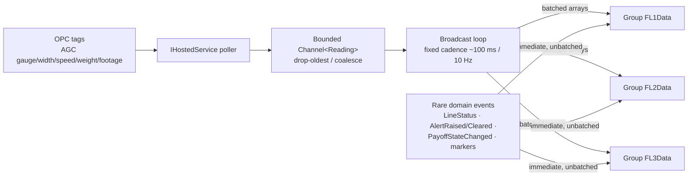

# Flat Wire Mill — Real-Time Architecture and the FlatWireHub Contract

**Project:** United Aluminum (UAL) — Flat Wire Mill Module
**Last Updated:** August 13, 2026 — split out of `03-HLD-and-ERDiagram.md`, `02-SRS.md`, `04-APIContract.md` in the ProjectPlan restructure. **Section numbers are unchanged**, so every `§n` citation still resolves; numbering inside this file is deliberately non-contiguous
**Document Type:** Real-time design and the hub contract
**Status:** Baselined for build
**Owner:** Architecture / Real-time stream
**Audience:** Angular and .NET developers, integration testers
**Shortcode:** `[SIG]`
**Part of:** `ProjectPlan/Architecture/` — index: [README.md](../README.md)

---

## 4. Real-time architecture

Purpose-built for high-frequency AGC telemetry. Design goals: **low latency, minimal payload, no operator-screen change-detection storms, graceful degradation under burst load, horizontal-scale readiness.**

> **This is deliberately not a copy of `CoilDataHub`, `OPCManagerHub` or `supervisor-monitor-hub`.** Those patterns were reviewed and rejected for this workload.

### 4.1 Transport and protocol

- **WebSockets-first** (`SkipNegotiation` where the topology allows); SSE and long-poll only as a last-resort fallback. **IIS WebSockets must be enabled on the deployment target** — see `[DEP §4.4]`.
- **MessagePack** hub protocol on both ends — `AddSignalR().AddMessagePackProtocol()` server-side, `@microsoft/signalr-protocol-msgpack` client-side. Binary, compact, fast for dense numeric telemetry. *(Treat as **measure-first**: batching and decimation are the real win, and MessagePack is a new client dependency the repository does not otherwise use — gap **G10**.)*
- **Strongly-typed hub:** `FlatWireHub : Hub<IFlatWireClient>` — a compile-time contract, no magic-string method names.

### 4.2 Ingest → broadcast pipeline (backpressure-safe)



- The **bounded channel** decouples the PLC poll rate from client fan-out and caps memory under bursts.
- The broadcast loop **drains on a fixed cadence** and sends **batched arrays** per line group, collapsing thousands of AGC samples per second into a steady, bounded message rate.
- **Coalesce / delta:** `ComponentStatus` and `LineStatus` are sent only on change; hot numeric channels are decimated to the cadence.
- **Split by frequency:** hot telemetry batched; rare domain events sent immediately, unbatched. **`PayoffStateChanged` must never enter the ~100 ms telemetry batch** — a bay changing hands is an operator-visible state transition, not a sampled reading.
- **FL2 standalone suppresses the batched gauge/width channels** — its historical profile is a REST query. Status and marker events still flow.

### 4.3 Groups, reliability and scale

- Per-line groups `FL1Data` / `FL2Data` / `FL3Data`; clients `JoinLineGroup` on the screens they open and `LeaveLineGroup` on teardown, so the server fans out only to interested clients.
- Tuned `KeepAliveInterval` / `ClientTimeoutInterval`; **automatic reconnect with exponential backoff plus line-group re-join on reconnect**.
- **Scale-out ready:** the hub is stateless. If `FlatWire.API` runs multi-instance, add a **Redis backplane or Azure SignalR Service** — configuration only, no code change. A single instance is fine for the trial.
- Auth: JWT via `?access_token=`; hub methods `[Authorize]`.

### 4.4 Client rendering — no change-detection storms

- SignalR callbacks run **outside the Angular zone** (`NgZone.runOutsideAngular`); incoming batches land in a **ring buffer** in `flat-wire-signalr.service`.
- Charts and gauges refresh on a **`requestAnimationFrame` throttle** coalesced to ~60 fps, re-entering the zone once per frame; Chart.js is updated in place (`update('none')`); `ChangeDetectionStrategy.OnPush` everywhere; trace components keep a **fixed window (e.g. the last 500 points)** to bound DOM and GPU work.
- A **PWA service worker** caches the pass schedule and active-run snapshot so an operator screen does not go blank during a short network drop (`[REQ]` `FR-119`).

### 4.5 Non-functional position

Known targets: **1-second default push interval, configurable to 5/10/30 s, with no polling** (`NFR005`); **two simultaneous dashboard instances** (`NFR007`); **reconnect over cached state, never a blank screen** (`NFR006`).

**Undefined:** AGC sample rate, concurrent client count, latency budget, `RunReading` retention. A hub load test is scheduled at QA2 **with no pass criteria** — gap **G9** / **OI-34**. **If the load test fails, the real-time rework is not in the effort model.**

---

---

### 9.3 Real-time interface — `FlatWireHub`

Ten server→client events plus six run event markers, on per-line groups `FL1Data` / `FL2Data` / `FL3Data`. Full payloads, cadences and consumers in `[SIG §5]`. The requirement-level constraints are `NFR005`, `NFR006`, `NFR007` in §6.1, and `FR-120` (FL2 broadcasts `null` live gauge and width).

---

## 5. `FlatWireHub` — the real-time contract

**Hosted only inside `FlatWire.API`.** The shared `Notification` service is not extended, and the existing hubs (`CoilDataHub`, `OPCManagerHub`, `supervisor-monitor-hub`) are **not templates**.

### 5.1 Connection lifecycle

| Step | Detail |
|---|---|
| Connect | `/hubs/flatwire`, **WebSockets-first** with `SkipNegotiation` where the topology allows. SSE and long-poll are last-resort fallbacks only |
| Protocol | **MessagePack** — `AddSignalR().AddMessagePackProtocol()` server-side, `@microsoft/signalr-protocol-msgpack` client-side |
| Auth | JWT via the **`?access_token=` query parameter**; hub methods carry `[Authorize]` |
| Join | `JoinLineGroup({lineId})` on every screen that opens for a line |
| Leave | `LeaveLineGroup({lineId})` on teardown — the server fans out only to interested clients |
| Reconnect | **Automatic, with exponential backoff, plus line-group re-join.** The client renders cached last-known state behind a "Reconnecting…" banner and **never a blank screen** |
| Scale-out | The hub is stateless. Multi-instance requires a **Redis backplane or Azure SignalR Service** — configuration only, no code change |

Groups are `FL1Data` / `FL2Data` / `FL3Data`.

### 5.2 Server → client events

A strongly-typed `Hub<IFlatWireClient>` — **no magic-string method names.**

| # | Event | Payload | Cadence | Consumers |
|---|---|---|---|---|
| 1 | `GaugeReading` | `GaugeReading[]` — each `{lineId, value(in), timestamp, footagePosition}` | **batched**, ~10 Hz | DB3 traces, DB1 live gauge |
| 2 | `WidthReading` | `WidthReading[]` — same shape | **batched**, ~10 Hz | DB3 traces, DB1 live width |
| 3 | `SpeedFPM` | `{lineId, value(FPM), timestamp}` | batched / decimated | DB1 board, DB3 header, **the machine-stop prompt** |
| 4 | `PayoffWeight` | `{lineId, position, weightLb, percentRemaining}` | batched | DB1, DB2A, DB3 payoff bars |
| 5 | `FootageCounter` | `{lineId, footage(ft), timestamp}` | batched | DB3 header, spool progress, die-life accumulation |
| 6 | `ComponentStatus` | `{lineId, component, isActive, currentValue}` | **on change only** | DB3 component panel, roll-adjust dialog |
| 7 | `LineStatus` | `{lineId, status, orderId, alpha}` | **on change only, immediate** | DB1 header badge |
| 8 | `AlertRaised` | `{lineId, alertType, severity, message, timestamp}` | **immediate, unbatched** | DB1 alert bar |
| 9 | `AlertCleared` | `{lineId, alertType}` | **immediate, unbatched** | DB1 alert bar |
| 10 | `PayoffStateChanged` | `{lineId, position, state, rodAlpha, rodSeqno, isWelded}` | **immediate, unbatched** | DB2A bay cards, DB1 "Payoff 2 not loaded" rule |

`state` on `PayoffStateChanged` is `NotStaged` · `Staged` · `Active` · `Blocked`. It fires on **every** bay-occupancy change: pre-check-in, pre-check-out, mark-as-welded, and check-in consuming a staged row.

> **`PayoffStateChanged` must never enter the ~100 ms telemetry batch.** A bay changing hands is an operator-visible state transition, not a sampled reading. `PayoffWeight` stays in the batched hot path; the two are complementary and Dashboard 2A needs both — occupancy from one, live weight from the other.

> **`PP-04` — the event count is 10, not 9.** The master specification's status summary says "30 REST endpoints + **9** hub events". The event table there, and the list in `Business/BusinessRules.md` §3, both enumerate **ten**. The "9" predates `PayoffStateChanged`, which was added with the pre-check-in feature on 29 Jul 2026. **Ten is correct.** Correct the summary line.

### 5.3 The FL2 rule

**FL2 standalone suppresses the batched gauge and width channels entirely.** Its historical profile is a REST query (`GET /run/{runId}/gaugetrace`). Status and marker events still flow. A client subscribed to `FL2Data` must not wait for `GaugeReading` — it will never arrive, and treating its absence as a fault is a defect.

### 5.4 Run event markers

Also broadcast, consumed by DB3 traces: `WeldJoinEvent` · `DieChangeEvent` · `PauseEvent` · `SPCCheckpoint` · `AlertEvent` · `RodCheckoutEvent`.

### 5.5 Events the spool-completion feature adds

Specified in `MVP-1/ProjectPlan/Business/Screens/SpoolCompletionNotification.md`, **not yet in the published contract**:

| Event | Payload | Why it is server-side |
|---|---|---|
| *spool-progress payload* | actual weight, target, percent, remaining, rate, ETA | So **every client evaluates the same number** rather than each computing its own |
| `SpoolWeightMilestone` | line, run, spool, milestone (75/90/100), actual, target | Raised **server-side on crossing**, not client-side on a threshold check |
| `SpoolCompletionPromptDue` | line, run, spool alpha, PLC stop timestamp, latched weight, target | **Server-owned state**, persisted against the run, so it survives a browser refresh and is re-delivered on reconnect |
| `SpoolCompletionPromptResolved` | answer (`Yes`/`No`/`AutoDismissed`), operator, timestamp | Closes the prompt across all clients |

There is **no endpoint** for the spool-completion prompt or commit — **OI-32**.

### 5.6 Angular observable map

```typescript
gaugeReading$(lineId): Observable<GaugeReadingEvent[]>
widthReading$(lineId): Observable<WidthReadingEvent[]>
speedFpm$(lineId): Observable<SpeedFpmEvent>
payoffWeight$(lineId): Observable<PayoffWeightEvent>
payoffStateChanged$(lineId): Observable<PayoffStateChangedEvent>
footageCounter$(lineId): Observable<FootageCounterEvent>
componentStatus$(lineId): Observable<ComponentStatusEvent>
lineStatus$(lineId): Observable<LineStatusEvent>
alertRaised$(lineId): Observable<AlertRaisedEvent>
alertCleared$(lineId): Observable<AlertClearedEvent>
```

Callbacks run **outside the Angular zone**; batches land in a ring buffer and render on a `requestAnimationFrame` throttle — `[SIG §4.4]`.

### 5.7 Non-functional position

**Known:** default push interval **1 second**, configurable to 5/10/30 s, **with no polling** (`NFR005`); **two simultaneous dashboard instances** (`NFR007`); reconnect over cached state (`NFR006`).

**Undefined:** AGC sample rate, concurrent client count, latency budget, `RunReading` retention. **A hub load test is scheduled at QA2 with no pass criteria** — gap **G9** / **OI-34**.

---
