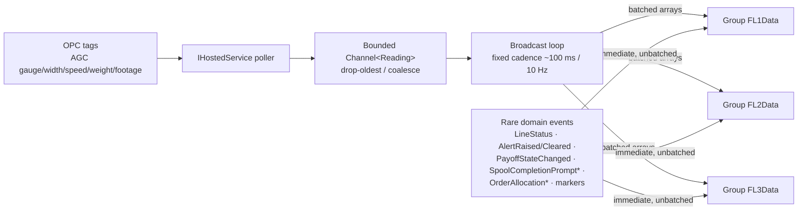

# Flat Wire Mill — Real-Time Architecture and the FlatWireHub Contract

**Project:** United Aluminum (UAL) — Flat Wire Mill Module
**Last Updated:** August 28, 2026 — ⛔ **§5.4 named the six run-event markers and gave NO payload fields, so six of the twenty payloads on `IFlatWireClient` were frozen on a task plan's authority rather than this document's.** Raised by `FW-149`'s pre-execution re-review as decision **`P-117`** and **published here `[PROPOSED]`**, the same device `[PLC §5.2]` uses for a tag path nobody has read off a controller: a **shared base** (`lineId` · `runId` · **`footagePosition`** · `timestamp`) plus one to three fields per marker. **`footagePosition` is the load-bearing one** — DB3 overlays markers on a footage-indexed trace, so a marker without it cannot be drawn. The shapes are `FW-080`'s, built because the hub does not compile without them; **they are offered to ratify or correct, not to redesign**, and they were **verified field for field against the built code on publication — all six agree**. Also recorded: **cadence is immediate/unbatched for all six** (`[SIG §4.2]`'s rare-event path) and **none of the six is durable** — a client that misses one recovers it from the trace query, which is why only events 11 and 13 are server-owned. ⚠ **This closes the last of the twenty payloads that had no specification**; `FW-149`'s contract diff now covers 20 of 20 on the server side. *(previously August 27, 2026)* ⛔ **the contract carries fourteen events and two places in this file still said otherwise, one of them a build input.** §5.6's Angular observable map listed **twelve**, missing `orderAllocationReached$` and `orderAllocationResolved$`, which never arrived when events 13 and 14 entered §5.2 on 22 Aug — **`FW-135`'s criterion is "typed Observables per event", so a client built to that map ships 12 of 14 streams**, and the two missing ones are the only signal DB3 gets that an order boundary was crossed on a rod that is still running. §9.3 read **"Ten"**, three counts behind. ⚠ **`PP-04` audited two other documents and missed both of these, inside its own file** — its rule is now four sites, and it gains the distinction it was missing: **a document that enumerates the events carries the count even without printing a number.** Three sites outside this file are recorded as stale (`phase-01a` at twelve, `[TB §7]`'s `FW-136` at nine, `FW-080` claiming to match it). Also: §4.2's rare-event node gained the four prompt events, §4.1 records that **`@microsoft/signalr` 9.0.6 is already a dependency while the MessagePack protocol package is not**, and §4.5/§5.7 now separate the **undefined NFR targets** from the **specified broadcast cadence**, naming `PLC-Q11` and `C8` as where the open figures are being asked. *(previously August 14, 2026 — **`SpoolCompletionPromptDue` and `SpoolCompletionPromptResolved` promoted into the published contract** as events 11 and 12 (§5.2); §5.5 split so it now holds only the two unpublished Part A events; `PP-04`'s count restated 10 → 12; `OI-32` half-closed. Gap **`G37`** *(otherwise August 13, 2026)* — split out of `03-HLD-and-ERDiagram.md`, `02-SRS.md`, `04-APIContract.md` in the ProjectPlan restructure. **Section numbers are unchanged**, so every `§n` citation still resolves; numbering inside this file is deliberately non-contiguous)*
**Document Type:** Real-time design and the hub contract
**Status:** Baselined for build
**Owner:** Architecture / Real-time stream
**Audience:** Angular and .NET developers, integration testers
**Shortcode:** `[SIG]`
**Part of:** `ProjectPlan/Architecture/` — index: [README.md](../README.md)

---

## 4. Real-time architecture

Purpose-built for high-frequency AGC telemetry. Design goals: **low latency, minimal payload, no operator-screen change-detection storms, graceful degradation under burst load, horizontal-scale readiness.**

> **This is deliberately not a copy of `CoilDataHub`, `OPCManagerHub` or `supervisor-monitor-hub`.** Those patterns were reviewed and rejected for this workload.

### 4.1 Transport and protocol

- **WebSockets-first** (`SkipNegotiation` where the topology allows); SSE and long-poll only as a last-resort fallback. **IIS WebSockets must be enabled on the deployment target** — see `[DEP §4.4]`.
- **MessagePack** hub protocol on both ends — `AddSignalR().AddMessagePackProtocol()` server-side, `@microsoft/signalr-protocol-msgpack` client-side. Binary, compact, fast for dense numeric telemetry. *(Treat as **measure-first**: batching and decimation are the real win, and MessagePack is a new client dependency the repository does not otherwise use — gap **G10**.)* ⚠ **Measured in `Second-Branch/ual-angular` on 27 Aug 2026:** `@microsoft/signalr` **9.0.6 is already a dependency**, and `@microsoft/signalr-protocol-msgpack` is **absent** — so the transport is available today and only the protocol package has to be added.
- **Strongly-typed hub:** `FlatWireHub : Hub<IFlatWireClient>` — a compile-time contract, no magic-string method names.

### 4.2 Ingest → broadcast pipeline (backpressure-safe)



- The **bounded channel** decouples the PLC poll rate from client fan-out and caps memory under bursts.
- The broadcast loop **drains on a fixed cadence** and sends **batched arrays** per line group, collapsing thousands of AGC samples per second into a steady, bounded message rate.
- **Coalesce / delta:** `ComponentStatus` and `LineStatus` are sent only on change; hot numeric channels are decimated to the cadence.
- **Split by frequency:** hot telemetry batched; rare domain events sent immediately, unbatched. **`PayoffStateChanged` must never enter the ~100 ms telemetry batch** — a bay changing hands is an operator-visible state transition, not a sampled reading.
- **FL2 standalone suppresses the batched gauge/width channels** — its historical profile is a REST query. Status and marker events still flow.

> **The simulator enters this pipeline at the channel and changes nothing downstream of it.** `FW-203` and, after it, `[SIM]`'s in-process adapter (`FW-211`) publish `Reading` values into the **same bounded channel** the real ingest publishes into, at the same cadence — so the broadcast loop, the groups and **the whole of §5 are unchanged by simulation**. That is a rule, not an observation: `[SIM §2.1]` states that if the simulator ever needs a change to `IFlatWireClient` or to the `Reading` shape, **the contract is wrong and the contract gets fixed.** It is also why `FW-150` and `FW-151` are not reduced for the trial. `FW-217`'s sidecar enters one stage earlier still, at the OPC endpoint, so it exercises `FW-N05` as well.

### 4.3 Groups, reliability and scale

- Per-line groups `FL1Data` / `FL2Data` / `FL3Data`; clients `JoinLineGroup` on the screens they open and `LeaveLineGroup` on teardown, so the server fans out only to interested clients.
- Tuned `KeepAliveInterval` / `ClientTimeoutInterval`; **automatic reconnect with exponential backoff plus line-group re-join on reconnect**.
- **Scale-out ready:** the hub is stateless. If `FlatWire.API` runs multi-instance, add a **Redis backplane or Azure SignalR Service** — configuration only, no code change. A single instance is fine for the trial.
- Auth: JWT via `?access_token=`; hub methods `[Authorize]`.

### 4.4 Client rendering — no change-detection storms

- SignalR callbacks run **outside the Angular zone** (`NgZone.runOutsideAngular`); incoming batches land in a **ring buffer** in `flat-wire-signalr.service`.
- Charts and gauges refresh on a **`requestAnimationFrame` throttle** coalesced to ~60 fps, re-entering the zone once per frame; Chart.js is updated in place (`update('none')`); `ChangeDetectionStrategy.OnPush` everywhere; trace components keep a **fixed window (e.g. the last 500 points)** to bound DOM and GPU work.
- A **PWA service worker** caches the pass schedule and active-run snapshot so an operator screen does not go blank during a short network drop (`[REQ]` `FR-119`).

### 4.5 Non-functional position

Known targets: **1-second default push interval, configurable to 5/10/30 s, with no polling** (`NFR005`); **two simultaneous dashboard instances** (`NFR007`); **reconnect over cached state, never a blank screen** (`NFR006`).

**Undefined:** AGC sample rate, concurrent client count, latency budget, `RunReading` retention. A hub load test is scheduled at QA2 **with no pass criteria** — gap **G9** / **OI-34**. **If the load test fails, the real-time rework is not in the effort model.**

> ⚠ **Undefined here does not mean unasked, and the distinction matters to the client build.** The **AGC publish rate at source** is asked of the controls engineer as **`PLC-Q11`**, and the **end-to-end latency figure** `G9` needs is produced by commissioning test **`C8`** (*"AGC feed reaches the screen"*). What is genuinely undefined is the **target**, not the broadcast cadence — §4.2 fixes that at **~100 ms / 10 Hz**, which is what `MockSignalRService` emits at and what §5.2 rows 1–2 publish. **A mock has a rate to match; it has no NFR to be validated against.**

---

---

### 9.3 Real-time interface — `FlatWireHub`

**Fourteen** server→client events plus **six** run event markers, on per-line groups `FL1Data` / `FL2Data` / `FL3Data`. Full payloads, cadences and consumers in `[SIG §5]`. *(This read "Ten" until 27 Aug 2026 — it was the count before events 11 and 12 were promoted on 14 Aug and events 13 and 14 added on 22 Aug. It is the third site `PP-04` should have been tracking, and the only one inside this document.)* The requirement-level constraints are `NFR005`, `NFR006`, `NFR007` in §6.1, and `FR-120` (FL2 broadcasts `null` live gauge and width).

---

## 5. `FlatWireHub` — the real-time contract

**Hosted only inside `FlatWire.API`.** The shared `Notification` service is not extended, and the existing hubs (`CoilDataHub`, `OPCManagerHub`, `supervisor-monitor-hub`) are **not templates**.

### 5.1 Connection lifecycle

| Step | Detail |
|---|---|
| Connect | `/hubs/flatwire`, **WebSockets-first** with `SkipNegotiation` where the topology allows. SSE and long-poll are last-resort fallbacks only |
| Protocol | **MessagePack** — `AddSignalR().AddMessagePackProtocol()` server-side, `@microsoft/signalr-protocol-msgpack` client-side |
| Auth | JWT via the **`?access_token=` query parameter**; hub methods carry `[Authorize]` |
| Join | `JoinLineGroup({lineId})` on every screen that opens for a line |
| Leave | `LeaveLineGroup({lineId})` on teardown — the server fans out only to interested clients |
| Reconnect | **Automatic, with exponential backoff, plus line-group re-join.** The client renders cached last-known state behind a "Reconnecting…" banner and **never a blank screen** |
| Scale-out | The hub is stateless. Multi-instance requires a **Redis backplane or Azure SignalR Service** — configuration only, no code change |

Groups are `FL1Data` / `FL2Data` / `FL3Data`.

### 5.2 Server → client events

A strongly-typed `Hub<IFlatWireClient>` — **no magic-string method names.**

| # | Event | Payload | Cadence | Consumers |
|---|---|---|---|---|
| 1 | `GaugeReading` | `GaugeReading[]` — each `{lineId, value(in), timestamp, footagePosition}` | **batched**, ~10 Hz | DB3 traces, DB1 live gauge |
| 2 | `WidthReading` | `WidthReading[]` — same shape | **batched**, ~10 Hz | DB3 traces, DB1 live width |
| 3 | `SpeedFPM` | `{lineId, value(FPM), timestamp}` | batched / decimated | DB1 board, DB3 header, **the machine-stop prompt** |
| 4 | `PayoffWeight` | `{lineId, position, weightLb, percentRemaining}` | batched | DB1, DB2A, DB3 payoff bars |
| 5 | `FootageCounter` | `{lineId, footage(ft), timestamp}` | batched | DB3 header, spool progress, die-life accumulation |
| 6 | `ComponentStatus` | `{lineId, component, isActive, currentValue}` | **on change only** | DB3 component panel, roll-adjust dialog |
| 7 | `LineStatus` | `{lineId, status, orderId, alpha}` | **on change only, immediate** | DB1 header badge |
| 8 | `AlertRaised` | `{lineId, alertType, severity, message, timestamp}` | **immediate, unbatched** | DB1 alert bar |
| 9 | `AlertCleared` | `{lineId, alertType}` | **immediate, unbatched** | DB1 alert bar |
| 10 | `PayoffStateChanged` | `{lineId, position, state, rodAlpha, rodSeqno, isWelded}` | **immediate, unbatched** | DB2A bay cards, DB1 "Payoff 2 not loaded" rule |
| 11 | `SpoolCompletionPromptDue` | `{lineId, runId, spoolAlpha, plcStopTimestamp, latchedWeightLb, targetLb}` | **immediate, unbatched · server-owned, durable** | DB3 machine-stop confirmation |
| 12 | `SpoolCompletionPromptResolved` | `{lineId, runId, answer, operatorId, timestamp}` | **immediate, unbatched** | DB3 — closes the prompt across all clients |
| 13 | `OrderAllocationReached` | `{lineId, station, runId, rodAlpha, orderNo, consumptionId, crossedAt, latchedWeightLb, allocatedWeightLb}` | **immediate, unbatched · server-owned, durable** | DB3 — the order-complete prompt |
| 14 | `OrderAllocationResolved` | `{lineId, station, runId, orderNo, consumptionId, acknowledgedBy, weightAtAckLb, overrunLb, timestamp}` | **immediate, unbatched** | DB3 — closes the prompt across all clients, and reveals the next order |

`state` on `PayoffStateChanged` is `NotStaged` · `Staged` · `Active` · `Blocked`. It fires on **every** bay-occupancy change: pre-check-in, pre-check-out, mark-as-welded, and check-in consuming a staged row.

> **`PayoffStateChanged` must never enter the ~100 ms telemetry batch.** A bay changing hands is an operator-visible state transition, not a sampled reading. `PayoffWeight` stays in the batched hot path; the two are complementary and Dashboard 2A needs both — occupancy from one, live weight from the other.

**Events 11 and 12 were promoted into this contract on 14 Aug 2026** (gap **`G37`**, story **`FW-202`**) from §5.5, where they had sat marked *"not yet in the published contract"* while `FR-140`–`FR-149` specified them as `Must`. `answer` on `SpoolCompletionPromptResolved` is `Yes` · `No` · `AutoDismissed`.

> **`SpoolCompletionPromptDue` and `OrderAllocationReached` are the only events in this contract that are not fire-and-forget.** `FR-144` requires the pending prompt to be **server-owned state, persisted against the run**, so it survives a browser refresh or a screen change and is **re-delivered on reconnect** (`TC-173`). Every other event here may be missed by a disconnected client and recovered from the next snapshot; this one may not — a stopped mill with an unanswered prompt is a spool nobody has committed. **Persist it, re-deliver it on group re-join, and do not treat it as telemetry.**
>
> Two further constraints the transport must respect, both from `FR-141`–`FR-143`: the event is raised on the **`RUNNING → STOPPED` edge exactly once per stop**, so a duplicate delivery must be idempotent at the client; and the weight it carries is **latched at the PLC stop timestamp**, so a client must render `latchedWeightLb` and never substitute a fresher `PayoffWeight` tick.

> **`PP-04` — the count was 9, then 10, then 12, and is now 14. Two of the three places this item names no longer exist as described.**
>
> **The history.** The original *“9”* predated `PayoffStateChanged`, added with the pre-check-in feature on 29 Jul 2026, which made it **10**. Events 11 and 12 were promoted into this table on 14 Aug 2026, making it **12** — but **the master specification's status summary was never corrected**, and still read **10** on 22 Aug. Events 13 and 14 (the order-allocation prompt) make it **14**, and the summary was corrected to 14 in one step rather than through 12.
>
> ⚠ **This item said three places carry the number. Checked on 22 Aug 2026, only two do.**
>
> | Named here | Actually |
> |---|---|
> | this §5.2 table | ✅ carries it — **14 rows** |
> | the master spec's status summary | ✅ carries it — corrected to **14** (and its endpoint count to 32) |
> | ⛔ **§9.3 of this document — not named, and it carried the number** | Found 27 Aug 2026 reading **"Ten server→client events"**, three counts behind. **`PP-04` audited two other documents and never checked its own**, which is how a contradiction survived inside one file. Corrected, and the rule below is restated to include it |
> | ⛔ **§5.6's observable map — not named, and it enumerated the events** | Found the same day with **twelve** entries. A count is not the only way a document carries the number; **an enumeration carries it too**, and this one is what `FW-135` is built from |
> | *“the event table there”* (in the master spec) | ❌ **there is no event table in the master spec.** It references individual events inside requirement text — `FR-048`, `FR-053` and others — which do not restate a count and need no edit |
> | *“the list in `Business/BusinessRules.md` §3”* | ❌ **that list is no longer there.** The document carries no event enumeration at all; it moved during the ProjectPlan restructure. Nothing in it states a count |
>
> **So the rule is now: change four things together — this table, §9.3, §5.6's observable map, and the master spec's summary.** *(It said two until 27 Aug 2026; the two it missed were both in this file.)* Individual event *names* appear in roughly 25 files, but none of those states a total, so they are unaffected by a count change — which is the distinction this item was missing. ⚠ **The distinction it was *also* missing:** a document that **enumerates** the events carries the count whether or not it prints a number, which is why §5.6 belongs on this list and why it went stale silently.
>
> ⚠ **Three sites outside this document are stale at the old counts and are not this file's to fix** *(recorded 27 Aug 2026)*: `phase-01a` states *"the full published set — **twelve** events"*; `[TB §7]`'s **`FW-136`** acceptance criteria enumerate **nine**; and `[TB §7]`'s **`FW-080`** claims to match `FW-136`'s set *"exactly"*, which is now true of neither. **A client or hub built to those three ships 9–12 of 14 streams.**

> **Events 13 and 14 follow event 11's contract exactly, and for the same reason.** The order-allocation
> prompt is **server-owned state persisted against the consumption record**, so it survives a browser
> refresh and is re-delivered on group re-join. A stopped-and-forgotten prompt here is worse than the spool
> case: the line is **still running**, and the material produced between the crossing and the operator's
> acknowledgement is the **overrun** — recorded, attributed to the outgoing order, and reportable. Two
> constraints the transport must respect:
>
> - The crossing is detected **server-side on the footage stream**, once per pairing. A duplicate delivery
>   must be idempotent at the client, exactly as for event 11.
> - `latchedWeightLb` is the weight **at the crossing instant**. A client must render it as latched and
>   **never substitute a fresher `PayoffWeight` tick** — the same rule, and the same failure if ignored.
>
> ⚠ **`OrderAllocationResolved` does something event 12 does not:** it reveals the **next order** on the
> same rod, because the acknowledgement is what starts it. The rod is not dismounted and nothing is
> scanned, so this event is the only signal the screen gets that the boundary has been crossed.

### 5.3 The FL2 rule

**FL2 standalone suppresses the batched gauge and width channels entirely.** Its historical profile is a REST query (`GET /run/{runId}/gaugetrace`). Status and marker events still flow. A client subscribed to `FL2Data` must not wait for `GaugeReading` — it will never arrive, and treating its absence as a fault is a defect.

### 5.4 Run event markers

Also broadcast, consumed by DB3 traces: `WeldJoinEvent` · `DieChangeEvent` · `PauseEvent` · `SPCCheckpoint` · `AlertEvent` · `RodCheckoutEvent`.

> ⚠ **This section named the six markers and gave no payload fields until 28 Aug 2026** — raised by `FW-149`'s pre-execution re-review as decision **`P-117`**. The shapes below were built by `FW-080` because the hub does not compile without them, so **six of the twenty payloads on `IFlatWireClient` were frozen on a task plan's authority rather than this document's.** They are published here **`[PROPOSED]`** so the position is visible and correctable — the same device `[PLC §5.2]` uses for a tag path nobody has read off a controller. **Ratify or correct; do not redesign from scratch** — they are what the built hub sends today.

**All six share one base — `[PROPOSED]`:**

| Field | Why it is on every marker |
|---|---|
| `lineId` | group routing and the per-line trace |
| `runId` | the run the marker belongs to |
| **`footagePosition`** | ⚠ **load-bearing: DB3 overlays markers on a footage-indexed trace, so a marker without it cannot be drawn** |
| `timestamp` | server-stamped at API receipt (`FR-174`), never from the client clock |

**Plus, per marker — `[PROPOSED]`:**

| Marker | Additional payload | Note |
|---|---|---|
| `WeldJoinEvent` | `weldEventId`, `qualityPassed` | ⚠ The **method name** keeps `WeldJoinEvent` while the aggregate, table, endpoint and story all say `WeldEvent` — that is `[SIG §5.4]`'s decision, not drift. `qualityPassed` is what gates `WLD010` |
| `DieChangeEvent` | `newDieSizeIn` | Nullable — a die change recorded without a size is still a trace marker |
| `PauseEvent` | `reasonCode`, `reasonCategory`, `isResume` | ⚠ **Code + category, never a label** — the rule `pause_run.js` already follows, so `Other` keeps its code and the prose goes to notes. `isResume` is what lets one marker type carry both edges of a pause |
| `SPCCheckpoint` | `checkpointType`, `inSpec` | `checkpointType` is the five-value canonical enum (`RollAdjustTrigger` included) |
| `AlertEvent` | `alertType`, `severity` | Distinct from events 8/9: those drive the DB1 alert bar, this one draws on the DB3 trace |
| `RodCheckoutEvent` | `checkoutId`, `mode` | `mode` is `A`/`B`/`P`; a Mode P checkout is a release before check-in |

> **Cadence for all six: immediate, unbatched.** A marker is a domain event, not a sampled reading, and `[SIG §4.2]` puts it on the rare-event path. **None of the six is durable** — a client that misses one recovers it from the trace query on reconnect, which is the whole reason only events 11 and 13 are server-owned.

### 5.5 Events the spool-completion feature adds

Specified in [`SpoolCompletionNotification.md`](../Business/Screens/SpoolCompletionNotification.md). **This section was split on 14 Aug 2026** — the two Part B (`Must`) events were promoted into §5.2 as events 11 and 12; what remains here are the two **Part A** (`Should`) events, still unpublished:

| Event | Payload | Why it is server-side | Status |
|---|---|---|---|
| *spool-progress payload* | actual weight, target, percent, remaining, rate, ETA | So **every client evaluates the same number** rather than each computing its own | **Unpublished** — Part A, `FR-130`–`FR-136` |
| `SpoolWeightMilestone` | line, run, spool, milestone (75/90/100), actual, target | Raised **server-side on crossing**, not client-side on a threshold check | **Unpublished** — Part A |
| ~~`SpoolCompletionPromptDue`~~ | — | — | ✅ **Promoted to §5.2 event 11** (14 Aug 2026) |
| ~~`SpoolCompletionPromptResolved`~~ | — | — | ✅ **Promoted to §5.2 event 12** (14 Aug 2026) |

**Part A is `Should` and explicitly *"advisory and non-blocking"***, so leaving its two events unpublished is a scope decision rather than an omission — it is deferred out of the trial run (`[TRP §4]`) and remains owned by `FW-N02`. **Part B was neither:** `FR-140`–`FR-149` are `Must` and `FR-144` is a durability requirement on the transport itself, which is why it could not stay in a section headed *"not yet in the published contract"*.

> **`OI-32` is half-closed (14 Aug 2026).** It recorded that there is **no endpoint** for the spool-completion prompt or commit. The **commit** half is now `FW-202`'s `CompleteSpool` command, which writes the `SpoolProcessing` row and closes the run — see `[TB]` `FW-202` and gap **`G37`**. The **prompt** half needs no endpoint by design: the prompt is raised by the server on the `RUNNING → STOPPED` edge and answered over the hub, so there is nothing for a client to poll. Restate `OI-32` accordingly rather than closing it outright — the Part A progress payload still has no published surface.

### 5.6 Angular observable map

```typescript
gaugeReading$(lineId): Observable<GaugeReadingEvent[]>
widthReading$(lineId): Observable<WidthReadingEvent[]>
speedFpm$(lineId): Observable<SpeedFpmEvent>
payoffWeight$(lineId): Observable<PayoffWeightEvent>
payoffStateChanged$(lineId): Observable<PayoffStateChangedEvent>
footageCounter$(lineId): Observable<FootageCounterEvent>
componentStatus$(lineId): Observable<ComponentStatusEvent>
lineStatus$(lineId): Observable<LineStatusEvent>
alertRaised$(lineId): Observable<AlertRaisedEvent>
alertCleared$(lineId): Observable<AlertClearedEvent>
spoolCompletionPromptDue$(lineId): Observable<SpoolCompletionPromptDueEvent>
spoolCompletionPromptResolved$(lineId): Observable<SpoolCompletionPromptResolvedEvent>
orderAllocationReached$(lineId): Observable<OrderAllocationReachedEvent>
orderAllocationResolved$(lineId): Observable<OrderAllocationResolvedEvent>
```

**Fourteen observables, one per §5.2 event.** ⚠ **This map listed twelve until 27 Aug 2026** — `orderAllocationReached$` and `orderAllocationResolved$` were missing, having never been added when events 13 and 14 entered §5.2 on 22 Aug 2026. That is a build defect and not a documentation one: `FW-135`'s acceptance criterion is *"typed Observables per event"*, so a client built to this map would have shipped **12 of 14 streams**, and the two missing ones are the order-allocation prompt — the only signal DB3 gets that an order boundary has been crossed on a rod that is **still running**.

Callbacks run **outside the Angular zone**; batches land in a ring buffer and render on a `requestAnimationFrame` throttle — `[SIG §4.4]`.

> **`spoolCompletionPromptDue$` and `orderAllocationReached$` are the two streams a component must not merely subscribe to.** Both are durable server state (`FR-144` for the first, the consumption record for the second), so a client joining or re-joining a line group **receives any outstanding prompt on join**, not only on the original edge. Subscribe **before** joining the group, and make both handlers **idempotent** — re-delivery is the specified behaviour, not a fault. Both carry a **latched** weight: render `latchedWeightLb` and never substitute a fresher `payoffWeight$` tick.

### 5.7 Non-functional position

**Known:** default push interval **1 second**, configurable to 5/10/30 s, **with no polling** (`NFR005`); **two simultaneous dashboard instances** (`NFR007`); reconnect over cached state (`NFR006`).

**Undefined:** AGC sample rate, concurrent client count, latency budget, `RunReading` retention. **A hub load test is scheduled at QA2 with no pass criteria** — gap **G9** / **OI-34**. ⚠ **The broadcast cadence is not among the undefined** — §4.2 fixes it at ~100 ms / 10 Hz; see the note at §4.5.

---
