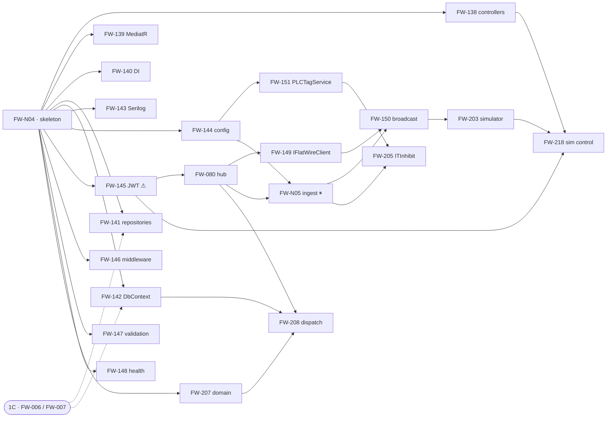

# Phase 1B — Execution Orchestration

**Project:** United Aluminum (UAL) — Flat Wire Mill Module
**Last Updated:** August 27, 2026 — ✅ **`FW-208` IS BUILT (steps 1-7, 9, 10) and the dispatch defect is FIXED — domain events now reach handlers.** 3 new files, 8 amended, **0 errors, no new analyzer warning**: the two lane wrappers, capture-then-replay hooked into `CommitTransactionAsync`, `SaveEntitiesAsync` routed through the same hook, and the two in-transaction handlers. **Verified by harness on live `FlatWireDB`** — lane routing with the raw event reaching **neither** lane, both lanes dispatching in-transaction-then-broadcast asserted on sequence, the bay **actually released** inside the rejection's transaction, a failed commit **broadcasting nothing**, and `WLD010`. `FW-207` still 137/137; the API still boots. ⛔ **Step 8 stays blocked** — `IFlatWireClient` exists in no checkout (`FW-080`). ⛔ **Three defects only execution could find, all silent.** **(1)** `INotificationHandler<>` was **never registered** by the Scrutor scan and Infrastructure's assembly was not scanned — `Publish` would find zero handlers and complete successfully; **the third such trap in this story**, and `FW-139` is corrected at source. **(2)** The in-transaction lane could not see a sibling aggregate's identity (`CK_RodStaging_RejectLink` needs `WipRejectionId`; at drain time the rejection is `Added` with `Id = 0`), so **`P-94`'s order is revised to save → drain → save → commit** — two saves, one transaction. **(3)** `BayStateChanged` **had to be split**: a notification four other call sites raise cannot carry a rejection link, so the release was unwritable — **`P-98`**, `BayReleaseRequested`. Two events gained `OperatorId`. Earlier the same day: ⚠ **`FW-208` REVIEWED, and the review found a LIVE DEFECT rather than stale text. `P-94`–`P-96` minted.** ⛔ **No domain event is dispatched at all on the path a command takes.** `SaveEntitiesAsync` is the only method that calls the dispatcher and **nothing anywhere invokes it**; `SaveChangesAsync` is **not overridden**; and `TransactionBehaviour` wraps every command and commits through `CommitTransactionAsync`, which calls that plain `SaveChangesAsync`. **So every one of the six events `FW-207` raises is collected and thrown away.** `P-95` hooks `CommitTransactionAsync`, where the commit boundary actually is. ⛔ **The card's AC 2 and build step 1 were worse than stale** — they instructed a reorder the built context's own remarks forbid, which would have moved the in-transaction handlers out of the transaction. ⛔ **And the post-commit path cannot be a second call to the dispatcher**, because it runs `ClearDomainEvents()` before publishing: a re-scan finds an empty change tracker and publishes nothing, silently. `P-94` makes it **capture-then-replay across two lanes** — database-writing handlers in-transaction, broadcasts after `CommitAsync()` — and `P-96` assigns each event a lane, giving `BayStateChanged` and `WeldRecorded` one handler on each. ⚠ **The handler half is blocked**: `IFlatWireClient` and `FlatWireHub` exist in no `ual-api` checkout (`FW-080` `P-22`). ✅ `G38` closed by `FW-207`. Earlier the same day: ✅ **`FW-207` IS BUILT** — 15 new files, 17 amended, **0 errors and no new analyzer warning**: the seven dimensioned quantities and `PassScheduleSnapshot`, **13 entity types** (the 12 aggregate children and the `Rod` read model) with 13 EF configurations, **20 invariants** as `IBusinessRule`, **6 domain events**, `IAggregateRoot` on all seven roots, and **`FW-146`'s owed fifth arm** — which makes the enforcement path reachable for the first time. **Verified by a purpose-built harness rather than the QA0 walkthrough, because no endpoint reaches an aggregate**: the model validates at **20 entity types** with all twelve closed collections on field access, **352 mapped columns across 20 tables** were checked against live `FlatWireDB`, every invariant was demonstrated refusing at the right `[API §1.3]` status (`G21` bay occupancy answering **`409`/`BAY_OCCUPIED`**, `G41` in both directions, the two `P-19` rules, both non-overlap chains, Mode P/A/B, `FR-212`, the mandated SPC and the once-per-edge prompt), the arm was confirmed by reflection to yield **both** statuses from one exception type, and a live round-trip read `RUN-0001` with its children and a spool with 2 segments / 2 orders / 1 staging before rolling back. The API still boots — `/health` `200` with `database.reachable: true`, `/lines/status` still `401`. ⛔ **One defect the compiler could not see: EF was mapping the derived properties the behaviour added** — a computed `EffectiveNetWeightLb` became a column that does not exist and `SpoolProcessing.SourceRods` became a navigation to **`RodAlpha` as an entity type**, failing model creation outright. The build was green while the model was broken; fifteen `builder.Ignore(…)` calls fix it, and the rule is now recorded: **every derived property on a mapped entity needs an explicit `Ignore`** — the same blind spot as `P-70`. ⚠ **`P-91`'s two rod-order entities are deliberately NOT built**, pending `[SVC §3.2a]`'s signature. Earlier the same day: ⚠ **`FW-207` REVIEWED; `P-89`–`P-93` minted, and two of them change what a developer does today.** ⛔ **`P-90` withdraws the blanket *"invariants → `422`"*** — `[API §1.3]` makes `409` *"conflict with current state — bay already occupied, rod already staged"*, `[API §1.8]` prices `BAY_OCCUPIED` at **409**, and the built `StubPayoffStagingService` and `MapUniquenessViolation` both answer `409`, so **`FW-207` AC 6's own worked example was the wrong status**; the callout justifying it by *"breakable by state"* was quoting `[API §1.3]`'s definition of `409`. Status is now **per rule, carried as data**. ⛔ **`P-89`: the `422` path has no arm** — `ExceptionHandlingMiddleware` has four and none for `BusinessRuleValidationException`, so an aggregate throw falls to `default` → **`500`**, indistinguishable from a null-reference bug. The throw stands (it is the story's whole *"So that"* clause, and `P-57`'s proof is a *service* choosing outcomes, not an aggregate defending itself) and the fifth arm is now **owed by `FW-146`**, corrected at source along with its claim that the exception type *"does not exist in the solution"* — it exists in `UA.Framework.Domain`. **`P-91` places five tables deployed 22 Aug 2026 that no aggregate map had claimed**, leaving `FW-207` modelling 28 tables against 33: the three spool children go inside `SpoolProcessing` (`SpoolTraceability`'s non-overlap is the **only** defence — nullable footage makes a trigger pass silently), and the two rod-order tables are proposed **outside** the seven pending `[SVC §3.2a]`'s signature; `[SVC]` corrected at source. `P-92` keeps the three business keys as strings (`OI-21` would bake a guess into a type); `P-93` forbids inheriting the framework's `BusinessRule`, whose `IsBroken()` blocks on `IsBrokenAsync()`. Also: **`G14`'s format half is verified, not unverified** (`FW-141` requires the throw at boot — `[GAP]` corrected), **`OI-42` closed 19 Aug** and struck, and **`G42` is client-confirmed, built 22 Aug, and its free window shut at `S1`**. Earlier the same day: ✅ **`FW-148` BUILT AND MEASURED; `P-88` minted and `G57` raised.** `GET /api/v1/flatwire/health` is live: `MapHealthChecks` + `.AllowAnonymous()` (`P-85`), two hand-written checks, and a custom writer emitting exactly `[API §4.19]`'s five members. **All three acceptance criteria measured across three runs** — `503` with the failing check named, `200`/`Degraded` in Development, and `401` on `/lines/status` against `503` on `/health` with the same absent header, so the anonymity is specific. `version` reads **`"1.0.0"`** — the SDK's `+<sha>` cut. **No package added; `Microsoft.Data.SqlClient` stays at 5.1.5**, and `AspNetCore.HealthChecks.UI.Client` was removed as unused. **`P-88`**: the connection string resolves **per probe, not at registration** — eager resolution would let a bad key stop the boot, and then the one endpoint whose job is to report a failing dependency could not run. ⛔ **`G57` is what that caught — and it is ✅ FIXED the same day:** `appsettings.json` sets `SqlSetting:DSN` to **`"DEV00164-001"`**, a *server* name, where the setting names the *configuration section holding the connection string* — every sibling sets `"UA_Database_UnitedDB"`. Nothing resolves, and because `AddCustomDbContext` defers into its `AddDbContext` lambda **the service boots clean and fails on the first query**, so every repository and the whole check-in transaction are affected on a service that started without a warning. **Now `"UA_Connection_String_dev00164001"`, verified on the committed file: `database.reachable: true, latencyMs: 33`.** ⚠ The **residual** is `FW-144`'s — nothing validates the connection string at boot, so the next wrong value also boots clean. Also found: **`[DEP §4.4]`'s publish command names `FlatWire.API.csproj`, a file that does not exist** — it is `Api.csproj`. ⚠ **`P-85` and `P-87` are implemented and still unratified.** Earlier the same day: **`FW-148` re-reviewed before execution — four build-order corrections, three of them to the same day's earlier review.** ⚠ The costly one: the *"registration-ordering trap"* in its §3 step 2 **does not exist** — `CustomDbContext.ResolveConnectionString` reads `IConfiguration` directly and never touches the `SqlSetting` options object, so `Program.cs:142` versus `146` is irrelevant and no factory overload is needed. **`Polly` needs no reference either** (already in `FlatWire.Api.deps.json` transitively, as is `UA.Framework.RestClient`); **only `AspNetCore.HealthChecks.SqlServer` is absent, and adding it silently bumps `Microsoft.Data.SqlClient` 5.1.5 → 5.2.0 service-wide** — now an explicit A/B choice recommending a hand-written `IHealthCheck`. **`version` must have the SDK's `+<sha>` suffix cut off** or the shape fails at QA0. `[TRP §6]`→`[TRP §1.4]` on `P-85` and the hours note. Earlier the same day: **`FW-148` reviewed against the built service; `P-20` RESTATED and `P-85`–`P-87` minted.** ⚠ **The route disagreement `P-20` was minted to settle does not exist.** `[API §1]` declares the REST base URL `/api/v1/flatwire` and **every `[API §3.2]` row is written base-relative to it** — row 1 ships as `Routes.Base + "lines/status"` — so row 30's `/health` and `[DEP]`'s `/api/v1/flatwire/health` are **one string in two notations**; prose uses the index shorthand and runnable commands write it out. *"Map it at both paths"* is withdrawn: on IIS this service is an application at `/API.FlatWire`, so **neither literal resolves** and a second route would only have been a second thing to keep working. The real undecided question — `UseHealthChecks` versus `MapHealthChecks`, and where — is now **`P-85`**, aligned to `[TRP §6]`. **`P-86`**: the **hub metrics are not the health surface's** — `[MON §7.1]` sources connection count from `FlatWireHub` and cadence deviation from *"Hub instrumentation"* in their own rows, and `[API §4.19]`'s body has five members and no hub member, so the plan required *"exactly five members"* and *"expose the hub metrics here"* at once; **`FW-080` and `FW-150` are corrected at source**, both having taken the claim from `FW-148`, and this file's `G9` row drops it. **`P-87`** 🔴: `SimulatePLCTagPush` is `true` on **every** environment until commissioning, so keying `opc.reachable` off it leaves `[DEP §5]` S1's OPC half and `[MON]`'s 2-minute alert **both inert**. Three more found in the code: **`OPCConnection` exposes no anonymous API endpoint** — all three routes are `[HttpPost]` behind the global `AuthorizeFilter` and a health check carries no token, so the probe target is that service's own **`/liveness`**; **the route is `/liveness`, not `/liveliness`** (the constant is *named* `Liveliness`); and **neither `AspNetCore.HealthChecks.SqlServer` nor `Polly` is referenced** by `FlatWire.API.csproj` — a `PackageVersion` entry is not a reference. Earlier the same day: **`FW-147` EXECUTED; `P-84` minted and `G55`/`G56` raised.** `TC-020` has been run: **12 of 14 enums pass C# ↔ DDL with zero mismatches**, legs extracted mechanically. ⚠ **It is a two-way diff — the TypeScript leg exists in no `ual-angular` checkout** (`FW-132` unbuilt) and `LineState`/`AlertSeverity` have **no DB leg either**, so two enums are asserted by nothing (**`G56`**); `P-84` signs the test off **per leg** so the real twelve-enum result is banked without claiming the third. **`G55`** is the defect found: `CK_SpoolCheckin_PayoffPos` pins FL2's spool to payoff `1` (`Payoff1`, a rod-fed VPS bay) while the enum and the pinned lookup both make FL2's payoff `3` (`TraversingTakeup`), on a column with no FK — the *membership* diff passes because the disagreement is about **meaning**. Step 4's `P-19` handoff was already in `FW-207`. Earlier the same day: **`FW-147` reviewed against the built code; `P-83` minted.** ⚠ The correction that changes what is done today: **`TC-020` is not defective and never was** — `[TCS]` repaired it on **14 Aug 2026**, the day before `FW-147` first issued, and its expected result matches `CanonicalEnums.cs` value for value; `phase-01b` L163’s warning is the stale artifact — **now struck there**, rewritten to the same line count so every `phase-01b` L-number citation still resolves — so the story’s one remaining step is **runnable and merely unowned**. Three more, plus a route that exists nowhere: **fourteen validators were built, not thirteen** — the extra is `UnstageRodRequestValidator` (`POST /staging/rod/unstage`); **six places in `FW-139` and one here are corrected**, and `FW-139`’s §6.1/§8 also named a route, `POST /payoff/stage`, that exists nowhere — it is `POST /staging/rod`; **an FL2 `lineId` does not fail enum membership**, which is `P-83`; and on thirteen of the fourteen the `400` comes from **model binding**, not `ValidatorBehavior` — `StageRodCommand` exists but its endpoint still calls the service directly, so `P-59`’s bridge is unreachable from any endpoint today. Earlier the same day: **`FW-145` reviewed; `P-75`–`P-77` registered and `P-74` added to the register, which had stopped at `P-73`.** The plan's §3.1 still carried `FW-N04` step 6 rule 2 — *"there is no `app.UseAuthorization()`"* — against its own banner and against the built `Program.cs` (`P-55`); **`P-17`'s policy shape was not implementable** (attributes AND-combine, every contested `[SEC §8]` cell is multi-role) → **`P-75`**; the hub's `Events` hook had no reachable owner → **`P-77`**; and the 22 hosted endpoints had no endpoint→policy mapping, which now shows **four** policies binding. ⚠ **`P-76` is open** and **`FW-145`'s `AC 4` is not executable on the MVP-1 surface** — one of `[TCS §10.3]`'s fifteen matrix cases has an endpoint here. Earlier: **`FW-142` and `FW-141` are BUILT, and `P-69`–`P-72` registered.** `FW-141`'s steps 2-3 and 5 completed the same day once the context landed: seven `sealed` repositories, all registered, **every accessor exercised against live `FlatWireDB`** in a rolled-back transaction. `FlatWireDbContext`, seven entity configurations, the design-time factory, `AddCustomDbContext` and `TransactionBehaviour` all land; model validated and smoke-tested against `FlatWireDB`. **`P-70` is the one to read**: sixteen columns are added by `ALTER TABLE`, not in the `CREATE TABLE` body, and `FW-141` lost **seven properties on two roots** by parsing bodies alone. The plan was first corrected against the 27 Aug DDL: two residual `28`s that survived both count sweeps (their `V4` gate greps `"28 tables"`, a string the file never contained), a block quote misattributed to a rewritten `phase-01b` L47, *"the six reference tables"* over a list of **seven**, and `OI-42` carried as open five days after it closed. `P-69` maps **eight** `ROWVERSION` tokens against `[SVC §3.4]`'s six. Earlier: August 26, 2026 — **`P-66`–`P-68` registered** and `FW-141` corrected against the code: it was marked *Ready* over **five empty folders**, `IGenericRepository<T>` **does not exist** (two type parameters), §6's keying check **contradicted** its own build order, and the mandated base would have put **EF in the Domain layer**. `P-66` folds the structural Domain minimum forward from `FW-207` so step 1 is schedulable. Earlier: August 25, 2026 — **`P-62`–`P-65` registered** and `FW-140` corrected against the built code: its swap had **nothing to switch** — no service interfaces exist, the fixtures sit in static classes called straight from the controllers, and **no domain in `ual-api` has the `CoilCheckin` pattern it said to copy**. The mechanism is specified for the first time; **`P-65` is open pending ratification**. Earlier: **`P-59`–`P-61` registered** and `FW-139` corrected against the built code: the framework's `LoggingBehavior`/`ValidatorBehavior` do exist, `IMediator` is already registered by `P-51`, and the built validators need bridging to the commands *(that entry said **thirteen**; the count is **fourteen** — corrected 27 Aug 2026 with `P-83`)*. Earlier: **`P-56`–`P-58` registered**: `FW-138` brought to the repository C# standard, `P-06` superseded, `FW-147`'s enums and validators built early. Earlier: **`FW-138` is BUILT** (22 endpoints / 12 controllers, 56/56 cases, 22/22 `401`); `P-06` resolved in the build and **`P-55`** minted — `app.UseAuthorization()` is required under `MapControllers`, correcting `FW-N04` step 6 rule 2. Earlier: **`P-52`, `P-53`, `P-54` registered and the series retitled `P-01`–`P-54`** (new decisions mint at `P-55`+); `P-53` added to the ratification gates as the second-widest after `P-06`; controller counts **15 → 14** and trial **8 → 7 (5 serving a screen)**; §8.1 grows to five findings with the two `[API]` escalations *(previously August 15, 2026 — **`G6`/`OI-37` answered: the critical path is no longer blocked at node 2.** `FW-145` amber not red, §3 and §5 restated, `P-17` restated *(earlier same day: `P-18` settled; counts to 32, §1.4, §4a register, §8 boundary)*)*
**Document Type:** Execution index and dependency graph for the Phase-1B implementation plans
**Status:** Active — **the entry point for this folder**
**Owner:** Backend (.NET) + Real-time streams
**Audience:** The delivery lead sequencing Phase 1B, and any developer picking up a story
**Shortcode:** — *(orchestration, derived from the plans and the specifications; **not citable as a requirement**)*
**Part of:** `ProjectPlan/Backend/TaskBreakdownPlans/` — folder index: this file

---

> **What this file is.** The **32 plans** each say *how* to build one story. This says **what
> can start, in what order, and what is stopping it.** It holds no build detail — every
> statement here resolves to a plan, and where this file and a plan disagree, **the plan
> wins**; where a plan and a specification disagree, the specification wins.
>
> **The one thing to read first:** the critical path is **134 h**, and as of **15 Aug 2026
> nothing on it is blocked** — `G6`/`OI-37` was answered and node 2 (`FW-145`) is buildable.
> See §3. What remains is a **verification** dependency, not a build one: the six role claim
> *values* are still unmapped (§5).
>
> **Building the trial rather than the phase?** Its companion is
> **[TrialOrchestration.md](TrialOrchestration.md)** — the same stories on a different axis:
> 66 across four streams, sequenced by **sprint** (T1/T2/T3) rather than by dependency wave,
> with the trial's own blockers and its 330 h of deferrals. This file answers *what can
> start*; that one answers *what ships on 30 Sep*.

---

## 1. Status board

**32 plans.** `phase-01b`'s twenty stories (§1.1–§1.2) · two trial-scope (§1.3) · **ten
trial-path stories from Phases 4–8 (§1.4)**. Hours are `[TB §7]`'s, quoted not restated.

> **§1.1–§1.3 are Phase 1B and are what §2–§6 sequence.** §1.4's ten sit **downstream of the
> phase** and are sequenced by sprint in
> [TrialOrchestration.md](TrialOrchestration.md), not by wave here.

### 1.1 Backend stream — 249 h

| Plan | Story | h | Wave | Status |
|---|---|---|---|---|
| [FW-N04](FW-N04-FlatWire-Solution-Skeleton.md) | Solution + 4-project skeleton | 16 | **0** | ✅ **Built 25 Aug 2026** — wave 1 is unblocked · `P-01`, `P-02`, `P-50`, `P-51` |
| [FW-138](FW-138-Fifteen-Thin-Controllers.md) | Fourteen thin controllers, 22 endpoints | 45 *(42 owed)* | 1 | ✅ **Built 25 Aug 2026** — 61/61 cases, 22/22 `401` · `P-06` ratified in the build · `P-55` minted |
| [FW-139](FW-139-MediatR-Registration-And-Pipeline-Behaviours.md) | MediatR + behaviours | 16 | 1 | ✅ **Built 25 Aug 2026** — pipeline order read off the log · `P-59` bridge proven behaviourally · `P-61` applied · `P-10` still waits on `FW-142` |
| [FW-140](FW-140-DI-Registration-And-Stub-Swap.md) | DI + `useMockData` swap | 12 *(understated)* | 1 | ✅ **Built 26 Aug 2026** — 12 interfaces / 12 stubs / 12 shells · 61/61 and **65/65 bodies byte-identical** · `P-02` re-verified · ⚠ **`P-65` still needs ratification** |
| [FW-141](FW-141-Repository-Layer.md) | Seven repositories | 28 *(gained `FW-207` scope)* | 1 | ✅ **BUILT 27 Aug 2026** — 6 alphas · 7 structural roots · 7 interfaces · **7 `sealed` repositories, all registered** · `ContextRepository` with `sp_GetGaugeTrace` · `G14` **verified at startup** · **13/13 accessors verified on the live DB** · `P-71` minted. ⚠ **Step 6 still waits on `OI-33`** |
| [FW-142](FW-142-Dapper-EF-And-FlatWireDbContext.md) | `FlatWireDbContext` + Dapper | 24 | 1 | ✅ **Built 27 Aug 2026** — 7 roots mapped, model validated, insert→select→rollback proven on the live DB · `P-13` holds (**no `DbSet<PassSchedule>`**) · `P-69`, **`P-70`** minted · **unblocks `FW-141` steps 2–3 and `FW-139`'s `P-10`**. ⛔ `SpoolProcessing` untestable — **deployed DB predates `Q60`**; teardown owed |
| [FW-143](FW-143-Serilog-And-Audit-Log.md) | Serilog + audit log | 12 | 1 | ✅ **Built 27 Aug 2026** — Serilog + Console sink, correlation verified end to end, `UseSerilogRequestLogging` (`P-73`) closes *"controllers log nothing"*, `IAuditLog` + `SerilogAuditLog`. ⚠ **`P-15` still open** — AC 3 met structurally, not materially |
| [FW-144](FW-144-Configuration-Binding.md) | Configuration binding | 12 | 1 | Ready — map *contents* blocked, shape is not |
| [FW-145](FW-145-JWT-And-Role-Policies.md) | JWT + role policies | 16 | 1 | ⚠ **Unblocked 15 Aug** — `G6` answered; six claim *values* still unmapped. **Reviewed 27 Aug** — `P-75`/`P-77` minted, `P-76` open; `AC 4` is **not executable** on the MVP-1 surface (§6.1) |
| [FW-146](FW-146-Exception-Middleware-And-Envelope.md) | Exception middleware | 8 | 1 | ✅ **BUILT 27 Aug 2026** — `ExceptionHandlingMiddleware` live, filter removed and the removal **asserted at boot**; stack-on-the-wire 2,972 B → 173 B; 22/22 `401` intact; both inspection rows hold at once. `P-78`–`P-82` minted. ⚠ **`P-78`: §4's `RemoveType` sketch does not compile.** Two rows handed forward (§6) |
| [FW-147](FW-147-FluentValidation-Value-Objects-And-Enums.md) | Validation + 14 enums | 12 | 1 | ✅ **EXECUTED 27 Aug** — built 25 Aug with `FW-138` (14 enums + **14** validators, not 13); **`TC-020` run**: 12/14 pass C# ↔ DDL, zero mismatches (§6.1). ⚠ **Two-way only — no TS leg** (`FW-132` unbuilt) and `LineState`/`AlertSeverity` have no DB leg: **`G56`**, signed off per leg (`P-84`). Defect found: **`G55`**. `P-19` handoff already in `FW-207` |
| [FW-148](FW-148-Health-Checks.md) | Health checks | 8 | 1 | ✅ **BUILT 27 Aug 2026** — live at `/api/v1/flatwire/health`, all three ACs measured (§5.1), `0` errors and no new analyzer warning. Option A built, so **no package added**; `version` cut to `"1.0.0"`. **`P-88`** minted; ⛔ **`G57`** raised **and fixed** — the committed `SqlSetting:DSN` was a server name and could not resolve **while the service booted anyway**; now `"UA_Connection_String_dev00164001"`, verified. Residual with `FW-144`. ⚠ `P-85`/`P-87` implemented, **still unratified**. Same day, earlier: **`P-20` restated, `P-85`–`P-87` minted.** ⚠ **The route disagreement does not exist**: `[API §3.2]` is written base-relative to `[API §1]`'s `/api/v1/flatwire`, so row 30 and `[DEP]` are one string in two notations. Also: the hub metrics are **not** this story's (`P-86`), and `OPCConnection` has no anonymous API endpoint to probe. ⚠ `P-85` and `P-87` ratify |
| [FW-207](FW-207-Domain-Model.md) | Domain model (`D-29`) | 32 | 1 | ✅ **BUILT 27 Aug 2026** — 15 new files, 17 amended, **0 errors, no new warning**. 7 quantities + `PassScheduleSnapshot` · **13 entity types** + 13 EF configurations · **20 invariants** · 6 domain events · `IAggregateRoot` on all seven roots · **`FW-146`'s owed fifth arm** (`P-89`). **Verified by harness, not walkthrough** (§6.1): model validates at 20 types, **352 columns** checked on live `FlatWireDB`, every invariant demonstrated at the right `409`/`422`, live round-trip rolled back, API still boots (`/health` 200, `/lines/status` 401). ⛔ **Defect found and fixed: EF was mapping the new derived properties as columns and `RodAlpha` as an entity type** — green build, broken model; 15 `Ignore` calls. ⚠ **`P-91`'s two rod-order entities NOT built** — need `[SVC §3.2a]`'s signature. Same day, earlier: ⚠ **reviewed; `P-89`–`P-93` minted.** ⛔ **The blanket `422` is withdrawn** (`P-90`): bay occupancy is **`409`** per `[API §1.3]`/`§1.8` and the built code, and its *"breakable by state"* justification argued for the opposite code. ⛔ **The `422` path has no arm** — an aggregate throw returns `500` until `FW-146` adds the fifth (`P-89`). **Five 22-Aug tables placed** (`P-91`, `[SVC]` corrected at source; two await its signature). `G14`'s format half now **verified**, `OI-42` struck, `G42` rewritten. Structural half already built by `FW-141` (`P-66`); `D-30` still open on 3 of 7 roots |
| [FW-208](FW-208-Domain-Events-Post-Commit-Dispatch.md) | Domain-event dispatch | 8 | 3 | ✅ **BUILT 27 Aug 2026 (steps 1-7, 9, 10)** - 3 new files, 8 amended, **0 errors, no new warning**. Two lane wrappers, capture-then-replay hooked into `CommitTransactionAsync`, `SaveEntitiesAsync` routed through it, and the two in-transaction handlers. **Verified by harness on live `FlatWireDB`**: lane routing (raw event reaches neither lane), both lanes dispatching in-transaction-then-broadcast, the bay actually released inside the rejection's transaction, a rollback broadcasting nothing, `WLD010`. `FW-207` still 137/137; API boots. ⛔ **Step 8 blocked** - `IFlatWireClient` does not exist (`FW-080`). ⛔ **Three defects found on execution**: `INotificationHandler<>` was never registered (a third silent no-op), the in-transaction lane could not see a sibling aggregate's identity so **`P-94`'s order is revised to save-drain-save-commit**, and `BayStateChanged` had to be split (**`P-98`**) |

### 1.2 Real-time stream — 124 h

| Plan | Story | h | Wave | Status |
|---|---|---|---|---|
| [FW-080](FW-080-FlatWireHub.md) | `FlatWireHub` | 28 | 2 | ⚠ `G10` provisioning · `G9` no pass criteria |
| [FW-151](FW-151-PLCTagService.md) | `PLCTagService` + simulate | 16 | 2 | ⚠ compensation design blocked on `G2` |
| [FW-149](FW-149-IFlatWireClient.md) | `IFlatWireClient` | 16 | 3 | Ready — interface minted by `FW-080` (`P-22`) |
| [FW-N05](FW-N05-OPC-Ingest-And-Bounded-Channel.md) | OPC ingest + channel | 32 | 3 | ⏸ **Deferred to commissioning — contract still due now** (`P-29`) |
| [FW-150](FW-150-Broadcast-Loop.md) | Broadcast loop | 16 | 4 | Ready — **unreduced for the trial** |
| [FW-205](FW-205-ITInhibitService.md) | `ITInhibitService` | 16 | 4 | Ready — **closes exit criterion 5** |

### 1.3 Trial scope — additive to `[CE §3b]`, offsets nothing

| Plan | Story | h | Wave | Status |
|---|---|---|---|---|
| [FW-203](FW-203-OPC-Feed-Simulator.md) | OPC feed simulator | 8 | 5 | Ready — **must drive FL2** |
| [FW-218](FW-218-Sim-Control-Surface.md) | Sim control surface | 18 | 6 | Ready — resolves `G43` |

### 1.4 Trial-path plans — Phases 4–8, downstream of this phase

Server-side stories on the 30 Sep trial's path. **Not part of Phase 1B**, so they do not
appear in §2's graph, §3's critical path or §6's exit criteria — they are sequenced by sprint
in [TrialOrchestration.md](TrialOrchestration.md).

| Plan | Story | h | Stream | Phase | Status |
|---|---|---|---|---|---|
| [FW-157](FW-157-CheckIn-Rod-And-CheckInService.md) | `POST /checkin/rod` + `CheckInService` | 36 | BE | 4 | ⚠ **Provisional until `G2` closes**; trial runs it **without `RodStaging`** |
| [FW-082](FW-082-PLC-Tag-Push-On-Acknowledgement.md) | PLC tag group push on acknowledgement | 16 | RT | 4 | ⚠ Four blockers · `G29` leaves a payload value with nowhere to write |
| [FW-164](FW-164-Run-Queries-And-RunQueryService.md) | `GET /run/active` + `gaugetrace` | 12 | BE | 5 | ⚠ **The trial's landing route** since DB1 left scope |
| [FW-168](FW-168-Spc-And-SpcService.md) | `POST /spc` + `SpcService` | 12 | BE | 6 | ⚠ Tolerance band unseeded (`Q22`) |
| [FW-170](FW-170-Pause-Resume-And-RunControlService.md) | pause / resume + `RunControlService` | 8 | BE | 6 | Ready — four resume outcomes |
| [FW-172](FW-172-Run-Event-Markers.md) | Run-event markers + `LineStatus` | 20 | RT | 6 | Ready — four of six markers (`P-45`) |
| [FW-174](FW-174-WipRejection-And-Checkout-Services.md) | `POST /wipreject` + `POST /checkout` | 24 | BE | 7 | ⚠ **`G24`: Mode B's constraint has no columns yet** |
| [FW-177](FW-177-Exception-Broadcasts.md) | Exception broadcasts + supervisor notify | 16 | RT | 7 | ⚠ `FW-175` deferred — notification is transient |
| [FW-179](FW-179-CheckIn-Spool-And-Spools-Query.md) | `POST /checkin/spool` + `GET /spools` | 18 | BE | 8 | ⚠ **`[API §4.6a]`'s worked example is stale** |
| [FW-181](FW-181-FL2-Null-Gauge-Contract.md) | FL2 null-gauge contract | 4 | RT | 8 | ⚠ *"the single most likely thing to ship wrong"* |

---

## 2. Dependency graph

> **This graph is Phase-1B-scoped by design.** It shows §1.1–§1.3's twenty-two stories and
> the two 1C edges that enter them. **§1.4's ten are deliberately absent** — they sit in
> Phases 4–8, their ordering is by sprint rather than by wave, and merging two axes into one
> diagram is how a map stops being readable. Their sequencing is
> [TrialOrchestration.md](TrialOrchestration.md).



**Waves** — level = 1 + the deepest dependency:

| Wave | Stories | Note |
|---|---|---|
| **0** | `FW-N04` | The single root. **Nothing else starts.** |
| **1** | `FW-138` `FW-139` `FW-140` `FW-141` `FW-142` `FW-143` `FW-144` `FW-145` `FW-146` `FW-147` `FW-148` `FW-207` | **Twelve unlock at once** — the parallelism opportunity |
| **2** | `FW-080` `FW-151` | |
| **3** | `FW-149` `FW-N05` `FW-208` | |
| **4** | `FW-150` `FW-205` | |
| **5** | `FW-203` | trial |
| **6** | `FW-218` | trial |

> **Two dashed edges leave the phase.** `FW-141` and `FW-142` need **1C**'s `FW-006`/`FW-007`.
> `phase-01b` L27: *"1B ships **stub** endpoints returning schema-valid fixtures first so 1A
> can build against the real service early, and wires the real repositories to 1C's
> `FlatWireDB` as the schema lands."* **The stub path is unblocked immediately** — only the
> real repository wiring waits.

---

## 3. The critical path — clear as of 15 Aug 2026

```
FW-N04 (16) → FW-145 (16) → FW-080 (28) → FW-N05 (32) → FW-150 (16) → FW-203 (8) → FW-218 (18)
                  ✅ unblocked 15 Aug
```

**134 h**, and it runs almost entirely through the **RT stream**, not the 249 h of backend
bulk. Three consequences:

1. **No plan is marked `Blocked` any more.** `G6`/`OI-37` — whether the six roles exist as
   JWT claims — **was answered on 15 Aug 2026: they do, on the standard `ClaimTypes.Role`.**
   `phase-01b` L91's *"can block the build outright"* and `[TRP §6]`'s 28 Aug date are both
   **spent**, and node 2 is buildable today. ⚠ **One residual, and it moved rather than
   closed:** the six claim *values* are abbreviated or coded rather than `[SEC §8]`'s labels,
   and the mapping has not been supplied. It gates **verification, not construction** —
   `FW-145` §5 absorbs it into a six-constant class — so it is now a QA0 dependency rather
   than a critical-path one. See §5.
2. **Staffing the backend stream harder does not shorten the phase.** BE 249 h is wide and
   shallow — twelve stories unlock together at wave 1; RT 124 h is narrow and deep.
   `[TRP §1.4]`: RT *"none of it compresses well — 0.75–0.90 against FE's 0.62."*
3. **`FW-N05` sits mid-path and is deferred.** `FW-203` stands in for the trial, but
   **`FW-N05`'s contract is still due now** (`P-29`) — a deferred story whose contract is
   also deferred cannot be stood in for.

> *The 134 h is derived here for sequencing only. It re-states no published total and
> changes no figure in `[CE]`, `[DE]`, `[SSP]`, `[TRP]` or `[TB §7]`.*

---

## 4. Ratification gates — the decisions to clear

Each **blocks the named story** until settled. All are in the plans' §5 with rationale and a
fallback.

| Decision | Blocks | The question |
|---|---|---|
| **`P-01`** | [FW-N04](FW-N04-FlatWire-Solution-Skeleton.md) | Scaffold from `UATemplate` where the card says *"copied from `CoilCheckin`"* |
| **`P-02`** | [FW-N04](FW-N04-FlatWire-Solution-Skeleton.md) → `FW-139`, `FW-140` | `Infrastructure → Domain` per `[SVC §3.1]`, against `CoilCheckin`'s `Infrastructure → Application` |
| **`P-06`** 🔴 | [FW-138](FW-138-Fifteen-Thin-Controllers.md) **step 3** → `FW-146` | **No framework type produces `[API §1.2]`'s envelope.** The widest-reaching of the five ✅ **SUPERSEDED by `P-56`, 25 Aug 2026** — the envelope now *derives* from `ActionResultBase<T>` to satisfy the repository C# standard, keeping `errors[]` and the string code. Originally resolved in the build: `FlatWireResult<T>` is delivered in `FlatWire.Domain/Models/` and verified on the wire — `data` · `success` · `errors` · `errorCode`, camelCase, real status codes. `FW-146` inherits it and must not define a second envelope |
| **`P-53`** 🔴 | [FW-138](FW-138-Fifteen-Thin-Controllers.md) → `FW-140`, `FW-223`, `[TRP]` | **The service hosts no `/rod/**` surface** — rod receiving is not shopfloor (25 Aug 2026). Second only to `P-06` in reach: it contradicts `[API §3.1]`, `[API §3.2]`, `[TB §7]`'s AC 1, `phase-01b` L82 and `FW-N04` step 8, and leaves `FR-042`/`FR-064` with no endpoint |
| **`P-13`** | [FW-142](FW-142-Dapper-EF-And-FlatWireDbContext.md) | `PassSchedule*` mapped read-only — `D-31` owns the tables, `[SVC §3.2a]` forbids the write path |
| **`P-85`** | [FW-148](FW-148-Health-Checks.md) | ✅ **BUILT — still wants a signature.** **`MapHealthChecks` with an explicit `.AllowAnonymous()`**, between `UseRouting()` and `MapControllers()` — the mechanism question the withdrawn `P-20` never reached. `[TRP §1.4]` already says `MapHealthChecks`; the explicit call states the service's **one** anonymity exception at the line that creates it rather than by pipeline position, which is `P-55`'s lesson |
| **`P-87`** 🔴 | [FW-148](FW-148-Health-Checks.md) | ✅ **BUILT as "yes", measured in both flag states — still wants a signature, because Operations may read AC 2 the other way.** **Does `opc.reachable` tell the truth while `SimulatePLCTagPush = true`?** The flag is `true` in **every** environment until commissioning (`[DEP §4.4]`), so keying the field off it makes `[DEP §5]` S1's OPC half and `[MON §7.1]`'s 2-minute alert **both inert**. Either probe for real and let the flag set only severity, or strike those two consumers until commissioning — do not leave it undecided and build the first branch by default |
| **`P-76`** 🔴 | [FW-145](FW-145-JWT-And-Role-Policies.md) | **Does a `ProductionTransaction` policy go on the ten write endpoints that `[SEC §8]` gives no row?** Without it *"Admin owns no production transaction"* is stated and unenforced — an Admin token checks a rod in. It denies on an **absence** in the matrix rather than a `✗`, which is why it is `[SEC]`'s call and not a plan's |

> **`P-06` first.** It blocks `FW-138`'s 45 h and `FW-146`'s 8 h, and if ratification prefers
> `ActionResultBase<T>` then `[API §1.2]` changes instead — **a contract change across every
> 1A screen**, not a backend detail. Escalate rather than absorb.

### 4a. Decision register — `P-01` to `P-98`

Every decision the plans make. **§4 above is this table filtered to `⚠ ratify`.** Each `P-##`
is defined once, in the plan named here, with its rationale and fallback.

| id | Plan | Subject | |
|---|---|---|---|
| `P-01` | [FW-N04](FW-N04-FlatWire-Solution-Skeleton.md) | Scaffold from `UATemplate`; `CoilCheckin` stays the reference | ⚠ ratify |
| `P-02` | [FW-N04](FW-N04-FlatWire-Solution-Skeleton.md) | MediatR bootstrap in `FlatWire.API`, keeping `Infrastructure → Domain` | ⚠ ratify |
| `P-03` | [FW-N04](FW-N04-FlatWire-Solution-Skeleton.md) | `FlatWire.*` namespaces and assembly names | settled |
| `P-04` | [FW-N04](FW-N04-FlatWire-Solution-Skeleton.md) | Controller routing — class-level base, explicit per-action routes | settled |
| `P-05` | [FW-N04](FW-N04-FlatWire-Solution-Skeleton.md) | A fresh `launchSettings.json` port set | settled |
| `P-06` | [FW-138](FW-138-Fifteen-Thin-Controllers.md) | **Build the response envelope; the framework does not supply it** | ⚠ ratify |
| `P-07` | [FW-138](FW-138-Fifteen-Thin-Controllers.md) | The seven deferred endpoints are absent, not stubbed | settled |
| `P-08` | [FW-138](FW-138-Fifteen-Thin-Controllers.md) | Fixtures live per controller, not in one shared class | settled |
| `P-09` | [FW-139](FW-139-MediatR-Registration-And-Pipeline-Behaviours.md) | Scrutor scan, not `AddMediatR` | settled |
| `P-10` | [FW-139](FW-139-MediatR-Registration-And-Pipeline-Behaviours.md) | `TransactionBehaviour` lands with `FW-142` | settled |
| `P-11` | [FW-140](FW-140-DI-Registration-And-Stub-Swap.md) | Swap resolved at startup; the flag is `useMockData` | settled |
| `P-12` | [FW-141](FW-141-Repository-Layer.md) | Build the seven; **no `PassScheduleRepository` or `RodRepository`** | settled |
| `P-13` | [FW-142](FW-142-Dapper-EF-And-FlatWireDbContext.md) | Map 33 tables (`[DBD §6.2]`) for reading; `PassSchedule*` gets **no write path** | ⚠ ratify |
| `P-14` | [FW-142](FW-142-Dapper-EF-And-FlatWireDbContext.md) | Interim stance on `D-30` | settled |
| `P-15` | [FW-143](FW-143-Serilog-And-Audit-Log.md) | **The audit log has no persistence target** — open finding | ⚠ open |
| `P-16` | [FW-144](FW-144-Configuration-Binding.md) | Fail fast at boot; warn **once**, with a count | settled |
| `P-17` | [FW-145](FW-145-JWT-And-Role-Policies.md) | **Six role constants, not one claim-type constant** — restated 15 Aug when `G6`'s answer retired the original hedge. ⚠ Its *"six policies, one per role"* half is **superseded by `P-75`** (27 Aug); the constants stand | settled |
| `P-18` | [FW-146](FW-146-Exception-Middleware-And-Envelope.md) | Remove `HttpGlobalExceptionFilter` — **forced, not chosen** | **settled 15 Aug** |
| `P-19` | [FW-147](FW-147-FluentValidation-Value-Objects-And-Enums.md) | `FM2_S3`-Active and FL3⇒Hybrid go in the aggregate | settled |
| `P-20` | [FW-148](FW-148-Health-Checks.md) | **RESTATED 27 Aug 2026 — there is one route and the two documents never disagreed.** `[API §1]` declares the base URL `/api/v1/flatwire` and **every `[API §3.2]` row is written base-relative to it** (row 1 ships as `Routes.Base + "lines/status"`), so row 30's `/health` and `[DEP]`'s `/api/v1/flatwire/health` are **one string in two notations** — prose uses the index shorthand, runnable commands write it out. ~~Serve `/health` at both paths~~ is **withdrawn**: its justification was that both literals stay true, and on IIS this service is an application at `/API.FlatWire`, so **neither** resolves | settled |
| `P-21` | [FW-080](FW-080-FlatWireHub.md) | Add the MessagePack package; **measure before committing** | settled |
| `P-22` | [FW-080](FW-080-FlatWireHub.md) | `IFlatWireClient` lands here though it is `FW-149`'s | settled |
| `P-23` | [FW-207](FW-207-Domain-Model.md) | Build the two unverifiable criteria anyway | settled |
| `P-24` | [FW-207](FW-207-Domain-Model.md) | Interim stance on `D-30` | settled |
| `P-25` | [FW-205](FW-205-ITInhibitService.md) | **The absent clear path is a deliverable, and needs a guard** | settled |
| `P-26` | [FW-205](FW-205-ITInhibitService.md) | Surface for three lines, behaviour for two | settled |
| `P-27` | [FW-151](FW-151-PLCTagService.md) | All six operations now; compensation shape waits on `G2` | settled |
| `P-28` | [FW-N05](FW-N05-OPC-Ingest-And-Bounded-Channel.md) | Size the channel by configuration; record it as provisional | settled |
| `P-29` | [FW-N05](FW-N05-OPC-Ingest-And-Bounded-Channel.md) | The contract is frozen before the simulator uses it | settled |
| `P-30` | [FW-150](FW-150-Broadcast-Loop.md) | Fixed cadence, not adaptive; the ratio is provisional | settled |
| `P-31` | [FW-150](FW-150-Broadcast-Loop.md) | The loop is unreduced for the trial | settled |
| `P-32` | [FW-149](FW-149-IFlatWireClient.md) | The `FW-136` match is a manual diff with a named owner | settled |
| `P-33` | [FW-149](FW-149-IFlatWireClient.md) | The interface is a published contract from `FW-080`'s first commit | settled |
| `P-34` | [FW-208](FW-208-Domain-Events-Post-Commit-Dispatch.md) | Prove the SignalR-free Application layer by project reference | settled |
| `P-35` | [FW-208](FW-208-Domain-Events-Post-Commit-Dispatch.md) | Translation handlers live in Infrastructure | settled |
| `P-36` | [FW-203](FW-203-OPC-Feed-Simulator.md) | Build the levers here, expose them in `FW-218` | settled |
| `P-37` | [FW-203](FW-203-OPC-Feed-Simulator.md) | No new interface, and no simulator-aware branch downstream | settled |
| `P-38` | [FW-218](FW-218-Sim-Control-Surface.md) | Conditional route registration, not a policy guard | settled |
| `P-39` | [FW-218](FW-218-Sim-Control-Surface.md) | An increment of `FW-215` — a subset, not a variant | settled |
| `P-40` | [FW-157](FW-157-CheckIn-Rod-And-CheckInService.md) | Ordered path now; recovery **strategy** behind `G2` | settled |
| `P-41` | [FW-082](FW-082-PLC-Tag-Push-On-Acknowledgement.md) | Push edge type with its path unresolved, and **fail loudly** | settled |
| `P-42` | [FW-164](FW-164-Run-Queries-And-RunQueryService.md) | Read the order block through a view; the DTO carries nulls | settled |
| `P-43` | [FW-168](FW-168-Spc-And-SpcService.md) | The tolerance band is data, and it is **unseeded** | settled |
| `P-44` | [FW-170](FW-170-Pause-Resume-And-RunControlService.md) | Four resume outcomes; the greyed one still exists | settled |
| `P-45` | [FW-172](FW-172-Run-Event-Markers.md) | This story owns four markers; the other two are `FW-177`'s | settled |
| `P-46` | [FW-174](FW-174-WipRejection-And-Checkout-Services.md) | Persist PENDING DISPOSITION here; the queue is `FW-175`'s | settled |
| `P-47` | [FW-177](FW-177-Exception-Broadcasts.md) | Broadcast to a group, not to a connection | settled |
| `P-48` | [FW-179](FW-179-CheckIn-Spool-And-Spools-Query.md) | `404` means the alpha does not exist, and nothing else | settled |
| `P-49` | [FW-181](FW-181-FL2-Null-Gauge-Contract.md) | The client binds to **route mode**; the server must publish it | settled |
| `P-50` | [FW-N04](FW-N04-FlatWire-Solution-Skeleton.md) | Fifteen controller shells, not sixteen — `/order/**` is raised, not invented | settled |
| `P-51` | [FW-N04](FW-N04-FlatWire-Solution-Skeleton.md) | Register `IMediator` in `Program.cs`; handlers stay with `FW-139` | settled |
| `P-52` | [FW-138](FW-138-Fifteen-Thin-Controllers.md) | Request/response types live in `FlatWire.Domain/Models/{Area}/`, authored by `FW-138` and **inherited** by the handler stories | settled |
| `P-53` | [FW-138](FW-138-Fifteen-Thin-Controllers.md) | **The service hosts no `/rod/**` surface** — `RodReceivingController` and its three endpoints withdrawn; 24 → **22** endpoints, 13 → **12** controllers | ⚠ ratify |
| `P-54` | [FW-138](FW-138-Fifteen-Thin-Controllers.md) | `[API §4.3]` and `§4.20` are re-homed or re-specified by `[API]`, not by a plan | ⚠ open |
| `P-55` | [FW-138](FW-138-Fifteen-Thin-Controllers.md) | **`app.UseAuthorization()` between `UseRouting()` and `MapControllers()`** — corrects `FW-N04` step 6 rule 2, which holds for `UseMvc` and not for endpoint routing | settled |
| `P-56` | [FW-138](FW-138-Fifteen-Thin-Controllers.md) | **The envelope DERIVES from `ActionResultBase<T>`** — supersedes `P-06`; real status codes kept | settled |
| `P-57` | [FW-138](FW-138-Fifteen-Thin-Controllers.md) | Shape validation is FluentValidation's (`400`); `[API §4]`'s named statuses stay in the action | settled |
| `P-58` | [FW-138](FW-138-Fifteen-Thin-Controllers.md) | Fourteen canonical enums; endpoint vocabularies stay string constants | settled |
| `P-59` | [FW-139](FW-139-MediatR-Registration-And-Pipeline-Behaviours.md) | **The command wraps the request DTO; its validator delegates via `SetValidator`** - without it `ValidatorBehavior` resolves nothing and every command passes silently | settled |
| `P-60` | [FW-139](FW-139-MediatR-Registration-And-Pipeline-Behaviours.md) | Both validation gates coexist until the de-stub completes; the model-binding gate is retired by `FW-N12` | settled |
| `P-61` | [FW-139](FW-139-MediatR-Registration-And-Pipeline-Behaviours.md) | The sample command is the first real de-stub - `GetLinesStatusQuery` replaces `LinesFixtures` | settled |
| `P-62` | [FW-140](FW-140-DI-Registration-And-Stub-Swap.md) | **The swap is service-level - one `I{Area}Service` per controller-with-actions (twelve)**; interfaces in `FlatWire.Domain/Services/`, both implementations in `FlatWire.Infrastructure/Services/`. Refines `P-08`, does not reverse it | settled |
| `P-63` | [FW-140](FW-140-DI-Registration-And-Stub-Swap.md) | The stub is the **single** home of fixture data - each `{Area}Fixtures` is deleted as its data moves, never left beside its stub | settled |
| `P-64` | [FW-140](FW-140-DI-Registration-And-Stub-Swap.md) | The real implementations ship as shells throwing `NotImplementedException` named for their owning story, so a mis-set flag fails loudly instead of serving fixtures in production | settled |
| `P-65` 🔴 | [FW-140](FW-140-DI-Registration-And-Stub-Swap.md) | **Until an endpoint has a handler its controller injects the interface directly**; the dependency moves to the handler later and the interface does not change. ⚠ **Needs ratification** - `[SVC §3.2]` reads absolutely | **open** |
| `P-66` | [FW-141](FW-141-Repository-Layer.md) | **Folds the structural Domain minimum forward from `FW-207`** - the seven roots as `Entity` and the six alphas - because the repository signatures name them. Behaviour, quantities and events stay `FW-207`'s | settled |
| `P-67` | [FW-141](FW-141-Repository-Layer.md) | The seven interfaces derive from `IRepository<T>`, **not** `IGenericRepository<T, TContext>`, whose `where TContext : DbContext` constraint would put **EF in the Domain layer** against `[SVC §3.2]` | settled |
| `P-68` | [FW-141](FW-141-Repository-Layer.md) | The inherited `Get(int)`/`GetAsync(int)` cannot be removed, so it is forbidden **by use**: no added accessor takes an `int` and no handler calls the inherited one | settled |
| `P-69` | [FW-142](FW-142-Dapper-EF-And-FlatWireDbContext.md) | **Map all eight `ROWVERSION` tokens, not the six `[SVC §3.4]` lists** — the two unnamed are `SpoolStaging` and `RodOrderConsumption`. An unmapped token still populates and still reads back; it simply stops guarding anything. Four are mapped today; the other four have no entity yet and bind `FW-207`. Does **not** decide whether either column should exist — that stays `[SVC §3.4]`'s, with `D-30`, before the Phase-4 schema freeze | settled |
| `P-70` | [FW-142](FW-142-Dapper-EF-And-FlatWireDbContext.md) | **Read the schema from `CREATE TABLE` AND `ALTER TABLE`, never `CREATE TABLE` alone** — 16 columns across 6 tables are added by `ALTER` because the table guard is `IF NOT EXISTS(...CREATE TABLE...)`. `FW-141` generated the roots from bodies alone and lost **7 properties on 2 roots**, including `SpoolProcessing.SpoolId` (the `Q60` article FK) and `CoilOutput.AnchorBasis`. Recovered and mapped; binds `FW-207` for the other nine | settled |
| `P-71` | [FW-141](FW-141-Repository-Layer.md) | **Build no `IGenericRepository<T, TContext>` and register no open generic** — the sibling copies declare it in DOMAIN constrained `where TContext : DbContext`, putting EF in Domain against `[SVC §3.2]`, which is exactly what `P-67` refused. `GenericRepository<T, TContext>` lives in Infrastructure and implements `IRepository<T>`. Nothing is lost: in `CoilCheckin` the open generic is registered and **never consumed** | settled |
| `P-72` | [FW-142](FW-142-Dapper-EF-And-FlatWireDbContext.md) | **`TransactionBehaviour` resolves the context LAZILY, not by injection** — MediatR constructs every behaviour before any runs, so injecting it built a context (and resolved a connection string) on **every dispatch**, breaking `useMockData=true`'s *"no database is required"* contract at boot. Resolved after the `Query` skip, where a database is genuinely needed | settled |
| `P-73` | [FW-143](FW-143-Serilog-And-Audit-Log.md) | **Close *"the controllers log nothing"* with ONE `UseSerilogRequestLogging` registration, not per-action logging in fourteen controllers** - it covers all 22 endpoints and every future one, and is the only way the `401`s are observable at all since those never reach a controller. Registers AFTER the correlation middleware; 4xx at `Warning`, 5xx at `Error`. ⚠ No sibling uses it | settled |
| `P-74` | [FW-144](FW-144-Configuration-Binding.md) | **The unconfirmed-tag-path count needs somewhere to read confirmation from** — an optional per-line `Confirmed` list, absent ⇒ empty, so the count degrades rather than fails. Without it `P-16`/`[PLCC §2]`'s *"let the count fall as `C1` and `C11` confirm them"* is not implementable | settled |
| `P-75` | [FW-145](FW-145-JWT-And-Role-Policies.md) | **Policies are capability-scoped, not role-scoped** — multiple `[Authorize]` attributes **AND**-combine and every contested `[SEC §8]` cell admits two or more roles, so one policy per role can express none of them and fails closed for everyone. Corrects `P-17`'s shape; its six role constants stand. **Four policies bind on the hosted 22** | settled |
| `P-76` 🔴 | [FW-145](FW-145-JWT-And-Role-Policies.md) | **A `ProductionTransaction` policy (the five non-Admin roles) on the ten write endpoints that have no matrix row**, so `[SEC §8]`'s *"Admin owns no production transaction"* is enforced rather than described. ⚠ **Needs ratification** — it denies on an *absence* in the matrix, not a `✗`. `[SEC]`'s call | **open** |
| `P-77` | [FW-145](FW-145-JWT-And-Role-Policies.md) | **`PostConfigure<JwtBearerOptions>(JwtBearerDefaults.AuthenticationScheme, …)` is the only hook into the inherited bearer setup** — a second `AddJwtBearer` on that scheme throws *"Scheme already exists"* at the first request, and an unnamed `Configure<JwtBearerOptions>` binds the default name and silently never runs. Carries the hub's `?access_token=` handler and any `RoleClaimType` change | settled |
| **`P-78`** | [FW-146](FW-146-Exception-Middleware-And-Envelope.md) | ⚠ **There is no `Filters.RemoveType<T>()`** — that extension takes `IList<IApplicationModelConvention>`, not a `FilterCollection`, so `FW-146` §4's sketch **does not compile**. `AddCustomMvc` adds the filter as `Filters.Add(typeof(…))`, which the framework wraps in a `TypeFilterAttribute`, so the match is on `ImplementationType`. **And removing nothing must be fatal**: a loop that matches zero rows boots cleanly and leaves the middleware dead for all 22 endpoints, so the registration throws at boot | settled |
| **`P-79`** | [FW-146](FW-146-Exception-Middleware-And-Envelope.md) | **A generic `500` carries `INTERNAL_ERROR`** — `[API §1.8]`'s only `500` is `PLC_PUSH_FAILED`, whose client action is *"show the abort, offer retry"* and is wrong for an unrelated fault. ⚠ **A third catalogue gap of the `VALIDATION_FAILED` kind**; `§1.8` now owes three entries, not two | settled — `[API]` owes the entry |
| **`P-80`** | [FW-146](FW-146-Exception-Middleware-And-Envelope.md) | **`Response.Clear()` drops `X-Correlation-Id`, so it is captured and re-applied.** `CorrelationIdMiddleware` appends before calling `next`, which makes the header safe against the *exception* but not against the *handler*. ⚠ **Found by measurement, not review** — the first build returned every mapped failure with no correlation header while every success carried one, violating `[API §1.4]` exactly where tracing matters | settled |
| **`P-81`** | [FW-146](FW-146-Exception-Middleware-And-Envelope.md) | **Both `P-60` validation gates build their body through one `Envelope.Body(...)` factory**, so they agree **by construction**. Comparing two responses passes on the day it is run; two hand-built initialisers in two files drift the first time either is edited and nothing fails when they do. Adds no writer — removes one | settled |
| **`P-82`** | [FW-146](FW-146-Exception-Middleware-And-Envelope.md) | **A fourth uniqueness row: `UX_FlatWireRun_ActiveLine` → `RUN_ALREADY_ACTIVE`**, beyond `FW-146` §3 step 6's three. `[API §1.8]` gives it *"Refuse"*, not *"re-read and retry"* — the default would tell an operator to retry what cannot succeed while that run is open. **The rule is not "map every index" but "map every index `[API §1.8]` gives a distinct client action"** | settled |
| **`P-83`** | [FW-147](FW-147-FluentValidation-Value-Objects-And-Enums.md) | **Line eligibility is a per-endpoint *shape* rule and `LineId` is never narrowed.** The canonical enum carries all three lines in all three layers, so no endpoint gets an FL2 refusal free from enum membership — **five explicit predicates** were built (`/staging/rod` and `/checkin/rod` FL1∣FL3, `/checkin/spool` FL2, `/rolloverride` FL2∣FL3, `/diechange` not-FL2), each guarded on `HasValue`. A narrower per-endpoint enum would have no TypeScript union and no DB `CHECK` to mirror — `P-58`’s own ground — and `FR-533`’s W5 widens a predicate (non-breaking) rather than an enum the `CHECK` mirrors. ⚠ Corrects this plan’s earlier *“an FL2 value fails enum membership”* reading | settled |
| **`P-84`** | [FW-147](FW-147-FluentValidation-Value-Objects-And-Enums.md) | **`TC-020` is run and signed off PER LEG, not as one verdict.** The test is written as a single three-way pass/fail and **one leg does not exist** — `FW-132` has built no TypeScript unions (`G56`), so as one verdict it stays unrunnable indefinitely and a real C# ↔ DDL agreement across **twelve** enums goes unrecorded. The **C# ↔ DDL leg passed 27 Aug 2026** (12/14, zero mismatches, constraint names in `FW-147` §6.1); the **TS leg is owed to `FW-132`**. ⚠ `LineState` and `AlertSeverity` have **no DB leg at all**, so for those two the TS leg is the only opinion there will ever be. **Do not tick `TC-020` in `[TCS]` until it lands** | settled |
| **`P-85`** | [FW-148](FW-148-Health-Checks.md) | **Map the health endpoint with `MapHealthChecks`, between `UseRouting()` and `MapControllers()`, and call `.AllowAnonymous()` on it.** This service's routing model is endpoint routing and `[TRP §1.4]` already commits to `MapHealthChecks` in writing; the position keeps the probe **inside** `CorrelationIdMiddleware`, `UseSerilogRequestLogging` (`FW-143`) and `ExceptionHandlingMiddleware` (`FW-146`), where `CoilCheckin`'s terminal-middleware position would sit outside the last two. ⚠ One consequence to hand to `FW-143`: every `[MON]` poll now emits a request-completed event, so `LevelFor` wants a `Verbose` branch for the health path | ⚠ ratify |
| **`P-86`** | [FW-148](FW-148-Health-Checks.md) → `FW-080`, `FW-150` | **Hub connection count and broadcast-cadence deviation are NOT the health surface's.** `[MON §7.1]` is one row per instrument and sources those two from **`FlatWireHub`** and *"Hub instrumentation"*, separate from the `/health` row; `[API §4.19]`'s body has **five members and no hub member**, so `FW-148` simultaneously required *"exactly five members"* and *"expose the hub metrics here"*. They belong to `FW-080` (count) and `FW-150` (cadence), **both corrected at source 27 Aug 2026** — each had taken the claim from `FW-148`. The misreading came from `phase-01b` L95, whose *"hub code **this layer** writes"* means Phase 1B, not the health endpoint | settled |
| **`P-87`** | [FW-148](FW-148-Health-Checks.md) | **`opc.reachable` must not be keyed off `SimulatePLCTagPush`.** The flag ships `true` and `[DEP §4.4]` requires it `true` on **every** environment until commissioning, so a field that simply returns `true` whenever it is set makes `[DEP §5]` S1's OPC half pass unconditionally and `[MON §7.1]`'s 2-minute alert unable to fire. **Recommendation: always probe `API.OPCConnection`'s anonymous `/liveness` and report the real result; let the flag set only the severity** — `Degraded` (200, so AC 2's *"green in Development"* still holds) rather than `Unhealthy` (503). If Operations reads AC 2's *"simulated-healthy"* the other way, strike the two consumers instead | ⚠ ratify |
| **`P-88`** | [FW-148](FW-148-Health-Checks.md) | **The health check's connection string is resolved PER PROBE, not at registration.** `FW-148` §3 step 2 left this open and noted an eager resolve would move a missing-key failure from first query to boot, `FW-144` `P-16`'s direction. The argument that decides it is specific to this endpoint: **eager resolution lets a bad `SqlSetting:DSN` stop the service booting, and then the one endpoint whose purpose is to make a failing dependency visible cannot run to report it.** Per probe, the same condition is `database.reachable: false` with the key named — what `[DEP §5]` S1 and `[MON §7.1]` actually read. **`G57` is that case and was found this way.** Not an argument against boot-time validation of the connection string — `G57` recommends it — only against a *health check* being what performs it | settled |
| **`P-89`** | [FW-207](FW-207-Domain-Model.md) → `FW-146` | **Invariant failures THROW, and `FW-146` owes the fifth arm.** ⛔ The built `ExceptionHandlingMiddleware` has **four arms** — `CustomException`+inner `ValidationException` → `400`, bare `CustomException` → `400`, `DbUpdateConcurrencyException` → `409`, unique-index `SqlException` → `MapUniquenessViolation`, **`default` → `500`** — and **none for `BusinessRuleValidationException`**, so an aggregate throw is indistinguishable from a null-reference bug. The throw survives `P-57` for three reasons: it is the story's whole *"So that"* clause (a rule that *returns* is a rule the caller must remember to consult); `P-57`'s `INSPECTION_FAILED` proof is a **service** choosing between two outcomes, not an aggregate defending itself, so both mechanisms coexist; and `FW-146` already wrote *"if `FW-207`'s aggregate later throws, the arm is added then"*. ⚠ **`FW-146` corrected at source** — it said the type *"does not exist in the solution"*; it exists at `UA.Framework.Domain/Exceptions/BusinessRuleValidationException.cs`. **Do not sign `FW-207` off on an unmapped throw** | settled |
| **`P-90`** | [FW-207](FW-207-Domain-Model.md) | ⛔ **The blanket *"invariants → `422`"* is WITHDRAWN; status is per rule, carried as data.** `[API §1.3]` makes `409` *"conflict with current state — **bay already occupied**, rod already staged"* and `422` *"will never succeed as submitted"*, and calls the split load-bearing; `[API §1.8]` prices `BAY_OCCUPIED` at **409**; the built `StubPayoffStagingService` and `MapUniquenessViolation` both answer `409`. **So AC 6's own example was the wrong code**, and the §2 callout justified `422` by *"breakable by state"* — `[API §1.3]`'s definition of `409`. The two `P-19` rules stay `422`, for the right reason. Mechanism: a local `FlatWireBusinessRule : IBusinessRule` adding `StatusCode` + `ErrorCode`, because the framework interface carries only `IsBroken()`/`Message` and the exception is `sealed`. ⚠ **The middleware must not sniff `Message`** — `MapUniquenessViolation` already has to match index names in a `SqlException` and `FW-146` flags that as a rename hazard | settled |
| **`P-91`** | [FW-207](FW-207-Domain-Model.md) → `[SVC §3.2a]` | **Places the five tables deployed 22 Aug 2026, which no aggregate map had claimed** — leaving `FW-207` modelling a 28-table schema against a 33-table database. **`SpoolTraceability`, `SpoolOrder` and `SpoolStaging` are children of `SpoolProcessing`** (one FK each); `SpoolStaging` is **not** a second `RodStaging`, which is a root only for want of a parent (`Rod` is a read model). ⛔ **`SpoolTraceability`'s non-overlap invariant is the aggregate's ONLY defence** — footage is nullable because the genealogy is weight-primary, so a trigger joining on `NULL` passes silently, which is why 22 Aug added none. That is `G42`'s answer and the welding-wire certificates rest on it (`NFR012`). ⚠ **`RodOrderAllocation`/`RodOrderConsumption` are recommended OUTSIDE the seven and need `[SVC §3.2a]`'s signature** — the latter has five parents spanning three aggregates | ⚠ ratify |
| **`P-92`** | [FW-207](FW-207-Domain-Model.md) | **The three business keys stay plain strings** — `WeldEvent.WeldEventId` `WLD-###`, `RodCheckout.CheckoutId` `CO-####`, `WipRejection.RejectionId` `REJ-####` are the identities of three of the seven roots and are in neither the six alphas nor `[BR §3]`'s format list. `FW-141` asked for a decision before its step 3 and **step 3 shipped with strings**; this records that as deliberate. **Why not value objects:** the case for an alpha type is that a malformed value becomes unrepresentable, and here the format is **not known** — `OI-21` is open between `REJ-0041` and `REJ-2026-0418`, so a validating constructor would bake in a guess; `OI-20` separately leaves `WipRejection.MaterialAlpha` untypeable (rod *or* spool, no discriminator). **Revisit when `OI-21` closes**; a `string` narrowed later is the cheap direction. ⚠ **`[BR §3]` should carry the three formats regardless** | settled |
| **`P-93`** | [FW-207](FW-207-Domain-Model.md) | **Implement `IBusinessRule` directly; do NOT inherit the framework's `BusinessRule` base.** Its only contribution is `IsBroken() => IsBrokenAsync().GetAwaiter().GetResult()` — **sync-over-async in a request path**, thread-pool starvation under load, buying an async hook and consuming it by blocking. The interface is two members. ⚠ **One named exception to §4 step 1's *"inherit, do not write"*, not a licence** — `Entity`, `ValueObject`, `IAggregateRoot`, `ICheckRule`/`CheckRule` and `BusinessRuleValidationException` are all still taken from `UA.Framework.Domain` (the `CoilCheckin` copies are byte-identical bar the namespace, verified 27 Aug 2026). An invariant that genuinely needs I/O belongs in the handler, before the aggregate method | settled |
| **`P-94`** | [FW-208](FW-208-Domain-Events-Post-Commit-Dispatch.md) | **Two dispatch lanes, and the post-commit lane is CAPTURE-THEN-REPLAY, not a second scan.** The card asked for one post-commit dispatch; that cannot serve both kinds of handler, and `FW-142` had already chosen the other half deliberately - `SaveEntitiesAsync` drains BEFORE the save so handlers enlist in the same transaction, with remarks saying `FW-208` *"adds a second, post-commit path"* rather than reordering it. **Database-writing handlers run in-transaction** (post-commit, a crash between commit and handler leaves a bay blocked forever with no compensating action); **broadcasting handlers run after `CommitAsync()`** (in-transaction, a rollback has already told nine operators a lie). ⛔ **And the post-commit lane must capture, because `DispatchDomainEventsAsync` calls `ClearDomainEvents()` BEFORE its publish loop** - a re-scan finds an empty change tracker and publishes nothing, silently. Three required properties: a rollback publishes nothing; the buffer clears before an execution-strategy retry (or it double-broadcasts); a post-commit handler touches no tracked entity. ⚠ **Not an outbox** - that answers guaranteed delivery across a process crash, which is not MVP-1's scope; the STATE lane is what must not be lost and it is transactional | settled |
| **`P-95`** | [FW-208](FW-208-Domain-Events-Post-Commit-Dispatch.md) | ⛔ **Hook `CommitTransactionAsync` - the path a command actually takes. This is a live defect, not a design preference.** As built: `SaveEntitiesAsync` is the only method that dispatches and **nothing anywhere calls it**; `SaveChangesAsync` is **not overridden** (it is EF's own); and `TransactionBehaviour` wraps every command and commits through `CommitTransactionAsync`, which calls that plain `SaveChangesAsync`. **So every domain event `FW-207` raises is collected on the entity and thrown away.** The pre-commit lane is not mis-ordered - it never runs. The hook goes in `CommitTransactionAsync`, where the commit boundary is: drain to the buffer, save, commit, replay the broadcast lane. ⚠ Two tempting alternatives are wrong - making `TransactionBehaviour` call `SaveEntitiesAsync` abandons the transaction it opened, and overriding `SaveChangesAsync` puts side effects on a method `CommitTransactionAsync` calls mid-commit. ⚠ `FW-208`'s original build step 1 said to confirm `SaveEntitiesAsync` dispatches *after* `SaveChangesAsync` - **an instruction to reorder a method whose own remarks forbid it**, which would have moved the in-transaction handlers out of the transaction | settled |
| **`P-96`** | [FW-208](FW-208-Domain-Events-Post-Commit-Dispatch.md) | **Every event is assigned a lane in writing, and two events get BOTH.** An event with no lane either broadcasts a lie or never lands. `RunPaused`, `RunResumed`, `CoilCompleted` and `SpoolCompletionPromptRaised` are post-commit only. **`BayStateChanged` and `WeldRecorded` need a handler on each lane** - the first releases the bay via `RodStaging.Unstage(...)` in-transaction and broadcasts `PayoffStateChanged` after, the second marks the incoming rod welded in-transaction (⚠ only when `QualityPassed` - `WLD010`) and broadcasts after. **Two handler CLASSES, not one handler doing two things**: MediatR publishes to every registered handler, and the lane is decided by which dispatcher publishes it. Key the buffer off a marker interface rather than a `switch` on event type, so a seventh event cannot be added without choosing a lane. ⚠ Corrects this plan's own §2.2, which had one handler doing both | settled |
| **`P-97`** | [FW-208](FW-208-Domain-Events-Post-Commit-Dispatch.md) | **The dispatch lane is a notification TYPE - `InTransaction<TEvent>` / `PostCommit<TEvent>` - not a property of the handler.** ⛔ Forced by MediatR 12.4.1, not chosen: `Publish` invokes **every** registered handler for a notification type and offers no per-call selection, so two handlers on one raw event cannot be separated at publish time - the broadcast would fire **pre-commit**, which is the exact failure `P-94`'s two lanes exist to prevent. `P-96` originally said to *"key it off the handler's marker interface"*; that is **not implementable** and is corrected. With wrappers, routing is the compiler's job and a handler cannot land on the wrong lane - the same reasoning as `P-34` proving the SignalR-free layer by project reference. ⚠ The dispatcher closes the generic at run time (`MakeGenericType` + `Publish(object)`) and should cache the closed types. **Two alternatives rejected with reasons:** resolving and filtering handlers manually reimplements the part of MediatR that pipeline behaviours hook into, so `LoggingBehavior` would stop seeing domain-event handlers; letting broadcast handlers self-defer into a flush queue is a **discipline rather than a guarantee** - a handler that sends directly gets a pre-commit broadcast and no compile error | settled |
| **`P-98`** | [FW-208](FW-208-Domain-Events-Post-Commit-Dispatch.md) | ⛔ **Split the release REQUEST from the state NOTIFICATION - `BayReleaseRequested` vs `BayStateChanged`. Forced by a CHECK constraint, found on execution.** `CK_RodStaging_RejectLink` demands `WipRejectionId` whenever `UnstageKind = 'WipRejection'`, so a bay release must record which rejection caused it - and `BayStateChanged` is raised by **four other call sites in `RodStaging`**, none of which has a rejection. A notification shared by five origins cannot carry a field meaningful to one, which made the release **unwritable**. The earlier review had raised the overload as an open item saying a distinct event *"would remove the guards"*; execution proved it is required rather than tidier. The new event carries the rejection's **business** key, not the surrogate - at raise time the rejection is `Added` with `Id = 0` - and the handler resolves the surrogate, which works **only** because `P-94`'s revised order assigns identities before the lane runs. ⚠ The handler throws a named exception rather than unstaging without the link, so reverting that order fails loudly instead of silently dropping releases | settled |

> **`settled` means decided and recorded, not ratified by a third party** — it means the plan
> made the call, gave its reasoning, and nothing blocks building to it. **New decisions are
> minted at `P-99`+**, and the series stays continuous across the folder.
>
> ⚠ **`P-65` is the first `open` entry in this register.** Every other row is `settled`; that one
> needs a signature against `[SVC §3.2]` before `FW-140` wires twenty-one controllers to it.
>
> ⚠ **`P-89` and `P-90` are the two to read before any invariant is written** (27 Aug 2026,
> `FW-207`). `P-90` withdraws a blanket `422` that contradicted `[API §1.3]`'s load-bearing
> 409/422 split, and `P-89` records that the `422` path has **no arm in the built middleware**, so
> an aggregate throw returns `500` until `FW-146` adds the fifth. **`P-91`'s second half needs a
> signature from `[SVC §3.2a]`**, which is the boundary table of record.

---

## 5. Blocker calendar

| By | Blocker | Stops | Plan |
|---|---|---|---|
| ~~28 Aug~~ ✅ **Closed 15 Aug** | ~~**`G6` / `OI-37`** — roles as JWT claims~~ | ~~🔴 The critical path~~ — **answered: the six roles exist on `ClaimTypes.Role`** | [FW-145](FW-145-JWT-And-Role-Policies.md) |
| **Before QA0** *(not before the build)* | **`G6` residual** — the six role claim **values**, which are coded rather than `[SEC §8]`'s labels | ⚠ **Verification, not construction.** The build proceeds against `FlatWireRoles`' six constants; §6's matrix walk cannot pass until the mapping lands. **Fails closed in `FW-145` and *silent* in `FW-177`** | [FW-145 §5](FW-145-JWT-And-Role-Policies.md) · [FW-177 §3.1](FW-177-Exception-Broadcasts.md) |
| **Before T2** | **`G10`** — IIS WebSockets on the target | Transport **silently** falls back to long-poll; cadence assertions change character. **A provisioning task, not a build one** | [FW-080](FW-080-FlatWireHub.md) |
| **Before T2** | **`G2` / `OI-39`** — cross-DB check-in recovery | Compensation design; carries the **24–64 h** reserve. Phase 4 provisional until it closes. ⚠ **Settle `G30` first** | [FW-151](FW-151-PLCTagService.md) · [FW-146](FW-146-Exception-Middleware-And-Envelope.md) · [FW-143](FW-143-Serilog-And-Audit-Log.md) |
| **Before the Phase-4 schema freeze** | **`D-30`** — `ROWVERSION` absent on `WeldEvent`, `RodCheckout`, `WipRejection` | 3 of the 7 aggregate roots, all mutated after insert | [FW-207](FW-207-Domain-Model.md) · [FW-142](FW-142-Dapper-EF-And-FlatWireDbContext.md) · [FW-141](FW-141-Repository-Layer.md) |
| **Before Phase 8 ships** | **`OI-47`** — hybrid-origin guard is *undefined*, not merely open | `TC-118` is P1 and reads *"gate fails until specified"* | [FW-138](FW-138-Fifteen-Thin-Controllers.md) *(de-stub)* |
| No date | **`G9` / `OI-34`** — real-time NFRs undefined | **Blocks validation, not build** — the channel cannot be sized and the load test cannot fail | [FW-N05](FW-N05-OPC-Ingest-And-Bounded-Channel.md) · [FW-150](FW-150-Broadcast-Loop.md) · [FW-080](FW-080-FlatWireHub.md) *(`FW-148` removed 27 Aug 2026 — cadence deviation is `FW-150`'s instrument, not the health surface's; `P-86`)* |
| No date | **`G33` / `PLC-Q05`** — all 41 measure segments are ours | ⚠ **A wrong path fails silently** — the write reports success while the line keeps its previous settings | [FW-151](FW-151-PLCTagService.md) · [FW-144](FW-144-Configuration-Binding.md) · [FW-143](FW-143-Serilog-And-Audit-Log.md) |
| No date | **`P-15`** — the audit log has no persistence target | AC 3 of `FW-143` cannot be met; would be a 29th table via 1C | [FW-143](FW-143-Serilog-And-Audit-Log.md) |

✅ **`G38` closed 15 Aug 2026** — `FlatWireRun`'s five prompt columns landed, so exit
criterion 4's durability half is buildable. ⚠ **It carries 0 h anywhere** — see §8.

---

## 6. Exit criteria → owning plans

`phase-01b`'s six. **The phase is not done until each maps to a signed-off plan.**

| # | Criterion | Owning plan(s) |
|---|---|---|
| 1 | `FlatWire.sln` builds; API boots with `useMockData` on | [FW-N04](FW-N04-FlatWire-Solution-Skeleton.md) · [FW-140](FW-140-DI-Registration-And-Stub-Swap.md) |
| 2 | **Fourteen** controllers (`P-53` withdrew `RodReceiving`), `UAController`, `[Authorize]`, envelope | [FW-138](FW-138-Fifteen-Thin-Controllers.md) · [FW-145](FW-145-JWT-And-Role-Policies.md) |
| 3 | Stubs + five `[API §7.2]` obligations · middleware · **`201`/`Blocked`** · error codes | [FW-138](FW-138-Fifteen-Thin-Controllers.md) · [FW-146](FW-146-Exception-Middleware-And-Envelope.md) |
| 4 | Hub streams batched telemetry · **twelve events + six markers** · prompt survives reconnect · simulate logs an audit entry | [FW-080](FW-080-FlatWireHub.md) · [FW-149](FW-149-IFlatWireClient.md) · [FW-150](FW-150-Broadcast-Loop.md) · [FW-151](FW-151-PLCTagService.md) · [FW-143](FW-143-Serilog-And-Audit-Log.md) |
| 5 | **`ITInhibitService`** — conditions 3–5, line-scoped, **no operator clear path** | [FW-205](FW-205-ITInhibitService.md) |
| 6 | `/health` green + **QA0 walkthrough signed off by a named reviewer** | [FW-148](FW-148-Health-Checks.md) · [FW-138 §6.1](FW-138-Fifteen-Thin-Controllers.md) |

> 🔴 **Criterion 6 has no reviewer.** `phase-01b` L124: *"needs a named reviewer and a slot in
> the 12-day window **or the Phase-1 gate has no 1B criterion at all**."* With **no automated
> backend tests** (`[TS §1.2]`), the walkthrough is the entire verification of this layer.
> The checklist is [FW-138 §6.1](FW-138-Fifteen-Thin-Controllers.md); **`reviewer: TBD`.**

---

## 7. Two tracks — know which you are building

| | **MVP-1** | **Trial (30 Sep)** |
|---|---|---|
| `FW-138` | **14** controllers *(`P-53`)* | **7** — and only **5** serve a screen ([§3.0a](FW-138-Fifteen-Thin-Controllers.md)) |
| OPC ingest | `FW-N05`, real | `FW-203` simulator |
| Control surface | — | `FW-218` |
| Hours basis | `[TB §7]` hand-coded | `[TRP §1.4]` AI-assisted |

**The trial has its own orchestration** — [TrialOrchestration.md](TrialOrchestration.md) —
covering all **66** trial stories across four streams by sprint, with **ten further
server-side plans** beyond this phase's 22: [FW-157](FW-157-CheckIn-Rod-And-CheckInService.md)
· [FW-082](FW-082-PLC-Tag-Push-On-Acknowledgement.md)
· [FW-164](FW-164-Run-Queries-And-RunQueryService.md) · [FW-168](FW-168-Spc-And-SpcService.md)
· [FW-170](FW-170-Pause-Resume-And-RunControlService.md) · [FW-172](FW-172-Run-Event-Markers.md)
· [FW-174](FW-174-WipRejection-And-Checkout-Services.md) · [FW-177](FW-177-Exception-Broadcasts.md)
· [FW-179](FW-179-CheckIn-Spool-And-Spools-Query.md) · [FW-181](FW-181-FL2-Null-Gauge-Contract.md).

⚠ **`[TRP]`: *"never mix a `[DE §2]` stream cell with a `[SSP §5]` one."*** The two models
re-derive on their own retention factors and **disagree on Phase-1B RT by up to 19 h.**

---

## 8. What this folder does not cover

> **The scope, stated once.** This folder plans **Phase 1B** and **the trial's server-side
> path** (Phases 4–8). **MVP-1 Phases 9–14 are not planned here**, and neither are the FE and
> DB streams — those live in `ual-angular` and `Database/Schema/SQL/`, with their rules in
> `Business/Screens/` and the DDL.
>
> ⚠ **Silence is not coverage.** §8.3 names every backend story the folder leaves out, because
> a boundary that is only implied gets read as completeness.

| Item | Why |
|---|---|
| `FW-206` — `ITInhibit` conditions 1–2 | **Phase 4**, not 1B. ⚠ `TC-011`/`TC-012` are **not** QA0's — running them fails against code never in scope here |
| `FW-N11` — operator session | Uncosted; `FW-205` took the `ITInhibit` half |
| `FW-210` `FW-212` `FW-213` `FW-215` `FW-217` | Simulator set — unscheduled, additive |
| `FW-214` — console `DB-S1` | FE stream; ships with controls **greyed** |
| `FW-211` — the `IReadingSource` seam | 1B owns it, but it is **unscheduled and additive** |

### 8.1 Five findings raised and deliberately not fixed

The first three are hours-bearing and the last two are `[API]`'s, so all five are recorded
rather than edited:

1. **`FW-218` appears nowhere in `phase-01b`** — zero occurrences, though it has a full card
   in `[TB §7]` and a row in `[TRP §1.4]`.
2. **`[TRP §1.4]`'s 1B Full column sums to 260 against a stated 268** — 8 h unaccounted, not
   fixable without knowing the intended row. *(The Trial column reconciles exactly to 231.)*
3. **`G38`'s durability carries 0 h anywhere**, while exit criterion 4 requires it.
4. **`/rod/**` has no host** — `P-53` withdrew `RodReceivingController`, but `[API §4.3]` and
   `§4.20` remain specified. `FR-042`, `FR-064`, `FR-043`'s carry-forward gate and `Q24`'s
   station switching now have **no endpoint**, and `CoilCheckin`'s `getCheckinCoilInfo` covers
   only the shared-schema half. Three options in `P-54`; **`[API]`'s call, and it also reaches
   `[TRP]`**, whose DB2 is a trial screen that scans a rod.
5. **`/order/**` has no controller** — `[API §4.21]` specifies `POST /order/{orderNo}/complete`
   and `[API §3.1]` has no owner. `P-50` builds the fifteen and stops; the recommendation is an
   `OrderController` sixteenth at **+3 h**, and it hardens now that there is no rod controller
   to fold it into.

### 8.2 Three stale sites outside this folder, still uncorrected

`G40` demoted `PS-1100-FL2-001` to **`Hybrid`/`Inactive`**; **`PS-1100-FL2-002`** is the FL2
happy path. Still stale:

- `[API §7.2]`'s fixture callout
- **`[API §4.6a]`'s `POST /checkin/spool` worked example** — shows a check-in the contract
  must refuse **twice**, by `SCHEDULE_NOT_ACTIVE`/`422` and by `FR-091`
- the seed file's §8 banner comment, reading *"Hybrid · Active"* above an `Inactive` row

**The plans are correct** ([FW-138 §4](FW-138-Fifteen-Thin-Controllers.md),
[FW-203 §3.1](FW-203-OPC-Feed-Simulator.md)); the contract a developer copies from is not.

### 8.3 The nine backend stories with no plan and no other home

Every other BE/RT story in `[TB §7]` is either planned here or named above. **These nine are
not**, and two of them are in-scope MVP-1 work rather than deferred scope:

| Story | Phase | Subject | |
|---|---|---|---|
| `FW-185` | 9 | `POST /coil/complete`, `GET /coil/{alpha}/label` | ⚠ **Phase 9 is *wholly MVP-1*** |
| `FW-187` | 9 | Completion broadcasts | ⚠ **in scope, unplanned** |
| `FW-190` | 10 | Hybrid single-batch PLC push and `RouteMode` | ⚠ overlaps [`FW-181`](FW-181-FL2-Null-Gauge-Contract.md) `P-49` |
| `FW-192` | 10 | Continuous end-to-end trace on FL3 | |
| `FW-090` | 11 | Flattening Lines report tab and reporting | |
| `FW-101` | 12 | Weld traceability attribution in yield | |
| `FW-196` | 13 | Alloy CRUD, machine config, role config | |
| `FW-198` | 13 | Reference-data change broadcast | |
| `FW-200` | 14 | PLC commissioning support | ⚠ **already cited by [`FW-082`](FW-082-PLC-Tag-Push-On-Acknowledgement.md)** |

**`FW-185` and `FW-187` are the ones to watch.** Phase 9 is **wholly MVP-1** — `CoilOutput`
and `CoilTraceability` returned to MVP-1 on 11 Aug 2026 because the coil genealogy behind the
**welding-wire customer certificates** is an MVP-1 obligation — so these are not deferred,
only unplanned. They sit outside the trial, which is why they have not been reached.

---

## 9. Keeping this file true

- **A plan changes → check §1's status and §4's gate.** Nothing else here restates plan
  content, so nothing else drifts.
- **A decision is ratified → strike it from §4** and note the outcome in the owning plan's §5.
- **A blocker closes → strike it from §5** and update the owning plan's open-items table.
- **Never add build detail here.** It belongs in the plan; two homes is how the six PLC tag
  copies happened.
- **Never restate an hour figure.** §1 quotes `[TB §7]`; §3's 134 h is derived for sequencing
  and is not a published total.
- Per repository convention, changes go in [`CHANGELOG.md`](../../../../CHANGELOG.md) — **do
  not add a change log to this file.**
