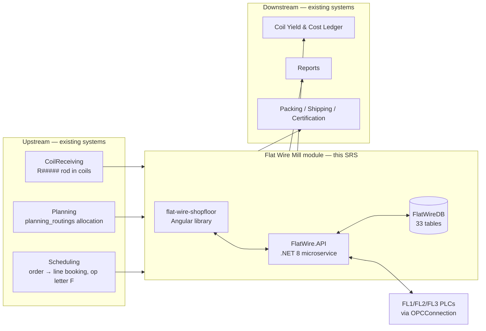

# Flat Wire Mill — Business Requirements

**Project:** United Aluminum (UAL) — Flat Wire Mill Module
**Last Updated:** August 25, 2026 — **new §5.29 — `FR-533`–`FR-540`, FL2 pre-check-in**; `FR-031` superseded in place; six orphan `FR-` citations dispositioned; `Q87` anchored on `FR-336`; the rule-code owner repointed off a deleted file; object count 34 → 33 *(previously August 19, 2026 — **new §5.27: `FR-529`–`FR-532`, inbound ingestion** (`FW-223`, `[INT §7.9]`). Nothing populated the local rod record in production, and the flat wire event tables carry enforced FKs to it — **`OI-42` closes**. New **`OI-117`** (supplier heat has no source, and the certificate chain traces through it). *(Same day — **new §5.26: `FR-519`–`FR-528`, the FL1/FL3 check-in write-back to the shared schema** (`FW-220`/`FW-221`/`FW-222`, `[INT §8.0]`). `FR-077` had named four shared writes that nothing implemented. **`OI-112` closes** (the station is released at run end) and **`OI-111` largely closes** — the rod's shared record is stamped with its flattening station, status untouched. The check-in database half becomes **one transaction** (`FR-526`), which narrows `G2`/`OI-39`. New **`OI-115`** (FL2 spool check-in write set undefined — blocks), **`OI-116`** (rolling-processing table) and **`Q37`**–**`Q40`**. *(Earlier — **new §5.25: `FR-509`–`FR-518`, the FL2/FL3 run-end write-back to the shared schema** (`FW-219`, `[INT §8.1]`, procedure `Database/Scripts/50_united_db_Proc_FlatWire_CompleteCoilOnSkid.sql`). All ten are `[PROPOSED]` and client-directed — there is no `.docx` source requirement — and **none weakens `D-32`**: every write lands in a column that already exists. New **`OI-112`** (nothing releases `wip_stations.coilno` at run end), **`OI-113`** (shared genealogy holds one parent, not all source rods) and **`OI-114`** (the cut-record sentinels). **`OI-104` closes** — the skid table is `wip_skids` + `wip_skid_coils`, which makes `FR-339` testable for the first time. *(Earlier same day — **`D-32`: there is no shared-schema migration.** `FR-077`'s `coils.coil_status = INFLAT` write is **struck** and replaced by `Rod.Status = 'INFLAT'`, `FlatWireDB`-local; `FR-044`'s availability test loses its shared-side `INFLAT` term and reads local state; `FR-048` leaves `coils.coil_status` unchanged; `OI-01`'s headline is **moot** and only its reqsum / `wip_coil_orders` reversal residual survives; new **`OI-111`** — nothing now marks a rod as being on a flattening line in the shared schema. Revision history in [`CHANGELOG.md`](../../../CHANGELOG.md).)*)*
**Document Type:** Functional and non-functional requirements — the `FR-###` register
**Status:** Baselined for build — open requirements issues in §11
**Owner:** BA / Analysis stream
**Audience:** Developers (Angular, .NET, SQL), QA, BA, architects
**Shortcode:** `[REQ]`
**Part of:** `ProjectPlan/Business/` — index: [README.md](../README.md)

---

## 1. Introduction

### 1.1 Purpose

This document specifies what the **Flat Wire Mill module** must do. It is the reference a developer builds from and a tester writes cases against. It carries **279 numbered functional requirements (`FR-001` … `FR-428`)**, every one traceable to a source requirement ID in the delivered SRS, an analysis note, or an approved mockup. **263 of the 279 are in MVP-1 scope** and 4 are withdrawn; the rest belong to screens deferred to MVP-2.

> **Do not hand-edit these figures.** They are generated — run [`Tools/build_coverage_matrix.py`](../Tools/build_coverage_matrix.py), which counts the rows in this document and cross-checks them against `[TCS §5]`. The **363** and **366** previously quoted here and in `00-README.md` both predate the 11 Aug 2026 MVP-2 split, which withdrew §5.10, §5.18, §5.19, §5.23 and §5.24; neither was reproducible from the document. Corrected 13 Aug 2026.

Requirement numbers are **carried forward unchanged** from [`../FlatWire_MasterSpecification.md`](../../../LatestDocument/FlatWire_MasterSpecification.md) §4. Nothing has been renumbered, merged or dropped.

### 1.2 Scope

The shopfloor and dashboard layer for three new Flattening Lines (FL1, FL2, FL3) inside the existing UAL Manufacturing Execution System. In-scope and out-of-scope areas, with the interface consumed from each upstream system, are in `[VS §6]` and `[VS §7]`.

### 1.3 Definitions, acronyms and abbreviations

Full glossary in §3.6. The terms that most often cause misreadings:

| Term | Meaning |
|---|---|
| **Alpha** | The unique identifier assigned to a unit of material or an event — the handle every certificate, quality record and disposition ties back to |
| **Bundle width** | The **oscillation width** of the wound coil. **Distinct from the flat wire's own width** |
| **Pass schedule** | The configuration record that decides how the machine is set. Acknowledging it at check-in is what pushes PLC tags |
| **Flat wire** | The product. **Never called "strip"** — see §1.6 |

### 1.4 References

| Reference | Role |
|---|---|
| [`../FlatWire_MasterSpecification.md`](../../../LatestDocument/FlatWire_MasterSpecification.md) | The reconciled source this SRS re-cuts. Authoritative where two older artifacts disagree |
| [`../Database/Schema/SQL/`](../Database/Schema/SQL/) | Authoritative for column-level types, nullability and constraints |
| [`../../MVP-1/ProjectPlan/Frontend/Mockups/`](../Frontend/Mockups/) | Authoritative for pixel-level layout and screen behaviour |
| [`../../MVP-1/ProjectPlan/Development/REVIEW.md`](../Development/REVIEW.md) | Catalogue of known contradictions between older documents |
| [`../../Analysis/FlatWireOpenQuestions.md`](../../../Analysis/FlatWireOpenQuestions.md) | The open-questions register (`OQ-##`) |

### 1.5 Document conventions and ID schemes

| Scheme | Meaning | Owner |
|---|---|---|
| `FR-###` | A functional requirement in this document | This SRS (§5) |
| `[NFR]` | Marks a non-functional constraint stated **inline** in the functional group it constrains | §6 register |
| `OL`, `PCI`, `CHK`, `WLD`, `TRV`, `ORD`, `PSM`, `GWT`, `SPC`, `ALT`, `STP`, `WBK`, `PR`, `FRT`, `DAT`, `WRJ`, `PKG`, `RCO`, `PRC`, `LST`, `ARM`, `PSL`, `SHS`, `RAJ`, `DCH`, `DMG`, `HMI`, `SCD`, `OEE`, `PRN`, `DM`, `INT`, `NFR` | Source requirement IDs from the delivered SRS | ⚠ **`Shopfloor_Flat_wireSRS_Consolidated_v3.docx`, which is NOT in the working tree** — removed 1 Aug 2026, recoverable at commit `6096921`. The surviving `MVP-1/SRS/Shopfloor_Flat_wireSRS.docx` is **not** a substitute: it carries no pre-check-in content, so it cannot own `PCI` or `PRC`. **Where a family has been restated in-repo, the in-repo statement wins** — `PCI009`–`PCI022` in [Screens/RodPreCheckin.md](Screens/RodPreCheckin.md), `ORD003`–`ORD017` in §5.28 here, `SQ-1`–`SQ-14` in [Screens/SpoolQueue.md](Screens/SpoolQueue.md) |
| `SQ-##` | Spool Queue (DB5A) screen rule | [Screens/SpoolQueue.md](Screens/SpoolQueue.md) — `SQ-1`–`SQ-14`, contiguous. **The only rule-code family with a fully in-repo home** |
| `OQ-##` | Open question | `Analysis/FlatWireOpenQuestions.md` |
| `OI-##` | Open issue blocking a build | Master spec §11, carried to §11 here |
| `G#` | Gap register entry | `Development/GapsRegister.md` |
| `FW-###` | Backlog story | `[TB §7]` |
| `TC-###` | Test case | `[TCS §5]` |
| `DB1`…`DB12`, `DB2A`, `DB7b`, `DB9A`, `DC`, `DM`, `OEE` | Screen identifiers | §7.1 |

**Priority scheme.** `Must` · `Should` · `Could`.

> **How priority was assigned — read this before treating a priority as authoritative.** The master specification states an explicit priority for exactly two groups: **§5.1 Pre-Check-In is `Should`** (the line remains operable through standard check-in if the station is unavailable) and **§5.5 Part A/B spool alerts are advisory and non-blocking**. For every other group the priority here is **derived** from the priority of the backlog story that delivers it (`Critical`/`High` → `Must`, `Medium` → `Should`, `Low` → `Could`) and is marked *(derived)* in the group heading. Where a single requirement inside a `Must` group is itself optional, it is marked at the row.

### 1.6 Terminology rules — binding

- The product is **flat wire**. The word "strip" is not used anywhere in this system — not on screens, labels, reports, column headings or code comments. *(One DDL comment on `Stand.MinWidthIn` uses it; that is a source slip, corrected in `[DBD §6]`.)*
- The traveler is **fully digital**. Coil, spool and skid **labels still print**.
- Welding is **induction only**.
- Rod alphas are `R#####`, **not** `ROD-#####`. Spool alphas are `SP-#####`.

---

---

## 2. Overall description

### 2.1 Product perspective

The module is a new capability inside the existing UAL MES. It does not replace planning, scheduling, receiving, yield, cost or reporting; it produces the shopfloor transactions those systems consume and consumes the material and job records they produce.

### 2.2 Product functions

| # | Function | Requirements |
|---|---|---|
| F1 | Stage the next rod at an idle payoff bay while the current rod runs | §5.1 |
| F2 | Check a rod or spool in, acknowledge a pass schedule, and configure the line | §5.2, §5.3 |
| F3 | Monitor the run live — gauge, width, speed, footage, payoff weight, component state | §5.4 |
| F4 | Alert on spool progress and confirm a machine stop was for spool removal | §5.5 |
| F5 | Record the in-run events — weld, SPC, roll adjust, die change, pause, wire break | §5.6 – §5.13 |
| F6 | Handle exceptions — WIP rejection and the three rod-checkout modes | §5.14, §5.15 |
| F7 | Complete, label, trace and pack the output coil | §5.16, §5.17 |
| F8 | Author, generate, activate and audit pass schedules | §5.18, §5.19 |
| F9 | Present floor-wide, shift and OEE views | §5.20, §5.23, §5.24 |

### 2.3 User classes and characteristics

Six roles — Operator, Supervisor, Operations Manager, Engineering/Maintenance, QA, Admin. Characteristics and needs in `[VS §5]`; the full permission matrix in §8.

### 2.4 Operating environment

| Dimension | Value |
|---|---|
| Client | Touch panel at the machine, **1280 × 1024**, gloved operation, no physical keyboard; Angular PWA in a modern Chromium browser |
| Also used on | Supervisor desktop (Line Status, Shift Summary, pending dispositions), Maintenance desktop (Die Management), Operations desktop (Pass Schedule) |
| Server | IIS; `FlatWire.API` on .NET 8 with the **WebSockets feature enabled** |
| Database | SQL Server — new standalone `FlatWireDB`, plus cross-database reads/writes to the shared schema |
| Equipment | New FL1/FL2/FL3 PLCs; **unchanged** OPC servers, reached through the existing `OPCConnection` service |
| Network | Shopfloor wireless with known drop-outs — see `FR-119` and `[NFR006]` |

### 2.5 Design and implementation constraints

Stay within the existing UAL stack: Angular 18.2+, .NET 8, SQL Server, SignalR, Chart.js, JWT, Serilog. No new frameworks, no separate mobile app, no message broker in Phase 1. Full constraint table and rationale in `[ARC §12]`.

Two constraints that change the shape of the code rather than the choice of library:

1. **Check-in is not one ACID transaction.** It spans `FlatWireDB`, the shared schema and the PLC. Order of writes is mandatory — records first, PLC second — and recovery is by **compensating writes**. `[ARC §10]`.
2. **PLC tag paths are configuration**, never hardcoded, so they can be corrected after commissioning without redeployment (`FR-022`).

### 2.6 Assumptions and dependencies

| Assumption / dependency | Consequence if false |
|---|---|
| A rod exists in `coils` with a `planning_routings` allocation before it reaches the line | Staging and check-in refuse it; the line has no material |
| An `Active` pass schedule exists for the alloy + line + target combination | Check-in has no schedule to acknowledge; the no-match path is **undefined** (OI-46) |
| ~~The six roles exist as JWT claims in `Login`~~ ✅ **Confirmed 15 Aug 2026, on `ClaimTypes.Role`** — no longer an assumption | ~~Authorisation blocks the build (OI-37)~~ — **did not materialise.** ⚠ Residual: the claim **values** are coded, not labelled, and the mapping is unsupplied — the matrix cannot be *verified* until it lands |
| PLC tag paths are confirmed at commissioning | Simulated push covers development; go-live is gated |

---

---

## 5. Functional requirements

Requirements are numbered `FR-###` and grouped by operator workflow. Each group names its screen, the source requirement IDs it satisfies, the actors, the preconditions, the priority, the field-level validation, the actions, the state changes, the error paths and the real-time events emitted.

**Role vocabulary:** Operator · Supervisor · Operations Manager · Engineering/Maintenance · QA · Admin. Full permission matrix in §8.

**`[NFR]` rows** are non-functional constraints stated **inline in the group they constrain**, so a developer reading check-in sees the audit and latency obligations that apply to check-in. Every one also appears in the §6 register with its measurable target and verification method.

### 5.0 Cross-cutting requirements

**Priority:** `Must` *(derived — these gate every workflow)*

| ID | Requirement | Priority | Source |
|---|---|---|---|
| **FR-001** | The system shall support manual login and logout at a flat-wire station, permitted only for operators who are punched in, capturing operator ID, timestamp and station. | Must | `OL001` |
| **FR-002** | The system shall support automatic shift-based login and logout driven by configured shift schedules, and shall log every auto event. | Must | `OL002` |
| **FR-003** | The system shall require a validated **supervisor override** before an operator who is not punched in may log in manually, recording operator ID, supervisor ID, timestamp and station. | Must | `OL003` |
| **FR-004** | The system shall prompt "Who is running the machine?" at check-in, at each stop and restart, and whenever machine speed becomes greater than zero, and shall prevent operation continuing until an operator is identified against the run. | Must | `OL004` |
| **FR-005** | The system shall make an operator logged in at FL1 selectable at FL2 and vice versa without re-login, tracking operator-to-line association **per run** rather than per login. | Must | `OL005` |
| **FR-006** | The system shall display an order-instructions popup after check-in showing instructions, hold information and observations, consistent with the slitter shopfloor popup. | Must | `ORD001` |
| **FR-007** | The system shall provide the order type **"Flat"** alongside Split, Slit, Anneal and Roll. | Must | `ORD002` |
| **FR-008** | The system shall implement **ITInhibit** as a system-controlled PLC tag that blocks machine run, set and cleared **only** automatically — never by an operator. | Must | `ALT001` |
| **FR-009** | The system shall set ITInhibit when: no coil/rod is checked in; **or** no active MMS ID exists; **or** PLC feet data is unavailable or invalid; **or** two or more consecutive data recordings are missing. | Must | `ALT002`–`ALT005` |
| **FR-010** | While ITInhibit is set the system shall block machine run and related transactions, and shall record no rolling data without an active coil. | Must | `ALT006` |
| **FR-011** | The system shall display progressive material-buildup alerts as remaining output length approaches the planned length: a first alert at **50 %** remaining and then every **10 %** (40, 30, 20, 10 %). | Must | `ALT007` |
| **FR-012** | The system shall alert the operator when remaining feed (feet) for the current coil reaches configurable threshold values. | Must | `ALT008` |
| **FR-013** | The system shall generate a unique **MMS ID per input coil at check-in**, activate it when a welded coil becomes active, automatically close the previous one, and close MMS IDs **strictly on material consumption** (remaining ft = 0) — **never on operator action**. An output spool may reference multiple MMS IDs. | Must | `FRT005`–`FRT009` |
| **FR-014** | The system shall track remaining material length in real time for the active input coil **and** the next welded (queued) coil, sourcing feet consumption from the PLC where available. | Must | `FRT001`, `FRT002`, `FRT004` |
| **FR-015** | The system shall calculate output weight during rolling from **recorded length, gauge and width** — never from a weigh scale — and shall calculate net weight as `Gross − Tare` with tail loss accounted for. | Must | `FRT010`, `FRT011` |
| **FR-016** | The system shall provide **two independent data-collection application instances** (one per line), use both simultaneously in FL3 hybrid mode, and support FL1 and FL2 running independent jobs concurrently. | Must | `DAT001`, `TRV008` |
| **FR-017** | The system shall start data recording automatically when mill speed exceeds zero, with no manual start action. | Must | `DAT002`, `INT006` |
| **FR-018** | The system shall make the data-recording frequency **configurable by Engineering/IT without a code change**, defaulting to **4 ft per data point for finished product and 20 ft for intermediate product**. Applied rule: a subsequent rolling operation exists → 20 ft; none → 4 ft; **FL2 always 4 ft**; **FL3 hybrid — both FL1 and FL2 at 4 ft**. | Must | `DAT003`–`DAT005`, **`NFR003`**, **`NFR004`** |
| **[NFR]** | **`NFR003` / `NFR004` — recording cadence.** The 4 ft / 20 ft rule above is the measurable non-functional target and is **configuration, not a constant**. Verification: `[TS]` cadence suite. | Must | `NFR003`, `NFR004` |
| **FR-019** | The system shall capture gauge and width **simultaneously at every recording point**, so both traces derive from the same samples. | Must | `DAT006`, `DAT007`, `GWT004` |
| **FR-020** | When two or more consecutive data-recording entries are missing, the system shall display a prominent data-recording alert **and activate ITInhibit**. | Must | `DAT009` |
| **FR-021** | The system shall open the "Reason for Flatwire Stop" popup when the OPC mill-speed tag reads zero. | Must | `INT006`, `STP001` |
| **FR-022** | The system shall source **all OPC tag paths from configuration** (`appsettings.json`), never hardcoded, so paths can be corrected after commissioning without redeployment. | Must | `INT005` |

---

### 5.1 Pre-Check-In Station — Dashboard 2A

**Screen:** [`dashboard_2a_rod_precheckin.html`](../Frontend/Mockups/dashboard_2a_rod_precheckin.html)
**Source IDs:** `PCI001`–`PCI008`, `WLD003`/`WLD005`/`WLD006`/`WLD010`, `TRV004`/`TRV009`, `PRC007`/`PRC008`/`PRC011`/`PRC014`
**Actors:** FL1 / FL3 operator (primary); Supervisor (override authorisation)
**Preconditions:** the line is FL1 or FL3; the rod exists in `coils`; planning has allocated the rod to an order in `planning_routings`
**Priority:** **`Should`** — *stated explicitly in the source.* The line remains operable through standard check-in if this station is unavailable.

| ID | Requirement | Priority | Source |
|---|---|---|---|
| **FR-030** | The system shall provide a dedicated Pre-Check-In station for FL1 and shall support pre-check-in of the next rod **while the current coil is still running**. | Should | `PCI001`, `PCI003` |
| ~~**FR-031**~~ | ~~The system shall **not** support pre-check-in on FL2 — a `lineId` of `FL2` is rejected. FL2 is check-in only.~~ ⚠ **SUPERSEDED by `FR-533` (§5.29), client decision 20 Aug 2026** — FL2 **does** get pre-check-in. `PCI002`'s physical premise (one traversing payoff, no floor space) was never contradicted and is retained there; what was reversed is the inference drawn from it. **Superseded in place, never renumbered.** | ~~Should~~ | `PCI002`; superseded |
| **FR-032** | The system shall present **both payoff bays as peers**, each capable of all four states, with one state machine and one renderer. Payoff 1 is empty at cold start, after a checkout, once its rod is consumed and between orders; Payoff 2 becomes the running bay after every payoff transition. | Should | Analysis |
| **FR-033** | Bay states shall be: `NOT STAGED` (empty; action: pre-check-in rod) · `PRE-CHECKED-IN` (staged, inspection passed, not checked in; actions: pre-check-out, proceed to check-in, mark as welded) · `ACTIVE` (checked in, rod `INFLAT`, run open; actions: open active run, check out rod) · `BLOCKED` (inspection failed at staging; **only** action: go to WIP Rejection). | Should | Analysis |
| **FR-034** | The payoff weight bar shall be coloured by **absolute pounds**, not percent bands, so the visual cue does not lag the alert: warning below **3,000 lb** ("prepare weld"), critical when **Payoff 2 is not staged and Payoff 1 is below 2,000 lb**. Bar *length* still shows percent remaining. | Should | Analysis |
| **FR-035** | The Traveler Queue shall list pre-checked-in, welded and available rod **for the current order**, each row carrying serial number, payoff position, diameter, gross weight and current status, plus `footageRunToDate` so a partial rod is visible **before** it is staged. | Should | `TRV004`, `TRV009` |
| **FR-036** | The queue shall carry **two sequence columns** — `Plan` (planning's intended order, with a green marker on the rod expected next) and `Run` (the actual staging order, blank until processed, with a deviation marker where the two differ). Alloy and Temper are **not** repeated per row; they are stated once in the order context header. | Should | Analysis |
| **FR-037** | The queue header shall state the order once: line, order number, the order's material spec, and progress (`n staged · n available · n on order`). `staged` counts every rod physically occupying a bay — pre-checked-in, welded and blocked alike. | Should | Analysis |
| **FR-038** | On a **cold line** (`activeOrderId` null) the queue shall be empty and the order header shall read `—`; the station must not display an order it has not started. The first rod scanned **reveals** the order from `planning_routings`. | Should | Analysis |
| **FR-039** | The pre-check-in wizard shall have three steps: (1) Identify rod — alpha (scan or type), measured diameter, optional scrap box, with alloy/temper/weights pre-populating; (2) Assign bay — Payoff 1 / Payoff 2 selector cards, an occupied bay disabled and labelled with its occupant; (3) Visual inspection — oxidation, surface defects, water stains, Pass/Fail each, plus an observation field. | Should | `PCI004`–`PCI006` |
| **FR-040** | The inspection shall carry **exactly three items**. The connector-tag item is a check-in concern and must not be added here. | Should | Analysis, G14 |
| **FR-041** | Any inspection `Fail` shall be a **hard block with no bypass**; the only forward action is WIP Rejection. | Must | `CHK010` |
| **FR-042** | The rod alpha shall be validated against the `R#####` series in `coils`, the measured diameter against a **min/max lookup band** (`nominal − RodDiameterToleranceMinusIn .. nominal + RodDiameterTolerancePlusIn`), and a rod already checked in elsewhere shall be rejected. *(Changed 30 Jul 2026 — tolerances are min/max, not a single ±, and there are four of them: gauge, width, diameter, ovality. **The values are owed by e-mail**, so the band is unseeded and this check cannot fire yet — OQ-22.)* | Must | `CHK006`, `CHK007`, `CHK009` |
| **FR-043** | Where `footageRunToDate > 0`, the wizard shall show footage already run, remaining weight estimate, last run reference and prior spool alphas, and shall offer **only** *Proceed as partial re-check-in* plus an explicit physical-identity confirmation. **The fresh-start control shall not exist in the DOM.** | Must | `PRC007`, `PRC008`, `PRC011`, `PRC014` |
| **FR-044** | Staging shall **refuse** a rod with no `planning_routings` allocation, a rod that is not available (`coils.coil_status` in `COMPLETE`/`HOLD`/`SCRAP`, **or `Rod.Status = 'INFLAT'`** — ⚠ **changed by `D-32`, 18 Aug 2026:** `INFLAT` is no longer a shared status value, so the *"already on a flattening line"* limb is served from `FlatWireDB`-local state, or already staged elsewhere), and a rod belonging to a **different order** once an order is established. ⚠ **The last clause is knowingly wrong (30 Jul 2026, OQ-70 / G22):** a single rod may carry **more than one order**, so a same-rod successor order must pass. Not corrected here because the replacement depends on the sequencing answer (**OQ-73**) and on whether the case is MVP2. (welding across orders would break coil genealogy). | Must | Analysis |
| **FR-045** | Staging shall **notify and require supervisor authorisation — never refuse** — for **one** deviation: **out of sequence** (the rod is not the one planning expects next, defined as the lowest planned sequence still available). ~~and **off-schedule** (the resolved order is booked on a different line)~~ **Superseded 30 Jul 2026:** a rod whose order is booked on the other rod line is **not a deviation** — the system **selects the correct station automatically**, with no message and no override, at both pre-check-in and check-in (OQ-24). A server-side `409 WRONG_STATION` carrying `correctLineId` remains as a backstop for a stale client. | Must | OQ-24 |
| **FR-046** | The authorisation shall use the standard credential block — deviation reason + supervisor badge/ID + **PIN**. *(It covered two deviations until 30 Jul 2026; the off-schedule one no longer exists.)* **The PIN shall never be stored or carried in the payload.** A remote-approval fallback shall be offered when no supervisor is on the floor. | Must | OQ-24 |
| **FR-047** | The override flag, the authorising supervisor, the timestamp and the reason shall be persisted on the staging record, and the bay card shall keep showing the authorisation for as long as the rod is there. *(`RodStaging.OffScheduleOverride` and `ScheduledLineId` were **dropped** 1 Aug 2026 with the off-schedule case; `OverrideBy`/`OverrideAt`/`OverrideReason` are retained and shared.)* | Must | OQ-24 |
| **FR-048** | On confirm the system shall write a `RodStaging` row with `Status='Staged'`, assign `RodSeqno` **server-side** (never client-supplied), snapshot `PlannedSeqno` from the allocation, **leave `coils.coil_status` unchanged** — `INFLAT` is set at check-in, not at staging (OQ-68, 30 Jul 2026), and since **`D-32`** it is set on **`Rod.Status`** rather than on the shared column at all — update the WIP queue entry as a **compensating write** *(whether that insert stays at staging is the open half of OQ-68)*, and broadcast `PayoffStateChanged`. | Must | OI-72, Analysis |
| **FR-049** | **No PLC write shall occur at pre-check-in.** Component flags, die sizes, roll gaps and gauge/width targets are pushed only on pass-schedule acknowledgement at check-in. | Must | Analysis |
| **FR-050** | **Mark as Welded** shall be presented **on the staged bay card** and shall be enabled only when a rod is pre-checked-in on that bay **and** a rod is running on the other bay; it shall validate alloy, temper and diameter against the running coil and record operator + timestamp. When disabled it shall state the reason. *(Relocated from the station-level weld-readiness strip, 1 Aug 2026.)* | Should | `WLD003`, `WLD006`, `WLD010` |
| **FR-050a** | The outgoing and incoming rods shall be resolved from **which bay is actually running**, not from the card the operator activated — after a payoff transition the running bay may be either one. | Must | `WLD010`; TC-068 |
| **FR-051** | Mark as Welded shall record the weld only — it shall **not** switch bays. The payoff transition is driven **solely by material consumption reaching 0 ft remaining**. | Must | `WLD005` |
| **FR-051a** | **Welds this run** shall be presented **on the active bay card**, carrying the weld count, and shall remain available at a count of zero. Where no run exists there is no active bay, so **the control shall be absent** rather than disabled. *(Relocated from the weld-readiness strip, 1 Aug 2026; supersedes the disabled-at-cold-start behaviour. Client confirmation pending — OI-108.)* | Should | `PCI021` |
| **FR-051b** | The pre-check-in station shall **not** offer a link to the active run monitor from the active bay card; that screen is reached from the application bar and the line status board. *(1 Aug 2026.)* | Should | Mockup DB2A |
| **FR-052** | **Pre-check-out** shall release a staged rod that was never checked in: reason (Wrong rod / mis-scan · Order cancelled or deferred · Failed re-inspection · Relocated to different line · **Wrong rod welded** · Other with free text) and disposition (Return to floor storage · Return to warehouse · **Hold return to storage**, welded only), plus optional notes. | Should | Analysis *(no source ID exists — OI-44)* |
| **FR-052a** | Pre-check-out approval shall depend on the weld: an **unwelded** rod is **operator-only** with a reason captured; a **welded** rod shall require a **supervisor override** — badge/ID + PIN + a **documented reason** — and the rod shall be set to **`HOLD`**. Removing a welded rod means cutting or splitting the material, so it is a **rejection, not a return**. *(Decided 30 Jul 2026 — OQ-69, which also closes OQ-72. Restores, behind that gate, the control removed on 31 Jul 2026.)* | Must | OQ-69, OQ-72 |
| **FR-053** | Pre-check-out shall set `RodStaging.Status='Unstaged'` with the release stamp and `UnstageKind='PreCheckOut'`, write a `RodCheckout` row with `Mode='ModeP'`, `RunId` NULL, footage 0, `PlcTagsCleared` false and `WasWelded` per the staged row — plus `ApprovedBy`/`ApprovedAt`/`OverrideReason` and `NewRodStatus='HOLD'` when welded — **reverse** the WIP queue entry created at staging, and broadcast `PayoffStateChanged{state:"NotStaged"}`. It requires **no line-state gate**. *(There is nothing to revert for `INFLAT`: staging no longer sets it — OQ-68.)* | Should | Analysis |
| **FR-053a** | A **failed staging inspection** shall be released by its **WIP rejection**, not by a pre-check-out: the operator captures the rejection reason on the rejection screen, the rod is set to **`HOLD`**, and the staging row is set to `Status='Unstaged'` with `UnstageKind='WipRejection'` and `WipRejectionId`, broadcasting `PayoffStateChanged`. **This is the only thing that clears a `BLOCKED` bay.** *(Decided 30 Jul 2026 — OQ-23 item 3.)* | Must | OQ-23 |
| **FR-054** | Un-staging the last rod on an idle line shall **clear the established order** and return the station to cold start. | Should | Analysis |

**Error paths:** bay already occupied → `409` (from the filtered unique index, not a read-then-write race) · rod already staged on another bay → `409` · rod already checked in → `409` · `lineId = FL2` → `422` · any inspection Fail → `422` with `{route:"wipRejection"}` · prior footage without carry-forward acknowledgement → `422` · diameter outside tolerance → `422` · rod alpha not found → `404`.

**Real-time:** emits `PayoffStateChanged` (unbatched, immediate). Consumes `PayoffWeight` for live bay weight.

**Resolved since:** `Blocked` is reachable — staging **commits the row before the inspection gate** (31 Jul 2026) and the **WIP rejection releases it** (30 Jul 2026, FR-053a), so a blocked bay is now both enterable and clearable (**OI-70**). Pre-check-out approval **depends on the weld** (**OI-44**, FR-052a). A rod **may carry more than one order** (**OI-71**), which makes FR-044's different-order refusal wrong for a same-rod successor — **G22**, pending the sequencing answer (**OQ-73**) and the MVP2 decision.

**Still open:** whether the reqsum / `wip_coil_orders` insert stays at staging now that `INFLAT` has moved to check-in (**OI-01**); whether an order scheduled on **neither** rod line may be run at all (**OQ-25** — the auto-switch has no station to switch to).

---

### 5.2 Rod Check-In — Dashboard 2 (FL1 / FL3)

**Screen (approved):** [`dashboard_2_rod_checkin.html`](../Frontend/Mockups/dashboard_2_rod_checkin.html) — a guided 6-step tab wizard.
**FL3 variant:** [`dashboard_2_rod_checkin_fl3.html`](../Frontend/Mockups/dashboard_2_rod_checkin_fl3.html) *(still on the older single-page layout; a wizard-shaped FL3 variant is outstanding — **OI-16**)*.
**Source IDs:** `CHK001`–`CHK019`, `PSM015`–`PSM019`, `SPC003`, `INT001`–`INT004`
**Actors:** FL1 / FL3 operator; Supervisor (deviation override)
**Preconditions:** rod `STAGED` (or scanned directly); an `Active` pass schedule exists for the attribute combination; the job is scheduled; the real-time backbone is up
**Priority:** **`Must`** *(derived — FW-061 is Critical)*

| ID | Requirement | Priority | Source |
|---|---|---|---|
| **FR-060** | On clicking Check-In at FL1 the system shall display a popup asking *"Are you running FL1 only or with FL2?"* with buttons **"FL1 Only"** and **"FL1 and FL2 Together"**. | Must | `CHK001` |
| **FR-061** | The station name shall be set to **"FL1 Station"** for FL1 Only and **"FL3 Station" (Hybrid FL1 + FL2)** for FL1 and FL2 Together. | Must | `CHK002` |
| **FR-062** | Clicking Check-In at FL2 shall open the check-in popup directly with no FL1/FL2 selection. | Must | `CHK003` |
| **FR-063** | Rod/Flat Wire Number and Rod Diameter/Flat Wire Width shall be **mandatory**. Scrap Box shall be optional. | Must | `CHK004`, `CHK005` |
| **FR-064** | The rod number shall be validated against `coils`; invalid or non-existent rod numbers are rejected. | Must | `CHK006` |
| **FR-065** | The measured rod diameter shall be validated against `coil_gauge` within a **min/max band** from the lookup table, blocking check-in outside the range (e.g. 0.30 with −0.01/+0.01 gives 0.29–0.31; the band may be **asymmetric**). *(Changed 30 Jul 2026 — the client confirmed upper and lower limits for gauge, width and diameter plus ovality, applied at **both** pre-check-in and check-in. `AlloyProperty` now carries the columns, but **the values are owed by e-mail and nothing is seeded**, so this check cannot fire yet — OQ-22 / OI-07.)* | Must | `CHK007` |
| **FR-066** | The Scrap Box list shall be populated by alloy (same logic as the slitter shopfloor), auto-selecting the previously used scrap box when the last checked-in rod had the same alloy, and shall remain non-mandatory, changeable or blank. | Should | `CHK008` |
| **FR-067** | On **Done**, the system shall validate that the order is Open, the plan is open, all mandatory fields are complete, diameter tolerance is satisfied, and the rod is available — and shall not proceed if any fails. | Must | `CHK009` |
| **FR-068** | Visual-inspection failure shall be a **hard block** routing the operator to WIP Rejection before check-in can proceed, with **no bypass**. | Must | `CHK010` |
| **FR-069** | A **Pre-Run SPC diameter measurement** shall be entered and in spec before "Acknowledge & Begin Check-in" is enabled. The approved wizard captures **two measurements at 90°** (M1, M2) and derives **ovality = \|M1 − M2\|**, which must be within tolerance. | Must | `CHK011`; wizard step 3 |
| **FR-070** | The system shall retrieve the applicable pass schedule at check-in via **attribute lookup** (alloy + rod diameter + target gauge × width + route mode), surface the recommendation in a **confirm bar**, and present the component table clearly indicating which components are Active and which Bypassed. | Must | `CHK014`, `PSM015`–`PSM017` |
| **FR-071** | The operator shall **explicitly confirm** pass-schedule identity in a mandatory confirmation before any PLC tags are pushed, and shall supply a **free-text reason** when selecting a schedule other than the recommended one; that selection is flagged for Operations review. | Must | `CHK015`, `PSM015`, `PSM018` |
| **FR-072** | The system shall write the audit records — visual inspection result, Pre-Run SPC checkpoint, pass-schedule **ID + version + effective date** on the run record, and the acknowledgement event — **before** the PLC push, retaining an incomplete-push recovery marker if the write fails. | Must | `CHK016` |
| **FR-073** | On acknowledgement the system shall push component activation flags, die sizes, roll gaps, speed limits and gauge/width targets to the controller for the selected payoff position, **as one batch**, and log the push timestamp, schedule ID and triggering operator. *(“Speed **limits**” versus “speed **targets**” is unresolved and deliberately left as-is — `PLC-Q06`.)* | Must | `CHK017`, `INT001`, `INT002` |
| **FR-074** | If any individual tag write fails, an exception shall be raised, **compensating writes shall re-clear the tags already written** and revert the shared-schema changes, and the check-in shall be aborted. The write set spans `FlatWireDB`, the shared `coils` schema and the PLC, **so this is a compensating re-clear and not an ACID rollback** — machine writes are not transactional. See `[ARC §10]` and `[PLC §7.5]`. *(Reworded 4 Aug 2026; the earlier text said “the batch shall be rolled back” **and** “not an ACID rollback” in the same requirement. Closes gap **G16**.)* | Must | `INT002`; G2 |
| **FR-075** | The system shall record the outcome of every tag push in `RodCheckin.PlcTagsPushed` / `SpoolCheckin.PlcTagsPushed`, and audit-log each write (tag path, value, operator, timestamp, result). | Must | `INT004` |
| **[NFR]** | **`NFR010` / `NFR011` — audit.** Every PLC tag write and clear, every supervisor action and every pass-schedule change performed in this flow is logged with **who, when and why** — operator/supervisor ID, timestamp, station/line, old→new value, and a reason code or free text — and retained for quality audit. Verification: `[TS]` audit suite. | Must | `NFR010`, `NFR011` |
| **FR-076** | SPC prompts shall be initiated automatically after the traveler loads at check-in. | Must | `CHK018`, `SPC003` |
| **FR-077** | On successful check-in the system shall update the `coilno` field in WIP stations, perform reqsum and insert `wip_coil_orders` if the rod is not yet reqsummed, and update `actual_start_date` in `planning_routings` and `routings`. It shall set **`Rod.Status = 'INFLAT'`** in `FlatWireDB`. ⚠ **Changed by `D-32` (18 Aug 2026):** ~~set `coils.coil_status = INFLAT`~~ — struck; `FW-002` is cancelled with the shared-schema migration, so the shared vocabulary never gains the value. The three surviving shared writes all land in **existing** columns. **`OI-111`** carries the upstream-visibility consequence. | Must | `CHK019`, `DM002` |
| **FR-078** | Where a `RodStaging` row exists for the rod, check-in shall **consume** it (`Status → CheckedIn`, `CheckedInAt` and `RodCheckinId` set) rather than creating a parallel record, and the request's `payoffPosition` **must match** the staged position (mismatch → `409`). | Must | Analysis |
| **FR-079** | The wizard shall present six steps with **progressive unlock** — Visual Inspection, Pass Schedule, Pre-run SPC, Die Block (DB1/DB2), Rolling Mill (FM1), Lube & Safety — and shall keep the footer **Acknowledge & Begin Check-in** disabled until all six clear or a supervisor override is on file. | Must | Mockup DB2 |
| **FR-079a** | On a successful acknowledgement the operator shall be returned to **DB2A — Rod Pre-Check-in**, not to DB3. Check-in is complete at that point and the next task is staging the following rod on the idle payoff; the run monitor remains reachable from the application bar and the line status board. *(1 Aug 2026 — supersedes "navigate to Dashboard 3". Client confirmation pending — OI-109.)* | Should | Mockup DB2 |
| **FR-080** | Machine-inspection steps 4–6 shall use **OK / NG / N/A** buttons and measured-value fields against a stated spec: DB1 and DB2 (die ring diameter vs spec, die surface condition, lubricant flow, bearing wear), FM1 (roll gap measured vs target, roll width measured vs target, roll surface condition, coolant flow), and Lubrication & Safety (drawing lubricant level, lube temperature vs 68–80 °F target, pump running, filter condition, all guards in place, E-stop verified, area clear, PPE worn) plus optional notes. | Must | Mockup DB2 |
| **FR-081** | Failed machine-inspection checks shall place the rod **on hold** and expose an **Authorize Override** path capturing supervisor badge, password and a required override reason. | Must | Mockup DB2 |
| **FR-082** | The payoff selector shall remain on Dashboard 2 for the direct-check-in fallback but shall render **pre-filled and read-only** when the rod arrived via pre-check-in. *(Reconciles `CHK005` with the approved mockup — confirm with the business, **OI-08**.)* | Must | `CHK005` |
| **FR-083** | For **FL3**, one acknowledgement shall push **all FM1 and FM2 tags in a single batch**; `FlatWireRun.RouteMode` shall be `Hybrid`; **no `SpoolProcessing` row shall be created**. | Must | Analysis |
| **FR-084** | A **Check Out Rod** action shall be available on the Dashboard 2 footer (pre-acknowledgement) and in the Dashboard 3 header (acknowledged, footage 0), and shall be **disabled once footage > 0**. | Must | `RCO017`, `RCO018`, `ARM015` |

**State changes on success:** `FlatWireRun` created with `Status='Running'` and `StartedAt` · `RodCheckin` written · `SpcCheckpoint(PreRun)` + measurements written · `RodStaging → CheckedIn` · **`Rod.Status = 'INFLAT'`** *(`FlatWireDB`-local — the shared `coils` row is not written, `D-32`)* · PLC tags pushed · run timer started.

**Error paths:** line already has an active run → `409` · pass schedule is `Draft` → `422` · PLC push failed → `500` with the check-in aborted · inspection fail → routed to DB8 · **no matching active schedule → undefined, OI-46 (Critical)** — the stub assumes a single active schedule.

**Real-time:** emits `LineStatus{Running}`, `PayoffStateChanged{Active}`, `ComponentStatus` reflecting the pushed values.

---

### 5.3 Spool Check-In — Dashboard 5 (FL2)

**Screen:** [`dashboard_5_spool_checkin.html`](../Frontend/Mockups/dashboard_5_spool_checkin.html)
**Source IDs:** `CHK012`, `CHK013`, `PSM016`–`PSM019`, `GWT005`
**Actors:** FL2 operator
**Preconditions:** an FL1-produced spool exists and is ready for FL2; an `Active` FL2 pass schedule exists
**Priority:** **`Must`** *(derived — FW-064 is High)*

| ID | Requirement | Priority | Source |
|---|---|---|---|
| **FR-090** | At FL2 check-in the operator shall **scan the spool label printed at FL1 output** and shall measure and enter the width of the checked-in material; the system shall validate the scanned spool against the previously checked-in FL1/FL3 data. | Must | `CHK012` |
| **FR-091** | For a hybrid context the system shall validate that the spool's FL1 pass-schedule route mode is `Hybrid` and matches the expected FL2 input before allowing check-in. **Whether an FL2 check-in occurs at all in hybrid mode is contradictory across sources — ⚠️ OI-09.** | Must | `CHK013` |
| **FR-092** | Dashboard 5 shall display **source traceability** from the FL1 run — each contributing rod with its footage range, and the induction weld rows between them with quality result and timestamp — as read-only. | Must | Analysis |
| **FR-093** | Dashboard 5 shall display the **historical FL1 gauge profile** with target line, tolerance band and weld markers, plus min / max / avg / std-dev / sample-count statistics and an "all in spec" or "N out of spec" badge. | Must | `GWT005`, `DAT008` |
| **FR-094** | Dashboard 5 shall show the FL2 pass-schedule component table (**S1 — 8″ roller · S2 — 6″ roller + edger · S3 — 6″ roller + edger, final**) read-only, with the same mandatory confirm bar as Dashboard 2. | Must | `PSM016`–`PSM019` |
| **FR-095** | Dashboard 5 shall have **no visual inspection section** — the spool was inspected at FL1. | Must | Analysis |
| **FR-096** | On acknowledgement the system shall push FM2-specific tags (**S1/S2/S3 roll gaps and stand states, edger activation and edge type at S2 and S3**), set `SpoolProcessing.Status = INFLAT`, create the FL2 `FlatWireRun` linked to the source spool and its source rod alphas, and start the FL2 run. | Must | `INT001`, Analysis |

**Pre-flight validation:** spool alpha valid and ready for FL2 · gauge and width entered (or confirmed from FL1 data) · weight entered · pass schedule loaded · hybrid-origin guard where applicable *(**OI-47**)*.

**Open:** which identifier is scanned — SP-series alpha, spool number or bundle ID — is **OI-50** (Critical).

---

### 5.3a Spool Queue — Dashboard 5A (FL2)

**Screen:** [`dashboard_5a_spool_queue.html`](../Frontend/Mockups/dashboard_5a_spool_queue.html)
**Source IDs:** `CHK012`; **Q17** (operator selects by spool number)
**Actors:** FL2 operator
**Preconditions:** none — the screen is usable on opening
**Priority:** **`Must`** *(derived — FW-124)*

*Added 2 Aug 2026. FL1 has a pre-check-in station listing the rods planned for the running order; FL2 has no equivalent because `PCI002` excludes it from staging, so the FL2 operator had **no view of waiting material at all**. `FR-090` has the operator scan the FL1-printed label; **Q17** records the client stating the operator "selects it by spool number for check-in" — both stand, and only the scan had a screen. This is the selection half. It is also the first thing named "the spool queue", a phrase `FR-326`, `TC-389`, `RodCheckout.md` and phase 7 all use with no table, endpoint, screen or status behind it.*

| ID | Requirement | Priority | Source |
|---|---|---|---|
| **FR-097** | Dashboard 5A shall, **on opening and without requiring a scan**, list every spool **available for processing irrespective of order**, showing per spool the identifier, order, source FL1 run and source rod alphas, gauge × width, net weight, origin route mode and status, with a rollup of spool count, ready count and total weight. **Gauge and width shall be read from the source FL1 run, not from `SpoolProcessing.GaugeIn`/`WidthIn`, which are null until check-in.** | Must | Q17, Analysis |
| **FR-098** | On entry of a spool identifier the system shall **resolve that spool's order server-side and return the order context and every spool on that order in a single response**; the screen shall populate the order bar (order no, customer, alloy, temper, setup gauge/width, due date) and narrow the list together, mark the scanned spool, and offer a **Show all** action to restore the unfiltered list. Resolution shall trigger on the scanner's terminating keypress and on a short debounce after manual entry, with **no submit control**. | Must | `CHK012`, Q17 |
| **FR-099** | Dashboard 5A shall offer a **check-in action leading to Dashboard 5 only for spools that may be run** (`RECEIVED`, `STAGED`); shall list `HOLD` spools marked and without the action pending QA release; shall list `INFLAT`/`COMPLETE`/`SCRAP` without action; shall **mark hybrid-origin spools**; and shall treat an **unallocated spool (`OrderNo` null) as a valid single-spool result, not an error**, still eligible for check-in. An unresolved identifier shall mark the field and **leave the displayed list unchanged**. | Must | Analysis, OI-47 |

**Read-only:** this screen writes nothing. All state change happens at Dashboard 5.

**Error paths:** unknown identifier → `404`, field marked, **list unchanged** · unallocated spool → `200` with a null order and a single row, **not** an error · no spools available → distinct empty state naming FL1 output and the hold queue as next places to look.

**Open:** *which statuses constitute "available for processing"* is undefined — **OI-55/Q17**, and the two competing spool status vocabularies are **OI-06**; the identifier and its format are **OI-50** and **OI-02**; the hybrid-origin consequence is **OI-47**. **Critically, `SpoolProcessing.OrderNo` must be populated from planning for FR-098 to work at all** — if allocation is not readable by the shopfloor system, this screen cannot resolve an order.

**Not shown, deliberately:** spool age (no creation timestamp exists on `SpoolProcessing`) and physical location (`SpoolProcessing.Location` has no writer and no location scheme).

---

### 5.4 Active Run Monitor — Dashboard 3 (FL1 / FL2 / FL3)

**Screens:** [`dashboard_3_active_run.html`](../Frontend/Mockups/dashboard_3_active_run.html) (FL1 — grouped action cluster + spool-completion overlay; **the sole FL1 layout since 1 Aug 2026**, when the earlier left-rail layout that held this filename was withdrawn; this file was named `dashboard_3_active_run_v2.html` until 11 Aug 2026) · [`dashboard_3_active_run_fl2.html`](../Frontend/Mockups/dashboard_3_active_run_fl2.html) · [`dashboard_3_active_run_fl3.html`](../Frontend/Mockups/dashboard_3_active_run_fl3.html)
**Source IDs:** `ARM001`–`ARM024`, `TRV001`–`TRV010`, `GWT001`–`GWT006`
**Actors:** line operator
**Preconditions:** an active run on the line
**Priority:** **`Must`** *(derived — FW-062 is Critical)*

| ID | Requirement | Priority | Source |
|---|---|---|---|
| **FR-100** | The Active Run Monitor shall be **displayed continuously** during an active run, with run context in the header: order, alpha, alloy, target gauge, target width. | Must | `ARM001`, `ARM002` |
| **FR-101** | The system shall display a real-time **gauge trace** and a real-time **width trace**, each against its target and tolerance band. | Must | `ARM003`, `ARM004` |
| **FR-102** | Trace lines shall render **green in spec** and **red out of spec with an alert banner**. | Must | `ARM005`, `ARM006` |
| **FR-103** | After a **configurable number N of consecutive out-of-spec readings** the system shall auto-prompt a WIP checkpoint. | Must | `ARM007` |
| **FR-104** | Each weld position shall render a **vertical marker labelled with the rod alpha**. | Must | `ARM008` |
| **FR-105** | Machine status shall show line speed and footage counter; component status shall show DB1 and DB2 on/off state and active die diameter (and FM1 gap/width). | Must | `ARM009`, `ARM010` |
| **FR-106** | Payoff 1 and Payoff 2 shall show weight indicators with percent-remaining bars, coloured **green above 50 %, amber 25–50 %, red below 25 % with a prepare-weld alert, and red-flashing below 10 % with a weld-now critical alert**. | Must | `ARM011`, `ARM012` |
| **FR-107** | The **FL1 action bar** shall have six buttons — Log Weld Event, Die Change, SPC Checkpoint, Pause Run, WIP Reject, Complete Run — with **no Roll Adjust and no edger controls**. | Must | `ARM013` |
| **FR-108** | The **FL3 action bar** shall have seven buttons — the six above plus **Roll Adjust**. | Must | `ARM014` |
| **FR-109** | The **FL2 action bar** shall omit Weld and Die Change (FL2 has no drawing dies) and shall include Roll Adjust and Complete Coil. | Must | Analysis |
| **FR-110** | **Check Out Rod** shall be enabled only when the footage counter equals zero. | Must | `ARM015` |
| ~~**FR-111**~~ | ~~A **View Trends** action shall navigate to SCADA Trends (DB14) with the active line pre-selected.~~ **[WITHDRAWN — descoped by client, Aug 4 2026]** — SCADA Trends is descoped. | — | ~~`ARM016`~~ |
| ~~**FR-112**~~ | ~~A tab strip shall offer **Traces** (default) and **Machine View**, persisting the last-used tab in browser `localStorage` and restoring it on load.~~ **[WITHDRAWN — descoped by client, Aug 4 2026]** — the Machine View tab is descoped, so there is one tab and nothing to persist. **The chart-section collapse toggle shares this strip and survives**, with its own `localStorage` key; it has no requirement of its own, which is a pre-existing gap now visible. | — | ~~`ARM017`–`ARM019`~~ |
| **FR-113** | The **machine-status grid and the action buttons shall remain visible at all times**, including while the chart section is collapsed. *(Reworded 4 Aug 2026: this previously read “regardless of the active tab” — the tabs went with the Machine View, the rule did not.)* | Must | `ARM020`, `ARM021` |
| ~~**FR-114**~~ | ~~The Machine View tab shall render a compressed line schematic in the trace area, driven by the same real-time stream, with a link to the full schematic.~~ **[WITHDRAWN — descoped by client, Aug 4 2026]** — the tab and the full schematic (DB13) are both descoped. | — | ~~`ARM022`–`ARM024`~~ |
| **FR-115** | The screen shall carry the **Traveler** sections adapted to the active station: Incoming Bundle Information, Queue (pre-checked-in material), Pass/Reduction Schedule, Edger Configuration, Order/Constraint data, Current Run Status. | Must | `TRV001`, `TRV002` |
| **FR-116** | The Order/Constraint section shall display maximum and current spool/package weight, order weight, OD minimum and maximum limits and package width limits, and shall use them for runtime validation. | Must | `TRV006` |
| **FR-117** | The Traveler layout and stop-transaction popups shall vary automatically by output type — FL1-only intermediate spool versus FL2/FL3 finished product. | Must | `TRV007` |
| **FR-118** | The **main-station Traveler** shall display only the welded rods relevant to the current running rod; the **Pre-Check-In station Traveler** shall display both pre-checked-in and welded rods. Welded rods shall be distinguished by **both colour and explicit text**. | Must | `TRV009`, `TRV010` |
| **FR-119** | On a network drop the client shall show a **"Reconnecting…" banner over cached last-known state — never a blank screen** — and shall auto-reconnect with backoff and re-join its line group. | Must | **`NFR006`** |
| **[NFR]** | **`NFR005` — push, not poll.** Live readings reach this screen by SignalR push at a **default 1-second interval, configurable to 5/10/30 s, with no polling.** Verification: `[NFR §6]`. | Must | `NFR005` |
| **[NFR]** | **`NFR007` — concurrency.** Two simultaneous dashboard instances shall be supported when FL1 and FL2 run independent jobs. Verification: `[NFR §6]`. | Must | `NFR007` |
| **[NFR]** | **`NFR006` — resilience.** `FR-119` is the measurable form of this NFR: on transport loss, cached state renders within one frame, the banner appears, reconnect uses exponential backoff, and the line group is re-joined automatically. | Must | `NFR006` |
| **FR-120** | FL2 in standalone mode shall render the **historical profile**, not a live streaming trace, because the server broadcasts `null` live gauge and width for it. | Must | `INT010` |

**Real-time consumed:** `GaugeReading[]`, `WidthReading[]`, `SpeedFPM`, `PayoffWeight`, `PayoffStateChanged`, `FootageCounter`, `ComponentStatus`, `LineStatus`, `AlertRaised`/`AlertCleared`, plus the run event marknts.

**Undefined NFRs that constrain this screen:** AGC sample rate, concurrent client count, latency budget and `RunReading` retention are **undefined — G9 / OI-34.** A hub load test is scheduled at QA2 **with no pass criteria.** See §6.4.

---

### 5.5 Spool Completion Alerts and Machine-Stop Confirmation (FL1 primary)

**Component:** [`spool_notification.js`](../Frontend/Mockups/spool_notification.js), hosted in `dashboard_3_active_run.html`
**Source:** `MVP-1/ProjectPlan/Business/Screens/SpoolCompletionNotification.md` Parts A and B
**Actors:** line operator; Supervisor (weight-variance override)
**Priority:** Part A **`Should`** — *stated: advisory and non-blocking.* Part B **`Must`** — it is the gate on the spool completion transaction.

**Part A — advisory milestone ladder**

| ID | Requirement | Priority | Source |
|---|---|---|---|
| **FR-130** | The system shall raise an automatic, **non-blocking** notification when the actual processed weight on the current take-up crosses **75 %**, **90 %** and **100 %** of target spool weight, showing current actual weight, target and percent complete. | Should | Analysis |
| **FR-130a** | The target shall be the **customer's min/max weight range from the order**, graded **by weight** — not by footage, and not against a fixed default. *(Decided 30 Jul 2026 — e.g. 900 lb max / 800 lb min. Spools are sized at roughly **1,800 lb** so that **two finished coils** can be cut at FL2. The previously assumed **2,000 lb default is withdrawn**: it had no basis and exceeds the TKUP-2 ceiling of 1,100 lb. Still open: which order field carries the range — OQ-18.)* | Must | OQ-18 |
| **FR-130b** | Closing a spool **below target** shall be treated as an **unplanned stop**, mirroring the mill **10-90 SOP**, with an unplanned-stop reason code. If the short weight is still **inside the customer range**, production continues. If it falls **outside** the range it shall be flagged for either a **supervisor override plus a production hold**, or an **offer to the customer under concession** before a remake is planned — the offer being the preferred first step. | Must | OQ-79 |
| **FR-130c** | The spool shall be **run off in either case**. FL2 has **no spool stripper**, so the spool must be emptied and returned to FL1 whatever is decided about the material on it. A reject-and-remake path must never imply stopping and removing a part-full spool. | Must | OQ-79 |
| **FR-130d** | On a **mid-run coil break** the stop shall be **removed and a new stop started from zero** — accumulated weight shall **not** resume from the break point. Leftover incoming material is welded to the next coil on FL1; on FL2 it is either run to a finished stop and offered to the customer, or scrapped. *(This is a run/stop model rule, not a screen rule — verify against `FlatWireRun`/`CoilOutput` footage accumulation and the coil-local footage of `CoilTraceability` before building, OI-25.)* | Must | OQ-79 |
| **FR-131** | Acknowledging a milestone shall dismiss it and **arm the next**; acknowledging also closes every milestone below it. Acknowledging 100 % ends the ladder for that spool. | Should | Analysis |
| **FR-132** | An unacknowledged notification shall **keep updating live** (actual weight, percent, remaining, rate, ETA) and shall be **superseded in place** when the next milestone is reached — never stacked as a second card. | Should | Analysis |
| **FR-133** | The notification shall never block: no modal overlay, no backdrop, no focus trap; every other control stays operable. It shall not obscure the command bar or either trace panel's header and live reading. | Should | Analysis |
| **FR-134** | Milestone state shall be **per spool** and shall re-arm from zero when a new spool starts on the same run. | Should | Analysis |
| **FR-135** | Each acknowledgement shall be **audited** with operator, milestone, actual weight at acknowledgement and timestamp. | Must | `NFR010` |
| **FR-136** | Milestone thresholds shall be **configuration, not constants** — table-driven so Operations can tune them without a release. | Should | Analysis |
| **FR-137** | Actual spool weight shall be derived as `(current footage − footage at spool start) × lb-per-ft`, where `lb-per-ft = A(in²) × 12 × ρ` — `A` applying the round-edge correction where applicable, and ρ read from **`united_db..alloys.alloy_density`**. **For FL2, gauge and width shall come from the pass schedule / order, not live measurement**, because FL2 broadcasts `null`. Worked reference: 1100 at 0.110″ × 0.625″ gives **0.0809 lb/ft** square edge, so a 2,000 lb spool target is ≈ 24,700 ft. | Must | Analysis; see `[DBD §6.6]` |

**Part B — PLC-confirmed stop confirmation**

| ID | Requirement | Priority | Source |
|---|---|---|---|
| **FR-140** | The confirmation popup shall be **armed only while actual weight ≥ target weight** for the current spool. A stop below target raises nothing. | Must | Analysis |
| **FR-141** | The popup shall fire on the **`RUNNING → STOPPED` transition** of `FL{n}.LineState` — an edge, not a level — with speed ≈ 0 as corroboration, and shall be raised exactly **once per stop event**, re-arming only when the line returns to RUNNING. | Must | Analysis |
| **FR-142** | STOPPED shall persist for a **configurable dwell (default 5 s)** before the popup is displayed, so a jog, thread or slow-down does not trigger it. | Must | Analysis |
| **FR-143** | The weight shall be **latched at the PLC stop timestamp**; that latched value is what the popup shows and what the completion transaction and label use. | Must | Analysis |
| **FR-144** | The pending prompt shall be **server-owned state**, persisted against the run and pushed over `FlatWireHub`, so it survives a browser refresh or screen change and is re-delivered on reconnect. | Must | Analysis |
| **FR-145** | The prompt shall be **suppressed** when an open `RunPauseEvent` already captured a reason that is not spool removal. | Must | Analysis |
| **FR-146** | **Yes** shall route into the spool completion workflow — transaction committed, spool alpha finalised, labels printed. **Labels print only after the transaction commits.** | Must | Analysis |
| **FR-147** | **No** shall close the popup with no transaction, no alpha finalisation, no label print and no spool state change; the decline shall be logged. | Must | Analysis |
| **FR-148** | If the line returns to RUNNING while the popup is open it shall auto-dismiss, be logged as `line resumed`, and re-arm. | Must | Analysis |
| **FR-149** | Escape and click-outside shall **not** dismiss the question step; the operator must answer Yes or No. `Y` and `N` keyboard answers shall be provided and advertised on the choice rows. | Must | Analysis |
| **FR-150** | A manual **Complete spool** entry point shall remain available whenever weight ≥ target **and the PLC reports the line not running**, so a declined prompt is never a dead end. | Must | Analysis |
| **FR-151** | The completion step shall offer an **optional scale weight** entry. Entered as **gross**; the system derives `net = gross − spool tare` and reconciles it against the calculated net, showing the variance in **lb and % of calculated**. | Must | Analysis |
| **FR-152** | The operator shall **explicitly choose which weight is recorded**. A scale reading is **pre-selected once entered** (a weighing outranks a derivation) but is overridable back to calculated. The chosen basis governs the spool record, the label and everything downstream. | Must | Analysis |
| **FR-153** | A variance beyond a configurable tolerance (**default ± 2 %**) shall be flagged but shall **never disable the commit control**. A **supervisor override** panel appears (variance reason + supervisor badge/ID + PIN), the button relabels to "Override & complete spool", and a **Request remote approval** action is offered when no supervisor is on the floor. | Must | OI-56 |
| **FR-154** | Pressing complete with an incomplete override shall flag exactly the missing fields and focus the first — it shall commit nothing and shall never dead-end the operator. | Must | Analysis |
| **FR-155** | An overridden completion shall be **marked on the spool record** (override flag, authorising supervisor, reason, both weights, the variance) and stated plainly on the result step. **Both weights and the variance shall be persisted regardless of which basis is chosen.** The PIN is never in the payload. | Must | OI-56, `NFR010` |
| **FR-156** | Bringing the variance back inside tolerance shall remove the override requirement, and the completion then records no override. | Must | Analysis |
| **FR-157** | Answering Yes shall not bypass the workflow's own gates — **per-spool SPC for gauge and width remains mandatory** before a spool alpha is issued. | Must | Analysis |

> **⚠️ Arithmetic conflict, unresolved.** `FR-153`'s ±2 % threshold is **unreachable from target dimensions**: gauge ±0.002 on 0.110 (±1.8 %) stacked with width ±0.005 on 0.625 (±0.8 %) gives **±2.6 %** worst case on a coil that is fully in spec, so the override would fire on conforming material. The recommended resolution is to derive weight by **integrating over `RunReading`**, which removes the tolerance error. Basis choice is **OI-45** (Critical).

**Decided 30 Jul 2026:** the target basis is the **customer min/max weight range** (FR-130a, the 2,000 lb default withdrawn) and the **short close** is a specified **unplanned stop** on the mill 10-90 pattern (FR-130b–d). **The 10-90 SOP document itself is not in this repository and must be obtained** rather than paraphrased.

**Still open:** which order field carries the customer range, an over-target M4 state, whether the ladder applies to finished coils at TKUP-2, and supervisor mirroring are **OI-74**. Multi-operator arbitration is **OI-75**. The stop-dwell value and `LineState` vocabulary are **OI-35**.

---

### 5.6 Weld Event — captured at the Pre-Check-In station

> **Dashboard 4 (Weld Event Logger) was retired on 1 Aug 2026**; the mockup was deleted (git history
> at `2a0426b`). The weld is now captured by **Dashboard 2A's *Mark as welded* dialog**, which since
> `PCI022` records the complete weld event — both rod alphas, weld type, footage and the mandatory
> quality result — through the same `POST /weldevent`. The `FR-160`–`FR-175` requirements below are
> unchanged in substance; the screen hosting them has moved. **`FR-175` (the traceability chain) and
> the re-sequenceable rod queue did not move and currently have no host — gap G27.**

**Screen:** [`dashboard_2a_rod_precheckin.html`](../Frontend/Mockups/dashboard_2a_rod_precheckin.html) — *Mark as welded* dialog
**Source IDs:** `WLD001`–`WLD017`
**Actors:** FL1 / FL3 operator; Supervisor (weld removal)
**Priority:** **`Must`** *(derived — FW-063 is High; weld genealogy is contractual)*

| ID | Requirement | Priority | Source |
|---|---|---|---|
| **FR-160** | The system shall support welding workflows in which the mill **may be stopped or running** when the weld is performed, treating welding as a controlled transition and requiring explicit operator confirmation before coil consumption continues. | Must | `WLD001` |
| **FR-161** | The architecture shall keep weld-state handling **event-driven and extensible** so future continuous-operation welding needs no redesign of coil sequencing, consumption or traceability. | Must | `WLD002` |
| **FR-162** | The outgoing rod alpha and the weld-point footage shall be **auto-populated** — footage read from the machine encoder, **never typed** — and the length laid by the outgoing rod computed as `weld point − rod start`. | Must | `WLD014` |
| **FR-163** | The incoming rod shall **default to the `Staged` rod on the idle bay**; the operator may still override by scanning another alpha. | Must | `PCI008` |
| **FR-164** | Before a coil can be marked welded the system shall validate that **alloy, diameter and temper match the current coil**, rejecting with a clear validation error if any check fails. | Must | `WLD006` |
| **FR-165** | The system shall validate that the coil being welded is planned for the **current production order** and is compatible with the active pass schedule; coils that fail are ineligible for welding. | Must | `WLD007` |
| **FR-166** | Weld type shall be recorded as **Induction** — the only selectable type. *(Laser welding was removed 21 May 2026; `LaserWeld` is retained in the data model for historical genealogy only.)* | Must | `WLD012` |
| **FR-167** | The system shall capture a weld quality result of **Pass or Fail**, requiring a fail reason (not the placeholder) whenever the result is Fail, from: misalignment at join · weld break on inspection · surface burn/scorching · weld not fully fused · diameter mismatch at join · other (see observation). | Must | `WLD013` |
| **FR-168** | A **Fail** result shall still log the weld event and link the rods, flag it for supervisor review, and optionally pause the run or emit an alert — it shall **not** silently block the run. The confirmed event is **immutable**; corrections go through a separate audit flow. | Must | `WLD017` |
| **FR-169** | A coil marked Welded shall automatically be treated as the **next coil in sequence** with no manual queuing, and the transition shall be driven **solely by material consumption reaching 0 ft remaining**, independent of operator timing. | Must | `WLD004`, `WLD005` |
| **FR-170** | The system shall attribute output footage per source rod at each weld point — crediting the outgoing rod with the length laid up to the weld point and beginning the incoming rod at the weld-point footage. | Must | `WLD015` |
| **FR-171** | The system shall validate the number of weld joints against the **maximum permitted per finished coil** (a customer contractual limit) at weld confirmation. **The limit is TBD — OI-59.** | Must | `WLD016` |
| **FR-172** | The system shall maintain end-to-end traceability for **all parent coils** contributing material through welding, including parent alphas, weld sequence, confirming operator and timestamp, and shall support **multi-parent genealogy** so one output spool identifier references all contributing parents. | Must | `WLD008`, `WLD009` |
| **[NFR]** | **`NFR012` — traceability retention.** The weld genealogy chain is a **contractual deliverable for welding-wire customers** and must remain queryable for the certificate lifetime. Verification: `[TS]` weld genealogy suite + retention check. | Must | `NFR012` |
| **FR-173** | Removal or reversal of a welded coil shall require a **mandatory supervisor override**, capturing credentials, logging who/when/why, revoking welded eligibility and preventing invalid consumption. **The reversal flow is not yet specified.** | Must | `WLD011` |
| **FR-174** | The timestamp written shall be the **server-side timestamp at API receipt**, never the client clock displayed on screen. | Must | Analysis |
| **FR-175** | ~~The screen shall display the **traceability chain** (completed rod → outgoing rod with remaining footage → incoming staged rod → future rod) and a **Rods In Queue** table that can be re-sequenced by drag, with an Undo.~~ **⚠ NO HOST since 1 Aug 2026** — both elements lived on Dashboard 4, which was retired; neither moved to the DB2A dialog. Rehome, fold into *Welds this run*, or withdraw this requirement — gap **G27**. | Should | Mockup DB4 |

**Side effects on confirm:** `WeldEvent` written with both alphas, both payoff positions, footage, weld type, quality, operator and timestamp · the run's active-rod pointer advances · the weld-pending flag is cleared · a weld marker is queued for the gauge trace · `PayoffWeight` is re-established for the new payoff.

---

### 5.7 SPC Checkpoint — Dashboard 6

**Dialog:** `spc_checkpoint.js` — `openSpcCheckpoint(ctx)`, a popup over the run being measured (converted from a screen 1 Aug 2026; [`dashboard_6_spc_checkpoint.html`](../Frontend/Mockups/dashboard_6_spc_checkpoint.html) is now its launcher)
**Source IDs:** `SPC001`–`SPC015`
**Actors:** any operator; QA (disposition of held material)
**Priority:** **`Must`** *(derived — FW-065 is High; SPC gates check-in and die change)*

| ID | Requirement | Priority | Source |
|---|---|---|---|
| **FR-180** | The system shall support SPC checkpoints at: **incoming rod diameter (pre-check-in)**, **post wire-draw diameter (after die changes)**, **post-FL1 gauge**, and **post-FL2 gauge**. | Must | `SPC001` |
| **FR-181** | The system shall monitor both **gauge (thickness) and width** at the FL1 and FL2 output stages. | Must | `SPC002` |
| **FR-182** | **Automatic gauge readings shall be the primary SPC data source** during normal operation ("set and forget"); manual SPC entry shall be required **only** during initial setup and die changes. | Must | `SPC004`, `SPC005` |
| **FR-183** | SPC sampling rules shall be **configurable by customer and by process stage** (e.g. FL1 vs FL2). | Should | `SPC006` |
| **FR-184** | The persisted checkpoint types shall be **five**: `PreRun`, `PostDieChange`, `ManualSpotCheck`, `PostRun`, `RollAdjustTrigger`. *(Corrects the published four-value enum, which had no slot for the value `POST /rolloverride` writes. The UI additionally offers a **Post DB1** selector — **OI-10**.)* | Must | `SPC001`; REVIEW Tier 1 #2 |
| **FR-185** | A post-die-change event whose reason is **gauge drift or size change** shall route to the SPC Checkpoint screen, shall permit **thread mode**, and shall keep the run **blocked from full production until SPC passes**. | Must | `SPC008`, `DCH020` |
| **FR-186** | **Force-continue shall be available at all times** — the operator may submit via "continue run" even with out-of-spec readings. | Must | `SPC009` |
| **FR-187** | When a measurement is out of spec (or the operator chooses to hold), the affected output material shall be routed to **SPC-HOLD** and **the machine shall not be stopped**. | Must | `SPC010` |
| **FR-188** | While material is on SPC-HOLD the coil shall be prevented from advancing to the next operation, shipping or release until a QA reviewer lifts the hold, while the machine continues producing further footage. | Must | `SPC011` |
| **FR-189** | QA disposition of SPC-HOLD material shall be **release (with concession)** or **quarantine/scrap**. | Must | `SPC012` |
| **FR-190** | The system shall compute **CPK per production run**, excluding the unstable start and end regions and using a defined stable process window. | Must | `SPC013` |
| **FR-191** | Every checkpoint record shall be stamped with operator, footage-at-check, timestamp, checkpoint type, measurements and any observation, and **the operator/footage/timestamp stamp shall be immutable**. Footage is captured when the checkpoint **opens**, not when it is submitted. | Must | `SPC014` |
| **FR-192** | An SPC checkpoint shall be **completed before the associated stop transaction can be submitted**; completion does not require the readings to be in spec. | Must | `SPC015`, `STP012` |
| **FR-193** | Each measurement row shall show name, measurement context, target and tolerance, a large touch-target input, a **tolerance-band visualization** with a marker positioned as `pct = 50 + ((measured − target) / (tolerance × 1.67)) × 50` clamped to 4–96 %, an in/out-of-spec badge and the signed deviation. A live summary badge shall count in-spec versus total and turn danger-styled when any fail. | Must | Mockup DB6 |
| **FR-194** | When any measurement is out of spec the **"Submit · suspend material"** button shall elevate to a filled danger style, guiding the operator without blocking "Submit · continue run". | Must | Mockup DB6 |
| **FR-195** | Default measurement sets by checkpoint type shall be: `PreRun` → incoming rod diameter · `PostDieChange` → wire diameter post-draw, FM1 gauge, FM1 width · `ManualSpotCheck` → FM1 gauge, FM1 width · `PostRun` → final gauge, final width · `RollAdjustTrigger` → the measured gauge and width entered on DB11. | Must | Analysis |
| **FR-196** | For a `PostDieChange` checkpoint the system shall display a **trigger banner** naming the die block, the size change and the logging context (footage, operator, time, elapsed). | Must | Mockup DB6 |
| **FR-197** | **Camber** shall be available as an SPC measurement where the customer has camber specifications — the field is available but not mandatory for all orders. | Could | OQ-81 |

**Open:** published tolerance bands per alloy and temper (ASTM B236, customer PO or UA internal) are undefined — **OI-57**, and without them SPC control limits cannot be configured. An SPC checkpoint **cannot join to its trigger** (no `DieChangeId`/`OverrideId` FK) — **OI-18**. SPC-HOLD has no column — **OI-23**.

---

### 5.8 Roll Adjust — Dashboard 11

**Screen:** [`dashboard_11_roll_adjust.html`](../Frontend/Mockups/dashboard_11_roll_adjust.html)
**Source IDs:** `RAJ001`–`RAJ022`
**Actors:** line operator (apply); Operations Manager (revert)
**Priority:** **`Must`** *(derived — FW-070 is High)*

| ID | Requirement | Priority | Source |
|---|---|---|---|
| **FR-200** | Roll-gap changes shall be applied as a **run-level override that never modifies the underlying pass schedule record**. | Must | `RAJ001`, `RAJ015` |
| **FR-201** | A context strip shall show spool/alpha, pass-schedule ID, footage at adjustment, output targets with tolerances, and an override-type indicator reading "Run-level". | Must | `RAJ002` |
| **FR-202** | The adjustment table shall have columns **Component · Scheduled gap · Current gap · New gap · Delta**, with only **New gap** editable. | Must | `RAJ003`, `RAJ004` |
| **FR-203** | Bypassed rollers shall render greyed out and read-only with no input, and **edgers shall be excluded entirely** — they set edge shape, not a gap. | Must | `RAJ005`, `RAJ006` |
| **FR-204** | Delta shall auto-calculate as `New − Current` **on every keystroke** and be colour-coded (green tightening, red opening, grey no change); rows with a non-zero delta shall be highlighted amber. | Must | `RAJ007`, `RAJ008` |
| **FR-205** | A measurement trigger panel shall show the measured value, target, tolerance, an in/out-of-spec badge, the deviation and a range bar. **Measured gauge and measured width are both required** and are recorded against the footage counter value. | Must | `RAJ009`, `RAJ013` |
| **FR-206** | A **reason code chip** shall be selected before Apply is enabled, from: Gauge drift high · Gauge drift low · Width drift · SPC flag · Roll wear · Post-weld correction · Operator discretion. An optional free-text notes field shall be provided. | Must | `RAJ010`, `RAJ011` |
| **FR-207** | A change-history panel shall show the **last 3 roll adjustments against the active pass schedule** (across all runs and operators) with time, operator, roll, change and reason. | Should | `RAJ012` |
| **FR-208** | Operator, timestamp and footage shall be **auto-populated and not editable**. | Must | `RAJ014` |
| **FR-209** | On Apply the system shall log **each changed roll gap individually** — component name, old value, new value, delta, reason, operator, timestamp, footage — write the override against the run/alpha/footage, **update the PLC tag immediately**, reflect the new current gap in the Active Run Monitor component panel, and make the override visible in the pass schedule's Overrides history tab. | Must | `RAJ016`–`RAJ019` |
| **FR-210** | The entered measurements shall be written to the SPC checkpoint log with type **`RollAdjustTrigger`**, so no separate SPC entry is required for the same footage position. | Must | `RAJ020` |
| **FR-211** | When all deltas are zero the Apply button shall be labelled **"No changes — return to run"** and shall write no record. | Must | `RAJ021` |
| **FR-212** | Operators may apply a roll-gap override; **reverting one is restricted to the Operations Manager**. | Must | `RAJ022` |

**Open:** which lines expose Roll Adjust is **⚠️ OI-11** — the DB11 header and access-control table say FL1/FL2, the DB3 quick-action table says FL3 only, and the die-management analysis says FL2 and FL3. There is **no revert endpoint** in the contract — **OI-32**.

---

### 5.9 Die Change — DC screen

**Dialog:** `die_change.js` — `openDieChange(ctx)`, a popup over the paused run (converted from a screen 1 Aug 2026; [`dashboard_die_change.html`](../Frontend/Mockups/dashboard_die_change.html) is now its launcher)
**Source IDs:** `DCH001`–`DCH028`
**Actors:** FL1 / FL3 operator; Operations Manager (SPC-waiver authority)
**Priority:** **`Must`** *(derived — FW-073 is High)*

| ID | Requirement | Priority | Source |
|---|---|---|---|
| **FR-220** | The Die Change event logger shall be provided for **FL1 and FL3 only** — FL2 has no drawing dies. | Must | `DCH001` |
| **FR-221** | While the Die Change screen is open the run shall show as **paused** in the context chip and the operator must complete or cancel before resuming production. | Must | `DCH002` |
| **FR-222** | A mutually exclusive die-block selector shall offer **DB1 · DB2 · Both**, with **DB2 pre-selected**; selecting a block updates the outgoing die panel and the confirm button label. Selecting **Both** shall display both outgoing alphas, clear the incoming input and require each new die to be scanned separately. | Must | `DCH003`–`DCH006` |
| **FR-223** | The outgoing die panel shall auto-fill read-only with die alpha, life bar, die size, footage on die, scheduled life, remaining footage, die type and installed time. The life bar shall be **green below 60 %, amber 60–85 %, red above 85 %**. | Must | `DCH007`, `DCH008` |
| **FR-224** | The incoming die input shall be a **scan/enter alpha field pre-focused for a barcode scanner**; scanning performs a lookup that populates size, condition, source, inspection timestamp, die type and scheduled life. A **New / Reconditioned** toggle shall default to New. | Must | `DCH009`–`DCH012` |
| **FR-225** | The incoming die size shall be required to **match the outgoing die size unless the reason code is `Size change`**. | Must | `DCH013` |
| **FR-226** | Five mutually exclusive reason codes shall be provided: **Planned life (default) · Gauge drift · Die failure · Size change · Other**. | Must | `DCH014` |
| **FR-227** | Reason **Die failure** shall reveal a red **Quality Hold** section with an editable Hold-from footage (defaulted to the footage the rod started on the die) and a read-only Hold-to footage set to the current counter; the "Flag WIP for QA hold" toggle shall create a quality hold record against that footage range on the output coil. | Must | `DCH015`–`DCH017` |
| **FR-228** | Reasons **Gauge drift** or **Size change** shall reveal a blue SPC checkpoint notice with a **"Require SPC on resume" toggle pre-checked ON**, and shall route Confirm to the SPC Checkpoint screen rather than DB3 — the run stays paused, thread mode is permitted, and return to full production is blocked until the checkpoint passes. | Must | `DCH018`–`DCH020` |
| **FR-229** | Reasons **Planned life** or **Die failure** shall route Confirm to DB3 and resume the run. On an SPC pass the system shall navigate to DB3 and resume; on an SPC fail it shall present operator disposition options (hold, re-adjust, or re-run SPC). | Must | `DCH021`, `DCH022` |
| **FR-230** | A read-only audit stamp shall show operator, server-side timestamp, footage at change and output coil alpha. | Must | `DCH023` |
| **FR-231** | **Cancel** shall discard all inputs, write no record and unpause the run. A confirmed die-change event shall be **immutable**; corrections go through a separate audit flow. | Must | `DCH024`, `DCH025` |
| **FR-232** | On Confirm the system shall write the event record including die block, outgoing/incoming alphas and sizes, incoming condition, reason code, footage at change, output alpha, operator, timestamp, quality hold and the SPC-checkpoint-required flag, plus an **auto-created linked `RollOverride`** for the die size change. | Must | `DCH026` |
| **FR-233** | ~~A scanned incoming die that does not exist in the Die Management inventory shall be **rejected**, prompting Maintenance to register it first.~~ **RESTATED Aug 11, 2026 (MVP-1 form):** an incoming die whose **size** is not present in the **`Drawer` catalogue** shall be rejected. MVP-1 has no per-tool die identity, so the per-tool rule is not implementable and is **not deferred — it is out of scope with Die Management**. See `DieChangeAndManagement.md` §2.4a. | Must | `DCH027` |
| **FR-234** | Every **"Require SPC on resume" toggle-off** event shall be written to the audit log (user, role, timestamp, die change event ID, reason code) and shall surface the run as a **flagged exception** on the Shift Summary and OEE/Quality dashboards. | Must | `DCH028`, `SHS012` |

**Resolved Aug 11, 2026.** ~~`FR-233` requires a die inventory that does not exist as a table anywhere in the schema — only the `Drawer` lookup and `DieChangeEvent`. This is why Phase 6 depends on Phase 13 (**OI-41**).~~ **Die inventory and lifecycle are owned outside MVP-1**, so no such table is expected here and **Phase 6 no longer depends on Phase 13** — `Drawer` is seeded in Phase 1. The die change reads size, `LastGrindingFeet` and `TotalFeetAllowed` from `Drawer`, and `FR-233` is restated at size level above.

**The accepted consequence:** die life is tracked **per size, not per physical tool** — two dies of one diameter share a counter and fitting a fresh die resets nothing. Recorded here so it is not later reported as a defect. **`OI-12` (die-life colour bands) stays dormant**: only the Die Change 60/85 % bands apply in MVP-1, and the Die Management bands it conflicted with are out of scope.

---

### 5.10 · 5.18 · 5.19 · 5.23 · 5.24 — moved to MVP-2

> **Five screen sections sit in [`../../MVP-2/ProjectPlan/02-SRS-MVP2.md`](../../../MVP-2/ProjectPlan/02-SRS-MVP2.md)** — Die Management, Pass Schedule Management (DB9), Pass Schedule List (DB9A), Shift Summary (DB10) and the OEE Dashboard. **Copied verbatim; no `FR-###` was renumbered.**
>
> **Seven were extracted on 11 Aug 2026; two came back the same day.** **§5.16 Output Coil Completion (DB7)** and **§5.17 Packing Station (DB7b)** returned when Phase 9 was confirmed **wholly MVP-1** — the `CoilOutput` / `CoilTraceability` genealogy behind the welding-wire certificates is an MVP-1 obligation, and the screens are what write it. They are restored below, in place and unrenumbered.
>
> **§10, the traceability appendix, still lists their `FR-###` entries and now traces into MVP-2.** That is deliberate — renumbering or pruning it would break the coverage matrix in `05-SprintPlanAndBacklog.md` §11 and violate the do-not-renumber rule on requirement text. Treat §10 as spanning both scopes.

### 5.11 Pause / Resume

**Component:** [`pause_run.js`](../Frontend/Mockups/pause_run.js) — a shared dialog for the FL1/FL2/FL3 active-run screens
**Source IDs:** `PRN001`–`PRN026`, `STP013`–`STP015`
**Priority:** **`Must`** *(derived — FW-071 is High and gates Mode B checkout)*

| ID | Requirement | Priority | Source |
|---|---|---|---|
| **FR-260** | Exactly **one** pause reason shall be selected before a pause can be confirmed; the Confirm Pause button stays disabled until then. | Must | `PRN001`, `PRN010` |
| **FR-261** | Pause reasons shall be organised under: **Equipment/Mechanical** (die change mid-run no weld · roll adjustment · lubrication/coolant · draw box inspection · component inspection non-fault) · **Material Handling** (Payoff 2 loading / weld preparation · downstream blockage) · **Quality/Measurement** (gauge/width investigation · manual SPC measurement · surface inspection) · **Operational** (operator break · shift changeover · awaiting supervisor instruction) · **Safety** (safety observation non-fault) · **Other**. Each reason shall be presented as a **glove-sized touch target, not a radio row**. Each reason is an **icon tile** in one of five category columns, every column headed by a category glyph and label; `Other` sits at the foot of the Equipment column. Above them a single row of **context chips** carries status, order, alpha, footage and pause start, and **footage and clock tick while the dialog is open** — the line is still running, so a frozen figure would be a lie about the value the operator is committing to. **Rod Checkout is no longer among them** (`FR-262`). | Must | `PRN002`–`PRN009` |
| **FR-261a** | The dialog shall submit a **reason code and reason category** (`RunPauseEvent.ReasonCode` / `.ReasonCategory`), not a display label. **`Other` keeps the code `Other`** and carries the operator's text in `Notes`; the note shall **not** replace the code. | Must | `CK_RunPauseEvent_NotesOther` |
| **FR-261b** | Notes shall be **mandatory when the reason is `Other`** and the Confirm button shall stay disabled until they are entered, matching `CK_RunPauseEvent_NotesOther`. | Must | Schema |
| **FR-261c** | Reasons that name an activity with its own dialog — **die change** and **manual SPC measurement** — shall apply the pause and then **open that dialog directly**, rather than returning the operator to the action bar to find it. The die change hand-off shall not be offered on **FL2**, which has no draw boxes. | Should | Build decision, 1 Aug 2026 |
| **FR-262** | ~~Selecting the **Rod Checkout** reason shall navigate to the Rod Checkout screen **instead of pausing** the run.~~ **SUPERSEDED 1 Aug 2026 (OI-14 closed).** Rod Checkout is **not** a pause reason — it was the only one of fifteen that did not pause, presented identically to the fourteen that did. It is now the fourth **resume outcome** (`FR-266`), which is what `POST /run/{runId}/resume` and `CK_RunPauseEvent_Outcome` already accept. Mode B checkout needs the line stopped, so the sequence is pause with a real reason → resume as *Check out rod*. | — | `PRN011` |
| **FR-263** | On pause the system shall pause the run timer and track pause duration separately from productive run time, **freeze the footage counter** and record the position against the run and alpha, log the reason code, set PLC tags to a **hold/idle state**, and change the DB1 line status from RUNNING to **PAUSED with the reason visible to the supervisor**. | Must | `PRN012`–`PRN016` |
| **FR-264** | The pause start time shall be **auto-stamped and not editable**. The line badge and pause-timer badge shall switch to a paused presentation and the action button shall change to **Resume Run**. | Must | `PRN017`, `PRN018` |
| **FR-265** | On resume the system shall display a confirmation showing the pause reason and **elapsed pause duration**, and shall offer the resume outcomes with an optional "activity completed during pause" notes field; Confirm stays disabled until an outcome is selected. | Must | `PRN019`–`PRN022` |
| **FR-266** | The resume dialog shall offer **four** outcomes, matching `POST /run/{runId}/resume` and `CK_RunPauseEvent_Outcome`. **`ResumeRun`** restarts the run timer, restores the PLC tags, returns DB3 to the active state and closes the pause event with an end time and duration. **`LogWipRejection`** opens the WIP rejection dialog with the frozen footage carried over; the line **stays paused and the timer keeps counting** until the material is dispositioned. **`CheckOutRod`** closes the pause and opens Rod Checkout in **Mode B** with the frozen footage pre-populated. **`ContinuePause`** dismisses the dialog, leaves the line paused and keeps the timer running. | Must | `PRN023`–`PRN025`, OI-14 |
| **FR-266a** | The resume dialog shall carry the same chip row and show the recorded **reason, elapsed duration, footage frozen at pause and pause start time**; each of the four outcomes shall be an icon card. Duration shall read **h:mm:ss** once a pause exceeds one hour — shift changeover and awaiting-supervisor pauses routinely do. | Must | Build decision, 1 Aug 2026 |
| **FR-266b** | The resume dialog shall not carry a separate **Cancel** control: dismissing it and choosing **`ContinuePause`** are the same act, and two controls for one outcome invite the wrong one. | Should | Build decision, 1 Aug 2026 |
| **FR-267** | Pause events shall roll into the Shift Summary as total downtime minutes, a downtime reason breakdown by category, line utilisation and the WIP rejection count. | Must | `PRN026` |

> **✅ RESOLVED 1 Aug 2026 — four outcomes. OI-14 closed.** The contract (`POST /run/{runId}/resume`), the schema (`CK_RunPauseEvent_Outcome`) and `Analysis/FlatWireShopfloorDashboards.md` all specified four; only `pause_run.js` dissented, exposing Rod Checkout as a pause *reason* instead. It now implements four, and `FR-262` is superseded. The deciding argument beyond the contract: a reason that uniquely does **not** pause, rendered identically to fourteen that do, is a trap on a touch panel — and Mode B needs the line stopped anyway, so reaching it *through* a pause is also the truthful sequence.

---

### 5.12 Stop Transaction and Output of Rolling

**Source IDs:** `STP001`–`STP018`
**Priority:** **`Must`** *(derived — the stop transaction gates output recording)*

| ID | Requirement | Priority | Source |
|---|---|---|---|
| **FR-270** | The Stop popup shall be invoked from the STOP button **or** when mill speed reaches 0 as read from the OPC tag; on mill stop the system shall first present "Reason for Flatwire Stop" and, on Stop Completed, open the STOP popup titled **"ROLLING TRANSACTION FOR ROD #RODNO – STOP #stopno"**. | Must | `STP001`, `STP002` |
| **FR-271** | Stop popup fields shall be: **Rod Buildup** (numeric, required, editable, positive up to 40, with a virtual keyboard) · **Spool ID** (dropdown, required — auto-populated from the ID range for FL3 and FL2, fixed for FL1) · **Length** (read-only, system-calculated) · **Spool OD** (read-only, auto-populated from Rod Buildup and Spool ID) · **Scrap Box #** (typeahead autocomplete, optional, with a Clear button). | Must | `STP003`–`STP007` |
| **FR-272** | The popup shall display next-section data: wire no, orders, customer, plan weight, rolled weight, width, total weight, spools, scrap spools, next operation and anneal temperature. | Must | `STP008` |
| **FR-273** | Balance-of-coil actions shall be worded in flat-wire terms: **"Continue Rolling For Same Order"** (enabled) · **"Scrap Balance"** (enabled) · **"Return Bal To Warehouse"** (enabled) · **"Continue Rolling For Different Order"** (disabled). | Must | `STP009` |
| **FR-274** | A red bold warning banner on a beige background — **"SPC has not been performed for this coil"** — shall show when SPC has not been performed, and the **Update button shall remain disabled until an SPC checkpoint has been performed** (readings need not be in spec). | Must | `STP010`, `STP012` |
| **FR-275** | Footer actions shall be **WIP Reject · SPC · Show Traveler · Back · Update**. | Must | `STP011` |
| **FR-276** | FL1 output shall be produced on reusable collapsible intermediate spools of approximately **3,500 lb**, each assigned a unique system-generated number printed on a **high-temperature label**, routed to a furnace for annealing before FL2 processing. | Must | `STP016`, `STP017` |
| **FR-277** | FL2 output shall be a coreless oscillated finished coil of approximately **1,100 lb**, packaged **two coils per skid**, routed directly to the packing line. | Must | `STP018` |

---

### 5.13 Wire Break

**Source IDs:** `WBK001`–`WBK003`
**Priority:** **`Must`** *(source priority; but see the gap below)*

| ID | Requirement | Priority | Source |
|---|---|---|---|
| **FR-280** | On a wire break the system shall prompt **"Has the wire break happened?"** with Yes and No buttons. | Must | `WBK001` |
| **FR-281** | On **Yes** the system shall prompt the operator to perform **OD verification**. On No the prompt is dismissed with no recovery workflow. | Must | `WBK002` |
| **FR-282** | Following a wire break the system shall prompt the operator to **inspect the wire for defects** before the line resumes normal operation. | Must | `WBK003` |

> **Gap.** Wire break has three requirements, **no screen, no table and no phase owner**. Where the confirmation and the two verification results are persisted is undefined. These requirements are **not implementable as written**. **OI-13.**

---

### 5.14 WIP Rejection — Dashboard 8

**Dialog:** `wip_rejection.js` — `openWipRejection(ctx)`, a popup raised by whichever screen rejects the material (converted from a screen 1 Aug 2026; [`dashboard_8_wip_rejection.html`](../Frontend/Mockups/dashboard_8_wip_rejection.html) is now its launcher)
**Source IDs:** `WRJ001`–`WRJ004`
**Actors:** any operator (flag); Supervisor / QA (dispose)
**Priority:** **`Must`** *(derived — FW-067 is High; it is the only forward action from a failed inspection)*

| ID | Requirement | Priority | Source |
|---|---|---|---|
| **FR-290** | The system shall allow rejection of wire-in-progress with a **rejection group and reason**, consistent with existing coil WIP-rejection behaviour. | Must | `WRJ001` |
| **FR-291** | The rejection shall capture **material/alpha, stage, footage position, measured value, target range, deviation, observation and operator**, with the context auto-populated from the active run. | Must | `WRJ002` |
| **FR-292** | Dispositions shall be **Suspend** (alpha → `HOLD`, moved to the WIP Held queue, supervisor notified) · **Scrap** (alpha → `SCRAP`, routed to scrap disposition) · **Rework** (alpha flagged for rework at an operator-specified return stage). | Must | `WRJ003` |
| **FR-293** | The rejection shall be **linked to the gauge trace at the rejection footage position**. | Must | `WRJ004` |
| **FR-294** | Rejection groups and reasons shall be: **Surface Quality** (oxidation · water stain · surface defect · scratch · pit) · **Dimensional** (gauge out of spec · width out of spec · edge burr · camber) · **Weld Quality** (weld failure · weld break mid-run) · **Material** (chemistry non-conformance · wrong alloy · temper incorrect) · **Process** (die failure · roll gap error · component fault). | Must | Mockup DB8 |
| **FR-295** | The screen shall offer **quick-reason chips** for the common cases (gauge out of spec · width out of spec · surface defect · oxidation · weld failure · die failure · component fault) alongside the full group/reason dropdowns. | Should | Mockup DB8 |
| **FR-296** | An observation shall be **required for Suspend** and recommended otherwise. | Must | Mockup DB8 |
| **FR-297** | Selecting **Rework** shall reveal a Return-to-stage selector (e.g. FL1 draw bench 2 re-draw · FL1 FM1 re-roll · FL2 FM2 S2 re-finish). | Must | `WRJ003`, Mockup DB8 |
| **FR-298** | Selecting **Suspend** shall state that supervisor review is required and name the notified supervisor. | Must | Mockup DB8 |
| **FR-299** | On submit the system shall set the alpha status, update the WIP Held queue and broadcast `AlertRaised` to DB1. | Must | Analysis |

> **`Rework` is currently unpersistable.** `WipRejection.Disposition` allows `Rework`, but `NewMaterialStatus` allows only `HOLD` or `SCRAP`, and **no column exists for the return stage** `FR-297` requires. **OI-22** — resolve before Phase 7.

---

### 5.15 Rod Checkout — Dashboard 12

**Screen:** [`dashboard_12_rod_checkout.html`](../Frontend/Mockups/dashboard_12_rod_checkout.html)
**Source IDs:** `RCO001`–`RCO051`
**Actors:** line operator; Supervisor (Mode B approval)
**Priority:** **`Must`** *(derived — FW-072 is High)*

**Common rules (all modes)**

| ID | Requirement | Priority | Source |
|---|---|---|---|
| **FR-300** | Rod Checkout shall remove a checked-in rod from a VPS payoff position **without** invoking Run Complete, WIP Rejection/Scrap or a Weld Event. | Must | `RCO001` |
| **FR-301** | The system shall read `FL{n}.LineState` from the PLC **before opening the dialog and before accepting a confirmation**, and shall **block** the checkout while it reports "Running", showing *"Line is still running. Stop the line before checking out the rod."* | Must | `RCO003`–`RCO006` |
| **FR-302** | The system shall **never send a stop command to the PLC** — the operator physically stops the line. | Must | `RCO007` |
| **FR-303** | The system shall **read and lock the PLC footage counter at the moment the dialog opens**, so the recorded footage is final. | Must | `RCO008` |
| **FR-304** | PLC tags for the affected payoff position shall be cleared **only after the line is confirmed stopped and the operator confirms**, and the payoff assignment cleared on confirmation. | Must | `RCO009`, `RCO010` |
| **FR-305** | Every confirmed checkout shall be persisted with rod alpha, payoff position, originating check-in identifier, scenario/mode, reason code, footage at checkout, remaining weight estimate, rod disposition, material disposition, operator, timestamp and notes, **linked back to the originating check-in record**. | Must | `RCO011`, `RCO012`, `RCO014` |
| **FR-306** | The checkout timestamp shall be **auto-stamped and not operator-modifiable**, and free-text notes shall be **required when the reason is "Other"**. | Must | `RCO013`, `RCO015` |

**Mode A — pre-run (footage = 0)**

| ID | Requirement | Priority | Source |
|---|---|---|---|
| **FR-310** | Mode A shall be available while the rod is checked in and the footage counter reads zero, entered from the DB2 footer (not yet acknowledged) or the DB3 header (acknowledged, run not started); the DB3 action shall be **disabled once footage > 0**. | Must | `RCO016`–`RCO018` |
| **FR-311** | The dialog shall show rod alpha and payoff position **read-only** and require a reason from: **Wrong rod / mis-scan · Order cancelled or deferred · Failed re-inspection · Relocated to different line · Other**, with optional notes. | Must | `RCO019`–`RCO021` |
| **FR-312** | A rod disposition of **STAGED (return to floor storage)** or **RECEIVED (return to warehouse)** shall be required, and shall drive the corresponding status transition from `INFLAT`. | Must | `RCO022`–`RCO024` |
| **FR-313** | Mode A shall **void the pass-schedule acknowledgement**, record footage-at-checkout as zero, leave material disposition null, and return the dashboard to "Ready for Check-In". | Must | `RCO025`–`RCO028` |

**Mode B — mid-run (footage > 0)**

| ID | Requirement | Priority | Source |
|---|---|---|---|
| **FR-320** | Mode B shall be reachable **only** through the DB3 pause flow — since 1 Aug 2026 as the **`CheckOutRod` resume outcome** (`FR-266`), not as a pause reason. The line stays paused behind the checkout dialog; the pause closes when the checkout is confirmed, not when it is opened. | Must | `RCO029` |
| **FR-321** | The dialog shall show rod alpha read-only, **auto-capture footage at removal from the PLC counter** as read-only, and allow an optional remaining-weight estimate. | Must | `RCO030`–`RCO032` |
| **FR-322** | A reason shall be required from: **Equipment failure · Quality hold · Order quantity reached · Shift deferral · Other**, and a rod disposition from: **Hold — return to storage · Scrap — not re-usable · Defer — continue later on same line**, driving `INFLAT →` `HOLD` / `SCRAP` / `STAGED` respectively. | Must | `RCO033`–`RCO037` |
| **FR-323** | **Supervisor approval shall be required before a mid-run checkout is finalised**; the operator may not unilaterally accept partial spool footage. The confirm action shall read **"Submit for Supervisor Approval"**. | Must | `RCO038`, `RCO039` |
| **FR-324** | On submission the system shall close the run event, save a partial run record containing the locked footage value, create a **Pending Disposition record with the material locked, not plannable and carrying no alpha**, and push a **SignalR notification to the Supervisor role**. | Must | `RCO040`–`RCO042` |
| **FR-325** | A supervisor shall be able to review the pending disposition **from any connected terminal**, seeing the partial-run gauge trace, footage produced, reason for stop, operator identifier and timestamp, and shall select **Accept · Hold · Reject**. | Must | `RCO043`, `RCO044` |
| **FR-326** | **Accept** shall generate a partial spool alpha and enter it into the spool queue. **Hold** shall generate one with Hold status requiring QC release. **Reject** shall trigger the WIP Rejection flow and route the material to scrap. **No partial spool alpha shall be generated until the supervisor approves.** | Must | `RCO045`–`RCO048` |
| **FR-327** | A disposition record shall capture supervisor identifier, decision, reason code and timestamp; the resulting material disposition value (`HOLD` / `SCRAP` / `ACCEPT_PARTIAL`) and any generated partial spool alpha shall be recorded on the checkout record; the dashboard returns to "Ready for Check-In". | Must | `RCO049`–`RCO051` |

> **Reliability gap.** `FR-324`/`FR-325` rely on a **transient SignalR notification** to reach a supervisor. If no supervisor is connected, the approval is lost and the material stays locked with no alpha. A **durable pending-approval queue** is required, with SignalR as a live nudge only — gap **G7**. There is also **no endpoint** for the supervisor disposition command — **OI-32**.

---

### 5.16 Output Coil Completion — Dashboard 7

**Screen:** [`dashboard_7_coil_completion.html`](../Frontend/Mockups/dashboard_7_coil_completion.html)
**Source IDs:** `PR001`–`PR006`, `PKG001`–`PKG003`, `PSM024`
**Actors:** FL2 / FL3 operator
**Priority:** **`Must`** *(derived — FW-066 is High; this is the customer-facing deliverable)*

| ID | Requirement | Priority | Source |
|---|---|---|---|
| **FR-330** | The system shall generate the output coil alpha `FW-#####-C##` on completion, linked to the order, and display alloy, temper, footage, lot, gross weight and calculated net weight. | Must | Analysis |
| **FR-331** | **Gauge and width shall display the target value when SPC confirms the coil is in tolerance**; the measured value shall be shown only when out of tolerance. | Must | OQ D-25 |
| **FR-332** | **Net weight shall be derived from footage and cross-section, never from a scale during rolling**, as `A(in²) × 12 × ρ` per foot — where ρ is **`united_db..alloys.alloy_density`** (lb/in³) and `A` applies the round-edge correction where the edge type is Round. The screen shall show the derivation, and the operator may override with a scale reading. **The remaining open decision is the dimensional basis — target versus measured versus integrated (OI-45); the formula and the density source are settled.** | Must | `FRT010`, `FRT011` |
| **FR-332a** | The mockup's `14,200 ft × 0.069 lb/ft` **shall not be implemented.** For 1100 at 0.110″ × 0.625″ the correct factor is **0.0809** (square edge) or **0.0778** (round edge); back-solving 0.069 implies ρ = 0.0836 lb/in³, which is not aluminium. `spool_notification.js` is the correct reference — its `24,900 ft × 0.0809 = 2,014 lb` checks out exactly. | Must | Master spec §4.16 |
| **FR-333** | A **Source Traceability** table shall list one row per contributing rod with footage-from / footage-to, the weld rows between them with quality result, the derived weight per rod, and the chain summary `rod → spool → coil`. | Must | `WLD008`, `WLD009` |
| **FR-334** | A **Final SPC** panel shall show gauge and width against target ± tolerance with in-spec badges and tolerance tracks; out of spec shall make Submit·suspend the primary path. | Must | `SPC010` |
| **FR-335** | **Skid tracking** shall enforce exactly **two coreless coils per skid**: the first coil opens the skid and links the alpha; the second closes it, prints the skid label and moves the skid to the packing queue. | Must | `PKG003` |
| **FR-336** | A **coil label preview** shall be shown before printing. The printed label shall include alpha, alloy, temper, gauge/diameter, width, gross weight, net weight, footage, lot number and **all contributing source rod alphas**. ⚠ **Open — `Q87`:** the client has not said what the **finished coil the customer receives** is labelled with, on what media, or whether a coil wound from **two source rods prints one alpha or two**. Deferred on the 24 Aug 2026 call. **`Q4` (skid labelling) and `Q87` are one decision, not two** — the cut label prints as a sheet, so the skid label is a candidate carrier. Related: **`OI-99`** (lot number for a multi-rod coil). | Must | `PR004`, `PR006`; **`Q87`** |
| **FR-337** | At transaction finalisation the system shall **validate package OD, width and weight against the customer order constraints** and shall not complete the transaction if any limit is exceeded. | Must | `PKG001` |
| **FR-338** | The system shall write the **pass schedule ID, version and effective configuration snapshot** to the output coil record at coil creation, for technical traceability and quality audits — and shall **not** print that data on the customer label. | Must | `PSM024`, OQ-64 |
| **[NFR]** | **`NFR013` — record retention.** The pass-schedule configuration snapshot on the coil record, and the historical `R#####` rod series in `coils`, are **retained permanently** so a certificate remains reproducible after the schedule is later edited. Verification: `[NFR §6]`. | Must | `NFR013` |
| **FR-339** | Skid numbering and logic shall follow the existing skid rules, supporting reuse and continuity with existing skid systems. | Must | `PKG002` |
| **FR-340** | FL1 and FL2 shall each be equipped with **two label printers — a standard Sato and a high-temperature (furnace-compatible)** unit. The FL1 payoff printer is **deferred for Day 1**. | Should | `PR001`–`PR003` |

**Open:** `lotNumber` is returned by the label endpoint and printed, but has **no column and no generator** — **OI-24**. Weld footage and coil footage are in **two different coordinate systems** with no stated offset, so any run producing more than one coil will build wrong traceability rows — **OI-25**. Coreless coil OD/ID limits are pending — **OI-65**.

---

### 5.17 Packing Station — Dashboard 7b

**Screen:** [`dashboard_7b_packing_station.html`](../Frontend/Mockups/dashboard_7b_packing_station.html)
**Source IDs:** `PKG001`–`PKG004`
**Actors:** packing operator
**Priority:** **`Must`** *(derived — part of FW-066)*

| ID | Requirement | Priority | Source |
|---|---|---|---|
| **FR-345** | The station shall show the **new arrival** from the producing line with its completion context (alpha, confirmed time, completing operator, alloy, gauge, width, footage, net weight, assigned skid and slot). | Must | Mockup DB7b |
| **FR-346** | **Coil verification** shall confirm physical receipt and capture a **physical scale weight**, showing the calculated net weight and its derivation alongside, and the **variance against the completion gross weight**. | Must | Mockup DB7b |
| **FR-347** | A **skid slot layout** shall show both slots with their alphas and weights and the combined net weight. | Must | `PKG003` |
| **FR-348** | A **coil label** panel shall preview the label and print it on confirm. | Must | `PR004` |
| **FR-349** | A **skids-this-shift** table shall list skid, line, coils, weight, closed time, staging location and status. | Should | Mockup DB7b |
| **FR-350** | A **pending arrivals** panel shall show, per line, what is coming and when. | Should | Mockup DB7b |
| **FR-351** | Closing the skid shall assign a **staging location**, print the skid label, mark both coil labels confirmed, and return to the queue. | Must | `PKG002`, `PKG003` |
| **FR-352** | The system shall present **R48-style prompts and pop-ups** guiding correct packaging orientation and confirmation. | Must | `PKG004` |

---

---

### 5.20 Line Status Overview — Dashboard 1

**Screen:** [`dashboard_1_line_status.html`](../Frontend/Mockups/dashboard_1_line_status.html)
**Source IDs:** `LST001`–`LST019`
**Actors:** Supervisor / Foreman (primary); all authenticated users may view
**Priority:** **`Must`** *(derived — FW-060 is High; it is the floor master board)*

| ID | Requirement | Priority | Source |
|---|---|---|---|
| **FR-420** | All three lines shall be displayed **concurrently on a single master board**, presented as a **persistently displayed screen** intended to remain always visible on the floor. | Must | `LST001`, `LST002` |
| **FR-421** | Per line the board shall show: **line status** (Running / Idle / Setup / Offline / Fault) from the PLC · current **order identifier and alpha** from scheduling · **alloy and route** · **live line speed (FPM)** · **live gauge and width for FL1 and FL3, blank for FL2 when idle** · **Payoff 1 weight decrementing as the rod runs off** · **Payoff 2 status (Ready / Not Loaded)** · **run time elapsed since check-in acknowledgement**. | Must | `LST003`–`LST010` |
| **FR-422** | A **floor-wide alerts panel** driven by the rules engine shall be displayed. | Must | `LST011` |
| **FR-423** | The alert rules shall be exactly: **Payoff 1 weight < 3,000 lb → Warning** "Prepare weld — Payoff 2 must be ready" · **gauge outside target ± tolerance on FL1/FL3 → Warning** · **component PLC fault → Critical** "Component fault — line stopped" · **active WIP rejection on any line → Warning** "WIP rejection requires disposition" · **Payoff 2 not loaded and Payoff 1 < 2,000 lb → Critical** "No weld material available". | Must | `LST012`–`LST016` |
| **FR-424** | The data source for "Payoff 2 not loaded" shall be **`RodStaging`** — a `Staged` row on `(LineId, PayoffPosition)` means loaded. `PayoffWeight` alone cannot distinguish an empty bay from a sensor reading zero; the `PayoffStateChanged` event keeps the evaluation live. | Must | Analysis |
| ~~**FR-425**~~ | ~~A per-line **"Open HMI"** drill-down shall navigate to the Line Schematic (DB13) for that line, and a header **"SCADA Trends"** action to DB14.~~ **[WITHDRAWN — descoped by client, Aug 4 2026]** — both destinations are descoped, so DB1 loses both header drill-downs. *(Neither was ever implemented in the mockup.)* | — | ~~`LST017`, `LST018`~~ |
| **FR-426** | All live readings and alerts shall update in real time via the SignalR stream. | Must | `LST019` |
| **FR-427** | The board shall additionally surface, per the approved mockup: a shift strip (lines active, lbs this shift against target, orders completed, average shift utilisation, shift end and time remaining); per-line welds this run, scrap rate, component list with die sizes and **die life percentages**, the **active pass schedule ID**, the last SPC check time and result, next-job context for an idle line, and idle-for / last-run context. | Must | Mockup DB1 |
| **FR-428** | Alerts shall be individually **acknowledgeable**, with an acknowledged count shown alongside the active count. | Must | Mockup DB1 |

> **The alert lifecycle is unbacked.** `AlertRaised` / `AlertCleared`, the `activeAlerts` payload and these rules all exist, but **no table stores an alert** and no story implements raise, clear or acknowledgement persistence. Alerts cannot survive a restart and acknowledgements cannot be audited. **OI-28** — blocks Phase 3.

---

### 5.21 HMI Line Schematic — Dashboard 13 — [WITHDRAWN — descoped by client, Aug 4 2026]

### 5.22 SCADA Trends — Dashboard 14 — [WITHDRAWN — descoped by client, Aug 4 2026]

> **Both screens are withdrawn from scope at client request (4 Aug 2026), together with the Machine View tab on the active run monitor (`FR-112`, `FR-114`).** The specifications, the two mockups and `HMIAndSCADALayout.md` are deleted.

**Withdrawn requirements — numbers retained, never reused:**

| Range | Count | Source IDs | Was |
|---|---|---|---|
| **`FR-440` – `FR-451`** | 12 | `HMI001`–`HMI017` | The route-adaptive SVG line schematic — component nodes, flow animation, bypass rendering, alert bar, navigation and the no-print rule |
| **`FR-460` – `FR-470`** | 11 | `SCD001`–`SCD015` | Four multi-pen trend charts — control limits, time windows, shared event markers, CSV export, the settings panel and the line selector |

**What survives elsewhere, and where it went:**

| Concern | Now |
|---|---|
| The **machine tag map** both screens consumed | [`PLCTagSpecification.md`](../Architecture/PLCTagSpecification.md) §3, split per line — it is now the only tag map in the repository |
| The **five alert conditions** (`FR-447`, **withdrawn with DB13/DB14** — it reused DB1’s) | Unchanged in `FR-423`. DB1 is unaffected |
| The **six run event markers** (`FR-465`, **withdrawn with DB13/DB14**) | Unchanged — they still mark the DB3 traces. **No hub event and no endpoint is removed by this descope** |
| **SPC control-limit methodology** (`FR-466`) | Belongs to the SPC checkpoint and the gauge-trace report, both unaffected |
| **`FR-442`’s payoff percentage bands**, which contradicted `FR-034`’s absolute thresholds | Moot — the contradiction dies with the screen. **`FR-106` still carries the same defect on DB3** and is untouched by this descope |
| **`FR-444`’s non-bypassable final stand** | The underlying question of *which* stand cannot be bypassed is unresolved and still live — it governs pass-schedule validation and the tag push, not just a schematic marking (**OI-04**) |
| The **no-print rule** (`FR-451`, `FR-470`) | `D-17` is unchanged and still governs the traveler |
| **`FR-448`’s and `FR-469`’s navigation** *(both **withdrawn with DB13/DB14**)* | Both endpoints are gone; see the `FR-425` withdrawal for DB1’s side |

**Consequential edits:** `FR-111` and `FR-425` withdrawn (the navigations *into* these screens) · `FR-112` and `FR-114` withdrawn, and **`FR-113` reworded** because it asserted a rule about “the active tab” that outlives the tabs · **descope-ladder rung 7 removed entirely** — its 67 h stops being *recoverable* effort and becomes *never-planned* effort, taking Phase 5 from 221 h to ~154 h · `PLC-Q02` / `PLC-Q02` **superseded**, because Dashboard 14 *was* its answer.

> **Raised, not decided.** Dashboard 14 was also the answer to the legacy .NET **SCADA Report** in the reporting suite. Whether that report is also descoped is a separate client decision and has not been asked.

---

---

### 5.25 Run-End Write-Back to the Shared Schema — FL2/FL3 Coil Completion

**Screen:** none — this is a server-side transaction raised by DB7's *Confirm & Move to Packing*
**Source IDs:** none — **client-directed, 18 Aug 2026**; no `.docx` source requirement exists
**Actors:** the system, on behalf of the FL2/FL3 operator
**Priority:** **`Must`**
**Delivered by:** `FW-219` · procedure [`50_united_db_Proc_FlatWire_CompleteCoilOnSkid.sql`](../Database/Scripts/50_united_db_Proc_FlatWire_CompleteCoilOnSkid.sql) · specified in `[INT §8.1]`

> **Every requirement in this section is `[PROPOSED]`.** None has been client-reviewed. They were written from the shared schema's own DDL and from the behaviour of `CreateSkid_MoveCutsOnSkid`, the procedure that performs the equivalent transaction for slitter skids.

> ⚠ **`D-32` is not weakened by this section.** Every write lands in a column that **already exists** — no rename, no new column, no new status value. `D-32` cancelled the shared-schema *migration*, not the writing of the shared schema as it stands, which §5.13's touchpoint table has always required.

| ID | Requirement | Priority | Source |
|---|---|---|---|
| **FR-509** | On coil completion the system shall mint a **shared coil identity** for the output coil using the existing coil-alpha generator against the source rod's alpha, and shall persist it on the coil record. The customer-facing alpha `FW-#####-C##` shall **not** be written to the shared schema: the shared coil key is nine characters and the flat wire alpha is twelve. | Must | `[PROPOSED]` |
| **FR-510** | The system shall create a **finished-goods coil row** in the shared coil master, carrying the flattened gauge, width, weights, OD and ID, with one cut, marked finished-to-spec and stamped with the flat wire completion transaction and the flattening operation letter. Rod-level attributes shall be inherited from the source rod's row. | Must | `[PROPOSED]` |
| **FR-511** | The system shall create the **order link** for the output coil, carrying the planned weight, sample number and planned operations from the source rod's order row where one exists. | Must | `[PROPOSED]` |
| **FR-512** | The system shall record **coil genealogy** linking the output coil to its source rod, and shall mark a coil created by a mid-run break as such together with its reason. Where a coil has **several** source rods, the shared genealogy shall record the **primary** rod — the one contributing the earliest footage — and the flat wire traceability record shall remain the authoritative multi-rod chain. | Must | `[PROPOSED]` |
| **FR-513** | The system shall create a **cost record** for the output coil proportional to its net weight, so that the coil is visible to cost and yield reporting. | Must | `[PROPOSED]` |
| **FR-514** | The system shall create **exactly one cut record** for the output coil. A coreless flat wire coil is a single unit and is never slit, but the packing and shipping chain resolves a skid to its coils through this record. | Must | `[PROPOSED]` |
| **FR-515** | The system shall **open a skid** for the first coil and **close it on the second**, numbering it by the **existing skid rules** (`FR-339`), and shall link each coil to the skid. It shall refuse to place a third coil on a skid, and shall not close a skid on its own initiative — closure follows the operator's *1 of 2 / 2 of 2* declaration on DB7. | Must | `FR-335`, `FR-339` |
| **FR-516** | The system shall write a **WIP transaction record** for the completion, naming the coil, the skid, the packing station, the operator badge and the completion weights. | Must | `[PROPOSED]` |
| **FR-517** | Where the final quality check is out of spec and the operator suspends the material, the system shall place the **skid on hold** and record a hold transaction, using the shared system's existing hold vocabulary rather than a flat-wire-specific status. | Must | `[PROPOSED]` |
| **FR-518** | `FR-509`–`FR-517` shall succeed or fail **together**: a failure shall leave no partial record in the shared schema, and the failure shall be surfaced for operator retry rather than absorbed. Because the shared writes are **not** in the same transaction as the flat wire records, a retry shall reuse the shared coil identity from `FR-509` and shall not create a second coil. | Must | `[PROPOSED]` |

**What this section deliberately excludes.** Releasing the WIP station's coil reference at run end is **not** covered: `FR-077` *sets* it at check-in and no requirement clears it, the shared station registry is uniquely indexed on that column, and the release belongs to *run* completion rather than *coil* completion. Registered as **`OI-112`** and it is a defect in `FR-077`'s neighbourhood, not a gap in this section.

**Three values need IT sign-off before this reaches a shared environment** — `Q34` the completion transaction token, `Q35` whether the existing on-skid coil status is right for finished flat wire, `Q36` the sample number and planned operations a flat wire output coil should carry. The cut-record sentinels are **`OI-114`**; they cannot be settled by copying an existing writer because the five comparable ones disagree with each other.

---

---

### 5.26 Check-In Write-Back to the Shared Schema — FL1/FL3 Rod Check-In

**`FR-077` names four shared writes at check-in and, until 19 Aug 2026, nothing implemented any of them.** This section is the opening bracket of the run; §5.25 is the closing one. Specified in `[INT §8.0]`, built by `FW-220`/`FW-221`/`FW-222`, procedures `united_db.dbo.FlatWire_CheckInRod`, `FlatWire_ReleaseStation` and `FlatWire_ReverseReqsum`.

All ten are `[PROPOSED]` and derived — there is no `.docx` source requirement — and **none weakens `D-32`**: every write lands in a column that already exists.

| ID | Requirement | Priority | Source |
|---|---|---|---|
| **FR-519** | On rod check-in the system shall copy the planned routing step from `planning_routings` into the shopfloor `routings` table when no shopfloor row exists, carrying every planned attribute forward and setting the machine index from the line being checked in to. | Must | `[PROPOSED]` |
| **FR-520** | The system shall create the order reference records linking the rod to the order it is being run against, where the reqsum requires them. | Must | `[PROPOSED]` |
| **FR-521** | The system shall create the reqsum entry against the order when the rod is not yet reqsummed, carrying the planned weight, sample number and planned operations, and shall then recompute the order's material status. | Must | `FR-077` |
| **FR-522** | The system shall stamp the actual start date on both the planning and shopfloor routing records, **only when the step has not already been started**, so that re-checking in a partially run rod does not restate its start. | Must | `FR-077` |
| **FR-523** | On successful check-in the system shall claim the line's WIP station with the rod identity and the check-in weights. | Must | `FR-077` |
| **FR-524** | The system shall record on the rod's shared material record which station it is being processed at, by whom and under which transaction, **without altering its status value**. | Must | `[PROPOSED]`; `OI-111` |
| **FR-525** | The system shall write one shop-floor transaction-log entry per check-in, using a transaction token that distinguishes flat wire from rolling and slitting, and an existing status value rather than a new one. | Must | `[PROPOSED]` |
| **FR-526** | `FR-519`–`FR-525` and the flat wire check-in records shall succeed or fail **together**, in one transaction. A failure shall leave no partial record in either the flat wire or the shared schema. | Must | `[PROPOSED]`; `[ARC §10]` |
| **FR-527** | On run completion, and on rod checkout, the system shall release the WIP station back to its idle state so the next rod can be checked in at that station. | Must | `FR-077`; `OI-112` |
| **FR-528** | Where a rod is taken off the line **without having run**, the system shall reverse the reqsum entry and the actual start date recorded at check-in, and release the station. Where the rod **has** run, the reversal shall be refused, because the material was genuinely consumed. | Must | `[ARC §10]`; `OI-01` |

**What this section deliberately excludes.** **FL2 spool check-in.** The published contract says it has the same shape as rod check-in but then lists only flat-wire-local writes, and a spool has no shared material record for the reqsum or the station claim to key on. Registered as **`OI-115`**, and unlike the sign-off items below it **blocks building** the FL2 half rather than only deploying it.

**Four values need IT sign-off before this reaches a shared environment** — `Q37` the check-in transaction token, `Q38` the transaction-log status value, `Q39` whether stamping the rod's shared record with a flattening station is safe for existing consumers, `Q40` whether the reqsum reversal should delete the row or leave it. All four are questions about existing readers, and the impact audit that would have answered them was cancelled with `D-32`.

**One further item is open and is ours, not the client's** — **`OI-116`**, whether flat wire owes a row to the rolling-processing table that the legacy copy writes alongside the routing step.

---

---

### 5.27 Inbound Ingestion — Populating the Flat Wire Tables

**Nothing populated the local rod record in production.** Rod receiving is an upstream system that writes the shared material table, not the flat wire database, and the flat wire event tables carry **enforced** foreign keys to the local rod record — so on a clean production database the first staging or check-in would have failed outright. Specified in `[INT §7.9]`, built by `FW-223`. **Closes `OI-42`.**

| ID | Requirement | Priority | Source |
|---|---|---|---|
| **FR-529** | The system shall create the local rod record by projecting it from the shared material record on the **first operation that writes a reference to that rod** — payoff staging or check-in, whichever occurs first — and shall do so within the same transaction as that operation. | Must | `[PROPOSED]`; `OI-42` |
| **FR-530** | Retrieving a rod for display shall **not** create or modify any record. | Must | `[PROPOSED]`; `[API §4.3]` |
| **FR-531** | Where the local rod record already exists, the projection shall refresh only those attributes the shared system owns, and shall **leave the flat-wire-owned attributes unchanged** — in-process status, cumulative footage run to date and remaining weight estimate. Overwriting them would un-mark a running rod and destroy the carry-forward evidence `FR-043` depends on. | Must | `[PROPOSED]`; `FR-043` |
| **FR-532** | Where the shared system holds no record of the scanned rod, the operation shall be **refused before any flat wire record is written**. | Must | `[PROPOSED]` |

**What the shared record cannot supply.** The rod **diameter** has no column in the shared material record; it is taken from the operator's measurement, which both write paths already capture — and which is itself a reason to project at first use rather than at receipt, since no measurement exists at receipt. The **supplier heat** has no source anywhere, and the welding-wire certificate chain is documented as tracing through it: **`OI-117`**, raised and not resolved.

**Two tables remain populated by nobody.** The pass schedule tables are **`OI-110`** and belong to the owning track. This section does not address them.

---

---

### 5.28 Rod ↔ Order Allocation, Sequencing and Handoff

**Nothing persisted the rod ↔ order pairing.** A rod may be split across several orders and an order may need several rods — confirmed by the client on 20 Aug 2026 (*"one A-rod could be on multiple orders as well"*) and settled for the rod side by `Q70` on 30 Jul — but the relationship existed only implicitly in the shared planning schema, which `[INT §8]` records the flat wire side as reading and never writing. Design: [`RodOrderAllocation.md`](../../../LatestDocument/RodOrderAllocation.md).

**Two things in this section are deliberate departures from the source rules, and both are stated in the design.** The per-pairing split point is held in **pounds, not footage** — weight is conserved through drawing and rolling and footage is not, so the same 900 lb is ≈ 11,100 ft at FL1 gauge and ≈ 76,300 ft at FL2 — and the footage-to-weight function is **one implementation with a selectable basis** rather than a pluggable formula, because the formula is settled by `FR-137` and it is the *dimensional basis* (`Q10`) that is open.

| ID | Requirement | Priority | Source |
|---|---|---|---|
| **FR-541** | The system shall persist the rod ↔ order relationship as a **true many-to-many**, one record per (rod, order) pairing, carrying the weight allocated to that pairing. | Must | `[PROPOSED]`; `Q70`, `D2` |
| **FR-542** | The pairing, the per-pairing allocated weight and the planned rod sequence shall be **supplied by planning**; the shopfloor shall not author them. | Must | `[PROPOSED]`; client rule 1 |
| **FR-543** | The system shall permit **at most one order in progress per rod payoff station**, and shall enforce this as a database constraint rather than an application check alone. `[ORD003]` | Must | `[PROPOSED]`; client rule 2 |
| **FR-544** | An order's rods shall partition into a **pinned-first** rod (shared with the previous order), **free** rods, and a **pinned-last** rod (shared with the next order); within the free set, full rods shall precede partial rods. `[ORD004]` | Must | `[PROPOSED]`; client rules 3–5, `Q73` |
| **FR-545** | A rod shared between two orders shall be the **last** rod of the outgoing order and the **first** rod of the incoming order, and shall not be placed in a middle position. `[ORD005]`, `[ORD006]` | Must | `[PROPOSED]`; client rule 4 |
| **FR-546** | Sequence validation shall be applied at **both pre-check-in and check-in**, and a rod presented out of tier order shall be **refused** — not offered as an authorised override. `[ORD004]` | Must | `[PROPOSED]`; `Q73` items 7 and consequence 1 |
| **FR-547** | The order selected at check-in shall be a member of the rod's **active allocation set**; a superseded allocation shall not be consumable. `[ORD008]`, `[ORD013]` | Must | `[PROPOSED]` |
| **FR-548** | A rod carrying an order boundary shall be **checked in once, at mount**, and shall remain mounted across the boundary. The system shall not require a dismount, a remount or a second check-in. `[ORD014]` | Must | `[PROPOSED]`; client rule 7 |
| **FR-549** | A rod already mounted and running shall **not** be checked in again; a repeat scan shall be treated as a duplicate. `[ORD014]` | Must | `[PROPOSED]` |
| **FR-550** | ⚠ The incoming order shall share the **pass schedule** of the order already running on that mount. Where it does not, the system shall refuse the **mounted handoff** — not the order — and direct the operator to check the rod out and back in so the PLC tags are re-pushed. `[ORD015]` | Must | `[PROPOSED]`; **`Q48`** |
| **FR-551** | Consumption shall be tracked against the running order and, when the weight allocated to that order is reached, the system shall raise a **notification to the operator**. The notification shall be **server-owned, durable, and re-delivered on reconnect**, following the spool-completion prompt's contract. `[SIG §5.2]` | Must | `[PROPOSED]`; client rule 8 |
| **FR-552** | The order shall **not** be closed automatically. The operator shall explicitly mark it complete, and only that acknowledgement shall permit the next order to begin. `[ORD007]` | Must | `[PROPOSED]`; client rule 9 |
| **FR-553** | The interval between the allocation being reached and the operator's acknowledgement shall be a **recorded state**, during which the line continues to run. The weight shall be **latched twice** — at the crossing and at the acknowledgement — and the **overrun between them shall be persisted, not discarded**. | Must | `[PROPOSED]`; client rule 9 |
| **FR-554** | An overrun beyond a **configurable bound** shall warn the operator and escalate to a supervisor. The system shall **not** stop the line for an overrun. `[ORD011]` | Should | `[PROPOSED]`; **`Q50`** |
| **FR-555** | A rod substituted into an order without a planned allocation shall require **supervisor authorisation**, recorded against the allocation, reusing the existing credential fields. `[ORD012]` | Must | `[PROPOSED]`; **`Q52`**, `Q24` |
| **FR-556** | Re-planning shall be **additive**: an existing allocation shall be superseded and never modified in place, and a consumption record shall retain a **snapshot** of the allocation it was run against. | Must | `[PROPOSED]` |
| **FR-557** | A rod's active allocations shall **tile the rod** with no gap and no overlap, and an order carrying any allocation shall have at least one rod. `[ORD009]`, `[ORD010]` | Must | `[PROPOSED]` |
| **FR-558** | An output coil's contributing parents shall all come from **one spool**. `[ORD016]` | Must | `[PROPOSED]`; the client's own planner rule |
| **FR-559** | Segment weights shall reconcile to the spool weight at **spool completion**, and to the rod's net weight at **rod checkout**, within the tolerance of `FR-153`. The check shall be applied at those closing transactions and not continuously, because the sums legitimately do not balance mid-rod. `[ORD017]` | Must | `[PROPOSED]` |
| **FR-560** | Produced weight shall be attributed to an order **per rod** by the footage share each parent contributed to each finished coil, and an order's status shall be derived as **not started · in progress · pending operator confirmation · complete · short**. | Must | `[PROPOSED]`; **`Q53`** |

**Where the footage-to-weight conversion lives.** One interface, one implementation, and a **selectable basis** — integrated over the run's readings, measured, nominal, or an explicit override. Each consumption record persists **the basis and the factor it actually used**, so a later answer to `Q10` cannot retro-change a historical record. The formula itself is `FR-137`; `FR-332a` bans the incorrect variant.

> ⚠ **One consequence for existing readers, recorded as `OI-123` / `G47`.** Because the rod stays mounted, **one run spans two orders** — which the schema forces rather than permits: a run is one row per check-in event and a check-in points at exactly one run. `FlatWireRun.OrderId` therefore narrows to *"the order this run was checked in against"*. **Anything reading it as "the order this run produced" is silently wrong at a boundary.** Per-order truth belongs to the consumption record; per-output truth is already on the output coil.

---

### 5.29 FL2 Pre-Check-In — Validating the Next Spool

**The client reversed `FR-031` on 20 August 2026.** Tim O'Brien and Bob Scott, having agreed it
between themselves: *"We do want pre-check-in for FL2 … to validate the next spool and to eliminate
the potential for downtime due to the fact that they grabbed the wrong spool and then would find out
at check-in and then have to go and locate the correct one."* `FR-031` is **superseded in place**
below and this section replaces it.

⚠ **This section is built on `Q41`'s recorded recommendation, not on a client answer.** `Q41` — *what
does an FL2 pre-check-in actually do?* — is **`Critical` and open**, owned by Tim O. / Bob S. Every
requirement here is therefore tagged `[PROPOSED]`. The recommendation adopted is **validate and
release, with a persisted record and no bay**: write a row so the validation is auditable, claim the
station within the pre-check-in and release it on completion rather than holding it, carry **no**
payoff position, and keep the function `Should` so check-in stays reachable without it — exactly as
at FL1. **If the client answers differently, the requirement text and the endpoint change; the table
does not.**

**Why the table already matches.** `SpoolStaging` was built on 22 Aug 2026 with no payoff position,
no inspection columns and no station-claim column, which is the shape this recommendation implies —
so the schema is evidence of the working assumption rather than a commitment to it. `RodStaging`
could not host this: its columns are rod-shaped throughout (oxidation / surface-defect / water-stain
inspection that `RocCheckin.md` §4.3 says is **not performed** on a spool, plus `IsWelded`,
`UnstageKind`, two bay states, `PayoffPosition NOT NULL` and a `LineId` CHECK admitting only FL1 and
FL3). Widening that CHECK would admit FL2 rows that cannot populate half the table.

⚠ **`PCI002`'s physical premise was never contradicted, and must not be deleted.** FL2 still has
**one traversing payoff and no floor space**, so there is nothing to stage *onto*. What the client
reversed is the **inference** that FL2 therefore gets no pre-check-in. This is a validation queue,
not a staging bay — which is why Dashboard 2A cannot simply be pointed at FL2: its two defining
mechanics, two alternating bays and inspection before unbanding, do not exist here.

| ID | Requirement | Priority | Source |
|---|---|---|---|
| **FR-533** | The system shall support **pre-check-in on FL2**, so the operator can validate the next spool before the line needs it. This **supersedes `FR-031`**, which refused it. [`PCI002` is retained for its physical premise only] | Should | `[PROPOSED]`; client 20 Aug 2026, `Q41` |
| **FR-534** | An FL2 pre-check-in shall **persist a record** carrying the spool identifier, the line, who validated it and when, so the validation is auditable and the operator's time is not lost on a repeat. | Should | `[PROPOSED]`; `Q41` recommendation |
| **FR-535** | The record shall carry **no payoff position**. FL2 has one traversing payoff, so a position would be meaningless and would invite the two-bay logic FL2 does not have. | Should | `[PROPOSED]`; `PCI002` physical premise |
| **FR-536** | Pre-check-in shall **claim the FL2 payoff station within its own transaction and release it on completion** — claim-and-release, not claim-and-hold. Holding the station between validation and check-in would block the line on a validation that is explicitly optional. | Should | `[PROPOSED]`; `Q41` question 2 |
| **FR-537** | Pre-check-in shall **not gate check-in**. Scanning an unvalidated spool straight at check-in shall remain a supported path, exactly as at FL1. This is why the group is `Should` and not `Must`. | Should | `[PROPOSED]`; `Q41` question 3 |
| **FR-538** | The FL2 pre-check-in shall have **no visual-inspection section** — the spool was inspected at FL1, and `RocCheckin.md` §4.3 states spool inspection is not performed. | Should | `[PROPOSED]`; `RocCheckin.md` §4.3 |
| **FR-539** | Validation shall confirm that the spool exists, that its status is runnable, that its order set resolves, and that a hybrid-origin spool is marked as such. A spool failing validation shall be **reported to the operator and not queued**. | Should | `[PROPOSED]`; `FR-097`–`FR-099` |
| **FR-540** | The queue shall be **operator-ordered**, shall permit a spool to be **re-queued after check-in**, and shall record a withdrawal with its reason. Queue position shall tolerate a transient duplicate during a reorder and shall allow insertion between two rows without renumbering. | Should | `[PROPOSED]`; delivered `SpoolStaging` shape |

**State changes on success:** one `SpoolStaging` row at `Status='Queued'` with the validator and
timestamp; the station claimed and released within the transaction; **no PLC tag is pushed** — tags
are pushed at check-in on acknowledgement, and nothing about this changes that.

**Open, and each one blocks a specific part of this section:**

| Open item | Blocks |
|---|---|
| **`Q41`** (`Critical`) | The whole section's shape. Everything above is `[PROPOSED]` until it is answered |
| **`Q42`** | The spool-number format the queue displays |
| **`Q44`** | The spool label, which the queue shows alongside the identifier |
| **`OI-118`** | Recorded that the schema half closed 22 Aug 2026 while *"the requirement text, the endpoints and the screen"* remained open. **This section closes the requirement-text third**; the endpoint and the screen are still owed |
| **`G21`** | Bay-uniqueness scope on `RodStaging`. Unaffected here — this table has no bay — but it still blocks the Phase-4 schema freeze |

**Not delivered by this section, and owed:** the `POST` endpoint and its `422` removal
(`[API]` — `POST /precheckin` still refuses `lineId = FL2` in five places), the screen
(Dashboard 5A gains the action), the mockups, and story **`FW-224`**, which is reserved and unsized
pending `Q41`. Tracked as waves W5–W7 of
[`ClientCall_2026-08-20_SyncPlan.md`](../../../BaseDocuments/ClientCall_2026-08-20_SyncPlan.md).

---

## 6. Non-functional requirements

**NFRs are folded in, not annexed.** Every NFR appears twice: once **inline** in §5, marked `[NFR]`, inside the functional group it constrains — so a developer reading check-in sees the audit obligation that applies to check-in — and once here, with its measurable target, verification method and the FR groups it constrains.

### 6.1 The register

| ID | Category | Measurable target | Verification | Constrains | Inline at |
|---|---|---|---|---|---|
| **NFR003** | Performance / data capture | Recording frequency **4 ft per data point for finished product**, configurable by Engineering/IT **without a code change** | `TC-601` — set to a non-default value via configuration, restart nothing, confirm the applied cadence | §5.0 | `FR-018` |
| **NFR004** | Performance / data capture | Recording frequency **20 ft for intermediate product**. Applied rule: subsequent rolling operation exists → 20 ft; none → 4 ft; **FL2 always 4 ft**; **FL3 hybrid — both instances 4 ft** | `TC-602`, `TC-603` — one case per line/route combination | §5.0 | `FR-018` |
| **NFR005** | Performance / real-time | Default push interval **1 second**, configurable to **5 / 10 / 30 s**, **with no polling**. No client may issue a periodic GET for live readings | `TC-604` — network trace over a 5-minute run shows zero polling requests; `TC-605` — each configured interval applies | §5.4, §5.20, §5.21, §5.22 | `FR-119` group *(`FR-468` was cited here until 25 Aug 2026 — **withdrawn with DB13/DB14**, defined nowhere)* |
| **NFR006** | Reliability / availability | On transport loss the client renders **cached last-known state within one frame** with a "Reconnecting…" banner — **never a blank screen** — reconnects with exponential backoff and **re-joins its line group** automatically | `TC-606`, `TC-607` — kill the transport mid-run; kill it during a modal | §5.4, §5.21, §5.22 | `FR-119` |
| **NFR007** | Concurrency | **Two simultaneous dashboard instances** supported when FL1 and FL2 run independent jobs, with no cross-talk between line groups | `TC-608` — two clients, two lines, assert group isolation | §5.4 | `FR-119` group |
| **NFR009** | Usability / safety | **Supervisor overrides and mid-run configuration alerts block passive dismissal.** Escape, click-outside and navigation must not dismiss; the line continues on the **previous** PLC values until acknowledged | `TC-609`, `TC-610` | §5.5, §5.18 | `FR-369`, `FR-149` |
| **NFR010** | Auditability | **Every** override, supervisor action, pass-schedule change and PLC tag write/clear is logged with **who, when and why** — operator/supervisor ID, timestamp, station/line, old→new value, reason code or free text | `TC-611`–`TC-614` — one per audit class | §5.2, §5.5, §5.8, §5.9, §5.18 | `FR-075`, `FR-135`, `FR-155` |
| **NFR011** | Auditability | **Every login/logout event** (manual, auto shift-based, supervisor-override) is captured and timestamped with operator ID and station | `TC-615` | §5.0, §5.2 | `FR-075` group |
| **NFR012** | Traceability / retention | The **weld genealogy chain is a contractual deliverable** and must remain queryable for the certificate lifetime: coil alpha → non-overlapping footage ranges → rod alpha → supplier heat | `TC-616` — reconstruct a full chain; `TC-617` — assert coverage and non-overlap | §5.6, §5.16 | `FR-172` group |
| **NFR013** | Data retention | Historical `R#####` rod series **retained permanently** in `coils`; the **pass-schedule configuration snapshot** on the coil record retained so a certificate stays reproducible after the schedule is edited | `TC-618` — edit a schedule after coil creation, re-render the coil's technical record | §5.16 | `FR-338` group |

### 6.2 NFR targets that are undefined — G9 / OI-34

These are **not omissions from this document**; they are undefined in every source. **A hub load test is scheduled at QA2 with no pass criteria, which means it cannot fail.** They must be set before QA2.

| Undefined target | Why it matters | Owner | Needed by |
|---|---|---|---|
| **AGC sample rate** | Determines the ingest channel size, the decimation ratio and whether the 10 Hz broadcast cadence is adequate | Engineering | QA2 |
| **Concurrent client count** | The hub load test's `N`. Without it there is no test to run | Architecture | QA2 |
| **End-to-end latency budget** (PLC read → operator screen) | The only number that says whether the real-time design succeeded | Architecture / Engineering | QA2 |
| **`RunReading` retention and rollup policy** | Unbounded time-series growth; report query performance degrades silently | Architecture / DBA | Phase 1C |

Marked **untestable-until-defined** in `[NFR §6]`. No threshold has been invented for them here.

### 6.3 Non-functional constraints stated elsewhere in this document

Not every non-functional obligation carries an `NFR###` ID in the source. These are stated in their functional context and are listed here so the set is complete:

| Constraint | Target | Where |
|---|---|---|
| Minimum text size | **14 px**, form controls pinned to 14 px | §7.5 |
| Tap targets | **≥ 48 px** | `[VAL]`, `[VS]` §"Panel constraints", verified by `TC-625` *(read §7.5, `FR-450` until 25 Aug 2026 — **neither exists**: this document has no §7.x, and `FR-450` is defined nowhere in the repository)* |
| Hover | **No action may depend on hover** | §7.5 |
| Authored canvas | **1280 × 1024**, renders complete at 1:1 | §7.5 |
| Angular test coverage | **95 %** branches, functions, lines, statements | `[TS §1]` |
| Stop-confirmation dwell | **5 s default**, configurable | `FR-142` |
| Milestone thresholds | **Table-driven**, not constants | `FR-136` |
| OPC tag paths | **Configuration, never hardcoded** | `FR-022` |
| Server-side timestamps | Every event timestamp is **server-side at API receipt**, never the client clock | `FR-174` |

### 6.4 A gap in the NFR numbering

**`NFR001`, `NFR002` and `NFR008` are cited nowhere** in the master specification, the analysis notes, the API contract or the schema — only `NFR003`–`NFR007` and `NFR009`–`NFR013` appear. Either three NFRs exist in the delivered SRS that no downstream artifact consumes, or the numbering has gaps. **Now unverifiable in-repo:** the consolidated SRS `.docx` was removed 1 Aug 2026, so settling this needs the copy in git history (`6096921`) or the client's own file. **This must be checked against `MVP-1/SRS/Shopfloor_Flat_wireSRS_Consolidated_v3.docx` §4 requirement-by-requirement** — and note that `.docx` files are zip containers, so grep never reaches inside them. That blind spot is exactly how the entire pre-check-in feature went unnoticed across every artifact until 29 Jul 2026 (gap **G19**). Recorded as **PP-02** in §11.3.

---

---

## 10. Traceability appendix

### 10.1 FR group → source IDs → screen → phase

| SRS § | FR range | Count | Source ID families | Screen | Phase |
|---|---|---|---|---|---|
| 5.0 | FR-001 – FR-022 | 22 | `OL`, `ORD`, `ALT`, `FRT`, `DAT`, `INT` | all | 1, 4, 5 |
| 5.1 | FR-030 – FR-054 | 25 | `PCI`, `WLD`, `TRV`, `PRC`, `CHK` | DB2A | 4 |
| 5.2 | FR-060 – FR-084 | 25 | `CHK`, `PSM`, `SPC`, `INT`, `RCO`, `ARM`, `DM` | DB2 | 4 |
| 5.3 | FR-090 – FR-096 | 7 | `CHK`, `PSM`, `GWT`, `DAT` | DB5 | 8 |
| 5.3a | FR-097 – FR-099 | 3 | `CHK`, Q17 | DB5A | 8 |
| 5.4 | FR-100 – FR-120 | 21 | `ARM`, `TRV`, `GWT`, `NFR`, `INT` | DB3 | 5, 8 |
| 5.5 | FR-130 – FR-157 | 26 | Analysis, `NFR010`, OI-56 | DB3 v2 overlay | 5, 9 |
| 5.6 | FR-160 – FR-175 | 16 | `WLD`, `PCI`, `NFR012` | DB2A dialog *(DB4 retired)* | 6 |
| 5.7 | FR-180 – FR-197 | 18 | `SPC`, `DCH`, `STP`, OQ-81 | DB6 | 4, 6 |
| 5.8 | FR-200 – FR-212 | 13 | `RAJ` | DB11 | 6, 10 |
| 5.9 | FR-220 – FR-234 | 15 | `DCH`, `SHS` | DC | 6 |
| 5.10 | FR-240 – FR-255 | 16 | `DMG`, OQ-83 | DM | 13 |
| 5.11 | FR-260 – FR-267 | 8 | `PRN`, `STP` | shared dialog | 6 |
| 5.12 | FR-270 – FR-277 | 8 | `STP` | stop popup | 6, 9 |
| 5.13 | FR-280 – FR-282 | 3 | `WBK` | **none — OI-13** | **unassigned** |
| 5.14 | FR-290 – FR-299 | 10 | `WRJ` | DB8 | 7 |
| 5.15 | FR-300 – FR-327 | 19 | `RCO` | DB12 | 7 |
| 5.16 | FR-330 – FR-340 (incl. 332a) | 12 | `PR`, `PKG`, `PSM`, `FRT`, `WLD`, `NFR013` | DB7 | 9 |
| 5.17 | FR-345 – FR-352 | 8 | `PKG`, `PR` | DB7b | 9 |
| 5.18 | FR-360 – FR-391 | 28 | `PSM`, `NFR009` | DB9 | 2 |
| 5.19 | FR-400 – FR-410 | 11 | `PSL` | DB9A | 2 |
| 5.20 | FR-420 – FR-428 | 9 | `LST` | DB1 | 3 |
| ~~5.21~~ | ~~FR-440 – FR-451~~ | ~~12~~ | ~~`HMI`~~ | ~~DB13~~ | **withdrawn** |
| ~~5.22~~ | ~~FR-460 – FR-470~~ | ~~11~~ | ~~`SCD`~~ | ~~DB14~~ | **withdrawn** |
| 5.23 | FR-480 – FR-490 | 11 | `SHS`, `PRN` | DB10 | 11 |
| 5.24 | FR-500 – FR-508 | 9 | `OEE` | OEE | **none — PP-03** |
| 5.25 | FR-509 – FR-518 | 10 | *(none — client-directed)* | none — server-side | **`FW-219`** |
| 5.26 | FR-519 – FR-528 | 10 | *(none — derived)* | none — server-side | **`FW-220`**, `FW-221`, `FW-222` |
| 5.27 | FR-529 – FR-532 | 4 | *(none — derived)* | none — server-side | **`FW-223`** |
| | **Total** | **380** | | | |

### 10.2 Dashboard → phase

| Dashboard | Phase | | Dashboard | Phase |
|---|---|---|---|---|
| DB1 Line Status | 3 | | DB9 / DB9A Pass Schedule | 2 |
| DB2A Pre-Check-in | 4 | | DB10 Shift Summary | 11 |
| DB2 Rod Check-in | 4 | | DB11 Roll Adjust | 6 (FL1/FL2), 10 (FL3) |
| DB3 Active Run (FL1/FL3) | 5 | | DB12 Rod Checkout | 7 |
| DB3 (FL2 variant) | 8 | | DC Die Change | 6 |
| ~~DB4 Weld Event~~ *(retired — DB2A dialog)* | 6 | | DM Die Management | 13 |
| DB5A FL2 Spool Queue | 8 | | | |
| DB5 FL2 Spool Check-in | 8 | | | |
| DB6 SPC Checkpoint | 4 (pre-run), 6 | | OEE | **unassigned** |
| DB7 / DB7b Coil Completion & Packing | 9 | | | |
| DB8 WIP Rejection | 7 | | | |

Full FR → story → test-case coverage is proven in `[TB §11]` and `[TCS §10]`.

---

---

## 11. Open requirements issues

### 11.1 Critical — block the owning phase

| ID | Issue | Blocks | Owner |
|---|---|---|---|
| **OI-01** | ⚠️ ~~Does pre-check-in set `coils.coil_status = INFLAT` or leave it `STAGED`?~~ **Moot since `D-32` (18 Aug 2026) — neither pre-check-in nor check-in writes `coils.coil_status`.** The live residual is the second half: must pre-check-out reverse the reqsum and `wip_coil_orders` insert? Those land in existing columns and are unaffected by `D-32`. | Phase 4 | Tim O. / IT |
| **OI-39** | Cross-database check-in has **no defined recovery path** | Phase 4 | Architecture / Jaspreet |
| **OI-45** | Footage→weight **dimensional basis** undecided; also the round-edge coefficient, density sign-off and tail-loss treatment. The ±2 % variance threshold in `FR-153` is arithmetically unreachable from target dimensions | Phases 9, 12 | Tim O. / Process Engineering |
| **OI-46** | The **no-match path at check-in** is undefined | Phase 4 | Tim O. / Jaspreet |
| **OI-47** | FL2 check-in validation for **hybrid-origin spools** is undefined | Phase 8 | Tim O. / Jaspreet |
| **OI-48** | The **full traveler field list** per station has never been documented | Phase 4 | Jaspreet / Tim O. |
| **OI-49** | **Inventory type** for rod entries in `coils` is TBD | Phase 4 | Tim O. / Jeff G. |
| **OI-50** | Which **identifier is scanned at FL2 check-in** | Phase 8 | Jaspreet / Tim O. |
| **OI-51** | The 30 Sep date requires an explicit programme decision | all | Programme management |

### 11.2 High and Medium — carried, not restated

The full register — **OI-02 through OI-93**, across High, Medium and Low tiers — is in [`../FlatWire_MasterSpecification.md`](../../../LatestDocument/FlatWire_MasterSpecification.md) §11 and is carried into `[SP §10]` with owner and needed-by date. The ones this document flags at their point of use are: **OI-02** (spool numbering), **OI-03** (MMS ID format), **OI-04** (which FM2 stand is mandatory), **OI-05** (`Bevel edge`), **OI-06** (second spool vocabulary), **OI-07** (no rod-diameter tolerance column), **OI-08** (`CHK005` vs the DB2 mockup), **OI-09** (does FL2 check-in occur in hybrid?), **OI-10** ("Post DB1" not in the enum), **OI-11** (Roll Adjust line applicability), **OI-12** (die-life colour bands), **OI-13** (wire break has no home), **OI-14** (three or four resume outcomes), **OI-16** (no FL3 wizard variant), **OI-18** (SPC cannot join its trigger), **OI-21** (two rejection-ID formats), **OI-22** (`Rework` unpersistable), **OI-23** (SPC-HOLD has no column), **OI-24** (lot number has no column), **OI-25** (two footage coordinate systems), **OI-26** (which station FL3 pre-check-in posts to), **OI-27** (no `F` case in the op-letter map), **OI-28** (alert lifecycle unbacked), **OI-32** (six behaviours with no endpoint), **OI-34** (NFRs absent), **OI-35** (`LineState` vocabulary), **OI-36** (FM2 S3 has no tag path), **OI-37** (roles unconfirmed), **OI-38** (PIN validation source), **OI-41** (Phase 6 depends on Phase 13), **OI-44** (pre-check-out approval, and it has **no source requirement ID at all**), **OI-57** (published tolerance bands), **OI-59** (weld attribution and joint limit), **OI-70** to **OI-73** (staging edge cases), **OI-79** (the digital traveler is orphaned — ten `Must` requirements, no owning phase), **OI-93** (`AlloyProperty` shadows `united_db..alloys`).

### 11.3 Raised by this document

| ID | Finding | Resolution taken here |
|---|---|---|
| **PP-02** | **`NFR001`, `NFR002` and `NFR008` are cited nowhere** in any downstream artifact — only `NFR003`–`NFR007` and `NFR009`–`NFR013` appear. Either three NFRs exist in the delivered SRS that nothing consumes, or the numbering has gaps | The register in §6.1 carries **only the ten NFRs that are actually cited**. No NFR has been invented to fill the gap. The `.docx` must be extracted and read requirement-by-requirement — `grep` cannot reach inside a zip container, which is exactly how gap **G19** happened |
| **PP-03** | **The OEE dashboard has no backlog story, no phase and no owner** — it has a mockup and 17 source requirements (`OEE001`–`OEE017`), and `FR-500`–`FR-508` carry them, but nothing delivers it | Carried at priority `Could` and listed as uncovered in `[TB §11]` and `[TCS §10]`. Either add a story or record it as out of scope |
