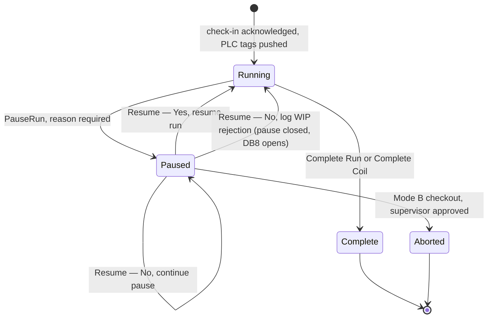
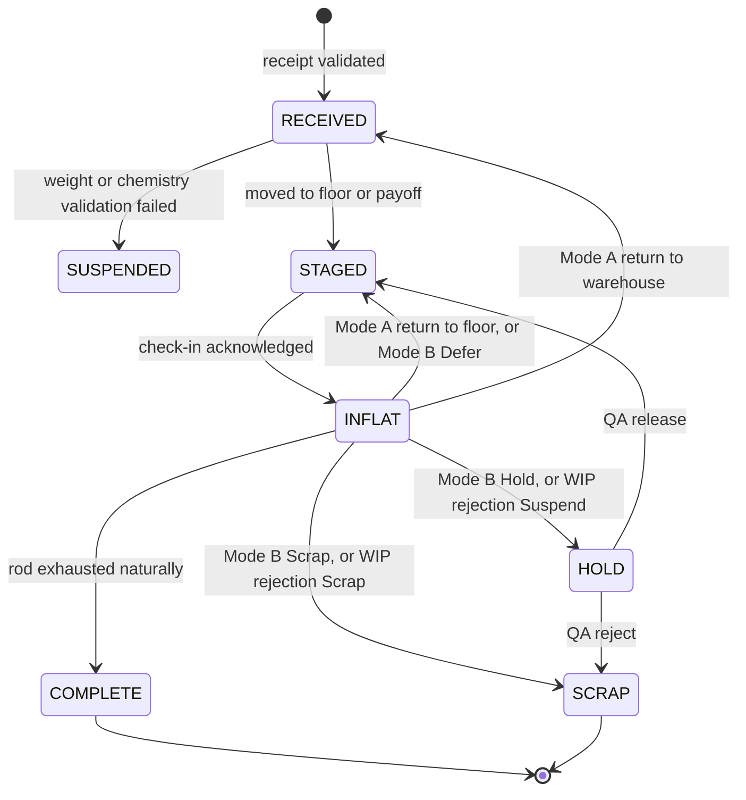
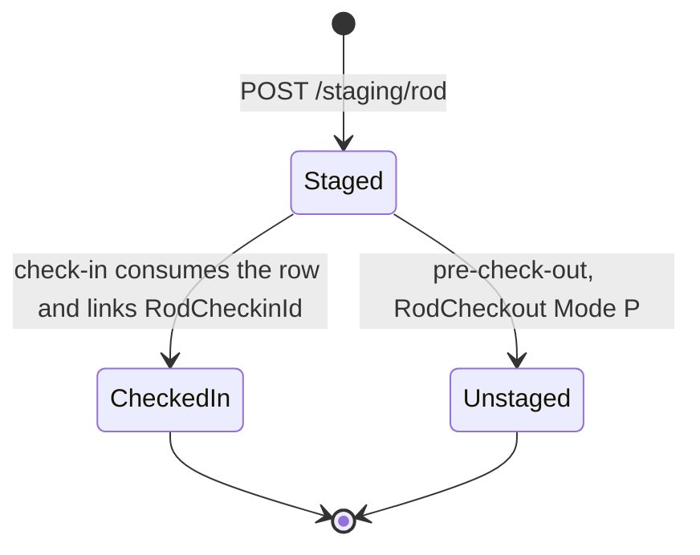

# Flat Wire Mill — Business Rules and Domain Model

**Project:** United Aluminum (UAL) — Flat Wire Mill Module
**Last Updated:** August 18, 2026 — **`D-32`: there is no shared-schema migration.** §3’s material-status vocabulary notes that `INFLAT` is `FlatWireDB`-local only; the 30 Jul timing decision stands, its target column does not *(previously August 13, 2026 — split out of `02-SRS.md` in the ProjectPlan restructure. **Section numbers are unchanged**, so every `§n` citation still resolves; numbering inside this file is deliberately non-contiguous)*
**Document Type:** Domain model, identifier formats, status vocabularies, state machines
**Status:** Baselined for build
**Owner:** BA / Analysis stream
**Audience:** Developers, QA, BA, architects
**Shortcode:** `[BR]`
**Part of:** `ProjectPlan/Business/` — index: [README.md](../README.md)

---

## 3. Domain model and glossary

### 3.1 The three lines

See `[VS §3.2]` for the full comparison. The facts most often got wrong, restated because they are load-bearing for requirements:

- **FL1 has no edger.** No edge-set field appears on any FL1 screen, and the FL1 HMI route variant must not render an Edge Set node.
- **FM2 has three stands: `S1` = 8″, `S2` = 6″, `S3` = 6″. Edgers sit at S2 and S3 only, and S3 is the final, non-bypassable stand.** `[CONFIRMED — Aug 4 2026]` FL3 drives the same FM2. FL1's FM1 is a 12″ mill.
- **FL2 standalone broadcasts `null` live gauge and width.** Its trace is a historical profile served by a REST query, not a live stream.
- **FL3 is FL1 feeding FL2 continuously**, with no intermediate stop, no spool alpha, no intermediate anneal and no FL2 check-in step.

| FM2 stand | Roller | Edger | Bypassable |
|---|---|---|---|
| **S1** | **8″** | No | Yes |
| **S2** | **6″** | Yes | Yes |
| **S3** | **6″** | Yes | **No — final gauge control** |

> **The May 21 2026 note is superseded (4 Aug 2026).** It was recorded as *"FM2 has three 6″ stands (S1, S2, S3)"* and read as **a separate 8″ roller upstream of three 6″ stands — four components**. The 8″ roller **is S1**; there is no fourth stand. Decision **D-26** in `[MS §10.2]`.

> **`OI-04` is closed (4 Aug 2026) — the mandatory stand is `FM2_S3`.** The apparent conflict between SRS §2.7's *"6″ S3"* and the DDL/API/`HMI008` rule *"`FM2_6inS2` must always be Active"* was an artefact of the phantom fourth stand: **both named the same physical stand.** Build the constraint against `FM2_S3`; `FM2_S1` and `FM2_S2` are bypassable.

### 3.2 Equipment inventory

In `[VS §3.3]`. Component vocabulary used throughout the requirements and the schema:

`DB1` · `DB2` · `FM1` · `EdgeSet` · `FM2_S1` · `FM2_S2` · `FM2_S3`

Component names carry **position only** — roll diameter is data, held in `Stand.RollDiameterIn` (FM1 12.000; FM2 S1 8.000, S2 6.000, S3 6.000). *(Aug 4 2026: replaces `FM2_8in` / `FM2_6inS1` / `FM2_6inS2` / `FM2_6inS3`, mapping `FM2_8in`→`FM2_S1`, `FM2_6inS1`→`FM2_S2`, `FM2_6inS2`→`FM2_S3`, with `FM2_6inS3` withdrawn as never-existent. Diameter-in-the-name is what allowed the four-stand misreading to persist.)* `EdgeSet` remains a valid component name but is **FL1-legacy** — FL1 has no edger, so no new FL1 schedule may carry it.

### 3.3 Alpha / identifier formats

| Entity | Format | Example | Generated by |
|---|---|---|---|
| Rod | `R#####` | `R00041` | Rod Receiving, at receipt (range R00001–R99999, **no gaps** per lot) |
| Intermediate spool | `SP-#####` | `SP-00021` | FL1 at spool completion |
| Run | `RUN-####` | `RUN-0042` | On check-in — one per check-in event |
| Pass schedule | `PS-{alloy}-{line}-{seq}` | `PS-1100-FL1-003` | Operations, at creation — natural primary key |
| Weld event | `WLD-###` | `WLD-002` | On weld confirm |
| Roll override | `OVR-####` | `OVR-0042` | On Apply in Roll Adjust |
| Die change | `DC-####` | `DC-0041` | On die-change confirm |
| SPC checkpoint | `SPC-####` | `SPC-0041` | On checkpoint submit |
| WIP rejection | `REJ-####` | `REJ-0041` | On rejection submit *(two formats circulate — OI-21)* |
| Rod checkout | `CO-####` | `CO-0041` | On checkout confirm |
| Output coil | `FW-#####-C##` | `FW-00421-C01` | At coil completion |
| Output coil, mid-run child | `FW-#####-C##-A` | `FW-00421-C01-A` | On a product-spec change mid-run |
| Skid | `SK-#####` | `SK-00201` | On first coil placed — 2 coils per skid |
| Die tooling | `D-{size×1000}-{seq}` | `D-310-034` | Die Management, at registration |
| MMS ID | *(no format defined)* | — | At check-in, per input coil — **OI-03** |
| Scrap box | `SB-{alloy}-{nn}` | `SB-1100-04` | External (slitter scrap-box source) — **OI-15** |

> **Open — spool numbering.** The schema says `SP-#####`; the delivered SRS narrative says `TS######` (TS000001–TS999999). One canonical format must be chosen across schema, label template and UI. **OI-02.**

### 3.3a Rod ↔ order cardinality, and the sequence it forces

**A rod may be split across several orders; an order may need several rods.** Confirmed by the client on 20 Aug 2026 — *"one A-rod could be on multiple orders as well"* — and for the rod side by `Q70` on 30 Jul. The full cardinality:

```
Rod    1 ──── many  Order          Q70, 30 Jul 2026
Spool  1 ──── many  Rod            welded continuous feed at FL1
Spool  1 ──── many  Order          derived from the rods on it
FL2    output ── exactly one order at a time
```

**Orders are consumed one at a time to completion**, per rod payoff station — no interleaving, and no order left part-filled while another runs. Scoped to **FL1/FL3**, the rod-fed lines; FL2's one-order-at-a-time is a separate rule expressed through spool check-in.

**A rod shared between two orders is processed once, continuously**, so it is the **last** rod of the outgoing order and the **first** of the incoming one. It cannot be shuffled into a middle position — which makes each order's rods a four-tier partition:

| Tier | Contents | Order within the tier |
|---|---|---|
| 1 | the **pinned-first** rod, shared with the previous order | exactly one, or none |
| 2 | **free full** rods | any sequence |
| 3 | **free partial** rods — a partial is a back-to-stock (`Q73`) | any sequence |
| 4 | the **pinned-last** rod, shared with the next order | exactly one, or none |

So the legal sequence count is `|free full|! × |free partial|!`. **A rod may be pinned at both ends** — an order lying wholly inside one rod has that rod as its only member — so the first and last tiers are not necessarily different rods.

> **`Q73`'s *"multi-order coils last"* and the *"last rod of the outgoing order"* rule are the same statement** read from the outgoing side. Reading `Q73` alone makes the pinned-**first** case look like a violation of it; it is not. ⚠ `Q73` item 6's **no-weld branch is still open** — tracked as **`Q49`** — and the stricter reading is what is built.

**The rod stays mounted across the boundary.** It is checked in once, at mount; when the running order's allocated weight is reached the operator is notified, marks that order complete, and the next order begins **on the same mount** — no dismount, no second check-in. The split point within the rod is held in **pounds** and converted to feet at run time, because weight is conserved through drawing and rolling and footage is not.

### 3.4 Status vocabularies

**Material status** — applies to `Rod.Status`, `SpoolProcessing.Status`, `CoilOutput.Status`, `RodCheckout.NewRodStatus` and the shared `coils.coil_status`. ⚠ **Since `D-32` (18 Aug 2026) the shared column does not carry `INFLAT`** — `FW-002` is cancelled with the shared-schema migration, so that value exists only in the four `FlatWireDB`-local columns:

`RECEIVED` · `STAGED` · `INFLAT` · `COMPLETE` · `HOLD` · `SCRAP` · `SUSPENDED` *(receiving only)*

**Run status** — `FlatWireRun.Status`: `Running` · `Paused` · `Complete` · `Aborted`
**Pass schedule status** — `PassSchedule.Status`: `Draft` · `Active` · `Inactive`
**Line state** — DB1 / PLC display: `RUNNING` · `IDLE` · `SETUP` · `OFFLINE` · `FAULT` · `PAUSED`
**Staging status** — `RodStaging.Status`: `Staged` · `CheckedIn` · `Unstaged`
**Component state** — `PassScheduleComponent.State`: `Active` · `Bypass` · `Skip` — **a three-value enum, never a boolean.** A boolean cannot express Bypass (present in-line, material passes through unprocessed) versus Skip (not part of this schedule at all).
**Edge type** — domain values `Round` · `Square`; operator-facing labels **"Round Edge" / "Flat Edge"**, mapped by a display pipe.

> **`Blocked` is a derived bay state, not a stored status** — `Status='Staged'` **and** any inspection column `= 'Fail'`. Adding a fourth `Status` value would fall outside the `UX_RodStaging_Bay` filtered index and free a bay that is still physically occupied.
>
> **⚠️ UNRESOLVED — a second spool vocabulary.** `ACTIVE` / `IN-PLAN` / `IN-USE` / `COMPLETED` appears in the planning narrative and is unreconciled with the material statuses above. **OI-06**, and the full transition set is **OI-55**.
>
> **`Bevel edge`** is offered by the Dashboard 9/9A Generate modal and has **no domain value** — a fourth edge-type vocabulary. **OI-05.**

### 3.5 State machines

**Run status:**



`FlatWireRun.PausedAt` holds the current active pause start and is NULL when not paused. An open pause is a `RunPauseEvent` with `ResumedAt IS NULL`.

**Rod material status:**



> **DECIDED (client, 30 Jul 2026) — `INFLAT` is set only at check-in.** ⚠ **Overtaken by `D-32` (18 Aug 2026): `INFLAT` is set on `FlatWireDB`'s `Rod.Status`, and `coils.coil_status` is not written at all.** The 30 Jul answer still governs the **timing**; only the column changed. ~~Whether pre-check-in itself sets `coils.coil_status = INFLAT` or leaves it `STAGED` is OI-01.~~ Pre-check-in does **not** commit the shared status, and there is **no intermediate status** for a rod that is welded but not yet checked in. `RECEIVED → STAGED` stands and the delivered SRS §4.2 `PCI` data note is superseded on this point; rod status `STAGED` is the real staging status rather than a vestigial one. **Residual:** whether the reqsum and `wip_coil_orders` insert from that same note stay at staging is unanswered (OI-01). ~~The interim design follows the delivered SRS and treats `RodStaging.Status` (bay occupancy) as orthogonal to `coils.coil_status`, which makes rod status `STAGED` effectively vestigial for FL1.

**Staging:**



**Spool:** `RECEIVED → STAGED → INFLAT → COMPLETE`, plus `HOLD` and `SCRAP`. An intermediate anneal **modifies the existing alpha** — no child alpha. Re-passing a spool through FL1 is not possible.

**Output coil:** `COMPLETE` · `HOLD` · `SCRAP`, with the transient **SPC-HOLD** quality flag layered on top — it blocks advancement, shipping and release until QA lifts it, but the machine keeps producing. *(SPC-HOLD has no column of its own — **OI-23**.)*

### 3.6 Glossary

| Term | Definition |
|---|---|
| **AGC** | Automatic Gauge Control — inline closed-loop feedback holding target thickness during rolling. Set at run start, runs without operator intervention. Both FM1 and FM2 have it |
| **Alpha** | The unique identifier assigned to a unit of material or an event |
| **Bundle width** | The oscillation width of the wound coil — a Min/Max range per order. Distinct from the flat wire's own width |
| **Coreless oscillated coil** | The finished product: flat wire wound with no core mandrel; the collapsible spool ejects the coil |
| **CPK** | Process capability index, computed per production run excluding unstable start and end regions |
| **Dancer** | Tension-management roller. Tension is derived from speed, never entered manually |
| **DB1 / DB2** | Draw box 1 / 2 — the wire drawing die blocks |
| **Digital traveler** | The screen-based work instruction that adapts to the active station. Never printed for flat wire |
| **Edger** | Edge-conditioning tooling. On FM2 stands S2 and S3 only |
| **FM1 / FM2** | The 12″ flattening mill (FL1) / the 3-stand finishing mill (FL2) — **S1 8″, S2 6″, S3 6″** |
| **Footage counter** | The PLC-sourced cumulative feet produced on a run. The clock every mid-run event is stamped against |
| **ITInhibit** | A system-controlled PLC tag that blocks machine run when prerequisites are unmet. Set and cleared **only** by the system, never by an operator |
| **MMS ID** | Material-management identifier generated per input coil at check-in; activated when a welded coil becomes active; closed **strictly on material consumption** |
| **Pass schedule** | The central configuration record — components active/bypassed, die sizes, roll clearances, edge configuration, gauge/width targets, speed range, route mode |
| **Payoff / VPS** | The dual-position feed reel holding rod bundles eye-to-sky. 9,000 lb per position |
| **Route mode** | `Standalone` (single-line) or `Hybrid` (FL1 feeding FL2 continuously = FL3) |
| **Scrap box** | Alloy-based container for rod and in-process scrap; selection follows the same carry-forward logic as slitters |
| **Skid** | Packaging unit carrying exactly two finished coreless coils |
| **SPC-HOLD** | The state applied to output material when a checkpoint is submitted out of spec. Blocks advancement, shipping and release until QA lifts it — but does **not** stop the machine |
| **Spool (intermediate)** | Reusable collapsible metal spool holding FL1 output; routed to anneal then FL2 |
| **Thread mode** | Running the line slowly to verify a new die is seated and on-target, permitted while a post-die-change SPC checkpoint is outstanding |
| **TKUP-1 / TKUP-2 / TPO** | Traversing take-up 1 (FL1 output) / take-up 2 (finished coil) / traversing payoff (FL2 input) |
| **Traveler Queue** | The pre-checked-in / welded / available rod list for the current order at a line |

---
