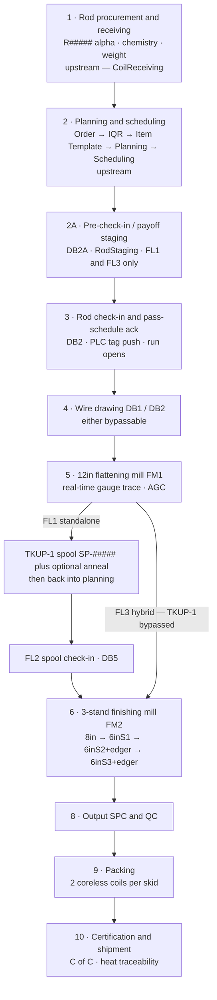
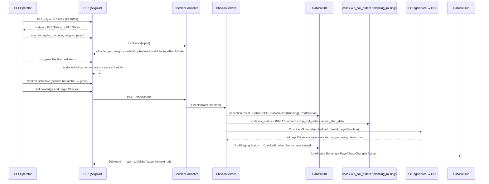

# Flat Wire Mill — Process Flows

**Project:** United Aluminum (UAL) — Flat Wire Mill Module
**Last Updated:** August 13, 2026 — split out of `02-SRS.md` in the ProjectPlan restructure. **Section numbers are unchanged**, so every `§n` citation still resolves; numbering inside this file is deliberately non-contiguous
**Document Type:** End-to-end process flows — the normal path
**Status:** Baselined for build
**Owner:** BA / Analysis stream
**Audience:** Developers, QA, BA, operations
**Shortcode:** `[PF]`
**Part of:** `ProjectPlan/Business/` — index: [README.md](../README.md)

---

## 4. Process flows

---

### 4.1 The eleven stages

Stage 7 (weld events) and stage 11 (scrap disposition) are **not sequential** — a weld can occur any time during stages 4–6, and scrap arises at any stage. Stages 1 and 2 are upstream; stage 2A onward is this module.

---

### 4.2 Before the line — material and job exist

| # | Step | Where | Record |
|---|---|---|---|
| 1 | PO raised with a 3-D specification (gauge × diameter × length/weight) | MPS | PO |
| 2 | Rod arrives as bundled coils. Operator enters the PO number; alloy, diameter and weight pull from it. Operator enters **gross (scale)** and **net** weight | Coil Receiving | — |
| 3 | System validates scale weight against vendor gross weight within tolerance and validates that chemistry documentation is present. **Either failing suspends the material** | Coil Receiving | `coils` row `SUSPENDED` |
| 4 | On success, alpha `R#####` assigned (no gaps, per lot). `coils` entry created: gauge populated; **width, OD, ID and surface finish blank** — rods have no width. Inventory type **TBD (OI-49)** | Coil Receiving | `coils` row `RECEIVED` |
| 5 | Sales creates the order with the **Flat Wire** checkbox: bundle width Min/Max, edge type, alloy, temper, gauge. IQR links order to item template; the template defines the route | Web | Order |
| 6 | Planner filters `Flatwire`, selects rod material, enters **weight only**. The system computes the number of stops and **generates all alphas at planning time**, including a remainder alpha. "Number of Cuts"/"Number of Stops" are not used for flat wire | Planning | `planning_routings` allocation |
| 7 | Scheduling books the job on **FL1**, **FL2** or **FL3** — three separate machine bookings. Operation letter **`F`**. FL3 cannot be booked if FL1 or FL2 have scheduled orders | Scheduling | order → line booking |
| 8 | **A pass schedule must already exist and be `Active`** for the alloy + line + target gauge × width + route. Authored manually by Operations; never auto-generated | DB9 / DB9A | `PassSchedule` + `PassScheduleComponent` |

---

### 4.3 Pre-check-in — staging the next rod (FL1 / FL3 only)

Register the *next* rod against the idle VPS bay while the current rod is still running, so the line can run continuously through an induction weld. **Priority `Should`** — scanning an unstaged rod straight into check-in remains valid and is the normal cold-start path.

1. The rod bundle is moved to the free VPS bay. **Bundles are not unbanded until positioned at the payoff** — a safety and bundle-integrity rule, and the reason visual inspection happens here rather than at check-in.
2. The operator runs the 3-step wizard on DB2A: identify rod → assign bay → visual inspection.
3. The scan **resolves the order** from `planning_routings`. On a cold line this is what reveals which order the line is starting. A rod with no allocation is refused.
4. **Wrong station is corrected automatically** (30 Jul 2026): if the resolved order is booked on the other rod line, the screen **switches to that station** and the transaction continues — no message, no override. **One** deviation remains notified and supervisor-authorised, never refused: *out of sequence* (the rod is not the one planning expects next).
5. If the rod has prior footage the wizard **forces the carry-forward path**; the fresh-start control is absent from the DOM, not merely disabled.
6. Any inspection Fail is a **hard block with no bypass** — the only forward action is WIP Rejection.
7. On confirm a `RodStaging` row is written; the shared coil status and WIP queue entry are updated as **compensating writes, not one transaction**; `PayoffStateChanged` is broadcast. **No PLC tags are pushed.**
8. **Mark as Welded** records operator and timestamp and validates alloy/temper/diameter against the running coil. It records the weld; it does **not** switch bays — the payoff transition happens when the running rod reaches 0 ft remaining.

---

### 4.4 Rod check-in — the gate for everything (FL1 / FL3)

A **6-step guided tab wizard** with progressive unlock: (1) Visual Inspection, (2) Pass Schedule, (3) Pre-run SPC, (4) Die Block DB1/DB2, (5) Rolling Mill FM1, (6) Lube & Safety.

**Order of writes is mandatory: records first, PLC second.** If the PLC write fails there is then an incomplete-push marker to recover from.

**Gate conditions before Acknowledge enables:** rod alpha valid against `coils` · diameter within nominal ± lookup tolerance · all mandatory fields complete · rod available (not checked in elsewhere) · order Open and plan open · **all inspection items Pass** · pre-run SPC diameter entered and in spec · a pass schedule loaded and **explicitly confirmed**.

---

### 4.5 During the run — the events that can interrupt it

Any number, in any order, all stamped against `RunId` + footage position:

| Event | Screen | Written | Gate / consequence |
|---|---|---|---|
| **Weld** | DB2A — *Mark as welded* | `WeldEvent` (`WLD-###`) | Incoming rod **defaults to the `Staged` rod on the idle bay**; footage auto-read from the encoder; induction only; quality Pass/Fail with a mandatory fail reason. All later footage attributed to the incoming rod. A Fail still logs and links the rods and flags for supervisor review |
| **Die change** | DC | `DieChangeEvent` (`DC-####`) + auto-created `RollOverride` | `Gauge drift` / `Size change` route to SPC; the run stays blocked from full production, **thread mode permitted**. `Die failure` offers a QA hold on a footage range. `Planned life` returns straight to the run. An incoming die not in inventory is rejected at the scan |
| **SPC checkpoint** | DB6 | `SpcCheckpoint` + `SpcMeasurement` | Two exits: *Submit · continue run*, or *Submit · suspend material* (coil to SPC-HOLD; **the machine keeps running**) |
| **Roll adjust** | DB11 | `RollOverride` (`OVR-####`) + an SPC checkpoint of type `RollAdjustTrigger` | **Run-level override — never edits the pass schedule.** Measured gauge + width required, plus a reason chip. PLC tag written immediately. All-zero deltas write nothing |
| **Pause / resume** | shared dialog | `RunPauseEvent` | One reason from a governed taxonomy; footage frozen; PLC to hold/idle; DB1 to `PAUSED` |
| **WIP rejection** | DB8 | `WipRejection` (`REJ-####`) | Group + reason + measured/target + disposition; `AlertRaised` to DB1 |
| **Rod checkout** | DB12 | `RodCheckout` (`CO-####`) | Three modes — §4.6 |
| **Wire break** | prompt | *(no table defined — **OI-13**)* | Break confirmation → OD verification → defect inspection before resuming |
| **Spool weight milestones** | DB3 overlay | audit record per acknowledgement | Advisory 75 / 90 / 100 % ladder; non-blocking |

---

### 4.8 The route split at FM1 output

**Route A — FL1 standalone (produces WIP, not finished goods):**

1. Flat wire winds onto **TKUP-1** as an intermediate spool.
2. Advisory milestone alerts fire at **75 / 90 / 100 %** of target spool weight — non-blocking, acknowledge-to-arm-next, supersede-in-place.
3. When the operator physically stops the machine at or above target and the PLC confirms a `RUNNING → STOPPED` transition held for a configurable dwell (**default 5 s**), a **modal** asks whether the stop was to remove the completed spool. **Yes** runs the completion transaction and prints labels. **No** records nothing; a manual *Complete spool* path stays available.
4. Per-spool SPC for gauge and width is a **mandatory gate before a spool alpha is issued**.
5. Spool alpha generated, carrying source rod alphas, measured gauge/width, weights and the **stored gauge profile including weld markers**.
6. Spool label printed on a **high-temperature (furnace-compatible)** printer.
7. Optional anneal; the existing alpha carries forward with the anneal recorded as an event against it.
8. Back into planning: a planner allocates spool weight to an order; the remainder receives a child alpha; scheduling books it on FL2.
9. **FL2 spool check-in (DB5)** — operator scans the FL1-printed label, enters measured gauge, width and weights; the screen shows source rods and the **historical FL1 gauge profile with weld markers**; **no visual inspection**; same mandatory pass-schedule confirmation; FM2 tags pushed; the FL2 run opens.

**Route B — FL3 hybrid (finished goods in one pass):** TKUP-1 is bypassed. Material flows continuously from FM1 through the TPO into FM2 — **no intermediate stop, no spool alpha, no spool label, no intermediate anneal and no FL2 check-in step**. The gauge trace stays real-time end to end, and one unified `PS-{alloy}-FL3-{seq}` schedule covers the FL1 and FL2 components together.

---

### 4.9 FM2 finishing, coil completion, packing, shipment

1. Material passes the FM2 stands in sequence: **S1 — 8″ roller (bypassable) → S2 — 6″ roller + edger (bypassable) → S3 — 6″ roller + edger (final)**.
2. Automatic gauge and width measurement after the final 6″ stand, recorded as an SPC checkpoint.
3. Output winds at **TKUP-2** (1,100 lb equipment maximum; a customer may specify lower).
4. **Coil completion (DB7):** coil alpha issued — mid-run child `…-A` when a product-spec change split the coil. Footage from the counter. **Net weight derived from footage and cross-section**, operator-overridable with a scale reading. **Gauge and width display the *target* value when SPC confirms in tolerance**; the measured value shows only when out of tolerance.
5. **Source traceability** captured: one row per contributing rod with footage-from / footage-to at each weld boundary, plus the spool alpha on the non-hybrid route. Full chain `R00041 → SP-00031 → FW-00421-C01 → SK-00201`.
6. **Final SPC**: gauge and width in-spec badges; out of spec makes *Submit · suspend* the primary path.
7. **Coil label printed** on the Sato standard printer, including **all contributing source rod alphas**. Pass-schedule data is **not** printed on the customer label.
8. **Skid tracking:** exactly two coreless coils per skid. Coil 1 opens the skid; coil 2 closes it, prints the skid label and queues it for packing.
9. **Packing station (DB7b):** physical receipt confirmed, scale weight captured and reconciled, skid closed, labels printed, staging location assigned.
10. **Certification and shipment:** C of C with chemistry, mechanical properties, dimensional data, alloy, temper and traceability to source rod heat. Welding-wire customers additionally require every weld join traceable, and may impose a contractual maximum weld count per coil *(limit TBD — OI-59)*.
