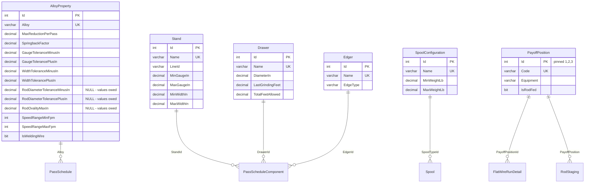
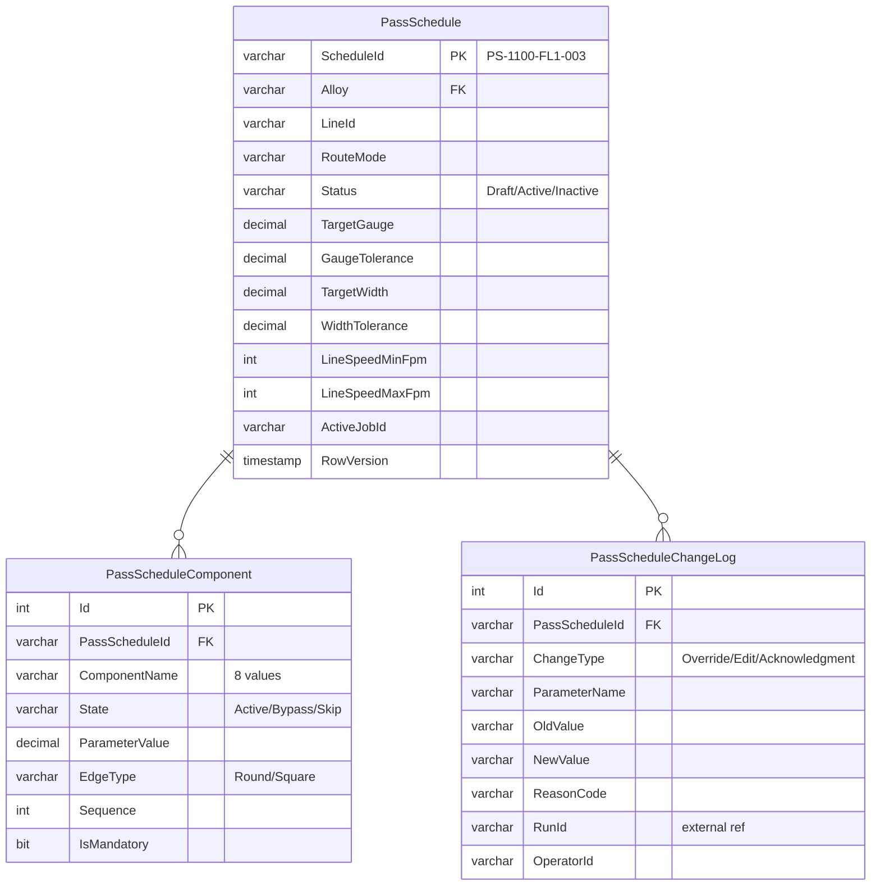
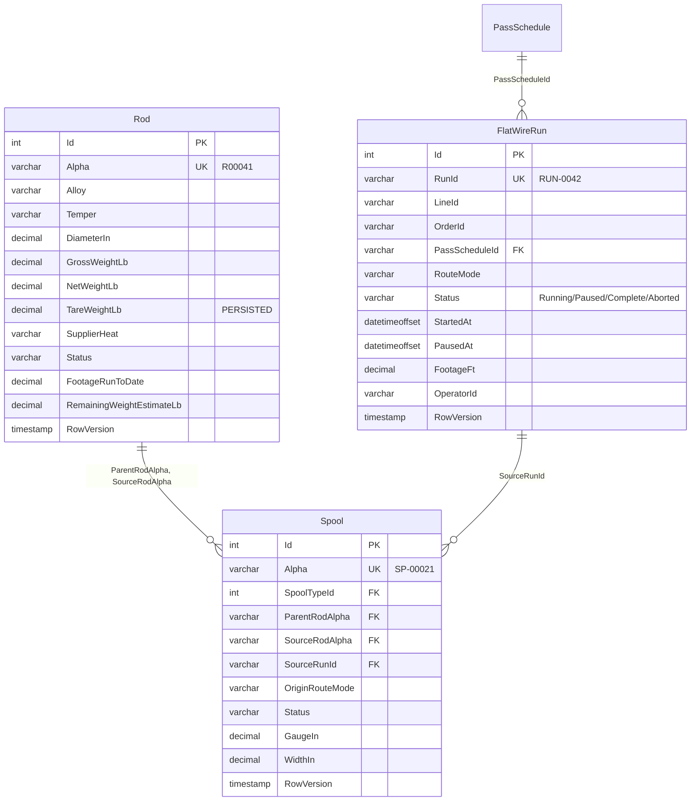
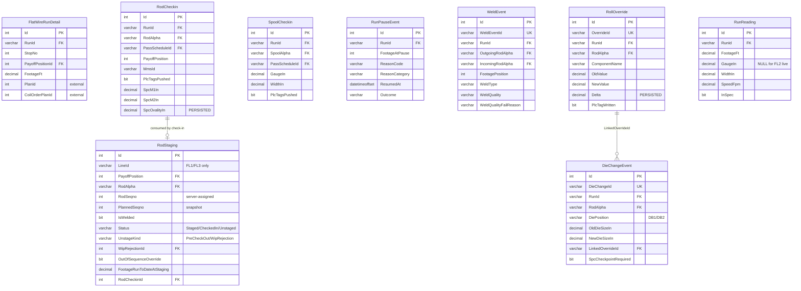
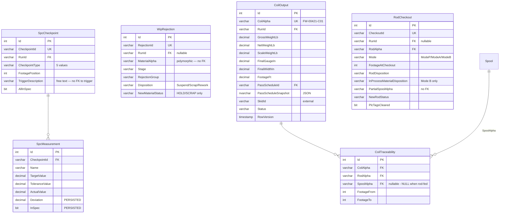

# Flat Wire Mill — Database Design and ER Model

**Project:** United Aluminum (UAL) — Flat Wire Mill Module
**Last Updated:** August 13, 2026 — split out of `03-HLD-and-ERDiagram.md` in the ProjectPlan restructure. **Section numbers are unchanged**, so every `§n` citation still resolves; numbering inside this file is deliberately non-contiguous
**Document Type:** Data model, ER diagrams, the counted object baseline
**Status:** Baselined for build
**Owner:** Architecture stream / DBA
**Audience:** Architects, DBA, .NET developers
**Shortcode:** `[DBD]`
**Part of:** `ProjectPlan/Database/` — index: [README.md](../README.md)

---

## 6. Data model

### 6.1 Target database and authority

The flat-wire-specific model lives in a **new standalone SQL Server database, `FlatWireDB`** (schema `dbo`), created by `FlatWire_DDL_00_Database.sql` with `READ_COMMITTED_SNAPSHOT ON` and `ALLOW_SNAPSHOT_ISOLATION ON`. **It is not an extension of `united_db`.** Any DDL header still reading `USE [united_db]` is stale.

> **The executable DDL is the authority for column-level types.** The per-domain markdown design docs (`Schema/FlatWireSchema_*.md`) declare many numeric columns as bare `decimal` — which SQL Server resolves to `decimal(18,0)`, **zero fraction**. Regenerating DDL from those docs would round weights and measurements to whole numbers. **Never regenerate the DDL from the markdown**; correct the markdown up to the DDL.

### 6.2 Table count — counted, not quoted

**MVP-1 builds 25 tables. The full design is 28.** Both figures were taken by counting `CREATE TABLE` statements with comments stripped, on 13 Aug 2026 — not copied from any document:

| Group | Script | Count | Scope | Tables |
|---|---|---|---|---|
| **Lookup / Reference** | `01_Lookup` | **7** | MVP-1 | `Stand` · `Drawer` · `Edger` · `SpoolConfiguration` · `AlloyProperty` · `PayoffPosition` · **`Dancer`** |
| **Schedule** | `02_Schedule` | **3** | **MVP-2** | `PassSchedule` · `PassScheduleComponent` · `PassScheduleChangeLog` |
| **Materials** | `03_Materials` | **3** | MVP-1 | `Rod` · `FlatWireRun` · `Spool` |
| **Runs** | `04_Runs` | **9** | MVP-1 | `FlatWireRunDetail` · `RodStaging` · `RodCheckin` · `SpoolCheckin` · `RunPauseEvent` · `WeldEvent` · `RollOverride` · `DieChangeEvent` · `RunReading` |
| **Quality / Output** | `05_QualityOutput` | **6** | MVP-1 | `SpcCheckpoint` · `SpcMeasurement` · `WipRejection` · `CoilOutput` · `CoilTraceability` · `RodCheckout` |
| | | **25** | **MVP-1 build** | `FlatWire_DDL_RunAll.sql` skips `02_Schedule` deliberately |
| | | **28** | full design | MVP-1 + the three MVP-2 `PassSchedule*` tables |

**Two corrections landed here on 13 Aug 2026.** The Lookup row said **6** and omitted **`Dancer`**, which `01_Lookup` does create — the same omission `GapAnalysis.md` **E1**/**E3** records against the ER documentation and the script's own header. And the prose said "28 tables" above a table that summed to **27**, which is how a figure nobody could reproduce stayed in circulation.

**Other counts circulating in the repository — all superseded:** 20 → 21 → 22 → 24 → 27. `CLAUDE.md`'s *"verified … 24 tables"* is the most recent of them and is also wrong; the deployed-database check in `[DEP §4.2]` now expects **25**.

`FlatWireRun` is created in `03_Materials`, **not** `04_Runs`, so that `Spool.SourceRunId` can reference it.

### 6.3 The `Rod` table decision — resolve it loudly

**`Rod` is retained as a `FlatWireDB`-local master with enforced rod-alpha foreign keys.** It mirrors the shared legacy `coils` record populated by the Receiving module.

This is the **"Hybrid foundation" decision (D-04)**, and it **reverses** the earlier *(now-dissolved)* `00-foundations.md` **decision 3** / `phase-01c` position that `Rod` should be **dropped**, with every rod-alpha reference becoming an unenforced cross-database logical link to `coils` (21–22 tables). **The DDL and the ER document are the later artifacts, they win, and they are the ones that were built and validated.**

Consequence: `Spool.ParentRodAlpha`, `Spool.SourceRodAlpha`, `RodStaging.RodAlpha`, `RodCheckin.RodAlpha`, `WeldEvent.OutgoingRodAlpha` / `IncomingRodAlpha`, `RollOverride.RodAlpha`, `DieChangeEvent.RodAlpha`, `CoilTraceability.RodAlpha` and `RodCheckout.RodAlpha` all carry **real, enforced FKs** to `Rod.Alpha`.

> **The stale side no longer exists (13 Aug 2026).** `00-foundations.md` decision 3 described dropping `Rod` and putting the schema at 21 tables; it was superseded by `D-04` long before, and the document itself was dissolved in the ProjectPlan restructure — its decisions now live in `[ARC §13.1]`, where **`D-04` states the retention and records that it reverses that earlier position**. `Development/Phases/phase-01c-database-foundation.md` was corrected on 11 Aug 2026 and now says `Rod` is retained. **Nothing in this repository still tells you to drop it.**
>
> **The unresolved consequence** of keeping a mirror — how and when `Rod` is synchronised with `coils`, which side is master for each shared column, and what happens when they diverge — is **OI-42**. It is a real design hole, not a documentation nit: it creates two sources of truth for rod material with no reconciliation.

### 6.4 `FlatWireRun` is the hub

Every in-process event is a child of `FlatWireRun` via `RunId`. The certificate genealogy chain is:

```
CoilOutput.CoilAlpha → CoilTraceability(FootageFrom..FootageTo) → Rod.Alpha → supplier heat / lot
```

### 6.5 Table inventory — purpose and key columns

**Group 1 — Lookup / Reference**

| Table | Purpose | Key columns / constraints |
|---|---|---|
| `Stand` | Rolling-mill finishing stands | `Name` UNIQUE — position only (`FM1`, `FM2_S1`, `FM2_S2`, `FM2_S3`), `LineId` (NULL = shared), **`RollDiameterIn DECIMAL(5,3)` > 0** (FM1 12.000; FM2 S1 8.000, S2 6.000, S3 6.000), gauge and width ranges `DECIMAL(8,4)` with Min<Max checks. *(Aug 4 2026: FM2 is three stands and diameter moved out of the name into `RollDiameterIn`. The DDL comment on `MinWidthIn` says "strip width" — a source terminology slip; the column means flat wire width.)* |
| `Drawer` | Draw-box die configurations | `Name` UNIQUE, `DiameterIn DECIMAL(8,4)` > 0, optional feed-diameter range. **Die life (6 Aug 2026):** `LastGrindingFeet DECIMAL(10,2)` NOT NULL DEFAULT 0 — feet run *since* the last grind, not the reading at it — and `TotalFeetAllowed DECIMAL(10,2)` NULL, the scheduled-life threshold (NULL until **OQ-83** supplies values). **No `LastGrindingFeet ≤ TotalFeetAllowed` check** — *overdue* is a displayed state, not a data error |
| `Edger` | Edger tooling configurations | `EdgeType` CHECK IN (`Round`,`Square`), `ToolingSetNo` |
| `SpoolConfiguration` | Spool type constraints | Weight / core-diameter / outer-diameter ranges with Min<Max checks |
| `AlloyProperty` | Per-alloy process properties; the **local** parent for `PassSchedule.Alloy` | `Alloy` UNIQUE, `MaxReductionPerPass DECIMAL(5,3)`, `SpringbackFactor`, tolerance defaults, speed range, `IsWeldingWire`. **`LbPerFtFactor` must not be populated** (seeded NULL, "OQ-10 PENDING") and `DensityLbPerIn3` **duplicates `united_db..alloys.alloy_density`** — see §6.6 |
| `PayoffPosition` | Material input/output positions | **Pinned Ids, not IDENTITY**: 1 `Payoff1` (VPS, 9,000 lb, rod-fed), 2 `Payoff2` (VPS, 9,000 lb, rod-fed), 3 `TraversingTakeup`. Seeded **by the DDL itself**, because the `FlatWireRunDetail` FK depends on the rows existing |

> **Deliberate narrowing.** Rod-fed tables (`RodStaging`, `RodCheckin`, `RodCheckout`, `SpoolCheckin`) keep `CHECK (PayoffPosition IN (1,2))`. That is intentional — a rod bundle only ever mounts on a VPS bay. `TraversingTakeup` exists so FL2 can be represented without a fourth vocabulary, but **it currently has no UI anywhere** (**OI-80**).

**Group 2 — Schedule**

| Table | Purpose | Key columns / constraints |
|---|---|---|
| `PassSchedule` | The configuration header — the machine's brain | `ScheduleId VARCHAR(30)` **PK clustered, natural key** (`PS-1100-FL1-003`); `Alloy` FK → `AlloyProperty`; `LineId` CHECK; `RouteMode` CHECK; `Status` CHECK (`Draft`,`Active`,`Inactive`); target gauge/width + tolerances; input rod spec; speed range; `ActiveJobId`; audit quad; `ROWVERSION`. **`UX_PassSchedule_OneActivePerLineAlloy`** — filtered UNIQUE on `(LineId, Alloy) WHERE Status='Active'` |
| `PassScheduleComponent` | Per-component rows (renamed from `FlatLineSetup`) | `ComponentName` CHECK over the eight names; **`State` CHECK IN (`Active`,`Bypass`,`Skip`) — three values, never a boolean**; `ParameterValue` must be NULL unless `State='Active'`; `EdgeType` required when an `EdgeSet` component is Active; `Sequence` UNIQUE with the schedule; `IsMandatory`; FKs to `Stand`/`Drawer`/`Edger`. **`CK_PSC_FM1NotBypassable`** — `FM1` must be `Active` |
| `PassScheduleChangeLog` | Immutable audit trail | `ChangeType` CHECK IN (`Override`,`Edit`,`Acknowledgment`); parameter, old→new, reason code and notes, `RunId` context, operator, server timestamp. Backs the DB9 Change History tabs |

**Group 3 — Materials**

| Table | Purpose | Key columns / constraints |
|---|---|---|
| `Rod` | Wire rod receiving and lifecycle (mirrors `coils`) | `Alpha` UNIQUE — the scan key; alloy/temper; `DiameterIn` > 0; gross/net weight; **`TareWeightLb` PERSISTED computed**; `SupplierHeat` — the far end of the cert chain; `Status` CHECK over the six material statuses; **`FootageRunToDate`** and **`RemainingWeightEstimateLb`** — the carry-forward columns; `ROWVERSION`. *(`StagedPayoffPosition` and `IsWelded` were removed 29 Jul 2026 — a nullable column pair cannot express "one rod per payoff bay")* |
| `FlatWireRun` | **The run header — the hub** | `RunId VARCHAR(20)` UNIQUE (`RUN-0042`); `LineId`; `OrderId`; `PassScheduleId` FK; `Alloy` denormalised; `RouteMode`; `Status` CHECK (`Running`,`Paused`,`Complete`,`Aborted`); `StartedAt` / `PausedAt` / `CompletedAt`; **`FootageFt DECIMAL(10,2)` updated live from the PLC**; `OperatorId`; `ROWVERSION` |
| `Spool` | Pre-drawn intermediate spools | `Alpha` UNIQUE (`SP-00021`); `SpoolTypeId` FK; **`ParentRodAlpha`** and **`SourceRodAlpha`** FKs → `Rod.Alpha`; `SourceRunId` FK → `FlatWireRun`; `OriginRouteMode` — FL2 rejects a Standalone schedule on Hybrid-origin material; `Status`; gauge/width set at FL2/FL3 check-in; `ROWVERSION` |

**Group 4 — Runs**

| Table | Purpose | Key columns / constraints |
|---|---|---|
| `FlatWireRunDetail` | Per-stop detail (renamed from `FlatLineProcessing`) | `RunId` FK; `StopNo` / `SequenceNo`; **`PlanId` / `CoilOrderPlanId` are external references with no local parent**; `PayoffPositionId` **FK → `PayoffPosition.Id`**; footage; on-gauge weight; per-stop targets; start/exit gauge; output OD/ID |
| `RodStaging` | Pre-check-in — **the most heavily constrained table in the schema.** FL1 and FL3 only | See §6.7 |
| `RodCheckin` | Rod check-in record | `RunId`/`RodAlpha`/`PassScheduleId` FKs; measured diameter; verified weights; `MmsId` + `MmsStatus`; `PlcTagsPushed`; **four** inspection columns NOT NULL including `InspectionConnectorTag`; **`SpcM1In` / `SpcM2In` NOT NULL** with `SpcOvalityIn` PERSISTED computed as `ABS(M1−M2)` |
| `SpoolCheckin` | Mirrors `RodCheckin` for the spool feed | `LineId` CHECK IN (`FL2`,`FL3`); `SpoolAlpha` FK; `GaugeIn`/`WidthIn` NOT NULL (operator-measured); single `InspectionSurface` column |
| `RunPauseEvent` | Pause / resume | `FootageAtPause`; reason code + category; **`Notes` required when `ReasonCategory='Other'`**; `ResumedAt` NULL = still open; `PauseDurationSeconds` computed; `Outcome` CHECK IN (`ResumeRun`,`LogWipRejection`,`CheckOutRod`,`ContinuePause`) |
| `WeldEvent` | The induction weld join | `WeldEventId` UNIQUE; **both** rod alphas FK → `Rod.Alpha`; **both** payoff positions with `CK_WeldEvent_PayoffDiff` — a bay cannot be welded to itself; `FootagePosition` from the encoder; `WeldType` CHECK (`InductionWeld`,`LaserWeld` — **induction is the only live type**); `WeldQuality`; **fail reason mandatory when quality is `Fail`**; server-side timestamp |
| `RollOverride` | Run-level roll-gap override | `OverrideId` UNIQUE; `RunId`/`RodAlpha` FKs; component name; old/new value with **`Delta` PERSISTED computed**; reason code CHECK over eight values; measured gauge/width; `PlcTagWritten` |
| `DieChangeEvent` | Die change | `DieChangeId` UNIQUE; `DiePosition` CHECK (`DB1`,`DB2`); old/new die size; **`ReasonCode` CHECK carries eight values** because it merges the screen's five with an earlier API list — **build the UI against the five** (`PlannedLife`, `GaugeDrift`, `DieFailure`, `SizeChange`, `Other`); `LinkedOverrideId` FK → `RollOverride`; `SpcCheckpointRequired` default 1 |
| `RunReading` | The sampled gauge/width/speed profile | `RunId` FK; `FootageFt`; **`GaugeIn` NULL for the FL2 standalone live feed**; `WidthIn`; `SpeedFpm`; `InSpec`; `ReadingTs`. **Not a per-tick historian** — writes are sampled/decimated. Indexed `(RunId, FootageFt)`. **Retention and rollup policy undefined — OI-17** |

**Group 5 — Quality / Output**

| Table | Purpose | Key columns / constraints |
|---|---|---|
| `SpcCheckpoint` | Checkpoint header | `CheckpointId` UNIQUE; `RunId` FK; **`CheckpointType` CHECK over five values including `RollAdjustTrigger`**; `FootagePosition` captured when the checkpoint **opens**; `TriggerDescription` free text; `AllInSpec` tri-state |
| `SpcMeasurement` | Per-measurement rows | `CheckpointId` FK; `Name`; target / tolerance / actual; **`Deviation` and `InSpec` both PERSISTED computed** |
| `WipRejection` | WIP rejection | `RejectionId` UNIQUE; **`RunId` NULLABLE** for pre-run rejections; **`MaterialAlpha` is polymorphic (rod *or* spool) with no FK**; stage; group CHECK over five values; disposition CHECK (`Suspend`,`Scrap`,`Rework`); `NewMaterialStatus` CHECK (`HOLD`,`SCRAP`) |
| `CoilOutput` | The finished coil | `CoilAlpha` UNIQUE; `RunId` FK; gross/net weight with `NetWeightOverrideLb` and `ScaleWeightLb`; final gauge/width; footage > 0; `PassScheduleId` FK + **`PassScheduleSnapshot NVARCHAR(MAX)` JSON**; **`SkidId` is an external reference**; `SkidStatus`; `StagingLocation`; `Status` CHECK (`COMPLETE`,`HOLD`,`SCRAP`); `ROWVERSION` |
| `CoilTraceability` | **The genealogy chain** | `CoilAlpha` FK → `CoilOutput`; `RodAlpha` FK → `Rod`; **`SpoolAlpha` FK → `Spool`, nullable — NULL on a rod-fed run, filtered index**; `FootageFrom` < `FootageTo`. **Non-overlap enforced by trigger** `trg_CoilTraceability_NoOverlap`, because SQL Server has no exclusion constraint. Ranges are half-open `[From, To)` |
| `RodCheckout` | All three checkout modes | `CheckoutId` UNIQUE; **`RunId` NULLABLE** for Modes P and A; `Mode` CHECK (`ModeP`,`ModeA`,`ModeB`); footage; reason; `RodDisposition` CHECK over five values; `InProcessMaterialDisposition` **Mode B only**; `PartialSpoolAlpha` **no FK**; `NewRodStatus` CHECK; `PlcTagsCleared`. Per-mode rules enforced by `CK_RodCheckout_ModeP` and `CK_RodCheckout_ModeB` |

### 6.6 Weight derivation — and why `AlloyProperty` must not own density

**There is no single footage-to-weight factor.** A scalar lb/ft is valid for exactly one gauge × width, and the line runs 0.110″ × 0.625″ on FL1 and finishes to 0.0160″ × 0.625″ on FL2 — a **7× difference in cross-section**. Compute it from density at runtime:

```
lb/ft  =  A(in²) × 12(in/ft) × ρ(lb/in³)

Square edge:  A = t × w
Round edge:   A = t·w − t²(1 − π/4)  =  t·w − 0.2146·t²
```

Round edge is a rectangle with semicircular ends, so it holds **less** metal than the bounding rectangle: **−3.8 %** at 0.110″ × 0.625″, **−3.1 %** at 0.125″ × 0.875″, but only **−0.6 %** at 0.0160″ × 0.625″. The correction matters most on thick-gauge FL1 spools — exactly where the 2,000 lb target sits.

The reusable constant is **`k = 12ρ`**, so `lb/ft = A × k`:

| Alloy | ρ (lb/in³) | **k (lb per in²·ft)** | 0.110″ × 0.625″ square / round | 0.0160″ × 0.625″ |
|---|---|---|---|---|
| 1100 | 0.0980 | **1.1760** | 0.0809 / 0.0778 | 0.0118 / 0.0117 |
| 1350 | 0.0974 | **1.1688** | 0.0804 / 0.0773 | 0.0117 / 0.0116 |
| 3003 | 0.0990 | **1.1880** | 0.0817 / 0.0786 | 0.0119 / 0.0118 |
| 5052 | 0.0971 | **1.1652** | 0.0801 / 0.0770 | 0.0117 / 0.0116 |
| 6061 | 0.0975 | **1.1700** | 0.0804 / 0.0774 | 0.0117 / 0.0116 |

**Density and draw reduction already exist upstream — read across, do not duplicate.**

| `AlloyProperty` column | Already in `united_db..alloys` | Verdict |
|---|---|---|
| `DensityLbPerIn3` | **`alloy_density`** `[float] NULL` | Exact duplicate — **read across** |
| `MaxReductionPerPass` | **`Draw_max_reduction`** / `Draw_min_reduction` | **The generator's core input.** Read across |
| *(machine capability)* | `alloy_max_gauge` | Overlaps the `Stand` gauge range — reconcile |
| `IsActive` | `alloy_status`, `IsActive` | Two flags already exist upstream |

**The unit is verified as lb/in³**, not g/cm³ — `PlanningDB..Planning_GetorderminPIW` computes `((alloy_density × PI() × width) / 4) × (OD² − ID²) / width`, which reduces to `ρ × π/4 × (OD² − ID²)` and yields pounds per inch of width only if ρ is lb/in³. So `k = 12ρ` holds with **no unit conversion**.

**Access pattern — follow the existing convention.** `united_db..alloys` is already surfaced as a view named **`Alloys`** in six consuming databases (CommonDB, MillsDB, PackingDB, AccountingDB, SlitterDB, PlanningDB). `FlatWireDB` should do the same: create a **`FlatWireDB..Alloys` view** over `united_db..alloys`, which gives one place to absorb three real mismatches rather than repeating them at every call site:

| Mismatch | Detail | Handle in the view |
|---|---|---|
| Type | `alloy_density` is `[float]`; `AlloyProperty.DensityLbPerIn3` is `DECIMAL(10,6)`; consuming procedures variously declare it `DECIMAL(8,5)` or `FLOAT` | `CAST` once |
| Nullability | `united_db..alloys.alloy_density` is **NULLABLE**; `proddb..alloys.alloy_density` is **NOT NULL** — which is authoritative is unstated | Null guard + a decision (**OI-93**) |
| Join width | `alloys.alloy` is `varchar(50)`; `AlloyProperty.Alloy` and `PassSchedule.Alloy` are `varchar(10)` | Project a narrowed column, or key on `alloy_idx` |

> **Tolerance caveat.** `GaugeToleranceMinusIn`/`GaugeTolerancePlusIn` (renamed from `GaugeToleranceDefault` on 1 Aug 2026) are seeded ±0.0020″ for 1100. At the FL1 gauge of 0.110″ that is ±1.8 %; at the FL2 finished gauge of 0.0160″ it is **±12.5 %**, which is meaningless. **Tolerance belongs on `PassSchedule`**, which is where the DDL already puts it — treat the alloy columns strictly as seed defaults for a new schedule, **never as runtime limits**.
>
> **And the tolerance stack breaks the ±2 % variance rule.** Deriving weight from *target* dimensions at 0.110 ± 0.002 and 0.625 ± 0.005 gives a worst case of **±2.6 %** on weight — larger than the ±2 % scale-versus-calculated tolerance in `[REQ]` `FR-153`, so a perfectly in-spec coil trips the supervisor override for no reason. **Recommendation: integrate over `RunReading`** — `weight = Σᵢ A(gaugeᵢ, widthᵢ) × k × Δfootageᵢ` — which removes the tolerance error and uses data the system already persists. Fall back to pass-schedule targets only for **FL2 standalone**, which broadcasts `null`. Basis choice is **OI-45**.
>
> **RESOLVED in shape, not in data (client, 30 Jul 2026 — OQ-22).** ~~There is no rod-diameter tolerance column anywhere in the schema.~~ `AlloyProperty` now carries **four min/max pairs** — gauge, width, rod diameter and an ovality maximum — applied at **both** pre-check-in and check-in, modelled as offsets about nominal so an asymmetric band is expressible. Gauge and width carry their previously seeded symmetric values into both columns; **rod diameter and ovality are NULL because the values are owed by e-mail**, so `CHK007` still cannot fire. The ovality constant hard-coded at `0.003"` in the April check-in implementation plan (deleted 13 Aug 2026) moves here too — **it is per-alloy reference data, not a constant**. Original note follows. ~~`GaugeToleranceDefault` and `WidthToleranceDefault` are flat-wire *output* dimensions. Likely resolution: add `AlloyProperty.RodDiameterToleranceDefault DECIMAL(8,4)`. **OI-07.**

**Prior art worth reading before writing `CoilCompletionService`:** `MillsDB..RollCoil_GetTotalRolledWeightinlastMillRun` already derives total rolled weight for a mill run from `alloy_density`. That is structurally the same problem, and it may already encode UA's convention for tail loss and net-versus-gross.

### 6.7 `RodStaging` — the constraint set that carries business meaning

Two filtered unique indexes are the reason this is a table rather than columns on `Rod`: they make the bay-occupancy invariant **impossible to violate, including under concurrent staging from two clients**.

| Constraint | Rule |
|---|---|
| `CK_RodStaging_Override` | The credential stamp is **all-or-nothing**, keyed on `OutOfSequenceOverride` alone |
| `CK_RodStaging_OutOfSeq` | `ExpectedRodAlpha` present exactly when `OutOfSequenceOverride = 1` |
| `CK_RodStaging_UnstageKind` | `UnstageKind` is NULL or one of `PreCheckOut` / `WipRejection` |
| `CK_RodStaging_RejectLink` | `WipRejectionId` present exactly when `UnstageKind = 'WipRejection'`. Written with `ISNULL(...)`, because a bare comparison is **UNKNOWN** while the column is NULL and a CHECK constraint *accepts* UNKNOWN |
| ~~`CK_RodStaging_OffSched`~~ | **Dropped 1 Aug 2026** with `OffScheduleOverride` / `ScheduledLineId` — a rod booked on the other rod line now triggers an **automatic station switch**, not an override (OQ-24) |
| ~~`CK_RodStaging_OffSchedLine`~~ | **Dropped 1 Aug 2026** |
| `CK_RodStaging_OutOfSeqRod` | `ExpectedRodAlpha <> RodAlpha` |
| `CK_RodStaging_Welded` | `WeldedAt` / `WeldedBy` both set exactly when `IsWelded = 1` |
| `CK_RodStaging_Unstaged` | The three un-stage columns all set exactly when `Status='Unstaged'` |
| `CK_RodStaging_CheckedIn` | `CheckedInAt` / `RodCheckinId` both set exactly when `Status='CheckedIn'` |
| **`UX_RodStaging_Bay`** | filtered UNIQUE `(LineId, PayoffPosition) WHERE Status='Staged'` — **one rod per payoff bay** |
| **`UX_RodStaging_RodActive`** | filtered UNIQUE `(RodAlpha) WHERE Status='Staged'` — **one bay per rod** |

Notable columns: `RodSeqno` (**actual** processing sequence, assigned server-side, monotonic per line) and `PlannedSeqno` (**planned** sequence, snapshotted at staging, with **deliberately no constraint relating the two** — a difference is the normal case); three inspection columns (**three items — do not add a connector-tag item**); `FootageRunToDateAtStaging` (**> 0 forces the carry-forward path**); the override credential stamp (**the PIN is never stored**).

> Any client writing to this table needs `QUOTED_IDENTIFIER ON`.

### 6.8 Indexes and programmability

**Filtered UNIQUE — business rules enforced as indexes:**

| Index | Rule |
|---|---|
| `UX_PassSchedule_OneActivePerLineAlloy` | One `Active` `PassSchedule` per `(LineId, Alloy)` |
| `UX_RodStaging_Bay` | One `Staged` rod per `(LineId, PayoffPosition)` |
| `UX_RodStaging_RodActive` | One `Staged` bay per `RodAlpha` |

**Index count — counted, not quoted.** `FlatWire_DDL_07_Indexes.sql` contains **41 index statements: 39 non-clustered plus 2 filtered UNIQUE** (`UX_RodStaging_Bay`, `UX_RodStaging_RodActive`). Counted from the script with comments stripped, 13 Aug 2026.

> ### `PP-01` — four index counts circulate, and they are not all measuring the same thing
>
> **The MVP-1 figure is 41** — what script 07 creates. Restated 13 Aug 2026 after counting the scripts directly.
>
> | Source | Claim | Status |
> |---|---|---|
> | **Script 07, counted** | **39 non-clustered + 2 filtered-unique = 41** | ✅ **Authoritative for MVP-1** |
> | This document, before 13 Aug | 43 + 3 = 46 | ❌ Pre-MVP-split; counted the full design including MVP-2's `07b` |
> | Master specification | "41 non-clustered plus 3 filtered-unique" (44) | ❌ Superseded |
> | ER documentation | "40 non-clustered + 1 filtered-unique" | ❌ Superseded |
>
> **A fifth number is not wrong, and is the one most likely to cause an argument:** a *deployed* database reports far more non-clustered indexes than script 07 creates, because every `PRIMARY KEY` and `UNIQUE` constraint builds its own backing index. **41 is a count of DDL statements, not of `sys.indexes` rows.** `[DEP §4.2]`'s V3 check says so explicitly.

Coverage: every FK / `RunId` join column and the hot query paths — `PassSchedule(LineId,Alloy,Status)`; filtered indexes on `PassScheduleComponent.StandId`/`DrawerId`/`EdgerId`; `PassScheduleChangeLog(PassScheduleId, Timestamp DESC)`; `FlatWireRun(LineId,Status)`, `(Status)`, `(PassScheduleId)`, `(OrderId)`; `Spool(SourceRunId)`, `(ParentRodAlpha)`, `(SourceRodAlpha)`, `(Status)`; `RodStaging(LineId,Status)`, `(RodAlpha)`; `RodCheckin(RunId)`, `(RodAlpha)`, `(LineId,PayoffPosition)`, `(PassScheduleId)`; `(RunId)` on every event table; `WeldEvent(OutgoingRodAlpha)` and `(IncomingRodAlpha)`; **`RunReading(RunId, FootageFt)`** — the gauge-trace path; `SpcCheckpoint(RunId, CheckpointType)`; `WipRejection(RunId)`, `(MaterialAlpha)`; `CoilOutput(RunId)`, `(OrderId)`, filtered `(SkidId)` and `(PassScheduleId)`; `CoilTraceability(CoilAlpha, FootageFrom, FootageTo)` and `(RodAlpha)`; `RodCheckout(RunId)`, `(RodAlpha)`.

**Programmability (`08_Programmability`):**

| Object | Purpose |
|---|---|
| `trg_CoilTraceability_NoOverlap` | AFTER INSERT/UPDATE trigger rejecting overlapping footage ranges within one coil |
| `sp_GetGaugeTrace(@RunId, @FromFt, @ToFt, @Resolution)` | Paged, decimated gauge/width trace **plus the weld markers in the window as a second result set**. Backs DB3 and the Gauge-Trace report |
| `sp_ShiftSummary(@LineId, @ShiftStart, @ShiftEnd)` | Per-line shift aggregation: coils completed, net weight, footage, WIP rejections, SPC checkpoints, checkpoints in spec, pause seconds |

Both procedures carry a least-privilege `GRANT EXECUTE` to `ua_user`.

**Production-readiness hardening:** `ROWVERSION` on `PassSchedule`, `Rod`, `FlatWireRun`, `Spool`, `CoilOutput`; PERSISTED computed columns for `Rod.TareWeightLb`, `RodCheckin.SpcOvalityIn`, `RollOverride.Delta`, `SpcMeasurement.Deviation` and `InSpec`, plus computed `RunPauseEvent.PauseDurationSeconds`. **Every object-creating script sets `QUOTED_IDENTIFIER ON` and `ANSI_NULLS ON`** — required by the PERSISTED computed columns and the filtered indexes.

### 6.9 Concepts the requirements name that the schema does not carry

Each is an open issue, listed here so nobody assumes a table exists.

| Concept | Required by | Schema state |
|---|---|---|
| **Die master / inventory** | `[REQ]` `FR-233`, `FR-254`, all of §5.10 | **No table.** Only the `Drawer` lookup and `DieChangeEvent`. Die Change cannot validate a scan against an inventory that does not exist — this is why Phase 6 depends on Phase 13 (**OI-41**). **Narrowed 6 Aug 2026, not closed:** `Drawer` now carries `LastGrindingFeet` / `TotalFeetAllowed`, so the counter and threshold have somewhere to live — but against a die **size**, not a physical tool, so registration, condition, status and disposition history are all still missing |
| **Alert lifecycle** | `FR-422`–`FR-428`, hub `AlertRaised`/`AlertCleared` | **No table.** Alerts cannot survive a restart; acknowledgements cannot be audited — **OI-28** |
| **MMS ID format and lifecycle** | `FR-013` | Columns exist on `RodCheckin` / `SpoolCheckin`; **no format, no generator** — **OI-03** |
| **Lot number** | `GET /coil/{alpha}/label`, `FR-336` | **No column, no generator** — **OI-24** |
| **Rework return stage** | `FR-297` | **No column**, and `NewMaterialStatus` admits only `HOLD`/`SCRAP` — **OI-22** |
| **SPC-HOLD** | `FR-187`, `FR-188` | No column; `Status='HOLD'` is the closest fit — **OI-23** |
| **Wire break record** | `FR-280`–`FR-282` | **No table** — **OI-13** |
| **Scrap box entity** | `FR-066`, `FR-271` | `ScrapBoxRef` is a free `varchar`; **no lookup table** — **OI-15** |
| **Rod bundle / receiving-lot header** | "rod bundle receiving" workflow | One physical unit per row, no parent grouping — **OI-29** |
| **Gap-free `R#####` sequence** | Rod alpha "no gaps per lot" | UNIQUE `varchar` only — no SEQUENCE or numbering table; app-enforced — **OI-30** |
| **Unplanned component bypass** | OQ-63, a **decided** requirement | **No table, endpoint, screen or story** — **OI-43** |
| **Legacy data migration** for `FlatLineSetup` / `FlatLineProcessing` | Both are renamed into the new model | No mapping, migration, validation or drop-criteria deliverable — **OI-31** (gap **G8**) |

---

---

> **Absorbed from `Schema/SQL/FlatWire_ERDiagram_Documentation.md` on 13 Aug 2026**, which was deleted in the same
> pass. That file was the designated "read this first" as-built description and `GapAnalysis.md` **E1** found it
> **wrong in six ways** — it documented the three MVP-2 `PassSchedule*` tables as built here, listed a `DDL_02` and
> a `FlatWire_SampleData_Schedule.sql` that are not in the folder, listed `sp_ShiftSummary` and
> `UX_PassSchedule_OneActivePerLineAlloy` which do not exist, claimed "40 non-clustered + 1 filtered-unique", and
> its header said 28 tables while its footer said 27. **Everything it carried that §6 and §7 did not already say
> better was brought across and corrected on the way**; the rest was dropped rather than reconciled, because §6 and
> §7 were the later and more accurate artifacts.
>
> **The operational procedure is not here.** `[DEP §4.2]` owns how the schema is deployed and verified; §6.11 below
> is the *script* order and what each file contains.

### 6.10 Query patterns

### End-to-End Traceability (Finished Coil → Source Rod → Supplier)
```sql
-- Find all material lineage for a coil
SELECT 
    c.CoilAlpha,
    ct.FootageFrom, ct.FootageTo,
    r.Alpha as SourceRodAlpha,
    r.Alloy, r.Temper, r.SupplierHeat
FROM CoilOutput c
JOIN CoilTraceability ct ON c.CoilAlpha = ct.CoilAlpha
JOIN Rod r ON ct.RodAlpha = r.Alpha
WHERE c.CoilAlpha = 'FW-00421-C01'
```

### Run Quality Summary
```sql
-- Count pass/fail at each SPC checkpoint type
SELECT 
    f.RunId,
    sc.CheckpointType,
    COUNT(*) as TotalReadings,
    SUM(CASE WHEN sm.InSpec = 1 THEN 1 ELSE 0 END) as PassCount
FROM FlatWireRun f
JOIN SpcCheckpoint sc ON f.RunId = sc.RunId
LEFT JOIN SpcMeasurement sm ON sc.CheckpointId = sm.CheckpointId
GROUP BY f.RunId, sc.CheckpointType
```

### Rejection & Yield Analysis
```sql
-- Material disposition (Hold/Scrap) by line
SELECT 
    wr.LineId,
    wr.RejectionGroup,
    COUNT(*) as RejectionCount,
    SUM(CASE WHEN wr.NewMaterialStatus = 'SCRAP' THEN 1 ELSE 0 END) as ScrapCount
FROM WipRejection wr
WHERE wr.Timestamp >= DATEADD(DAY, -30, SYSDATETIMEOFFSET())
GROUP BY wr.LineId, wr.RejectionGroup
```

### Run Pause Analysis
```sql
-- Pause reasons and durations per run
SELECT 
    f.RunId,
    rp.ReasonCode,
    rp.ReasonCategory,
    COUNT(*) as PauseCount,
    SUM(DATEDIFF(SECOND, rp.PausedAt, ISNULL(rp.ResumedAt, SYSDATETIMEOFFSET()))) as TotalPauseSeconds
FROM FlatWireRun f
JOIN RunPauseEvent rp ON f.RunId = rp.RunId
WHERE rp.ResumedAt IS NOT NULL
GROUP BY f.RunId, rp.ReasonCode, rp.ReasonCategory
```

---

### 6.11 Build and run order

0. **Database & security** (`DDL_00`) — create `FlatWireDB`, RCSI, `ua_user` grants
1. **Lookup tables** (`DDL_01`) — Stand, Drawer, Edger, SpoolConfiguration, **AlloyProperty**, **PayoffPosition**
2. **Schedule tables** (`DDL_02`) — PassSchedule, PassScheduleComponent, **PassScheduleChangeLog**
3. **Material tables** (`DDL_03`) — Rod, FlatWireRun, Spool
4. **Run tracking tables** (`DDL_04`) — FlatWireRunDetail, **RodStaging**, RodCheckin, SpoolCheckin, RunPauseEvent, WeldEvent, RollOverride, DieChangeEvent, **RunReading**
5. **Quality & output tables** (`DDL_05`) — SpcCheckpoint, SpcMeasurement, WipRejection, CoilOutput, CoilTraceability, RodCheckout
6. **Foreign keys** (`DDL_06`) — all references added last
7. **Indexes** (`DDL_07`) — performance + filtered-unique active schedule
8. **Programmability** (`DDL_08`) — overlap trigger + read procs
9. **Seed data** — `FlatWire_SampleData_Lookup.sql` (first) then `FlatWire_SampleData_Schedule.sql`

All scripts are idempotent (`IF NOT EXISTS` / `IF EXISTS…DROP…CREATE`) and re-runnable.

---

*Document generated from FlatWire DDL scripts (DDL_00 through DDL_08).*
*Last updated: August 1, 2026 — applied the 30 Jul client decisions: `RodStaging` loses its `OffScheduleOverride`/`ScheduledLineId` pair (a rod booked on the other rod line now triggers an **automatic station switch**, not an override) and gains `UnstageKind`/`WipRejectionId` so a **WIP rejection releases a blocked bay**; `AlloyProperty` tolerances become **min/max pairs** for gauge, width and diameter plus an ovality maximum, with diameter and ovality NULL until the values arrive; `RodCheckout` gains the **supervisor approval stamp** it never had (gap G24), enforced for Mode B and for a welded Mode P removal. Table count unchanged at 27. Rebuilt and validated on SQL Server 2019 — `RunAll` clean, 15 constraint tests pass.*

*Previously: July 26, 2026 — retargeted to FlatWireDB; added AlloyProperty, PassScheduleChangeLog, RunReading; production-readiness hardening (rowversion, computed columns, indexes, overlap trigger, filtered-unique active schedule).*

---

## 7. ER diagram

The full model does not read at 28 tables in one diagram. This section publishes an **overview** of the five groups and their inter-group edges, then **one detailed diagram per group**. No table is omitted from either level.

### 7.1 Overview — groups and the edges between them

```mermaid
erDiagram
    LOOKUP["Group 1 — Lookup (7)"]      ||--o{ SCHEDULE["Group 2 — Schedule (3)"] : "AlloyProperty→PassSchedule; Stand/Drawer/Edger→Component"
    LOOKUP                              ||--o{ MATERIALS["Group 3 — Materials (3)"] : "SpoolConfiguration→Spool"
    LOOKUP                              ||--o{ RUNS["Group 4 — Runs (9)"] : "PayoffPosition→RunDetail, RodStaging"
    SCHEDULE                            ||--o{ MATERIALS : "PassSchedule→FlatWireRun"
    SCHEDULE                            ||--o{ RUNS : "PassSchedule→RodCheckin, SpoolCheckin"
    SCHEDULE                            ||--o{ QUALITY["Group 5 — Quality/Output (6)"] : "PassSchedule→CoilOutput"
    MATERIALS                           ||--o{ RUNS : "FlatWireRun→8 tables; Rod→5 tables"
    MATERIALS                           ||--o{ QUALITY : "FlatWireRun→5 tables; Rod→2 tables"
    RUNS                                ||--o{ RUNS : "RollOverride→DieChangeEvent; RodCheckin→RodStaging"
    QUALITY                             ||--o{ QUALITY : "SpcCheckpoint→SpcMeasurement; CoilOutput→CoilTraceability"
```

**In prose:** Lookup is a pure parent group — nothing references out of it. Schedule parents both Materials and Quality. **Materials is the centre of gravity**, because `FlatWireRun` and `Rod` between them parent 15 of the 20 non-lookup tables. Runs and Quality each contain one internal edge pair. There are **no cycles**.

### 7.2 The hub relationships

```mermaid
erDiagram
    Rod            ||--o{ RodStaging : ""
    Rod            ||--o{ RodCheckin : ""
    Rod            ||--o{ WeldEvent : "outgoing and incoming"
    Rod            ||--o{ RollOverride : ""
    Rod            ||--o{ DieChangeEvent : ""
    Rod            ||--o{ CoilTraceability : ""
    Rod            ||--o{ RodCheckout : ""
    Rod            ||--o{ Spool : "ParentRod and SourceRod"

    FlatWireRun    ||--o{ FlatWireRunDetail : ""
    FlatWireRun    ||--o{ RodCheckin : ""
    FlatWireRun    ||--o{ SpoolCheckin : ""
    FlatWireRun    ||--o{ RunPauseEvent : ""
    FlatWireRun    ||--o{ WeldEvent : ""
    FlatWireRun    ||--o{ RollOverride : ""
    FlatWireRun    ||--o{ DieChangeEvent : ""
    FlatWireRun    ||--o{ RunReading : ""
    FlatWireRun    ||--o{ SpcCheckpoint : ""
    FlatWireRun    ||--o{ WipRejection : "RunId nullable"
    FlatWireRun    ||--o{ CoilOutput : ""
    FlatWireRun    ||--o{ RodCheckout : "RunId nullable"
    FlatWireRun    ||--o{ Spool : "SourceRunId"
```



**In prose:** `FlatWireRun` parents thirteen tables — every mid-run event, every quality record and every output. Two of those FKs are **nullable**: `WipRejection.RunId` (pre-run incoming rejections have no run) and `RodCheckout.RunId` (Modes P and A happen before a run exists). `Rod` parents eight, which is the enforced-integrity consequence of decision **D-04**.

### 7.3 Group 1 — Lookup / Reference



**In prose:** six reference tables, all soft-deleted by `IsActive`. Only `PayoffPosition` has pinned (non-IDENTITY) keys, because FK targets must exist before the DDL that references them runs.

### 7.4 Group 2 — Schedule



**In prose:** the header carries the targets and tolerances that are authoritative at runtime; the component rows carry the per-component state and parameter. `PassScheduleChangeLog.RunId` is a **free varchar, not an FK** — the log must survive a run being purged.

### 7.5 Group 3 — Materials



**In prose:** `Spool` carries **two** rod references — `ParentRodAlpha` (the rod drawn into it) and `SourceRodAlpha` (the partial-run source rod for carry-forward). Both are nullable, because a spool produced on FL3 hybrid has neither.

### 7.6 Group 4 — Runs



**In prose:** nine tables, every one keyed on `RunId` except `RodStaging` (which precedes the run). The two internal edges are the auto-created override a die change links to, and the staging row a check-in consumes. `RodStaging ||--o| RodCheckin` is **zero-or-one** in both directions: a check-in may have no staging row (direct check-in) and a staging row may never be checked in (un-staged).

### 7.7 Group 5 — Quality / Output



**In prose:** `CoilTraceability` is the genealogy chain and the reason `NFR012` is satisfiable. Its non-overlap invariant is enforced by trigger, not constraint. **`SpoolAlpha` (6 Aug 2026)** completes the `FR-333` chain `rod → spool → coil`, which was previously unsatisfiable — `CoilOutput` has no spool column and `RunId` cannot substitute, since `SpoolCheckin.RunId` is non-unique and `CoilOutput.RunId` is many-per-run, so the join returns a *set*. It sits on this range-grained row rather than on `CoilOutput` so that a spool running out mid-coil is expressible. Three columns in this group are **deliberately unconstrained references** — `WipRejection.MaterialAlpha` (rod *or* spool), `RodCheckout.PartialSpoolAlpha`, `CoilOutput.SkidId` — and all three are orphan-prone (**OI-20**).

### 7.8 The foreign keys — 33 in the MVP-1 build

**`06_ForeignKeys.sql` creates 33 FKs; the full design has 43**, the other ten belonging to the MVP-2 `PassSchedule*` group and built by `MVP-2/DBChanges`'s `06b`. *(This heading said 41 until 13 Aug 2026 — a pre-MVP-split count.)* FKs are added in a **single script after all tables exist** (`06_ForeignKeys`), so tables can be created in logical groups without cross-group ordering concerns. **No delete cascades are declared** — all are `NO ACTION`, which is why the FK/`RunId` indexes in §6.8 matter for parent-delete checks.

| Child | Column(s) | Parent | Nullable |
|---|---|---|---|
| `PassSchedule` | `Alloy` | `AlloyProperty.Alloy` | NOT NULL |
| `PassScheduleComponent` | `PassScheduleId` | `PassSchedule.ScheduleId` | NOT NULL |
| `PassScheduleComponent` | `StandId` | `Stand.Id` | NULL |
| `PassScheduleComponent` | `DrawerId` | `Drawer.Id` | NULL |
| `PassScheduleComponent` | `EdgerId` | `Edger.Id` | NULL |
| `PassScheduleChangeLog` | `PassScheduleId` | `PassSchedule.ScheduleId` | NOT NULL |
| `Spool` | `SpoolTypeId` | `SpoolConfiguration.Id` | NOT NULL |
| `Spool` | `ParentRodAlpha` | `Rod.Alpha` | NULL |
| `Spool` | `SourceRodAlpha` | `Rod.Alpha` | NULL |
| `Spool` | `SourceRunId` | `FlatWireRun.RunId` | NULL |
| `FlatWireRun` | `PassScheduleId` | `PassSchedule.ScheduleId` | NOT NULL |
| `FlatWireRunDetail` | `RunId` | `FlatWireRun.RunId` | NOT NULL |
| `FlatWireRunDetail` | `PayoffPositionId` | `PayoffPosition.Id` | NOT NULL |
| `RodStaging` | `RodAlpha` | `Rod.Alpha` | NOT NULL |
| `RodStaging` | `PayoffPosition` | `PayoffPosition.Id` | NOT NULL |
| `RodStaging` | `RodCheckinId` | `RodCheckin.Id` | NULL |
| `RodCheckin` | `RunId` | `FlatWireRun.RunId` | NOT NULL |
| `RodCheckin` | `RodAlpha` | `Rod.Alpha` | NOT NULL |
| `RodCheckin` | `PassScheduleId` | `PassSchedule.ScheduleId` | NOT NULL |
| `SpoolCheckin` | `RunId` | `FlatWireRun.RunId` | NOT NULL |
| `SpoolCheckin` | `SpoolAlpha` | `Spool.Alpha` | NOT NULL |
| `SpoolCheckin` | `PassScheduleId` | `PassSchedule.ScheduleId` | NOT NULL |
| `RunPauseEvent` | `RunId` | `FlatWireRun.RunId` | NOT NULL |
| `WeldEvent` | `RunId` | `FlatWireRun.RunId` | NOT NULL |
| `WeldEvent` | `OutgoingRodAlpha` | `Rod.Alpha` | NOT NULL |
| `WeldEvent` | `IncomingRodAlpha` | `Rod.Alpha` | NOT NULL |
| `RollOverride` | `RunId` | `FlatWireRun.RunId` | NOT NULL |
| `RollOverride` | `RodAlpha` | `Rod.Alpha` | NOT NULL |
| `DieChangeEvent` | `RunId` | `FlatWireRun.RunId` | NOT NULL |
| `DieChangeEvent` | `RodAlpha` | `Rod.Alpha` | NOT NULL |
| `DieChangeEvent` | `LinkedOverrideId` | `RollOverride.OverrideId` | NULL |
| `RunReading` | `RunId` | `FlatWireRun.RunId` | NOT NULL |
| `SpcCheckpoint` | `RunId` | `FlatWireRun.RunId` | NOT NULL |
| `SpcMeasurement` | `CheckpointId` | `SpcCheckpoint.CheckpointId` | NOT NULL |
| `WipRejection` | `RunId` | `FlatWireRun.RunId` | **NULL** |
| `CoilOutput` | `RunId` | `FlatWireRun.RunId` | NOT NULL |
| `CoilOutput` | `PassScheduleId` | `PassSchedule.ScheduleId` | NULL |
| `CoilTraceability` | `CoilAlpha` | `CoilOutput.CoilAlpha` | NOT NULL |
| `CoilTraceability` | `RodAlpha` | `Rod.Alpha` | NOT NULL |
| `CoilTraceability` | `SpoolAlpha` | `Spool.Alpha` | NULL |
| `RodCheckout` | `RunId` | `FlatWireRun.RunId` | **NULL** |
| `RodCheckout` | `RodAlpha` | `Rod.Alpha` | NOT NULL |

**Count: 41** — matching the DDL exactly (verified by counting `ADD CONSTRAINT [FK_` statements in `FlatWire_DDL_06_ForeignKeys.sql`).

**Documented external references with no local parent — do NOT create dangling FKs for these:** `FlatWireRunDetail.PlanId`, `FlatWireRunDetail.CoilOrderPlanId`, `FlatWireRunDetail.HomeMfgOrderNo`, `CoilOutput.SkidId`, `PassScheduleChangeLog.RunId`, `WipRejection.MaterialAlpha` (polymorphic), `RodCheckout.PartialSpoolAlpha`.

---
