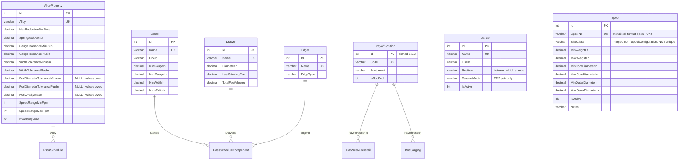
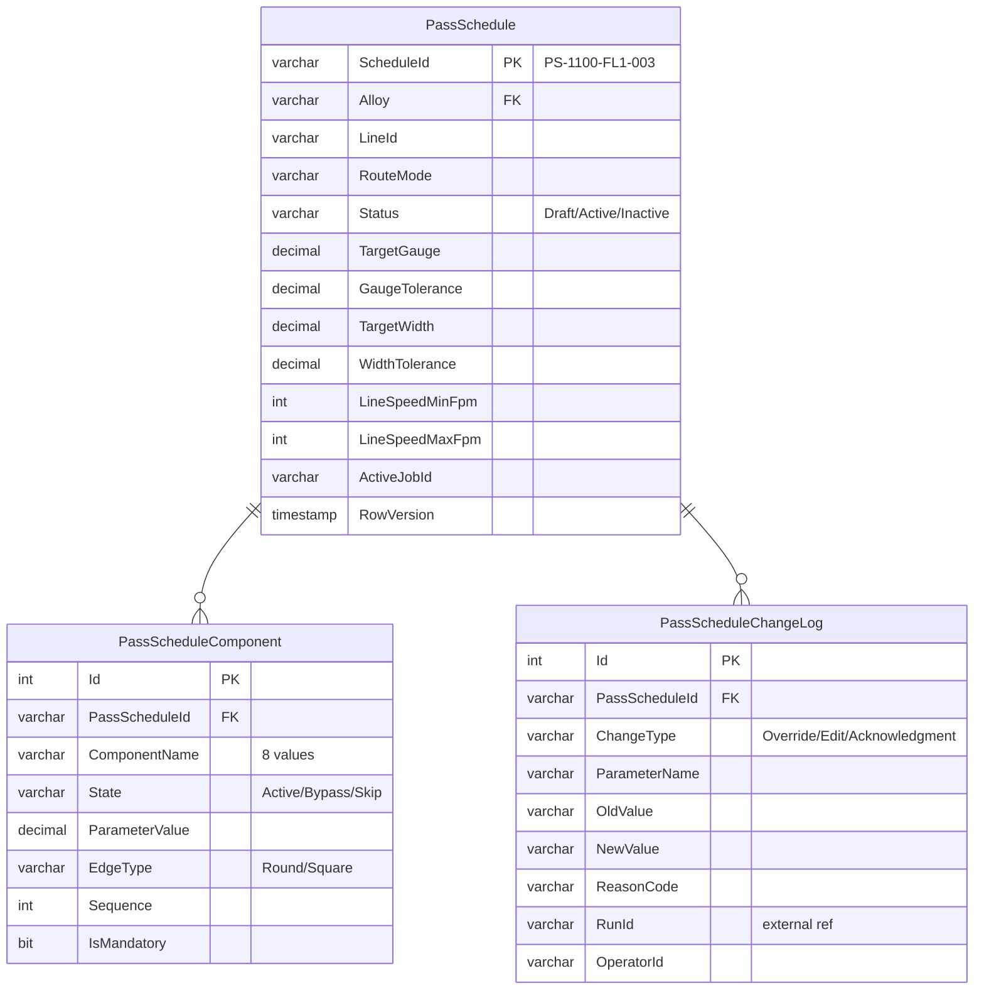
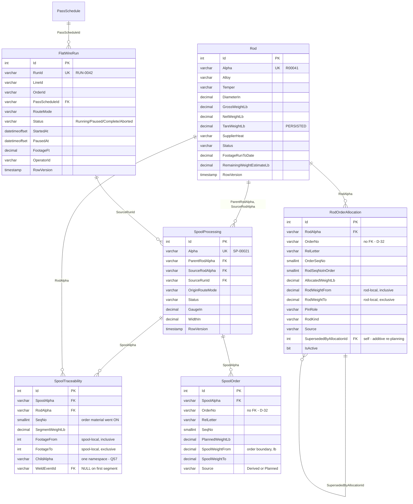
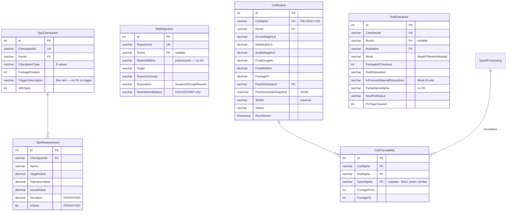

# Flat Wire Mill — Database Design and ER Model

**Project:** United Aluminum (UAL) — Flat Wire Mill Module
**Last Updated:** August 26, 2026 — **§6.2's baseline moved to 33 tables · 55 FKs · 70 index statements · 1 procedure · 1 trigger** when `Q89` added `UX_CoilTraceability_ChildAlpha` (+1 index statement, and three columns that move no count). ⚠ **This header lagged §6.2 by three days and is now level with it** — a header dated earlier than the section it introduces is how a reader concludes the baseline is older than it is. §6.2 remains the **only** site that defines these figures; the three permitted to restate them are `[DEP §4.2]`'s gate, `phase-01c`'s *Testing* and *Acceptance criteria*, and `FlatWire_DDL_RunAll.sql`'s banner. *(previously August 23, 2026 — **the `Spool` article registry is seeded at its real size: 45 rows, `SP-0001`…`SP-0045`** (44 active + `SP-0045` withdrawn), replacing four placeholder rows. **Four digits, not five, per `OQ-K`** — five would make a carrier number string-identical to a `SpoolProcessing.Alpha`. Seed-row total 210 → **251**; table/FK/index counts unchanged. `Q42` stays **open** on the format and on 30-vs-45.)* *(previously August 23, 2026 — **`Spool` and `SpoolCarrier` are SWAPPED (`Q60`).** The reusable stencilled article is now **`Spool`** in `01_Lookup`; the material record is now **`SpoolProcessing`** in `03_Materials`; `CarrierNo` → `SpoolNo`. ⚠ **A stale `Spool` reference is now *silently wrong*, not obviously stale** — see `[DBD §6.2a]`, the naming convention this closed. Object counts…)*
**Document Type:** Data model, ER diagrams, the counted object baseline
**Status:** Baselined for build
**Owner:** Architecture stream / DBA
**Audience:** Architects, DBA, .NET developers
**Shortcode:** `[DBD]`
**Part of:** `ProjectPlan/Database/` — index: [README.md](../README.md)

---

## 6. Data model

### 6.1 Target database and authority

The flat-wire-specific model lives in a **new standalone SQL Server database, `FlatWireDB`** (schema `dbo`), created by `FlatWire_DDL_00_Database.sql` with `READ_COMMITTED_SNAPSHOT ON` and `ALLOW_SNAPSHOT_ISOLATION ON`. **It is not an extension of `united_db`.** Any DDL header still reading `USE [united_db]` is stale.

> **The executable DDL is the authority for column-level types.** The per-domain markdown design docs (`Schema/FlatWireSchema_*.md`) declare many numeric columns as bare `decimal` — which SQL Server resolves to `decimal(18,0)`, **zero fraction**. Regenerating DDL from those docs would round weights and measurements to whole numbers. **Never regenerate the DDL from the markdown**; correct the markdown up to the DDL.

### 6.2 Table count — counted, not quoted

⚠ **The baseline moved again on 26 Aug 2026: it is now 33 tables · 55 FKs · 70 index statements · 1 procedure · 1 trigger, and **251** seed rows.** `Q89` added `UX_CoilTraceability_ChildAlpha` — **one index statement, and three columns which move no count** (`ChildAlpha`, `SourceSegmentAlpha`, `SharedWrittenAt` on `CoilTraceability`). ⛔ **No table and no FK was added:** a foreign key cannot point at a filtered unique index, which is why `SourceSegmentAlpha` has none. *(Previously, 23 Aug 2026: 33 · 55 · **69** · 1 · 1.)* `SpoolConfiguration` was **merged into `Spool`** (`Q60`) — it was a size class holding one meaningful row against 30–45 articles, so its six dimensional columns and its `Name` now sit on the article itself as `SizeClass` + `Min/MaxWeightLb` + `Min/MaxCoreDiameterIn` + `Min/MaxOuterDiameterIn`. **−1 table** (34 → 33), **−2 FKs** (57 → 55: `FK_SpoolProcessing_SpoolConfiguration` and `FK_Spool_SpoolConfiguration` both go, with the `SpoolTypeId` columns they constrained), **−2 seed rows** (212 → 210), and **index statements unchanged at 69** — nothing was indexed on `SpoolTypeId`. Verified on a teardown-and-deploy, idempotent on re-run, 0 empty tables. **The seed-row total moved 212 → 210 → 251**: −2 with the merge, then **+41 on 23 Aug 2026 when the `Spool` article registry was seeded at its real size** — 45 articles `SP-0001`…`SP-0045`, replacing four placeholder rows (44 active + `SP-0045` withdrawn, which is what keeps the `IsActive = 0` path covered). **Four digits, not five** — `OQ-K`: five would make a carrier number string-identical to a `SpoolProcessing.Alpha`, and the seeded material alphas `SP-00031`/`32`/`33` all fall inside 1–45. `Q42` remains open on the format and on 30-vs-45. **Table, FK, index, procedure and trigger counts are unchanged — seeding rows moves none of them.**

**Anything in this repository still saying 34 tables or 57 FKs as a *live* figure is stale** — statements dated before 23 Aug 2026 are audit trail and keep their numbers by design.

> **The two-row trap inside `SpoolConfiguration`, recorded because it nearly cost real data.** It was seeded with **two** rows and only one was a spool: `TKUP-1 Intermediate Spool` (the article — merged here) and **`Coreless Finish Coil`** — which is the FL2 **output**, and is *coreless*, so it has no article to merge into. Nothing referenced it (every seeded row used `SpoolTypeId = 1`), but it carried the **only recorded dimensional bounds for a finished coil**. Those numbers (100–1100 lb, core 8–16″, OD 20–36″) are re-homed as a comment on the `CoilOutput` block in `05_QualityOutput`, deliberately **not** as columns or constraints — nothing validated against them before, and making them enforceable under cover of a rename would be new behaviour. Read with `OI-66`.

**The previous baseline, for reference — MVP-1 built all 34 tables** — `D-31` (15 Aug 2026) moved the three `PassSchedule*` tables into MVP-1, so the "25 vs 28" split is retired and there is one figure, the 20 Aug 2026 multi-rod/multi-order spool work added four more (`Spool`, `SpoolTraceability`, `SpoolOrder`, `SpoolStaging`), and the 22 Aug 2026 rod ↔ order work added two more (`RodOrderAllocation`, `RodOrderConsumption`) — 28 → 32 → 34. **Verified on a live teardown-and-deploy, not counted from scripts: 34 tables · 57 FKs · 69 index statements · 1 procedure · 1 trigger** (22 Aug 2026), idempotent on re-run — a second `RunAll` reports no change at all. The 19 Aug script-counted note is **resolved**: `UX_FlatWireRun_ActiveLine` is now deployed and measured.

⚠ **Verified on LocalDB — 23 Aug 2026 — and here is exactly what that does and does not prove.**

**Proven, on a real teardown-and-rebuild — but against the PRE-MERGE scripts, so its counts are superseded:** `99_Teardown` → `RunAll` produced **34 tables · 57 FKs · 69 index statements · 1 procedure · 1 trigger**. ⚠ **That run predates the same day's `SpoolConfiguration` merge (`Q60`), so the table and FK figures no longer match this section** — the current scripts measure **33 tables · 55 FKs · 69 index statements · 1 procedure · 1 trigger**, counted statically by [`verify_schema_counts.py`](../Tools/verify_schema_counts.py).

> ⚠⚠ **THE DEPLOYED DATABASE IS TWO SCHEMA CHANGES BEHIND THE SCRIPTS — measured on the shared instance, 25 Aug 2026.** `FlatWireDB` on `DEVUAL-UADEV001\TEST1` reports **34 tables · 57 FKs · 1 procedure · 1 trigger**, and it still holds **`SpoolCarrier`** and **`SpoolConfiguration`** while having **no `SpoolProcessing` at all**. So it predates *both* the `Q60` `Spool`/`SpoolCarrier` swap and the `SpoolConfiguration` merge. ⚠ **A stale `Spool` there means the material record, which is the silently-wrong reading `[DBD §6.2a]` exists to prevent** — code written against that database will compile and do the wrong thing.
>
> **It is also effectively unseeded: 3 rows in total.** The **251** seed-row figure asserted above is therefore **still unverified by anything** — no tool covers it and the live database cannot confirm it.
>
> **A teardown and rebuild on the shared instance is owed before any build work reads this database**, and it is the only way to settle the 251. It is deliberately **not** run as part of a documentation sync: `99_Teardown` drops the database outright, so it needs an explicit decision from whoever owns that environment. What the run does still prove is unaffected by the merge: a second `RunAll` was clean, so the chain is **idempotent**; `FlatWire_SampleData_RunAll.sql` loaded every table non-empty *(the **212**-row total is likewise pre-merge; the seed set is now **251** rows across **33** tables, and that figure is **not** covered by any tool — confirm it on the re-deploy)*; and `RunAll_MVP2` ran **twice** cleanly, taking the procedure count to 2. `[DEP §4.2]`'s `V1`–`V5` all passed as written, and `sp_ShiftSummary` was correctly **absent** after the MVP-1 chain alone.

**NOT proven, and do not read "verified" as covering it:** the **one-transaction check-in model** (`[INT §8.0]`, `[ARC §10]`) needs `FlatWireDB` co-located with `united_db` / `proddb` / `SlitterDB` / `CommonDB` / `wiplogdb` on the shared instance, and **LocalDB has none of them** — so neither the atomicity nor the five cross-database procedures in [`Scripts/`](Scripts/) were exercised at all. That remains owed on `DEVUAL-UADEV001\TEST1`.

*(This also settles a disagreement: `RodOrderAllocation_SyncPlan.md` describes the 22 Aug counts as "measured on the shared instance", while this section said LocalDB. The 23 Aug measurement above is unambiguously LocalDB. The counts agree either way — they are topology-independent — but the atomicity claim rests on the shared-instance run, which has not been demonstrated here.)*

⚠ **The procedure count is 1 and did not move — and a partially-rebuilt database will tell you otherwise.** `sp_IngestRodFromCoils` (`FW-223`) is a `FlatWireDB` object but ships in [`Database/Scripts/30_FlatWireDB_Proc_sp_IngestRodFromCoils.sql`](Scripts/30_FlatWireDB_Proc_sp_IngestRodFromCoils.sql), **not** in `08_Programmability` and **not** in `RunAll`, because it reads `proddb` + `united_db`. Measured incrementally against a database that already had it, `sys.procedures` returns **2**; measured after a real teardown it returns **1**. **That is why this section says counted on a teardown-and-deploy and means it** — an incremental count silently includes whatever a previous session left behind. **The trigger count did not move** — `SpoolTraceability`'s non-overlap rule is a **domain** invariant in `FW-207`, not a trigger, because its footage columns are nullable and a trigger joining on `NULL` passes silently. That honours `G41`'s advice as well:

| Group | Script | Count | Scope | Tables |
|---|---|---|---|---|
| **Lookup / Reference** | `01_Lookup` | **7** | MVP-1 | `Stand` · `Drawer` · `Edger` · **`Dancer`** · `AlloyProperty` · `PayoffPosition` · **`Spool`** — *`SpoolConfiguration` merged into `Spool` on 23 Aug 2026 (`Q60`)* |
| **Schedule** | `02_Schedule` | **3** | **MVP-1** — `D-31` | `PassSchedule` · `PassScheduleComponent` · `PassScheduleChangeLog` |
| **Materials** | `03_Materials` | **6** | MVP-1 | `Rod` · `FlatWireRun` · `SpoolProcessing` · **`SpoolTraceability`** · **`SpoolOrder`** · **`RodOrderAllocation`** |
| **Runs** | `04_Runs` | **11** | MVP-1 | `FlatWireRunDetail` · `RodStaging` · `RodCheckin` · `SpoolCheckin` · **`SpoolStaging`** · `RunPauseEvent` · `WeldEvent` · `RollOverride` · `DieChangeEvent` · `RunReading` · **`RodOrderConsumption`** |
| **Quality / Output** | `05_QualityOutput` | **6** | MVP-1 | `SpcCheckpoint` · `SpcMeasurement` · `WipRejection` · `CoilOutput` · `CoilTraceability` · `RodCheckout` |
| | | **33** | **MVP-1 = the full design** | one figure since `D-31`; **34 → 33 on 23 Aug 2026** when `SpoolConfiguration` merged into `Spool`; `FlatWire_DDL_RunAll.sql` builds all of it |

### This is the only site that defines the object counts

**Tier 1 — the definition.** This section, and nothing else in the repository, states the
per-group breakdown or a total.

**Tier 2 — citations, unlimited, carrying no number.** Write *the counted object baseline
(`[DBD §6.2]`)* or *every table in the schema (`[DBD §6.2]`)*. **A bare count in prose is a
defect.** The one exception is a **stale-count blocklist** — text whose purpose is to be matched,
such as `CLAUDE.md`'s *"any '25 tables' text you find is stale"*. A blocklist is not a count and
cannot drift.

**Tier 3 — testable assertions. Exactly three sites, and this is the closed list:**

| Site | Why it may restate the figures |
|---|---|
| `[DEP §4.2]` `V1`–`V3` | a release manager runs SQL and compares the output |
| `phase-01c` — *Testing* and *Acceptance criteria* | it is a build gate |
| `FlatWire_DDL_RunAll.sql`'s header banner | it prints at deploy time |

Each of the three names itself as one of the three and points back here. **Nowhere else.** The
payoff: a future count change touches **four files, not thirty-five**. Before this rule, `25`,
`27`, `28`, `32`, `33 FKs`, `41 indexes` and `50 FKs` were all live simultaneously, and both
`[DEP §4.2]` and `phase-01c` were asserting figures that would **reject a correct deployment**.

**Two corrections landed here on 13 Aug 2026.** The Lookup row said **6** and omitted **`Dancer`**, which `01_Lookup` does create — the same omission recorded against the ER documentation and against the script's own header at the time; the audit that found it, `GapAnalysis.md`, was retired on 23 Aug 2026 and its history is in [`CHANGELOG.md`](../../../CHANGELOG.md). And the prose said "28 tables" above a table that summed to **27**, which is how a figure nobody could reproduce stayed in circulation.

**Other counts circulating in the repository — all superseded:** 20 → 21 → 22 → 24 → 27. The deployed-database check in `[DEP §4.2]` asserts the figures above, and is one of only three places permitted to. *(A callout here used to name `CLAUDE.md`'s "verified … 24 tables" as the most recent wrong figure. `CLAUDE.md` has stated the current baseline since 22 Aug 2026, so the callout had itself gone stale — which is the argument for Tier 2 in miniature.)*

`FlatWireRun` is created in `03_Materials`, **not** `04_Runs`, so that `SpoolProcessing.SourceRunId` can reference it.

### 6.2a Table naming convention — and the three senses of "spool"

**Added 23 Aug 2026, after `Spool` and `SpoolCarrier` were swapped.** The convention was never written
down, which is why `Spool` read as a lookup table to anyone who met it: half of `01_Lookup` is bare
equipment nouns (`Stand`, `Drawer`, `Edger`, `Dancer`) and half carries a role suffix
(`AlloyProperty`, `PayoffPosition`), so **nothing in a name tells you which
group a table is in.** It still does not. Read the DDL file number instead.

| Rule | |
|---|---|
| **Consumable material** is a bare singular noun in `03_Materials` | `Rod` |
| **Reusable articles and reference data** live in `01_Lookup` | `Stand` · `Drawer` · `Edger` · `Dancer` · `Spool` · `AlloyProperty` · `PayoffPosition` — **seven**, since `SpoolConfiguration` merged into `Spool` |
| **Material in process** carries the `…Processing` suffix | `SpoolProcessing` |
| **Events** are `<Subject><Event>` in `04_Runs` | `WeldEvent` · `DieChangeEvent` · `RunPauseEvent` |
| **The group is NOT encoded in the name** | Never infer it; open the numbered DDL file |

**Never renumber a section to close a gap** — `§6` opening the data model, and `§6.2a` rather than a
renumber here, are both deliberate. That is what keeps every `§n` citation resolving.

#### The word "spool" names three different things

This is the distinction the 23 Aug swap exists to make legible, and it is the one a reader is most
likely to get wrong:

| Table | Group | What it is | Identity |
|---|---|---|---|
| **`Spool`** | `01_Lookup` | the **reusable physical article** the wire is wound on — stencilled steel, 30 purchased with 15 more under decision, all one size | `SpoolNo`, the stencilled string (format open — **`Q42`**) |
| **`SpoolProcessing`** | `03_Materials` | the **material in process** — pre-drawn wire produced on FL1, consumed at FL2/FL3 | `Alpha`, `SP-#####` |
| ~~**`SpoolConfiguration`**~~ | — | the **size class** — min/max weight, core and outer diameter. **Merged into `Spool` on 23 Aug 2026 (`Q60`)**: it held one meaningful row against 30–45 articles, so the limits are now per article as `SizeClass` + the six `Min/Max` columns. The table no longer exists | *(was `Name`)* |

⚠ **The names were SWAPPED on 23 Aug 2026, and a stale reference is therefore *silently wrong* rather
than obviously stale.** Before that date `Spool` meant the material and `SpoolCarrier` meant the
article. A pre-23-Aug document saying `Spool.Alpha` means what is now `SpoolProcessing.Alpha`; the
table now called `Spool` has no `Alpha` at all. `CHANGELOG.md` entries written before that date keep
the old names by design. **The article outlives the material on it — do not conflate them.**

**Out of scope of the swap, deliberately:** the API surface (`GET /spools`, `POST /checkin/spool`,
`POST /spool/complete`), the `SpoolController` / `ISpoolRepository` code identifiers, every screen
label, and the `SP-#####` alpha format. Operators say "spool"; only the schema was renamed. The child
tables keep the `Spool…` prefix and the `SpoolAlpha` column name — `SpoolAlpha` is **unambiguous by
construction**, because the article has no alpha, it has a `SpoolNo`.

### 6.3 The `Rod` table decision — resolve it loudly

**`Rod` is retained as a `FlatWireDB`-local master with enforced rod-alpha foreign keys.** It mirrors the shared legacy `coils` record populated by the Receiving module.

This is the **"Hybrid foundation" decision (D-04)**, and it **reverses** the earlier *(now-dissolved)* `00-foundations.md` **decision 3** / `phase-01c` position that `Rod` should be **dropped**, with every rod-alpha reference becoming an unenforced cross-database logical link to `coils` (21–22 tables). **The DDL and the ER document are the later artifacts, they win, and they are the ones that were built and validated.**

Consequence: `SpoolProcessing.ParentRodAlpha`, `SpoolProcessing.SourceRodAlpha`, `RodStaging.RodAlpha`, `RodCheckin.RodAlpha`, `WeldEvent.OutgoingRodAlpha` / `IncomingRodAlpha`, `RollOverride.RodAlpha`, `DieChangeEvent.RodAlpha`, `CoilTraceability.RodAlpha` and `RodCheckout.RodAlpha` all carry **real, enforced FKs** to `Rod.Alpha`.

> **The stale side no longer exists (13 Aug 2026).** `00-foundations.md` decision 3 described dropping `Rod` and putting the schema at 21 tables; it was superseded by `D-04` long before, and the document itself was dissolved in the ProjectPlan restructure — its decisions now live in `[ARC §13.1]`, where **`D-04` states the retention and records that it reverses that earlier position**. `Development/Phases/phase-01c-database-foundation.md` was corrected on 11 Aug 2026 and now says `Rod` is retained. **Nothing in this repository still tells you to drop it.**
>
> ~~**The unresolved consequence** of keeping a mirror — how and when `Rod` is synchronised with `coils`, which side is master for each shared column, and what happens when they diverge — is **OI-42**.~~ ✅ **Closed 19 Aug 2026, and it was worse than this paragraph said:** nothing populated `Rod` in production at all, and with the rod-alpha FKs enforced the first check-in on a clean database would have failed. `FlatWireDB.dbo.sp_IngestRodFromCoils` projects the rod on the **first write that names it**; the column-ownership split is in `[INT §7.9]`, and the refresh touches shared-mastered columns only — `Status`, `FootageRunToDate` and `RemainingWeightEstimateLb` stay local. `FR-529`–`FR-532`, `FW-223`.

### 6.4 `FlatWireRun` is the hub

Every in-process event is a child of `FlatWireRun` via `RunId`. **The certificate genealogy has two
chains, not one**, because a coil reaches its rods by a different route depending on the line.

**Direct — FL1/FL3, where the coil's own rows name the rods:**

```
CoilOutput.CoilAlpha → CoilTraceability(FootageFrom..FootageTo) → Rod.Alpha → supplier heat / lot
```

**Via the spool — FL2, which is what `FR-333` actually asks for** (*"rod → spool → coil"*):

```
CoilOutput.CoilAlpha → CoilTraceability.SpoolAlpha → SpoolProcessing.Alpha
                     → SpoolTraceability(FootageFrom..FootageTo) → Rod.Alpha → supplier heat / lot
```

⚠ **The second chain is why `SpoolTraceability` exists, and why the footage on the two tables is
not the same quantity.** `CoilTraceability`'s footage is **run-cumulative**; `SpoolTraceability`'s is
**spool-local**. Joining them without re-anchoring gives a wrong answer that looks plausible — the
weight is the safe common currency, which is why `SegmentWeightLb` is the client's field.

Both chains land on `Rod`, which is the enforced-integrity payoff of `D-04` retaining `Rod` as a
local master: a welding-wire certificate that cannot resolve every source rod is not a certificate.

### 6.5 Table inventory — purpose and key columns

**Group 1 — Lookup / Reference**

| Table | Purpose | Key columns / constraints |
|---|---|---|
| `Stand` | Rolling-mill finishing stands | `Name` UNIQUE — position only (`FM1`, `FM2_S1`, `FM2_S2`, `FM2_S3`), `LineId` (NULL = shared), **`RollDiameterIn DECIMAL(5,3)` > 0** (FM1 12.000; FM2 S1 8.000, S2 6.000, S3 6.000), gauge and width ranges `DECIMAL(8,4)` with Min<Max checks. *(Aug 4 2026: FM2 is three stands and diameter moved out of the name into `RollDiameterIn`. The DDL comment on `MinWidthIn` says "strip width" — a source terminology slip; the column means flat wire width.)* |
| `Drawer` | Draw-box die configurations | `Name` UNIQUE, `DiameterIn DECIMAL(8,4)` > 0, optional feed-diameter range. **Die life (6 Aug 2026):** `LastGrindingFeet DECIMAL(10,2)` NOT NULL DEFAULT 0 — feet run *since* the last grind, not the reading at it — and `TotalFeetAllowed DECIMAL(10,2)` NULL, the scheduled-life threshold (NULL until **OQ-83** supplies values). **No `LastGrindingFeet ≤ TotalFeetAllowed` check** — *overdue* is a displayed state, not a data error |
| `Edger` | Edger tooling configurations | `EdgeType` CHECK IN (`Round`,`Square`), `ToolingSetNo` |
| `AlloyProperty` | Per-alloy process properties; the **local** parent for `PassSchedule.Alloy` | `Alloy` UNIQUE, `MaxReductionPerPass DECIMAL(5,3)`, `SpringbackFactor`, tolerance defaults, speed range, `IsWeldingWire`. **`LbPerFtFactor` must not be populated** (seeded NULL, "OQ-10 PENDING") and `DensityLbPerIn3` **duplicates `united_db..alloys.alloy_density`** — see §6.6 |
| `PayoffPosition` | Material input/output positions | **Pinned Ids, not IDENTITY**: 1 `Payoff1` (VPS, 9,000 lb, rod-fed), 2 `Payoff2` (VPS, 9,000 lb, rod-fed), 3 `TraversingTakeup`. Seeded **by the DDL itself**, because the `FlatWireRunDetail` FK depends on the rows existing |
| `Dancer` | Inter-stand tension/accumulator configurations | Per-line dancer setup; soft-deleted by `IsActive`. Referenced by `PassScheduleComponent`, which is **MVP-1** since `D-31` |
| `Spool` | **The physical article the wire is wound on**, and since 23 Aug 2026 **its own size limits** — the carrier outlives the material on it | `SpoolNo` is the **stencilled** identifier the operator types, not a drop-down: 30–45 carriers will not scroll on a shopfloor panel, while `SpoolConfiguration` holds **one** row because every carrier is the same size. `SpoolProcessing.Alpha` is the material's identity; this is the article's. ⚠ `SpoolNo` format is open — **`Q42`** |

> **Deliberate narrowing.** Rod-fed tables (`RodStaging`, `RodCheckin`, `RodCheckout`, `SpoolCheckin`) keep `CHECK (PayoffPosition IN (1,2))`. That is intentional — a rod bundle only ever mounts on a VPS bay. `TraversingTakeup` exists so FL2 can be represented without a fourth vocabulary, but **it currently has no UI anywhere** (**OI-80**).

**Group 2 — Schedule**

| Table | Purpose | Key columns / constraints |
|---|---|---|
| `PassSchedule` | The configuration header — the machine's brain | `ScheduleId VARCHAR(30)` **PK clustered, natural key** (`PS-1100-FL1-003`); `Alloy` FK → `AlloyProperty`; `LineId` CHECK; `RouteMode` CHECK; `Status` CHECK (`Draft`,`Active`,`Inactive`); target gauge/width + tolerances; input rod spec; speed range; `ActiveJobId`; audit quad; `ROWVERSION`. **`UX_PassSchedule_OneActivePerLineAlloy`** — filtered UNIQUE on `(LineId, Alloy) WHERE Status='Active'` |
| `PassScheduleComponent` | Per-component rows (renamed from `FlatLineSetup`) | `ComponentName` CHECK over the eight names; **`State` CHECK IN (`Active`,`Bypass`,`Skip`) — three values, never a boolean**; `ParameterValue` must be NULL unless `State='Active'`; `EdgeType` required when an `EdgeSet` component is Active; `Sequence` UNIQUE with the schedule; `IsMandatory`; FKs to `Stand`/`Drawer`/`Edger`. **`CK_PSC_FM1NotBypassable`** — `FM1` must be `Active` |
| `PassScheduleChangeLog` | Immutable audit trail | `ChangeType` CHECK IN (`Override`,`Edit`,`Acknowledgment`); parameter, old→new, reason code and notes, `RunId` context, operator, server timestamp. Backs the DB9 Change History tabs |

**Group 3 — Materials**

| Table | Purpose | Key columns / constraints |
|---|---|---|
| `Rod` | Wire rod receiving and lifecycle (mirrors `coils`) | `Alpha` UNIQUE — the scan key; alloy/temper; `DiameterIn` > 0; gross/net weight; **`TareWeightLb` PERSISTED computed**; `SupplierHeat` — the far end of the cert chain; `Status` CHECK over the six material statuses; **`FootageRunToDate`** and **`RemainingWeightEstimateLb`** — the carry-forward columns; `ROWVERSION`. *(`StagedPayoffPosition` and `IsWelded` were removed 29 Jul 2026 — a nullable column pair cannot express "one rod per payoff bay")* |
| `FlatWireRun` | **The run header — the hub** | `RunId VARCHAR(20)` UNIQUE (`RUN-0042`); `LineId`; `OrderId`; `PassScheduleId` FK; `Alloy` denormalised; `RouteMode`; `Status` CHECK (`Running`,`Paused`,`Complete`,`Aborted`); `StartedAt` / `PausedAt` / `CompletedAt`; **`FootageFt DECIMAL(10,2)` updated live from the PLC**; `OperatorId`; `ROWVERSION` |
| `SpoolProcessing` | Pre-drawn intermediate spools | `Alpha` UNIQUE (`SP-00021`); `SpoolId` FK → `Spool` (nullable); **`ParentRodAlpha`** and **`SourceRodAlpha`** FKs → `Rod.Alpha`; `SourceRunId` FK → `FlatWireRun`; `OriginRouteMode` — FL2 rejects a Standalone schedule on Hybrid-origin material; `Status`; gauge/width set at FL2/FL3 check-in; `ROWVERSION` |
| `SpoolTraceability` | **Which rod produced which feet of a spool** — the spool-side half of the welding-wire genealogy (`FR-333`, `G42`) | Footage is **spool-local**, not run-cumulative; ranges are half-open `[From, To)`; **weight is primary and footage is ours**. `ChildAlpha` names the segment, minted through `CommonDB.dbo.GenerateCoilAlpha` in **one namespace** with FL2 coil identities (`Q57`). ⚠ **No non-overlap trigger, deliberately** — the footage columns are nullable and a trigger joining on `NULL` passes silently, so the invariant lives in the domain model (`FW-207`) |
| `SpoolOrder` | The orders a spool's material is committed to | **Derived, not allocated** — resolved locally from `RodOrderAllocation` since 22 Aug 2026 (`G48`), superseding a `planning_routings` workaround written because the rod↔order table did not exist. `SpoolWeightFrom`/`To` carry the order boundary, half-open, **in pounds**. No FK on `OrderNo` (**`D-32`**) |
| `RodOrderAllocation` | **The plan: which orders a rod is committed to, and in what sequence** | The split point is held in **pounds, not feet** — weight is conserved through drawing and rolling and footage is not (the same 900 lb is ≈ 11,100 ft at FL1 gauge and ≈ 76,300 ft at FL2). **The split point is not a column:** the outgoing row's `RodWeightTo` *is* the incoming row's `RodWeightFrom`, and `CK_..._WeightRange` asserts `To − From = AllocatedWeightLb` as a single-row check. `PinRole` (`Sole`/`PinnedFirst`/`Free`/`PinnedLast`/`PinnedBoth`) reads off the rod. **Re-planning is additive** via `SupersededByAllocationId` — rows are never mutated, so re-planning cannot retro-change what the floor was told |

**Group 4 — Runs**

| Table | Purpose | Key columns / constraints |
|---|---|---|
| `FlatWireRunDetail` | Per-stop detail (renamed from `FlatLineProcessing`) | `RunId` FK; `StopNo` / `SequenceNo`; **`PlanId` / `CoilOrderPlanId` are external references with no local parent**; `PayoffPositionId` **FK → `PayoffPosition.Id`**; footage; on-gauge weight; per-stop targets; start/exit gauge; output OD/ID |
| `RodStaging` | Pre-check-in — **the most heavily constrained table in the schema.** FL1 and FL3 only | See §6.7 |
| `RodCheckin` | Rod check-in record | `RunId`/`RodAlpha`/`PassScheduleId` FKs; measured diameter; verified weights; `MmsId` + `MmsStatus`; `PlcTagsPushed`; **four** inspection columns NOT NULL including `InspectionConnectorTag`; **`SpcM1In` / `SpcM2In` NOT NULL** with `SpcOvalityIn` PERSISTED computed as `ABS(M1−M2)` |
| `SpoolCheckin` | Mirrors `RodCheckin` for the spool feed | `LineId` CHECK IN (`FL2`,`FL3`); `SpoolAlpha` FK; `GaugeIn`/`WidthIn` NOT NULL (operator-measured); single `InspectionSurface` column |
| `SpoolStaging` | **The FL2 pre-check-in queue** | `QueuePosition` is `DECIMAL(9,3)` **and deliberately not UNIQUE** — a drag-and-drop swap creates a transient duplicate that a UNIQUE index rejects, and the failure does not surface until the *second* reorder; the decimal lets a row insert *between* two others. No payoff position (FL2 has one payoff) and no inspection columns (inspected as rod at FL1). **No station claim** — entirely `FlatWireDB`-local, which is what keeps the queue unbounded |
| `RunPauseEvent` | Pause / resume | `FootageAtPause`; reason code + category; **`Notes` required when `ReasonCategory='Other'`**; `ResumedAt` NULL = still open; `PauseDurationSeconds` computed; `Outcome` CHECK IN (`ResumeRun`,`LogWipRejection`,`CheckOutRod`,`ContinuePause`) |
| `WeldEvent` | The induction weld join | `WeldEventId` UNIQUE; **both** rod alphas FK → `Rod.Alpha`; **both** payoff positions with `CK_WeldEvent_PayoffDiff` — a bay cannot be welded to itself; `FootagePosition` from the encoder; `WeldType` CHECK (`InductionWeld`,`LaserWeld` — **induction is the only live type**); `WeldQuality`; **fail reason mandatory when quality is `Fail`**; server-side timestamp |
| `RollOverride` | Run-level roll-gap override | `OverrideId` UNIQUE; `RunId`/`RodAlpha` FKs; component name; old/new value with **`Delta` PERSISTED computed**; reason code CHECK over eight values; measured gauge/width; `PlcTagWritten` |
| `DieChangeEvent` | Die change | `DieChangeId` UNIQUE; `DiePosition` CHECK (`DB1`,`DB2`); old/new die size; **`ReasonCode` CHECK carries eight values** because it merges the screen's five with an earlier API list — **build the UI against the five** (`PlannedLife`, `GaugeDrift`, `DieFailure`, `SizeChange`, `Other`); `LinkedOverrideId` FK → `RollOverride`; `SpcCheckpointRequired` default 1 |
| `RunReading` | The sampled gauge/width/speed profile | `RunId` FK; `FootageFt`; **`GaugeIn` NULL for the FL2 standalone live feed**; `WidthIn`; `SpeedFpm`; `InSpec`; `ReadingTs`. **Not a per-tick historian** — writes are sampled/decimated. Indexed `(RunId, FootageFt)`. **Retention and rollup policy undefined — OI-17** |
| `RodOrderConsumption` | **The actual: what a check-in really consumed, per order** | **One check-in, N consumption rows** — which *is* the client's rule 7. `Station`, not `LineId`, is the exclusivity key (`G21`). **Two weight latches**, and the overrun between them is captured rather than discarded. The row states its own conversion (`LbPerFtUsed` / `ConversionBasis` / `ConverterVersion`) so a later formula change never retro-changes history. `RodCheckoutId` is set **only** when closure is `RodAbandoned` (Mode B). Immutable once closed |

**Group 5 — Quality / Output**

| Table | Purpose | Key columns / constraints |
|---|---|---|
| `SpcCheckpoint` | Checkpoint header | `CheckpointId` UNIQUE; `RunId` FK; **`CheckpointType` CHECK over five values including `RollAdjustTrigger`**; `FootagePosition` captured when the checkpoint **opens**; `TriggerDescription` free text; `AllInSpec` tri-state |
| `SpcMeasurement` | Per-measurement rows | `CheckpointId` FK; `Name`; target / tolerance / actual; **`Deviation` and `InSpec` both PERSISTED computed** |
| `WipRejection` | WIP rejection | `RejectionId` UNIQUE; **`RunId` NULLABLE** for pre-run rejections; **`MaterialAlpha` is polymorphic (rod *or* spool) with no FK**; stage; group CHECK over five values; disposition CHECK (`Suspend`,`Scrap`,`Rework`); `NewMaterialStatus` CHECK (`HOLD`,`SCRAP`) |
| `CoilOutput` | The finished coil | `CoilAlpha` UNIQUE; `RunId` FK; gross/net weight with `NetWeightOverrideLb` and `ScaleWeightLb`; final gauge/width; footage > 0; `PassScheduleId` FK + **`PassScheduleSnapshot NVARCHAR(MAX)` JSON**; **`SkidId` is an external reference**; `SkidStatus`; `StagingLocation`; `Status` CHECK (`COMPLETE`,`HOLD`,`SCRAP`); `ROWVERSION` |
| `CoilTraceability` | **The genealogy chain** | `CoilAlpha` FK → `CoilOutput`; `RodAlpha` FK → `Rod`; **`SpoolAlpha` FK → `SpoolProcessing`, nullable — NULL on a rod-fed run, filtered index**; `FootageFrom` < `FootageTo`. **Non-overlap enforced by trigger** `trg_CoilTraceability_NoOverlap`, because SQL Server has no exclusion constraint. Ranges are half-open `[From, To)` |
| `RodCheckout` | All three checkout modes | `CheckoutId` UNIQUE; **`RunId` NULLABLE** for Modes P and A; `Mode` CHECK (`ModeP`,`ModeA`,`ModeB`); footage; reason; `RodDisposition` CHECK over five values; `InProcessMaterialDisposition` **Mode B only**; `PartialSpoolAlpha` **no FK**; `NewRodStatus` CHECK; `PlcTagsCleared`. Per-mode rules enforced by `CK_RodCheckout_ModeP` and `CK_RodCheckout_ModeB` |

### 6.6 Weight derivation — and why `AlloyProperty` must not own density

**There is no single footage-to-weight factor.** A scalar lb/ft is valid for exactly one gauge × width, and the line runs 0.110″ × 0.625″ on FL1 and finishes to 0.0160″ × 0.625″ on FL2 — a **7× difference in cross-section**. Compute it from density at runtime:

```
lb/ft  =  A(in²) × 12(in/ft) × ρ(lb/in³)

Square edge:  A = t × w
Round edge:   A = t·w − t²(1 − π/4)  =  t·w − 0.2146·t²
```

Round edge is a rectangle with semicircular ends, so it holds **less** metal than the bounding rectangle: **−3.8 %** at 0.110″ × 0.625″, **−3.1 %** at 0.125″ × 0.875″, but only **−0.6 %** at 0.0160″ × 0.625″. The correction matters most on thick-gauge FL1 spools — exactly where the 2,000 lb target sits.

The reusable constant is **`k = 12ρ`**, so `lb/ft = A × k`:

| Alloy | ρ (lb/in³) | **k (lb per in²·ft)** | 0.110″ × 0.625″ square / round | 0.0160″ × 0.625″ |
|---|---|---|---|---|
| 1100 | 0.0980 | **1.1760** | 0.0809 / 0.0778 | 0.0118 / 0.0117 |
| 1350 | 0.0974 | **1.1688** | 0.0804 / 0.0773 | 0.0117 / 0.0116 |
| 3003 | 0.0990 | **1.1880** | 0.0817 / 0.0786 | 0.0119 / 0.0118 |
| 5052 | 0.0971 | **1.1652** | 0.0801 / 0.0770 | 0.0117 / 0.0116 |
| 6061 | 0.0975 | **1.1700** | 0.0804 / 0.0774 | 0.0117 / 0.0116 |

**Density and draw reduction already exist upstream — read across, do not duplicate.**

| `AlloyProperty` column | Already in `united_db..alloys` | Verdict |
|---|---|---|
| `DensityLbPerIn3` | **`alloy_density`** `[float] NULL` | Exact duplicate — **read across** |
| `MaxReductionPerPass` | **`Draw_max_reduction`** / `Draw_min_reduction` | **The generator's core input.** Read across |
| *(machine capability)* | `alloy_max_gauge` | Overlaps the `Stand` gauge range — reconcile |
| `IsActive` | `alloy_status`, `IsActive` | Two flags already exist upstream |

**The unit is verified as lb/in³**, not g/cm³ — `PlanningDB..Planning_GetorderminPIW` computes `((alloy_density × PI() × width) / 4) × (OD² − ID²) / width`, which reduces to `ρ × π/4 × (OD² − ID²)` and yields pounds per inch of width only if ρ is lb/in³. So `k = 12ρ` holds with **no unit conversion**.

**Access pattern — follow the existing convention.** `united_db..alloys` is already surfaced as a view named **`Alloys`** in six consuming databases (CommonDB, MillsDB, PackingDB, AccountingDB, SlitterDB, PlanningDB). `FlatWireDB` should do the same: create a **`FlatWireDB..Alloys` view** over `united_db..alloys`, which gives one place to absorb three real mismatches rather than repeating them at every call site:

| Mismatch | Detail | Handle in the view |
|---|---|---|
| Type | `alloy_density` is `[float]`; `AlloyProperty.DensityLbPerIn3` is `DECIMAL(10,6)`; consuming procedures variously declare it `DECIMAL(8,5)` or `FLOAT` | `CAST` once |
| Nullability | `united_db..alloys.alloy_density` is **NULLABLE**; `proddb..alloys.alloy_density` is **NOT NULL** — which is authoritative is unstated | Null guard + a decision (**OI-93**) |
| Join width | `alloys.alloy` is `varchar(50)`; `AlloyProperty.Alloy` and `PassSchedule.Alloy` are `varchar(10)` | Project a narrowed column, or key on `alloy_idx` |

> **Tolerance caveat.** `GaugeToleranceMinusIn`/`GaugeTolerancePlusIn` (renamed from `GaugeToleranceDefault` on 1 Aug 2026) are seeded ±0.0020″ for 1100. At the FL1 gauge of 0.110″ that is ±1.8 %; at the FL2 finished gauge of 0.0160″ it is **±12.5 %**, which is meaningless. **Tolerance belongs on `PassSchedule`**, which is where the DDL already puts it — treat the alloy columns strictly as seed defaults for a new schedule, **never as runtime limits**.
>
> **And the tolerance stack breaks the ±2 % variance rule.** Deriving weight from *target* dimensions at 0.110 ± 0.002 and 0.625 ± 0.005 gives a worst case of **±2.6 %** on weight — larger than the ±2 % scale-versus-calculated tolerance in `[REQ]` `FR-153`, so a perfectly in-spec coil trips the supervisor override for no reason. **Recommendation: integrate over `RunReading`** — `weight = Σᵢ A(gaugeᵢ, widthᵢ) × k × Δfootageᵢ` — which removes the tolerance error and uses data the system already persists. Fall back to pass-schedule targets only for **FL2 standalone**, which broadcasts `null`. Basis choice is **OI-45**.
>
> **RESOLVED in shape, not in data (client, 30 Jul 2026 — OQ-22).** ~~There is no rod-diameter tolerance column anywhere in the schema.~~ `AlloyProperty` now carries **four min/max pairs** — gauge, width, rod diameter and an ovality maximum — applied at **both** pre-check-in and check-in, modelled as offsets about nominal so an asymmetric band is expressible. Gauge and width carry their previously seeded symmetric values into both columns; **rod diameter and ovality are NULL because the values are owed by e-mail**, so `CHK007` still cannot fire. The ovality constant hard-coded at `0.003"` in the April check-in implementation plan (deleted 13 Aug 2026) moves here too — **it is per-alloy reference data, not a constant**. Original note follows. ~~`GaugeToleranceDefault` and `WidthToleranceDefault` are flat-wire *output* dimensions. Likely resolution: add `AlloyProperty.RodDiameterToleranceDefault DECIMAL(8,4)`. **OI-07.**

**Prior art worth reading before writing `CoilCompletionService`:** `MillsDB..RollCoil_GetTotalRolledWeightinlastMillRun` already derives total rolled weight for a mill run from `alloy_density`. That is structurally the same problem, and it may already encode UA's convention for tail loss and net-versus-gross.

### 6.7 `RodStaging` — the constraint set that carries business meaning

Two filtered unique indexes are the reason this is a table rather than columns on `Rod`: they make the bay-occupancy invariant **impossible to violate, including under concurrent staging from two clients**.

| Constraint | Rule |
|---|---|
| `CK_RodStaging_Override` | The credential stamp is **all-or-nothing**, keyed on `OutOfSequenceOverride` alone |
| `CK_RodStaging_OutOfSeq` | `ExpectedRodAlpha` present exactly when `OutOfSequenceOverride = 1` |
| `CK_RodStaging_UnstageKind` | `UnstageKind` is NULL or one of `PreCheckOut` / `WipRejection` |
| `CK_RodStaging_RejectLink` | `WipRejectionId` present exactly when `UnstageKind = 'WipRejection'`. Written with `ISNULL(...)`, because a bare comparison is **UNKNOWN** while the column is NULL and a CHECK constraint *accepts* UNKNOWN |
| ~~`CK_RodStaging_OffSched`~~ | **Dropped 1 Aug 2026** with `OffScheduleOverride` / `ScheduledLineId` — a rod booked on the other rod line now triggers an **automatic station switch**, not an override (OQ-24) |
| ~~`CK_RodStaging_OffSchedLine`~~ | **Dropped 1 Aug 2026** |
| `CK_RodStaging_OutOfSeqRod` | `ExpectedRodAlpha <> RodAlpha` |
| `CK_RodStaging_Welded` | `WeldedAt` / `WeldedBy` both set exactly when `IsWelded = 1` |
| `CK_RodStaging_Unstaged` | The three un-stage columns all set exactly when `Status='Unstaged'` |
| `CK_RodStaging_CheckedIn` | `CheckedInAt` / `RodCheckinId` both set exactly when `Status='CheckedIn'` |
| **`UX_RodStaging_Bay`** | filtered UNIQUE `(LineId, PayoffPosition) WHERE Status='Staged'` — **one rod per payoff bay** |
| **`UX_RodStaging_RodActive`** | filtered UNIQUE `(RodAlpha) WHERE Status='Staged'` — **one bay per rod** |

Notable columns: `RodSeqno` (**actual** processing sequence, assigned server-side, monotonic per line) and `PlannedSeqno` (**planned** sequence, snapshotted at staging, with **deliberately no constraint relating the two** — a difference is the normal case); three inspection columns (**three items — do not add a connector-tag item**); `FootageRunToDateAtStaging` (**> 0 forces the carry-forward path**); the override credential stamp (**the PIN is never stored**).

> Any client writing to this table needs `QUOTED_IDENTIFIER ON`.

### 6.8 Indexes and programmability

**Filtered UNIQUE — business rules enforced as indexes:**

| Index | Rule |
|---|---|
| `UX_PassSchedule_OneActivePerLineAlloy` | One `Active` `PassSchedule` per `(LineId, Alloy)` |
| `UX_RodStaging_Bay` | One `Staged` rod per `(LineId, PayoffPosition)` |
| `UX_RodStaging_RodActive` | One `Staged` bay per `RodAlpha` |
| `UX_FlatWireRun_ActiveLine` | One active run per line — **previously enforced nowhere** (`FW-222`, 19 Aug 2026) |
| `UX_CoilOutput_CoilNo` | One row per shared coil identity. **Filtered because `CoilNo` is nullable by design** — the value does not exist until the cross-database mint returns, which is also why it is the retry contract (`FR-509`) |
| `UX_SpoolStaging_LiveSpool` | One queued spool per `(LineId, SpoolAlpha)`. Filtered on `Status='Queued'` **so a spool can re-enter the queue after check-in** — which two orders on one spool requires |
| `UX_SpoolTraceability_ChildAlpha` | One row per segment alpha, filtered `WHERE ChildAlpha IS NOT NULL` |
| `UX_RodOrderAllocation_Active` | One live allocation per `(RodAlpha, OrderNo, RelLetter)`, filtered `WHERE IsActive = 1` — which is what makes re-planning **additive**: the superseded row stays, with `IsActive = 0` |
| `UX_RodOrderAllocation_OrderRodSeq` | One rod per position within an order, filtered `WHERE IsActive = 1` |
| `UX_RodOrderConsumption_Station` | **At most one order in progress per payoff station**, filtered `WHERE State IN ('InProgress','ThresholdReached')` — the client's rule 2, enforced as an index rather than an application check (`G21`, `ORD003`) |
| `UX_RodOrderConsumption_ActualSeq` | One rod per actual position within an order. **Not filtered** — the constraint holds for closed rows too |

**Eleven, not three.** This table listed only the first three until 23 Aug 2026, which is how
`UX_FlatWireRun_ActiveLine` and `UX_CoilOutput_CoilNo` could be added in August without appearing
in the design document at all. Two of the eleven are **not** filtered
(`UX_RodOrderConsumption_ActualSeq` and, despite the section heading, that is the point of naming
them here); the rest carry a `WHERE` clause, and in every case the filter *is* the business rule —
which is why they belong in this section rather than in §6.10's query patterns.

**Index count.** **70 index statements, all in `FlatWire_DDL_07_Indexes.sql`** — **58** `CREATE NONCLUSTERED INDEX` plus **12** `CREATE UNIQUE NONCLUSTERED INDEX`, several of the latter filtered. *(69 / 11 until 26 Aug 2026, when `Q89` added `UX_CoilTraceability_ChildAlpha`.)* `07b`, which held the six schedule-group statements, was folded into `07` on 23 Aug 2026, so there is no second index script and no split-count to maintain.

The twelve unique indexes are `UX_CoilTraceability_ChildAlpha` (26 Aug 2026, `Q89` — one shared identity per coil × source rod; **filtered**, because the value does not exist until the cross-database mint returns), `UX_RodStaging_Bay`, `UX_RodStaging_RodActive`, `UX_FlatWireRun_ActiveLine` (19 Aug 2026, `FW-222` — single active run per line, previously enforced nowhere), `UX_CoilOutput_CoilNo` (18 Aug 2026, `FR-509`; **renamed from `UX_CoilOutput_SharedCoilNo`** on 22 Aug 2026 with the column), `UX_PassSchedule_OneActivePerLineAlloy`, `UX_SpoolStaging_LiveSpool` — filtered on `Status='Queued'` **so a spool can re-enter the queue after check-in**, which two orders on one spool requires — `UX_SpoolTraceability_ChildAlpha`, `UX_RodOrderAllocation_Active`, `UX_RodOrderAllocation_OrderRodSeq`, `UX_RodOrderConsumption_Station` and `UX_RodOrderConsumption_ActualSeq`.

⚠ **This paragraph previously said “40 non-clustered plus 4 filtered UNIQUE” against a stated total of 63** — 44 ≠ 63 — and named only four of the unique indexes, one of them by its pre-rename name. The breakdown is now derived; re-derive it rather than editing the numbers.

> ### `PP-01` — why a deployed database reports more indexes than the scripts create
>
> **The count is 69 `CREATE … INDEX` statements — `[DBD §6.2]`.** This box is not a count; it
> exists to explain why four honest people measuring the same schema got four different answers,
> because that confusion recurs every time someone verifies a deployment.
>
> **A *deployed* database reports far more non-clustered indexes than script `07` creates**, because
> every `PRIMARY KEY` and `UNIQUE` constraint builds its own backing index. **69 is a count of DDL
> statements, not of `sys.indexes` rows.** `[DEP §4.2]`'s `V3` check excludes
> `is_primary_key = 1` and `is_unique_constraint = 1` for exactly this reason — that filter is what
> makes the deployed count comparable to the script count.
>
> The figures **41**, **44**, **46**, **47**, **49**, **57** and **63** have all circulated. All are
> superseded, and the history is in [`CHANGELOG.md`](../../../CHANGELOG.md) rather than here — a
> table of dated wrong answers in the authoritative document is how a reader picks the wrong one.
> Until 23 Aug 2026 this box stamped **41** as “✅ Authoritative for MVP-1” two paragraphs after
> §6.8 stated 69.

Coverage: every FK / `RunId` join column and the hot query paths — `PassSchedule(LineId,Alloy,Status)`; filtered indexes on `PassScheduleComponent.StandId`/`DrawerId`/`EdgerId`; `PassScheduleChangeLog(PassScheduleId, Timestamp DESC)`; `FlatWireRun(LineId,Status)`, `(Status)`, `(PassScheduleId)`, `(OrderId)`; `Spool(SourceRunId)`, `(ParentRodAlpha)`, `(SourceRodAlpha)`, `(Status)`; `RodStaging(LineId,Status)`, `(RodAlpha)`; `RodCheckin(RunId)`, `(RodAlpha)`, `(LineId,PayoffPosition)`, `(PassScheduleId)`; `(RunId)` on every event table; `WeldEvent(OutgoingRodAlpha)` and `(IncomingRodAlpha)`; **`RunReading(RunId, FootageFt)`** — the gauge-trace path; `SpcCheckpoint(RunId, CheckpointType)`; `WipRejection(RunId)`, `(MaterialAlpha)`; `CoilOutput(RunId)`, `(OrderId)`, filtered `(SkidId)` and `(PassScheduleId)`; `CoilTraceability(CoilAlpha, FootageFrom, FootageTo)` and `(RodAlpha)`; `RodCheckout(RunId)`, `(RodAlpha)`.

**Programmability (`08_Programmability`):**

| Object | Purpose |
|---|---|
| `trg_CoilTraceability_NoOverlap` | AFTER INSERT/UPDATE trigger rejecting overlapping footage ranges within one coil |
| `sp_GetGaugeTrace(@RunId, @FromFt, @ToFt, @Resolution)` | Paged, decimated gauge/width trace **plus the weld markers in the window as a second result set**. Backs DB3 and the Gauge-Trace report |
| `sp_ShiftSummary(@LineId, @ShiftStart, @ShiftEnd)` | Per-line shift aggregation: coils completed, net weight, footage, WIP rejections, SPC checkpoints, checkpoints in spec, pause seconds |

`sp_GetGaugeTrace` carries a least-privilege `GRANT EXECUTE` to `ua_user` in `08`. `sp_ShiftSummary` is MVP-2's, in `09_Programmability_MVP2`, which owns its own grant — `08` deliberately does not create, drop or grant on it. `sp_IngestRodFromCoils` is granted in [`Scripts/20_FlatWire_Grants.sql`](Scripts/20_FlatWire_Grants.sql).

**Production-readiness hardening:** `ROWVERSION` on `PassSchedule`, `Rod`, `FlatWireRun`, `SpoolProcessing`, `CoilOutput`; PERSISTED computed columns for `Rod.TareWeightLb`, `RodCheckin.SpcOvalityIn`, `RollOverride.Delta`, `SpcMeasurement.Deviation` and `InSpec`, plus computed `RunPauseEvent.PauseDurationSeconds`. **Every object-creating script sets `QUOTED_IDENTIFIER ON` and `ANSI_NULLS ON`** — required by the PERSISTED computed columns and the filtered indexes.

### 6.9 Concepts the requirements name that the schema does not carry

Each is an open issue, listed here so nobody assumes a table exists.

| Concept | Required by | Schema state |
|---|---|---|
| **Die master / inventory** | `[REQ]` `FR-233`, `FR-254`, all of §5.10 | **No table.** Only the `Drawer` lookup and `DieChangeEvent`. Die Change cannot validate a scan against an inventory that does not exist — this is why Phase 6 depends on Phase 13 (**OI-41**). **Narrowed 6 Aug 2026, not closed:** `Drawer` now carries `LastGrindingFeet` / `TotalFeetAllowed`, so the counter and threshold have somewhere to live — but against a die **size**, not a physical tool, so registration, condition, status and disposition history are all still missing |
| **Alert lifecycle** | `FR-422`–`FR-428`, hub `AlertRaised`/`AlertCleared` | **No table.** Alerts cannot survive a restart; acknowledgements cannot be audited — **OI-28** |
| **MMS ID format and lifecycle** | `FR-013` | Columns exist on `RodCheckin` / `SpoolCheckin`; **no format, no generator** — **OI-03** |
| **Lot number** | `GET /coil/{alpha}/label`, `FR-336` | **No column, no generator** — **OI-24** |
| **Rework return stage** | `FR-297` | **No column**, and `NewMaterialStatus` admits only `HOLD`/`SCRAP` — **OI-22** |
| **SPC-HOLD** | `FR-187`, `FR-188` | No column; `Status='HOLD'` is the closest fit — **OI-23** |
| **Wire break record** | `FR-280`–`FR-282` | **No table** — **OI-13** |
| **Scrap box entity** | `FR-066`, `FR-271` | `ScrapBoxRef` is a free `varchar`; **no lookup table** — **OI-15** |
| **Rod bundle / receiving-lot header** | "rod bundle receiving" workflow | One physical unit per row, no parent grouping — **OI-29** |
| **Gap-free `R#####` sequence** | Rod alpha "no gaps per lot" | UNIQUE `varchar` only — no SEQUENCE or numbering table; app-enforced — **OI-30** |
| **Unplanned component bypass** | OQ-63, a **decided** requirement | **No table, endpoint, screen or story** — **OI-43** |
| **Legacy data migration** for `FlatLineSetup` / `FlatLineProcessing` | Both are renamed into the new model | No mapping, migration, validation or drop-criteria deliverable — **OI-31** (gap **G8**) |

---

---

> **Absorbed from `Schema/SQL/FlatWire_ERDiagram_Documentation.md` on 13 Aug 2026**, which was deleted in the same
> pass. That file was the designated "read this first" as-built description, and the retired `GapAnalysis.md` audit found it
> **wrong in six ways** — it documented the three MVP-2 `PassSchedule*` tables as built here, listed a `DDL_02` and
> a `FlatWire_SampleData_Schedule.sql` that are not in the folder, listed `sp_ShiftSummary` and
> `UX_PassSchedule_OneActivePerLineAlloy` which do not exist, claimed "40 non-clustered + 1 filtered-unique", and
> its header said 28 tables while its footer said 27. **Everything it carried that §6 and §7 did not already say
> better was brought across and corrected on the way**; the rest was dropped rather than reconciled, because §6 and
> §7 were the later and more accurate artifacts.
>
> **The operational procedure is not here.** `[DEP §4.2]` owns how the schema is deployed and verified; §6.11 below
> is the *script* order and what each file contains.


> **Checked against the DDL and found sound - do not re-raise these.** Migrated from the retired
> `GapAnalysis.md` on 23 Aug 2026, because the value of that table was stopping the same seven
> questions being asked again:
>
> - **The rod-alpha FK chain is enforced end to end.** `D-04`'s local `Rod` master is what makes it
>   possible; every rod reference in an event or quality table resolves in-database.
> - **`RodStaging`'s constraint set is complete** against the pre-check-in rules, including the
>   derived `Blocked` state and the `UnstageKind` / `WipRejectionId` pairing.
> - **The `CoilTraceability` non-overlap trigger is correct** for that table - its footage columns
>   are `NOT NULL`, which is exactly why the same rule is *not* a trigger on `SpoolTraceability`.
> - **`RowVersion` is present on every table where two terminals can write the same row.**
> - **The audit quad is applied deliberately, not uniformly** - lookups carry `IsActive` instead,
>   which is the soft-delete convention, not an omission.
> - **The seed scripts load in dependency order**, and the order is enforced by the runner's `:r`
>   sequence rather than by filename - `Schedule` must precede `Materials`.
> - **Every status column carries an enumerating `CHECK`.** Written with explicit `IS NULL` pairs or
>   `ISNULL(...)` where a column is nullable, because a bare comparison evaluates to UNKNOWN and a
>   CHECK constraint **accepts** UNKNOWN.

### 6.10 Query patterns

### End-to-End Traceability (Finished Coil → Source Rod → Supplier)
```sql
-- Find all material lineage for a coil
SELECT 
    c.CoilAlpha,
    ct.FootageFrom, ct.FootageTo,
    r.Alpha as SourceRodAlpha,
    r.Alloy, r.Temper, r.SupplierHeat
FROM CoilOutput c
JOIN CoilTraceability ct ON c.CoilAlpha = ct.CoilAlpha
JOIN Rod r ON ct.RodAlpha = r.Alpha
WHERE c.CoilAlpha = 'FW-00421-C01'
```

### Run Quality Summary
```sql
-- Count pass/fail at each SPC checkpoint type
SELECT 
    f.RunId,
    sc.CheckpointType,
    COUNT(*) as TotalReadings,
    SUM(CASE WHEN sm.InSpec = 1 THEN 1 ELSE 0 END) as PassCount
FROM FlatWireRun f
JOIN SpcCheckpoint sc ON f.RunId = sc.RunId
LEFT JOIN SpcMeasurement sm ON sc.CheckpointId = sm.CheckpointId
GROUP BY f.RunId, sc.CheckpointType
```

### Rejection & Yield Analysis
```sql
-- Material disposition (Hold/Scrap) by line
SELECT 
    wr.LineId,
    wr.RejectionGroup,
    COUNT(*) as RejectionCount,
    SUM(CASE WHEN wr.NewMaterialStatus = 'SCRAP' THEN 1 ELSE 0 END) as ScrapCount
FROM WipRejection wr
WHERE wr.Timestamp >= DATEADD(DAY, -30, SYSDATETIMEOFFSET())
GROUP BY wr.LineId, wr.RejectionGroup
```

### Run Pause Analysis
```sql
-- Pause reasons and durations per run
SELECT 
    f.RunId,
    rp.ReasonCode,
    rp.ReasonCategory,
    COUNT(*) as PauseCount,
    SUM(DATEDIFF(SECOND, rp.PausedAt, ISNULL(rp.ResumedAt, SYSDATETIMEOFFSET()))) as TotalPauseSeconds
FROM FlatWireRun f
JOIN RunPauseEvent rp ON f.RunId = rp.RunId
WHERE rp.ResumedAt IS NOT NULL
GROUP BY f.RunId, rp.ReasonCode, rp.ReasonCategory
```

---

### 6.11 Build and run order

0. **Database & security** (`DDL_00`) — create `FlatWireDB`, RCSI, `ua_user` grants
1. **Lookup tables** (`DDL_01`) — Stand, Drawer, Edger, **Dancer**, **AlloyProperty**, **PayoffPosition**, **Spool**
2. **Schedule tables** (`DDL_02`) — PassSchedule, PassScheduleComponent, **PassScheduleChangeLog** — **MVP-1 since `D-31`**
3. **Material tables** (`DDL_03`) — Rod, FlatWireRun, Spool, **SpoolTraceability**, **SpoolOrder**, **RodOrderAllocation**
4. **Run tracking tables** (`DDL_04`) — FlatWireRunDetail, **RodStaging**, RodCheckin, SpoolCheckin, **SpoolStaging**, RunPauseEvent, WeldEvent, RollOverride, DieChangeEvent, **RunReading**, **RodOrderConsumption**
5. **Quality & output tables** (`DDL_05`) — SpcCheckpoint, SpcMeasurement, WipRejection, CoilOutput, CoilTraceability, RodCheckout
6. **Foreign keys** (`DDL_06`) — **every** reference, one script, added last
7. **Indexes** (`DDL_07`) — **every** index statement, one script, including the filtered-unique active schedule
8. **Programmability** (`DDL_08`) — overlap trigger + `sp_GetGaugeTrace`

That is the whole of `FlatWire_DDL_RunAll.sql`. **`09_Programmability_MVP2` (`sp_ShiftSummary`)
is not in this chain** — it is MVP-2's, run by `FlatWire_DDL_RunAll_MVP2.sql` if DB10 is wanted.

9. **Seed data — a separate runner, and DEV/TRIAL only.** `FlatWire_SampleData_RunAll.sql`
   (19 Aug 2026) runs all five: `Lookup → Schedule → Materials → Runs → QualityOutput`. **The
   schedule seed must precede Materials**, because `FlatWireRun.PassScheduleId` is a real,
   enforced FK since `D-31`. **Never seed production** — the fixtures carry real-looking alphas,
   and `sp_IngestRodFromCoils` will silently *refresh* a seeded rod that never came from
   `proddb..coils` rather than creating it (`OI-42`).

All scripts are idempotent (`IF NOT EXISTS` / `IF EXISTS…DROP…CREATE`) and re-runnable.

---


---

## 7. ER diagram

The full model does not read at 33 tables in one diagram. This section publishes an **overview** of the five groups and their inter-group edges, then **one detailed diagram per group**. No table is omitted from either level.

### 7.1 Overview — groups and the edges between them

```mermaid
erDiagram
    LOOKUP["Group 1 — Lookup (8)"]      ||--o{ SCHEDULE["Group 2 — Schedule (3)"] : "4 FKs"
    LOOKUP                              ||--o{ MATERIALS["Group 3 — Materials (6)"] : "1 — Spool → Spool"
    LOOKUP                              ||--o{ RUNS["Group 4 — Runs (11)"] : "2 — PayoffPosition"
    SCHEDULE                            ||--o{ MATERIALS : "1 — PassSchedule → FlatWireRun"
    SCHEDULE                            ||--o{ RUNS : "2 — PassSchedule"
    SCHEDULE                            ||--o{ QUALITY["Group 5 — Quality/Output (6)"] : "1 — PassSchedule → CoilOutput"
    SCHEDULE                            ||--o{ SCHEDULE : "2 — PassSchedule"
    MATERIALS                           ||--o{ RUNS : "19 — FlatWireRun 9, Rod 7, Spool 2, RodOrderAllocation 1"
    MATERIALS                           ||--o{ QUALITY : "7 — FlatWireRun 4, Rod 2, Spool 1"
    MATERIALS                           ||--o{ MATERIALS : "8 — Rod 4, Spool 2, FlatWireRun 1, RodOrderAllocation 1"
    RUNS                                ||--o{ RUNS : "3 — RodCheckin 2, RollOverride 1"
    RUNS                                ||--o{ MATERIALS : "1 — WeldEvent → SpoolTraceability"
    QUALITY                             ||--o{ QUALITY : "2 — SpcCheckpoint, CoilOutput"
    QUALITY                             ||--o{ RUNS : "2 — WipRejection → RodStaging; RodCheckout → RodOrderConsumption"
```

**In prose:** Lookup is a pure parent group — nothing references out of it. Schedule parents both Materials and Quality. **Materials is the centre of gravity**, because `FlatWireRun` and `Rod` between them parent **27 of the 55 foreign keys**. Runs and Quality each contain internal edge pairs. **No cycles at table level** — but the *group* graph is emphatically not a DAG, and the edge labels above are derived from the DDL rather than maintained by hand. **Three groups are now mutually referencing:** `FK_SpoolTraceability_WeldEvent` points from Materials into Runs while `FlatWireRun` parents `WeldEvent` (Materials↔Runs), and `FK_WipRejection`/`FK_RodCheckout` children sit in Runs while their parents sit in Quality, which Materials also parents (Runs↔Quality). **Four groups also self-reference** — Lookup, Schedule, Materials and Runs — `RodOrderAllocation.SupersededByAllocationId` being the newest, a deliberate self-edge so re-planning is additive. The **table** graph is still acyclic.

### 7.2 The hub relationships

```mermaid
erDiagram
    Rod            ||--o{ RodStaging : ""
    Rod            ||--o{ RodCheckin : ""
    Rod            ||--o{ WeldEvent : "outgoing and incoming"
    Rod            ||--o{ RollOverride : ""
    Rod            ||--o{ DieChangeEvent : ""
    Rod            ||--o{ CoilTraceability : ""
    Rod            ||--o{ RodCheckout : ""
    Rod            ||--o{ SpoolTraceability : ""
    Rod            ||--o{ RodOrderAllocation : ""
    Rod            ||--o{ RodOrderConsumption : ""
    Rod            ||--o{ SpoolProcessing : "ParentRod and SourceRod"

    FlatWireRun    ||--o{ FlatWireRunDetail : ""
    FlatWireRun    ||--o{ RodCheckin : ""
    FlatWireRun    ||--o{ SpoolCheckin : ""
    FlatWireRun    ||--o{ RunPauseEvent : ""
    FlatWireRun    ||--o{ WeldEvent : ""
    FlatWireRun    ||--o{ RollOverride : ""
    FlatWireRun    ||--o{ DieChangeEvent : ""
    FlatWireRun    ||--o{ RunReading : ""
    FlatWireRun    ||--o{ SpcCheckpoint : ""
    FlatWireRun    ||--o{ WipRejection : "RunId nullable"
    FlatWireRun    ||--o{ CoilOutput : ""
    FlatWireRun    ||--o{ RodCheckout : "RunId nullable"
    FlatWireRun    ||--o{ RodOrderConsumption : ""
    FlatWireRun    ||--o{ SpoolProcessing : "SourceRunId"
```



**In prose:** `FlatWireRun` parents **fourteen** tables — every mid-run event, every quality record and every output. Two of those FKs are **nullable**: `WipRejection.RunId` (pre-run incoming rejections have no run) and `RodCheckout.RunId` (Modes P and A happen before a run exists). `Rod` parents **thirteen**, which is the enforced-integrity consequence of decision **D-04** — and the reason retaining `Rod` as a local master is what makes the rod-alpha links enforceable at all.

### 7.3 Group 1 — Lookup / Reference



**In prose:** **eight** reference tables, all soft-deleted by `IsActive` — `Dancer` and `Spool` included. Only `PayoffPosition` has pinned (non-IDENTITY) keys, because FK targets must exist before the DDL that references them runs.

### 7.4 Group 2 — Schedule



**In prose:** the header carries the targets and tolerances that are authoritative at runtime; the component rows carry the per-component state and parameter. `PassScheduleChangeLog.RunId` is a **free varchar, not an FK** — the log must survive a run being purged.

### 7.5 Group 3 — Materials



**In prose:** `SpoolProcessing` carries **two** rod references — `ParentRodAlpha` (the rod drawn into it) and `SourceRodAlpha` (the partial-run source rod for carry-forward). Both are nullable, because a spool produced on FL3 hybrid has neither.

### 7.6 Group 4 — Runs

```mermaid
erDiagram
    FlatWireRunDetail { int Id PK
        varchar RunId FK
        int StopNo
        int PayoffPositionId FK
        decimal FootageFt
        int PlanId "external"
        int CoilOrderPlanId "external" }
    RodStaging { int Id PK
        varchar LineId "FL1/FL3 only"
        int PayoffPosition FK
        varchar RodAlpha FK
        int RodSeqno "server-assigned"
        int PlannedSeqno "snapshot"
        bit IsWelded
        varchar Status "Staged/CheckedIn/Unstaged"
        varchar UnstageKind "PreCheckOut/WipRejection"
        int WipRejectionId FK
        bit OutOfSequenceOverride
        decimal FootageRunToDateAtStaging
        int RodCheckinId FK }
    RodCheckin { int Id PK
        varchar RunId FK
        varchar RodAlpha FK
        varchar PassScheduleId FK
        int PayoffPosition
        varchar MmsId
        bit PlcTagsPushed
        decimal SpcM1In
        decimal SpcM2In
        decimal SpcOvalityIn "PERSISTED" }
    SpoolCheckin { int Id PK
        varchar RunId FK
        varchar SpoolAlpha FK
        varchar PassScheduleId FK
        decimal GaugeIn
        decimal WidthIn
        bit PlcTagsPushed }
    RunPauseEvent { int Id PK
        varchar RunId FK
        int FootageAtPause
        varchar ReasonCode
        varchar ReasonCategory
        datetimeoffset ResumedAt
        varchar Outcome }
    WeldEvent { int Id PK
        varchar WeldEventId UK
        varchar RunId FK
        varchar OutgoingRodAlpha FK
        varchar IncomingRodAlpha FK
        int FootagePosition
        varchar WeldType
        varchar WeldQuality
        varchar WeldQualityFailReason }
    RollOverride { int Id PK
        varchar OverrideId UK
        varchar RunId FK
        varchar RodAlpha FK
        varchar ComponentName
        decimal OldValue
        decimal NewValue
        decimal Delta "PERSISTED"
        bit PlcTagWritten }
    DieChangeEvent { int Id PK
        varchar DieChangeId UK
        varchar RunId FK
        varchar RodAlpha FK
        varchar DiePosition "DB1/DB2"
        decimal OldDieSizeIn
        decimal NewDieSizeIn
        varchar LinkedOverrideId FK
        bit SpcCheckpointRequired }
    RunReading { int Id PK
        varchar RunId FK
        decimal FootageFt
        decimal GaugeIn "NULL for FL2 live"
        decimal WidthIn
        decimal SpeedFpm
        bit InSpec }

    SpoolStaging {
        int Id PK
        varchar SpoolAlpha FK
        varchar LineId "FL2, FL3 permitted"
        decimal QueuePosition "NOT unique, fractional"
        varchar Status
        varchar PreCheckedInBy
        timestamp RowVersion
    }
    RodOrderConsumption {
        int Id PK
        varchar ConsumptionId UK
        varchar RunId FK
        int RodCheckinId FK
        varchar Station "exclusivity key - G21"
        varchar RodAlpha FK
        varchar OrderNo "no FK - D-32"
        int AllocationId FK
        decimal AllocatedWeightLbSnapshot "snapshot, not a join"
        varchar State
        decimal StartFootageFt "run-cumulative"
        decimal EndFootageFt
        decimal LatchedWeightAtThresholdLb "first latch"
        decimal WeightAtAcknowledgementLb "second latch"
        varchar ConversionBasis
        decimal LbPerFtUsed "the factor actually applied"
        varchar ClosureReason
        varchar RodCheckoutId FK "only when RodAbandoned"
        timestamp RowVersion
    }
    RollOverride ||--o{ DieChangeEvent : "LinkedOverrideId"
    RodCheckin   ||--o| RodStaging : "consumed by check-in"
    SpoolProcessing ||--o{ SpoolStaging : "SpoolAlpha"
    FlatWireRun ||--o{ RodOrderConsumption : "RunId"
    Rod         ||--o{ RodOrderConsumption : "RodAlpha"
    RodCheckin  ||--o{ RodOrderConsumption : "RodCheckinId"
```



**In prose:** **eleven** tables, every one keyed on `RunId` except `RodStaging` **and `SpoolStaging`**, both of which precede the run. The two internal edges are the auto-created override a die change links to, and the staging row a check-in consumes. `RodStaging ||--o| RodCheckin` is **zero-or-one** in both directions: a check-in may have no staging row (direct check-in) and a staging row may never be checked in (un-staged).

### 7.7 Group 5 — Quality / Output



**In prose:** `CoilTraceability` is the genealogy chain and the reason `NFR012` is satisfiable. Its non-overlap invariant is enforced by trigger, not constraint. **`SpoolAlpha` (6 Aug 2026)** completes the `FR-333` chain `rod → spool → coil`, which was previously unsatisfiable — `CoilOutput` has no spool column and `RunId` cannot substitute, since `SpoolCheckin.RunId` is non-unique and `CoilOutput.RunId` is many-per-run, so the join returns a *set*. It sits on this range-grained row rather than on `CoilOutput` so that a spool running out mid-coil is expressible. Three columns in this group are **deliberately unconstrained references** — `WipRejection.MaterialAlpha` (rod *or* spool), `RodCheckout.PartialSpoolAlpha`, `CoilOutput.SkidId` — and all three are orphan-prone (**OI-20**).

### 7.8 The foreign keys — the policy, and how to count them

**All foreign keys are created in one script, `06_ForeignKeys`, after every table exists**, so
the table scripts can be organised in logical groups without cross-group ordering concerns.
`06b` — which held the ten `PassSchedule*` FKs — was folded into it on 23 Aug 2026. Counts are
per-file totals of a single file; **there is no longer a second FK script to add in.** The
counted total is `[DBD §6.2]`.

**No delete cascades are declared.** Every constraint is `NO ACTION`, which is why the FK and
`RunId` indexes in §6.8 matter: a parent delete has to check every child.

⚠ **Four `PassScheduleId` links are now enforced where they were not** — on `FlatWireRun`,
`RodCheckin`, `SpoolCheckin` and `CoilOutput`. Before `D-31` (15 Aug 2026) `PassScheduleId` was a
free-text column on those four tables. `PlanId`, `CoilOrderPlanId` and `CoilOutput.SkidId` are
**still** external references with no local parent — only `PassScheduleId` changed.

#### Children per parent

Derived from `06_ForeignKeys`, not maintained by hand. This shape is stable when a table is
added; a per-FK row list is not, which is why the 41-row table that stood here had been
corrected three times and was still 16 short.

| Parent | Children | Parent | Children |
|---|---|---|---|
| `FlatWireRun` | 14 | `RodCheckin` | 2 |
| `Rod` | 13 | `RodOrderAllocation` | 2 |
| `PassSchedule` | 6 | — | — |
| `SpoolProcessing` | 5 | `PayoffPosition` | 2 |
| `CoilOutput` · `SpcCheckpoint` · `WeldEvent` · `WipRejection` · `RollOverride` · `RodCheckout` · `Spool` · `AlloyProperty` · `Stand` · `Drawer` · `Edger` | 1 each | | |

`FlatWireRun` and `Rod` between them parent **27 of the 57**, which is why §6.4 calls
`FlatWireRun` the hub and why `Rod` being retained as a local master (`D-04`) is what makes the
rod-alpha links enforceable at all.

#### Which are optional, and why

**38 of the 57 child columns are `NOT NULL`; 19 are nullable.** A nullable FK is a deliberate
statement that the relationship is *conditional*, and each one encodes a rule:

- **Event-outcome links** — `RodStaging.WipRejectionId`, `RodStaging.RodCheckinId`,
  `DieChangeEvent.RollOverrideId`, `RodOrderConsumption.RodCheckoutId`: set only when that
  outcome occurs. `RodOrderConsumption.RodCheckoutId` is populated *only* when closure is
  `RodAbandoned` (Mode B).
- **Route-dependent links** — `PassScheduleComponent.StandId` / `DrawerId` / `EdgerId`: a
  component is a stand *or* a drawer *or* an edger, never all three.
- **Late-binding links** — `Spool.SpoolId`, `SpoolProcessing.SourceRunId`,
  `CoilTraceability.SpoolAlpha`: the value does not exist when the row is created.

**Do not restate these totals elsewhere.** To re-derive them:

```sql
-- children per parent
SELECT OBJECT_NAME(referenced_object_id) AS Parent, COUNT(*) AS Children
FROM sys.foreign_keys GROUP BY OBJECT_NAME(referenced_object_id) ORDER BY Children DESC;

-- nullable split of the child columns
SELECT c.is_nullable, COUNT(*) AS Cnt
FROM sys.foreign_key_columns fkc
JOIN sys.columns c ON c.object_id = fkc.parent_object_id
                  AND c.column_id = fkc.parent_column_id
GROUP BY c.is_nullable;
```

**Documented external references with no local parent — do NOT create dangling FKs for these:** `FlatWireRunDetail.PlanId`, `FlatWireRunDetail.CoilOrderPlanId`, `FlatWireRunDetail.HomeMfgOrderNo`, `CoilOutput.SkidId`, `PassScheduleChangeLog.RunId`, `WipRejection.MaterialAlpha` (polymorphic), `RodCheckout.PartialSpoolAlpha`, and the `OrderNo` columns on `SpoolOrder` / `RodOrderAllocation` / `RodOrderConsumption` (**`D-32`** — there is no shared-schema migration, so no FK is created against the shared order tables). `CoilOutput.CoilNo` and `CoilOutput.SharedSkidNo` are **mirrors of shared-schema identities**, resolved by a cross-database call, and are likewise not local FKs. ⚠ **`CoilTraceability.ChildAlpha` joins them** (26 Aug 2026, `Q89`) — one mirror per source rod rather than one per coil. And **`CoilTraceability.SourceSegmentAlpha` is a different case again**: its parent *is* local — `SpoolTraceability.ChildAlpha` — but **no FK is possible, because that parent's unique index is FILTERED** and SQL Server will not point a foreign key at one. It is therefore an unenforced local reference, guarded by the domain model and `TC-794`. **Do not "fix" it by adding a constraint.**

---
