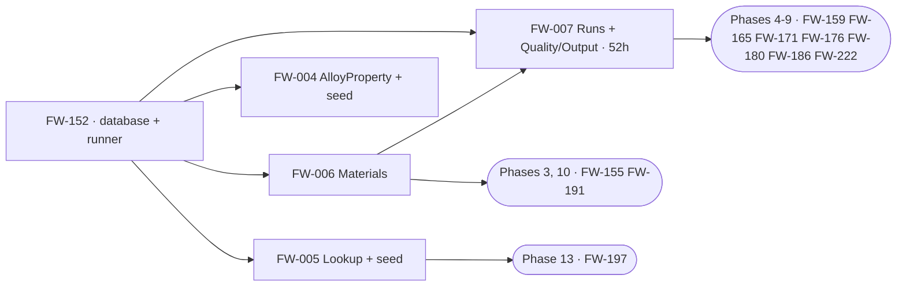

# Phase 1C — Execution Orchestration (Database)

**Project:** United Aluminum (UAL) — Flat Wire Mill Module
**Last Updated:** August 27, 2026 — **first issue.** The DB stream had a layer spec, six schema documents, a runnable DDL chain, two folder manifests and 30 backlog rows, and **nothing that said what can start, in what order, and what is stopping it**. This is the DB counterpart to [`Backend/TaskBreakdownPlans/Orchestration.md`](../../Backend/TaskBreakdownPlans/Orchestration.md), on the same axis — dependency wave, not sprint. ✅ **Its headline is the opposite of the FE stream's: Phase 1C is BUILT.** [`verify_schema_counts.py`](../../Tools/verify_schema_counts.py) run today passes **all six checks** at `[DBD §6.2]`'s baseline, and `phase-01c` records a live deploy on **`DEV00164-001`, 26 Aug 2026** with `[DEP §4.2]`'s `V1`–`V6` gate green and `V4` at **7/7**. ⚠ **Two things are not done and both are easy to read as done.** ⛔ **Deploy step 2 has never been run** — `10_CommonDB_Insert_WIPStations_FlatWire.sql` is Draft, has **no reverse script**, and the `Scripts/` runner deliberately skips it, so FL1/FL2/FL3 exist in neither `united_db..machines` nor `CommonDB..WIPStations`, and `FW-220` names that script as a dependency (§5). ⚠ **`DEVUAL-UADEV001\TEST1` is behind** — the 26 Aug build was on a new instance and did not update it. ⛔ **`G21` was fixed on 15 Aug 2026 and four backlog cards plus `CLAUDE.md` still carry it as blocking the Phase-4 schema freeze** (§8.1 finding 1). ⚠ **Two live count contradictions the schema guard does not catch** (§8.1 findings 2–3), and **`FlatWireDB` has no folder in the `ual-database` repository at all** (finding 5).
**Document Type:** Execution index and dependency graph for the Phase-1C implementation and the DB stream downstream of it
**Status:** Active — **the entry point for this folder**
**Owner:** Database (SQL Server)
**Audience:** The delivery lead sequencing the DB stream, the deployer, and any developer picking up a schema story
**Shortcode:** — *(orchestration, derived from the DDL, the manifests and the specifications; **not citable as a requirement**)*
**Part of:** `ProjectPlan/Database/TaskBreakdownPlans/` — folder index: this file

---

> ### ⚠ This folder holds no per-story plans. Read this before looking for one.
>
> The Backend sibling indexes **35 plans** — one file per story, each saying *how* to build it.
> **There is no DB equivalent, and every row below therefore names its owning artifact instead
> of a plan.** That is not an oversight and it is not new: it is the convention
> [`TrialOrchestration.md §1`](../../Backend/TaskBreakdownPlans/TrialOrchestration.md) already
> uses — *"FE and DB rows name the owning document instead of a plan"* — because that folder is
> Backend-scoped.
>
> ⚠ **For this stream the owning artifact is usually executable.** Where a `.sql` file and a
> markdown document disagree, **the DDL wins** — *"Authoritative for types, nullability and
> constraints. Never regenerate it from the markdown"* (`[README]`, `Schema/SQL/`).

---

> **What this file is.** It says **what can start, in what order, and what is stopping it.**
> It holds **no build detail and no object counts** — every statement here resolves to an
> artifact, and this file loses to all of them. ⚠ **`[DBD §6.2]` is the only site that defines
> the counted baseline**, and only three others may restate it (`[DEP §4.2]`'s gate,
> `phase-01c`'s *Testing* and *Acceptance criteria*, and `FlatWire_DDL_RunAll.sql`'s banner).
> **This file is not one of them and states no count.**
>
> **The one thing to read first:** **the layer is built, so the live constraint is not
> construction — it is the deploy sequence.** `[DEP §4.2]` is a **ten-step chain with a
> sign-off gate at step 2**, and that gate has never been passed. Everything downstream of it —
> `FW-220`, `FW-221`, `FW-223`, the whole check-in write-back — is waiting on an approval, not
> on code. See §3.

---

## 1. Status board

**30 stories carry DB hours** — Phase 1C's five live ones and two cancelled (§1.1), and
**23 downstream across Phases 3–14** (§1.2). Hours are `[TB §7]`'s, **quoted not restated**.
⚠ **Do not total them from this page** — §8.1 finding 6 explains why no current DB-stream total
exists.

### 1.1 Phase 1C — DB 100 h

| Story | Subject | h | Wave | Owning artifact | Status |
|---|---|---|---|---|---|
| `FW-152` | `FlatWireDB` creation, ordered DDL runner, indexes, grants | 12 | **0** | [`FlatWire_DDL_00_Database.sql`](../Schema/SQL/FlatWire_DDL_00_Database.sql) · [`FlatWire_DDL_RunAll.sql`](../Schema/SQL/FlatWire_DDL_RunAll.sql) | ✅ **Built** — contiguous `00`–`08` chain, idempotent, verified on a live teardown-and-deploy |
| `FW-005` | Lookup group tables and seed | 16 | 1 | [`FlatWire_DDL_01_Lookup.sql`](../Schema/SQL/FlatWire_DDL_01_Lookup.sql) · [`FlatWireSchema_Lookup.md`](../Schema/FlatWireSchema_Lookup.md) | ✅ **Built and seeded** — the seed is the first `:r`, ahead of the schedule seed that depends on its IDENTITY values · ⚠ **`G32`/`PLC-Q04`** — the FM2 station names are ours, not the controller's |
| `FW-004` | `AlloyProperty` lookup and seed | 8 | 1 | [`FlatWireSchema_Lookup.md`](../Schema/FlatWireSchema_Lookup.md) *"`AlloyProperty`"* | ✅ Built · ⛔ **`Q22`** — the four min/max tolerance pairs are **owed by e-mail and deliberately unseeded**; diameter and ovality are `NULL` by design · ⛔ **`LbPerFtFactor` is seeded `NULL`, marked "OQ-10 PENDING"** (§5) |
| `FW-006` | Materials group tables | 12 | 1 | [`FlatWire_DDL_03_Materials.sql`](../Schema/SQL/FlatWire_DDL_03_Materials.sql) · [`FlatWireSchema_Materials.md`](../Schema/FlatWireSchema_Materials.md) | ✅ Built · ⚠ **`G17`** — every `Rod.Alpha` reference is a cross-DB logical FK · ✅ the `PassScheduleId` nullability question is **closed by `D-31`**: the FK verifies it, so **do not `NULL` it** |
| `FW-007` | Runs and Quality/Output group tables | 52 | 2 | [`FlatWire_DDL_04_Runs.sql`](../Schema/SQL/FlatWire_DDL_04_Runs.sql) · [`FlatWire_DDL_05_QualityOutput.sql`](../Schema/SQL/FlatWire_DDL_05_QualityOutput.sql) | ✅ Built — **the largest story in the layer**, and the parent of eight downstream DB stories · ⛔ **its card still names `G21` as blocking the Phase-4 schema freeze; `G21` was fixed 15 Aug 2026** (§8.1) · ⚠ `G14` footage type · `G34` |
| ~~`FW-001`~~ | ~~Shared-schema column renames and new columns~~ | ~~56~~ **0** | — | — | ⛔ **CANCELLED — `D-32`, 18 Aug 2026.** There is no shared-schema migration and no 40 h impact audit. Retained as the record of what was cancelled |
| ~~`FW-002`~~ | ~~`INFLAT` coil status~~ | ~~4~~ **0** | — | — | ⛔ **CANCELLED — `D-32`.** ⚠ **`INFLAT` is still required, locally** — `Rod.Status`, `SpoolProcessing.Status` and `RodCheckout.NewRodStatus` carry it in their `CHECK` constraints, and after `D-32` those are the **only** places it exists |

> ⚠ **`D-32` re-derived this layer 221 h → 138 h** (DB 100 · QA 20 · cont. 18). **`[CE]`
> publishes three different 1C figures and none of them is re-derived** — `[CE §3]`'s 215 h is
> the base of record, `[CE §8]` records 221 h without carrying it into §3, `[CE §3c]` publishes
> the post-`D-32` 138 h additively, and **`[CE §3b]` has no Phase 1C row at all.** Cite the
> right section. `[CE §8]` also records that **1C was costed against 22 tables and the build is
> larger**; the understatement is real, `[CE]` owns it, and **it is not re-priced here.**

### 1.2 Downstream — 23 DB stories, Phases 3–14

| Phase | Stories (DB h) | Owning artifact |
|---|---|---|
| **3** | `FW-155` 4 | `IX_FlatWireRun_LineId`, keyed **`(LineId, Status)`** — not `LineId` alone |
| **4** | `FW-159` 28 · `FW-220` DB 24 · `FW-221` 9 · `FW-222` 2 · `FW-223` DB 10 · `FW-225` DB 12 | [`40_…CheckInRod.sql`](../Scripts/40_FlatWireDB_Proc_FlatWire_CheckInRod.sql) · [`60_…ReleaseStation.sql`](../Scripts/60_FlatWireDB_Proc_FlatWire_ReleaseStation.sql) · [`70_…ReverseReqsum.sql`](../Scripts/70_FlatWireDB_Proc_FlatWire_ReverseReqsum.sql) · [`30_…sp_IngestRodFromCoils.sql`](../Scripts/30_FlatWireDB_Proc_sp_IngestRodFromCoils.sql) · `RodOrderAllocation` in `03_Materials` |
| **5** | `FW-165` 8 | `sp_GetGaugeTrace`, in [`FlatWire_DDL_08_Programmability.sql`](../Schema/SQL/FlatWire_DDL_08_Programmability.sql) |
| **6** | `FW-171` 20 | the five in-run event tables in [`FlatWire_DDL_04_Runs.sql`](../Schema/SQL/FlatWire_DDL_04_Runs.sql) |
| **7** | `FW-176` 28 | `WipRejection` / `RodCheckout` — ⚠ **its `coils` carry-forward columns are cancelled with `D-32`**; the delivered design was already local |
| **8** | `FW-180` 12 · `FW-230` DB 4 · `FW-231` DB 12 | `SpoolCheckin` · the FL1 segment-alpha namespace · shared coil-master registration |
| **5/8 boundary** | `FW-202` DB 8 | ⚠ **already allocated** — `FW-202`'s AC *"server-owned state, persisted against the run"* **is** `G38`'s five `FlatWireRun` prompt columns. **Do not add a second DB allocation** |
| **9** | `FW-186` 16 · `FW-219` DB 26 · `FW-229` DB 6 | `CoilOutput` · `CoilTraceability` · `trg_CoilTraceability_NoOverlap` · [`50_…CompleteCoilOnSkid.sql`](../Scripts/50_FlatWireDB_Proc_FlatWire_CompleteCoilOnSkid.sql) |
| **10** | `FW-191` 4 | `RouteMode` and the no-intermediate-spool rule |
| **11** | `FW-090` DB 20 | reporting views · ⚠ **`OI-101`** — shift boundaries are undefined, which blocks every shift-scoped figure |
| **12** | `FW-102` DB 4 · `FW-110` DB 8 | ⚠ `FW-110` is **descope-ladder rung 1 — the first thing off the plan** |
| **13** | `FW-197` 8 | reference-data admin wiring · ⚠ `OI-77` / `OI-43` |
| **14** | `FW-201` DB 8 | ⚠ its *"renamed-column regression"* half is **cancelled with `D-32`**; the defect-allowance half stands |

> ✅ **`G38`'s schema delta landed 15 Aug 2026** — five columns on `FlatWireRun`
> (`PromptDueAt`, `PromptPlcStopTs`, `PromptLatchedWeightLb`, `PromptResolvedAt`,
> `PromptAnswer` + its `CHECK`). **Columns, not a table** — *"persisted against the run"* is
> literal, and the object count is unaffected.

---

## 2. Dependency graph

> **This graph is Phase-1C-scoped by design.** It shows §1.1's five live stories and the two
> edges that leave the layer. **§1.2's are deliberately absent** — merging a wave axis and a
> sprint axis into one diagram is how a map stops being readable.



**Waves** — level = 1 + the deepest dependency:

| Wave | Stories | Note |
|---|---|---|
| **0** | `FW-152` | The single root. **Nothing else starts.** |
| **1** | `FW-005` `FW-004` `FW-006` | Three unlock at once |
| **2** | `FW-007` | ⚠ **52 h in one story, and eight downstream stories hang off it** |

> **Two edges leave the layer, and neither is a build dependency.** 1B's `FlatWireDbContext`
> (`FW-142`) and repositories (`FW-141`) bind to this schema, and 1A's mock fixtures mirror its
> seed. Both are **consumers**, so 1C was never blocked by them — but see §6 criterion 5, which
> **is** a 1B dependency and is now **partly** met: `FW-142` mapped the seven roots and
> `FW-207` took the model to **20 entity types**, validated against live `FlatWireDB`.

---

## 3. The critical path — spent. The live constraint is the deploy chain.

**Construction is done.** The build path was:

```
FW-152 (12) → FW-006 (12) → FW-007 (52)          = 76 h, complete
```

⚠ **What gates this stream now is `[DEP §4.2]`, a ten-step cross-folder chain**, and it is
**not** the `RunAll` script. `RunAll` is *"one step of ten"*. The sequence and its sign-off
state:

| Step | What | State |
|---|---|---|
| **0** | Pre-flight — **prove co-location.** `FlatWireDB` must sit on the same instance as `united_db` / `proddb` / `SlitterDB` / `CommonDB` / `wiplogdb`, because check-in spans them in **one** `SqlTransaction` under the **local** transaction manager, no MSDTC | ✅ Query in `20_FlatWire_Grants.sql` |
| **1** | The schema — `Schema/SQL/FlatWire_DDL_RunAll.sql`, idempotent | ✅ **Deployed and verified 26 Aug 2026** |
| **2** | ⛔ **SIGN-OFF GATE — shared-schema rows.** `10_CommonDB_Insert_WIPStations_FlatWire.sql` writes `united_db..machines` and `CommonDB..WIPStations` / `MachineStationsConfiguration` | ⛔ **NEVER RUN.** Draft; `machine_type`, the station set and `StationType` pending. **No reverse script exists.** Run by hand, after approval — the `Scripts/` runner **deliberately skips it** |
| **3** | Grants — `20_FlatWire_Grants.sql`, `ua_user` in six databases, once per environment | Draft |
| **4** | Inbound procedure — `30_…sp_IngestRodFromCoils` | **Ready — no open items** |
| **5–8** | The four outbound procedures — **any order among themselves** (`CREATE PROCEDURE` uses deferred name resolution) | ⚠ Draft: `Q37`–`Q39` on `40_`, `Q34`–`Q36` on `50_`, **none** on `60_`, ⛔ **`Q40` on `70_`** |
| **9** | The verification gate — `V1`–`V6`, then `V10`–`V12` | ✅ **`V1`–`V6` pass, `V4` at 7/7** |
| **10** | DEV / TRIAL ONLY — `FlatWire_SampleData_RunAll.sql`. **Never against production** | ✅ Five seeds, order strict |

Three consequences:

1. **Step 2 is the only irreversible step in the chain, and it is the one that has not run.**
   Everything else can be torn down: `99_FlatWireDB_Proc_FlatWire_Teardown.sql` drops the four
   procedures (**code, not data**) and `FlatWire_DDL_99_Teardown.sql` drops the database.
   ⚠ **Neither undoes step 2's shared rows. Nothing does.** That is why it is a gate and not a
   step.
2. **`FW-220` names step 2 as a dependency**, so the FL1/FL3 check-in write-back — and with it
   `FW-221`, `FW-223` and the Phase-4 shared-schema story — is waiting on **an approval, not on
   code**.
3. **`70_ReverseReqsum` is safe to create and unsafe to call.** Its `proddb..wip_coil_orders`
   **DELETE** is not signed off for a shared environment (`Q40`); `@deleteOrphan = 0` makes it a
   no-op if the answer turns out to be *"leave the orphan"*.

> *Nothing in this section is a published total. The 76 h is quoted from `[TB §7]` per story and
> summed for sequencing only.*

---

## 4. Decision gates — and where each decision actually lives

⚠ **This file mints no decision ids, deliberately.** The `P-##` series belongs to
[`Backend/TaskBreakdownPlans/`](../../Backend/TaskBreakdownPlans/) and is continuous across that
folder; a second series here would collide in citation. **DB decisions resolve in the registers
that own them**, and this table is the index.

| Decision | Blocks | Where it is decided |
|---|---|---|
| **`D-31`** | `FW-006`, `FW-007`, `FW-152` | ✅ **The three `PassSchedule*` tables, their seed and their constraints are MVP-1** (15 Aug 2026), so `PassScheduleId` is a **real, enforced FK** on four tables, not an external reference. ⚠ **Owning the table is not owning the data** — MVP-1 **reads** schedules and never authors them; **nothing in MVP-1 populates them in production** (`OI-110`). `[MVP2-SCOPE.md]` |
| **`D-32`** 🔴 | `FW-001`, `FW-002`, `FW-176`, `FW-201`, `FW-100` | ✅ **There is no shared-schema migration** (18 Aug 2026). The existing `coils` / scheduling schema is **read and written as it stands and never altered**. ⚠ **Two cancellations are easy to miss** — `FW-176`'s `coils` carry-forward columns and `FW-201`'s rename regression. ⚠ **New open item `OI-111`**: nothing now marks a rod as being on a flattening line in the shared schema, and the audit that would have found which reports care is cancelled too |
| **`D-30`** 🔴 | `FW-007` → the **Phase-4 schema freeze** | ⚠ **Open.** `ROWVERSION` is absent on `WeldEvent`, `RodCheckout` and `WipRejection` — **3 of the 7 aggregate roots, all mutated after insert.** `P-69` maps all eight tokens that do exist; it explicitly does **not** decide whether these three should. `[SVC §3.4]`'s call, before the freeze |
| **`Q60`** | every document naming a spool | ✅ **`Spool` and `SpoolCarrier` were SWAPPED** (23 Aug 2026) and `SpoolConfiguration` merged away. ⚠ **This is the one rename where a stale reference is *silently wrong* rather than obviously stale** — a pre-23-Aug `Spool.Alpha` means what is now `SpoolProcessing.Alpha`, and the table now called `Spool` has no `Alpha` at all. `[DBD §6.2a]` is the naming convention that settles which is which |
| **`D-04`** | `FW-006` | ✅ **`Rod` is RETAINED** — a `FlatWireDB`-local master mirroring `coils`, with **enforced** rod-alpha FKs; `coils` stays the source of truth for the rod *lifecycle*. Supersedes the dissolved foundations doc's *"drop `Rod`"*. Closes `G12` and `G5`. `[ARC §13.1]` |
| **`P-13`** | `FW-006`, and 1B's `FlatWireDbContext` | **`PassSchedule*` is mapped read-only — no write path** (`[SVC §3.2a]`). This is the schema-side face of `D-31`: the tables are built here and there is no endpoint, command or repository that writes them. ⚠ **`P-13` is still an unratified gate** in the Backend register |
| **`Q40`** 🔴 | `FW-221`, deploy step 8 | **Delete the reqsum row, or leave an orphan?** Must close before `70_ReverseReqsum` runs outside DEV. `Analysis/FlatWireOpenQuestions.md` |
| **Step 2 sign-off** 🔴 | `FW-003`, `FW-220`, `FW-221`, `FW-223` | **`machine_type`, the station set and `StationType`.** Not a register id and not a gap — an **approval**, owned by whoever signs off shared reference data, with `[DEP §4.2]` step 2 as the record. ⚠ **`G21`'s absent `FL3PO` station is deliberate, not an omission**: FL1 and FL3 share one physical payoff, `STATION_BY_LINE = {FL1:"FL1PO", FL3:"FL1PO"}`, client-confirmed (`Q71`) |

---

## 5. Blocker calendar

| By | Blocker | Stops | Owning document |
|---|---|---|---|
| **Before any shared environment** | ⛔ **Deploy step 2 sign-off** — `machine_type`, the station set, `StationType`; **no reverse script** | `FW-220`, `FW-221`, `FW-223`, `FW-003`. **An approval, not code.** The `Scripts/` runner skips it by design | [`Scripts/README.md`](../Scripts/README.md) · `[DEP §4.2]` step 2 |
| **Before `FW-220` runs outside DEV** | **`Q37`** transaction token · **`Q38`** WIP-log status · **`Q39`** stamping the rod's `coils` row | The FL1/FL3 check-in write-back. **`OI-115`** blocks the FL2 half; `OI-116` is not a hard blocker | [`40_…CheckInRod.sql`](../Scripts/40_FlatWireDB_Proc_FlatWire_CheckInRod.sql) · `G45` |
| **Before `FW-219` runs outside DEV** | **`Q34`** transaction token · **`Q35`** `coil_status = 'ONSKID'` · **`Q36`** sample number / planned operations | The FL2/FL3 run-end write-back. `OI-114`'s cut-record sentinels are **parameterised**, so a wrong answer is a one-line change | [`50_…CompleteCoilOnSkid.sql`](../Scripts/50_FlatWireDB_Proc_FlatWire_CompleteCoilOnSkid.sql) · `G44` |
| **Before `70_` runs outside DEV** | 🔴 **`Q40`** — delete the `proddb..wip_coil_orders` row versus leave an orphan | `FW-221`. ⚠ **Creating the procedure is safe; calling it is not** | [`70_…ReverseReqsum.sql`](../Scripts/70_FlatWireDB_Proc_FlatWire_ReverseReqsum.sql) |
| **Before the Phase-4 schema freeze** | 🔴 **`D-30`** — `ROWVERSION` absent on `WeldEvent`, `RodCheckout`, `WipRejection` | 3 of the 7 aggregate roots, all mutated after insert | [`FW-207`](../../Backend/TaskBreakdownPlans/FW-207-Domain-Model.md) · [`FW-142`](../../Backend/TaskBreakdownPlans/FW-142-Dapper-EF-And-FlatWireDbContext.md) |
| **Before T2** | **`G2` / `OI-39`** — cross-DB check-in recovery | Compensation design; carries the **24–64 h** reserve. **Phase 4 is provisional until it closes.** ⚠ `D-32` **narrowed** it — `INFLAT` left the cross-boundary set, taking it from four shared writes to three — but did not close it | [`FW-157`](../../Backend/TaskBreakdownPlans/FW-157-CheckIn-Rod-And-CheckInService.md) · `[INT §8.0]` |
| **Before T2** | ⛔ **`Q22`** — the four min/max tolerance pairs are **owed by e-mail** and `AlloyProperty` is **deliberately unseeded** | `CHK007` is a band check at **both** stations and cannot be exercised. Diameter and ovality are `NULL` by design — **do not seed them** | [`FlatWireSchema_Lookup.md`](../Schema/FlatWireSchema_Lookup.md) · [`FW-168`](../../Backend/TaskBreakdownPlans/FW-168-Spc-And-SpcService.md) |
| **Before Phase 9** | ⛔ **`Q10` / `OI-45`** — `AlloyProperty.LbPerFtFactor` is seeded **`NULL`, marked "OQ-10 PENDING"** | The calculated net weight is `NULL`, so **the ±2 % scale-vs-calculated variance cannot execute**. ⚠ **The one open question deliberately carrying no recommendation.** Seed a clearly-marked provisional factor or accept it as untestable | `Analysis/FlatWireOpenQuestions.md` `Q10` |
| **Before Phase 6** | **`G34`** — wire break has a **decided flow and no persistence target** · **`G35`** — FM2's two dancers are unmodelled everywhere | `FW-171`, the five in-run event tables. The flow is specified; nothing holds it | [`[GAP]`](../../Development/GapsRegister.md) |
| **Before `S1` closed** *(window shut)* | **`G42`** — `SpoolProcessing` multi-rod genealogy | ⚠ **Client-confirmed 20 Aug 2026** and its *"raise it while it is free"* window **closed at `S1`, 24 Aug 2026** (`OI-122`). The `SpoolTraceability` child is built; ⛔ **its non-overlap invariant is the aggregate's ONLY defence** — footage is nullable, so a trigger joining on `NULL` passes silently, which is why 22 Aug added none. **The welding-wire certificates rest on it** (`NFR012`) | `G42` · [`FW-207`](../../Backend/TaskBreakdownPlans/FW-207-Domain-Model.md) `P-91` |
| No date | **`G8`** — no data-migration deliverable for legacy `FlatLineSetup` / `FlatLineProcessing` | ⚠ **The destination is no longer the blocker** — `D-31` made `PassScheduleComponent` an MVP-1 target. **The missing migration is** | [`[GAP]` `G8`](../../Development/GapsRegister.md) |
| No date | **`G55`** — `CK_SpoolCheckin_PayoffPos` pins FL2's spool to payoff `1` while the canonical enum and the pinned lookup both make it `3` | ⚠ **On a column with no FK, so the membership diff passes** — the disagreement is about **meaning**, which is why `TC-020` could not see it | `G55` · [`FW-147 §6.1`](../../Backend/TaskBreakdownPlans/FW-147-FluentValidation-Value-Objects-And-Enums.md) |
| No date | **`G41`** — `CK_PSC_FM1NotBypassable` is **line-blind**, so a correct FL2 pass schedule cannot be authored · **`G49`**–**`G52`**, **`G54`** | Nine decided requirements with no column, three referential-integrity holes, `SpcMeasurement.InSpec` storing a wrong answer for an asymmetric tolerance, and ⛔ **`G54`, which gates the whole alpha scheme** (`OI-138`) | [`[GAP]`](../../Development/GapsRegister.md) |

---

## 6. Exit criteria → owning artifacts

`phase-01c`'s five.

| # | Criterion | State |
|---|---|---|
| 1 | `FlatWireDB` created; the whole `00`–`08` chain **plus all five seeds** execute clean, in numeric order, idempotently | ✅ **Met** — live teardown-and-deploy, idempotent re-run |
| 2 | **The full table set of `[DBD §6.2]` exists** — including `RunReading`, `Rod` and the three `PassSchedule*` tables; all FKs and all indexes present | ✅ **Met** — verified by `[DEP §4.2]`, not by a count maintained here |
| 3 | `RodCheckout.NewRodStatus` and every status column carry an enumerating `CHECK`; the documented business constraints are enforced | ✅ **Met** — 15 constraint tests pass on SQL Server 2019 |
| 4 | ~~`FW-001` renames + `FW-002` `INFLAT` on the existing schema~~ | ⛔ **STRUCK 18 Aug 2026, `D-32`.** The existing schema is left exactly as it is. ⚠ **`INFLAT` is still required locally** — criterion 3's `CHECK` constraints are now the only places it exists |
| 5 | `FlatWireDbContext` binds all tables; seed rows back the 1A/1B fixture alphas | ⚠ **Partly met, and this is a 1B dependency, not a 1C one.** `FW-142` mapped the seven roots and `FW-207` took the model to **20 entity types** — **352 mapped columns checked against live `FlatWireDB`** — so the remainder is unmapped, not unbuilt. ⚠ **`P-91`'s two rod-order entities are deliberately not built**, pending `[SVC §3.2a]`'s signature |

> ⚠ **Criterion 5 was recorded unmet *"because 1B does not exist yet"*.** That is no longer the
> reason: 1B exists, the context is built, and the gap is the thirteen table types no aggregate
> map has claimed yet.

---

## 7. Two tracks — know which you are building

| | **MVP-1** | **Trial (30 Sep)** |
|---|---|---|
| Schema | The whole `00`–`08` chain | **Same** — `[TRP]` requires 1C to finish inside T1; **it gates every write** |
| `FW-001` renames | ⛔ **Cancelled, `D-32`** | ⛔ Cancelled — was a 36 h trial deferral, now not a debt at all |
| Seeds | DEV / TRIAL only — **never production** | Same five, order strict |
| `sp_ShiftSummary` | **MVP-2.** ⚠ **It must be ABSENT** — *requiring* it is what failed a correct deployment before | Absent |
| Hours basis | `[TB §7]` hand-coded | `[TRP §1.4]`: *"Treat 1C as 65 h + ~21 h of known understatement"* — ⚠ **itself derived from a 28-table build, three baselines behind**, so both numbers understate again |

---

## 8. What this file does not cover

> **The scope, stated once.** This file sequences **Phase 1C** and maps **the DB stream
> downstream of it**. It plans no backend or frontend work — those are
> [`Backend/TaskBreakdownPlans/Orchestration.md`](../../Backend/TaskBreakdownPlans/Orchestration.md)
> and [`Frontend/TaskBreakdownPlans/Orchestration.md`](../../Frontend/TaskBreakdownPlans/Orchestration.md)
> — and it contains **no DDL, no column definitions and no object counts**.
>
> ⚠ **Silence is not coverage.** The exclusions are named, because a boundary that is only
> implied gets read as completeness.

| Item | Why |
|---|---|
| `sp_ShiftSummary` / `09_Programmability_MVP2` | **MVP-2** — it backs DB10, a deferred screen. `FlatWire_DDL_RunAll_MVP2.sql` is that one object and nothing else, and it is an **increment, not a standalone** |
| Column design, types, nullability, constraints | [`../Schema/`](../Schema/)'s six documents and the DDL. **The DDL wins** |
| The counted baseline | **`[DBD §6.2]` and only three restating sites.** This file is not one of them |
| The deploy sequence's detail | **`[DEP §4.2]` is its only home.** §3 above indexes the ten steps and their sign-off state; it does not restate the commands |
| Query patterns, ER diagrams, build order | `[DBD §6.6]`–`§6.11` and `[DBD §7]` |

### 8.1 Six findings raised and deliberately not fixed

All six are other documents' or another repository's to correct, so they are recorded here
rather than edited:

1. ⛔ **`G21` was fixed on 15 Aug 2026 and five places still carry it as an open blocker.**
   The register records it **RESOLVED and fixed in three layers**, with the re-keyed index
   `UX_RodStaging_Bay ([Station],[PayoffPosition]) WHERE [Status]='Staged'` **verified on a live
   deploy** — an FL3 rod at `FL1PO` position 1 is rejected. Still saying otherwise:
   **`FW-007`**, **`FW-159`**, **`FW-176`** and **`FW-N01`**'s Blockers lines in `[TB §7]`
   (three of them saying it *"blocks the Phase-4 schema freeze"*), and **`CLAUDE.md`**
   (*"the `(LineId, PayoffPosition)` uniqueness scope is unresolved across FL1/FL3"*). ⚠ **One
   residual is genuine and must not be lost in the correction:** the *domain* rule must reject a
   second rod **with the DB index absent**, which no deployed environment can show — so the
   index is the demonstrated defence and the aggregate rule the designed one. **Do not cite
   `G21` as proof of defence-in-depth.**
2. **`[DBD]` contradicts itself on the index count, in the document that defines it.**
   `[DBD §6.2]` states **70 index statements** (58 `CREATE NONCLUSTERED` + 12
   `CREATE UNIQUE NONCLUSTERED`) after `Q89` added `UX_CoilTraceability_ChildAlpha` on
   26 Aug 2026. An earlier paragraph in the same file still reads *"the current scripts measure
   33 tables · 55 FKs · **69** index statements … counted statically by
   `verify_schema_counts.py`"* — and the tool, run today, reports **70**.
3. **`ProjectPlan/README.md` restates the counts at all, and restates them stale.** It asserts
   *"33 tables · 55 FKs · **69** index statements · 1 procedure · 1 trigger"*. Two problems:
   the index figure is one behind `[DBD §6.2]`, and **`README.md` is not among the three sites
   permitted to restate the baseline**. ⚠ **`verify_schema_counts.py`'s `C6` reported zero
   disagreeing claims** in permitted sites and **zero advisory elsewhere** on the same run, so
   findings 2 and 3 both sit in the guard's blind spot — which matters because `C6` exists
   precisely so *"the number in the document cannot drift away from the scripts again"*, and
   `[DEP §4.2]`'s gate has already rejected a correct deployment **five times** on exactly this.
4. **`Scripts/README.md` contradicts itself about its own runner.** Its banner reads
   *"⚠ **No file here is in any `:r` chain, and that is deliberate**"*, while its *Running them*
   section reads *"There is a runner, `FlatWire_Scripts_RunAll.sql`, and **it deliberately skips
   `10`**"*. Seven of the eight scripts **are** chained. `CLAUDE.md` recorded the correction on
   25 Aug 2026; **the file still carries both sentences**, and the banner is the one a reader
   meets first.
5. **`FlatWireDB` has no folder in the `ual-database` repository.** Checked 27 Aug 2026:
   `Second-Branch/ual-database/Databases/` holds twenty databases — `CommonDB`, `PlanningDB`,
   `SchedulingDB`, `SlitterDB`, `proddb` and the rest — and **no `FlatWireDB`, and no file
   matching `*flatwire*` anywhere in the repository.** The deployable source of truth for a
   production database therefore lives only in this **planning** repo, which is why
   `[DEP §4.2]`'s command has to `cd` into `Flatwire-planning`. Not a defect in anything here;
   it is a fact about where this schema will have to move before go-live, and no document owns
   that move.
6. **No current DB-stream total is published anywhere, and this file does not derive one.**
   `[TB §7.3]`'s DB column is on the **pre-`D-32`** 1C basis (160 h, not 138) and its 119-story
   scope **excludes `FW-219`–`FW-231` entirely** — its Phase-4 DB cell is **28 h, which is
   `FW-159` alone**, so `FW-220` (DB 24), `FW-221` (9), `FW-222` (2), `FW-223` (DB 10) and
   `FW-225` (DB 12) are in none of it. Deliberately **not** re-derived here: the effort figures
   propagate to roughly twenty files, and `[CE §8]` is explicit that substituting a number into
   a derivation without re-deriving *"makes the arithmetic lie"*. **`[CE]` owns the figure.**

---

## 9. Keeping this file true

- **An owning artifact changes → check §1's status and §5's calendar.** Nothing else here
  restates owned content, so nothing else drifts.
- **A blocker closes → strike it from §5** and update the owning document's open-items table.
- **A deploy step is signed off → update §3's table** and `[DEP §4.2]`, which is the record.
- **Never state an object count here.** `[DBD §6.2]` defines it and three sites may restate it;
  **this is not one of them** — findings 2 and 3 above are what happens when that rule slips.
- **Never add DDL or column detail here.** It belongs in `Schema/` and the `.sql` files —
  **two homes is how the six PLC tag copies happened.**
- **Never restate an hour figure.** §1 quotes `[TB §7]`; §3's 76 h is derived for sequencing and
  is not a published total.
- **Never mint a `P-##` here.** That series is the Backend folder's and is continuous across it
  (§4).
- **A per-story DB plan gets written → its §1 row names the plan instead of the owning
  artifact**, and the plan then wins over this file exactly as the Backend plans do.
- Per repository convention, changes go in [`CHANGELOG.md`](../../../../CHANGELOG.md) — **do
  not add a change log to this file.**
