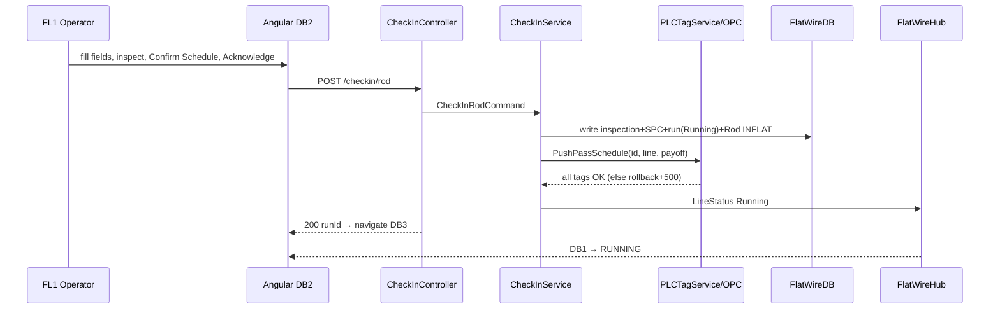

# PHASE 4 — Rod Check-In & PLC Configuration (FL1 / FL3)

> **Part of the [Flat Wire Mill — Master Implementation Roadmap](../Roadmap.md).** See [Foundations](../../Architecture/Architecture.md) for §0.2–0.4 shared context.
> **Prev:** [Phase 3 — Line Status Board & Real-Time Backbone](./phase-03-line-status-board-realtime-backbone.md) · **Next:** [Phase 5 — Active Run Monitoring & Live Gauge/Width Trace](./phase-05-active-run-monitoring-gauge-trace.md)

---

**Project:** Flat Wire Mill Implementation
**Last Updated:** 2026-07-31
**Status:** Ready to build
**Layer:** Full-stack vertical slice
**Owner:** **FE + BE + RT** (stream) — *named owner TBD, see [Capacity & Effort Model](../CapacityAndEffortModel.md#1-delivery-streams-and-roster) §1*
**Effort:** **255 h** (31.9 d) — FE 60 · BE 62 · DB 28 · RT 28 · QA 36 · BA 8 · cont. 33 · **Window:** W4 (Sep 8–11, **4** working days — Labor Day Mon Sep 7)
**Scope call:** **Not deferrable.** ⚠ **Estimate provisional:** carries a **24–64 h reserve** (excluded from the total) pending OI-39 / G2 — cross-DB check-in recovery is undecided between saga/outbox and an `INFLAT` mirror. Worked derivation for this phase is in the model §3.

*The core operator entry point: validate material, inspect, confirm the pass schedule, push PLC tags, start the run — plus the Pre-Check-In station that stages the next rod while the current one runs.*

> **⚠ The pass schedule is an EXTERNAL dependency, not a Phase-2 deliverable** (11 Aug 2026). Pass schedule
> generation and management are owned by a **separate track**: Phase 2, `FW-010`–`FW-013`, DB9/DB9A and the
> three `PassSchedule*` tables are all out of MVP-1 and are not coming back. **MVP-1 builds no authoring UI
> and creates no schedule.** `PLCTagSpecification.md:42` already reads this way — it lists *"the pass
> schedule's contents and how it is authored or generated"* under **Not in scope**.
>
> What this phase still does is **read** one. Step 2 of the wizard displays it, the operator acknowledges it,
> and that acknowledgement is the single trigger that writes PLC tags. The read contract is below.
>
> **`PassScheduleId` is a documented external reference** on `FlatWireRun`, `RodCheckin`, `SpoolCheckin` and
> `CoilOutput` — unenforced by design, the same class as `PlanId` and `SkidId`
> (`phase-01c`, *Cross-DB logical FKs*). Do not add a local FK or a stub table.

### The pass-schedule read contract

| Aspect | Contract |
|---|---|
| **What is read** | The six value groups the push needs, per `[PLC §351–356]`: component active/bypass state · die sizes · roll gaps · edge type · speed · gauge and width targets. Nothing else. |
| **Who owns it** | The pass-schedule track. MVP-1 is a **consumer only** — no create, no edit, no approve. |
| **Mechanism** | **Assumed:** an API read plus a locally persisted snapshot. **To confirm with the owning track** — the alternative is that they write into `FlatWireDB` and MVP-1 reads locally. It changes this phase's BE estimate and nothing structural, because the snapshot is required either way. |
| **Unavailable at check-in** | **Check-in cannot proceed.** No schedule means no acknowledgement, and no acknowledgement means no PLC push — there is no partial path and no default schedule. Surface it as a blocking error on step 2, not a warning. |
| **Snapshot (required)** | MVP-1 persists **its own copy of what it pushed** — schedule id, version and the effective configuration. Already half-specified: `phase-09` writes *"pass-schedule ID + snapshot to the coil record"* (`OQ-64`), and `[PLC §620]` requires *"which pass schedule configured it, at which version"*. A certificate must stay reproducible after the owning system later edits the schedule. |

## Business Overview
- **Objective:** guided check-in that captures incoming rod, forces visual inspection, requires explicit pass-schedule confirmation, writes audit records, then pushes PLC tags and starts the run.
- **Business purpose:** the gate that configures the machine correctly and sets `INFLAT`; prevents a wrong schedule being silently applied.
- **User roles:** FL1 operator (also FL3), Supervisor.
- **Entry conditions:** rod STAGED (upstream rod receiving); **an Active pass schedule supplied by the separately-owned pass-schedule system** (see the callout below — *not* Phase 2, which is out of MVP-1); job scheduled (upstream planning/scheduling); real-time spine (Phase 3).
- **Exit conditions:** run `Running`, rod `INFLAT`, PLC tags pushed, **return to Dashboard 2A** to stage the next rod (`FR-079a`; was Dashboard 3 — OI-109).

### Scope addition — Pre-Check-in (Dashboard 2A)
This phase also owns **pre-check-in / payoff staging**: registering the *next* rod against the idle VPS bay while the current coil is still running, so FL1/FL3 can run continuously through an induction weld. It is what `SRS §4.2 PCI001`–`PCI008` specifies, and it had no screen, data model, API or phase owner until now — see **[RodPreCheckin.md](../../../RequirementDocuments/RodPreCheckin.md)** and gap **G19**.
- **FL1/FL3 only** — `PCI002` excludes FL2 (no staging space).
- Priority is SRS **Should**, not Must: check-in does *not* depend on it. Scanning an unstaged rod straight into Dashboard 2 stays valid.
- **No PLC write occurs at pre-check-in.** Tags are pushed only at the acknowledgement in step 4 below.
- Check-in **consumes** the staged row (`RodStaging.Status → CheckedIn`, `RodCheckinId` linked) rather than creating a parallel record. Where a staged row exists, the request's `payoffPosition` must match it (409 on mismatch).

## User Journey (RocCheckin logical flow — delivered as the new 6-step wizard)
> **UI shape (new mockup):** a 6-step guided tab-wizard with progressive unlock — **(1) Visual Inspection · (2) Pass Schedule · (3) Pre-run SPC · (4) Die Block (DB1/DB2) · (5) Rolling Mill (FM1) · (6) Lube & Safety**; Acknowledge is disabled until all six clear (or a supervisor override is on file for a deviation). The logical gate sequence below still holds within that wizard.
1. **Pre-flight validation:** rod alpha valid (`GET /rod/{alpha}`), diameter/weights/payoff filled, **all inspection items Pass**, pre-run SPC diameter entered, pass schedule loaded. Any fail disables Acknowledge.
2. **Pass-schedule confirmation gate:** attribute-lookup recommends a schedule (alloy + rod dia + target gauge×width + route); confirm-bar is amber until **Confirm Schedule** (then green); "Change ▼" lists alternates (non-recommended flagged for Ops review). **PLC tags are never pushed until this confirmation.**
3. **Write records BEFORE PLC push:** inspection result → rod record; pre-run SPC diameter → SPC checkpoint (PreRun); schedule ID+version → run record; acknowledgment → audit log.
4. **PLC tag push** (component activation, die sizes, FM1 gap, edge type, speed limits, gauge/width targets) to the selected payoff position; transactional.
5. **Run starts:** timer starts; Dashboard 1 → RUNNING (schedule ID shown); **return to Dashboard 2A** to stage the next rod (`FR-079a`; was Dashboard 3 — **OI-109**).
- **Decision points:** inspection pass/fail (fail → Dashboard 8 hard block); Payoff 1/2; Mode-A checkout (footage=0); at the **staging** scan, carry-forward vs fresh — forced to carry-forward when prior footage exists (`PRC007`/`PRC008`).
- **Error scenarios:** PLC write fails → **entire check-in rolled back** (500); line already running → 409; Draft schedule → 422.

## UI Implementation (Angular)
- **Screens:** Dashboard 2 — **new approved mockup** `dashboard_2_rod_checkin.html` — the 6-step wizard, named `- New.html` until it took this filename on 11 Aug 2026 (FL3 variant to follow; the earlier interim layout that held this filename, and `- Old.html`, are retired and deleted). Dashboard **2A** — `dashboard_2a_rod_precheckin.html` (Pre-Check-In station).
- **Dashboard 2A layout — three body regions, not four** (revised 1 Aug 2026): two payoff bay cards (states `NOT STAGED` / `PRE-CHECKED-IN` / `ACTIVE` / `BLOCKED`) and a Queue table implementing `TRV004`/`TRV009`, headed **"Rods In Queue"**. The **weld-readiness strip is gone**; its two controls now sit on the bay they act on — **Mark as Welded** on the **staged** card (`WLD010`, `FR-050`; enabled only when that bay is staged *and* the other is running, capturing weld quality `PCI022`, and stating its reason when disabled) and **Welds this run · N** on the **active** card (`PCI021`, `FR-051a`). **Open active run is removed** from the active card (`FR-051b`). Three modals: a **3-step** pre-check-in wizard (Identify rod → Assign bay → Visual inspection), pre-check-out, and the read-only weld list.
- **Two rules the Angular port must carry over, both easy to lose:** (1) the outgoing/incoming pair for a weld is resolved from **whichever bay is actually running**, never from the card the operator activated (`FR-050a`, TC-068i) — after a payoff transition the running bay may be either one; (2) bay-card actions are regenerated on every render, so their handlers must be bound per render or via delegation, not once at init.
- **Card action rules:** at most **one primary per card**, and the `ACTIVE` card deliberately has **none** — both of its actions are exceptional. Leading icon for actions, trailing chevron for the two navigations, never both.
- **Dashboard 2A — Mark as welded now captures quality (`PCI022`):** Pass/Fail with a reason mandatory on Fail (`WLD013`), the same six reasons as Dashboard 4. **Neither result is pre-selected** and confirm stays disabled until one is chosen — a pre-selected Pass on the gate that exists to make the operator look at the join is a rubber stamp. Gate is *material match* **AND** *quality chosen* **AND** *(Pass OR reason selected)*. **A Fail records the `WeldEvent` but leaves `RodStaging.IsWelded = 0`** — the bay keeps reading not-yet-welded, the bay card states the failure and its reason, and Mark as welded stays enabled for the remake. Quality is **not** mirrored onto `RodStaging`; one join, one quality answer.
- **Dashboard 2A — Welds this run (`PCI021`):** read-only dialog over `GET /run/{runId}/weldevents`, listing every weld against the **active run** — time, rod pair, footage, weld type, operator, Pass/Fail with the mandatory fail reason (`WLD013`). Gated on a **run existing**, not on a weldable pair, so it stays available while the idle bay is empty or blocked. **At cold start there is no active card, so the control is absent rather than disabled** (revised 1 Aug 2026 when it moved off the weld strip — supersedes TC-068e's "disabled at cold start"; see TC-068f and **OI-108**). It stays **enabled at a count of 0** — the dialog's empty state is the answer. **No edit path** — reversing a recorded weld is `WLD011`, unspecified. Note the read lands here in phase 4 while `POST /weldevent` writes its rows in **phase 6**: the endpoint returns an empty array until then, which is a legitimate state, so stub it with sample rows for the phase-4 gate review. Replaces a *Weld event log* link that navigated to Dashboard 4 (the capture form). **Mark as Welded captures no operator badge** — the operator comes from the signed-in session (`WLD003` wants it recorded, not re-entered).
- **Dashboard 2A components:** reuses the `.payoff`/`.payoff-badge` bay cards from `dashboard_3_active_run_fl3.html`, the `Payoff No` queue table from `dashboard_3_active_run.html`, `payoff-option` selector cards and the `tab-strip` unlock idiom from Dashboard 2, and `option-card`/`consequence-box`/`footer-stamp` from Dashboard 12. **Clone the Dashboard 12 skeleton, not Dashboard 2's** — DB2 inlines its own app bar and omits `flat-wire-topbar.js`.
- **Dashboard 2 change (`CHK005`):** the payoff selector stays for the direct-check-in fallback but renders **pre-filled and read-only** when the rod arrived via pre-check-in. `CHK005` reads as "Pre-Check-In station only"; this satisfies both readings without discarding approved markup. Confirm with the business.
- **Layout:** 6-step guided **tab-wizard** (Visual Inspection → Pass Schedule → Pre-run SPC → Die Block → Rolling Mill → Lube & Safety) with progressive unlock; footer **Acknowledge & Begin Check-in** disabled until all steps complete; supervisor-override path for any deviation/out-of-spec.
- **Components:** `dashboard-2-rod-checkin` (wizard host), shared `pass-schedule-table`, `confirm-bar` (amber→green, retained), `payoff-option` selector cards, pass/fail `pill-btn` + OK/NG/NA machine-inspection buttons, `tolerance-viz` (SPC marker on a band — **replaces the old inline-SVG progress ring**), standard `.input` fields with `.invalid`/`field-error` states.
- **Services/models:** `flat-wire-api` (`checkin/rod`, `rod/{alpha}`, `payoff/status`, `staging/**`), `line-context`, `run-state`, `payoff-state`; `checkin.model.ts`, `staging.model.ts`. *(Inspection scope expanded vs the DTO — the new wizard adds machine-inspection steps (Die Block, Rolling Mill, Lube & Safety) and OK/NG/NA states beyond the 3-item DTO; reconcile — see G14.)*
- **Forms/validation:** each step gates the next; Acknowledge enabled only when all steps complete + confirm-bar green (or supervisor override on file).
- **Navigation/error:** **→ Dashboard 2A on success** (revised 1 Aug 2026 — `FR-079a`; check-in is complete at acknowledgement and the next task is staging the following rod, so the loop closes on one path. Was Dashboard 3, which stays reachable from the app bar and Line Status. Client confirmation pending — **OI-109**); → Dashboard 8 on inspection fail; → Dashboard 12 Mode A via footer; rollback error toast. Dashboard 2A → Dashboard 2 (Proceed to check-in), → Dashboard 8 (inspection fail, hard block), → Dashboard 12 from the active bay. **Dashboard 2A no longer links to Dashboard 3** (`FR-051b`). **Dashboard 2A no longer links to Dashboard 4** — the *Weld event log* link is replaced by the in-place **Welds this run** dialog, so the station is not left to read a list. A `Rod Pre-Check-in` tile is added to the shared topbar so the station is reachable from every screen.

## Backend Implementation (.NET)
- **APIs:** `CheckInController` `POST /checkin/rod`; **`PayoffStagingController`** — `GET /payoff/status`, `GET /staging/queue`, `POST /staging/rod`, `POST /staging/rod/unstage`; `RunController` **`GET /run/{runId}/weldevents`** (read-only, backs `PCI021`). **`POST /staging/rod/mark-welded` is retired** — DB2A's weld now posts to `POST /weldevent` (**phase 6**), which writes the `WeldEvent` row and sets the `RodStaging` weld columns on a **Pass** only. Both of DB2A's weld touchpoints — the write and the run list — therefore land in phase 6; phase 4 ships the UI against stubs.
- **Staging commands:** `StageRodCommand` (reuses the 3-item `InspectionDto` — do **not** add a connector-tag item, see G14), `UnstageRodCommand` (writes `RodCheckout` with `Mode='ModeP'`), `MarkStagedRodWeldedCommand` (validates alloy/temper/diameter against the running coil per `WLD006`).
- **Staging rules:** bay-occupancy conflicts surface as `409` from the filtered unique indexes rather than a read-then-write race; `FL2` rejected `422` (`PCI002`); inspection `Fail` **commits the staging row** and returns `201` with `state: "Blocked"` plus the WIP-rejection route, still with **no override** (`CHK010`) — the bay must stay occupied because the failed bundle is physically on it (changed Jul 31 2026, was `422`-and-write-nothing; see `04-APIContract.md` and the Q23 note in `FlatWireSchema_Runs.md`, whose *release* half stays open); prior footage without acknowledgement rejected `422` (`PRC007`).
- **Request/Response:** `CheckInRodCommand` (line, rodAlpha, payoff, diameterMeasured, weights, `InspectionDto`, scheduleId, operatorId, orderId) → `CheckInRodResponse` (runId, checkedInAt, plcTagsPushed).
- **Business services:** `CheckInService` (records-before-push orchestration) → `PLCTagService.PushPassSchedule(scheduleId, lineId, payoffPosition)`.
- **MediatR handlers:** `CheckInRodCommand` handler whose side-effects (INFLAT, ack record, PLC push, timer, `LineStatus` broadcast) are **ordered and compensating, not atomic** — see the line below and `[PLC §7.5]`.
- **Business rules:** all-or-nothing; Draft not acknowledgeable; single active run per line; **one rod per payoff bay and one bay per rod** — enforced in the database, not in application code.
- **Wording:** staging spans `FlatWireDB` + `coils` + `wip_coil_orders` and is **not** one ACID transaction — describe these as **compensating writes**, never "atomic rollback" (G2/G16).
- **Logging/authz:** PLC push audited (tag/value/operator/result); Operator+ policy.

## Database Changes
- **Tables (write):** **`RodStaging`** (pre-check-in row, 3-item inspection, `RodSeqno`, `IsWelded`, carry-forward evidence, release audit incl. `UnstageKind`/`WipRejectionId`); `RodCheckin` (inspection cols, payoff, `PlcTagsPushed`, pre-run SPC M1/M2/ovality); `FlatWireRun` (create run header, `Status=Running`, `StartedAt`); `SpcCheckpoint`+`SpcMeasurement` (PreRun); `RodCheckout` with `Mode='ModeP'` on pre-check-out (**+ `WasWelded` and the supervisor approval stamp when the rod was welded**); **existing `coils` rod row → status `INFLAT`** (FW-002; cross-DB write — see G2).
- **Reference data:** new `PayoffPosition` lookup (3 pinned rows) seeded by the DDL; `FlatWireRunDetail.PayoffPositionId` now has an enforced FK parent (REVIEW.md #15).
- **WIP stations:** **`FL1PO` is now seeded** by `CommonDB_Insert_WIPStations_FlatWire.sql` (`PCI003`). It shares FL1's `MachineIdx` — the same pattern as legacy `ZR23`/`ZR23PO`. `FL2PO` stays absent per `PCI002`. That script's D2 note previously refused the station outright; that was correct about the *legacy* flow, not about the feature.
- **Reads:** the **pass schedule and its components across the external boundary** below (never a local table) for the push payload; `coils` for rod validation; `RodStaging` for bay occupancy.
- **Indexes:** `RodCheckin(RunId)`, `RodCheckin(RodAlpha)`, **`RodCheckin(LineId, PayoffPosition)`** (was missing), `RodStaging(LineId, Status)`, `RodStaging(RodAlpha)`, plus the filtered unique indexes `UX_RodStaging_Bay` and `UX_RodStaging_RodActive`.
- **Relationships:** `FlatWireRun` hub row created here anchors all subsequent events; `RodCheckin.RodAlpha` is a logical link to the `coils` R-series row (cross-DB).

## Real-Time Functionality
- **Publisher:** on success, broadcast `LineStatus {status:Running}` → Dashboard 1 flips to RUNNING; `ComponentStatus` reflects pushed values.
- **New event `PayoffStateChanged`** `{lineId, position, state, rodAlpha, rodSeqno, isWelded}` on every bay-occupancy change (stage, un-stage, a **passing** weld via `POST /weldevent`, check-in consuming a staged row — note a *failed* weld changes no bay state and broadcasts nothing). Per §0.4 this is a **rare domain event — send immediately, unbatched**; it must not enter the ~100 ms/10 Hz telemetry batch. Live weight keeps coming from the batched `PayoffWeight`.
- **Retry:** if PLC push fails, no broadcast (state rolled back).

## Integration Flow

## Testing
- **Unit:** gate logic; confirm-bar; rollback on PLC failure; INFLAT transition.
- **API:** contract; 409/422/500 paths; authz.
- **UI:** inspection-fail routing; Acknowledge enablement; confirm-bar states.
- **Integration/DB:** records-before-push ordering; audit log written; single-active-run.
- **Acceptance:** operator checks in a rod → PLC tags pushed (simulated) → run active → Dashboard 3.

## Deliverables
Dashboard 2 (+FL3); **Dashboard 2A (Pre-Check-In station)**; `CheckInController` + `CheckInService`; **`PayoffStagingController` + `RodStagingService`**; `PLCTagService.PushPassSchedule`; INFLAT + run header; `PayoffStateChanged`; the `FL1PO` station; audit logging.

**Client answers of 30 Jul 2026 — what changed for this phase:**

| Change | Effect on the build |
|---|---|
| **Wrong station auto-switches** (OQ-24) | **Less work than specified.** The off-schedule override panel, five `RodStaging` columns and two CHECK constraints are **dropped**. Instead, both DB2A *and* DB2 read `scheduledLineId` at the scan and switch station. Two behaviours to specify first: what a part-completed wizard does when the station changes under it, and whether FL1/FL3 are one station or two (**G21**/**OI-26**) — if two, the switch must reload the bays and the queue |
| **`INFLAT` at check-in only** (OQ-68) | Staging **must not** write `coils.coil_status`. Unblocks the staging build. The reqsum / `wip_coil_orders` half is still open |
| **Welded pre-check-out** (OQ-69/OQ-72) | Mode P gains a supervisor path: approval stamp + `WasWelded` + `NewRodStatus='HOLD'`. **`RodCheckout` had no approval columns at all** — see **G24** |
| **WIP rejection releases a blocked bay** (OQ-23) | New cross-phase link to Phase 7: `POST /wipreject` writes back to `RodStaging`. Nothing else clears a `BLOCKED` bay |
| **Min/max tolerances** (OQ-22) | `CHK007` becomes a band check at **both** stations. ⛔ **Blocked on the client** — the four values are owed by e-mail and nothing is seeded, so this cannot be finished in this phase without them |
| **Multi-order rod** (OQ-70) | The order-membership refusal is **knowingly wrong** (**G22**). Ships as-is pending **OQ-73** and the MVP2 decision — a recorded choice, not an oversight |

**OQ blockers:** **OQ-3** (traveler fields per station — Critical, gates final field list), **OQ-14** (no-match path — Critical residual; stub assumes single active schedule → `PS-1100-FL1-003`), **OQ-22** (⛔ tolerance values owed by e-mail — gates `CHK007`), **OQ-25** (rod scheduled on neither rod line — the auto-switch has no target), **OQ-73** (multi-order sequencing), OQ-61 (mid-run schedule change/alpha — decided), OQ-1 (roll-gap validation before start). ~~**New pre-check-in blockers:** whether pre-check-out requires supervisor approval; whether pre-check-in really sets `coils.coil_status = INFLAT` (SRS) or `STAGED` (walkthrough), and what reverses it on un-stage; the scope of `RodSeqno`. **Stories:** FW-061, FW-082, FW-010, FW-002. *(Consumes upstream FW-020 rod alphas via `GET /rod/{alpha}`.)*
