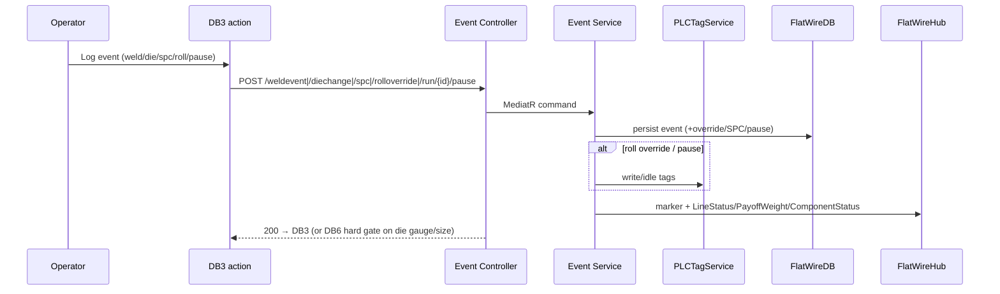

# PHASE 6 — In-Run Production Events (Weld · Die Change · SPC · Roll Adjust · Pause)

> **Part of the [Flat Wire Mill — Master Implementation Roadmap](../Roadmap.md).** See [Foundations](../../Architecture/Architecture.md) for §0.2–0.4 shared context.
> **Prev:** [Phase 5 — Active Run Monitoring & Live Gauge/Width Trace](./phase-05-active-run-monitoring-gauge-trace.md) · **Next:** [Phase 7 — Exception Handling: WIP Rejection & Rod Checkout](./phase-07-wip-rejection-rod-checkout.md)
> **Owning specifications:** [`SPCCheckpoint.md`](../../Business/Screens/SPCCheckpoint.md) (DB6) · [`DieChangeAndManagement.md`](../../Business/Screens/DieChangeAndManagement.md) §1–3, §5 (die change event) · [`WeldEvent.md`](../../Business/Screens/WeldEvent.md) · [`RollAdjust.md`](../../Business/Screens/RollAdjust.md) (DB11) · [`ActiveRunMonitor.md`](../../Business/Screens/ActiveRunMonitor.md) §6 (Pause/Resume) — the owning doc wins on any disagreement.

---

**Project:** Flat Wire Mill Implementation
**Last Updated:** 2026-08-02
**Status:** Ready to build
**Layer:** Full-stack vertical slice
**Owner:** **FE + BE** (stream) — *named owner TBD, see [Capacity & Effort Model](../CapacityAndEffortModel.md#1-delivery-streams-and-roster) §1*
**Effort:** **298 h** (37.2 d) — FE 120 · BE 56 · DB 20 · RT 20 · QA 43 · cont. 39 · **Window:** W5 (Sep 14–18, 5 working days)
**Scope call:** **Not deferrable.** The **largest workflow phase** — 4 full dashboards + 2 dialogs + 6 endpoints + 5 write tables. The five events parallelise by feature once Phase 5 exists.

*Every transaction an operator logs mid-run without ending the run. Grouped because they share the active-run context and the SPC/PLC/override plumbing.*

> **⚠ There is no die inventory in MVP-1, and `D4` is enforced at die-SIZE level** (11 Aug 2026). Die
> inventory and lifecycle — registration, per-tool identity, condition, retirement — are **owned outside
> MVP-1 permanently**, not deferred within it. The die *change event* in this phase stays; the master table
> does not, and its 8 h left `phase-13` with the screen.
>
> The three values this dialog needs come from the **`Drawer` lookup already seeded in Phase 1**: identity
> resolves against its **13 size rows**, footage from `LastGrindingFeet`, threshold from `TotalFeetAllowed`
> with the 60/85 % bands. So the incoming-die check **rejects an unrecognised size, not an unregistered
> physical die** — and it is an application-level validation, because `DieChangeEvent` stores
> `OldDieSizeIn`/`NewDieSizeIn` as decimals with **no `DrawerId` FK**.
>
> **Accepted consequence, so it is not raised later as a bug: die life is per size.** Two dies of the same
> diameter share one counter, and fitting a fresh die resets nothing. Authority:
> [`DieChangeAndManagement.md`](../../Business/Screens/DieChangeAndManagement.md) **§2.4a** (v2.4).
> This also removes the old *"Phase 6 depends on Phase 13"* sequencing risk (`REVIEW.md` #34, `OI-41`) —
> `Drawer` is a Phase-1 seed, so nothing in this phase waits on Phase 13.

## Business Overview
- **Objective:** log weld joins (traceability), die changes (→ auto SPC), SPC checkpoints (quality gate), roll-gap overrides (correct drift without editing the schedule), and pause/resume (categorised downtime).
- **Business purpose:** continuity, quality conformance, and full audit of every mid-run change.
- **User roles:** FL1/FL3 operator (**Roll Adjust is FL2 + FL3, not FL1** — corrected 2 Aug 2026; this line read "FL1/FL2"). Master spec **FR-107** gives FL1 no Roll Adjust (it has one mill, FM1), **FR-108** adds it to FL3 and **FR-109** includes it on FL2, and the three mockups agree — `dashboard_3_active_run.html` has no Roll Adjust button, `_fl2` and `_fl3` do. *Note `FlatWireShopfloorDashboards.md` says **FL3 only** in its inventory and action table and **FL1/FL2** in its DB11 section, and `Development/GapsRegister.md` says FL1/FL2; all predate FR-107–109 and are wrong in different directions. Settled in [`RollAdjust.md`](../../Business/Screens/RollAdjust.md) §1.5, which is now the owning spec; the dashboards file's inventory row was corrected 11 Aug 2026.* Ops Manager for override revert.
- **Entry conditions:** active run (Phase 5).
- **Exit conditions:** each event persisted against run+footage; run resumes or gates on SPC.

## User Journey (per event)
- **Weld (Dashboard 2A — *Mark as welded*):** outgoing alpha + weld footage auto; **incoming rod defaults to the `Staged` rod on the idle bay** rather than free entry — `PCI008` requires pre-checked-in material to be surfaced during weld selection to enforce sequencing (operator can still override by scanning); **Induction only**; quality Pass/Fail (+reason); Confirm links `Rout→Rin`, all later footage attributed to incoming rod, weld marker on trace, WELD-SOON/NOW alert cleared.
  - **`POST /weldevent` is the single weld write** (`POST /staging/rod/mark-welded` retired 1 Aug 2026). Dashboard 2A's Mark as welded dialog gained the quality check (`PCI022`) and now composes the same row, so this phase owns **both** weld entry points — a phase-4 screen depending on a phase-6 endpoint (**G26**); phase 4 ships it against a stub.
  - **The `RodStaging` write is conditional on quality:** a **Pass** sets `IsWelded`/`WeldedAt`/`WeldedBy` in the same transaction; a **Fail** writes the `WeldEvent` row and leaves the rod staged and un-welded, so the operator remakes the weld. Broadcast `PayoffStateChanged` on Pass only.
  - **Consequence — `OI-59` / `Q6`:** a fail-then-remake writes several `WeldEvent` rows for one physical join. No uniqueness constraint exists on the rod pair and none should. Whether a superseded attempt reaches the certificate is **OI-59** (widened 1 Aug 2026 to cover a weld that fails at capture, not only one that breaks mid-run); footage attribution across the two boundaries is **Q6**.
- **Die Change (DC screen):** select DB1/DB2/Both; scan or key the incoming die (**validated against the `Drawer` size catalogue, not a die inventory** — see the callout below); reason (Planned/Gauge drift/Die failure/Size change/Other); Confirm → die-change event + linked override; if reason=Gauge drift/Size change → **navigate to SPC (hard gate)**, run paused until SPC passes; Die failure → optional QA hold on footage range.
- **SPC (Dashboard 6):** type Pre-Run/Post DB1/Post Die Change/Manual Spot Check/Post-Run; measurements per type; Submit-Continue (in spec) or Submit-Suspend (→ Dashboard 8, coil `SPC-HOLD`); marker `pct=50+((measured−target)/(tol×1.67))×50` clamped 4–96%.
- **Roll Adjust (a dialog since 2 Aug 2026; was Dashboard 11):** per-roller Scheduled/Current/New/Delta table (bypassed greyed) **built from the caller's stand set**; required measured gauge+width; reason chip; Apply → **run-level override** (not schedule) + PLC tag write + SPC log at footage; no-change → "No changes — return to run".
- **Pause/Resume:** reason (Equipment/Material/Quality/Operational/Safety/Other); Confirm → timer paused, footage frozen, PLC idle, Dashboard 1 → PAUSED; Resume outcomes: Yes-resume / No-WIP reject / No-continue pause / No-check out rod (Mode B).
- **Error scenarios:** die **size** not in the `Drawer` catalogue → entry rejected; override with all deltas 0 → no write; SPC fail → disposition.

## UI Implementation (Angular)
- **Screens:** *(Dashboard 4 retired 1 Aug 2026 — the weld is a dialog on DB2A, delivered in phase 4's screen against this phase's endpoint.)* **This phase now has no routed screens at all — every event it owns is a dialog over the active-run monitor.** Die Change and Dashboard 6 became dialogs on 1 Aug 2026 (`die_change.js`, `spc_checkpoint.js`), and **Dashboard 11 Roll Adjust followed on 2 Aug 2026** (`roll_adjust.js`) — the `.html` files of all three names are launchers only. Build them as `MatDialog` components raised from the active-run monitor, not as routes. Pause/Resume are dialogs already (shared `pause_run.js` pattern), **redesigned 1 Aug 2026** to the client's supplied reference — icon badge + purpose line in the head, a context chip row with live footage/clock that freeze on confirm, and the reasons as icon tiles in five category columns rather than a radio list, the payload carries `ReasonCode` + `ReasonCategory` rather than a label, and **OI-14 is closed at four resume outcomes** (`ResumeRun` / `LogWipRejection` / `CheckOutRod` / `ContinuePause`). `FR-262` is superseded: Rod Checkout is no longer a pause reason.
- **Roll Adjust — why it moved, and the contract that came with it (2 Aug 2026).** It had a problem the other three did not: as a page it hard-coded FL2's spool, its stand list and its measurements, yet it is the shared roll-adjust screen for **FL2 and FL3, which do not share a stand set**. A page cannot know which line opened it; a dialog is told. The caller therefore supplies `line`, `orderNo`, `alpha` + `alphaLabel` (*Spool* on FL2, *Rod* on FL3), `runId`, `passSchedule`, `footage` **read at open time**, `targets`, `measurements` and — the load-bearing one — **`rolls`**, the stand set the operator can reach. `onConfirm` returns adjustments, reason, notes and the frozen footage.
  - **Two rules to enforce that the screen only stated:** all-zero deltas relabel the action **"No changes — return to run"** and write nothing (master spec §4.8 and this phase's own *Error scenarios* line, which already said "override with all deltas 0 → no write"); and a reason is **required** — Apply stays disabled until one is picked.
  - **Vocabulary:** roll **gap** (the setting being changed, ~0.016″) and product **gauge** (what the strip measures, ~0.110″) are different quantities. The dialog now opens over a monitor displaying the gauge trace, so conflating them is visible on screen.
- **Dialog hand-offs to honour:** a die change with reason *gauge drift* or *size change* and "Require SPC on resume" left on must open the SPC checkpoint pre-loaded with the die change as its trigger; an out-of-spec checkpoint's *Submit · suspend material* must open phase 7's WIP rejection with the failing reading carried over. **The `RollAdjustment` pause reason routes into the roll-adjust dialog** once the pause is applied, the same way *Die change* and *Manual SPC measurement* already do, carrying the frozen footage — it was the one Equipment/Mechanical reason with no destination (wired 2 Aug 2026). Never stack two — close the first, then open the second.
- **Components:** `fw-mark-welded-dialog` *(on DB2A, replacing `dashboard-4-weld-event`)*, `fw-pause-dialog` + `fw-resume-dialog` *(the resume dialog owns all four outcomes, so it depends on phase 7's rejection and checkout dialogs)*, `fw-die-change-dialog`, `fw-spc-checkpoint-dialog` *(with a read-only mode — DB1's "SPC · Last check … · View →" reviews a recorded checkpoint, it does not open a blank form)*, **`fw-roll-adjust-dialog`** *(replaces the route component `dashboard-11-roll-adjust`; consumed by phase 8's FL2 monitor and phase 10's FL3 monitor, each supplying its own stand set)*, `pause-run-dialog`, `resume-run-dialog`.
- **Services/models:** `flat-wire-api` (`weldevent`, `diechange`, `spc`, `rolloverride`, `run/{id}/pause|resume`); `weld-event.model`, `spc-checkpoint.model`, `roll-override.model`, `die-change.model`, `pause.model`.
- **Validation:** weld requires quality (+reason on fail); die incoming size must match unless Size change, **and must exist in `Drawer`**; SPC reason gates; roll adjust requires reason + measurements; pause requires reason.
- **Navigation/error:** none of these are navigations any more — they are dialog-to-dialog hand-offs, each closing before the next opens: DC→SPC hard gate; SPC-suspend→WIP rejection; pause-resume→WIP rejection / rod checkout; pause *Roll adjustment*→roll adjust.

## Backend Implementation (.NET)
- **APIs:** `WeldEventController POST /weldevent`; `DieChangeController POST /diechange`; `SpcController POST /spc`; `RollAdjustController POST /rolloverride`; `RunController POST /run/{id}/pause` + `/resume`.
- **Request/Response:** per `04-APIContract.md` (weld types/quality; die positions/reasons + `spcCheckpointRequired`; SPC measurements by type; override adjustments + delta + `plcTagWritten` + `spcCheckpointId`; pause reason category/code; resume outcome + duration).
- **Business services:** `WeldService` (advance active-rod pointer, clear weld-pending), `DieChangeService` (auto-create override + require SPC), `SpcService` (spec calc + coil `SPC-HOLD`), `RollOverrideService` (write override + `PLCTagService` per-roll write + SPC log), `RunControlService` (pause/resume, PLC idle/restore).
- **MediatR handlers:** `RecordWeldEvent`, `RecordDieChange`, `SubmitSpcCheckpoint`, `RecordRollOverride`, `PauseRun`, `ResumeRun`.
- **Business rules:** weld traceability chain; die-change→PostDieChange SPC gate (thread mode allowed; hard block until pass — OQ-65 decided); roll override never edits `PassSchedule`; override revert Ops-Manager only.
- **Logging/authz:** all events audited; `Require SPC on resume` toggle-off is Ops-Manager/Quality only + logged exception (OQ-65).

## Database Changes
- **Tables (write):** `WeldEvent`, `DieChangeEvent` (+`LinkedOverrideId`), `SpcCheckpoint`+`SpcMeasurement`, `RollOverride`, `RunPauseEvent`.
- **Reads:** the pass schedule's components across the external boundary (`phase-04`) for scheduled gaps; **`Drawer`** for die size, `LastGrindingFeet` and `TotalFeetAllowed`; `FlatWireRun`.
- **Indexes:** `(RunId)` on every event table.
- **Relationships:** all hang off `FlatWireRun.RunId`; `DieChangeEvent.LinkedOverrideId → RollOverride.OverrideId`; SPC auto-linked to die change.

## Real-Time Functionality
- **Publishers:** `WeldJoinEvent`, `DieChangeEvent`, `SPCCheckpoint`, `PauseEvent` markers to the DB3 traces; `LineStatus` RUNNING↔PAUSED; `PayoffWeight` re-establish after weld; `ComponentStatus` after roll override.
- **Subscribers:** Dashboard 3 traces, Dashboard 1 board, Dashboard 14 markers.
- **Retry:** standard reconnect.

## Integration Flow

## Testing
- **Unit:** weld chain attribution; die→SPC gate routing; SPC marker math + in/out spec; override delta + no-change path; pause reason required + 4 resume outcomes.
- **API:** all five endpoints' contracts + side-effects; authz for override revert / SPC-skip.
- **UI:** weld link label; DC size-match validation; roll-adjust greying + amber deltas; pause/resume dialogs.
- **UI — roll adjust as a dialog:** the monitor keeps updating behind it and the run survives Cancel; the table shows **FL2's** stands when opened from FL2 and **FL3's** when opened from FL3; footage matches the counter at the moment of the click, not at page load; Apply is disabled until a reason is picked; zeroing every delta relabels it *"No changes — return to run"* and writes nothing; pause → *Roll adjustment* → Confirm closes the pause **then** opens the dialog, never both at once.
- **Integration/DB:** events persist against run+footage; markers appear on trace; PLC tag writes logged.
- **Acceptance:** each mid-run event is logged, gated where required, and reflected live on Dashboards 1/3/14.

## Deliverables
**Five dialogs, no screens** — weld (on DB2A), SPC checkpoint, die change, **roll adjust** and pause/resume; five event controllers + services; die-inventory validation hook; override→PLC write; SPC gating. *(This read "Dashboards 4/6/11" until 2 Aug 2026; DB4 is retired and DB6/DB11 are launcher pages.)*

**OQ blockers:** OQ-6/23/24/25 (weld cert rules), OQ-61 (mid-run change alpha — decided), OQ-62 (override authority — decided), OQ-65 (SPC-on-resume authority — decided), die-life threshold config (Die Management, Phase 13). **Stories:** FW-063, FW-073, FW-065, FW-070, FW-071.
