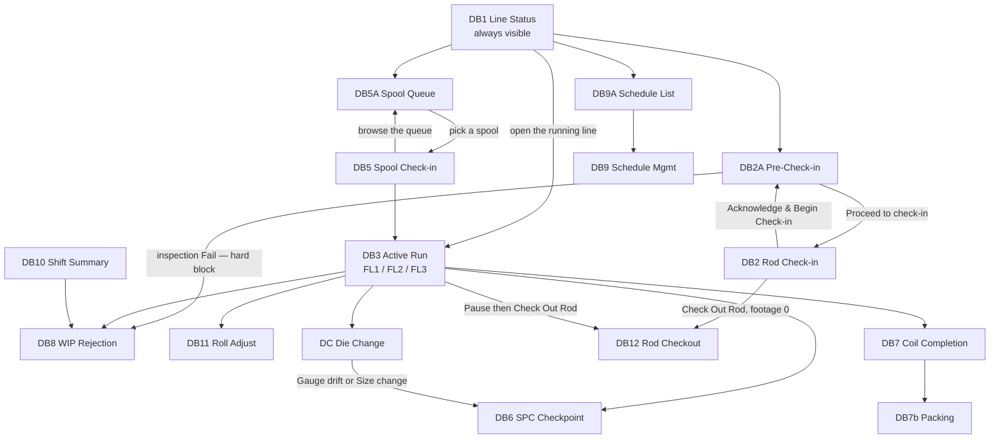

# Flat Wire Mill — Screen Plan

**Project:** United Aluminum (UAL) — Flat Wire Mill Module
**Last Updated:** August 13, 2026 — split out of `02-SRS.md`, `03-HLD-and-ERDiagram.md` in the ProjectPlan restructure. **Section numbers are unchanged**, so every `§n` citation still resolves; numbering inside this file is deliberately non-contiguous
**Document Type:** Screen inventory, navigation map, shared chrome, mockup mapping
**Status:** Baselined for build
**Owner:** Frontend (Angular) stream
**Audience:** Angular developers, QA, BA
**Shortcode:** `[SCR]`
**Part of:** `ProjectPlan/Frontend/` — index: [README.md](../README.md)

---

## 7. User interface requirements

The 27 HTML files in [`../../MVP-1/ProjectPlan/Frontend/Mockups/`](Mockups/) are the **approved visual baseline and the pixel authority**. They open directly in a browser with no build step. This section states what a developer cannot infer from §5.

---

### 7.1 Screen inventory — approved variants

| ID | Screen | File | Primary user | Trigger |
|---|---|---|---|---|
| **DB1** | Line Status Overview | `dashboard_1_line_status.html` | Supervisor / Foreman | Always visible — the floor master board |
| **DB2A** | Rod Pre-Check-in Station (FL1/FL3) | `dashboard_2a_rod_precheckin.html` | FL1 operator | Staging the next rod while the current coil runs |
| **DB2** | Rod Check-in & Pre-Run Setup | **`dashboard_2_rod_checkin.html`** | FL1 operator | Start of each rod |
| **DB2-FL3** | Rod Check-in — FL3 hybrid variant | `dashboard_2_rod_checkin_fl3.html` | FL3 operator | Start of each hybrid rod *(older layout — OI-16)* |
| **DB3** | Active Run Monitor (FL1) | `dashboard_3_active_run.html` *(the earlier left-rail layout that held this filename was withdrawn 1 Aug 2026, git history at `2a0426b`; this file was named `dashboard_3_active_run_v2.html` until 11 Aug 2026)* | FL1 operator | During every run |
| **DB3-FL2** | Active Run Monitor (FL2) | `dashboard_3_active_run_fl2.html` | FL2 operator | During every FL2 run |
| **DB3-FL3** | Active Run Monitor (FL3) | `dashboard_3_active_run_fl3.html` | FL3 operator | During every hybrid run |
| ~~**DB4**~~ | ~~Weld Event Logger~~ — **RETIRED 1 Aug 2026**, folded into DB2A's *Mark as welded* dialog | ~~`dashboard_4_weld_event.html`~~ *(deleted; git history at `2a0426b`)* | — | — |
| **DB5A** | FL2 Spool Queue | `dashboard_5a_spool_queue.html` | FL2 operator | Choosing which spool to run next *(added 2 Aug 2026)* |
| **DB5** | FL2 Spool Check-in | `dashboard_5_spool_checkin.html` | FL2 operator | Loading each spool onto the TPO |
| **DB6** | SPC Checkpoint Entry — **dialog** | `spc_checkpoint.js` *(launcher: `dashboard_6_spc_checkpoint.html`)* | Any operator | Pre-run, post-die-change, spot check |
| **DB7** | Output Coil Completion & Label | `dashboard_7_coil_completion.html` | FL2/FL3 operator | Coil complete at TKUP-2 |
| **DB7b** | Packing Station | `dashboard_7b_packing_station.html` | Packing operator | Coil arrives from a line |
| **DB8** | WIP Rejection — **dialog** | `wip_rejection.js` *(launcher: `dashboard_8_wip_rejection.html`)* | Any operator | Material fails at any stage |
| **DB9** | Pass Schedule Management | `dashboard_9_pass_schedule.html` | Ops Manager / Maintenance | Before a new product campaign |
| **DB9A** | Pass Schedule List | `dashboard_9a_schedule_list.html` | Ops Manager / Maintenance | Browsing the schedule library |
| **DB10** | Supervisor Shift Summary | `dashboard_10_shift_summary.html` | Supervisor / Shift Manager | End of shift or on demand |
| **DB11** | Roll Adjust | `dashboard_11_roll_adjust.html` | Line operator | FM2 roll-gap drift during a run |
| **DB12** | Rod Checkout (Mode A / Mode B) — **dialog** | `rod_checkout.js` *(launcher: `dashboard_12_rod_checkout.html`)* | FL1/FL3 operator | Rod removed before natural completion |
| **DC** | Die Change — **dialog** | `die_change.js` *(launcher: `dashboard_die_change.html`)* | FL1/FL3 operator | Drawing die replaced mid-run |
| **DM** | Die Management | `dashboard_die_management.html` | Maintenance | Machines App → Tooling Inventory |
| **OEE** | OEE Dashboard | `dashboard_oee.html` | Supervisor / CI engineer | On demand |
| — | Coil Spinner | `coil-spinner.html` | — | A component demo, not a screen |

**Retired / superseded — do not re-adopt:** `dashboard_2_rod_checkin - Old.html` (grid + inline-SVG progress ring, 9-step footer counter) and the interim single-page rod-scan-row layout, 8-step counter, which held the `dashboard_2_rod_checkin.html` filename until 11 Aug 2026. Both are **retired** and both were **deleted from the repository 11 Aug 2026** (recoverable at `d79ce78`); the approved wizard took the plain filename the same day, so **that name no longer refers to a retired screen**; two implementation documents in this repository still point at them (see §9.4).

---

### 7.2 Navigation map

The shared topbar's **More Options** tile popup reaches Pass Schedule, WIP Rejection, Rod Pre-Check-in, Rod Checkout and Shift Summary from **any** screen.

---

### 7.3 Shared chrome

| Asset | Role | Constraint |
|---|---|---|
| `flat-wire-topbar.js` | Injects the application bar (logo, environment/greeting strip, multi-operator chips with switch-operator dialog, Help · Refresh · Login · Switch · Logout) and the More Options tile popup | Include once before `</body>`; needs the shared stylesheet and `mainlogo.gif` in the same folder. **25 of 27 screens include it.** The two that do not are `coil-spinner.html` and **`dashboard_2_rod_checkin.html`, which inlines its own app bar** — so **clone Dashboard 12's skeleton, not Dashboard 2's**, when starting a new screen |
| `pause_run.js` | The shared Pause/Resume dialogs for the FL1/FL2/FL3 active-run screens | Expects element IDs `pause-btn`, `pause-timer-badge`, `pause-elapsed` and `.line-badge`; takes its run from a context object, falling back to the host's `fwRunCtx()`. Redesigned 1 Aug 2026 — reason cards in category columns, reason **codes** not labels, four resume outcomes, and every hand-off a dialog |
| `rod_checkout.js` | The Rod Checkout dialog (DB12, Modes A and B) | The caller states the mode; Mode B is opened by the pause dialog's `CheckOutRod` outcome with the frozen footage carried over |
| `spool_notification.js` | The shared spool-progress component — Part A milestone card + docked pill, Part B PLC-stop modal | Keeps the host screen's `#fw-spool-lb` / `#fw-spool-target` readout in step so screen and notification never disagree |
| `flat-wire-fit.js` | Scales a screen to the browser window so all of it is visible without fullscreen and without a scrollbar | Include **after** `flat-wire-topbar.js` (the topbar injects on `DOMContentLoaded` and changes content height). Transforms `<body>`, not `.dashboard`, so body-level overlays scale too. **Never scales above 1:1.** **26 of 27 files use `data-fit="fill"`**. Design height is **measured, not assumed** |

---

### 5.6 Mockup → component mapping

The mockups are the pixel authority. Two mechanical rules carry over from them into the Angular build:

1. **Clone Dashboard 12's skeleton, not Dashboard 2's**, when starting a new screen — DB2's `dashboard_2_rod_checkin.html` inlines its own app bar and omits `flat-wire-topbar.js`.
2. **Consume `flat-wire-shopfloor.styles.scss` as-is.** There is no token migration; the `--fw-*` prefix in older documents is stale (gap **G18**). Angular components need `ViewEncapsulation.None` or `:host` scoping so the tokens resolve.

---

---

## Appendix B — Dashboard → phase map

| Dashboard | Phase | Scope |
|---|---|---|
| 1 Line Status Overview | 3 | MVP-1 |
| 2 Rod Check-in (FL1/FL3) | 4 | MVP-1 |
| 2A Rod Pre-Check-in | 4 | MVP-1 |
| 3 Active Run Monitor (FL1/FL3) | 5 | MVP-1 |
| 3 (FL2 variant) | 8 | MVP-1 |
| ~~4 Weld Event~~ | ~~6~~ | **RETIRED 1 Aug 2026** — the mockup was deleted (git history at `2a0426b`) and weld capture moved to Dashboard 2A's dialog. `FW-063` still delivers the weld event; it has no screen of its own. Two things did not move — see **G27** |
| 5A FL2 Spool Queue | 8 | MVP-1 |
| 5 FL2 Spool Check-in | 8 | MVP-1 |
| 6 SPC Checkpoint | 4 (pre-run), 6 | MVP-1 |
| 7 Output Coil Completion / 7b Packing | 9 | MVP-1 — **returned 11 Aug 2026**; Phase 9 is wholly MVP-1 |
| 8 WIP Rejection | 7 | MVP-1 |
| ~~9 / 9A Pass Schedule Mgmt / List~~ | 2 | **MVP-2** |
| ~~10 Shift Summary~~ | 11 | **MVP-2** |
| 11 Roll Adjust | 6 (FL1/FL2), 10 (FL3) | MVP-1 |
| 12 Rod Checkout (A/B) | 7 | MVP-1 |
| DC Die Change | 6 | MVP-1 |
| ~~Die Management~~ | ~~13~~ | **MVP-2** — split from `DieChangeAndManagement.md` §4 on 11 Aug 2026. **Phase 13 is not cut**; it keeps its other reference-data work |

> **DB13 (HMI Line Schematic) and DB14 (SCADA Multi-Trend), 5 units each, were removed from this table on Aug 4 2026** — descoped at client request along with the Machine View tab. They were **descope-ladder rung 7** (67 h joint); the rung is gone, not merely un-recovered, so Phase 5 drops from 221 h to ~154 h and the ladder's cumulative-recovery column is re-derived in [`CapacityAndEffortModel.md`](../Development/CapacityAndEffortModel.md).
