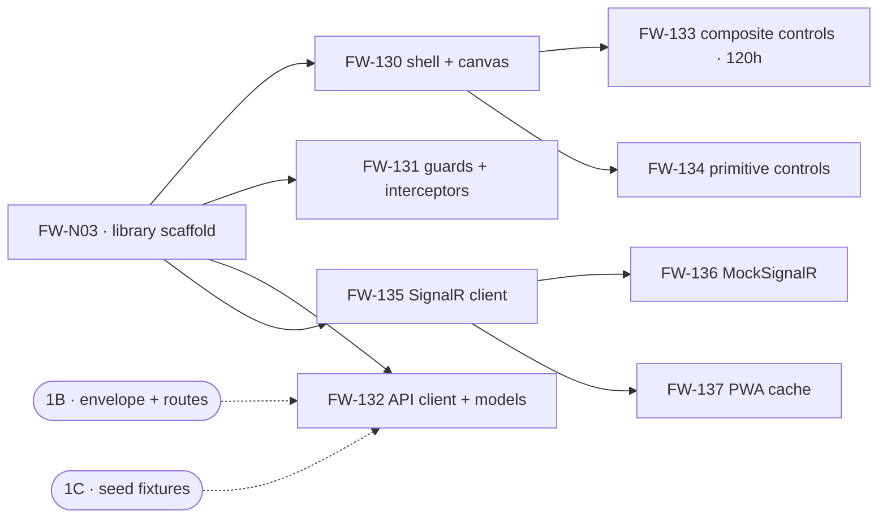

# Phase 1A — Execution Orchestration (Frontend)

**Project:** United Aluminum (UAL) — Flat Wire Mill Module
**Last Updated:** August 27, 2026 — **first issue.** The FE stream had a layer spec, a screen inventory, a component catalogue and 49 backlog rows, and **nothing that said what can start, in what order, and what is stopping it**. This is the FE counterpart to [`Backend/TaskBreakdownPlans/Orchestration.md`](../../Backend/TaskBreakdownPlans/Orchestration.md), on the same axis — dependency wave, not sprint. ⛔ **Its headline is a measurement, not a plan: nothing in this stream is built.** `flat-wire-shopfloor` exists in **no** Angular checkout — verified 27 Aug 2026 against `c:\UAL\ual-angular`, `c:\UAL\Second-Branch\ual-angular` and `c:\UAL\ual-angular-latest`, none of which has the library under `projects/` — so **wave 0 has not started** and the 160 h critical path is still its full length. ⛔ **Three seed fixtures the mock service is told to mirror do not exist** (§8.1 finding 1): `[CMP §5.3]` and `phase-01a`'s *Dependencies* both name `SP-00021`, `RUN-0042` and `RUN-0043`; measured against `FlatWire_SampleData_*.sql`, the seeds create `SP-00031`–`SP-00033` and `RUN-0001`–`RUN-0005`, and `SP-00021` occurs only inside a comment. ⚠ **`[SCR §7.1]`'s "27 HTML files" is stale** — the folder holds **18**, 23 across both scopes (§8.1 finding 2). ⚠ **`FW-061`, Critical MVP-1, depends on `FW-010`, which is wholly MVP-2** (§8.1 finding 4), and **DB2's rod scan has no endpoint** since `P-53` withdrew `RodReceivingController` (§8.1 finding 5).
**Document Type:** Execution index and dependency graph for the Phase-1A implementation and the FE stream downstream of it
**Status:** Active — **the entry point for this folder**
**Owner:** Frontend (Angular)
**Audience:** The delivery lead sequencing the FE stream, and any developer picking up a screen
**Shortcode:** — *(orchestration, derived from the specifications and the backlog; **not citable as a requirement**)*
**Part of:** `ProjectPlan/Frontend/TaskBreakdownPlans/` — folder index: this file

---

> ### ⚠ This folder holds no per-story plans. Read this before looking for one.
>
> The Backend sibling indexes **35 plans** — one file per story, each saying *how* to build it.
> **There is no FE equivalent, and every row below therefore names its owning specification
> instead of a plan.** That is not an oversight and it is not new: it is the convention
> [`TrialOrchestration.md §1`](../../Backend/TaskBreakdownPlans/TrialOrchestration.md) already
> uses — *"FE and DB rows name the owning document instead of a plan"* — because that folder is
> Backend-scoped. This file makes the same map on the FE stream's own axis.
>
> **When a per-story FE plan is written it lands here and its row starts naming it.** Until
> then, the owning document is the build order, and where this file and an owning document
> disagree, **the owning document wins**.

---

> **What this file is.** It says **what can start, in what order, and what is stopping it.**
> It holds **no build detail** — every statement here resolves to a specification, and this
> file loses to all of them.
>
> **The one thing to read first:** the Phase-1A critical path is **160 h** — `FW-N03` →
> `FW-130` → `FW-133` — and **`FW-133` is 120 h of it.** Three quarters of the path is one
> story, and unlike 1B's path, nothing on it is blocked. The constraint is not a decision
> anyone owes; it is that **one story gates every screen in the programme**. See §3.
>
> **Building the 30 Sep trial rather than MVP-1?**
> [TrialOrchestration.md](../../Backend/TaskBreakdownPlans/TrialOrchestration.md) sequences all
> 66 trial stories by sprint, including this stream's 20. It answers *what ships on 30 Sep*;
> this file answers *what can start*.

---

## 1. Status board

**49 stories carry FE hours** — Phase 1A's six (§1.1), three Phase-1A stories labelled `RT`
that are Angular code (§1.2), two trial-scope additions (§1.3), and **38 downstream across
Phases 3–14** (§1.4). Hours are `[TB §7]`'s, **quoted not restated**.

> **§1.1–§1.3 are Phase 1A and are what §2–§6 sequence.** §1.4's downstream stories sit in
> later phases and are ordered by sprint in
> [TrialOrchestration.md](../../Backend/TaskBreakdownPlans/TrialOrchestration.md) and `[TB §7.2]`,
> not by wave here.

### 1.1 Phase 1A — FE 224 h

| Story | Subject | h | Wave | Owning document | Status |
|---|---|---|---|---|---|
| `FW-N03` | Angular library scaffold, routing, configuration | 24 | **0** | [`[CMP §5.1]`](../Components.md) · [`phase-01a`](../../Development/Phases/phase-01a-angular-foundation.md) | ⛔ **Not started — the library exists in no checkout.** The single root; nothing else starts |
| `FW-130` | Shell layout and the 1280×1024 canvas | 16 | 1 | [`[CMP §7.4]`](../Components.md) · [`[VAL §7.5]`](../ValidationRules.md) | ⛔ Not started · ⚠ **`G23`** — the canvas is an unconfirmed acceptance criterion |
| `FW-131` | Route guards, interceptors, error envelope | 12 | 1 | [`[SEC §8]`](../../Architecture/Security.md) · [`[API §1.2]`](../../Backend/APIs.md) | ⛔ Not started · ⚠ **`G6` residual** — builds, cannot be verified (§5) |
| `FW-132` | DI-swappable API client and domain models | 20 | 1 | [`[CMP §5.3]`](../Components.md) · [`[API §7]`](../../Backend/APIs.md) | ⛔ Not started · ⛔ **its fixture list names three alphas the seeds never create** (§8.1) · ⚠ `G14` · **owes `TC-020`'s third leg** (`G56`, `P-84`) |
| **`FW-133`** | **Shared composite controls** | **120** | 2 | [`[CMP §7.6]`](../Components.md) · [`../Mockups/`](../Mockups/) | ⛔ Not started · 🔴 **the critical path** — 45 % of the layer, every screen depends on it, `[TRP]`: *"not trimmable"* |
| `FW-134` | Shared primitive controls and `alert-banner` | 32 | 2 | [`[CMP §7.6]`](../Components.md) | ⛔ Not started |

### 1.2 Phase 1A — RT 44 h, and all of it is Angular

⚠ **These three carry the `RT` stream label and are `ual-angular` code.** The label says *when*
the work happens, not which repository it lands in — recorded at
[`TrialOrchestration.md §1.2`](../../Backend/TaskBreakdownPlans/TrialOrchestration.md), which is
why the Backend folder deliberately does not plan them.

| Story | Subject | h | Wave | Owning document | Status |
|---|---|---|---|---|---|
| `FW-135` | `flat-wire-signalr.service.ts` — MessagePack, NgZone, ring buffer | 24 | 1 | [`[SIG §4]`](../../Architecture/SignalR.md) | ⛔ Not started · ⚠ **`G10`** — MessagePack is a new client dependency and `[SIG]` treats it as measure-first |
| `FW-136` | `MockSignalRService` and the typed event set | 12 | 2 | [`[SIG §5.2]`](../../Architecture/SignalR.md) | ⛔ Not started · **twelve events + six markers**, matching `IFlatWireClient` name for name |
| `FW-137` | PWA cache sync and the reconnect banner | 8 | 2 | [`[SIG §4]`](../../Architecture/SignalR.md) | ⛔ Not started |

### 1.3 Trial scope — additive to `[CE §3b]`, offsets nothing

| Story | Subject | h | Owning document | Status |
|---|---|---|---|---|
| `FW-204` | Minimal landing route — the entry point while DB1 is out of trial scope | 8 | [`[SCR §7.2]`](../ScreenPlan.md) | ⛔ Not started · **retires when `FW-060` ships** |
| `FW-214` | Simulator control console — screen `DB-S1` | 24 | [`[SIM §9]`](../../Architecture/MachineSimulator.md) · [`../Mockups/simulator_console.html`](../Mockups/simulator_console.html) | ⛔ Not started · ⚠ **not one of the fifteen dashboards** (`[SCR §7.1]`); ships with controls **greyed** until `FW-218` |

### 1.4 Downstream — 38 FE stories, Phases 3–14

Ordered by phase, not by wave. **Every one of them is downstream of `FW-133`, `FW-134` or
both**, directly or through a screen that is.

| Phase | Stories (h) | Owning specification |
|---|---|---|
| **3** | `FW-060` 44 · `FW-153` 20 | [`LineStatusOverview.md`](../../Business/Screens/LineStatusOverview.md) (DB1) |
| **4** | `FW-061` 36 · `FW-N01` 24 · `FW-209` 4 · `FW-226` FE 6 · `FW-227` FE 10 | [`RocCheckin.md`](../../Business/Screens/RocCheckin.md) (DB2) · [`RodPreCheckin.md`](../../Business/Screens/RodPreCheckin.md) (DB2A) |
| **5** | `FW-062` 32 · `FW-162` 20 · `FW-163` 20 · `FW-081` FE 4 | [`ActiveRunMonitor.md`](../../Business/Screens/ActiveRunMonitor.md) (DB3) |
| **6** | `FW-063` 20 · `FW-073` 24 · `FW-065` 24 · `FW-070` 28 · `FW-071` 24 | [`WeldEvent.md`](../../Business/Screens/WeldEvent.md) · [`DieChangeAndManagement.md`](../../Business/Screens/DieChangeAndManagement.md) · [`SPCCheckpoint.md`](../../Business/Screens/SPCCheckpoint.md) · [`RollAdjust.md`](../../Business/Screens/RollAdjust.md) (DB11) |
| **7** | `FW-067` 20 · `FW-072` 24 · `FW-173` 20 | [`WipRejection.md`](../../Business/Screens/WipRejection.md) (DB8) · [`RodCheckout.md`](../../Business/Screens/RodCheckout.md) (DB12) · [`PartialRodReCheckin.md`](../../Business/PartialRodReCheckin.md) *(rationale only — the rules are `RodPreCheckin.md` §7 / `RodCheckout.md` §7.2)* |
| **8** | `FW-124` 24 · `FW-064` 16 · `FW-178` 8 | [`SpoolQueue.md`](../../Business/Screens/SpoolQueue.md) (DB5A) · [`RocCheckin.md`](../../Business/Screens/RocCheckin.md) §4.3 (DB5) |
| **5/8 boundary** | `FW-202` FE 32 | [`SpoolCompletionNotification.md`](../../Business/Screens/SpoolCompletionNotification.md) · ⚠ **must land before Phase 8 *starts***, not beside it |
| **9** | `FW-066` 24 · `FW-182` 24 · `FW-183` 40 · `FW-184` 16 | [`OutputCoilCompletion.md`](../../Business/Screens/OutputCoilCompletion.md) — **v1.1 owns DB7 and DB7b together** |
| **10** | `FW-189` 12 | FL3 variants of DB2 and DB3 |
| **11** | `FW-091` 8 · `FW-092` 8 · `FW-093` 8 · `FW-094` 8 · `FW-095` 8 | reports — ⚠ **four of the five are descope-ladder rung 6** |
| **12** | `FW-100` FE 24 · `FW-102` FE 12 · `FW-110` FE 8 | ⚠ `FW-110` is **rung 1 — the first thing off the plan** |
| **13** | `FW-194` 20 · `FW-054` 12 · `FW-003` 12 · `FW-195` 12 | `Analysis/FlatWireShopfloorDashboards.md` *"Alloy Reference Data"* (MVP-1 reference data) |
| **14** | `FW-201` FE 16 | [`[UAT]`](../../Testing/UATPlan.md) |

> ⚠ **Five screens in `[SCR §7.1]`'s inventory are MVP-2 and have no story here** — DB9, DB9A,
> DB10, Die Management and OEE. Their mockups live in [`MVP-2/Mockups/`](../../../../MVP-2/Mockups/),
> **not** in [`../Mockups/`](../Mockups/). Do not build them, and do not read their presence in
> the inventory as scope.

---

## 2. Dependency graph

> **This graph is Phase-1A-scoped by design.** It shows §1.1–§1.2's nine stories and the two
> convergence edges that leave the layer. **§1.3's and §1.4's are deliberately absent** —
> merging a wave axis and a sprint axis into one diagram is how a map stops being readable.



**Waves** — level = 1 + the deepest dependency:

| Wave | Stories | Note |
|---|---|---|
| **0** | `FW-N03` | The single root. **Nothing else starts.** |
| **1** | `FW-130` `FW-131` `FW-132` `FW-135` | Four unlock at once |
| **2** | `FW-133` `FW-134` `FW-136` `FW-137` | ⚠ **`FW-133` is 120 h of this wave's 172** |

> **Two dashed edges leave the layer, and neither blocks.** `phase-01a`: *"This layer is not
> blocked by 1B/1C because it develops against the **mock** API + **mock** SignalR
> (`useMockData: true`)."* The convergence is on **shape**, not availability — and there are
> exactly two things to settle with 1B rather than assume: the flag is **`useMockData`** on
> both sides (`[API §7.1]`), and the **JSON naming policy** reconciling this library's
> `{success,data,errors}` against 1B's C# `{Data,Success,Errors}` is **1B's to configure**.
> ✅ **The second is now answered by the built service** — `FW-138` verified the envelope on
> the wire as `data` · `success` · `errors` · `errorCode`, **camelCase** (`P-06`, `P-56`).

---

## 3. The critical path — 160 h, and one story is 120 of it

```
FW-N03 (24) → FW-130 (16) → FW-133 (120)
                                  45 % of the layer; every screen depends on it
```

**160 h**, against the 60 h of the longest RT chain (`FW-N03 → FW-135 → FW-136`). Three
consequences, and the second is the one that decides staffing:

1. **Nothing on this path is blocked.** Unlike 1B, where the path's second node spent a fortnight
   waiting on `G6`, every 1A node is buildable today. `G23` shadows `FW-130` but does not stop
   it — see §5, where it is filed as *rework risk*, not a blocker.
2. **`FW-133` is not trimmable, but it is divisible — and those are different claims.**
   `[TRP §1.4]` says *"It is not trimmable"*, meaning **no control can be cut**; it does not say
   one developer must build all six. `pass-schedule-table`, `confirm-bar`, `gauge-trace-chart`,
   `tab-wizard`, `action-bar` and `payoff-weight-bar` are independent of one another and share
   only `FW-130`'s tokens. ⚠ **`gauge-trace-chart` is the one to start first** — it is the only
   member with a live-streaming contract behind it (`FW-081`, `[SIG §5.6]`) and the only one
   whose `isLive` input must be **runtime-switchable, not mount-time**, which Phase 8's FL2
   Live/Profile control and a hybrid FL3 run both require.
3. **FE compresses better than any other stream, and that cuts both ways.** `[TRP §1.4]` prices
   FE retention at **0.62** against RT's 0.75–0.90 — the most AI-assisted leverage in the
   programme sits on this path. It is also the stream `[DE §4.3]` warns *"is not the constraint"*,
   so compressing 1A does not shorten the programme; it only stops 1A from being the thing that
   holds up eleven phases of screens.

> *The 160 h is derived here for sequencing only. It re-states no published total and changes
> no figure in `[CE]`, `[DE]`, `[SSP]`, `[TRP]` or `[TB §7]`.*

---

## 4. Decision gates — and where each decision actually lives

⚠ **This file mints no decision ids, deliberately.** The `P-##` series belongs to
[`Backend/TaskBreakdownPlans/`](../../Backend/TaskBreakdownPlans/) and is continuous across that
folder; a second series here would collide in citation, which is the failure the `[GAP]`/`G##`
and `[SIG]`/`[RT]` shortcode rules already guard against. **FE decisions resolve in the registers
that own them**, and this table is the index.

| Decision | Blocks | Where it is decided |
|---|---|---|
| **`G23`** 🔴 | `FW-130` → **every screen** | **Nobody has confirmed the 1280×1024 canvas.** 1920×1080 is *"a re-layout of every screen, not a rescale"*, and it **gets more expensive every sprint**. `[GAP]` `G23` · `[VAL §7.5]` · `[TRP §6]` dates it **before T1 closes** |
| **`D-06`** | `FW-133`, `FW-134`, every screen | **There is no Angular structural or UI template.** `checkin-precheckin`, `shop-floor*`, `common-grid`, `wip-rejection` and `slitter-*` are **not** to be copied; the only reuse is `shared`'s foundational services, and joining `build:shop-floor` is **build ordering only**. `[ARC §2.2]` calls these *"the rules most likely to be broken by a developer working from habit"* — **settled, and the one most likely to be broken anyway** |
| **`D-08`** | `FW-061` | **Dashboard 2 is the six-step tab wizard**, `dashboard_2_rod_checkin.html`. The grid + progress-ring `- Old.html` is retired and was deleted 11 Aug 2026 — **the plain filename no longer refers to a retired screen**. `[ARC §13.1]` `D-08` |
| **`G18`** | — | ⚠ **A trap, not a gate.** The `--fw-*` prefix is **retired and there is nothing to migrate** — no mockup and no stylesheet uses it. Consume `--color-*` as-is. If it resurfaces from an older commit it is wrong. `[CMP §7.4]` |
| **`P-58`** / **`P-83`** | `FW-132` | **Fourteen canonical enums, mirrored in all three layers, and `LineId` is never narrowed** — line eligibility is a per-endpoint *shape* rule, so no screen gets an FL2 refusal free from enum membership. Settled in [`FW-147`](../../Backend/TaskBreakdownPlans/FW-147-FluentValidation-Value-Objects-And-Enums.md); the TypeScript leg is **owed by `FW-132`** (`G56`) |
| **`P-53`** 🔴 / **`P-54`** | `FW-061`, `FW-N01` | **The service hosts no rod-receiving surface**, so **DB2's rod scan has no endpoint** — `GET /rod/{alpha}` was *"everything staging and check-in need in one round trip"*. `[API]`'s call, not a plan's. [`FW-138 §8.1`](../../Backend/TaskBreakdownPlans/FW-138-Fifteen-Thin-Controllers.md) |
| **`OI-05`** | `FW-061`, `FW-064` | ⚠ **`Bevel edge` must not be offered or accepted** — a live *fourth* edge vocabulary on the DB9/9A Generate modal with no domain value behind it. `EdgeType` is `Round`/`Square`, displayed *"Round Edge"* / *"Flat Edge"* through **one** pipe (`[API §2.1]`) |

---

## 5. Blocker calendar

| By | Blocker | Stops | Owning document |
|---|---|---|---|
| **Before T1 closes** | 🔴 **`G23`** — the 1280×1024 canvas is unconfirmed | ⚠ **Rework risk, not a build stop.** Every mockup is authored to it and every screen inherits it; 1920×1080 is a re-layout of all of them. **The cost rises every sprint** | [`[GAP]` `G23`](../../Development/GapsRegister.md) · `[TRP §6]` |
| **Before QA0** *(not before the build)* | **`G6` residual** — the six role claim **values** are coded, not `[SEC §8]`'s labels | ⚠ **Verification, not construction.** `FlatWireRoleGuard` builds against a constants class; the matrix walk cannot pass until the mapping lands. **Bind to one constants class, as `FW-145` does server-side** | `[SEC §8]` · [`FW-145 §5`](../../Backend/TaskBreakdownPlans/FW-145-JWT-And-Role-Policies.md) |
| **Before T2** | **`G10`** — IIS WebSockets on the target, and MessagePack as a new client dependency | Transport **silently** falls back to long-poll. **A provisioning task, not a build one**; `[SIG]` treats the package as measure-first | [`FW-080`](../../Backend/TaskBreakdownPlans/FW-080-FlatWireHub.md) · `[DEP §4.4]` |
| **Before Phase 4** | **`G14`** — 3- vs 4-item inspection · `R#####` vs `ROD-#####` · `FootageFt` INT vs DECIMAL | ⚠ **`FW-132` bakes whichever it picks into the models every screen binds to.** The alpha-format half is ✅ **closed and verified** server-side — `Program.cs` requires `RodAlpha("ROD-00041")` to throw at boot — so **`R#####` is settled**; the inspection-count and footage-type halves are not | [`[GAP]` `G14`](../../Development/GapsRegister.md) |
| **Before Phase 4** | **`OI-109`** return-to-DB2A pending client confirmation · **`Q3`** · **`Q14`** · ⛔ **`Q22`** | `FW-061`. **`Q22` is the hard one** — the four tolerance values are **owed by e-mail and nothing is seeded**, so `CHK007` cannot be exercised at either station | [`RocCheckin.md`](../../Business/Screens/RocCheckin.md) |
| **Before Phase 8** | **`Q18`** — which order field carries the coil min–max weight range | Surfaced by `FW-163`'s `info-grid`; **blocks the FL2 DB3 variant** (`FW-178`) and `FW-202` | [`ActiveRunMonitor.md`](../../Business/Screens/ActiveRunMonitor.md) |
| **Before Phase 9** | ⛔ **`Q10` / `OI-45`** — the footage→weight **dimensional basis** | `FW-066`, `FW-183`, `FW-100` and `FW-202`. ⚠ **The one open question deliberately carrying no recommendation** — UA must answer it from its own practice — and the most widely depended-on number in the build. `[CE §2]` holds a **16–32 h reserve** against it | [`FlatWireOpenQuestions.md`](../../../../Analysis/FlatWireOpenQuestions.md) `Q10` |
| **Before Phase 9** | **`OI-104`** no skid table · **`OI-105`** three weight figures with no precedence rule · **`OI-106`** no staging locations | `FW-182` (DB7b Packing). **All three are `G36`** — returning Phase 9 to MVP-1 imported three uncosted dependencies, every one of them on the packing side | [`OutputCoilCompletion.md`](../../Business/Screens/OutputCoilCompletion.md) |
| **Before Phase 11** | **`OI-101`** — shift boundaries are undefined | ⚠ Blocks **every shift-scoped figure**, including `FW-090`'s reporting views. *(DB10 itself is MVP-2.)* | master spec §11 |
| No date | **`G9` / `OI-34`** — real-time NFRs undefined | **Blocks validation, not build** — `MockSignalRService` has no target cadence to match and there is no client-count budget | `[SIG]` · [`FW-150`](../../Backend/TaskBreakdownPlans/FW-150-Broadcast-Loop.md) |
| No date | **`G27`** / **`G28`** — the weld screen's rod queue and traceability chain lost their host; **FL2 may have no way to record a weld at all** | `FW-063`. DB4 was retired 1 Aug 2026 into DB2A's *Mark as welded* dialog, and **two things did not move with it** | [`WeldEvent.md`](../../Business/Screens/WeldEvent.md) |

---

## 6. Exit criteria → owning documents

`phase-01a`'s five. **The layer is not done until each maps to a signed-off owner.**

| # | Criterion | Owner |
|---|---|---|
| 1 | `flat-wire-shopfloor` builds, lints, reachable at `/flat-wire` behind `FlatWireAuthGuard` | `FW-N03` · `FW-131` — [`[CMP §5.1]`](../Components.md), [`[CMP §5.2]`](../Components.md) |
| 2 | Shell renders on the 1280×1024 canvas in light **and** dark; **all `--color-*` tokens resolve, no `--fw-*` anywhere** | `FW-130` — [`[CMP §7.4]`](../Components.md) · ⚠ gated by **`G23`** |
| 3 | DI swaps real↔mock by `useMockData`; **mock returns the seed fixtures** through the `{success,data,errors}` envelope | `FW-132` — [`[API §7.1]`](../../Backend/APIs.md) · ⛔ **cannot be met as written**: three of the named fixtures do not exist (§8.1) |
| 4 | `MockSignalRService` drives a `gauge-trace-chart` live — rAF-throttled, OnPush, reconnect + group re-join simulated | `FW-133` · `FW-135` · `FW-136` — [`[SIG §5.6]`](../../Architecture/SignalR.md) |
| 5 | Jest smoke suite green | `FW-N03`…`FW-137` — ⚠ **it exercises the mock path only** (§8.1 finding 6) |

---

## 7. Two tracks — know which you are building

| | **MVP-1** | **Trial (30 Sep)** |
|---|---|---|
| `FW-133` | **120 h** — all six composite controls | **75 h** ([`TrialOrchestration §2`](../../Backend/TaskBreakdownPlans/TrialOrchestration.md)) |
| Screens | 15 dashboards | **6** |
| Landing route | DB1 (`FW-060`) | `FW-204`, until `FW-060` ships |
| Deferred FE | — | **DB1, DB2A + weld, die change, roll adjust, rod checkout, DB5A** — part of `[TRP]`'s 330 h |
| Hours basis | `[TB §7]` hand-coded | `[TRP §1.4]` AI-assisted, **0.62 FE retention** |

⚠ **The standing rule for a deferred feature is *grey the control and state "not in trial
scope"*, never delete it** (`[TRP §7]`). Deleting is rework when the feature returns.

⚠ **`[TRP]`: *"never mix a `[DE §2]` stream cell with a `[SSP §5]` one."*** The two models
re-derive on their own retention factors.

---

## 8. What this file does not cover

> **The scope, stated once.** This file sequences **Phase 1A** and maps **the FE stream
> downstream of it**. It plans no backend or database work — those are
> [`Backend/TaskBreakdownPlans/Orchestration.md`](../../Backend/TaskBreakdownPlans/Orchestration.md)
> and [`Database/TaskBreakdownPlans/Orchestration.md`](../../Database/TaskBreakdownPlans/Orchestration.md)
> — and it contains **no Angular code and no component design**. That is `[CMP]`'s and the
> mockups'.
>
> ⚠ **Silence is not coverage.** The exclusions are named, because a boundary that is only
> implied gets read as completeness.

| Item | Why |
|---|---|
| DB9 · DB9A · DB10 · Die Management · OEE | **MVP-2.** Mockups at [`MVP-2/Mockups/`](../../../../MVP-2/Mockups/); do not plan, estimate or implement them |
| `FW-210` `FW-212` `FW-213` `FW-215` `FW-217` | Simulator set — unscheduled and additive. Only `FW-214`'s console is FE, and only in trial scope |
| The `[ARC §2.2]` reference rules | **Binding, and `[ARC]`'s.** Summarised as `D-06` in §4 and not restated |
| Pixel-level design | The mockups are **the pixel authority**. This file names which one owns a screen and stops there |

### 8.1 Six findings raised and deliberately not fixed

All six are other documents' to correct, so they are recorded here rather than edited:

1. ⛔ **Three seed fixtures in the mock-service instruction do not exist.** `[CMP §5.3]` and
   `phase-01a`'s *Dependencies* both tell `FW-132` to mirror `SP-00021`, `RUN-0042` and
   `RUN-0043`. **Measured against `Database/Schema/SQL/FlatWire_SampleData_*.sql` on
   27 Aug 2026:** the spool alphas are **`SP-00031`–`SP-00033`**, the run alphas
   **`RUN-0001`–`RUN-0005`**, and **`SP-00021` occurs only inside a comment** in the lookup
   seed. `R00041`–`R00043` and `PS-1100-FL1-003` are correct. `[DEP §4.2]`'s checklist was
   corrected on 26 Aug 2026 for exactly this; **`[CMP]` and `phase-01a` were not.** ⚠ The irony
   is load-bearing: `[CMP §5.3]` warns *"Older implementation documents use inconsistent
   fixtures — do not follow them"* while carrying three wrong alphas itself. **Exit criterion 3
   cannot be met as written.**
2. **`[SCR §7.1]`'s "27 HTML files" is stale — the folder holds 18.** Twenty-three across both
   scopes (18 here + 5 in `MVP-2/Mockups/`). §7.3's *"25 of 27 screens include it"* and
   *"26 of 27 files use `data-fit=fill`"* rest on the same figure. ⚠ **The named exceptions are
   right and only the denominators are wrong** — measured today, **16 of 18** include
   `flat-wire-topbar.js` (all but `coil-spinner.html` and `dashboard_2_rod_checkin.html`, which
   inlines its own app bar) and **17 of 18** use `data-fit="fill"` (all but `coil-spinner.html`).
   So *"clone Dashboard 12's skeleton, not Dashboard 2's"* still holds exactly as written.
3. **A fourth RT-labelled story is Angular, and `TrialOrchestration §1.2` names only three.**
   `FW-081`'s **RT 24 h** is *"RT live wiring across 6 event streams"* — ring buffer,
   `requestAnimationFrame`, outside NgZone — by its own rate-card basis, which is
   `ual-angular` code. The Angular repository therefore receives **at least four** RT-labelled
   stories, not three. Reported, not renamed: the stream label drives `[DE §2]`'s retention
   factors and relabelling would move published hours.
4. **`FW-061` is Critical MVP-1 and depends on `FW-010`, which is wholly MVP-2.** DB2 rod
   check-in *acknowledges a pass schedule*, and pass-schedule authoring left with Phase 2.
   MVP-1 only **reads** a schedule — but no phase file or plan says what `FW-061` binds to when
   nothing in MVP-1 authors one in production (`OI-110`). `[TB §7]`'s card carries the
   dependency and nothing resolves it.
5. **DB2's rod scan has no endpoint.** `P-53` withdrew `RodReceivingController` on 25 Aug 2026;
   `GET /rod/{alpha}` was *"everything staging and check-in need in one round trip"*
   (`[API §4.3]`). `FW-061` and `FW-N01` both read it, and with it go the carry-forward gate
   (`FR-043` needs `footageRunToDate`) and station switching (`Q24` needs `scheduledLineId`).
   Three options are in `P-54`; **it is `[API]`'s call and it lands on this stream.**
6. **1A's stated verification exercises the mock path only.** `phase-01a`'s *Testing* section
   lists guards, `flat-wire-api-mock.service`, `line-context`/`run-state` and
   `MockSignalRService` — **`flat-wire-api-real.service.ts` appears in no criterion.** With
   `[TS §1.2]` having withdrawn the backend's automated tests, the first thing that exercises
   the real client end to end is the QA0 walkthrough, which is a **backend** checklist
   ([`FW-138 §6.1`](../../Backend/TaskBreakdownPlans/FW-138-Fifteen-Thin-Controllers.md),
   `reviewer: TBD`). **No document names an FE reviewer for it.**

---

## 9. Keeping this file true

- **An owning document changes → check §1's status and §5's calendar.** Nothing else here
  restates owned content, so nothing else drifts.
- **A blocker closes → strike it from §5** and update the owning document's open-items table.
- **Never add build detail here.** It belongs in `[CMP]`, `[SCR]`, `[VAL]` or the screen
  specification — **two homes is how the six PLC tag copies happened.**
- **Never restate an hour figure.** §1 quotes `[TB §7]`; §3's 160 h is derived for sequencing
  and is not a published total.
- **Never mint a `P-##` here.** That series is the Backend folder's and is continuous across it
  (§4).
- **A per-story FE plan gets written → its §1 row names the plan instead of the owning
  document**, and the plan then wins over this file exactly as the Backend plans do.
- Per repository convention, changes go in [`CHANGELOG.md`](../../../../CHANGELOG.md) — **do
  not add a change log to this file.**
